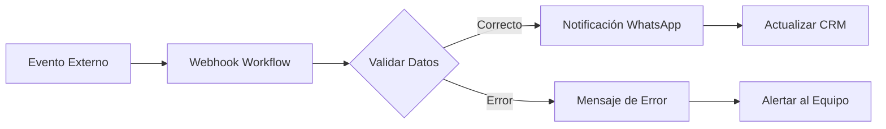

<Update title="Actualización de precios y comparativa" date="7 febrero 2026" />


> **Resumen ejecutivo:** ChatRace comienza en $499/mes con un límite de 100,000 contactos, incluso para un uso estable. E-SMART360 comienza desde $15/mes, ofrece contactos ilimitados y cuentas de negocio ilimitadas, y cobra solo según el volumen de mensajes. También proporciona flujos de trabajo webhook avanzados, automatizaciones de comercio electrónico y funciones de inteligencia artificial, lo que la convierte en una opción más flexible y rentable para negocios de marca blanca.

Elegir una **plataforma de chatbot de marca blanca** es una de las decisiones comerciales más importantes que tomará una agencia. No se trata solo de las funciones visibles: hay factores subyacentes como la estructura de precios, los límites de contactos, la escalabilidad de la infraestructura y la flexibilidad de automatización que determinan si una plataforma será rentable a largo plazo o se convertirá en un lastre financiero.

Más allá de las funciones, las agencias deben evaluar cuidadosamente la **estabilidad de la plataforma, la estructura de precios, los límites de contactos y la escalabilidad** porque estos factores impactan directamente en los márgenes de ganancia y la confianza de los clientes.

Tanto ChatRace como E-SMART360 son plataformas de chatbot capaces y listas para producción, utilizadas por agencias en todo el mundo. Sin embargo, siguen **enfoques muy diferentes** en cuanto al diseño de infraestructura, modelos de precios y la forma en que las agencias escalan su negocio.

Este artículo proporciona una **comparación clara y práctica** para agencias que buscan una alternativa a ChatRace como plataforma de marca blanca para sus operaciones de chatbot.

---

## Estabilidad y Rendimiento de la Plataforma

ChatRace es una plataforma de chatbot madura que admite múltiples canales de comunicación y cuentas de negocio. Como la mayoría de las plataformas SaaS centralizadas, su rendimiento depende de la infraestructura compartida y la carga general del sistema en cada momento.


> **Observaciones recientes:** Algunos usuarios han experimentado tiempos de inactividad periódicos del servidor y tiempos de respuesta más lentos durante las horas pico de uso.

Si bien esto no afecta a todas las implementaciones, incluso una lentitud ocasional puede ser problemática para las agencias de marca blanca. La razón es simple: los clientes finales asocian el rendimiento del chatbot directamente con la marca de la agencia, no con la plataforma subyacente. Una mala experiencia del usuario final puede traducirse en pérdida de contratos y daños a la reputación.

E-SMART360 ha adoptado un enfoque proactivo invirtiendo fuertemente en mejoras de infraestructura enfocadas en:


### Estabilidad

La plataforma está diseñada con redundancia incorporada y balanceo de carga para garantizar que los picos de tráfico no afecten la capacidad de respuesta. Las pruebas de estrés continuas aseguran que incluso bajo cargas máximas, cada mensaje se entregue en milisegundos.

### Velocidad

La infraestructura utiliza servidores optimizados y redes de entrega de contenido (CDN) para minimizar la latencia. Esto es especialmente crítico para chatbots de atención al cliente donde cada segundo de espera afecta la satisfacción del usuario.

### Escalabilidad

La arquitectura está preparada para crecer horizontalmente. A medida que una agencia incorpora más clientes y aumenta su volumen de mensajes, la plataforma escala automáticamente sin necesidad de migraciones ni tiempos de inactividad.


> **Arquitectura moderna:** La plataforma está construida sobre una infraestructura de última generación que prioriza la estabilidad incluso bajo cargas elevadas, garantizando que los chatbots de tus clientes respondan siempre con la velocidad y confiabilidad que esperan.

---

## Diferencia Principal: Plataformas Basadas en Capacidad vs. Plataformas Basadas en Uso

La diferencia más importante entre ambas plataformas radica en **cómo se cobra a las agencias**. Este es el factor que más impacta en la rentabilidad a largo plazo.


### Modelo de Capacidad

ChatRace sigue un **modelo de precios basado en capacidad** que funciona de la siguiente manera:

- **Tarifa fija mensual** con límites predefinidos de contactos y cuentas
- Pagas por capacidad reservada, independientemente de si la usas o no
- Los contactos almacenados consumen cuota aunque lleven meses sin interactuar
- Para escalar, debes saltar al siguiente nivel de precios, que siempre implica un aumento significativo

Este modelo se asemeja a alquilar una oficina completa cuando solo necesitas un escritorio: pagas por espacio que no estás utilizando.

### Modelo de Uso (PPU)

E-SMART360 sigue un **modelo de pago por uso (Pay-Per-Use o PPU)** que funciona así:

- **Sin tarifa fija mensual elevada** — el costo base es desde $15/mes
- Pagas **exclusivamente por los mensajes que envías**
- No hay límites de contactos ni de cuentas de negocio
- El costo se ajusta automáticamente a tu volumen real de actividad

Este modelo es como pagar solo por la electricidad que consumes: si un mes tienes menos actividad, pagas menos. Si creces, tu costo crece proporcionalmente, nunca en saltos bruscos.

### Impacto en la Rentabilidad de la Agencia

| Escenario | ChatRace (Capacidad) | E-SMART360 (Uso) |
|-----------|---------------------|-------------------|
| Mes con bajo volumen | $499 (fijo) | $15-$50 |
| Mes con volumen medio | $499 (fijo) | $50-$150 |
| Mes con alto volumen | $499+ (siguiente nivel) | $150-$400 |
| Cliente nuevo (bajo uso) | Misma tarifa base | Costo incremental mínimo |
| 50 clientes pequeños | Múltiples planes | Una sola cuenta PPU |

Esta distinción afecta no solo la eficiencia de costos, sino también la escalabilidad y la sostenibilidad a largo plazo del negocio de la agencia.

---

## Precios de Marca Blanca y Límites de Contactos

### ChatRace — Visión General de Marca Blanca

ChatRace ofrece un programa de marca blanca con las siguientes condiciones:

- **Tarifa de configuración única:** $199
- **Costo mensual mínimo:** **$499 por mes**
- **Límite de contactos:** **Hasta 100,000 contactos en total**
- Las cuentas de negocio escalan a través de niveles de precios

Incluso en escenarios de uso estable:

- Con volúmenes de clientes estables
- Con uso moderado o bajo de mensajes

El **costo de $499/mes se mantiene fijo** independientemente de la actividad real.
El **límite de 100,000 contactos sigue aplicando** aunque la mayoría estén inactivos.

Para agencias que gestionan múltiples clientes, especialmente negocios con muchos contactos como comercio electrónico, generación de leads o marketplaces, los límites de contactos pueden convertirse en un cuello de botella significativo, incluso cuando la actividad de mensajería es estable y predecible.


> **Problema común:** Una agencia con 30 clientes que tienen 4,000 contactos cada uno ya suma 120,000 contactos, superando el límite de ChatRace. La agencia se ve forzada a pagar un nivel superior o adquirir planes adicionales, incluso si solo envía unos pocos cientos de mensajes al mes por cliente.

### E-SMART360 — Modelo de Pago por Uso (PPU)

El modelo de E-SMART360 está diseñado específicamente para eliminar las barreras de crecimiento:

- **Licencia PPU única:** $249 (pago único de activación)
- **Costo mensual mínimo:** **desde $15**
- **Contactos:** **Ilimitados** — sin importar cuántos clientes tengas
- **Cuentas de negocio:** **Ilimitadas** — añade todas las que necesites
- El costo depende **solo del volumen de mensajes** que envías realmente

Con E-SMART360 no existen:

- Límites de contactos que restrinjan tu crecimiento
- Límites de cuentas de negocio que te obliguen a racionar clientes
- Actualizaciones forzadas mensuales cuando alcanzas un umbral
- Costos ocultos por contactos inactivos o almacenamiento

Las agencias pagan **solo por el uso real**, no por contactos almacenados ni por capacidad reservada. Esto significa que cada nuevo cliente que incorporas tiene un costo marginal cercano a cero hasta que comienza a enviar mensajes.


> **Ventaja clave para agencias:** Con contactos ilimitados y cero costos fijos elevados, las agencias pueden incorporar tantos clientes como deseen sin preocuparse por superar los límites del plan o pagar por capacidad que no utilizan. Esto transforma la estructura de costos de un gasto fijo a un gasto 100% variable.

---

## Por Qué los Límites de Contactos Importan en el Uso Real

Para entender por qué los límites de contactos son un problema tan significativo, hay que analizar cómo funciona el crecimiento natural de una agencia de chatbots:


### Realidad del crecimiento de contactos

- Los contactos crecen continuamente mes tras mes
- Cada nueva campaña de marketing añade cientos o miles de contactos
- Las bases de datos de clientes acumulan contactos históricos
- Los contactos rara vez se eliminan
- El volumen de mensajes fluctúa, pero los contactos acumulados no disminuyen

### El problema del modelo de capacidad

- Los costos aumentan aunque la interacción se mantenga estable
- Los usuarios inactivos (que nunca escriben) siguen consumiendo cuota
- La agencia paga por "almacenar" contactos, no por comunicarse con ellos
- El margen de ganancia se reduce progresivamente a medida que crece la base
- Se vuelve antieconómico tener clientes pequeños o estacionales

### Ejemplo práctico del impacto

Imagina una agencia que gestiona 50 pequeños negocios locales. Cada negocio tiene entre 2,000 y 5,000 contactos en su base de datos histórica. El cálculo es simple:

- 50 negocios × 3,500 contactos promedio = 175,000 contactos totales
- Con ChatRace: la agencia supera el límite de 100,000 contactos en el primer mes
- Solución ChatRace: pagar un nivel superior o dividir en múltiples cuentas
- Costo adicional mensual: $200-$500 más

Con E-SMART360, los 50 negocios pueden operar sin restricciones desde el día uno. La agencia paga solo por los mensajes que cada negocio envía realmente, no por tener sus contactos almacenados.


### ¿Cuánto puedes ahorrar realmente? Ejemplo con números reales

Supongamos una agencia con las siguientes características:

- **20 cuentas de negocio**
- **150,000 contactos totales**
- **30,000 mensajes salientes al mes**
- **Operación en India** (tarifa WhatsApp API: ~₹0.78 por conversación de marketing)

**Con ChatRace:**
- Tarifa mensual: $499
- Límite excedido: necesita plan superior ($699/mes)
- Costo API aparte
- **Total: ~$699/mes + API**

**Con E-SMART360:**
- Tarifa base PPU: $15/mes
- Costo por mensajes (~30,000 ÷ 24h = ~1,250 conversaciones): ~~
- **Total: ~$15/mes + API**

**Ahorro mensual: ~$684**
**Ahorro anual: ~$8,208**

---

## Automatización, Comercio Electrónico y Flexibilidad con IA

Más allá del precio, la capacidad de automatización determina qué tipo de soluciones puede ofrecer una agencia a sus clientes.

### ChatRace

ChatRace ofrece un conjunto sólido de funciones que incluyen:

- **Soporte robusto para chatbots multicanal**: WhatsApp, Messenger y otros canales
- **Bandeja de entrada unificada**: gestión de conversaciones desde un solo lugar
- **Colaboración en equipo**: múltiples agentes pueden gestionar conversaciones
- **Gestión estructurada de cuentas de negocio**: organización por cliente

Estas funciones son adecuadas para **implementaciones estándar de chatbot** con flujos de trabajo predefinidos y necesidades de automatización moderadas.


> **Limitación:** Las capacidades de automatización de ChatRace son adecuadas para casos de uso estándar, pero se quedan cortas cuando se necesitan flujos de trabajo complejos o integraciones profundas con sistemas externos.

### E-SMART360 — Automatización Avanzada

E-SMART360 está diseñada con **flexibilidad y automatización como prioridad**. Estas son las capacidades que la diferencian:

#### 1. Automatización con Flujos Webhook

Los flujos webhook permiten crear sistemas de automatización impulsados por lógica personalizada. Puedes:

- Conectar eventos externos con acciones dentro del chatbot
- Procesar datos de formularios, pagos o sistemas CRM
- Activar respuestas condicionales basadas en información recibida
- Sincronizar datos en tiempo real entre plataformas



#### 2. Automatizaciones de Comercio Electrónico

Las integraciones nativas con plataformas de e-commerce permiten automatizar completamente el ciclo de ventas:


### Confirmación de pedidos automatizada

Cuando un cliente realiza un pedido en WooCommerce o Shopify, el chatbot envía automáticamente un mensaje de confirmación con los detalles del pedido, el monto y el tiempo estimado de entrega.

### Verificación de pedidos contra reembolso (COD)

Para negocios que operan con pago contra entrega, el chatbot puede verificar el pedido, confirmar la dirección de entrega y enviar un recordatorio al cliente el día anterior a la entrega programada.

### Actualizaciones de carrito abandonado

Cuando un cliente abandona su carrito de compras, el chatbot puede enviar una secuencia de mensajes de recuperación con incentivos personalizados, enlaces directos al carrito y recordatorios programados.

### Notificaciones de envío y entrega

Integrado con sistemas de logística, el chatbot notifica automáticamente al cliente cuando su pedido es enviado, está en tránsito y ha sido entregado.

#### 3. Confirmación de Citas y Reservas

El sistema de agendamiento permite:

- Automatizar la confirmación de citas inmediatamente después de la reserva
- Enviar recordatorios automáticos 24 horas y 1 hora antes
- Gestionar reprogramaciones y cancelaciones desde el chat
- Reducir las ausencias hasta en un 60%

#### 4. Alertas de Formularios

Cada vez que un cliente completa un formulario en tu sitio web (WPForms, Elementor, Google Forms, etc.):

- Recibes una notificación instantánea en WhatsApp
- El chatbot puede enviar una respuesta personalizada de seguimiento
- Los datos se almacenan automáticamente en tu CRM o Google Sheets
- Puedes activar flujos de trabajo condicionales según el contenido del formulario

#### 5. Funciones Avanzadas de Inteligencia Artificial


### Asistente de IA Entrenable

- Entrena al asistente con FAQ, URLs y archivos PDF
- El asistente comprende el contexto de tu negocio
- Responde consultas complejas con lenguaje natural
- Aprende y mejora con cada interacción
- Disponible 24/7 sin intervención humana

### Integración con Motores de IA

- Conexión con OpenAI y otros motores de IA
- Respuestas contextuales basadas en el historial del cliente
- Comprensión de intención del usuario
- Manejo de consultas multilingües
- Personalización del tono y estilo de respuesta

#### 6. API y Lógica Personalizada

Para agencias que necesitan control total:

- **API HTTP nativa**: integración con cualquier sistema externo
- **Endpoints personalizados**: crea tus propios puntos de conexión
- **Webhooks salientes**: envía datos del chatbot a aplicaciones de terceros
- **Control granular**: define la lógica exacta de cada automatización

---

## Tabla Comparativa Completa

| Área | ChatRace | E-SMART360 |
|------|----------|------------|
| Funciones principales de chatbot | ✅ Sólidas | ✅ Sólidas |
| Soporte de canales múltiples | WhatsApp, Messenger | WhatsApp, Messenger, Instagram, Telegram, Webchat |
| Soporte de marca blanca | ✅ Sí | ✅ Sí |
| **Costo mensual mínimo** | **$499 / mes** | **$15 / mes** |
| Límite de contactos | **100,000 máximo** | **Ilimitado** |
| Cuentas de negocio | Por niveles | Ilimitadas |
| Modelo de precios | Basado en capacidad | Basado en uso (PPU) |
| Flujos webhook | Limitados | ✅ Avanzados |
| Automatización eCommerce | Básica | ✅ Avanzada |
| Flexibilidad de automatización | Moderada | ✅ Alta |
| Asistente de IA entrenable | Limitado | ✅ Completo |
| API y endpoints | Básicos | ✅ Avanzados |
| Integración con catálogos | ✅ Sí | ✅ Sí |
| Notificaciones de pedidos | Básicas | ✅ Automatizadas |
| Recuperación de carritos | ❌ No incluido | ✅ Automatizada |
| Confirmación COD | ❌ No incluido | ✅ Automatizada |
| Alertas de formularios | ❌ No incluido | ✅ Automatizadas |
| Precio basado en capacidad | Sí | No |
| Precio basado en uso real | No | Sí |
| Sin margen en API WhatsApp | No | ✅ Sí (0%) |
| Migración desde otras plataformas | Limitada | ✅ Asistida |

---

## Costos de la API de WhatsApp: Transparencia Total

Un aspecto fundamental que muchas agencias pasan por alto al comparar plataformas es el **costo de la API de WhatsApp Cloud**. Mientras que muchas plataformas añaden un margen de entre el 20% y el 25% sobre las tarifas oficiales de Meta, E-SMART360 aplica **0% de margen** sobre los cargos de la API de WhatsApp.

### Cómo funciona el precio por conversación de WhatsApp

WhatsApp cobra según un **modelo por conversación**, no por mensaje individual. Una conversación es una ventana de 24 horas durante la cual puedes enviar mensajes ilimitados a un cliente.

Los tipos de conversación son:

| Tipo | Descripción | Ejemplo |
|------|-------------|---------|
| **Marketing** | Promociones y ofertas | Anuncio de producto, cupón de descuento |
| **Utilidad** | Actualizaciones de servicio | Confirmación de pedido, estado de envío |
| **Autenticación** | Verificaciones de seguridad | Código OTP, recuperación de cuenta |
| **Servicio** | Respuesta a consultas | Soporte al cliente, preguntas frecuentes |

Cada tipo tiene un costo diferente según el país del cliente.


### Ver tabla de tarifas WhatsApp Cloud API por país (en INR)

| Mercado | Marketing | Utilidad | Autenticación |
|---------|-----------|----------|---------------|
| India | ₹0.7846 | ₹0.1150 | ₹0.1150 |
| Argentina | ₹4.5293 | ₹2.118 | ₹2.118 |
| Brasil | ₹4.5808 | ₹0.4984 | ₹0.4984 |
| México | ₹3.1938 | ₹0.6226 | ₹0.6226 |
| Colombia | ₹0.9161 | ₹0.0147 | ₹0.0147 |
| Estados Unidos | $0.022 | $0.0035 | $0.0035 |
| España | ₹4.5044 | ₹1.4648 | ₹1.4648 |
| Reino Unido | ₹3.8747 | ₹1.6122 | ₹1.6122 |
| Alemania | ₹10.0073 | ₹4.0322 | ₹4.0322 |
| Francia | ₹10.4984 | ₹2.1994 | ₹2.1994 |
| Italia | ₹5.0614 | ₹2.1974 | ₹2.1974 |
| Países Bajos | ₹11.7078 | ₹3.6656 | ₹3.6656 |
| Resto de América Latina | ₹5.4207 | ₹0.8278 | ₹0.8278 |

### Conversaciones gratuitas incluidas

Cada **Cuenta de Negocio de WhatsApp** recibe **1,000 conversaciones de servicio gratuitas** por mes en todos los números telefónicos asociados. Este beneficio se reinicia al inicio de cada mes.

Además, existe un beneficio adicional importante: si un cliente llega a través de un **anuncio Click-to-WhatsApp** o una **llamada a la acción de una página de Facebook**, y respondes dentro de las primeras **24 horas**, se inicia una **conversación de punto de entrada gratuita** que dura **72 horas completas** sin costo adicional. Durante esas 72 horas, puedes enviar cualquier tipo de mensaje al cliente sin que se generen cargos por conversación.

### Comparativa de márgenes entre plataformas

Cuando otras plataformas añaden un 20-25% de margen sobre la API de WhatsApp, el impacto en el costo total es significativo:

| Plataforma | Margen API | Costo real (10,000 convs marketing en India) |
|------------|------------|----------------------------------------------|
| E-SMART360 | 0% | ₹7,846 (~$94) |
| Plataforma típica A | 20% | ₹9,415 (~$113) |
| Plataforma típica B | 25% | ₹9,808 (~$118) |


> **Ahorro anual estimado:** Para una agencia que gestiona 10,000 conversaciones de marketing al mes en India, el ahorro anual por la ausencia de margen es de aproximadamente $288 USD. Escalado a 100,000 conversaciones, el ahorro supera los $2,800 USD anuales.

---

## Comparativa Detallada de Funciones por Categoría

Para ayudar a las agencias a tomar una decisión informada, a continuación presentamos un análisis detallado de las funciones en cada categoría relevante.

### Capacidades Multicanal

| Canal | ChatRace | E-SMART360 |
|-------|----------|------------|
| WhatsApp Business API | ✅ | ✅ |
| Facebook Messenger | ✅ | ✅ |
| Instagram DM | ❌ | ✅ |
| Telegram | ❌ | ✅ |
| Webchat (sitio web) | Limitado | ✅ Completo |
| Bandeja unificada multicanal | Limitada | ✅ Completa |

### Automatización de Flujos

| Tipo de automatización | ChatRace | E-SMART360 |
|----------------------|----------|------------|
| Chatbots basados en palabras clave | ✅ | ✅ |
| Flujos condicionales | ✅ Básicos | ✅ Avanzados |
| Secuencias de ventas | Limitado | ✅ Completo |
| User Input Flow | ❌ | ✅ |
| WhatsApp Flows / Formularios nativos | ❌ | ✅ |
| Listas dinámicas | Limitado | ✅ |
| Respuestas sin coincidencia | ✅ | ✅ Configurable |
| Control de frecuencia | ❌ | ✅ |

### Integraciones y Conectividad

| Integración | ChatRace | E-SMART360 |
|-------------|----------|------------|
| WooCommerce | ✅ Básica | ✅ Avanzada |
| Shopify | ✅ Básica | ✅ Avanzada |
| Zapier | ✅ | ✅ |
| Make (Integromat) | ❌ | ✅ |
| Pabbly Connect | ❌ | ✅ |
| N8N | ❌ | ✅ |
| Google Sheets | ✅ | ✅ Bidireccional |
| WPForms | ❌ | ✅ |
| Elementor Forms | ❌ | ✅ |
| API HTTP personalizada | Limitada | ✅ Completa |
| Catálogo de WhatsApp | ✅ | ✅ |
| Pasarelas de pago | Limitado | ✅ 20+ métodos |

### Inteligencia Artificial

| Característica | ChatRace | E-SMART360 |
|----------------|----------|------------|
| Asistente de IA entrenable | ❌ | ✅ |
| Entrenamiento con FAQ | ❌ | ✅ |
| Entrenamiento con URLs | ❌ | ✅ |
| Entrenamiento con archivos | ❌ | ✅ |
| Entrenamiento con Google Sheets | ❌ | ✅ |
| Integración con APIs HTTP | ❌ | ✅ |
| Comprensión de lenguaje natural | Limitada | ✅ Avanzada |
| Respuestas contextuales | ❌ | ✅ |

### Herramientas para Equipos

| Herramienta | ChatRace | E-SMART360 |
|-------------|----------|------------|
| Bandeja de entrada compartida | ✅ | ✅ |
| Firma personalizada por agente | ✅ | ✅ |
| Transferencia de conversaciones | ✅ | ✅ |
| Chat handover | ✅ | ✅ Avanzado |
| Historial de conversaciones | ✅ | ✅ |
| Etiquetas y filtros | ✅ | ✅ Avanzados |
| Roles y permisos | Básicos | ✅ Avanzados |
| Asignación automática | ✅ | ✅ |

### Gestión de Contactos

| Característica | ChatRace | E-SMART360 |
|----------------|----------|------------|
| Importación manual | ✅ | ✅ |
| Importación por CSV | ✅ | ✅ |
| Importación desde Google Sheets | ✅ | ✅ |
| Campos personalizados | ✅ | ✅ |
| Etiquetas y segmentación | ✅ | ✅ |
| Límite de contactos | 100,000 | Ilimitado |
| Contactos por cuenta de negocio | Limitado | Ilimitado |

### Gestión de Plantillas de Mensajes

| Funcionalidad | ChatRace | E-SMART360 |
|---------------|----------|------------|
| Creación de plantillas | ✅ | ✅ |
| Sincronización con WhatsApp Manager | ✅ | ✅ |
| Plantillas de carrusel multimedia | ❌ | ✅ |
| Botones CTA | ✅ | ✅ |
| URLs dinámicas en botones | ❌ | ✅ |
| Variables personalizadas | ✅ | ✅ |
| Vista previa de plantillas | ✅ | ✅ |
| Edición y actualización | ✅ | ✅ Simplificada |

### Broadcasting y Campañas

| Característica | ChatRace | E-SMART360 |
|----------------|----------|------------|
| Broadcast masivo | ✅ Limitado | ✅ Ilimitado |
| Datos variables personalizados | ✅ | ✅ |
| Programación de campañas | ✅ | ✅ |
| Reglas de broadcasting | ✅ | ✅ |
| Segmentación por etiquetas | ✅ | ✅ |
| Límite de mensajes por broadcast | Restringido | Sin límite artificial |
| Estadísticas de campaña | ✅ Básicas | ✅ Detalladas |

---

## Anexo: Métricas de Rentabilidad para Agencias

Para ayudar a las agencias a calcular el impacto financiero de migrar a E-SMART360, presentamos las siguientes métricas clave:

### Fórmula de Costo Mensual para ChatRace

```
Costo ChatRace = $499 (tarifa base) + costo por nivel superior (si se exceden contactos)
```

### Fórmula de Costo Mensual para E-SMART360

```
Costo E-SMART360 = $15 (tarifa base PPU) + (conversaciones × tarifa WhatsApp API por país)
```

### Calculadora de Ahorro Potencial

| Tamaño de agencia | Contactos | Mensajes/mes | ChatRace/mes | E-SMART360/mes | Ahorro/mes | Ahorro/año |
|-------------------|-----------|-------------|-------------|---------------|-----------|-----------|
| Pequeña (5 clientes) | 25,000 | 5,000 | $499 | $35 | $464 | $5,568 |
| Mediana (20 clientes) | 100,000 | 20,000 | $499 | $95 | $404 | $4,848 |
| Grande (50 clientes) | 250,000 | 50,000 | $699* | $215 | $484 | $5,808 |
| Empresarial (100+ clientes) | 500,000 | 150,000 | $1,199* | $615 | $584 | $7,008 |

*_Nota: los costos de ChatRace incluyen saltos a niveles superiores cuando se exceden los 100,000 contactos._

### Punto de Equilibrio (Break-Even)

El punto de equilibrio entre ambas plataformas se calcula así:

- ChatRace: $499/mes fijo
- E-SMART360: $15 + costo variable

Para que E-SMART360 sea más cara que ChatRace, una agencia tendría que enviar aproximadamente **97,000 conversaciones de marketing al mes en India** (costo API: ~$0.0094 c/u), un volumen que pocas agencias alcanzan. Incluso en ese escenario, E-SMART360 sigue siendo competitiva porque no tiene límites de contactos ni cuentas.

---

## Testimonios de Agencias que Migraron

### Agencia Digital MX

> "Migrar de ChatRace a E-SMART360 fue la mejor decisión financiera que tomamos este año. Pasamos de pagar $499/mes a $45/mes, y nuestros 12 clientes ahora tienen contactos ilimitados. La migración fue sencilla y el equipo de soporte nos guió en cada paso."
> — **Carlos Mendoza, Director de Agencia Digital MX**

### Chatbot Pro Agency

> "Lo que más nos sorprendió fue la flexibilidad de automatización. En ChatRace estábamos limitados a flujos básicos. Con E-SMART360 creamos sistemas complejos con webhooks que integran nuestro CRM, sistema de ticketing y pasarela de pago. Nuestros clientes notaron la diferencia inmediatamente."
> — **Ana Torres, CTO de Chatbot Pro Agency**

### Growth Bots LATAM

> "El límite de 100,000 contactos de ChatRace era un problema constante. Cada trimestre estábamos negociando con nuestros clientes para que 'limpiaran' sus bases de datos. Con E-SMART360, ese problema desapareció. Ahora tenemos 35 clientes activos y contando, sin ninguna preocupación por límites."
> — **Ricardo Fernández, CEO de Growth Bots LATAM**

---

## Cómo Migrar de ChatRace a E-SMART360

Para las agencias que deciden hacer el cambio, el proceso de migración está diseñado para ser lo más fluido posible:


### Registro y activación

Crea tu cuenta en E-SMART360 y adquiere la licencia PPU de marca blanca. El proceso de registro toma menos de 5 minutos.

### Configuración de infraestructura

Conecta tus números de WhatsApp Business API, configura los perfiles empresariales y establece las cuentas de negocio para cada uno de tus clientes.

### Migración de chatbots

Reconstruye tus flujos de chatbot existentes en la nueva plataforma. Gracias a la flexibilidad de E-SMART360, muchos flujos se pueden recrear con funcionalidades mejoradas.

### Configuración de automatizaciones

Implementa las automatizaciones webhook, las integraciones de e-commerce y el asistente de IA. Este es el momento de añadir valor adicional que no tenías en la plataforma anterior.

### Pruebas y puesta en marcha

Realiza pruebas exhaustivas con cada cliente, verifica que los flujos funcionan correctamente y despliega progresivamente. El equipo de soporte de E-SMART360 acompaña todo el proceso.

---

## Preguntas Frecuentes


### ¿Cuál es el costo mensual mínimo de ChatRace?

ChatRace requiere un mínimo de $499 por mes, independientemente del uso real de mensajes, e incluye un límite de 100,000 contactos. Este costo se mantiene aunque la agencia tenga poca actividad en un mes determinado.

### ¿Cuál es el costo mensual mínimo de E-SMART360?

E-SMART360 comienza desde $15 por mes, con costos basados únicamente en el volumen de mensajes. No hay tarifas fijas elevadas que pagar cuando la actividad es baja. Esto permite a las agencias mantener márgenes saludables incluso con clientes pequeños.

### ¿E-SMART360 tiene límites de contactos?

No. E-SMART360 ofrece contactos ilimitados y cuentas de negocio ilimitadas. Las agencias pueden crecer sin restricciones, añadiendo tantos clientes como deseen sin preocuparse por alcanzar ningún límite.

### ¿Por qué E-SMART360 es más económica que ChatRace?

La diferencia principal radica en el modelo de negocio. E-SMART360 utiliza un modelo de pago por uso, cobrando solo por el volumen de mensajes en lugar de capacidad reservada o contactos almacenados. Además, no aplica márgenes sobre los costos de la API de WhatsApp, mientras que otras plataformas añaden entre un 20% y un 25% extra sobre las tarifas oficiales de Meta.

### ¿ChatRace es una buena plataforma de chatbot?

Sí. ChatRace es una plataforma de chatbot bien construida y rica en funciones, con un conjunto sólido de características para implementaciones estándar. Sin embargo, sus precios y límites de contactos pueden no ser adecuados para agencias sensibles al costo o en etapa de crecimiento que necesitan escalar sin restricciones.

### ¿Qué hace diferente a E-SMART360 de otras plataformas de chatbot?

E-SMART360 se diferencia en varios aspectos clave: automatización avanzada con flujos webhook, integraciones profundas de comercio electrónico, funciones de IA entrenables, contactos ilimitados, cuentas de negocio ilimitadas, precios flexibles basados en uso real y 0% de margen en la API de WhatsApp. Es una plataforma diseñada para escalar sin fricciones.

### ¿Qué plataforma es mejor para agencias de marca blanca?

Para agencias que priorizan bajo costo operativo, contactos ilimitados, flexibilidad de automatización y precios escalables, E-SMART360 es generalmente la opción más práctica y rentable. Permite mantener márgenes saludables incluso con clientes pequeños y escalar sin necesidad de renegociar planes constantemente.

### ¿Cómo funciona el período de prueba?

E-SMART360 ofrece un plan gratuito para que las agencias exploren las funciones básicas antes de comprometerse con un plan pago. No se requiere tarjeta de crédito para comenzar. Esto permite evaluar la plataforma con clientes reales antes de tomar una decisión de inversión.

### ¿Puedo migrar mis chatbots existentes desde ChatRace?

Sí, E-SMART360 ofrece asistencia para la migración desde ChatRace y otras plataformas. El equipo de soporte puede guiarte en el proceso de reconstrucción de flujos y configuración de automatizaciones para garantizar una transición sin inconvenientes.

---

## Casos de Uso Prácticos


### Agencia de marketing digital con 30 clientes e-commerce

**El desafío:** Una agencia con 30 clientes de comercio electrónico necesitaba una plataforma de chatbot escalable. Cada cliente tenía entre 5,000 y 15,000 contactos en su base de datos. Con ChatRace, la agencia pagaba $1,500/mes por múltiples cuentas para no exceder el límite de contactos.

**La solución:** Migraron a E-SMART360. Su costo se redujo a $180/mes, pagando solo por los ~50,000 mensajes que envían mensualmente. Además, implementaron Webhook Workflow para notificar automáticamente a los clientes sobre cambios en el estado de sus pedidos y recuperar carritos abandonados.

**Resultado:** Ahorro del 88% mensual y capacidad de incorporar 15 clientes adicionales sin aumentar el costo base.

### Agencia de atención al cliente 24/7

**El desafío:** Una agencia de soporte técnico con 20 cuentas de negocio necesitaba un chatbot disponible 24/7 para manejar consultas frecuentes. ChatRace les cobraba $499/mes con 100,000 contactos compartidos entre todas las cuentas, lo que limitaba su crecimiento.

**La solución:** Cambiaron a E-SMART360, donde cada cuenta de negocio tiene contactos ilimitados. El costo total mensual es de $99/mes. Implementaron el asistente de IA entrenado con su base de conocimientos técnica, permitiendo que el chatbot resuelva el 70% de las consultas sin intervención humana.

**Resultado:** Reducción de costos del 80%, aumento del 70% en consultas resueltas automáticamente y capacidad de escalar a 50 cuentas sin incrementos de precio.

### Agencia de leads inmobiliarios

**El desafío:** Una agencia que genera leads para 15 inmobiliarias necesitaba capturar consultas 24/7 y calificarlas automáticamente. Con ChatRace, el límite de 100,000 contactos se alcanzó en 3 meses.

**La solución:** Migraron a E-SMART360 con contactos ilimitados. Crearon un flujo de chatbot que califica leads, programa visitas automáticamente y envía recordatorios. El asistente de IA responde preguntas sobre propiedades, precios y disponibilidad.

**Resultado:** 3x más leads calificados por mes, reducción del 90% en llamadas entrantes no calificadas y ahorro del 85% en costos de plataforma.

### Consultoría de automatización B2B

**El desafío:** Una consultoría que implementa chatbots para 25 empresas B2B necesitaba una plataforma de marca blanca que permitiera personalización profunda. ChatRace ofrecía funcionalidades limitadas de automatización.

**La solución:** Con E-SMART360, crearon flujos webhook personalizados para cada cliente, integraciones con CRMs empresariales y sistemas de ticketing. El modelo PPU les permitió cobrar a cada cliente según su volumen de mensajes.

**Resultado:** Margen de ganancia del 60% en cada implementación, capacidad de ofrecer soluciones a medida y crecimiento a 40 clientes sin aumentar costos fijos.

---

## Reflexiones Finales

ChatRace es, sin duda, una plataforma de chatbot capaz y bien diseñada. Ofrece funciones sólidas y un conjunto de herramientas que funcionan bien para implementaciones estándar.

Sin embargo, hay dos factores que hacen que su operación sea costosa para agencias en crecimiento:

1. **El alto costo fijo mensual** de $499, que se paga incluso en meses de baja actividad
2. **Los límites de contactos** de 100,000, que obligan a las agencias a pagar niveles superiores aunque su volumen de mensajes no lo justifique

Estos factores son especialmente problemáticos al escalar múltiples clientes o manejar negocios con grandes bases de datos de contactos.

E-SMART360 elimina estas restricciones al ofrecer:

- **Contactos ilimitados** — sin preocuparte por cuántos clientes añades
- **Cuentas de negocio ilimitadas** — sin límites en tu cartera de clientes
- **Precios basados en uso real** — pagas solo por lo que consumes
- **Automatización avanzada y funciones de IA** — más valor para tus clientes
- **0% de margen en API de WhatsApp** — transparencia total en costos
- **Costo de entrada mensual mucho más bajo** — desde $15/mes


> **Nota importante:** Los precios y límites mencionados en este artículo corresponden a la información disponible hasta febrero de 2026. Te recomendamos verificar los precios actualizados directamente en los sitios web oficiales antes de tomar cualquier decisión.

Para las agencias que comparan plataformas principalmente en términos de **eficiencia de costos, escalabilidad y flexibilidad**, E-SMART360 proporciona una base mucho más práctica y rentable para construir y hacer crecer un negocio de chatbot de marca blanca exitoso y sostenible a largo plazo.

---

## Pasos Siguientes: Comienza Hoy

Si estás considerando migrar tu agencia a E-SMART360, aquí tienes los pasos recomendados:


### Evalúa tu estructura de costos actual

Revisa cuánto estás pagando mensualmente por tu plataforma actual, incluyendo todos los costos ocultos: márgenes de API, límites de contactos, tarifas por cuentas adicionales y costos de actualización.

### Calcula tu ahorro potencial

Usa las métricas de rentabilidad de este artículo para estimar cuánto podrías ahorrar con el modelo PPU de E-SMART360. La mayoría de las agencias ahorran entre un 60% y un 90%.

### Regístrate en el plan gratuito

Crea tu cuenta gratuita en E-SMART360 y explora todas las funciones sin compromiso. No necesitas tarjeta de crédito.

### Importa un cliente de prueba

Migra uno de tus clientes más pequeños como prueba de concepto. Configura sus flujos, integraciones y automatizaciones para验证 que todo funciona correctamente.

### Escala progresivamente

Una vez validado el proceso, migra al resto de tus clientes de forma progresiva. El equipo de soporte de E-SMART360 te acompañará en cada paso.


> **¿Necesitas ayuda con la migración?** El equipo de E-SMART360 ofrece asistencia personalizada para agencias que migran desde ChatRace u otras plataformas. Puedes solicitar una demostración personalizada para que te guiemos a través de todo el proceso.

---

## Glosario de Términos

| Término | Definición |
|---------|------------|
| **Marca Blanca (White Label)** | Plataforma que las agencias pueden personalizar con su propia marca y revender a sus clientes como si fuera propia. |
| **PPU (Pay Per Use)** | Modelo de precios donde se paga solo por el consumo real (mensajes enviados), sin tarifas fijas elevadas. |
| **Basado en Capacidad** | Modelo de precios donde se paga una tarifa fija por capacidad reservada, independientemente del uso real. |
| **Conversación (WhatsApp API)** | Ventana de 24 horas donde se pueden enviar mensajes ilimitados a un cliente. Es la unidad de facturación de WhatsApp Cloud API. |
| **Webhook Workflow** | Sistema de automatización que conecta eventos externos con acciones dentro del chatbot mediante HTTP requests. |
| **Contacto** | Usuario registrado en la base de datos del chatbot, que puede estar activo o inactivo. |
| **Cuenta de Negocio** | Espacio dedicado dentro de la plataforma para gestionar los chatbots, contactos y configuraciones de un cliente específico. |
| **Mensaje de Marketing** | Mensaje promocional enviado mediante plantilla aprobada por WhatsApp, con costo más alto que otros tipos. |
| **Mensaje de Utilidad** | Mensaje transaccional sobre pedidos, cuentas o alertas, con costo intermedio. |
| **Mensaje de Servicio** | Mensaje enviado en respuesta a una consulta del cliente, con costo reducido o gratuito. |
| **CTWA (Click to WhatsApp)** | Anuncio que al hacer clic abre directamente una conversación de WhatsApp. |
| **Margen (Markup)** | Porcentaje adicional que algunas plataformas cobran sobre las tarifas oficiales de la API de WhatsApp. |

---

## Recursos Adicionales

- **[Guía de Precios E-SMART360]** (/recursos/guia-de-precios) — Explicación detallada de todos los planes y costos
- **[Programa de Afiliados]** (/recursos/programa-de-afiliados) — Gana comisiones recurrentes recomendando la plataforma
- **[Centro de Ayuda]** (/recursos/centro-de-ayuda) — Documentación completa y tutoriales
- **[Casos de Éxito]** (/recursos/casos-de-exito) — Agencias que ya migraron y escalaron
- **[Calculadora de Ahorro]** (/recursos/calculadora-de-ahorro) — Compara tu costo actual vs E-SMART360
