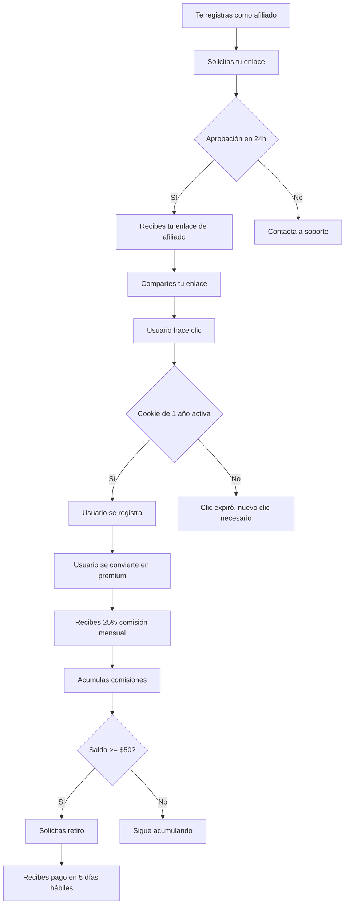

> **Lanzamiento del Programa de Afiliados (2026-05-08)**
> El programa de afiliados de E-SMART360 ya está abierto para marketers, creadores de contenido, agencias y emprendedores que quieran generar ingresos pasivos promocionando una plataforma líder en chatbots y automatización conversacional. Únete hoy y comienza a ganar comisiones recurrentes.

¡Nos complace anunciar el lanzamiento del Programa de Afiliados de E-SMART360! Lo hemos desarrollado como una forma de agradecer a todos los marketers, creadores de contenido y profesionales que dedican tiempo a recomendar E-SMART360 a sus amigos, audiencia y seguidores.

Como afiliado, recibirás comisiones por cada nueva cuenta premium o revendedor que se registre a través de tu enlace, así como por aquellos usuarios gratuitos que posteriormente se actualicen a un plan premium o de revendedor.

Convertirte en socio afiliado de E-SMART360 es una de las formas más rápidas de aumentar tus ingresos y tu impacto en la industria del marketing conversacional y la automatización con chatbots.

> El programa está abierto a participantes de todo el mundo. No importa si eres un creador individual o una agencia completa: mientras tengas una audiencia interesada en marketing digital, ventas o automatización empresarial, puedes generar ingresos con nuestras comisiones. No hay restricciones geográficas ni barreras de entrada.

## Gana el 25% de comisión recurrente por cada referido. De por vida.

Hablamos en serio sobre tu posición. Tú trabajas en marketing. Tú mueves cosas. Tienes influencia. Puedes comunicarte con las personas en tu esfera mucho más efectivamente de lo que nosotros podríamos.

Por eso tratamos bien a nuestros afiliados. Recibes un 25% de la tarifa mensual de cada usuario que se registre a través de tu recomendación. Seguirás recibiendo tu comisión de referido mientras ellos sigan pagando sus suscripciones mensuales.

Esto significa que un solo referido puede generarte ingresos mes tras mes durante años. Si refieres a 10 clientes que se mantengan activos, estarás construyendo un flujo de ingresos pasivos sólido y predecible. Con 50 clientes referidos activos, estarías generando un ingreso recurrente comparable a un salario de tiempo completo en muchos países.

> **Ejemplo real:** Si refieres a un cliente que contrata un plan de $99/mes, recibirás $24.75 al mes durante todo el tiempo que el cliente permanezca activo. Con 10 referidos similares, estarías generando casi $250 mensuales en ingresos pasivos, solo por recomendar una plataforma que ya conoces y en la que confías. Si mantienes 40 clientes activos, estarías generando cerca de $1,000 USD mensuales en ingresos completamente pasivos.

### ¿Por qué comisiones recurrentes y no de una sola vez?

Muchos programas de afiliados pagan una comisión única por cada venta. Tú refieres un cliente, recibes un pago y ahí termina la relación. En E-SMART360 creemos que esto no es justo ni para ti ni para el cliente.

Nuestro modelo de comisiones recurrentes te recompensa mientras el cliente que referiste siga obteniendo valor de la plataforma. Es un modelo alineado con tus intereses: tú quieres referir clientes que realmente se beneficien de E-SMART360 y se queden a largo plazo, y nosotros queremos ofrecer un servicio excepcional que los retenga. Todos ganan.

## Gran retorno por tu esfuerzo

¿Qué tan difícil es conseguir un referido?

Pensémoslo de esta manera: publicar en un grupo de Facebook, enviar un correo electrónico o colocar un enlace en LinkedIn. Cualquiera de estas actividades puede generar referidos y activar un flujo constante de dinero. La recompensa es enorme a pesar del esfuerzo mínimo.

No necesitas ser un superventas ni tener una audiencia masiva. Con una comunidad pequeña pero comprometida, puedes generar ingresos significativos. Lo más importante es la calidad de tu recomendación, no la cantidad de personas a las que llegues.

### Estrategias comprobadas para conseguir tus primeros referidos

### Comparte tu enlace en comunidades activas

Únete a grupos de Facebook, comunidades de WhatsApp, servidores de Discord o canales de Telegram donde se hable de marketing digital, ventas, ecommerce o automatización. Comparte tu experiencia y, cuando sea relevante, recomienda E-SMART360 con tu enlace de afiliado. La clave está en ser auténtico y aportar valor antes de promocionar.
  
### Crea contenido de valor

Graba un video tutorial, escribe un artículo en tu blog o publica un hilo en Twitter mostrando cómo usas E-SMART360 para automatizar ventas o atención al cliente. Incluye tu enlace de afiliado al final como recurso recomendado. El contenido educativo genera más confianza y mejores tasas de conversión.
  
### Aprovecha el email marketing

Si tienes una lista de correos, envía una recomendación personalizada a tus suscriptores explicando por qué usas E-SMART360 y cómo puede ayudarles a hacer crecer su negocio. Segmenta tu lista para enviar el mensaje solo a quienes puedan estar interesados en automatización de ventas y chatbots.
  
### Incluye el enlace en tu sitio web o blog

Agrega un banner o una página de recursos donde recomiendes herramientas de marketing conversacional. Cada visita puede convertirse en una comisión con nuestra cookie de 1 año. Una página de "Herramientas Recomendadas" puede generar comisiones pasivas durante meses.
  
### Colabora con otros creadores

Asóciate con otros influencers o creadores de contenido para hacer webinars, entrevistas o contenido colaborativo donde puedas mencionar E-SMART360. Las recomendaciones de terceros suelen tener un alto nivel de confianza y conversión.
  
### La psicología detrás de las recomendaciones exitosas

Para maximizar tus conversiones como afiliado, es útil entender por qué las personas actúan cuando reciben una recomendación. Estos son los principios psicológicos que puedes aprovechar:

- **Prueba social:** Cuando muestras que otras personas están usando E-SMART360 con éxito, generas confianza. Comparte testimonios, capturas de pantalla de tus resultados o historias de clientes satisfechos.
- **Reciprocidad:** Cuando ofreces valor gratuito (una guía, un tutorial, un consejo útil), las personas se sienten inclinadas a devolver el favor. Ofrece contenido valioso antes de pedir que se registren.
- **Escasez:** Si hay una oferta por tiempo limitado o beneficios exclusivos para los primeros en registrarse, la urgencia aumenta las conversiones. Menciona promociones activas cuando las haya.
- **Autoridad:** Posiciónate como un experto en el tema. Cuanto más sepas sobre chatbots, automatización y marketing conversacional, más peso tendrá tu recomendación.

## Métodos y reglas de pago

Puedes solicitar un retiro en cuanto el saldo de tu cuenta de afiliado alcance los **$50 USD**. El pago se completará en un máximo de cinco días hábiles.

Tus ganancias estarán disponibles para retiro a través de:

- **PayPal** — Disponible globalmente para todos los afiliados
- **bKash** — Disponible exclusivamente para afiliados en Bangladesh

### PayPal

El método más rápido y ampliamente utilizado. Recibe tus comisiones directamente en tu cuenta de PayPal desde cualquier parte del mundo. Los pagos se procesan en un plazo máximo de 5 días hábiles una vez que solicites el retiro. PayPal es aceptado en más de 200 países y es la opción preferida por la mayoría de nuestros afiliados internacionales.
  
### bKash

Método de pago local para afiliados en Bangladesh. Recibe tus comisiones directamente en tu cuenta de bKash. Mismo plazo de procesamiento de hasta 5 días hábiles. bKash es uno de los servicios de pago móvil más utilizados en Bangladesh y ofrece una forma rápida y segura de recibir tus fondos.
  
> Asegúrate de que tu información de pago esté actualizada en tu panel de afiliado. Los retiros solo pueden procesarse cuando el saldo mínimo de $50 ha sido alcanzado y tu cuenta de afiliado está verificada. Si cambias de método de pago o de datos de cuenta, actualiza tu perfil antes de solicitar un retiro para evitar demoras.

### Política de pagos: todo lo que necesitas saber

| Aspecto | Detalle |
|---|---|
| **Saldo mínimo para retiro** | $50 USD |
| **Métodos de pago disponibles** | PayPal (global), bKash (Bangladesh) |
| **Tiempo de procesamiento** | Hasta 5 días hábiles |
| **Frecuencia de pagos** | Bajo demanda (cuando alcances el mínimo) |
| **Comisiones por retiro** | Ninguna. El retiro es gratuito |
| **Límite de retiros** | Sin límite. Puedes retirar cuando quieras |
| **Saldo no reclamado** | Se mantiene en tu cuenta hasta que solicites retiro |
| **Impuestos** | Eres responsable de declarar tus ingresos según las leyes de tu país |

### Seguimiento de comisiones en tu panel de afiliado

Tu panel de afiliado te muestra en tiempo real:

1. **Clics totales:** Cuántas personas han hecho clic en tu enlace de afiliado.
2. **Registros:** Cuántas personas se registraron en E-SMART360 después de hacer clic en tu enlace.
3. **Conversiones a pago:** Cuántos registros se convirtieron en clientes premium o revendedores.
4. **Comisiones acumuladas:** El total de comisiones generadas hasta la fecha.
5. **Comisiones pendientes:** Comisiones generadas pero aún no pagaderas (por ejemplo, por períodos de prueba gratuitos).
6. **Comisiones pagadas:** El total que ya has recibido.
7. **Saldo disponible:** Lo que puedes retirar en este momento.

> Revisa tu panel al menos una vez por semana para identificar tendencias. Si notas que tienes muchos clics pero pocas conversiones, quizás necesitas ajustar tu mensaje o la forma en que presentas E-SMART360. Si tienes pocos clics, enfócate en aumentar tu alcance compartiendo en más canales.

## ¿Cómo registrarme como afiliado de E-SMART360?

Primero debes solicitar un enlace de afiliado. Se te asignará una cuenta y un enlace después de la verificación. Es posible que te solicitemos cierta información para confirmar tu estatus como uno de nuestros socios afiliados.

### Inicia sesión o regístrate en E-SMART360

Accede a tu cuenta existente o crea una nueva cuenta gratuita en la plataforma. No necesitas tener un plan premium para convertirte en afiliado. Puedes registrarte con tu correo electrónico o mediante tu cuenta de Google o Facebook.
  
### Accede a la sección de Afiliados

Dentro de tu panel de control, busca y haz clic en la sección del Programa de Afiliados. Generalmente la encontrarás en el menú lateral o en la sección de configuración de tu cuenta. Allí verás un formulario para enviar tu solicitud.
  
### Completa el formulario de solicitud

Proporciona la información requerida: tus datos de contacto, cómo planeas promocionar E-SMART360 y cualquier detalle adicional que nos ayude a conocer tu perfil como afiliado. Sé honesto y específico sobre tus estrategias de promoción.
  
### Espera la aprobación

El equipo de E-SMART360 revisará tu solicitud de enlace de afiliado en un plazo máximo de 24 horas hábiles. Recibirás una notificación automática cuando tu solicitud sea aprobada. En la mayoría de los casos, la aprobación es rápida si la información proporcionada es clara y completa.
  
### Obtén tu panel y enlace de afiliado

Una vez aprobado, recibirás acceso a tu panel de afiliado completo. En la sección de configuración encontrarás tu enlace único de referido, listo para compartir con tu audiencia. Puedes personalizar ciertos aspectos de tu perfil de afiliado.
  

> **¿Sabías que...?** Tu panel de afiliado te permite ver en tiempo real cuántos clics ha recibido tu enlace, cuántos registros se han convertido y cuánto has ganado. Tienes control total sobre tus métricas para optimizar tu estrategia de promoción. También puedes generar reportes para analizar tu rendimiento por períodos específicos.

### ¿Qué información necesito para solicitar ser afiliado?

Cuando completes el formulario de solicitud, te pediremos:

- **Nombre completo y correo electrónico:** Para identificarte y comunicarnos contigo.
- **País de residencia:** Para conocer mejor tu mercado.
- **Descripción de tu audiencia:** ¿A quién le hablas? ¿Cuántas personas alcanzas aproximadamente?
- **Canales de promoción planeados:** ¿Dónde piensas compartir tu enlace? (blog, YouTube, redes sociales, email, etc.)
- **Experiencia en marketing:** Cuéntanos brevemente tu experiencia promocionando productos o servicios.

No te preocupes si estás comenzando. No requerimos un número mínimo de seguidores ni experiencia previa en programas de afiliados. Lo importante es tu entusiasmo y compromiso.

## Método de atribución: "Last Click Wins"

E-SMART360 utiliza el método **"Last Click Wins"** (el último clic gana). Esto significa que el último afiliado cuyo enlace fue cliqueado antes del registro será quien reciba la comisión. Este método es justo y transparente, ya que recompensa al afiliado que tuvo la interacción decisiva en el momento del registro.

**Período de validez de la cookie:** 1 año de validez para cada clic en tu enlace. Esto significa que si alguien hace clic en tu enlace hoy pero no se registra hasta dentro de 11 meses, aún recibirás la comisión por ese referido. Esta ventana de 365 días es una de las más generosas en la industria de afiliados SaaS.

> La ventana de 1 año es una de las más generosas de la industria. La mayoría de los programas de afiliados ofrecen ventanas de 30 a 90 días. Con E-SMART360, tienes un año completo para que tus clics se conviertan en comisiones. Esto significa que incluso las estrategias de contenido a largo plazo, como artículos de blog o videos educativos, pueden generar comisiones durante todo un año.

### ¿Cómo funciona exactamente la cookie de afiliado?

Cuando una persona hace clic en tu enlace de afiliado:

1. Se almacena una cookie en su navegador con un identificador único que te vincula como el referente.
2. Esa cookie tiene una duración de 365 días a partir del momento del clic.
3. Si la persona se registra en E-SMART360 dentro de los 365 días siguientes, el sistema verifica la cookie y te asigna la comisión.
4. Si la persona hace clic en el enlace de otro afiliado después del tuyo, el nuevo enlace reemplaza al anterior ("Last Click Wins").
5. Una vez que la persona se registra, el vínculo queda fijado y ningún otro afiliado puede reclamar esa comisión.

**Caso práctico:** Supongamos que compartes tu enlace en un artículo de blog en enero. Un lector hace clic pero no se registra. En noviembre del mismo año, ese lector recuerda tu recomendación, busca E-SMART360, hace clic nuevamente en tu enlace (la cookie sigue activa) y se registra. Tú recibes la comisión.

## Consejos avanzados para maximizar tus comisiones

### Apuesta por contenido educativo

Crea guías, tutoriales y casos de estudio que muestren resultados reales usando E-SMART360. El contenido educativo genera más confianza y conversiones que los simples anuncios. Un video paso a paso sobre cómo automatizar las ventas en WhatsApp puede convertirse en tu mejor herramienta de afiliado. El contenido perdurable ("evergreen") sigue generando clics y comisiones meses después de haberlo creado.
  
### Segmenta tu audiencia

No todas las personas necesitan un chatbot. Enfócate en emprendedores, dueños de tiendas online, agencias de marketing y equipos de ventas que ya estén buscando soluciones de automatización. Tu tasa de conversión será mucho más alta cuando tu mensaje llegue a las personas adecuadas. Crea contenido específico para cada segmento.
  
### Usa múltiples canales

No te limites a un solo canal. Combina publicaciones en LinkedIn, videos en YouTube, historias en Instagram y threads en Twitter. Cada canal tiene su propia audiencia y multiplica tus oportunidades de generar clics y registros. Si tienes un blog, publica artículos optimizados para SEO.
  
### Mide y optimiza constantemente

Revisa tu panel de afiliado semanalmente. Identifica qué canales generan más clics y cuáles tienen mejores tasas de conversión. Duplica lo que funciona y ajusta lo que no está dando resultados. Haz pruebas A/B con diferentes formas de presentar tu enlace.
  
### Errores comunes que debes evitar como afiliado

### Spamear tu enlace en todas partes

Compartir tu enlace sin contexto ni valor en grupos, foros o comentarios no solo es inefectivo, sino que puede dañar tu reputación. Las comunidades suelen prohibir el spam y los usuarios ignoran los enlaces sin contexto. En lugar de eso, participa genuinamente, aporta valor y solo comparte tu enlace cuando sea relevante.

### No diversificar tus canales

Depender de un solo canal te hace vulnerable. Si ese canal deja de funcionar o tu audiencia se estanca, tus ingresos se ven afectados. Diversifica desde el principio: blog, redes sociales, email, videos, comunidades.

### Promocionar sin conocer la plataforma

Si no has usado E-SMART360 personalmente, tu recomendación sonará hueca y poco convincente. Los clientes potenciales hacen preguntas y esperan respuestas auténticas. Usa la plataforma, experimenta con sus funciones y comparte tu experiencia real.

### Ignorar las políticas de afiliados

Cada programa de afiliados tiene reglas sobre cómo puedes promocionar. Violar estas políticas puede resultar en la desactivación de tu cuenta y la pérdida de comisiones acumuladas.

### Rendirte demasiado pronto

El marketing de afiliados rara vez da resultados inmediatos. Los primeros meses pueden ser lentos mientras construyes contenido y audiencia. La clave es la consistencia. Sigue creando contenido, compartiendo tu enlace y optimizando tu estrategia.

## Ejemplos prácticos: Cómo otros afiliados están generando ingresos

### La bloguera de marketing

Ana tiene un blog sobre automatización empresarial. Escribió un artículo detallado comparando herramientas de chatbot y recomendó E-SMART360 como su plataforma preferida. En 3 meses, su artículo generó 45 registros, de los cuales 12 se convirtieron en clientes premium. Hoy recibe $297 USD mensuales en comisiones recurrentes.
  
### El YouTuber de tecnología

Carlos creó un video tutorial de 20 minutos mostrando cómo configurar un chatbot de ventas en WhatsApp con E-SMART360. El video tiene más de 15,000 vistas y su enlace de afiliado en la descripción ha generado 8 clientes premium activos. Sus comisiones mensuales superan los $198 USD.
  
### La agencia de marketing

La agencia de Laura implementa E-SMART360 como solución para sus clientes de ecommerce. Cada cliente que incorpora a través de su enlace de afiliado le genera una comisión mensual. Con 25 clientes activos, sus ingresos pasivos por afiliación superan los $600 USD al mes.
  
### Caso de estudio: De cero a $500 mensuales en 6 meses

**Perfil:** Miguel, emprendedor digital de Colombia, sin audiencia previa.

**Estrategia:** Miguel creó un canal de YouTube enfocado en enseñar a pequeñas empresas cómo vender más por WhatsApp. Publicaba 2 videos por semana. En cada video, mencionaba E-SMART360 como su herramienta recomendada y dejaba su enlace de afiliado en la descripción.

**Resultados:**
- Mes 1-2: 0 conversiones. 200 suscriptores.
- Mes 3: 2 registros gratuitos, 1 conversión a premium. Primera comisión: $24.75/mes.
- Mes 4-5: 5 registros gratuitos, 3 conversiones a premium. Comisiones acumuladas: $99/mes.
- Mes 6: 450 suscriptores, 12 clics/día en su enlace, 8 clientes premium activos. Comisiones: $198/mes.

**Lecciones:** La consistencia fue clave. Miguel no se desanimó por los primeros meses sin resultados. Su contenido sigue acumulando vistas y generando comisiones incluso cuando no está creando activamente.

## Canales y plataformas que puedes promocionar como afiliado

Como afiliado, puedes promocionar toda la plataforma E-SMART360, incluyendo sus potentes capacidades multicanal. Esto te da múltiples ángulos para crear contenido y atraer diferentes tipos de clientes.

### WhatsApp Business API

Automatización completa de ventas, atención al cliente y marketing en WhatsApp. Ideal para ecommerce, restaurantes, servicios profesionales y cualquier negocio que quiera comunicarse con sus clientes en el canal más usado del mundo. Incluye chatbot, catálogo de productos, pagos y flujos interactivos.
  
### Facebook Messenger e Instagram

Bots inteligentes para las plataformas de Meta. Captura leads, automatiza respuestas y gestiona conversaciones en las redes sociales más grandes del mundo. Perfecto para negocios B2C que ya tienen presencia en estas plataformas.
  
### Telegram

Gestión avanzada de grupos, canales y bots. Ideal para comunidades, empresas de medios y organizaciones que necesitan moderación, automatización y comunicación masiva en Telegram. Incluye filtros antispam y herramientas de participación.
  
### Web Chat

Chatbot para sitios web con personalización completa. Captura leads en tu página web, ofrece soporte 24/7 y califica prospectos automáticamente. Se integra con WordPress y otras plataformas populares.
  
> Cuando crees contenido como afiliado, no te limites a promocionar un solo canal. Muestra cómo E-SMART360 unifica todas estas plataformas en una sola bandeja de entrada. Los clientes valoran mucho tener una solución integral para todos sus canales de comunicación.

## Preguntas frecuentes sobre el programa de afiliados

### ¿Cuánta comisión puedo ganar con el Programa de Afiliados de E-SMART360?

Ganas el 25% de comisión recurrente de por vida por cada referido exitoso a un plan premium o de revendedor que se registre a través de tu enlace de afiliado. No hay límite máximo de ganancias: mientras más clientes refieras, más ingresos generarás. Algunos de nuestros afiliados más activos generan más de $1,000 USD mensuales en comisiones recurrentes.

### ¿Gano comisión si alguien se registra gratis primero y luego se actualiza?

Sí. Si un usuario se registra para una cuenta gratuita de E-SMART360 usando tu enlace y luego se actualiza a un plan de pago, igual recibirás tu comisión. El sistema de atribución reconoce al afiliado original incluso si la conversión ocurre semanas o meses después, siempre dentro del período de validez de la cookie de 1 año.

### ¿Cuál es el monto mínimo de pago?

Puedes solicitar un retiro en cuanto el saldo de tu cuenta de afiliado alcance los $50 USD. No hay montos máximos ni límite de retiros mensuales. Una vez alcanzado el mínimo, puedes retirar tus ganancias cuando lo prefieras.

### ¿Cómo recibo mi pago como afiliado?

Actualmente ofrecemos pagos a través de PayPal (disponible para afiliados en todo el mundo) y bKash (exclusivo para afiliados en Bangladesh). Los pagos generalmente se procesan dentro de los 5 días hábiles posteriores a tu solicitud de retiro.

### ¿Cómo funciona el seguimiento de referidos?

E-SMART360 utiliza un modelo de atribución "Last Click Wins". El último enlace de afiliado cliqueado antes del registro recibe el crédito de la comisión. Cada enlace tiene una validez de cookie de 1 año. El panel de afiliado te muestra todas estas métricas en tiempo real.

### ¿Quién debería unirse al Programa de Afiliados?

Este programa es ideal para marketers digitales, revisores de herramientas SaaS, blogueros y YouTubers, dueños de agencias, consultores de chatbots, influencers en automatización empresarial y propietarios de tiendas online. Si tienes una audiencia interesada en hacer crecer su negocio a través de canales digitales, este programa es para ti.

### ¿Hay algún costo para unirse al programa de afiliados?

No. Unirse al Programa de Afiliados de E-SMART360 es completamente gratuito. No hay cuotas de inscripción, tarifas anuales ni costos ocultos. Solo necesitas registrarte y solicitar tu enlace de afiliado para empezar a ganar comisiones.

### ¿Puedo promocionar E-SMART360 en mis redes sociales?

¡Absolutamente! Te animamos a compartir tu enlace de afiliado en tus redes sociales, blog, canal de YouTube, lista de correos electrónicos y cualquier otro medio que consideres adecuado. Solo te pedimos que sigas nuestras políticas de afiliados y que no utilices prácticas engañosas o spam.

### ¿Puedo usar mi enlace de afiliado en anuncios de pago?

Dependiendo de las políticas vigentes, puede haber restricciones en el uso de anuncios de pago con enlaces de afiliado. Te recomendamos consultar las políticas específicas del programa de afiliados en tu panel o contactar al equipo de soporte.

### ¿Qué sucede si un cliente que referí cancela su suscripción?

Si un cliente que referiste cancela su suscripción, dejarás de recibir comisiones por ese cliente en particular. Sin embargo, tus otras comisiones por otros referidos activos no se ven afectadas. El modelo recurrente te recompensa mientras los clientes sigan obteniendo valor de la plataforma.

### ¿Puedo ser afiliado y también cliente premium de E-SMART360?

Sí, absolutamente. Muchos de nuestros afiliados más exitosos son también usuarios activos de la plataforma. Ser usuario de E-SMART360 te da credibilidad adicional cuando recomiendas la plataforma, porque hablas desde la experiencia directa.

### ¿Hay soporte para afiliados?

Sí. Contamos con un equipo dedicado a apoyar a nuestros afiliados. Si tienes preguntas sobre el programa, tus comisiones, o necesitas materiales promocionales, puedes contactarnos a través de los canales de soporte disponibles en tu panel de afiliado.

## Métricas clave del programa de afiliados

| Concepto | Detalle |
|---|---|
| **Comisión** | 25% recurrente de por vida |
| **Modelo de atribución** | Last Click Wins |
| **Validez de cookie** | 1 año (365 días) |
| **Mínimo de pago** | $50 USD |
| **Métodos de pago** | PayPal (global), bKash (Bangladesh) |
| **Tiempo de procesamiento** | Hasta 5 días hábiles |
| **Costo de inscripción** | Gratuito |
| **Aprobación de solicitud** | Dentro de 24 horas hábiles |

## Planes de precios de E-SMART360 y comisiones potenciales

| Plan | Ideal para | Precio mensual aprox. | Tu comisión (25%) |
|---|---|---|---|
| Plan Básico | Pequeños negocios, autónomos | Desde $29/mes | Desde $7.25/mes |
| Plan Profesional | Pymes, agencias en crecimiento | Desde $79/mes | Desde $19.75/mes |
| Plan Premium | Empresas, alto volumen | Desde $149/mes | Desde $37.25/mes |
| Plan Revendedor | Agencias, marca blanca | Desde $249/mes | Desde $62.25/mes |

> **Potencial de ingresos anual:** Si refieres a 5 clientes del Plan Profesional ($79/mes cada uno), generarías aproximadamente $98.75/mes en comisiones, lo que equivale a $1,185 USD al año. Con 20 clientes del mismo plan, estarías generando $395/mes, aproximadamente $4,740 USD al año. Y recuerda: estas comisiones son recurrentes.

## Herramientas y recursos para afiliados

Como parte del programa, tendrás acceso a diversos materiales y herramientas para facilitar tu trabajo de promoción:

- **Enlace de afiliado único y personalizado** — Tu enlace de seguimiento individual.
- **Panel de control en tiempo real** — Métricas de clics, registros, conversiones y comisiones.
- **Banners promocionales** — Imágenes en varios tamaños para usar en tu sitio web o blog.
- **Contenido de muestra** — Descripciones, reseñas y datos clave que puedes usar en tus publicaciones.
- **Actualizaciones periódicas** — Información sobre nuevas funciones y promociones para compartir con tu audiencia.
- **Soporte prioritario** — Acceso al equipo de soporte para resolver tus dudas como afiliado.

## Diagrama del flujo del programa de afiliados

> **¿Listo para comenzar?** Inicia sesión en tu cuenta de E-SMART360, dirígete a la sección del Programa de Afiliados y solicita tu enlace personalizado. En menos de 24 horas podrías estar compartiendo tu enlace y generando tu primer ingreso pasivo. El programa es gratuito, las comisiones son recurrentes y el potencial de ingresos es ilimitado.

Si tienes alguna pregunta adicional, no dudes en contactarnos. ¡El equipo de E-SMART360 está aquí para ayudarte a tener éxito como afiliado!

> **Consejo final:** Los mejores afiliados son aquellos que realmente usan y aman la plataforma. Si ya eres usuario de E-SMART360, tu recomendación auténtica vale mucho más que cualquier anuncio. Comparte tu experiencia real, muestra resultados y deja que tu entusiasmo sea tu mejor herramienta de ventas.

## Preguntas de la comunidad: respuestas a dudas reales de afiliados

### ¿Puedo tener múltiples cuentas de afiliado?

No. Cada persona puede tener una sola cuenta de afiliado. Si intentas crear múltiples cuentas, todas podrían ser desactivadas. Si necesitas gestionar múltiples marcas o proyectos, centraliza todo en una sola cuenta.

### ¿Qué métodos de promoción están prohibidos?

No está permitido el uso de spam, compra de tráfico sospechoso, uso de marcas registradas de E-SMART360 en anuncios de Google o Facebook sin autorización, ni la promoción en sitios con contenido ilegal o inapropiado. Consulta las políticas completas en tu panel de afiliado.

### ¿Puedo referirme a mí mismo como afiliado?

No. No está permitido utilizar tu propio enlace de afiliado para registrarte en E-SMART360 y obtener comisiones por tu propia suscripción. El programa está diseñado para recompensar la recomendación a terceros.

### ¿Las comisiones se pagan sobre el valor total de la suscripción?

Sí. La comisión del 25% se calcula sobre el monto total de la suscripción mensual, antes de impuestos. Si el plan incluye descuentos por pago anual, la comisión se calcula sobre el monto efectivamente pagado.

### ¿Qué sucede si un cliente cambia de plan?

Si un cliente que referiste cambia a un plan de mayor valor, tu comisión aumentará proporcionalmente. Si cambia a un plan de menor valor, tu comisión disminuirá. Si cancela, la comisión se detiene. El sistema ajusta automáticamente la comisión según el plan activo.

### ¿Ofrecen materiales promocionales como banners o textos?

Sí. Como afiliado aprobado, tendrás acceso a una biblioteca de recursos promocionales que incluye banners en múltiples tamaños, ejemplos de textos para redes sociales, plantillas de correos electrónicos y descripciones de producto aprobadas. Estos materiales están diseñados para ayudarte a promocionar de manera efectiva y cumpliendo con nuestras políticas.

### ¿Puedo promocionar E-SMART360 en eventos o webinars?

Sí, y es una excelente estrategia. Si participas en eventos, conferencias o webinars como ponente o asistente, puedes compartir tu enlace de afiliado. Incluso puedes solicitar materiales de presentación adicionales a nuestro equipo de soporte para afiliados.

## Estrategias avanzadas de promoción para afiliados experimentados

Una vez que hayas dominado lo básico, estas estrategias avanzadas te ayudarán a escalar tus ingresos como afiliado:

### Estrategia 1: Embudos de contenido automatizados

Crea un embudo de contenido donde cada pieza lleve naturalmente a la siguiente:

1. **Atracción:** Artículo de blog optimizado para SEO sobre "cómo automatizar ventas en WhatsApp"
2. **Enganche:** Lead magnet gratuito (guía PDF de 10 pasos) a cambio del correo electrónico
3. **Nutrición:** Secuencia de 5 correos educativos sobre automatización conversacional
4. **Conversión:** En el último correo, presentas E-SMART360 con tu enlace de afiliado y un caso de éxito

Este embudo puede funcionar 24/7 de forma automatizada, generando comisiones incluso mientras duermes.

### Estrategia 2: Contenido comparativo y reviews

Las comparativas y reviews detalladas son de los contenidos que mejor convierten en el marketing de afiliados SaaS. Crea:

- **E-SMART360 vs [competidor]:** Comparaciones honestas destacando las fortalezas de cada plataforma
- **Review honesto:** Un análisis profundo de las funciones, precio, ventajas y desventajas
- **"Por qué elegí E-SMART360":** Contenido personal contando tu experiencia como usuario

### Estrategia 3: Programas de referidos dentro de tu comunidad

Si ya tienes una comunidad (grupo de Telegram, servidor de Discord, membresía), puedes crear un mini-programa de referidos dentro de ella:

- Ofrece un bonus o descuento a los miembros que se registren a través de tu enlace
- Comparte actualizaciones periódicas sobre nuevas funciones de E-SMART360
- Crea un canal exclusivo donde los usuarios de E-SMART360 puedan compartir tips y hacer preguntas
- Esto no solo genera más registros, sino que fortalece tu comunidad

## Glosario de términos para afiliados

| Término | Significado |
|---|---|
| **Comisión recurrente** | Pago que se recibe periódicamente mientras el cliente referido mantenga su suscripción activa |
| **Cookie de afiliado** | Archivo que se almacena en el navegador del usuario para rastrear que fue referido por ti |
| **Last Click Wins** | Modelo de atribución donde el último afiliado cuyo enlace fue cliqueado antes del registro recibe la comisión |
| **Tasa de conversión** | Porcentaje de personas que hacen clic en tu enlace y terminan registrándose |
| **CPC (Costo por clic)** | En el contexto de afiliados, no tiene costo; pero es útil medir cuántos clics generas |
| **Lead** | Usuario potencial que muestra interés pero aún no se ha registrado |
| **Retiro** | Proceso de solicitar el pago de tus comisiones acumuladas |
| **Panel de afiliado** | Dashboard donde gestionas tu cuenta, ves métricas y solicitas pagos |

## Cómo E-SMART360 apoya a sus afiliados

Como afiliado de E-SMART360, no estás solo en este viaje. La plataforma ofrece soporte continuo para asegurar tu éxito:

- **Equipo de afiliados dedicado:** Personas reales que responden tus preguntas y te ayudan a optimizar tu estrategia.
- **Actualizaciones regulares:** Recibirás correos con nuevas funciones, promociones y contenido que puedes compartir con tu audiencia.
- **Comunidad de afiliados:** Acceso a un grupo exclusivo donde otros afiliados comparten estrategias, tips y resultados.
- **Bonos por desempeño:** Ocasionalmente, ofrecemos incentivos adicionales para los afiliados con mejor rendimiento.
- **Feedback directo:** Tus sugerencias como afiliado son bienvenidas y ayudan a mejorar el programa para todos.

## El poder del crecimiento compuesto en comisiones recurrentes

Una de las ventajas más poderosas del modelo de comisiones recurrentes es el **efecto compuesto**. A diferencia de los pagos únicos, donde empiezas de cero cada mes, las comisiones recurrentes se acumulan con el tiempo.

**Escenario hipotético de 12 meses:**

| Mes | Nuevos clientes | Clientes acumulados | Comisión mensual estimada |
|---|---|---|---|
| Mes 1 | 1 | 1 | $19.75 |
| Mes 2 | 1 | 2 | $39.50 |
| Mes 3 | 2 | 4 | $79.00 |
| Mes 4 | 1 | 5 | $98.75 |
| Mes 5 | 2 | 7 | $138.25 |
| Mes 6 | 1 | 8 | $158.00 |
| Mes 7 | 2 | 10 | $197.50 |
| Mes 8 | 1 | 11 | $217.25 |
| Mes 9 | 2 | 13 | $256.75 |
| Mes 10 | 1 | 14 | $276.50 |
| Mes 11 | 2 | 16 | $316.00 |
| Mes 12 | 2 | 18 | $355.50 |

*Basado en comisiones del 25% sobre plan profesional de $79/mes. Resultados pueden variar.*

En este escenario, después de 12 meses refiriendo un promedio de 1.5 clientes por mes, estarías generando **$355.50 mensuales** en ingresos pasivos. Y al siguiente mes, si no refieres a nadie nuevo, aún recibirías esa cantidad. Cada nuevo cliente suma al total sin restar valor a los anteriores.

## Cierre

> El Programa de Afiliados de E-SMART360 representa una oportunidad real de generar ingresos pasivos significativos en el creciente mercado del marketing conversacional. Con una comisión del 25% recurrente, una ventana de cookie de 1 año y un proceso de registro simple y gratuito, las barreras de entrada son mínimas y el potencial de ingresos es ilimitado. No importa si eres un creador de contenido con una audiencia pequeña pero comprometida, una agencia que busca una fuente adicional de ingresos, o un marketero experimentado listo para escalar: el programa está diseñado para recompensar tu esfuerzo de manera justa y continua.

## Comparativa: Programa de Afiliados de E-SMART360 vs otros programas

| Característica | E-SMART360 | Promedio de la industria |
|---|---|---|
| **Comisión** | 25% recurrente de por vida | 10-20% única o recurrente limitada |
| **Ventana de cookie** | 365 días (1 año) | 30-90 días |
| **Modelo de atribución** | Last Click Wins | Varía: First Click, Last Click, o multi-touch |
| **Mínimo de pago** | $50 USD | $50-$100 USD |
| **Costo de inscripción** | Gratuito | Generalmente gratuito |
| **Soporte directo** | Equipo dedicado de afiliados | Generalmente solo chatbot o tickets |
| **Materiales promocionales** | Banners, guías, contenido de muestra | Varía ampliamente |
| **Panel en tiempo real** | Sí, con métricas detalladas | No siempre disponible |
| **Múltiples canales** | WhatsApp, Messenger, Instagram, Telegram, Web | Generalmente un solo producto |

Como puedes ver, E-SMART360 ofrece condiciones significativamente mejores que el promedio de la industria, especialmente en la ventana de cookie de 1 año y las comisiones recurrentes de por vida.

## Cómo crear contenido irresistible para tu audiencia

El contenido que crees como afiliado es tu herramienta principal de conversión. Aquí tienes una guía detallada para crear contenido que realmente venda:

### Estructura de un artículo de blog para afiliados

1. **Título atractivo:** Usa números, preguntas o beneficios claros. Ejemplo: "Cómo automatizar tus ventas en WhatsApp en 5 pasos (Guía 2026)"
2. **Introducción que conecta:** Habla del dolor o problema que tu audiencia enfrenta. "¿Pasas horas respondiendo los mismos mensajes una y otra vez?"
3. **Presenta la solución:** Explica cómo E-SMART360 resuelve ese problema específico. No hagas un anuncio, muestra el camino.
4. **Demostración visual:** Capturas de pantalla, videos cortos o diagramas que muestren el antes y después.
5. **Beneficios específicos:** "Con E-SMART360, nuestros clientes reducen su tiempo de respuesta en un 80% y aumentan sus ventas en un 35%."
6. **Llamado a la acción claro:** "Prueba E-SMART360 gratis hoy y descubre cómo puede transformar tu negocio."

### Tipos de contenido que mejor funcionan para afiliados

- **Tutoriales paso a paso:** Guías prácticas que resuelven un problema específico. Son el contenido que mejor convierte porque el lector ya está buscando activamente una solución.
- **Estudios de caso:** Historias reales de clientes con resultados medibles. "Cómo una tienda de ropa incrementó sus ventas en un 40% usando chatbots de E-SMART360."
- **Listas y comparativas:** "Top 5 herramientas de chatbot para WhatsApp en 2026" o "E-SMART360 vs [competidor]: ¿cuál elegir?"
- **Contenido en video:** Los videos tutoriales y las demostraciones en vivo generan alta confianza y engagement.
- **Webinars y sesiones en vivo:** Puedes hacer una demostración en vivo de E-SMART360 y responder preguntas de tu audiencia en tiempo real.

## Plantillas de mensajes para promocionar tu enlace de afiliado

Para ayudarte a comenzar rápidamente, aquí tienes plantillas que puedes adaptar a tu estilo y canal:

### Plantilla para redes sociales (LinkedIn / Twitter)

"¿Sabías que puedes automatizar todas tus ventas y atención al cliente en WhatsApp, Messenger e Instagram desde una sola plataforma? 🤖

  Llevo meses usando @ESMART360 y he reducido mi tiempo de respuesta en un 80%. Lo mejor: todo está integrado en un solo panel.

  Si quieres probarlo, aquí tienes mi enlace para una prueba gratuita:
  [tu enlace de afiliado]

  ¿Alguien más lo ha probado? Cuéntenme su experiencia."

### Plantilla para email marketing

**Asunto:** La herramienta que está revolucionando mi negocio

  **Hola [Nombre],**

  Espero que estés teniendo una excelente semana.

  Quería compartir algo que ha transformado mi forma de trabajar: E-SMART360.
  Es una plataforma de chatbots y marketing conversacional que te permite automatizar ventas y atención al cliente en WhatsApp, Messenger, Instagram, Telegram y tu web, todo desde un solo lugar.

  Personalmente, lo que más valoro es:
  - La facilidad de configuración (en minutos tienes un chatbot funcionando)
  - La integración con WhatsApp Business API
  - El panel unificado para todos los canales
  - La atención al cliente excepcional

  Te invito a probarlo gratis. No hay riesgo, y estoy seguro de que te será útil.

  👉 [Tu enlace de afiliado]

  Si tienes dudas, escríbeme. ¡Feliz de ayudarte!

  Un abrazo,
  [Tu nombre]

### Plantilla para grupos de WhatsApp / Telegram

"Gente, encontré una herramienta que me tiene muy contento/a y quería compartirla:

  E-SMART360 es una plataforma de chatbots que funciona en WhatsApp, Messenger, Instagram y Telegram. La uso para automatizar respuestas y ha sido un game-changer.

  Lo mejor: tiene prueba gratuita y no necesitas saber programar.

  Les dejo el enlace por si alguno/a quiere probarla:
  [tu enlace de afiliado]

  Si alguien la prueba, cuéntenme qué tal les va."

## Calendario de contenidos sugerido para afiliados

Para mantener un flujo constante de referidos, te sugerimos este calendario de publicación:

| Semana | Tipo de contenido | Canal sugerido |
|---|---|---|
| Semana 1 | Tutorial: "Cómo crear tu primer chatbot en 15 minutos" | Blog + YouTube |
| Semana 2 | Caso de estudio: "Cliente x aumentó sus ventas un 40%" | LinkedIn + Twitter |
| Semana 3 | Comparativa: E-SMART360 vs otras plataformas | Blog + Redes sociales |
| Semana 4 | Video: "Mi setup de automatización con E-SMART360" | YouTube + Instagram Reels |
| Semana 5 | Guía: "10 usos prácticos de chatbots para tu negocio" | Blog + Email newsletter |
| Semana 6 | Live/Webinar: Demo en vivo de E-SMART360 | YouTube + LinkedIn Live |

Este calendario te asegura variedad de contenido y mantiene a tu audiencia comprometida sin saturarla.

## Cómo medir el éxito de tu programa de afiliados

El éxito en el marketing de afiliados se mide con métricas específicas. Aquí las más importantes que debes seguir:

1. **Tasa de clics (CTR):** Porcentaje de personas que hacen clic en tu enlace respecto a las que ven tu contenido. Un CTR saludable está entre el 1% y el 3%.
2. **Tasa de conversión:** Porcentaje de clics que se convierten en registros. Entre el 2% y el 5% es un buen rango.
3. **Ingreso por clic (EPC):** Cuánto ganas en promedio por cada clic en tu enlace. Idealmente, debería aumentar con el tiempo a medida que optimizas.
4. **Valor de vida del cliente referido (LTV):** Cuánto genera en promedio cada cliente que referiste durante todo el tiempo que permanece activo.
5. **Tasa de retención:** Porcentaje de clientes referidos que siguen activos después de 3, 6 y 12 meses.

> **Herramientas complementarias que puedes usar como afiliado:**
  - **Google Analytics:** Para rastrear el tráfico que envías a E-SMART360 desde tu blog o sitio web.
  - **Bit.ly o similar:** Para acortar enlaces y rastrear clics adicionalmente.
  - **UTM parameters:** Agrega parámetros UTM a tu enlace para saber exactamente qué campaña o canal está generando más conversiones.
  - **Hootsuite o Buffer:** Para programar publicaciones en redes sociales con tu enlace de afiliado.

## Testimonios de afiliados exitosos de E-SMART360

> "Comencé sin expectativas, solo compartiendo mi enlace en mi grupo de WhatsApp de emprendedores. En 4 meses ya estaba generando más de $300 mensuales en comisiones. Y sigue creciendo cada mes."
> — **María G., emprendedora digital, México**

> "Como agencia, E-SMART360 no solo es una excelente herramienta para mis clientes, sino que el programa de afiliados me ha dado una fuente adicional de ingresos que ya representa el 15% de mis ganancias mensuales."
> — **Carlos R., fundador de agencia de marketing, Colombia**

> "Lo que más me gusta es la transparencia. El panel de afiliado es muy claro, sé exactamente cuánto voy a ganar y cuándo voy a cobrar. Sin sorpresas."
> — **Ana K., YouTuber de tecnología, España**

## Resumen ejecutivo del programa

> **En resumen:** El Programa de Afiliados de E-SMART360 te ofrece:

  - **25% de comisión recurrente de por vida** por cada cliente que refieras
  - **Cookie de 1 año** — una de las más generosas de la industria
  - **Registro gratuito y sin compromiso** — solo necesitas una cuenta en E-SMART360
  - **Panel en tiempo real** con métricas detalladas de tu rendimiento
  - **Pagos desde $50 USD** vía PayPal o bKash
  - **Soporte dedicado** para afiliados
  - **Materiales promocionales** incluidos

  No esperes más. El mercado del marketing conversacional está creciendo exponencialmente y los primeros afiliados tienen la ventaja de construir su audiencia y sus ingresos antes que la competencia. Cada día que pasas sin tu enlace de afiliado activo es un día de comisiones potenciales que estás dejando pasar.

## Da el primer paso hoy

El Programa de Afiliados de E-SMART360 no es solo una oportunidad de ingresos; es una invitación a ser parte de una comunidad de marketers, creadores y emprendedores que creen en el poder de la automatización conversacional para transformar negocios.

Ya sea que quieras generar un ingreso extra para complementar tu trabajo actual, o construir un negocio de afiliados a gran escala, E-SMART360 te da las herramientas, el soporte y las condiciones para lograrlo.

**¿Qué estás esperando?** Inicia sesión en tu cuenta de E-SMART360, solicita tu enlace de afiliado y comienza a construir tu futuro financiero hoy.

> Recuerda: el mejor momento para empezar fue ayer. El segundo mejor momento es ahora. ¡Te esperamos en el programa!
