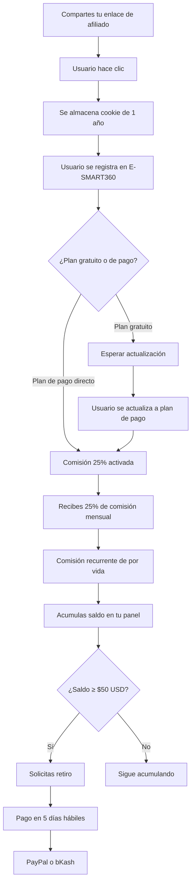

<Update title="Actualización del Programa de Afiliados" date="2026-05-07" />

El **Programa de Afiliados de E-SMART360** te permite ganar una **comisión recurrente del 25 % de por vida** por cada cliente premium o revendedor que refieras. Este programa está diseñado para marketers digitales, creadores de contenido, agencias de marketing, consultores de automatización y cualquier persona con influencia en el mundo del marketing conversacional y la automatización empresarial que desee construir una fuente de ingresos pasivos sostenible en el tiempo.


> ¿Sabías que puedes ganar comisiones tanto por usuarios que se registran directamente como clientes de pago como por usuarios gratuitos que después se convierten en clientes premium? El programa cubre absolutamente ambos casos sin excepción.

En E-SMART360 creemos firmemente en recompensar a quienes nos ayudan a crecer y a difundir nuestra plataforma. Por eso hemos diseñado un programa de afiliados que es transparente, sencillo y altamente rentable. Como afiliado, recibirás una comisión del 25 % de la tarifa mensual de cada usuario que se registre a través de tu enlace de referencia único, y seguirás ganando esa comisión mientras ellos sigan siendo clientes activos. No hay límite de tiempo, no hay tope máximo de ganancias y no hay costos ocultos.

## Resumen Ejecutivo del Programa

| Aspecto | Detalle |
|---|---|
| **Comisión** | 25 % recurrente de por vida sobre cada referencia |
| **Tipo de comisión** | Aplica a clientes premium y revendedores |
| **Upgrades desde free** | Sí, también generan comisión |
| **Modelo de atribución** | Último clic (Last Click Wins) |
| **Duración de la cookie de seguimiento** | 1 año completo (365 días) |
| **Monto mínimo de pago** | $50 USD |
| **Métodos de pago disponibles** | PayPal (global), bKash (Bangladesh) |
| **Plazo de procesamiento de pago** | Hasta 5 días hábiles |
| **Costo para unirse** | Completamente gratuito |
| **Tiempo de aprobación** | Dentro de 24 horas hábiles |
| **Requiere cuenta en la plataforma** | Sí, pero el registro es gratuito |
| **Compatibilidad con programa revendedor** | Sí, se pueden combinar ambos |

## ¿Por qué unirse al Programa de Afiliados de E-SMART360?

Convertirse en afiliado de E-SMART360 es una de las formas más rápidas y efectivas de aumentar tus ingresos y tu impacto en la industria del marketing con chatbots y automatización de WhatsApp. A continuación, te explicamos en detalle cada uno de los beneficios que hacen de este programa una oportunidad única.

### Gana el 25 % de comisión recurrente por cada referencia. De por vida.

En E-SMART360 valoramos genuinamente tu posición como afiliado. Trabajas en marketing. Mueves cosas. Tienes influencia en tu nicho. Puedes comunicarte con las personas en tu esfera de influencia mucho más efectivamente de lo que nosotros podríamos hacerlo como marca.

Esta es precisamente la razón por la que tratamos a nuestros afiliados tan bien. Recibes un 25 % de participación en la tarifa mensual de cada usuario que se registre a través de tu enlace de referencia. Mientras esos usuarios sigan pagando sus suscripciones mensuales, tú seguirás recibiendo tu comisión mes tras mes, año tras año.


> **Ejemplo práctico de ganancias:** Si refieres a 10 clientes que pagan $100/mes cada uno, estarías ganando $250/mes en comisiones recurrentes. Con 40 clientes, ¡$1,000/mes! Y si mantienes esos clientes por 12 meses, habrás ganado $12,000 en total solo de esas referencias.

Imagina el poder de las comisiones recurrentes. A diferencia de los programas de afiliados tradicionales que pagan una comisión única por venta, aquí construyes un flujo de ingresos que crece con el tiempo. Cada nuevo cliente que refieres se suma a tu base de comisiones mensuales, y mientras la plataforma siga dándoles valor, ellos seguirán siendo clientes y tú seguirás ganando.

### Gran retorno de tu esfuerzo

¿Qué tan difícil es conseguir una referencia exitosa? Piénsalo de esta manera: publicar en un grupo de Facebook relevante, enviar un correo electrónico a tu lista de suscriptores o colocar un enlace en tu perfil de LinkedIn con una recomendación auténtica. Cualquiera de estas actividades, que te toman apenas unos minutos, tiene el potencial de generar referencias y activar un flujo constante de dinero recurrente.

La recompensa es verdaderamente enorme considerando el mínimo esfuerzo requerido. No necesitas invertir en publicidad, no necesitas tener un sitio web enorme ni una audiencia masiva. Con una comunidad pequeña pero comprometida, puedes generar ingresos significativos.

### Tabla comparativa de esfuerzo vs. recompensa

| Tipo de contenido | Tiempo invertido | Potencial de referidos | Ingreso mensual potencial |
|---|---|---|---|
| Publicación en grupo de Facebook | 5 minutos | 1-3 referidos | $25 - $75/mes |
| Artículo de blog con reseña | 2 horas | 5-15 referidos | $125 - $375/mes |
| Video tutorial en YouTube | 3-4 horas | 10-30 referidos | $250 - $750/mes |
| Campaña de email marketing | 1 hora | 3-8 referidos | $75 - $200/mes |
| Webinar o sesión en vivo | 1 hora | 5-20 referidos | $125 - $500/mes |

### Comisiones también por usuarios gratuitos que se convierten

Esta es una de las características más potentes y diferenciales del programa: si un usuario se registra en E-SMART360 usando tu enlace de afiliado y comienza con una cuenta gratuita, y luego, semanas o meses después, decide actualizar a un plan premium o de revendedor, **tú recibes la comisión igualmente**. No importa si la conversión ocurre al día siguiente o 11 meses después.


> **Esto significa que tu esfuerzo de hoy puede generar ingresos mañana, la semana que viene o el año que viene.** Gracias a la cookie de seguimiento de 1 año, todas las conversiones dentro de ese período se te acreditan automáticamente.

Este modelo beneficia especialmente a los creadores de contenido que generan leads calificados que necesitan tiempo para evaluar la plataforma antes de comprometerse con un plan de pago. Muchos usuarios quieren probar primero, y cuando encuentran valor, actualizan. Y cuando lo hacen, tú ganas.

## Métodos y Reglas de Pago

El sistema de pagos del Programa de Afiliados de E-SMART360 está diseñado para ser transparente, predecible y confiable.

### ¿Cuándo puedes solicitar un pago?

Puedes solicitar un retiro en cuanto el saldo de tu cuenta de afiliado alcance los **$50 USD**. Este umbral está diseñado para ser accesible: con solo 2 referidos a un plan premium de $100/mes, ya habrás acumulado $50 en comisiones mensuales.

Una vez que solicitas el retiro, el pago se procesa y completa en un plazo máximo de **cinco días hábiles**. No hay demoras innecesarias ni procesos burocráticos complicados.

### Métodos de pago disponibles


### PayPal

Disponible globalmente para afiliados de cualquier país. Recibe tus comisiones directamente en tu cuenta de PayPal de forma rápida y segura. Es el método recomendado para la mayoría de los afiliados internacionales.
  
### bKash

Exclusivo para afiliados en Bangladesh. Método local rápido, sin complicaciones y con comisiones mínimas. Ideal para afiliados que prefieren recibir sus pagos en moneda local.
  
> Asegúrate de tener la información correcta de tu cuenta de pago registrada en tu panel de afiliado. Los pagos enviados a cuentas incorrectas por datos erróneos no podrán ser reembolsados hasta el siguiente ciclo de pagos. Verifica siempre tu correo electrónico de PayPal o tu número de bKash antes de solicitar un retiro.

### Ciclo de facturación y renovación

El sistema de facturación de E-SMART360 sigue un modelo de **timestamp a timestamp**, lo que significa que las renovaciones ocurren exactamente en el mismo minuto del mismo día cada mes o año, sin importar la duración variable de los meses.

**Ejemplo de renovación mensual:**

| Fecha de activación | Fecha de renovación |
|---|---|
| 5 de febrero, 6:35:20 PM | 5 de marzo, 6:35:20 PM |
| 31 de enero, 6:35:20 PM | 28 de febrero, 6:35:20 PM |
| 31 de marzo, 6:35:20 PM | 30 de abril, 6:35:20 PM |

**Ejemplo de renovación anual:**

| Fecha de activación | Fecha de renovación |
|---|---|
| 5 de febrero de 2024, 6:35:20 PM | 5 de febrero de 2025, 6:35:20 PM |
| 28 de febrero de 2024, 6:35:20 PM | 28 de febrero de 2025, 6:35:20 PM |
| 29 de febrero de 2028, 6:35:20 PM | 28 de febrero de 2029, 6:35:20 PM |

Este sistema garantiza que tus comisiones se calculen sobre períodos completos y exactos, sin cargos parciales ni pérdida de tiempo de facturación.

## Pasos para Registrarse como Afiliado

El proceso de registro es sencillo y está diseñado para que puedas empezar a generar ingresos lo antes posible. Sigue estos pasos:


### Inicia sesión o regístrate en E-SMART360

Ingresa a la plataforma de E-SMART360. Si ya tienes una cuenta, simplemente inicia sesión. Si aún no tienes una, el registro es completamente gratuito y solo te tomará un par de minutos. Necesitarás proporcionar tu nombre, correo electrónico y crear una contraseña.
  
### Accede a la sección de Afiliados

Una vez dentro de tu panel de control, busca y haz clic en la opción "Programa de Afiliados" que se encuentra ubicada en la esquina superior derecha de la interfaz. Es fácil de encontrar y está claramente identificada.
  
### Completa el formulario de solicitud de afiliado

Al hacer clic en la opción de Afiliados, se te presentará un formulario con varios campos de información. Deberás proporcionar algunos datos para que podamos verificar tu perfil como potencial afiliado. Esto puede incluir información sobre tu sitio web, tus redes sociales, tu nicho de mercado y cómo planeas promocionar E-SMART360.
  
### Espera la aprobación del equipo de E-SMART360

Una vez que hayas enviado el formulario, el equipo de E-SMART360 revisará tu solicitud. Este proceso de revisión generalmente se completa dentro de las siguientes **24 horas hábiles**. Recibirás una notificación automática en tu correo electrónico cuando tu solicitud sea aprobada o si se requiere información adicional.
  
### Obtén tu enlace de afiliado único

Después de recibir la aprobación, tendrás acceso completo a tu panel de afiliado. En la sección de configuración (Settings), encontrarás tu enlace de referencia único. Este enlace contiene un código especial que permite a E-SMART360 rastrear tus referencias y acreditarte las comisiones correspondientes.
  
### Comienza a promocionar y generar ingresos

Comparte tu enlace de afiliado en tus redes sociales, blog, canal de YouTube, lista de correos electrónicos, grupos de Facebook, foros especializados o en cualquier lugar donde tengas audiencia. Cada clic en tu enlace queda registrado con una cookie de seguimiento con validez de 1 año completo.
  
### ¿Cómo se ve tu panel de afiliado?

Una vez aprobado, tu panel de afiliado en E-SMART360 te proporcionará todas las herramientas que necesitas para gestionar y hacer seguimiento a tus referencias:

```
Panel de Afiliado - E-SMART360
│
├── Resumen (Dashboard)
│   ├── Comisiones del mes actual: $XXX.XX
│   ├── Comisiones totales acumuladas: $X,XXX.XX
│   ├── Total de referidos activos: XX
│   ├── Tasa de conversión: XX%
│   ├── Saldo disponible para retiro: $XXX.XX
│   └── Historial de pagos recibidos
│
├── Enlaces de Referencia
│   ├── Enlace principal: https://esmart360.com/ref/tu-codigo-unico
│   └── Opciones de enlaces personalizados por campaña
│
├── Estadísticas Detalladas
│   ├── Clics totales en tu enlace: XXX
│   ├── Registros gratuitos generados: XXX
│   ├── Conversiones a plan de pago: XX
│   └── Gráfico de rendimiento por período
│
└── Configuración de Pago
    ├── Método de pago principal
    │   ├── PayPal: correo@ejemplo.com
    │   └── bKash: número de teléfono
    └── Historial de solicitudes de pago
```

## Modelo de Atribución: Último Clic Explicado en Detalle

E-SMART360 utiliza el método de atribución de **Último Clic (Last Click Wins)** para determinar qué afiliado recibe el crédito por una referencia. Este modelo es ampliamente reconocido en la industria del marketing de afiliación por ser justo y transparente.

### ¿Cómo funciona exactamente?

El modelo de Último Clic significa que el **último afiliado cuyo enlace fue clickeado por el visitante antes de completar el registro** recibe el crédito completo por la referencia. En otras palabras, gana el afiliado que estuvo presente en el momento de la conversión.

**Ejemplo práctico:**

1. El usuario final ve el enlace del Afiliado A en un blog y hace clic.
2. Una semana después, ve el enlace del Afiliado B en un video de YouTube y hace clic.
3. El usuario se registra en E-SMART360.
4. **Resultado:** El Afiliado B recibe la comisión, porque su enlace fue el último clickeado antes del registro.

Este modelo beneficia a los afiliados que crean contenido persuasivo y convincente que lleva al usuario a tomar la decisión final de registrarse.

### Duración de la cookie de seguimiento: 1 año completo

Cuando una persona hace clic en tu enlace de afiliado, una cookie de seguimiento se almacena en su navegador web con una validez de **365 días**. Esto significa que:

- Si esa persona hace clic hoy pero no se registra hasta dentro de 11 meses, igualmente recibirás el crédito
- No necesitas apresurar a tus leads para que se registren inmediatamente
- Puedes crear contenido perenne (evergreen) que genere referencias durante todo el año
- Las campañas estacionales tienen tiempo suficiente para madurar y convertir


> **¿Por qué 1 año?** En E-SMART360 entendemos que la decisión de adoptar una plataforma de marketing conversacional no se toma a la ligera. Los prospectos necesitan tiempo para investigar, comparar opciones y evaluar si la plataforma es adecuada para su negocio. Un año de cookie te da el margen necesario para que esos leads se conviertan sin presiones.

## Estrategias Avanzadas para Maximizar tus Comisiones

Aquí tienes una guía detallada de estrategias probadas que puedes implementar para sacar el máximo provecho al programa de afiliados:


### Contenido educativo en video

Crea tutoriales paso a paso en YouTube o TikTok mostrando cómo usar E-SMART360 para automatizar ventas en WhatsApp, configurar chatbots, crear campañas de broadcasting o integrar catálogos de productos. Incluye tu enlace de afiliado en la descripción y como tarjeta dentro del video.
  
### Comparativas detalladas y reseñas honestas

Publica comparativas en tu blog o canal entre E-SMART360 y otras plataformas del mercado. Las reseñas detalladas con tablas comparativas, pros y contras generan una confianza profunda en tu audiencia y tienen altas tasas de conversión.
  
### Participación activa en comunidades

Únete a grupos de Facebook, subreddits, foros de marketing digital, comunidades de emprendedores y grupos de WhatsApp/Telegram de negocios. Participa genuinamente ofreciendo valor, respondiendo preguntas y compartiendo tu enlace de afiliado cuando sea natural y relevante.
  
### Estrategia 4: Email Marketing Segmentado

Si tienes una lista de correos electrónicos, puedes crear una secuencia de emails educativos sobre automatización de WhatsApp y marketing conversacional. En el último email de la secuencia, presentas E-SMART360 como la solución recomendada con tu enlace de afiliado. La tasa de conversión del email marketing suele ser significativamente más alta que la de las redes sociales.

### Estrategia 5: Webinars y Sesiones en Vivo

Organiza webinars gratuitos donde enseñes a tu audiencia cómo automatizar sus negocios con chatbots. Durante la sesión, muestra casos prácticos usando E-SMART360 y al final ofrece tu enlace de afiliado con un incentivo adicional (como una guía exclusiva o una plantilla gratuita). Las demostraciones en vivo generan alta confianza y conversión.

### Estrategia 6: Contenido Evergreen en tu Blog

Publica artículos optimizados para SEO sobre temas como "cómo crear un chatbot de WhatsApp sin código", "mejores prácticas de marketing conversacional", o "guía completa de automatización de ventas". Estos artículos seguirán atrayendo tráfico orgánico meses o años después de publicados, y cada visitante es una oportunidad de conversión.

### Plan de acción semanal para nuevos afiliados

| Día | Actividad | Tiempo estimado |
|---|---|---|
| Lunes | Publicar 1 artículo de blog con reseña/comparativa | 2 horas |
| Martes | Compartir en 3 grupos de Facebook relevantes | 15 minutos |
| Miércoles | Grabar y subir 1 video tutorial corto | 1-2 horas |
| Jueves | Responder preguntas en foros (Reddit, Quora) | 30 minutos |
| Viernes | Enviar email a tu lista promocionando E-SMART360 | 30 minutos |
| Sábado | Analizar estadísticas del panel de afiliado | 15 minutos |
| Domingo | Planificar contenido de la próxima semana | 30 minutos |

## ¿Quiénes deberían unirse al Programa de Afiliados?

El Programa de Afiliados de E-SMART360 está diseñado para una amplia variedad de perfiles profesionales. Evalúa si encajas en alguna de estas categorías:


### Marketers digitales

Profesionales del marketing digital que ya promocionan herramientas SaaS y plataformas de automatización. Puedes añadir E-SMART360 a tu cartera de productos recomendados y generar comisiones recurrentes estables sin esfuerzo adicional significativo.
  
### Reviewers y críticos de SaaS

Blogueros especializados, YouTubers y creadores de contenido que se dedican a reseñar software empresarial, herramientas de marketing y plataformas de automatización. Una reseña honesta y detallada puede generar referencias durante años gracias a la cookie de 1 año.
  
### Dueños y fundadores de agencias

Agencias de marketing digital, agencias de chatbots y consultoras de automatización que trabajan con múltiples clientes. Pueden referir a sus propios clientes y ganar comisiones mientras ofrecen un servicio de implementación de valor añadido.
  
### Consultores especializados en chatbots

Consultores independientes que ayudan a empresas a implementar automatización y chatbots. Recomendar E-SMART360 a tus clientes es un win-win: ellos obtienen una plataforma excelente y tú generas ingresos pasivos recurrentes.
  
### Influencers en automatización y negocios

Personas con influencia en el nicho de business automation, e-commerce, marketing digital y emprendimiento. Un solo post, tweet o historia puede llegar a miles de personas y generar decenas de referencias.
  
### Educadores y creadores de cursos

Profesionales que crean cursos online, plantillas, guías y materiales educativos sobre marketing digital y automatización. Pueden incluir E-SMART360 como herramienta recomendada dentro de sus materiales y generar comisiones de cada estudiante que se registre.
  
## Beneficios Adicionales del Ecosistema E-SMART360

Cuando promocionas E-SMART360 como afiliado, no solo estás recomendando una herramienta más. Estás respaldando una plataforma integral de marketing conversacional con ventajas competitivas reales que tus referidos apreciarán:

### Sin markup en la API de WhatsApp

A diferencia de otras plataformas del mercado que añaden entre un 20 % y un 25 % de recargo sobre las tarifas oficiales de la API de WhatsApp Cloud, **E-SMART360 cobra 0 % de markup**. Tus referidos pagan exclusivamente el costo real que Meta (propietaria de WhatsApp) cobra por las conversaciones, sin ningún sobrecargo.

Esto se traduce en ahorros significativos, especialmente para negocios con alto volumen de conversaciones. Por ejemplo, para una empresa que envía 10,000 conversaciones de marketing al mes en Estados Unidos, otras plataformas podrían cobrar $460.80 mientras que con E-SMART360 pagarían solo $384.00, un ahorro de $76.80 mensuales solo en ese tipo de conversación.


> **Dato clave para tus promociones:** Menciona siempre que E-SMART360 no tiene markup en la API de WhatsApp. Es uno de los diferenciadores más valorados por empresas conscientes de sus costos operativos.

### Planes transparentes con créditos ilimitados

E-SMART360 ofrece una variedad de planes de suscripción diseñados para empresas de todos los tamaños:

- **Plan gratuito:** Ideal para pequeñas empresas que están comenzando con el marketing de WhatsApp. Sin inversión inicial, con funciones básicas para explorar la plataforma.
- **Planes de pago:** Cuatro planes diferentes con características progresivamente más avanzadas. Cada plan incluye **créditos de mensajería ilimitados**, sin topes de uso ni restricciones en la cantidad de conversaciones que puedes iniciar.
- **Planes empresariales:** Para empresas con necesidades específicas como mayor cantidad de contactos, miembros del equipo o números de WhatsApp personalizados. Soluciones a medida con precios personalizados.

### Facturación clara y predecible

El sistema de facturación de E-SMART360 está diseñado para ser completamente transparente:

- **Ciclos exactos:** Las renovaciones mensuales ocurren exactamente un mes después de la activación, manteniendo la misma hora. Las renovaciones anuales ocurren exactamente un año después.
- **Sin cargos parciales:** Cada período de facturación es completo. No hay cargos proporcionales por meses cortos.
- **Sin cargos ocultos:** El precio que ves es el precio que pagas. No hay tarifas de configuración, cargos por cancelación ni sorpresas en tu factura.
- **Cambio de plan con ajuste proporcional:** Si un usuario necesita cambiar de plan a mitad del ciclo, se realizan ajustes prorrateados para una transición sin problemas.

### Soporte dedicado multicanal

Tus referidos tendrán acceso a un ecosistema completo de soporte:

- **Knowledgebase:** Documentación exhaustiva con guías paso a paso, tutoriales y resolución de problemas comunes.
- **Tutoriales en video:** Biblioteca de videos instructivos que cubren desde la configuración inicial hasta funciones avanzadas.
- **Soporte por WhatsApp:** Asistencia en tiempo real directamente a través de WhatsApp para consultas urgentes.
- **Sistema de tickets:** Plataforma de soporte técnica para resolver problemas más complejos con seguimiento dedicado.
- **Soporte de incorporación (onboarding):** Proceso guiado paso a paso para nuevos usuarios, asegurando que aprovechen al máximo la plataforma desde el primer día.

## Casos de Uso Reales para tu Contenido Promocional

Aquí tienes ejemplos detallados y convincentes que puedes usar en tu contenido para mostrar el valor tangible de E-SMART360 a tu audiencia:

### Caso 1: Tienda de E-commerce con 500 pedidos mensuales

**Problema:** Una tienda online recibía decenas de consultas diarias sobre el estado de sus pedidos. El equipo de atención al cliente estaba desbordado y los tiempos de respuesta se alargaban hasta 24 horas.

**Solución con E-SMART360:**

- Automatización de notificaciones de confirmación de pedido, preparación y envío mediante plantillas de WhatsApp
- Implementación de chatbot con respuestas automáticas a preguntas frecuentes (estado de pedido, políticas de devolución, horarios)
- Recordatorios automáticos de carritos abandonados con ofertas personalizadas
- Integración con WooCommerce/Shopify para sincronización de datos en tiempo real

**Resultados medibles:**

- Reducción del 40 % en consultas entrantes al servicio al cliente
- Aumento del 15 % en recuperación de carritos abandonados
- Mejora del 35 % en la satisfacción del cliente (encuestas post-compra)
- El equipo de soporte pudo enfocarse en consultas complejas de alto valor


> **Idea para tu contenido:** Crea un "estudio de caso" en formato video o artículo usando este ejemplo. Muestra capturas de pantalla simuladas de cómo se ven las automatizaciones. Las demostraciones visuales convierten mucho mejor que las descripciones textuales.

### Caso 2: Agencia de Marketing Digital con 5 clientes

**Problema:** Una agencia gestionaba campañas de marketing para 5 clientes simultáneamente y necesitaba una plataforma que les permitiera centralizar la comunicación, segmentar audiencias y medir resultados.

**Solución con E-SMART360:**

- Gestión de múltiples números de WhatsApp desde una sola plataforma
- Segmentación avanzada de contactos por etiquetas, campos personalizados y comportamiento
- Campañas de broadcasting dirigidas con contenido personalizado usando variables dinámicas
- Plantillas de marketing con botones CTA (Call to Action) para impulsar conversiones
- Inbox compartido para que todo el equipo gestionara las conversaciones simultáneamente

**Resultados medibles:**

- Incremento del 300 % en la eficiencia operativa del equipo
- Reducción del tiempo de gestión de campañas de 20 horas semanales a 5 horas
- Aumento del 22 % en la tasa de clics en campañas de broadcasting
- Los 5 clientes reportaron un incremento promedio del 18 % en ventas atribuidas a WhatsApp

### Caso 3: Consultor de Automatización Freelance

**Problema:** Un consultor independiente ayudaba a pequeñas empresas a implementar automatización en sus procesos de ventas, pero perdía tiempo configurando cada integración manualmente.

**Solución con E-SMART360:**

- Uso de los flujos de webhook para conectar la plataforma con CRM y sistemas de gestión
- Integración con Google Sheets para sincronizar datos de clientes automáticamente
- Configuración de respuestas automáticas inteligentes con el AI Agent
- Creación de flujos condicionales con User Input Flow para capturar información de leads

**Resultados medibles:**

- Reducción del 60 % en el tiempo de configuración por cliente
- Capacidad para atender 3 veces más clientes simultáneamente
- Ingresos mensuales incrementados en un 150 %
- Mayor satisfacción del cliente por implementaciones más rápidas y completas

## Preguntas Frecuentes Detalladas


### ¿Cuánto exactamente puedo ganar con el Programa de Afiliados?

Ganas una comisión recurrente del 25 % de por vida por cada referencia exitosa a un plan premium o de revendedor. No hay tope máximo de ganancias. Para darte una idea: si refieres 20 clientes que pagan un promedio de $100/mes cada uno, estarías ganando $500/mes en comisiones recurrentes. Si mantienes esos clientes por 2 años, habrás ganado $12,000. Y si sigues añadiendo clientes nuevos cada mes, tus ingresos seguirán creciendo de forma compuesta.

### ¿Realmente gano comisión si alguien se registra gratis primero y después paga?

Sí, absolutamente. Esta es una de las mejores características del programa. Si un prospecto hace clic en tu enlace, se registra con una cuenta gratuita y luego, en cualquier momento dentro del año siguiente (gracias a la cookie de 1 año), decide actualizar a un plan de pago, tú recibirás la comisión completa del 25 %. Esto aplica incluso si la actualización ocurre 11 meses después del registro inicial.

### ¿Cuál es el monto mínimo para solicitar un pago y cómo lo recibo?

El monto mínimo para solicitar un retiro es de $50 USD. Una vez alcanzado este umbral, puedes solicitar el pago desde tu panel de afiliado. Los pagos se procesan en un máximo de 5 días hábiles y están disponibles a través de PayPal (para afiliados internacionales) o bKash (exclusivo para afiliados en Bangladesh).

### ¿Cómo funciona exactamente el seguimiento de mis referidos?

E-SMART360 utiliza un modelo de atribución de "Último Clic" (Last Click Wins). Esto significa que el afiliado cuyo enlace fue clickeado inmediatamente antes del registro recibe el crédito de la referencia. Las cookies de seguimiento tienen una validez de 1 año completo (365 días). Puedes hacer seguimiento de todos tus clics, registros y conversiones en tiempo real desde tu panel de afiliado.

### ¿Hay algún costo oculto para unirse al programa?

No. Unirse al Programa de Afiliados de E-SMART360 es completamente gratuito. No hay cuotas de inscripción, tarifas de mantenimiento ni costos recurrentes. Solo necesitas tener una cuenta en la plataforma (el registro también es gratuito) y completar el formulario de solicitud de afiliado. No hay absolutamente ningún costo oculto en ninguna etapa del proceso.

### ¿Puedo combinar el programa de afiliados con el programa de revendedor White Label?

Sí, absolutamente. Muchos de nuestros partners estratégicos combinan ambos programas para maximizar sus ingresos. Como afiliado, refieres clientes directamente y ganas el 25 % de comisión. Como revendedor White Label, puedes personalizar la plataforma con tu propia marca y venderla a tus clientes con tu propio margen. Te recomendamos consultar con nuestro equipo de partners para diseñar la estrategia que maximice tus ingresos según tu perfil y mercado.

### ¿Cuánto tiempo tarda la aprobación de mi solicitud de afiliado?

El equipo de E-SMART360 revisa las solicitudes de afiliado dentro de las 24 horas hábiles siguientes al envío del formulario. En la mayoría de los casos, la aprobación ocurre en menos de 12 horas. Recibirás una notificación automática por correo electrónico cuando tu cuenta de afiliado sea aprobada, junto con instrucciones para acceder a tu panel y obtener tu enlace de referencia.

### ¿Qué métodos de pago están disponibles para recibir mis comisiones?

Actualmente ofrecemos dos métodos de pago: PayPal (disponible globalmente para afiliados de cualquier país) y bKash (exclusivo para afiliados en Bangladesh). Los pagos se procesan una vez alcanzado el mínimo de $50 USD en un máximo de 5 días hábiles. Estamos evaluando añadir más métodos de pago en el futuro, incluyendo transferencias bancarias directas y criptomonedas.

### ¿Puedo promocionar E-SMART360 en cualquier país?

Sí, el Programa de Afiliados de E-SMART360 está abierto a afiliados de cualquier país del mundo. La plataforma soporta múltiples idiomas y monedas, y la API de WhatsApp Cloud está disponible en la mayoría de los países. Tus referidos pueden estar en cualquier parte del mundo y tu enlace de afiliado funcionará correctamente.

### ¿Recibiré materiales promocionales para ayudarme a promocionar la plataforma?

Sí, como af
iliado aprobado, tendrás acceso a una biblioteca de recursos promocionales que incluye banners, capturas de pantalla, descripciones prediseñadas para redes sociales, plantillas de email y guías de mejores prácticas. Además, nuestro equipo de partners está disponible para ayudarte a crear estrategias personalizadas y responder cualquier pregunta que tengas sobre cómo promocionar la plataforma de manera efectiva.

## Estructura de Precios de E-SMART360 (Para tus Promociones)

Cuando promociones E-SMART360, es importante que conozcas a fondo los planes de precios para poder responder preguntas de tus referidos con confianza. Aquí tienes una guía detallada:

### Planes de Suscripción

| Tipo de Plan | Ideal para | Características principales | Ciclo de facturación |
|---|---|---|---|
| **Gratuito** | Pequeñas empresas que quieren probar la plataforma | Funciones básicas, número limitado de contactos, chatbot simple | Sin costo |
| **Básico** | Autónomos y microempresas | Broadcast ilimitados, chatbot avanzado, inbox compartido, integraciones esenciales | Mensual o anual |
| **Profesional** | Pymes en crecimiento | Broadcast ilimitados, chatbot con IA, catálogo de productos, múltiples números de WhatsApp, integraciones completas, webhooks | Mensual o anual |
| **Empresarial** | Grandes empresas y agencias | Todo lo anterior + AI Agent avanzado, etiquetas y campos personalizados, API completa, soporte prioritario, onboarding dedicado | Mensual o anual |
| **Enterprise (Medida)** | Corporaciones con necesidades específicas | Solución personalizada, contactos ilimitados, miembros de equipo ilimitados, números de WhatsApp ilimitados, SLA garantizado | Personalizado |

### Costos de la API de Conversaciones de WhatsApp

Es importante que entiendas cómo funciona la facturación de conversaciones de WhatsApp para poder explicarlo a tus referidos. WhatsApp cobra por conversación (ventana de 24 horas), no por mensaje individual:

| Categoría de conversación | Descripción | Ejemplo de uso |
|---|---|---|
| **Marketing** | Promociones, ofertas, anuncios de productos, campañas estacionales | "¡Oferta especial este mes! 20 % de descuento en todos los productos" |
| **Utilidad** | Actualizaciones de pedidos, confirmaciones, notificaciones de cuenta | "Tu pedido #12345 ha sido enviado. Número de seguimiento: 1Z999AA10123456784" |
| **Autenticación** | Verificaciones seguras, códigos de acceso de un solo uso | "Tu código de verificación es: 847291. Válido por 5 minutos." |
| **Servicio** | Consultas de clientes, soporte técnico, atención al cliente | Conversaciones iniciadas por el cliente dentro de la ventana de 24 horas |


> **Dato importante para tus promociones:** Cada cuenta de negocio de WhatsApp recibe **1,000 conversaciones de servicio gratuitas por mes** en todos los números telefónicos de la empresa. Esto se reinicia al comienzo de cada mes. Además, si un cliente llega a través de un anuncio de Click-to-WhatsApp o un botón de Facebook Page, la conversación de entrada es gratuita y dura 72 horas.

### Tabla de Tarifas de Conversación por Región (Ejemplos)

Las tarifas exactas varían por país y categoría. Aquí tienes algunos ejemplos representativos:

| Mercado | Marketing | Utilidad | Autenticación | Servicio |
|---|---|---|---|---|
| Norteamérica | $0.0216 | $0.0035 | $0.0035 | $0.00 |
| India | $0.0092 | $0.0014 | $0.0014 | $0.00 |
| Brasil | $0.0540 | $0.0059 | $0.0059 | $0.00 |
| México | $0.0377 | $0.0073 | $0.0073 | $0.00 |
| Reino Unido | $0.0457 | $0.0190 | $0.0190 | $0.00 |
| Alemania | $0.1181 | $0.0476 | $0.0476 | $0.00 |
| España | $0.0531 | $0.0173 | $0.0173 | $0.00 |
| Colombia | $0.0108 | $0.0002 | $0.0002 | $0.00 |
| Argentina | $0.0534 | $0.0250 | $0.0250 | $0.00 |
| Resto de Asia Pacífico | $0.0633 | $0.0098 | $0.0098 | $0.00 |

**Nota:** Las tarifas de servicio ($0.00) se aplican solo a conversaciones iniciadas por el cliente dentro de la ventana de 24 horas. Las tarifas están expresadas en USD y están sujetas a cambios por parte de Meta. E-SMART360 no añade ningún markup a estas tarifas.

### ¿Por qué esto es importante para tus promociones?

Cuando entiendes la estructura de precios y puedes explicarla claramente, generas más confianza en tus referidos potenciales. Puedes destacar que:

1. **E-SMART360 no añade markup** a las tarifas oficiales de WhatsApp (otras plataformas cobran 20-25 % extra)
2. **Los créditos de mensajería son ilimitados** en los planes de pago, sin sorpresas
3. **Las primeras 1,000 conversaciones de servicio son gratuitas** cada mes
4. **Las conversaciones de entrada por anuncios son gratuitas** y duran 72 horas
5. **La facturación es transparente y predecible**, con ciclos exactos

## Cómo la Inteligencia Artificial de E-SMART360 Beneficia a tus Referidos

Uno de los aspectos más atractivos de E-SMART360 para tus referidos potenciales es la integración de inteligencia artificial. Puedes destacar estas capacidades en tus promociones:

### AI Agent para Respuestas Inteligentes

El AI Agent de E-SMART360 permite a los negocios:
- Entrenar un asistente de IA con FAQs, URLs, archivos y datos de Google Sheets
- Proporcionar respuestas naturales y contextuales a los clientes 24/7
- Aprender y mejorar con cada interacción
- Manejar múltiples conversaciones simultáneamente sin intervención humana

### Automatización Inteligente de Conversaciones

- **User Input Flow:** Captura información compleja de los usuarios a través de flujos conversacionales interactivos
- **Flujos Condicionales:** Deriva conversaciones según las respuestas del usuario
- **Listas Dinámicas:** Muestra opciones personalizadas basadas en el perfil del cliente
- **Integración HTTP API:** Conecta el chatbot con sistemas externos para acciones automatizadas

## Diagrama del Flujo de Ingresos como Afiliado



## Consejos Finales para Afiliados Exitosos

Basados en la experiencia de nuestros afiliados con mejor rendimiento, aquí tienes algunos consejos clave:


### Sé auténtico

La autenticidad vende más que cualquier argumento de venta. Comparte tu experiencia genuina con E-SMART360. Si usas la plataforma, muestra cómo te ha beneficiado. Las recomendaciones honestas generan confianza y conversiones más sólidas.
  
### Enfócate en el valor, no en la comisión

Cuando crees contenido, céntrate en el valor que E-SMART360 aporta a los negocios. Habla sobre cómo resuelve problemas reales: automatización, ahorro de tiempo, aumento de ventas. La comisión es un beneficio para ti, no el argumento de venta para tu audiencia.
  
### Diversifica tus canales

No dependas de un solo canal. Combina blog, YouTube, redes sociales, email marketing y comunidades. Cada canal atrae a un tipo diferente de audiencia y diversificar reduce el riesgo y maximiza tu alcance.
  
### Mide y optimiza

Usa las estadísticas de tu panel de afiliado para entender qué funciona y qué no. ¿Qué contenido genera más clics? ¿Qué canal tiene mejor tasa de conversión? Ajusta tu estrategia basándote en datos, no en suposiciones.
  
## Conclusión

El Programa de Afiliados de E-SMART360 representa una oportunidad real y probada de generar ingresos pasivos y recurrentes promoviendo una plataforma sólida, transparente y en constante crecimiento en el mercado de la automatización conversacional.

Con una comisión del 25 % de por vida, cookies de seguimiento de 1 año, sin costo de entrada, pagos desde $50 USD y una plataforma que realmente aporta valor a sus usuarios, es uno de los programas de afiliados más atractivos y competitivos del sector de marketing conversacional y SaaS.


> **¿Listo para empezar tu viaje como afiliado?** Inicia sesión o regístrate en E-SMART360, dirígete a la sección de Afiliados desde tu panel y completa tu solicitud. El equipo de E-SMART360 la revisará en menos de 24 horas hábiles. Una vez aprobado, tendrás acceso inmediato a tu panel, tu enlace de referencia único y todas las herramientas que necesitas para comenzar a construir tu flujo de ingresos pasivos. ¡Te esperamos!

---

*E-SMART360 se reserva el derecho de modificar los términos del Programa de Afiliados en cualquier momento. Los afiliados serán notificados de cualquier cambio significativo con al menos 30 días de antelación. Consulta la Política de Afiliados completa en nuestro sitio web para más detalles.*

## Comparativa: E-SMART360 vs. Otras Plataformas (Para tus Argumentos de Venta)

Cuando promociones E-SMART360, es útil conocer las diferencias clave con otras plataformas del mercado. Aquí tienes una tabla comparativa que puedes usar en tu contenido:

| Característica | E-SMART360 | Plataforma A (otra plataforma) | Plataforma B (Gallabox) | Plataforma C (Interakt) |
|---|---|---|---|---|
| **Markup en API de WhatsApp** | 0 % | 20 % extra | 15 % extra | 20 % extra |
| **Comisión de afiliados** | 25 % recurrente de por vida | Comisión única o temporal | Comisión única | Recurrente limitada |
| **Cookie de afiliado** | 1 año | 30-90 días | 30-90 días | 30-90 días |
| **Mínimo de pago** | $50 USD | $100+ USD | $100+ USD | $100+ USD |
| **Plan gratuito** | Sí | Limitado | No | Limitado |
| **Créditos de mensajería ilimitados** | Sí (planes de pago) | No (topes) | No (topes) | No (topes) |
| **Chatbot con IA integrado** | Sí (AI Agent) | Sí | No | Limitado |
| **Catálogo de WhatsApp** | Sí | Sí | Sí | No |
| **WhatsApp Flows (Formularios)** | Sí | No | Sí | No |
| **Inbox multicanal** | WhatsApp, Instagram, Facebook | Solo WhatsApp | WhatsApp + otros | WhatsApp + otros |
| **Webhook Workflow** | Sí | Sí | Limitado | No |
| **Integración Google Sheets** | Sí | Sí | Sí | No |


> **¿Por qué es útil esta tabla?** Cuando crees contenido comparativo, esta tabla te da argumentos sólidos para mostrar por qué E-SMART360 es superior. El 0 % de markup y la comisión del 25 % recurrente de por vida son dos de los diferenciadores más poderosos para atraer tanto a usuarios como a otros afiliados potenciales.

## Preguntas Frecuentes Adicionales


### ¿E-SMART360 ofrece algún tipo de capacitación o recursos para afiliados?

Sí. Como afiliado aprobado, tendrás acceso a una sección exclusiva con recursos promocionales que incluyen: guías de mejores prácticas, banners publicitarios, modelos de correo electrónico, capturas de pantalla autorizadas de la plataforma, descripciones prediseñadas para redes sociales y acceso prioritario a nuevas funcionalidades para que puedas probarlas y reseñarlas antes que el público general. También puedes contactar a nuestro equipo de partners para estrategias personalizadas.

### ¿Qué sucede si un referido cancela su suscripción? ¿Pierdo todas las comisiones futuras?

Si un referido cancela su suscripción activa, dejarás de recibir comisiones por ese cliente en particular a partir del mes siguiente a la cancelación. Sin embargo, las comisiones acumuladas y pagadas hasta ese momento son tuyas y no se revierten. Además, si el mismo cliente se reactiva en el futuro dentro del período de cookie de 1 año, las comisiones se reanudarán automáticamente.

### ¿Puedo tener múltiples enlaces de afiliado para diferentes campañas o canales?

Sí, desde tu panel de afiliado puedes generar múltiples enlaces de referencia personalizados para diferentes campañas, canales o tipos de contenido. Esto te permite hacer un seguimiento granular de qué estrategias están funcionando mejor y optimizar tu rendimiento. Por ejemplo, puedes tener un enlace diferente para tu blog, otro para YouTube y otro para tus campañas de email.

### ¿Cómo afectan los impuestos a mis comisiones de afiliado?

E-SMART360 no retiene impuestos sobre las comisiones de afiliados. Eres responsable de declarar y pagar los impuestos aplicables según las leyes de tu país. Te recomendamos consultar con un contador o asesor fiscal para entender tus obligaciones específicas. E-SMART360 proporciona un historial detallado de tus pagos que puedes descargar desde tu panel de afiliado para facilitar tu declaración de impuestos.

### ¿Hay límite en la cantidad de referidos que puedo generar?

No, no hay ningún límite en la cantidad de referidos que puedes generar. Puedes referir tantos clientes como quieras y no hay techo máximo en las comisiones que puedes ganar. De hecho, nuestros afiliados con mejor rendimiento gestionan cientos de referidos activos y generan ingresos mensuales de cuatro a cinco cifras. Tu éxito solo está limitado por tu alcance y la calidad de tus promociones.

### ¿Puedo promocionar E-SMART360 a través de anuncios pagados (Google Ads, Facebook Ads, etc.)?

Sí, puedes utilizar anuncios pagados para promocionar tu enlace de afiliado, siempre y cuando cumplas con nuestras políticas de marca registrada y no utilices términos protegidos como palabras clave en plataformas publicitarias sin autorización. Te recomendamos revisar la Política de Afiliados completa y consultar con nuestro equipo si tienes dudas sobre casos específicos de publicidad pagada.

### ¿Qué tipo de soporte recibo como afiliado de E-SMART360?

Como afiliado, tienes acceso a soporte prioritario a través de nuestro sistema de tickets. Además, recibirás actualizaciones periódicas sobre nuevas funcionalidades, cambios en la plataforma y oportunidades promocionales. Nuestro equipo de partners está disponible para responder preguntas, resolver problemas técnicos con tu panel de afiliado y ayudarte a optimizar tus estrategias de promoción.

### ¿E-SMART360 tiene un programa de referidos para clientes existentes (no afiliados)?

Sí, además del Programa de Afiliados para partners, E-SMART360 también ofrece un sistema de referidos para clientes existentes que quieran recomendar la plataforma a otros negocios. Si conoces a alguien que ya sea cliente de E-SMART360, puedes preguntarle si tiene un código de referido para compartir contigo. El programa de afiliados y el de referidos de clientes son complementarios y están diseñados para incentivar el crecimiento de la comunidad E-SMART360 en todos los niveles.

## Glosario de Términos Clave para Afiliados

| Término | Definición en el contexto del programa |
|---|---|
| **Comisión recurrente** | Pago que recibes cada mes mientras tu referido siga siendo cliente activo |
| **Atribución Último Clic** | Modelo donde el afiliado cuyo enlace fue clickeado justo antes del registro recibe el crédito |
| **Cookie de seguimiento** | Archivo almacenado en el navegador del usuario que permite rastrear el origen de la referencia |
| **Markup** | Recargo adicional que algunas plataformas añaden a las tarifas oficiales de la API de WhatsApp |
| **Conversación de WhatsApp** | Ventana de 24 horas donde se pueden enviar mensajes ilimitados a un cliente |
| **Plan premium** | Cualquier plan de pago de E-SMART360 (Básico, Profesional, Empresarial) |
| **Plan de revendedor** | Plan White Label que permite personalizar la plataforma con marca propia |
| **Upgrade desde free** | Proceso donde un usuario gratuito se convierte en cliente de pago |
| **bKash** | Servicio de transferencia de dinero móvil en Bangladesh |
| **PayPal** | Plataforma de pagos online global |

## Resumen de Beneficios para Compartir en Redes Sociales

Preparamos algunos textos cortos que puedes usar directamente en tus publicaciones:

> 📢 ¿Buscas ingresos pasivos? El Programa de Afiliados de E-SMART360 paga 25 % de comisión recurrente de por vida. Sin costo, sin límites y con cookies de 1 año. 🚀

> 💰 Gana dinero mientras duermes. Refiere E-SMART360, la plataforma #1 de automatización WhatsApp, y recibe el 25 % de comisión mensual de por vida. ¡Sin markup en API, sin límite de ganancias!

> 🚀 ¿Eres marketer, creador o agencia? Únete al programa de afiliados de E-SMART360 y gana 25 % recurrente. Cookies de 1 año, pago desde $50 USD, sin costo de entrada. ¡Empieza hoy!

> 🔥 Comparativa real: E-SMART360 paga 25 % de comisión recurrente de por vida a sus afiliados. Otras plataformas pagan comisión única. ¿Tú qué prefieres? 🧵👇

## Próximos Pasos

Si has llegado hasta aquí, estás listo para comenzar tu camino como afiliado de E-SMART360. Recuerda los pasos clave:

1. **Regístrate gratis** en E-SMART360 si aún no tienes cuenta
2. **Solicita tu participación** en el Programa de Afiliados desde tu panel
3. **Espera la aprobación** (generalmente menos de 24 horas hábiles)
4. **Obtén tu enlace** de referencia único desde la configuración de tu panel
5. **Comienza a promocionar** usando las estrategias y recursos compartidos en esta guía
6. **Monitorea tus resultados** y optimiza tu estrategia continuamente


> El Programa de Afiliados de E-SMART360 está diseñado para ser una fuente de ingresos sostenible y de largo plazo. Con dedicación constante y contenido de calidad, puedes construir un flujo de ingresos pasivos que crezca mes tras mes. ¡Te deseamos mucho éxito en esta nueva aventura!
