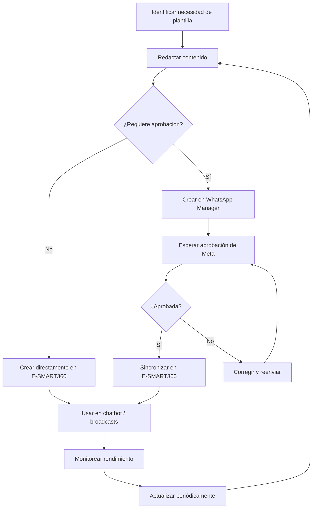

> **Actualización de guía de plantillas (2026-05-06)**
> Se agregaron secciones sobre límites de caracteres, motivos de rechazo, guía de plantillas de utilidad vs marketing, y sincronización desde WhatsApp Manager.

# Actualiza Plantillas de WhatsApp Fácilmente en E-SMART360

Mantener tus plantillas de WhatsApp actualizadas es esencial para una comunicación efectiva con tu audiencia. Con E‑SMART360 puedes sincronizar y actualizar fácilmente las plantillas creadas directamente en la plataforma o desde el Administrador de Plantillas de WhatsApp. En esta guía completa te explicamos todo lo que necesitas saber: desde la creación y actualización de plantillas hasta la resolución de problemas de aprobación.

## ¿Qué son las plantillas de WhatsApp y por qué son importantes?

Las plantillas de mensajes de WhatsApp son mensajes predefinidos que las empresas pueden enviar a sus clientes incluso después de haber superado la ventana de 24 horas desde la última interacción. Son ideales para enviar actualizaciones, confirmaciones, recordatorios, notificaciones transaccionales y campañas de marketing.


> **Recuerda:** WhatsApp exige que los mensajes iniciados por la empresa (es decir, aquellos fuera de la ventana de 24 horas de conversación) utilicen plantillas previamente aprobadas por Meta. Mantenerlas actualizadas y en cumplimiento garantiza que tus comunicaciones lleguen correctamente a tus clientes sin bloqueos ni restricciones.

### Beneficios clave de usar plantillas actualizadas

| Beneficio | Descripción |
|-----------|-------------|
| **Comunicación mejorada** | Las actualizaciones periódicas garantizan mensajes relevantes y atractivos para tu audiencia. |
| **Consistencia de marca** | Mantén una voz y un mensaje de marca coherente en todas tus comunicaciones. |
| **Cumplimiento normativo** | Cumple con las políticas y directrices de WhatsApp utilizando plantillas aprobadas y actualizadas. |
| **Eficiencia operativa** | Ahorra tiempo reutilizando y modificando plantillas existentes en lugar de crear nuevas desde cero. |
| **Mejor calidad de cuenta** | Las plantillas aprobadas contribuyen a mantener una buena calificación de calidad en WhatsApp, lo que se traduce en mejores límites de mensajería. |

## Requisitos previos

Antes de comenzar con la gestión de plantillas, asegúrate de tener lo siguiente:

- Una **cuenta de WhatsApp Business** conectada a E‑SMART360.
- Acceso a **WhatsApp Cloud API** (necesario si planeas sincronizar plantillas desde el Administrador de WhatsApp).
- Una **idea clara del contenido de tu mensaje**, incluyendo las variables, botones o pies de página que necesites.
- Tu **cuenta de negocio de Meta** verificada (Business Manager).


> **Consejo:** Si aún no has conectado tu número de WhatsApp Business a E‑SMART360, revisa la guía de conexión de WhatsApp Business API antes de continuar.

## Diferencias entre plantillas de utilidad y plantillas de marketing

Es fundamental conocer la categoría de cada plantilla, ya que cada una tiene reglas y casos de uso distintos. WhatsApp clasifica las plantillas en dos categorías principales:


### 🧾 Plantillas de Utilidad

Mensajes transaccionales y funcionales. No deben ser promocionales.
    
    **Ejemplos:**
    - Confirmación de pedido
    - Recibo de pago
    - Recordatorio de cita
    - Actualización de envío
    - Verificación de cuenta
    
    **Regla clave:** Si una plantilla combina contenido de utilidad y marketing, será clasificada como marketing.
  
### 📢 Plantillas de Marketing

Mensajes promocionales con mayor flexibilidad creativa.
    
    **Ejemplos:**
    - Ofertas y descuentos
    - Lanzamiento de productos
    - Invitaciones a eventos
    - Reenganche de clientes
    - Recomendaciones personalizadas
    
    **Regla clave:** Deben incluir siempre una opción para darse de baja (opt-out).
  
### Ver ejemplos completos de plantillas de utilidad

Aquí tienes ejemplos redactados correctamente:

  - **Confirmación de pedido:** "Hola {{1}}, tu pedido #{{2}} ha sido confirmado. Recibirás una notificación cuando sea enviado. Gracias por comprar en {{3}}."
  - **Recibo de pago:** "Hola {{1}}, tu pago de ${{2}} se ha procesado exitosamente. Tu factura #{{3}} está disponible en tu panel de cliente."
  - **Recordatorio de cita:** "Recordatorio: tu cita con {{1}} está agendada para el {{2}} a las {{3}}. Responde CONFIRMAR para confirmar o CANCELAR para reprogramar."
  - **Actualización de envío:** "¡Buenas noticias {{1}}! Tu pedido #{{2}} ya está en camino. Número de guía: {{3}}. Fecha estimada de entrega: {{4}}."

  *Nota: Estos ejemplos son referenciales. WhatsApp puede categorizar mensajes similares de forma distinta según el contexto.*

### Ver ejemplos completos de plantillas de marketing

Ejemplos de plantillas de marketing correctamente redactadas:

  - **Oferta promocional:** "¡Oferta exclusiva {{1}}! Obtén un {{2}}% de descuento en tu próxima compra. Usa el código {{3}} antes del {{4}}. Para cancelar la suscripción, haz clic aquí: [enlace]"
  - **Reenganche:** "Te hemos extrañado {{1}}! Disfruta de envío gratis en tu próximo pedido. Toca abajo para comprar ahora. Si no deseas recibir más mensajes, responde BAJA."
  - **Invitación a evento:** "Únete a nuestro seminario web gratuito sobre {{1}} el {{2}}. Aprende de expertos y lleva tu negocio al siguiente nivel. Regístrate aquí: [enlace]"
  - **Recomendación de producto:** "Hola {{1}}, basado en tu compra anterior de {{2}}, creemos que te encantará {{3}}. ¡Míralo aquí: [enlace]"

## Pasos para actualizar plantillas de WhatsApp en E‑SMART360

Sigue este proceso detallado para mantener tus plantillas siempre al día:

### Paso 1: Accede al Administrador de Plantillas de WhatsApp

1. Inicia sesión en [business.facebook.com](https://business.facebook.com) con tu cuenta de negocio.
2. Selecciona tu cuenta de negocio en el menú superior.
3. Haz clic en **"Todas las herramientas"** y luego en **"Administrador de WhatsApp"**.
4. Una vez dentro, haz clic en el menú de tres puntos y selecciona **"Gestionar plantillas de mensajes"**.
5. Aquí puedes crear nuevas plantillas o editar las existentes. Asegúrate de que cumplan con las directrices de WhatsApp y los requisitos de tu negocio.


> **Importante:** Si modificas una plantilla existente en WhatsApp Manager, ten en cuenta que deberá pasar nuevamente por el proceso de aprobación de Meta. Planifica las actualizaciones con anticipación para evitar interrupciones.

### Paso 2: Desvincula la plantilla en E‑SMART360

1. Inicia sesión en tu cuenta de **E‑SMART360**.
2. Navega hasta la sección **"Plantillas"** dentro del Gestor de Bots.
3. Localiza la plantilla que deseas actualizar en la lista.
4. Haz clic en el botón **"Desvincular"** (Unlink).
5. Confirma la acción cuando se te solicite.


> **¿Qué hace exactamente Desvincular?** Esta acción elimina la conexión entre la plantilla en E‑SMART360 y la plantilla en WhatsApp Manager, pero **no elimina ni modifica** la plantilla original en WhatsApp Manager. Es un paso seguro que puedes realizar sin riesgo de perder tu trabajo anterior.

### Paso 3: Sincroniza las plantillas en E‑SMART360

1. Después de desvincular la plantilla anterior, busca y haz clic en el botón **"Sincronizar Plantilla"** (Sync Template).
2. E‑SMART360 consultará el Administrador de WhatsApp Cloud API y traerá todas las plantillas aprobadas que aún no estén vinculadas en la plataforma.
3. Espera unos segundos mientras se completa la sincronización.

### Paso 4: Vincula la plantilla actualizada

1. Una vez sincronizadas las plantillas, busca la plantilla actualizada en la lista de resultados.
2. Haz clic en **"Vincular"** (Map).
3. En la pantalla de mapeo, asegúrate de que todas las variables (como `{{1}}`, `{{2}}`, etc.) estén correctamente asignadas a los campos correspondientes en E‑SMART360.
4. Si tu plantilla usa variables nuevas, puedes crearlas en esta misma pantalla antes de completar el mapeo.
5. Guarda los cambios.

### Paso 5: Verifica la actualización

1. Envía un **mensaje de prueba** utilizando la plantilla actualizada.
2. Verifica que:
   - El texto se muestre correctamente.
   - Las variables se reemplacen con los datos reales.
   - Los botones funcionen (si los tiene).
   - El pie de página se muestre correctamente.
3. Si todo funciona como esperas, ¡la actualización fue exitosa!


> **¡Listo!** Una vez verificada, tu plantilla actualizada estará disponible para usar en transmisiones masivas, chat en vivo, flujos de chatbot, automatizaciones de WooCommerce/Shopify y más.

## Cómo crear una plantilla directamente en E‑SMART360

Si prefieres crear tus plantillas desde cero dentro de la plataforma sin usar WhatsApp Manager, sigue estos pasos:


### Accede al Gestor de Bots

Ve al panel principal de E‑SMART360 y haz clic en **"Gestor de Bots"**. Luego selecciona **"Plantilla de Mensaje"** en el menú lateral.
  
### Crea variables (opcional)

Si tu plantilla usará datos personalizados como nombre del cliente, número de pedido, etc.:
    1. Desplázate hasta la sección **"Variables de Plantilla"**.
    2. Haz clic en **"Crear"**.
    3. Ingresa un nombre descriptivo para la variable (ej: `nombre_cliente`, `num_pedido`).
    4. Haz clic en **"Guardar"**.
  
### Configura la plantilla

En la sección **"Configuración de Plantilla de Mensaje"**, haz clic en **"Crear"** y completa el formulario:

    - **Nombre de la Plantilla:** usa un nombre descriptivo como `confirmacion_pedido_001` o `recordatorio_cita_v2`.
    - **Categoría:** selecciona Utilidad o Marketing según el propósito.
    - **Idioma:** elige el idioma del mensaje.
    - **Cuerpo del Mensaje:** redacta el contenido principal e inserta las variables donde corresponda usando el formato `{{nombre_variable}}`.
    - **Encabezado (opcional):** puede ser texto, imagen o video.
    - **Pie de Página (opcional):** texto adicional hasta 60 caracteres.
    - **Botones (opcional):** agrega respuestas rápidas o botones de acción.
  
### Guarda y espera aprobación

Haz clic en **"Guardar"** y envía la plantilla para aprobación de WhatsApp. El estado cambiará a "En revisión". Una vez aprobada, podrás usarla en tus comunicaciones.
  
## Cómo crear plantillas desde WhatsApp Manager y sincronizarlas

Si tu equipo prefiere gestionar las plantillas directamente desde el Administrador de WhatsApp de Meta, aquí tienes el proceso completo:

### Creación en WhatsApp Manager

1. Inicia sesión en [business.facebook.com](https://business.facebook.com) y selecciona tu cuenta de negocio.
2. Ve a **"Todas las herramientas" > "Administrador de WhatsApp"**.
3. Haz clic en el menú de tres puntos (⋮) y selecciona **"Gestionar plantillas de mensajes"**.
4. Haz clic en **"Crear plantilla"** y selecciona la categoría (Marketing, Utilidad o Autenticación).
5. Asígnale un nombre descriptivo y elige un idioma.
6. Completa los campos:
   - **Encabezado:** opcional, puede ser texto (60 caracteres máx.) o multimedia (imagen/video/documento).
   - **Cuerpo:** el contenido principal del mensaje.
   - **Pie de página:** opcional, hasta 60 caracteres.
   - **Botones:** Respuesta Rápida o Llamada a la Acción (CTA).
7. Ingresa datos de muestra para las variables.
8. Envía la plantilla para aprobación.


> **¿Sabías que...?** El Administrador de WhatsApp de Meta **no soporta plantillas de carrusel** de forma nativa. Sin embargo, E‑SMART360 sí permite crearlas y enviarlas. Para crear plantillas de carrusel con múltiples imágenes o videos, utiliza la opción "Plantilla de Carrusel" dentro del Gestor de Bots de E‑SMART360.

### Sincronización en E‑SMART360

Una vez que la plantilla esté aprobada en WhatsApp Manager:

1. Ve a la sección **"Plantillas de Mensaje"** en E‑SMART360.
2. Haz clic en el botón **"Sincronizar Plantilla"**.
3. La plataforma mostrará las plantillas aprobadas disponibles para vincular.
4. Selecciona la plantilla deseada y haz clic en **"Vincular"**.
5. Mapea las variables de la plantilla con las variables de E‑SMART360 (o crea nuevas si es necesario).
6. Guarda la plantilla. Ya está lista para usar.

## Límites de caracteres para plantillas

Para evitar rechazos, respeta estrictamente estos límites establecidos por WhatsApp:


### Encabezado

- **Texto:** hasta 60 caracteres
    - **Subtítulo para multimedia:** hasta 256 caracteres
  
### Cuerpo

- **Plantillas con multimedia:** hasta 1024 caracteres
    - **Plantillas estándar:** hasta 4096 caracteres
    - **Al enviar para aprobación:** el cuerpo está limitado a 1024 caracteres
    - `{{n}}` cuenta como 1 carácter
  
### Pie de página

- **Hasta 60 caracteres**
  
### Botones

- **Texto del botón:** hasta 20 caracteres
    - **Payload de respuesta rápida:** hasta 256 caracteres
  
> **Importante:** Superar estos límites es una de las causas más comunes de rechazo. Verifica siempre la longitud de cada componente antes de enviar tu plantilla para aprobación.

## Motivos comunes de rechazo y cómo solucionarlos

Si tus plantillas están siendo rechazadas, aquí tienes los problemas más frecuentes y sus soluciones:


### ❌ Variables mal ubicadas

**Problema:** Variables sin contexto o con formato incorrecto.
    
    **Solución:** Cada variable debe estar rodeada de texto descriptivo y usar dobles llaves `{{n}}`.
    
    ✅ Correcto: _Hola {{1}}, tu pedido {{2}} está confirmado._
    ❌ Incorrecto: _Hola {{1, tu pedido {{2}}._
  
### ❌ Categoría incorrecta

**Problema:** Marcar una plantilla de marketing como utilidad.
    
    **Solución:** Selecciona la categoría que coincida con el propósito real del mensaje. Si hay duda, elige marketing.
  
### ❌ Caracteres especiales en variables

**Problema:** Usar #, $, % dentro de variables.
    
    **Solución:** Solo usa letras, números y guiones bajos en los nombres de variables.
  
### ❌ Violación de políticas de WhatsApp

**Problema:** Promover productos restringidos o solicitar datos sensibles.
    
    **Solución:** Revisa las políticas comerciales de WhatsApp. No solicites números de tarjetas de crédito, contraseñas ni información bancaria.
  
### ❌ Plantillas duplicadas

**Problema:** Enviar una plantilla con texto idéntico a otra existente.
    
    **Solución:** Modifica ligeramente el contenido y usa un ID de plantilla diferente.
  
### ❌ Sin opción de baja (opt-out)

**Problema:** Las plantillas de marketing no incluyen forma de cancelar suscripción.
    
    **Solución:** Agrega un enlace de baja o instrucciones claras (ej: "Responde BAJA para cancelar").
  
### ❌ Exceso de variables

**Problema:** Demasiadas variables que hacen el mensaje confuso.
    
    **Solución:** Mantén las variables al mínimo y proporciona suficiente texto estático para claridad.
  
### ❌ Errores ortográficos o jerga

**Problema:** Faltas de ortografía, slang o lenguaje informal.
    
    **Solución:** Revisa y corrige el contenido antes de enviarlo. Usa un tono profesional.
  
### Cómo corregir una plantilla rechazada

Si tu plantilla fue rechazada, **no puedes editarla directamente**. Sigue estos pasos:

1. Ve a la sección **"Rechazadas"** en el Administrador de Plantillas.
2. Busca la plantilla rechazada y haz clic en los tres puntos (⋮).
3. Selecciona **"Duplicar plantilla"**.
4. Realiza las correcciones necesarias en la copia.
5. Vuelve a enviarla para aprobación.


> **Tip:** Guarda siempre una copia local de tus plantillas aprobadas. Si una necesita correcciones, tener el texto original te ahorrará tiempo al crear la versión duplicada.

## Uso de plantillas en diferentes escenarios

Las plantillas aprobadas pueden utilizarse en múltiples canales y funcionalidades dentro de E‑SMART360:


### 📡 Transmisiones Masivas

Envía plantillas a listas completas de suscriptores. Ideal para campañas de marketing, comunicados y ofertas especiales. Puedes personalizar cada mensaje con variables como nombre, ciudad o última compra.
  
### 💬 Chat en Vivo

Los agentes pueden seleccionar plantillas predefinidas para responder rápidamente a consultas frecuentes. Ahorra tiempo y asegura consistencia en las respuestas de todo el equipo.
  
### 🤖 Flujos de Chatbot

Automatiza conversaciones completas usando plantillas como parte de secuencias de chatbot. Responde preguntas frecuentes, confirma pedidos y califica leads sin intervención manual.
  
## Plantillas para reiniciar conversaciones fuera del horario laboral

Una estrategia avanzada es usar plantillas específicas para cuando un cliente escribe fuera del horario laboral. Estas plantillas permiten mantener el compromiso incluso cuando no hay agentes disponibles:


#### Plantilla de ejemplo

```text
¡Hola {{1}}! 👋

Gracias por contactarnos. Nuestro horario de atención es de {{2}} a {{3}}, de lunes a viernes.

Hemos recibido tu mensaje y te responderemos apenas retomemos actividades.

Mientras tanto, puedes:
• Consultar nuestro catálogo: [enlace]
• Revisar el estado de tu pedido: [enlace]
• Dejar tu consulta aquí y te contactaremos mañana.

¡Que tengas un excelente día!
```
  
> **Estrategia recomendada:** Combina esta plantilla con una respuesta automática (no-match reply) en tu chatbot para cubrir todas las horas en que tu equipo no está disponible.

## Actualización de plantillas con variables dinámicas

Cuando utilizas variables en tus plantillas, puedes combinarlas con datos de tus integraciones para crear mensajes altamente personalizados:


#### Ejemplo con variables

```text
Hola {{nombre_cliente}},

Gracias por tu compra en {{tienda}}.
Tu pedido #{{num_pedido}} por ${{total}} {{moneda}}
ya está siendo procesado.

Recibirás una notificación cuando sea enviado.
Fecha estimada de entrega: {{fecha_entrega}}

¡Gracias por confiar en nosotros!
El equipo de {{tienda}}
```
  
Las variables pueden llenarse automáticamente desde:

- **Google Sheets:** datos sincronizados desde tus hojas de cálculo.
- **Zapier / Make:** datos provenientes de cientos de aplicaciones conectadas.
- **WooCommerce / Shopify:** datos de pedidos, clientes y productos.
- **WPForms / Elementor:** datos de formularios de tu sitio web.
- **API HTTP:** datos desde cualquier sistema personalizado.

## Preguntas frecuentes


### ¿Puedo actualizar una plantilla sin perder su estado de aprobación?

No directamente. Si modificas una plantilla en WhatsApp Manager, esta deberá pasar por el proceso de aprobación nuevamente desde cero. Por eso recomendamos:
1. Desvincularla primero en E‑SMART360.
2. Crear una nueva versión en WhatsApp Manager (o duplicar la existente).
3. Esperar la aprobación.
4. Sincronizar y vincular la nueva versión en E‑SMART360.

De esta forma, la versión anterior sigue funcionando mientras la nueva es aprobada.

### ¿Qué hago si el botón 'Sincronizar Plantilla' no muestra las actualizaciones?

Esto puede ocurrir por varias razones:
- **No desvinculaste la plantilla anterior:** el botón de sincronización solo trae plantillas no vinculadas actualmente. Desvincula primero.
- **La plantilla aún no está aprobada:** verifica su estado en WhatsApp Manager. Solo las plantillas aprobadas aparecen en la sincronización.
- **Problema de conexión:** verifica tu conexión a Internet y la integración con WhatsApp Cloud API.
- **Caché del navegador:** prueba limpiar la caché o usar una ventana de incógnito.

### ¿Puedo usar una misma plantilla para WhatsApp, Instagram y Facebook?

No. Las plantillas de mensajes son específicas de WhatsApp. Para Instagram y Facebook Messenger deberás crear respuestas independientes usando las herramientas de chatbot multicanal de E‑SMART360. Sin embargo, puedes usar el mismo contenido como base y adaptarlo al formato de cada plataforma.

### ¿Cuánto tiempo tarda WhatsApp en aprobar una plantilla?

El tiempo de aprobación varía según la carga de trabajo de Meta, pero generalmente oscila entre 24 horas y varios días. Factores que pueden acelerar el proceso:
- Plantillas bien redactadas y categorizadas correctamente.
- Sin errores de formato.
- Contenido que cumple claramente con las políticas.
- Datos de muestra correctamente proporcionados.

Si tu plantilla tarda más de 7 días, puedes contactar al soporte de Meta para consultar el estado.

### ¿Qué son las plantillas de carrusel y cómo funcionan?

Las plantillas de carrusel permiten mostrar múltiples imágenes o videos en un solo mensaje que el usuario puede deslizar horizontalmente. Cada card del carrusel puede tener su propio texto y botones. Son ideales para:
- Catálogos de productos.
- Mostrar servicios disponibles.
- Galerías de trabajos realizados.
- Ofertas múltiples en una sola comunicación.

Para crear una, selecciona "Plantilla de Carrusel" en el Gestor de Bots de E‑SMART360, agrega las cards con sus respectivos medios y botones, y envíala para aprobación.

### ¿Puedo enviar plantillas con videos?

Sí. Las plantillas pueden incluir videos como encabezado siempre que el video cumpla con los requisitos de formato de WhatsApp: formato MP4, tamaño máximo de 16 MB, duración máxima de 30 segundos. También puedes usar videos en las plantillas de carrusel seleccionando "Video" como tipo de encabezado de cada card.

### ¿Qué diferencia hay entre los botones 'Respuesta Rápida' y 'CTA'?

- **Respuesta Rápida (Quick Reply):** envía un payload predefinido al chatbot cuando el usuario toca el botón. Útil para encuestas, confirmaciones y opciones de menú.
- **CTA (Call to Action):** puede ser de tipo "URL" (abre un enlace en el navegador) o "Número de Teléfono" (inicia una llamada). Ideal para dirigir tráfico a tu sitio web o facilitar el contacto telefónico.

Puedes combinar ambos tipos en una misma plantilla.

### ¿Cómo afecta la calidad de mi plantilla a mi calificación de cuenta?

WhatsApp evalúa la calidad de tu cuenta basándose en varios factores, incluyendo:
- La tasa de bloqueo de tus plantillas (qué tan a menudo son rechazadas).
- Los reportes de spam de los usuarios.
- La tasa de entrega de tus mensajes.

Las plantillas bien redactadas, relevantes y que cumplen con las políticas contribuyen a mantener una calificación alta, lo que se traduce en mayores límites de mensajería y mejor reputación con Meta.

## Casos de uso prácticos


### 🛍️ Tienda de comercio electrónico

**Escenario:** Una tienda de ropa tiene una plantilla de "Confirmación de pedido" que incluye nombre del cliente, número de pedido y fecha estimada de entrega.
    
    **Problema:** Quieren agregar un botón de "Rastrear envío" para reducir consultas al soporte.
    
    **Solución:**
    1. Actualizan la plantilla en WhatsApp Manager agregando el botón CTA tipo URL.
    2. Desvinculan la plantilla anterior en E‑SMART360.
    3. Sincronizan y vinculan la nueva versión.
    4. Mapean las variables correctamente.
    
    **Resultado:** Los clientes pueden rastrear sus pedidos directamente desde WhatsApp, reduciendo las consultas al soporte en un 40%.
  
### 🏥 Clínica médica

**Escenario:** Una clínica dental usa una plantilla de "Recordatorio de cita" con variables para nombre del paciente, fecha, hora y dentista.
    
    **Problema:** Necesitan agregar un botón de "Reagendar" para que los pacientes puedan cambiar sus citas sin llamar.
    
    **Solución:**
    1. Crean una nueva plantilla en WhatsApp Manager con el botón CTA.
    2. La sincronizan en E‑SMART360.
    3. Configuran el chatbot para que el botón redirija a un formulario de WhatsApp Flows.
    4. Vinculan la plantilla en el flujo del chatbot.
    
    **Resultado:** Los pacientes pueden reagendar sin llamar, reduciendo las ausencias en un 25%.
  
### 🏨 Hotel y hospitalidad

**Escenario:** Un hotel envía confirmaciones de reserva con la plantilla de utilidad.
    
    **Problema:** Quieren enviar recomendaciones personalizadas de actividades locales después de la confirmación.
    
    **Solución:** Crean una plantilla de marketing con carrusel mostrando 3 actividades (tour gastronómico, spa, excursión) cada una con su botón CTA para reservar.
    
    **Resultado:** Incremento del 15% en reservas de actividades adicionales.
  
### 📚 Educación online

**Escenario:** Una plataforma de cursos online envía recordatorios de clases.
    
    **Problema:** Los estudiantes olvidan las credenciales de acceso.
    
    **Solución:** Actualizan la plantilla para incluir el enlace directo a la clase como botón CTA, y agregan una variable con las credenciales de acceso.
    
    **Resultado:** Reducción del 60% en consultas de soporte relacionadas con acceso a clases.
  
## Errores comunes al sincronizar plantillas y cómo solucionarlos

Al trabajar con plantillas de WhatsApp, pueden presentarse algunos errores técnicos. Aquí tienes los más frecuentes:


### ⚠️ Error 131051: Plantilla no encontrada

La plantilla que intentas sincronizar no existe en WhatsApp Manager o fue eliminada.
    
    **Solución:** Verifica que la plantilla exista y esté aprobada en WhatsApp Manager. Si fue eliminada, créala nuevamente.
  
### ⚠️ Error 132001: Límite de plantillas alcanzado

Has alcanzado el límite máximo de plantillas permitidas para tu cuenta.
    
    **Solución:** Elimina plantillas en desuso o solicita un aumento del límite a Meta.
  
### ⚠️ Error 130401: Error de autenticación

El token de acceso a WhatsApp Cloud API ha expirado o es inválido.
    
    **Solución:** Genera un nuevo token en WhatsApp Manager y actualiza la conexión en E‑SMART360.
  
### ⚠️ Error 131049: Variable no válida

Una variable en la plantilla no cumple con el formato requerido.
    
    **Solución:** Revisa que todas las variables usen `{{n}}` con números secuenciales y sin caracteres especiales.
  
## Flujo de trabajo recomendado para equipos

Si trabajas en equipo, te recomendamos este flujo para gestionar las plantillas de forma organizada:



## Consejos avanzados para maximizar la aprobación de plantillas

1. **Nombres descriptivos:** usa nombres como `promocion_verano_2026` en lugar de `template_001`. Los revisores de WhatsApp tienen más contexto para aprobar.
2. **Una variable a la vez:** numera las variables secuencialmente: `{{1}}`, `{{2}}`, `{{3}}`, sin saltos.
3. **Evita acortadores de URLs:** usa siempre URLs completas o coloca los enlaces en botones CTA.
4. **Idioma consistente:** no mezcles idiomas en una misma plantilla. Crea versiones separadas para cada idioma.
5. **Sin emojis en botones:** los emojis solo están permitidos en el cuerpo del mensaje, no en el texto de los botones.
6. **Proporciona datos de muestra:** al enviar para aprobación, incluye valores de ejemplo realistas para cada variable.
7. **Revisa la ortografía:** los errores tipográficos son una causa común de rechazo. Usa correctores ortográficos.

## Conclusión

Actualizar plantillas de WhatsApp en E‑SMART360 es un proceso simple y eficiente que garantiza que tus comunicaciones sigan siendo efectivas y estén actualizadas. Siguiendo los pasos descritos en esta guía —desde la desvinculación y sincronización hasta la verificación y resolución de problemas— puedes mantener tus plantillas en óptimas condiciones, asegurando el cumplimiento con las políticas de WhatsApp y mejorando la experiencia de tus clientes.


> **¿Listo para empezar?** Inicia sesión en tu cuenta de E‑SMART360, ve a la sección de plantillas y comienza a mantener tus mensajes actualizados hoy mismo. Una comunicación efectiva comienza con plantillas bien gestionadas y actualizadas periódicamente.

Para obtener instrucciones más detalladas y soporte adicional, no dudes en contactar a nuestro equipo de soporte técnico. ¡Feliz mensajería!
