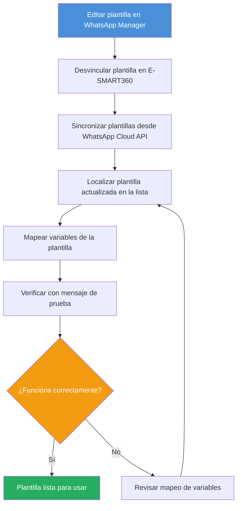

# Cómo Actualizar Plantillas de WhatsApp sin Esfuerzo en E-SMART360

Mantener tus plantillas de WhatsApp actualizadas es fundamental para mantener una comunicación efectiva con tu audiencia. Con E-SMART360, puedes sincronizar y actualizar fácilmente las plantillas creadas en el Administrador de Plantillas de WhatsApp. En esta guía completa, te explicaremos paso a paso cómo actualizar tus plantillas de WhatsApp en E-SMART360 de manera fluida.

> Las plantillas de mensajes de WhatsApp permiten a las empresas enviar mensajes a sus clientes incluso después de las 24 horas de la ventana de servicio. Son ideales para enviar actualizaciones, confirmaciones, recordatorios y mucho más.

## ¿Qué son las Plantillas de Mensajes de WhatsApp?

Las plantillas de mensajes de WhatsApp son mensajes predefinidos que han sido aprobados por WhatsApp para su uso comercial. E-SMART360 se integra directamente con la API de WhatsApp Cloud para que puedas gestionar, crear y actualizar todas tus plantillas desde un solo lugar.

### ¿Cómo funcionan las ventanas de conversación?

En WhatsApp Business API, existen dos tipos de conversaciones:

**Conversaciones iniciadas por el usuario (session messages):** Cuando un usuario te envía un mensaje, se abre una ventana de servicio de 24 horas durante la cual puedes responder libremente sin usar plantillas. Puedes enviar mensajes de texto, imágenes, videos, documentos y más sin restricciones de contenido preaprobado.

**Conversaciones iniciadas por la empresa (template messages):** Cuando necesitas contactar a un usuario fuera de la ventana de 24 horas, debes usar una plantilla de mensaje aprobada por WhatsApp. Estas plantillas son mensajes predefinidos que han pasado por un proceso de revisión para garantizar que cumplen con las políticas de la plataforma.

A diferencia de los mensajes de sesión (que solo pueden enviarse durante una ventana de 24 horas desde el último mensaje del usuario), los mensajes con plantilla pueden iniciar conversaciones en cualquier momento, siempre que la plantilla esté aprobada y activa.

### Tipos de mensajes en WhatsApp

WhatsApp clasifica los mensajes comerciales en varias categorías según su propósito y la relación con el usuario:

| Tipo de Mensaje | Descripción | Requiere Plantilla |
|---|---|---|
| Servicio al Cliente | Respuestas a consultas de usuarios | No (dentro de 24h) |
| Marketing | Promociones, ofertas, novedades | Sí |
| Utilidad | Confirmaciones, actualizaciones transaccionales | Sí |
| Autenticación | Códigos de verificación, OTP | Sí |

Existen tres categorías principales de plantillas aprobadas por WhatsApp:

### Marketing

Promociones, ofertas, bienvenidas, invitaciones y mensajes de re-engagement. Aptas para campañas publicitarias y comunicación masiva.

### Utilidad

Confirmaciones de pedido, recibos de pago, recordatorios de citas y notificaciones transaccionales. Deben ser funcionales y no promocionales.

### Autenticación

Códigos de verificación, contraseñas de un solo uso y confirmaciones de autenticación de dos factores.

> Si una plantilla contiene contenido tanto de utilidad como de marketing, WhatsApp la clasificará como plantilla de marketing. Asegúrate de elegir la categoría correcta al momento de crearla.

## Prerrequisitos

Antes de comenzar con el proceso de actualización, asegúrate de contar con lo siguiente:

### Cuenta de WhatsApp Business conectada

Debes tener una cuenta de WhatsApp Business conectada a E-SMART360. Este es el requisito fundamental para gestionar plantillas.

### Acceso a WhatsApp Cloud API

Si planeas sincronizar plantillas desde el Administrador de WhatsApp, necesitas tener acceso a la API de WhatsApp Cloud.

### Contenido claro de la plantilla

Ten una idea clara del contenido de tu mensaje, incluyendo variables, botones o pies de página necesarios.

### Gestor de Negocios de Meta

Asegúrate de tener configurado tu Business Manager de Meta. Desde allí podrás acceder al WhatsApp Manager para crear y gestionar plantillas.

## Flujo de Trabajo para Actualizar Plantillas

El siguiente diagrama ilustra el flujo completo de actualización, desde la edición en WhatsApp Manager hasta la verificación final en E-SMART360:

## Pasos para Actualizar Plantillas de WhatsApp en E-SMART360

### 1. Accede al Administrador de Plantillas de WhatsApp

- Inicia sesión en tu **Administrador de Plantillas de WhatsApp** a través del WhatsApp Manager de Meta.
- Puedes acceder desde [business.facebook.com](https://business.facebook.com/), seleccionando tu cuenta de negocio y haciendo clic en "Todas las herramientas" > "WhatsApp Manager".
- Una vez dentro del WhatsApp Manager, haz clic en el menú de tres puntos y selecciona **"Gestionar Plantillas de Mensajes"**.
- Crea o edita las plantillas según sea necesario, asegurándote de que cumplan con las directrices de WhatsApp y los requisitos de tu negocio.

### Cómo Crear una Plantilla desde Cero en WhatsApp Manager

Si necesitas crear una plantilla completamente nueva (no solo actualizar una existente), el proceso en WhatsApp Manager es el siguiente:

1. Haz clic en el botón **"Crear Plantilla"**.
2. Selecciona la **categoría** adecuada:
   - **Marketing:** Para promociones, ofertas y contenido publicitario.
   - **Utilidad:** Para confirmaciones de pedidos, notificaciones de envío y actualizaciones transaccionales.
   - **Autenticación:** Para códigos de verificación y autenticación de dos factores.
3. Asigna un **nombre descriptivo** a la plantilla (ej. `confirmacion_pedido_2026` en lugar de `plantilla_001`).
4. Selecciona el **idioma** de la plantilla.
5. Añade el contenido:
   - **Encabezado (Header):** Puede ser texto (máx. 60 caracteres) o un medio (imagen, video, documento).
   - **Cuerpo (Body):** El mensaje principal. Aquí puedes insertar variables como `{{1}}`, `{{2}}`, etc.
   - **Pie de página (Footer):** Texto opcional (máx. 60 caracteres).
   - **Botones:** Puedes añadir botones de respuesta rápida o botones de llamada a la acción (CTA) con enlaces.
6. Introduce **datos de muestra** para cada variable (esto ayuda a WhatsApp a entender el contexto).
7. Envía la plantilla para **aprobación de WhatsApp**.

> Al crear una plantilla en WhatsApp Manager, deberás seleccionar la categoría correcta (Marketing, Utilidad o Autenticación). Elegir la categoría incorrecta es una de las causas más comunes de rechazo. Si una plantilla contiene elementos tanto de utilidad como de marketing, WhatsApp la clasificará automáticamente como marketing.

### Cómo Editar una Plantilla Existente en WhatsApp Manager

Para editar una plantilla que ya existe:

1. Ve a la lista de plantillas en WhatsApp Manager.
2. Busca la plantilla que deseas modificar.
3. Haz clic en los tres puntos (...) y selecciona **"Editar"**.
4. Realiza los cambios necesarios en el contenido.
5. Vuelve a enviar la plantilla para aprobación.

> Ten en cuenta que si editas una plantilla que ya estaba aprobada, deberá pasar nuevamente por el proceso de revisión de WhatsApp. Durante este tiempo, la versión anterior seguirá funcionando hasta que la nueva sea aprobada.

### 2. Desvincula la Plantilla en E-SMART360

- Inicia sesión en tu cuenta de **E-SMART360**.
- Navega hasta la sección de **Plantillas** dentro del Gestor de Bots.
- Localiza la plantilla que deseas actualizar y haz clic en la opción **"Desvincular"**.
- Esta acción eliminará la plantilla de E-SMART360 sin afectarla en el Administrador de Plantillas de WhatsApp.

> La desvinculación solo elimina la relación local en E-SMART360. La plantilla original en WhatsApp Manager permanece intacta. No temas usar esta función.

### 3. Sincroniza las Plantillas en E-SMART360

- Después de desvincular la plantilla, haz clic en el botón **"Sincronizar Plantilla"** en E-SMART360.
- Esta acción obtendrá las últimas plantillas del Administrador de Plantillas de WhatsApp que no estén actualmente vinculadas en E-SMART360.
- La sincronización es posible gracias a la integración directa con WhatsApp Cloud API.

> Si has creado plantillas directamente en WhatsApp Manager, el botón "Sincronizar Plantilla" las importará automáticamente a E-SMART360. No es necesario crearlas dos veces.

### 4. Mapea la Plantilla Actualizada

- Una vez que las plantillas estén sincronizadas, localiza la plantilla actualizada en la lista.
- Haz clic en **"Mapear"** para vincular la plantilla actualizada con E-SMART360.
- Asegúrate de que todos los campos y variables necesarios estén correctamente mapeados para su correcto funcionamiento.
- Si la plantilla contiene variables como `{{1}}`, `{{2}}`, deberás crear las variables correspondientes en E-SMART360 o mapearlas a las existentes.

> Para agregar variables en E-SMART360: ve a la sección de **Variable de Plantilla**, haz clic en **Crear**, ingresa un **nombre de variable** y guarda. Luego podrás usar estas variables en el cuerpo del mensaje.

### 5. Verifica la Actualización

- Envía un mensaje de prueba usando la plantilla actualizada para verificar que los cambios se reflejen correctamente.
- Asegúrate de que la plantilla funcione como se espera y que todas las actualizaciones se muestren con precisión.
- Verifica especialmente las variables: que se reemplacen correctamente con los valores reales.
- Comprueba que los botones funcionen y que los enlaces CTA dirijan a las URLs correctas.
- Si la plantilla incluye medios (imágenes o videos), verifica que se visualicen correctamente en el mensaje de prueba.

### Cómo Usar las Plantillas una Vez Actualizadas

Una vez que la plantilla esté actualizada y aprobada, puedes utilizarla en diferentes áreas de E-SMART360:

#### Broadcasting
Las plantillas son ideales para campañas de broadcasting. Puedes seleccionar una plantilla aprobada y enviarla a toda tu lista de suscriptores o a segmentos específicos. El broadcasting con plantillas es la forma más eficiente de llegar a grandes volúmenes de contactos sin violar las políticas de WhatsApp.

#### Chat en Vivo (Live Chat)
Durante una conversación en vivo con un cliente, puedes seleccionar una plantilla predefinida y enviarla con un solo clic. Esto es útil para enviar confirmaciones, resúmenes de pedidos o enlaces de pago durante una interacción en vivo.

#### Flujos de Chatbot (Bot Flows)
Integra las plantillas en tus flujos automatizados de chatbot. Cuando se cumplan ciertas condiciones (como una compra completada o una cita agendada), el chatbot puede enviar automáticamente la plantilla correspondiente.

#### Integraciones con Shopify y WooCommerce
Las plantillas se pueden activar automáticamente desde tus integraciones de comercio electrónico. Por ejemplo, cuando un cliente realiza un pedido en tu tienda Shopify, E-SMART360 puede enviar automáticamente una plantilla de confirmación de pedido.

> Antes de usar una plantilla en producción, verifica que su **estado sea "Aprobada"** en la sección de plantillas. Las plantillas en estado "Pendiente" o "Rechazada" no pueden enviarse a los usuarios.

## Directrices y Categorías de Plantillas

Para asegurar que tus plantillas sean aprobadas rápidamente, es fundamental entender las diferencias entre los tipos de plantillas y sus requisitos.

### Plantillas de Utilidad

Las plantillas de utilidad son mensajes preaprobados diseñados para actualizaciones transaccionales. Deben ser **funcionales y no promocionales**.

**Ejemplos de Plantillas de Utilidad:**

### Confirmación de pedido

"Tu pedido #12345 ha sido confirmado. Recibirás una actualización del seguimiento pronto."

### Recibo de pago

"Tu pago de $50 se ha procesado con éxito. ¡Gracias por tu compra!"

### Recordatorio de cita

"Recordatorio: tu cita con el Dr. García está programada para el 15 de marzo a las 10 a.m. Responde para confirmar."

### Plantillas de Marketing

Las plantillas de marketing ofrecen una mayor flexibilidad y se utilizan para mensajes que no se relacionan con una transacción específica. Pueden incluir promociones, ofertas, mensajes de bienvenida, actualizaciones, invitaciones, recomendaciones o solicitudes de participación.

**Ejemplos de Plantillas de Marketing:**

### Oferta promocional

"¡Oferta exclusiva! Obtén un 20% de descuento en tu próxima compra. Usa el código AHORRO20 al pagar."

### Re-engagement de clientes

"¡Te extrañamos! Disfruta de envío gratis en tu próximo pedido. Toca abajo para comprar ahora."

### Invitación a evento

"Únete a nuestro próximo seminario web sobre tendencias de marketing digital. ¡Regístrate ahora!"

> WhatsApp puede categorizar mensajes similares de manera diferente según el contexto. Siempre revisa la categoría asignada después de la aprobación.

## Límites de Caracteres para Plantillas

Respetar los límites de caracteres es crucial para que tus plantillas sean aprobadas. Superar estos límites puede resultar en el rechazo inmediato de la plantilla.

### Encabezado (Header)

- Texto plano: Hasta **60** caracteres
- Subtítulo (para medios): Hasta **256** caracteres

### Cuerpo (Body)

- Plantillas con medios: Hasta **1024** caracteres
- Plantillas estándar: Hasta **4096** caracteres
- Al enviar para aprobación: límite de **1024** caracteres (cada `{{n}}` cuenta como 1 carácter)

### Pie de página (Footer)

- Hasta **60** caracteres

### Botones

- Texto del botón: Hasta **20** caracteres
- Payload de respuesta rápida: Hasta **256** caracteres

## Razones Comunes por las que las Plantillas son Rechazadas

Para aumentar tu tasa de éxito en la aprobación de plantillas, evita estos errores comunes:

### 1. Variables Sin Contexto
**Problema:** Las variables se colocan sin texto circundante, lo que las hace confusas.
**Solución:** Siempre proporciona contexto para las variables. Las plantillas con variables independientes serán rechazadas.

**❌ Incorrecto:** `Hola {{1}}, {{2}}, gracias por comprar {{3}}.`
**✅ Correcto:** `Hola {{1}}, gracias por comprar Nike shoes, {{2}}!`

### 2. Nombre de Plantilla Poco Claro
**Problema:** Nombres genéricos o vagos como "Plantilla_003".
**Solución:** Usa nombres descriptivos como `confirmacion_pedido_003` para aclarar el propósito.

### 3. Contenido que No Explica el Uso de la Plantilla
**Problema:** El mensaje no deja claro el propósito a los revisores de WhatsApp.
**Solución:** Proporciona contenido significativo.

**✅ Correcto:** `Hola {{1}}, disculpa la demora. ¿Te gustaría continuar esta conversación?`

### 4. Texto Usado como Variables
**Problema:** Colocar texto dentro de `{{ }}` en lugar de números.
**Solución:** Usa marcadores de posición numéricos.

**✅ Correcto:** `Hola {{1}}, tu servicio para {{2}} ha sido activado en {{3}}.`

### 5. Falta de Dobles Corchetes
**Problema:** Variables no encerradas en `{{ }}`.
**Solución:** Usa siempre dobles corchetes para todas las variables.

### 6. Líneas Vacías en el Contenido
**Problema:** Espacios en blanco entre el texto.
**Solución:** Usa guiones múltiples (`----`) para los saltos de párrafo.

### 7. Errores Ortográficos o Jerga
**Problema:** Errores tipográficos o lenguaje informal.
**Solución:** Revisa todo el contenido antes de enviarlo.

### 8. Numeración Incorrecta de Variables
**Problema:** Variables numeradas fuera de orden.
**Solución:** Asegúrate de que las variables sean secuenciales (ej. `{{1}}`, `{{2}}`, `{{3}}`).

### 9. Falta de Ejemplo Multimedia
**Problema:** No se adjunta un archivo de ejemplo para plantillas con medios.
**Solución:** Adjunta una imagen, video o documento de muestra.

### 10. Uso de Acortadores de URL
**Problema:** Enlaces acortados (ej. bit.ly) en el contenido del mensaje.
**Solución:** Usa URLs completas o agrega enlaces en botones CTA.

### 11. Mezcla de Idiomas
**Problema:** Una sola plantilla contiene diferentes idiomas.
**Solución:** Mantén un solo idioma por plantilla.

### 12. Superación de Límites de Caracteres
**Problema:** El texto en encabezado, cuerpo o pie de página excede la longitud permitida.
**Solución:** Mantén el contenido dentro de los límites establecidos.

### 13. Traducciones Inconsistentes
**Problema:** Las versiones en otros idiomas no coinciden con la plantilla en inglés.
**Solución:** Asegúrate de que todas las traducciones sean idénticas en significado.

### 14. Emojis en Botones de Respuesta Rápida
**Problema:** Emojis en respuestas rápidas.
**Solución:** Evita usar emojis en el texto de los botones.

### 15. Categoría Incorrecta
**Problema:** Seleccionar la categoría equivocada (ej. marcar una plantilla de marketing como de utilidad).
**Solución:** Selecciona la categoría adecuada que coincida con la intención del mensaje.

### 16. Violación de Políticas de WhatsApp
**Problema:** Plantillas que no siguen las políticas comerciales de WhatsApp, como promocionar artículos restringidos o solicitar datos sensibles.
**Solución:** Asegúrate de que tu mensaje cumpla con las políticas de WhatsApp. Revisa periódicamente las políticas de comercio de Meta para mantenerte actualizado.

**❌ Incorrecto:** `Por favor, comparte tu número de tarjeta de crédito completo para continuar, {{1}}.`
**✅ Correcto:** `Para verificar tu pago, visita tu página de cuenta, {{1}}.`

### 17. Caracteres Especiales en Variables
**Problema:** Usar caracteres especiales como #, $ o % dentro de las variables.
**Solución:** Usa solo letras, números y guiones bajos en las variables.

### 18. Exceso de Parámetros Variables
**Problema:** Usar demasiadas variables, haciendo que el mensaje sea confuso.
**Solución:** Mantén las variables al mínimo y proporciona suficiente texto estático para mayor claridad.

### 19. Plantillas Duplicadas
**Problema:** Enviar una plantilla con redacción idéntica a una existente.
**Solución:** Modifica ligeramente el contenido de la plantilla y usa un ID de plantilla diferente.

### 20. Falta de Enlace de Exclusión Voluntaria
**Problema:** No proporcionar al usuario una opción para cancelar la suscripción.
**Solución:** Incluye un enlace de exclusión voluntaria para evitar que los mensajes sean marcados como spam.

> Las plantillas que contienen lenguaje abusivo o amenazante serán rechazadas de inmediato. Mantén siempre un tono profesional y respetuoso en todas tus plantillas.

## Cómo Corregir una Plantilla Rechazada

Si tu plantilla es rechazada, no puedes editarla directamente. Sigue estos pasos para duplicarla y actualizarla:

### Paso 1: Localiza la plantilla

Ve a la sección **Rechazadas** dentro de la sección de plantillas. Allí encontrarás todas las plantillas que no pasaron la revisión de WhatsApp.

### Paso 2: Duplica la plantilla

Busca la plantilla rechazada, haz clic en los tres puntos **(...)** y selecciona **"Duplicar Plantilla"**. Esto creará una copia editable.

### Paso 3: Realiza las correcciones

Haz las ediciones necesarias: corrige variables, ajusta el texto, verifica la categoría y asegúrate de cumplir con todas las directrices.

### Paso 4: Reenvía para aprobación

Una vez realizadas las correcciones, envía la nueva plantilla para su aprobación. WhatsApp la revisará nuevamente.

## Sincronización con el Administrador de WhatsApp

Si prefieres crear tus plantillas directamente en el WhatsApp Manager de Meta, puedes sincronizarlas con E-SMART360 siguiendo este proceso:

### Crea la plantilla en WhatsApp Manager

- Inicia sesión en [business.facebook.com](https://business.facebook.com/)
- Ve a "Todas las herramientas" > "WhatsApp Manager"
- Haz clic en el menú de tres puntos y selecciona "Gestionar Plantillas de Mensajes"
- Haz clic en "Crear Plantilla", elige la categoría, el nombre y el idioma
- Añade encabezado (opcional), cuerpo del mensaje con variables, pie de página (opcional) y botones
- Añade datos de muestra para pruebas y envía la plantilla para aprobación

### Sincroniza en E-SMART360

- Ve a la sección de Plantillas de Mensajes en E-SMART360
- Haz clic en "Sincronizar Plantilla" para obtener la plantilla aprobada desde WhatsApp Cloud API
- E-SMART360 detectará automáticamente las plantillas nuevas que no estén vinculadas

### Mapea las variables

- Una vez sincronizada, mapea las variables de la plantilla para usarlas en tu chatbot
- Crea nuevas variables en E-SMART360 si es necesario
- Guarda la plantilla — ahora está lista para usar en E-SMART360

> WhatsApp Manager no soporta **plantillas tipo carrusel**, pero E-SMART360 sí. Puedes crear y enviar mensajes tipo carrusel directamente desde la plataforma.

## Beneficios de Mantener las Plantillas Actualizadas

| Beneficio | Descripción |
|---|---|
| **Comunicación Mejorada** | Las actualizaciones regulares aseguran que tus mensajes sean relevantes y atractivos. |
| **Consistencia** | Mantén una voz de marca coherente en todas las comunicaciones. |
| **Cumplimiento Normativo** | Mantente al día con las políticas y directrices de WhatsApp usando plantillas actualizadas. |
| **Eficiencia** | Ahorra tiempo y recursos reutilizando y modificando plantillas existentes en lugar de crear nuevas desde cero. |
| **Mejor Calidad de Cuenta** | Las plantillas aprobadas y bien mantenidas contribuyen a una mejor calificación de calidad de WhatsApp. |
| **Mayor Alcance** | Las cuentas con buena calificación de calidad pueden aumentar sus límites de mensajes y llegar a más clientes. |

## Preguntas Frecuentes

### ¿Cuánto tiempo tarda WhatsApp en aprobar una plantilla?

El tiempo de aprobación varía, pero generalmente WhatsApp revisa las plantillas en un plazo de 24 a 48 horas hábiles. Las plantillas de categorías estándar como marketing y utilidad suelen aprobarse más rápido que las de autenticación, que requieren verificaciones adicionales.

### ¿Puedo editar una plantilla después de ser aprobada?

No directamente. WhatsApp no permite editar plantillas aprobadas. Si necesitas hacer cambios, debes crear una nueva versión de la plantilla (duplicando la existente) o crear una nueva desde cero y enviarla para aprobación nuevamente.

### ¿Qué pasa si mi plantilla está rechazada pero necesito usarla urgentemente?

Si tu plantilla fue rechazada, revisa los motivos del rechazo, corrige los problemas en una copia duplicada y reenvía para aprobación. Mientras tanto, puedes usar una plantilla alternativa ya aprobada que tenga un propósito similar.

### ¿Puedo usar el mismo nombre de plantilla para diferentes idiomas?

Sí, WhatsApp permite crear plantillas con el mismo nombre pero en diferentes idiomas. Al seleccionar el idioma durante la creación, puedes tener `confirmacion_pedido` en español, inglés, portugués, etc., siempre que el contenido sea una traducción fiel.

### ¿Las plantillas de utilidad tienen menos restricciones que las de marketing?

Las plantillas de utilidad tienen restricciones más estrictas en cuanto al contenido, que debe ser estrictamente funcional y no promocional. Sin embargo, suelen tener un costo por mensaje más bajo. Las plantillas de marketing ofrecen más flexibilidad creativa pero tienen un costo más alto y están sujetas a reglas de frecuencia de envío.

### ¿Qué hago si mi plantilla fue marcada como spam?

Si una plantilla recibe múltiples reportes de spam, WhatsApp puede desactivarla automáticamente. Para evitarlo, asegúrate de incluir siempre un enlace de exclusión voluntaria (opt-out), no enviar mensajes a usuarios que no hayan dado consentimiento, y mantener un tono profesional. Además, revisa la calificación de calidad de tu cuenta en E-SMART360 para monitorear el estado general.

### ¿Las plantillas caducan o necesitan renovación periódica?

Las plantillas aprobadas no caducan mientras estén en uso activo y cumplan con las políticas de WhatsApp. Sin embargo, si una plantilla permanece sin usar durante un período prolongado (generalmente 30 días o más), WhatsApp puede desactivarla. WhatsApp también puede actualizar sus políticas y requerir modificaciones en plantillas existentes.

## Casos de Uso Prácticos

### 📦 Actualización de Plantilla de Confirmación de Pedido

**Situación:** Tu tienda en línea necesita agregar un enlace de seguimiento a la plantilla de confirmación de pedido.

**Solución:**
1. Crea o edita la plantilla en WhatsApp Manager agregando la variable `{{3}}` para el enlace de seguimiento
2. Desvincula la plantilla anterior en E-SMART360
3. Sincroniza y mapea la nueva plantilla
4. Actualiza tu flujo de chatbot para pasar el valor correcto en `{{3}}`
5. Envía un mensaje de prueba para verificar que el enlace funcione correctamente

### 📊 Campaña de Marketing con Ofertas Temporales

**Situación:** Necesitas actualizar una plantilla promocional para una oferta de temporada.

**Solución:**
1. Duplica tu plantilla promocional existente en WhatsApp Manager
2. Actualiza el texto con la nueva oferta y fechas de vigencia
3. Envía para aprobación (al menos 48 horas antes del lanzamiento)
4. Una vez aprobada, desvincula la versión anterior en E-SMART360
5. Sincroniza y mapea la nueva versión
6. Programa tu campaña de broadcasting con la nueva plantilla

## Conclusión

Actualizar las plantillas de WhatsApp en E-SMART360 es un proceso simple y eficiente que garantiza que tus comunicaciones sigan siendo efectivas y estén actualizadas. Siguiendo los pasos descritos en esta guía —acceder al Administrador de Plantillas, desvincular, sincronizar, mapear y verificar— podrás mantener tus plantillas al día sin complicaciones.

Recuerda siempre:
- Elegir la categoría correcta (marketing, utilidad o autenticación)
- Respetar los límites de caracteres de cada sección
- Proporcionar contexto adecuado a todas las variables
- Incluir enlaces de exclusión voluntaria en plantillas de marketing
- Mantener un solo idioma por plantilla
- Verificar las plantillas con mensajes de prueba antes de usarlas en campañas reales

Una gestión adecuada de tus plantillas no solo mejora la comunicación con tus clientes, sino que también contribuye a una mejor calificación de calidad de tu cuenta de WhatsApp, lo que se traduce en mayores límites de mensajes y mejores resultados para tu negocio.

## Mejores Prácticas Generales

### 1. Planifica tus Plantillas con Anticipación

No esperes al último minuto para crear o actualizar plantillas. El proceso de aprobación puede tomar entre 24 y 48 horas. Ten siempre un inventario de plantillas aprobadas listas para usar.

### 2. Mantén un Registro de Versiones

Lleva un control de las diferentes versiones de tus plantillas. Cuando crees una nueva versión, usa un nombre que incluya la fecha o un número de versión (ej. `promocion_verano_2026_v2`).

### 3. Monitorea la Calidad de tu Cuenta

Revisa periódicamente la calificación de calidad de tu cuenta en E-SMART360. Las plantillas que generan reportes de spam o tienen altas tasas de bloqueo pueden afectar negativamente tu calificación y reducir tus límites de mensajes.

### 4. Realiza Pruebas Periódicas

Incluso las plantillas aprobadas pueden fallar si hay cambios en las políticas de WhatsApp. Programa revisiones periódicas de tus plantillas activas para asegurarte de que sigan cumpliendo con las directrices.

### 5. Utiliza Variables de Forma Inteligente

Las variables hacen que tus plantillas sean más personales y efectivas, pero úsalas con moderación. Demasiadas variables pueden hacer que el mensaje sea confuso y aumentar las probabilidades de rechazo.

### 6. Cumple con las Políticas de Contenido

Revisa regularmente las políticas comerciales de WhatsApp. Algunos tipos de contenido están restringidos o prohibidos, como:
- Solicitar información financiera sensible (números de tarjetas de crédito, contraseñas)
- Promover productos ilegales o restringidos
- Contenido engañoso o fraudulento
- Lenguaje ofensivo o inapropiado

## ¿Necesitas Ayuda Adicional?

Si tienes problemas con la sincronización de plantillas, el mapeo de variables o necesitas asistencia con el proceso de aprobación de WhatsApp, nuestro equipo de soporte está disponible para ayudarte.

Puedes contactarnos a través de:
- El panel de soporte dentro de E-SMART360
- Nuestro sistema de tickets en línea
- El chat en vivo disponible en la plataforma

¡Felices mensajes!
