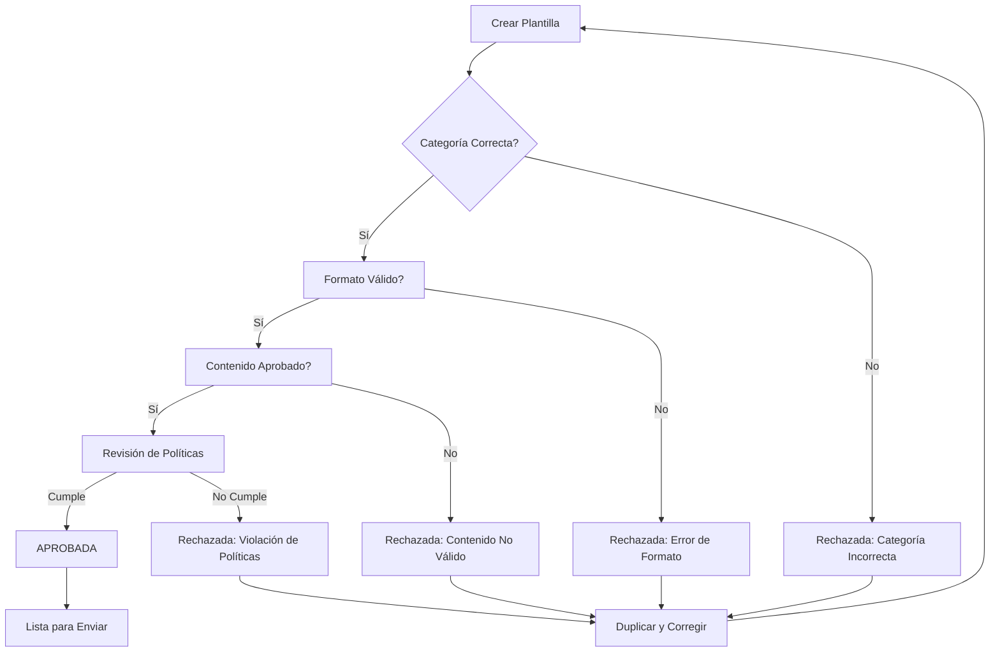

# Razones Comunes de Rechazo de Plantillas de Mensaje de WhatsApp

<Update title="Última actualización" date="18 de junio de 2025" />

Las plantillas de mensaje de WhatsApp son necesarias para enviar mensajes a suscriptores de WhatsApp fuera de la ventana de 24 horas de la última interacción del suscriptor con tu chatbot.

También se conocen como **mensajes iniciados por la empresa**. Puedes enviar mensajes plantilla a cualquier número de WhatsApp en cualquier momento. Estas plantillas se utilizan principalmente para:

- Informar a los clientes sobre novedades
- Enviar mensajes promocionales masivos
- Enviar códigos OTP
- Confirmar pedidos y transacciones
- Enviar recordatorios de citas

Antes de enviar una plantilla de mensaje de WhatsApp, la plantilla debe crearse y enviarse para revisión. Una vez obtenida la aprobación de Meta, puedes utilizar estas plantillas.


> La creación de plantillas de mensaje de WhatsApp requiere atención al detalle y cumplimiento normativo. En E-SMART360, puedes crear y gestionar todas tus plantillas de forma sencilla desde un solo lugar.

## ¿Qué son las plantillas de mensaje de WhatsApp?

Las plantillas de mensaje son la única forma de contactar a un usuario de WhatsApp fuera de la ventana de servicio al cliente de 24 horas. Cuando un usuario te escribe primero, tienes 24 horas para responder dentro de la conversación de servicio. Después de ese período, cualquier mensaje debe enviarse como una plantilla aprobada.

Cada plantilla debe ser enviada a Meta para su revisión antes de poder utilizarse. El proceso de revisión verifica que el contenido cumpla con las políticas de comercio y uso aceptable de WhatsApp.

## Formas de crear plantillas de mensaje

Puedes crear plantillas de mensaje de **dos maneras**:


### Desde el Gestor de Plantillas de E-SMART360

Esta es la forma más recomendada. E-SMART360 verifica automáticamente los problemas de formato y te sugiere correcciones si cometes algún error. Todo el proceso es guiado e intuitivo.
  
### Desde WhatsApp Business Manager

Creas la plantilla directamente en el administrador de WhatsApp. Luego la sincronizas en E-SMART360 y mapeas las variables si la plantilla tiene alguna.
  

> Recomendamos crear las plantillas desde el Gestor de Plantillas de E-SMART360. Sin embargo, en algunos casos hemos encontrado que ciertas cuentas de WhatsApp enfrentan problemas de revisión pendiente por mucho tiempo al crear plantillas con API desde E-SMART360. En ese caso, sugerimos crear la plantilla dentro de WhatsApp Manager directamente, luego sincronizarla dentro de E-SMART360 y mapear las variables si la plantilla tiene alguna.

## Requisitos previos para crear plantillas

Antes de comenzar a crear plantillas de mensaje, asegúrate de tener:


### Cuenta de WhatsApp Business

Una cuenta de WhatsApp Business conectada a E-SMART360. Sin esta cuenta, no podrás crear ni enviar plantillas.
  
### Acceso a Cloud API

Acceso a WhatsApp Cloud API (si planeas sincronizar plantillas desde WhatsApp Manager). Asegúrate de tener los permisos adecuados en tu cuenta de Meta Business.
  
### Contenido definido

Una idea clara del contenido de tu mensaje, incluyendo variables, botones o pies de página necesarios para tu comunicación.
  
### Categoría correcta

Conocimiento de la categoría correcta de tu plantilla: Marketing, Utilidad o Autenticación.
  
## Tipos de problemas de rechazo

Existen dos grandes categorías de razones de rechazo:

### 1. Problemas de formato de plantilla

Si creas la plantilla desde E-SMART360, no necesitas preocuparte por problemas de formato. La plataforma verifica automáticamente todos estos problemas y te da sugerencias si cometes algún error.

Los problemas de formato más comunes incluyen:


### Llaves desordenadas

Los parámetros de variables faltan o tienen llaves desordenadas. El formato correcto es **{{1}}**. No uses {1} ni {{1}} con espacios extra.
  
### Caracteres especiales

Los parámetros de variables contienen caracteres especiales como #, $ o %. Las variables solo deben contener números.
  
### Secuencia incorrecta

Los parámetros de variables no son secuenciales. Por ejemplo, se definen {{1}}, {{2}}, {{4}}, {{5}} pero falta {{3}}. Las variables deben ser consecutivas.
  
#### Errores comunes de formato

| Error | Incorrecto | Correcto |
|-------|-----------|----------|
| Llaves simples | `{1}` | `{{1}}` |
| Caracteres especiales | `{{1#}}` | `{{1}}` |
| Variables no secuenciales | `{{1}}, {{3}}` | `{{1}}, {{2}}` |

### 2. Problemas de contenido de plantilla

El contenido de la plantilla puede ser rechazado por múltiples razones. A continuación, detallamos cada una:

#### Violación de la Política de Comercio de WhatsApp

Si la plantilla contiene contenido que viola la [Política de Comercio de WhatsApp](https://www.whatsapp.com/legal/commerce-policy/), será rechazada automáticamente. Esto incluye:

- Promoción de productos restringidos (armas, drogas, tabaco, contenido para adultos)
- Servicios financieros no regulados
- Suplementos milagrosos o afirmaciones de salud no verificadas


> No solicites identificadores sensibles a los usuarios: números de tarjetas de pago, números de cuentas financieras, números de identificación nacional u otros identificadores sensibles. Esto resulta en rechazo inmediato y posible suspensión de la cuenta.

#### Contenido abusivo o amenazante

El contenido que contiene lenguaje potencialmente abusivo o amenazante es rechazado. Esto incluye:

- Amenazar a un cliente con acciones legales
- Amenazar con avergonzar públicamente a un cliente
- Lenguaje agresivo u hostil
- Tono manipulador o coercitivo

**Ejemplo incorrecto:** ❌ "Si no pagas hoy, {[1]}, tomaremos acciones legales contra ti."

**Ejemplo correcto:** ✅ "Recordatorio amable: tu factura de {{1}} está pendiente. Puedes pagarla aquí: [enlace]"

#### Plantilla duplicada

Si se envía una plantilla con la misma redacción en el cuerpo y pie de página de una plantilla existente, la plantilla duplicada será rechazada. Para evitarlo:

- Modifica ligeramente el contenido de la plantilla
- Usa un nombre de plantilla diferente y descriptivo
- Cambia al menos el 30% del texto si estás creando una variante


> Los nombres genéricos como "plantilla_001" o "template_03" son una causa frecuente de rechazo. Usa nombres descriptivos como "confirmacion_pedido_ropa_001" para clarificar el propósito.

#### Mala calidad del contenido

Los errores ortográficos o gramaticales son otra razón común de rechazo. Para evitarlo:

- Revisa el contenido cuidadosamente antes de enviarlo
- Usa un corrector ortográfico
- Pide a otra persona que revise el texto
- Verifica que los signos de puntuación sean correctos


> La calidad del contenido refleja la calidad de tu negocio. Los revisores de Meta rechazarán plantillas con errores evidentes porque indican falta de profesionalismo.

#### Uso de URLs acortadas

No uses URLs cortas en tus plantillas como bit.ly, short.ly, tinyurl.com, etc. WhatsApp requiere:

- URLs completas y visibles
- Dominios que coincidan con el negocio
- Enlaces que funcionen correctamente

**Solución:** Usa URLs completas o agrega enlaces en botones CTA en lugar de en el cuerpo del mensaje.

#### Categoría incorrecta

Elegir la categoría equivocada de plantilla también puede resultar en rechazo. Existen tres categorías:


### Marketing

Promociones, ofertas, boletines, campañas de reenganche, invitaciones a eventos y mensajes que no están relacionados con una transacción específica.
  
### Utilidad

Confirmaciones de pedidos, recibos de pago, recordatorios de citas, actualizaciones de envío, notificaciones de cuenta y cualquier mensaje transaccional.
  
### Autenticación

Códigos OTP (one-time passwords), códigos de verificación de dos factores, confirmaciones de inicio de sesión.
  
> Elegir la categoría incorrecta es uno de los errores más comunes. Si una plantilla de marketing se etiqueta como de utilidad, será rechazada. Si tiene contenido mixto de utilidad y marketing, se clasificará como marketing.

## Guía detallada de categorías de plantillas

### Plantillas de Utilidad

Las plantillas de utilidad son mensajes preaprobados diseñados para actualizaciones transaccionales, como confirmaciones, cambios o suspensiones relacionadas con una transacción o suscripción específica. Estas plantillas deben ser **funcionales y no promocionales**.

**Ejemplos correctos:**

| Tipo | Ejemplo |
|------|---------|
| Confirmación de pedido | "Tu pedido #12345 ha sido confirmado. Recibirás una actualización de seguimiento pronto." |
| Recibo de pago | "Tu pago de $50 se ha procesado correctamente. ¡Gracias por tu compra!" |
| Recordatorio de cita | "Recordatorio: tu cita con el Dr. García está programada para el 15 de marzo a las 10 AM. Responde para confirmar." |


> Estos ejemplos son solo de referencia. WhatsApp puede categorizar mensajes similares de forma diferente según el contenido específico.

### Plantillas de Marketing

Las plantillas de marketing ofrecen mayor flexibilidad y se utilizan para mensajes que no se relacionan con una transacción específica. Pueden incluir promociones, ofertas, mensajes de bienvenida, actualizaciones, invitaciones, recomendaciones o solicitudes de participación del cliente.

**Ejemplos correctos:**

| Tipo | Ejemplo |
|------|---------|
| Oferta promocional | "¡Oferta exclusiva! Obtén un 20% de descuento en tu próxima compra. Usa el código AHORRO20 al pagar." |
| Reenganche | "Te extrañamos. Disfruta de envío gratis en tu próximo pedido. Toca abajo para comprar ahora." |
| Invitación a evento | "Únete a nuestro próximo seminario web sobre tendencias de marketing digital. ¡Regístrate ahora!" |

## Límites de caracteres para plantillas con medios

Para asegurar que tus plantillas sean aprobadas, es importante respetar los límites de caracteres establecidos por WhatsApp. Exceder estos límites puede llevar al rechazo.

| Elemento | Límite de caracteres |
|----------|---------------------|
| **Encabezado (texto)** | Hasta **60** caracteres |
| **Pie de foto (para medios)** | Hasta **256** caracteres |
| **Cuerpo (plantillas con medios)** | Hasta **1024** caracteres |
| **Cuerpo (plantillas estándar)** | Hasta **4096** caracteres |
| **Pie de página** | Hasta **60** caracteres |
| **Texto del botón** | Hasta **20** caracteres |
| **Payload de respuesta rápida** | Hasta **256** caracteres |


> Al enviar una plantilla para aprobación, el cuerpo está restringido a **1024** caracteres. Cada `{{n}}` cuenta como 1 carácter, no como el valor que ocupará después.

## Causas adicionales de rechazo

Basado en la experiencia de cientos de usuarios de E-SMART360, estas son causas adicionales documentadas:

### Variables sin contexto

**Problema:** Las variables se colocan sin texto circundante, lo que las hace confusas para los revisores.

**Solución:** Siempre proporciona contexto para las variables.

❌ **Incorrecto:** `Hola {{1}}, {{2}}, Gracias por comprar {{3}}.`

✅ **Correcto:** `Hola {{1}}, gracias por comprar Nike shoes. Tu pedido {{2}} está en camino.`

### Texto usado como variables

**Problema:** Colocar texto dentro de {{ }} en lugar de números.

✅ **Correcto:** `Hola {{1}}, tu servicio para {{2}} ha sido activado en {{3}}.`

### Líneas vacías en el contenido

**Problema:** Espacios en blanco entre el texto.

**Solución:** Usa guiones múltiples (----) para saltos de párrafo.

✅ **Correcto:**
```
¡Gracias por registrarte!
----
Haz clic en el botón de abajo para completar tu registro.
```

### Mezcla de múltiples idiomas

**Problema:** Una sola plantilla contiene diferentes idiomas.

**Solución:** Mantén un solo idioma por plantilla. Si necesitas español e inglés, crea plantillas separadas.

### Traducciones no coincidentes

**Problema:** Las versiones en otros idiomas no coinciden con la plantilla en inglés.

**Solución:** Asegúrate de que todas las traducciones sean idénticas en significado y estructura.

### Emojis en botones de respuesta rápida

**Problema:** Emojis en respuestas rápidas.

**Solución:** Evita usar emojis en el texto de los botones.

### Uso excesivo de parámetros variables

**Problema:** Usar demasiadas variables hace que el mensaje sea poco claro.

**Solución:** Mantén las variables al mínimo y proporciona suficiente texto estático para mayor claridad.

❌ **Incorrecto:** `Hola {{1}}, {{2}}, Gracias por comprar {{3}}, {{4}}.`

✅ **Correcto:** `Hola {{1}}, gracias por comprar Nike shoes.`

### Falta de enlace de cancelación de suscripción

**Problema:** No proporcionar a los usuarios una opción para darse de baja.

**Solución:** Incluye un enlace de exclusión voluntaria para evitar que los mensajes se marquen como spam. Esto es especialmente importante para plantillas de marketing.

## Cómo crear plantillas desde E-SMART360


### Ve al Gestor de Plantillas

Inicia sesión en E-SMART360 y navega hasta Bot Manager → Plantilla de Mensaje. Aquí encontrarás todas las herramientas necesarias para crear y gestionar tus plantillas. Si es tu primera vez, te recomendamos revisar la documentación de inicio rápido.
  
### Agrega variables (opcional)

Desplázate hacia abajo hasta "Variable de Plantilla". Haz clic en "Crear", ingresa un nombre para la variable y haz clic en "Guardar". Las variables te permiten personalizar cada mensaje con datos específicos del destinatario como nombre, número de pedido, fecha, etc.
  
### Crea la plantilla

Desplázate hacia arriba hasta "Configuración de Plantilla de Mensaje". Haz clic en "Crear" y completa el formulario:
    - **Nombre de la Plantilla** → asígnale un nombre descriptivo como "confirmacion_pedido_ecommerce_001"
    - **Categoría** → selecciona Marketing, Utilidad o Autenticación
    - **Idioma** → selecciona el idioma de tu plantilla
    - **Cuerpo del Mensaje** → escribe tu mensaje (inserta variables si es necesario)
    - **Encabezado (Opcional)** → puedes agregar texto, imagen, video o documento
    - **Texto del Pie de Página (Opcional)**
    - **Botones (Opcional)** → agrega botones de respuesta rápida o CTA
  
### Guarda y envía

Haz clic en "Guardar". La plantilla se enviará automáticamente a Meta para revisión. El proceso de aprobación puede tomar desde unos minutos hasta varios días.
  
## Cómo crear plantillas desde WhatsApp Manager

Si prefieres crear tus plantillas directamente desde WhatsApp Manager de Meta, sigue estos pasos:


### Accede a WhatsApp Manager

Inicia sesión en business.facebook.com y selecciona tu cuenta de negocio. Haz clic en "Todas las Herramientas" > "WhatsApp Manager".
  
### Gestiona las plantillas

Haz clic en el menú de tres puntos y selecciona "Gestionar Plantillas de Mensaje".
  
### Crea una nueva plantilla

Haz clic en "Crear Plantilla", elige una categoría (Marketing, Utilidad o Autenticación), asigna un nombre descriptivo y selecciona el idioma.
  
### Completa el contenido

Agrega opcionalmente un encabezado (texto o multimedia como imágenes). Escribe el cuerpo del mensaje e inserta variables si es necesario usando el formato {{1}}, {{2}}, etc.
  
### Agrega botones y pie de página

Opcionalmente agrega un pie de página y botones (Respuesta Rápida o Llamada a la Acción). Los botones CTA pueden redirigir a una URL o número de teléfono.
  
### Envía para revisión

Agrega datos de muestra para las pruebas y envía tu plantilla para aprobación de WhatsApp. Una vez aprobada, la plantilla estará lista para usar.
  
## Sincronización de plantillas en E-SMART360

Si creaste tus plantillas desde WhatsApp Manager, puedes sincronizarlas fácilmente en E-SMART360:


### Ve a Plantillas de Mensaje

Accede a la sección de Plantillas de Mensaje en tu panel de E-SMART360.
  
### Sincroniza la plantilla

Haz clic en "Sincronizar Plantilla" para obtener las plantillas aprobadas desde WhatsApp Cloud API.
  
### Mapea las variables

Asigna las variables de tu plantilla a los campos correspondientes en tu chatbot o crea variables nuevas según sea necesario.
  
### Guarda la plantilla

Guarda los cambios. La plantilla ahora está lista para usar en E-SMART360.
  

> WhatsApp Manager no soporta plantillas de carrusel. Sin embargo, E-SMART360 sí lo hace. Puedes crear y enviar mensajes de carrusel con múltiples productos o servicios usando nuestra funcionalidad avanzada de plantillas multimedia.

## Cómo agregar botones CTA a tus plantillas

Los botones de llamada a la acción (CTA) mejoran significativamente la interacción con tus clientes. Existen dos tipos principales:


### Botones de Respuesta Rápida

Permiten al usuario responder con opciones predefinidas. Ideales para confirmaciones, encuestas o menús de opciones.
    
    - Se muestran como botones táctiles dentro del chat
    - Máximo 3 botones por plantilla
    - Cada botón tiene un texto de hasta 20 caracteres
    - No uses emojis en el texto de los botones
    
    **Ejemplo:** ¿Confirmas tu cita? → [Sí, confirmo] [Reagendar]
  
### Botones de Llamada a la Acción

Redirigen al usuario a una URL externa o inician una llamada telefónica.
    
    - Botón "Visitar sitio web": redirige a una URL
    - Botón "Llamar": inicia una llamada a un número específico
    - Máximo 2 botones CTA por plantilla
    
    **Ejemplo:** Haz clic para rastrear tu pedido → [Ver mi pedido]
  
## Cómo solucionar una plantilla rechazada

Si tu plantilla es rechazada, **no puedes editarla directamente**. En su lugar, sigue estos pasos:


### Ve a la sección de Rechazadas

Accede a la sección de plantillas rechazadas en el gestor de plantillas de E-SMART360.
  
### Duplica la plantilla

Busca la plantilla rechazada, haz clic en los tres puntos (...) y selecciona "Duplicar Plantilla". Esto creará una copia editable.
  
### Corrige los errores

Analiza cuidadosamente el motivo del rechazo y corrige cada problema:
    - Revisa el formato de las variables ({{1}}, {{2}}...)
    - Verifica que no haya errores ortográficos
    - Confirma que la categoría sea la correcta
    - Asegúrate de cumplir con las políticas de WhatsApp
  
### Reenvía para aprobación

Guarda los cambios y envía la plantilla duplicada para revisión nuevamente.
  
## Buenas prácticas para la aprobación de plantillas


### Nombres descriptivos

Usa nombres de plantilla que describan claramente su propósito. Por ejemplo: "confirmacion_pedido_ecommerce_001" es mejor que "plantilla_01".
  
### Contexto claro

Cada plantilla debe explicar su propósito claramente. Los revisores necesitan entender para qué se usará el mensaje.
  
### Un solo idioma

Mantén un solo idioma por plantilla. Las plantillas multilingües son rechazadas.
  
### Variables mínimas

Usa solo las variables necesarias. Demasiadas variables hacen el mensaje confuso y aumentan la probabilidad de rechazo.
  
### Sin URLs acortadas

Usa siempre URLs completas. Los acortadores como bit.ly son rechazados automáticamente.
  
### Sin datos sensibles

Nunca solicites datos como números de tarjeta, identificación nacional o contraseñas.
  
### Revisión ortográfica

Revisa cada plantilla antes de enviarla. Los errores gramaticales son una causa común de rechazo.
  
### Enlace de baja

Incluye siempre una opción de cancelación de suscripción en plantillas de marketing.
  
## Preguntas Frecuentes


### ¿Cuánto tiempo tarda la aprobación de una plantilla?

El tiempo de aprobación varía. Generalmente toma desde unas horas hasta 2-3 días hábiles. En algunos casos, puede tomar hasta una semana. Si tu plantilla está pendiente por más de 7 días, contacta al soporte de Meta a través de tu administrador de negocio.

### ¿Puedo editar una plantilla después de enviarla?

No. Una vez que una plantilla ha sido enviada para revisión, no puedes editarla. Si necesitas cambios, espera la decisión (aprobación o rechazo). Si es rechazada, duplica la plantilla, haz los cambios y reenvíala.

### ¿Cuántas plantillas puedo tener activas simultáneamente?

WhatsApp no tiene un límite estricto en la cantidad de plantillas activas, pero cada cuenta de negocio tiene un límite basado en su nivel de calidad y volumen de mensajes. En E-SMART360, puedes gestionar todas tus plantillas sin restricciones adicionales.

### ¿Qué hago si mi plantilla de autenticación es rechazada?

Las plantillas de autenticación (OTP) tienen reglas específicas. Deben contener solo el código de verificación y el nombre de la empresa. No pueden incluir enlaces, imágenes ni llamadas a la acción. Revisa que el contenido sea estrictamente el código y una breve instrucción.

### ¿Puedo reutilizar una plantilla aprobada en múltiples números de WhatsApp?

Sí, las plantillas aprobadas a nivel de cuenta de WhatsApp Business pueden ser utilizadas en todos los números asociados a esa cuenta. En E-SMART360, puedes gestionar múltiples números y usar las mismas plantillas en todos ellos.

### ¿Qué diferencia hay entre una plantilla rechazada y una pendiente?

Una plantilla pendiente está siendo revisada por Meta y aún no tiene una decisión. Una plantilla rechazada ha sido evaluada y no cumple con las políticas. Las plantillas pendientes no se pueden usar para enviar mensajes; las rechazadas deben duplicarse y corregirse.

### ¿Qué hago si mi plantilla está pendiente por más de 7 días?

Si tu plantilla ha estado en estado "Pendiente" por más de 7 días, te recomendamos contactar al soporte de Meta a través de tu administrador de negocio. También puedes crear una plantilla duplicada con ligeras variaciones y reenviarla. En algunos casos, las plantillas se quedan atascadas en revisión por problemas técnicos del lado de Meta.

### ¿Puedo usar caracteres especiales o emojis en el cuerpo del mensaje?

Sí, puedes usar emojis en el cuerpo del mensaje y en el encabezado de las plantillas. Sin embargo, debes evitar los emojis en los botones de respuesta rápida, ya que esto puede causar rechazo. Los caracteres especiales como #, $, % tampoco deben usarse dentro de las variables {{ }}.

### ¿Necesito una plantilla diferente para cada idioma?

Sí, cada plantilla debe estar en un solo idioma. Si necesitas enviar mensajes en español e inglés, debes crear plantillas separadas para cada idioma. Mezclar múltiples idiomas en una misma plantilla resulta en rechazo automático.

### ¿Qué tipos de encabezado puedo usar en mis plantillas?

Puedes usar cuatro tipos de encabezado: texto (hasta 60 caracteres), imagen, video y documento. Si usas un encabezado multimedia, debes proporcionar una muestra del archivo durante el proceso de revisión. Las plantillas de autenticación solo permiten encabezado de texto.

### ¿Cómo sé si mi plantilla fue aprobada?

Recibirás una notificación en E-SMART360 cuando tu plantilla sea aprobada o rechazada. También puedes verificar el estado en la sección de Plantillas de Mensaje, donde verás una etiqueta clara: Aprobada, Pendiente o Rechazada. El tiempo de aprobación varía, pero generalmente es de 24 a 72 horas hábiles.

## Casos de uso prácticos


### Ejemplo 1: Tienda online

Una tienda de ropa necesita enviar confirmaciones de pedido. Crea una plantilla de utilidad llamada "confirmacion_pedido_moda" con: "Hola {{1}}, tu pedido {{2}} por {{3}} ha sido confirmado." Botón CTA "Ver mi pedido". Aprobada en 24 horas.
  
### Ejemplo 2: Clínica dental

Crea "recordatorio_cita_dental": "Recordatorio: tu cita con el Dr. {{1}} es el {{2}} a las {{3}}. Responde CONFIRMAR." Botones de respuesta rápida. Categoría Utilidad. Aprobada en 2 días.
  
### Ejemplo 3: Restaurante

Crea "oferta_semanal": "¡Hola {{1}}! Esta semana {{2}} con {{3}}% descuento hasta el {{4}}." Botón CTA "Ver menú". Categoría Marketing. Aprobada en 3 días.
  
> **Importante:** Las plantillas de autenticación (OTP) tienen restricciones especiales. No pueden incluir enlaces, imágenes, videos, documentos ni botones de llamada a la acción. Solo pueden contener el código de verificación y el nombre de la empresa. WhatsApp elimina automáticamente el contenido no permitido de este tipo de plantillas.

## Proceso de revisión: diagrama de flujo



## Cómo evitar rechazos: lista de verificación rápida


### Antes de crear la plantilla

Define el propósito del mensaje. Elige la categoría correcta (Marketing, Utilidad o Autenticación). Prepara URLs completas sin acortadores. Redacta en un solo idioma.
  
### Durante la creación

Usa nombres descriptivos como "confirmacion_pedido_ropa_001". Usa formato correcto de variables {{1}}, {{2}}, {{3}}. Mantén las variables en orden secuencial. Proporciona contexto para cada variable. Revisa ortografía y gramática.
  
### Antes de enviar

Proporciona datos de muestra. Incluye encabezado multimedia si es relevante. Agrega pie de página. Incluye enlace de cancelación de suscripción para marketing. Verifica que los botones no tengan emojis.
  

> **Resumen final:** Evita estos errores comunes durante la creación de tus plantillas de mensaje de WhatsApp y tendrás muchas más probabilidades de que sean aprobadas. Recuerda: nombres descriptivos, contenido claro, categoría correcta, sin datos sensibles y sin URLs acortadas. Con E-SMART360, todo el proceso es más sencillo y guiado.

Para crear plantillas más interactivas, como plantillas de carrusel con múltiples productos, consulta nuestra guía avanzada de plantillas en la sección de recursos.

Para más información sobre cómo sincronizar plantillas de WhatsApp, visita nuestra guía de sincronización de plantillas.
