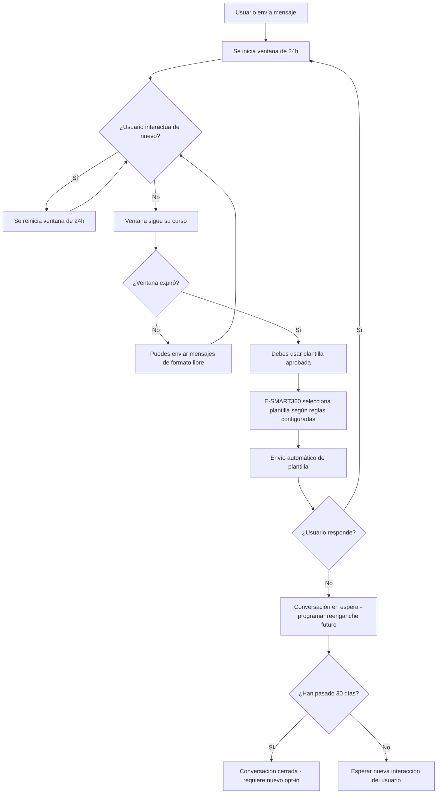

> **Resumen ejecutivo:** La regla de las 24 horas permite a las empresas enviar mensajes de formato libre (sin plantilla) a los usuarios dentro de las 24 horas posteriores a su última interacción. Una vez vencida esa ventana, solo puedes usar plantillas de mensajes aprobadas por WhatsApp (o mensajes patrocinados en Facebook Messenger) para volver a contactar al usuario. E-SMART360 automatiza el seguimiento de esta ventana, envía alertas y gestiona las plantillas para garantizar el cumplimiento normativo.

**Última actualización:** 6 de mayo de 2026

---

## Entendiendo la Regla de las 24 Horas para WhatsApp y Facebook Messenger

En el mundo de la comunicación instantánea, plataformas como WhatsApp y Facebook Messenger han implementado reglas para mantener la privacidad del usuario y el control sobre los mensajes. Una de las regulaciones más importantes es la **regla de las 24 horas**, que rige la forma en que las empresas interactúan con los usuarios. Este artículo profundiza en los detalles de esta regla, sus implicaciones y cómo E-SMART360 ayuda a las empresas a cumplir con estas políticas mientras garantizan una comunicación fluida.


> **Actualización sobre la regla de 24 horas (2026-02-13)**
> Meta sigue ajustando los criterios de la ventana de conversación. WhatsApp ahora considera como "interacción del usuario" cualquier mensaje entrante, reacción a un mensaje, clic en un botón de llamada a la acción (CTA) o interacción con un formulario de WhatsApp Flows. Verifica siempre la documentación oficial de Meta para conocer la lista completa de eventos que reinician el temporizador.

---

## ¿Qué es la Regla de las 24 Horas?

La regla de las 24 horas se refiere a la ventana de tiempo durante la cual una empresa puede enviar mensajes de **formato libre** (mensajes sin plantilla) a un usuario después de su última interacción. Una vez que la ventana de 24 horas expira, las empresas no pueden enviar mensajes normales y deben utilizar **plantillas de mensajes aprobadas** (conocidas como mensajes iniciados por la empresa) para volver a involucrar al usuario.


> **Consejo clave:** Piensa en la ventana de 24 horas como una "conversación activa". Mientras el usuario siga interactuando, el temporizador se reinicia. Cada nuevo mensaje del usuario te da otras 24 horas para responder con mensajes de formato libre. Esto significa que una sola conversación bien gestionada puede mantenerse activa durante días o semanas si el usuario sigue participando.

### Puntos Clave sobre la Regla de las 24 Horas

- El período de 24 horas comienza desde la **última interacción del usuario**, como enviar un mensaje, reaccionar a una publicación o hacer clic en un botón.
- Dentro de esta ventana, las empresas pueden enviar **cualquier tipo de mensaje**, incluyendo mensajes promocionales, transaccionales o conversacionales.
- Después de 24 horas, las empresas no pueden enviar mensajes regulares a menos que utilicen **plantillas de mensajes aprobadas por WhatsApp** o **mensajes patrocinados** en Facebook Messenger.

### ¿Qué cuenta como "interacción del usuario"?

El concepto de interacción es más amplio de lo que muchas empresas piensan. No se limita a enviar un mensaje de texto. Estas acciones también cuentan como interacción del usuario:

- **Enviar un mensaje de texto** al negocio.
- **Reaccionar** a un mensaje enviado por la empresa (emojis, me gusta, etc.).
- **Hacer clic en un botón** de llamada a la acción (CTA) dentro de un mensaje.
- **Responder a una encuesta** o formulario interactivo.
- **Seleccionar una opción** en un menú de lista interactiva.
- **Interactuar con un producto** del catálogo de WhatsApp.
- **Responder a un formulario** de WhatsApp Flows.
- **Iniciar un pago** directamente desde la conversación.
- **Hacer clic en un enlace** dentro de un mensaje de la empresa.


> **Importante:** Los mensajes salientes de la empresa (como notificaciones automáticas, recordatorios o respuestas de chatbot) **no reinician el contador**. Solo las acciones del usuario pueden reiniciar la ventana de 24 horas.

---

## ¿Por Qué Existe la Regla de las 24 Horas?

Esta regla está diseñada para:

1. **Proteger la privacidad del usuario**: Al limitar los mensajes no solicitados, la regla garantiza que los usuarios no se vean abrumados por notificaciones irrelevantes o frecuentes. Esto es especialmente importante en un entorno donde el teléfono móvil es el principal canal de comunicación.

2. **Fomentar respuestas oportunas**: Las empresas se ven incentivadas a responder rápidamente a las consultas de los usuarios y mantener una alta satisfacción del cliente. Las respuestas rápidas mejoran la experiencia general del usuario.

3. **Garantizar el cumplimiento normativo**: La regla se alinea con regulaciones globales de privacidad como el GDPR en Europa, la LGPD en Brasil y la CCPA en California, otorgando a los usuarios control sobre sus interacciones y evitando el envío de comunicaciones no deseadas.

4. **Mantener la calidad del ecosistema**: Al evitar el envío masivo de mensajes no solicitados, WhatsApp preserva la utilidad y relevancia de su plataforma tanto para usuarios como para empresas legítimas. Esto ayuda a mantener la confianza en el canal.


> E-SMART360 está diseñado teniendo en cuenta estas regulaciones. La plataforma te ayuda a mantener una calificación de calidad alta al monitorear tus interacciones y sugerir las mejores prácticas de comunicación. Además, el sistema de alertas inteligentes te notifica cuando alguna conversación requiere atención prioritaria para no perder la ventana activa.

---

## ¿Qué Ocurre Cuando Vence la Ventana de 24 Horas?

Cuando la ventana de 24 horas expira, las empresas ya no pueden enviar mensajes de formato libre. En su lugar, deben recurrir a métodos alternativos aprobados por la plataforma:

### 1. Usar Plantillas de Mensajes (WhatsApp)

Las plantillas de mensajes son mensajes preaprobados por WhatsApp que garantizan el cumplimiento de sus políticas. Estos mensajes se utilizan a menudo para fines transaccionales, como:

- Confirmaciones de pedido y recibos de compra.
- Recordatorios de citas y notificaciones de eventos.
- Resolución de incidencias de soporte técnico.
- Notificaciones de envío y actualizaciones de entrega.
- Actualizaciones de estado de servicios contratados.
- Ofertas promocionales y campañas de marketing.
- Verificación de identidad y autenticación de dos factores.
- Encuestas de satisfacción post-servicio.


> Las plantillas de WhatsApp pueden incluir **marcadores de posición dinámicos** para personalizar los mensajes con datos específicos de cada usuario, como su nombre, número de pedido, fecha de entrega o enlace de seguimiento. También pueden incluir botones interactivos como "Ver pedido", "Confirmar cita" o "Hablar con agente".

**Ejemplos de plantillas con marcadores dinámicos y botones:**

```
Plantilla: Confirmación de entrega
Cuerpo: "Hola {{nombre}}, tu pedido #{{numero_pedido}} ha sido entregado el {{fecha_entrega}}."
Botón: "Calificar servicio" → https://ejemplo.com/encuesta/{{codigo}}

Plantilla: Carrito abandonado
Cuerpo: "Notamos que no completaste tu compra. Aún tienes tiempo para finalizarla."
Botón: "Finalizar compra" → https://tienda.com/checkout/{{carrito_id}}

Plantilla: Confirmación de cita
Cuerpo: "Hola {{nombre}}, tu cita para el {{fecha}} a las {{hora}} ha sido confirmada."
Botón: "Reprogramar" → https://agenda.com/{{cita_id}}
```

### 2. Enviar Mensajes Patrocinados (Facebook Messenger)

En el caso de Facebook Messenger, las empresas pueden utilizar opciones de mensajería paga para enviar mensajes promocionales o de reenganche fuera de la ventana de 24 horas. Los mensajes patrocinados son útiles para:

- Campañas publicitarias estacionales.
- Ofertas dirigidas basadas en el comportamiento del usuario.
- Recordatorios de carritos abandonados con descuentos especiales.
- Reactivación de clientes inactivos con ofertas exclusivas.
- Anuncios de nuevos productos o servicios.

### 3. Plantillas para Reiniciar Conversaciones

Cuando un cliente contacta fuera del horario laboral y la ventana de 24 horas ha expirado, existen plantillas específicas para retomar la conversación de forma natural. E-SMART360 incluye las siguientes plantillas predefinidas que puedes personalizar:


### Plantilla 1: Disculpas por demora en la respuesta

**Propósito:** Para cuando el cliente escribió fuera del horario laboral y no se pudo responder a tiempo.
**Mensaje:**
"Lo sentimos, no pudimos responderte a tiempo porque no estábamos disponibles. Si deseas continuar esta conversación, haz clic en **CONTINUAR** y un agente te atenderá en breve."

### Plantilla 2: Contacto fuera de horario laboral

**Propósito:** Para reiniciar conversaciones cuando el cliente contactó después del cierre.
**Mensaje:**
"Hola {{nombre}}, lamentablemente nos contactaste fuera de nuestro horario laboral y no pudimos responderte a tiempo. Si aún necesitas ayuda con tu consulta sobre {{tema}}, por favor presiona **SÍ** para continuar."

### Plantilla 3: Seguimiento multicanal

**Propósito:** Para clientes que intentaron contactar por múltiples canales sin éxito.
**Mensaje:**
"Disculpa por no haber respondido de inmediato a tu llamada o mensaje anterior. Si tu problema persiste y deseas hablar con un agente, presiona **LLAMAR** o para chatear, presiona **CHAT**."

### Plantilla 4: Recordatorio post-compra

**Propósito:** Para hacer seguimiento de una compra o servicio reciente.
**Mensaje:**
"Hola {{nombre}}, queremos asegurarnos de que todo esté bien con tu {{producto_servicio}} adquirido recientemente. ¿Necesitas ayuda con algo? Responde **SÍ** o **NO**."

---

## Cómo E-SMART360 Simplifica el Cumplimiento de la Regla de las 24 Horas

E-SMART360 está equipado con funciones que ayudan a las empresas a gestionar la regla de las 24 horas de manera efectiva. A continuación, te mostramos cómo cada funcionalidad contribuye al cumplimiento normativo:

### 1. Temporizador en Tiempo Real de la Ventana de 24 Horas

E-SMART360 rastrea el tiempo restante dentro de la ventana de 24 horas para cada interacción del usuario. Las empresas pueden ver fácilmente cuánto tiempo queda para enviar un mensaje regular, lo que garantiza el cumplimiento normativo.


> El temporizador se muestra directamente en el panel de chat en vivo de E-SMART360, junto con cada conversación activa. Así sabrás exactamente cuándo se cerrará la ventana y podrás priorizar tus respuestas. El temporizador se muestra en formato HH:MM:SS y cambia de color cuando quedan menos de 2 horas (naranja) o menos de 30 minutos (rojo).

### 2. Soporte Completo para Plantillas de Mensajes

Después de que expire la ventana de 24 horas, E-SMART360 permite a las empresas enviar plantillas de mensajes de WhatsApp. Estas plantillas se pueden personalizar con marcadores de posición para una comunicación personalizada. El sistema incluye:

- **Editor visual de plantillas** con vista previa en tiempo real.
- **Gestión de versiones** para mantener el historial de cambios y auditoría.
- **Sincronización automática** con el administrador de WhatsApp Cloud API.
- **Biblioteca de plantillas predefinidas** para casos de uso comunes (bienvenida, carrito abandonado, post-venta, etc.).
- **Validación de formato** antes del envío a aprobación.
- **Soporte para botones** interactivos: llamada a la acción, enlaces rápidos y números de teléfono.
- **Variables dinámicas** ilimitadas para personalización masiva.

### 3. Notificaciones de Ventanas por Expirar

E-SMART360 envía alertas cuando la ventana de 24 horas de un usuario está a punto de expirar, lo que permite a las empresas actuar de manera oportuna. Puedes configurar:

- Alertas con **15 minutos de anticipación** para acciones urgentes.
- Alertas con **1 hora de anticipación** para planificar respuestas.
- Alertas con **2 horas de anticipación** para conversaciones de baja prioridad.
- Alertas personalizadas según tus necesidades operativas.
- Notificaciones por correo electrónico, SMS o directamente en el panel de control.

### 4. Envío Automático de Plantillas

Una de las funcionalidades más potentes de E-SMART360 es la capacidad de **cambiar automáticamente al uso de plantillas** cuando la ventana de 24 horas expira. El sistema:

1. Detecta el vencimiento exacto de la ventana de conversación.
2. Consulta las reglas configuradas para determinar la plantilla adecuada según el contexto.
3. Envía el mensaje de plantilla automáticamente sin intervención manual.
4. Registra el envío para fines de auditoría y análisis.
5. Actualiza el estado de la conversación en el panel.
6. Espera la respuesta del usuario para reiniciar el ciclo.


> Este flujo automático asegura que **nunca pierdas una oportunidad de reenganche** por descuido humano. El sistema opera 24/7 sin necesidad de supervisión constante.

### 5. Gestión de Aprobación de Plantillas

E-SMART360 simplifica el proceso de crear, enviar y usar plantillas de mensajes aprobadas por WhatsApp, lo que garantiza que las empresas puedan reenganchar a los usuarios incluso después de la ventana de 24 horas.


### Crea tu plantilla

Utiliza el editor visual de E-SMART360 para redactar el mensaje, agregar marcadores de posición dinámicos y seleccionar el tipo de plantilla (marketing, utilidad, servicio al cliente). El editor incluye validación en vivo del formato requerido por WhatsApp.

### Personaliza los elementos interactivos

Agrega botones de respuesta rápida, enlaces de llamada a la acción o números de teléfono. E-SMART360 te permite previsualizar cómo se verá la plantilla en dispositivos móviles Android y iOS.

### Envía a aprobación

E-SMART360 envía automáticamente la plantilla a WhatsApp para su revisión a través de la API. El sistema te notificará cuando el estado cambie de "pendiente" a "aprobado" o "rechazado".

### Monitorea el estado

Sigue el progreso de aprobación desde el panel de control. Las plantillas aprobadas aparecen automáticamente como disponibles para su uso. Las rechazadas incluyen una explicación del motivo.

### Actívala en tus flujos

Asigna la plantilla a tus flujos de chatbot, campañas de broadcasting o respuestas automáticas post-24h. E-SMART360 ejecutará la plantilla correcta en el momento adecuado según las reglas que configures.

---

## Tipos de Conversaciones y su Relación con la Regla de 24 Horas

WhatsApp clasifica las conversaciones en diferentes tipos, cada uno con sus propias reglas:


### Conversaciones iniciadas por el usuario

Son aquellas donde el usuario envía el primer mensaje. La ventana de 24 horas comienza en ese momento. Durante esta ventana, la empresa puede responder con cualquier tipo de mensaje (formato libre). Si la empresa necesita seguir conversando después de las 24 horas, debe cambiar a una plantilla de mensaje aprobada.

### Conversaciones iniciadas por la empresa

Son aquellas que comienzan con el envío de una plantilla de mensaje aprobada. La ventana de 24 horas comienza cuando el usuario responde a esa plantilla. Hasta que el usuario responda, la empresa no puede enviar más mensajes de formato libre. Este tipo de conversación tiene costos diferentes según la categoría de la plantilla (marketing, utilidad, servicio).

### Conversaciones de servicio

Las conversaciones de servicio al cliente tienen reglas especiales. Si un usuario contacta por un problema de servicio, la empresa dispone de 24 horas desde la última interacción del usuario para responder con mensajes de formato libre. Las plantillas de servicio tienen un costo menor que las de marketing.

---

## Límites de Mensajería y Calificación de Calidad

La regla de las 24 horas está estrechamente relacionada con los **límites de mensajería** de WhatsApp. Las empresas se asignan a diferentes niveles según su uso y calidad:

| Nivel | Usuarios únicos por día | Requisito para subir de nivel |
|-------|------------------------|-------------------------------|
| **Trial** | Hasta 250 usuarios | Completar configuración de la cuenta y verificación empresarial |
| **Nivel 1** | Hasta 1,000 usuarios | Enviar mensajes a 1,000 usuarios únicos en 24 horas |
| **Nivel 2** | Hasta 10,000 usuarios | Enviar mensajes a 500 usuarios únicos manteniendo calidad alta |
| **Nivel 3** | Hasta 100,000 usuarios | Enviar mensajes a 5,000 usuarios únicos manteniendo calidad alta |
| **Nivel 4** | Ilimitado | Mantener una calificación de calidad alta de forma consistente |

Para progresar a un nivel superior, debes cumplir con estos requisitos:

1. **Calificación de calidad alta** en tus mensajes (mínimo 90% de tasa de entrega exitosa).
2. Enviar mensajes al menos al **50% del límite de tu nivel actual**.
3. Mantener una tasa de **bloqueos inferior al 0.5%**.
4. Interactuar con los usuarios de forma constante y relevante.
5. Mantener una calificación de calidad **Media o Alta** durante los últimos 7 días.


> Si tu calificación de calidad baja a "Baja", WhatsApp puede reducir tu límite de mensajería al nivel anterior o incluso restringir temporalmente tu capacidad de iniciar conversaciones. E-SMART360 monitorea automáticamente tu calificación de calidad y te alerta si detecta una tendencia negativa.

---

## Navegando la Regla de 24 Horas: Estrategias para Diferentes Escenarios

### Comprendiendo los Detalles de la Regla

La regla de las 24 horas de WhatsApp para empresas no se limita a los mensajes de texto; se aplica a todos los tipos de mensajes, incluyendo imágenes, videos, documentos y notas de voz. Aquí tienes lo que necesitas saber:

- **La regla aplica por igual a todos los formatos de mensaje**: ya sea que envíes texto, imágenes, PDFs o mensajes de voz, todos cuentan dentro de la misma ventana de 24 horas.
- **Los mensajes salientes de la empresa no extienden la ventana**: solo los mensajes entrantes del usuario la reinician.
- **Las respuestas automáticas de los chatbots también cuentan**: si tu chatbot responde, consume tiempo de la ventana, pero la ventana solo se extiende si el usuario vuelve a interactuar.


> **Dato clave:** WhatsApp Business API cobra por cada conversación, no por cada mensaje. Una conversación abarca todas las interacciones dentro de una ventana de 24 horas. Esto significa que puedes enviar múltiples mensajes dentro de una misma ventana sin costos adicionales por mensaje individual.

### ¿Por Qué es Importante Cumplir con la Regla?

Cumplir con la regla de las 24 horas es crucial para:

1. **Evitar sanciones**: El incumplimiento puede resultar en restricciones de cuenta o límites de mensajería reducidos por parte de WhatsApp.
2. **Mejorar la reputación de la marca**: Las empresas que respetan los límites de comunicación son percibidas como más confiables y profesionales.
3. **Aumentar la participación**: Los mensajes oportunos dentro de la ventana de 24 horas tienen tasas de apertura y respuesta significativamente más altas.
4. **Reducir costos**: Las plantillas de servicio tienen un costo menor que las de marketing. Usar correctamente la ventana de 24 horas puede reducir tus costos operativos.

### Desglose Detallado de la Regla de las 24 Horas

Para entender completamente la regla, es útil desglosarla en sus componentes:

| Componente | Descripción |
|------------|-------------|
| **Ventana** | Período de 24 horas desde la última interacción del usuario |
| **Tipos de mensaje** | Formato libre (sin plantilla) vs. plantillas aprobadas |
| **Costos** | Las conversaciones iniciadas por el usuario tienen un costo; las iniciadas por la empresa varían según la categoría |
| **Limitaciones** | Solo se puede enviar 1 plantilla de marketing por conversación |
| **Reinicio** | Cualquier interacción del usuario reinicia la ventana completa |
| **Cobertura** | Aplica a WhatsApp Business API, WhatsApp Cloud API y Facebook Messenger |

---

## Estrategias para Manejar la Ventana de 24 Horas

### Mejores Prácticas para Mensajes dentro de la Ventana


### Responde al instante

Configura respuestas automáticas para consultas comunes. E-SMART360 te permite crear flujos de chatbot que responden al instante, manteniendo la conversación activa y al usuario comprometido.

### Segmenta a tus usuarios

No todos los usuarios son iguales. Segmenta tu audiencia según su comportamiento, historial de compras o nivel de engagement para personalizar los mensajes dentro de la ventana.

### Ofrece valor en cada interacción

Cada mensaje dentro de la ventana debe aportar valor al usuario. Evita mensajes genéricos o spam. Ofrece información útil, descuentos exclusivos o contenido relevante.

### Diseña flujos conversacionales atractivos

Crea secuencias de mensajes que inviten al usuario a seguir interactuando. Por ejemplo: "¿Te gustaría ver más opciones?" o "¿Necesitas ayuda con algo más?"

### Monitorea las métricas en tiempo real

Usa el panel de E-SMART360 para monitorear el tiempo restante, las tasas de respuesta y la calidad de las conversaciones. Ajusta tu estrategia según los datos.

### Estrategias Post-Ventana

Cuando la ventana de 24 horas expira, estas estrategias te ayudarán a mantener la comunicación:

1. **Utiliza plantillas de servicio para seguimientos** cuando el usuario haya solicitado soporte previamente.
2. **Programa campañas de reactivación** con plantillas de marketing para usuarios inactivos.
3. **Aprovecha los datos históricos** para personalizar las plantillas post-ventana con información relevante de conversaciones anteriores.
4. **Combina canales**: si la ventana expiró, considera complementar con email marketing o SMS como respaldo.

---

## Casos de Uso Prácticos de la Regla de las 24 Horas

### Consultas de Soporte al Cliente

Un usuario envía una consulta sobre un producto. La empresa responde con información detallada dentro de la ventana de 24 horas. Si se necesita un seguimiento adicional después de 24 horas, la empresa utiliza una **plantilla de mensaje** para reiniciar la conversación.


> **Con E-SMART360:** El chatbot responde automáticamente a la consulta inicial con información relevante. Si el agente humano necesita hacer seguimiento al día siguiente, el sistema sugiere automáticamente la plantilla adecuada basada en el contexto de la conversación anterior. Esto elimina la necesidad de que el agente recuerde usar una plantilla específica.

### Notificaciones de Pedidos

Un cliente realiza un pedido y recibe un mensaje de confirmación. Si hay una demora o actualización después de 24 horas, la empresa envía una plantilla de mensaje con la información actualizada. Este es uno de los casos de uso más comunes y efectivos para las plantillas de utilidad.

### Recordatorios de Carrito Abandonado

Un usuario abandona su carrito de compras. Dentro de las 24 horas, la empresa puede enviar un recordatorio. Si el usuario no actúa, se envía una **plantilla de mensaje** después de 24 horas con una oferta personalizada para incentivar la compra.


### Caso real: Tienda de e-commerce

**Situación:** Un cliente agrega productos al carrito pero no finaliza la compra.

**Acción:** Dentro de las primeras 2 horas, el chatbot de E-SMART360 envía un recordatorio amigable con el enlace directo al carrito.

**Seguimiento:** A las 12 horas, se envía un segundo recordatorio destacando los beneficios del producto.

**Post-24h:** Si el cliente no responde, se activa automáticamente una plantilla con un código de descuento del 10%.

**Tasa de recuperación:** 23% de los carritos recuperados usando esta estrategia multicapa.

### Caso real: Clínica dental

**Situación:** Un paciente confirma una cita pero no se presenta a la consulta.

**Acción:** La clínica envía un mensaje de seguimiento dentro de las 24 horas preguntando si desea reagendar.

**Seguimiento:** Se le ofrecen 3 opciones de horario para la nueva cita.

**Post-24h:** Si la ventana expira sin respuesta, se envía una plantilla con un enlace directo al calendario de citas en línea.

**Tasa de re-programación:** 35% de los pacientes que no asistieron reagendan su cita mediante este sistema automatizado.

### Notificaciones de Estado de Envío

Una empresa de logística puede enviar actualizaciones sobre el estado de un envío. Si el paquete se retrasa y la ventana de 24 horas ha expirado, se utiliza una plantilla de utilidad para notificar al cliente con la nueva fecha estimada de entrega.

### Verificación de Pedidos Contra Reembolso

En comercios electrónicos, es común verificar los pedidos contra reembolso (COD). Si el cliente no responde dentro de las 24 horas, se puede enviar una plantilla de verificación automatizada para confirmar que el pedido sigue siendo válido.

---

## Componentes Avanzados de una Plantilla de WhatsApp

Las plantillas de mensaje de WhatsApp pueden incluir componentes avanzados para hacerlas más interactivas y efectivas:

### Botones en Plantillas


### Botones de llamada a la acción

Permiten que el usuario realice una acción específica:
- **Visitar sitio web**: Abre una URL predefinida.
- **Llamar por teléfono**: Inicia una llamada al número configurado.
- **Copiar código**: Copia un código de descuento al portapapeles.

**Ejemplo:** "Hola {{nombre}}, obtén un 15% de descuento en tu próxima compra."
Botón: "Ver ofertas" → https://tienda.com/ofertas

### Botones de respuesta rápida

Permiten que el usuario responda con un solo clic:
- Opciones predefinidas como "Sí", "No", "Más información".
- Hasta 3 botones por plantilla.
- Ideal para encuestas rápidas y confirmaciones.

**Ejemplo:** "¿Deseas confirmar tu cita para el {{fecha}}?"
Botones: "Confirmar" | "Reprogramar" | "Cancelar"

### Componentes Multimedia

Las plantillas pueden incluir:
- **Encabezado**: Texto, imagen (640x640 píxeles recomendado), video (hasta 16 MB) o documento (PDF, hasta 100 MB).
- **Cuerpo**: Texto principal con hasta 1024 caracteres y marcadores de posición.
- **Pie de página**: Texto adicional pequeño (hasta 60 caracteres).
- **Botones**: Hasta 3 botones de respuesta rápida o 1-2 botones de llamada a la acción.

---

## Consejos para Maximizar la Ventana de 24 Horas

1. **Responde rápidamente**: Utiliza herramientas de automatización como chatbots para garantizar respuestas oportunas dentro de la ventana. Cada minuto cuenta cuando tienes 24 horas para aprovechar al máximo.

2. **Interactúa de manera significativa**: Concéntrate en resolver los problemas del usuario o proporcionar información valiosa para fomentar una mayor interacción. Las conversaciones valiosas tienden a extenderse naturalmente.

3. **Planifica los seguimientos**: Utiliza plantillas de mensajes estratégicamente para el reenganche después de que expire la ventana. Ten preparadas al menos 3-4 plantillas para diferentes escenarios.

4. **Configura múltiples plantillas**: Ten preparadas diferentes plantillas para distintos escenarios: soporte, ventas, notificaciones, promociones, post-venta. E-SMART360 te permite gestionarlas todas desde un solo panel.

5. **Monitorea la calidad de tus mensajes**: WhatsApp evalúa la calidad de tus mensajes constantemente. Mantén una calificación alta para acceder a límites de mensajería más altos y evitar restricciones.

6. **Usa chatbots para ampliar la ventana**: Cada interacción del usuario con tu chatbot reinicia el temporizador de 24 horas. Diseña flujos conversacionales atractivos que inviten al usuario a seguir participando con preguntas, opciones y contenido relevante.

7. **Segmenta tu audiencia**: No todas las conversaciones merecen el mismo esfuerzo. Prioriza las interacciones con mayor potencial de conversión o valor para tu negocio.

### Automatización Inteligente con E-SMART360


> E-SMART360 te permite configurar **secuencias automatizadas** que aprovechan al máximo la ventana de 24 horas. Por ejemplo, puedes enviar una serie de mensajes de bienvenida, luego una oferta especial, y finalmente un recordatorio, todo dentro de la ventana activa. Si el usuario no responde después de la tercera interacción, el sistema cambia automáticamente a plantillas aprobadas para el seguimiento.

**Ejemplo de secuencia automatizada:**
1. **Minuto 0:** Usuario envía mensaje → Chatbot responde con saludo y opciones.
2. **Minuto 5:** Usuario selecciona "Ver productos" → Chatbot envía catálogo.
3. **Hora 1:** Usuario no ha comprado → Chatbot envía oferta especial.
4. **Hora 6:** Usuario sigue sin comprar → Chatbot envía recordatorio con enlace.
5. **Hora 23:55:** Sin respuesta → Último mensaje de formato libre: "¿Te gustaría recibir más ofertas?"
6. **Hora 24+:** Sistema cambia automáticamente a plantilla de seguimiento.

---

## Diagrama de Flujo: Gestión de la Ventana de 24 Horas



---

## Preguntas Frecuentes


### ¿Qué cuenta exactamente como 'interacción' del usuario para iniciar la ventana de 24h?

Incluye cualquier mensaje del usuario, hacer clic en un botón, reaccionar a una publicación en Facebook Messenger o cualquier interacción dentro de tu chat. En el contexto de WhatsApp, también cuenta la interacción con un producto del catálogo, la respuesta a un formulario de WhatsApp Flows, la selección de una opción en una lista interactiva, o hacer clic en un enlace dentro de un mensaje de la empresa. Es importante destacar que **los mensajes salientes de la empresa (como notificaciones) no reinician el contador**; solo las acciones del usuario lo hacen. Por eso es importante diseñar flujos conversacionales que incentiven al usuario a responder activamente.

### ¿Puedo enviar mensajes promocionales después de la ventana de 24h?

Solo a través de **plantillas de mensajes aprobadas** (o mensajes patrocinados en los canales compatibles). No puedes enviar mensajes promocionales de formato libre después de las 24h. Todas las plantillas promocionales deben pasar por el proceso de aprobación de WhatsApp, que verifica que el contenido cumpla con las políticas de la plataforma. Las plantillas de marketing tienen un costo por conversación más alto que las de servicio o utilidad.

### ¿Las plantillas necesitan aprobación?

Sí. WhatsApp debe aprobar tu plantilla (que a menudo incluye marcadores de posición) antes de que puedas usarla después de las 24h. El proceso de aprobación puede tardar desde unas horas hasta varios días, dependiendo de la carga de trabajo del equipo de revisión de Meta. E-SMART360 te notifica automáticamente cuando una plantilla es aprobada o rechazada, y te guía en el proceso de corrección si es necesario. Las plantillas rechazadas incluyen el motivo exacto del rechazo para que puedas corregirlas rápidamente.

### ¿E-SMART360 cambia automáticamente a plantillas cuando expira el tiempo?

Sí. E-SMART360 maneja el cambio automáticamente, envía alertas y te ayuda a gestionar las plantillas para mantenerte dentro de las políticas. Puedes configurar reglas específicas para determinar qué plantilla usar según el contexto de la conversación, el segmento del cliente y el tipo de interacción previa. El sistema también permite programar un retardo antes del envío automático para dar tiempo a los agentes humanos a intervenir manualmente si lo desean.

### ¿Qué sucede si tengo una conversación con múltiples agentes? ¿El temporizador se reinicia?

No, el temporizador de 24 horas se basa en la **última interacción del usuario**, no en los mensajes de los agentes. Los mensajes del equipo de soporte no reinician el contador. Solo cuando el usuario envía un mensaje, reacciona o interactúa de alguna manera, el temporizador se reinicia. E-SMART360 muestra claramente el tiempo restante para cada conversación en el panel compartido, independientemente de cuántos agentes estén participando en la conversación.

### ¿La regla de 24 horas aplica igual en todos los países?

Sí, la regla de las 24 horas es una política global de WhatsApp que aplica a todas las empresas que utilizan WhatsApp Business API, independientemente del país. Sin embargo, las regulaciones de privacidad locales (como el GDPR en Europa, la LGPD en Brasil o la CCPA en California) pueden imponer requisitos adicionales sobre cómo gestionar los datos y el consentimiento de los usuarios. E-SMART360 te ayuda a cumplir con ambas capas de regulación: las políticas de WhatsApp y las leyes locales de protección de datos.

### ¿Qué pasa si envío un mensaje justo cuando expira la ventana?

Si tu mensaje se envía **exactamente** en el momento en que expira la ventana, WhatsApp evaluará si el mensaje se inició dentro del período de 24 horas. Para evitar riesgos y posibles sanciones, E-SMART360 corta el envío de mensajes de formato libre **5 minutos antes** del vencimiento exacto y cambia automáticamente al modo de plantillas, dándote un margen de seguridad adicional. Esta configuración es ajustable según tus necesidades.

### ¿Cuánto cuesta cada tipo de conversación?

Los costos varían según la región y el tipo de conversación:
- **Conversaciones iniciadas por el usuario (servicio)**: Tarifa más baja, aplica cuando el usuario envía el primer mensaje.
- **Conversaciones iniciadas por la empresa (marketing)**: Tarifa más alta, aplica cuando envías una plantilla de marketing.
- **Conversaciones iniciadas por la empresa (utilidad)**: Tarifa intermedia, aplica para notificaciones transaccionales.
- **Conversaciones iniciadas por la empresa (servicio)**: Tarifa más baja, aplica para seguimiento de casos de soporte.
E-SMART360 muestra el costo estimado de cada conversación en tiempo real para que puedas gestionar tu presupuesto de manera efectiva.

### ¿Puedo tener múltiples ventanas de 24 horas con el mismo usuario?

Sí, un mismo usuario puede tener múltiples ventanas de 24 horas activas simultáneamente si inicia varias conversaciones independientes sobre temas diferentes. Sin embargo, WhatsApp agrupa las interacciones en una sola conversación a menos que se cumplan condiciones específicas para abrir conversaciones separadas. E-SMART360 gestiona automáticamente esta complejidad y te muestra cada conversación de forma independiente.

---

## Ejemplos Prácticos Adicionales


### Ejemplo 1: Restaurante

**Escenario:** Un cliente pregunta por el menú del día.

**Dentro de 24h:** El chatbot envía el menú en PDF y pregunta si desea hacer un pedido.

**Seguimiento:** A las 6 horas, se envía una foto del plato recomendado.

**Post-24h:** Si no hay respuesta, se envía una plantilla: "Hola {{nombre}}, nuestro menú especial de hoy incluye {{plato_del_dia}}. ¿Te gustaría reservar una mesa?"

**Resultado:** 18% de tasa de conversión en reservas.

### Ejemplo 2: Tienda de ropa

**Escenario:** Un cliente preguntó por disponibilidad de tallas.

**Dentro de 24h:** Se le informa que la talla está agotada pero se espera reposición en 3 días.

**Seguimiento:** A las 12 horas, se comparte un lookbook con outfits similares.

**Post-24h:** Plantilla automática: "¡Buenas noticias! La talla {{talla}} que buscabas ya está disponible en {{color}}. Cómprala aquí: {{enlace}}"

**Resultado:** 12% de los clientes completan la compra al recibir la notificación de reposición.

### Ejemplo 3: Servicio técnico

**Escenario:** Un usuario reporta un problema técnico con un dispositivo.

**Dentro de 24h:** Se le pide más información, se crea un ticket y se le asignan pasos de diagnóstico.

**Seguimiento:** A las 8 horas, se verifica si los pasos resolvieron el problema.

**Post-24h:** Plantilla de actualización: "Hola {{nombre}}, tu ticket #{{ticket_id}} ha sido actualizado. Estado: {{estado}}. Para más detalles, haz clic aquí: {{enlace}}"

**Resultado:** Reducción del 40% en reaperturas de tickets gracias a las actualizaciones automáticas.

---

## Guía Rápida de Configuración en E-SMART360

Sigue estos pasos para configurar la gestión automática de la regla de las 24 horas en tu cuenta de E-SMART360:


### Accede al panel de configuración

Inicia sesión en tu cuenta de E-SMART360 y navega a la sección "Configuración de Conversaciones" → "Regla de 24 horas".

### Activa la gestión automática

Habilita el interruptor de "Gestión Automática de Ventanas" para que el sistema monitoree automáticamente todas las conversaciones activas.

### Configura las alertas

Selecciona los tiempos de alerta que prefieras: 15 minutos, 30 minutos, 1 hora o 2 horas antes del vencimiento. Puedes activar múltiples alertas simultáneamente.

### Selecciona las plantillas predeterminadas

Elige qué plantillas usar automáticamente cuando expire la ventana. Puedes asignar plantillas diferentes según el tipo de conversación: servicio, ventas o soporte.

### Define reglas de excepción

Configura excepciones para conversaciones específicas donde no deseas que el sistema actúe automáticamente, por ejemplo, conversaciones de alta prioridad que requieren intervención manual.

### Prueba y activa

Realiza una prueba con una conversación de muestra para verificar que todo funciona correctamente, luego activa la configuración para todas las conversaciones.

---

## Conclusión

La regla de las 24 horas es una regulación esencial para las empresas que utilizan WhatsApp y Facebook Messenger. Garantiza que las interacciones con los usuarios sigan siendo relevantes y respetuosas, al tiempo que ofrece a las empresas la oportunidad de interactuar de manera significativa con su audiencia.

Con las herramientas integrales de E-SMART360, gestionar la ventana de 24 horas y enviar plantillas de mensajes aprobadas se vuelve un proceso sencillo, automatizado y sin fricciones. Al aprovechar estas funciones, las empresas pueden mantener el cumplimiento normativo sin sacrificar la calidad de la comunicación, construir relaciones más sólidas con sus clientes y optimizar sus costos operativos.


> **Empieza a gestionar tus ventanas de 24 horas de forma efectiva con E-SMART360** y asegúrate de que tu estrategia de mensajería esté alineada con las directrices de WhatsApp. Configura tus plantillas, automatiza tus seguimientos y mantén a tus clientes comprometidos en todo momento. La automatización inteligente de E-SMART360 te permite estar siempre un paso adelante.

---

### Recursos Relacionados

- [Guía para crear plantillas de mensajes en WhatsApp](/recursos/crear-plantillas-whatsapp)
- [Estrategias de broadcasting con datos personalizados](/recursos/broadcasting-datos-personalizados)
- [Cómo crear plantillas carrusel en WhatsApp](/recursos/plantillas-carrusel-whatsapp)
- [Envío de mensajes masivos a suscriptores con plantillas](/recursos/envio-masivo-plantillas-whatsapp)
- [Navegando los límites de mensajería de WhatsApp](/recursos/limites-mensajeria-whatsapp)
- [Guía completa de calificación de calidad en WhatsApp](/recursos/calificacion-calidad-whatsapp)


### ¿Puedo usar imágenes y videos dentro de la ventana de 24 horas?

Sí, dentro de la ventana de 24 horas puedes enviar cualquier tipo de contenido multimedia sin restricciones: imágenes (JPEG, PNG), videos (MP4, hasta 16 MB), documentos (PDF, DOCX, XLSX), notas de voz y stickers. Todos estos formatos cuentan como mensajes dentro de la misma conversación y no generan costos adicionales siempre que se envíen dentro de la misma ventana. E-SMART360 te permite incluir estos archivos directamente desde tu panel de chat o mediante flujos automatizados.

### ¿Cómo manejar usuarios que escriben desde diferentes husos horarios?

E-SMART360 ajusta automáticamente los temporizadores según la zona horaria configurada para cada conversación. Si un usuario escribe desde un huso horario diferente, el sistema registra la hora local del usuario y del negocio por separado. Esto permite programar las plantillas de reenganche en el momento óptimo del día para el usuario, maximizando las probabilidades de respuesta. Puedes configurar horarios de silencio para evitar enviar notificaciones en horarios no laborables del usuario.

### ¿Qué métricas puedo monitorear en E-SMART360 sobre la regla de 24 horas?

E-SMART360 proporciona un panel completo de métricas que incluye:
- **Conversaciones activas**: Número actual de ventanas abiertas.
- **Tiempo promedio de respuesta**: Velocidad de reacción de tu equipo.
- **Tasa de vencimiento**: Porcentaje de conversaciones que expiran sin respuesta.
- **Efectividad de plantillas**: Tasa de respuesta para cada plantilla post-24h.
- **Costo por conversación**: Desglose de costos por tipo de conversación.
- **Calificación de calidad**: Seguimiento en tiempo real de tu calificación.
- **Alertas de tendencia**: Notificaciones cuando la calidad empieza a bajar.
Todas estas métricas están disponibles en gráficos interactivos y se pueden exportar para análisis externos.

> **Recuerda:** La clave del éxito con la regla de las 24 horas no está solo en cumplirla, sino en diseñar una estrategia conversacional que mantenga a tus usuarios participando activamente. Cada interacción del usuario es una oportunidad para extender la conversación y profundizar la relación con tu marca. E-SMART360 te proporciona todas las herramientas para hacerlo de manera eficiente y escalable.

---

## Diferencias Clave: WhatsApp Cloud API vs. WhatsApp Business API

Es importante entender que existen dos versiones principales de la API de WhatsApp para empresas:

| Característica | WhatsApp Cloud API | WhatsApp Business API (On-Premise) |
|----------------|-------------------|-------------------------------------|
| **Alojamiento** | Servidores de Meta (cloud) | Servidores propios del negocio |
| **Mantenimiento** | Automático por Meta | Manual por el equipo técnico |
| **Regla de 24h** | Aplica igual | Aplica igual |
| **Límites de mensajería** | Gestionados por Meta | Configurables por el negocio |
| **Actualizaciones** | Automáticas y gratuitas | Requieren migración manual |
| **Costo de infraestructura** | Sin costo adicional | Costos de servidor y mantenimiento |
| **Recomendación** | Ideal para la mayoría de empresas | Solo para casos con requisitos muy específicos |

E-SMART360 es compatible con ambas versiones, pero recomendamos WhatsApp Cloud API por su facilidad de uso, menor costo y actualizaciones automáticas.
