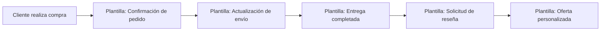

# Actualizar Plantillas de WhatsApp en E-SMART360

Mantener tus plantillas de WhatsApp actualizadas es crucial para una comunicación efectiva con tu audiencia. Con E-SMART360, puedes sincronizar y actualizar fácilmente las plantillas creadas en el Administrador de Plantillas de WhatsApp. En esta guía, te explicamos el proceso completo para mantener tus plantillas al día.


> Las plantillas de mensajes de WhatsApp permiten a las empresas enviar mensajes a sus clientes incluso después de las 24 horas de la última interacción. Son ideales para enviar actualizaciones, confirmaciones y recordatorios.

## Prerrequisitos

Antes de comenzar, asegúrate de contar con lo siguiente:

- **Una cuenta de WhatsApp Business** conectada a E-SMART360.
- **Acceso a WhatsApp Cloud API** (si planeas sincronizar plantillas desde el Administrador de WhatsApp).
- **Una idea clara del contenido de tu mensaje**, incluyendo variables, botones o pies de página que necesites.


> Tener una estrategia clara de plantillas te ahorrará tiempo a largo plazo. Define primero los tipos de mensajes que enviarás con más frecuencia: notificaciones de pedidos, recordatorios de citas, ofertas promocionales, etc.

## Pasos para Actualizar Plantillas de WhatsApp en E-SMART360

### 1. Accede al Administrador de Plantillas de WhatsApp

- Inicia sesión en tu Administrador de Plantillas de WhatsApp.
- Crea o edita las plantillas según sea necesario, asegurándote de que cumplan con las directrices de WhatsApp y los requisitos de tu negocio.

### 2. Desvincula la Plantilla en E-SMART360

- Inicia sesión en tu cuenta de E-SMART360.
- Navega a la sección **Plantillas**.
- Busca la plantilla que deseas actualizar y haz clic en la opción **"Desvincular"**.
- Esta acción eliminará la plantilla de E-SMART360 sin afectarla en el Administrador de Plantillas de WhatsApp.


> Al desvincular una plantilla, asegúrate de tener una versión actualizada lista en el Administrador de WhatsApp. De lo contrario, podrías quedarte sin esa plantilla para tus envíos.

### 3. Sincroniza las Plantillas en E-SMART360

- Después de desvincular la plantilla, haz clic en el botón **"Sincronizar Plantilla"** en E-SMART360.
- Esta acción obtendrá las plantillas más recientes del Administrador de Plantillas de WhatsApp que no estén vinculadas actualmente en E-SMART360.

### 4. Vincula la Plantilla Actualizada

- Una vez sincronizadas las plantillas, localiza la plantilla actualizada en la lista.
- Haz clic en **"Vincular"** para conectar la plantilla actualizada con E-SMART360.
- Asegúrate de que todos los campos y variables necesarios estén correctamente mapeados para un funcionamiento adecuado.

### 5. Verifica la Actualización

- Envía un mensaje de prueba usando la plantilla actualizada para verificar que los cambios se reflejen correctamente.
- Asegúrate de que la plantilla funcione como esperas y que todas las actualizaciones se muestren con precisión.


> Realizar pruebas con la plantilla actualizada antes de usarla en campañas masivas te ayuda a detectar errores de formato, variables mal mapeadas o problemas de visualización.

## Tipos de Plantillas de WhatsApp

WhatsApp clasifica las plantillas en dos categorías principales, cada una con sus propias directrices:

### Plantillas de Utilidad

Las plantillas de utilidad son mensajes preaprobados diseñados para actualizaciones transaccionales, como confirmaciones, cambios o suspensiones relacionadas con una transacción o suscripción específica. Estas plantillas deben ser funcionales y no promocionales. Si una plantilla contiene contenido tanto de utilidad como de marketing, se clasificará como plantilla de marketing.

**Ejemplos de plantillas de utilidad:**


### Confirmación de pedido

"Tu pedido #12345 ha sido confirmado. Recibirás una actualización de seguimiento pronto."

### Recibo de pago

"Tu pago de $50 se ha procesado con éxito. ¡Gracias por tu compra!"

### Recordatorio de cita

"Recordatorio: tu cita con el Dr. García está programada para el 15 de marzo a las 10 a.m. Responde para confirmar."

### Actualización de envío

"Tu paquete #98765 ha sido enviado. Fecha estimada de entrega: 20 de marzo."

> Estos ejemplos son solo de referencia. WhatsApp puede categorizar mensajes similares de manera diferente según el contenido.

### Plantillas de Marketing

Las plantillas de marketing ofrecen una mayor flexibilidad y se utilizan para mensajes que no se relacionan con una transacción específica. Pueden incluir promociones, ofertas, mensajes de bienvenida, actualizaciones, invitaciones, recomendaciones o solicitudes de interacción con el cliente.

**Ejemplos de plantillas de marketing:**


### Oferta promocional

"¡Oferta exclusiva! Obtén un 20% de descuento en tu próxima compra. Usa el código AHORRA20 al pagar."

### Reactivación de clientes

"¡Te extrañamos! Disfruta de envío gratis en tu próximo pedido. Toca abajo para comprar ahora."

### Invitación a evento

"Únete a nuestro próximo seminario web sobre tendencias de marketing digital. ¡Regístrate ahora!"

### Lanzamiento de producto

"¡Ya está aquí nuestro nuevo producto! Descubre todas las novedades y consigue un descuento especial por lanzamiento."

## Límites de Caracteres para Plantillas

Para asegurar que tus plantillas de WhatsApp sean aprobadas, es importante respetar los límites de caracteres establecidos por la plataforma. Exceder estos límites puede provocar el rechazo de la plantilla.

### Encabezado

| Tipo | Límite |
|------|--------|
| Texto | Hasta **60** caracteres |
| Subtítulo (para medios) | Hasta **256** caracteres |

### Cuerpo

| Tipo | Límite |
|------|--------|
| Plantillas con medios | Hasta **1024** caracteres |
| Plantillas estándar | Hasta **4096** caracteres |
| Al enviar para aprobación | El cuerpo está restringido a **1024** caracteres (las variables **{{n}}** cuentan como 1 carácter) |

### Pie de Página

| Tipo | Límite |
|------|--------|
| Texto | Hasta **60** caracteres |

### Botones

| Elemento | Límite |
|----------|--------|
| Texto del botón | Hasta **20** caracteres |
| Payload de respuesta rápida | Hasta **256** caracteres |


> Los límites de caracteres se aplican de forma estricta. Revisa siempre el conteo antes de enviar una plantilla para su aprobación para evitar retrasos innecesarios.

## Beneficios de Mantener las Plantillas Actualizadas

Mantener tus plantillas al día ofrece múltiples ventajas para tu negocio:


### Mejora la comunicación

Las actualizaciones regulares aseguran que tus mensajes sean relevantes y atractivos para tu audiencia. Una plantilla desactualizada puede transmitir información incorrecta o generar confusión.

### Mantén la consistencia

Conserva una voz de marca y un mensaje consistentes en todas tus comunicaciones. La coherencia genera confianza y reconocimiento de marca.

### Cumple con las normativas

Mantente en cumplimiento con las políticas y directrices de WhatsApp utilizando plantillas actualizadas. Las plantillas que no cumplen pueden ser rechazadas o provocar restricciones en tu cuenta.

### Ahorra tiempo y recursos

Reutiliza y modifica plantillas existentes en lugar de crear nuevas desde cero. Esto acelera tus procesos de comunicación y reduce el trabajo administrativo.

### Optimiza la tasa de entrega

Las plantillas actualizadas y aprobadas tienen mayores tasas de entrega. WhatsApp prioriza los mensajes que utilizan plantillas en buen estado y con buena calificación de calidad.

## Buenas Prácticas para la Creación de Plantillas

Sigue estas recomendaciones para maximizar la efectividad de tus plantillas:

### 1. Usa un lenguaje claro y directo

Evita la ambigüedad. Tus clientes deben entender el propósito del mensaje de inmediato. Para plantillas transaccionales, sé específico con los datos (números de pedido, fechas, montos).

### 2. Personaliza con variables

Aprovecha las variables para personalizar cada mensaje. Un saludo con el nombre del cliente o una referencia a su compra reciente aumenta significativamente la tasa de engagement.

### 3. Incluye llamadas a la acción claras

Utiliza botones de CTA (Call to Action) para guiar al cliente hacia el siguiente paso: "Ver pedido", "Confirmar cita", "Comprar ahora", "Saber más".

### 4. Revisa la ortografía y gramática

Un error tipográfico puede afectar la aprobación de tu plantilla y la percepción de tu marca. Revisa siempre el contenido antes de enviarlo.

### 5. Prueba antes de lanzar

Siempre envía una prueba a ti mismo o a un pequeño grupo antes de usar la plantilla en una campaña masiva. Verifica que las variables se reemplacen correctamente y que el formato se vea bien en diferentes dispositivos.


### ¿Con qué frecuencia debo actualizar mis plantillas de WhatsApp?

No hay una frecuencia fija recomendada, pero lo ideal es revisar tus plantillas al menos una vez al mes. Si tu negocio experimenta cambios estacionales, lanzamientos de productos o modificaciones en tus políticas, actualiza las plantillas afectadas de inmediato. También es buena práctica revisarlas después de cualquier actualización importante de las políticas de WhatsApp.

### ¿Qué hago si mi plantilla es rechazada?

Si una plantilla es rechazada, revisa el motivo del rechazo en el Administrador de Plantillas de WhatsApp. Las razones más comunes incluyen:
- **Contenido promocional en plantillas de utilidad**: Asegúrate de que el contenido coincida con la categoría seleccionada.
- **Exceso de caracteres**: Verifica los límites de cada sección.
- **Formato incorrecto**: Revisa que las variables estén correctamente colocadas.
- **Idioma no permitido**: Usa el idioma correcto para el mercado objetivo.
Corrige el problema y vuelve a enviar la plantilla para su revisión.

### ¿Puedo tener múltiples versiones de la misma plantilla?

Sí, puedes tener diferentes versiones de una misma plantilla. Sin embargo, cada versión debe tener un nombre único. Se recomienda mantener un registro de las versiones anteriores por si necesitas revertir algún cambio. E-SMART360 te permite gestionar múltiples plantillas y mantenerlas organizadas por su estado (aprobada, pendiente, rechazada).

### ¿Las plantillas caducan después de un tiempo?

WhatsApp no elimina automáticamente las plantillas aprobadas, pero si una plantilla no se usa durante un período prolongado, su calidad puede verse afectada. WhatsApp monitorea la calidad de los mensajes enviados con cada plantilla. Si los usuarios bloquean o reportan mensajes con frecuencia, la plantilla puede ser desactivada. Úsala regularmente y monitorea su rendimiento.

### ¿Cómo afecta la calidad de la plantilla a mi calificación con WhatsApp?

La calificación de calidad de tu cuenta de WhatsApp se ve directamente afectada por el rendimiento de tus plantillas. Las plantillas que generan altas tasas de bloqueo, reportes de spam o bajas tasas de interacción pueden reducir tu calificación. Una calificación baja puede provocar restricciones en los límites de mensajes. Mantén tus plantillas relevantes, útiles y no intrusivas para preservar una buena calificación.

## Ejemplos Prácticos de Uso de Plantillas

### Caso 1: Tienda en línea (e-commerce)

Una tienda de ropa utiliza E-SMART360 para automatizar sus comunicaciones post-venta. Configura las siguientes plantillas:




### Flujo de comunicación post-venta

1. **Confirmación**: Inmediatamente después de la compra.
2. **Envío**: Cuando el paquete es despachado.
3. **Entrega**: Cuando el cliente recibe el producto.
4. **Reseña**: 3 días después solicitando opinión.
5. **Oferta**: 7 días después con productos relacionados.

### Resultados obtenidos

- Incremento del 35% en reseñas de productos
- Reducción del 50% en consultas de "¿dónde está mi pedido?"
- Aumento del 22% en ventas recurrentes
- Mejora en la calificación de calidad de WhatsApp

### Caso 2: Centro de salud

Una clínica dental automatiza la gestión de citas con las siguientes plantillas:

1. **Recordatorio de cita** (48 horas antes): Incluye fecha, hora y dirección.
2. **Confirmación de asistencia** (24 horas antes): Solicita confirmación con un botón.
3. **Instrucciones pre-cita** (12 horas antes): Recomendaciones y documentos necesarios.
4. **Seguimiento post-consulta**: Instrucciones de cuidado y próxima cita recomendada.
5. **Recordatorio de limpieza anual**: Automatizado a los 11 meses de la última visita.


> Este flujo redujo las inasistencias en un 40% y aumentó la satisfacción del paciente gracias a una comunicación clara y oportuna.

## Conclusión

Actualizar las plantillas de WhatsApp en E-SMART360 es un proceso simple y eficiente que garantiza que tus comunicaciones se mantengan efectivas y actualizadas. Siguiendo los pasos descritos en esta guía, puedes sincronizar y actualizar tus plantillas sin problemas, asegurando un rendimiento óptimo y un buen nivel de interacción con tu audiencia.


> ¿Necesitas ayuda adicional? El equipo de soporte de E-SMART360 está disponible para asistirte con cualquier duda sobre la gestión de plantillas. No dudes en contactarnos.

## Cómo Crear una Plantilla desde Cero en E-SMART360

Si prefieres crear una nueva plantilla directamente desde E-SMART360 en lugar de sincronizarla desde el Administrador de WhatsApp, sigue estos pasos:

### 1. Ve al Gestor de Bots

- Inicia sesión en tu cuenta de E-SMART360.
- Navega a la sección **Gestor de Bots**.
- Haz clic en **Plantilla de Mensaje**.

### 2. Agrega Variables (Opcional)

Si tu plantilla necesita datos personalizados como nombres, fechas o montos:

- Desplázate hasta la sección **Variable de Plantilla**.
- Haz clic en **Crear**.
- Ingresa un **nombre para la variable**.
- Haz clic en **Guardar**.


> Las variables se insertan en el cuerpo del mensaje usando la sintaxis {{nombre_variable}}. Por ejemplo: "Hola {{nombre}}, tu pedido {{pedido_id}} está listo."

### 3. Crea la Plantilla

- Desplázate hacia arriba hasta **Configuración de Plantilla de Mensaje**.
- Haz clic en **Crear** y completa el formulario:
  - **Nombre de la Plantilla**: Asígnale un nombre descriptivo.
  - **Cuerpo del Mensaje**: Escribe tu mensaje (inserta variables si es necesario).
  - **Texto del Pie de Página** (Opcional): Agrega información adicional como horarios de atención.
  - **Respuesta Rápida** (Opcional): Selecciona si necesitas opciones de respuesta predefinidas.
  - **Texto del Botón**: Agrega texto para botones si es necesario (máximo 20 caracteres).
- Haz clic en **Guardar**.


> El nombre de la plantilla debe ser único y descriptivo. WhatsApp utiliza este nombre para identificar la plantilla en su sistema. No uses espacios ni caracteres especiales.

### 4. Usa la Plantilla

Antes de utilizar la plantilla, verifica que su **estado sea aprobado**. Una vez aprobada, puedes usarla para:

- **Transmisiones** (broadcasting)
- **Chat en vivo**
- **Mensajes de Shopify y WooCommerce**
- **Flujos de bot automatizados**

## Cómo Sincronizar Plantillas desde el Administrador de WhatsApp

Si prefieres crear tus plantillas directamente en el Administrador de WhatsApp de Meta y luego sincronizarlas con E-SMART360, este método te ofrece un control más granular:

### Paso 1: Crea la plantilla en el Administrador de WhatsApp

- Accede al [Administrador de WhatsApp Business](https://business.facebook.com/wa/manage/).
- Selecciona tu cuenta de WhatsApp.
- Ve a la sección **Plantillas de Mensaje**.
- Haz clic en **Crear Plantilla**.
- Completa todos los campos requeridos: nombre, categoría, idioma, cuerpo del mensaje.
- Agrega variables, botones y pie de página según sea necesario.
- Envía la plantilla para revisión.

### Paso 2: Espera la aprobación

El equipo de Meta revisa tu plantilla. El proceso puede tomar desde unas horas hasta varios días. Revisa periódicamente el estado.


> Las plantillas de categoría **Utilidad** suelen aprobarse más rápido que las de **Marketing**, ya que contienen información transaccional directa sin contenido promocional.

### Paso 3: Desvincula la versión anterior en E-SMART360

Si ya tenías una versión anterior de esta plantilla vinculada en E-SMART360:

- Ve a la sección **Plantillas** en E-SMART360.
- Localiza la plantilla y haz clic en **Desvincular**.

### Paso 4: Sincroniza las plantillas nuevas

- Haz clic en **Sincronizar Plantilla**.
- Espera a que el sistema obtenga las plantillas disponibles.
- Localiza tu nueva plantilla en la lista.
- Haz clic en **Vincular**.

### Paso 5: Verifica y prueba

- Envía un mensaje de prueba a tu propio número.
- Verifica que todas las variables se reemplacen correctamente.
- Confirma que los botones funcionen y redirijan al lugar correcto.

## Causas Comunes de Rechazo de Plantillas y Cómo Solucionarlas

Entender por qué WhatsApp rechaza las plantillas te ayudará a crear contenido que se apruebe más rápido:

### 1. Contenido no coincidente con la categoría

| Categoría | Contenido permitido | Ejemplo de rechazo |
|-----------|---------------------|--------------------|
| Utilidad | Transaccional, confirmaciones, actualizaciones | Incluir "¡Compra ahora!" en una plantilla de utilidad |
| Marketing | Promociones, ofertas, invitaciones | Enviar como utilidad un mensaje promocional |

**Solución**: Selecciona la categoría correcta desde el inicio. Si tu mensaje tiene algún elemento promocional, clasifícalo como marketing.

### 2. Exceso de caracteres

| Elemento | Límite | Problema común |
|----------|--------|----------------|
| Cuerpo con medios | 1024 caracteres | Superar el límite con descripciones largas |
| Botón | 20 caracteres | Texto como "Haz clic aquí para más información" (demasiado largo) |

**Solución**: Revisa los límites de caracteres antes de enviar. Usa textos concisos.

### 3. Formato incorrecto de variables

- Las variables deben usar la sintaxis {{1}}, {{2}}, etc.
- No uses paréntesis, corchetes u otros formatos.
- El número de variables en el cuerpo debe coincidir con las definidas.

### 4. Contenido prohibido

WhatsApp no permite:

- Contenido sexual o sugerente
- Promoción de tabaco, alcohol o drogas
- Contenido engañoso o spam
- Solicitudes de información sensible no justificadas
- Caracteres especiales excesivos (emojis en exceso, mayúsculas sostenidas)

### 5. Errores de formato de medios

- Las imágenes deben cumplir con las especificaciones de tamaño y formato.
- Los documentos PDF deben tener un tamaño inferior a 100 MB.
- Los videos no deben exceder los 16 MB.


### ¿Qué significa cada estado de aprobación de plantilla?

**Aprobada**: La plantilla puede usarse para enviar mensajes. Está lista para usar en E-SMART360.

**Pendiente**: La plantilla está en revisión por WhatsApp. Puede tomar desde horas hasta días.

**Rechazada**: La plantilla no cumple con las políticas. Debes revisar el motivo, corregirlo y volver a enviar.

**Pausada**: La plantilla fue aprobada pero temporalmente desactivada, generalmente por problemas de calidad o reportes de usuarios.

### ¿Puedo usar emojis en las plantillas de WhatsApp?

Sí, puedes usar emojis en las plantillas, pero con moderación. El uso excesivo de emojis puede hacer que tu mensaje parezca poco profesional o incluso ser marcado como spam. WhatsApp recomienda un máximo de 2-3 emojis por plantilla y solo cuando aporten valor al mensaje (por ejemplo, ✅ para confirmación, 📦 para envío).

### ¿Qué son los botones de CTA y cómo se configuran?

Los botones CTA (Call to Action) son botones interactivos que puedes agregar a tus plantillas. WhatsApp soporta dos tipos:

1. **Botón de llamada telefónica**: Permite al cliente llamar a un número específico con un solo clic.
2. **Botón de visita a sitio web**: Abre una URL en el navegador del cliente.

Para configurarlos, durante la creación de la plantilla selecciona "Agregar botón", elige el tipo, ingresa el texto (máximo 20 caracteres) y configura la acción correspondiente (número telefónico o URL).

### ¿Cómo gestionar plantillas para diferentes idiomas?

WhatsApp requiere que cada plantilla esté asociada a un idioma específico. Si tu negocio atiende en varios idiomas:

- Crea plantillas separadas para cada idioma.
- Nómbralas de manera que sean fáciles de identificar, por ejemplo: "confirmacion_pedido_es", "order_confirmation_en".
- E-SMART360 te permite gestionar todas las plantillas desde un mismo panel, independientemente del idioma.
- Al hacer broadcasting, selecciona la plantilla según el idioma preferido de cada segmento de tu audiencia.

### ¿Las plantillas aprobadas pueden modificarse después?

Una vez aprobada una plantilla, no puedes editarla directamente. Debes crear una nueva versión con los cambios deseados y enviarla para aprobación nuevamente. WhatsApp no permite la edición de plantillas ya aprobadas por razones de control de calidad y seguridad. Por eso es recomendable revisar cuidadosamente antes de enviar para aprobación.

## Ejemplo Completo: Automatización de un Proceso de Venta

Veamos cómo una empresa de comercio electrónico configura sus plantillas para automatizar completamente el proceso de venta:

### Plantilla 1: Confirmación de Pedido (Utilidad)

```
✅ ¡Gracias por tu compra {{nombre}}!

Tu pedido #{{pedido_id}} ha sido registrado.
Total: ${{total}}
Dirección de envío: {{direccion}}

Te notificaremos cuando sea enviado.
```

**Botón**: "Ver mi pedido" → URL con enlace al historial

### Plantilla 2: Actualización de Envío (Utilidad)

```
📦 ¡Buenas noticias!

Tu pedido #{{pedido_id}} ha sido enviado.
Empresa de envío: {{transportista}}
Número de seguimiento: {{tracking}}

Fecha estimada: {{fecha_entrega}}
```

**Botón**: "Rastrear envío" → URL de seguimiento

### Plantilla 3: Solicitud de Reseña (Marketing) — 3 días después

```
¿Cómo te fue con tu {{producto}}?

Tu opinión nos ayuda a mejorar. ¿Nos regalas un momento para calificar tu compra?
```

**Botón**: "Calificar ahora" → URL de reseña

### Plantilla 4: Oferta Post-Venta (Marketing) — 7 días después

```
{{nombre}}, como cliente frecuente queremos darte un {{descuento}}% de descuento en tu próxima compra.

Usa el código: {{codigo}} — Válido hasta {{fecha_limite}}.
```

**Botón**: "Comprar ahora" → URL de tienda


> Este flujo completo de 4 plantillas ha demostrado aumentar las ventas recurrentes hasta en un 30% y mejorar significativamente la satisfacción del cliente al mantenerlo informado en cada etapa.

## Consideraciones sobre la Calidad de las Plantillas

WhatsApp evalúa continuamente la calidad de tus plantillas en función de cómo los usuarios interactúan con tus mensajes:

### Indicadores de calidad

- **Tasa de bloqueo**: Porcentaje de usuarios que bloquean tu número después de recibir un mensaje.
- **Tasa de reporte**: Usuarios que reportan tu mensaje como spam.
- **Tasa de interacción**: Usuarios que hacen clic en botones o responded al mensaje.

### Cómo mantener una buena calificación

1. **Envía contenido relevante**: No uses plantillas de marketing para información transaccional y viceversa.
2. **Respeta los horarios**: Evita enviar mensajes fuera del horario laboral (a menos que sea una actualización urgente).
3. **Segmenta tu audiencia**: No envíes el mismo mensaje a todos. Usa las variables para personalizar.
4. **Monitorea las métricas**: Revisa periódicamente las tasas de apertura, clics y bloqueo.
5. **Actualiza regularmente**: Las plantillas desactualizadas pueden generar confusión y reportes.

### Consecuencias de una mala calificación

- Reducción de los límites de mensajes (de 250,000 a 1,000 por día).
- Aumento en el tiempo de revisión de nuevas plantillas.
- Posible desactivación temporal del número de WhatsApp.
- Mayor probabilidad de que los mensajes sean marcados como spam.


> Si tu calificación de calidad baja al nivel "Rojo", WhatsApp puede limitar severamente tu capacidad de enviar mensajes o incluso suspender tu cuenta. Monitorea este indicador regularmente desde el panel de E-SMART360.

## Resumen de Comprobación Rápida

Antes de enviar cualquier plantilla para aprobación, verifica esta lista:

- [ ] La categoría (Utilidad/Marketing) es correcta para el contenido
- [ ] El cuerpo no excede los límites de caracteres
- [ ] Las variables tienen el formato correcto {{n}}
- [ ] El idioma seleccionado coincide con el contenido
- [ ] Los botones tienen texto de 20 caracteres o menos
- [ ] Las URLs en botones CTA son válidas y accesibles
- [ ] No hay contenido prohibido ni engañoso
- [ ] El pie de página (si aplica) tiene 60 caracteres o menos
- [ ] La plantilla no contiene marcas registradas sin permiso
- [ ] Los emojis se usan con moderación

Para obtener más información sobre cómo crear plantillas desde cero y evitar rechazos, consulta nuestra guía sobre [razones comunes de rechazo de plantillas](/recursos/rechazo-plantillas-whatsapp).
