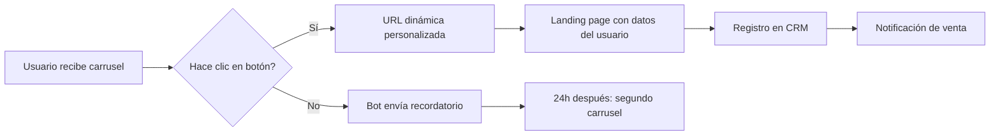

# Cómo Crear Plantillas de Carrusel en WhatsApp con E-SMART360


> Las plantillas de carrusel multimedia son una de las herramientas más útiles para mostrar múltiples piezas de contenido visual —como imágenes y videos— en un solo mensaje. Ya sea para destacar productos, servicios, descuentos o novedades, esta función te ofrece un método atractivo y llamativo para presentar tu información.

## ¿Qué es una Plantilla de Carrusel Multimedia?

Una plantilla de carrusel multimedia te permite mostrar varias tarjetas deslizables dentro de un mismo mensaje de WhatsApp. Cada tarjeta puede contener una imagen o video, texto descriptivo y hasta dos botones personalizados. Es ideal para:

- **Catálogos de productos**: muestra varios artículos en un solo mensaje
- **Promociones y ofertas**: presenta descuentos o paquetes especiales
- **Novedades y lanzamientos**: anuncia nuevos productos o servicios
- **Galerías de servicios**: muestra tu portafolio visualmente
- **Eventos**: presenta múltiples fechas o actividades


> El carrusel mantiene a los usuarios dentro de la conversación de WhatsApp, lo que aumenta significativamente las tasas de interacción en comparación con enviar enlaces externos.

## Requisitos Previos

Antes de comenzar, asegúrate de tener:


### Cuenta WhatsApp Business

- Una cuenta de WhatsApp Business conectada a E-SMART360
- Número de teléfono verificado en la plataforma
- Catálogo de productos sincronizado (para plantillas de productos)

### Contenido Visual

- Imágenes en formato JPEG o PNG de alta calidad
- Videos en formato MP4 (si usas video en las tarjetas)
- Texto descriptivo conciso para cada tarjeta
- URLs de destino para los botones CTA

### Configuración

- Tienda en línea integrada (Shopify, WooCommerce, etc.) para plantillas de productos
- Bot activo configurado en el gestor de bots
- Permisos de marketing en WhatsApp Business API

## Creación de Plantilla de Carrusel Multimedia

Desde el panel de control de E-SMART360, sigue estos pasos:


### Accede al Gestor de Plantillas

Navega a **Gestor de Bots** → **Plantillas de Mensajes**. Haz clic en **Crear** y selecciona **Plantilla de Carrusel Multimedia**.


> La categoría de plantilla debe ser **Marketing** para los carruseles promocionales. Si tu plantilla es transaccional, considera usar una categoría de utilidad.

### Configura el Nombre y Categoría

Asigna un nombre descriptivo a tu plantilla. Cambia la categoría a **Marketing** (los carruseles multimedia se usan principalmente para contenido promocional).

### Diseña el Cuerpo del Mensaje

Agrega el mensaje principal que aparecerá sobre las tarjetas del carrusel. Este texto debe ser breve y directo, idealmente no más de 1024 caracteres.

### Agrega las Tarjetas del Carrusel

Para cada tarjeta, elige entre **Imagen** o **Video** como encabezado. Luego añade el texto que deseas mostrar en el cuerpo de la tarjeta. Cada tarjeta debe tener contenido relevante y coherente con el resto del carrusel.

### Añade Botones a las Tarjetas

Por cada tarjeta puedes agregar hasta **dos botones**. Las opciones disponibles son:

- **URL**: redirige al usuario a un sitio web
- **Respuesta Rápida**: permite al usuario responder con una palabra clave predefinida

Selecciona el **Tipo de Botón**, el **Texto del Botón** y el **Valor de Acción** correspondiente.


> **IMPORTANTE**: Mantén el mismo orden de botones en todas las tarjetas. Si en una tarjeta agregas primero un botón URL y luego una respuesta rápida, todas las tarjetas deben seguir exactamente ese mismo orden. De lo contrario, la plantilla no se guardará.

### Espera la Aprobación

Una vez creada la plantilla, queda pendiente de revisión por parte de WhatsApp. El proceso de aprobación generalmente toma entre 24 y 48 horas. Puedes verificar el estado desde la sección **Plantillas de Mensajes**.


> Durante la espera, te recomendamos preparar el flujo de bot donde utilizarás la plantilla. Así, cuando esté aprobada, podrás activarla de inmediato.

### Vincula la Plantilla al Bot

Cuando la plantilla esté aprobada, ve a **Respuesta del Bot**. Haz clic en **Crear**, agrega una **palabra clave** y un **título** al inicio del flujo. Desde el constructor de flujos, añade el botón de **plantillas**, selecciona tu plantilla de carrusel y agrega los componentes multimedia correspondientes.

### Prueba y Activa

Guarda la configuración y prueba el bot enviando un mensaje con la palabra clave configurada. Verifica que todas las tarjetas se muestren correctamente, que los botones funcionen y que las imágenes o videos se carguen sin problemas.


> ¡Listo! Ya puedes empezar a enviar tus plantillas de carrusel con contenido multimedia a tus clientes. La experiencia de navegación dentro del chat mejorará significativamente tus tasas de conversión.

## Envío de Video en el Carrusel

Enviar **video con la plantilla de carrusel** es igual de sencillo. Solo debes cambiar el **Encabezado de la Tarjeta** de **Imagen** a **Video**.


### Imagen en Carrusel

- Formato: JPEG, PNG
- Proporción recomendada: 1:1 o 16:9
- Tamaño máximo: 5 MB
- Ideal para: productos, servicios, logotipos

### Video en Carrusel

- Formato: MP4
- Duración máxima: 60 segundos
- Tamaño máximo: 16 MB
- Ideal para: demostraciones, tutoriales, testimonios

> Para obtener los mejores resultados, usa videos cortos (15-30 segundos) que capturen la atención rápidamente. Los videos más largos tienden a tener menor tasa de reproducción completa.

El resto de los pasos —incluyendo agregar tarjetas, personalizar botones y guardar la plantilla— siguen siendo exactamente los mismos que para la plantilla de carrusel de imágenes.

## Uso de la Plantilla de Carrusel de Productos

Si tienes una **tienda en línea**, la plantilla de carrusel de productos es una opción muy conveniente. Aquí te explicamos cómo usarla:


### Integra tu Tienda en Línea

Debes integrar tu **tienda en línea dentro de tu cuenta de WhatsApp Business en E-SMART360**. Asegúrate de que tu tienda esté sincronizada correctamente. Las integraciones compatibles incluyen:

- **Shopify**: sincronización completa de productos
- **WooCommerce**: catálogo en tiempo real
- **Catálogo de WhatsApp**: productos directamente desde la plataforma

### Agrega Productos a tu Catálogo

Verifica que tus productos estén listados en tu catálogo. Si necesitas ayuda visual, puedes consultar el tutorial en video sobre cómo configurar un catálogo de productos en WhatsApp o leer la guía detallada sobre integración de catálogos.


> Mantén tu catálogo actualizado con precios, disponibilidad y descripciones precisas. Los productos desactualizados pueden generar reclamos y afectar tu calidad de cuenta.

### Crea la Plantilla de Productos

Sigue los pasos descritos anteriormente para crear una plantilla de carrusel multimedia, pero en lugar de agregar tarjetas manualmente, selecciona los productos desde tu catálogo.

### Selecciona los Productos

A diferencia de la plantilla de carrusel multimedia estándar, aquí **no necesitas agregar tarjetas manualmente**. Solo selecciona la cantidad de productos que deseas mostrar mientras creas la plantilla. Luego, al configurar el bot, tendrás opciones para añadir los productos directamente desde el catálogo.

### Activa el Flujo del Bot

Configura el bot con la palabra clave deseada y vincula la plantilla de productos. Cuando un usuario envíe la palabra clave, recibirá automáticamente el carrusel con tus productos más relevantes.

De esta manera puedes añadir productos de tu tienda en línea como carrusel y enviarlos directamente a tus clientes.


> **Integración de Shopify y WooCommerce (2026-04-15)**
> Las plantillas de carrusel de productos ahora son compatibles con la sincronización automática de inventario desde Shopify, WooCommerce y el catálogo nativo de WhatsApp. Los precios y la disponibilidad se actualizan en tiempo real.

## Cómo Aprovechar los Botones CTA URL para Mayor Interacción

Para mejorar la interacción con los usuarios, considera usar botones CTA (Llamada a la Acción) con enlaces URL.


### Crea un Flujo de Bot

Configura un flujo de bot y añade un botón CTA URL. Este botón permite dirigir a los usuarios a una página externa —como una landing page, un formulario de registro o una página de producto— directamente desde el mensaje de WhatsApp.

### Personaliza el Botón

Define el **texto del botón** (máximo 20 caracteres), la **URL de destino** y el **mensaje de acompañamiento** que verá el usuario antes de hacer clic.


> Ejemplos de texto para botones CTA:
- "Ver oferta"
- "Comprar ahora"
- "Más información"
- "Regístrate gratis"
- "Catálogo completo"

### Guarda y Activa

Guarda tu bot. A partir de ahora, tu bot enviará un mensaje CTA a los usuarios con la URL deseada. La ventaja es que también puedes enviar el botón CTA URL directamente desde tu chat en vivo.


> Ve a la sección de **chat en vivo**, selecciona **flujo o plantilla de mensajes** y elige la plantilla CTA para enviarla manualmente durante una conversación activa.

> **Integración de URLs Dinámicas**: Puedes usar variables personalizadas en las URLs de los botones CTA para ofrecer enlaces únicos a cada cliente. Por ejemplo, añadiendo `?ref={{numero_telefono}}` al final de la URL para rastrear el origen de cada clic.

## Límites de Caracteres para Plantillas Multimedia

Para asegurar que tus plantillas sean aprobadas sin problemas, es importante respetar los límites de caracteres establecidos por WhatsApp:


### Encabezado

- **Texto**: hasta 60 caracteres
- **Texto alternativo (caption multimedia)**: hasta 256 caracteres

### Cuerpo

- **Plantillas multimedia (carrusel)**: hasta 1024 caracteres
- **Plantillas estándar**: hasta 4096 caracteres
- Al enviar para aprobación, el cuerpo está limitado a 1024 caracteres (cada `{{n}}` cuenta como 1 carácter)

### Pie de Página

- Hasta 60 caracteres

### Botones

- **Texto del botón**: hasta 20 caracteres
- **Payload de respuesta rápida**: hasta 256 caracteres

> Exceder estos límites puede provocar el rechazo automático de tu plantilla. WhatsApp es estricto con estas reglas, especialmente en el cuerpo del mensaje y los textos de los botones.

## Consejos para Plantillas de Carrusel Efectivas


### Consistencia Visual

Mantén un diseño y formato coherente en todas las tarjetas. Si cambias el orden o tipo de botones entre tarjetas, la plantilla no se guardará. Usa colores, tipografía y estilos similares para ofrecer una experiencia profesional.

### Imágenes de Alta Calidad

Elige imágenes visualmente atractivas y relevantes para cada tarjeta. Las imágenes pixeladas o de baja resolución afectan negativamente la percepción de tu marca. Recuerda que en dispositivos móviles la calidad se nota aún más.

### Texto Conciso

Mantén el texto breve y enfocado. El espacio en cada tarjeta es limitado, así que ve directo al punto. Usa viñetas o frases cortas para facilitar la lectura rápida.

### Llamadas a la Acción Claras

Crea botones con textos persuasivos que inviten al usuario a interactuar. En lugar de "Ver", usa "Ver oferta". En lugar de "Click", usa "Comprar ahora". Una buena CTA puede duplicar tu tasa de clics.

### Prueba y Refina

Prueba tu plantilla para asegurarte de que funciona como esperas y haz ajustes según sea necesario. Envía la plantilla a tu propio número para verificar cómo se ve en un dispositivo real.

## Categorías de Plantillas: Utilidad vs Marketing


> Es importante entender la diferencia entre las categorías de plantillas, ya que esto afecta cómo y cuándo puedes enviarlas a tus clientes.

### Plantillas de Utilidad

Las plantillas de utilidad están diseñadas para **actualizaciones transaccionales**, como confirmaciones de pedido, cambios en el estado de una suscripción o notificaciones de pago. Estas deben ser funcionales y no promocionales.

**Ejemplos de plantillas de utilidad:**

- Confirmación de pedido: "Tu pedido #12345 ha sido confirmado. Pronto recibirás información de seguimiento."
- Recibo de pago: "Tu pago de $50 se ha procesado exitosamente. ¡Gracias por tu compra!"
- Recordatorio de cita: "Recordatorio: tu cita con el Dr. García está agendada para el 15 de marzo a las 10 AM. Responde para confirmar."


> Si una plantilla contiene contenido tanto de utilidad como de marketing, WhatsApp la clasificará automáticamente como plantilla de marketing. Esto tiene implicaciones en los costos de conversación.

### Plantillas de Marketing

Las plantillas de marketing ofrecen mayor flexibilidad y se usan para mensajes que no se relacionan con una transacción específica. Pueden incluir promociones, ofertas, mensajes de bienvenida, invitaciones o recomendaciones.

**Ejemplos de plantillas de marketing:**

- Oferta promocional: "¡Oferta exclusiva! Obtén un 20% de descuento en tu próxima compra. Usa el código AHORRO20."
- Reenganche de clientes: "Te extrañamos. Disfruta de envío gratis en tu próximo pedido. Toca abajo para comprar ahora."
- Invitación a evento: "Únete a nuestro próximo seminario web sobre tendencias de marketing digital. ¡Regístrate ahora!"


> Al seleccionar la categoría correcta para tu plantilla de carrusel, aseguras el cumplimiento con las políticas de WhatsApp y optimizas el proceso de aprobación.

## Guía Paso a Paso para Configurar el Carrusel en tu Bot

Para integrar correctamente tu plantilla de carrusel en un flujo de bot automatizado, sigue esta configuración detallada:

### Configuración Inicial del Bot

1. **Accede al Constructor de Flujos**: Ve a **Gestor de Bots** → **Respuesta del Bot** → **Crear nuevo flujo**
2. **Define la palabra clave**: Por ejemplo, "productos", "catalogo", "ofertas"
3. **Agrega un mensaje de bienvenida**: Un texto breve que prepare al usuario para recibir el carrusel

```text
Ejemplo de mensaje de bienvenida:
"¡Hola! Aquí tienes nuestros productos destacados. Desliza para ver todas las opciones."
```

### Vinculación de la Plantilla

4. **Inserta el nodo de plantilla**: Desde el constructor de flujos, arrastra el componente **Plantillas**
5. **Selecciona tu carrusel**: Elige la plantilla de carrusel aprobada de la lista desplegable
6. **Configura los datos dinámicos**: Si usas variables ({{1}}, {{2}}, etc.), asígnales valores desde tu base de datos o desde la entrada del usuario

### Configuración de Respuestas Posteriores

7. **Agrega respuestas para los botones de respuesta rápida**: Configura flujos secundarios para cada respuesta rápida que definiste en las tarjetas
8. **Prueba el flujo completo**: Envía la palabra clave desde un número de prueba y verifica que:
   - El carrusel se muestre correctamente
   - Cada tarjeta tenga su imagen/video
   - Los botones redirijan a las URLs correctas
   - Las respuestas rápidas activen los flujos secundarios


> Si tu plantilla incluye botones de respuesta rápida, asegúrate de tener configuradas las respuestas automáticas para cada una. De lo contrario, el usuario recibirá el mensaje predeterminado de "sin coincidencia".

### Automatización con Transmisiones Masivas

También puedes usar la plantilla de carrusel en **transmisiones masivas (broadcasts)** para llegar a múltiples contactos simultáneamente:

1. Ve a **Transmisión** → **Crear nueva transmisión**
2. Selecciona tu lista de contacto o segmento de audiencia
3. Elige la plantilla de carrusel aprobada
4. Programa el envío para una fecha y hora específica
5. Monitorea los resultados en tiempo real


> Para transmisiones, segmenta tu audiencia según intereses o comportamiento de compra. Un carrusel de productos de jardinería no tendrá el mismo impacto en un cliente que solo compra electrónica.

## Uso de URLs Dinámicas en Botones CTA

Los **botones CTA URL** pueden incluir parámetros dinámicos para personalizar la experiencia de cada usuario:

### Ejemplos de URLs Dinámicas

| Parámetro | Descripción | Ejemplo |
|-----------|-------------|---------|
| `{{nombre}}` | Nombre del cliente | `tienda.com/oferta?usuario=Juan` |
| `{{telefono}}` | Número del usuario | `tienda.com/checkout?ref=521234567890` |
| `{{producto}}` | Producto específico | `tienda.com/producto/zapatos-rojos` |
| `{{codigo}}` | Código de descuento único | `tienda.com/carrito?cupo=BIENVENIDO20` |
| `{{fecha}}` | Fecha actual | `tienda.com/promo?fecha=2026-05-07` |

### Beneficios de las URLs Dinámicas

- **Tracking preciso**: Sabes exactamente qué usuario hizo clic en qué tarjeta
- **Personalización escalable**: Cada cliente recibe una URL única sin trabajo manual
- **Integración con CRM**: Los clics se registran automáticamente en tu sistema
- **A/B testing**: Puedes probar diferentes ofertas en el mismo carrusel




> El diagrama anterior muestra el flujo completo desde que un usuario recibe el carrusel hasta el registro de la interacción en tu CRM. Este flujo puede automatizarse completamente con E-SMART360.

## Análisis y Optimización de Resultados

Una vez que tus plantillas de carrusel estén activas, es fundamental medir su rendimiento para optimizar campañas futuras:

### Métricas Clave a Monitorear

- **Tasa de entrega**: Porcentaje de mensajes entregados exitosamente
- **Tasa de apertura**: Usuarios que visualizaron el carrusel
- **Tasa de interacción**: Usuarios que deslizaron entre tarjetas
- **Tasa de clics (CTR)**: Usuarios que hicieron clic en botones
- **Tasa de conversión**: Usuarios que completaron la acción deseada
- **Tasa de rebote**: Usuarios que cerraron el chat después de ver el carrusel

### Estrategias de Optimización


### Pruebas A/B

Crea dos versiones de la misma plantilla de carrusel:
- Versión A: imágenes de producto sobre fondo blanco
- Versión B: imágenes de producto con estilo de vida (personas usando el producto)
- Versión C: variación en el texto de los botones CTA
- Envía cada versión a un segmento diferente y compara resultados

### Segmentación por Horario

Analiza cuándo tus clientes interactúan más:
- Horario laboral (9am-5pm): productos profesionales
- Horario nocturno (7pm-11pm): productos de consumo, ofertas
- Fines de semana: promociones especiales, lanzamientos
- Ajusta el envío de tus carruseles según estos patrones

## Casos de Uso Prácticos


### 🛍️ Tienda de Ropa - Colección de Temporada

**Escenario:** Una tienda de ropa lanza su colección de verano con 6 nuevos productos.

**Solución con E-SMART360:**
1. Crear un carrusel de 5 tarjetas, una por cada producto destacado
2. Cada tarjeta muestra una imagen del producto con precio y descripción breve
3. Botón "Ver producto" con URL directa a la página de compra
4. Botón "Consultar talle" con respuesta rápida que activa el asistente de talles
5. Palabra clave: "verano2026"

**Resultado:** 35% de tasa de clics, 12% de conversión directa desde WhatsApp.

### 🍕 Restaurante - Menú Digital Interactivo

**Escenario:** Un restaurante quiere mostrar su menú de forma interactiva sin imprimir cartas físicas.

**Solución con E-SMART360:**
1. Crear un carrusel dividido en categorías: entradas, platos principales, postres, bebidas
2. Cada tarjeta incluye foto del plato, nombre y precio
3. Botón "Hacer pedido" que inicia un flujo de pedido automatizado
4. Botón "Ver más" que envía un segundo carrusel con más opciones
5. Palabra clave: "menú" o "carta"

**Resultado:** Los clientes pueden ver el menú completo sin salir de WhatsApp, reduciendo el tiempo de decisión en un 40%.

### 🏨 Agencia de Viajes - Paquetes Turísticos

**Escenario:** Una agencia de viajes quiere promocionar paquetes vacacionales a diferentes destinos.

**Solución con E-SMART360:**
1. Crear un carrusel mostrando 4 destinos diferentes: playa, montaña, ciudad, aventura
2. Cada tarjeta incluye foto del destino, precio por persona y días incluidos
3. Botón "Ver detalles" con URL a la página del paquete completo
4. Botón "Quiero reservar" que inicia el flujo de reserva automatizada
5. Palabra clave: "viajes" o "vacaciones"

**Resultado:** Incremento del 28% en solicitudes de reserva vs envío de catálogo en PDF.

### 💻 Tienda de Tecnología - Lanzamiento de Productos

**Escenario:** Una tienda de electrónica lanza una nueva línea de productos con múltiples variantes.

**Solución con E-SMART360:**
1. Carrusel principal con los 3 productos estrella del lanzamiento
2. Cada tarjeta con video demostrativo corto (20 segundos) mostrando las funciones clave
3. Botón "Comprar" que dirige a la ficha de producto con configurador de variantes
4. Botón "Comparar" que envía un segundo carrusel con tabla de especificaciones
5. Seguimiento automático a los 3 días para usuarios que no compraron

**Resultado:** Tasa de conversión del 18% en los primeros 7 días de campaña.

## Solución de Problemas Comunes


### ¿Por qué no se guarda mi plantilla de carrusel?

Asegúrate de que todas las tarjetas sigan la misma estructura de botones. Si una tarjeta tiene una URL y una respuesta rápida, todas las tarjetas deben tener exactamente la misma combinación y en el mismo orden. Además, verifica que no excedas los límites de caracteres permitidos.

### ¿Cuánto tarda la aprobación de la plantilla?

WhatsApp generalmente revisa y aprueba las plantillas dentro de 24 a 48 horas. Puedes verificar el estado en la sección de "Plantillas de Mensajes" de tu panel de control. Si tu plantilla es rechazada, revisa el motivo y corrige los errores antes de reenviarla.

### ¿Puedo enviar plantillas de carrusel en transmisiones masivas?

Sí, una vez aprobadas, puedes usarlas en transmisiones masivas (*broadcasts*), chat en vivo o flujos de bot. Ten en cuenta que los mensajes de marketing solo pueden enviarse durante la ventana de 24 horas de la conversación o mediante plantillas aprobadas.

### ¿Puedo agregar videos en lugar de imágenes en el carrusel?

Sí, selecciona "Video" en lugar de "Imagen" al configurar cada tarjeta. Asegúrate de que el video cumpla con los requisitos de formato (MP4) y tamaño (máximo 16 MB), y que tenga una duración razonable.

### ¿Necesito una tienda en línea para usar plantillas de carrusel?

No, puedes agregar imágenes o videos manualmente a cada tarjeta. Sin embargo, para las plantillas de carrusel de productos, tu tienda debe estar integrada con E-SMART360 y tener un catálogo sincronizado.

### Mi plantilla no fue aprobada. ¿Qué hago?

Verifica que tu mensaje siga las directrices de WhatsApp y no contenga contenido promocional engañoso. Asegúrate de que todos los marcadores de posición (variables) tengan datos de ejemplo. También verifica que los botones tengan URLs correctamente formateadas y que no haya errores de ortografía o gramática.

### Los botones de mi carrusel no funcionan

Asegúrate de que cada tarjeta tenga URLs o respuestas rápidas con el formato correcto. Verifica que las URLs sean accesibles y no estén rotas. Mantén la estructura de botones consistente en todas las tarjetas.

### El contenido multimedia no se muestra correctamente

Verifica que la URL de la imagen o video sea accesible públicamente y esté correctamente subida. Usa formatos de archivo compatibles: JPEG, PNG para imágenes; MP4 para videos. Comprueba que el tamaño del archivo no exceda los límites permitidos.

### ¿Qué hago si mi plantilla de carrusel es rechazada exactamente por el orden de botones?

Revisa que **todas las tarjetas** tengan exactamente la misma combinación y orden de botones. Por ejemplo, si la primera tarjeta tiene:
1. Botón URL — "Ver producto"
2. Botón Quick Reply — "Consultar precio"

La segunda, tercera, etc., deben tener:
1. Botón URL — (cualquier texto URL)
2. Botón Quick Reply — (cualquier texto de respuesta rápida)

No puedes mezclar órdenes. Si cambias el orden en una sola tarjeta, la plantilla completa será rechazada.

### ¿Puedo usar un mismo carrusel para marketing y post-venta?

No es recomendable. WhatsApp clasifica las plantillas en **categorías únicas**. Si mezclas contenido promocional con contenido transaccional, la plantilla se clasificará como marketing, lo que tiene implicaciones en:
- Costo por conversación (las conversaciones de marketing son más costosas)
- Ventana de envío (las de marketing requieren plantilla aprobada siempre)
- Límites de mensajes (las cuentas tienen límites diferentes para marketing vs utilidad)

Te sugerimos crear plantillas separadas para cada propósito.

### ¿Cómo puedo incluir más de 10 productos si el carrusel máximo es 10 tarjetas?

Puedes crear **múltiples carruseles encadenados** dentro del mismo flujo de bot:
1. Carrusel 1: Productos 1-10 (categoría A)
2. Botón "Ver más productos" → activa Carrusel 2: Productos 11-20 (categoría B)
3. Botón "Otra categoría" → activa Carrusel 3

También puedes usar palabras clave como "siguiente" o "más" para que el usuario pueda navegar entre carruseles.

### ¿Qué tipos de archivos multimedia son compatibles con WhatsApp para el carrusel?

- **Imágenes**: JPEG, PNG. Tamaño máximo: 5 MB. Resolución recomendada: 800x800 píxeles
- **Videos**: MP4 (codificación H.264). Tamaño máximo: 16 MB. Duración máxima: 60 segundos
- **Documentos**: No son compatibles directamente en carrusel, pero puedes usar botones URL para enlazar a PDFs

**No compatibles**: GIF animados, WebP animados, SVG, archivos de audio dentro del carrusel.

### ¿Cómo manejar el seguimiento de clics en múltiples carruseles de una misma campaña?

Cada tarjeta puede tener URLs únicas con parámetros UTM diferentes:
```text
ejemplo.com/producto?id=123&utm_source=whatsapp&utm_medium=carousel&utm_campaign=verano2026&utm_term=tarjeta1
```

De esta forma, Google Analytics y otras herramientas de análisis pueden identificar exactamente:
- Qué tarjeta generó el clic
- Desde qué campaña
- En qué carrusel (si tienes varios)
- A qué hora

## Preguntas Frecuentes


### ¿Cuántas tarjetas puede tener un carrusel?

Un carrusel puede contener hasta 10 tarjetas deslizables. Se recomienda usar entre 3 y 6 tarjetas para mantener la atención del usuario sin abrumarlo. WhatsApp puede variar este límite según la región y el tipo de cuenta.

### ¿Puedo usar emojis en las plantillas de carrusel?

Sí, los emojis están permitidos en el cuerpo del mensaje y en los textos de los botones. Sin embargo, úsalos con moderación y asegúrate de que sean relevantes para el contenido. Los emojis pueden aumentar la tasa de apertura hasta en un 25%.

### ¿Las plantillas de carrusel funcionan en todos los dispositivos?

Sí, las plantillas de carrusel son compatibles con WhatsApp en iOS, Android y WhatsApp Web. Sin embargo, en versiones muy antiguas de la aplicación (anteriores a 2022), la visualización puede no ser óptima. Se recomienda que los usuarios tengan la última versión de WhatsApp instalada.

### ¿Puedo editar una plantilla de carrusel después de aprobada?

Sí, puedes editar una plantilla aprobada, pero cualquier cambio requerirá una nueva revisión por parte de WhatsApp. Se recomienda crear una plantilla nueva si los cambios son significativos, para no interrumpir los flujos de bot que ya están activos con la plantilla original.

### ¿Cómo puedo medir el rendimiento de mis plantillas de carrusel?

E-SMART360 proporciona métricas de rendimiento para tus plantillas. Puedes monitorear:
- **Tasa de entrega**: cuántos mensajes se entregaron exitosamente
- **Tasa de clics**: cuántos usuarios hicieron clic en los botones
- **Tasa de lectura**: cuántos usuarios abrieron el mensaje
- **Conversiones**: cuántos usuarios completaron la acción deseada (compra, registro, etc.)

## Recursos Relacionados

- **[Cómo crear plantillas de mensajes para WhatsApp](/recursos/plantillas-mensajes-whatsapp)**
- **[Integración de catálogo de productos en WhatsApp](/recursos/catalogo-productos-whatsapp)**
- **[Componentes multimedia en chatbots: guía para usar plantillas genéricas, carruseles, imágenes y archivos](/recursos/componentes-multimedia-chatbots)**
- **[Cómo sincronizar plantillas desde el Administrador de WhatsApp](/recursos/sincronizar-plantillas-whatsapp-manager)**


> Las plantillas de carrusel multimedia ofrecen una forma dinámica y atractiva de presentar contenido dentro de tus chatbots. Al utilizar eficazmente imágenes, videos y botones URL, puedes crear mensajes visuales impactantes que capten la atención de tu audiencia e impulsen más ventas o acciones deseadas.
