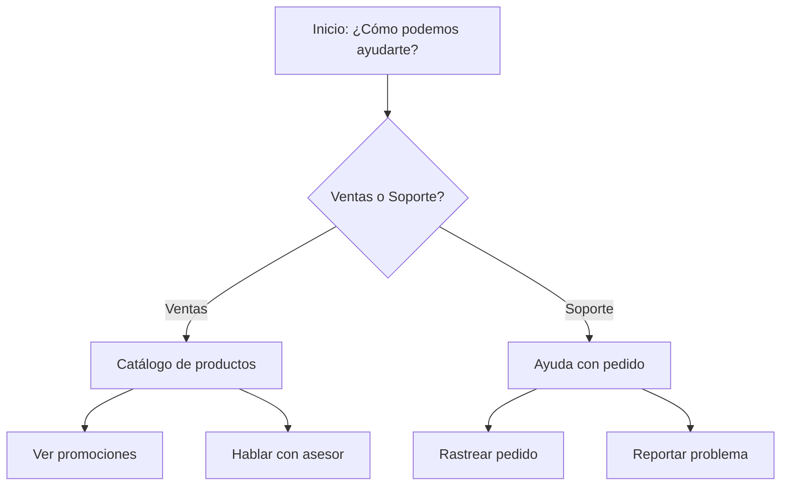

# Cómo Crear una Plantilla de Mensaje para WhatsApp en E-SMART360


> **Última actualización:** Junio 2025 — Las plantillas de mensajes de WhatsApp son esenciales para que las empresas puedan comunicarse con sus clientes fuera de la ventana estándar de 24 horas. Esta guía te llevará desde cero hasta dominar la creación de plantillas en E-SMART360.

Las plantillas de mensajes de WhatsApp permiten a las empresas enviar comunicaciones estructuradas y enriquecidas con medios, como confirmaciones de pedidos, notificaciones de envío, recordatorios de citas y campañas promocionales. E-SMART360 facilita todo el proceso de creación, gestión y uso de estas plantillas directamente desde su panel de control.

## ¿Qué Son las Plantillas de Mensajes de WhatsApp?

Las plantillas de mensajes son formatos de mensaje preaprobados por WhatsApp que las empresas pueden utilizar para iniciar conversaciones con sus clientes fuera de la ventana de 24 horas. A diferencia de los mensajes ordinarios, las plantillas siguen una estructura estricta y deben ser revisadas y aprobadas por Meta antes de su uso.


> **Tipos principales de plantillas:**
- **Utility (Utilidad):** Para comunicaciones transaccionales como confirmaciones, notificaciones de estado, y recordatorios.
- **Marketing:** Para promociones, ofertas, y mensajes de reenganche.
- **Authentication (Autenticación):** Para códigos de verificación OTP.

## Prerrequisitos

Antes de comenzar a crear plantillas, asegúrate de cumplir con lo siguiente:


### Cuenta de WhatsApp Business conectada

Tu número de teléfono debe estar registrado y verificado en la API de WhatsApp Cloud a través de E-SMART360. Sin una conexión activa, las plantillas no podrán enviarse.

### Acceso a WhatsApp Cloud API

Si planeas sincronizar plantillas desde WhatsApp Manager, necesitas tener configurado el acceso a la API. E-SMART360 se encarga de la sincronización automática.

### Contenido claro del mensaje

Antes de crear la plantilla, define el contenido, las variables necesarias, los botones y el pie de página. Esto agilizará el proceso de creación.

## Cómo Crear una Plantilla de Mensaje en E-SMART360

Sigue estos pasos para crear tu primera plantilla de mensaje de WhatsApp.

### Paso 1: Acceder al Gestor de Plantillas

1. Inicia sesión en tu **panel de control de E-SMART360**.
2. Ve a **Gestor de Bots** → **selecciona una cuenta de bot**.
3. Haz clic en la opción **Plantillas de Mensaje**.


> Si tienes varias cuentas de bot, asegúrate de seleccionar la correcta antes de continuar. Cada cuenta puede tener su propio conjunto de plantillas.

### Paso 2: Crear Variables Dinámicas (Opcional pero Recomendado)

Las variables te permiten personalizar cada mensaje con datos específicos del cliente, como su nombre, número de pedido o fecha de entrega.


### Desde E-SMART360

1. Dentro de la sección **Plantillas de Mensaje**, desplázate hacia abajo hasta encontrar **Variables de Plantilla**.
2. Haz clic en el botón **Crear**.
3. Escribe el **nombre de la variable** en el campo correspondiente (ej: `nombre_cliente`, `num_pedido`, `fecha_entrega`).
4. Haz clic en **Guardar**.

La variable quedará disponible para insertarla en el cuerpo del mensaje usando la sintaxis `{{nombre_variable}}`.

### Buenas prácticas para nombres

- Usa nombres descriptivos y en español: `nombre_cliente`, `total_pedido`, `fecha_cita`
- Evita espacios o caracteres especiales
- Sé consistente entre plantillas para facilitar el mantenimiento
- Ejemplos útiles: `{{nombre}}`, `{{pedido_id}}`, `{{monto}}`, `{{fecha}}`, `{{hora}}`, `{{enlace_pago}}`

### Paso 3: Configurar la Plantilla

Una vez que tienes las variables listas, es momento de crear la plantilla en sí:


### Iniciar creación

Desplázate hacia arriba a la sección **Configuración de Plantillas de Mensaje** y haz clic en **Crear**.

### Nombre de la plantilla

Proporciona un nombre descriptivo en el campo **Nombre de plantilla**. Este nombre debe ser único y reflejar el propósito del mensaje, por ejemplo: `confirmacion_pedido`, `recordatorio_cita`, `bienvenida_nuevo_cliente`.

### Cuerpo del mensaje

Escribe el contenido del mensaje en el campo **Cuerpo del mensaje**. Aquí puedes insertar las variables que creaste usando el formato `{{variable}}`. Ejemplo:

```
Hola {{nombre_cliente}}, gracias por tu compra.
Tu pedido #{{num_pedido}} ha sido confirmado.
Recibirás una actualización de seguimiento pronto.
```

### Texto del pie de página (opcional)

En el campo **Texto del pie de página** puedes agregar información adicional como el nombre de tu empresa, un eslogan, o instrucciones breves. Ejemplo: "Gracias por elegirnos — E-SMART360"

### Agregar botones

Selecciona la opción **Quick Reply** si deseas agregar botones de respuesta rápida.
Luego escribe el **texto del botón** en el campo correspondiente. Puedes agregar hasta 3 botones por plantilla.

### Guardar la plantilla

Revisa toda la información y haz clic en **Guardar**. La plantilla será enviada a WhatsApp para su revisión.


> El estado de la plantilla debe ser **aprobado** antes de poder usarla. El proceso de revisión puede tomar desde unos minutos hasta varios días dependiendo de la categoría y el contenido.

## Características Avanzadas de las Plantillas

E-SMART360 ofrece funcionalidades adicionales para maximizar el potencial de tus plantillas.

### Botones CTA (Call to Action)

Los botones CTA permiten a los usuarios realizar acciones directamente desde el mensaje:


### Botones de URL

Redirigen a los usuarios a una página web externa. Son ideales para:
- Enlaces a páginas de producto
- Formularios de registro
- Seguimiento de envíos
- Páginas de pago

**Ejemplo:** "Ver mi pedido" → enlace al tracking

### Botones de Número de Teléfono

Permiten a los usuarios llamar directamente a un número. Útiles para:
- Soporte al cliente
- Ventas telefónicas
- Emergencias o citas urgentes
- Confirmación de servicios

### URLs Dinámicas en Botones

E-SMART360 soporta URLs dinámicas en botones CTA. Esto significa que puedes personalizar el enlace de destino según el destinatario:

```
URL base: https://tutienda.com/rastrear?pedido=
URL dinámica: https://tutienda.com/rastrear?pedido={{num_pedido}}
```

Cada cliente recibirá un enlace único con su número de pedido específico.


> **Beneficio:** Las URLs dinámicas incrementan la tasa de clics hasta un 40% en campañas de seguimiento de pedidos, ya que llevan al cliente directamente a su información relevante sin pasos adicionales.

### Configuración de Bloques Interactivos

E-SMART360 permite crear bloques de mensajes interactivos con botones cliqueables que mejoran la experiencia del usuario:

1. Accede a **Gestor de Bots** > **Respuesta del bot** > **Crear**.
2. Haz doble clic en el bloque de inicio del flujo para editar la pestaña **Configurar Referencia**.
3. Escribe un título descriptivo para el flujo del bot y selecciona **coincidencia de texto**.
4. Arrastra y suelta el conector y selecciona **Bloque Interactivo**.


> Los bloques interactivos permiten que los usuarios interactúen tocando opciones predefinidas en lugar de escribir respuestas. Esto mejora la experiencia de usuario y agiliza las conversaciones automatizadas.

### Personalización de Elementos del Mensaje

Dentro de un bloque interactivo puedes personalizar múltiples elementos:

1. **Descripción:** Explica el contexto del mensaje.
2. **Cuerpo del mensaje:** Usa opciones de texto personalizado y nombre del destinatario.
3. **Pie de página:** Agrega el nombre de tu equipo o empresa (ej: "Equipo E-SMART360").
4. **Retardo del mensaje (opcional):** Simula un tiempo de respuesta natural.

### Agregar y Configurar Botones en Bloques Interactivos

Los botones en bloques interactivos pueden desencadenar diferentes acciones:

| Tipo de Botón | Acción | Caso de Uso |
|---|---|---|
| **Enviar mensaje** | Muestra un nuevo mensaje cuando se hace clic | Respuestas informativas |
| **Asignar etiqueta** | Categoriza al usuario según su interacción | Segmentación de leads |
| **Inscribir en secuencia** | Agrega al usuario a una secuencia de seguimiento | Email marketing post-interacción |
| **URL externa** | Redirige a una página web | Productos, registro, promociones |

Puedes agregar hasta **3 botones por bloque**. Asígnale nombres concisos como "Comenzar", "Más información", "Comprar ahora".


> Usa la función **Clonar** (clic derecho sobre cualquier bloque) para duplicar y modificar bloques existentes. Esto acelera la creación de flujos de chatbot con múltiples pasos.

### Gestión de Respuestas y Etiquetas

Para un seguimiento efectivo:

1. Usa etiquetas para segmentar usuarios según sus elecciones en los botones.
2. Si es necesario, da de baja a usuarios de secuencias una vez que completen una acción.
3. Asigna conversaciones a miembros específicos del equipo para seguimientos manuales.
4. Configura integraciones con Google Sheets para almacenar interacciones.
5. Usa webhooks para enviar datos a sistemas CRM externos.

### Flujos de Chatbot Multi-Paso

Puedes crear flujos conversacionales complejos:

- Agrega un bloque interactivo dentro de otro para conversaciones anidadas y estructuradas.
- Añade botones para las opciones de cada nivel.
- Cierra los bloques de botones con un bloque de texto, ya que no pueden quedar solos.
- Conecta cada botón a un bloque de respuesta diferente creando un árbol de decisión.



### Prueba de Botones CTA

Antes de lanzar tu plantilla al público:

1. Interactúa con el chatbot desde la vista previa para asegurarte de que los botones funcionen correctamente.
2. Verifica las etiquetas asignadas y las secuencias en el perfil de usuario de prueba.
3. Revisa que los enlaces URL redirijan a las páginas correctas.
4. Confirma que los mensajes de respuesta se muestren adecuadamente tras cada clic.

## Límites de Caracteres para Plantillas

Para garantizar la aprobación de tus plantillas, es fundamental respetar los límites de caracteres establecidos por WhatsApp:

| Componente | Límite de Caracteres |
|---|---|
| **Encabezado (texto)** | Hasta **60** caracteres |
| **Encabezado (subtítulo para medios)** | Hasta **256** caracteres |
| **Cuerpo (plantillas con medios)** | Hasta **1024** caracteres |
| **Cuerpo (plantillas estándar)** | Hasta **4096** caracteres |
| **Cuerpo (durante envío a revisión)** | Hasta **1024** caracteres |
| **Pie de página** | Hasta **60** caracteres |
| **Texto del botón** | Hasta **20** caracteres |
| **Payload de respuesta rápida** | Hasta **256** caracteres |


> Exceder estos límites resultará en el rechazo automático de la plantilla. Siempre verifica la longitud de tu contenido antes de enviarlo a revisión. Las variables como `{{nombre}}` cuentan como 1 carácter.

## Tipos de Plantillas: Utilidad vs Marketing

WhatsApp clasifica las plantillas en diferentes categorías. Entender la diferencia es crucial para elegir la correcta.

### Plantillas de Utilidad (Utility)

Son mensajes preaprobados diseñados para actualizaciones transaccionales. Deben ser funcionales y no promocionales.


### Ejemplos de plantillas de utilidad

- **Confirmación de pedido:** "Tu pedido #12345 ha sido confirmado. Recibirás una actualización de seguimiento pronto."
- **Recibo de pago:** "Tu pago de $50 se ha procesado exitosamente. ¡Gracias por tu compra!"
- **Recordatorio de cita:** "Recordatorio: Tu cita con el Dr. García está programada para el 15 de marzo a las 10 AM. Responde para confirmar."
- **Notificación de envío:** "Tu paquete #98765 ha sido enviado. Fecha estimada de entrega: 20 de marzo."
- **Actualización de suscripción:** "Tu suscripción se renovará el 1 de abril. Gestiona tu plan en tu panel de control."

### Plantillas de Marketing

Ofrecen mayor flexibilidad y se usan para mensajes que no están relacionados con una transacción específica.


### Ejemplos de plantillas de marketing

- **Oferta promocional:** "¡Oferta exclusiva! Obtén un 20% de descuento en tu próxima compra. Usa el código AHORRO20."
- **Reenganche de clientes:** "Te extrañamos. Disfruta de envío gratis en tu próximo pedido. Toca abajo para comprar ahora."
- **Invitación a evento:** "Únete a nuestro próximo seminario web sobre tendencias de marketing digital. ¡Regístrate ahora!"
- **Recomendación de producto:** "Basado en tus compras anteriores, creemos que te encantará nuestra nueva colección."
- **Encuesta de satisfacción:** "¿Cómo fue tu experiencia? Cuéntanos en 2 minutos y ayúdanos a mejorar."

> Si una plantilla contiene contenido tanto de utilidad como de marketing, WhatsApp la clasificará como plantilla de marketing. Sé claro en el propósito de tu mensaje para evitar confusiones en la categorización.

## Cómo Usar tus Plantillas Aprobadas

Una vez que la plantilla tiene estado **aprobado**, puedes utilizarla de las siguientes formas:


### Transmisiones (Broadcasting)

Las plantillas son ideales para campañas de broadcasting masivo. Puedes seleccionar la plantilla aprobada y enviarla a toda tu lista de suscriptores o a segmentos específicos. Las variables se reemplazarán automáticamente con los datos de cada destinatario.

### Chat en vivo

Durante una conversación en el chat en vivo, los agentes pueden usar plantillas preaprobadas para responder rápidamente a consultas comunes, asegurando consistencia y cumplimiento normativo.

### Integraciones (Shopify y WooCommerce)

E-SMART360 se integra con plataformas de e-commerce como Shopify y WooCommerce. Cuando se genera un pedido, la plantilla adecuada se envía automáticamente al cliente, notificándole sobre el estado de su compra.

### Flujos de bot automatizados

Puedes incorporar plantillas en los flujos de tu chatbot. Cuando un usuario activa cierta palabra clave o completa una acción, el bot puede responder usando una plantilla preaprobada y personalizada.

## Cómo Usar Variables para Personalización Avanzada

Las variables en las plantillas de mensaje permiten crear experiencias únicas para cada cliente. E-SMART360 soporta múltiples fuentes de datos para poblar estas variables:

### Fuentes de Variables Disponibles

1. **Datos del suscriptor:** Nombre, teléfono, correo electrónico, etiquetas asignadas.
2. **Datos de integraciones:** Información de pedidos de Shopify/WooCommerce (ID del pedido, total, estado, fecha).
3. **Datos de formularios:** Respuestas recolectadas a través de WhatsApp Flows o formularios web.
4. **Datos de Google Sheets:** Columnas específicas de tus hojas de cálculo sincronizadas.
5. **Datos dinámicos de API:** Valores obtenidos en tiempo real mediante webhooks y APIs externas.


### Ejemplo de plantilla con variables múltiples

```
Asunto: Confirmación de Pedido #{{pedido_id}}

Hola {{nombre_cliente}},

¡Gracias por tu compra en {{tienda_nombre}}!

Resumen de tu pedido:
- Producto: {{producto}}
- Cantidad: {{cantidad}}
- Total: {{total}} {{moneda}}
- Dirección de envío: {{direccion_envio}}
- Fecha estimada: {{fecha_entrega}}

Puedes rastrear tu pedido aquí: {{enlace_seguimiento}}

Si tienes alguna pregunta, responde a este mensaje.

{{nombre_tienda}}
```
Esta plantilla utiliza 10 variables diferentes, todas pobladas automáticamente desde la integración de e-commerce.

## Consejos para Aumentar la Tasa de Aprobación


### ✅ Lo que SÍ hacer

- Usar lenguaje claro y directo
- Identificar claramente a tu empresa en el mensaje
- Incluir solo información veraz y actualizada
- Mantener un tono profesional y coherente
- Probar la plantilla antes de enviar a revisión
- Usar minúsculas cuando sea apropiado
- Incluir opciones para que el usuario opte por no recibir más mensajes

### ❌ Lo que NO hacer

- Contenido promocional disfrazado de utilitario
- Lenguaje engañoso o clickbait
- Solicitar información sensible sin justificación
- Usar mayúsculas excesivas (parece gritar)
- Incluir enlaces acortados no verificables
- Emojis en exceso o lenguaje informal
- Omitir la identidad del remitente

> E-SMART360 te permite previsualizar la plantilla antes de enviarla a revisión. Aprovecha esta función para verificar que todo se vea correcto y que las variables se muestren adecuadamente.

## Sincronización con WhatsApp Manager

También puedes crear plantillas directamente desde **WhatsApp Manager** y sincronizarlas con E-SMART360:


### Crear en WhatsApp Manager

Accede a WhatsApp Manager, ve a la sección de plantillas de mensajes y crea tu plantilla siguiendo las directrices de Meta.

### Sincronizar con E-SMART360

En el panel de E-SMART360, ve a **Gestor de Bots** → **Plantillas de Mensaje** y utiliza la opción de **Sincronizar**. Las plantillas creadas en WhatsApp Manager aparecerán automáticamente.

### Verificar estado

Una vez sincronizadas, verifica que el estado sea "aprobado" antes de usarlas en tus campañas.

## Preguntas Frecuentes


### ¿Cuánto tiempo tarda en aprobarse una plantilla?

El tiempo de aprobación varía según la categoría:
- **Plantillas de utilidad:** Generalmente entre 24 y 48 horas.
- **Plantillas de marketing:** Pueden tardar de 2 a 7 días hábiles.
- **Rechazos y reenvíos:** Si tu plantilla es rechazada, corrige los errores señalados y reenvía. La revisión suele ser más rápida la segunda vez.

Si pasa más de una semana sin respuesta, contacta con el soporte de Meta a través de tu gestor de negocios.

### ¿Puedo editar una plantilla después de aprobada?

No directamente. Una vez que WhatsApp aprueba una plantilla, no se puede modificar. Si necesitas cambios, debes crear una nueva plantilla con las modificaciones y enviarla a revisión nuevamente.

E-SMART360 te permite clonar plantillas existentes para facilitar este proceso: selecciona la plantilla original, usa la opción "Duplicar" y realiza los cambios necesarios en la copia.

### ¿Cuántas plantillas puedo tener activas simultáneamente?

El límite de plantillas activas depende del nivel de tu cuenta de WhatsApp Business:
- **Nivel estándar:** Hasta 1,000 plantillas aprobadas.
- **Nivel de calidad superior:** Límites más altos disponibles.
- **Cuentas verificadas:** Pueden solicitar aumentos de límite.

E-SMART360 gestiona todas tus plantillas sin límite adicional de plataforma.

### ¿Qué hago si mi plantilla es rechazada?

Si tu plantilla es rechazada, WhatsApp proporciona un motivo específico. Las causas más comunes incluyen:
1. **Contenido promocional en plantilla de utilidad** — Cambia la categoría a marketing o modifica el contenido.
2. **Exceso de caracteres** — Revisa los límites de cada componente.
3. **Falta de identificación del remitente** — Agrega el nombre de tu empresa en el mensaje.
4. **Lenguaje engañoso** — Asegúrate de que el mensaje cumpla lo que promete.
5. **Formato incorrecto** — Revisa la sintaxis de las variables y botones.

Corrige los errores señalados y vuelve a enviar la plantilla.

### ¿Puedo usar plantillas para WhatsApp Flows?

Sí. E-SMART360 es compatible con WhatsApp Flows, que son formularios nativos dentro de WhatsApp. Puedes combinar plantillas con WhatsApp Flows para:
- Solicitar información adicional después de un mensaje inicial.
- Confirmar datos antes de procesar un pedido.
- Recoger preferencias del cliente de manera estructurada.

La plantilla actúa como mensaje inicial y el Flow recoge la información adicional.

## Casos de Uso Prácticos


### 🛒 Tienda de Ropa Online

**Problema:** Clientes abandonan el carrito sin completar la compra.

**Solución con plantillas:**
1. Crea una plantilla de marketing con oferta de descuento: "¡{{nombre}}, tu carrito te espera! Completa tu compra y obtén un 15% de descuento con el código CARRITO15."
2. Agrega un botón CTA con URL dinámica: `https://tutienda.com/carrito/{{carrito_id}}`
3. Programa el envío 2 horas después del abandono.

**Resultado:** Tasa de recuperación de carritos del 25-30%.

### 🏥 Clínica Dental

**Problema:** Alta tasa de inasistencia a citas.

**Solución con plantillas:**
1. Crea una plantilla de utilidad para recordatorios: "Hola {{paciente}}, recordatorio de tu cita en Clínica Dental para el {{fecha}} a las {{hora}}. Confirma tu asistencia respondiendo SÍ."
2. Agrega botones: "Confirmar cita" → SÍ / "Reagendar" → enlace al calendario.
3. Envía el recordatorio 24 horas antes de la cita.

**Resultado:** Reducción del 40% en inasistencias tras implementar recordatorios automáticos.

## Solución de Problemas Comunes


### Error: La plantilla no se entrega a los clientes

Si tus plantillas no se están entregando, verifica lo siguiente:

1. **Estado de la plantilla:** ¿Está realmente aprobada? Ve a Gestor de Bots → Plantillas de Mensaje y revisa el estado.
2. **Nivel de calidad:** WhatsApp puede restringir el envío si tu cuenta tiene un nivel de calidad bajo. Revisa la calificación en WhatsApp Manager.
3. **Límites de mensajería:** Si alcanzaste tu límite diario, las plantillas no se entregarán hasta que se restablezca.
4. **Consentimiento del destinatario:** ¿El usuario ha optado por recibir mensajes? Sin consentimiento, WhatsApp bloquea la entrega.
5. **Formato incorrecto de variables:** Si una variable no se reemplaza correctamente, el mensaje puede fallar.

Para problemas persistentes, contacta con el soporte de E-SMART360 a través de tu panel de control.

### Error código 130472: El número está en un experimento

Este error de WhatsApp indica que el número de teléfono del destinatario forma parte de un grupo experimental de WhatsApp. Esto puede ocurrir cuando:
- El usuario tiene una versión beta de WhatsApp.
- El número está en una región donde WhatsApp realiza pruebas A/B.
- El usuario forma parte de pruebas de nuevas funcionalidades.

**Solución:** No hay una acción directa desde tu lado. Intenta contactar al cliente por otro canal y pídele que actualice WhatsApp a la versión estable.

### Error 131026: Mensaje no entregable

Este error suele deberse a:
1. El usuario bloqueó tu número.
2. El usuario reportó tu número como spam.
3. La cuenta de WhatsApp del destinatario está desactivada.
4. El número de teléfono es inválido o ha cambiado de dueño.

**Solución:** Revisa la lista de contactos bloqueados, verifica la validez de los números en tu base de datos y mantén una buena reputación de mensajería evitando envíos masivos no solicitados.

## Conclusión

Las plantillas de mensajes de WhatsApp son una herramienta poderosa para cualquier negocio que quiera comunicarse de manera efectiva con sus clientes. E-SMART360 simplifica todo el proceso, desde la creación hasta el envío, pasando por la gestión y el seguimiento.


> **Resumen de puntos clave:**
1. Crea variables primero para personalizar tus mensajes
2. Respeta los límites de caracteres para evitar rechazos
3. Distingue entre plantillas de utilidad y marketing
4. Verifica el estado de aprobación antes de usar
5. Aprovecha los botones CTA para mejorar la interacción
6. Monitorea la calidad de tu cuenta para mantener la capacidad de envío

¡Ya estás listo para crear tus primeras plantillas de mensajes de WhatsApp en E-SMART360!

## Consideraciones sobre las Categorías de Conversación

Cuando envías una plantilla de mensaje, se inicia una conversación que tiene un costo asociado. Es importante entender las categorías:

### Conversaciones de Marketing
- Iniciadas con plantillas de marketing.
- Tienen el costo más alto por conversación.
- No puedes enviar más de una plantilla de marketing por conversación.
- Ideales para campañas y promociones.

### Conversaciones de Utilidad
- Iniciadas con plantillas de utilidad.
- Costo menor que las de marketing.
- Perfectas para transacciones y notificaciones.
- Puedes enviar múltiples plantillas de utilidad por conversación.

### Conversaciones de Servicio
- Iniciadas por el cliente (no requieren plantilla).
- Sin costo durante la ventana de 24 horas.
- Caducan después de 24 horas sin respuesta del cliente.


> E-SMART360 te permite visualizar en tiempo real el costo estimado de cada conversación directamente desde el panel de control, ayudándote a optimizar tu presupuesto de mensajería.

## Cómo Reanudar Conversaciones Después del Horario Laboral

Una estrategia común es usar plantillas específicas para retomar conversaciones después del horario laboral:


### Configurar respuesta fuera de horario

En el gestor de bots, crea una regla que detecte mensajes recibidos fuera de tu horario laboral configurado. Por ejemplo: mensajes entre las 8 PM y 8 AM.

### Seleccionar plantilla adecuada

Elige una plantilla de utilidad que notifique al cliente que su mensaje fue recibido y será atendido en el próximo horario laboral. Ejemplo:

```
Hola {{nombre}}, gracias por escribirnos.
Hemos recibido tu mensaje fuera de nuestro horario laboral.
Te atenderemos en cuanto retomemos actividades a las 8 AM.
¡Gracias por tu paciencia!
```

### Asignar recordatorio al agente

Configura una notificación para que el primer agente disponible reciba un aviso automático al inicio de la jornada con los mensajes pendientes de respuesta.

## Calidad y Reputación de tu Cuenta

WhatsApp evalúa constantemente la calidad de tu cuenta mediante varios indicadores:

### Factores que Afectan tu Calificación

- **Tasa de bloqueos:** Si muchos usuarios te bloquean, tu calificación baja.
- **Reportes de spam:** Los reportes frecuentes pueden resultar en restricciones.
- **Tasa de entrega:** Si tus mensajes no se entregan, la calidad se ve afectada.
- **Ratio de respuesta:** Una baja interacción con tus mensajes reduce la calificación.

### Niveles de Calidad

| Nivel | Impacto | Qué Hacer |
|---|---|---|
| **Alto** | Sin restricciones | Mantén tus prácticas actuales |
| **Medio** | Límites reducidos | Revisa contenido y segmentación |
| **Bajo** | Restricciones severas | Pausa envíos y revisa estrategia |


> E-SMART360 muestra la calificación de tu cuenta directamente en el panel. Si ves una tendencia a la baja, toma acción inmediata: reduce la frecuencia de envíos, revisa la calidad de tus listas y asegúrate de que todos tus contactos hayan dado su consentimiento.

## Cómo Integrar Plantillas con Google Sheets

Una de las funcionalidades más potentes de E-SMART360 es la capacidad de usar datos de Google Sheets para personalizar tus plantillas:

1. Conecta tu cuenta de Google Sheets desde el panel de integraciones.
2. Selecciona la hoja de cálculo que contiene tus datos.
3. Mapea las columnas de la hoja con las variables de tu plantilla.
4. Programa envíos automáticos basados en filas nuevas o actualizadas.


### Ejemplo: Envío masivo con datos de Google Sheets

**Escenario:** Tienes una lista de 500 clientes en Google Sheets con columnas: Nombre, Producto, Total, Email.

**Configuración:**
1. Conecta la hoja a E-SMART360.
2. Crea una plantilla: "Hola {{Nombre}}, gracias por comprar {{Producto}} por un total de {{Total}}. Te enviaremos los detalles a {{Email}}."
3. Programa el envío para cada fila nueva.
4. El sistema tomará cada fila, reemplazará las variables y enviará el mensaje personalizado.

**Resultado:** 500 mensajes únicos y personalizados sin esfuerzo manual.

## Uso de Etiquetas y Segmentación

Para maximizar la efectividad de tus plantillas, combínalas con etiquetas de segmentación:

1. **Crea etiquetas por comportamiento:** "Comprador frecuente", "Carrito abandonado", "Nuevo lead".
2. **Asigna etiquetas automáticamente** basándote en las respuestas a botones CTA.
3. **Segmenta tus envíos:** Solo envía plantillas de promociones a usuarios con la etiqueta "Comprador frecuente".
4. **Mide resultados:** Compara tasas de apertura y conversión por segmento.


> La segmentación puede mejorar tus tasas de conversión hasta en un 300%. Un cliente que recibe contenido relevante para su perfil tiene muchas más probabilidades de interactuar.

## Preguntas Frecuentes Adicionales


### ¿Puedo usar emojis en las plantillas de mensaje?

Sí, WhatsApp permite el uso de emojis en las plantillas de mensaje. Sin embargo, se recomienda usarlos con moderación y solo cuando aporten valor al mensaje. Los emojis no deben reemplazar palabras importantes ni usarse de manera excesiva, ya que pueden hacer que el mensaje parezca poco profesional y aumentar las probabilidades de rechazo durante la revisión.

### ¿Cómo puedo hacer seguimiento al rendimiento de mis plantillas?

E-SMART360 proporciona estadísticas detalladas para cada plantilla:
- **Tasa de entrega:** Porcentaje de mensajes entregados vs. enviados.
- **Tasa de lectura:** Cuántos destinatarios abrieron el mensaje.
- **Tasa de clics:** Cuántos hicieron clic en los botones CTA.
- **Conversiones:** Cuántos completaron la acción deseada.
- **Costos:** Gasto total asociado a cada plantilla.

Puedes acceder a estos reportes desde la sección de Analytics del panel de control y exportarlos a CSV para análisis más profundos.

### ¿Las plantillas funcionan con WhatsApp Business App (no API)?

No. Las plantillas de mensajes son una funcionalidad exclusiva de la API de WhatsApp Business (Cloud API o On-Premises). Si estás usando la aplicación WhatsApp Business en tu teléfono, no tendrás acceso a plantillas con botones, variables ni la capacidad de iniciar conversaciones fuera de la ventana de 24 horas. Para acceder a todas estas funcionalidades, necesitas conectar tu número a E-SMART360 a través de WhatsApp Cloud API.

### ¿Qué costo tiene cada envío de plantilla?

WhatsApp cobra por conversación, no por mensaje individual. Cuando envías una plantilla a un usuario, se abre una conversación que tiene costo. Los precios varían según:
1. **Categoría de la conversación:** Marketing > Utilidad > Servicio.
2. **Región del destinatario:** Diferentes países tienen diferentes tarifas.
3. **Volumen:** Descuentos por alto volumen disponibles.

E-SMART360 muestra el costo estimado antes de cada envío y proporciona reportes de gasto acumulado. Consulta la sección de facturación en tu panel para ver los precios actualizados según tu región.

## Casos de Uso: Plantillas en Diferentes Industrias


### 🏪 Retail

**Plantilla de utilidad:**
"Hola {{nombre}}, tu pedido #{{id}} de {{tienda}} ha sido enviado. Fecha estimada de entrega: {{fecha}}. Rastrea aquí: {{enlace}}"

**Resultado:** Reducción del 60% en llamadas preguntando por el estado del pedido.

### 🏦 Financiero

**Plantilla de autenticación:**
"Tu código de verificación es: {{codigo}}. Válido por 5 minutos. No compartas este código con nadie."

**Resultado:** Migración del 80% de usuarios a verificación por WhatsApp.

### 🍕 Restaurantes

**Plantilla de marketing:**
"{{nombre}}, ¡hoy es tu día de suerte! 2x1 en pizzas grandes. Válido solo hoy. Ordena ahora: {{enlace}}"

**Resultado:** Incremento del 35% en pedidos los días de promoción.

## Recursos Relacionados

- [Guía para evitar el rechazo de plantillas de WhatsApp](https://esmart360.com/recursos/rechazo-plantillas-whatsapp)
- [Cómo crear plantillas carrusel para WhatsApp](https://esmart360.com/recursos/plantillas-carrusel-whatsapp)
- [Guía de broadcasting en WhatsApp con plantillas](https://esmart360.com/recursos/broadcasting-plantillas-whatsapp)
- [Límites de mensajería y niveles de calidad en WhatsApp](https://esmart360.com/recursos/limites-mensajeria-whatsapp)
- [Cómo usar URLs dinámicas en botones de plantillas](https://esmart360.com/recursos/urls-dinamicas-whatsapp)
