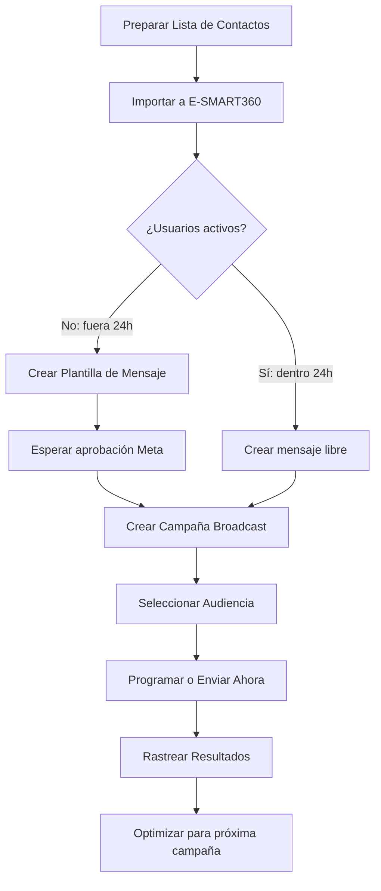
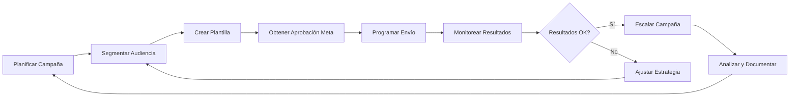

<Update title="Guía actualizada para 2026" date="2026-02-03" />

WhatsApp es la aplicación de mensajería más popular del mundo, con más de 2 mil millones de usuarios activos. El verdadero poder del marketing en WhatsApp reside en el **Broadcasting**: la capacidad de contactar proactivamente a tus clientes con tasas de apertura cercanas al 98%. En 2026, los clientes pasan del descubrimiento de productos al pago directamente dentro del chat.

No se trata solo de enviar mensajes, sino de crear una experiencia de compra **In-App** completamente nativa. Con E-SMART360, tu marca de comercio electrónico puede usar **Catálogos de WhatsApp** para navegación rápida de productos y **Pagos Integrados** para compras en un solo toque. Olvídate de los enlaces externos y convierte cada conversación en una oportunidad de venta.

E-SMART360 es un constructor de chatbots aprobado por Meta para **WhatsApp**, **Facebook**, **Instagram**, **Telegram** y **Webchat**. Ofrece soporte automatizado 24/7 gratuito hasta **1000 suscriptores** y te ayuda a hacer crecer tu negocio mejorando tu marketing en redes sociales.

En esta guía te mostraré cómo enviar mensajes broadcast a WhatsApp usando plantillas de mensaje.

> **¿Prefieres aprender viendo?** Mira nuestro videotutorial paso a paso sobre cómo enviar broadcasts automáticos con Google Sheets en nuestro canal de YouTube.

## Cómo importar suscriptores de WhatsApp a E-SMART360 (paso a paso)

Antes de hacer broadcasting, asegúrate de que tu lista de suscriptores esté actualizada. E-SMART360 ofrece múltiples opciones para importar suscriptores.

> La calidad de tu lista de contactos es el factor más importante para el éxito de cualquier campaña de broadcasting. Una lista limpia y bien segmentada mejora tus tasas de entrega y tu reputación como remitente.

### Importar suscriptores mediante archivo CSV

1. Ve al **Gestor de Suscriptores de WhatsApp** en el panel de control de E-SMART360.
2. Selecciona tu cuenta de WhatsApp.
3. Haz clic en el botón **Opciones** y elige **Importar suscriptores**.
4. Descarga la plantilla CSV de ejemplo, modifícala con tus datos y súbela.

### Prepara tu archivo CSV

Asegúrate de tener una hoja de cálculo con los datos de contacto necesarios (nombre, número de teléfono, etc.). La columna de números debe ser precisa y estar formateada correctamente. Descarga el archivo CSV desde Google Sheets con codificación UTF-8.
  
### Agrega columnas personalizadas

Si necesitas campos adicionales como ciudad, fecha de cumpleaños o preferencias de producto, agrégalos como columnas extras en tu CSV. E-SMART360 los reconocerá como variables personalizadas.
  
### Sube el archivo

Ve a **Subscriber Manager**, haz clic en **Options** y selecciona **Import Subscribers**. Carga tu archivo CSV.
  
### Mapea los datos

Cuando hayas importado el archivo, mapea los datos para alinear las columnas correctamente. Selecciona el encabezado del archivo y asígnale el campo de datos correspondiente (nombre, número, etc.).
  
### Importar suscriptores mediante Google Sheets

1. Conecta tu cuenta de Google a E-SMART360.
2. Selecciona la hoja de Google que contiene los datos de tus suscriptores.
3. Mapea las columnas (números de teléfono, nombres o variables personalizadas).

> Usar Google Sheets te permite mantener los datos actualizados en tiempo real y facilita la colaboración en equipo. Cualquier cambio en la hoja se refleja en tus próximas importaciones.

Para pasos detallados, visita nuestra guía: [Cómo importar contactos de WhatsApp desde Google Sheets](/recursos/importar-contactos-whatsapp-google-sheets)

En esta guía me centraré principalmente en cómo enviar mensajes broadcast a suscriptores de WhatsApp usando **Plantillas de Mensaje** en E-SMART360. Pero antes necesitas entender algunas reglas básicas establecidas por **Meta**.

## ¿Qué es la regla de las 24 horas de WhatsApp?

La regla de las 24 horas es una política de Meta que limita a las empresas a una ventana de 24 horas para enviar mensajes de formato libre después de que un usuario las contacta. Una vez que esta ventana se cierra, los mensajes estándar se bloquean para evitar spam y garantizar una experiencia de usuario de alta calidad.

### Ventana de 24 horas

Cuando un usuario te escribe, se abre una ventana de 24 horas. Durante ese tiempo, puedes enviar cualquier tipo de mensaje: texto, imágenes, videos, documentos, sin necesidad de plantillas aprobadas.
  
### Fuera de la ventana

Una vez pasadas las 24 horas, solo puedes contactar al usuario usando plantillas de mensaje previamente aprobadas por Meta. Esto aplica a la mayoría de las campañas de broadcasting.
  
### Ventana gratuita de 72 horas

Una estrategia avanzada: cuando un usuario entra a tu chat mediante un anuncio **Click-to-WhatsApp** desde Facebook o Instagram, Meta proporciona una ventana gratuita de **72 horas**. Aprovecha esta ventana para enviar contenido educativo, ofertas especiales o seguimientos sin costos adicionales por conversación.
  
### ¿Qué es una plantilla de mensaje?

Una Plantilla de Mensaje es un formato de mensaje estandarizado que se requiere para contactar usuarios fuera de la ventana de 24 horas. Estas deben categorizarse (Marketing, Utilidad o Autenticación) y ser preaprobadas por Meta.

> **Cómo ayuda E-SMART360:** No necesitas ser desarrollador para obtener esta aprobación. Puedes crear y enviar plantillas de mensaje directamente desde el panel de control de E-SMART360. La plataforma gestiona el envío técnico a Meta, permitiéndote tener tus plantillas verificadas y listas para usar en minutos.

### ¿Por qué se necesitan plantillas de mensaje para broadcasting?

Las plantillas son la única forma legal de saltarse el límite de 24 horas. Dado que la mayoría de las audiencias de broadcast no te han escrito recientemente, necesitas una plantilla aprobada para:

- **Alcanzar usuarios "inactivos":** Enviar mensajes legalmente a clientes que chatearon por última vez hace más de 24 horas.
- **Reabrir la conversación:** Si un usuario responde a tu broadcast con plantilla, el temporizador de 24 horas se reinicia, permitiéndote chatear libremente de nuevo.
- **Garantizar la entrega:** Usar plantillas aprobadas evita que tu número sea marcado como spam durante campañas masivas.

## Tipos de plantillas de mensaje de WhatsApp

Existen tres categorías de plantillas de mensaje en E-SMART360:

### Utilidad

Se usan para enviar mensajes relacionados con una transacción específica, como una confirmación de envío o un recibo de pago. Ejemplos: notificaciones de estado de pedido, confirmaciones de citas, alertas de entrega.
  
### Autenticación

Plantillas especializadas y de alta seguridad utilizadas para verificar la identidad de un usuario. Incluyen códigos OTP, PIN de verificación y confirmación de identidad en procesos de inicio de sesión.
  
### Marketing

Se usan para enviar mensajes que promocionan tus productos o servicios. Incluyen ofertas promocionales, lanzamientos de productos, newsletters y campañas de temporada.
  
> **Dato importante:** Según la guía de E-SMART360, las plantillas de Marketing están sujetas a límites de frecuencia (frequency capping) de Meta. No puedes enviar más de cierto número de mensajes de marketing a un mismo usuario en un período determinado. Revisa nuestra guía sobre [límites de frecuencia de Meta](/recursos/limites-frecuencia-marketing) para más detalles.

## Creación de campañas broadcast para suscriptores (fuera de las 24 horas)

Para crear una plantilla de mensaje y enviarla a usuarios inactivos, sigue estos pasos:

### Paso 1: Crear plantillas de mensaje

### Accede a la sección de plantillas

Desde el panel de E-SMART360, ve a **WhatsApp Bot** en **ChatBot Manager** y selecciona tu cuenta de bot. Luego ve a la opción **Message Templates**.
  
### Crea una nueva plantilla

Haz clic en el botón **Create**. Selecciona el tipo de plantilla de mensaje (Utilidad, Autenticación o Marketing).
  
### Configura los detalles

Ingresa un nombre en el campo **TEMPLATE NAME**. Selecciona el idioma en el campo **LOCALE**. Elige el tipo de encabezado en **HEADER TYPE**. Escribe el texto de tu mensaje en el campo **MESSAGE BODY**.
  
### Añade variables personalizadas

Si quieres agregar variables (Campos Personalizados / Variables Integradas / Nombre) a tu mensaje, haz clic en el botón correspondiente. Las variables se insertan con formato {{variable_name}} y se reemplazan automáticamente al enviar.
  
### Añade pie de página y botones

Puedes proporcionar texto para el pie de página en el campo **FOOTER TEXT**. También puedes configurar botones desde **BUTTON**: botones de llamada a la acción (CTA) que enlazan a tu sitio web o botones de respuesta rápida como "Sí", "No" o "Más información".
  
### Guarda y espera aprobación

Finalmente, haz clic en el botón **Save**. La plantilla se enviará a Meta para su aprobación, lo que puede tomar desde unos minutos hasta algunas horas.
  

> **Consejo profesional:** Usa nombres descriptivos para tus plantillas (ej: "promo_bienvenida_nuevos", "recordatorio_carrito_abandonado") y mantenlos en minúsculas con guiones bajos. Esto facilita su identificación al crear campañas.

### Paso 2: Crear la campaña de broadcasting

Una vez que tienes una plantilla de mensaje creada y aprobada, puedes enviarla a tus suscriptores (inactivos o importados):

### Accede a Broadcasting

Ve al panel de E-SMART360. Haz clic en **Broadcasting** en la barra lateral y luego en **WhatsApp Broadcast**. Haz clic en el botón **Create**.
  
### Configura la campaña

Aparecerá un constructor visual de flujo de bot. Verás un botón **Action** y un **Start-Bot-Flow** en el lienzo. Se mostrará un formulario **Configure Action Button** en la parte superior derecha del lienzo.
  
### Nombra la campaña

Asigna un nombre en el campo **Campaign Name**.
  
### Selecciona el tipo de envío

Selecciona el botón de opción **Anytime**. Instantáneamente aparecerá el campo **Select template**.
  
### Elige la plantilla

Se mostrarán los suscriptores objetivo totales. Selecciona la plantilla de la lista en el campo **Select template**.
  
### Filtra por etiquetas

Opcionalmente, puedes añadir ID de etiquetas **Include/Exclude** para segmentar tu audiencia. También puedes configurar la hora de envío si lo deseas.
  
### Programa o envía inmediatamente

Puedes enviarlo ahora mismo o configurar una hora programada. Al elegir **Send later**, se habilitarán los campos **Schedule time** y **Time zone**.
  
### Configura el flujo y guarda

Haz clic en **Ok**. Para configurar el **Start-Bot-Flow**, haz doble clic para asignarle un nombre y pulsa **Ok**. Finalmente, guarda la campaña haciendo clic en **Save**.
  

> **Nota importante:** Tan pronto como guardes, la campaña se creará y los mensajes broadcast se enviarán de inmediato (si elegiste envío inmediato) o se programarán. Verás la campaña en la lista de broadcasting. Si todo se hace correctamente, el estado de la campaña será "Successful".

## Creación de campañas broadcast para suscriptores activos (dentro de las 24 horas)

Desde el constructor visual de flujo, solo selecciona el botón de opción **24 hours**. Esto habilitará el broadcasting solo para usuarios activos. También mostrará el número total de suscriptores objetivo.

Para usuarios activos (que han enviado mensajes en las últimas 24 horas), puedes enviar cualquier tipo de mensaje sin necesidad de plantillas.

### Selecciona la opción de 24 horas

En el panel de configuración de la campaña, elige el radio button **24 hours**.
  
### Filtra por etiquetas

Opcionalmente, puedes incluir o excluir suscriptores usando etiquetas. Por ejemplo, si quieres excluir suscriptores con cierta etiqueta, agrega esa etiqueta en el campo de exclusión. Haz clic en **Ok**.
  
### Configura el flujo del bot

Haz doble clic en **Start Bot Flow**, asígnale un nombre y haz clic en **Ok**.
  
### Añade contenido

Ahora puedes agregar cualquier tipo de mensaje (Texto, Imagen, Audio, Video, Archivo, Interactivo, Condición, etc.) según tus necesidades dentro del Start Bot Flow.
  
### Guarda la campaña

Finalmente, solo guarda la campaña. El broadcasting comenzará a enviar mensajes a los suscriptores activos.
  
## ¿Cómo rastrear el rendimiento de tu campaña broadcast?

Después de que tu campaña esté activa, E-SMART360 te ofrece un panel de análisis para rastrear su rendimiento. Revisando estos resultados puedes ver cómo los clientes están interactuando y mejorar tus futuros planes de marketing.

Para ver tus resultados, ve a la opción **Broadcasting** del panel izquierdo y luego a **WhatsApp Broadcast**. Encontrarás una lista de tus campañas broadcast junto con un resumen del rendimiento de cada una.

> El seguimiento de campañas no solo te muestra métricas, sino que te ayuda a identificar patrones. Por ejemplo, si ves una alta tasa de "No Alcanzado", puede ser señal de que necesitas limpiar tu lista de contactos o revisar la calidad de tus números.

### Comprendiendo la vista de lista de broadcasting

El panel principal muestra una visión general rápida de todas tus campañas:

- **Estado de la campaña:** Verifica rápidamente si una campaña está marcada como **Completada**, **Pendiente** o **En Proceso**.
- **Estadísticas en tiempo real:** Monitorea el número de mensajes **enviados**, **entregados**, **abiertos** y cuántos usuarios no fueron **alcanzados**.
- **Botones de acción rápida:**
  - **Ver Informe:** Haz clic para ver un desglose detallado de esa campaña.
  - **Descargar Informe:** Exporta los datos de tu campaña como archivo CSV para revisarlos sin conexión o compartirlos con tu equipo.
  - **Eliminar:** Usa esta opción para eliminar campañas innecesarias.
  - **Reenviar mensajes fallidos:** Si algunos mensajes fallaron por problemas de conectividad, puedes intentar reenviarlos con un solo clic.

### Análisis profundo: el informe de campaña

Haz clic en el icono **Ver Informe** para abrir una ventana emergente detallada con datos exhaustivos de ese broadcast:

- **Resumen de la campaña:** Ve qué plantilla se usó, las etiquetas objetivo y los filtros aplicados, como el Filtro de Suscriptor Reciente o las fechas de Añadido Después/Antes.
- **Embudo de entrega:** Visualiza un desglose gráfico de cuántos mensajes se entregaron y cuántos fueron abiertos por tus clientes.
- **Registros individuales de suscriptores:** Debajo del resumen, encontrarás una lista de cada contacto alcanzado. Esta sección muestra:
  - **ID/Nombre del Chat:** La persona que recibió el mensaje.
  - **Estado:** Muestra si el mensaje fue leído.
  - **Marcas de tiempo:** Las horas exactas en que el mensaje fue enviado, entregado y abierto.
  - **Respuesta/ID del Mensaje:** El identificador único de Meta para cada mensaje enviado, para total transparencia en la entrega.

## Consejos para maximizar tus broadcasts

### Usa mensajes personalizados

Los broadcasts personalizados logran tasas de participación más altas. E-SMART360 te permite incluir variables dinámicas como nombres, detalles de pedidos o campos personalizados.

> Los mensajes personalizados no solo mejoran la experiencia del cliente, sino que también activan la ventana de 24 horas cuando el usuario responde. Si alguien recibe "Hola {{nombre}}, tenemos una oferta especial para ti" y responde "Cuéntame más", la conversación se abre gratuitamente.

### Combina CSV y Google Sheets para la gestión de contactos

Usar tanto archivos CSV como Google Sheets te da flexibilidad en la gestión de tus contactos:

- Usa **Google Sheets** para actualizaciones en tiempo real y colaboración en equipo.
- Usa **archivos CSV** para importaciones masivas y copias de seguridad.

### ¿Cómo crear campos personalizados para variables?

Antes de mapear el archivo CSV, asegúrate de que los campos personalizados ya estén creados en E-SMART360:

  1. Ve al Gestor de Suscriptores de WhatsApp.
  2. Selecciona **Manage** → **Manage Custom Fields**.
  3. Haz clic en **Create**, proporciona un nombre para el campo, elige un tipo de respuesta y guárdalo.

  Una vez creados, podrás usarlos en tus plantillas como variables {{campo_personalizado}}.

### Aprovecha la estrategia de "ventana gratuita de 72 horas"

En 2026, la mejor forma de ahorrar en tarifas de Meta es usando anuncios **Click-to-WhatsApp**. Cuando un usuario entra a tu chat mediante un anuncio de Facebook o Instagram, Meta proporciona una **ventana gratuita de 72 horas** para enviar mensajes.

- Usa esta ventana de 3 días para enviar broadcasts de seguimiento, contenido educativo u ofertas especiales sin pagar tarifas adicionales por mensaje.

### Impulsa conversiones "Zero-Click" con WhatsApp Flows

No obligues a tus clientes a salir de WhatsApp para llenar un formulario o reservar una cita. Usa **WhatsApp Flows** dentro de tus campañas de E-SMART360 para integrar:

- **Formularios en el chat:** Para generación de leads o comentarios.
- **Calendarios de reserva:** Para negocios basados en servicios.
- **Selectores de productos:** Para elegir tallas o colores directamente. Cuantos menos pasos dé un cliente, mayor será tu tasa de conversión.

### Botones interactivos: CTA vs. Respuesta Rápida

El texto estático está muerto. Cada broadcast debería incluir elementos interactivos:

### Botones CTA (Call-to-Action)

Úsalos para enlaces de "Comprar ahora" o botones de "Llamar a soporte". Llevan al usuario a una acción externa, como tu tienda online o tu número de teléfono.
  
### Botones de Respuesta Rápida

Úsalos para opciones como "Interesado", "No ahora" o "Cuéntame más". Permiten a los usuarios responder con un solo toque, activando la ventana de 24 horas para continuar la conversación gratuitamente.
  
### Limpia tu lista regularmente

Una tasa alta de "No Alcanzado" en tus informes de E-SMART360 puede dañar tu calificación de calidad.

- Exporta regularmente los informes de tus campañas y elimina los números que aparecen constantemente como **Fallidos** o **No Alcanzados** para mantener saludable tu reputación como remitente y evitar ser marcado por Meta.

### ¿Cómo afecta la calificación de calidad a tus broadcasts?

Meta asigna a cada negocio una calificación de calidad (Baja, Media o Alta) basada en cómo los usuarios interactúan con tus mensajes. Si muchos usuarios bloquean tus mensajes, los marcan como spam o no interactúan, tu calificación baja. Una calificación baja puede:

  - Reducir tu límite de mensajes diarios
  - Ralentizar la aprobación de nuevas plantillas
  - En casos extremos, llevar a la suspensión de tu número

  **Mantén tu calificación alta** enviando contenido relevante, respetando los horarios y segmentando bien tu audiencia.

## Entendiendo los límites de broadcasting de WhatsApp

Meta asigna a las empresas diferentes niveles de mensajería según su uso y calidad. Comprender estos límites es crucial para planificar tus campañas:

### Nivel de Prueba (Trial)

Envía mensajes hasta **250 usuarios únicos por día**. Ideal para probar la plataforma y familiarizarse con las funcionalidades.
  
### Nivel 1

Envía mensajes hasta **1,000 usuarios únicos por día**. Perfecto para pequeñas empresas que empiezan a hacer marketing en WhatsApp.
  
### Nivel 2

Envía mensajes hasta **10,000 usuarios únicos por día**. Adecuado para negocios en crecimiento con una base de clientes moderada.
  
### Nivel 3

Envía mensajes hasta **100,000 usuarios únicos por día**. Para empresas establecidas con campañas regulares.
  
### Nivel 4

Envía mensajes a **usuarios únicos ilimitados por día**. El nivel máximo, para grandes empresas con alto volumen de mensajería.
  
### Requisitos para subir de nivel

Para avanzar a un nivel superior, debes:

- Mantener una calificación de calidad alta en tus mensajes
- Enviar mensajes al menos al 50% del límite de tu nivel actual
- Interactuar con los usuarios de forma consistente
- Mantener una calificación de calidad Media o Alta

> **Ejemplo de progresión:** Para pasar de Nivel 1 a Nivel 2, debes enviar mensajes al menos a **500 usuarios únicos**. Para pasar de Nivel 2 a Nivel 3, debes enviar mensajes al menos a **5,000 usuarios únicos**. El proceso es automático: Meta actualiza tu nivel según el rendimiento de tu cuenta.

### ¿Qué sucede si superas tu límite?

Si intentas enviar mensajes más allá de tu nivel permitido:

- Puedes ver un mensaje de error: "El tamaño de la audiencia supera la cuota restante"
- Algunos mensajes pueden fallar en la entrega
- Deberás reducir el tamaño de tu audiencia para mantenerte dentro de tu límite actual

### Consejos profesionales para una progresión suave

- **Concéntrate en la calidad del mensaje** – Evita contenido similar a spam
  - **Interactúa de forma consistente** – Mantén a los usuarios interesados con mensajes relevantes
  - **Monitorea las interacciones de los usuarios** – Rastrea las respuestas y ajusta tus estrategias
  - **Evita el envío masivo excesivo** – Mantén una reputación saludable como remitente

  **Preguntas frecuentes sobre niveles:**
  
  **P: ¿Qué tan rápido puedo subir de nivel?**
  R: Generalmente dentro de **7 días** de cumplir con los criterios requeridos.
  
  **P: ¿Qué impacta la progresión de nivel?**
  R: La calidad del mensaje, la interacción del usuario y la comunicación consistente.
  
  **P: ¿Puedo solicitar una actualización manual?**
  R: No, Meta actualiza automáticamente los niveles según el rendimiento de tu cuenta.

## Casos de uso prácticos

Aquí tienes algunas formas de usar plantillas de mensaje en E-SMART360:

### Recordatorios automatizados

Configura recordatorios para citas o pagos usando plantillas y variables dinámicas. Por ejemplo: "Hola {{nombre}}, te recordamos que tu cita es mañana a las {{hora}}. Confirma con un 'Sí'." Cuando el usuario responde, la ventana de 24 horas se abre para seguimiento gratuito.
  
### Actualizaciones de eventos

Comparte actualizaciones en tiempo real con asistentes para seminarios web, reuniones o lanzamientos de productos. Envía enlaces directos, cambios de horario o recordatorios de última hora.
  
### Confirmaciones de pedido

Envía detalles de pedido personalizados a los clientes inmediatamente después de la compra. Incluye el número de seguimiento, la fecha estimada de entrega y un botón CTA para rastrear el envío.
  
### Recuperación de carritos abandonados

Cuando un cliente agrega productos al carrito pero no completa la compra, envía un mensaje automatizado: "¡Hola {{nombre}}! Dejaste estos productos en tu carrito: {{productos}}. Completá tu compra con 10% de descuento usando este enlace." Esta es una de las campañas con mayor retorno de inversión.
  
## Beneficios de personalizar tus broadcasts de WhatsApp

Los mensajes personalizados ayudan a construir relaciones más sólidas con los clientes y mejoran la efectividad de la comunicación. Los beneficios incluyen:

<h4 class="font-bold text-blue-800">📈 Mayor Participación</h4>
Dirigirse a los destinatarios por su nombre y compartir información relevante aumenta las tasas de respuesta hasta un 70%.

<h4 class="font-bold text-green-800">😊 Mejor Experiencia del Cliente</h4>
La personalización hace que las interacciones se sientan más humanas y centradas en el cliente.

<h4 class="font-bold text-purple-800">💰 Mejores Tasas de Conversión</h4>
Los mensajes dirigidos generan resultados de marketing más efectivos y un mayor retorno de inversión.

## Preguntas frecuentes

### ¿Cuál es la diferencia entre un Broadcast de WhatsApp y un Grupo de WhatsApp?

La gente a menudo confunde ambos conceptos. En un Grupo, todos ven los mensajes y datos de contacto de los demás. En un Broadcast, funciona como un correo con "CCO": los destinatarios reciben el mensaje como un chat privado y no pueden ver quién más lo recibió. Esto garantiza privacidad y una experiencia profesional uno a uno con el cliente.

### ¿Los clientes necesitan guardar mi número para recibir un mensaje broadcast?

En la aplicación estándar de WhatsApp: Sí, deben tener tu número guardado o el mensaje no se entregará. En E-SMART360 (WhatsApp API): No. Como E-SMART360 usa la API oficial de WhatsApp Business, puedes enviar mensajes broadcast a suscriptores incluso si no han guardado tu número de negocio, lo que resulta en una tasa de entrega mucho más alta.

### ¿Mi número de WhatsApp será bloqueado por enviar broadcasts masivos?

Esta es una de las mayores preocupaciones. Usar la aplicación estándar de WhatsApp para mensajes masivos a menudo lleva a bloqueos debido a filtros de spam. Sin embargo, usando un proveedor oficial como E-SMART360, este riesgo se reduce significativamente porque usa Plantillas de Mensaje aprobadas por Meta, asegurando que tus broadcasts cumplan con las políticas antispam de WhatsApp. Además, E-SMART360 gestiona los límites de frecuencia y la calidad de tu número automáticamente.

### ¿E-SMART360 es gratuito?

E-SMART360 ofrece un plan gratuito que incluye soporte automatizado 24/7 para hasta 1,000 suscriptores. Esto lo convierte en una opción accesible para pequeñas empresas que comienzan con la automatización de WhatsApp. Los planes de pago ofrecen funcionalidades avanzadas como más suscriptores, integraciones premium y soporte prioritario.

### ¿Puedo personalizar los mensajes broadcast para cada cliente?

Sí. E-SMART360 te permite usar variables dinámicas (como {{first_name}}, detalles de pedido, etc.) para insertar automáticamente datos específicos del cliente en cada mensaje. Puedes importar campos personalizados desde tu CSV o Google Sheets y usarlos en tus plantillas para que cada mensaje se sienta personal y no robótico.

### ¿Puedo programar broadcasts para que salgan en una hora posterior?

Sí. Al crear una campaña en E-SMART360, puedes seleccionar la opción "Send Later". Esto te permite elegir una fecha y hora específicas, además de la zona horaria, permitiéndote planificar campañas de marketing con antelación y enviarlas en el momento óptimo para tu audiencia.

### ¿Tengo que pagar a Meta por cada mensaje broadcast enviado?

Sí, hay una confusión común al respecto. Hay dos costos involucrados:

  - **Suscripción a E-SMART360:** La tarifa del software (gratis hasta 1,000 suscriptores).
  - **Tarifas de Conversación de Meta:** Meta cobra por "conversación" (una sesión de 24 horas). Los broadcasts suelen clasificarse como Conversaciones de Marketing, que tienen un costo específico por país (aproximadamente $0.009 USD en India o $0.02 USD en Norteamérica, aunque las tarifas varían).

  Las ventanas gratuitas de 72 horas por anuncios Click-to-WhatsApp pueden ayudarte a reducir estos costos significativamente.

### ¿Puedo agregar botones con clic a mis mensajes broadcast?

¡Sí! Esta es una gran ventaja sobre WhatsApp estándar. En E-SMART360, puedes agregar dos tipos de botones interactivos a tus plantillas:

  - **Llamada a la Acción (CTA):** Un botón que enlaza directamente a tu sitio web (ej: "Comprar ahora") o marca un número de teléfono.
  - **Respuesta Rápida:** Botones como "Sí", "No" o "Detener" que permiten a los clientes responder con un solo toque, lo que aumenta las tasas de participación.

### ¿Qué hago si mi plantilla es rechazada?

Si Meta rechaza tu plantilla, revisa el motivo del rechazo en el panel de E-SMART360. Las razones más comunes incluyen:

  - Contenido demasiado promocional sin opt-in del usuario
  - Falta de claridad en la oferta
  - Uso incorrecto de mayúsculas o puntuación
  - Enlaces rotos o incorrectos

  Revisa el contenido para cumplir con las directrices de WhatsApp y vuelve a enviarla. Nuestra guía sobre [cómo solucionar rechazos de plantillas](/recursos/solucionar-rechazos-plantillas) tiene más detalles.

## Reglas de broadcasting de WhatsApp que debes conocer

Además de los límites de nivel y las plantillas, existen reglas específicas que rigen el broadcasting en WhatsApp. Conocerlas te ayudará a evitar bloqueos y mantener una reputación saludable.

### Límites de frecuencia de marketing (Frequency Capping)

Meta impone un límite de frecuencia para mensajes de marketing. No puedes enviar mensajes promocionales ilimitados a un mismo usuario. El límite exacto varía según la región y la calificación de calidad de tu número, pero en términos generales:

- **Máximo de 2-3 mensajes de marketing por semana** al mismo usuario en la mayoría de regiones
- Los mensajes de utilidad (notificaciones de pedido, confirmaciones) NO cuentan para este límite
- Los mensajes de autenticación (OTP) tienen su propio límite separado

> **Consejo importante:** Para maximizar tu alcance sin violar los límites de frecuencia, combina estrategias. Usa mensajes de utilidad para transacciones y guarda los de marketing para ofertas verdaderamente relevantes. Segmenta tu audiencia para que cada usuario reciba solo los mensajes que le interesan.

### Reglas de broadcasting según el tipo de conversación

Es fundamental entender que Meta clasifica cada conversación en diferentes categorías, y cada una tiene reglas distintas para broadcasting:

### Conversaciones de Marketing

- Incluyen promociones, ofertas y newsletters
    - Requieren plantillas de categoría Marketing
    - Sujetas a frequency capping
    - Costo por conversación más alto
    - Se inician siempre desde el negocio
  
### Conversaciones de Utilidad

- Incluyen notificaciones de pedidos, facturas, alertas
    - Requieren plantillas de categoría Utilidad
    - NO sujetas a frequency capping
    - Costo por conversación más bajo
    - El usuario debe haber realizado una transacción reciente
  
### Conversaciones de Autenticación

- Códigos OTP, verificación de identidad
    - Requieren plantillas de categoría Autenticación
    - Límites separados de las demás categorías
    - Estructura específica requerida por Meta
  
### Conversaciones de Servicio

- Iniciadas por el usuario (dentro de la ventana de 24h)
    - Sin costo para el negocio si se responden dentro de las 24h
    - No requieren plantillas
    - Ideales para atención al cliente y seguimiento
  
### Cómo manejar la regla de "No Match Reply" (Respuesta sin coincidencia)

Cuando un usuario envía un mensaje que no coincide con ningún flujo configurado en tu bot, E-SMART360 te permite configurar una **respuesta por defecto** (no-match reply). Esta respuesta es crucial porque:

- Mantiene la conversación activa dentro de la ventana de 24 horas
- Evita que el usuario sienta que está hablando con una máquina sin comprensión
- Puede redirigir al usuario hacia opciones útiles

### ¿Cómo configurar la respuesta No Match en E-SMART360?

Para configurar la respuesta para mensajes sin coincidencia:

  1. Ve a **WhatsApp Bot** en el panel de E-SMART360.
  2. Selecciona tu cuenta de bot.
  3. Busca la opción **No Match Reply** o **Default Reply**.
  4. Configura un mensaje amigable como: "Lo siento, no entendí tu mensaje. ¿Puedes intentar con estas opciones?" seguido de un menú de opciones.
  5. Guarda los cambios.

  **Consejo:** Ajusta la frecuencia de esta respuesta. Si un usuario insiste en mensajes no reconocidos, puedes configurar un límite para evitar enviar la misma respuesta repetidamente, lo que podría afectar tu calificación de calidad.

### El impacto de la calificación de calidad en tus broadcasts

Meta evalúa constantemente la calidad de tus mensajes. Esta calificación afecta directamente tus límites de broadcasting y la aprobación de plantillas. Los factores que influyen en tu calificación incluyen:

### Factores positivos

- Altas tasas de apertura de mensajes
    - Respuestas de los usuarios a tus mensajes
    - Bajas tasas de bloqueo o denuncia
    - Mensajes relevantes y esperados por el usuario
    - Uso correcto de plantillas aprobadas
  
### Factores negativos

- Altas tasas de mensajes no entregados
    - Usuarios que bloquean tu número
    - Denuncias por spam
    - Mensajes enviados fuera de horario razonable
    - Contenido engañoso o excesivamente promocional
  
> Si tu calificación de calidad baja a "Mala" (Red), Meta puede limitar severamente tu capacidad de enviar mensajes o incluso suspender tu número. Para recuperarla, reduce el volumen de mensajes, enfócate en contenido de utilidad y asegúrate de que todos los destinatarios hayan dado su consentimiento explícito.

## Estrategias avanzadas de broadcasting con datos dinámicos

### Uso de datos de Google Sheets en tus respuestas

Una de las funcionalidades más potentes de E-SMART360 es la capacidad de usar datos de Google Sheets directamente en tus mensajes broadcast. Puedes crear campañas que:

- Envíen mensajes personalizados basados en el historial de compras del cliente
- Adapten el contenido según la ubicación geográfica del suscriptor
- Ofrezcan descuentos específicos según el comportamiento del usuario

### Conecta tu Google Sheets

Desde el panel de E-SMART360, ve a Integraciones y conecta tu cuenta de Google. Selecciona la hoja que contiene los datos que quieres usar.
  
### Crea variables personalizadas

En el Gestor de Suscriptores, crea campos personalizados que coincidan con las columnas de tu Google Sheets (ej: ciudad, ultima_compra, total_gastado).
  
### Importa y mapea

Importa los suscriptores desde Google Sheets y mapea cada columna al campo personalizado correspondiente.
  
### Usa las variables en tus plantillas

En tus plantillas de mensaje, usa las variables con el formato {{ciudad}}, {{ultima_compra}}, etc. E-SMART360 reemplazará automáticamente cada variable con el dato del suscriptor.
  

### Ejemplo práctico: campaña segmentada por ubicación

Imagina que tienes una tienda de ropa con sucursales en Madrid, Barcelona y Valencia. Puedes crear una campaña broadcast que envíe:

  - A suscriptores en Madrid: "{{nombre}}, ¡tenemos una oferta especial en nuestra tienda de Madrid! 20% de descuento en abrigos. Muestra este mensaje."
  - A suscriptores en Barcelona: "{{nombre}}, los nuevos modelos de verano ya llegaron a Barcelona. Pásate a verlos."
  - A suscriptores en Valencia: "{{nombre}}, este fin de semana tenemos degustación en nuestra tienda de Valencia. ¡Te esperamos!"

  Todo esto con una sola plantilla y una columna de "ciudad" en tu Google Sheets.

### Broadcasting con secuencias automatizadas (Sequence Messaging)

No te limites a un solo mensaje. E-SMART360 te permite crear **secuencias de mensajes** que se envían automáticamente enintervalos definidos. Esto es ideal para:

- **Secuencias de bienvenida:** Da la bienvenida a nuevos suscriptores con una serie de 3-5 mensajes educativos durante la primera semana.
- **Secuencias de recuperación:** Si un usuario no ha comprado en 30 días, inicia una secuencia de 3 mensajes con ofertas progresivas.
- **Secuencias post-compra:** Después de una compra, envía una secuencia: confirmación → guía de uso → solicitud de reseña → oferta de producto relacionado.

> **Dato clave:** Las secuencias automatizadas mantienen la conversación activa sin requerir intervención manual. Como cada mensaje puede abrir una nueva ventana de 24 horas (si el usuario responde), extiendes tu alcance de forma orgánica y a bajo costo.

### Campañas broadcast para recuperación de carritos abandonados

Una de las aplicaciones más rentables del broadcasting es la recuperación de carritos abandonados. Los estudios muestran que más del 70% de los carritos de compra online se abandonan antes de completar la compra. Con E-SMART360 puedes recuperar una parte significativa de esas ventas.

### Conecta tu tienda

Integra tu tienda WooCommerce o Shopify con E-SMART360. Esto permite que los datos de carritos abandonados fluyan automáticamente.
  
### Crea una plantilla de carrito abandonado

Crea una plantilla de categoría Marketing con el siguiente contenido: "¡Hola {{nombre}}! Dejaste los siguientes productos en tu carrito: {{productos}}. Completá tu compra ahora y obtené {{descuento}} de descuento con este enlace: {{enlace_carrito}}"
  
### Configura el disparador automático

Usa el flujo de trabajo webhook de E-SMART360 para configurar un disparador que envíe el mensaje automáticamente 1 hora después del abandono del carrito.
  
### Programa un recordatorio

Configura un segundo mensaje a las 24 horas si el carrito sigue sin completarse: "{{nombre}}, tu carrito sigue esperándote. Última oportunidad con envío gratis: {{enlace_carrito}}"
  
## Errores comunes al hacer broadcasting y cómo evitarlos

A medida que escalas tus campañas broadcast, es fácil cometer errores que afectan tu rendimiento. Aquí los más comunes:

### ❌ No segmentar la audiencia

Enviar el mismo mensaje a toda tu base de datos sin segmentar es el error más común. Un mensaje sobre descuentos en ropa de invierno no es relevante para clientes que solo compran accesorios de verano.
    
    **Solución:** Usa etiquetas (labels) en E-SMART360 para segmentar por intereses, historial de compras o ubicación.
  
### ❌ Ignorar la frecuencia de envío

Enviar demasiados mensajes en poco tiempo cansa a tu audiencia y aumenta las tasas de bloqueo. Esto afecta tu calificación de calidad.
    
    **Solución:** Espacia tus campañas. Una campaña de marketing por semana es un buen ritmo inicial. Monitorea las tasas de bloqueo en tus informes.
  
### ❌ No probar las plantillas antes de enviar

Enviar una plantilla con errores de formato o variables mal escritas resulta en mensajes con aspecto poco profesional como "Hola {{nombre}} sin reemplazar".
    
    **Solución:** Siempre envía una prueba a tu propio número antes de lanzar la campaña. Verifica que todas las variables se reemplacen correctamente.
  
### ❌ Enviar a números no verificados

Incluir números de teléfono incorrectos o no verificados en tus listas aumenta tu tasa de no entrega y puede dañar tu reputación.
    
    **Solución:** Usa la función de validación de números de E-SMART360 antes de importar. Limpia tu lista periódicamente eliminando números que fallan consistentemente.
  
## Mejores prácticas para campañas broadcast exitosas

Para asegurar el éxito de tus campañas de broadcasting en WhatsApp, sigue estas mejores prácticas:

### 1. Obtén consentimiento explícito

Antes de enviar cualquier mensaje broadcast, asegúrate de que tus suscriptores hayan dado su consentimiento explícito para recibir comunicaciones de marketing. Esto no solo es un requisito legal en muchas jurisdicciones (GDPR, CCPA), sino que también mejora tu calificación de calidad con Meta.

> **Cómo obtener consentimiento:** Usa formularios de opt-in en tu sitio web, durante el proceso de compra o mediante anuncios Click-to-WhatsApp. Cuando un usuario hace clic en un CTWA, automáticamente está dando consentimiento para recibir comunicaciones.

### 2. Optimiza el momento de envío

El timing es crucial en el marketing. Envía tus broadcasts en momentos donde tus usuarios estén más receptivos:

- **Horario laboral:** Entre 10:00 y 18:00 en el huso horario de tu audiencia
- **Evita fines de semana:** A menos que sea específico para tu negocio
- **Días óptimos:** Martes, miércoles y jueves suelen tener mejores tasas de apertura
- **Prueba A/B:** Experimenta con diferentes horarios y días para encontrar tu ventana óptima

### 3. Mantén un equilibrio entre marketing y utilidad

No todas las comunicaciones con tus clientes deben ser promocionales. Un buen ratio es:

- **60% contenido de valor:** Tips, guías, actualizaciones útiles
- **30% contenido promocional:** Ofertas, descuentos, lanzamientos
- **10% contenido transaccional:** Confirmaciones, notificaciones, seguimiento

### 4. Monitorea y ajusta constantemente

El broadcasting no es "configurar y olvidar". Revisa regularmente:

- Tasas de apertura y clics
- Tasas de bloqueo y denuncia
- Calificación de calidad de tu número
- Rendimiento de diferentes tipos de plantillas
- Segmentos de audiencia más receptivos

## Ejemplos completos de campañas broadcast

### Ejemplo 1: Campaña de bienvenida para nuevos suscriptores

**Objetivo:** Dar la bienvenida a nuevos suscriptores y guiarlos hacia su primera compra.

### Día 1: Mensaje de bienvenida

**Plantilla:** Marketing
    **Mensaje:** "¡Bienvenido a [Marca], {{nombre}}! 🎉 Estamos felices de tenerte aquí. Como regalo de bienvenida, aquí tienes un 15% de descuento en tu primera compra: {{enlace_descuento}}"
    
    **Botón:** CTA "Ver ofertas" → enlace a tienda
  
### Día 3: Mensaje educativo

**Plantilla:** Marketing
    **Mensaje:** "{{nombre}}, ¿sabías que tenemos envío gratis en pedidos superiores a $50? Explora nuestras categorías más populares: {{enlace_categorias}}"
    
    **Botón:** Respuesta Rápida "Quiero ver más" / "No gracias"
  
### Día 7: Oferta especial

**Plantilla:** Marketing
    **Mensaje:** "{{nombre}}, esta semana tenemos una oferta exclusiva para nuevos miembros: 20% extra en toda la colección. Válido hasta el domingo: {{enlace_oferta}}"
    
    **Botón:** CTA "Comprar ahora" → enlace con código
  
### Resultados esperados

- Tasa de apertura: 85-95%
    - Tasa de clics: 15-25%
    - Tasa de conversión: 8-12%
    - ROI estimado: 5x - 8x
  
### Ejemplo 2: Campaña de reactivación de clientes inactivos

**Objetivo:** Recuperar clientes que no han comprado en los últimos 60-90 días.

> **Estrategia clave:** Los clientes inactivos son más sensibles al precio. Ofrece incentivos más agresivos que a los clientes activos, pero limita la frecuencia a 1-2 mensajes para evitar que te bloqueen.

### Segmenta tu audiencia

Usa E-SMART360 para crear una etiqueta "Clientes Inactivos 60d" e importa solo los números de clientes que no han comprado en 60-90 días. Idealmente, estos clientes ya tienen una relación previa con tu marca.
  
### Crea una oferta irresistible

Diseña una plantilla de Marketing con: "{{nombre}}, te extrañamos. 🥺 Por eso, aquí tienes un 30% de descuento en tu próxima compra. Solo por esta semana: {{enlace_descuento}}"
  
### Programa el envío

Envía el mensaje un martes a las 11:00 AM (hora local del cliente). Elige "Send Later" en E-SMART360 y configura la zona horaria.
  
### Haz seguimiento

Si el cliente no responde en 7 días, envía un segundo mensaje: "{{nombre}}, tu descuento del 30% expira pronto. No dejes pasar esta oportunidad: {{enlace_descuento}}". Después de este segundo mensaje, si no hay respuesta, espera 30 días antes del próximo contacto.
  
## Herramientas complementarias para potenciar tus broadcasts

### Webhook Workflow

La integración de Webhook Workflow de E-SMART360 te permite conectar tus campañas broadcast con otras aplicaciones y servicios. Por ejemplo:

- Cuando un usuario hace clic en un botón de tu broadcast, envía sus datos a tu CRM
- Cuando se completa una campaña, envía un resumen a tu Slack o Discord
- Cuando un mensaje falla, registra el error en tu sistema de tracking

> **Automatización avanzada:** Combina broadcasting con webhooks para crear flujos complejos. Por ejemplo: un usuario recibe un broadcast, hace clic en "Comprar ahora", el clic activa un webhook que envía sus datos a tu CRM, tu CRM crea un lead, y luego un webhook de retorno confirma la acción en E-SMART360.

### Publica anuncios Click-to-WhatsApp

Los anuncios Click-to-WhatsApp son una de las formas más efectivas de hacer crecer tu lista de suscriptores para broadcasting. Cuando un usuario hace clic en el anuncio:

1. Se abre un chat de WhatsApp directamente con tu negocio
2. Se inicia una ventana gratuita de 72 horas
3. Puedes enviar tu mensaje de bienvenida y empezar a nutrir al lead
4. Si responde, la conversación continúa dentro de la ventana

### Configuración rápida de CTWA

1. Ve al Administrador de Anuncios de Facebook
  2. Selecciona "Click-to-WhatsApp" como objetivo
  3. Configura tu mensaje de bienvenida predefinido
  4. Define tu audiencia objetivo
  5. Establece el presupuesto
  6. Activa el anuncio y monitorea los leads entrantes en E-SMART360
  
  **Consejo:** Usa el mensaje de bienvenida del anuncio para calificar leads. Por ejemplo: "¡Gracias por contactarnos! ¿Qué producto te interesa?" En lugar de abrumar con información, inicia una conversación.

## Conclusión

El broadcasting en WhatsApp usando plantillas de mensaje es una de las estrategias de marketing más poderosas disponibles para las empresas en 2026. Con E-SMART360, puedes crear, gestionar y optimizar campañas completas sin necesidad de conocimientos técnicos avanzados.

**Puntos clave para recordar:**

- Las plantillas de mensaje son el único método aprobado por Meta para contactar usuarios fuera de la ventana de 24 horas
- La personalización con variables dinámicas aumenta drásticamente las tasas de participación
- La segmentación por etiquetas mejora la relevancia de tus mensajes
- Monitorear tus informes de campaña te permite optimizar continuamente
- Mantener una buena calificación de calidad es esencial para escalar
- WhatsApp ofrece diferentes niveles de mensajería que se desbloquean con buen rendimiento

¡Empieza hoy mismo tu primera campaña broadcast con E-SMART360 y descubre el poder del marketing conversacional!

## Integración con WhatsApp Cloud API

E-SMART360 se conecta directamente con la **API de WhatsApp Cloud** (anteriormente Business API), lo que te permite:

- **Gestión centralizada:** Administra todas tus plantillas y campañas desde un solo panel
- **Sincronización automática:** Las plantillas creadas en E-SMART360 se sincronizan automáticamente con WhatsApp Cloud API
- **Múltiples números:** Conecta varios números de WhatsApp Business a una sola cuenta de E-SMART360
- **Webhooks:** Recibe notificaciones en tiempo real sobre el estado de entrega de tus mensajes

> A diferencia de WhatsApp Business App (que tiene límites estrictos y usa el almacenamiento local del teléfono), WhatsApp Cloud API aloja tus datos en la nube de Meta, ofreciendo mayor escalabilidad, confiabilidad y la capacidad de conectar múltiples agentes o sistemas a un mismo número.

### Configuración inicial de WhatsApp Cloud API en E-SMART360

### Crea una cuenta de Meta Business

Si aún no tienes una, ve a business.facebook.com y crea tu cuenta empresarial de Meta. Este paso es necesario para acceder a WhatsApp Cloud API.
  
### Configura tu número de WhatsApp Business

Registra tu número de teléfono en el Administrador de Negocios de Meta. Deberás verificar que tienes acceso al número mediante un código de verificación.
  
### Conecta con E-SMART360

Desde el panel de E-SMART360, ve a la sección de Configuración y selecciona "Conectar WhatsApp Cloud API". Sigue los pasos de autenticación para vincular tu cuenta de Meta Business.
  
### Configura los webhooks

E-SMART360 configura automáticamente los webhooks necesarios para recibir actualizaciones sobre mensajes entrantes, cambios en el estado de entrega y actualizaciones de plantillas.
  
### Verifica la conexión

Envía un mensaje de prueba a tu propio número para confirmar que todo funciona correctamente.
  
## Diferencias entre E-SMART360 y la aplicación estándar de WhatsApp

Muchos negocios comienzan usando la aplicación estándar de WhatsApp para comunicarse con clientes, pero rápidamente se encuentran con limitaciones. Aquí las diferencias clave:

### WhatsApp Estándar

❌ Límite de 256 miembros en broadcast list
    ❌ Los destinatarios deben tener tu número guardado
    ❌ Sin plantillas aprobadas por Meta
    ❌ Sin análisis de rendimiento
    ❌ Sin automatización
    ❌ Alto riesgo de bloqueo por spam
    ❌ Sin integraciones con CRM o e-commerce
    ✅ 100% gratuito
  
### E-SMART360 (WhatsApp API)

✅ Broadcasts ilimitados (según tu nivel)
    ✅ Los destinatarios NO necesitan tener tu número guardado
    ✅ Plantillas de mensaje aprobadas oficialmente
    ✅ Panel de análisis y reportes detallados
    ✅ Automatización con bots y flujos
    ✅ Riesgo mínimo de bloqueo (cumplimiento oficial)
    ✅ Integración con WooCommerce, Shopify, Google Sheets
    ❌ Costo por conversación (tarifas de Meta)
  
> Si estás usando la aplicación estándar de WhatsApp para hacer marketing masivo, estás en riesgo de bloqueo. Migrar a E-SMART360 no solo te protege, sino que te abre un mundo de posibilidades de automatización y análisis.

## Gestión de campos personalizados (Custom Fields)

Las variables personalizadas son el corazón de los mensajes broadcast efectivos. E-SMART360 te permite crear y gestionar campos personalizados para almacenar información específica de cada suscriptor.

### Tipos de campos personalizados disponibles

E-SMART360 soporta varios tipos de campos personalizados que puedes usar en tus plantillas:

- **Texto:** Para nombres, direcciones, preferencias
- **Número:** Para edades, montos, cantidades
- **Fecha:** Para cumpleaños, fechas de suscripción, últimas compras
- **Lista desplegable:** Para categorías predefinidas (ej: tipo de cliente, ciudad)
- **Correo electrónico:** Con validación de formato
- **Teléfono:** Con validación de formato

### ¿Cómo crear un campo personalizado paso a paso?

1. Ve al **Gestor de Suscriptores de WhatsApp** desde el panel de E-SMART360
  2. Selecciona **Manage** → **Manage Custom Fields**
  3. Haz clic en el botón **Create**
  4. Ingresa un nombre descriptivo para el campo (ej: "fecha_cumpleanos", "id_producto_favorito", "ultima_compra")
  5. Selecciona el tipo de campo (texto, número, fecha, etc.)
  6. Opcionalmente, marca el campo como "requerido" si todos los suscriptores deben tener este dato
  7. Guarda el campo

  Una vez creado, este campo aparecerá automáticamente como opción al mapear archivos CSV y al crear plantillas de mensaje.

### Gestión de etiquetas (Labels) para segmentación

Las etiquetas te permiten agrupar suscriptores por características comunes. A diferencia de los campos personalizados, una etiqueta es simplemente una marca que puedes asignar o quitar. Las etiquetas son especialmente útiles para segmentar audiencias en campañas broadcast.

### ¿Cómo crear y asignar etiquetas?

1. Ve al **Gestor de Suscriptores** de WhatsApp
  2. Selecciona uno o más suscriptores de la lista
  3. Haz clic en **Assign Label**
  4. Puedes seleccionar etiquetas existentes o crear una nueva escribiendo su nombre
  5. Las etiquetas aparecen en la lista de suscriptores y puedes filtrar por ellas
  
  **Ejemplos de etiquetas útiles:**
  - "cliente_vip" — para tus mejores clientes
  - "carrito_abandonado" — para seguimiento de recuperación
  - "interesado_invierno" — para campañas de ropa de temporada
  - "nuevo_suscriptor" — para secuencias de bienvenida
  - "inactivo_60d" — para campañas de reactivación

## Cómo reenviar mensajes fallidos

En toda campaña broadcast, algunos mensajes pueden fallar debido a problemas temporales de conectividad, números inválidos o límites de velocidad de la API. E-SMART360 te da la opción de reenviar estos mensajes fallidos con un solo clic.

### Revisa el informe de campaña

Después de que la campaña se complete, ve al informe de campaña y revisa la sección de mensajes fallidos.
  
### Identifica la causa

El informe muestra el motivo del fallo: número inválido, usuario bloqueó el contacto, límite de velocidad excedido, error temporal, etc.
  
### Filtra los reenviables

Solo los mensajes que fallaron por causas temporales (como límite de velocidad o error de conexión) pueden reenviarse. Los números inválidos deben eliminarse de la lista.
  
### Haz clic en Reenviar

Usa el botón **Reenviar mensajes fallidos** disponible en el informe de campaña. Esto enviará nuevamente solo los mensajes que fallaron por causas recuperables.
  

> **Nota importante:** Los mensajes reenviados se cuentan dentro de tu cuota de mensajes del día y pueden generar cargos adicionales por conversación. Asegúrate de revisar el volumen antes de reenviar.

## Límites de caracteres para plantillas con medios

Cuando creas plantillas de mensaje que incluyen medios (imágenes, videos, documentos), existen límites específicos de caracteres:

- **Encabezado (Header):** 60 caracteres máximo para texto en encabezados. Si usas medios, el encabezado puede ser opcional.
- **Cuerpo (Body):** 1024 caracteres máximo para el texto del mensaje. Incluye variables personalizadas.
- **Pie de página (Footer):** 60 caracteres máximo. Texto pequeño al final del mensaje.
- **Botones CTA:** 25 caracteres por botón (máximo 2 botones).
- **Botones de respuesta rápida:** 25 caracteres por botón (máximo 3 botones).

> **Optimización de caracteres:** Al incluir variables en el cuerpo del mensaje, recuerda que el reemplazo de la variable puede ser más largo que el nombre de la variable. Por ejemplo, {{nombre}} (9 caracteres) puede reemplazarse por un nombre de 30 caracteres. Siempre prueba tu plantilla con datos reales para asegurarte de que no excede el límite.

## Glosario de términos de broadcasting

- **Broadcast List:** Lista de difusión de WhatsApp estándar (máximo 256 destinatarios, requieren tener tu número guardado).
- **Broadcasting API:** Envío masivo mediante WhatsApp Business API (sin límite de destinatarios, sin necesidad de agenda).
- **Plantilla de Mensaje (Message Template):** Formato de mensaje preaprobado por Meta para contacto fuera de la ventana de 24 horas.
- **Ventana de 24 horas:** Período gratuito para enviar mensajes de formato libre después de que un usuario te contacta.
- **Ventana de 72 horas:** Período gratuito extendido que se activa cuando un usuario llega mediante un anuncio Click-to-WhatsApp.
- **Frequency Capping:** Límite de frecuencia de mensajes de marketing que impone Meta a cada usuario.
- **Calificación de Calidad (Quality Rating):** Puntuación que Meta asigna a tu número basada en la interacción del usuario.
- **Nivel de Mensajería (Messaging Tier):** Nivel que determina cuántos usuarios únicos puedes contactar por día.
- **OTP (One-Time Password):** Código de verificación de un solo uso, enviado mediante plantillas de Autenticación.
- **CTA (Call-to-Action):** Botón que invita al usuario a realizar una acción específica (visitar un sitio web, llamar por teléfono).
- **Webhook:** Mecanismo que permite a una aplicación enviar datos en tiempo real a otra aplicación cuando ocurre un evento.
- **Conversación:** Unidad de facturación de Meta. Una conversación dura 24 horas desde el primer mensaje.
- **CTWA (Click-to-WhatsApp Ad):** Anuncio de Facebook o Instagram que al hacer clic abre un chat de WhatsApp.

## Solución de problemas comunes

### Mi plantilla no se aprueba

**Posibles causas:**
    - Contenido demasiado promocional sin mencionar opt-in
    - Formato incorrecto de variables
    - Botones con URLs inválidas
    - Texto en mayúsculas excesivas
    
    **Solución:** Revisa el motivo de rechazo en el panel y corrige específicamente ese punto. Si el motivo no es claro, crea una nueva plantilla simplificada y vuelve a intentar.
  
### Mis mensajes no se entregan

**Posibles causas:**
    - El usuario bloqueó tu número
    - El número es inválido
    - Excediste tu límite diario
    - Problema temporal de la API
    
    **Solución:** Revisa el informe de campaña para ver el estado específico de cada mensaje. Reenvía los mensajes fallidos por causas temporales.
  
### No puedo importar mi archivo CSV

**Posibles causas:**
    - Formato de archivo incorrecto
    - Codificación no UTF-8
    - Números de teléfono sin código de país
    - Columnas mapeadas incorrectamente
    
    **Solución:** Descarga la plantilla CSV de ejemplo de E-SMART360 y úsala como base. Asegúrate de que los números incluyan el código de país completo (ej: 521234567890).
  
### Las variables no se reemplazan en mi mensaje

**Posibles causas:**
    - La variable no existe en los datos del suscriptor
    - Error tipográfico en el nombre de la variable
    - La variable fue creada después de importar los suscriptores
    
    **Solución:** Verifica que el nombre de la variable coincida exactamente con el campo personalizado. Si importaste suscriptores antes de crear el campo, necesitas reimportar o actualizar los datos manualmente.
