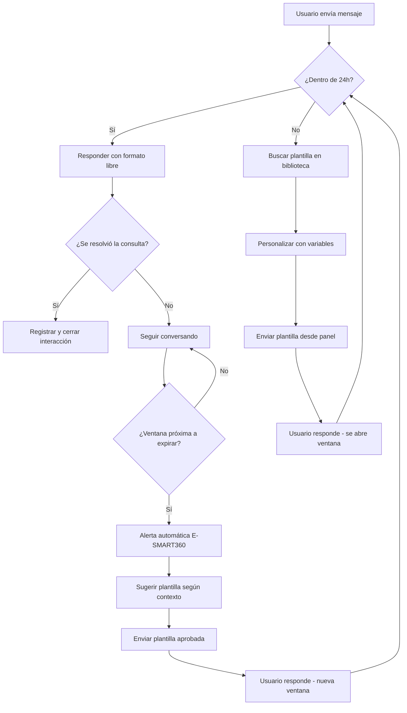

> **Resumen ejecutivo:** La regla de las 24 horas permite a las empresas enviar mensajes de formato libre (sin plantilla) a los usuarios dentro de las 24 horas posteriores a su última interacción. Pasada esa ventana, solo puedes usar plantillas aprobadas por WhatsApp (o mensajes patrocinados) para reenganchar al usuario. E-SMART360 automatiza el seguimiento de esta ventana, envía alertas y gestiona las plantillas para garantizar el cumplimiento total.

<Update title="Última actualización" date="2026-05-08" />
*Actualizado: 8 de mayo de 2026 | Tiempo de lectura: 12 min*

---

## Comprendiendo la Regla de las 24 Horas para WhatsApp y Facebook Messenger

En el mundo de la mensajería instantánea, plataformas como WhatsApp y Facebook Messenger han implementado reglas para mantener la privacidad del usuario y el control sobre los mensajes. Una de las regulaciones más importantes es la **regla de las 24 horas**, que define cómo las empresas pueden interactuar con sus clientes.

Cuando un cliente envía un mensaje a una empresa, esta tiene **24 horas** para responder con cualquier mensaje que desee, sin restricciones de formato ni necesidad de plantillas aprobadas. Pasadas las 24 horas, la empresa no puede enviar mensajes normales y debe recurrir a **mensajes plantilla aprobados por WhatsApp** para reiniciar la comunicación. Este artículo analiza en detalle la regla de las 24 horas, sus implicaciones y cómo E-SMART360 ayuda a las empresas a cumplir con estas políticas mientras garantizan una comunicación fluida.

---

## ¿Qué es la Regla de las 24 Horas?

La regla de las 24 horas se refiere a la ventana de tiempo durante la cual una empresa puede enviar **mensajes de formato libre** (mensajes sin plantilla) a un usuario después de su última interacción. Una vez que esta ventana expira, las empresas no pueden enviar mensajes normales y deben utilizar **plantillas de mensajes aprobadas**, conocidas como mensajes iniciados por la empresa, para volver a interactuar con el usuario.

> La regla de las 24 horas se aplica al ecosistema Meta en general, incluyendo WhatsApp y Facebook Messenger. Aunque cada plataforma tiene sus particularidades, el principio rector es el mismo: una ventana de 24 horas desde la última interacción del usuario.

**Puntos clave sobre la regla de las 24 horas:**

### La ventana comienza con la última interacción del usuario

Cada vez que un usuario envía un mensaje, reacciona a una publicación o hace clic en un botón dentro del chat, se inicia un nuevo período de 24 horas. La ventana se reinicia completamente con cada nueva interacción.

### Dentro de la ventana puedes enviar cualquier mensaje

Durante estas 24 horas, la empresa puede enviar mensajes de cualquier tipo: promocionales, transaccionales o conversacionales. No hay restricciones de formato ni necesidad de usar plantillas aprobadas.

### Fuera de la ventana solo puedes usar plantillas aprobadas

Una vez que la ventana de 24 horas se cierra, los mensajes de formato libre quedan bloqueados. Solo puedes utilizar plantillas de mensajes previamente aprobadas por WhatsApp para volver a contactar al usuario.

### Tipos de Mensajes en WhatsApp

Es importante entender los tres tipos de mensajes que existen en WhatsApp Business API:

**1. Mensajes Entrantes (Incoming Messages):**
Cualquier mensaje que tu cliente te envía. Cada vez que recibes un mensaje entrante, WhatsApp te otorga una ventana de 24 horas para responder. Esta ventana se conoce como la **ventana de servicio al cliente**.

**2. Mensajes Salientes (Outgoing Messages):**
Cualquier mensaje que envías al cliente dentro de la ventana de 24 horas. Es importante destacar que cada vez que el cliente te envía un mensaje, la ventana de 24 horas se **reinicia completamente**. Es decir, obtienes una nueva ventana de 24 horas para responder desde cero.

**3. Mensajes Plantilla (Template Messages):**
Para iniciar una nueva conversación con un cliente o responder a un mensaje entrante fuera de la ventana de 24 horas, necesitas usar un mensaje plantilla previamente aprobado por WhatsApp.

---

## ¿Por qué Existe esta Regla?

La regla de las 24 horas fue diseñada por WhatsApp para cumplir con múltiples objetivos:

### 1. Proteger la Privacidad del Usuario

Al limitar los mensajes no solicitados, la regla garantiza que los usuarios no se vean abrumados por notificaciones irrelevantes o frecuentes. Esto ayuda a mantener una experiencia de usuario positiva y reduce la fatiga de notificaciones.

### 2. Fomentar Respuestas Oportunas

Las empresas tienen un incentivo directo para responder rápidamente a las consultas de los usuarios. Una respuesta veloz no solo mejora la satisfacción del cliente, sino que también mantiene abierta la ventana de 24 horas, permitiendo una comunicación más fluida y natural.

### 3. Garantizar el Cumplimiento Normativo

La regla se alinea con regulaciones globales de privacidad, como el **GDPR** en Europa y la **LGPD** en Brasil, al dar a los usuarios control sobre sus interacciones. Esto asegura que las empresas no puedan enviar mensajes no deseados a usuarios que no han dado su consentimiento explícito.

> **Importante:** El incumplimiento de la regla de las 24 horas puede tener consecuencias graves: desde el bloqueo de mensajes individuales hasta la restricción temporal o permanente de tu número de WhatsApp Business. E-SMART360 protege tu número bloqueando automáticamente los envíos que violarían esta política.

---

## ¿Qué Ocurre Cuando la Ventana de 24 Horas Expira?

Cuando la ventana de 24 horas se cierra, las empresas ya no pueden enviar mensajes de formato libre. En su lugar, deben utilizar alguna de las siguientes alternativas:

### 1. Usar Plantillas de Mensajes (WhatsApp)

Las plantillas de mensajes son mensajes preaprobados por WhatsApp que garantizan el cumplimiento de sus políticas. Estos mensajes se utilizan para fines transaccionales (confirmaciones de pedido, recibos de pago, notificaciones de envío), informativos (recordatorios de citas, cambios de horario, actualizaciones de estado) y promocionales (ofertas, descuentos, lanzamientos de productos).

Las plantillas pueden incluir **marcadores de posición dinámicos** (variables) para personalizar los mensajes. Por ejemplo:

- `"Hola {{nombre}}, tu pedido #{{id_pedido}} está listo para recoger."`
- `"Hemos notado que no completaste tu compra. Haz clic aquí para finalizarla: {{enlace}}"`
- `"{{nombre}}, tienes una cita programada para el {{fecha}} a las {{hora}}. Responde CONFIRMAR para confirmar."`

### 2. Enviar Mensajes Patrocinados (Facebook Messenger)

Para Facebook Messenger, las empresas pueden usar opciones de mensajería paga para enviar mensajes promocionales o de reenganche más allá de la ventana de 24 horas. Los mensajes patrocinados son útiles para campañas publicitarias u ofertas específicas.

> **¿Sabías que...?** La calidad de tu número de teléfono en WhatsApp influye directamente en tus límites de mensajería. Mantener una alta tasa de respuesta dentro de la ventana de 24 horas mejora tu calificación de calidad y te permite enviar más mensajes diarios. E-SMART360 monitorea tu calificación en tiempo real.

---

## Tipos de Plantillas en WhatsApp

E-SMART360 clasifica las plantillas en dos categorías principales según las directrices de WhatsApp:

### Plantillas de Utilidad

Diseñadas para comunicaciones **transaccionales y funcionales**. No deben contener contenido promocional.

**Características:**
- Relacionadas con una transacción o suscripción específica
- Deben ser funcionales y no promocionales
- Si contienen contenido mixto, WhatsApp las clasifica como marketing automáticamente

**Ejemplos:**
- Confirmación de pedido: "Tu pedido #12345 ha sido confirmado. Recibirás una actualización de seguimiento pronto."
- Recibo de pago: "Tu pago de $50 se ha procesado exitosamente. Gracias por tu compra."
- Recordatorio de cita: "Recordatorio: Tu cita con el Dr. García está programada para el 15 de marzo a las 10 a.m."
- Actualización de envío: "Tu paquete #98765 está en camino. Fecha estimada de entrega: 20 de marzo."
- Notificación de factura: "Tu factura de {{mes}} está disponible. Monto: {{monto}}. Vence el {{fecha}}."

### Plantillas de Marketing

Ofrecen mayor flexibilidad y se usan para mensajes **no relacionados con una transacción específica**.

**Características:**
- Pueden incluir promociones, ofertas e invitaciones
- Mayor libertad creativa en el contenido
- Requieren un opt-in explícito del usuario antes de enviar

**Ejemplos:**
- Oferta promocional: "¡Oferta exclusiva! Obtén un 20% de descuento en tu próxima compra. Usa el código AHORRO20."
- Reenganche: "Te extrañamos. Disfruta de envío gratis en tu próximo pedido. Toca abajo para comprar ahora."
- Invitación: "Únete a nuestro próximo seminario web sobre tendencias de marketing digital. Regístrate ahora."
- Recomendación: "Basado en tu compra anterior, creemos que te encantará nuestra nueva colección {{producto}}."
- Lanzamiento: "Acabamos de lanzar {{producto}}. Como cliente exclusivo, obtén un {{descuento}}% en tu primera compra."

> **Precaución:** Si una plantilla contiene tanto contenido de utilidad como de marketing, WhatsApp la clasificará automáticamente como plantilla de marketing. Mantén las categorías bien definidas para evitar rechazos en la aprobación y asegurar los costos de conversación correctos.

---

## Tipos de Conversaciones y su Facturación

En WhatsApp Business API, una **conversación** es un hilo de mensajes de 24 horas entre tu empresa y un cliente. Cada conversación se abre y se cobra cuando los mensajes se entregan. E-SMART360 categoriza automáticamente cada conversación para que tengas control total sobre tus costos.

### 1. Conversaciones de Marketing

Son conversaciones iniciadas por la empresa cuyo objetivo es promocionar productos o servicios a clientes que han dado su consentimiento. Cualquier mensaje iniciado por la empresa que no califique como utilidad o servicio cae en esta categoría.

**Ejemplo:** Tienes una promoción especial. Enviar una plantilla de marketing aprobada a través de E-SMART360 inicia una conversación de marketing.

### 2. Conversaciones de Utilidad

Son conversaciones iniciadas por la empresa que proporcionan actualizaciones transaccionales esenciales, como confirmaciones de compra o recordatorios de facturación, a clientes que han dado su consentimiento.

**Ejemplo:** Un cliente realiza un pedido y envías una actualización de entrega. Esto inicia una conversación de utilidad.

### 3. Conversaciones de Servicio

Son conversaciones iniciadas por el usuario, normalmente para responder a consultas o inquietudes dentro de la ventana de 24 horas.

**Ejemplo:** Un cliente envía un mensaje con una consulta. Si respondes dentro de las 24 horas con un mensaje de formato libre, se inicia una conversación de servicio.

### Reglas de Facturación de Conversaciones

> Los cargos se aplican cuando una conversación comienza. Los mensajes múltiples enviados dentro de la misma ventana de conversación **no generan costos adicionales**. Solo se cobra la apertura.

**¿Qué sucede si envías varios tipos de plantilla en la misma ventana?**

Si se envía una plantilla de categoría diferente durante una conversación activa, se abrirá una nueva conversación y se cobrará por separado:

- Una **plantilla de utilidad** enviada en una **conversación de servicio activa** inicia una conversación de utilidad separada por 24h.
- Una **plantilla de utilidad** dentro de una **conversación de utilidad abierta** no genera nuevo cargo.
- Una **plantilla de marketing** durante cualquier conversación activa abre una nueva conversación de marketing con su cargo.

### Costos de conversación por región

Los costos de cada tipo de conversación varían según la región del destinatario. Las regiones principales son: Norteamérica, Latinoamérica, Europa, Medio Oriente, África, Asia-Pacífico e India. E-SMART360 muestra los costos estimados antes de enviar cada plantilla para que siempre tengas control de tu presupuesto.

---

## Cómo E-SMART360 Simplifica el Cumplimiento de la Regla de las 24 Horas

E-SMART360 está equipado con funciones integrales que ayudan a las empresas a gestionar la regla de las 24 horas de manera efectiva. A continuación, cada funcionalidad en detalle:

### 1. Temporizador en Tiempo Real de la Ventana de 24 Horas

E-SMART360 rastrea el tiempo restante dentro de la ventana de 24 horas para cada interacción de usuario. Puedes ver cuánto tiempo queda para enviar un mensaje regular, garantizando el cumplimiento.

> **¿Cómo funciona el temporizador?** El sistema calcula automáticamente el tiempo restante basándose en la marca de tiempo de la última interacción del usuario. El contador se reinicia cada vez que el usuario envía un mensaje o interactúa con el chatbot. Puedes ver el contador en el panel de conversaciones con indicadores de colores: verde (más de 12h), amarillo (12-3h), naranja (3-1h) y rojo (menos de 1h).

### 2. Soporte Completo de Plantillas de Mensajes

Después de que la ventana de 24 horas expire, E-SMART360 te permite enviar plantillas de mensajes de WhatsApp en segundos. Las plantillas se personalizan con marcadores de posición para comunicación personalizada.

**Para crear una plantilla en E-SMART360:**

### Accede al Gestor de Plantillas

Dirígete al panel de control y navega hasta **Mensajes > Plantillas de Mensajes**. Aquí verás todas tus plantillas existentes y podrás crear nuevas.

### Agrega variables personalizadas (opcional)

Desplázate hasta **Variable de Plantilla**. Haz clic en **Crear**, ingresa un nombre descriptivo y guarda. Crea variables como `nombre_cliente`, `id_pedido`, `enlace_pago`, `fecha_cita`, `monto`, etc. Las variables permiten personalizar cada mensaje de forma masiva.

### Crea la plantilla de mensaje

En **Configuración de Plantilla de Mensaje**, haz clic en **Crear** y completa:
- **Nombre**: Asígnale un nombre descriptivo (ej: "Recordatorio_Cita")
- **Cuerpo del Mensaje**: Redacta el contenido e inserta variables con `{{nombre_variable}}`
- **Texto del Pie (Opcional)**: Agrega un eslogan o datos de contacto
- **Tipo**: Selecciona **Utilidad** o **Marketing** según corresponda
- **Respuesta Rápida (Opcional)**: Crea botones de respuesta predefinidos
- **Botón CTA**: Especifica texto y acción (llamada, web, copiar código)

### Guarda y espera aprobación de WhatsApp

Haz clic en **Guardar**. La plantilla se envía automáticamente a WhatsApp para revisión. El proceso toma de 30 minutos a 48 horas. Recibirás notificación cuando sea aprobada o rechazada.

> **Tip profesional:** Crea un banco de 10 a 15 plantillas anticipadamente para diferentes escenarios: recordatorios, seguimiento de pedidos, recuperación de carritos, notificaciones de envío, encuestas, post-venta y cumpleaños. Así siempre tendrás opciones listas cuando la ventana de 24 horas esté por expirar.

### 3. Notificaciones de Ventanas Próximas a Expirar

E-SMART360 envía alertas proactivas cuando la ventana de 24 horas de un usuario está por expirar, permitiendo actuar de manera oportuna.

**Tipos de alertas:**
- **Notificación en el panel**: Aparece en la interfaz con contador visual
- **Notificación por correo**: Recibe un email cuando las ventanas críticas están por expirar
- **Alertas en Telegram**: Integración directa para notificaciones en tiempo real

Configura el umbral de alerta: 1h, 3h, 6h o 12h antes del vencimiento. El sistema prioriza según la importancia del cliente.

### 4. Envío Simplificado de Plantillas

E-SMART360 simplifica todo el proceso de creación, envío y uso de plantillas aprobadas:

1. El sistema identifica conversaciones con ventana por expirar
2. Sugiere la plantilla más adecuada según el contexto de la conversación
3. Con un solo clic envías la plantilla desde el panel
4. El usuario responde y se abre una nueva ventana de 24 horas

### 5. Categorización Automática de Conversaciones

E-SMART360 categoriza automáticamente cada conversación según su tipo, permitiendo:

- Control claro de costos de mensajería por categoría (marketing, utilidad, servicio)
- Identificar qué tipo genera más engagement con los clientes
- Optimizar la estrategia de comunicación basada en datos
- Evitar cargos inesperados por mezclar tipos de conversación
- Generar reportes detallados de actividad y costos por período

### 6. Panel de Cumplimiento en Tiempo Real

El panel de E-SMART360 ofrece una vista general completa:

- **Ventanas activas**: Conversaciones actualmente dentro de las 24 horas
- **Próximas a expirar**: Conversaciones que expirarán pronto, ordenadas por urgencia
- **Plantillas pendientes**: Estado de cada plantilla enviada a revisión a WhatsApp
- **Historial de cumplimiento**: Registro completo de interacciones y su estado
- **Reportes exportables**: Descarga informes en CSV o PDF para auditorías

---

## Límites de Mensajería y su Relación con la Regla de 24 Horas

Entender los límites de mensajería de WhatsApp es crucial para planificar tu estrategia. Estos límites se relacionan directamente con la regla de 24 horas y la calidad del número.

### Niveles de Mensajería

WhatsApp asigna a cada número un límite de mensajería según su calidad y antigüedad:

| Nivel | Límite Diario de Contactos | Requisitos |
|-------|---------------------------|------------|
| **Prueba** | 250 contactos | Números nuevos sin historial |
| **Nivel 1** | 1,000 contactos | 24 horas desde la activación |
| **Nivel 2** | 10,000 contactos | Calidad alta y tasa de respuesta positiva |
| **Nivel 3** | 100,000 contactos | Calidad excelente constante |
| **Nivel 4** | Personalizado | Aprobación especial de Meta |

### Calidad del Número

WhatsApp evalúa tres métricas principales:

1. **Tasa de bloqueos**: Usuarios que bloquean tu número
2. **Reportes como spam**: Usuarios que marcan mensajes como no deseados
3. **Tasa de respuesta**: Qué tan rápido respondes a mensajes entrantes

> **Consecuencias de ignorar la regla de 24 horas:** mensajes bloqueados, reducción del límite diario, disminución de calificación de calidad, desactivación temporal o permanente del número en casos extremos.

### Límites de Transmisión (Broadcast)

### Ver detalles sobre límites de transmisión

Al enviar mensajes masivos (broadcasts) considera:
- **Velocidad de envío**: WhatsApp limita los mensajes por segundo según tu nivel
- **Segmentación**: Solo a usuarios que hayan optado explícitamente
- **Horario**: Envía en horarios comerciales para maximizar apertura
E-SMART360 gestiona automáticamente la velocidad de envío para evitar bloqueos y optimiza la entrega según la zona horaria de cada destinatario.

---

## Casos de Uso Prácticos para la Regla de las 24 Horas

### Consultas de Soporte

Un usuario envía una consulta sobre un producto. La empresa responde dentro de las 24 horas. Si se necesita seguimiento después, se usa una plantilla.

**Plantilla:** "Hola {{nombre}}, soy {{agente}} de soporte. ¿Tu consulta sobre {{producto}} quedó resuelta? ¿Podemos ayudarte en algo más?"

### Notificaciones de Pedidos

Un cliente recibe una confirmación inmediata. Si hay actualización después de 24h, se envía una plantilla.

**Plantilla:** "{{nombre}}, tu pedido #{{id_pedido}} tiene una actualización: {{estado}}. Gracias por tu paciencia."

### Carritos Abandonados

Un usuario abandona el carrito. Dentro de 24h se envía recordatorio. Si no responde, plantilla con oferta.

**Plantilla:** "{{nombre}}, dejaste productos en tu carrito. Aquí tienes un {{descuento}}% de descuento exclusivo."

### Más Ejemplos por Sector

### Hotelería y Turismo

**Dentro de 24h:** "Bienvenido al Hotel {{nombre}}. Tu habitación {{num}} está lista. ¿Necesitas algo?"

**Fuera de 24h:** "Hola {{nombre}}, esperamos que disfrutes tu estancia. ¿Cómo podemos mejorar tu experiencia?"

### Gimnasios y Fitness

**Dentro de 24h:** "Te esperamos hoy. Tenemos una nueva clase de spinning a las 6 PM."

**Fuera de 24h:** "{{nombre}}, te extrañamos. Esta semana tenemos una promo especial para miembros: {{promocion}}."

---

## Consejos para Maximizar la Ventana de 24 Horas

### 1. Responde Rápidamente

Usa chatbots para respuestas inmediatas. Un chatbot en E-SMART360 puede: responder FAQ al instante, calificar leads automáticamente, recopilar información del cliente antes de transferir a un agente, programar citas y escalar conversaciones complejas.

### 2. Interactúa de Forma Significativa

Cada interacción debe aportar valor: resuelve problemas reales, proporciona información relevante según historial, ofrece recomendaciones personalizadas, usa el nombre del cliente, y haz preguntas que fomenten la respuesta.

### 3. Planifica los Seguimientos

Crea una secuencia de seguimiento estratégica:

- **Día 1 (24h):** Mensaje personalizado de seguimiento humano
- **Día 2:** Plantilla de utilidad con información relevante
- **Día 5:** Plantilla de marketing con oferta limitada
- **Día 10:** Plantilla de reenganche con descuento exclusivo
- **Día 30:** Plantilla de verificación de satisfacción

### 4. Monitorea tu Calidad de Envío

Para mantener calificación alta: responde siempre, no envíes spam, ofrece valor real, respeta los opt-outs eliminando inmediatamente a quienes se den de baja, y segmenta tu audiencia.

### 5. Segmenta tu Audiencia

Segmenta según tipo de interacción, frecuencia de compra, estado del ciclo de vida, valor del cliente y fuente de captación. Esto permite personalizar los mensajes para cada grupo.

---
## Diferencias entre WhatsApp y Facebook Messenger

Aunque ambas plataformas pertenecen a Meta, las reglas de la ventana de 24 horas tienen diferencias importantes:

| Característica | WhatsApp Business API | Facebook Messenger |
|----------------|----------------------|-------------------|
| Ventana de 24h | Sí, desde última interacción | Sí, desde última interacción |
| Mensajes patrocinados | No disponible | Sí, disponible como opción paga |
| Plantillas obligatorias | Sí, después de 24h | Sí, después de 24h |
| Opt-in requerido | El usuario debe haber optado | El usuario debe haber iniciado conversación |
| Modelo de costos | Por conversación abierta | Por mensaje enviado |
| Límite de mensajes | Según nivel de calidad | Según política de Messenger |
| Personalización | Variables y placeholders | Variables y etiquetas |

---

## Flujo de Trabajo Recomendado con E-SMART360

Sigue este flujo para gestionar eficientemente la regla de las 24 horas:

---

## Preguntas Frecuentes

### ¿Qué cuenta como interacción del usuario para iniciar la ventana de 24 horas?

Cualquier mensaje de texto, clic en un botón interactivo, selección en lista de respuestas rápidas, reacción con emoji, respuesta a encuesta, o cualquier participación en el chat. Incluso responder con un simple "sí" a una plantilla reinicia la ventana de 24 horas.

### ¿Puedo enviar mensajes promocionales después de que expire la ventana de 24 horas?

Sí, pero solo a través de plantillas de mensajes aprobadas por WhatsApp. No puedes enviar mensajes promocionales de formato libre después de las 24 horas. Las plantillas de marketing te permiten hacer promociones siempre que estén aprobadas previamente.

### ¿Las plantillas necesitan aprobación antes de usarse?

Sí, absolutamente. WhatsApp debe aprobar cada plantilla antes de usarla. El proceso toma de 30 minutos a 48 horas. E-SMART360 te notifica automáticamente cuando una plantilla es aprobada o rechazada, indicando el motivo exacto del rechazo.

### ¿E-SMART360 cambia automáticamente a plantillas cuando expira el tiempo?

Sí. E-SMART360 maneja la transición automáticamente. Cuando la ventana está por expirar, el sistema muestra una alerta y sugiere la plantilla más adecuada según el contexto. Con un clic envías la plantilla, manteniendo la comunicación sin interrupciones.

### ¿La regla de 24 horas aplica a mensajes salientes iniciados por la empresa?

Sí. Todos los mensajes iniciados por la empresa requieren plantilla aprobada, sin importar si el usuario ha interactuado antes. E-SMART360 bloquea automáticamente cualquier envío que viole esta regla.

### ¿Qué consecuencias tiene enviar un mensaje sin plantilla fuera de la ventana?

WhatsApp bloquea el mensaje inmediatamente. Los intentos repetidos reducen el límite diario, disminuyen la calificación del número, activan restricciones temporales y pueden provocar la desactivación permanente del número. E-SMART360 te protege bloqueando preventivamente estos envíos.

### ¿Puedo usar la misma plantilla para múltiples conversaciones?

Sí. Una vez aprobada, puedes usar la plantilla en todas las conversaciones que desees. E-SMART360 te permite gestionar las plantillas aprobadas de forma centralizada, creando una biblioteca lista para usar.

### ¿Cómo afecta la calidad del número a la regla de 24 horas?

La calidad del número no cambia la regla de 24 horas, pero determina cuántos mensajes puedes enviar diariamente. Una calificación alta permite mayores límites de mensajería. WhatsApp asigna niveles según la consistencia de tu calidad.

### ¿Qué es una conversación y cómo se cobra?

Es un hilo de 24 horas entre tu empresa y un cliente. Se abre al entregar el primer mensaje. Todos los mensajes dentro de esa ventana no generan cargos adicionales. Solo se cobra la apertura. Cambiar de categoría abre una nueva conversación.

### ¿Cómo veo el tiempo restante en E-SMART360?

En el panel de conversaciones, cada chat muestra un indicador visual. Puedes ordenar por tiempo restante. Colores: verde (>12h), amarillo (12-3h), naranja (3-1h), rojo (<1h).

### ¿Qué hago si una plantilla es rechazada por WhatsApp?

E-SMART360 te muestra el motivo exacto del rechazo. Corrige el contenido según las directrices y vuelve a enviarla. Causas comunes: contenido promocional en plantilla de utilidad, lenguaje engañoso, faltas de ortografía o URLs no válidas.

---

## Ejemplos Prácticos Adicionales

### Tienda de Ropa Online

**Contexto:** Una tienda quiere hacer seguimiento a clientes que compraron hace una semana.

**Dentro de 24h:** "¡Hola! ¿Cómo te quedó la camisa que compraste? Nos encantaría saber tu opinión."

**Fuera de 24h:** "{{nombre}}, esperamos que disfrutes tu {{producto}}. Tenemos accesorios que complementan tu estilo: {{descuento}}% de descuento."

**Resultado:** Ventas cruzadas + cumplimiento de políticas.

### Servicio Técnico

**Contexto:** Cliente reportó un problema y el agente necesita más tiempo para resolverlo.

**Dentro de 24h:** "Estamos revisando tu caso. Te mantendremos informado."

**Fuera de 24h:** "{{nombre}}, tenemos una actualización de tu ticket #{{id}}. Hemos identificado la causa y trabajamos en la solución. Estimación: {{tiempo}}."

**Resultado:** Cliente satisfecho sin violar políticas de mensajería.

---

## Conclusión

La regla de las 24 horas es una regulación esencial para las empresas que utilizan WhatsApp Business API y Facebook Messenger. Garantiza que las interacciones con los usuarios sigan siendo relevantes y respetuosas, al mismo tiempo que ofrece a las empresas la oportunidad de participar de manera significativa.

Con las herramientas integrales de E-SMART360, gestionar la ventana de 24 horas y enviar plantillas de mensajes aprobadas se vuelve un proceso sencillo y automatizado. Al aprovechar estas funciones, las empresas pueden mantener el cumplimiento, construir relaciones más sólidas con los clientes y maximizar el impacto de sus comunicaciones.

E-SMART360 te ofrece: temporizador en tiempo real de la ventana, soporte completo de plantillas con variables, notificaciones proactivas de ventanas próximas a expirar, envío simplificado con un clic, categorización automática de conversaciones y panel de cumplimiento en tiempo real.

Comienza a gestionar tus ventanas de 24 horas de manera efectiva con E-SMART360 y asegúrate de que tu estrategia de mensajería esté alineada con las directrices de la plataforma.

> **¿Listo para optimizar tu estrategia de mensajería en WhatsApp?** E-SMART360 te ofrece todas las herramientas necesarias para cumplir con la regla de las 24 horas, automatizar tus comunicaciones y hacer crecer tu negocio. Configura tus plantillas en minutos y olvídate de las preocupaciones de cumplimiento.

## Estrategias Avanzadas para el Cumplimiento

### Automatización de Respuestas con Chatbots

Los chatbots son la herramienta más efectiva para maximizar la ventana de 24 horas. Un chatbot bien configurado en E-SMART360 puede mantener múltiples conversaciones simultáneamente, asegurando que ninguna ventana se desperdicie.

**Beneficios clave de usar chatbots:**

- Respuesta instantánea 24/7, incluso fuera del horario laboral
- Manejo simultáneo de cientos de conversaciones
- Registro automático de cada interacción para auditoría
- Transferencia inteligente a agentes humanos cuando sea necesario
- Personalización automática basada en el historial del cliente

### Gestión de Múltiples Agentes y Conversaciones

Para equipos de soporte, E-SMART360 ofrece un panel de conversaciones en vivo donde puedes:

- Ver todas las conversaciones activas en un solo lugar
- Asignar conversaciones a agentes específicos
- Ver el tiempo restante de cada ventana de 24 horas
- Recibir alertas cuando una ventana está por expirar
- Acceder al historial completo de cada cliente

### Plantillas para Reiniciar Conversaciones Fuera del Horario Laboral

Cuando un cliente envía un mensaje fuera del horario laboral y la ventana de 24 horas expira antes de que puedas responder, E-SMART360 te permite usar plantillas específicas para retomar la conversación:

**Ejemplo de plantilla post-horario laboral:**
"Hola {{nombre}}, gracias por contactarnos. Recibimos tu mensaje del {{fecha_original}}. Actualmente estamos fuera del horario laboral, pero ya estamos aquí para ayudarte. ¿En qué podemos asistirte hoy?"

---

## Optimización de Costos de Mensajería

Entender la estructura de costos de WhatsApp Business API es fundamental para optimizar tu presupuesto:

### Costos por Tipo de Conversación

| Tipo de Conversación | Costo Relativo | Uso Recomendado |
|---------------------|---------------|-----------------|
| Servicio | Más bajo | Responder consultas de clientes (iniciado por usuario) |
| Utilidad | Medio | Notificaciones transaccionales (iniciado por empresa) |
| Marketing | Más alto | Campañas promocionales (iniciado por empresa) |

### Estrategias para Reducir Costos

### Maximiza las conversaciones de servicio

Anima a los usuarios a iniciar la conversación. Las conversaciones iniciadas por el usuario (servicio) tienen el costo más bajo. Usa CTAs como "Contáctanos por WhatsApp" en tu sitio web.

### Agrupa mensajes de utilidad

Cuando envíes notificaciones transaccionales, agrupa toda la información relevante en un solo mensaje de utilidad en lugar de enviar múltiples mensajes que abran varias conversaciones.

### Segmenta campañas de marketing

Envía plantillas de marketing solo a segmentos con alta probabilidad de conversión. Una campaña bien segmentada genera mejor ROI aunque el costo por conversación sea más alto.

### Monitorea conversaciones duplicadas

E-SMART360 te alerta si una misma categoría de conversación se abre múltiples veces para el mismo cliente, ayudándote a evitar costos innecesarios.

---

## Características Adicionales de E-SMART360 para WhatsApp Business API

### Plantillas de Carrousel

E-SMART360 soporta plantillas de carrousel para mostrar múltiples productos o servicios en un solo mensaje. Estas plantillas son ideales para:

- Catálogos de productos interactivos
- Mostrar múltiples opciones de servicio
- Campañas con varios items promocionales

### Límites de Caracteres para Plantillas Multimedia

Las plantillas con medios (imágenes, videos, documentos) tienen límites específicos de caracteres. E-SMART360 valida automáticamente estos límites antes de enviar la plantilla a aprobación:

- **Encabezado multimedia**: Hasta 60 caracteres
- **Cuerpo**: Hasta 1024 caracteres
- **Pie de página**: Hasta 60 caracteres
- **Botones**: Hasta 20 caracteres por botón

### Coexistencia con Otras Plataformas

E-SMART360 es compatible con la funcionalidad de coexistenci­a de WhatsApp, permitiendo que múltiples BSPs (Business Service Providers) compartan el mismo número de teléfono. Esto es útil si estás migrando de otra plataforma o necesitas mantener redundancia operativa.

### Más información sobre coexistencia

La coexistencia permite que diferentes proveedores de servicios gestionen el mismo número de WhatsApp Business. E-SMART360 maneja la configuración de coexistencia automáticamente, asegurando que no haya conflictos en el enrutamiento de mensajes entrantes ni en los webhooks de estado.

---

## Glosario de Términos

| Término | Definición |
|---------|-----------|
| Ventana de 24h | Período de 24 horas desde la última interacción del usuario para enviar mensajes de formato libre |
| Plantilla | Mensaje preaprobado por WhatsApp usado fuera de la ventana de 24h |
| Conversación | Hilo de 24 horas entre empresa y cliente, abierto al entregar un mensaje |
| Mensaje entrante | Mensaje enviado por el cliente a la empresa |
| Mensaje saliente | Mensaje enviado por la empresa al cliente dentro de la ventana de 24h |
| Opt-in | Consentimiento explícito del usuario para recibir mensajes de marketing |
| Calidad del número | Métrica de WhatsApp basada en bloqueos, reportes de spam y tasa de respuesta |
| Broadcast | Envío masivo de mensajes a múltiples destinatarios |
| Variable | Marcador de posición dinámico en plantillas para personalización |
| BSP | Business Service Provider - Proveedor de servicios de WhatsApp Business API |

---

## Recursos Relacionados

Para profundizar en temas relacionados, consulta estas guías adicionales de E-SMART360:

- Guía para crear plantillas de mensajes en WhatsApp
- Cómo crear plantillas de carrousel para WhatsApp
- Guía de límites de transmisión y broadcasts en WhatsApp
- Directrices para plantillas de utilidad y marketing
- Cómo gestionar conversaciones con el panel de chat en vivo
- Entendiendo los niveles de mensajería de WhatsApp
- Guía para mejorar la calificación de calidad de tu número

Estos recursos te ayudarán a complementar tu estrategia de cumplimiento con la regla de las 24 horas y optimizar tus comunicaciones en WhatsApp Business API.

---
