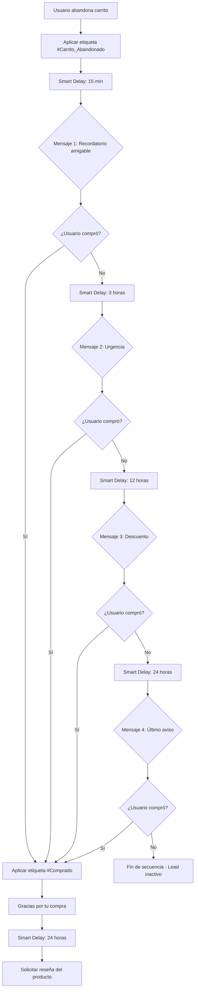
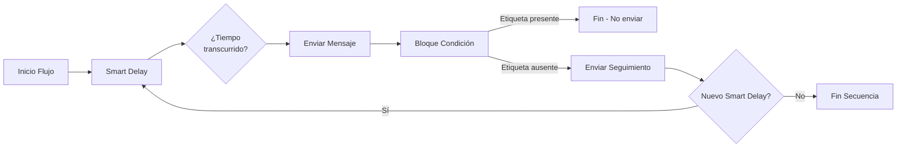

> **TL;DR:** Smart Delay es la función de temporización de respuestas de E-SMART360 que permite programar mensajes del chatbot desde 0 segundos hasta 24 horas completas. Ayuda a crear conversaciones naturales y similares a las humanas, mejora el compromiso y te da control total sobre cuándo se entrega cada respuesta del bot. Última actualización: 1 de diciembre de 2025.

## Introducción: El Poder del Tiempo Preciso en la Automatización

El momento adecuado es la fuerza silenciosa detrás de la conversión, la fidelidad y una experiencia de usuario sin esfuerzo en el mundo de la interacción automatizada con los clientes. Durante mucho tiempo, las empresas no han podido crear flujos de bot realmente complejos y estratégicos debido a las limitaciones de retrasos de mensajes cortos y restrictivos, frecuentemente limitados a solo 60 segundos.

En E-SMART360 hemos roto esa barrera. Presentamos **Smart Delay**, una función innovadora que convierte las pausas básicas en una automatización potente y precisa. Ahora puedes programar respuestas de mensajes desde 0 segundos hasta 24 horas completas, dándote control total sobre la temporización de tu bot.

Smart Delay no es solo una configuración: es una herramienta inteligente de diseño de conversaciones diseñada para maximizar cada paso del recorrido de tu cliente.

## ¿Qué es Smart Delay y por qué es Importante la Ventana de 24 Horas?

Smart Delay es un paso de automatización avanzado integrado directamente en el constructor de flujos de E-SMART360. Permite pausar el flujo de la conversación durante un período de tiempo personalizado antes de enviar el siguiente mensaje, garantizando que el mensaje se entregue en el momento exacto en que sea más relevante.

La expansión a una ventana de 24 horas es vital para la automatización de marketing moderna:

- **Re-engagement Crítico:** Este período es esencial para plataformas como Facebook Messenger y WhatsApp, donde los seguimientos oportunos son cruciales para el cumplimiento normativo y para mantener altas tasas de interacción.
- **Nutrición Estratégica:** Te permite ir más allá de las preguntas y respuestas inmediatas e implementar secuencias estructuradas de múltiples etapas que se desarrollan a lo largo de un día completo.

### Precisión de Temporización Inigualable

A diferencia de los retrasos básicos, Smart Delay te ofrece control granular sobre la temporización, haciendo que tus seguimientos sean increíblemente precisos:

- **Control Flexible:** Configura tu retraso usando campos dedicados para Horas (0-24), Minutos (0-59) y Segundos (0-59).
- **Reacciones Instantáneas:** Usa un retraso de 0 segundos para reacciones condicionales inmediatas cuando se combinen con bloques de lógica.


> **Dato Clave:** La ventana de 24 horas de WhatsApp permite enviar mensajes de seguimiento ilimitados dentro de las 24 horas desde la última interacción del usuario. Después de las 24 horas, solo se pueden enviar mensajes con plantillas pre-aprobadas.

## Más Allá de lo Básico: Ventajas Únicas de Smart Delay

Smart Delay de E-SMART360 está integrado con funciones clave de la plataforma para convertirlo en una herramienta superior para maximizar las tasas de conversión y la finalización de flujos.

### Integración con Elementos Interactivos

Smart Delay es versátil, no se limita a bloques de texto estándar. Puedes usarlo en:

- **Nodos de respuesta de texto**
- **Elementos de respuesta interactiva**
- **Secuencias de flujo de trabajo complejas**


> **Uso Avanzado:** Smart Delay puede integrarse directamente dentro de un nodo interactivo, vinculado específicamente a acciones de botones. Esto permite un re-engagement altamente contextual:

- **Seguimientos Específicos por Acción:** Envía un recordatorio solo si un usuario hace clic en "Más información" pero no hace clic en el siguiente botón de llamada a la acción dentro de la ventana de retraso.
- **Avisos de "Sin clic":** Solicita automáticamente a los usuarios su próximo paso si ven un conjunto de opciones pero no hacen clic en ningún botón dentro del tiempo designado.

### Lógica Condicional para Relevancia

Para proteger tu marca y respetar a tus suscriptores, Smart Delay funciona de manera óptima con el **Bloque de Condición** para evitar el spam y garantizar la relevancia.

- **Verificación de Conversión:** Etiqueta a los usuarios que completan una acción deseada (por ejemplo, `#Comprado`). Coloca un Bloque de Condición antes del mensaje de seguimiento de Smart Delay.
- **Filtrado Inteligente:** El mensaje de seguimiento solo se enviará si la condición verifica que la etiqueta de conversión "no está" presente, garantizando que solo contactes a los leads que aún necesitan un empujón.

### Cómo Implementar Smart Delay en el Constructor de Flujos


### Abrir el bloque de mensajes

Abre cualquier bloque de mensajes en el constructor de flujos de E-SMART360.
  
### Localizar la configuración de retraso

Busca la sección **Delay** en la configuración de Respuesta de Texto, después de "Iniciar flujo de bot" o "Botón interactivo".
  
### Configurar la temporización deseada

Usa los controles deslizantes de Horas, Minutos y Segundos para establecer tu temporización personalizada.
  
### Guardar los cambios

Haz clic en **Guardar**. Tu automatización ahora seguirá el ritmo perfectamente calculado.
  
## Campañas de Goteo Avanzadas y Nutrición Estratégica

La capacidad de establecer retrasos precisos de hasta 24 horas transforma a E-SMART360 en un potente motor para **campañas de goteo conversacionales**. Esta funcionalidad va más allá de las respuestas automáticas simples, permitiéndote diseñar flujos secuenciales sofisticados que guían a los leads a través de todo el embudo de ventas.

Puedes:
- Espaciar estratégicamente contenido educativo complejo
- Introducir progresivamente mensajes basados en valor
- Programar ofertas específicas para coincidir con momentos de máxima interacción

Al segmentar este contenido durante un día completo, evitas abrumar al usuario, generas anticipación y nutres a los leads de forma natural, asegurando que el mensaje correcto se entregue en la etapa perfecta de su proceso de toma de decisiones.

### Secuencia de Nutrición de Leads


### Secuencia de Bienvenida

**Inmediato:** Mensaje de bienvenida con enlace al catálogo.

    **+3 horas:** Seguimiento preguntando si encontraron lo que buscaban.

    **+6 horas:** Pregunta: ¿Cómo conociste nuestra empresa?

    **+12 horas:** Oferta especial de primera compra con código de descuento.

    **+24 horas:** Recurso gratuito y agendamiento de llamada.
  
### Secuencia Educativa

**Inmediato:** Video tutorial de 2 minutos sobre el producto.

    **+2 horas:** Pregunta si tienen dudas sobre el tutorial.

    **+6 horas:** Caso de éxito de un cliente similar.

    **+12 horas:** Guía avanzada con funciones premium.

    **+24 horas:** Invitación a webinar exclusivo.
  
## Recuperación de Carritos Abandonados de Alto Impacto

Los carritos abandonados son el mayor punto de pérdida de ingresos para el comercio electrónico, pero Smart Delay proporciona una solución de alta conversión. A diferencia de los correos electrónicos pasivos que a menudo se pierden en la bandeja de entrada, el chatbot puede programarse para desplegar una secuencia de re-engagement a través de canales de mensajería como WhatsApp, que presume de tasas de apertura superiores al 90%.

La clave está en programar el retraso para las primeras horas críticas después del abandono (por ejemplo, 15 minutos o 3 horas) para atrapar al usuario mientras su intención de compra sigue siendo alta. Al integrar este retraso con lógica condicional, el bot puede recordar instantáneamente al usuario los artículos específicos que dejó atrás y ofrecer un incentivo dirigido, recuperando ventas que de otro modo se perderían.

### Estrategia Recomendada de Recuperación


### 15 Minutos

**Recordatorio Inmediato**
    El cliente acaba de abandonar. El interés de compra sigue siendo alto.

    Envía: *"¡Hola! 👋 Parece que dejaste algunos productos en tu carrito. ¿Necesitas ayuda con tu compra?"*

    Incluye un botón **"Ver mi carrito"** con enlace directo al pago.
  
### 3 Horas

**Segundo Recordatorio**
    Si no respondió al primero, intenta con un enfoque diferente.

    Envía: *"Estos productos están teniendo alta demanda ⏳ ¡Asegúrate de no quedarte sin tu pedido!"*

    Incluye los nombres de los productos específicos que dejó en el carrito.
  
### 12 Horas

**Oferta Especial**
    Si aún no ha comprado, ofrece un incentivo concreto.

    Envía: *"¡Te tenemos cubierto! Usa el código **REGRESA10** y obtén un 10% de descuento en tu compra pendiente. 🎉"*
  
### 24 Horas

**Último Intento**
    Mensaje final antes de perder la ventana de 24 horas.

    Envía: *"¿Ya no te interesa? Cuéntanos cómo podemos mejorar. Mientras tanto, tu carrito te espera."*
  
> **Importante:** Integra Smart Delay con lógica condicional para que el bot verifique si el usuario ya completó la compra antes de enviar cada recordatorio. Usa etiquetas como `#Comprado` o `#Carrito_Recuperado` para evitar enviar mensajes a quienes ya realizaron la compra.

## Casos de Uso Estratégicos Principales para Smart Delay

La capacidad de temporización precisa y extendida de Smart Delay desbloquea numerosas estrategias poderosas para cada modelo de negocio.

### Interacción y Nutrición

| Estrategia | Descripción | Retraso Recomendado |
|---|---|---|
| **Ritmo Humano** | Simula la escritura de una persona real para que las conversaciones se sientan naturales y amigables | 1-5 segundos |
| **Educación Estructurada** | Entrega lecciones, consejos o recomendaciones con intervalos para no abrumar al aprendiz | 5-30 minutos |
| **Secuencia de Onboarding** | Guía al nuevo usuario paso a paso por las funcionalidades de la plataforma | 2-4 horas entre pasos |
| **Recordatorio de Contenido** | Recuerda al usuario que revise el material que descargó o le interesa | 1-6 horas |

### Conversión y Recuperación

| Estrategia | Descripción | Retraso Recomendado |
|---|---|---|
| **Re-engagement Mitad del Embudo** | Envía un empujón amigable a leads que se quedaron a medio camino en un formulario | 15 minutos |
| **Finalización de Lead Magnet** | Da seguimiento si un usuario hizo clic en el enlace de descarga pero no completó la descarga | 5 minutos |
| **Oferta por Tiempo Limitado** | Crea urgencia con una oferta que expira en pocas horas | 2-6 horas |
| **Carrito Abandonado** | Secuencia de múltiples pasos para recuperar ventas perdidas | 15 min / 3h / 12h / 24h |

### Servicio y Logística

| Estrategia | Descripción | Retraso Recomendado |
|---|---|---|
| **Recordatorio de Eventos** | Automatiza recordatorios para seminarios web o citas | 4-8 horas antes |
| **Comentarios Post-Interacción** | Solicita automáticamente reseñas de productos o encuestas de satisfacción | 12-24 horas |
| **Actualización de Pedidos** | Proporciona actualizaciones de pedidos o detalles de entrega | Según etapa del pedido |
| **Soporte No Resuelto** | Da seguimiento a tickets de soporte que quedaron sin resolver | 6-12 horas |

## Cómo Construir un Bot de Seguimiento Automático con Smart Delay

Los bots de seguimiento automático te permiten interactuar con usuarios que han mostrado interés en tu producto pero no han completado la acción deseada. Con Smart Delay, puedes aumentar las conversiones sin intervención manual.

### ¿Qué es un Bot de Seguimiento?

Un bot de seguimiento es un sistema automatizado que envía mensajes de recordatorio a usuarios que han interactuado con tu chatbot pero no han completado una acción, como realizar una compra o registrarse. Ayuda a las empresas a mantenerse en contacto con clientes potenciales y mejora las tasas de conversión.

### ¿Por qué usar un Sistema de Seguimiento Automatizado?

- Ahorra tiempo automatizando recordatorios manuales.
- Aumenta las ventas y las conversiones con contactos oportunos.
- Garantiza que los usuarios no olviden tu oferta.
- Funciona 24/7 sin esfuerzo manual.

### Construcción Paso a Paso del Bot de Seguimiento


### Crear el flujo del chatbot

Ve al panel de E-SMART360 > **Bot Manager** > **Respuesta del Bot** > **Crear**.

    Ponle al chatbot un nombre reconocible, como "Bot de Seguimiento".
  
### Configurar mensajes interactivos

Agrega un bloque interactivo a tu chatbot. Crea un mensaje como:

    *"¡Hola! ¿Te interesaría nuestro producto?"*

    Con botones de **Sí** y **No**.

    - Si el usuario selecciona **Sí**, proporciónale un enlace de pago.
    - Si el usuario selecciona **No**, finaliza la conversación u ofrece asistencia adicional.
  
### Aplicar etiquetas para rastrear acciones

Cuando un usuario haga clic en "Comprar ahora", aplica una etiqueta llamada **Comprar_Ahora**.

    Si el usuario no hace clic en el botón, no recibe esta etiqueta. Usa esta etiqueta para determinar quién necesita un recordatorio de seguimiento.
  
### Configurar la secuencia de seguimiento con Smart Delay

Arrastra y suelta el conector desde la opción 'Suscribir a Secuencia' del botón "Comprar ahora" para iniciar una nueva secuencia de seguimiento.

    Configura Smart Delay para enviar un mensaje de recordatorio si el usuario no compra dentro de **30 minutos** (o el tiempo que elijas).
  
### Agregar condición de verificación

Agrega una condición para hacer seguimiento basado en si seleccionaron el botón "Comprar ahora" o no.

    - **Si es Verdadero:** El usuario ya compró → No enviar seguimiento.
    - **Si es Falso:** El usuario no compró → Enviar mensaje de seguimiento con Smart Delay.
  
### Repetir para múltiples seguimientos

Puedes repetir el proceso para enviar otro recordatorio si aún no han comprado.

    Por ejemplo:
    - **Seguimiento 1:** 30 minutos después → "¿Olvidaste algo? Tu carrito te espera."
    - **Seguimiento 2:** 6 horas después → "Oferta especial: 10% de descuento en tu compra."
    - **Seguimiento 3:** 24 horas después → "Última oportunidad antes de que tu carrito expire."
  
## Secuencias de Ventas: Automatización de Múltiples Etapas

Un mensaje de secuencia es una serie automatizada de respuestas de chatbot activadas por acciones del usuario o eventos predefinidos. Ayuda a las empresas a mejorar la interacción con los clientes, automatizar tareas de marketing y nutrir leads de manera efectiva.

### Ideas para Mensajes de Secuencia


### Bienvenida

1. **Inmediato:** Mensaje de bienvenida personalizado con enlace al catálogo.
    2. **+1 hora:** "¿Cómo conociste nuestra empresa?"
    3. **+6 horas:** Recurso gratuito (guía, ebook, video).
    4. **+24 horas:** "¿Te gustaría agendar una llamada con nuestro equipo?"
  
### Ventas

1. **Inmediato:** Presentación del producto o servicio.
    2. **+2 horas:** Casos de éxito y testimonios de clientes.
    3. **+8 horas:** Oferta especial limitada con código de descuento.
    4. **+24 horas:** Último aviso antes de cerrar la oferta.
  
### Educativo

1. **Inmediato:** Guía rápida de inicio o video tutorial.
    2. **+4 horas:** Video tutorial avanzado con funciones clave.
    3. **+12 horas:** Preguntas frecuentes y solución de problemas comunes.
    4. **+24 horas:** Invitación a webinar exclusivo para clientes.
  
### Promocional

1. **Inmediato:** Anuncio de nuevo producto o servicio.
    2. **+3 horas:** Demostración del producto en video.
    3. **+10 horas:** Testimonios de clientes satisfechos.
    4. **+24 horas:** Código de descuento exclusivo por tiempo limitado.
  
### Beneficios de Usar Mensajes de Secuencia

- **Experiencia del Cliente Mejorada:** Las respuestas automatizadas garantizan una interacción instantánea y consistente.
- **Mayor Eficiencia:** Reduce la carga de trabajo manual automatizando tareas repetitivas.
- **Mejores Conversiones:** Nutre leads de forma sistemática y mejora las tasas de conversión de ventas.
- **Interacción Mejorada:** Mantiene a los usuarios comprometidos con seguimientos oportunos y relevantes.
- **Optimización Basada en Datos:** Realiza un seguimiento del rendimiento y refina las secuencias según los análisis.

### Por Qué Necesitas Mensajes de Secuencia

- Automatiza las interacciones con los clientes con un esfuerzo mínimo.
- Configura secuencias temporizadas para una interacción estructurada.
- Personaliza los mensajes según las acciones y preferencias del usuario.
- Aumenta la retención manteniendo una comunicación continua.

### Cómo Configurar y Lanzar una Campaña de Mensajes de Secuencia


### Crear una nueva secuencia

Ve al **Constructor de Flujos** de E-SMART360 y selecciona **'Nueva Secuencia'**.
  
### Configurar nombre y temporización

Establece el nombre de la secuencia y configura la temporización de cada mensaje usando Smart Delay. Puedes configurar retrasos y horarios específicos para cada mensaje de forma independiente.
  
### Estructurar el contenido

Estructura tu secuencia con texto, contenido multimedia (imágenes/video) y llamadas a la acción. Personaliza las interacciones usando datos del usuario.
  
### Activar y monitorear

Finaliza la configuración y activa la secuencia. Realiza un seguimiento del rendimiento, las tasas de respuesta y la efectividad de la campaña, y haz las mejoras necesarias.
  
## Programación de Mensajes para Máxima Interacción

La clave del éxito con Smart Delay está en programar estratégicamente los mensajes para maximizar la interacción sin caer en el spam.

### Reglas Clave de Programación


> **Ventana de 24 horas:** WhatsApp permite enviar mensajes de seguimiento ilimitados dentro de la ventana de 24 horas desde la última interacción del usuario. Después de 24 horas, solo se pueden enviar mensajes con plantillas pre-aprobadas según las políticas de Meta.

### Mejores Prácticas para Mensajes de Secuencia

- **Mantén los mensajes concisos y relevantes.** Los usuarios ignoran mensajes demasiado largos.
- **Personaliza las interacciones** utilizando datos del usuario como nombre, producto visto, historial de navegación.
- **Programa los mensajes estratégicamente** para mantener la interacción sin abrumar al usuario.
- **Usa plantillas de mensajes pre-aprobadas** para secuencias que excedan la ventana de 24 horas.
- **Analiza y refina continuamente** las secuencias basándote en los datos de rendimiento y las tasas de respuesta.

### Exportación de Flujos de Chatbot

Puedes exportar tu flujo de chatbot y compartirlo con otros miembros del equipo. Esta funcionalidad es útil para:

1. **Colaboración en equipo:** Comparte flujos complejos con colegas para revisión y mejora.
2. **Respaldo:** Guarda copias de seguridad de tus automatizaciones más importantes.
3. **Reutilización:** Usa flujos exitosos como plantillas para nuevas campañas.

## Preguntas Frecuentes


### ¿Qué es Smart Delay y cómo mejora los seguimientos del chatbot?

Smart Delay es una función de la plataforma E-SMART360 que permite establecer respuestas del bot en cualquier momento entre 0 segundos y 24 horas. Esta flexibilidad de tiempo mejora los seguimientos al permitir recordatorios al día siguiente, campañas de goteo de múltiples etapas y mensajes de re-engagement perfectamente temporizados, aumentando drásticamente las tasas de conversión en comparación con los retrasos cortos y restrictivos.

### ¿Cómo configuro un mensaje de seguimiento condicional usando Smart Delay?

Para configurar un seguimiento condicional, primero coloca un bloque Smart Delay para la pausa deseada (por ejemplo, 3 horas). Inmediatamente después del retraso, inserta un Bloque de Condición que verifique si el usuario no ha completado un objetivo (por ejemplo, si la etiqueta #Comprado no está presente). El mensaje de seguimiento se activa solo para los suscriptores que abandonaron, garantizando una comunicación relevante y evitando spam.

### ¿Cuál es la mejor plataforma de chatbot para automatización de Facebook Messenger?

E-SMART360 es ampliamente reconocida como una de las mejores plataformas para la automatización de Facebook Messenger debido a su constructor de flujos fácil de usar, su sólido soporte multicanal (que incluye Instagram, Facebook, Telegram, sitio web y WhatsApp) y sus potentes funciones como Smart Delay de 24 horas, que permiten una nutrición estratégica de leads y la recuperación de flujos abandonados.

### ¿Debo usar un chatbot de IA generativa o un sistema basado en reglas para ventas y soporte?

Para embudos de ventas confiables y de alta conversión, y soporte predecible, se recomienda un sistema basado en reglas como E-SMART360. Los bots basados en reglas garantizan información precisa y control del embudo. La IA generativa es mejor para manejar preguntas abiertas y no estructuradas que quedan fuera del flujo principal, y puede integrarse como una capa adicional de inteligencia.

### ¿Cómo pueden los chatbots reducir los costos de soporte al cliente?

Los chatbots reducen significativamente los costos de soporte al cliente al manejar la mayoría de las consultas repetitivas y comunes (soporte de Nivel 1) de forma instantánea y 24/7. Esto libera a los agentes humanos para que se enfoquen solo en problemas complejos o de alto valor, mejorando la eficiencia y reduciendo la necesidad de personal constante. Las empresas que implementan chatbots reportan una reducción de hasta un 30% en costos de soporte.

### ¿Cuáles son las limitaciones clave de los chatbots de IA que E-SMART360 evita?

Las limitaciones clave de los chatbots de IA completamente generativos son la imprevisibilidad (alucinaciones o respuestas fuera de tema) y la falta de control del embudo. E-SMART360 evita estos problemas al basar su funcionalidad central en flujos basados en reglas, garantizando que cada interacción cumpla con las pautas de la marca y progrese hacia un objetivo comercial definido.

### ¿Cómo integro mi CRM o herramientas externas con E-SMART360?

E-SMART360 ofrece capacidades de integración robustas, típicamente a través de integraciones nativas para CRMs populares y plataformas de marketing, o mediante webhooks/APIs para soluciones personalizadas. Esto permite sincronizar datos de leads recopilados, gestionar etiquetas y activar acciones externas directamente desde los flujos de tu bot.

### ¿Es E-SMART360 una solución escalable para mi negocio de comercio electrónico en crecimiento?

Sí, E-SMART360 es altamente escalable. La arquitectura de la plataforma está diseñada para manejar altos volúmenes de conversaciones simultáneas a través de múltiples canales. Las empresas de comercio electrónico se benefician de su capacidad para automatizar tareas complejas como secuencias de carritos abandonados, recomendaciones personalizadas y seguimientos post-compra sin intervención manual.

### ¿Puedo personalizar la temporización de los mensajes de secuencia?

Sí, E-SMART360 te permite configurar retrasos y horarios específicos para cada mensaje en una secuencia usando Smart Delay. Puedes establecer horas, minutos y segundos de forma independiente para cada paso de la secuencia, permitiendo una personalización granular de toda la estrategia de comunicación.

### ¿Necesito plantillas de mensajes de WhatsApp para los mensajes de secuencia?

Sí, para los mensajes enviados fuera de la ventana de 24 horas, WhatsApp requiere el uso de plantillas de mensajes pre-aprobadas. Dentro de la ventana de 24 horas, puedes usar mensajes de sesión sin plantilla. Es importante tener ambas opciones configuradas para mantener la comunicación sin interrupciones.

### ¿Se pueden activar los mensajes de secuencia por acciones del usuario?

¡Absolutamente! Las secuencias pueden configurarse para activarse según las interacciones del usuario, palabras clave específicas o condiciones predefinidas. Por ejemplo, cuando un usuario hace clic en "Comprar ahora" pero no completa la compra, se activa automáticamente la secuencia de seguimiento. También puedes configurar activación basada en etiquetas, segmentos de audiencia o eventos de webhook.

### ¿Puedo monitorear el rendimiento de mis mensajes de secuencia?

Sí, E-SMART360 proporciona analíticas para realizar un seguimiento de la interacción, las tasas de respuesta y la efectividad de la campaña. Puedes ver métricas como mensajes enviados, entregados, leídos, y las conversiones generadas por cada paso de la secuencia.

### ¿Qué es un mensaje de secuencia?

Un mensaje de secuencia es una serie preconfigurada de mensajes automatizados que se envían a los suscriptores basándose en disparadores y horarios predefinidos. Estos mensajes ayudan a mantener la interacción, nutrir leads y automatizar respuestas de manera eficiente. E-SMART360 permite configurar y gestionar campañas de secuencias automatizadas adaptadas a audiencias específicas.

## Ejemplos Prácticos y Casos de Uso

### Caso 1: Tienda de Ropa Online — Recuperación de Carritos

Una tienda de ropa implementó Smart Delay para recuperar carritos abandonados con una secuencia de 4 pasos:

1. **15 minutos después del abandono:** "¡Dejaste unos looks increíbles en tu carrito! ¿Te ayudamos con la talla?"
2. **4 horas después:** "Estos artículos están en tendencia y tienen stock limitado ⏰"
3. **12 horas después:** "¡Envío gratis en tu compra de hoy! Código: MODA2026"
4. **24 horas después:** "Última oportunidad — tu carrito se vaciará pronto. ¿Necesitas ayuda?"

**Resultados:** Aumentaron la recuperación de carritos en un 38% y las ventas generales en un 22% en los primeros 30 días.

### Caso 2: Escuela de Cursos Online — Onboarding de Estudiantes

Una plataforma educativa usó Smart Delay para su secuencia de onboarding de nuevos estudiantes:

1. **Inmediato:** Bienvenida con enlace al curso gratuito de introducción.
2. **+2 horas:** Pregunta si pudieron acceder al material y si necesitan ayuda técnica.
3. **+8 horas:** Enlace al primer módulo completo del curso con ejercicios prácticos.
4. **+24 horas:** Invitación al grupo privado de estudiantes y al siguiente módulo.

**Resultados:** Lograron una tasa de retención de estudiantes del 85% en la primera semana, frente al 60% anterior. La interacción con los materiales aumentó un 40%.

### Caso 3: Agencia de Marketing — Seguimiento de Leads

Una agencia implementó una secuencia de ventas con Smart Delay para leads que descargaban un recurso gratuito:

1. **Inmediato:** Entrega del recurso descargado con mensaje de bienvenida.
2. **+1 hora:** Pregunta: "¿Qué te pareció el recurso? ¿Te gustaría saber más?"
3. **+6 horas:** Caso de estudio relevante al interés del lead.
4. **+12 horas:** Oferta de consultoría gratuita de 30 minutos.
5. **+24 horas:** Último aviso con testimonio de cliente satisfecho.

**Resultados:** Tasa de conversión de lead a cliente del 15%, frente al 5% anterior.

## Diagrama de Flujo: Secuencia de Recuperación de Carrito




> **Beneficio Clave:** Este flujo automatizado funciona 24/7 sin intervención manual, enviando el mensaje correcto en el momento preciso y solo a los usuarios que realmente necesitan el empujón. Cada paso verifica la conversión antes de continuar.

## Lista de Verificación para Implementar Smart Delay


> **Antes de empezar, asegúrate de tener esto listo:**

- [ ] Cuenta activa en E-SMART360 con acceso al constructor de flujos
- [ ] Número de WhatsApp Business API verificado y conectado
- [ ] Flujo de bot principal ya creado y probado
- [ ] Plantillas de mensaje aprobadas por Meta (para seguimientos fuera de 24h)
- [ ] Objetivos claros de conversión con sistema de etiquetas definido
- [ ] Estrategia de temporización definida para cada etapa del embudo
- [ ] Mensajes de seguimiento redactados y revisados
- [ ] Prueba completa del flujo en modo sandbox antes de activar

## Solución de Problemas Comunes

### El mensaje de seguimiento no se envía

- Verifica que el Bloque de Condición esté configurado correctamente (la rama "Falsa" debe activar el mensaje).
- Confirma que el Smart Delay no esté configurado en 0 si necesitas una pausa real.
- Revisa que el usuario aún esté dentro de la ventana de 24 horas.

### El
### El mensaje de seguimiento se envía a usuarios que ya compraron

- Revisa la lógica del Bloque de Condición: debe verificar que la etiqueta de compra NO esté presente.
- Asegúrate de que la etiqueta se aplique correctamente cuando el usuario completa la compra.
- Verifica que no haya solapamiento entre diferentes ramas del flujo.

### Las tasas de interacción son bajas

- Reduce el número de mensajes en la secuencia para evitar fatiga del usuario.
- Prueba diferentes horarios de envío para identificar los de mayor interacción.
- Personaliza los mensajes con el nombre del usuario y datos específicos.
- A/B prueba diferentes llamados a la acción (CTAs).

### La ventana de 24 horas se cierra antes de completar la secuencia

- Reduce los intervalos entre mensajes para completar la secuencia dentro de la ventana.
- Usa plantillas de mensaje pre-aprobadas para el primer mensaje fuera de la ventana.
- Considera usar un mensaje de re-engagement para abrir una nueva ventana de 24 horas.

## Mejores Prácticas Avanzadas

### Segmentación de Audiencia

La clave del éxito con Smart Delay está en segmentar tu audiencia correctamente. No todas las secuencias funcionan para todos los usuarios. Crea diferentes flujos basados en:

- **Comportamiento de compra:** Nuevos vs. recurrentes vs. inactivos.
- **Interés del producto:** Categorías específicas que el usuario ha visto.
- **Fuente de adquisición:** Los leads de diferentes canales pueden necesitar diferentes secuencias.
- **Etapa del ciclo de vida:** Leads fríos vs. calientes vs. clientes.

### Personalización Dinámica

Usa los datos que ya tienes sobre tus usuarios para personalizar cada mensaje:

```md
Hola {{nombre_usuario}},

Vimos que revisaste {{nombre_producto}}, ¿te gustaría
saber más sobre sus características?

Aquí tienes un enlace directo: {{enlace_producto}}
```


> **Consejo Avanzado:** Combina Smart Delay con la recopilación de datos a través de formularios nativos de WhatsApp (WhatsApp Flows). Esto te permite enriquecer tus perfiles de usuario y personalizar aún más los seguimientos.

### Integración con Herramientas Externas

Smart Delay se potencia cuando se combina con integraciones externas:

- **Google Sheets:** Sincroniza datos de leads y activa secuencias basadas en datos de hojas de cálculo.
- **Zapier / Make (Integromat):** Conecta E-SMART360 con más de 2000 aplicaciones para automatizaciones complejas.
- **Webhooks:** Envía datos a sistemas CRM, ERP o plataformas de email marketing cuando se completa una secuencia.
- **WooCommerce / Shopify:** Activa secuencias de carrito abandonado automáticamente cuando se detecta un abandono en tu tienda online.

### Pruebas y Optimización Continua

El trabajo no termina cuando activas tu primera secuencia. Para obtener los mejores resultados:

1. **Monitorea las métricas clave** semanalmente: tasa de apertura, tasa de clics, tasa de conversión.
2. **Realiza pruebas A/B** con diferentes temporizaciones para encontrar los intervalos óptimos.
3. **Refina los mensajes** basándote en los comentarios de los usuarios y las tasas de respuesta.
4. **Actualiza las secuencias** estacionalmente o cuando introduzcas nuevos productos.

### Consideraciones de Cumplimiento Normativo

Al usar Smart Delay para seguimientos automatizados, ten en cuenta:

- **Consentimiento del usuario:** Asegúrate de tener permiso explícito para enviar mensajes de marketing.
- **Frecuencia:** No abuses de la ventana de 24 horas con mensajes excesivos.
- **Opt-out:** Proporciona siempre una opción clara para que el usuario deje de recibir mensajes.
- **Horario laboral:** Considera enviar mensajes solo dentro del horario laboral (9:00-18:00) para respetar el descanso del usuario.

## Preguntas Frecuentes Avanzadas


### ¿Puedo exportar mis flujos de chatbot y compartirlos con mi equipo?

Sí, E-SMART360 permite exportar tus flujos de chatbot completos. Esto es útil para colaborar con colegas, hacer copias de seguridad de tus automatizaciones, y reutilizar flujos exitosos como plantillas para nuevas campañas. La exportación incluye toda la configuración de Smart Delay, condiciones y contenido multimedia.

### ¿E-SMART360 puede ayudarme a construir campañas de marketing multicanal?

Absolutamente. E-SMART360 se especializa en interacción multicanal, permitiéndote construir flujos que se comuniquen a través de plataformas como Messenger, Instagram, WhatsApp, Telegram y chat de sitio web. Esto garantiza una marca consistente y permite estrategias de marketing complejas donde te encuentras con el cliente en su canal preferido.

### ¿Dónde puedo encontrar tutoriales de entrenamiento para nuevas funciones como Smart Delay?

La documentación oficial y los tutoriales de entrenamiento para todas las funciones de E-SMART360, incluyendo Smart Delay, están disponibles en la sección de ayuda de la plataforma. Estos recursos proporcionan guías paso a paso, demostraciones en video y ejemplos de mejores prácticas para la implementación.

### ¿Qué sucede si un usuario responde durante un Smart Delay?

Cuando un usuario envía un mensaje durante una pausa de Smart Delay, su respuesta puede interrumpir el flujo programado dependiendo de la configuración. E-SMART360 permite manejar estas interrupciones redirigiendo la conversación a un flujo de atención al cliente o reanudando la secuencia después de procesar la respuesta del usuario.

### ¿Puedo usar Smart Delay en campañas de broadcast masivo?

Smart Delay está diseñado principalmente para flujos conversacionales uno a uno dentro del constructor de bots. Para campañas de broadcast masivo, E-SMART360 ofrece herramientas específicas de broadcasting con su propia configuración de programación. Sin embargo, puedes combinar ambas funcionalidades: envía un broadcast y usa Smart Delay en los flujos de respuesta.

### ¿Cómo maneja E-SMART360 los límites de velocidad (rate limits) de WhatsApp?

E-SMART360 gestiona automáticamente los límites de velocidad de la API de WhatsApp, distribuyendo los mensajes de Smart Delay de manera que no excedan los límites permitidos por Meta. La plataforma monitorea activamente el estado de la cuenta y ajusta el envío según el nivel de mensajería asignado.

### ¿Qué tipos de contenido multimedia puedo incluir en los mensajes de secuencia?

Puedes incluir una amplia variedad de contenido en tus mensajes de secuencia: texto enriquecido, imágenes, videos, documentos PDF, botones interactivos (CTAs), listas de productos, carruseles de productos, y enlaces a páginas externas. Cada tipo de contenido tiene sus propias especificaciones que debes revisar en la documentación técnica.

### ¿Smart Delay funciona en todos los canales de mensajería?

Sí, Smart Delay está disponible para todos los canales que soporta E-SMART360: WhatsApp, Facebook Messenger, Instagram DM, Telegram, chat de sitio web y SMS. La funcionalidad es la misma en todos los canales, aunque las reglas de temporización pueden variar según las políticas de cada plataforma.

### ¿Puedo programar mensajes de Smart Delay para que se envíen en un horario específico del día?

Actualmente, Smart Delay funciona con retrasos relativos desde la última interacción (0 segundos a 24 horas). Para envíos en horarios específicos del día, puedes combinar Smart Delay con la función de programación de la plataforma para alinear los mensajes con las horas de mayor interacción de tu audiencia.

## Referencia Rápida de Configuración

| Componente | Configuración | Descripción |
|---|---|---|
| Smart Delay - Horas | 0-24 | Define el número de horas de retraso |
| Smart Delay - Minutos | 0-59 | Define los minutos adicionales de retraso |
| Smart Delay - Segundos | 0-59 | Define los segundos adicionales de retraso |
| Bloque de Condición - Verdadero | Acción si se cumple | Ej: Usuario ya compró → No enviar |
| Bloque de Condición - Falso | Acción si no se cumple | Ej: Usuario no compró → Enviar seguimiento |
| Etiqueta de Conversión | #NombreEtiqueta | Marca usuarios que completaron una acción |



## Glosario de Términos

- **Smart Delay:** Función que permite programar la entrega de mensajes del bot con retrasos de 0 segundos a 24 horas.
- **Bloque de Condición:** Componente del constructor de flujos que evalúa una condición booleana y dirige el flujo según el resultado.
- **Campaña de Goteo:** Estrategia de marketing que envía mensajes programados a lo largo del tiempo para nutrir leads.
- **Ventana de 24 Horas:** Período de 24 horas desde la última interacción del usuario durante el cual se pueden enviar mensajes de sesión sin plantilla.
- **Plantilla de Mensaje:** Mensaje pre-aprobado por Meta que se puede enviar fuera de la ventana de 24 horas.
- **Re-engagement:** Estrategia para volver a conectar con usuarios inactivos o que abandonaron un proceso.
- **Rate Limit:** Límite de velocidad impuesto por las APIs de mensajería para evitar el envío masivo no controlado.
- **Webhook:** Mecanismo que permite a una aplicación proporcionar información en tiempo real a otra aplicación.
- **Lead Magnet:** Recurso gratuito ofrecido a cambio de información de contacto del usuario.
- **Onboarding:** Proceso de incorporación y familiarización de nuevos usuarios con un producto o servicio.

## Resumen Ejecutivo

Smart Delay es una de las funciones más poderosas de E-SMART360 para la automatización de conversaciones. Con su capacidad de programar mensajes desde 0 segundos hasta 24 horas, permite a las empresas:

1. **Crear conversaciones naturales** que simulan interacciones humanas reales.
2. **Implementar campañas de goteo sofisticadas** que nutren leads a lo largo del tiempo.
3. **Recuperar carritos abandonados** con secuencias automatizadas de alto impacto.
4. **Aumentar las tasas de conversión** enviando el mensaje correcto en el momento preciso.
5. **Automatizar completamente** el proceso de seguimiento sin intervención manual.

La combinación de Smart Delay con bloques de condición, etiquetas de usuario y contenido interactivo crea un ecosistema de automatización que trabaja 24/7 para maximizar los resultados de tu negocio.


> **Smart Delay v1.0 (2025-12-01)**
> Lanzamiento inicial de Smart Delay con capacidad de programación de 0 segundos a 24 horas. Integración con bloque de condición, nodos interactivos y constructor de flujos. Compatible con WhatsApp, Facebook Messenger, Instagram DM, Telegram y chat de sitio web.

---

**¿Listo para Transformar tus Conversiones?**

Deja de dejar que leads valiosos se escapen por restricciones de tiempo rígidas. Smart Delay te da el control que necesitas para construir experiencias conversacionales más resistentes, receptivas y rentables.

Ingresa a tu panel de E-SMART360 hoy y comienza a implementar automatización de precisión de 24 horas. Tus conversaciones nunca volverán a sentirse igual, en el mejor sentido posible.

### Lecturas Recomendadas

- [Sistema de Reserva de Citas Profesional](/recursos/sistema-reserva-citas)
- [Guía para Crear un Chatbot de WhatsApp Sin Codificación](/recursos/chatbot-whatsapp-sin-codigo)
- [Bandeja Compartida con Asistente Inteligente y Análisis de IQ](/recursos/bandeja-compartida-asistente-inteligente)
- [Cómo Crear un Chatbot Basado en Palabras Clave](/recursos/chatbot-palabras-clave)
- [Recuperación de Carritos Abandonados en Shopify](/recursos/recuperar-carritos-shopify)
