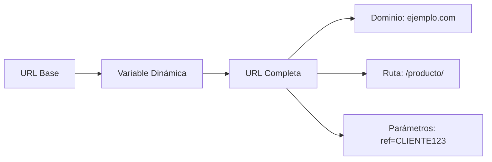
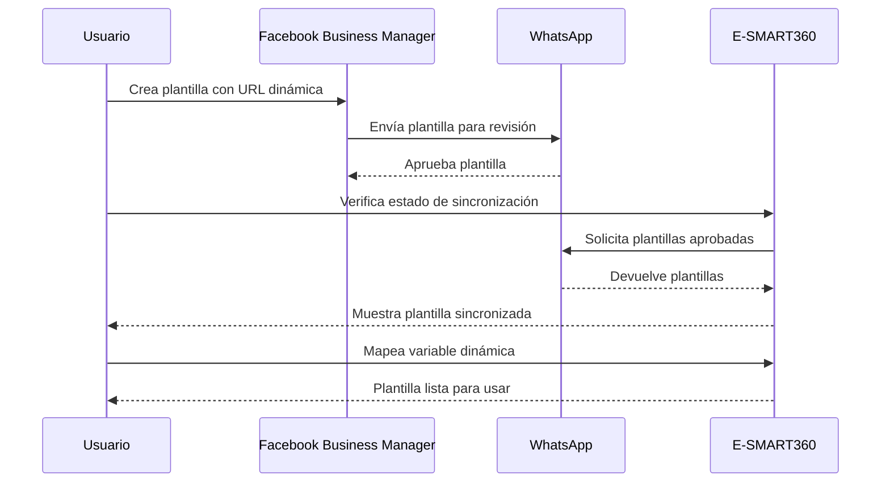
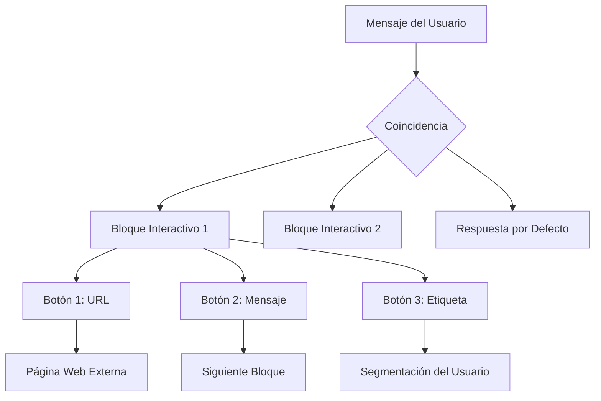
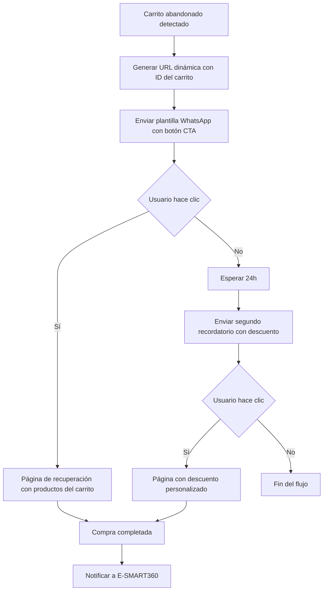

# URLs Dinámicas en Botones de Llamada a la Acción en Plantillas de Mensajes de WhatsApp


> La personalización es clave en el compromiso con el cliente. Las URLs dinámicas en botones de llamada a la acción (CTA) de WhatsApp permiten ajustar enlaces sobre la marcha, dirigiendo a cada usuario a páginas de aterrizaje personalizadas según sus características o acciones previas. Esta tecnología transforma la manera en que las empresas se comunican con sus audiencias, elevando la relevancia de cada interacción.

En el mundo digital actual, la personalización es fundamental para la interacción con los clientes. La plataforma de mensajería de WhatsApp soporta URLs dinámicas en botones de llamada a la acción (CTA), una innovación que permite a los especialistas en marketing ajustar los enlaces de los mensajes sobre la marcha. Las URLs dinámicas permiten dirigir a las personas a una página de aterrizaje personalizada o cambiar el contenido según la acción del usuario.

Esta guía describe los beneficios de las URLs dinámicas y muestra cómo crear plantillas de mensajes que utilicen URLs dinámicas, tanto a través de la interfaz de Facebook Business Manager como directamente desde E-SMART360. También exploraremos casos de uso avanzados, integraciones con otras herramientas y mejores prácticas para maximizar los resultados.

## Ventajas de las URLs Dinámicas

Los enlaces dinámicos mejoran las campañas de marketing en WhatsApp por varias razones fundamentales:


### Mayor Participación del Cliente

Las URLs dinámicas permiten que cada usuario tenga una experiencia única, lo que aumenta las probabilidades de que hagan clic y se conviertan. Cuando un cliente ve un enlace que contiene información relevante para él, es mucho más probable que interactúe. Las campañas con personalización dinámica pueden aumentar las tasas de clic hasta en un 40%.
  
### Gestión Simplificada de Plantillas

En lugar de crear plantillas específicas para cada URL diferente, una sola plantilla dinámica puede utilizarse para muchos grupos de usuarios distintos. Esto simplifica enormemente el mantenimiento y la actualización de las campañas, reduciendo la carga administrativa del equipo de marketing.
  
> **Ejemplo práctico:** Una URL base como `https://tutienda.com/oferta?ref=` seguida de un ID de usuario único permite rastrear qué cliente hizo clic y desde qué campaña, todo con una sola plantilla.

**Personalización de URLs:** Las URLs dinámicas son altamente personalizables. La URL principal permanece igual, pero la parte dinámica cambia según los parámetros específicos del usuario, proporcionando siempre información relevante. Esto significa que puedes tener una sola plantilla que se adapte a cada destinatario de forma individual.

**Optimización para analítica web:** Las URLs dinámicas bien estructuradas permiten un mejor seguimiento en herramientas de analítica web, ya que cada clic puede rastrearse con parámetros únicos que identifican la fuente, el medio y la campaña. La combinación de parámetros UTM con variables dinámicas te permite rastrear no solo qué usuario hizo clic, sino también desde qué campaña, qué mensaje y en qué momento, proporcionando una visibilidad completa del embudo de conversión.

## Arquitectura de las URLs Dinámicas

Para entender completamente cómo funcionan las URLs dinámicas, es importante comprender su estructura.



### Componentes de una URL Dinámica

| Componente | Descripción | Ejemplo |
|------------|-------------|---------|
| URL Base | Parte fija del enlace que no cambia | `https://tutienda.com/oferta?ref=` |
| Variable Dinámica | Valor único por usuario que se inserta en la URL | `USUARIO_456` |
| URL Completa | Combinación de la base más la variable | `https://tutienda.com/oferta?ref=USUARIO_456` |
| Parámetro UTM | Seguimiento de campaña para analítica | `&utm_source=whatsapp&utm_medium=cta` |

## Cómo Usar Facebook Business Manager para Crear Plantillas con URLs Dinámicas

### Paso 1: Crear la Plantilla

Accede al Administrador de Plantillas desde Facebook Business Manager y, en el caso de WhatsApp, selecciona el Administrador de Plantillas. Haz clic en "Nueva plantilla" para comenzar el proceso.


### Configurar la Plantilla

Selecciona el tipo de plantilla adecuado, como Marketing o Utilidad, y haz clic en el botón de personalizado.

    **Nombre y contenido:** Asigna un nombre claro y descriptivo a la plantilla. Redacta el mensaje que acompañará al botón.

    
> El nombre debe ser descriptivo pero conciso. WhatsApp requiere nombres que reflejen claramente el propósito de la plantilla para su aprobación. Evita nombres genéricos como "plantilla1" o "promo". Usa nombres como "promocion_bienvenida_dinamica" o "recuperacion_carrito_cliente".
    
### Agregar el Botón de Llamada a la Acción

Selecciona "Visitar sitio web" dentro de las opciones de botones disponibles. Esta opción solo está disponible para plantillas de tipo marketing y utilidad.

    Las opciones de botón disponibles son:
    - **Visitar sitio web:** Abre una URL externa
    - **Responder:** Envía una respuesta predefinida
    - **Llamar a número:** Inicia una llamada telefónica
  
### Configurar la URL Dinámica

Ingresa tu URL base en el campo correspondiente. Luego cambia el tipo de URL de "estática" a "dinámica". La URL base será el inicio del enlace y la parte dinámica se agregará mediante una variable.

    Proporciona una URL dinámica de muestra que muestre cómo se verá el enlace completo cuando la variable esté incluida. Por ejemplo: `https://tutienda.com/producto?_var_`.
  
### Enviar para Revisión

Una vez que hayas configurado todos los elementos, envía la plantilla para su revisión por parte de WhatsApp. La aprobación significa que tu mensaje cumple con los estándares y políticas de la plataforma.
  

> WhatsApp puede rechazar plantillas que contengan URLs que no coincidan con el dominio verificado de tu empresa. Asegúrate de que la URL base esté registrada y verificada en tu perfil de negocio de WhatsApp. Este es uno de los motivos más comunes de rechazo.

### Paso 2: Sincronización con E-SMART360

Una vez que tu plantilla ha sido aprobada por WhatsApp, el siguiente paso es sincronizarla con E-SMART360 para poder utilizarla en tus campañas.

Ve al Administrador de Bots de WhatsApp en E-SMART360 y haz clic en "Verificar estado" para sincronizar tu plantilla. El sistema detectará automáticamente las nuevas plantillas aprobadas y las importará a tu cuenta.




> La sincronización puede tardar unos minutos. Si la plantilla no aparece después de varios intentos, verifica que haya sido aprobada correctamente en Facebook Business Manager revisando el estado en el panel de administración de WhatsApp. También asegúrate de tener una conexión activa entre E-SMART360 y tu cuenta de WhatsApp Business.

### Mapeo de Variables

E-SMART360 mapea la variable dinámica automáticamente durante la sincronización. En caso de que no hayas creado la variable necesaria en tu cuenta, usa el Administrador de Variables para crear una nueva. El mapeo de la variable asegura que la parte dinámica de la URL se agregue correctamente al usar la plantilla con cada destinatario.


### Mapeo Automático

E-SMART360 detecta automáticamente las variables dinámicas de la plantilla durante la sincronización y las asigna a los campos personalizados disponibles en tu cuenta.

    **Ventajas:**
    - Sin configuración manual adicional
    - Detección inteligente del tipo de dato
    - Asignación automática al campo más compatible
  
### Mapeo Manual

Si necesitas una variable específica que no se mapeó automáticamente, usa el Administrador de Variables para crearla y asociarla manualmente a la plantilla.

    **Pasos:**
    1. Ve al Administrador de Variables
    2. Crea una nueva variable con el nombre deseado
    3. Selecciona el tipo de dato (texto, número, etc.)
    4. Asigna la variable al campo de URL dinámica
    5. Guarda los cambios
  
### Verificación

Después del mapeo, siempre verifica que la variable aparezca correctamente en la vista previa de la plantilla. Envía una prueba a un número de contacto para confirmar que la URL dinámica se genere adecuadamente.

    **Lista de verificación:**
    - Variable visible en la vista previa
    - URL base correcta sin errores tipográficos
    - Enlace funcional al hacer clic
    - Parámetros correctamente concatenados
  
### Finalizar Configuración

Ya tienes tu plantilla con las variables mapeadas y listas para usar. Si despliegas la plantilla a través del Chat en Vivo, Transmisiones o flujos de trabajo webhook, debes agregar los datos de la variable del usuario al insertar la plantilla. Esto asegura que cada destinatario reciba su enlace personalizado.


> **Recomendación importante:** Siempre realiza una prueba enviando la plantilla a un número de prueba antes de lanzarla a toda tu audiencia. Verifica que la URL dinámica se genere correctamente con los datos del destinatario. Una URL mal formada puede generar una mala experiencia de usuario y afectar la reputación de tu marca.

## Crear Plantillas con URLs Dinámicas Directamente desde E-SMART360

Crear plantillas con URLs dinámicas directamente desde E-SMART360 es un proceso sencillo y ágil. Sigue estos pasos detallados:


### Iniciar una Nueva Plantilla

En el Administrador de Bots de WhatsApp, selecciona la sección "Plantillas de mensajes" ubicada en el menú lateral y haz clic en el botón "Nuevo" para comenzar la creación.
  
### Configurar los Datos Generales

**Nombre y configuración regional:** Ingresa un nombre claro que describa el propósito de la plantilla. Selecciona la configuración regional adecuada para tu audiencia (por ejemplo, es_MX para español de México, es_ES para España).

    **Selección de categoría:** Elige entre plantilla de utilidad o marketing según el propósito de tu mensaje. Las plantillas de utilidad suelen aprobarse más rápido.

    **Encabezado y cuerpo:** Selecciona un tipo de encabezado (texto, imagen, video o documento) y escribe el cuerpo del mensaje con el contenido que deseas comunicar.
  
### Agregar el Botón de Llamada a la Acción

En la sección de botones, selecciona el tipo de botón "URL". Ingresa el texto que aparecerá en el botón (máximo 20 caracteres). Luego ingresa la URL base completa en el campo designado.
  
### Integrar la Variable Dinámica

Haz clic en el botón de variable (generalmente representado por un icono de llave o "{x}") junto al campo de URL para agregar la parte dinámica. Selecciona el campo personalizado que contiene los datos que deseas insertar. El valor de la variable seleccionada se adjuntará automáticamente después de la URL base cuando se envíe el mensaje.
  
### Guardar y Sincronizar

Guarda tu plantilla y haz clic en "Sincronizar plantilla". El sistema enviará la plantilla a WhatsApp para su revisión. Si es aceptada, tu plantilla estará activa en todas tus campañas y podrás comenzar a usarla inmediatamente.
  

> **Importante:** No olvides que las plantillas deben ser aprobadas por WhatsApp antes de poder usarlas en campañas masivas. El proceso de revisión puede tomar desde unas horas hasta varios días dependiendo de la demanda. Planifica tus campañas con anticipación para evitar retrasos.

E-SMART360 te notificará cuando la plantilla sea aprobada o rechazada. Si es rechazada, recibirás información detallada sobre los motivos para que puedas corregirla y reenviarla sin tener que empezar desde cero.

### Comparativa: Creación Directa vs Facebook Business Manager

| Aspecto | Facebook Business Manager | E-SMART360 (Directo) |
|---------|--------------------------|----------------------|
| Curva de aprendizaje | Media | Baja |
| Configuración de variables | Manual | Mapeo automático |
| Sincronización | Paso separado | Integrada en el flujo |
| Gestión de rechazos | Notificaciones en Meta | Notificaciones en E-SMART360 |
| Velocidad de implementación | Lenta (varios pasos) | Rápida (todo en uno) |

## Conceptos Básicos del Chatbot con Bloques Interactivos

Un chatbot funciona respondiendo a los mensajes de los usuarios según acciones predefinidas. Cada flujo de chatbot consta de bloques, que son mensajes estructurados que contienen texto, botones u otros elementos interactivos.



### ¿Qué Son los Botones Interactivos?

Los botones interactivos son una característica clave de los chatbots. Permiten a los usuarios participar tocando opciones predefinidas en lugar de escribir respuestas manualmente. Estos botones mejoran la experiencia del usuario al reducir la fricción en la interacción y optimizan las conversaciones automatizadas al eliminar la ambigüedad de las respuestas escritas.


### Botones de Respuesta Rápida

Ideales para encuestas, confirmaciones y navegación simple. El usuario elige entre opciones predefinidas.

    **Ejemplos:**
    - Sí / No
    - Ver catálogo
    - Hablar con un agente
    - Recibir ofertas
  
### Botones con URL

Perfectos para dirigir tráfico a sitios web externos, páginas de producto o promociones.

    **Ejemplos:**
    - Comprar ahora
    - Ver promoción
    - Reservar cita
    - Descargar guía
  
## Configuración de un Bloque Interactivo Paso a Paso

1. Inicia sesión en tu cuenta de E-SMART360 con tus credenciales.
2. Navega al panel de Administrador de Bots y selecciona "Respuesta del bot", luego haz clic en "Crear" para iniciar un nuevo flujo.
3. Dentro del editor visual de flujos, toca dos veces en el bloque de inicio del flujo para editar la pestaña "Configurar Referencia".
4. Escribe el título del flujo del bot, por ejemplo "Bienvenida_clientes_nuevos" o "Oferta_personalizada". Selecciona el tipo de coincidencia como "coincidencia de cadena" (string match). Guarda los cambios.
5. Desde el bloque de inicio, arrastra y suelta el conector hacia un nuevo bloque vacío y selecciona "Bloque Interactivo" del menú de opciones.

### Personalización de Elementos del Mensaje

Una vez creado el bloque interactivo, puedes personalizar los siguientes elementos:

1. **Descripción:** Escribe una descripción que explique el contexto del mensaje interactivo. Esto es interno y no se muestra al usuario final.
2. **Cuerpo del mensaje:** Personaliza el texto principal con las opciones de personalización disponibles, como el nombre del usuario usando variables como `{nombre}` o `{apellido}`.
3. **Pie de página:** Agrega un pie de página opcional (por ejemplo, "Equipo E-SMART360" o "Responde con el número de tu opción").
4. **Retardo de mensaje:** Establece un retardo opcional (1-5 segundos) para simular un tiempo de respuesta más natural y humano.


> El retardo de mensaje simula el tiempo de escritura humano, haciendo que la interacción se sienta más natural y menos robótica. Recomendamos 1-3 segundos dependiendo de la longitud del mensaje. Para mensajes cortos, 1 segundo es suficiente; para mensajes más largos o cuando se muestran varias opciones, considera 2-3 segundos.

### Agregar Botones a un Bloque Interactivo

1. Dentro del bloque interactivo, haz clic en "Agregar Botón". Puedes agregar hasta tres botones por cada bloque interactivo según las limitaciones de WhatsApp.
2. Nombra cada botón de forma concisa y descriptiva (por ejemplo, "Comenzar", "Más información", "Comprar ahora", "Ver catálogo", "Hablar con agente").
3. Asegúrate de que el texto del botón esté dentro del límite de 20 caracteres permitido para evitar errores de validación.


> **Límite importante:** Los botones de respuesta rápida de WhatsApp tienen un límite de 20 caracteres para el texto mostrado. Si tu texto excede este límite, la plantilla o el bloque será rechazado por la plataforma. Sé conciso y directo. En lugar de "Me gustaría recibir más información sobre sus productos", usa "Más información".

### Configuración de Acciones de los Botones

Cada botón puede desencadenar diferentes tipos de acciones. Las principales opciones disponibles son:

| Acción | Descripción | Cuándo Usarla |
|--------|-------------|---------------|
| Enviar Mensaje | Muestra un nuevo mensaje predefinido | Información adicional, continuación de flujo |
| Asignar Etiqueta | Clasifica automáticamente a los usuarios | Segmentación para campañas futuras |
| Inscribir en Secuencia | Agrega usuarios a una secuencia de mensajes | Nurturing de leads, follow-ups |
| URL Externa | Redirige a una página web | Tráfico a sitio web, conversiones |

**Enviar Mensaje:** Muestra un nuevo mensaje predefinido cuando el usuario hace clic en el botón. Útil para proporcionar información adicional o continuar la conversación de forma estructurada.

**Asignar Etiqueta:** Clasifica automáticamente a los usuarios según su interacción con cada botón. Permite segmentar la audiencia para campañas futuras y personalizar aún más las comunicaciones.

**Inscribir en Secuencia:** Agrega usuarios a una secuencia de mensajes de seguimiento automatizados. Ideal para nurturing de leads y campañas de marketing automatizado.


> **Estrategia recomendada:** Combina "Asignar Etiqueta" con "Inscribir en Secuencia" para crear flujos automatizados completos. Por ejemplo, cuando un usuario hace clic en "Quiero ofertas", asígnale la etiqueta "Interesado_en_ofertas" e inscríbelo automáticamente en una secuencia de 5 mensajes con promociones semanales.

### Gestión de Respuestas y Etiquetas de Usuario

Utiliza las etiquetas para segmentar a los usuarios según las opciones que seleccionan en los botones. Esto te permitirá enviar campañas más relevantes en el futuro, aumentando la efectividad de cada comunicación.

Si es necesario, puedes cancelar la suscripción de los usuarios a secuencias específicas una vez que completen una acción determinada o cuando ya no sea relevante para ellos.

Asigna conversaciones a miembros específicos del equipo para realizar seguimientos manuales cuando la interacción lo requiera, por ejemplo, cuando un cliente selecciona "Hablar con un agente".

### Seguimiento de Interacciones mediante Google Sheets y Webhooks

1. Configura una integración de Google Sheets para almacenar automáticamente todas las interacciones de los usuarios con los botones, incluyendo qué botón presionaron, cuándo, y desde qué flujo del chatbot.
2. Utiliza webhooks para enviar datos de interacciones a sistemas CRM externos como HubSpot, Salesforce o Zoho, permitiendo un seguimiento centralizado de todas las actividades del cliente.


> El seguimiento de interacciones te permite analizar qué botones tienen mejor rendimiento, qué rutas siguen los usuarios dentro del flujo, y en qué puntos abandonan la conversación. Estos datos son esenciales para optimizar continuamente tus campañas y mejorar las tasas de conversión. Programa revisiones periódicas de estos datos (por ejemplo, cada semana o cada mes).

### Creación de Flujos de Chatbot Multi-Paso

Para crear conversaciones más complejas y estructuradas que guíen al usuario paso a paso:

1. Haz clic derecho en cualquier bloque existente y usa la función "Clonar" para duplicarlo y luego modificarlo según sea necesario. Esto ahorra tiempo cuando varios bloques comparten una estructura similar.
2. Agrega bloques interactivos dentro de otros bloques para crear conversaciones anidadas y estructuradas jerárquicamente, donde cada respuesta del usuario abre nuevas opciones.
3. Configura botones dentro de cada bloque para que los usuarios puedan navegar entre diferentes opciones y rutas de conversación.
4. Es importante cerrar cada bloque de botones con un bloque de texto final, ya que los bloques interactivos no pueden quedarse sin una acción de cierre. Cada botón debe llevar a algún lugar.

### Prueba de tus Botones CTA

1. Interactúa directamente con el chatbot desde la vista previa integrada en E-SMART360 para asegurarte de que todos los botones funcionen correctamente y los flujos sean los esperados.
2. Verifica que las etiquetas y secuencias se asignen correctamente en el perfil del usuario de prueba después de cada interacción.
3. Prueba todos los caminos posibles del flujo para identificar errores antes de publicar.


> Nunca publiques un flujo de chatbot sin probarlo completamente. Un botón roto o un flujo incorrecto puede generar una mala experiencia de usuario y afectar la percepción de tu marca. Dedica al menos 15-20 minutos a probar todas las rutas posibles.

## Aplicaciones Prácticas y Casos de Uso Reales

### Escenarios donde las URLs Dinámicas son Más Efectivas

**Campañas Personalizadas:** Insertar IDs de usuario o códigos de campaña en páginas de aterrizaje y ofertas especiales para personalizarlas individualmente. Esto permite un seguimiento preciso de cada conversión.


> **Ejemplo real:** Una tienda de ropa envía una plantilla con una URL dinámica que incluye el ID del cliente. Al hacer clic, el cliente llega a una página con productos recomendados basados en sus compras anteriores y un código de descuento único aplicado automáticamente. Las tasas de conversión aumentaron un 35% con esta estrategia, y el valor promedio del pedido se incrementó en un 18%.

**Marketing Segmentado:** Evita el uso de múltiples plantillas estáticas proporcionando diferentes URLs según la demografía del usuario, ubicación geográfica, historial de compras o interacciones previas. Una sola plantilla dinámica puede servir a todos los segmentos.

**Pruebas A/B:** Rota parámetros dinámicos para probar diferentes páginas de aterrizaje, ofertas o estrategias promocionales sin tener que cambiar toda la configuración de la campaña. Simplemente cambia el valor de la variable y compara resultados.

### Ejemplo: Campaña de Recuperación de Carritos Abandonados



1. El sistema detecta un carrito abandonado en la tienda.
2. E-SMART360 genera una URL dinámica con el ID del carrito: `https://tutienda.com/recuperar-carrito?id=ID_CARRITO`
3. Se envía un mensaje de WhatsApp con un botón "Recuperar mi carrito".
4. Al hacer clic, el usuario ve exactamente los productos que dejó pendientes.
5. Si no hay clic en 24 horas, se envía un segundo mensaje con un descuento adicional.

### Integración con WhatsApp Flows

E-SMART360 ofrece integración completa con WhatsApp Flows, que permite crear formularios interactivos nativos dentro de los chats de WhatsApp. Combinado con URLs dinámicas, puedes crear experiencias de usuario completas sin que el usuario salga de la aplicación:

1. Envía un botón CTA que lleve al usuario a un formulario de registro automatizado.
2. Captura los datos del usuario mediante WhatsApp Flows sin que salga de la aplicación.
3. Utiliza esos datos capturados para personalizar la URL dinámica del siguiente mensaje en la secuencia.
4. Genera un enlace único basado en las respuestas del formulario.


> La combinación de WhatsApp Flows + URLs dinámicas crea un embudo de conversión completo sin que el usuario salga de WhatsApp en ningún momento, lo que reduce la fricción y aumenta significativamente las tasas de finalización de formularios. Las tasas de conversión pueden duplicarse en comparación con los formularios web tradicionales.

## Mejores Prácticas y Solución de Problemas

### Mejores Prácticas Recomendadas

**URL Base Consistente:** Utiliza la misma URL base para todas las plantillas relacionadas, manteniendo solo el segmento dinámico como variable. Esto facilita la gestión y el mantenimiento de las plantillas a largo plazo.

**Pruebas Exhaustivas:** Las plantillas de mensajes deben probarse exhaustivamente antes de lanzar cualquier campaña. Envía la plantilla a varios números de prueba con diferentes valores de variable para confirmar que la URL dinámica se genere correctamente en todos los casos.

**Nombres de Variables Claros:** Utiliza nombres de variables descriptivos y fáciles de entender para facilitar el mapeo, especialmente cuando trabajas en equipo. Nombres como `producto_id`, `codigo_descuento` o `nombre_usuario` son mucho más útiles que `var1`, `var2` o `x`.

**Monitoreo de Rendimiento:** Monitorea regularmente las tasas de clic, conversiones y otras métricas relevantes para evaluar la efectividad de tus URLs dinámicas. Realiza ajustes basados en los datos obtenidos en tiempo real para optimizar continuamente los resultados.

### Errores Comunes y Soluciones

| Error | Causa Probable | Solución |
|-------|----------------|----------|
| La URL dinámica no se genera | Variable no mapeada correctamente | Verifica el mapeo en el Administrador de Variables |
| Plantilla rechazada por WhatsApp | URL base no coincide con dominio verificado | Registra y verifica el dominio en Meta Business |
| Botón no aparece en el mensaje | Plantilla no sincronizada después de aprobación | Forzar sincronización desde E-SMART360 |
| Variable aparece vacía en la URL | El contacto no tiene valor para ese campo | Poblar los campos personalizados de los contactos |
| Exceso de caracteres en botón | Texto del botón mayor a 20 caracteres | Acortar el texto a 20 caracteres máximo |
| Sincronización retrasada | Problemas temporales de conexión | Esperar unos minutos y reintentar |
| Error de coincidencia de variables | Tipo de dato incorrecto | Verificar que el tipo de dato coincida con la variable |

### Seguridad y Privacidad

Al utilizar URLs dinámicas, es importante considerar los siguientes aspectos de seguridad:

1. No incluir información sensible en las URLs dinámicas (como contraseñas, datos bancarios o información médica).
2. Usar HTTPS en todas las URLs base para garantizar conexiones seguras.
3. Implementar validación en el servidor para verificar que los parámetros recibidos son legítimos.
4. Establecer expiración para las URLs que contienen datos sensibles o temporales.


> Las URLs quedan registradas en los servidores de WhatsApp y pueden ser visibles en el historial de chat del usuario. Nunca incluyas contraseñas, tokens de acceso permanente o información financiera completa en las URLs dinámicas.

## Guía Rápida para tu Primera Campaña


### Define tu objetivo

¿Qué acción quieres que realice el usuario? Las opciones comunes incluyen: realizar una compra, registrarse en un formulario, descargar un recurso, agendar una cita o visitar una página promocional.
  
### Prepara tus datos

Asegúrate de tener los campos personalizados necesarios en E-SMART360 con datos válidos para cada contacto. Sin datos poblados, la variable dinámica no tendrá valor que insertar.
  
### Crea la plantilla

Sigue los pasos de esta guía para crear tu plantilla con URL dinámica, ya sea desde Facebook Business Manager o directamente desde E-SMART360.
  
### Prueba y verifica

Envía la plantilla a varios números de prueba con diferentes valores de variable. Confirma que las URLs se generen correctamente en cada caso.
  
### Lanza la campaña

Programa el envío a través de Transmisiones o flujos automatizados. Monitorea los resultados desde el panel de control de E-SMART360.
  
### Analiza y optimiza

Revisa las métricas de clic y conversión. Ajusta variables, textos o URLs base según los resultados obtenidos. Realiza pruebas A/B para mejorar continuamente.
  
## Preguntas Frecuentes


### ¿Qué hace una URL dinámica en un botón de llamada a la acción de WhatsApp?

Una URL dinámica es un enlace en el que parte de la dirección web es única para cada usuario individual, mientras que la parte base permanece igual para todos. Esto permite que cada destinatario reciba un enlace personalizado, por ejemplo, con su ID de cliente, código de descuento único o identificador de campaña incluido automáticamente en la URL al enviar el mensaje.

### ¿Cómo mejoran las URLs dinámicas las campañas de marketing en WhatsApp?

Con las URLs dinámicas, cada usuario recibe enlaces personalizados según sus datos almacenados en E-SMART360, lo que genera mayores tasas de participación y clics. Al dirigir a cada persona a contenido relevante para ella específicamente (productos recomendados, ofertas exclusivas, páginas personalizadas), la experiencia de usuario mejora significativamente y las tasas de conversión aumentan de forma considerable, llegando a incrementarse hasta un 40% en algunos casos documentados.

### ¿Cuál es la diferencia principal entre URLs estáticas y dinámicas?

Una URL estática permanece exactamente igual para todos los destinatarios del mensaje, mostrando la misma página web a todas las personas sin distinción. En cambio, una URL dinámica cambia según la información variable que se agregue a la URL base, permitiendo que cada usuario vea contenido diferente y personalizado según sus características, historial

de compras, ubicación geográfica o acciones previas dentro de la conversación.

### ¿Cómo crear una plantilla con URL dinámica en Facebook Business Manager?

Comienza iniciando sesión en Facebook Business Manager y accede al Administrador de Plantillas de WhatsApp. Crea una nueva plantilla, selecciona el tipo de categoría (Marketing o Utilidad), agrega un botón "Visitar sitio web" y configura el tipo de URL como "dinámica". Ingresa tu URL base completa, proporciona una URL de muestra con la variable indicada, completa los demás campos requeridos y envía la plantilla para su revisión por parte de WhatsApp.

### ¿Qué pasos completos implica configurar una URL dinámica en WhatsApp?

El proceso completo incluye: 1) Crear la plantilla en Facebook Business Manager con el tipo de URL dinámica, 2) Esperar la aprobación de WhatsApp (puede tomar de horas a días), 3) Sincronizar la plantilla aprobada con E-SMART360 desde el panel de administración, 4) Mapear las variables dinámicas a los campos personalizados correspondientes, 5) Verificar el mapeo mediante pruebas, 6) Utilizar la plantilla en tus campañas asegurándote de que los contactos tengan datos poblados para las variables.

### ¿Cómo sincronizar una plantilla ya aprobada con E-SMART360?

Después de recibir la aprobación de WhatsApp para tu plantilla, inicia sesión en E-SMART360 y navega al Administrador de Bots de WhatsApp. Presiona el botón "Verificar estado" para buscar nuevas plantillas aprobadas y pendientes de sincronización. El sistema importará automáticamente las plantillas encontradas y luego podrás seguir el proceso para asociar las variables dinámicas y comenzar a usarlas en tus campañas.

### ¿Qué hacer si la URL dinámica no tiene ninguna variable asociada?

Si la plantilla se sincronizó pero la variable dinámica no tiene un campo asignado, debes crear la variable manualmente. Utiliza el Administrador de Variables en E-SMART360 para crear la variable necesaria con el nombre y tipo de dato correcto (texto, número, etc.). Luego asígnala manualmente a la plantilla desde la sección de configuración de variables. Finalmente, verifica que los contactos tengan datos poblados para esa variable antes de enviar.

### ¿Se pueden crear plantillas con URLs dinámicas directamente desde E-SMART360?

Sí, absolutamente. E-SMART360 te permite crear plantillas completas con URLs dinámicas sin necesidad de usar Facebook Business Manager. Puedes iniciar una nueva plantilla directamente desde el Administrador de Bots de WhatsApp, configurar todos los parámetros incluyendo el nombre, categoría, cuerpo del mensaje, y la URL dinámica con sus variables. Luego guardas y sincronizas la plantilla con WhatsApp para su revisión, todo sin salir de la plataforma.

### ¿En qué tipos de campañas funcionan mejor las URLs dinámicas?

Las URLs dinámicas son especialmente efectivas en: campañas personalizadas de marketing con ofertas únicas por cliente, anuncios con diferentes páginas de aterrizaje según el segmento de audiencia, contenido dirigido a diferentes grupos demográficos, campañas de recuperación de carritos abandonados, follow-ups post-venta personalizados, programas de fidelización con recompensas individuales, y campañas de cumpleaños o fechas especiales con descuentos personalizados.

### ¿Cómo usar el componente variable de una URL para campañas empresariales?

La parte variable de la URL se puede modificar dinámicamente para enviar a cada usuario a la página correspondiente según sus datos almacenados. Por ejemplo, añadiendo parámetros como `?utm_source=whatsapp&campaign=verano&user_id=12345&coupon=DESC20` puedes rastrear el origen exacto de cada visita, medir el rendimiento de cada campaña individualmente, y ofrecer códigos de descuento únicos por usuario para evitar uso fraudulento.

### ¿Cómo asegurar que la URL base permanezca inalterable durante la configuración?

Configura tu URL base correctamente durante la creación inicial de la plantilla y verifica que solo la parte variable esté marcada como dinámica. Durante las pruebas, envía la plantilla a varios números de prueba con diferentes valores de variable para confirmar que la URL base se mantiene constante y solo cambia la parte dinámica. Si detectas variaciones en la URL base, revisa la configuración de la variable.

### ¿Qué hacer si la URL dinámica no funciona correctamente en producción?

Realiza una verificación sistemática: 1) Revisa el mapeo de variables en busca de errores de configuración, 2) Verifica que la URL base sea correcta y esté accesible públicamente, 3) Comprueba que los datos de los destinatarios contengan valores válidos y no estén vacíos para las variables utilizadas, 4) Revisa los logs de la campaña para identificar errores, 5) Consulta la documentación de soporte de E-SMART360 para obtener guías detalladas de solución de problemas específicos.

### ¿Se pueden usar URLs dinámicas en todos los tipos de plantillas de WhatsApp?

Sí, las URLs dinámicas se pueden integrar en todos los tipos de plantillas de mensajes de WhatsApp que admitan botones CTA de tipo URL, incluyendo las categorías de marketing, utilidad, servicio al cliente y autenticación. Cada categoría tiene sus propias reglas y restricciones adicionales en cuanto a frecuencia de envío y horarios, pero la funcionalidad de URL dinámica está disponible en todas ellas.

### ¿Cómo ayudan las URLs dinámicas a gestionar diferentes segmentos de usuarios?

Permiten enviar mensajes donde el enlace se adapta automáticamente según los datos específicos de cada destinatario, permitiendo una comunicación altamente dirigida sin necesidad de crear múltiples plantillas separadas. Una sola plantilla dinámica puede servir simultáneamente para clientes nuevos, recurrentes, VIP, segmentados por ubicación geográfica, historial de compras, intereses o cualquier otro campo personalizado configurado en E-SMART360.

### ¿Cuánto tiempo tarda la aprobación de una plantilla con URL dinámica?

El tiempo de aprobación varía según la demanda actual de WhatsApp y la calidad de tu plantilla. Generalmente puede tomar desde 2 horas hasta 5 días hábiles. Las plantillas de categoría "utilidad" suelen aprobarse más rápido que las de "marketing". Para agilizar el proceso, asegúrate de que tu nombre de plantilla sea descriptivo, tu URL base coincida con un dominio verificado, y tu contenido cumpla con todas las políticas de WhatsApp. Planifica tus campañas con al menos una semana de anticipación.

### ¿Puedo usar múltiples variables en una misma URL dinámica?

Sí, es posible incluir múltiples variables en una misma URL dinámica siempre que WhatsApp lo permita en la configuración de la plantilla. Por ejemplo: `https://tutienda.com/personalizar?usuario=ID1&campana=CAMP1&producto=P123`. Cada variable debe estar correctamente mapeada a su campo personalizado correspondiente en E-SMART360 y verificada individualmente durante las pruebas.

### ¿Las URLs dinámicas funcionan con botones de imagen o solo con texto?

Las URLs dinámicas funcionan exclusivamente en botones de tipo "Visitar sitio web" (URL). No están disponibles para botones de respuesta rápida o listas interactivas. Sin embargo, el botón URL puede combinarse con otros tipos de botones en el mismo mensaje para ofrecer múltiples opciones al usuario. El mensaje puede incluir además encabezados multimedia como imágenes o videos para enriquecer la experiencia visual.

### ¿Qué tipos de variables se pueden usar en las URLs dinámicas?

Puedes usar cualquier campo personalizado configurado en E-SMART360: nombres, IDs de cliente, códigos de producto, números de orden, códigos promocionales, ubicaciones, preferencias de idioma, o cualquier otro dato que hayas almacenado en los perfiles de tus contactos. Las variables de tipo texto son las más comunes, pero también funcionan variables numéricas y alfanuméricas.

### ¿Cómo afecta el uso de URLs dinámicas a la tasa de entrega de mensajes?

Las URLs dinámicas no afectan negativamente las tasas de entrega de los mensajes de WhatsApp. Sin embargo, si la plantilla contiene errores de configuración o las variables no están correctamente mapeadas, el mensaje puede fallar al enviarse. Es importante realizar pruebas exhaustivas para asegurar que todos los componentes funcionen correctamente antes de lanzar campañas masivas.

### ¿Se pueden usar URLs dinámicas en campañas de broadcasting masivo?

Sí, las URLs dinámicas funcionan perfectamente en campañas de broadcasting masivo. Al enviar un mensaje a miles de contactos, cada destinatario recibirá su URL personalizada según los datos almacenados en su perfil. Esto permite ejecutar campañas altamente personalizadas a gran escala sin necesidad de segmentar manualmente ni crear plantillas individuales para cada grupo.

### ¿Qué sucede si un contacto no tiene valor para la variable de la URL dinámica?

Si un contacto no tiene valor para la variable configurada, la URL se enviará incompleta, mostrando solo la parte base sin el parámetro dinámico. Esto puede generar enlaces rotos o páginas web incorrectas. Para evitar esto, asegúrate de que todos los contactos en tu lista de envío tengan los campos personalizados correspondientes debidamente poblados antes de ejecutar la campaña.

### ¿Cómo integrar URLs dinámicas con bots de respuesta automática?

Puedes incluir URLs dinámicas en los bloques interactivos de tus bots de respuesta automática en E-SMART360. Al configurar un botón de tipo URL dentro de un bloque interactivo, selecciona la variable deseada para que se inserte automáticamente en el enlace. Esto permite que el chatbot envíe enlaces personalizados en tiempo real durante las conversaciones automatizadas.

## Conclusión Final

Los botones CTA con URLs dinámicas representan una herramienta poderosa para personalizar y optimizar los esfuerzos de marketing en WhatsApp. Siguiendo los pasos detallados en esta guía, podrás crear plantillas de mensajes flexibles que se adapten a las necesidades individuales de cada usuario, aumentando significativamente las tasas de participación y conversión.


> A medida que las plataformas de mensajería evolucionan, la integración de URLs dinámicas se está convirtiendo en un elemento imprescindible para el éxito del marketing digital. Adoptar esta tecnología hoy te dará una ventaja competitiva significativa frente a quienes aún utilizan plantillas estáticas tradicionales. Las URLs dinámicas no solo mejoran la experiencia del usuario, sino que también proporcionan datos valiosos para la optimización continua de campañas.

### Resumen Rápido

| Elemento | Descripción |
|----------|-------------|
| URL Base | Parte fija del enlace que no cambia entre destinatarios |
| Variable Dinámica | Parte del enlace que se personaliza por usuario |
| Plantilla | Estructura del mensaje que contiene el botón CTA |
| Sincronización | Proceso de importar la plantilla aprobada a E-SMART360 |
| Mapeo | Asignación de la variable dinámica al campo personalizado |
| Aprobación | Revisión de WhatsApp para verificar cumplimiento de políticas |

### ¿Listo para Comenzar?

Inicia sesión en tu cuenta de E-SMART360 y dirígete al Administrador de Bots de WhatsApp para crear tu primera plantilla con URL dinámica. El equipo de soporte está disponible para ayudarte en cada paso del proceso.


> **Novedad: Mejoras en URLs Dinámicas (2026-05-07)**
> E-SMART360 ha mejorado su integración con WhatsApp Business API para soportar URLs dinámicas en todos los tipos de plantillas aprobadas. Ahora es posible usar variables dinámicas tanto en el cuerpo del mensaje como en los botones CTA simultáneamente, ofreciendo una personalización sin precedentes. También se ha mejorado el tiempo de sincronización, que ahora es hasta un 50% más rápido.

## Apéndice: Patrones de Implementación Avanzada

### Patrón 1: URLs Dinámicas con Parámetros de Segmentación

Cuando trabajas con audiencias segmentadas, puedes estructurar las URLs dinámicas para incluir múltiples niveles de personalización:

```
URL Base: https://tutienda.com/landing
Parámetros dinámicos: ?fuente=WHATSAPP&segmento=VIP&id_usuario=ID123&campana=PRIMAVERA2026
URL Completa: https://tutienda.com/landing?fuente=WHATSAPP&segmento=VIP&id_usuario=ID123&campana=PRIMAVERA2026
```

Este patrón permite que la página de destino reciba toda la información necesaria para personalizar completamente la experiencia del usuario, desde el mensaje de bienvenida hasta las ofertas mostradas.

### Patrón 2: URLs Dinámicas para Seguimiento de Conversiones

Para medir con precisión el retorno de inversión de tus campañas:

```
URL Base: https://tutienda.com/confirmacion
Parámetros: ?orden=ORD12345&monto=4500&cupon=CUPON20
URL Completa: https://tutienda.com/confirmacion?orden=ORD12345&monto=4500&cupon=CUPON20
```

Este patrón es ideal para páginas de confirmación de compra, agendamiento de citas o registro exitoso, donde necesitas saber exactamente qué acción realizó cada usuario.

### Patrón 3: URLs Dinámicas con Códigos de Descuento Únicos

Para campañas promocionales donde cada usuario recibe un código de descuento diferente:

```
URL Base: https://tutienda.com/canje
Parámetros: ?codigo=BIENVENIDA_USUARIO123&expiracion=20260630
URL Completa: https://tutienda.com/canje?codigo=BIENVENIDA_USUARIO123&expiracion=20260630
```

Los códigos de descuento únicos evitan el uso fraudulento y permiten rastrear exactamente qué usuario utilizó su cupón, proporcionando datos valiosos sobre el comportamiento de compra.

## Integración con Plataformas de Comercio Electrónico

### WooCommerce

E-SMART360 se integra nativamente con WooCommerce para generar URLs dinámicas basadas en datos de productos y clientes:

1. Configura la integración de WooCommerce en E-SMART360.
2. Crea una plantilla de mensaje con un botón CTA que incluya el ID del producto como variable dinámica.
3. Cuando un usuario solicita información sobre un producto, el sistema genera automáticamente la URL personalizada con los detalles del producto específico.
4. El cliente recibe un enlace directo a la página del producto en tu tienda WooCommerce.

### Shopify

La integración con Shopify permite recuperar carritos abandonados y generar URLs dinámicas para cada cliente:

1. Conecta tu tienda Shopify con E-SMART360 mediante la integración nativa.
2. Configura un flujo de webhook que detecte carritos abandonados.
3. Genera una URL dinámica que incluya el ID del carrito y un código de descuento único.
4. Envía el mensaje automatizado con el botón CTA personalizado.


> **Caso de éxito:** Una tienda Shopify que implementó URLs dinámicas para recuperación de carritos abandonados logró recuperar el 28% de las ventas perdidas en los primeros 30 días, con un incremento del 15% en el valor promedio del pedido.

### Dashboard de Métricas y KPIs

Al implementar URLs dinámicas, es fundamental medir los siguientes indicadores clave de rendimiento:

| KPI | Descripción | Métrica de Éxito |
|-----|-------------|------------------|
| Click-Through Rate (CTR) | Porcentaje de usuarios que hacen clic en el botón CTA | Superior al 15% |
| Tasa de Conversión | Porcentaje de clics que completan la acción deseada | Superior al 10% |
| Tasa de Rebote | Usuarios que abandonan la página de destino inmediatamente | Inferior al 30% |
| Ingreso por Campaña | Valor total generado por cada campaña con URLs dinámicas | Variable según industria |
| ROI de Campaña | Retorno de inversión de la campaña | Superior a 3:1 |

## Ejemplos de Mensajes con URLs Dinámicas

### Ejemplo 1: Bienvenida Personalizada

Mensaje:
"Hola {nombre}, ¡gracias por registrarte en nuestra tienda! Como bienvenida, tenemos una oferta especial para ti. Haz clic en el botón para descubrir tus productos recomendados."

Botón: "Ver mis ofertas"
URL Dinámica: `https://tutienda.com/bienvenida?cliente=ID123&recomendacion=CATEQ`

### Ejemplo 2: Seguimiento Post-Compra

Mensaje:
"Gracias por tu compra, {nombre}. Tu pedido #{orden} está siendo procesado. Haz clic para dar seguimiento a tu envío."

Botón: "Rastrear pedido"
URL Dinámica: `https://tutienda.com/rastreo?orden=ORD12345&cliente=ID123`

### Ejemplo 3: Oferta por Cumpleaños

Mensaje:
"¡Feliz cumpleaños, {nombre}! 🎂 Para celebrarlo, te regalamos un {descuento}% de descuento en tu próxima compra. Válido hasta el {fecha_expiracion}."

Botón: "Reclamar mi regalo"
URL Dinámica: `https://tutienda.com/cumpleanos?cliente=ID123&cupon=FELIZCUMPLE&descuento=20`

## Automatización de URLs Dinámicas con Webhooks

Los webhooks de E-SMART360 permiten automatizar completamente la generación de URLs dinámicas basadas en eventos externos:

1. Configura un webhook entrante en E-SMART360 para recibir datos desde tu sistema CRM, ERP o plataforma de e-commerce.
2. El webhook recibe los datos del usuario y los parámetros necesarios para la URL dinámica.
3. E-SMART360 procesa los datos y activa el envío de la plantilla con la URL dinámica correspondiente.
4. El sistema registra automáticamente la interacción para su posterior análisis.


> Los webhooks permiten integrar E-SMART360 con prácticamente cualquier sistema externo, desde CRMs como HubSpot y Salesforce hasta plataformas de automatización como Zapier y Make. Esto abre un mundo de posibilidades para la personalización automatizada de URLs dinámicas.

## Glosario de Términos

| Término | Definición |
|---------|------------|
| CTA (Call to Action) | Elemento interactivo que invita al usuario a realizar una acción específica |
| URL Dinámica | Enlace web que contiene partes variables según los datos del usuario |
| Variable | Campo de datos que se inserta dinámicamente en una URL o mensaje |
| Plantilla | Estructura de mensaje predefinida aprobada por WhatsApp |
| Sincronización | Proceso de importar plantillas desde WhatsApp a E-SMART360 |
| Segmentación | División de la audiencia en grupos según características comunes |
| Conversión | Acción deseada que completa un usuario (compra, registro, etc.) |
| Parámetro UTM | Etiquetas en URLs para rastrear tráfico de campañas |
| Webhook | Mecanismo para enviar datos automáticos entre sistemas |
| Mapeo de Variables | Asignación de campos de datos a variables dentro de plantillas |

## Notas de Versión y Actualizaciones Recientes

### Versión 2.1 - Mayo 2026
- Soporte mejorado para URLs dinámicas con múltiples variables
- Reducción del tiempo de sincronización en un 50%
- Nueva interfaz de mapeo de variables intuitiva
- Compatibilidad ampliada con WhatsApp Flows

### Versión 2.0 - Enero 2026
- Lanzamiento de la creación directa de plantillas desde E-SMART360
- Soporte para URLs dinámicas en todas las categorías de plantillas
- Integración nativa con WhatsApp Flows
- Dashboard de métricas en tiempo real

### Versión 1.0 - Septiembre 2025
- Soporte inicial para URLs dinámicas en botones CTA
- Sincronización básica con Facebook Business Manager
- Mapeo automático de variables durante la sincronización
- Compatibilidad con plantillas de marketing y utilidad
