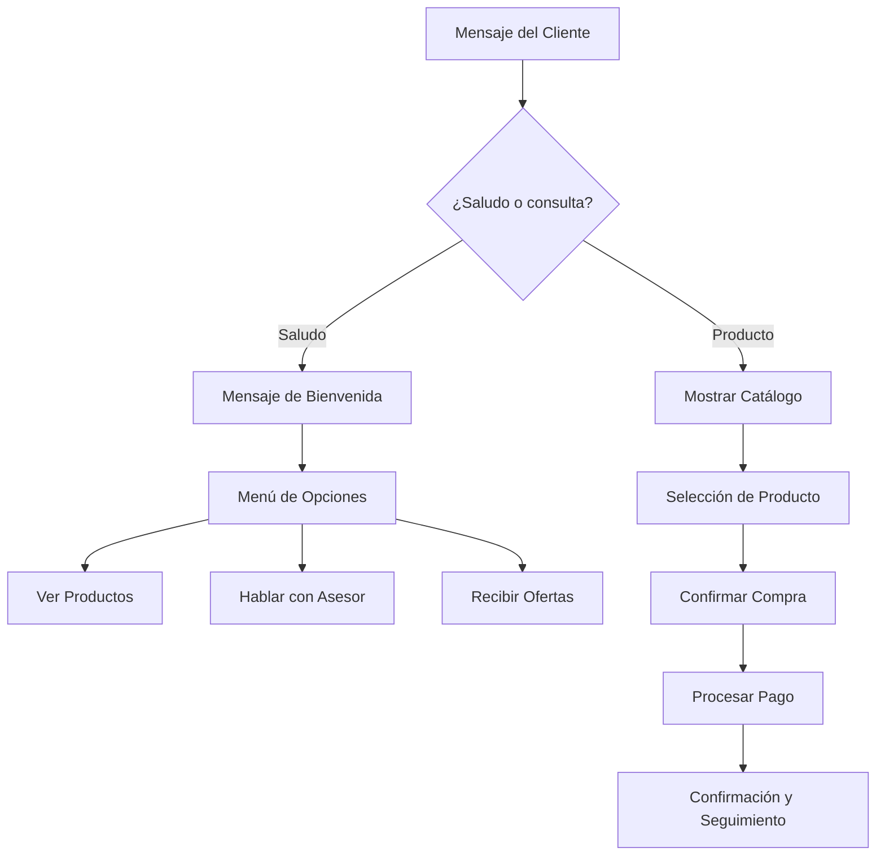
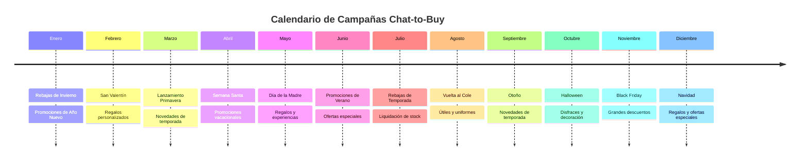

# Chat-to-Buy 2026: Por Qué Toda Marca Necesita Vender por Chat


> **TL;DR:** El modelo Chat-to-Buy está reemplazando al tradicional Click-to-Buy en 2026. Los clientes ya no quieren navegar sitios web, llenar formularios o completar procesos de pago tediosos. Prefieren preguntar, decidir y comprar directamente en apps como WhatsApp, Facebook o Telegram. Con la plataforma de E-SMART360 puedes vender directamente en el chat, reducir el abandono de carrito, ofrecer ofertas personalizadas y operar atención al cliente 24/7. Las tasas de conversión pueden aumentar hasta 3 veces en comparación con formularios o correos electrónicos.


> **Actualización (12 Abril 2026)**
> En 2026, las marcas que ganan no tienen mejores sitios web — tienen mejores conversaciones.

## Introducción: La Crisis de Fricción en 2026

### ¿Por qué el click-to-buy tradicional está fallando al consumidor moderno?

Durante más de una década, la optimización del comercio electrónico se ha centrado en mejores páginas de aterrizaje, procesos de pago más rápidos y menos campos en formularios. Pero en 2026, las empresas enfrentan una paradoja:

Los sitios web están más optimizados que nunca — pero las conversiones se estancan o declinan.

El problema no es el diseño.

El problema es la fricción.

Cada recorrido de click-to-buy aún obliga a los usuarios a:

- Cambiar de contexto (app social → navegador → checkout)
- Cargar múltiples páginas
- Reingresar información
- Tomar decisiones sin orientación

Según el Baymard Institute, la tasa media global de abandono de carrito sigue siendo del ~70%, siendo las razones principales:

- **"Proceso de pago demasiado complejo/largo"**
- **"Tuve que crear una cuenta"**
- **"No confié en el sitio con mi información de pago"**

En resumen, Click-to-Buy asume paciencia — pero el consumidor moderno no tiene ninguna.

Varios estudios confirman que los déficits de atención son exponenciales, no lineales.


> La investigación UX de Google muestra que la probabilidad de rebote aumenta un 32% cuando el tiempo de carga de la página pasa de 1s a 3s. En 5 segundos, la probabilidad de rebote aumenta al 90%.

Pero la velocidad es solo la mitad de la historia.

Cada clic adicional, redirección o campo de formulario introduce:

- **Carga cognitiva**
- **Duda**
- **Peligro de distracción**

En las aplicaciones de mensajería, no hay carga de páginas ni cambios de contexto.

El usuario ya está autenticado, atento y emocionalmente comprometido.

Por eso la pregunta para ganar en 2026 ya no es:

*"¿Cómo podemos mejorar la experiencia de pago?"*

Sino:

*"¿Cómo podemos eliminar el proceso de pago por completo?"*

### Definiendo el Cambio: De Sitios Estáticos a Conversaciones Dinámicas

Los sitios web son estáticos por naturaleza.

La conversación es dinámica.

Un sitio web muestra la misma página de producto a todos.

Una experiencia de chat pregunta:

- **"¿Qué estás buscando?"**
- **"¿Cuál es tu presupuesto?"**
- **"¿Quieres entrega hoy?"**

Este cambio demuestra que las personas compran naturalmente a través de la conversación, no desde un menú.

Las plataformas de mensajería como WhatsApp y Telegram ya no son "canales de soporte"; se están convirtiendo en plataformas de comercio.


> **Para 2026:**
- Más de 2.700 millones de personas usan WhatsApp mensualmente
- Los usuarios pasan de 5 a 7 veces más tiempo en aplicaciones de mensajería que en sitios web de marcas

Esto establece el escenario para un nuevo modelo: **Chat-to-Buy**.

## ¿Qué es "Chat-to-Buy"?

### La evolución: De "Chat de Soporte" a "IA Transaccional"

Históricamente, el chat significaba:

- Preguntas frecuentes (FAQs)
- Derivación de tickets
- Aumento del soporte humano

**Chat-to-Buy representa un cambio fundamental:**

El chat por intención ya no es soporte — crea y cumple intenciones.

Los sistemas modernos de chat-to-buy pueden:

1. **Recomendar productos**
2. **Verificar disponibilidad**
3. **Aplicar descuentos**
4. **Recolectar pagos**
5. **Activar el cumplimiento**

Todo en el mismo hilo de conversación.

Esta evolución es paralela al cambio de sitios web informativos a plataformas accionables impulsadas por IA, APIs y datos en tiempo real.


### Click-to-Buy (Tradicional)

- El usuario ve un anuncio
- Hace clic para ir al sitio web
- Navega por categorías
- Agrega al carrito
- Llena formulario de pago
- Confirma la compra
- **Total: 6+ pasos, múltiples cambios de contexto**

### Chat-to-Buy (Moderno)

- El usuario pregunta en el chat
- El bot recomienda productos
- El usuario elige y paga en el chat
- **Total: 3 pasos, sin cambios de contexto**

### ¿Por qué 2026 es el año del comercio por agentes?

Estamos entrando en la era del **comercio por agentes** — donde la IA no solo reacciona, sino que actúa en nombre del usuario.

A diferencia de los chatbots tradicionales:

- **La IA agente puede realizar acciones multi-paso**
- **Puede llamar APIs, actualizar inventarios y activar flujos de trabajo**
- **Entiende señales de disposición a comprar, no solo palabras clave**

Gartner predice que para 2026:


> El 30% de las interacciones de comercio digital serán manejadas por agentes de IA autónomos.

En chat-to-buy esto significa:

- La IA **no dice**: "Haz clic aquí para comprar"
- La IA **dice**: "He reservado uno para ti — ¿continuamos?"

Esa diferencia es transformadora.

## La Psicología de las Compras "In-App"

Los consumidores no solo quieren velocidad, quieren **consistencia**.

La investigación psicológica llama a esto "conservación del flujo":

- **Cada cambio de aplicación rompe el impulso mental**
- **Cada desvío introduce otras ideas**

Las aplicaciones de mensajería proporcionan:

- **Identidad** (sin inicio de sesión)
- **Confianza** (interfaz de usuario familiar)
- **Atención** (sin pestañas competidoras)

Los estudios internos de Meta muestran que la experiencia de compra dentro del hilo supera a las referencias web tanto en:

- **Tasa de finalización**
- **Satisfacción del cliente**

Esto explica por qué los usuarios cada vez más prefieren:

- **Explorar**
- **Preguntar**
- **Tomar decisiones**
- **Hacer pagos**

Sin salir del chat.


### Gen Z y Alpha

### Instantaneidad como Estándar

La Generación Z creció con:
- **Entrega el mismo día**
- **Pago con un solo toque**
- **Todo bajo demanda**

Un estudio de Salesforce muestra:
- El 73% de los clientes Gen Z espera respuestas inmediatas
- El 64% abandonó una marca después de un proceso de compra lento o complicado

Chat-to-Buy satisface la expectativa de "ahora mismo" — sin colas, páginas ni formularios.

### Millennials y Gen X

### Comodidad con Confianza

Los millennials y la generación X valoran:
- **Poder hacer preguntas antes de comprar**
- **Confirmación inmediata de disponibilidad**
- **Procesos sin fricción pero con respaldo humano**

Chat-to-Buy ofrece lo mejor de ambos mundos: automatización eficiente con la opción de escalar a un agente humano cuando sea necesario.

## 5 Razones por las que tu Negocio Necesita Chat-to-Buy


### Gratificación instantánea para Gen Z y Alpha

Los consumidores jóvenes esperan respuestas inmediatas y procesos sin fricción. Chat-to-Buy satisface la expectativa de "ahora mismo" eliminando colas, páginas y formularios innecesarios.


> Según Salesforce, el 73% de los clientes Gen Z espera respuestas inmediatas, y el 64% abandonó una marca tras un proceso de compra lento.

### Hiperpersonalización en tiempo real

A diferencia de los sitios web, el chat capta:
- Las preguntas del usuario
- Sus objeciones
- Sus prioridades
- Su tono de voz

Esto permite una personalización en tiempo real, no basada en suposiciones.

McKinsey reporta que la personalización:
- Aumenta la tasa de conversión en un 10-15%
- Incrementa los ingresos en un 40% en negocios digital-first

Chat-to-Buy convierte los datos de la conversación en **apalancamiento de ventas instantáneo**.

### Mayor ROI que el email o los formularios web

- Tasa de conversión media de email marketing: ~2-3%
- Formularios de página de aterrizaje: ~1-2%
- Canales de venta conversacional: **5-15%+** según el sector

El chat captura a los usuarios en el momento de la intención, no días después.

### Reducción del abandono de carrito

El carrito se abandona cuando un usuario:
- Se distrae
- Pierde confianza
- Decide "pensarlo después"

Chat-to-Buy cierra el ciclo inmediatamente:
- Preguntas respondidas al instante
- Objeciones resueltas en tiempo real
- Compra completada antes de que surjan dudas

Esto es **compresión de conversión** — reducir el tiempo desde la intención hasta el pago.

### Un equipo de ventas global 24/7 sin contratar más personal

Los sistemas de Chat-to-Buy escalan ilimitadamente:
- Sin horarios laborales
- Sin barreras de idioma
- Sin aumento de costos lineales

La IA maneja:
- **El 80-90% de las consultas de ventas repetitivas**

El humano solo interviene cuando:
- La confianza es crítica
- Se necesita negociación
- Surgen acuerdos de alto valor

## Cómo E-SMART360 Impulsa la Revolución Chat-to-Buy

Chat-to-Buy no es solo un concepto — requiere infraestructura, orquestación e inteligencia para funcionar de manera confiable a escala. Aquí es donde E-SMART360 facilita el camino.

A diferencia de las herramientas básicas de chatbot, E-SMART360 está diseñado como un **motor de conversación transaccional**, no como un plugin de mensajería.

### La Ventaja Omnicanal: Una Bandeja Compartida, Múltiples Plataformas

Hoy en día los profesionales del marketing no dependen de un solo canal. Necesitan presencia en todas las plataformas populares. Por eso E-SMART360 incluye las plataformas más populares como Facebook, WhatsApp, Instagram, Telegram y Webchat. Así puedes llegar a tus clientes desde una única bandeja de entrada unificada y no perder ni un solo cliente.

Un mismo cliente puede:

1. **Descubrir un producto en Instagram**
2. **Hacer preguntas en WhatsApp**
3. **Completar la compra usando Facebook**

Gestionar esto por separado crea recorridos del cliente fragmentados e intención perdida.

E-SMART360 unifica Chat-to-Buy en:

- **WhatsApp**
- **Facebook**
- **Instagram**
- **Telegram**
- **Webchat**

Todo desde una bandeja de entrada centralizada, una lógica de automatización y un perfil de cliente unificado.


> Esto importa porque los clientes omnicanal:
- Gastan un 30% más en promedio
- Muestran un valor de vida útil (LTV) más alto que los compradores de un solo canal

Chat-to-Buy tiene éxito cuando las conversaciones continúan fluidamente, no se reinician en cada plataforma.

### Integración del Catálogo de WhatsApp: Convierte el Chat en un Escaparate

WhatsApp ya no es solo una aplicación de mensajería — se está convirtiendo en una plataforma de comercio electrónico.

Meta soporta oficialmente:

- **Catálogo de productos**
- **Tarjetas de producto**
- **Experiencia de navegación en el chat**

E-SMART360 te permite:

- **Sincronizar productos directamente desde tu plataforma de e-commerce**
- **Presentar tarjetas de producto estructuradas en el chat**
- **Permitir a los usuarios navegar sin salir de la conversación**

Esto elimina:

- La demora en cargar la página de destino
- El cambio de contexto
- Las demoras en la decisión

El resultado es la **compra dentro de la conversación**, no fuera de ella.

#### Cómo configurar tu catálogo de WhatsApp


### Crea tu catálogo en Facebook Business

Ve a [business.facebook.com](https://business.facebook.com/) y selecciona 'Commerce' en el menú de Herramientas. Haz clic en tu cuenta comercial y presiona 'Comenzar'.

### Configura los detalles de tu tienda

Elige 'Ecommerce', decide si tu negocio es online o local, y procede. Agrega tus productos manualmente o conéctate con plataformas como Shopify.

### Agrega productos a tu catálogo

Después de crear el catálogo, visualízalo y agrega artículos con imágenes, nombres, precios y descripciones detalladas.

### Conecta el catálogo con WhatsApp

Enlace tu catálogo a WhatsApp a través de WhatsApp Manager, selecciona 'Catálogo' y haz clic en 'Conectar'.

### Sincroniza con E-SMART360

En el panel de E-SMART360, ve a la sección de WhatsApp y haz clic en 'Sincronizar' para vincular tu número. Luego ve al menú de Catálogo de E-commerce para encontrar tu catálogo listo para usar.


### ¿Qué tipo de productos funcionan mejor en el catálogo de WhatsApp?

Los productos que mejor funcionan son aquellos que requieren poca explicación y tienen un precio claro. Ejemplos:
- **Ropa y accesorios**: Los clientes pueden ver imágenes y precios rápidamente
- **Electrónicos**: Especificaciones claras y comparación sencilla
- **Servicios**: Paquetes con precios fijos y descripciones concisas
- **Alimentos y bebidas**: Menús con imágenes atractivas y precios visibles

Para productos altamente personalizados o de precio variable, combina el catálogo con una conversación guiada por chatbot para recopilar requisitos antes de mostrar opciones.

### Flujos de E-SMART360: Desde el Saludo hasta el Pago — Sin Código

Cuando el comercio se vuelve complejo, las herramientas de automatización tradicionales se rompen.

El flujo de compra por chat debe manejar:

- **Preguntas ramificadas**
- **Lógica condicional**
- **Verificación de inventario**
- **Decisión de pago**
- **Transferencia a humano**


> El Creador Visual de Flujos de E-SMART360 permite a los equipos mapear visualmente todo el recorrido de compra, adaptar rutas según la intención del usuario y activar acciones en medio de la conversación (llamadas API, webhooks, actualizaciones de CRM).

Para las empresas, esto significa:

- **Implementación rápida**
- **Sin dependencia de desarrolladores**
- **Iteración rápida de estrategias de ventas**

#### Configuración de flujos interactivos con botones CTA

Los botones CTA (Call-to-Action) son una de las herramientas más poderosas en los flujos de chat:

1. **Accede al Gestor de Bots** → Respuesta de Bot → Crear
2. **Configura el bloque de inicio** con el título del flujo y selecciona "coincidencia de cadena"
3. **Arrastra y suelta un Bloque Interactivo** desde el conector
4. **Personaliza los elementos del mensaje**: descripción, cuerpo del mensaje, pie de página
5. **Agrega botones** (hasta 3 por bloque) con nombres concisos como "Comprar ahora", "Ver más", "Hablar con asesor"
6. **Configura las acciones** de cada botón:
   - **Enviar mensaje**: Muestra un nuevo mensaje al hacer clic
   - **Asignar etiqueta**: Categoriza usuarios según su interacción
   - **Inscribir en secuencia**: Agrega usuarios a una secuencia de seguimiento


### ¿Cómo crear flujos multi-paso con botones?

1. Usa la función **Clonar** haciendo clic derecho en cualquier bloque para duplicarlo y modificarlo
2. Agrega bloques interactivos anidados para una conversación estructurada
3. Cierra los bloques de botones con un bloque de texto, ya que no pueden quedarse solos
4. Prueba la interacción para asegurarte de que los botones funcionan correctamente
5. Verifica las etiquetas asignadas y las secuencias en el perfil del usuario

Los botones CTA también pueden contener URLs, redirigiendo a los usuarios a páginas de productos, formularios u ofertas especiales.

### Detección Inteligente de Intención: Saber Cuándo Vender — y Cuándo No

Uno de los mayores errores en la automatización es vender demasiado pronto.

Un usuario pregunta:

*"¿Está en oferta?"*

Es muy diferente de:

*"¿Cuánto cuesta después del descuento?"*


> E-SMART360 utiliza lógica de Detección de Intención para:
- Separar la curiosidad de la preparación para la compra
- Postergar la venta hasta que aparezcan señales de intención
- Escalar objeciones complejas a personas cuando sea necesario

Esto refleja cómo trabajan los equipos de ventas de alto rendimiento — excepto que ocurre inmediatamente y a escala.

Según Accenture, las empresas que alinean el momento del compromiso con la intención del cliente ven hasta un **20% más de tasas de conversión**.

Chat-to-Buy no se trata de empujar — se trata de **reconocer la disposición**.

### Paso 1: Consultas en Lenguaje Natural

Un cliente escribe:

*"¿Tienen este paquete personalizado?"*

Este mensaje proporciona inmediatamente:

- **Interés en el producto**
- **Prioridad diferente**
- **Señal de intención de compra**

A diferencia de los filtros web, el lenguaje revela intenciones sin obstáculos.

### Paso 2: Confirmación con IA + Tarjeta de Producto

E-SMART360:

1. **Verifica el inventario** mediante webhook
2. **Confirma la disponibilidad**
3. **Envía una tarjeta de producto** con:
   - Imagen
   - Precio
   - Variante
   - Botones CTA

En este momento, el usuario tiene todo lo necesario para decidir — sin tener que navegar.

### Paso 3: Acción de "Comprar Ahora" en el Chat

El botón de compra activa:

- **Verificación de inventario** mediante webhook
- **Confirmación de disponibilidad**
- **Tarjeta de producto** con imagen, precio, variante y botón CTA

En este punto, el usuario tiene todo lo que necesita para tomar una decisión — sin tener que navegar.

### Paso 4: Sincronización en Tiempo Real con la Tienda y Cumplimiento

E-SMART360 se sincroniza instantáneamente con:

- **Shopify**
- **WooCommerce**

Los datos del pedido se:

- **Registran**
- **Actualizan en el inventario**
- **Activan el proceso de cumplimiento**

Desde la perspectiva del cliente, la transacción parece fluida — casi invisible.


> Este es el objetivo final del chat-to-buy: hacer que comprar se sienta como una continuación de la conversación, no como una tarea tediosa.

#### Confirmación automatizada de pedidos contra reembolso

Una funcionalidad particularmente útil para tiendas WooCommerce es la confirmación automatizada de pedidos contra reembolso (COD). Los pedidos COD falsos pueden ser un problema importante para los propietarios de tiendas en línea.


### Configurar confirmación de pedidos COD paso a paso

1. **Crea una plantilla de mensaje**: Ve al panel de E-SMART360 > Gestor de Bots > Plantilla de Mensaje. Crea variables para "Lista de Productos" y "Precio Total".
2. **Agrega botones de respuesta rápida**: Incluye botones "Confirmar Pedido" y "Cancelar Pedido" en la plantilla.
3. **Configura postbacks**: Crea respuestas automáticas para cuando el usuario haga clic en cada botón.
4. **Crea un Webhook**: En el flujo de trabajo de Webhook, crea un nuevo workflow y activa la URL de callback.
5. **Configura el webhook en WooCommerce**: En tu panel de WordPress, ve a WooCommerce > Ajustes > Avanzado > Webhooks. Agrega un nuevo webhook con el tema "Pedido creado" y pega la URL de callback.
6. **Asigna la respuesta del webhook**: Mapea los campos: número de teléfono, precio total y lista de productos.
7. **Crea APIs de devolución de llamada**: Para confirmar o cancelar pedidos según la respuesta del cliente.
8. **Agrega reglas**: Filtra solo para pedidos con método de pago "contra reembolso" (COD).
9. **Prueba**: Realiza un pedido de prueba y verifica que el mensaje de WhatsApp se envíe correctamente.

### Integración con Plataformas de E-commerce

E-SMART360 se integra nativamente con las principales plataformas de comercio electrónico para sincronizar productos, inventarios y pedidos en tiempo real.


### Shopify

- Sincronización automática de productos
- Notificaciones de pedidos en WhatsApp
- Recuperación de carritos abandonados
- Actualización de inventario en tiempo real

### WooCommerce

- Webhook de pedidos creados
- Confirmación de pedidos COD
- Notificaciones de estado de envío
- Sincronización bidireccional de existencias

## Superando la "Brecha de Confianza" en el Comercio Conversacional

A pesar de la velocidad y la conveniencia, queda una preocupación:

*"¿Puedo confiar en las compras dentro del chat?"*

La confianza es el último obstáculo — y el más importante.

### Pagos Seguros y Protección de Datos en 2026

Las plataformas modernas de chat-to-buy deben cumplir con:

- **Estándares de cifrado de extremo a extremo**
- **GDPR y leyes regionales de protección de datos**
- **Directrices de comercio específicas de la plataforma**

Los mensajes de WhatsApp están cifrados de extremo a extremo por defecto.

E-SMART360 proporciona:

- **El procesamiento de pagos se realiza a través de pasarelas seguras y verificadas**
- **Los datos sensibles nunca se almacenan en los mensajes del chat**
- **Los webhooks y APIs siguen estándares modernos de autenticación**

En otras palabras, chat-to-buy no es "menos seguro" que las compras en línea — a menudo es más controlado, porque hay menos sistemas involucrados.

### Humano en el Bucle: Saber Cuándo la IA Debe Dar un Paso al Lado

No todas las ventas deben automatizarse.

Las compras de alto valor a menudo requieren:

- **Negociación**
- **Personalización**
- **Seguridad emocional**

E-SMART360 soporta flujos de trabajo con Humano en el Bucle (HITL):

- **La IA maneja la búsqueda y la calificación**
- **El humano interviene cuando:**
  - Se proporcionan detalles de precios iniciales
  - Se necesita un agente para consultas adicionales
  - Surgen requisitos personalizados
  - Se requiere seguridad de confianza
  - Se necesita una demostración del producto


> La investigación de IBM muestra que los modelos híbridos de IA + humanos superan a los sistemas completamente automatizados tanto en conversión como en satisfacción.

Chat-to-Buy tiene éxito cuando la automatización apoya a las personas, no las reemplaza.

## Casos de Uso: Chat-to-Buy en Acción

### Caso 1: Tienda de Ropa Online

Una tienda de ropa implementó Chat-to-Buy en WhatsApp. El flujo funciona así:

1. El cliente envía "Hola, busco un vestido para una fiesta"
2. El chatbot pregunta: "¿Cuál es tu presupuesto?" y "¿Qué talla usas?"
3. Basado en las respuestas, muestra 3 opciones del catálogo con imágenes y precios
4. El cliente selecciona uno y hace clic en "Comprar ahora"
5. El sistema verifica el inventario, procesa el pago y confirma el pedido
6. El cliente recibe actualizaciones de envío por el mismo chat

**Resultado: Tasa de conversión del 18% (vs 3% del sitio web anterior)**

### Caso 2: Restaurante con Pedidos por WhatsApp

Un restaurante local configuró un chatbot para tomar pedidos:

1. El cliente escribe "Quiero ordenar"
2. El bot muestra el menú del día con imágenes y precios
3. El cliente selecciona platos y especifica cantidades
4. El bot pregunta dirección de entrega y método de pago
5. El pedido se envía automáticamente a la cocina
6. El cliente recibe confirmación y tiempo estimado de entrega

**Resultado: 45% menos llamadas telefónicas, pedidos más precisos**

### Caso 3: Agencia de Marketing Digital

Una agencia usa Chat-to-Buy para calificar leads y vender paquetes:

1. El lead llega desde un anuncio de Click-to-WhatsApp
2. El chatbot califica al lead preguntando: presupuesto, objetivos, plazo
3. Según las respuestas, recomienda un paquete de servicios
4. Ofrece agendar una llamada con un asesor o comprar el paquete directamente
5. Si el lead elige comprar, se procesa el pago y se activa el onboarding automático

**Resultado: 60% de los leads calificados compran sin intervención humana**

## Preguntas Frecuentes


### ¿Qué es exactamente chat-to-buy?

Es un modelo de comercio que permite a los clientes hacer preguntas a través de un enfoque conversacional y completar una compra directamente en una plataforma de chat como WhatsApp, Instagram o Telegram, sin necesidad de visitar un sitio web.

### ¿Por qué chat-to-buy es mejor que click-to-buy?

Chat-to-buy elimina la fricción como cargas de página, redirecciones y formularios. Esto resulta en:
- Decisiones más rápidas
- Mayor confianza del comprador
- Menor abandono de carrito
- Tasas de conversión significativamente más altas (5-15% vs 1-3%)

### ¿Es seguro chat-to-buy?

Sí, los sistemas modernos de chat-to-buy utilizan:
- Mensajería cifrada de extremo a extremo (como WhatsApp)
- Pasarelas de pago seguras y verificadas
- Procesamiento de pedidos basado en APIs

Los datos de pago sensibles nunca se exponen en el chat.

### ¿Chat-to-buy funciona con Shopify o WooCommerce?

Absolutamente. E-SMART360 se integra directamente con Shopify y WooCommerce para sincronizar:
- Productos
- Inventarios
- Pedidos
- Flujos de trabajo de cumplimiento

La integración es bidireccional: los cambios en la tienda se reflejan en el chat y viceversa.

### ¿La IA reemplazará a los agentes de ventas humanos?

No. Los sistemas más efectivos de chat-to-buy utilizan el modelo Humano en el Bucle (HITL):
- La IA maneja búsquedas, preguntas frecuentes y calificación de leads
- Los humanos intervienen para negociación, generación de confianza y ventas complejas

Este enfoque híbrido proporciona el mayor retorno de inversión.

### ¿Qué tipos de negocios se benefician más de chat-to-buy?

Chat-to-buy funciona mejor para:
- Marcas de comercio electrónico
- Empresas D2C (Direct-to-Consumer)
- Negocios de servicios
- Agencias de marketing
- Procesos de onboarding y actualización SaaS
- Tiendas locales y globales

Si tus clientes hacen preguntas antes de comprar, chat-to-buy es ideal para ti.

### ¿Cuánto tiempo toma implementar chat-to-buy?

Con E-SMART360, la implementación básica puede estar lista en cuestión de horas:
1. Conexión de WhatsApp/redes: 15-30 minutos
2. Configuración del catálogo: 1-2 horas
3. Creación del flujo de chatbot: 2-4 horas
4. Integración con tienda online: 1-2 horas
5. Pruebas y ajustes: 1-2 horas

En total, un sistema completo de chat-to-buy puede estar operativo en 1-2 días hábiles.

### ¿Qué métricas debo monitorear en chat-to-buy?

Las métricas clave para medir el éxito de tu estrategia chat-to-buy incluyen:
- **Tasa de conversión del chat**: Porcentaje de conversaciones que resultan en venta
- **Valor promedio del pedido (AOV)**: Comparado con otros canales
- **Tasa de abandono de carrito**: Idealmente muy por debajo del 70% del e-commerce tradicional
- **Tiempo hasta la compra**: Desde el primer mensaje hasta el pago completado
- **Satisfacción del cliente (CSAT)**: Medida después de cada interacción
- **Tasa de escalado a humano**: Idealmente manteniendo menos del 20% de las conversaciones

## Conclusión: A prueba de futuro en 2026

Las lecciones de la última década son claras:

Los sitios web mejores no solucionaron las conversiones.

Las **conversaciones** sí lo harán.

**Chat-to-Buy no es una tendencia** — es una reacción a:

- La reducción de la capacidad de atención
- El comportamiento "primero el mensaje"
- La demanda de satisfacción inmediata

Las empresas que sigan optimizando páginas y embudos competirán por mejoras de velocidad medidas en milisegundos.

Las empresas que adopten chat-to-buy competirán por mejoras de experiencia medidas en segundos y emociones.

- **No construyas un sitio web mejor. Crea mejores conversaciones.**
- **Los sitios web explican. Las conversaciones persuaden y venden.**


> En 2026, los negocios ganadores serán aquellos que:
1. Encuentren a los clientes donde están
2. Eliminen pasos innecesarios
3. Reemplacen la fricción con fluidez

Chat-to-Buy no se trata de la venta agresiva — se trata de hacer que la compra sea fácil.

### Reflexión Final

El negocio que hace que comprar se sienta cómodo siempre ganará el mercado.

Y en un mundo donde la atención es la moneda más escasa,

las conversaciones son el medio de pago más poderoso jamás creado.

---


> **¿Listo para implementar Chat-to-Buy? (2026)**
> Comienza hoy. Conecta tus canales, configura tu catálogo y activa tu primer flujo de venta conversacional. La revolución del comercio por chat ya está aquí.

## Guía de Implementación Rápida: De Cero a tu Primer Venta por Chat

Si estás listo para implementar Chat-to-Buy en tu negocio, sigue esta guía paso a paso para tener todo operativo en tiempo récord.

### Semana 1: Preparación y Configuración

#### Día 1: Conecta tus Canales

1. **Regístrate en E-SMART360** y crea tu cuenta
2. **Conecta tu número de WhatsApp Business** mediante el proceso de Embedded Signup
3. **Conecta tus otras cuentas**: Facebook Messenger, Instagram, Telegram
4. **Verifica tu cuenta de negocio** con Meta si es necesario


> Si ya tienes un número de WhatsApp Business App, puedes migrarlo a la API de WhatsApp Business sin perder tus conversaciones ni configuración.

#### Día 2: Configura tu Catálogo de Productos

1. Crea tu catálogo en **Facebook Business Manager** > Commerce
2. Agrega todos tus productos con imágenes de alta calidad
3. Conecta el catálogo con tu cuenta de WhatsApp
4. Sincroniza el catálogo en el panel de E-SMART360


> **Consejos para un catálogo efectivo:**
- Usa imágenes de 800x800 píxeles como mínimo
- Incluye precios claros y actualizados
- Agrega descripciones breves pero informativas (máximo 100 caracteres)
- Organiza los productos en colecciones lógicas
- Actualiza el inventario regularmente

#### Día 3: Diseña tu Primer Flujo de Ventas

1. Ve al **Gestor de Bots** > **Crear Nuevo Bot**
2. Define el **disparador principal**: palabra clave, mensaje de bienvenida o clic en anuncio
3. Diseña el flujo básico:



4. Agrega botones interactivos para cada opción
5. Configura respuestas automáticas para preguntas frecuentes

### Semana 2: Automatización Avanzada

#### Día 8-9: Configura Integraciones

1. **Conecta tu tienda online** (Shopify o WooCommerce) con E-SMART360
2. **Configura webhooks** para eventos clave:
   - Nuevo pedido creado
   - Actualización de estado de envío
   - Carrito abandonado
   - Producto agotado

3. **Prueba la sincronización**: realiza un pedido de prueba y verifica que los datos fluyan correctamente

#### Día 10-11: Implementa la Detección de Intención

Configura la lógica de intención para diferentes escenarios:


### Escenario 1: Cliente interesado pero indeciso

**Detectar:** Preguntas como "¿cuánto cuesta?", "¿hay descuentos?", "¿qué incluye?"
**Acción:** Enviar tarjeta de producto con precio, ofrecer envío gratis o descuento por tiempo limitado
**Seguimiento:** Si no compra, programar recordatorio a las 24 horas

### Escenario 2: Cliente listo para comprar

**Detectar:** Frases como "quiero comprar", "lo quiero", "cómo pago"
**Acción:** Mostrar opciones de pago disponibles y confirmar dirección de envío
**Seguimiento:** Confirmación inmediata del pedido y número de seguimiento

### Escenario 3: Cliente con queja o problema

**Detectar:** Palabras como "problema", "error", "no funciona", "devolución"
**Acción:** Escalar inmediatamente a un agente humano con el contexto completo
**Seguimiento:** El agente recibe el historial de la conversación para resolver sin duplicar esfuerzos

#### Día 12: Configura Recuperación de Carritos Abandonados

1. Crea una plantilla de mensaje para carritos abandonados
2. Configura el webhook de WooCommerce/Shopify para detectar carritos no finalizados
3. Programa el envío del mensaje 1 hora después del abandono
4. Agrega un botón "Completar mi compra" con un enlace directo al pago


> **Dato clave:** La recuperación de carritos abandonados por WhatsApp puede recuperar entre un 10-30% de las ventas perdidas.

### Semana 3: Optimización y Escalado

#### Días 15-16: Analiza Resultados

Revisa estas métricas semanalmente:

| Métrica | Objetivo | Cómo mejorarla |
|---------|----------|----------------|
| Tasa de conversión del chat | >10% | Mejorar la segmentación de leads |
| Tiempo de respuesta inicial | <5 segundos | Optimizar flujos automáticos |
| Tasa de abandono en el chat | <30% | Simplificar el proceso de compra |
| Tasa de escalado a humano | <20% | Mejorar la base de conocimiento del bot |
| Satisfacción del cliente | >4.5/5 | Personalizar más las interacciones |
| Valor promedio del pedido | Incremento mensual | Ofrecer upsells y cross-sells en el chat |

#### Días 17-19: Iteración y Mejora

1. **Revisa las conversaciones** donde el bot no pudo ayudar
2. **Agrega nuevos flujos** para cubrir esos casos
3. **Actualiza las respuestas** del bot basándote en las preguntas reales de los clientes
4. **Prueba A/B** diferentes mensajes de bienvenida y ofertas

#### Día 20: Lanza tu Estrategia Multicanal

1. **Configura anuncios Click-to-WhatsApp** en Facebook e Instagram
2. **Agrega el botón de WhatsApp** en tu sitio web y emails
3. **Comparte tu número de WhatsApp** en todas tus redes sociales
4. **Crea contenido** mostrando cómo comprar por chat


> **Importante:** Cuando lances anuncios Click-to-WhatsApp, asegúrate de tener un flujo de bienvenida optimizado. El primer mensaje determina si el cliente continúa o abandona.

## Estrategias Avanzadas de Chat-to-Buy

### Personalización con Datos de Usuario

Una de las ventajas más poderosas del chat-to-buy es la capacidad de personalizar cada interacción basándose en el historial del usuario:

1. **Segmentación por comportamiento**: Clientes que compran frecuentemente vs. compradores primerizos
2. **Recomendaciones basadas en compras anteriores**: "Basado en tu compra anterior de [producto], quizás te interese..."
3. **Ofertas por cumpleaños o aniversario**: Mensajes automáticos con descuentos personalizados
4. **Recordatorios de reposición**: Para productos consumibles con ciclo de compra conocido

### Upselling y Cross-selling Automatizados

El momento posterior a la compra es ideal para ofrecer productos relacionados:


### Upselling (Venta Superior)

Ofrecer una versión mejorada del producto seleccionado:
- "¿Sabías que por solo $20 más puedes obtener la versión premium con garantía extendida?"
- "La versión profesional incluye envío gratis y soporte prioritario"
- Mejor momento: justo antes de confirmar el pago

### Cross-selling (Venta Cruzada)

Ofrecer productos complementarios:
- "Los clientes que compraron [producto] también llevaron [complemento]"
- "Completa tu compra con [accesorio] por solo $X adicional"
- Mejor momento: inmediatamente después de la confirmación del pedido

### Fidelización Post-Venta

El chat-to-buy no termina con la venta. Una experiencia post-venta excepcional genera clientes recurrentes:

1. **Confirmación inmediata del pedido** con todos los detalles
2. **Actualizaciones automáticas de envío** con número de seguimiento
3. **Solicitud de reseña** 3-5 días después de la entrega
4. **Ofertas exclusivas para clientes recurrentes** con descuentos por lealtad
5. **Encuesta de satisfacción** después de cada interacción con soporte
6. **Recordatorio de reposición** basado en la frecuencia de compra

### Automatización de Campañas Estacionales

Aprovecha las temporadas clave para impulsar ventas:



## Resolución de Problemas Comunes

### Los mensajes no se envían

1. **Verifica el formato del número de teléfono**: Sin signo +, con código de país correcto
2. **Revisa los límites de mensajería**: Asegúrate de no exceder los límites de tu tier de WhatsApp
3. **Confirma que las plantillas estén aprobadas**: Las plantillas de marketing requieren aprobación de Meta
4. **Verifica la conexión de tu cuenta**: Revisa que tu número esté correctamente conectado

### El catálogo no se sincroniza

1. **Confirma la conexión del catálogo** en WhatsApp Manager
2. **Verifica que los productos estén en estado "publicado"** en Facebook Commerce
3. **Re-sincroniza el catálogo** desde el panel de E-SMART360
4. **Revisa los permisos de la cuenta** de Facebook Business

### Los bots no responden correctamente

1. **Revisa las palabras clave** y asegúrate de que coincidan con las consultas reales
2. **Verifica la jerarquía de los flujos**: Los flujos más específicos deben estar antes que los genéricos
3. **Prueba con un cliente de prueba** antes de activar para todos los usuarios
4. **Revisa los logs** para identificar dónde falla la conversación


> **Error común:** No configurar un flujo de "no coincidencia". Siempre incluye una respuesta para cuando el bot no entienda la consulta del usuario, con opción de escalar a un humano.

## Glosario de Términos


### Chat-to-Buy

Modelo de comercio donde los clientes pueden descubrir productos, hacer preguntas y completar compras directamente dentro de una aplicación de mensajería, sin salir de la conversación.

### Click-to-Buy

Modelo de comercio tradicional donde los clientes hacen clic en un enlace o anuncio, son redirigidos a un sitio web, navegan y completan la compra a través de un proceso de pago en varias páginas.

### CTA (Call-to-Action)

Botón o elemento interactivo dentro de un mensaje de chat que invita al usuario a realizar una acción específica, como "Comprar ahora", "Ver más" o "Hablar con asesor".

### HITL (Human-in-the-Loop)

Modelo de automatización donde la IA maneja las interacciones iniciales pero puede escalar a un agente humano cuando la conversación requiere juicio, negociación o empatía humana.

### Compresión de Conversión

Estrategia de reducir el tiempo y los pasos entre la intención de compra y la finalización del pago, minimizando las distracciones y objeciones que causan abandono.

### Agente de IA

Sistema de inteligencia artificial que no solo responde preguntas, sino que puede realizar acciones multi-paso como verificar inventario, procesar pagos y actualizar sistemas CRM de forma autónoma.

### Flujo de Conversación

Secuencia lógica de mensajes, preguntas y respuestas que guía al usuario desde el contacto inicial hasta la acción deseada (compra, registro, reserva, etc.).

### Webhook

Mecanismo que permite a una aplicación enviar datos en tiempo real a otra aplicación cuando ocurre un evento específico, como la creación de un nuevo pedido en WooCommerce o Shopify.

---


> **¿Listo para implementar Chat-to-Buy? (2026)**
> Comienza hoy. Conecta tus canales, configura tu catálogo y activa tu primer flujo de venta conversacional. La revolución del comercio por chat ya está aquí. El futuro de las ventas no está en mejores sitios web — está en mejores conversaciones.

## Plantillas de Mensajes para Chat-to-Buy

Aquí tienes plantillas listas para usar en tus flujos de venta por chat. Personalízalas según tu marca y producto.

### Plantilla de Bienvenida

```
👋 ¡Hola [Nombre]! Bienvenido/a a [Nombre de Tienda].

¿En qué puedo ayudarte hoy?

1️⃣ 🔍 Ver catálogo de productos
2️⃣ 💬 Hablar con un asesor
3️⃣ 🎁 Recibir ofertas exclusivas
4️⃣ 📦 Consultar mi pedido

Responde con el número de la opción que prefieras 😊
```

### Plantilla de Producto

```
✨ [Nombre del Producto]
💰 Precio: $[Precio]
📦 Disponible: [Sí/No]

[Descripción breve del producto]

¿Te gustaría:

🛒 Comprar ahora
📋 Ver más detalles
🔙 Volver al catálogo
```

### Plantilla de Confirmación de Pedido

```
✅ ¡Pedido confirmado!

📋 Pedido #[Número]
📦 Productos: [Lista]
💰 Total: $[Total]
📍 Dirección: [Dirección]
🚚 Envío estimado: [Fecha]

Te notificaremos cuando tu pedido esté en camino.

Gracias por confiar en [Nombre de Tienda] 🙏
```

### Plantilla de Seguimiento de Envío

```
🚚 ¡Tu pedido está en camino!

📋 Pedido #[Número]
📍 Última actualización: [Ubicación]
📅 Fecha estimada de entrega: [Fecha]
🔗 Número de seguimiento: [Código]

¿Necesitas algo más? Estamos aquí para ayudarte 💪
```

### Plantilla de Carrito Abandonado

```
⏰ ¡No dejes pasar esta oportunidad!

Hace poco estuviste viendo [Producto] y queremos ayudarte a completar tu compra.

🎁 Por tiempo limitado: ¡Envío GRATIS en tu primera compra!

👉 Haz clic aquí para finalizar tu pedido: [Enlace]

¿Tienes alguna duda? Responde a este mensaje y te ayudamos 😊
```

### Plantilla de Post-Compra (Seguimiento)

```
👋 Hola [Nombre], esperamos que estés disfrutando tu [Producto].

¿Cómo fue tu experiencia de compra?

⭐ Excelente
👍 Buena
👎 Regular
😞 Mala

¡Tu opinión nos ayuda a mejorar!
```

### Plantilla de Oferta Especial

```
🎉 ¡Oferta especial solo para ti, [Nombre]!

Por ser uno de nuestros clientes favoritos, tenemos un descuento exclusivo:

🔥 [Producto] con [XX]% de descuento
💰 Precio especial: $[Precio]
⏳ Válido hasta: [Fecha]

¿Aprovechas esta oferta?

🛒 Sí, quiero comprar
❌ No, gracias
🔍 Ver más detalles
```

## Comparativa: Chat-to-Buy vs Métodos Tradicionales

| Aspecto | Click-to-Buy (Web) | Chat-to-Buy (WhatsApp) |
|---------|-------------------|----------------------|
| Pasos para comprar | 5-7 pasos | 2-3 pasos |
| Cambios de contexto | 2-3 (red → web → pago) | 0 (todo en el chat) |
| Tasa de conversión típica | 1-3% | 5-15% |
| Abandono de carrito | ~70% | ~20-30% |
| Tiempo hasta la compra | Minutos a horas | Segundos a minutos |
| Personalización | Basada en datos históricos | En tiempo real durante la conversación |
| Atención 24/7 | Requiere chatbot en web | Nativo (donde está el cliente) |
| Barrera de entrada | Registro obligatorio | El usuario ya está autenticado |
| Integración con redes sociales | Requiere redirección | Conversación continua desde el anuncio |
| Costo de implementación | Alto (desarrollo web + mantenimiento) | Bajo (sin código, plataforma SaaS) |
| Escalabilidad | Limitada por recursos del servidor | Ilimitada (API de WhatsApp) |
| Confianza del usuario | Media (sitio desconocido) | Alta (entorno familiar) |

## Estudios de Caso Reales

### Caso: Tienda de Productos Orgánicos

**Desafío:** Una tienda de productos orgánicos tenía una tasa de conversión del 2.5% en su sitio web. Los clientes hacían muchas preguntas sobre ingredientes, certificaciones y origen de los productos antes de comprar, pero el sitio web no proporcionaba esta información de forma interactiva.

**Solución con E-SMART360:**
1. Se creó un catálogo completo de productos orgánicos en WhatsApp
2. Se configuró un chatbot con base de conocimiento sobre ingredientes y certificaciones
3. Se implementó detección de intención para preguntas sobre alergias y restricciones dietéticas
4. Se agregaron botones CTA para compra directa

**Resultados:**
- Tasa de conversión: 2.5% → 14%
- Valor promedio del pedido: +35%
- Reducción de consultas repetitivas al equipo de soporte: 80%
- Clientes recurrente: 45% en los primeros 3 meses

### Caso: Agencia de Viajes

**Desafío:** Una agencia de viajes recibía cientos de consultas diarias sobre paquetes turísticos. El equipo de ventas no daba abasto y muchos leads se perdían por demora en la respuesta.

**Solución con E-SMART360:**
1. Se configuró un chatbot para calificar leads preguntando destino, presupuesto y fechas
2. Se integró con el sistema de reservas para verificar disponibilidad en tiempo real
3. Se crearon flujos específicos por tipo de viaje (playa, aventura, cultura, negocios)
4. Se configuró escalado a agente humano para reservas complejas

**Resultados:**
- Leads calificados automáticamente: 200+/día
- Conversión de lead a reserva: 22%
- Tiempo de respuesta inicial: <3 segundos (vs 45 minutos antes)
- Satisfacción del cliente: 4.7/5

### Caso: Tienda de Electrónica

**Desafío:** Una tienda de electrónica tenía problemas con devoluciones porque los clientes compraban productos sin entender completamente las especificaciones técnicas.

**Solución con E-SMART360:**
1. Se creó un flujo interactivo que preguntaba el uso previsto del producto
2. Se configuraron recomendaciones basadas en necesidades específicas
3. Se agregaron tarjetas de producto con especificaciones detalladas
4. Se implementó confirmación de compatibilidad antes de finalizar la compra

**Resultados:**
- Reducción de devoluciones: 60%
- Tasa de conversión: 8.5%
- Clientes satisfechos con la recomendación: 92%
- Reviews positivas: aumento del 40%

## Checklist de Implementación

Usa esta lista para asegurarte de que no te falta nada en tu implementación de Chat-to-Buy:

### Fase 1: Fundación
- [ ] Cuenta de E-SMART360 creada y configurada
- [ ] Número de WhatsApp Business conectado y verificado
- [ ] Canales adicionales conectados (Facebook, Instagram, Telegram)
- [ ] Método de pago para API de WhatsApp configurado
- [ ] Cuenta de Facebook Business Manager verificada

### Fase 2: Catálogo y Productos
- [ ] Catálogo de productos creado en Facebook Commerce
- [ ] Productos con imágenes, precios y descripciones
- [ ] Catálogo conectado a WhatsApp
- [ ] Catálogo sincronizado en E-SMART360
- [ ] Inventario actualizado

### Fase 3: Flujos de Bot
- [ ] Mensaje de bienvenida configurado
- [ ] Flujo de catálogo con botones interactivos
- [ ] Flujo de compra con confirmación
- [ ] Flujo de preguntas frecuentes
- [ ] Flujo de "no coincidencia" con escalado a humano
- [ ] Postbacks configurados para botones
- [ ] Flujos probados y funcionando

### Fase 4: Integraciones
- [ ] Tienda online (Shopify/WooCommerce) conectada
- [ ] Webhooks configurados para eventos clave
- [ ] Sincronización de pedidos probada
- [ ] Recuperación de carritos abandonados configurada
- [ ] CRM o Google Sheets conectado para seguimiento

### Fase 5: Marketing y Lanzamiento
- [ ] Anuncios Click-to-WhatsApp configurados
- [ ] Botón de WhatsApp en sitio web
- [ ] Enlace de WhatsApp en perfiles de redes sociales
- [ ] Plantillas de marketing aprobadas por Meta
- [ ] Estrategia de contenido para promocionar el canal

### Fase 6: Optimización Continua
- [ ] Métricas de conversión configuradas
- [ ] Revisión semanal de conversaciones
- [ ] Actualización de flujos basada en datos reales
- [ ] Pruebas A/B de mensajes y ofertas
- [ ] Encuestas de satisfacción periódicas

## Integración con Pasarelas de Pago

E-SMART360 se integra con más de 20 métodos de pago populares, permitiendo que la transacción se complete dentro del chat sin redirecciones externas.


### Pasarelas de pago soportadas

- **PayPal**: Pagos con cuentas PayPal y tarjetas de crédito
- **Stripe**: Tarjetas de crédito/débito, Apple Pay, Google Pay
- **Razorpay**: Ideal para el mercado indio
- **Mercado Pago**: Perfecto para Latinoamérica
- **PayU**: Pagos en múltiples monedas
- **Paytm**: Pagos móviles en India
- **Square**: Procesamiento de tarjetas y pagos móviles
- **Transferencia bancaria**: Pago por transferencia directa
- **Pago contra reembolso**: Confirmación automatizada
- **Criptomonedas**: Bitcoin, Ethereum y otras (según disponibilidad)

### Cómo configurar pagos en el chat

1. Ve a **Configuración** > **Métodos de Pago** en E-SMART360
2. Selecciona la pasarela de pago que deseas integrar
3. Ingresa las credenciales de API proporcionadas por la pasarela
4. Configura las monedas y los montos mínimos/máximos
5. Prueba una transacción de $1 para verificar la integración
6. Activa el método de pago en tus flujos de venta


> **Importante:** Asegúrate de cumplir con los requisitos de seguridad (PCI DSS) de tu pasarela de pago. Nunca almacenes números de tarjetas de crédito completos en los mensajes del chat.

## Actualizaciones y Novedades 2026

- **Abril 2026**: WhatsApp Business API ahora permite pagos nativos dentro del chat en 15 países adicionales
- **Marzo 2026**: Meta lanza nuevas herramientas de catálogo con realidad aumentada para productos
- **Febrero 2026**: Nuevos límites de mensajería para WhatsApp Business que permiten hasta 250.000 conversaciones diarias
- **Enero 2026**: Integración mejorada con Instagram Shopping para compras directas desde DM

---


> **Comienza tu Transformación Chat-to-Buy (2026)**
> No esperes a que tus competidores te tomen la delantera. El comercio conversacional es el presente y el futuro de las ventas. Con E-SMART360, tienes todas las herramientas para implementarlo hoy mismo.
