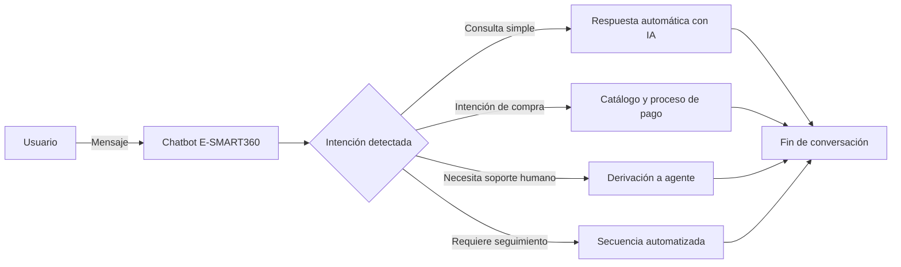

<Update title="Última actualización" date="2026-04-07" />

> **TL;DR:** Ahora es el momento de los chatbots personalizados. El progreso empresarial mediante chatbots que responden de forma genérica es cuestionable. Para que un bot realmente impulse el crecimiento, debe hablar el "lenguaje comercial" único de tu industria. Esta guía te muestra cómo lograrlo.

Los chatbots están cambiando rápidamente. Ya no son solo para conversaciones básicas o alertas simples. Hoy en día, estas herramientas inteligentes ayudan a muchas empresas diferentes de formas nuevas e innovadoras.

En esta guía, verás cómo los chatbots resuelven problemas del mundo real. Te mostraremos por qué son tan útiles. También aprenderás a construir tu propio chatbot desde cero.

> **¿Sabías que…?** Un estudio de Uberall reveló que el 80% de los consumidores reportaron experiencias positivas con chatbots, el 40% expresó interés en recibir atención mediante chatbots, y el 38% cree que las marcas deberían usar chatbots para ofrecer ofertas y promociones.

## El Mundo Versátil de los Chatbots

Los chatbots han evolucionado de simples sistemas de respuesta automática a asistentes digitales inteligentes, capaces de entender el lenguaje natural y ejecutar acciones complejas. Su versatilidad los ha convertido en herramientas esenciales en prácticamente todos los sectores.

### Caso de Uso 1: Asistente Nacional de Salud del NHS en Reino Unido

En el sector salud, cada segundo es vital. La velocidad salva vidas. Así es como un chatbot ayuda a los pacientes.

#### ¿Para quién es?

Esta herramienta es para cualquier persona que necesite consejos de salud o quiera agendar una cita médica.

#### Cómo funciona

El NHS utiliza una herramienta llamada "Ask A&E". Actúa como un asistente médico digital. Puedes hablar con ella o escribir un mensaje. Pregunta sobre tus síntomas y ofrece consejos rápidos.

#### Qué puede hacer

- Encontrar clínicas cercanas a tu ubicación.
- Reservar tu próxima visita médica.
- Recordarte tomar tus medicamentos.
- Dar consejos sobre salud mental.
- Ayudar con reclamaciones de seguros médicos.

#### Por qué es especial

El bot se conecta a tus archivos médicos. Esto ayuda a los doctores a ver tu historial rápidamente y tomar las decisiones correctas para tu cuidado.

#### Ejemplo real: El NHS

El NHS es el servicio de salud principal del Reino Unido. Usan un chatbot llamado "Ask A&E". Esta herramienta facilita las cosas a los pacientes, ayudándoles a reservar visitas y dando consejos claros sobre cuidados de emergencia. Elimina el estrés de buscar ayuda médica.

El Reino Unido está invirtiendo fuertemente para llevar nueva tecnología a la salud. Informes recientes muestran que han destinado más de £50 millones para inteligencia artificial. Este dinero ayuda a actualizar el NHS y demuestra su compromiso con la tecnología para mejorar la calidad de vida de las personas.

> **Aplicación práctica:** Cualquier clínica u hospital puede implementar un chatbot similar usando E-SMART360 para gestionar citas, recordatorios de medicamentos y triaje inicial de pacientes. La plataforma permite conectar el chatbot con sistemas de historias clínicas existentes mediante su API HTTP.

### Caso de Uso 2: Chatbot de Nutrición de Nestlé

#### ¿Para quién es?

Este bot es para cualquier persona que quiera comer mejor. Es perfecto para quienes necesitan ideas de recetas o consejos de salud.

#### Cómo funciona

Nestlé creó un chatbot llamado Ella. Puedes hablar con Ella o enviarle un texto. Cuéntale qué te gusta comer y qué quieres evitar. Ella te da un plan de comidas que se adapta a tu vida, ayudándote a elegir alimentos saludables y planificar tus comidas.

#### Por qué es inteligente

Ella utiliza inteligencia artificial para aprender sobre ti. Mientras más hablas con ella, mejores son sus consejos. También te envía consejos rápidos para ayudarte a mantenerte en el camino correcto con tu dieta.

#### Uso en el mundo real

Nestlé utiliza Ella para ayudar a sus clientes a mantenerse saludables. Es un gran ejemplo de cómo una gran empresa usa la tecnología para brindar asesoramiento experto a las personas desde la comodidad de su hogar.

### Aplicaciones en Salud

- Consulta de síntomas automatizada
- Gestión de citas y recordatorios
- Historias clínicas integradas
- Seguimiento de tratamientos
- Consejos de salud mental
- Notificaciones de medicamentos
- Triaje de urgencias
- Programación de cirugías

### Aplicaciones en Nutrición

- Planes de alimentación personalizados
- Recomendaciones basadas en IA
- Seguimiento de objetivos calóricos
- Consejos de estilo de vida
- Integración con apps de fitness
- Recetas personalizadas
- Recordatorios de hidratación
- Registro de hábitos alimenticios

## Construyendo Tu Propio Chatbot con E-SMART360

En esta sección, recorreremos el proceso de creación de un chatbot **Generador de Documentos Legales** personalizado con E-SMART360. Asumamos el perfil de Lisa, una consultora legal que necesita este servicio.

### Caso de Uso 3 — Generador de Documentos Legales

El primer paso para aprovechar el poder de LegalBot (el nombre de tu bot) es elegir el constructor de chatbots adecuado. En este caso, usaremos E-SMART360.

1. **Comenzando:** Elegir E-SMART360 para crear LegalBot.
2. **Planificación y Diseño de Conversaciones del Chatbot.**
3. **Definición de Objetivos y Metas del Usuario:** Antes de sumergirte en el proceso de creación, es esencial definir tus objetivos. En este caso, la meta es clara: crear un acuerdo legal personalizado de manera eficiente.
4. **Creación de un Diagrama de Flujo de Conversación:** Para asegurar una interacción fluida con LegalBot, se crea un diagrama de flujo que describe las diversas etapas de creación del documento, incluyendo:
   - Tipo de Documento
   - Selección de Cláusulas
   - Información del Cliente
   - Revisión y Finalización

### Interacción del Usuario con el Bot

**Perfil del Usuario:**
- Nombre del Usuario: Lisa
- Nombre del Bot: LegalBot
- Rol: Generador de documentos legales con interacciones basadas en botones.

**Lisa:** Hola, LegalBot. Necesito crear un acuerdo legal personalizado para un cliente.

**LegalBot:** ¡Hola Lisa! Puedo ayudarte con eso. Por favor, elige una de las siguientes opciones:

[Tipo de Documento] [Selección de Cláusulas] [Información del Cliente]

**Lisa:** [Hace clic en "Tipo de Documento"]

**LegalBot:** ¡Excelente, Lisa! Comencemos seleccionando el tipo de documento legal que necesitas. Elige entre las siguientes opciones:

[Contrato] [Acuerdo] [Términos y Condiciones]

**Lisa:** [Hace clic en "Contrato"]

**LegalBot:** ¡Excelente elección! Ahora, seleccionemos las cláusulas específicas para tu contrato:

[Cláusulas Generales] [Cláusulas de Pago] [Cláusulas de Confidencialidad]

**Lisa:** [Hace clic en "Cláusulas de Pago"]

**LegalBot:** ¡Perfecto! Aquí tienes algunas cláusulas relacionadas con pagos que puedes incluir:

[Términos de Pago] [Penalizaciones por Pago Tardío] [Métodos de Pago]

**Lisa:** [Hace clic en "Términos de Pago"]

**LegalBot:** ¡Gran decisión, Lisa! Ahora, recopilemos información específica del cliente para personalizar el contrato:

[Nombre del Cliente] [Dirección del Cliente] [Información de Contacto]

**Lisa:** [Proporciona la información del cliente]

**LegalBot:** Gracias, Lisa. Tenemos toda la información necesaria. Revisemos el borrador de tu contrato personalizado:

[Muestra el borrador del contrato con las cláusulas seleccionadas y la información del cliente]

**Lisa:** ¡Todo se ve bien! Por favor, finaliza el contrato.

**LegalBot:** ¡Maravilloso! Tu contrato personalizado está listo. Puedes usar este formato para tu cliente.

[Genera un documento escrito con la información proporcionada]

**Lisa:** ¡Gracias, LegalBot! Esto me ahorró mucho tiempo y esfuerzo.

> **Beneficio clave:** Este flujo de conversación se construye completamente sin código mediante el constructor visual de arrastrar y soltar de E-SMART360. No necesitas saber programar para crear asistentes legales, médicos o comerciales sofisticados. El constructor visual te permite diseñar conversaciones complejas en minutos.

## Cómo Funciona el Constructor de Flujos Visual

El corazón de E-SMART360 es su **Constructor de Flujos Visual**, una herramienta de arrastrar y soltar que te permite diseñar conversaciones complejas sin escribir una sola línea de código.

### Accede al Gestor de Bots

Inicia sesión en tu panel de E-SMART360 y navega al **Gestor de Bots** (Bot Manager). Aquí encontrarás todas las herramientas para crear y administrar tus chatbots. Desde este panel puedes gestionar múltiples bots para diferentes canales como WhatsApp, Facebook Messenger, Instagram y Telegram.

### Crea un Nuevo Chatbot

Haz clic en el botón **Crear** en la sección de Respuesta de Bot. Se abrirá el lienzo del **Constructor Visual de Flujo de Bot**, donde podrás diseñar visualmente toda la conversación mediante bloques que puedes arrastrar, soltar y conectar entre sí.

### Nombra tu Chatbot

Localiza el componente **Iniciar Flujo de Bot**. Haz doble clic para abrir la ventana de configuración. Asigna un nombre reconocible, como "LegalBot", "Asistente de Ventas" o "Soporte Técnico". Opcionalmente, elige una etiqueta y selecciona una secuencia para organizar tus flujos.

### Configura un Disparador por Palabra Clave

En la ventana de configuración, ingresa una palabra clave para activar el bot (ej: "Hola", "Ayuda", "Inicio", "Consulta", "Ventas"). Puedes elegir entre **Coincidencia Exacta** (solo la palabra exacta activa el bot) o **Coincidencia de Cadena** (cualquier frase que contenga la palabra clave activa la respuesta).

### Configura un Mensaje de Respuesta Interactivo

Arrastra una conexión desde el conector "Siguiente" del Iniciar Flujo de Bot y suéltala en el lienzo. Selecciona el **Componente Interactivo**. Aquí puedes configurar el encabezado, cuerpo y pie del mensaje que verá el usuario. Establece un tiempo de demora si deseas que el mensaje aparezca después de unos segundos para simular una conversación más natural.

### Agrega Botones Interactivos o Listas

Arrastra un conector desde el Componente Interactivo. Aparecerá un **Componente de Botón en Línea** o un **Componente de Lista**. Configura el texto del botón y selecciona la acción que realizará: Enviar Mensaje, Iniciar un Flujo, Acción por Defecto del Sistema, o abrir una URL externa. Puedes agregar hasta 3 botones por mensaje en WhatsApp o hasta 10 opciones en un menú de lista dinámica.

### Configura el Mensaje Final y Guarda

Selecciona el **Componente de Texto** para el mensaje final de confirmación. Configúralo con el texto de cierre deseado. Haz clic en Guardar en la ventana de configuración. Finalmente, haz clic en el botón **Guardar** en la esquina superior derecha del lienzo para guardar toda la configuración del bot.

### Prueba tu Chatbot en Tiempo Real

Abre WhatsApp, escribe la palabra clave que configuraste y envíala al número de tu negocio. Observa la respuesta del chatbot para confirmar que funciona correctamente. Puedes hacer ajustes sobre la marcha y volver a probar cuantas veces sea necesario. El constructor visual te permite ver el flujo completo y depurar cualquier problema antes de lanzarlo a tus clientes.

### Consejos para Solucionar Problemas Comunes

| Problema | Posible Causa | Solución |
|---|---|---|
| La palabra clave no activa respuestas | La palabra clave está mal configurada | Verifica que esté correctamente establecida en el Componente de Disparo y que no tenga espacios adicionales |
| Los botones no aparecen en la conversación | No están vinculados al componente interactivo | Asegúrate de que estén conectados correctamente desde el nodo interactivo |
| No se envía mensaje final al completar | Falta el Componente de Texto al final del flujo | Verifica que esté agregado y conectado al último nodo de la rama |
| Los cambios no se reflejan | Botón Guardar no fue presionado | Siempre haz clic en el botón Guardar global antes de salir del constructor |
| El bot responde a mensajes no deseados | La palabra clave es demasiado genérica | Cambia a coincidencia exacta o usa palabras clave más específicas |

### Exportación de Flujos de Chatbot

Una funcionalidad muy útil de E-SMART360 es la capacidad de exportar tus flujos de chatbot. Puedes exportar el flujo completo de tu bot y compartirlo con otros miembros de tu equipo, asesores o clientes. Esto facilita la colaboración y permite que múltiples personas contribuyan al diseño y mejora del chatbot.

> **Importante:** WhatsApp permite enviar mensajes de seguimiento ilimitados dentro de las primeras 24 horas de la conversación. Después de ese período, solo se pueden enviar mensajes con plantillas pre-aprobadas. Programa tus recordatorios estratégicamente para evitar saturar a los usuarios.

## Sistemas de Seguimiento Automático (Follow-Up)

Una de las funcionalidades más poderosas de E-SMART360 es la capacidad de crear **chatbots de seguimiento automático**. Estos bots envían mensajes de recordatorio a usuarios que han interactuado con tu chatbot pero no han completado una acción deseada, como realizar una compra o registrarse.

### ¿Qué es un Chatbot de Seguimiento?

Un chatbot de seguimiento es un sistema automatizado que envía mensajes de recordatorio a usuarios que han interactuado con tu chatbot pero no han completado una acción deseada. Ayuda a las empresas a mantenerse comprometidas con clientes potenciales y mejora las tasas de conversión.

### ¿Por qué usar un sistema de seguimiento automatizado?

- Ahorra tiempo automatizando recordatorios manuales.
- Aumenta ventas y conversiones al mantener el interés del cliente.
- Asegura que los usuarios no olviden tu oferta con mensajes oportunos.
- Funciona 24/7 sin esfuerzo manual ni supervisión constante.
- Personaliza la comunicación según las acciones de cada usuario.

### Cómo configurar una secuencia de seguimiento paso a paso

1. Accede al panel de E-SMART360 > Gestor de Bots > Respuesta de Bot > Crear.
2. Nombra el chatbot de forma reconocible, como "Bot de Seguimiento".
3. Agrega un bloque interactivo con el mensaje: *"¿Estarías interesado en nuestro producto?"* con botones de Sí y No.
4. Si el usuario selecciona Sí, proporciónale un enlace de pago o compra.
5. Si el usuario selecciona No, finaliza la conversación u ofrece asistencia adicional.
6. Aplica una etiqueta llamada "Comprar Ahora" cuando un usuario haga clic en el botón de compra para rastrear su acción.
7. Si el usuario no hace clic en el botón, no recibe esta etiqueta, lo que indica que necesita un seguimiento.
8. Arrastra y suelta el conector desde la opción "Suscribir a Secuencia" del botón "Comprar Ahora" para iniciar una secuencia de seguimiento.
9. Agrega una **condición** para hacer seguimiento basada en si seleccionaron o no el botón de compra.
10. Si no seleccionaron, envía el mensaje de seguimiento con un nuevo botón de compra.
11. Repite el proceso para enviar otro recordatorio si aún no han comprado, ajustando el tono y la oferta.

### Secuencia de Ventas

Una serie de mensajes automatizados diseñados para guiar a un cliente potencial a través del embudo de ventas, desde el primer contacto hasta la conversión final. Ideal para promociones por tiempo limitado o lanzamientos de productos.

### Secuencia de Bienvenida

Mensajes de bienvenida personalizados para nuevos suscriptores, presentando tu marca, los valores de tu empresa y los beneficios de tus productos o servicios directamente en WhatsApp.

### Secuencia Educativa

Contenido educativo entregado en dosis pequeñas (drip content) para educar a los suscriptores sobre tus productos, la industria o temas relacionados. Posiciona tu marca como autoridad en el sector.

### Secuencia de Carrito Abandonado

Recordatorios automáticos para usuarios que agregaron productos al carrito pero no completaron la compra. Puedes ofrecer incentivos como descuentos exclusivos, envío gratuito o asistencia personalizada.

### Mensajes de Secuencia: La Clave para la Automatización de Ventas

Un mensaje de secuencia es un conjunto preconfigurado de mensajes automatizados que se envían a los suscriptores según disparadores y horarios predefinidos. Ayudan a mantener el compromiso, nutrir leads y automatizar respuestas de manera eficiente.

**Tipos de secuencias que puedes crear en E-SMART360:**

- Secuencias de Bienvenida: Atrae a nuevos suscriptores con saludos personalizados que incluyen tu propuesta de valor.
- Secuencias de Soporte al Cliente: Automatiza respuestas a consultas comunes como horarios, precios, políticas de devolución.
- Secuencias de Nutrición de Leads: Educa a los prospectos sobre tus productos o servicios con contenido relevante.
- Secuencias de Ventas: Guía a los clientes potenciales a través del embudo de ventas con mensajes persuasivos.
- Secuencias de Incorporación (Onboarding): Ayuda a nuevos usuarios a comenzar con tu producto o servicio.
- Secuencias Promocionales: Anuncia nuevos productos, descuentos especiales o eventos próximos.
- Secuencias Educativas: Proporciona contenido valioso a los suscriptores como tips, tutoriales o guías.

### Beneficios de usar mensajes de secuencia

- Mejora la Experiencia del Cliente: Las respuestas automatizadas garantizan atención instantánea 24/7.
- Aumenta la Eficiencia Operativa: Reduce la carga de trabajo manual al automatizar tareas repetitivas.
- Mejora las Conversiones: Nutre leads de manera consistente y mejora las tasas de conversión.
- Mayor Compromiso: Mantiene a los usuarios interesados con seguimientos oportunos y relevantes.
- Optimización Basada en Datos: Realiza un seguimiento del rendimiento y refina las secuencias según los análisis.
- Escalabilidad: Puedes atender a miles de usuarios simultáneamente sin aumentar tu equipo.

### Cómo configurar y lanzar una campaña de mensajes de secuencia

1. Crea una Nueva Secuencia: Navega al Constructor de Flujos y selecciona la opción 'Nueva Secuencia'.
2. Configura el nombre de la secuencia y el tiempo entre cada mensaje (puedes establecer retardos específicos en minutos, horas o días).
3. Estructura tu secuencia con texto, medios (imágenes, videos, documentos) y llamadas a la acción (botones CTA).
4. Finaliza la configuración y activa la secuencia para que comience a enviarse automáticamente.
5. Da seguimiento al rendimiento usando los análisis integrados y realiza mejoras según sea necesario.

> **Optimización:** Programa tus mensajes en los momentos de mayor actividad de tus usuarios. E-SMART360 te permite configurar retardos específicos y horarios para cada mensaje en una secuencia, maximizando el compromiso sin saturar a tus contactos. Analiza los patrones de respuesta para identificar los mejores horarios de envío.

### Mejores Prácticas para Secuencias de Mensajes

- Mantén los mensajes concisos y relevantes al punto de interés del usuario.
- Personaliza las interacciones usando datos del usuario como su nombre, ubicación o historial de compras.
- Programa mensajes estratégicamente para mantener el compromiso sin ser invasivo.
- Usa plantillas de mensajes pre-aprobadas para secuencias de WhatsApp (necesarias fuera de la ventana de 24 horas).
- Analiza y refina continuamente las secuencias según los datos de rendimiento y las tasas de respuesta.
- Segmenta tu audiencia para enviar mensajes más relevantes a cada grupo.
- Prueba A/B diferentes mensajes para identificar cuáles generan mayor engagement.

### Prerrequisitos para Secuencias en WhatsApp

- Una cuenta activa en E-SMART360.
- Configuración verificada de WhatsApp Business API.
- Plantillas de mensaje aprobadas para secuencias de WhatsApp (necesarias para mensajes fuera de la ventana de 24 horas).

## Integración de Plataformas

Para obtener una comprensión completa de la integración de tus plataformas con E-SMART360, aquí tienes las integraciones clave disponibles:

### Integraciones de Comercio Electrónico

1. **Integración Shopify:** Conecta tu tienda Shopify para automatizar notificaciones de pedidos, recuperar carritos abandonados y sincronizar catálogos de productos directamente en WhatsApp. Recibe notificaciones en tiempo real de nuevas órdenes, cambios de estado y más.

2. **Integración WooCommerce:** Vincula tu tienda WooCommerce para gestionar pedidos, notificaciones de cambio de estado y verificación de pedidos contra reembolso. Automatiza la comunicación con tus clientes sobre el estado de sus compras.

### Integración de Plataformas de Mensajería

3. **WhatsApp Cloud API:** Configura la API oficial de WhatsApp Cloud para crear tu chatbot empresarial con mensajes interactivos, plantillas y catálogos de productos.

4. **Telegram:** Crea un bot de Telegram desde cero y conéctalo con E-SMART360 para gestionar grupos, canales y respuestas automatizadas.

5. **Facebook Messenger:** Automatiza respuestas en Messenger para campañas de marketing, servicio al cliente y generación de leads desde tu página de Facebook.

6. **Instagram:** Gestiona mensajes directos de Instagram con respuestas automatizadas, respuestas rápidas y derivación a agentes humanos cuando sea necesario.

### Integración Web

7. **WordPress:** Integra el chatbot de E-SMART360 en tu sitio web de WordPress mediante un plugin dedicado o código de inserción.

8. **Webchat:** Añade el chat en vivo a cualquier sitio web con solo copiar y pegar un código de integración. Personaliza colores, mensajes de bienvenida y comportamientos.

9. **WPForms / Elementor:** Conecta formularios de WordPress para disparar mensajes automatizados en WhatsApp cuando un usuario completa un formulario.

### Integraciones de Automatización

10. **Zapier (con Pabbly):** Conecta E-SMART360 con más de 5000 aplicaciones para automatizar flujos de trabajo complejos sin necesidad de programación.

11. **Pabbly Connect:** Integración nativa para automatizar tareas entre E-SMART360 y cientos de aplicaciones.

12. **N8N Integration:** Conecta con N8N para construir flujos de trabajo personalizados y potentes.

13. **Google Sheets:** Vincula Google Sheets para importar contactos, sincronizar datos de clientes y enviar mensajes personalizados basados en datos de hojas de cálculo.

14. **API HTTP:** Conecta E-SMART360 con aplicaciones personalizadas a través de la API para integraciones y automatizaciones avanzadas.

15. **Webhook Workflow:** Configura webhooks para enviar notificaciones de Shopify, formularios web o cualquier otro servicio directamente a WhatsApp.

### Comercio Electrónico

- Recuperación de carritos abandonados
- Notificaciones de pedidos en tiempo real
- Catálogos interactivos de productos
- Verificación de pagos y facturación
- Seguimiento post-venta y reseñas
- Notificaciones de envío y entrega
- Gestión de devoluciones
- Ventas directas por conversación

### Atención al Cliente

- Chat en vivo multicanal (WhatsApp, FB, IG, TG)
- Respuestas automáticas a FAQs
- Derivación inteligente a agentes humanos
- Tickets de soporte automatizados
- Base de conocimiento con IA
- Chat handover con firma digital
- Historial completo de conversaciones
- Encuestas de satisfacción post-chat

### Marketing y Ventas

- Campañas de broadcasting segmentado
- Secuencias de nutrición de leads
- Segmentación por etiquetas y campos
- Análisis de rendimiento en tiempo real
- Automatización de leads cualificados
- Click to WhatsApp Ads
- Catálogos y carruseles de productos
- Seguimiento de conversiones

### Automatización y Productividad

- Flujos de trabajo con condiciones
- Integración con Google Sheets
- Webhooks salientes y entrantes
- API HTTP para conexiones personalizadas
- Notificaciones de formularios web
- Creación automática de usuarios WP
- Sincronización con CRMs y ERPs
- Disparadores por eventos externos

## Tipos de Mensajes en WhatsApp API

Es importante entender los tipos de mensajes que maneja WhatsApp Business API para optimizar tu estrategia de comunicación:

### 1. Mensajes Entrantes
Cualquier mensaje que tu cliente te envía es un mensaje entrante. Cada vez que recibes un mensaje entrante, WhatsApp te da una ventana de 24 horas para responder a ese mensaje. Esta ventana se llama "ventana de servicio al cliente".

### 2. Mensajes Salientes
Cualquier mensaje que envías a los clientes dentro de la ventana de 24 horas se considera un mensaje saliente. La ventana de 24 horas se reinicia cada vez que tu cliente te envía un mensaje. Es decir, obtienes una nueva ventana de 24 horas para responder cada vez que un cliente te envía un mensaje.

### 3. Mensajes con Plantilla (Template Messages)
Para iniciar una nueva conversación con un cliente o responder a un mensaje entrante fuera de la ventana de 24 horas, necesitas usar una plantilla de mensaje pre-aprobada. Las plantillas deben ser aprobadas por WhatsApp antes de poder usarse.

### Costos de Conversaciones en WhatsApp API

| Tipo de Conversación | Ejemplo | Costo por Chat |
|---|---|---|
| Marketing | Promociones, ofertas, descuentos | Según tarifa regional |
| Autenticación | OTPs, verificación de cuenta | Tarifa reducida |
| Utilidad | Actualizaciones de pedidos, entregas | Tarifa reducida |
| Servicio | Atención al cliente (chats) | Sin cargo |

## Cómo Entrenar un Asistente de IA para tu Chatbot

E-SMART360 te permite entrenar un asistente de inteligencia artificial que puede entender y responder preguntas específicas de tu negocio. El proceso es simple:

### Reúne tu contenido base

Prepara documentos, URLs de FAQ, archivos PDF con información de productos, políticas de empresa, guías de usuario, o cualquier otro material que contenga el conocimiento que quieres que tu asistente IA tenga.

### Sube el contenido a la plataforma

En el panel de E-SMART360, navega a la sección de Integración de IA. Sube tus archivos (FAQ, URLs, documentos) para que el asistente los procese y aprenda de ellos.

### Configura las respuestas del asistente

Define el tono de voz, el nivel de detalle y los límites de las respuestas. Puedes configurar respuestas predeterminadas para cuando el asistente no sepa cómo responder.

### Conecta el asistente con tu chatbot

Vincula el asistente de IA entrenado con tu flujo de chatbot existente. Ahora tu chatbot puede responder preguntas complejas usando el conocimiento que le has proporcionado.

> **Ventaja clave:** Un asistente IA entrenado puede manejar hasta el 80% de las consultas de clientes sin intervención humana, liberando a tu equipo para enfocarse en casos más complejos y de mayor valor.

## Pruebas y Refinamiento

Antes de lanzar tu bot a los clientes, realiza pruebas exhaustivas para garantizar interacciones fluidas y una generación precisa de respuestas. E-SMART360 te permite:

- Simular conversaciones completas en el constructor visual, recorriendo todas las rutas posibles.
- Probar diferentes rutas de conversación para verificar que todas las condiciones y ramas funcionen correctamente.
- Verificar que todas las condiciones, disparadores y conexiones entre bloques funcionen como se espera.
- Exportar y compartir flujos de chatbot con otros miembros del equipo para revisiones colaborativas.
- Probar en múltiples canales (WhatsApp, Messenger, webchat) desde una misma interfaz.
- Monitorear los registros de conversaciones para identificar errores o cuellos de botella.

## Cerrando la Brecha: De los Casos de Uso a la Creación

Para crear un chatbot exitoso, comienza identificando casos de uso relevantes y adaptando ideas versátiles a funcionalidades prácticas. Luego, determina qué tipo de chatbot se alinea con tu tipo de negocio. Personaliza el chatbot para cumplir con tus requisitos únicos, asegurando que su flujo conversacional, diseño y contenido coincidan con tus objetivos. Innova con creatividad experimentando con nuevas funcionalidades y tecnologías para mejorar las experiencias de usuario.

**Pasos prácticos:**

1. Identifica el problema que quieres resolver — ¿automatizar soporte, generar leads, vender productos, agendar citas?
2. Define el público objetivo — ¿quiénes usarán el chatbot y qué necesidades tienen específicamente?
3. Diseña el flujo conversacional — mapea las posibles rutas de conversación, incluyendo todas las variaciones.
4. Construye con el constructor visual — sin código, solo arrastrar y soltar. En cuestión de horas tendrás un prototipo funcional.
5. Integra con tus herramientas — conecta con tu CRM, e-commerce (Shopify, WooCommerce), plataforma de marketing o ERP.
6. Prueba exhaustivamente — asegúrate de que todo funcione antes del lanzamiento. Involucra a usuarios reales en las pruebas beta.
7. Monitorea y optimiza — usa los análisis integrados para mejorar continuamente el rendimiento.

## El Futuro de los Chatbots: Posibilidades Ilimitadas

En un estudio reciente de Uberall, se revelaron estadísticas sobre las percepciones de los consumidores sobre los chatbots:

- El **80%** de los consumidores reportó experiencias positivas con chatbots.
- El **40%** expresó interés en experiencias con chatbots de marcas.
- El **38%** cree que las marcas deberían utilizar chatbots para ofertas, cupones y promociones.

### Tendencias para 2026 y más allá

- **IA Generativa en chatbots:** Los asistentes impulsados por IA pueden mantener conversaciones naturales y contextuales, entendiendo matices, emociones y realizando acciones complejas sin intervención humana.
- **Chatbots omnicanal:** Los chatbots ya no están limitados a un solo canal. E-SMART360 te permite crear una experiencia unificada a través de WhatsApp, Instagram, Facebook Messenger, Telegram y webchat.
- **Automatización de flujos de trabajo complejos:** Los chatbots ejecutan procesos de negocio completos: desde la calificación de un lead hasta la emisión de una factura.
- **Personalización hiper-específica:** Mensajes adaptados al comportamiento, preferencias e historial de cada usuario.
- **Comercio conversacional:** La venta directa dentro de las conversaciones se está convirtiendo en el estándar.
- **Agentes de IA autónomos:** Asistentes que no solo responden preguntas, sino que toman acciones en nombre del usuario, como agendar citas, procesar devoluciones o realizar pagos.
- **Análisis predictivo:** Chatbots que analizan datos históricos para anticipar necesidades del cliente y ofrecer soluciones proactivas.

## Ejemplos Prácticos Adicionales

### Tienda de Ropa: Recuperación de Carrito

**Problema:** El 70% de los carritos en tiendas online se abandonan.

  **Solución con E-SMART360:**
  1. El chatbot detecta cuando un usuario agrega productos al carrito pero no finaliza la compra.
  2. Después de 30 minutos, envía un mensaje automático: "¡Hola! Notamos que dejaste productos en tu carrito. ¿Necesitas ayuda con tu compra?"
  3. Incluye botones: "Finalizar Compra" y "Hablar con Asesor".
  4. Si no hay respuesta, envía un segundo recordatorio a las 24 horas con un cupón de descuento del 10%.
  
  **Resultado:** Aumento del 25% en recuperación de carritos abandonados.

### Clínica Dental: Gestión de Citas

**Problema:** Altas tasas de ausencia a citas y proceso manual de agendamiento.
  
  **Solución con E-SMART360:**
  1. Los pacientes pueden agendar citas directamente desde WhatsApp.
  2. El chatbot confirma la cita automáticamente y la añade al calendario.
  3. Envía recordatorios 24 horas y 2 horas antes de la cita.
  4. Permite reprogramar o cancelar citas con solo responder al mensaje.
  
  **Resultado:** Reducción del 40% en ausencias y ahorro de 15 horas semanales de trabajo administrativo.

### Agencia Inmobiliaria: Calificación de Leads

**Problema:** Los agentes pierden tiempo con leads no calificados.
  
  **Solución con E-SMART360:**
  1. El chatbot recibe la consulta inicial del interesado.
  2. Pregunta por presupuesto, ubicación deseada, tipo de propiedad y plazo de compra.
  3. Según las respuestas, clasifica al lead como "Caliente", "Tibio" o "Frío".
  4. Los leads calientes reciben atención prioritaria con propiedades recomendadas.
  
  **Resultado:** Los agentes dedican el 80% de su tiempo a leads con alta probabilidad de conversión.

### Restaurante: Automatización de Pedidos

**Problema:** Alta demanda telefónica y errores en la toma de pedidos.
  
  **Solución con E-SMART360:**
  1. Cliente envía "Menú" por WhatsApp y el chatbot muestra el catálogo completo.
  2. El cliente selecciona productos y personaliza ingredientes.
  3. El chatbot confirma el pedido, calcula el total y solicita dirección de entrega.
  4. Integración con el sistema de cocina para preparación automática.
  
  **Resultado:** Reducción del 60% en llamadas telefónicas y cero errores en pedidos.

### Gimnasio: Recordatorios y Retención

**Problema:** Altas tasas de abandono de membresías por falta de engagement.
  
  **Solución con E-SMART360:**
  1. Chatbot envía recordatorios personalizados de clases según las preferencias del miembro.
  2. Ofrece recomendaciones de entrenamiento basadas en el historial del usuario.
  3. Envía mensajes motivacionales y tips de nutrición semanalmente.
  4. Notifica sobre promociones exclusivas para miembros activos.
  
  **Resultado:** Aumento del 35% en retención de miembros y 50% más asistencia a clases.

### Hotel: Conserje Digital Automatizado

**Problema:** Recepción abrumada con consultas repetitivas de huéspedes.
  
  **Solución con E-SMART360:**
  1. Chatbot disponible 24/7 para responder sobre horarios, servicios y reservas.
  2. Los huéspedes pueden solicitar servicio a la habitación, limpieza o check-out.
  3. Integración con el sistema de gestión hotelera para confirmar disponibilidad.
  4. Envía recomendaciones personalizadas de actividades locales y restaurantes.
  
  **Resultado:** Reducción del 50% en llamadas a recepción y mejora del 20% en satisfacción del huésped.

## Preguntas Frecuentes

### ¿Qué industrias se benefician más de los chatbots?

Los chatbots benefician a muchas industrias, incluyendo comercio minorista, salud, finanzas, educación y servicio al cliente. En retail, mejoran la atención y automatizan ventas. En salud, gestionan citas y recordatorios. En finanzas, resuelven consultas de cuentas. En educación, proporcionan tutoría automatizada. Cualquier industria que interactúe con clientes de manera repetitiva puede beneficiarse de un chatbot bien configurado.

### ¿Cuál es el beneficio de un constructor de chatbots sin código?

Un constructor sin código permite a los dueños de negocio crear flujos de automatización complejos visualmente sin contratar a un desarrollador, reduciendo significativamente el costo y el tiempo de lanzamiento. Con E-SMART360, puedes diseñar conversaciones completas, configurar integraciones y lanzar tu chatbot en cuestión de horas, no semanas. Además, puedes modificar y mejorar el chatbot sobre la marcha sin depender de un equipo técnico.

### ¿Cómo ayudan los chatbots en los sectores de salud y legal?

En salud, los chatbots gestionan la programación de citas, recuerdan a los pacientes tomar sus medicamentos, realizan triaje inicial de síntomas y proporcionan información médica general. En el sector legal, pueden manejar preguntas iniciales, automatizar la recopilación de documentos, generar contratos simples y calificar clientes potenciales antes de la consulta con un abogado, ahorrando horas de trabajo administrativo.

### ¿Cuáles son los pasos básicos para construir un chatbot?

Los pasos básicos incluyen: 1) Definir objetivos y metas del chatbot, 2) Seleccionar la plataforma adecuada (como E-SMART360), 3) Diseñar los flujos de conversación, 4) Configurar disparadores por palabras clave o botones, 5) Integrar con canales de mensajería (WhatsApp, Messenger, Instagram, etc.), 6) Realizar pruebas exhaustivas, y 7) Monitorear el rendimiento y optimizar continuamente según los resultados.

### ¿Puedo usar E-SMART360 si no tengo conocimientos técnicos?

¡Absolutamente! E-SMART360 está diseñado específicamente para usuarios sin conocimientos técnicos. Su constructor visual de flujos por arrastrar y soltar te permite crear chatbots profesionales sin escribir una sola línea de código. Además, cuenta con documentación detallada, tutoriales en video y soporte técnico para ayudarte en cada paso del proceso. Incluso los usuarios más novatos pueden tener su primer chatbot funcionando en menos de una hora.

### ¿Qué integraciones están disponibles en E-SMART360?

E-SMART360 se integra con las plataformas más populares: Shopify, WooCommerce, WordPress, Zapier, Pabbly, N8N, Google Sheets, Facebook Messenger, Instagram, Telegram y APIs HTTP personalizadas. También ofrece Webhook Workflow para conectar prácticamente cualquier servicio externo. Esto te permite centralizar todas tus operaciones de comunicación y ventas desde un solo lugar, ahorrando tiempo y recursos.

### ¿Puedo personalizar el tiempo entre mensajes en una secuencia?

Sí, E-SMART360 te permite configurar retardos específicos y horarios para cada mensaje en una secuencia. Puedes establecer intervalos de minutos, horas o días entre mensajes, y programar envíos en momentos específicos del día para maximizar el engagement. Esto te da control total sobre el ritmo de la comunicación con tus clientes.

### ¿Necesito plantillas de WhatsApp aprobadas para las secuencias?

Para mensajes enviados dentro de la ventana de 24 horas después de un mensaje entrante del cliente, no necesitas plantillas. Sin embargo, para iniciar una nueva conversación o enviar mensajes fuera de esa ventana de 24 horas, WhatsApp requiere el uso de plantillas de mensaje pre-aprobadas. E-SMART360 te guía en el proceso de creación y envío de estas plantillas para su aprobación.

### ¿Puedo monitorear el rendimiento de mis secuencias de mensajes?

Sí, E-SMART360 proporciona análisis detallados para rastrear el engagement, las tasas de respuesta y la efectividad de tus campañas. Puedes ver métricas como cuántos usuarios abrieron los mensajes, hicieron clic en botones, completaron compras o se dieron de baja. Estos datos te permiten refinar y optimizar continuamente tus secuencias para obtener mejores resultados.

### ¿Las secuencias pueden activarse por acciones del usuario?

¡Absolutamente! Las secuencias pueden configurarse para activarse basándose en interacciones del usuario, palabras clave específicas o condiciones predefinidas. Por ejemplo, puedes iniciar una secuencia de seguimiento cuando un usuario hace clic en "Comprar Ahora", o una secuencia educativa cuando alguien pregunta sobre un tema específico. Esto permite una automatización altamente contextual y relevante.

## ¡Comienza tu Viaje con E-SMART360!

Como has descubierto el poder transformador de los chatbots en escenarios del mundo real y cómo crear tu propio chatbot personalizado usando E-SMART360, es hora de embarcarte en tu viaje hacia la excelencia en chatbots.

> **Empieza hoy:** Regístrate en E-SMART360 y únete a la revolución de los chatbots. Descubre el potencial de la automatización conversacional para tu negocio o proyectos. Ya sea que estés en salud, nutrición, servicios legales, comercio electrónico o cualquier otra industria, los chatbots tienen un papel que desempeñar en optimizar y mejorar tus operaciones. Crea tu cuenta gratuita hoy y comienza a construir tu primer chatbot en minutos.

> **Recuerda:** La clave del éxito con chatbots está en la experimentación continua. No tengas miedo de probar diferentes flujos, mensajes y estrategias. Analiza los resultados, aprende de ellos y mejora constantemente. El chatbot perfecto no se crea de una vez, se va perfeccionando con el tiempo y la retroalimentación de los usuarios.

## Configuración Avanzada del Constructor de Flujos

### Uso de Componentes de Lista Dinámica

Además de los botones interactivos estándar, E-SMART360 ofrece **Componentes de Lista Dinámica** que permiten presentar al usuario múltiples opciones en un formato de menú desplegable dentro de WhatsApp. Esto es ideal cuando tienes más de 3 opciones para mostrar.

**Ventajas de las listas dinámicas:**
- Hasta 10 opciones por lista, muy superior al límite de 3 botones.
- Menos abrumador visualmente para el usuario.
- Ideal para catálogos de productos, selección de servicios o menús de navegación.
- Cada sección puede tener un título descriptivo para agrupar opciones relacionadas.

### Integración de Datos desde Google Sheets

Una de las funcionalidades más potentes de E-SMART360 es la capacidad de usar datos de Google Sheets directamente en las respuestas de tu chatbot. Puedes:

1. **Importar contactos** desde Google Sheets a tu gestor de suscriptores.
2. **Personalizar mensajes** usando datos variables como nombre, ciudad o producto.
3. **Sincronizar información** en tiempo real entre tu hoja de cálculo y las conversaciones.
4. **Disparar secuencias** basadas en cambios en celdas específicas de tu sheet.

> **Caso de uso:** Una tienda online puede tener un sheet con el estado de los pedidos. Cuando el estado cambia a "Enviado", el chatbot notifica automáticamente al cliente con el número de seguimiento y la fecha estimada de entrega.

### Automatización de Conversaciones Complejas con User Input Flow

Para escenarios donde necesitas recopilar información estructurada del usuario (como formularios de registro, encuestas o configuraciones), E-SMART360 ofrece el **User Input Flow**. Este componente te permite:

- Solicitar datos específicos al usuario paso a paso.
- Validar las respuestas en tiempo real (teléfonos, emails, números).
- Almacenar la información en variables que puedes usar después.
- Integrar los datos recopilados con sistemas externos mediante webhooks.

### Configuración de No Match Reply y Frecuencia

Para manejar conversaciones donde el usuario envía un mensaje que no coincide con ningún disparador configurado, E-SMART360 ofrece el **No Match Reply**. Puedes configurar:

- Un mensaje genérico de "No entendí tu mensaje" para redirigir al usuario.
- Límites de frecuencia (cuántas veces puede el usuario enviar mensajes no reconocidos antes de escalar a un agente humano).
- Acciones específicas después de cierto número de intentos fallidos.

### Uso de Etiquetas y Campos Personalizados

Las etiquetas y campos personalizados son fundamentales para segmentar tu audiencia y personalizar las comunicaciones:

**Etiquetas:**
- Se asignan automáticamente según las acciones del usuario en el chatbot.
- Permiten crear segmentos precisos para campañas de broadcasting.
- Facilitan el seguimiento de comportamientos específicos (ej: "Carrito abandonado", "Lead caliente").

**Campos Personalizados:**
- Almacenan información específica de cada contacto (nombre, empresa, ciudad, etc.).
- Se usan en mensajes variables con la sintaxis {{campo}}.
- Pueden importarse masivamente desde CSV o Google Sheets.

### Integración con Facebook Business Manager

Para usar WhatsApp Business API correctamente, necesitas una cuenta de Facebook Business Manager verificada. E-SMART360 te guía en todo el proceso:

1. Creación de la cuenta de Business Manager.
2. Verificación de la empresa con Meta.
3. Configuración de la cuenta de WhatsApp Business.
4. Conexión del número de teléfono.
5. Verificación del número y activación del webhook.

> **Nota importante:** El proceso de verificación de Meta Business Manager puede tomar varios días. Asegúrate de iniciar este proceso con anticipación si planeas lanzar tu chatbot en una fecha específica. Ten toda la documentación de tu empresa lista (registro mercantil, facturas, etc.) para agilizar el proceso.

### Coexistencia: Usa WhatsApp Business App y API Simultáneamente

E-SMART360 soporta el modo de **coexistencia**, que te permite usar tanto la aplicación WhatsApp Business App como la API de WhatsApp Business en el mismo número de teléfono. Esto significa que puedes:

- Usar la app móvil para conversaciones rápidas mientras viajas.
- Mantener el chatbot automatizado funcionando 24/7 desde la API.
- Sincronizar mensajes y contactos entre ambas plataformas.
- Escalar sin perder la flexibilidad de la atención personal.

## Glosario de Términos Clave

| Término | Definición |
|---|---|
| Chatbot | Programa informático que simula conversaciones humanas de forma automatizada |
| Flow Builder | Constructor visual para diseñar flujos de conversación sin código |
| Disparador (Trigger) | Palabra clave o evento que activa una respuesta del chatbot |
| Secuencia | Conjunto de mensajes automatizados enviados en un orden y tiempo definidos |
| Etiqueta | Marcador asignado a un usuario para segmentación y seguimiento |
| Webhook | Mecanismo que notifica a sistemas externos cuando ocurre un evento |
| Plantilla | Mensaje pre-aprobado por WhatsApp para iniciar conversaciones |
| Ventana 24h | Período de 24 horas después del último mensaje del cliente para responder libremente |
| Lead | Cliente potencial que ha mostrado interés en un producto o servicio |
| Omnicanal | Estrategia que integra múltiples canales de comunicación en una experiencia unificada |
| Handover | Transferencia de una conversación del chatbot a un agente humano |
| Broadcast | Envío masivo de mensajes a una lista de contactos segmentada |
| Drip Content | Estrategia de envío de contenido en dosis programadas |

## Resumen de Funcionalidades Clave de E-SMART360

| Funcionalidad | Descripción | Beneficio Principal |
|---|---|---|
| Constructor Visual | Editor drag & drop para flujos | Sin código, fácil de usar |
| Chatbots Multicanal | WhatsApp, FB, IG, Telegram, Webchat | Unifica la comunicación |
| Secuencias Automáticas | Mensajes programados por tiempo/evento | Nutrición de leads 24/7 |
| IA Asistente | Entrenamiento con FAQ, URLs y archivos | Respuestas inteligentes |
| Integración E-commerce | Shopify, WooCommerce | Automatización de ventas |
| Broadcast Segmentado | Envíos masivos con etiquetas | Campañas dirigidas |
| Análisis y Reportes | Métricas de rendimiento | Optimización basada en datos |
| Chat Handover | Derivación a agentes humanos | Soporte personalizado |
| Webhook Workflow | Conexión con APIs externas | Automatización ilimitada |
| Catálogos WhatsApp | Exhibición de productos | Ventas conversacionales |

> **Conclusión:** Los chatbots personalizados son el futuro de la comunicación empresarial. Con E-SMART360, cualquier negocio puede crear un asistente digital inteligente que hable el lenguaje único de su industria. No importa si eres una clínica, un estudio legal, una tienda online o un restaurante: la automatización conversacional está al alcance de tu mano. Comienza hoy y transforma la forma en que te comunicas con tus clientes.
