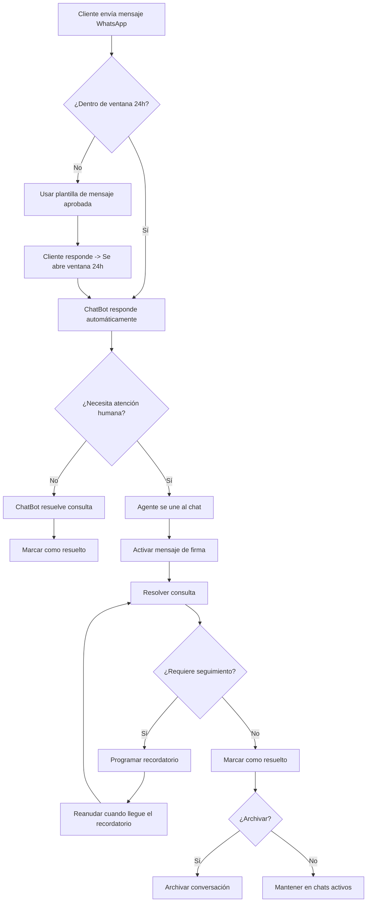

import { Callout, Steps, Step, Expandable, Columns, Card, Tabs, Tab, CodeGroup, CodeGroupItem, Update } from '/src/components/mdx';

> **Actualización: Bandeja Compartida y Chat en Vivo (2026-05-06)**
> Se han añadido nuevas funcionalidades como mensajes de firma personalizables, Join Chat para transferencia entre agentes, indicador de escritura, reescritura con IA, traducción de mensajes, y temporizador de reactivación automática del bot. La bandeja compartida ahora soporta WhatsApp, Facebook Messenger, Instagram DM, Telegram y Chat Web en un solo panel unificado.

# Chat en Vivo: Bandeja Compartida de WhatsApp para Atención al Cliente

> La bandeja compartida de E-SMART360 centraliza todos los mensajes de tus clientes desde múltiples canales — WhatsApp, Facebook Messenger, Instagram DM, Telegram y Chat Web — en un solo panel colaborativo. Tu equipo puede gestionar, asignar y responder a todas las conversaciones sin perder ningún mensaje.

Las investigaciones muestran que una gran cantidad de clientes no finalizan sus compras después de añadir productos al carrito, con estudios que indican que hasta el **70% de los clientes no concretan sus compras**. Este fenómeno, conocido como **"abandono de carrito"**, tiene múltiples causas.

Una de las principales razones que los clientes admiten es la falta de soporte al cliente por parte de las empresas online. Esto resulta en pérdidas financieras sustanciales para la industria del comercio electrónico, con estimaciones que superan los **$18 mil millones anuales**, según documenta Forrester Research. Esto aplica a cualquier negocio online.

La plataforma de Chat en Vivo con Bandeja Compartida de E-SMART360 es una herramienta excepcional para el soporte al cliente. Combina el poder de los chatbots con la flexibilidad del chat en vivo, lo que puede impulsar el éxito en tu estrategia de marketing por WhatsApp.

En esta guía completa, exploraremos los beneficios del chat en vivo, las funcionalidades de la plataforma, cómo configurarla paso a paso, y cómo aprovechar al máximo cada herramienta disponible.

> Con E-SMART360, puedes reducir los tiempos de respuesta hasta en un 52%, resolver tickets 32 veces más rápido, y mantener una experiencia de cliente unificada en todos los canales de comunicación.

## ¿Qué es el Chat en Vivo con Bandeja Compartida?

El chat en vivo es una herramienta que te permite hablar con tus clientes o visitantes desde tu sitio web en tiempo real, igual que en cualquier otra plataforma de mensajería.

El chat en vivo con bandeja compartida combina la comunicación en tiempo real con la eficiencia de una plataforma donde los equipos de soporte pueden gestionar, rastrear y responder mensajes de forma colaborativa. Proporciona a las empresas un espacio unificado para manejar consultas de soporte, comentarios y solicitudes de atención, asegurando que ningún mensaje pase desapercibido.

E-SMART360 proporciona chat en vivo con **bandeja compartida para WhatsApp**, Facebook Messenger, Instagram DM, Telegram y también Chat Web para tu sitio web. Esto significa que puedes conectar todas las páginas o perfiles de negocio para WhatsApp, Facebook, Instagram DM, Telegram y Chat Web en una sola plataforma centralizada y operar tu operación de soporte al cliente con todo tu equipo.

> Al integrar todos tus canales de mensajería en una sola bandeja compartida, eliminas la necesidad de alternar entre múltiples aplicaciones y ventanas. Todo está en un solo lugar, lo que reduce drásticamente el tiempo de respuesta y mejora la productividad del equipo.

## Beneficios del Chat en Vivo con Bandeja Compartida

**Comunicación en Tiempo Real:** El chat en vivo te permite responder a las consultas de los clientes en tiempo real, reduciendo los tiempos de espera y aumentando la satisfacción del cliente. A nadie le gusta esperar, y hoy en día las personas tienen muy poca paciencia, especialmente online.

**Interacción Personalizada:** El chat en vivo en WhatsApp permite que tus agentes de soporte se comuniquen con tus clientes de una manera más personalizada. De esta forma, tus agentes pueden enfocarse en las necesidades individuales de cada cliente, y tu cliente se sentirá más satisfecho.

**Mayor Compromiso del Cliente:** Cuando tus clientes reciben respuestas consistentes que resuelven sus problemas, siempre volverán por más. Esto abre una gran oportunidad para que tu negocio gane la confianza de los clientes, aumentando la probabilidad de conversión y generando mayores tasas de engagement.

**Mejora en la Retención de Clientes:** Con un soporte rápido y eficiente, es más probable que los clientes permanezcan leales a una marca, lo que se traduce en tasas de retención más altas.

**Colaboración en Equipo:** Todo el equipo accede, gestiona y responde desde el mismo lugar. Mejora el trabajo en equipo, agiliza la comunicación y garantiza una experiencia de cliente consistente.

**Eficiencia y Productividad:** Asigna conversaciones a miembros específicos, prioriza consultas urgentes y configura respuestas automatizadas para preguntas frecuentes.

**Integración Perfecta:** Se integra directamente con tu cuenta de WhatsApp Business API, aprovechando todas las capacidades de WhatsApp sin configuraciones complejas.

**Seguimiento y Análisis:** Obtén información detallada sobre interacciones, tiempos de respuesta, volumen de conversaciones y satisfacción del cliente.

## Cómo usar el Chat en Vivo con Bandeja Compartida en tu Sitio Web

### Crear un Widget de Chat para WhatsApp

Para usar el chat en vivo de E-SMART360 en tu sitio web, primero debes crear un widget de chat desde la configuración del gestor de bots. Al crear el widget, asegúrate de usar tu número oficial de WhatsApp para la cuenta del bot.

### Insertar el Código del Widget en tu Sitio Web

Una vez que hayas creado el widget de chat, puedes insertar tu widget de chat de WhatsApp en tu página de inicio y en cualquier otra página importante de tu sitio web donde creas que sería beneficioso. Esto permite que tus clientes inicien fácilmente una conversación con tu agente de chat en vivo si tienen alguna pregunta o necesitan asistencia.

### Integrar el Asistente de IA

También puedes integrar el asistente de IA de E-SMART360 en tu chatbot. Si es necesario, tus agentes también pueden tomar el control de la conversación más tarde y ayudar al cliente más a fondo.

De la misma manera, puedes usar otras plataformas como Facebook Messenger, Instagram DM y Telegram con su widget de chat en tu sitio web.

### Chat Web en tu Sitio Web

Al igual que el chat en vivo para WhatsApp, puedes comunicarte directamente con tus clientes a través del Chat Web integrado en tu sitio web. Algunos de tus clientes podrían querer hablar directamente contigo a través del chat web, en ese caso, E-SMART360 te permite a ti y a los miembros de tu equipo comunicarte con ellos a través del chat en vivo.

## Colaboración en Equipo con la Bandeja Compartida

La plataforma de chat en vivo de E-SMART360 facilita que tú y tu equipo ayuden a los clientes con sus problemas u otras consultas. También ayuda a trabajar juntos como equipo con su función de colaboración en equipo. Esto es lo que puedes hacer:

### Comunicación Personalizada

Con las diversas herramientas de chat en vivo, puedes hablar con tus clientes como si los conocieras de toda la vida basándote en los datos del cliente. Por ejemplo, cuando tu cliente inicia una conversación, puedes guardar datos importantes en la nota del chat en vivo. Más tarde, cuando ese cliente regrese, puedes usar esos datos para brindarle un excelente soporte al cliente. De esta manera, puedes asegurarte de que cada chat con un cliente sea relevante, lo que aumentará la satisfacción y la lealtad del cliente hacia ti.

### Colaboración en Equipo

E-SMART360 está diseñado pensando en la colaboración en equipo. Múltiples agentes pueden atender diferentes consultas de clientes, lo que garantiza una respuesta integral. Esta función es especialmente beneficiosa para equipos remotos, permitiéndoles colaborar de manera efectiva independientemente de su ubicación.

### Colaboración del Equipo de Servicio al Cliente

E-SMART360 tiene herramientas como notas, etiquetas y agentes asignados que permiten a los agentes colaborar en problemas complejos sin que el cliente se entere, asegurando un proceso de resolución fluido.

### Herramientas de Colaboración para Miembros del Equipo Remoto

E-SMART360 tiene herramientas que ayudan a los equipos a trabajar juntos incluso si no están en el mismo lugar. Estas herramientas incluyen bandejas compartidas, asignación de tareas a diferentes personas y formas de trabajar juntos en tiempo real para que todos estén en la misma página.

### Análisis y Reportes

E-SMART360 proporciona herramientas detalladas de análisis e informes que ayudan a las empresas a rastrear las interacciones con los clientes y el rendimiento del equipo. Estos datos son invaluables para tomar decisiones informadas y mejorar continuamente el servicio al cliente.

## Funcionalidades del Chat en Vivo Explicadas

El chat en vivo de E-SMART360 es una herramienta con muchas funcionalidades. Cuando inicias sesión en tu cuenta de administrador de E-SMART360 y vas al Chat en Vivo de WhatsApp desde el panel de control, puedes ver que toda la página de chat en vivo se divide en tres secciones:

1. **Sección de Lista de Suscriptores**
2. **Sección de Ventana de Chat**
3. **Sección de Acciones del Chat**

### Sección de Lista de Suscriptores

Esta sección está diseñada principalmente para mostrar todos tus suscriptores de WhatsApp en un solo lugar. Después de poner tu número de WhatsApp Business en tu sitio web o insertar un widget de chat, cuando un cliente te envía un mensaje en ese número o widget, instantáneamente se convierte en tu suscriptor.

También puedes importar contactos de WhatsApp desde Google Sheets a E-SMART360. En esta sección, encontrarás una lista completa de todos tus suscriptores. Hay una barra de búsqueda en la parte superior. Simplemente ingresa el nombre de un suscriptor para localizarlo rápidamente y comenzar un chat con él.

> Esta función es especialmente útil durante los momentos de mayor actividad cuando estás manejando múltiples conversaciones con clientes. Si la respuesta de un cliente se retrasa, puedes cambiar fácilmente a otro chat sin perder el seguimiento de la conversación original. Solo usa la barra de búsqueda para encontrar el nombre del cliente y reanudar tu chat.

#### Búsqueda Avanzada con Filtros

Además de la barra de búsqueda, tienes una opción de filtro. Esta opción se utiliza para filtrar suscriptores según etiquetas, secuencias e interacciones recientes.

**Filtro por Etiquetas:** Haz clic en "Seleccionar etiqueta" y aparecerá un menú desplegable con todas las etiquetas. Elige una etiqueta y en la lista de suscriptores solo verás los suscriptores que tienen esa etiqueta.

**Filtro por Secuencias:** Al igual que las etiquetas, "Seleccionar secuencia" te permite filtrar todos los suscriptores que están bajo una secuencia de mensajes automatizada.

**Ordenar por:** Hay dos opciones más disponibles:
- **Respuesta reciente del suscriptor** — Filtra los suscriptores que te han respondido recientemente.
- **Comunicación reciente** — Filtra todos los suscriptores a los que has respondido recientemente.

#### Gestión de Vistas de Chats

| Vista | Descripción |
|-------|-------------|
| **Mis chats** | Muestra solo los chats asignados al agente actual. Cada agente ve solo sus clientes asignados. |
| **Todos los chats** | Lista completa de todas las conversaciones entrantes, sin filtrar por agente. |
| **No leídos** | Muestra solo los mensajes que aún no has abierto o leído. |
| **Archivados** | Conversaciones guardadas para referencia futura o análisis posterior. |
| **Bloqueados** | Mensajes no deseados, spam o mensajes abusivos. |
| **Resueltos** | Lista de clientes cuyos casos han sido cerrados y solucionados. |

> La función de chats archivados es excelente para almacenar conversaciones pasadas para referencia o análisis. Al analizar chats archivados, las empresas pueden identificar áreas de mejora en su servicio, proporcionar ejemplos del mundo real a los nuevos agentes y garantizar el cumplimiento de los estándares de la industria.

### Sección de Ventana de Chat

La ventana de chat es una parte muy crucial del chat en vivo de E-SMART360. Básicamente, chateas con tus clientes en esta sección. Está llena de varias funcionalidades importantes como "Marcar como", "Traducir mensaje", "Responder mensajes", "Reescribir con IA", "Enviar Flows o Plantillas de Mensaje", "Respuestas Predefinidas" y muchas más.

#### Marcar un Chat

Puedes marcar cualquier conversación como **no leída** o **archivarla**, e incluso bloquear a cualquier cliente que envíe spam desde esta sección usando la función "Marcar como".

**Cómo hacerlo:**
1. Selecciona un suscriptor de la lista de suscriptores.
2. Haz clic en el botón "Marcar como".
3. Aparecerá un menú desplegable y podrás tomar la acción necesaria.

#### Recordatorio de Seguimiento

La función de **seguimiento** es una herramienta útil para los equipos de soporte al cliente. Actúa como un recordatorio, permitiéndote programar una hora para responder al chat de un cliente cuando no puedas hacerlo de inmediato. Esto es especialmente útil cuando tienes múltiples chats en curso. Al establecer una hora de seguimiento, puedes asegurarte de que ningún mensaje de cliente quede sin respuesta y organizar mejor tu carga de trabajo.

**Cómo hacerlo:**
1. Haz clic en el botón de recordatorio de seguimiento.
2. Aparecerá un menú desplegable.
3. Elige una hora para recibir el recordatorio. También puedes personalizar la fecha y hora exacta del recordatorio.

> El recordatorio de seguimiento es una de las funciones más valoradas por los equipos de soporte. Te permite priorizar tu atención sin miedo a olvidar ninguna conversación importante. Cuando llegue la hora programada, recibirás una notificación para que puedas retomar esa conversación exactamente donde la dejaste.

#### Traducir Mensaje

Esta opción te permite traducir instantáneamente mensajes de texto de un idioma a otro. Esto es particularmente útil para empresas que atienden a una base de clientes global o para individuos que se comunican con personas que hablan diferentes idiomas.

Si tienes algún cliente extranjero que te está escribiendo en su idioma, simplemente haz clic en el botón **traducir** para traducir el mensaje. También puedes ver qué idioma es y responderle en su propio idioma, haciendo que el soporte al cliente sea más personalizado. Esto puede ganar la confianza de los clientes y llevarte hacia una venta.

**Cómo hacerlo:**
1. Simplemente haz clic en el botón de traducir debajo de un mensaje.
2. Se traducirá automáticamente al idioma predeterminado configurado en el sistema.

#### Mensajes de Firma

Los mensajes de firma permiten que tu cliente sepa que tú o cualquiera de tus agentes están tomando el control de la conversación a partir de ese momento. Puede incluir el nombre del agente, su cargo y otra información personalizada para hacer las interacciones más profesionales. Al hacer clic en esta opción, se envía automáticamente un mensaje al cliente, como: "Hola, soy Ana, agente de soporte de E-SMART360. Te atenderé de ahora en adelante."

Esto proporciona una supervisión valiosa tanto para ti como para tus agentes, permitiéndote rastrear qué agente está manejando a cada cliente. Esta transparencia mejora la profesionalidad, aumenta la productividad y optimiza la experiencia general del servicio al cliente.

**Cómo hacerlo:**
1. Primero, haz clic en el nombre del suscriptor desde la sección de suscriptores.
2. Antes de comenzar una conversación con un cliente, puedes ver si un agente ya está conversando con este cliente.
3. Si deseas unirte a la conversación, puedes marcar la opción "Enviar mensaje de firma al suscriptor" y luego hacer clic en "Unirse al Chat". Esto enviará un mensaje de firma a ese cliente. Puedes configurar el mensaje desde la opción de configuración.
4. O puedes simplemente unirte a la conversación sin enviar ningún mensaje al cliente, sin marcar la opción de "Enviar mensaje de firma al suscriptor".

Cuando hayas terminado de ayudar al cliente, haz clic en el botón "Acción" dentro de la sección de acciones del chat. Selecciona "Salir del Chat" para indicar tu salida de la conversación.

#### Configuración de Mensajes de Firma desde el Panel de Configuración

### Accede al panel de configuración

Inicia sesión en tu cuenta de E-SMART360. Desde el panel de control, haz clic en la opción **Gestor de Bot** y luego selecciona la pestaña **Configuración**.
  
### Activa los mensajes de firma

Una vez en el panel de configuración, localiza la sección **Configuración de Mensaje de Firma**. Activa el interruptor para habilitar la función.
  
### Configura el mensaje predeterminado

En el campo **Mensaje de Firma Predeterminado**, ingresa tu mensaje deseado. Por ejemplo: "Hola, soy [Nombre], agente de soporte de E-SMART360. ¿Cómo puedo ayudarte hoy?" Usa el marcador dinámico [Nombre] para que se autocomplete automáticamente con el nombre del agente.
  
### Personaliza firmas individuales

Cada agente puede personalizar su firma navegando a **Configuración de miembro** desde el ícono de su cuenta (esquina superior derecha) y seleccionando "Cuenta". Allí pueden editar su campo de firma para incluir información específica como su rol o un saludo personalizado.
  
### Activa el indicador de escritura

Puedes activar el "Indicador de escritura" en la configuración de la bandeja compartida. Esto muestra automáticamente "escribiendo..." en WhatsApp cuando: un agente comienza a escribir una respuesta, un agente hace clic en el cuadro de chat (incluso antes de escribir), o el bot está generando una respuesta. Esto comunica de forma proactiva al cliente que hay un agente comprometido.
  
### Guarda los cambios

Después de configurar todo, haz clic en el botón **Guardar cambios** para asegurarte de que tu configuración se aplique correctamente.
  
#### Indicador de Escritura (Typing Indicator)

Puedes activar la opción de mostrar automáticamente un indicador "escribiendo..." en WhatsApp en el chat en vivo cuando:
- Un agente comienza a escribir una respuesta.
- Un agente simplemente hace clic o toca el cuadro de mensaje (incluso antes de escribir).
- El bot está generando una respuesta.

**Por qué es importante:** Mantiene a los clientes informados durante la generación de respuestas del bot, las transferencias entre agentes o cuando los agentes necesitan un momento antes de responder, creando una experiencia más fluida y receptiva. WhatsApp oculta automáticamente el indicador después de 25 segundos de inactividad o cuando se envía un mensaje.

**Cómo configurarlo:**
1. Ve a Gestor de Bot desde la sección de WhatsApp.
2. Desplázate hacia abajo hasta Configuración.
3. Localiza la opción INDICADOR DE ESCRITURA y actívala.

#### Reescribir con IA

Puedes generar automáticamente respuestas apropiadas corrigiendo errores de gramática, ortografía y puntuación usando esta opción.

**Cómo hacerlo:**
1. Escribe un mensaje que quieras enviar a tu cliente.
2. Haz clic en el botón "Reescribir con IA".
3. Tu mensaje se corregirá gramaticalmente y se mejorará su redacción.

> La función de reescritura con IA es especialmente útil cuando necesitas responder rápidamente pero quieres asegurarte de que tu mensaje sea profesional y esté bien redactado. Es como tener un corrector de estilo integrado directamente en tu chat.

#### Enviar Flows o Plantillas de Mensaje

Los Flows y las plantillas de mensaje son secuencias preescritas de mensajes o flujos de bot que puedes usar en conversaciones de chat en vivo.

**Cómo hacerlo:**
1. Haz clic en el botón de Plantilla de Mensaje. Aquí puedes ver todos tus Flows de Bot y Plantillas de Mensaje en un solo panel.
2. De la lista, selecciona una plantilla de mensaje o un Flow que quieras enviar.
3. Proporciona los valores para las variables personalizadas.
4. Envía el mensaje.

Los Flows son especialmente útiles para recopilar información estructurada del cliente, como direcciones de envío, preferencias de producto o datos de contacto. Los formularios interactivos se renderizan directamente dentro de WhatsApp.

#### Respuestas Predefinidas (Canned Responses)

Las respuestas predefinidas en el chat en vivo son mensajes preescritos que puedes insertar rápidamente en una conversación. Estas plantillas están diseñadas para agilizar las interacciones, especialmente para preguntas frecuentes o escenarios comunes.

**Cómo hacerlo:**
1. Haz clic en el botón de Respuestas Predefinidas.
2. Elige una respuesta existente.
3. También puedes crear una nueva respuesta haciendo clic en el botón "Añadir nueva".

**Usos ideales para respuestas predefinidas:**
- Preguntas frecuentes (horarios, precios, políticas de envío)
- Escenarios comunes de soporte técnico
- Saludos y cierres estandarizados
- Información de contacto de la empresa
- Procedimientos de devolución o reembolso

#### Compartir Archivos Adjuntos

Los archivos adjuntos se refieren a archivos que se pueden compartir entre un cliente y un agente durante una conversación. Estos archivos pueden incluir documentos, imágenes, capturas de pantalla u otra información relevante que pueda ayudar a resolver la consulta o el problema de un cliente.

**Carga de medios mediante arrastrar y soltar:**
Tus agentes pueden simplemente arrastrar y soltar archivos como imágenes, documentos, etc., directamente en la ventana de chat para compartirlos fácilmente. Esto reduce la complejidad y es intuitivo y fácil de usar.

**Enviar múltiples archivos a la vez:**
Puedes seleccionar y enviar múltiples archivos (imágenes, documentos, etc.) simultáneamente usando la función de carga por arrastrar y soltar. Simplemente selecciona varios archivos manteniendo presionada la tecla CTRL, arrastra todos al icono del navegador y suéltalos en la ventana de chat. Se cargarán instantáneamente. Luego puedes añadir un pie de foto o hacer clic en guardar para enviarlos todos a la vez.

#### Visualización de Audio y Video

Puedes compartir y reproducir archivos de audio y video directamente en la ventana de chat. Esto es crítico para el soporte técnico.

Por ejemplo, si un cliente envía un video mostrando problemas de software para diagnóstico, anteriormente tendrías que abrirlo en otra pestaña del navegador para reproducirlo. Gracias a la última actualización, tus agentes ahora pueden reproducir directamente el contenido multimedia en la ventana de chat.

Esto ayuda enormemente en servicios al cliente como demostraciones de productos, diagnósticos técnicos y comunicación general donde se necesita soporte visual y de audio.

### Sección de Acciones del Chat

La sección de acciones del chat es principalmente útil para mejorar la eficiencia del soporte al cliente y simplificar los flujos de trabajo del equipo.

#### Botón de Acción

Puedes suscribir o cancelar la suscripción de clientes fácilmente, pausar las respuestas del bot temporalmente y restablecer los flujos de entrada del usuario para garantizar una experiencia sin problemas usando el botón de Acciones.

### Suscribir / Dar de baja

Puedes suscribir o cancelar la suscripción de un cliente según sea necesario. Si ves la opción "Dar de baja", significa que el cliente está actualmente suscrito. Si muestra "Suscribir", significa que el cliente no está suscrito y debes hacer clic en esa opción para suscribirlo.
  
### Reanudar / Pausar respuesta del bot

Usando esta opción, puedes tomar fácilmente el control de la conversación. Simplemente pausa la respuesta del bot, proporciona soporte al cliente, y luego reanuda la respuesta del bot cuando hayas terminado.
  
### Restablecer flujo de entrada del usuario

Puedes restablecer fácilmente todos los flujos de entrada del usuario que se configuraron para un cliente con solo un clic en esta opción. Esto es útil si un cliente se quedó atascado en un flujo automatizado.
  
### Limpiar historial del chat

Al hacer clic en esta opción, se eliminará el historial de chat de tu chat en vivo. Pero el cliente aún tendrá el historial completo intacto en su WhatsApp o en cualquier otra plataforma desde la que contactó.
  
### Salir del chat

Cuando hayas terminado de ayudar a un cliente, puedes salir de esta conversación haciendo clic en la opción "Salir del chat".
  

> Recuerda que al pausar el bot, estás tomando el control manual de la conversación. Si olvidas reanudar el bot, puedes configurar un temporizador de reactivación automática para que el bot se reactive después de un tiempo determinado. Esto garantiza que ningún cliente se quede sin respuesta incluso si los agentes están ocupados con otras tareas.

#### Asignar un Agente

Puedes asignar un agente específico a cualquier suscriptor para garantizar una atención personalizada y responsable.

**Cómo hacerlo:**
1. Haz clic en el menú "Asignar agente".
2. Elige un agente para esta conversación del menú desplegable. También puedes ver qué agente está activo en ese momento.
3. Haz clic en guardar cambios. Este cliente será asignado a tu agente.
4. El agente asignado recibirá una notificación automática al mismo tiempo.

Esta funcionalidad es especialmente útil para equipos grandes donde cada miembro tiene especialidades diferentes: ventas, soporte técnico, facturación, etc.

#### Etiquetas

Las etiquetas en el chat en vivo son como marcas o categorías que puedes usar para asignar un cliente a una categoría específica.

Un agente de soporte al cliente podría usar etiquetas para categorizar clientes según el tema (por ejemplo, "facturación", "soporte técnico", "devoluciones"), la ubicación del cliente o el agente que manejó la conversación. Esto facilita encontrar conversaciones específicas, analizar datos de clientes y garantizar que las consultas de los clientes se aborden de manera eficiente y efectiva.

**Cómo hacerlo:**
1. Haz clic en el menú de etiquetas.
2. Elige una etiqueta del menú desplegable. También puedes escribir un nombre de etiqueta para buscarla.
3. Guarda los cambios.
4. Puedes añadir múltiples etiquetas si es necesario.

**Ejemplos de etiquetas útiles:** "Cliente VIP", "Problema técnico", "Seguimiento pendiente", "Venta potencial", "Reclamo", "Facturación", "Soporte nivel 1", "Escalado a gerencia".

#### Campos Personalizados Asignados

Aprovecha la función de campos personalizados asignados para recopilar datos esenciales del cliente y brindar una asistencia más personalizada y eficiente. Para equipos grandes, almacenar la información del cliente en campos personalizados ayuda a los agentes a comprender rápidamente el historial del chat y ofrecer soporte informado y oportuno.

**Cómo hacerlo:**
1. Haz clic en el menú "Campo personalizado asignado".
2. Elige un campo personalizado del menú. Puedes crear un nuevo campo personalizado desde el gestor de suscriptores.
3. Después de elegir un campo personalizado, proporciona el valor y guárdalo.

**Ejemplos de campos personalizados:** Dirección de envío, Teléfono alternativo, Preferencia de producto, Fecha de cumpleaños, ID de cliente interno, Notas de crédito.

#### Añadir Notas

Puedes añadir múltiples notas para almacenar información importante sobre un cliente. Esto puede ayudarte a ti y a los miembros de tu equipo a entender fácilmente de qué trata la conversación y cómo responder a este cliente en poco tiempo sin leer toda la conversación. También puedes ver qué agente añadió cada nota, porque junto a cada nota habrá información sobre qué agente la añadió y cuándo la añadió.

**Cómo hacerlo:**
1. Simplemente haz clic en el botón "Añadir nota" para agregar una nota.
2. Puedes añadir múltiples notas si es necesario.

> Las notas internas son visibles solo para tu equipo. Son perfectas para: registrar información contextual sobre el cliente, dejar instrucciones para otros agentes, documentar acuerdos o decisiones tomadas durante la conversación, y guardar recordatorios sobre necesidades especiales del cliente.

#### Ventana de 24 Horas

Hay un contador regresivo visible que indica cuánto tiempo queda antes de que la ventana de chat se cierre automáticamente. WhatsApp tiene una regla de 24 horas, lo que significa que si un cliente o suscriptor te envía un mensaje, el temporizador comenzará a contar hacia atrás hasta que terminen las próximas 24 horas.

> La ventana de 24 horas es crítica. Una vez que se cierra, no podrás enviar mensajes al cliente sin usar una plantilla de mensaje aprobada por Meta. Siempre verifica el temporizador antes de pausar una conversación o salir del chat. Si ves que el tiempo se está agotando, prioriza esa conversación o usa una plantilla de mensaje para reiniciar la ventana.

## Transferencia de Chat entre Agentes (Join Chat)

La función **Unirse al Chat** permite que los agentes tomen el control de una conversación en curso con solo hacer clic en un botón. Es una de las herramientas más poderosas para equipos con múltiples miembros de soporte, ya que permite transiciones suaves entre agentes manteniendo el flujo de la conversación.

### Cómo funciona

Cuando un agente selecciona la opción de unirse al chat:

1. El panel de chat se recarga automáticamente.
2. El nuevo agente ve todo el historial de la conversación, incluyendo notas y etiquetas.
3. Si la opción "Enviar mensaje de firma" está activada, se envía automáticamente una presentación al cliente.
4. El cliente sabe que ahora está siendo atendido por un miembro diferente del equipo.
5. El nuevo agente puede continuar la conversación desde donde se quedó el anterior.

### ¿Cuándo usar la transferencia de chat?

- Un cliente solicita hablar con un miembro diferente del equipo.
- Un cliente está frustrado y el agente actual no logra resolver el problema.
- El equipo de soporte técnico debe transferir la conversación a un especialista más capacitado.
- Se necesita una escalación a un supervisor o gerente.
- El agente original termina su turno y otro agente debe continuar con la atención.
- Un cliente tiene una consulta que cruza múltiples departamentos (ventas, facturación, soporte técnico).

### Beneficios de la transferencia de chat

- **Continuidad:** El cliente nunca tiene que repetir su historia porque todo el historial es visible.
- **Especialización:** Cada consulta llega al agente más capacitado para resolverla.
- **Eficiencia:** Los agentes pueden enfocarse en lo que mejor saben hacer.
- **Satisfacción:** Los clientes se sienten escuchados y bien atendidos al ser transferidos al especialista correcto.

### Buenas prácticas para la transferencia

### Comunica la transferencia al cliente

Antes de transferir, informa al cliente que será atendido por otro colega. Una transición informada reduce la fricción.
  
### Activa siempre el mensaje de firma

Esto asegura una transición profesional y transparente.
  
### Deja notas claras

Explica brevemente el contexto y lo que ya se ha hecho para que el nuevo agente pueda continuar sin problemas.
  
### No transfers sin necesidad

Si puedes resolver la consulta, hazlo tú mismo. Evita transferencias innecesarias que puedan frustrar al cliente.
  
### Verifica la disponibilidad

Asegúrate de que el agente destino esté disponible antes de transferir. No tiene sentido transferir a un agente que está ocupado o ausente.
  

> Activar los mensajes de firma también activa la opción **Unirse al Chat**. Esto asegura que solo los agentes que se han unido al chat puedan responder a los mensajes del cliente. Sin unirse, los agentes pueden ver pero no responder directamente, garantizando la responsabilidad y organización en la comunicación.

### Ejemplos de Mensajes de Firma

### Atención al Cliente

*"Hola, soy Ana del equipo de soporte de E-SMART360. Estoy aquí para ayudarte con tu consulta. ¿En qué puedo asistirte hoy?"*
  
### Ventas

*"¡Hola! Soy Carlos, asesor comercial de E-SMART360. Cuéntame, ¿cómo puedo ayudarte a encontrar la solución ideal para tu negocio?"*
  
### Soporte Técnico

*"Buenos días, soy Roberto del equipo técnico de E-SMART360. He revisado tu caso y estoy aquí para resolverlo. ¿Podrías confirmarme algunos detalles?"*
  
### Postventa

*"Hola, soy Marcela de atención postventa. Damos seguimiento a tu compra reciente. ¿Todo está funcionando correctamente?"*
  
## Temporizador de Reactivación Automática del Bot

Puedes configurar un tiempo de reactivación automática del bot para evitar olvidos. Si un agente pausa el bot para atender manualmente pero se olvida de reanudarlo, el sistema lo reactivará automáticamente después del tiempo configurado. Esto garantiza seguimientos oportunos incluso cuando los agentes están ocupados con otras tareas.

> Al configurar la reactivación automática, asegúrate de que el tiempo sea suficiente para que el agente complete su intervención manual. Un tiempo demasiado corto podría reactivar el bot mientras el agente sigue escribiendo, causando interrupciones en la comunicación.

## Personalización y Marca

Adapta la experiencia del chat en vivo a la identidad de tu marca:

- Personaliza la apariencia del widget de chat en tu sitio web.
- Configura los colores, logotipos y elementos visuales de tu marca.
- Crea una experiencia de cliente consistente en todos los puntos de contacto.
- Refuerza la lealtad a la marca en cada interacción.

## Análisis y Métricas

Toma decisiones basadas en datos y optimiza tu estrategia de atención con análisis detallados:

- **Interacciones con clientes:** Volumen de conversaciones por día, semana o mes.
- **Tiempos de respuesta:** Velocidad promedio de atención por agente y por equipo.
- **Volumen de conversaciones:** Identifica picos de demanda y distribuye la carga de trabajo.
- **Satisfacción del cliente:** Mide la calidad del servicio mediante encuestas y feedback.
- **Rendimiento del equipo:** Compara métricas entre agentes y detecta áreas de mejora.

> Con la bandeja compartida de E-SMART360, tu equipo puede reducir los tiempos de respuesta hasta en un 52%, resolver tickets 32 veces más rápido y mantener una experiencia de cliente unificada en todo momento. Los datos de análisis te permiten optimizar continuamente tu operación de soporte.

## Comparativa de E-SMART360 con Otras Plataformas de Chat en Vivo

Cuando se trata de elegir una plataforma de chat en vivo para WhatsApp, hay varias opciones disponibles. Sin embargo, la plataforma de E-SMART360 ofrece ventajas distintivas sobre sus competidores:

| Característica | E-SMART360 | LiveChat | Tidio | HubSpot | Intercom |
|---|---|---|---|---|---|
| **Facilidad de uso** | ⭐⭐⭐⭐⭐ | ⭐⭐⭐⭐ | ⭐⭐⭐⭐⭐ | ⭐⭐⭐ | ⭐⭐⭐⭐ |
| **Cambio de tema** | ✔️ Sí | ✔️ Sí | ✔️ Sí | ✔️ Sí | ✔️ Sí |
| **Integración de IA Chatbot** | ✔️ Sí | ✔️ Sí | ✔️ Sí | ✔️ Sí | ✔️ Sí |
| **Respuestas predefinidas** | ✔️ Sí | ✔️ Sí | ✔️ Sí | ✔️ Sí | ✔️ Sí |
| **Traducción de mensajes** | ✔️ Sí | ✔️ Sí | No | ✔️ Sí | ✔️ Sí |
| **Traducir a (qué idioma)** | ✔️ Sí | ❌ No | ❌ No | ❌ No | ❌ No |
| **Colaboración en equipo** | ✔️ Sí | ✔️ Sí | ✔️ Sí | ✔️ Sí | ✔️ Sí |
| **Enviar Flows de WhatsApp** | ✔️ Sí | ❌ No | ❌ No | ❌ No | ❌ No |
| **Recordatorio de seguimiento** | ✔️ Sí | ❌ No | ❌ No | ❌ No | ❌ No |
| **Convertir audio a texto** | ✔️ Sí | ❌ No | ❌ No | ❌ No | ❌ No |
| **Sistema de tickets** | ✔️ Sí | ✔️ Sí | ✔️ Sí | ✔️ Sí | ✔️ Sí |
| **Prueba gratuita** | ✔️ Sí | ❌ No | ✔️ Sí | ✔️ Sí | ❌ No |
| **Precio inicial** | **$8.99/mes** | $20/mes | $29/mes | $15/mes | $39/mes |

> Como puedes ver en la tabla comparativa, otras plataformas de chat en vivo como LiveChat, Tidio, HubSpot e Intercom tienen características similares. E-SMART360 se destaca con su traducción en el chat, Flows de WhatsApp, recordatorio de seguimiento, conversión de audio a texto y muchas más funciones. Estas características son completamente únicas de E-SMART360. Y el punto clave de venta es su precio: desde solo $8.99 USD al mes.

## Por qué E-SMART360 es la Mejor Opción

La plataforma de Chat en Vivo para WhatsApp de E-SMART360 es una herramienta poderosa que ofrece todo lo que tu negocio necesita para brindar un servicio al cliente excepcional. Desde la integración perfecta con WhatsApp hasta las funciones avanzadas de colaboración en equipo, E-SMART360 proporciona una solución integral que supera a sus competidores.

Ya sea que busques mejorar el compromiso del cliente, impulsar la colaboración del equipo o simplemente proporcionar una mejor experiencia al cliente, la plataforma de E-SMART360 es la mejor opción para las empresas que buscan mantenerse a la vanguardia en el mercado competitivo actual.

## Cómo empezar a usar la Bandeja Compartida

Sigue estos pasos para poner en marcha tu bandeja compartida:

### Conecta tu WhatsApp Business API

Asegúrate de tener una cuenta de WhatsApp Business API activa y conectada a E-SMART360. Si necesitas ayuda, consulta nuestra guía de conexión en la documentación de configuración.
  
### Invita a tu equipo

Agrega a los miembros de tu equipo como agentes desde el panel de administración. Asigna roles y permisos según las responsabilidades de cada uno.
  
### Configura etiquetas predefinidas

Crea las etiquetas que usarás para clasificar las conversaciones: "Ventas", "Soporte técnico", "Facturación", "Postventa", "Cliente VIP", etc.
  
### Activa los mensajes de firma

Desde Gestor de Bot > Configuración, activa los mensajes de firma y personaliza el mensaje predeterminado.
  
### Crea respuestas predefinidas

Prepara respuestas rápidas para las preguntas más frecuentes de tus clientes. Esto agilizará la atención.
  
### Configura campos personalizados

Define los campos de información que quieres recopilar de tus clientes, como dirección, teléfono, preferencias, etc.
  
### Realiza una prueba

Envía un mensaje de prueba desde WhatsApp a tu número de negocio y verifica que el mensaje aparece en la bandeja compartida, los agentes pueden verlo y responder, y las firmas y etiquetas funcionan correctamente.
  
## Casos de Uso Práctico

### Ejemplo 1: Equipo de soporte multicanal

Una empresa de comercio electrónico utiliza la bandeja compartida con 5 agentes de soporte:

1. Un cliente envía un mensaje por WhatsApp preguntando por el estado de su pedido.
2. El chatbot de E-SMART360 responde automáticamente con la información de seguimiento básica.
3. Si el cliente necesita ayuda adicional, la agente **Marcela** se une al chat.
4. Marcela activa su mensaje de firma: "Hola, soy Marcela, especialista en pedidos de E-SMART360. ¿En qué más puedo ayudarte?"
5. Marcela resuelve la consulta y marca el chat como "Resuelto".
6. Si el cliente vuelve a escribir, el chat se reabre automáticamente.

### Ejemplo 2: Coordinación entre ventas y postventa

### Flujo de ventas

1. El agente de ventas **Carlos** inicia la conversación para calificar un lead.
    2. Carlos usa las etiquetas "Lead calificado" y "Interesado en Plan Premium".
    3. Cuando el cliente quiere proceder con la compra, Carlos asigna el chat al agente de pagos **Roberto**.
    4. Roberto se une automáticamente con su firma personalizada.
    5. El cliente nunca tiene que repetir su información porque todo el historial está visible.
  
### Flujo de postventa

1. Después de la compra, el chat se asigna al equipo de postventa.
    2. La agente **Marcela** programa un recordatorio de seguimiento para 3 días después.
    3. El día del seguimiento, Marcela recibe una notificación y retoma la conversación.
    4. Verifica que el producto llegó correctamente y ofrece soporte adicional.
    5. Marca el caso como resuelto con la etiqueta "Postventa completada".
  
### Ejemplo 3: Atención al cliente internacional

Una agencia de viajes recibe consultas en múltiples idiomas:

1. Un cliente de Francia envía un mensaje en francés preguntando por paquetes turísticos.
2. El agente **Pedro** usa la función de **traducción** para entender el mensaje.
3. Pedro responde en español, pero el sistema traduce automáticamente su respuesta al francés usando la función de traducción.
4. El cliente queda satisfecho porque recibe atención en su idioma nativo.
5. Pedro añade una etiqueta "Cliente internacional - Francia" para referencia futura.

## Tipos de Conversaciones en WhatsApp

Es importante entender los tipos de conversaciones que existen en WhatsApp Business API, ya que impactan directamente en la gestión de tu bandeja compartida:

### Conversaciones iniciadas por el usuario

Son conversaciones que comienzan cuando un cliente te envía un mensaje primero. En este tipo de conversación:

- Tienes una **ventana de 24 horas** para responder de forma gratuita usando cualquier tipo de mensaje.
- El contador regresivo en la bandeja compartida te muestra exactamente cuánto tiempo te queda.
- Puedes usar mensajes de texto, imágenes, videos, documentos y notas de voz.

### Conversaciones iniciadas por la empresa

Son conversaciones que comienzas tú usando una **plantilla de mensaje aprobada**. Esto es necesario cuando:

- La ventana de 24 horas se ha cerrado y necesitas volver a contactar al cliente.
- Quieres enviar una notificación proactiva, como un recordatorio de cita o una actualización de pedido.
- Necesitas iniciar una comunicación de marketing o promocional.

> La bandeja compartida te permite ver fácilmente qué tipo de conversación estás teniendo y cuánto tiempo te queda en la ventana de servicio al cliente. Esto es fundamental para planificar tus respuestas y priorizar las conversaciones que están por expirar.

## Integraciones Disponibles

La bandeja compartida de E-SMART360 se integra con múltiples herramientas para potenciar tu flujo de trabajo:

| Integración | Beneficio |
|-------------|-----------|
| **CRMs (HubSpot, Salesforce)** | Sincroniza contactos y actividades entre plataformas |
| **Sistemas de ticketing (Zendesk, Freshdesk)** | Convierte chats en tickets de soporte automáticamente |
| **Herramientas de automatización (Zapier, Make, Pabbly, N8N)** | Crea flujos de trabajo automatizados entre apps |
| **Google Sheets** | Exporta datos de conversaciones para análisis y reportes |
| **Webhooks / API** | Conecta con sistemas internos y bases de datos personalizadas |
| **WooCommerce / Shopify** | Gestiona pedidos y consultas de clientes directamente |
| **Plataformas de email marketing** | Segmenta contactos basados en interacciones de chat |
| **WhatsApp Catalog** | Muestra y vende productos directamente en el chat |

### Webhooks y API

Puedes usar webhooks para extender la funcionalidad de tu bandeja compartida:

1. Crear automáticamente un ticket en tu sistema cuando un cliente escribe por primera vez.
2. Enviar notificaciones a Slack o Microsoft Teams cuando un chat es asignado a un agente.
3. Registrar todas las conversaciones en tu base de datos para cumplimiento normativo.
4. Actualizar el perfil del cliente en tu CRM con la información recopilada en el chat.
5. Disparar secuencias de email marketing basadas en el comportamiento de chat del cliente.

## Flujo de Trabajo Recomendado

## Preguntas Frecuentes

### ¿Qué es el Chat en Vivo con Bandeja Compartida?

El Chat en Vivo con Bandeja Compartida es un sistema que permite a las empresas gestionar todas las conversaciones de los clientes desde múltiples canales — como WhatsApp, Facebook Messenger, Instagram DM, Telegram y Chat Web — en una sola bandeja de entrada centralizada. Permite a los equipos colaborar, asignar agentes, rastrear conversaciones y responder más rápido sin perder ningún mensaje.

### ¿Cómo ayuda el Chat en Vivo a reducir el abandono de carrito?

E-SMART360 permite el soporte al cliente en tiempo real a través de WhatsApp y otros canales, permitiendo a las empresas responder instantáneamente preguntas, resolver dudas y brindar asistencia durante el proceso de compra. Este soporte inmediato ayuda a eliminar la hesitación y reduce significativamente el abandono de carrito causado por la falta de asistencia al cliente.

### ¿Puedo usar el Chat en Vivo en mi sitio web?

Sí. E-SMART360 te permite insertar widgets de chat para WhatsApp, Chat Web, Facebook Messenger, Instagram DM y Telegram directamente en tu sitio web. Los visitantes pueden iniciar conversaciones instantáneamente, y tu equipo puede gestionarlas desde la bandeja compartida.

### ¿E-SMART360 soporta múltiples agentes de soporte?

Absolutamente. E-SMART360 está diseñado para la colaboración en equipo. Puedes crear múltiples agentes, asignar chats a miembros específicos del equipo, usar notas internas, etiquetas, y rastrear qué agente está manejando cada conversación, todo en tiempo real.

### ¿Puedo combinar la automatización del chatbot con el chat en vivo?

Sí. E-SMART360 combina perfectamente los chatbots de IA con el chat en vivo. El chatbot puede manejar consultas comunes automáticamente, y los agentes pueden tomar el control de las conversaciones en cualquier momento cuando se necesita asistencia humana.

### ¿Qué canales están soportados en la Bandeja Compartida?

E-SMART360 soporta: WhatsApp, Facebook Messenger, Instagram Direct Messages, Telegram y Chat Web. Todos los mensajes de estas plataformas aparecen en una sola bandeja de entrada unificada.

### ¿Qué es la función de Recordatorio de Seguimiento?

El Recordatorio de Seguimiento permite a los agentes programar recordatorios para conversaciones específicas de clientes. Esto asegura que ningún mensaje se olvide, especialmente durante las horas de mayor actividad de soporte, y mejora la consistencia en las respuestas.

### ¿Puedo usar firmas diferentes para distintos agentes?

Sí, absolutamente. Cada agente puede configurar su propia firma personalizada desde la sección **Configuración de miembro > Cuenta**. Allí pueden incluir su nombre, cargo, departamento o cualquier información relevante. También pueden definir si quieren que la firma se envíe automáticamente o de forma manual al unirse a un chat.

### ¿Los mensajes de firma funcionan en todos los canales?

Sí, los mensajes de firma funcionan en todos los canales compatibles: WhatsApp, Facebook Messenger, Instagram, Telegram y el chat en vivo del sitio web. Esto asegura una comunicación profesional y consistente en todas las plataformas donde tengas presencia.

### ¿Qué pasa si un agente abandona el chat? ¿Puede retomarlo otro?

Sí, cuando un agente sale del chat usando la opción "Salir del chat", otro agente puede unirse usando la función **Unirse al Chat**. El nuevo agente verá todo el historial de la conversación y podrá continuar desde donde se quedó. Se recomienda activar el mensaje de firma para que el cliente sepa que ahora lo está atendiendo alguien diferente.

### ¿Cómo sé qué agente está respondiendo en cada momento?

La bandeja compartida muestra claramente qué agente está activo en cada conversación. Además, el indicador de escritura y los mensajes de firma notifican al cliente quién lo está atendiendo. En la vista "Mis chats", cada agente ve solo las conversaciones que tiene asignadas, lo que evita confusiones.

### ¿Se pueden personalizar las etiquetas para organizar clientes?

Sí, puedes crear tantas etiquetas como necesites desde el gestor de suscriptores. Las etiquetas te permiten categorizar clientes por tipo de consulta, etapa del proceso de compra, nivel de urgencia, producto de interés o cualquier criterio que tu equipo defina. Luego puedes filtrar la lista de chats por etiqueta para ver solo los clientes relevantes en cada momento.

### ¿Qué sucede si no respondo dentro de la ventana de 24 horas?

Si no respondes dentro de las 24 horas posteriores al último mensaje del cliente, la ventana de conversación se cierra. Para volver a contactar al cliente, necesitarás usar una plantilla de mensaje aprobada por Meta (WhatsApp). Por eso es importante usar el contador regresivo y los recordatorios de seguimiento para no perder ventanas de atención.

### ¿Existe una prueba gratuita disponible?

Sí. E-SMART360 ofrece una prueba gratuita para que las empresas puedan probar las funciones de Chat en Vivo y Bandeja Compartida antes de actualizar a un plan de pago.

### ¿Puedo integrar la bandeja compartida con otras herramientas?

Sí, E-SMART360 se integra con múltiples plataformas y herramientas como CRMs (HubSpot, Salesforce), sistemas de ticketing (Zendesk, Freshdesk), herramientas de automatización (Zapier, Make, Pabbly, N8N), Google Sheets, WooCommerce, Shopify y más. También puedes usar webhooks para conectar la bandeja compartida con tus sistemas internos.

## Resolución de Problemas

### Los mensajes no se envían

Verifica tu conexión a internet y asegúrate de que el cliente esté dentro de la ventana de respuesta de 24 horas. Si la ventana se ha cerrado, deberás usar una plantilla de mensaje aprobada para reiniciar la conversación. También revisa que el número de teléfono del cliente sea válido y esté registrado en WhatsApp.

### No puedo ver todos los chats en la lista

Revisa qué vista tienes seleccionada en la lista de suscriptores. Si estás en "Mis chats", solo verás las conversaciones asignadas a ti. Cambia a "Todos los chats" para ver el listado completo. Verifica también que no tengas filtros activos de etiquetas o secuencias que estén limitando los resultados.

### El mensaje de firma no se envía al unirme al chat

Asegúrate de que la opción **Enviar mensaje de firma** esté marcada ANTES de hacer clic en el botón para unirte al chat. También verifica en la configuración general que los mensajes de firma estén habilitados y que el agente tenga una firma configurada en su perfil.

### El bot no se pausa cuando intento tomar control manual

Verifica que estás usando el botón de **Acciones** correcto en la sección de acciones del chat. Selecciona **Pausar respuesta del bot** y espera la confirmación visual. Si el bot sigue respondiendo, refresca la página y vuelve a intentarlo. Como medida adicional, revisa el temporizador de reactivación automática para asegurarte de que no esté configurado con un tiempo muy corto.

### Un cliente está enviando mensajes de spam

Puedes bloquear al remitente desde la vista de chats. Ve a la conversación, usa el botón de **Acciones** y selecciona bloquear. El chat se moverá automáticamente a la vista "Bloqueados". Si fue un error, puedes desbloquearlo desde la misma sección.

### ¿Cómo recupero un chat archivado?

Ve a la vista "Archivados" en la lista de suscriptores. Localiza la conversación que buscas y ábrela. En la ventana de chat, usa la opción para desarchivar la conversación, y volverá a aparecer en "Todos los chats" o "Mis chats" según corresponda.

### El indicador de escritura no aparece en WhatsApp del cliente

Verifica que la opción de indicador de escritura esté activada en la configuración de la bandeja compartida. Esta función debe estar habilitada a nivel general para que funcione. Si sigue sin aparecer, verifica que la cuenta de WhatsApp Business API tenga habilitados los webhooks de estado de escritura.

### ¿Pueden dos agentes atender el mismo chat simultáneamente?

Técnicamente, sí, ambos pueden ver el chat. Sin embargo, solo el agente que se ha unido al chat puede responder. Si el chat está asignado al agente A, el agente B puede verlo pero no responder hasta que el agente A salga o le transfiera el chat. Esto evita conflictos y respuestas duplicadas.

### ¿Puedo reasignar chats a diferentes agentes?

Sí, usa la opción "Asignar agente" en la sección de acciones del chat. Selecciona un nuevo agente del menú desplegable y guarda los cambios. El nuevo agente recibirá una notificación automática de la asignación.

### ¿Qué hago si el temporizador de 24 horas está por expirar?

Si el temporizador está por expirar, tienes dos opciones: 1) Responde al cliente inmediatamente para mantener la ventana abierta. 2) Si no puedes responder a tiempo, prepara una plantilla de mensaje aprobada para reiniciar la conversación cuando sea necesario. El recordatorio de seguimiento puede ayudarte a no olvidar las conversaciones urgentes.

## Conclusión

Configurar y usar la bandeja compartida con chat en vivo de E-SMART360 es un proceso sencillo que mejora significativamente la comunicación de tu equipo. Con solo unos pasos, puedes garantizar profesionalismo, consistencia y un toque personal en cada interacción con el cliente.

La combinación de automatización con IA, chat en vivo, mensajes de firma, transferencia entre agentes, y análisis detallados hace de E-SMART360 la plataforma más completa y accesible para la atención al cliente multicanal.

> ¿Listo para transformar la atención al cliente de tu negocio? E-SMART360 combina automatización, soporte en vivo y precios accesibles para ofrecer una solución completa de soporte al cliente basada en WhatsApp para empresas modernas. Comienza hoy y descubre por qué somos la mejor opción para tu negocio.

## Tipos de Conversaciones en WhatsApp Business API

Comprender los tipos de conversaciones en WhatsApp Business API es fundamental para gestionar correctamente tu bandeja compartida y optimizar los costos de mensajería. Meta categoriza las conversaciones en tres tipos principales:

### Conversaciones de Marketing

Son conversaciones iniciadas por la empresa con el objetivo de promocionar productos o servicios a clientes que han dado su consentimiento. Cualquier mensaje iniciado por la empresa que no califique como conversación de utilidad o servicio cae en esta categoría.

**Ejemplo práctico:** Tienes una promoción especial o el lanzamiento de un nuevo producto. Enviar una plantilla de marketing aprobada a través de la bandeja compartida iniciará una **Conversación de Marketing**.

### Conversaciones de Utilidad

Son conversaciones iniciadas por la empresa que proporcionan actualizaciones transaccionales esenciales, como confirmaciones de compra o recordatorios de facturación, a clientes que han dado su consentimiento.

**Ejemplo práctico:** Un cliente realiza un pedido y envías una actualización de entrega o un mensaje de confirmación del pedido. Esto inicia una **Conversación de Utilidad**.

### Conversaciones de Servicio

Son conversaciones iniciadas por el usuario, típicamente utilizadas para responder a consultas o inquietudes de los clientes dentro de la ventana de servicio de 24 horas.

**Ejemplo práctico:** Un cliente envía un mensaje a tu empresa con una consulta sobre un producto. Si respondes dentro de las 24 horas con un mensaje de formato libre y no hay una conversación abierta existente, se inicia una **Conversación de Servicio**.

> Los cargos se aplican cuando comienza una conversación, y los mensajes múltiples enviados dentro de la misma ventana de conversación no incurren en costos adicionales. Sin embargo, enviar un mensaje de una categoría de conversación diferente en una conversación activa inicia un nuevo cargo bajo la categoría correspondiente.

### Reglas de Facturación de Conversaciones

| Tipo de conversación | Quién la inicia | Cuándo se cobra | Ejemplos típicos |
|---|---|---|---|
| **Marketing** | La empresa | Por cada plantilla de marketing enviada | Promociones, ofertas, newsletters, campañas |
| **Utilidad** | La empresa | Por cada plantilla de utilidad enviada | Confirmaciones de pedido, facturas, estados de entrega |
| **Servicio** | El cliente | Cuando respondes dentro de la ventana de 24h | Soporte, consultas, atención al cliente |

> Una estrategia inteligente es aprovechar al máximo la ventana de 24 horas de las conversaciones de servicio. Durante ese período, puedes enviar tantos mensajes de formato libre como necesites sin costo adicional. Úsalos para resolver dudas, enviar documentos, enlaces e información detallada sin preocuparte por los costos.

### ¿Qué sucede si envías múltiples tipos de plantillas en la misma ventana de 24 horas?

Si se envía una plantilla de una categoría diferente durante una conversación activa, se abrirá una nueva conversación y se cobrará en consecuencia. Por ejemplo:

- Si se envía una **Plantilla de Utilidad** en una **Conversación de Servicio** activa, comenzará una **Conversación de Utilidad** separada, que durará 24 horas desde el momento en que se entregue la plantilla.
- Si se envía una **Plantilla de Utilidad** dentro de una **Conversación de Utilidad** ya abierta, no se aplica ningún cargo nuevo.

> La bandeja compartida de E-SMART360 te ayuda a gestionar estos tipos de conversaciones de forma visual e intuitiva. Cada conversación muestra su tipo y el tiempo restante, permitiéndote planificar estratégicamente tus respuestas y ahorrar en costos de mensajería.

## Gestión de Spam y Bloqueo de Mensajes

En la bandeja compartida, puedes gestionar eficazmente los mensajes no deseados o abusivos utilizando las herramientas de bloqueo integradas:

### Identifica el mensaje como spam

Si un cliente está enviando mensajes no deseados, spam o contenido abusivo, selecciona la conversación en la lista de suscriptores.
  
### Accede a las acciones del chat

En la sección de acciones del chat, haz clic en el botón de **Acción** y selecciona el bloqueo de la conversación.
  
### Bloquea al remitente

El chat se moverá automáticamente a la vista **Bloqueados**, donde puedes gestionar todas las conversaciones bloqueadas.
  
### Desbloquea si es necesario

Si el bloqueo fue un error, puedes desbloquear al remitente desde la misma sección. Ve a la vista "Bloqueados", selecciona la conversación y usa la opción de desbloqueo.
  

> El bloqueo de mensajes es una acción irreversible en cuanto a la comunicación: una vez bloqueado, el remitente no podrá enviarte mensajes hasta que lo desbloquees. Úsalo con criterio y solo para casos genuinos de spam o abuso.

## Mejores Prácticas para el Uso de la Bandeja Compartida

### 1. Organización con Etiquetas

Crea un sistema de etiquetas coherente para clasificar todas las conversaciones. Recomendamos estas categorías base:

| Categoría | Etiquetas sugeridas |
|-----------|---------------------|
| **Por etapa del proceso** | Lead nuevo, Lead calificado, Negociación, Cliente, Postventa |
| **Por tipo de consulta** | Soporte técnico, Facturación, Ventas, Reclamo, Devoluciones |
| **Por urgencia** | Baja prioridad, Prioridad normal, Alta prioridad, Urgente |
| **Por canal** | WhatsApp, Facebook, Instagram, Telegram, Chat Web |

### 2. Distribución Inteligente de Carga de Trabajo

- Asigna agentes según su especialidad (ventas, soporte técnico, facturación).
- Usa etiquetas para filtrar y priorizar conversaciones.
- Programa recordatorios de seguimiento para no perder ninguna conversación importante.
- Revisa periódicamente los chats archivados para identificar oportunidades de mejora.

### 3. Mantenimiento de la Calidad del Servicio

- Configura mensajes de firma profesionales para todos los agentes.
- Usa la reescritura con IA para garantizar mensajes claros y sin errores.
- Establece tiempos máximos de respuesta por tipo de conversación.
- Realiza auditorías periódicas de las conversaciones resueltas.

### 4. Optimización de Costos de WhatsApp API

- Responde dentro de la ventana de 24 horas para evitar costos adicionales de plantillas.
- Agrupa múltiples consultas en una sola ventana de conversación cuando sea posible.
- Usa mensajes de formato libre durante la ventana de servicio para evitar abrir nuevas conversaciones de marketing o utilidad.
- Monitorea el contador regresivo para planificar tus respuestas.

### 5. Capacitación del Equipo

- Realiza sesiones de capacitación periódicas sobre el uso de la bandeja compartida.
- Comparte las mejores prácticas y ejemplos de conversaciones exitosas.
- Documenta los procedimientos de transferencia y escalamiento.
- Establece un protocolo claro para la gestión de conversaciones urgentes.

## Ejemplo de Flujo Completo de Atención al Cliente

A continuación se muestra un flujo de trabajo completo e integrado que combina todas las funcionalidades de la bandeja compartida:

### Recepción del mensaje

Un cliente llamado **Roberto** envía un mensaje por WhatsApp a las 10:30 AM: "Hola, quiero información sobre el Plan Premium de E-SMART360".
  
### Respuesta automática del chatbot

El chatbot de IA responde automáticamente: "¡Hola Roberto! Gracias por tu interés. Te comparto los detalles de nuestros planes. ¿Te gustaría que un asesor se comunique contigo para resolver todas tus dudas?"
  
### Solicitud de atención humana

Roberto responde: "Sí, por favor. Quiero saber si hay descuentos por pago anual."
  
### Asignación al agente de ventas

El administrador asigna la conversación al agente **Carlos**, especialista en ventas. La etiqueta "Lead calificado" y "Plan Premium" se añaden automáticamente.
  
### Carlos se une al chat con firma

Carlos activa la opción de mensaje de firma: "Hola Roberto, soy Carlos, asesor comercial de E-SMART360. Con gusto te explico los descuentos disponibles para nuestros planes anuales."
  
### Resolución de la consulta

Carlos responde todas las preguntas de Roberto sobre precios, funcionalidades y descuentos. Usa la función de **traducción** para consultar información técnica en inglés y traducirla al español.
  
### Seguimiento programado

Roberto pide tiempo para consultar con su equipo. Carlos programa un **recordatorio de seguimiento** para el día siguiente a las 10:00 AM.
  
### Notas y registro

Carlos añade notas internas: "Cliente interesado en Plan Premium. Dudas sobre descuento por pago anual. Consulta con su equipo. Seguimiento agendado."
  
### Reactivación del bot

Carlos sale del chat y el temporizador de reactivación automática del bot se activa. Si Roberto vuelve a escribir, el chatbot lo atenderá nuevamente.
  
### Seguimiento exitoso

Al día siguiente, Carlos recibe la notificación del recordatorio. Retoma la conversación: "Hola Roberto, ¿tuviste oportunidad de revisar la información con tu equipo?"
  
### Cierre y archivo

Roberto confirma la compra del Plan Premium. Carlos marca el chat como **Resuelto** y lo **archiva** para referencia futura.
  

> Este flujo de trabajo demuestra cómo la combinación de chatbot, bandeja compartida, mensajes de firma, seguimiento programado, notas internas y etiquetas permite una experiencia de atención al cliente fluida, profesional y eficiente. Cada herramienta cumple un propósito específico dentro del proceso.

## Preguntas Frecuentes Adicionales

### ¿Qué son las conversaciones de Marketing, Utilidad y Servicio en WhatsApp?

Son las tres categorías de conversaciones definidas por Meta para WhatsApp Business API. Las conversaciones de **Marketing** son iniciadas por la empresa para promocionar productos. Las de **Utilidad** proporcionan actualizaciones transaccionales como confirmaciones de pedido. Las de **Servicio** son iniciadas por el cliente y se usan para soporte y atención al cliente. Cada tipo tiene su propio costo y reglas de facturación.

### ¿Cómo afectan los tipos de conversación a mi facturación?

Los cargos se aplican cuando se inicia una conversación. Si inicias una conversación de Marketing con una plantilla, se te cobrará una tarifa de Marketing. Si luego respondes dentro de la ventana de 24 horas con mensajes de formato libre, esos mensajes adicionales no generan cargos extra. Sin embargo, si durante esa misma ventana envías una plantilla de otra categoría, se iniciará una nueva conversación con su propio cargo.

### ¿Puedo ver el tipo de conversación en la bandeja compartida?

Sí, la bandeja compartida de E-SMART360 muestra claramente el tipo de cada conversación activa, junto con el contador regresivo de la ventana de 24 horas. Esto te permite saber en todo momento qué tipo de conversación estás manejando y tomar decisiones informadas sobre cómo responder.

### ¿Qué hago si un cliente me escribe en un idioma que no entiendo?

Usa la función de **traducción** integrada en la ventana de chat. Simplemente haz clic en el botón de traducir debajo del mensaje y el sistema lo traducirá automáticamente al idioma predeterminado de tu cuenta. También puedes responder en tu idioma y traducir tu respuesta antes de enviarla.

### ¿Puedo usar la bandeja compartida en dispositivos móviles?

Sí, la bandeja compartida de E-SMART360 está optimizada para funcionar en navegadores móviles y tablets. Puedes acceder a todas las funciones desde tu teléfono o tablet, lo que permite a los agentes atender conversaciones desde cualquier lugar. Sin embargo, para una experiencia óptima con múltiples conversaciones, se recomienda usar una pantalla de escritorio.

### ¿Se pueden programar respuestas automáticas fuera del horario laboral?

Sí, el chatbot de E-SMART360 puede configurarse para responder automáticamente fuera del horario laboral. Puedes crear un mensaje automático que indique a los clientes que recibirán atención durante el siguiente horario hábil. El chatbot también puede clasificar consultas y etiquetarlas para que los agentes las retomen al inicio de su jornada.

### ¿Hay un límite de agentes que puedo añadir a la bandeja compartida?

El número de agentes disponibles depende del plan de suscripción que tengas. Los planes superiores permiten añadir más agentes y ofrecen funciones avanzadas de colaboración, como permisos personalizados y roles de administrador. Consulta nuestra página de precios para más detalles sobre los límites de cada plan.

### ¿Cómo gestiono las conversaciones después del horario laboral?

El chatbot puede configurarse para atender automáticamente durante la noche o fines de semana. Cuando un cliente escribe fuera del horario laboral, el chatbot puede responder con un mensaje como: "Gracias por contactarnos. Nuestro horario de atención es de lunes a viernes de 9:00 a 18:00. Te responderemos a primera hora del siguiente día hábil." El chat queda registrado y etiquetado para que el agente lo retome al inicio de su turno.

### ¿Qué beneficios tiene usar la bandeja compartida vs. WhatsApp Business en el teléfono?

La bandeja compartida ofrece múltiples ventajas sobre la aplicación de WhatsApp Business en el teléfono: permite que múltiples agentes atiendan desde diferentes dispositivos, ofrece etiquetas y filtros avanzados, proporciona análisis detallados, permite la colaboración con notas internas, integra chatbot de IA, y ofrece funciones como traducción, reescritura con IA, respuestas predefinidas y mensajes de firma. Además, todo el historial está centralizado y accesible desde cualquier dispositivo.

### ¿Cómo configuro los roles y permisos de los agentes?

Desde el panel de administración, puedes gestionar los miembros de tu equipo y asignar roles específicos: Administrador, Supervisor y Agente. Cada rol tiene diferentes niveles de acceso y permisos. Los administradores pueden gestionar la configuración general, los supervisores pueden monitorear conversaciones y los agentes pueden atender chats dentro de sus asignaciones.

### ¿Puedo migrar mis contactos existentes de WhatsApp a la bandeja compartida?

Sí, puedes importar tus contactos de WhatsApp a la bandeja compartida de E-SMART360 de varias formas: importación manual desde el gestor de suscriptores, importación mediante archivo CSV, sincronización con Google Sheets, o mediante integraciones con CRMs y otras herramientas. Todos los contactos importados estarán disponibles en la lista de suscriptores para su gestión.

## Tabla Resumen de Funcionalidades

| Funcionalidad | Descripción | Dónde se usa |
|---|---|---|
| **Lista de suscriptores** | Visualiza y gestiona todos los contactos | Sección principal |
| **Búsqueda avanzada** | Filtra por etiquetas, secuencias e interacciones | Sección de suscriptores |
| **Ventana de chat** | Interfaz de conversación con herramientas integradas | Sección central |
| **Marcar chat** | Marcar como no leído, archivar o bloquear | Ventana de chat |
| **Recordatorio de seguimiento** | Programa notificaciones para retomar chats | Ventana de chat |
| **Traducción** | Traduce mensajes a otro idioma | Ventana de chat |
| **Mensajes de firma** | Presentación automática al unirse a un chat | Ventana de chat |
| **Reescritura con IA** | Corrige y mejora la redacción | Ventana de chat |
| **Flows y plantillas** | Envía flujos de bot o plantillas predefinidas | Ventana de chat |
| **Respuestas predefinidas** | Inserta respuestas rápidas preescritas | Ventana de chat |
| **Archivos adjuntos** | Comparte documentos, imágenes y videos | Ventana de chat |
| **Asignar agente** | Asigna una conversación a un miembro del equipo | Sección de acciones |
| **Etiquetas** | Categoriza conversaciones para organización | Sección de acciones |
| **Campos personalizados** | Almacena datos estructurados del cliente | Sección de acciones |
| **Notas internas** | Añade información contextual para el equipo | Sección de acciones |
| **Contador 24h** | Muestra el tiempo restante de la ventana de servicio | Sección de acciones |
| **Acciones del chat** | Pausar/reanudar bot, suscribir/bloquear, salir del chat | Sección de acciones |

## Conclusión y Próximos Pasos

La bandeja compartida con chat en vivo de E-SMART360 representa una solución completa y poderosa para la atención al cliente multicanal. Al combinar automatización inteligente, colaboración en equipo, herramientas de productividad y análisis detallados, tu negocio puede ofrecer una experiencia de cliente excepcional mientras optimiza sus recursos y reduce costos.

> **¿Listo para transformar tu atención al cliente?** Con E-SMART360 puedes empezar hoy mismo con una prueba gratuita. Conecta tu WhatsApp Business API, invita a tu equipo y descubre cómo la bandeja compartida puede mejorar la eficiencia de tu soporte en todos los canales.

### Checklist de Implementación

- [ ] Conectar cuenta de WhatsApp Business API
- [ ] Invitar y configurar agentes del equipo
- [ ] Crear etiquetas y categorías de organización
- [ ] Configurar mensajes de firma personalizados
- [ ] Activar el indicador de escritura
- [ ] Crear respuestas predefinidas para preguntas frecuentes
- [ ] Configurar campos personalizados para datos de clientes
- [ ] Definir protocolos de transferencia y escalamiento
- [ ] Configurar el temporizador de reactivación automática del bot
- [ ] Capacitar al equipo en el uso de todas las funcionalidades
- [ ] Realizar prueba de extremo a extremo con un mensaje real
- [ ] Monitorear análisis y métricas para mejora continua

> Para obtener más información sobre funcionalidades específicas, consulta nuestra documentación sobre mensajes de firma, transferencia de chat entre agentes, gestión de suscriptores, y configuración del chatbot de IA. Cada guía te proporcionará pasos detallados y mejores prácticas para aprovechar al máximo las capacidades de E-SMART360.
