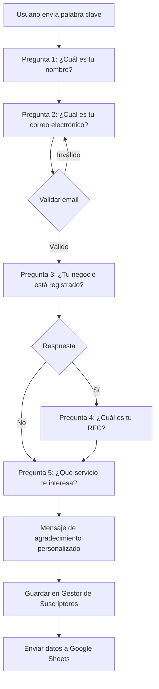
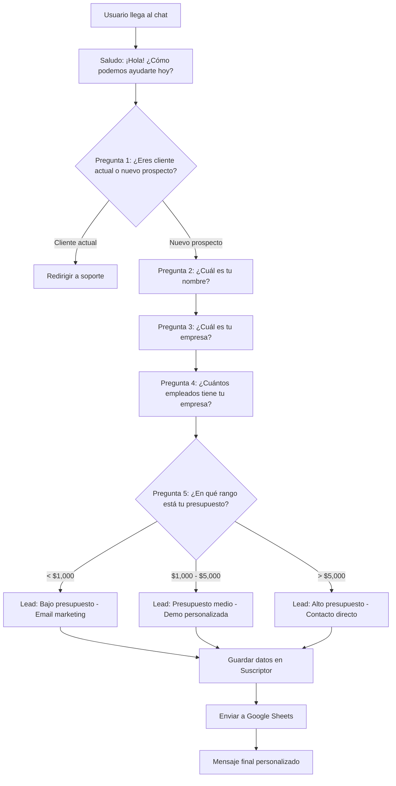

# Cómo Automatizar Conversaciones Complejas con User Input Flow en el Chat Web

En el vertiginoso mundo digital actual, ofrecer una experiencia al cliente sin fricciones ya no es un lujo, sino una necesidad absoluta para cualquier negocio que quiera mantenerse competitivo. Sin embargo, el mayor desafío que enfrentan las empresas es gestionar conversaciones de múltiples pasos sin abrumar a sus equipos de soporte. La automatización inteligente con flujos de entrada de usuario (User Input Flow) es la respuesta a este desafío.

> **User Input Flow** es una herramienta revolucionaria para automatizar interacciones complejas con los clientes. Ya sea que necesites un chatbot para tu sitio de comercio electrónico, un chatbot gratuito para tu sitio web, o un potente chatbot con IA, User Input Flow tiene todo lo que necesitas para transformar tu atención al cliente.

¿Listo para cambiar la forma en que tu marca se comunica? Sigue leyendo para descubrir cómo User Input Flow revolucionará tu estrategia de chatbot web y te permitirá crear experiencias conversacionales inolvidables.

## ¿Qué es User Input Flow?

Imagina un marco de trabajo dinámico a través del cual los chatbots pueden recopilar entradas de los usuarios, crear diagramas de flujo conversacionales y procesar datos en tiempo real de una manera estructurada y personalizada. A diferencia de los chatbots estáticos que solo responden con respuestas predefinidas, User Input Flow construye una experiencia de diálogo flexible que se adapta a las necesidades específicas de cada usuario.

> Esto es fundamental para las empresas que desean cerrar la brecha entre la automatización simple y la inteligencia conversacional sofisticada. User Input Flow permite que cada interacción se sienta única y personalizada.

### Características Principales

- **Entrada de Usuario Dinámica**: Personaliza la información que recopilas para cada usuario según sus respuestas anteriores. Cada pregunta puede basarse en la respuesta anterior, creando una conversación verdaderamente adaptativa.
- **Rutas de Conversación Personalizables**: Construye flujos lógicos para diferentes escenarios y necesidades empresariales. Puedes crear tantas rutas como necesites, cada una diseñada para un propósito específico.
- **Recopilación de Datos en Tiempo Real**: Captura y utiliza las entradas de los usuarios de inmediato para generar respuestas más inteligentes y contextuales. Los datos están disponibles al instante para su análisis.

El resultado es un chatbot que se siente más como una persona que como una máquina, ofreciendo una experiencia conversacional fluida y natural que tus clientes apreciarán.

## Beneficios de Automatizar Conversaciones Complejas

La automatización de conversaciones complejas mediante User Input Flow tiene efectos positivos que impactan en toda la organización, desde el equipo de soporte hasta la dirección general.

### Productividad Incrementada

Reduce la cantidad de trabajo manual significativamente. User Input Flow maneja automáticamente procesos complejos de múltiples pasos, lo que mejora enormemente la eficiencia de tu equipo y libera horas de trabajo para tareas más estratégicas.
  
### Personalización a Escala

Brinda a los usuarios la capacidad de personalizar cada interacción según sus preferencias, creando experiencias únicas para cada cliente sin esfuerzo manual adicional. Cada cliente recibe un tratamiento individualizado.
  
### Resolución más Rápida

Proporciona interfaces fáciles de usar que guían a los clientes a través de sus consultas, reduciendo los tiempos de resolución y aumentando la satisfacción general del cliente.
  
### Recolección de Datos Mejorada

Recopila entradas estructuradas sin esfuerzo para obtener mejores análisis e información procesable. Los datos capturados a través de User Input Flow se almacenan de manera organizada en el Gestor de Suscriptores y están listos para ser exportados a:

- Hojas de cálculo (CSV o Google Sheets)
- Sistemas CRM como HubSpot o Salesforce
- Herramientas de automatización como Zapier, Pabbly o Make
- Webhooks personalizados para integraciones a medida
- APIs HTTP para sistemas empresariales

> La capacidad de recopilar datos estructurados de forma automática transforma la forma en que las empresas entienden a sus clientes. Cada interacción se convierte en una fuente valiosa de información.

## Casos de Uso de User Input Flow en el Chat Web

User Input Flow es mucho más que una herramienta; es una solución integral para diversas necesidades empresariales. Aquí exploramos los casos de uso más comunes y efectivos:

### 1. Soporte al Cliente

Guía a los usuarios paso a paso a través de problemas técnicos para automatizar la resolución de incidencias. Piensa en ello como un diseño de conversación para chatbot orientado a la eficiencia. El flujo puede:

- Hacer preguntas de diagnóstico para identificar el problema
- Proporcionar soluciones paso a paso basadas en las respuestas
- Escalar a un agente humano si el problema no se resuelve automáticamente
- Registrar el historial completo de la interacción para referencia futura

### 2. Calificación de Prospectos

Realiza preguntas específicas para recopilar nombre, presupuesto y preferencias, calificando prospectos de forma automática sin intervención humana. El sistema puede:

- Preguntar por el sector industrial del prospecto
- Identificar el tamaño de la empresa
- Determinar el presupuesto disponible
- Evaluar la urgencia de la necesidad
- Asignar una puntuación de lead basada en las respuestas

### 3. Reserva de Citas

Automatiza los flujos de reserva para consultas, servicios y reuniones, eliminando la necesidad de coordinación manual. El flujo puede:

- Mostrar horarios disponibles en tiempo real
- Confirmar la cita automáticamente
- Enviar recordatorios programados
- Permitir reprogramar o cancelar citas existentes

### 4. Asistencia en Comercio Electrónico

Recomendaciones de productos personalizadas según las entradas de los usuarios, directamente desde tu chatbot web. Puedes:

- Preguntar por preferencias de producto
- Filtrar por categoría, precio y características
- Mostrar productos recomendados con enlaces directos
- Facilitar el proceso de compra sin salir del chat

> Estos escenarios demuestran la versatilidad de User Input Flow, construyendo diagramas de flujo conversacional e implementando ejemplos avanzados de flujos de chatbot que se adaptan a cualquier industria.

## Cómo Configurar User Input Flow para tu Chat Web

Comenzar a usar User Input Flow es más fácil de lo que piensas. Sigue estos pasos para liberar todo su potencial y empezar a automatizar conversaciones complejas en minutos.

### 1. Elige la Plataforma Adecuada

Comienza con una herramienta robusta de construcción de bots como E-SMART360, diseñada para la automatización fácil de chatbots. Es la mejor opción si buscas un chatbot gratuito para sitios web con funcionalidad premium sin complicaciones técnicas.

> **Recomendación**: E-SMART360 ofrece una versión gratuita que incluye funcionalidades completas de User Input Flow, permitiéndote probar y escalar sin compromiso inicial. Ideal para startups y pequeñas empresas que quieren empezar sin invertir.

### 2. Define tus Objetivos de Conversación

Definir las etapas clave de la conversación y los tipos de entradas de usuario es importante para el éxito de tu automatización. Este es el núcleo para entender qué significa el flujo de conversación en el diseño de chatbots modernos.

### 3. Diseña tu Flujo de Entrada de Usuario

Construye rutas de conversación lógicas con la interfaz de arrastrar y soltar de E-SMART360. Aquí es donde los constructores de flujos de chatbot realmente destacan, permitiéndote crear diagramas visuales sin escribir una sola línea de código.

### 4. Integra Fuentes de Datos

Enlaza preguntas frecuentes, contenido web o archivos cargados para respuestas con recuperación dinámica de datos y mejora continua del rendimiento del chatbot.

### 5. Prueba y Refina

Simula interacciones de usuario para verificar la navegación, la captura de datos y los ajustes de flujo. Realiza pruebas iterativas para garantizar una experiencia de usuario óptima antes del lanzamiento.

### 6. Monitorea y Optimiza

Una vez en producción, revisa las métricas de rendimiento regularmente para identificar oportunidades de mejora y optimizar tus flujos continuamente.

## Guía Paso a Paso para Configurar User Input Flow con E-SMART360

Sigue estos pasos detallados para crear tu primer flujo de entrada de usuario en E-SMART360:

### Accede al Panel de Control

Primero, ve al panel de control de E-SMART360 y navega a "Gestor de Bots" dentro de la sección de chat web. Aquí encontrarás todas las herramientas necesarias para gestionar tus flujos conversacionales y crear experiencias de usuario avanzadas.

    El Gestor de Bots es el centro de comando desde donde podrás crear, editar y monitorear todos tus flujos de entrada. Desde aquí también puedes acceder a las estadísticas de rendimiento de cada flujo.
  
### Selecciona tu Bot y Crea un Nuevo Flujo

Selecciona el bot al que deseas agregar el flujo de entrada, navega a la sección de flujo de entrada y haz clic en el botón "Crear". Asígnale un nombre descriptivo que te permita identificar fácilmente el propósito del flujo, como "Captura de Leads" o "Soporte Técnico".

    Es recomendable usar nombres que describan claramente la función del flujo, especialmente si planeas crear múltiples flujos para diferentes propósitos.
  
### Diseña tu Flujo de Entrada

Crea tu flujo de entrada como desees. Puedes agregar múltiples preguntas, definir tipos de respuesta como texto, email, número, opción múltiple o fecha, y establecer rutas condicionales según las respuestas del usuario. La interfaz de arrastrar y soltar facilita la creación de flujos complejos.

    
> **Consejo de diseño**: Comienza con preguntas simples y ve aumentando la complejidad gradualmente. Las primeras preguntas deben ser fáciles de responder para mantener al usuario comprometido.
    
Una vez que hayas diseñado todas las preguntas y rutas, guarda el flujo para activarlo.
  
### Agrega el Flujo al Menú Persistente

Para hacerlo más accesible, agrega este flujo al menú persistente de tu chatbot. Ve a la sección "Menú Persistente", edita o crea un nuevo menú, agrega una sección, asígnale un nombre descriptivo, establece el tipo como "Post Back" y selecciona el flujo que creaste. Luego guarda los cambios.

    El menú persistente aparece siempre en la parte inferior del chat, permitiendo a los usuarios acceder a tus flujos principales con un solo clic.
  
### Activa el Flujo mediante Palabra Clave

Además del menú persistente, puedes configurar palabras clave que activen el flujo automáticamente. Por ejemplo, si un usuario escribe "agendar cita" o "quiero info", el chatbot puede iniciar el flujo correspondiente sin necesidad de navegar por menús.

    Para configurar esto, ve a la configuración del bot, agrega las palabras clave deseadas y asígnales el flujo correspondiente.
  
### Prueba el Bot

Vamos a probar el bot. Abre la ventana de chat o envía un mensaje con la palabra clave configurada. Como podrás ver, el flujo funciona correctamente y es accesible directamente desde el menú persistente o mediante la palabra clave. Responde a cada pregunta para verificar que las rutas condicionales funcionan según lo esperado.

    Durante la prueba, asegúrate de:
    - Responder correctamente para verificar la captura de datos
    - Proporcionar respuestas inválidas para probar las validaciones
    - Verificar que las rutas condicionales dirigen al usuario al lugar correcto
    - Confirmar que los datos se almacenan correctamente en el Gestor de Suscriptores
  
### Revisa los Datos Recopilados

Después de que los usuarios interactúen con el flujo de entrada, la información proporcionada se guarda automáticamente en el "Gestor de Suscriptores" de E-SMART360. Puedes verla fácilmente en cualquier momento, exportarla a CSV, conectarla con Google Sheets para su análisis, o enviarla a tu CRM favorito mediante integraciones.

    Los datos se organizan por suscriptor, mostrando un historial completo de todas las interacciones y respuestas proporcionadas a lo largo del tiempo.
  

> ¡Así de fácil es crear un flujo de entrada de usuario con E-SMART360! En cuestión de minutos puedes tener un chatbot interactivo recolectando información valiosa de tus clientes de manera conversacional y natural.

## Configuración Avanzada: Tipos de Preguntas y Validaciones

User Input Flow permite definir diferentes tipos de respuesta para cada pregunta, garantizando que los datos recopilados sean precisos y estén correctamente formateados según tus necesidades:

### Tipos de Respuesta Soportados

- **Texto libre**: Para nombres, direcciones, comentarios abiertos
    - **Email**: Validación automática de formato de correo
    - **Número**: Para teléfonos, cantidades, edades, códigos postales
    - **Opción múltiple**: Sí/No, selección entre opciones predefinidas
    - **Fecha**: Para citas, reservas, fechas de nacimiento
    - **Teléfono**: Con validación de formato y longitud
    - **URL**: Validación de enlaces web
    - **Lista desplegable**: Selección de una lista de opciones
  
### Opciones de Almacenamiento y Envío

- **Campos personalizados**: Guarda respuestas en campos específicos del suscriptor
    - **Google Sheets**: Envía datos directamente a una hoja de cálculo en tiempo real
    - **Webhook URL**: Conecta con CRMs y herramientas externas
    - **Zapier / Pabbly / Make**: Dispara automatizaciones en más de 5000 aplicaciones
    - **Slack / Teams**: Envía notificaciones a tu equipo cuando se recopilen datos
  
### Validación de Respuestas

Cada tipo de respuesta incluye validaciones automáticas que garantizan la calidad de los datos recopilados:

- **Email**: Verifica el formato estándar (usuario@dominio.com) y rechaza direcciones inválidas
- **Teléfono**: Valida el formato según el país configurado
- **Número**: Comprueba que el valor esté dentro del rango especificado
- **Fecha**: Asegura que la fecha sea válida y dentro del período permitido
- **URL**: Verifica que la URL tenga un formato válido
- **Texto**: Puede incluir validación de longitud mínima y máxima

> **Importante**: Las validaciones mejoran significativamente la calidad de tus datos. Siempre que sea posible, utiliza tipos de respuesta específicos en lugar de texto libre para garantizar que la información recopilada sea utilizable.

### Ejemplo: Flujo de Captura de Datos de Cliente sin Formularios

Para recopilar datos de clientes potenciales sin formularios tradicionales, configura tu flujo de la siguiente manera. Este método aumenta significativamente las tasas de conversión al eliminar la fricción de los formularios tradicionales:

## Gestión de Campos Personalizados y Etiquetas

Una vez que los datos se recopilan a través de User Input Flow, puedes organizarlos y segmentarlos utilizando campos personalizados y etiquetas.

### Campos Personalizados

Los campos personalizados te permiten almacenar información adicional sobre cada suscriptor, habilitando una mejor personalización en tus campañas. Puedes crear tantos campos como necesites. Algunos ejemplos:

- **Nombre**: Para almacenar el nombre completo del suscriptor
- **Empresa**: Para registrar la empresa del contacto
- **Website**: Para guardar el sitio web del negocio
- **Presupuesto**: Para almacenar el presupuesto estimado
- **Interés**: Para registrar el producto o servicio de interés
- **Teléfono alternativo**: Un segundo número de contacto
- **Fecha de registro**: Para llevar control de cuándo se registró cada suscriptor

### Etiquetas (Labels)

Las etiquetas ayudan a categorizar suscriptores en diferentes grupos, facilitando el filtrado y la segmentación en campañas:

- **VIP Client**: Clientes de alto valor
- **Webinar Attendee**: Asistentes a seminarios web
- **Warm Lead**: Prospectos cálidos con alta probabilidad de conversión
- **Cold Lead**: Prospectos que requieren más nurturing
- **Support Case**: Casos de soporte activo
- **New Subscriber**: Suscriptores nuevos que requieren onboarding
- **Repeat Customer**: Clientes recurrentes con alta fidelidad

> **Estrategia de segmentación**: Combina campos personalizados y etiquetas para crear segmentaciones avanzadas. Por ejemplo, puedes enviar un mensaje diferente a "VIP Clients" que tengan "Presupuesto > $10,000" versus aquellos con presupuesto menor.

## Optimización del Flujo de Conversación

Para aprovechar al máximo User Input Flow y crear experiencias conversacionales excepcionales, sigue estas mejores prácticas de diseño conversacional:

### Mantenlo Simple y Directo

Utiliza preguntas cortas y claras para evitar confundir a los usuarios. Cada pregunta debe abordar un solo tema y ser fácil de entender. Evita las preguntas dobles o las instrucciones complicadas. Una buena regla general es que cada pregunta no debería requerir más de 5 segundos para ser leída y comprendida.
  
### Usa Lógica Condicional Inteligente

Adapta el flujo de forma dinámica según las respuestas del usuario para crear una conversación natural. Si el usuario responde "Sí" a una pregunta, el siguiente paso debe ser relevante a esa respuesta. La lógica condicional es lo que diferencia un chatbot básico de uno inteligente.
  
### Analiza Métricas de Rendimiento

Revisa el rendimiento del chatbot regularmente para identificar áreas de mejora. E-SMART360 proporciona estadísticas detalladas sobre tasas de finalización, respuestas más comunes, puntos de abandono y tiempo promedio de interacción. Utiliza estos datos para refinar tus flujos continuamente.
  
### Incluye Opciones de Respaldo y Escape

Defiende contra entradas inesperadas teniendo rutas alternativas predefinidas o escalamiento a un agente humano. Nadie debería quedarse atascado en un bucle sin salida. Siempre proporciona una opción para hablar con un humano si el bot no puede resolver el problema.
  
### Recomendaciones Adicionales de Optimización

### Diseño de Preguntas Efectivas

- **Sé específico**: En lugar de "¿Qué necesitas?", pregunta "¿En qué producto estás interesado?"
  - **Ofrece opciones**: Cuando sea posible, proporciona opciones predefinidas para facilitar la respuesta
  - **Una pregunta a la vez**: No combines múltiples preguntas en un solo mensaje
  - **Contexto**: Mantén al usuario informado sobre cuántas preguntas quedan (ej: "Solo 3 preguntas más")
  - **Personalización**: Usa el nombre del usuario y referencias a respuestas anteriores
  - **Lenguaje positivo**: Usa un tono amigable y positivo en todas las preguntas
  - **Ejemplos**: Proporciona ejemplos de respuestas válidas cuando sea necesario

### Manejo de Errores y Excepciones

- **Respuestas inválidas**: Vuelve a preguntar de manera amable cuando la respuesta no sea válida
  - **Límite de reintentos**: Establece un máximo de 3 intentos antes de escalar a un agente humano
  - **Palabras clave de emergencia**: Configura palabras como "ayuda" o "agente" para escalar inmediatamente
  - **Mensajes de error amigables**: En lugar de "Error: entrada inválida", usa "Lo siento, no entendí tu respuesta"
  - **Timeout**: Configura un tiempo máximo de espera por respuesta (ej: 5 minutos) antes de cerrar la conversación
  - **Registro de errores**: Guarda los errores para análisis posteriores y mejora continua

### Mejores Prácticas de Diseño Conversacional

A continuación, las mejores prácticas fundamentales para el diseño de flujos conversacionales:

  1. **Mantén el flujo simple e intuitivo**: Los usuarios no deberían tener que pensar demasiado para entender qué hacer.
  2. **Anticipa las entradas del usuario**: Planea respuestas para todas las variaciones posibles.
  3. **Usa lógica condicional**: Adapta el flujo a las necesidades específicas de cada usuario.
  4. **Prueba y refina continuamente**: El diseño conversacional nunca está terminado; siempre hay margen de mejora.
  5. **Consistencia**: Mantén un tono y estilo consistentes en toda la conversación.
  6. **Personalización**: Utiliza los datos recopilados para personalizar las interacciones.
  7. **Accesibilidad**: Asegúrate de que el chatbot sea accesible para todos los usuarios, incluyendo aquellos con discapacidades.

## Integración con la API HTTP para Conectividad Externa

User Input Flow no funciona en aislamiento. Una de sus características más potentes es la capacidad de conectarse con plataformas externas mediante la API HTTP de E-SMART360. Esto permite interacciones dinámicas, como mostrar productos de WooCommerce en el chat o integrar publicaciones de WordPress con tus chatbots.

### Cómo Configurar una Integración HTTP API

### Accede a la sección HTTP API

Navega a Integración > HTTP API en el panel de E-SMART360. Aquí encontrarás todas las herramientas para conectar tu chatbot con sistemas externos.
  
### Crea una nueva conexión

Haz clic en "Crear" para iniciar una nueva conexión API. Asígnale un nombre descriptivo como "Crear usuario en WordPress" o "Consultar Productos WooCommerce".
  
### Agrega los detalles de conexión

- **URL del endpoint**: La dirección del servicio externo (ej: https://tusitio.com/api/v1/crear-usuario)
    - **Método HTTP**: GET, POST, PUT o DELETE según la operación
    - **Headers**: Configura los encabezados de autenticación requeridos
    - **Cuerpo de la solicitud**: Define los parámetros a enviar en formato JSON, Form Data o URL-encoded
  
### Verifica la conexión

Haz clic en "Verificar Conexión" para enviar una solicitud de prueba y confirmar que todo funciona correctamente.
  
### Guarda la configuración

Si la verificación es exitosa, guarda la API. La conexión estará disponible para usarse en tus flujos de chatbot.
  
### Mapea los datos de respuesta

Configura cómo se mostrarán los datos de la API en las respuestas del chatbot, creando una experiencia fluida para el usuario final.
  

> Con la integración HTTP API, E-SMART360 permite interacciones en tiempo real con plataformas externas. Esta característica mejora la automatización del chatbot al permitir acciones como creación de usuarios en WordPress, recuperación de datos de suscriptores y actualización de sistemas de terceros sin intervención manual.

### Ejemplos de Integración HTTP API

### Crear Usuarios en WordPress

Configura un flujo que recopile los datos del usuario y los envíe automáticamente a WordPress para crear una cuenta. El flujo puede:
    
    1. Recopilar nombre, email y contraseña
    2. Validar que el email no exista en WordPress
    3. Crear el usuario mediante la API REST de WordPress
    4. Confirmar la creación al usuario en el chat
    5. Enviar credenciales de acceso por correo
  
### Consultar Productos de WooCommerce

Un flujo que permite a los usuarios buscar y consultar productos directamente desde el chat:
    
    1. Preguntar por categoría o palabra clave
    2. Consultar la API de WooCommerce
    3. Mostrar productos con precio y disponibilidad
    4. Permitir agregar al carrito desde el chat
    5. Facilitar el checkout con enlace directo
  
## Exportación y Gestión de Datos Recopilados

Una de las mayores ventajas de User Input Flow es la capacidad de exportar y gestionar los datos recopilados de múltiples formas:

### Exportación a CSV

Todos los datos recopilados a través de User Input Flow se pueden exportar como archivo CSV desde el Gestor de Suscriptores. Esto te permite:

- Importar los datos a cualquier CRM o herramienta de análisis
- Crear informes personalizados en Excel o Google Sheets
- Realizar análisis offline de los datos recopilados
- Compartir los datos con equipos que no tienen acceso a la plataforma

### Conexión con Google Sheets

Para actualizaciones en tiempo real, puedes conectar User Input Flow directamente con Google Sheets:

1. Ve a la sección de integraciones
2. Selecciona Google Sheets
3. Autentica tu cuenta de Google
4. Selecciona la hoja de cálculo y la pestaña donde deseas almacenar los datos
5. Configura el mapeo de campos entre el flujo y las columnas de la hoja

> Cada vez que un usuario completa un flujo de entrada, los datos se agregan automáticamente como una nueva fila en tu hoja de Google Sheets. Esto te permite tener un registro actualizado en tiempo real sin intervención manual.

### Uso de Integración Zapier

Conecta User Input Flow con más de 5000 aplicaciones a través de Zapier:

- **HubSpot**: Crea contactos automáticamente con los datos recopilados
- **Salesforce**: Agrega leads calificados directamente a tu pipeline
- **Email marketing**: Suscribe nuevos contactos a tus listas de correo
- **Slack**: Envía notificaciones a tu equipo cuando se recopilen datos importantes
- **Asana / Trello**: Crea tareas de seguimiento para nuevos leads
- **ActiveCampaign**: Dispara secuencias de email marketing automatizadas
- **Google Ads**: Activa campañas de remarketing basadas en datos recopilados

## Análisis de Métricas de Rendimiento

Para maximizar el valor de User Input Flow, es fundamental medir y analizar el rendimiento de tus flujos conversacionales. E-SMART360 proporciona métricas detalladas que te ayudan a entender el comportamiento de tus usuarios:

### Métricas Clave a Monitorear

- **Tasa de Finalización**: Porcentaje de usuarios que completan el flujo completo
- **Puntos de Abandono**: Identifica en qué preguntas los usuarios abandonan el flujo
- **Tiempo Promedio de Interacción**: Cuánto tiempo pasan los usuarios en cada flujo
- **Tasa de Error**: Porcentaje de respuestas inválidas en cada pregunta
- **Volumen de Interacciones**: Número total de veces que se ejecuta cada flujo
- **Tasa de Conversión**: Cuántos usuarios que inician el flujo completan la acción deseada
- **Respuestas Más Comunes**: Las respuestas más frecuentes para preguntas abiertas

### Cómo Interpretar los Datos

### Señales de Alerta

- Alta tasa de abandono en una pregunta específica → la pregunta es confusa o sensible
    - Muchos errores de validación → el tipo de respuesta no es el adecuado
    - Bajo volumen de activación → las palabras clave no son las correctas
    - Tiempo de interacción muy corto → el flujo es demasiado simple o los usuarios no entienden
  
### Señales de Éxito

- Alta tasa de finalización → el flujo está bien diseñado
    - Baja tasa de error → las preguntas y validaciones son claras
    - Alto volumen de activación → las palabras clave y menús funcionan
    - Tiempo de interacción equilibrado → los usuarios leen y responden adecuadamente
  
## Implementación Multicanal

User Input Flow no se limita al chat web. E-SMART360 permite implementar estos flujos en múltiples canales, manteniendo la misma experiencia conversacional:

- **Web Chat**: El canal principal, ideal para sitios web de comercio electrónico y soporte
- **WhatsApp**: Perfecto para capturar leads y realizar encuestas en el canal más popular
- **Facebook Messenger**: Ideal para interacciones sociales y captura de datos en redes sociales
- **Instagram DM**: Para marcas visuales que quieren interactuar con su audiencia
- **Telegram**: Excelente para comunidades técnicas y automatización avanzada

> La ventaja de usar E-SMART360 es que puedes crear un flujo una sola vez y desplegarlo en todos los canales simultáneamente, manteniendo la consistencia de la experiencia del usuario.

## Ejemplo Práctico: Flujo Completo de Calificación de Leads

A continuación, presentamos un ejemplo práctico completo de un flujo de calificación de leads utilizando User Input Flow:

Este flujo permite calificar automáticamente cada lead según su presupuesto, asignando diferentes acciones de seguimiento para cada segmento. La lógica condicional asegura que cada prospecto reciba el tratamiento adecuado según su perfil.

### Pruebas y Validación del Flujo

### Checklist de Pruebas para tu Flujo de Entrada

Antes de lanzar tu flujo de entrada en producción, asegúrate de verificar cada uno de estos puntos:

  **Funcionalidad:**
  - [ ] Todas las rutas condicionales funcionan correctamente
  - [ ] Las validaciones de tipo de respuesta detectan entradas inválidas
  - [ ] Los mensajes de error se muestran de forma amigable
  - [ ] El flujo termina correctamente en todos los escenarios

  **Integración:**
  - [ ] Los datos se guardan correctamente en el Gestor de Suscriptores
  - [ ] Las integraciones con Google Sheets/Zapier funcionan
  - [ ] Las APIs HTTP responden y procesan los datos adecuadamente

  **Experiencia de Usuario:**
  - [ ] Los mensajes son claros y fáciles de entender
  - [ ] El tiempo de respuesta es adecuado (menos de 2 segundos)
  - [ ] Los botones y opciones son fáciles de seleccionar
  - [ ] La opción de escalar a un humano está disponible

  **Rendimiento:**
  - [ ] El flujo carga rápidamente en todos los navegadores
  - [ ] No hay errores de JavaScript en la consola
  - [ ] La integración con el chat web es estable

## Por Qué Automatizar tu Chatbot Web con E-SMART360

E-SMART360 es la plataforma ideal para crear y gestionar User Input Flows. Aquí te explicamos por qué:

### Capacidades Avanzadas de IA

Crea chatbots más inteligentes para consultas complejas. E-SMART360 combina la potencia del procesamiento de lenguaje natural con la estructura de User Input Flow para ofrecer respuestas precisas y contextuales. Esto la convierte en una plataforma empresarial de chatbot completa.

### Herramientas Intuitivas

Utiliza constructores de flujos de arrastrar y soltar y respuestas dinámicas con IA. No necesitas conocimientos de programación para crear flujos conversacionales sofisticados. La interfaz visual te permite diseñar, probar y optimizar tus flujos en minutos.

### Integración Multicanal

Maneja conversaciones en Facebook Messenger, sitios web, WhatsApp, Instagram y más desde una sola plataforma. Tu equipo puede gestionar todas las interacciones desde un solo panel de control, manteniendo la consistencia en todos los canales.

### Resultados Comprobados

Las empresas que utilizan E-SMART360 reportan:
- **Aumento del 40%** en la tasa de engagement de clientes
- **Reducción del 60%** en el tiempo de resolución de consultas
- **Incremento del 35%** en la tasa de conversión de leads
- **Reducción del 50%** en la carga de trabajo del equipo de soporte

> Automatizar conversaciones complejas no tiene por qué ser un desafío cuando tienes las herramientas adecuadas. Con User Input Flow, las empresas pueden ofrecer interacciones lógicas que aumentan la productividad y la satisfacción del cliente. Ya sea para soporte técnico, generación de leads o asistencia en comercio electrónico, User Input Flow lo hace posible.

## Diferencias Clave: User Input Flow vs Chatbot Tradicional

Para entender mejor el valor de User Input Flow, aquí tienes una comparación detallada:

### Chatbot Tradicional

- Responde con mensajes predefinidos a preguntas específicas
    - No mantiene contexto entre preguntas
    - Solo puede manejar preguntas y respuestas simples
    - No recopila datos estructurados
    - No tiene rutas condicionales
    - No se integra con sistemas externos
    - No proporciona análisis de rendimiento
  
### User Input Flow

- Mantiene estado y contexto de la conversación
    - Recuerda respuestas anteriores y las usa en preguntas posteriores
    - Recopila datos estructurados en campos organizados
    - Sigue rutas condicionales adaptativas
    - Se integra con CRMs, hojas de cálculo, APIs
    - Proporciona métricas detalladas de cada flujo
    - Se adapta dinámicamente a las respuestas del usuario
  
## Preguntas Frecuentes

### ¿Qué herramienta de IA puede automatizar un chat de soporte al cliente?

Herramientas como E-SMART360 manejan chats de servicio al cliente con funciones avanzadas de User Input Flow e integración multicanal. El asistente de IA integrado puede responder preguntas frecuentes automáticamente, mientras que User Input Flow se encarga de las interacciones más complejas que requieren recopilación de datos estructurados. La combinación de ambas herramientas permite automatizar hasta el 80% de las consultas de soporte, liberando a tu equipo para que se concentre en los casos que realmente requieren intervención humana.

### ¿Cómo puedo crear mi propio chatbot personalizado desde cero?

Para crear tu propio chatbot desde cero, sigue estos pasos:

  1. **Define tus objetivos**: ¿Qué problema quieres resolver? ¿Qué información necesitas recopilar de los usuarios?
  2. **Mapea los flujos de conversación**: Identifica los escenarios más comunes que enfrentarán tus usuarios y diseña las rutas para cada uno.
  3. **Utiliza un constructor visual**: E-SMART360 ofrece una interfaz de arrastrar y soltar para crear flujos sin necesidad de escribir código.
  4. **Agrega preguntas y validaciones**: Configura los tipos de respuesta para cada pregunta y las reglas de validación correspondientes.
  5. **Prueba exhaustivamente**: Simula todas las rutas posibles antes del lanzamiento para identificar y corregir problemas.
  6. **Itera basado en datos**: Una vez en producción, revisa las métricas de rendimiento y mejora continuamente tus flujos.

  No necesitas conocimientos de programación para crear flujos conversacionales sofisticados con E-SMART360.

### ¿Cómo hago operativo mi chatbot después de crearlo?

Para poner tu chatbot en producción, sigue estos pasos:

  1. **Integración web**: Agrega el fragmento de código JavaScript en tu sitio web.
  2. **Configuración de canales**: Conecta el chatbot a través de APIs en las plataformas que elijas (web, WhatsApp, Facebook Messenger, Instagram, Telegram).
  3. **Define intenciones**: Configura las palabras clave que activarán cada flujo de entrada.
  4. **Prueba de integración**: Verifica que el chatbot funcione correctamente en todos los canales configurados.
  5. **Monitoreo inicial**: Durante las primeras 48 horas, revisa las interacciones para identificar y corregir problemas de manera proactiva.

  E-SMART360 proporciona instrucciones detalladas para cada método de integración, incluyendo fragmentos de código listos para usar.

### ¿Qué hace que un chatbot sea mejor para los clientes?

Un chatbot es mejor para los clientes cuando cumple con estas características fundamentales:

  - **Diseño conversacional**: Utiliza prácticas de diseño centradas en el usuario para crear interacciones naturales y fluidas.
  - **Flujos dinámicos**: Emplea flujos dinámicos de entrada de usuario que se adaptan a las respuestas en tiempo real.
  - **Precisión**: Verifica periódicamente la precisión de los datos de entrenamiento y las respuestas del chatbot.
  - **Escalamiento humano**: Permite escalar a un agente humano cuando el chatbot no puede resolver la consulta.
  - **Personalización**: Utiliza el nombre del usuario y referencia respuestas anteriores para crear una experiencia personalizada.
  - **Velocidad**: Responde en menos de 2 segundos para mantener el flujo natural de la conversación.
  - **Disponibilidad**: Está disponible 24/7 sin tiempos de espera, ofreciendo soporte即时 en cualquier momento.
  - **Consistencia**: Mantiene un tono y estilo coherentes en todas las interacciones.

### ¿Cómo puedo exportar y gestionar los datos recopilados por User Input Flow?

Los datos recopilados se almacenan automáticamente en el Gestor de Suscriptores de E-SMART360. Tienes múltiples opciones para gestionarlos:

  - **Exportación CSV**: Descarga todos los datos como archivo CSV para análisis offline en Excel o cualquier herramienta de análisis.
  - **Google Sheets**: Conecta en tiempo real para tener los datos siempre actualizados en una hoja de cálculo compartida.
  - **Webhook**: Envía datos a cualquier CRM o herramienta externa mediante webhooks personalizados.
  - **Campos personalizados**: Organiza la información en campos específicos según tus necesidades de segmentación.
  - **Zapier / Pabbly / Make**: Dispara automatizaciones en más de 5000 aplicaciones conectadas.

  Puedes crear campos personalizados ilimitados para almacenar todo tipo de información adicional sobre tus suscriptores.

### ¿Por qué necesito un diagrama de flujo de conversación?

Un diagrama de flujo de conversación es una representación visual de las rutas que un chatbot puede tomar durante las interacciones con los usuarios. Es esencial porque:

  - **Visualiza el recorrido completo**: Muestra todas las rutas posibles que un usuario puede seguir durante la conversación.
  - **Identifica puntos de decisión**: Revela dónde se necesitan rutas condicionales y bifurcaciones en el flujo.
  - **Detecta callejones sin salida**: Ayuda a identificar rutas que no llevan a ninguna parte o que dejan al usuario sin opciones.
  - **Planifica la experiencia**: Permite diseñar la conversación completa antes de implementarla, ahorrando tiempo y esfuerzo.
  - **Facilita la colaboración**: Permite que todo el equipo (diseñadores, desarrolladores, stakeholders) entienda el flujo antes de construirlo.
  - **Documentación viva**: Sirve como documentación actualizada del comportamiento del chatbot.

  Sin un diagrama de flujo, es fácil crear chatbots con rutas incompletas, bucles infinitos o experiencias frustrantes para el usuario.

### ¿Cuál es la diferencia entre User Input Flow y un chatbot tradicional?

Los chatbots tradicionales funcionan con respuestas predefinidas a preguntas específicas, sin capacidad de mantener un contexto de conversación. En cambio, User Input Flow:

  - **Mantiene estado**: Recuerda las respuestas anteriores y las usa para personalizar preguntas posteriores.
  - **Recopila datos estructurados**: Almacena las respuestas en campos organizados para su análisis posterior.
  - **Sigue rutas condicionales**: Adapta la conversación dinámicamente según las respuestas del usuario.
  - **Se integra con sistemas externos**: Puede enviar datos a CRMs, hojas de cálculo, APIs y otras herramientas.
  - **Proporciona análisis**: Ofrece métricas detalladas sobre el rendimiento de cada flujo, incluyendo tasas de finalización y puntos de abandono.
  - **Escalabilidad**: Puede manejar miles de conversaciones simultáneas sin pérdida de calidad.

  En resumen, User Input Flow transforma un chatbot de "pregunta-respuesta" en un asistente conversacional completo e inteligente.

### ¿Cómo puedo recolectar datos de usuarios en WhatsApp sin formularios?

User Input Flow también funciona perfectamente en WhatsApp, permitiéndote recolectar datos sin formularios tradicionales. El proceso es simple:

  1. Crea un chatbot en el Gestor de Bots de E-SMART360.
  2. Asígnale una palabra clave de activación (ej: "registro", "info", "cotización").
  3. Configura las preguntas en el flujo de entrada con los tipos de respuesta adecuados.
  4. Define las validaciones para cada tipo de dato (email, teléfono, número, etc.).
  5. Almacena los datos en el Gestor de Suscriptores para su posterior análisis.

  Este método es altamente efectivo porque los usuarios están acostumbrados a conversar en WhatsApp, lo que elimina la fricción de tener que llenar formularios tradicionales. Las tasas de finalización en WhatsApp suelen ser 3-4 veces más altas que en formularios web tradicionales.

### ¿Qué lenguaje de programación es mejor para un chat en tiempo real?

Los sistemas de chat en tiempo real pueden construirse con diversos lenguajes de programación. Las opciones más populares incluyen:

  - **Node.js**: Ideal por su naturaleza asíncrona y event-driven, perfecto para manejar múltiples conexiones simultáneas.
  - **Python (con Flask o Django)**: Excelente para integrar capacidades de IA y procesamiento de lenguaje natural.
  - **JavaScript**: El estándar para la integración en el lado del cliente, con frameworks como React o Vue.js.

  Sin embargo, con E-SMART360 no necesitas preocuparte por el lenguaje de programación, ya que la plataforma maneja toda la infraestructura técnica por ti, permitiéndote centrarte en el diseño de la experiencia conversacional.

### ¿Dónde puedo encontrar plantillas gratuitas de flujo de conversación?

Plataformas como E-SMART360 proporcionan plantillas gratuitas de flujo de conversación para ayudar a las empresas a construir experiencias de chat estructuradas. Estas plantillas incluyen:

  - **Plantilla de captura de leads**: Ideal para negocios que quieren generar prospectos calificados.
  - **Plantilla de soporte técnico**: Para empresas que necesitan resolver incidencias comunes de forma automatizada.
  - **Plantilla de reserva de citas**: Perfecta para consultorios, clínicas y profesionales de servicios.
  - **Plantilla de encuesta de satisfacción**: Para medir la experiencia del cliente después de una interacción.

  Estas plantillas facilitan la creación de flujos efectivos y pueden personalizarse según las necesidades específicas de cada negocio.

### ¿Qué ejemplos de flujo de chatbot pueden ayudarme a construir mejores bots?

Los ejemplos de flujo de chatbot revelan valiosos conocimientos de diseño conversacional. Algunos ejemplos prácticos incluyen:

  - **Flujo de bienvenida**: Una secuencia de 3-4 preguntas para conocer al usuario y dirigirlo al departamento correcto.
  - **Flujo de diagnóstico**: Preguntas secuenciales para identificar un problema técnico y ofrecer la solución adecuada.
  - **Flujo de calificación**: Preguntas estratégicas para determinar si un prospecto califica para una venta o servicio.
  - **Flujo de onboarding**: Guía paso a paso para nuevos usuarios que se registran en una plataforma.
  - **Flujo de encuesta**: Preguntas para recolectar feedback sobre productos o servicios.

  Estos ejemplos muestran cómo estructurar interacciones, manejar consultas de usuarios y utilizar las mejores prácticas de diseño conversacional para crear experiencias excepcionales.

### ¿Cómo pueden los chatbots aprender de las conversaciones con los usuarios?

Los chatbots utilizan modelos de aprendizaje automático que reciben las entradas de los usuarios, calibran las respuestas y se mejoran continuamente con cada interacción. Este proceso incluye:

  1. **Recopilación de datos**: Cada conversación genera datos valiosos sobre cómo los usuarios interactúan con el bot.
  2. **Análisis de patrones**: El sistema identifica patrones en las preguntas y respuestas de los usuarios.
  3. **Ajuste de respuestas**: Las respuestas se refinan basándose en la retroalimentación implícita y explícita de los usuarios.
  4. **Actualización del modelo**: Periódicamente, el modelo de IA se reentrena con los nuevos datos para mejorar su precisión.
  5. **Personalización**: Con el tiempo, el chatbot aprende las preferencias individuales de cada usuario.

  Este ciclo de mejora continua permite que el chatbot se vuelva más inteligente y preciso con cada interacción, ofreciendo un servicio cada vez mejor a los usuarios.

### ¿Cómo puedo hacer un chatbot más inteligente?

Utilizando plataformas como E-SMART360 que proporcionan plantillas, respuestas impulsadas por IA y herramientas para diseñar flujos conversacionales inteligentes. Estrategias específicas incluyen:

  - **Entrena con datos relevantes**: Alimenta el chatbot con FAQs, contenido web y documentos propios de tu negocio.
  - **Implementa User Input Flow**: Crea flujos estructurados para recopilar datos y guiar conversaciones complejas.
  - **Utiliza respuestas con IA**: Activa el asistente de IA para manejar preguntas abiertas y conversaciones no estructuradas.
  - **Itera basado en datos**: Revisa las métricas de rendimiento y ajusta los flujos según el comportamiento real de los usuarios.
  - **Escala inteligentemente**: A medida que crece el volumen de interacciones, el sistema se optimiza automáticamente.

  Con E-SMART360, no necesitas ser un experto en IA para crear chatbots inteligentes. La plataforma hace el trabajo pesado por ti.

## Conclusión

Automatizar conversaciones complejas no tiene por qué ser un desafío cuando tienes las herramientas adecuadas. Con User Input Flow de E-SMART360, las empresas pueden ofrecer interacciones lógicas y personalizadas que aumentan la productividad y la satisfacción del cliente.

Ya sea que necesites automatizar el soporte técnico, calificar prospectos potenciales, gestionar reservas de citas o proporcionar asistencia en comercio electrónico, User Input Flow te proporciona la flexibilidad y el poder para hacerlo realidad.

> **¿Listo para transformar tu atención al cliente?** Empieza hoy con E-SMART360 y descubre cómo User Input Flow puede revolucionar la forma en que te comunicas con tus clientes. Crea flujos conversacionales avanzados en minutos, sin necesidad de programación.

> **Última Actualización (Enero 2026)**
> Este artículo ha sido actualizado para reflejar las últimas funcionalidades y mejoras de User Input Flow en E-SMART360. La plataforma continúa evolucionando para ofrecer las mejores herramientas de automatización conversacional del mercado.
