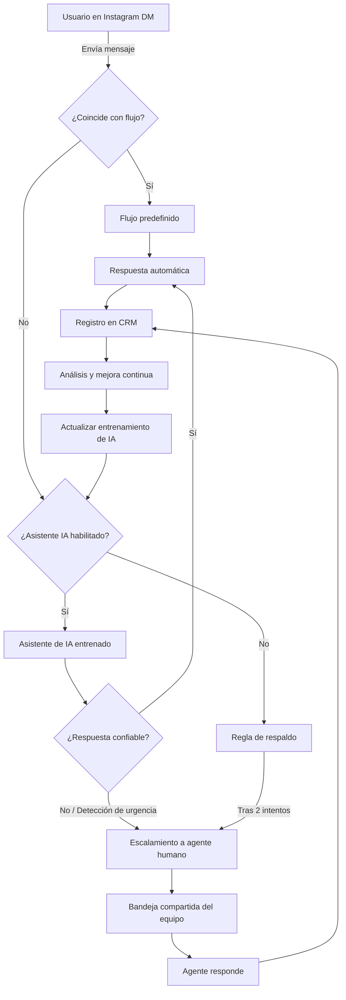

# Crear un Chatbot de IA para Instagram y Entrenarlo con el Asistente de IA


> **Última actualización:** 19 de junio de 2025 — Esta guía se actualiza constantemente para reflejar las últimas capacidades de los asistentes de IA y las APIs de Meta.

## Introducción

¿Sabías que el **60 % de los consumidores prefiere enviar mensajes a las marcas en lugar de llamarlas**? En un mundo donde la velocidad y la comodidad definen las expectativas del cliente, las empresas que retrasan la adopción de herramientas de mensajería directa corren el riesgo de perder clientes frente a competidores que responden más rápido, o peor aún, de volverse irrelevantes.

Los chatbots con inteligencia artificial ofrecen una solución: un equipo de Instagram disponible permanentemente que opera sin descanso, responde al instante y garantiza que ninguna consulta de cliente quede sin respuesta.


> **Dato clave:** Más del 90 % de los usuarios de Instagram sigue al menos a una marca. Esto convierte a la plataforma en una fuente masiva de oportunidades de engagement que ningún negocio debería ignorar.

## Por qué los Chatbots de IA en Instagram son Vitales

Instagram ya no es solo para influencers y cuentas estéticas. Hoy, las empresas utilizan activamente la plataforma para interactuar con su audiencia. Sin embargo, la demanda de respuestas instantáneas y constantes supera lo que cualquier equipo humano puede proporcionar.

Los chatbots de IA sirven para:

- **Mantener ocupados a los clientes impacientes**, reduciendo sus tiempos de espera de horas a meros segundos.
- **Ahorrar dinero** eliminando las tareas repetitivas de responder preguntas frecuentes y rastrear pedidos.
- **Convertir mensajes informales en ventas** con la ayuda de recordatorios y recomendaciones personalizadas.


### ¿Por qué Instagram es el canal ideal para chatbots con IA?

Instagram cuenta con más de 2 mil millones de usuarios activos mensuales. La mayoría de estos usuarios ya interactúa con marcas a través de mensajes directos (DMs). Un chatbot de IA en Instagram te permite:

- Responder automáticamente a los mensajes entrantes las 24 horas del día.
- Calificar leads y segmentar clientes según sus interacciones.
- Enviar catálogos de productos directamente en el chat.
- Programar citas y reservas sin intervención humana.
- Recuperar carritos abandonados con mensajes automatizados.

La combinación del alcance de Instagram con la automatización inteligente crea un canal de ventas y soporte imparable.

## Lo Que Aprenderás en Esta Guía

Al finalizar este tutorial, sabrás cómo:

1. Usar las capacidades **sin código** de E-SMART360 para construir un chatbot de IA para Instagram, sin necesidad de conocimientos técnicos previos.
2. Preparar tu chatbot para mantener conversaciones complejas, incluyendo la resolución de incidencias y la recomendación de productos utilizando modelos de lenguaje avanzados.
3. Sistematizar tus operaciones comerciales en servicio al cliente, ventas y generación de leads, liberando flujos de trabajo automatizados.


> **¿Para quién es esta guía?** Esta guía está diseñada tanto para emprendedores individuales como para equipos que desean automatizar la mensajería con clientes sin perder la calidad de atención.

---

## Paso 1: Elegir un Proveedor de Servicios (E-SMART360)

E-SMART360 es una plataforma de chatbot sin código con integración nativa para Instagram. Su interfaz intuitiva te permite:

- **Crear secuencias de chat con velocidad**: diseña flujos conversacionales completos en minutos.
- **Implementar automatización avanzada con IA**: utiliza inteligencia artificial para respuestas más humanas y naturales.
- **Integrarte con Instagram**: conecta tu cuenta de Instagram Business para empezar a gestionar mensajes automáticamente.

### Beneficios de E-SMART360

| Beneficio | Descripción |
|-----------|-------------|
| **Plantillas gratuitas** | Reduce el tiempo de configuración con flujos prediseñados para ventas y soporte. |
| **Bandeja unificada** | Gestiona Instagram, WhatsApp y otras plataformas desde una sola cuenta. |
| **Costo accesible** | Plan gratuito disponible y paquetes de pago desde $8.99 al mes. |
| **Multiplataforma** | Compatible con WhatsApp, Facebook Messenger, Instagram, Telegram y Web Chat. |
| **Sin límite de conversaciones** | Gestiona un volumen ilimitado de chats simultáneamente. |


> La plataforma de E-SMART360 es un Meta Business Partner oficial, lo que garantiza integraciones estables y actualizadas con las APIs más recientes de Instagram y WhatsApp.

---

## Paso 2: Conectar Instagram con E-SMART360

### Requisitos Previos

Antes de comenzar, asegúrate de cumplir con lo siguiente:

- ✅ Una **cuenta de Instagram Business** (las cuentas personales no funcionan).
- ✅ Una **página de Facebook vinculada** (necesaria para la API de Meta).
- ✅ La funcionalidad de **Professional Dashboard** activada en Instagram.


### Verificar que tienes cuenta Business

Ve a la configuración de tu perfil de Instagram, selecciona **Cuenta** y luego **Cambiar a cuenta profesional**. Elige la categoría "Empresa" o "Creador". Para la integración completa con la API de Meta, la opción "Empresa" es la más recomendada.

### Acceder al canal de Instagram en E-SMART360

Inicia sesión en tu panel de E-SMART360. En el menú lateral, navega a **Canales > Instagram**. Verás una pantalla de bienvenida para la integración.

### Hacer clic en 'Conectar cuenta de Instagram'

Haz clic en el botón **"Conectar cuenta de Instagram"**. Serás redirigido al flujo de autenticación de Facebook. Inicia sesión con la cuenta de Facebook que administra tu página de Facebook vinculada a Instagram.

### Seleccionar la página de Facebook correcta

Después de autenticarte, selecciona la **Página de Facebook** que está vinculada a tu perfil de Instagram Business. Confirma los permisos solicitados por la aplicación.

<Tip>Confirma que tu cuenta de Instagram tenga habilitado el "Panel profesional" (Settings > Account > Switch to Professional Account). Si no ves esta opción, tu cuenta podría ser personal y no serás elegible para la integración.</Tip>

---

## Paso 3: Construir Flujos de Chat

Utiliza el editor visual de E-SMART360 para diseñar las interacciones con tus clientes. A continuación te mostramos los flujos esenciales que todo chatbot de Instagram debería tener.

### 3.1. Mensaje de Bienvenida

**Objetivo:** Captar la atención del usuario al instante.

El mensaje de bienvenida es la primera impresión que tu chatbot dará. Debe ser amigable, claro y guiar al usuario hacia las opciones disponibles.

```
Ejemplo:
"¡Hola [Nombre]! 👋 ¿Cómo puedo ayudarte hoy?
Elige una opción:
🛍️ Ver productos
📦 Rastrear pedido
🎧 Soporte técnico
💬 Hablar con un agente"
```

### 3.2. Responder Preguntas Frecuentes

**Objetivo:** Resolver dudas comunes sin intervención humana.

Configura palabras clave para que el bot reconozca temas como "política de devolución", "métodos de pago" o "tiempos de envío". Cuando un usuario escribe una consulta, el bot identifica el tema y responde automáticamente con la información correspondiente.

**Flujo recomendado:**
1. El usuario envía un mensaje.
2. El bot analiza el texto mediante NLP (Procesamiento de Lenguaje Natural).
3. El bot identifica la intención (intent).
4. El bot responde con la información más relevante.
5. Opcionalmente, el bot ofrece enlaces adicionales o sugiere productos relacionados.


> Usa botones de respuesta rápida para simplificar la navegación. Por ejemplo: "Selecciona el tema: Reembolso | Envío | Información del producto".

### 3.3. Sugerir Productos

**Objetivo:** Convertir conversaciones en ventas.

Vincula tu catálogo de productos para permitir la navegación directamente desde el chat. El bot puede preguntar por el estilo, preferencias o necesidades del usuario para luego recomendar productos específicos.

**Idea de flujo:**
```
Usuario: "Busco un vestido para el verano"
Bot: "¡Excelente elección! 🌞 ¿Qué estilo prefieres?
1. Vestidos casuales
2. Vestidos de noche
3. Vestidos largos"
Tras la selección: "Estas son nuestras opciones más populares:"
[Imagen del producto + Precio + Botón "Comprar ahora"]
```


### Ejemplo: Flujo de venta

1. Saludo personalizado.
2. Menú con categorías de productos.
3. Recomendación basada en selección.
4. Imagen del producto + precio.
5. Botón de "Comprar" o "Añadir al carrito".
6. Confirmación + seguimiento.

### Ejemplo: Flujo de soporte

1. Identificación del problema.
2. Soluciones automáticas (FAQ).
3. Enlaces a tutoriales o documentación.
4. Opción de escalar a un agente humano.
5. Confirmación de resolución.
6. Encuesta de satisfacción.

### Verificación Previa al Lanzamiento

Antes de publicar tu chatbot, realiza estas comprobaciones:

- **Prueba los flujos** en el modo de vista previa de E-SMART360.
- **Verifica que los botones, enlaces y etiquetas de productos funcionen correctamente.**
- **Activa el seguimiento** para monitorear la velocidad de respuesta y las tasas de conversión.
- **Incluye mensajes de error** como "¡Ups! Parece que no entendí eso. ¿Puedes reformularlo?" para mantener la fluidez de la conversación.


### Lista de verificación completa antes del lanzamiento

- [ ] Todos los flujos de conversación han sido probados en modo preview.
- [ ] Los botones de respuesta rápida redirigen correctamente.
- [ ] Las imágenes y etiquetas de productos se visualizan sin errores.
- [ ] Los enlaces de salida (políticas, tutoriales) están actualizados.
- [ ] El mensaje de bienvenida está activo.
- [ ] El mensaje de "no entendí" (fallback) está configurado.
- [ ] El flujo de escalamiento a humano funciona correctamente.
- [ ] El seguimiento de métricas (Google Analytics, píxel de Meta) está configurado.

---

## Preparando tu Chatbot de IA

### Cómo Funciona el NLP y la Detección de Intenciones

El Procesamiento de Lenguaje Natural (NLP) permite que tu chatbot interprete el lenguaje humano de forma natural. E-SMART360 utiliza detección de intenciones (intent detection) para categorizar las consultas de los usuarios.

**Ejemplos de detección de intención:**

| Mensaje del usuario | Intención detectada | Acción del bot |
|---------------------|---------------------|----------------|
| "Quiero agendar una cita" | Reserva de cita | Inicia flujo de programación |
| "Necesito ayuda con un pedido" | Soporte de pedido | Muestra opciones de rastreo |
| "Hablar con un humano" | Escalamiento | Transfiere a agente humano |
| "¿Tienen este producto en azul?" | Consulta de producto | Muestra variantes de producto |

**Cómo funciona internamente:**

E-SMART360 combina la detección de palabras clave con el análisis de contexto para manejar variaciones. Por ejemplo:

- "¿Cómo puedo reservar una cita?" → Activa el flujo de agendamiento.
- "Quiero hablar con una persona real" → Pausa la respuesta del bot y asigna un agente humano.


> **Prueba exhaustiva:** Asegúrate de probar frases como "Tengo un problema, ¿cómo hablo con un humano?" para refinar la precisión del NLP. Los usuarios rara vez escriben de forma literal.

---

## Paso 4: Preparar el Entrenamiento del Asistente de IA

Antes de configurar una campaña de entrenamiento de IA, necesitas conocer algunos conceptos esenciales. E-SMART360 te permite entrenar a tu asistente con múltiples fuentes de datos.

### 4.1. Acceder a la Sección de Entrenamiento de IA

En tu panel de E-SMART360, navega a **Configuración > Campaña de Entrenamiento de IA**.

### 4.2. Crear una Nueva Campaña de Entrenamiento

1. Haz clic en **"Crear nueva campaña"**.
2. Asigna un **nombre descriptivo** a tu campaña (ej: "Soporte Productos-Verano 2025").
3. Escribe un **mensaje de prompt**: define el rol y el tono que el asistente de IA debe adoptar.
4. Ajusta el **prompt por defecto** para personalizar la personalidad del bot.
5. Guarda la campaña para comenzar a añadir datos de entrenamiento.


> **Consejo sobre el prompt:** Un buen prompt define el comportamiento del asistente. Por ejemplo: *"Eres un asistente de ventas amigable y profesional que ayuda a clientes a encontrar productos en nuestra tienda online. Responde en español neutro con un tono cálido pero formal."* Cuanto más específico seas, mejores serán las respuestas.

### 4.3. Entrenar con Preguntas Frecuentes (FAQs)

Agrega preguntas frecuentes y sus respuestas para guiar las respuestas del asistente:

1. Haz clic en el botón **"+"** dentro de la campaña de entrenamiento.
2. Selecciona entre dos modos:
   - **Resumen**: Proporciona respuestas ricas y contextuales, pero consume más tokens.
   - **FAQ**: Más económico y estructurado para respuestas rápidas.
3. Sube el contenido en el formato requerido.
4. Guarda los cambios.


### Formato recomendado para FAQs

```
P: ¿Cuánto tiempo tarda el envío estándar?
R: El envío estándar tarda entre 3 y 5 días hábiles dentro del país. Para envíos internacionales, el tiempo estimado es de 7 a 14 días hábiles.

P: ¿Aceptan devoluciones?
R: Sí, aceptamos devoluciones dentro de los primeros 30 días posteriores a la compra. El producto debe estar en su estado original y sin usar.
```

### 4.4. Entrenar con una URL

Puedes alimentar al asistente con contenido extraído de páginas web:

1. Haz clic en **"Nuevo"** bajo la sección de entrenamiento por URL.
2. Ingresa la **URL de la página** que contiene la información relevante (ej: página de términos y condiciones, política de envíos).
3. Selecciona el **tipo de selector** (ID o Clase) basado en la estructura de la página web.
4. Opcionalmente, elimina contenido no relevante como anuncios o encabezados.
5. Elige entre:
   - **Generar Respuesta en Bruto**: Obtiene una respuesta completa y detallada (mayor consumo de tokens).
   - **Generar FAQ**: Divide el contenido en preguntas y respuestas estructuradas (menor consumo de tokens).
6. Guarda los cambios.


> **Importante:** Debes inspeccionar los elementos de la URL para identificar el ID o clase CSS del contenedor principal del contenido. Usa las herramientas de desarrollador de tu navegador para esto (clic derecho > "Inspeccionar").

### 4.5. Entrenar con un Archivo

También puedes subir documentos para que el asistente aprenda de ellos:

1. Navega a la **configuración de archivos** y haz clic en **"Nuevo"**.
2. Sube un archivo en formato **PDF, Word (.doc)** o **TXT**.
3. Elige el modo de procesamiento:
   - **Respuesta en Bruto**: Proporciona respuestas completas y detalladas (mayor uso de tokens).
   - **Generar FAQ**: Divide el contenido en FAQs estructuradas (menor uso de tokens).
4. Guarda el archivo y finaliza el entrenamiento.


### ¿Qué tipos de archivos son mejores para entrenar?

Los archivos más efectivos para entrenar a tu asistente de IA son:

- **Manuales de producto** (PDF) — para respuestas técnicas detalladas.
- **Políticas de empresa** (DOCX) — para consistencia en las respuestas.
- **Guías de precios** (PDF o XLSX convertido a PDF) — para información actualizada.
- **FAQs existentes** (TXT o DOCX) — para respuestas ya validadas.
- **Catálogos de productos** (PDF) — con descripciones y especificaciones.

Recomendamos usar archivos PDF con texto seleccionable (no imágenes escaneadas) para obtener los mejores resultados.

### 4.6. Configurar el Comportamiento del Asistente

Personaliza cómo el asistente interactúa con los usuarios ajustando estas configuraciones:

- **Memoria contextual**: Define cuánto contexto de la conversación previa debe recordar el asistente.
- **Temas restringidos**: Especifica temas que el asistente debe evitar (ej: precios no publicados, información confidencial).
- **Profundidad de contexto conversacional**: Controla cuántos mensajes anteriores se consideran en cada respuesta.


### Configuración recomendada para ventas

- Memoria contextual: Alta
- Tono: Amigable pero profesional
- Temas restringidos: Información financiera interna
- Profundidad: 5-10 mensajes anteriores
- Respuesta automática: Activada

### Configuración recomendada para soporte técnico

- Memoria contextual: Muy alta
- Tono: Empático y claro
- Temas restringidos: Diagnósticos internos
- Profundidad: 10-15 mensajes anteriores
- Respuesta automática: Activada con escalamiento

### 4.7. Asignar la Campaña de Entrenamiento

1. Conecta tu asistente de IA con la campaña de entrenamiento que acabas de crear.
2. Ve a **Gestor de Bots > Botones de Acción > Sin coincidencia**.
3. Selecciona **Respuesta de IA** y vincula la campaña de entrenamiento.
4. Activa la opción **"Sin coincidencia"** en la configuración.
5. Guarda los cambios.

### 4.8. Activar el Asistente de IA

1. Ve a **Gestor de Bots**.
2. Activa la opción **"Habilitar Asistente de IA"**.
3. Selecciona la campaña deseada.
4. Elige el modo de respuesta:

| Modo | Descripción | Cuándo usarlo |
|------|-------------|---------------|
| **IA para todas las consultas** | El asistente maneja todas las preguntas de los clientes. | Cuando el bot tiene un entrenamiento completo y confiable. |
| **IA solo como respaldo** | El asistente interviene solo cuando las reglas predefinidas no encuentran coincidencia. | Durante las primeras semanas de implementación o con contenido en constante cambio. |


> **Recomendación:** Comienza con el modo "IA como respaldo" mientras pruebas y refinas el entrenamiento. Una vez que el asistente demuestre precisión consistente (85% o más), cambia al modo "IA para todas las consultas".

---

## Paso 5: Usar tu Propia Clave de OpenAI API (Opcional)

Si eres usuario de un plan agencia o revendedor, puedes potenciar las conversaciones conectando tu propia clave de OpenAI:

1. En tu panel de E-SMART360, ve a **Configuración > OpenAI**.
2. Introduce tu **clave de API de OpenAI**.
3. Selecciona el **modelo de lenguaje** que deseas utilizar (GPT-4, GPT-4o, GPT-3.5 Turbo, etc.).
4. Guarda la configuración.


> Ventajas de usar tu propia clave de OpenAI:
- **Mayor control** sobre el modelo y las respuestas.
- **Sin límites de tokens predefinidos** por la plataforma.
- **Personalización avanzada** del prompt del sistema.
- **Facturación directa** con OpenAI, sin intermediarios.

---

## Paso 6: Configurar Reglas de Respaldo

Incluso el mejor asistente de IA puede encontrarse con preguntas que no sabe responder. Prepárate para estas situaciones con reglas de respaldo bien configuradas.

### 6.1. Mensajes de Respaldo

Configura mensajes que se activen cuando el asistente no pueda responder:

- Después de 2 intentos fallidos: *"Déjame conectarte con un miembro del equipo para ayudarte mejor. Un agente te atenderá en breve."*

- Después de 3 intentos fallidos: *"Parece que necesitas ayuda más especializada. Te estamos transfiriendo con un agente humano ahora mismo."*

### 6.2. Disparadores de Transferencia

Define palabras clave que activen automáticamente la transferencia a un agente humano:

| Palabra clave | Acción |
|---------------|--------|
| "Gerente" | Transferencia inmediata a supervisor |
| "Reclamo" | Transferencia al departamento de quejas |
| "Cancelar" | Transferencia al equipo de retención |
| "Reembolso" | Transferencia al equipo de facturación |

### 6.3. Detección de Tono Negativo

Configura la detección de tono para identificar mensajes frustrados o agresivos. Cuando se detecte un tono negativo, el bot debe:

1. Responder con un mensaje empático: *"Lamento que estés pasando por esto. Permíteme ayudarte."*
2. Ofrecer transferencia inmediata a un agente humano.
3. Escalar la conversación con un resumen del historial del chat.

### 6.4. Transferencia al Equipo

Cuando se active una transferencia:

1. El chat se envía al equipo designado (Slack, email, bandeja compartida).
2. Se incluye una nota contextual: *"[Nombre del cliente] necesita asistencia con [tema]. Historial de la conversación adjunto."*
3. Se establece un SLA de respuesta (ej: 5 minutos para consultas urgentes).


> **Configura alertas para respuestas rápidas:** Asegúrate de que las notificaciones de escalamiento lleguen al equipo correcto sin demora. Un SLA de 5 minutos o menos es el estándar recomendado para mantener altos niveles de satisfacción.

### Pruebas Finales

Antes de poner tu chatbot en producción:

1. **Simula consultas difíciles** (ej: "¡Reembolso ahora mismo!") para verificar que las reglas de respaldo funcionen.
2. **Revisa el informe de precisión** de E-SMART360 para identificar brechas en el entrenamiento.
3. **Ajusta las FAQs y URLs** según los resultados de las pruebas.
4. **Verifica que la transferencia a agentes humanos** funcione correctamente en todos los escenarios.

---

## Estrategias Avanzadas

### Automatización de Ventas y Soporte

Transforma los mensajes directos en una herramienta de ventas completa:

1. **Exhibición de Productos:**
   - Sincroniza con tu tienda Shopify, WooCommerce o catálogo personalizado.
   - Permite que los usuarios naveguen por productos directamente desde el chat.
   - Ejemplo: Usuario: "Muestra vestidos de verano" → El bot envía las mejores opciones + precios.

2. **Recordatorios de Carrito:**
   - Espera 1 hora después del abandono.
   - Envía un DM automatizado: "¡Completa tu compra y obtén un 10 % de descuento! 🎉"
   - Incluye un enlace directo al carrito abandonado.

3. **Reserva de Citas:**
   - Conecta con un calendario (Calendly, Google Calendar, etc.).
   - Comparte los horarios disponibles.
   - Confirma la reserva automáticamente.

4. **Notificaciones de Pedidos:**
   - Envía actualizaciones automáticas de estado del pedido.
   - Comparte el número de seguimiento y enlace de rastreo.
   - Ofrece soporte posventa inmediato.


### Ejemplo completo: Flujo de venta automatizada en Instagram

```
Paso 1 — Usuario: "Hola, ¿tienen audífonos inalámbricos?"
Paso 2 — Bot: "¡Sí! Tenemos varias opciones. ¿Cuál es tu presupuesto aproximado?
1. Económico ($20-$40)
2. Intermedio ($40-$80)
3. Premium ($80-$150)"
Paso 3 — Usuario selecciona "Intermedio"
Paso 4 — Bot: "Excelente elección. Estos son nuestros más vendidos:
[Imagen 1] Audífonos SoundPro X2 — $59.99
[Imagen 2] Audífonos BassBoost Air — $74.99
¿Te gustaría ver los detalles de alguno?"
Paso 5 — Usuario: "Muéstrame el SoundPro X2"
Paso 6 — Bot: envía ficha completa con especificaciones, reseñas y botón "Comprar ahora"
```

### Marketing Personalizado

Personaliza las interacciones según el comportamiento del usuario:

- **Disparadores:** Cuando un usuario hace clic en un enlace de una historia de Instagram, el bot puede enviar automáticamente un código de descuento personalizado.
- **Sugerencias posventa:** "Este bolso combina perfectamente con tu nuevo vestido. ¿Te gustaría verlo?"
- **Segmentación por comportamiento:** Usuarios que preguntan frecuentemente por una categoría reciben recomendaciones priorizadas de esa categoría.
- **Campañas de cumpleaños:** Envía automáticamente un descuento especial de cumpleaños a los clientes registrados.

---

## Mejores Prácticas

### 1. Usa Lenguaje Conversacional

Evita frases robóticas. Compara:

| ❌ Incorrecto | ✅ Correcto |
|---------------|-------------|
| "Ingrese número de pedido para asistencia" | "¡Hola [Nombre]! Te ayudo a rastrear tu pedido. ¿Me dices el número?" |
| "Seleccione una opción del menú" | "¿Qué te gustaría hacer hoy? 😊" |
| "Error. Intente nuevamente" | "Ups, no entendí bien. ¿Puedes decirlo de otra forma?" |

**Consejos adicionales:**
- Usa emojis con moderación (🚀🎉👍).
- Incorpora frases casuales como "¡Claro!", "¡Por supuesto!", "No hay problema".
- Mantén las respuestas cortas (idealmente 2-3 oraciones).
- Siempre ofrece una opción de salida o escalamiento.

### 2. Actualiza el Entrenamiento Mensualmente

Mantén tu asistente actualizado:

- Agrega **nuevas preguntas frecuentes** basadas en consultas reales de los clientes.
- Actualiza las **políticas de la empresa** cuando cambien.
- Ajusta el entrenamiento para **temporadas específicas** (ej: fechas límite de envío navideño).
- Revisa y elimina **información obsoleta**.
- Analiza los **informes de precisión** mensualmente.

### 3. Monitorea Métricas Clave

Utiliza el panel de E-SMART360 para hacer seguimiento de:

| Métrica | Objetivo recomendado |
|---------|---------------------|
| Precisión del asistente | 85 % o superior |
| Tasa de resolución en primer contacto | 70 % o superior |
| Tiempo promedio de respuesta | Menos de 5 segundos |
| Tasa de escalamiento a humano | Menos del 20 % |
| Tasa de conversión desde chat | Según tu industria (referencia: 10-25 %) |

### 4. Combina IA y Soporte Humano

La combinación ideal usa la IA para lo rutinario y los humanos para lo complejo:

| La IA maneja | Los humanos manejan |
|---------------|---------------------|
| Consultas de pedidos | Reclamos y quejas complejas |
| Preguntas frecuentes | Problemas técnicos especializados |
| Recomendaciones de productos | Negociaciones y descuentos personalizados |
| Actualizaciones de estado | Situaciones de alta sensibilidad |
| Captura de datos iniciales | Decisiones que requieren criterio humano |

**Ejemplo de flujo combinado:**
1. Usuario: "¡Me cobraron el doble!"
2. El bot detecta urgencia y tono negativo.
3. El bot responde: "Lamento el inconveniente. Te conecto con un agente especializado ahora mismo."
4. Se envía una alerta al equipo con el historial completo del chat.
5. El agente humano retoma la conversación desde donde quedó.

### 5. Comienza Simple y Escala

No intentes construir el chatbot perfecto desde el día uno. Sigue esta progresión:

1. **Semana 1:** Configura 3-5 flujos básicos (bienvenida, FAQ simple, contacto).
2. **Semana 2:** Agrega respaldo de IA con entrenamiento básico de FAQs.
3. **Semana 3:** Integra URLs y archivos para enriquecer el conocimiento del asistente.
4. **Semana 4:** Implementa reglas de escalamiento avanzadas y flujos de venta.
5. **Mantenimiento continuo:** Revisa métricas, actualiza contenido, ajusta comportamientos.

---

## Preguntas Frecuentes


### ¿Puedo usar el chatbot de Instagram sin tener una página de Facebook?

No. La API de Instagram de Meta requiere que tengas una página de Facebook vinculada a tu cuenta de Instagram Business. La página de Facebook actúa como el contenedor a través del cual Meta autoriza el acceso a los mensajes de Instagram. Si aún no tienes una página, puedes crearla gratuitamente en facebook.com/pages/create.

### ¿Qué hago si el asistente de IA responde incorrectamente?

Revisa el informe de precisión en el panel de E-SMART360. Identifica las preguntas donde el asistente falló y agrega esas consultas como FAQs en tu campaña de entrenamiento. También puedes ajustar el prompt del sistema para ser más específico sobre el tono o los temas que debe manejar. Finalmente, considera añadir más URLs o archivos relevantes para enriquecer su base de conocimiento.

### ¿Cuánto tiempo toma entrenar al asistente de IA para que funcione bien?

Depende del volumen y la variedad de datos de entrenamiento. Con una buena configuración inicial (10-20 FAQs, 2-3 URLs y 1-2 archivos), el asistente puede empezar a responder adecuadamente en cuestión de horas. Sin embargo, alcanzar una precisión del 85 % o superior puede tomar de 1 a 4 semanas de ajustes continuos basados en interacciones reales.

### ¿El chatbot puede manejar múltiples idiomas?

Sí. El asistente de IA de E-SMART360 puede manejar múltiples idiomas siempre que los datos de entrenamiento estén en los idiomas deseados. Puedes incluir FAQs en español, inglés y otros idiomas en la misma campaña. El asistente detectará automáticamente el idioma del usuario y responderá en el mismo idioma.

### ¿Qué sucede si alcanzo el límite de tokens de mi plan?

Si alcanzas el límite de tokens de tu plan, el asistente de IA podría dejar de responder temporalmente hasta que se restablezca el límite. Para evitar esto, considera:
- Usar el modo "FAQ" en lugar de "Resumen" para reducir el consumo de tokens.
- Actualizar a un plan superior si el volumen de consultas es alto.
- Configurar reglas de respaldo que activen respuestas predefinidas cuando el asistente no esté disponible.

### ¿Puedo integrar el chatbot de Instagram con mi CRM?

Sí. E-SMART360 ofrece integraciones con múltiples herramientas a través de webhooks, API HTTP y Zapier. Puedes enviar los datos de las conversaciones de Instagram a tu CRM en tiempo real, incluyendo información del cliente, historial de conversaciones y datos de productos consultados.

### ¿El chatbot de Instagram puede enviar imágenes y videos?

Sí, el chatbot puede enviar imágenes, videos y archivos adjuntos. Puedes configurar flujos que envíen imágenes de productos, videos tutoriales o catálogos visuales directamente en la conversación. Eso sí, asegúrate de cumplir con los límites de tamaño de archivo de Instagram: fotos de hasta 8 MB y videos de hasta 16 MB.

### ¿Cuánto cuesta mantener un chatbot de IA en Instagram?

El costo depende del plan que elijas. E-SMART360 ofrece un plan gratuito con funcionalidades básicas. Los planes de pago comienzan desde $8.99 al mes. A esto debes sumarle el consumo de tokens de IA si usas el asistente inteligente, que se factura según el volumen de consultas procesadas. En general, un negocio pequeño puede operar con un costo mensual de entre $10 y $50.

### ¿Puedo usar el chatbot en Instagram y WhatsApp al mismo tiempo?

Sí. Una de las ventajas de E-SMART360 es su enfoque multicanal. Puedes gestionar chatbots para Instagram, WhatsApp, Facebook Messenger y Web Chat desde un solo panel. Cada canal se configura de forma independiente, pero puedes compartir campañas de entrenamiento de IA, flujos de conversación y configuraciones entre todos ellos.

### ¿Cómo mido el rendimiento de mi chatbot de Instagram?

E-SMART360 proporciona un panel de análisis donde puedes ver métricas clave como:
- Número de conversaciones iniciadas y completadas.
- Tasa de resolución automática (sin escalar a humano).
- Tiempo promedio de respuesta del bot.
- Palabras clave más frecuentes utilizadas por los usuarios.
- Precisión del asistente de IA.
- Tasa de conversión de chat a venta.
- Volumen de escalamientos a agentes humanos.

Estos datos te permiten identificar áreas de mejora y optimizar continuamente tu chatbot.

### ¿Qué tipo de soporte técnico está disponible?

E-SMART360 ofrece múltiples canales de soporte:
- **Base de conocimiento:** Documentación completa con guías paso a paso.
- **Foro comunitario:** Resuelve dudas con otros usuarios y el equipo.
- **Tickets de soporte:** Para incidencias técnicas.
- **Chat en vivo:** Durante horas laborables.
- **Soporte premium:** Para clientes de planes empresariales, con atención prioritaria 24/7.

---

## Casos de Uso y Ejemplos Prácticos


### 🛍️ Tienda de Ropa Online

**Escenario:** Una tienda de moda recibe 200+ DMs diarios en Instagram preguntando por tallas, disponibilidad y envíos.

**Solución implementada:**
- Chatbot con bienvenida personalizada y recomendaciones basadas en preferencias.
- Catálogo sincronizado automáticamente desde Shopify.
- Respuestas automáticas a preguntas sobre tallas, telas y disponibilidad.
- Seguimiento de pedidos en tiempo real.
- Recordatorios de carrito abandonado con descuentos exclusivos.
- Escalamiento a asesores de moda para consultas complejas.

**Resultados:** Tiempo de respuesta reducido de 45 minutos a 3 segundos. Tasa de conversión desde DM aumentada en un 35 %.

### 🍕 Restaurante con Servicio a Domicilio

**Escenario:** Un restaurante recibe pedidos y consultas a través de Instagram DMs, pero el equipo no da abasto en horas pico.

**Solución implementada:**
- Menú interactivo con categorías (entradas, platos fuertes, postres, bebidas).
- Toma de pedidos automatizada directamente desde el chat.
- Confirmación de pedido con tiempo estimado de entrega.
- Integración con sistema POS para gestionar pedidos.
- Notificaciones de estado (preparando, en camino, entregado).
- Preguntas frecuentes sobre horarios, métodos de pago y zonas de cobertura.

**Resultados:** Incremento del 50 % en pedidos nocturnos. Reducción del 80 % en llamadas telefónicas de consulta.

## Diagrama de Arquitectura del Chatbot



## Integración con la Bandeja Compartida del Equipo

Para maximizar la efectividad de tu chatbot de Instagram, E-SMART360 te permite combinarlo con una **bandeja compartida** donde todo tu equipo puede gestionar conversaciones desde un solo lugar.

### Cómo Funciona la Transferencia Inteligente

1. **Escalamiento automático:** El asistente de IA detecta cuándo un usuario necesita ayuda humana (ej: "Necesito hablar con una persona").
2. **Asignación inteligente:** La conversación se asigna al miembro del equipo más adecuado según el tema.
3. **Colaboración en tiempo real:** Los agentes pueden ver y responder consultas escaladas al instante.
4. **Historial completo:** Cada transferencia incluye el historial completo de la conversación para que el agente no tenga que empezar desde cero.

### Beneficios Clave

- **Transición fluida:** La IA maneja consultas rutinarias mientras los agentes humanos se enfocan en casos complejos.
- **Mayor eficiencia:** Los agentes dedican su tiempo a lo que realmente importa.
- **Mejor experiencia del cliente:** Respuestas rápidas para consultas simples y atención personalizada para problemas complejos.

## Configuraciones Adicionales para Optimizar tu Chatbot

### Configuración de Respuesta "Sin Coincidencia"

Cuando el chatbot no puede encontrar una coincidencia para la consulta del usuario, debe responder basándose en los datos entrenados:

1. Ve a **Gestor de Bots > Botones de Acción > Sin coincidencia**.
2. Selecciona **Respuesta de IA** y vincula la campaña de entrenamiento.
3. Habilita la opción **"Sin coincidencia"** en la configuración.
4. Guarda los ajustes.

### Frecuencia de Respuesta "Sin Coincidencia"

Puedes controlar con qué frecuencia el bot responde cuando no encuentra una coincidencia exacta:

- **Alta:** El bot intenta responder siempre, incluso con baja confianza.
- **Media:** El bot responde solo cuando la confianza de la IA es moderada o alta.
- **Baja:** El bot solo responde cuando está muy seguro de la respuesta.


> Configurar la frecuencia demasiado alta puede resultar en respuestas incorrectas. Configurarla demasiado baja puede dejar muchas consultas sin responder. Recomendamos comenzar con el nivel **Media** y ajustar según los resultados.

## Actualizaciones y Mejora Continua

E-SMART360 mantiene su plataforma actualizada con las últimas capacidades de IA y cambios en las APIs de Meta. Algunas de las actualizaciones recientes incluyen:


> **Nuevo asistente de IA con memoria contextual mejorada (2025-06-15)**
> El asistente ahora recuerda hasta 50 mensajes anteriores de la conversación, permitiendo interacciones más coherentes y personalizadas. Además, se ha mejorado la detección de intenciones complejas.

> **Integración nativa con Instagram para respuestas de IA (2025-05-20)**
> Ahora puedes entrenar a tu asistente de IA específicamente para Instagram, con soporte para respuestas con emojis, etiquetas de productos y botones de respuesta rápida directamente desde el chat.

> **Soporte para entrenamiento con múltiples archivos (2025-04-10)**
> Se ha añadido la capacidad de subir hasta 10 archivos simultáneamente para entrenar a tu asistente, con soporte mejorado para PDFs con tablas y formato complejo.

## Solución de Problemas Comunes

### El chatbot no responde en Instagram

| Causa posible | Solución |
|---------------|----------|
| La cuenta no es Business | Ve a Configuración > Cuenta > Cambiar a cuenta profesional. |
| La página de Facebook está desvinculada | Reconecta la página desde Canales > Instagram en E-SMART360. |
| El token de acceso expiró | Desconecta y vuelve a conectar la integración. |
| El webhook no está configurado | Verifica en Meta Developer que el webhook de Instagram esté activo. |

### Las respuestas del asistente de IA son incorrectas

1. **Revisa los datos de entrenamiento:** Asegúrate de que las FAQs, URLs y archivos contengan información precisa y actualizada.
2. **Aumenta la cantidad de FAQs:** Entre más ejemplos de preguntas y respuestas proporciones, mejor será la precisión.
3. **Ajusta el prompt del sistema:** Un prompt más específico sobre el tono y alcance del asistente mejora la consistencia.
4. **Verifica los selectores de URL:** Si entrenas con URLs, asegúrate de que el selector CSS (ID o clase) apunte al contenedor correcto del contenido.
5. **Revisa el modo de procesamiento:** Para contenido detallado, usa "Respuesta en Bruto". Para respuestas rápidas, usa "FAQ".

### Los botones y enlaces no funcionan

- Verifica que los botones de respuesta rápida estén configurados dentro de los límites de Meta (máximo 3 botones por mensaje en Instagram).
- Asegúrate de que las URLs de destino sean accesibles públicamente.
- Comprueba que las etiquetas de producto estén sincronizadas desde tu catálogo.
- Revisa que la cuenta de Instagram no tenga restricciones de edad o contenido.

### El escalamiento a agente humano no se activa

1. Confirma que las palabras clave de escalamiento estén correctamente configuradas.
2. Verifica que los miembros del equipo tengan acceso a la bandeja compartida.
3. Asegúrate de que las notificaciones por Slack, email o SMS estén activas.
4. Prueba el flujo completo: envía un mensaje con la palabra "gerente" desde una cuenta de prueba.

## Tabla Comparativa: Modos de Respuesta del Asistente de IA

| Característica | Modo "IA para Todas" | Modo "IA como Respaldo" |
|----------------|------------------------|--------------------------|
| ¿Quién responde primero? | El asistente de IA. | Las reglas predefinidas del bot. |
| ¿Cuándo interviene la IA? | Siempre. | Solo cuando no hay coincidencia en reglas predefinidas. |
| Consumo de tokens | Alto (todas las consultas pasan por IA). | Bajo (solo consultas no clasificadas). |
| Precisión requerida | 85 %+ recomendado. | 70 %+ es aceptable. |
| Velocidad de respuesta | Variable (depende del modelo de IA). | Inmediata (respuestas predefinidas). |
| Ideal para | Negocios con alto volumen de consultas variadas. | Negocios en etapa inicial de implementación. |
| Personalización | Máxima (respuestas contextuales). | Limitada a lo programado. |

## Recursos Adicionales

Para profundizar en la creación y optimización de tu chatbot de IA para Instagram, consulta estos recursos:


### Guías Relacionadas

- [Cómo crear un chatbot de Instagram gratis en 2025](/recursos/chatbot-instagram-gratis)
- [Cómo crear un chatbot de Telegram gratis](/recursos/chatbot-telegram-gratis)
- [Guía completa de NLP y detección de intenciones](/recursos/nlp-deteccion-intenciones)
- [Automatización de respuestas con flujos condicionales](/recursos/flujos-condicionales-chatbot)
- [Integración de catálogos de productos con chatbots](/recursos/catalogos-chatbot)

### Videos Tutoriales

- [Cómo crear un chatbot de IA para Instagram — Tutorial completo](https://www.youtube.com/)
- [Cómo automatizar respuestas en Instagram con palabras clave y filtros](https://www.youtube.com/)
- [Entrenamiento del asistente de IA con FAQs, URLs y archivos](https://www.youtube.com/)
- [Configuración avanzada de reglas de respaldo y escalamiento](https://www.youtube.com/)

### Integraciones

- [Conectar Instagram con E-SMART360 paso a paso](/recursos/conectar-instagram)
- [Sincronizar catálogo de productos con Instagram](/recursos/catalogo-instagram)
- [Integrar Google Sheets para respuestas dinámicas](/recursos/google-sheets-chatbot)
- [Configurar webhooks para datos en tiempo real](/recursos/webhooks-chatbot)

> **¿Necesitas ayuda adicional?** Nuestro equipo de soporte técnico está disponible para ayudarte con la configuración de tu chatbot. Contáctanos a través de nuestra [página de soporte](/soporte) o directamente desde tu panel de E-SMART360.

## Conclusión

Los chatbots de IA para Instagram están transformando la forma en que las empresas interactúan con sus clientes. Con E-SMART360, obtienes:


### ⏰ Eficiencia

Ahorra tiempo en tareas repetitivas. Automatiza respuestas frecuentes y libera a tu equipo para trabajos de mayor valor.

### 🚀 Crecimiento

Gestiona conversaciones ilimitadas simultáneamente. Escala tu atención al cliente sin necesidad de contratar más personal.

### 🌙 Soporte 24/7

Atiende a tus clientes en cualquier momento del día. Nunca más perderás una venta porque no había nadie disponible para responder.

> **¿Listo para optimizar tus mensajes de Instagram?**

Comienza hoy con E-SMART360 — sin necesidad de pago para empezar. Transforma tu estrategia de mensajería y lleva tu servicio al cliente al siguiente nivel.

👉 [Crear cuenta gratuita](/registro) — No se requiere tarjeta de crédito.
