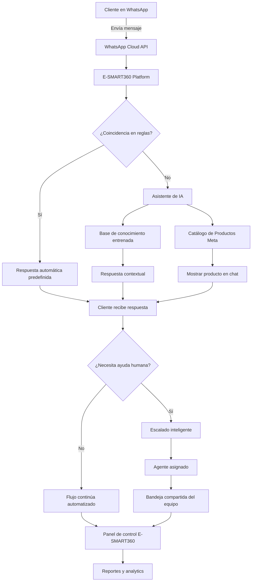

import { Callout, Steps, Step, Expandable, Columns, Card, Tabs, Tab, CodeGroup, CodeGroupItem, Update } from '/src/components/mdx';

<Update title="Actualización: Compatibilidad con WhatsApp Cloud API 2026" date="2026-05-07" />

# Cómo construir un asistente de ventas inteligente con IA para WhatsApp en eCommerce


> Este artículo está diseñado para propietarios de tiendas online, gerentes de marketing y emprendedores que desean automatizar sus ventas en WhatsApp. No se requieren conocimientos de programación.

---

_Última actualización: 18 de febrero de 2026_

---

## ¿Por qué tu tienda online necesita un catálogo de WhatsApp y un chatbot con IA?

Tus ventas van volando. ¡Fantástico! Pero tu bandeja de entrada también vuela con ellas. Terminas respondiendo las mismas preguntas día tras día: "¿Esto está en stock?", "¿Cuál es tu política de devoluciones?", "¿Dónde está mi pedido?"

Cada minuto que pasas escribiendo estas respuestas es tiempo que no dedicas a estrategias, marketing o hacer crecer tu marca. Esta rutina manual no es solo un cuello de botella, sino un asesino silencioso del crecimiento: respuestas tardías, clientes frustrados y ventas que se escapan de tus manos.

Deja de gestionar tu negocio manualmente: ¡automatízalo! Imagina tener un asistente de ventas inteligente disponible 24/7 a través de WhatsApp, la aplicación favorita de tus clientes. Un asistente que no solo responde preguntas, sino que también muestra productos de tu catálogo mientras los clientes avanzan hacia el checkout.


> Esto no es solo una herramienta. Es tu nueva ventaja competitiva. Y puedes construirla hoy mismo.

### El potencial de WhatsApp para el comercio electrónico

El potencial en WhatsApp es enorme. Con más de 2 mil millones de usuarios activos y tasas de apertura que a menudo superan el 90%, es tu canal directo hacia los clientes. Pero la oportunidad también conlleva expectativas: esos clientes de hoy esperan respuestas inmediatas.

Un bajo tiempo de respuesta es un enemigo del negocio. Un retraso de pocos minutos puede marcar la diferencia entre una compra completada y un carrito abandonado. Aquí es donde la automatización del servicio al cliente realmente brilla.

Un chatbot impulsado por IA ofrece:

- **Gratificación instantánea**: Responde consultas de clientes 24/7, incluso mientras duermes.
- **Precisión impecable**: Informa al público de manera consistente y precisa sobre tus productos, políticas y envíos.
- **Mayor eficiencia**: Te libera a ti y a tu equipo para ocuparse de los casos complejos y de alto valor que requieren un toque humano.


> Combinar un chatbot con IA y tu catálogo de productos en WhatsApp crea una experiencia de compra conversacional que los clientes amarán y que generará más ingresos.

## Componentes principales del sistema de ventas automatizado

Antes de comenzar, necesitas reunir tres elementos fundamentales que trabajarán en conjunto para crear una máquina de ventas automatizada.

### Los 3 componentes esenciales

1. **Cuenta de WhatsApp Business API**: Es la puerta de entrada para que las empresas usen WhatsApp a escala. WhatsApp Business API te permite enviar mensajes proactivos a tus clientes (usando plantillas aprobadas), gestionar volúmenes altos de conversaciones y acceder a funciones avanzadas como catálogos, listas interactivas y flujos de pago. No te preocupes por la configuración técnica: la plataforma de E-SMART360 te conecta de forma rápida y sencilla mediante Embedded Signup, eliminando la necesidad de configurar Meta Business Manager manualmente.

2. **Catálogo de productos en Meta Business Manager**: Es tu inventario digital dentro del ecosistema de Meta. Este catálogo es la fuente de verdad de tus productos: contiene imágenes, descripciones, precios, SKUs y disponibilidad. La IA lo usará para mostrar productos a los clientes de forma dinámica y contextual.

3. **Una cuenta en E-SMART360**: Aquí es donde todo cobra vida. La plataforma conecta tu número de WhatsApp, sincroniza tu catálogo de productos y entrena el cerebro de tu asistente de IA. Todo desde un panel unificado sin necesidad de conocimientos técnicos.


### 📦 Catálogo de productos

Tu inventario digital sincronizado con Meta. Puedes subir productos manualmente, mediante hoja de cálculo (CSV/Excel) o conectando tu tienda Shopify/WooCommerce.
    <br/><br/>
    <em>Formato soportado: imágenes, nombre, descripción, precio, SKU, disponibilidad, variantes.</em>
  
### 🔗 WhatsApp Business API

El canal oficial para comunicación empresarial a escala. Mensajes proactivos con plantillas, métricas de entrega, indicadores de escritura, y soporte para mensajes interactivos.
    <br/><br/>
    <em>Configurable en minutos mediante Embedded Signup.</em>
  
### 🧠 IA entrenada

El cerebro de tu asistente. Se entrena con preguntas frecuentes, URLs de tu web y documentos PDF/DOCX/TXT para dar respuestas precisas y contextuales.
    <br/><br/>
    <em>Soporta múltiples campañas de entrenamiento y modos de respuesta.</em>
  
### Arquitectura del sistema de ventas automatizado

Para entender cómo funciona todo en conjunto, veamos la arquitectura tecnológica detrás del asistente de ventas:




> Este diagrama representa el flujo completo desde que un cliente envía un mensaje hasta que la conversación se resuelve, ya sea mediante la IA o mediante la intervención de un agente humano.

## Guía paso a paso: Construye tu asistente de ventas con IA

¿Listo para poner tu servicio al cliente en piloto automático? Vamos a construir tu asistente de ventas paso a paso.


> **Requisitos previos**: Asegúrate de tener a mano tu cuenta de Meta Business Manager verificada y los datos de tu tienda online (productos, precios, imágenes). El proceso completo toma aproximadamente 30-45 minutos.

### Paso 1: Configurar el catálogo en Meta Business Manager

Antes de la sincronización, debes crear un catálogo en Meta. Este será el repositorio del que extraerás tus productos.

    **Accede a Commerce Manager**: Conéctate a tu Meta Business Manager. Verás la opción Commerce Manager en las herramientas.

    **Crea tu catálogo**: Haz clic en el botón de agregar (+) para añadir un nuevo catálogo.

    - Selecciona **E-commerce** como tipo de catálogo. Esta opción es la adecuada porque vendes artículos.
    - Configura el método de carga de productos. Puedes elegir "Subir información de artículos" como punto de partida, o conectar plataformas asociadas como Shopify.
    - Especifica la cuenta propietaria del catálogo y asígnale un nombre descriptivo, por ejemplo: "Tienda_Online".

    **Añade productos a tu catálogo**: Una vez creado, ve a la página de "Artículos" y selecciona "Añadir artículos". Tienes varios métodos según el tamaño de tu inventario:

    - **Conectar con seguimiento (píxel de Meta)**: El método más automatizado. Instala el píxel de Meta en tu sitio web y los productos se sincronizarán automáticamente basándose en la interacción de los usuarios. Ideal para tiendas con catálogos grandes y actualizaciones frecuentes.

    - **Fuente de datos (hoja de cálculo)**: Sube un archivo CSV o Excel con todos los detalles de tus productos (nombre, descripción, precio, imagen, SKU, categoría, disponibilidad, variantes). Es la mejor opción para inventarios grandes (más de 50 productos) y te permite actualizar el catálogo en masa.

    - **Añadir manualmente**: Ideal para tiendas con pocos productos (menos de 20). Debes ingresar título, descripción, imágenes, precio, y asignar un ID de contenido único (SKU) a cada producto. Es el método más lento pero te da control total sobre cada ficha.

    

#### Formato CSV para carga masiva

```csv
        id,nombre,descripcion,precio,imagen_url,categoria,sku,stock
        001,Camisa Algodón Premium,Camisa 100% algodón ring-spun,29.99,https://tutienda.com/img/camisa.jpg,Ropa,CAM-001,50
        002,Pantalón Casual,Pantalón de mezclilla azul,39.99,https://tutienda.com/img/pantalon.jpg,Ropa,PAN-002,30
        003,Zapatos Deportivos,Zapatillas running con amortiguación,59.99,https://tutienda.com/img/zapatos.jpg,Calzado,ZAP-003,25
        ```
      
> Si tu tienda está en Shopify o WooCommerce, puedes conectar la plataforma directamente y los productos se sincronizarán automáticamente sin necesidad de cargar archivos manualmente.
    
> Este catálogo es el que permite a la plataforma de E-SMART360 recuperar y presentar los detalles de tus productos en las conversaciones de WhatsApp.
    
### Paso 2: Conectar tu cuenta de WhatsApp y asignar el catálogo

En este paso, debes vincular el canal de comunicación (WhatsApp) con el inventario de productos (el catálogo que acabas de crear).

    **Paso 2.1 — Accede a la configuración de negocio**: En tu Meta Business Manager, dirígete a Configuración de negocio > Cuentas de WhatsApp.

    **Paso 2.2 — Selecciona tu cuenta de negocio**: Identifica la cuenta de WhatsApp Business donde deseas trabajar. Si tienes varias cuentas, asegúrate de seleccionar la correcta.

    **Paso 2.3 — Ve a configuración**: Dentro de la cuenta de WhatsApp, selecciona la pestaña de "Configuración" y luego haz clic en "WhatsApp Manager". Se abrirá una nueva ventana con las opciones avanzadas de tu cuenta.

    **Paso 2.4 — Vincula tu catálogo**: Ve a la sección "Catálogo" dentro de WhatsApp Manager. Desde el menú desplegable, selecciona el catálogo que configuraste en el Paso 1.

    **Paso 2.5 — Verifica la conexión**: Haz clic en "Conectar catálogo". Recibirás una confirmación visual de que el catálogo está vinculado correctamente. A partir de este momento, el número de WhatsApp vinculado puede ver y compartir productos del catálogo conectado directamente en las conversaciones.

    
> La vinculación entre WhatsApp y el catálogo es un requisito obligatorio de Meta. Sin este paso, el chatbot no podrá mostrar productos dentro de las conversaciones aunque el catálogo esté creado.
    
### Paso 3: Sincronizar tu tienda online con E-SMART360

Una vez que hayas configurado Meta, puedes integrar la configuración en E-SMART360.

    **Acceso a la plataforma**: Inicia sesión en tu cuenta de E-SMART360 con tus credenciales.

    **Conexión de la cuenta de WhatsApp**: Ve a la sección "Conectar cuenta" desde el menú lateral. Selecciona el bot de WhatsApp y sigue los pasos para sincronizar tu cuenta de WhatsApp Business. La plataforma utiliza el sistema Embedded Signup de Meta para simplificar el proceso, por lo que solo necesitas iniciar sesión con tu cuenta de Facebook y aceptar los permisos.

    **Sincronización del catálogo**: A continuación, navega al menú "WhatsApp" y luego a "Catálogo de eCommerce". Selecciona la cuenta de WhatsApp correspondiente y haz clic en el botón "Sincronizar". La plataforma se comunicará con Meta Business Manager para obtener todos los productos del catálogo conectado.

    **Verificación de la sincronización**: Una vez completada la sincronización, podrás ver todos tus productos listados en la sección de catálogo dentro de E-SMART360. Aquí puedes verificar que los nombres, precios e imágenes se hayan importado correctamente. Si algún producto no aparece, revisa que esté correctamente configurado en Meta Commerce Manager.

    
> La sincronización puede tardar entre 1 y 5 minutos dependiendo del tamaño de tu catálogo. Una vez completada, los productos estarán disponibles inmediatamente para usarse en los flujos de chat automatizados con tus clientes.
    
### Paso 4: Crear el 'cerebro' de tu IA (los datos de entrenamiento)

Tu chatbot con IA es inteligente, pero necesita aprender sobre tu negocio y productos específicos. Un documento de preguntas frecuentes (FAQ) es el método más efectivo para lograrlo, pero también puedes usar URLs y archivos para complementar el conocimiento.

    ### 4.1. Entrenamiento con Preguntas Frecuentes (FAQ)

    El método de preguntas frecuentes es el más directo y eficiente para entrenar tu asistente. Piensa en las 15 a 25 preguntas principales que respondes cada día. Escribe las preguntas y respuestas tal como lo harías de forma natural, incluyendo variaciones de la misma pregunta para cubrir diferentes formas de expresarse.

    Ejemplos de formato FAQ:

    

#### Formato FAQ

```
        Pregunta: ¿De qué material están hechas tus camisetas?
        Respuesta: Nuestras camisetas premium están hechas de algodón 100% ring-spun para una sensación suave y cómoda. Están disponibles en tallas S, M, L, XL y XXL.

        Pregunta: ¿Cómo funciona tu política de devoluciones?
        Respuesta: Ofrecemos una política de devolución de 30 días sin complicaciones. Si no estás satisfecho con tu compra, contáctanos a través de WhatsApp y te guiaremos en el proceso de reembolso o cambio completo. Los gastos de envío de devolución corren por nuestra cuenta.

        Pregunta: ¿Hacen envíos internacionales?
        Respuesta: ¡Sí, enviamos a todo el mundo! Los costos de envío se calculan automáticamente en el checkout según tu ubicación. El tiempo estimado de entrega internacional es de 7 a 14 días hábiles.

        Pregunta: ¿Cuánto tarda un envío nacional?
        Respuesta: Los envíos nacionales se entregan en un plazo de 2 a 5 días hábiles. Recibirás un número de seguimiento una vez que el paquete sea despachado.

        Pregunta: ¿Aceptan pagos con tarjeta de crédito?
        Respuesta: Sí, aceptamos tarjetas de crédito y débito (Visa, Mastercard, American Express), así como PayPal, transferencia bancaria y pago contra entrega en zonas seleccionadas.

        Pregunta: ¿Tienen garantía los productos?
        Respuesta: Todos nuestros productos tienen una garantía de 12 meses contra defectos de fabricación. Para hacer válida la garantía, contacta a nuestro equipo de soporte con tu número de pedido.
        ```
      
> Cuanto más completo y detallado sea este documento, más inteligente será tu bot. Incluye al menos 15 preguntas y cubre todas las áreas: productos, envíos, pagos, devoluciones, garantía, tallas y disponibilidad.
    
### 4.2. Métodos avanzados de entrenamiento

    Además del método básico de preguntas frecuentes, la plataforma de E-SMART360 ofrece opciones adicionales para enriquecer el conocimiento de tu asistente de IA:

    **Entrenamiento con URL**: Si tienes una página web con información de productos, políticas de privacidad, guías de tallas o términos del servicio, puedes agregar la URL directamente. La IA navegará la página, extraerá el contenido relevante y lo utilizará para responder preguntas contextualmente. Pasos:

    1. Ve a la sección de entrenamiento de IA y selecciona la opción "URL".
    2. Ingresa la URL completa de la página que deseas usar (ej: https://tutienda.com/politica-de-envios).
    3. Selecciona el tipo de selector (ID o Clase) basado en la estructura HTML de la página.
    4. Opcionalmente, elimina contenido innecesario como anuncios, barras laterales o encabezados.
    5. Elige entre "Generar FAQ" (convierte el contenido en preguntas y respuestas estructuradas) o "Respuesta completa" (mantiene el texto íntegro).
    6. Guarda los cambios.

    **Entrenamiento con archivos**: Sube archivos PDF, Word (.docx) o TXT con información detallada de tu negocio. Este método es ideal para manuales de producto, guías de usuario, catálogos extensos o documentación técnica. Pasos:

    1. Ve a Configuración de archivos en el panel de entrenamiento.
    2. Haz clic en "Nuevo" y selecciona el archivo desde tu computadora.
    3. Elige el modo de procesamiento:
       - **Respuesta completa**: Proporciona una respuesta detallada basada en todo el contenido del archivo. Consume más tokens pero es más precisa.
       - **Generar FAQ**: Divide automáticamente el contenido en preguntas frecuentes estructuradas. Es más eficiente en tokens y da respuestas más rápidas.
    4. Guarda el archivo y finaliza el entrenamiento.

    

### 📄 FAQ

<strong>Ideal para:</strong> Respuestas rápidas y estructuradas
        <br/>
        <strong>Consumo:</strong> Bajo en tokens
        <br/>
        <strong>Mejor para:</strong> Preguntas comunes, políticas, horarios, precios
        <br/>
        <strong>Formato:</strong> Texto plano con estructura Pregunta/Respuesta
      
### 🔗 URL

<strong>Ideal para:</strong> Contenido web dinámico
        <br/>
        <strong>Consumo:</strong> Medio en tokens
        <br/>
        <strong>Mejor para:</strong> Políticas extensas, landing pages, guías online
        <br/>
        <strong>Formato:</strong> URLs públicas con selector CSS
      
### 📁 Archivos

<strong>Ideal para:</strong> Documentos completos
        <br/>
        <strong>Consumo:</strong> Alto en tokens (respuesta completa)
        <br/>
        <strong>Mejor para:</strong> Manuales, fichas técnicas, catálogos PDF
        <br/>
        <strong>Formato:</strong> PDF, DOCX, TXT
      
> La combinación de los tres métodos de entrenamiento (FAQ + URL + Archivos) produce el asistente de IA más completo. Cada método aporta una perspectiva diferente y cubre gaps que los otros podrían dejar.
    
### Paso 5: Crear una campaña de entrenamiento de IA

Cuando tu material de entrenamiento esté listo, el siguiente paso es estructurarlo dentro de la plataforma.

    **Accede al área de entrenamiento de IA**: Dentro de la plataforma E-SMART360, navega a Dashboard > Configuración > Campaña de entrenamiento de IA.

    **Crea una nueva campaña**:
    1. Haz clic en "Crear" para iniciar una nueva campaña.
    2. Ingresa un nombre para la campaña, por ejemplo: "FAQ Tienda Principal - 2026".
    3. Define un mensaje de **prompt** personalizado. Este prompt es crucial porque define el rol y el tono del bot. Por ejemplo: "Eres un asistente de ventas amable y profesional para [Nombre de tu tienda]. Responde siempre en español, sé conciso pero informativo, y cuando sea relevante, recomienda productos de nuestro catálogo."
    4. Ajusta la temperatura de la IA (si está disponible) para controlar la creatividad de las respuestas. Un valor bajo (0.3-0.5) da respuestas más predecibles y precisas.
    5. Haz clic en "Guardar".

    **Agrega contenido a la campaña**:
    1. Haz clic en el botón "+" dentro de la campaña recién creada.
    2. Elige el tipo de contenido:
       - **FAQs**: Estructura tus preguntas y respuestas. Es el método más eficiente y el que consume menos tokens.
       - **URL**: Agrega una URL de tu sitio web.
       - **Archivo**: Sube un PDF, Word o TXT.
    3. Dependiendo del tipo seleccionado, elige entre:
       - **Resumen (Summary)**: Proporciona respuestas ricas y contextuales pero consume más tokens.
       - **FAQ (Preguntas frecuentes)**: Eficiente en costos y estructurado para respuestas rápidas.
    4. Guarda los cambios.
  
### Paso 6: Configurar el comportamiento de la IA

Una vez que la campaña de entrenamiento está creada con su contenido, debes configurar cómo se comportará la IA en las conversaciones.

    ### 6.1. Configurar respuesta "Sin coincidencia"

    Cuando el chatbot encuentra una consulta que no coincide exactamente con ninguna regla predefinida, puedes configurarlo para que recurra a la IA entrenada:

    1. Ve a Gestor de Bots > Botones de acción > Sin coincidencia.
    2. Selecciona "Respuesta IA" como tipo de respuesta.
    3. Enlaza la campaña de entrenamiento de IA que creaste en el paso anterior.
    4. Habilita la "Respuesta sin coincidencia" en la Configuración.
    5. Guarda los cambios.

    ### 6.2. Habilitar el Asistente de IA principal

    Para que la IA maneje las consultas de forma proactiva:

    1. Ve a Gestor de Bots.
    2. Activa el interruptor "Habilitar Asistente de IA".
    3. Selecciona la campaña de entrenamiento deseada desde el menú desplegable.
    4. Elige el modo de respuesta:
       - **Asistente IA para todas las consultas**: La IA maneja todas las interacciones con los clientes, desde preguntas simples hasta recomendaciones de productos. Es el modo más potente y recomendado para ventas automatizadas.
       - **IA solo como respaldo**: La IA interviene únicamente cuando las reglas predefinidas del chatbot no encuentran una coincidencia. Útil si ya tienes un flujo de bot establecido y solo quieres que la IA cubra los casos no contemplados.
    5. Guarda los cambios.

    
> Al activar la IA, asegúrate de seleccionar la campaña de entrenamiento correcta desde el menú desplegable. La IA se activará de inmediato y comenzará a atender clientes. Te recomendamos hacer pruebas primero con tu propio número antes de ponerla en producción.
    
### 6.3. Escalado inteligente a agentes humanos

    Una de las funcionalidades más potentes es el escalado inteligente, que permite que la IA derive conversaciones a agentes humanos cuando es necesario:

    1. Habilita la opción "Asignar miembro del equipo o agente por IA" en la configuración de la Bandeja Compartida.
    2. Define las condiciones de escalado: palabras clave como "hablar con un agente", "queja", "reclamo", o cuando la IA detecte frustración en el cliente.
    3. Configura la asignación automática: la IA puede asignar la conversación a un miembro específico del equipo basándose en el tipo de consulta (ventas, soporte técnico, devoluciones).
    4. Los miembros del equipo reciben una notificación y pueden ver el historial completo de la conversación antes de responder.
  
### Paso 7: Configurar secuencias de mensajes de ventas

Una vez que tu asistente de IA está activo y configurado, puedes complementarlo con secuencias de mensajes automatizados para maximizar las conversiones. Las secuencias son conjuntos de mensajes preconfigurados que se envían basándose en eventos y horarios definidos.

    ### ¿Qué es una secuencia de mensajes?

    Una secuencia de mensaje es un conjunto de mensajes automatizados preconfigurados que se envían a los suscriptores basándose en disparadores predefinidos y horarios programados. Estos mensajes ayudan a mantener el engagement, nutrir leads y automatizar respuestas de manera eficiente.

    ### Ideas para secuencias de mensajes

    

### Secuencias de bienvenida

Da la bienvenida a los nuevos suscriptores con mensajes personalizados. Esta es tu oportunidad de causar una excelente primera impresión y guiar al cliente hacia los productos más populares.
        <br/><br/>
        <strong>Ejemplo:</strong>
        <br/>
        Día 1 - Mensaje de bienvenida + 10% de descuento
        <br/>
        Día 2 - Producto destacado de la semana
        <br/>
        Día 3 - Testimonios de clientes satisfechos
      
### Secuencias de lead nurturing

Educa a tus prospectos sobre productos o servicios. Envía contenido valioso de forma gradual para construir confianza y autoridad en tu nicho.
        <br/><br/>
        <strong>Ejemplo:</strong>
        <br/>
        Día 1 - Guía de compra del producto
        <br/>
        Día 3 - Comparativa de modelos
        <br/>
        Día 5 - Caso de éxito de un cliente similar
      
### Secuencias de ventas

Guía a los clientes potenciales a través del embudo de ventas paso a paso. Cada mensaje los acerca más a la compra final.
        <br/><br/>
        <strong>Ejemplo:</strong>
        <br/>
        Paso 1 - Presentación del producto principal
        <br/>
        Paso 2 - Beneficios y características clave
        <br/>
        Paso 3 - Oferta especial por tiempo limitado
        <br/>
        Paso 4 - Último recordatorio + enlace directo de compra
      
### Secuencias de onboarding

Ayuda a los nuevos usuarios a comenzar con tu producto o servicio. Reduce la fricción inicial y mejora la retención.
        <br/><br/>
        <strong>Ejemplo:</strong>
        <br/>
        Día 1 - Video tutorial de primeros pasos
        <br/>
        Día 3 - Consejos avanzados
        <br/>
        Día 7 - Solicitud de feedback
      
### Secuencias promocionales

Anuncia nuevos productos, descuentos especiales o eventos.
        <br/><br/>
        <strong>Ejemplo:</strong>
        <br/>
        Anuncio de lanzamiento - 7 días antes
        <br/>
        Pre-lanzamiento con descuento exclusivo
        <br/>
        Día del lanzamiento - Link de compra
        <br/>
        Post-lanzamiento - Oferta "combo"
      
### Cómo configurar y lanzar una campaña de secuencia de mensajes

    1. **Crear nueva secuencia**: Navega al Flow Builder y selecciona "Nueva Secuencia".
    2. **Configurar nombre y temporización**: Define el nombre de la campaña y configura los intervalos entre cada mensaje.
    3. **Estructurar la secuencia**: Añade texto, imágenes multimedia y llamadas a la acción (CTA) en cada paso.
    4. **Seleccionar disparador**: Define qué acción del usuario inicia la secuencia (suscripción, compra, abandono de carrito, etc.).
    5. **Activar y monitorear**: Finaliza la configuración y activa la secuencia. Realiza un seguimiento del rendimiento con las analíticas integradas.

    ### Buenas prácticas para secuencias de mensajes

    - Mantén los mensajes concisos y relevantes. Los usuarios de WhatsApp valoran la brevedad.
    - Personaliza las interacciones usando datos del usuario como nombre, ubicación o historial de compras.
    - Programa los mensajes estratégicamente para mantener el engagement sin ser invasivo. Respeta los horarios comerciales.
    - Usa plantillas de mensajes pre-aprobadas para WhatsApp cuando envíes fuera de la ventana de 24 horas.
    - Analiza continuamente el rendimiento y refina las secuencias basándote en los datos: tasas de apertura, clics y conversiones.
  
## Paso 8: Probar el asistente y verlo en acción

### Pruebas antes de lanzar

Antes de poner tu asistente de IA en producción, es fundamental realizar pruebas exhaustivas:

1. **Prueba interna**: Envía mensajes desde tu propio número de WhatsApp al número de negocio. Haz todas las preguntas que entrenaste y verifica que las respuestas sean correctas.

2. **Prueba de casos límite**: Pregunta cosas que NO entrenaste para ver cómo maneja la IA las situaciones inesperadas. La respuesta "sin coincidencia" debería ser útil y no frustrante.

3. **Prueba de productos**: Pide al bot que te muestre productos específicos. Verifica que las imágenes, precios y descripciones se muestren correctamente desde el catálogo.

4. **Prueba de escalado**: Escribe frases como "Necesito hablar con un agente" o "Quiero hacer un reclamo" y verifica que la conversación se escale correctamente al equipo humano.

5. **Prueba de carga**: Simula varias conversaciones simultáneas para asegurarte de que el sistema responde correctamente bajo demanda.

### Puesta en marcha

Para usar tu nuevo asistente de IA con tus clientes, debes acceder a WhatsApp Web en el navegador, ya que la aplicación de escritorio oficial de WhatsApp no admite la visualización del catálogo de productos en el chat.

Envía un mensaje a tu número de negocio y prueba a hacer una de las preguntas entrenadas, o pregunta sobre un producto específico. La IA te responderá en tiempo real y, cuando sea apropiado, recuperará el producto del catálogo para mostrarlo al cliente.


> Cada pedido y conversación que el bot inicia se captura y gestiona desde el panel central de E-SMART360, proporcionándote una vista única de todas tus actividades automatizadas de ventas y soporte.

Para usar tu nuevo asistente de IA, debes acceder a WhatsApp Web en el navegador, ya que la aplicación de escritorio oficial de WhatsApp no admite la visualización del catálogo de productos en el chat.

Envía un mensaje a tu número de negocio y prueba a hacer una de las preguntas entrenadas, o pregunta sobre un producto específico. La IA te responderá en tiempo real y, cuando sea apropiado, recuperará el producto del catálogo para mostrarlo al cliente.


> Cada pedido y conversación que el bot inicia se captura y gestiona desde el panel central de E-SMART360, proporcionándote una vista única de todas tus actividades automatizadas de ventas y soporte.

### Funcionalidades avanzadas de gestión de conversaciones

La plataforma de E-SMART360 no solo automatiza las ventas, sino que también te ofrece herramientas para gestionar las conversaciones que requieren intervención humana:

**Bandeja de entrada compartida con equipo**: Todas las conversaciones que el asistente de IA no puede resolver se escalan automáticamente a los miembros del equipo adecuados. Esta bandeja de entrada unificada permite que múltiples agentes colaboren en tiempo real, vean el historial completo de cada cliente y respondan sin perder contexto. La función "Asignar miembro del equipo o agente por IA" garantiza que los problemas complejos lleguen a la persona correcta sin demora, basándose en el tipo de consulta, la experiencia del agente o la carga de trabajo actual.

**Escalado inteligente (Smart Escalation)**: La IA detecta cuándo un usuario necesita ayuda humana mediante el análisis del lenguaje natural. Cuando un cliente escribe frases como "Necesito hablar con una persona", "Estoy frustrado", "Quiero hacer una reclamación" o "Esto no resuelve mi problema", la IA asigna automáticamente la conversación al agente disponible más adecuado. Los miembros del equipo pueden ver y responder a las consultas escaladas en tiempo real, con acceso completo al historial de la conversación para no tener que pedir al cliente que repita la información.

**Panel de seguimiento de pedidos**: Desde el panel de control de E-SMART360 puedes ver todos los pedidos generados a través del chatbot, su estado actual (pendiente, confirmado, enviado, entregado) y las conversaciones asociadas a cada uno. Puedes filtrar por fecha, producto, cliente o estado del pedido. Esto te permite tener un control total sobre tu operación de ventas automatizada.

**Notificaciones de seguimiento**: Configura notificaciones automáticas para mantener informados a tus clientes sobre el estado de sus pedidos. Cuando un pedido cambia de estado (confirmado, enviado, en tránsito, entregado), el chatbot envía automáticamente un mensaje actualizado al cliente, reduciendo las consultas de seguimiento.


### 🤖 Automatización IA


      - Respuestas 24/7 a consultas frecuentes
      - Presentación de productos del catálogo con imágenes y precios
      - Calificación de leads y captura de datos del cliente
      - Seguimiento automatizado post-venta y post-compra
      - Notificaciones de cambio de estado de pedidos
      - Recuperación de carritos abandonados
    
  
### 👥 Intervención humana


      - Escalado inteligente de conversaciones por detección de intent
      - Bandeja de entrada compartida del equipo con historial completo
      - Asignación automática por IA al agente correcto según la consulta
      - Historial completo de cada cliente con todas las interacciones previas
      - Notificaciones en tiempo real cuando un agente es asignado
      - Transferencia suave (handoff) entre IA y humano sin pérdida de contexto
    
  
## Dashboard y analíticas: mide el rendimiento de tu asistente

Una de las ventajas de usar E-SMART360 es la capacidad de medir y optimizar el rendimiento de tu asistente de ventas con métricas en tiempo real. El panel de control te muestra:

### Métricas clave disponibles

- **Volumen de conversaciones**: Cuántas conversaciones inició el asistente de IA en un período (hoy, esta semana, este mes).
- **Tasa de resolución automatizada**: Porcentaje de conversaciones resueltas completamente por la IA sin intervención humana.
- **Consultas escaladas**: Cuántas conversaciones requirieron intervención de un agente humano.
- **Tiempo promedio de respuesta**: Velocidad a la que la IA responde a los clientes.
- **Productos más consultados**: Qué productos de tu catálogo generan más interés entre los clientes.
- **Horas pico de consulta**: En qué momentos del día recibes más mensajes, para optimizar la disponibilidad del equipo humano.
- **Satisfacción del cliente**: Resultados de las encuestas de satisfacción enviadas por la IA.

### Cómo usar los datos para mejorar

1. **Identifica lagunas de conocimiento**: Si ves que muchas conversaciones se escalan a humanos, revisa qué preguntas no pudo responder la IA y agrégales entrenamiento.
2. **Optimiza las secuencias**: Analiza dónde abandonan los clientes las secuencias de ventas y ajusta los mensajes o la temporización.
3. **Ajusta el catálogo**: Si ciertos productos nunca se consultan, considera destacarlos más en las conversaciones o revisar su posicionamiento.
4. **Refina el prompt**: Basándote en el tono de las conversaciones escaladas, ajusta el prompt de la IA para que sea más preciso o empático.

## Desafíos comunes y soluciones

Implementar un asistente de ventas con IA puede presentar algunos desafíos. Aquí te mostramos cómo resolverlos:

| Desafío | Solución |
|---------|----------|
| La IA no entiende preguntas complejas | Enriquece el entrenamiento con más FAQ, variaciones de preguntas, y documentos PDF detallados |
| Clientes frustrados porque quieren hablar con un humano | Configura correctamente el escalado inteligente para detectar palabras clave como "agente" o "persona" |
| Productos del catálogo no se muestran correctamente | Verifica la sincronización en Meta Commerce Manager y que los productos tengan imágenes de alta calidad |
| La IA da respuestas demasiado genéricas | Ajusta el prompt personalizado para que sea más específico sobre tu marca y productos |
| Alto consumo de tokens por respuestas largas | Usa el modo "Generar FAQ" en lugar de "Respuesta completa" para archivos de entrenamiento grandes |
| Baja tasa de recuperación de carritos | Ajusta la temporización de la secuencia de carrito abandonado (prueba 1h, 4h y 24h) |

## Buenas prácticas para mantener tu asistente de IA

Tu asistente de IA no es un proyecto de "configurar y olvidar". Para mantenerlo efectivo, sigue estas buenas prácticas:

### 1. Actualiza el entrenamiento regularmente
- **Cada mes**: Revisa las preguntas frecuentes y agrega nuevas preguntas que hayan surgido.
- **Cada trimestre**: Actualiza las URLs de entrenamiento si cambiaste el contenido de tu sitio web.
- **Con cada nuevo producto**: Agrega fichas técnicas o FAQs sobre los nuevos productos.

### 2. Monitorea las conversaciones escaladas
Las conversaciones que la IA no pudo resolver son tu mejor fuente de mejora. Analiza semanalmente por qué se escalaron y agrega ese conocimiento al entrenamiento.

### 3. Prueba después de cada cambio
Cada vez que actualices el entrenamiento, el prompt o las secuencias, haz una prueba completa antes de ponerlo en producción.

### 4. Mantén actualizado el catálogo
Los productos agotados, los cambios de precio y las nuevas colecciones deben reflejarse en tu catálogo de Meta. Programa una sincronización semanal.

### 5. Solicita feedback a tus clientes
Incluye preguntas al final de las conversaciones como: "¿Te resultó útil esta respuesta?" o "¿Hay algo más en lo que pueda ayudarte?". Esto te da insights directos sobre la calidad del servicio.

## Estrategias para maximizar las ventas con tu asistente de IA

Una vez que tu asistente de ventas está funcionando, puedes implementar estas estrategias para maximizar su impacto en tus ingresos.

### 1. Recuperación de carritos abandonados

Los carritos abandonados representan una de las mayores oportunidades de recuperación de ventas. Configura tu asistente de IA para que envíe automáticamente un recordatorio personalizado a los clientes que agregaron productos al carrito pero no completaron la compra:

- **Momento óptimo**: Envía el primer recordatorio entre 1 y 4 horas después del abandono.
- **Contenido**: Muestra los productos abandonados directamente desde el catálogo de WhatsApp con imágenes y precios.
- **Incentivo**: Ofrece un descuento por tiempo limitado o envío gratis para motivar la compra.

### 2. Venta cruzada y upsell automatizado

Después de una compra, el asistente de IA puede recomendar productos complementarios basándose en el historial del cliente:

- **Venta cruzada**: "Compraste unos zapatos deportivos. ¿Te gustaría agregar estas plantillas ortopédicas?"
- **Upsell**: "Has elegido el modelo básico. Por solo 20€ más, puedes llevar la versión premium con garantía extendida."

### 3. Segmentación de clientes por comportamiento

El asistente de IA puede clasificar automáticamente a los clientes según su comportamiento:

- **Nuevos**: Clientes que nunca han comprado. Enviar secuencia de bienvenida + descuento.
- **Activos**: Clientes que compran regularmente. Enviar novedades y recomendaciones personalizadas.
- **Inactivos**: Clientes que no han comprado en más de 60 días. Enviar campaña de reactivación.
- **VIP**: Clientes con alto valor de compra. Enviar ofertas exclusivas y acceso anticipado.

### 4. Automatización de encuestas de satisfacción

Después de cada compra o interacción de soporte, el asistente de IA puede enviar una breve encuesta de satisfacción. Las respuestas se registran automáticamente y se pueden usar para mejorar el servicio:

```
¡Gracias por tu compra {nombre}! 🎉
Del 1 al 10, ¿qué tan satisfecho estás con tu experiencia?
1= Muy insatisfecho, 10= Muy satisfecho
```

## Ejemplos prácticos de uso

### Caso 1: Tienda de ropa online

María tiene una tienda de ropa online que recibe más de 100 consultas diarias en WhatsApp. Antes de implementar el asistente de IA, pasaba 4 horas al día respondiendo preguntas básicas sobre tallas, materiales y políticas de envío. Contaba con una empleada a medio tiempo solo para gestionar el chat de WhatsApp.

**Después de la implementación**:
- El asistente de IA responde el 85% de las consultas de forma automática y precisa
- María solo revisa los casos escalados (devoluciones complejas, reclamaciones, consultas de talla personalizada)
- Las ventas aumentaron un 30% porque los clientes reciben respuesta en segundos en lugar de minutos u horas
- El catálogo de productos se muestra automáticamente cuando un cliente pregunta por un artículo específico
- La empleada a medio tiempo ahora se dedica a tareas de marketing y creación de contenido
- Las secuencias de carrito abandonado recuperaron el 15% de las ventas perdidas


> **Consejo**: María entrenó su IA con 25 preguntas frecuentes, el PDF de su guía de tallas y la URL de su política de envíos. Este enfoque multicanal (FAQ + archivo + URL) dio como resultado un asistente mucho más completo que cubre todos los aspectos del negocio.

### Caso 2: Tienda de electrónica con productos técnicos

Carlos vende productos electrónicos y sus clientes suelen hacer preguntas técnicas muy específicas sobre compatibilidad, especificaciones y garantías. Su catálogo incluye más de 200 productos con características técnicas complejas.

**Solución implementada**:
- Entrenó la IA con las fichas técnicas de todos sus productos en formato PDF (más de 30 documentos)
- Configuró secuencias de ventas para hacer seguimiento a clientes interesados en productos de alto valor (más de 500€)
- Usó el escalado inteligente para que las consultas sobre garantías y devoluciones vayan directamente al departamento de soporte técnico
- Configuró mensajes de carrito abandonado para recuperar ventas de productos de precio medio
- Creó una secuencia educativa de 5 días para clientes que preguntan sobre productos complejos

**Resultados**:
- Reducción del 60% en el tiempo de respuesta
- Aumento del 40% en la tasa de conversión de consultas a ventas
- El equipo de soporte pasó de gestionar 50 consultas/día a solo 8 consultas/día (las más complejas)
- Tasa de recuperación de carritos abandonados del 22%

### Caso 3: Servicio de suscripción mensual

Laura ofrece un servicio de suscripción mensual para productos de belleza y cuidado personal. Su desafío era gestionar las altas, cambios de plan, pausas y cancelaciones de forma eficiente.

**Solución implementada**:
- Entrenó la IA con las políticas de suscripción: cambios de plan, pausas, cancelaciones y facturación
- Configuró una secuencia de bienvenida para nuevos suscriptores con instrucciones de uso
- Usó el escalado inteligente para derivar cancelaciones al equipo de retención
- Automatizó los recordatorios de pago y renovación

**Resultados**:
- Reducción del 50% en consultas de soporte sobre facturación
- Tasa de retención mejorada porque las cancelaciones se derivan al equipo especializado
- Los nuevos suscriptores completan el onboarding en la mitad del tiempo

## Preguntas frecuentes


### ¿Qué es un chatbot de WhatsApp con IA para tiendas online?

Un chatbot de WhatsApp con IA para tiendas online es un asistente virtual que proporciona soporte 24/7 a los clientes. Ayuda a los compradores a descubrir productos, proporciona respuestas precisas sobre productos, políticas y pedidos, y tiene la capacidad de acceder al catálogo de productos para mostrar imágenes, descripciones y precios directamente en el chat. Todo esto sin intervención humana.

### ¿Qué tipo de negocio online necesita un chatbot de WhatsApp?

Cualquier negocio online que reciba consultas recurrentes de clientes se beneficia de un chatbot. El soporte instantáneo evita la pérdida de ventas debido a respuestas tardías. Automatiza las preguntas repetitivas para que tu equipo pueda centrarse en problemas más complejos. Esta eficiencia convierte tu servicio al cliente en un motor de crecimiento, no en un centro de costos.

### ¿Qué necesito para construir un chatbot de ventas en WhatsApp?

Necesitas tres elementos obligatorios: una cuenta de WhatsApp Business para conversaciones oficiales, un catálogo de productos en Meta Business Manager para almacenar tus productos y una cuenta en E-SMART360. La plataforma de E-SMART360 es la aplicación que conecta todas estas herramientas y construye el cerebro de la IA.

### ¿Cómo consigo que mi chatbot de IA conozca mi industria y su terminología?

Le proporcionas a la IA un documento de "preguntas frecuentes" adaptado a tu negocio. Recopilas las preguntas que recibes de tus clientes y escribes las respuestas. Este texto se copia en la plataforma de E-SMART360 para entrenar la IA. Ese documento es el cerebro del chatbot: le da las instrucciones necesarias para responder adecuadamente sobre tus productos y políticas. Además, puedes complementarlo con URLs de tu sitio web y archivos PDF con información detallada.

### ¿Mi chatbot de WhatsApp podrá mostrar productos de mi tienda?

Sí. Una vez que conectas tu catálogo de productos de Meta, el chatbot recupera y presenta automáticamente los productos dentro del chat. Cuando un cliente pregunta por un producto, la IA accede al catálogo para mostrarle una imagen, descripción y precio del artículo. Es una experiencia de compra completamente conversacional.

### ¿Se requieren conocimientos de programación para crear este chatbot?

No se requiere programación ni HTML. Todo funciona a través de interfaces intuitivas. Configuras los ajustes en Meta Business Manager, conectas tus cuentas a través de la plataforma de E-SMART360, subes tu archivo de entrenamiento con preguntas y respuestas, y haces clic para iniciar el chatbot. Todo el proceso es visual y guiado.

### ¿Qué permite WhatsApp dentro de un catálogo de productos?

Configuras el catálogo en Commerce Manager de Meta. Puedes añadir artículos manualmente después de crear el catálogo, lo cual es bueno para inventarios pequeños. Para tiendas más grandes, puedes subir una hoja de cálculo (fuente de datos) o conectar un píxel de Meta para sincronizar productos desde tu sitio web automáticamente.

### ¿Cómo se gestionan los pedidos y las conversaciones que genera el chatbot?

Todas las conversaciones y pedidos iniciados por el chatbot de IA se registran y recuperan dentro de una única interfaz en el panel de control de E-SMART360. Todas las actividades de ventas automatizadas y atención al cliente se centralizan en una sola interfaz, lo que facilita su monitoreo y control. Además, las conversaciones que requieren intervención humana se escalan inteligentemente al agente adecuado.

### ¿Qué es una secuencia de mensajes y cómo mejora las ventas?

Una secuencia de mensajes es un conjunto de mensajes automatizados preconfigurados que se envían a los suscriptores basándose en eventos y horarios predefinidos. Puedes crear secuencias de bienvenida, de seguimiento post-compra, de recuperación de carritos abandonados o de lead nurturing. Cada mensaje se programa con retrasos específicos para mantener el compromiso del cliente sin ser invasivo.

### ¿Cómo personalizo el tono y la personalidad de mi asistente de IA?

Durante la creación de la campaña de entrenamiento de IA, puedes ajustar el mensaje de prompt para definir el rol y el tono del bot. Por ejemplo, puedes configurarlo para que sea formal y profesional, o amigable y cercano, dependiendo de la personalidad de tu marca. También puedes ajustar si la IA debe responder a todas las consultas o solo como respaldo cuando las reglas predefinidas no encuentren coincidencia.

## De estar abrumado a estar automatizado

Acabas de transformar tu servicio al cliente de un cuello de botella manual y lento a un sistema automatizado que mejora la experiencia del cliente e impulsa las ventas.

Por la pequeña inversión de tiempo que requiere configurar tu motor de comercio electrónico en WhatsApp con un chatbot de IA, recuperas incontables horas. No más preguntas repetitivas. No más ventas perdidas porque estabas ocupado. Solo una operación profesional y escalable que ahorra tiempo, dinero y mantiene a tus clientes satisfechos.


> **¿Listo para liberar más tiempo y no perder ninguna pregunta de clientes nunca más?** Comienza hoy con E-SMART360 y crea tu propio bot de WhatsApp impulsado por IA en solo minutos.

## Enlaces relacionados

- [Los 10 usos principales del chatbot de WhatsApp para eCommerce](/recursos/chatbot-whatsapp-ecommerce)
- [Cómo construir un chatbot de WhatsApp en pasos simples](/recursos/construir-chatbot-whatsapp)
- [Chatbots con IA: revoluciona tu soporte al cliente](/recursos/chatbots-ia-soporte-cliente)
- [Cómo recuperar carritos abandonados con WhatsApp](/recursos/recuperar-carritos-abandonados-whatsapp)
- [Catálogo de productos en WhatsApp: guía completa](/recursos/catalogo-productos-whatsapp)
