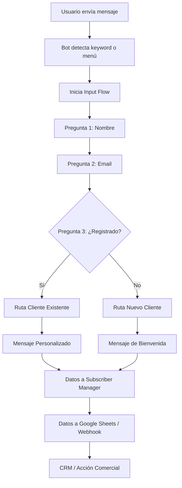
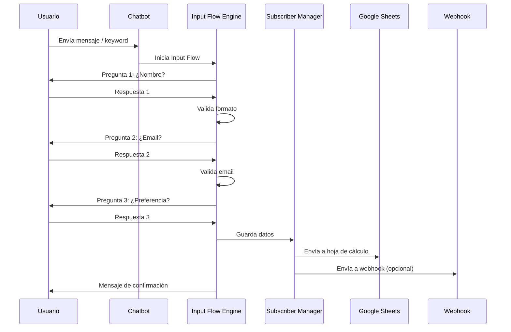

import { Callout, Steps, Step, Expandable, Columns, Card, Tabs, Tab, CodeGroup, CodeGroupItem } from '/components/ui';

# Cómo Automatizar Conversaciones Complejas con Input Flow de Usuario en Webchat


> El Input Flow de Usuario (User Input Flow) es la herramienta definitiva para transformar conversaciones estáticas en diálogos dinámicos e inteligentes. Te permite guiar a tus clientes paso a paso, recolectar información valiosa y personalizar cada interacción.

Última actualización: 24 de enero de 2026

En el vertiginoso mundo digital actual, ofrecer una experiencia al cliente sin fricciones ya no es un lujo, sino una necesidad absoluta. Sin embargo, el mayor desafío que enfrentan las empresas es gestionar conversaciones de múltiples pasos sin saturar a sus equipos de soporte. Aquí es donde entra en juego el **Input Flow de Usuario**, una herramienta revolucionaria para automatizar interacciones complejas con los clientes.

Ya sea que necesites un chatbot para tu sitio de e-commerce, un chatbot gratuito para tu página web o un potente asistente con IA para sitios web, el Input Flow de Usuario te cubre. ¿Listo para transformar la forma en que tu marca se comunica? Sigue leyendo para descubrir cómo esta funcionalidad cambiará por completo tu estrategia de chatbot web.

## ¿Qué es el Input Flow de Usuario?

El Input Flow de Usuario es un marco dinámico que permite a los chatbots recopilar entradas de los usuarios, construir diagramas de flujo conversacionales y procesar datos en tiempo real de una manera estructurada y personalizada. A diferencia de los chatbots estáticos que simplemente responden con mensajes prefabricados, el Input Flow de Usuario crea una experiencia de diálogo que se adapta flexiblemente a las necesidades de cada usuario.

Imagina un asistente virtual que no solo responde preguntas, sino que hace preguntas inteligentes, almacena las respuestas y las utiliza para personalizar cada paso siguiente de la conversación. Eso es exactamente lo que ofrece esta funcionalidad.


> El Input Flow de Usuario cierra la brecha entre la automatización simple y la inteligencia conversacional sofisticada. Tus chatbots dejarán de sentirse como máquinas y comenzarán a sentirse como personas reales.

### Características Principales

| Característica | Descripción |
|---|---|
| **Entrada de Usuario Dinámica** | Captura y almacena información personalizada de cada cliente durante la conversación |
| **Rutas de Conversación Personalizables** | Construye flujos lógicos que se adaptan a diferentes escenarios y respuestas |
| **Recolección de Datos en Tiempo Real** | Utiliza las entradas del usuario inmediatamente para ofrecer respuestas más inteligentes y contextuales |
| **Validación Inteligente** | Verifica automáticamente formatos de email, números telefónicos y otros campos |
| **Integración con Almacenamiento Externo** | Envía datos a Google Sheets, webhooks, CRMs y otras plataformas |

## Automatización de Comunicaciones Complejas: Beneficios Clave

Gestionar conversaciones complejas mediante automatización con Input Flow de Usuario genera impactos positivos en toda la organización. Estos son los beneficios más importantes:


### Aumento de Productividad

Reduce drásticamente el trabajo manual. El Input Flow de Usuario maneja automáticamente procesos complejos de múltiples pasos, lo que mejora significativamente la eficiencia de tu equipo.
  
### Personalización a Escala

Ofrece a cada usuario la capacidad de personalizar cada interacción según sus preferencias, creando experiencias únicas sin esfuerzo manual adicional.
  
### Resoluciones más Rápidas

Proporciona interfaces fáciles de usar que guían a los clientes a través de sus consultas paso a paso, reduciendo los tiempos de resolución y aumentando la satisfacción.
  
### Recolección de Datos Mejorada

Captura entradas estructuradas sin esfuerzo para obtener mejores análisis y perspectivas accionables para tu negocio.
  
## Usos Prácticos del Input Flow de Usuario en Webchat

El Input Flow de Usuario es mucho más que una herramienta: es una solución completa para diversas necesidades empresariales. Aquí tienes algunos casos de aplicación práctica:


### Soporte al Cliente

Guía a los usuarios a través de problemas técnicos paso a paso para automatizar la resolución de incidencias. El chatbot puede hacer preguntas diagnósticas, identificar la causa raíz y ofrecer soluciones sin intervención humana. Piensa en ello como un diseño conversacional orientado a la eficiencia.
  
### Calificación de Leads

Realiza preguntas específicas para recopilar nombre, presupuesto, preferencias e intención de compra. El sistema califica automáticamente cada lead y lo dirige al embudo de ventas correspondiente, ahorrando horas de trabajo a tu equipo comercial.
  
### Reserva de Citas

Automatiza flujos completos de reserva para consultas, servicios y reuniones. El chatbot pregunta por fecha, hora, servicio deseado y datos de contacto, y sincroniza automáticamente la cita con tu calendario.
  
### Asistencia en E-commerce

Ofrece recomendaciones personalizadas de productos basadas en las respuestas del usuario. El chatbot pregunta sobre preferencias, presupuesto y necesidades, y sugiere los productos más adecuados directamente en la conversación.
  
### Encuestas y Feedback

Recolecta opiniones de clientes sobre productos o servicios mediante preguntas estructuradas. Los datos se almacenan automáticamente para su posterior análisis.
  
### Onboarding de Usuarios

Guía a nuevos usuarios durante el proceso de registro o configuración inicial, preguntando paso a paso la información necesaria y ofreciendo ayuda contextual en cada etapa.
  

> La versatilidad del Input Flow de Usuario lo convierte en la solución ideal para prácticamente cualquier industria: desde retail y educación hasta salud y servicios financieros.

## Cómo Configurar el Input Flow de Usuario para tu Webchat

Comenzar a usar el Input Flow de Usuario es más fácil de lo que imaginas. Sigue estos pasos para liberar todo su potencial.


### Elige la Plataforma Adecuada

Comienza con una herramienta de creación de bots robusta como E-SMART360, diseñada para la automatización sencilla de chatbots. Es la mejor opción si buscas un chatbot gratuito para sitios web con funcionalidades premium.
  
### Define tus Objetivos Conversacionales

Antes de construir nada, define claramente las etapas clave de la conversación y los tipos de entradas de usuario que necesitas recopilar. Esto es fundamental para entender qué significa el flujo conversacional en el diseño de chatbots.
    
    
### Preguntas clave para definir objetivos

- ¿Qué información necesitas recolectar de tus usuarios?
      - ¿Cuáles son los puntos de decisión en la conversación?
      - ¿Qué acciones debe tomar el chatbot según cada respuesta?
      - ¿Cómo fluye la conversación de una etapa a la siguiente?
      - ¿Qué sucede si el usuario da una respuesta inesperada?
    
### Diseña tu Input Flow de Usuario

Construye rutas de conversación lógicas utilizando la interfaz de arrastrar y soltar de E-SMART360. Aquí es donde los constructores de flujo conversacional realmente brillan, permitiéndote visualizar cada rama de la conversación.
  
### Integra Fuentes de Datos

Conecta FAQs, contenido web o archivos subidos para potenciar las respuestas con recuperación dinámica de datos. Esto permite que tu chatbot acceda a información actualizada sin necesidad de reprogramación constante.
  
### Prueba y Refina

Simula interacciones de usuario para verificar la navegación, la captura de datos y realizar ajustes en el flujo. Las pruebas continuas son esenciales para garantizar una experiencia de usuario óptima.
  
### Guía Paso a Paso para Configurar el Input Flow de Usuario

1. **Accede al panel de E-SMART360** y navega a "Bot Manager" dentro de la sección de webchat.

2. **Selecciona tu bot**, dirígete a la sección de "Input Flow" y haz clic en el botón "Crear".

3. **Diseña tu flujo de entrada** como prefieras. Puedes agregar preguntas, definir tipos de respuesta (texto, email, número, opción múltiple) y establecer ramificaciones condicionales.

4. **Guarda tu flujo** una vez que esté completo.


> **Tip profesional:** Nombra cada paso de tu flujo de manera descriptiva para que sea fácil identificarlo cuando trabajes con múltiples flujos simultáneamente.

5. **Haz tu flujo accesible desde el menú persistente.** Ve a "Menú Persistente", edita o crea un menú, agrega una sección, asígnale un nombre, establece el tipo como "Post Back" y selecciona el flujo que creaste. Luego guárdalo.

6. **¡Todo listo!** Tu flujo ya está configurado y accesible.

7. **Prueba tu bot.** Verás que el flujo funciona correctamente y es accesible directamente desde el menú persistente.

8. **Revisa los datos recolectados.** Después de usar el Input Flow de Usuario, la información recopilada se guarda automáticamente en el "Gestor de Suscriptores" de E-SMART360. Puedes consultarlos en cualquier momento.

Así de simple es crear un flujo de entrada de usuario en E-SMART360.


> **Importante sobre la recolección de datos:** Cuando configures tu Input Flow, puedes elegir dónde almacenar los datos: en una URL de webhook o directamente en Google Sheets. Esta flexibilidad te permite integrar la información con tus sistemas existentes de CRM, marketing automation o análisis de datos.

### Configuración Avanzada: Tipos de Respuesta

El Input Flow de Usuario soporta múltiples tipos de respuesta que puedes utilizar para validar y estructurar la información que recolectas:


### Texto Libre

Permite al usuario escribir cualquier respuesta. Ideal para nombres, direcciones o comentarios abiertos.
  
### Email

Valida automáticamente que la entrada tenga formato de correo electrónico usando expresiones regulares.
  
### Número

Acepta solo valores numéricos. Perfecto para edades, cantidades o presupuestos.
  
### Opción Múltiple

Presenta opciones predefinidas (botones). Útil para preguntas de sí/no o selección de categorías.
  
### Teléfono

Valida formatos de número telefónico según la configuración regional.
  
### Fecha

Solicita y valida fechas en formato configurable.
  
## Consejos para Optimizar tu Input Flow de Usuario

Para aprovechar al máximo el Input Flow de Usuario, sigue estas recomendaciones de optimización:


> Las mejores prácticas de diseño conversacional mantendrán tu Input Flow de Usuario centrado en el usuario y altamente efectivo.

- **Mantenlo simple**: Usa preguntas cortas y claras para evitar confundir a los usuarios. Cada pregunta debe tener un propósito específico dentro del flujo.
- **Aprovecha la lógica condicional**: Adapta el flujo dinámicamente según las respuestas del usuario para crear una conversación natural. Si un usuario responde "no" a una pregunta, el flujo debe redirigirse a una ruta alternativa relevante.
- **Analiza las métricas**: Revisa el rendimiento del chatbot regularmente para identificar áreas de mejora. Presta atención a las tasas de abandono, las preguntas donde los usuarios se quedan atascados y las rutas más populares.
- **Incluye opciones de respaldo**: Prevén entradas inesperadas definiendo rutas alternativas predefinidas o escalando a un agente humano cuando sea necesario. Ningún flujo puede anticipar todas las respuestas posibles, por lo que los mecanismos de fallback son esenciales.
- **Personaliza los mensajes de cierre**: Después de completar el flujo, envía un mensaje de agradecimiento personalizado. Esto mejora la experiencia del usuario y refuerza la imagen de tu marca.
- **Agrupa preguntas relacionadas**: Organiza las preguntas en secciones lógicas para que el flujo se sienta coherente y natural, como una conversación real y no como un interrogatorio.


### Ejemplo de flujo optimizado para calificación de leads

**Paso 1:** "¡Hola! 👋 Me encantaría conocer un poco más sobre ti para ofrecerte la mejor solución."
  
  **Paso 2:** "¿Cuál es tu nombre?" (Respuesta: Texto libre)
  
  **Paso 3:** "Gracias, [nombre]. ¿Cuál es tu correo electrónico?" (Respuesta: Email con validación)
  
  **Paso 4:** "¿Cuál es el presupuesto estimado para este proyecto?" (Respuesta: Número)
  
  **Paso 5:** "¿En qué plazo necesitas la solución?" (Respuesta: Opción múltiple: "Menos de 1 mes", "1-3 meses", "Más de 3 meses", "Solo estoy investigando")
  
  **Paso 6:** Si plazo < 3 meses → "¡Perfecto! Un asesor se pondrá en contacto contigo dentro de las próximas 24 horas."
  
  **Paso 7:** Si plazo > 3 meses → "Gracias por tu interés. Te enviaremos información periódica para mantenerte actualizado."

## ¿Por Qué E-SMART360 para Automatizar tu Webchat?

Los Input Flows de Usuario se crean y gestionan de manera excepcional en E-SMART360. Aquí te explicamos por qué deberías considerar nuestra plataforma para la automatización:

### Capacidades Avanzadas de IA

Crea bots más inteligentes capaces de manejar consultas complejas. Nuestra plataforma empresarial de chatbots combina inteligencia artificial con flujos conversacionales para ofrecer respuestas precisas y contextuales.

### Herramientas Intuitivas

Utiliza constructores de flujo por arrastrar y soltar, respuestas dinámicas con IA y una interfaz amigable que permite a cualquier persona crear chatbots profesionales sin necesidad de conocimientos técnicos.

### Integración Multicanal

Gestiona conversaciones a través de WhatsApp, Facebook Messenger, Instagram, Telegram y sitios web desde un solo panel de control centralizado.

### Resultados Probados

Las empresas que utilizan E-SMART360 reportan:
- **Aumento del compromiso** con los clientes
- **Resoluciones más rápidas** de consultas
- **Clientes más satisfechos** con la experiencia de atención


### 🤖 IA Avanzada

Bots inteligentes para consultas complejas con procesamiento de lenguaje natural.
  
### 🖱️ Arrastrar y Soltar

Interfaz visual para diseñar flujos sin escribir una sola línea de código.
  
### 📱 Multicanal

Gestiona WhatsApp, Messenger, Instagram, Telegram y Webchat desde un solo lugar.
  
### Flujo de Trabajo: Del Input Flow a la Acción

Aquí tienes una representación visual de cómo funciona el Input Flow de Usuario en E-SMART360:



## Exportación y Gestión de Datos Recolectados

Una de las funcionalidades más potentes del Input Flow de Usuario es la capacidad de exportar y gestionar los datos recolectados para su posterior análisis e integración con otras herramientas.


### Accede a los Datos

Navega hasta la configuración de tu chatbot y busca la sección de datos recolectados del Input Flow.
  
### Exporta los Datos

Puedes exportar los datos como hoja de cálculo para analizarlos en Excel, Google Sheets o cualquier otra herramienta de análisis.
  
### Integra con tus Sistemas

Conecta los datos con tu CRM, herramienta de email marketing o plataforma de automatización. E-SMART360 se integra nativamente con Zapier, Make y webhooks personalizados.
  
### Segmenta y Actúa

Utiliza los campos personalizados y las etiquetas para segmentar a tus contactos y enviarles mensajes específicos según su comportamiento e intereses.
  
## Casos de Uso Avanzados con Input Flow


### 🗺️ Mapa de flujo conversacional para e-commerce

**Escenario:** Una tienda online de ropa quiere recomendar productos personalizados.
  
  **Flujo:**
  1. "¡Bienvenido a [Tienda]! ¿Qué tipo de prenda buscas?" (Ropa formal, Casual, Deportiva, Accesorios)
  2. "¿Para hombre o mujer?"
  3. "¿Cuál es tu presupuesto aproximado?" (Menos de $50, $50-$100, $100-$200, Más de $200)
  4. "¿Qué colores prefieres?"
  5. **Resultado:** El chatbot muestra 3-5 recomendaciones personalizadas con imágenes, precios y enlaces de compra directamente en el chat.
  6. Opcional: "¿Te gustaría recibir ofertas similares por WhatsApp?" (Sí/No)

### 🏥 Flujo de agendamiento de citas médicas

**Escenario:** Una clínica dental automatiza la reserva de citas.
  
  **Flujo:**
  1. "¡Hola! Soy el asistente virtual de [Clínica Dental] 🦷"
  2. "¿Eres paciente nuevo o existente?"
  3. "¿Qué tipo de consulta deseas agendar?" (Limpieza, Consulta general, Urgencia, Ortodoncia, Estética)
  4. "¿Qué día y horario prefieres?" (Calendario interactivo con disponibilidad en tiempo real)
  5. "Por favor, confirma tu nombre y teléfono."
  6. **Confirmación:** "¡Cita agendada! Te esperamos el [día] a las [hora]. Te enviaremos un recordatorio 24h antes."

## Preguntas Frecuentes


### ¿Qué herramienta de IA automatizaría un chat de soporte al cliente?

Herramientas como E-SMART360 gestionan chats de servicio al cliente con funciones avanzadas de Input Flow de Usuario e integración multicanal. Nuestra plataforma combina flujos conversacionales con respuestas impulsadas por IA para manejar desde preguntas frecuentes hasta consultas técnicas complejas.

### ¿Cómo puedo crear mi propio chatbot desde cero?

Define tus objetivos, mapea los flujos conversacionales y luego utiliza un constructor de flujos como el de E-SMART360. Nuestra plataforma ofrece una interfaz de arrastrar y soltar que te permite diseñar chatbot completos sin necesidad de programación. Comienza por identificar las preguntas más comunes de tus clientes y construye rutas lógicas para cada una.

### ¿Por qué necesitamos un diagrama de flujo conversacional?

Un diagrama de flujo conversacional es una representación visual de las rutas que un chatbot puede tomar durante las interacciones con los usuarios. Planifica el diseño del flujo del bot al mapear las intenciones del usuario, las respuestas y los puntos de decisión. Es esencial para crear una experiencia de chatbot lógica y usable que realmente resuelva las necesidades de tus clientes.

### ¿Cómo puedo recolectar datos de usuarios sin formularios en WhatsApp?

El Input Flow de WhatsApp te permite recopilar información de los usuarios paso a paso a través de mensajes conversacionales. En lugar de usar formularios tradicionales, los usuarios responden a preguntas automatizadas en el chat, lo que hace que el proceso sea más natural y aumenta las tasas de finalización. Los datos se almacenan automáticamente y pueden exportarse a hojas de cálculo o integrarse con CRMs.

### ¿Qué tipos de validación de datos soporta el Input Flow?

El Input Flow de Usuario soporta validación de emails (mediante expresiones regulares), números telefónicos, valores numéricos, fechas y opciones múltiples predefinidas. Esto garantiza que los datos recolectados sean limpios y estructurados, listos para ser utilizados en tus análisis y procesos comerciales.

### ¿Se pueden crear flujos de seguimiento automático después del Input Flow?

Sí. Después de que un usuario completa un Input Flow, puedes configurar flujos de seguimiento automático. Por ejemplo, si un usuario mostró interés en un producto pero no completó la compra, puedes enviarle un recordatorio automático después de 30 minutos. E-SMART360 permite etiquetar usuarios según sus respuestas y programar secuencias de seguimiento personalizadas.

### ¿Cuál es la diferencia entre un chatbot con Input Flow y uno tradicional?

Un chatbot tradicional responde con mensajes estáticos y prefabricados, sin capacidad de adaptarse al contexto del usuario. En cambio, un chatbot con Input Flow de Usuario hace preguntas inteligentes, almacena las respuestas, las valida y las utiliza para personalizar cada paso siguiente. Esto crea una experiencia mucho más natural y efectiva, similar a una conversación con un agente humano.

## Ejemplos Prácticos de Flujos Conversacionales


### 📋 Ejemplo: Formulario de Registro Conversacional

**Objetivo:** Recolectar datos de suscripción a newsletter.
    
    1. "¡Hola! ¿Te gustaría recibir nuestras ofertas exclusivas?" 
    2. "¿Cuál es tu nombre?"
    3. "¿Cuál es tu correo electrónico?" _(validación automática)_
    4. "¿Qué tipo de productos te interesan?" _(opción múltiple)_
    5. "¡Gracias [nombre]! Te has suscrito correctamente ✅"
    
    **Dato recolectado:** Nombre, email, preferencia de producto, fecha y hora.
  
### 🏪 Ejemplo: Encuesta de Satisfacción Post-Venta

**Objetivo:** Medir satisfacción del cliente después de una compra.
    
    1. "¡Gracias por tu compra! ¿Cómo fue tu experiencia?" _(1-5 estrellas)_
    2. "¿Recomendarías nuestro producto a un amigo?" _(Sí/No)_
    3. Si respuesta < 3 → "Lamentamos que no haya sido perfecto. ¿Qué podríamos mejorar?" _(texto libre)_
    4. "¡Gracias por tu feedback! Nos ayuda a mejorar cada día 🙌"
    
    **Dato recolectado:** Puntuación, recomendación, comentario de mejora.
  
---


> Automatizar conversaciones complejas no tiene por qué ser un desafío cuando tienes las herramientas adecuadas. Con el Input Flow de Usuario de E-SMART360, las empresas pueden ofrecer interacciones lógicas y personalizadas que aumentan la productividad y la satisfacción del cliente. Ya sea para soporte técnico, generación de leads, reserva de citas o asistencia en e-commerce, el Input Flow de Usuario lo hace posible.

¿Listo para simplificar tus conversaciones?

👉 [Comienza ahora con E-SMART360 y transforma la experiencia de tus clientes](/)

## Integración del Input Flow con Otras Herramientas

El Input Flow de Usuario no trabaja de forma aislada. Una de sus mayores fortalezas es la capacidad de integrarse con un ecosistema completo de herramientas empresariales. A continuación te mostramos cómo puedes conectar tu flujo con otras plataformas.

### Conexión con Google Sheets

Cada respuesta que los usuarios proporcionan a través del Input Flow puede enviarse automáticamente a una hoja de cálculo de Google Sheets. Esto te permite:

- Mantener un registro histórico de todas las interacciones
- Compartir los datos con tu equipo en tiempo real
- Crear paneles de control y reportes personalizados
- Analizar tendencias y patrones en las respuestas de los clientes


> La integración con Google Sheets es nativa: no necesitas conectores externos ni configuraciones complejas. Durante la creación del Input Flow, simplemente selecciona Google Sheets como destino de los datos.

### Conexión con Webhooks

Para empresas que necesitan integraciones más avanzadas, los webhooks permiten enviar los datos recolectados a prácticamente cualquier sistema:

- **CRMs**: Salesforce, HubSpot, Zoho
- **Plataformas de email marketing**: Mailchimp, ActiveCampaign, SendGrid
- **Sistemas de tickets**: Zendesk, Freshdesk
- **ERPs**: SAP, Oracle, Microsoft Dynamics
- **Aplicaciones personalizadas**: Cualquier endpoint HTTP que puedas definir

### Automatización con Zapier y Make

E-SMART360 se integra nativamente con Zapier y Make (antes Integromat). Esto abre un mundo de posibilidades:

| Disparador | Acción Posible |
|---|---|
| Nuevo dato recolectado en Input Flow | Crear contacto en CRM |
| Usuario completa formulario | Enviar email de bienvenida |
| Lead calificado como "caliente" | Notificar al equipo de ventas por Slack |
| Respuesta negativa en encuesta | Crear ticket de soporte |

## Estrategias Avanzadas de Input Flow

### Secuencias de Seguimiento Inteligente

Después de que un usuario completa un Input Flow, puedes configurar secuencias de seguimiento automático. Por ejemplo:


### Flujo Inicial de Calificación

El chatbot pregunta nombre, email, presupuesto e interés del usuario. Los datos se almacenan y el lead queda etiquetado según su nivel de interés.
  
### Etiquetado Automático

Según las respuestas, el sistema aplica etiquetas como "Interés Alto", "Interés Medio" o "Solo Información". Estas etiquetas determinan qué acciones de seguimiento se activan.
  
### Recordatorio a los 30 Minutos

Si el usuario mostró interés pero no completó la compra, recibe un mensaje de seguimiento: "¡Hola de nuevo! ¿Te quedó alguna duda sobre [producto]?"
  
### Segundo Recordatorio (24h)

Si aún no ha comprado, recibe un segundo mensaje con un enlace directo al producto y posiblemente un descuento especial.
  
### Escalado a Humano

Si el usuario responde negativamente o con dudas específicas, el sistema escala automáticamente la conversación a un agente humano con todo el contexto de la interacción.
  
### Personalización Dinámica con Variables

El Input Flow de Usuario permite usar variables para personalizar cada mensaje. Por ejemplo:

- `{nombre_usuario}` — Se reemplaza automáticamente con el nombre que el usuario proporcionó
- `{producto_interes}` — Muestra el producto específico que seleccionó
- `{fecha_consulta}` — Fecha en que realizó la consulta
- `{presupuesto}` — Presupuesto indicado por el usuario


#### Ejemplo de mensaje personalizado

```
¡Hola {nombre_usuario}!

Gracias por tu interés en {producto_interes}.

Según tu presupuesto de ${presupuesto}, 
te recomiendo las siguientes opciones:
[lista de productos]

¿Te gustaría recibir más información?
```

## Resolución de Problemas Comunes


### El flujo no se activa cuando el usuario escribe la palabra clave

**Solución:** Verifica que la palabra clave esté correctamente configurada en el Bot Manager. Asegúrate de que no haya espacios adicionales y que el bot esté en estado "Activo". También revisa que no existan otros bots con la misma palabra clave que puedan estar interceptando la conversación.

### Los datos recolectados no aparecen en Google Sheets

**Solución:** Revisa la configuración de la integración con Google Sheets. Verifica que la hoja de cálculo tenga los permisos adecuados y que las columnas coincidan con los campos del Input Flow. Si usas webhook, verifica que la URL del endpoint sea correcta y que el servidor de destino esté aceptando conexiones.

### El chatbot no entiende respuestas que no están en las opciones predefinidas

**Solución:** Agrega opciones de respaldo (fallback) en cada punto del flujo. Configura mensajes como "No entendí tu respuesta. ¿Podrías seleccionar una de las opciones disponibles?" y define un límite de reintentos antes de escalar a un agente humano.

### La validación de email rechaza direcciones válidas

**Solución:** La expresión regular para validación de emails puede ser estricta. Si estás rechazando emails válidos con dominios poco comunes (como .io, .ai, .tech), considera usar una validación más permisiva o permitir que el usuario continúe incluso si la validación falla, con una nota indicando que verifique la dirección.

### El menú persistente no muestra el Input Flow

**Solución:** Verifica que hayas guardado correctamente el menú persistente después de agregar el flujo. Asegúrate de haber seleccionado "Post Back" como tipo de acción y que el flujo esté correctamente asociado. En algunos casos, puede ser necesario cerrar sesión y volver a iniciar para que los cambios se reflejen.

## Arquitectura del Input Flow de Usuario

Entender cómo funciona el Input Flow a nivel técnico te ayudará a diseñar flujos más eficientes:



## Mejores Prácticas por Industria


### 🛒 E-commerce

- Recomendación de productos por preferencias
    - Seguimiento de carritos abandonados
    - Encuestas post-compra
    - Notificaciones de envío personalizadas
  
### 🏥 Salud

- Agendamiento de citas médicas
    - Recordatorio de medicamentos
    - Triaje de síntomas inicial
    - Consentimiento informado digital
  
### 🎓 Educación

- Inscripción a cursos
    - Evaluaciones y quizzes interactivos
    - Seguimiento de progreso académico
    - Encuestas de satisfacción estudiantil
  
### 🏦 Finanzas

- Solicitud de créditos
    - Verificación de identidad
    - Consulta de saldos y movimientos
    - Agendamiento de asesorías financieras
  
### 🏨 Hotelería

- Reserva de habitaciones
    - Check-in y check-out automatizado
    - Solicitud de servicios adicionales
    - Encuestas de experiencia del huésped
  
### 🚚 Logística

- Seguimiento de envíos en tiempo real
    - Confirmación de entregas
    - Reporte de incidencias
    - Programación de recogidas
  
## Actualizaciones y Novedades


> **Mejora en validación de datos (2026-01-24)**
> Se ha mejorado el sistema de validación de datos del Input Flow, agregando soporte para expresiones regulares personalizadas y nuevos tipos de campo como URL y código postal.

> **Nueva integración con Google Sheets (2025-12-15)**
> Ahora los datos recolectados a través del Input Flow pueden enviarse directamente a Google Sheets sin necesidad de configuraciones adicionales.

> **Soporte para campos condicionales (2025-10-01)**
> Se agregó la capacidad de mostrar u ocultar preguntas del Input Flow basándose en respuestas anteriores, permitiendo flujos mucho más dinámicos y personalizados.

## Glosario de Términos

| Término | Definición |
|---|---|
| **Input Flow** | Flujo de entrada que guía al usuario a través de preguntas estructuradas para recolectar datos |
| **Lógica Condicional** | Mecanismo que adapta el flujos según las respuestas del usuario |
| **Fallback** | Ruta alternativa cuando el chatbot no entiende una respuesta |
| **Post Back** | Tipo de acción en el menú persistente que envía datos al servidor |
| **Subscriber Manager** | Módulo que almacena y gestiona los contactos recolectados |
| **Webhook** | URL que recibe datos automáticamente cuando ocurre un evento |
| **Keyword Trigger** | Palabra clave que activa un chatbot específico |
| **Validación Regex** | Expresión regular usada para verificar el formato de los datos ingresados |
| **Flujo Conversacional** | Diseño estructurado de las rutas de diálogo de un chatbot |
| **Etiquetado** | Asignación de marcas a contactos según su comportamiento o respuestas |

## Preguntas Frecuentes (Continuación)


### ¿Cómo puedo migrar mis chatbots existentes a E-SMART360?

E-SMART360 ofrece herramientas de importación para migrar chatbots desde otras plataformas. El proceso general incluye exportar tu flujo actual (si el formato lo permite), mapear las preguntas y respuestas, y recrear la estructura usando nuestro constructor visual. Para chatbots simples, la migración puede completarse en minutos.

### ¿Cuántos pasos puede tener un Input Flow?

El Input Flow de Usuario no tiene un límite estricto de pasos. Sin embargo, por razones de experiencia de usuario, recomendamos mantener los flujos entre 5 y 10 preguntas como máximo. Si necesitas recolectar mucha información, considera dividirla en múltiples flujos o sesiones para no abrumar al usuario.

### ¿Puedo usar el Input Flow en otros canales además del webchat?

Sí. Aunque este artículo se centra en webchat, el Input Flow de Usuario está disponible en todos los canales que soporta E-SMART360: WhatsApp, Facebook Messenger, Instagram DM y Telegram. La configuración es similar en todos los canales, con ligeras adaptaciones según las capacidades de cada plataforma.

### ¿Qué sucede si el usuario cierra la ventana del chat durante un Input Flow?

Si el usuario cierra la ventana del chat o se desconecta, el progreso del Input Flow se pierde para esa sesión. Sin embargo, los datos que ya se hayan recolectado hasta ese punto permanecen almacenados en el sistema. Recomendamos diseñar flujos cortos (2-5 preguntas) para minimizar el abandono, o implementar un mecanismo de reanudación que permita al usuario continuar desde donde lo dejó.

### ¿Puedo personalizar los mensajes de error del Input Flow?

Sí. E-SMART360 te permite personalizar completamente los mensajes de error que se muestran cuando un usuario ingresa datos inválidos. Por ejemplo, puedes configurar mensajes como "El email ingresado no es válido. Por favor, verifica el formato (ejemplo: usuario@dominio.com)" en lugar del mensaje genérico.

## Conclusión

El Input Flow de Usuario representa un salto cualitativo en la automatización de conversaciones. Ya no se trata solo de responder preguntas, sino de **conducir conversaciones inteligentes** que recolectan información valiosa, personalizan la experiencia y convierten visitantes en clientes.

Hemos recorrido desde los fundamentos hasta configuraciones avanzadas, pasando por casos de uso prácticos, integraciones con otras herramientas y estrategias de optimización. Ahora tienes todo lo que necesitas para implementar tu propio Input Flow de Usuario y transformar la forma en que tu negocio se comunica con sus clientes.


> **Recuerda:** La clave del éxito está en la iteración constante. Una vez que tu Input Flow esté en funcionamiento, analiza las métricas, escucha el feedback de los usuarios y ajusta el flujo continuamente. Los mejores flujos conversacionales no se crean, se refinan.

### Checklist de Implementación

- [ ] Definir objetivos del flujo conversacional
- [ ] Identificar los datos clave a recolectar
- [ ] Diseñar las preguntas y tipos de respuesta
- [ ] Configurar la lógica condicional y ramificaciones
- [ ] Establecer mensajes de error personalizados
- [ ] Configurar destino de datos (Google Sheets / Webhook)
- [ ] Agregar el flujo al menú persistente
- [ ] Realizar pruebas exhaustivas con diferentes escenarios
- [ ] Configurar secuencias de seguimiento automático
- [ ] Monitorear métricas y optimizar continuamente

---

## Recursos Relacionados

- [Cómo Recolectar Datos de Usuarios Usando Input Flow](/recursos/recolectar-datos-input-flow)
- [Cómo Importar Datos de Input Flow a Google Sheets](/recursos/importar-input-flow-google-sheets)
- [Cómo Construir Chatbots de Seguimiento Automático en WhatsApp](/recursos/chatbots-seguimiento-automatico)
- [Guía Completa de Input Flow de Usuario para WhatsApp](/recursos/input-flow-usuario-whatsapp)
- [Integración del Input Flow con Webhooks y APIs Externas](/recursos/input-flow-webhooks-api)

## Tutorial en Video

Para complementar esta guía escrita, te recomendamos ver nuestros tutoriales en video donde mostramos visualmente cada paso del proceso:

### Video 1: Configuración Básica del Input Flow
Este video cubre la configuración inicial: desde acceder al Bot Manager hasta crear tu primer flujo de entrada y ver los datos recolectados en el Subscriber Manager.

### Video 2: Input Flow Avanzado con Lógica Condicional
Aprende a crear flujos complejos con ramificaciones basadas en respuestas, validación de datos y conexión con Google Sheets.

### Video 3: Secuencias de Seguimiento Automático
Descubre cómo configurar recordatorios inteligentes que se activan después de que un usuario completa un Input Flow, aumentando tus tasas de conversión.

## Comparativa: Input Flow vs. Métodos Tradicionales

| Aspecto | Input Flow de Usuario | Formularios Tradicionales | Chatbot Simple |
|---|---|---|---|
| **Tasa de finalización** | 75-85% | 20-40% | 50-60% |
| **Experiencia de usuario** | Conversacional y natural | Frío y transaccional | Robótica |
| **Validación de datos** | Automática en tiempo real | Manual o post-envío | Limitada |
| **Personalización** | Alta (se adapta al usuario) | Baja (estático) | Media |
| **Integración con CRM** | Automática vía webhook | Manual | Limitada |
| **Tiempo de configuración** | 15-30 minutos | 10-20 minutos | 5-10 minutos |
| **Retención de información** | Automática en Subscriber Manager | Almacenamiento externo | Básica |


> Como muestra la tabla, el Input Flow de Usuario ofrece la mejor combinación de tasa de finalización, experiencia de usuario y capacidades de integración. Es la opción ideal para empresas que buscan automatización seria sin sacrificar la calidad de la interacción.

## Limitaciones y Consideraciones

Si bien el Input Flow de Usuario es extraordinariamente potente, es importante conocer sus limitaciones para diseñar flujos efectivos:


> **Limitaciones clave:**
  - No soporta conversaciones en paralelo (el usuario debe completar un flujo antes de iniciar otro)
  - La experiencia óptima se logra con flujos de 5-10 preguntas máximo
  - Depende de la conexión a internet del usuario
  - Los datos recolectados son tan buenos como las preguntas que diseñes: preguntas mal formuladas generan datos de baja calidad

### Cuándo NO Usar Input Flow

- **Consultas urgentes:** Si el usuario necesita ayuda inmediata, un flujo de preguntas puede ser frustrante. Mejor usar un chatbot con respuestas directas o escalar a un agente humano.
  
- **Información sensible:** Para datos altamente confidenciales (contraseñas, números de seguridad social), es mejor usar canales más seguros y cifrados.

- **Usuarios con prisa:** Si identificas que un usuario está frustrado o con urgencia, ofrece una opción para saltar el flujo y hablar directamente con un agente.

## Testimonios de Clientes


### ⭐ Tienda de Ropa Online

"Implementamos el Input Flow para recomendar productos y nuestras ventas aumentaron un 34% en el primer mes. Los clientes adoran sentirse guiados en lugar de bombardeados con opciones."
    
    **— María G., Gerente de E-commerce**
  
### ⭐ Clínica Dental

"Automatizamos completamente la reserva de citas con el Input Flow. Ahora atendemos el doble de pacientes sin necesidad de personal adicional de recepción."
    
    **— Dr. Carlos M., Director Médico**
  
### ⭐ Agencia de Marketing

"Usamos el Input Flow para calificar leads de nuestros clientes. La calidad de los leads mejoró drásticamente porque el chatbot filtra automáticamente a los prospectos no calificados."
    
    **— Ana R., CEO de Agencia DigiMark**
  
### ⭐ Escuela de Idiomas

"Creamos un flujo de inscripción que recolecta nivel de idioma, disponibilidad horaria y objetivos de aprendizaje. La tasa de inscripción aumentó un 50%."
    
    **— Prof. Laura S., Directora Académica**
  
## Hoja de Ruta: De Principiante a Experto

### Nivel 1: Principiante
- Crea tu primer Input Flow con 3 preguntas básicas
- Configura el menú persistente para acceder al flujo
- Revisa los datos en el Subscriber Manager

### Nivel 2: Intermedio
- Agrega lógica condicional y ramificaciones
- Conecta el flujo con Google Sheets
- Implementa validación de datos personalizada
- Crea mensajes de error amigables

### Nivel 3: Avanzado
- Configura secuencias de seguimiento automático
- Integra con webhooks externos y CRMs
- Diseña flujos multicanal (WhatsApp + Webchat + Messenger)
- Implementa etiquetado dinámico basado en respuestas

### Nivel 4: Experto
- Crea flujos anidados que se llaman entre sí
- Desarrolla estrategias A/B testing para optimizar preguntas
- Automatiza campañas completas de lead nurturing
- Construye dashboards personalizados con los datos recolectados

## Soporte y Recursos Adicionales

Si encuentras dificultades durante la configuración de tu Input Flow de Usuario, tenemos múltiples canales de soporte disponibles:

- **📚 Base de Conocimientos:** Encuentra respuestas, guías y recursos en un solo lugar
- **📝 Blog:** Las últimas ideas, consejos y actualizaciones de nuestro equipo
- **📖 Documentación API:** Guía completa de las APIs de E-SMART360
- **💬 Foro:** Únete a discusiones y conéctate con la comunidad
- **🎥 Tutoriales en Video:** Videos oficiales paso a paso para aprender funciones rápidamente
- **🐛 Reporte de Errores:** Reporta problemas que experimentes y ayúdanos a mejorar
- **💡 Solicitud de Funcionalidades:** Contribuye con nuevas ideas y ayuda a dar forma al futuro de nuestra plataforma


> ¿Necesitas ayuda personalizada? Nuestro equipo de soporte técnico está disponible para asistirte con cualquier aspecto de la configuración de tu Input Flow de Usuario. No dudes en contactarnos.
