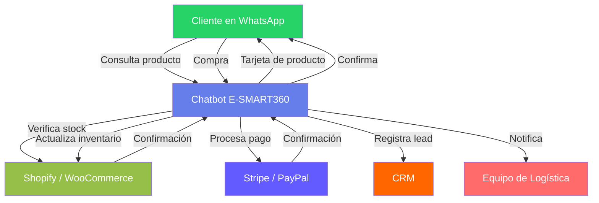
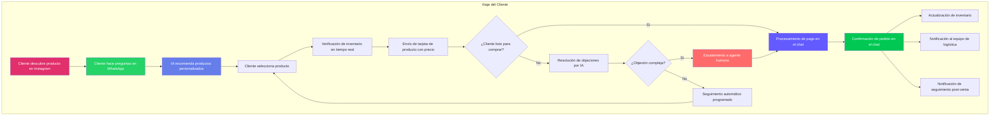

> El comercio conversacional ya no es una tendencia futurista. Para 2026, más del 30% de las interacciones de comercio digital serán gestionadas por agentes de IA autónomos, según Gartner. Chat-to-Buy es el modelo que permite a las marcas vender directamente dentro de la conversación, sin redirecciones, sin formularios y sin fricciones.

## TL;DR: El Resumen Ejecutivo

Chat-to-Buy está reemplazando al tradicional Click-to-Buy en 2026. Los consumidores ya no quieren navegar sitios web, llenar formularios o completar procesos de pago tediosos. Prefieren preguntar, decidir y comprar directamente desde la aplicación de mensajería como WhatsApp, Facebook o Telegram.

E-SMART360 es una plataforma de marketing multicanal con IA que permite:

- Vender directamente dentro del chat
- Reducir el abandono de carrito de compra
- Entregar ofertas personalizadas en tiempo real
- Operar soporte al cliente 24/7 sin interrupción
- Aumentar las tasas de conversión hasta 3× en comparación con formularios o correos electrónicos


> **La premisa central:** En 2026, las marcas que ganan no tendrán mejores sitios web — tendrán mejores conversaciones.

## Introducción: La Crisis de Fricción en 2026

### ¿Por qué el click-to-buy tradicional está fallando al consumidor moderno?

Durante más de una década, la optimización del comercio electrónico se ha centrado en mejores páginas de aterrizaje, procesos de pago más rápidos y menos campos en los formularios. Pero en 2026, las empresas enfrentan una paradoja: los sitios web están más optimizados que nunca, pero las conversiones se estancan o disminuyen.

El problema no es el diseño. El problema es la fricción.

Cada viaje de click-to-buy todavía obliga al usuario a:

- Cambiar de contexto (app social → navegador → proceso de pago)
- Cargar múltiples páginas
- Reingresar información
- Tomar decisiones sin orientación

Según el Baymard Institute, la tasa media global de abandono de carrito sigue siendo de aproximadamente el 70%, siendo las principales razones:

- "Proceso de pago demasiado complejo/largo"
- "Tuve que crear una cuenta"
- "No confiaba en el sitio con mi información de pago"

En resumen, Click-to-Buy asume paciencia — pero el consumidor moderno no tiene ninguna.


> Varios estudios confirman que los déficits de atención son exponenciales, no lineales. La investigación de UX de Google muestra que la probabilidad de rebote aumenta un 32% cuando el tiempo de carga de la página pasa de 1s a 3s. En 5 segundos, la probabilidad de rebote aumenta al 90%.

Pero la velocidad es solo la mitad de la historia. Cada clic adicional, redirección o campo de formulario introduce:

- **Carga cognitiva**: el usuario debe procesar más información
- **Duda**: aparecen preguntas como "¿es esto seguro?", "¿realmente necesito esto?"
- **Peligro de distracción**: una notificación, un correo o una llamada pueden desviar la atención

En las aplicaciones de mensajería, no hay carga de páginas ni cambios de contexto. El usuario ya está autenticado, atento y comprometido emocionalmente.

Por eso, la pregunta para ganar en 2026 ya no es: "¿Cómo podemos mejorar la experiencia de pago en el sitio web?"

Las preguntas correctas son: "¿Cómo podemos eliminar el proceso de pago por completo? ¿Cómo podemos hacer que la compra ocurra dentro de la conversación?"

### Definiendo el Cambio: De Sitios Estáticos a Conversaciones Dinámicas

Los sitios web son estáticos por naturaleza. La conversación es dinámica y fluida.

Un sitio web muestra la misma página de producto a todos los visitantes. Una experiencia de chat en cambio pregunta:

- "¿Qué estás buscando?"
- "¿Cuál es tu presupuesto?"
- "¿Quieres entrega hoy?"

Este cambio demuestra que las personas compran naturalmente a través de la conversación, no desde un menú. Las plataformas de mensajería como WhatsApp y Telegram ya no son solo "canales de soporte"; se están convirtiendo en plataformas de comercio.


> **Datos clave para 2026:**
- Más de 2.700 millones de personas usan WhatsApp mensualmente
- Los usuarios pasan de 5 a 7 veces más tiempo en aplicaciones de mensajería que en los sitios web de las marcas
- Las conversaciones de compra dentro del chat tienen tasas de conversión 3-5× superiores a las páginas web tradicionales

## ¿Qué es "Chat-to-Buy"?

### La Evolución: De "Chat de Soporte" a "IA Transaccional"

Históricamente, el chat significaba:
- Preguntas frecuentes (FAQs)
- Desviación de tickets de soporte
- Derivación a atención humana

Chat-to-Buy representa un cambio fundamental: el chat ya no solo responde a la intención del usuario — la crea y la satisface.

Los sistemas modernos de chat-to-buy pueden:


### Recomendar productos

El chatbot analiza las preguntas del usuario, su historial de navegación y sus preferencias para sugerir los productos más relevantes, exactamente como lo haría un vendedor experimentado.

### Verificar disponibilidad

Consulta el inventario en tiempo real a través de webhooks o APIs conectadas directamente con Shopify, WooCommerce o sistemas ERP, y confirma stock sin que el usuario tenga que salir del chat.

### Aplicar descuentos

Genera códigos de descuento personalizados, cupones por tiempo limitado u ofertas especiales basadas en el comportamiento del usuario, todo dentro de la misma conversación.

### Recibir pagos

Integra pasarelas de pago seguras como Stripe, PayPal, Mercado Pago o WhatsApp Pay para procesar la transacción sin redireccionar al usuario a un sitio externo.

### Activar el cumplimiento

Una vez completado el pago, el sistema actualiza el inventario, genera la orden de envío y envía la notificación de confirmación, todo automáticamente desde el mismo hilo de conversación.

Esta evolución es paralela al cambio de sitios web informativos a plataformas accionables impulsadas por IA, APIs y datos en tiempo real.

### ¿Por qué 2026 es el Año del Comercio por Agentes?

Estamos entrando en la era del comercio por agentes, donde la IA no solo reacciona, sino que actúa en nombre del usuario.

A diferencia de los chatbots tradicionales:

- **La IA agente** puede realizar acciones de múltiples pasos
- **Puede llamar APIs**, actualizar inventarios y activar flujos de trabajo
- **Entiende señales de intención de compra**, no solo palabras clave

Gartner predice que para 2026:
> El 30% de las interacciones de comercio digital serán manejadas por agentes de IA autónomos.

En el contexto de chat-to-buy, esto significa:

- La IA no dice: "Haz clic aquí para comprar"
- La IA dice: "He reservado uno para ti — ¿continuo con la compra?"

Esa diferencia es transformadora.

### La Psicología de las Compras "Dentro de la App"

Los consumidores no solo quieren velocidad, quieren consistencia. La investigación psicológica llama a esto "conservación del flujo":

- Cada cambio de aplicación rompe el ritmo mental
- Cada desviación introduce otras ideas e interrupciones
- Cada nueva pestaña del navegador compite por la atención

Las aplicaciones de mensajería protegen este flujo porque ofrecen:

- **Identidad** (no requieren inicio de sesión adicional)
- **Confianza** (interfaz de usuario familiar)
- **Atención** (no hay pestañas en competencia)

Los estudios internos de Meta muestran que la experiencia de compra dentro del hilo de conversación supera a las referencias web tanto en tasa de finalización como en satisfacción del cliente.

Esto explica por qué los usuarios prefieren cada vez más:

1. **Ver** un producto dentro del chat
2. **Preguntar** sobre sus características
3. **Decidir** con la ayuda de un asistente IA
4. **Pagar** sin salir de la conversación

## 5 Razones por las que tu Negocio Necesita Chat-to-Buy

### 1. Gratificación Instantánea para Gen Z y Gen Alpha

La Generación Z creció con:
- Entrega el mismo día
- Pago con un solo toque
- Todo bajo demanda

Un estudio de Salesforce muestra que:
- El 73% de los clientes Gen Z esperan respuestas inmediatas
- El 64% abandonó marcas después de un proceso de compra lento o complicado

Chat-to-Buy satisface la expectativa de "ahora mismo" — sin colas, páginas ni formularios.

### 2. Hiperpersonalización en Tiempo Real

A diferencia de los sitios web, el chat capta activamente:
- Las preguntas del usuario
- Sus objeciones
- Sus prioridades
- Su tono de voz

Esto permite una personalización en tiempo real, no una personalización basada en suposiciones.

McKinsey reporta que la personalización:
- Aumenta la tasa de conversión entre un 10-15%
- Incrementa los ingresos hasta un 40% en negocios digitales

Chat-to-Buy convierte los datos de la conversación en ventas instantáneas.

### 3. Mayor ROI que el Email o los Formularios Web

Las tasas de conversión comparadas hablan por sí solas:

| Canal | Tasa de Conversión Promedio |
|-------|------------------------------|
| Email Marketing | ~2-3% |
| Formularios en Landing Pages | ~1-2% |
| Chat-to-Buy (conversacional) | **5-15%+** |

El chat captura al usuario en el momento de la intención de compra, no días después como ocurre con el correo electrónico.


> **Dato clave:** Las empresas que implementan chat-to-buy reportan un aumento de hasta 3× en las tasas de conversión en comparación con los métodos tradicionales de captura de leads.

### 4. Reducción del Abandono de Carrito

El carrito de compra se abandona cuando un usuario:
- Se distrae con otra cosa
- Pierde la confianza en la compra
- Decide "pensarlo más tarde"

Chat-to-Buy cierra el ciclo inmediatamente:
- Las preguntas se responden en el momento
- Las objeciones se resuelven en tiempo real
- El pago se completa antes de que surjan las dudas

Esto es **compresión de conversión** — reducir el tiempo desde la intención hasta el pago.

### 5. Un Equipo de Ventas Global 24/7 — Sin Contratar Más Personal

Los sistemas Chat-to-Buy escalan de forma ilimitada:
- Sin horarios laborales
- Sin barreras de idioma
- Sin aumento de costos lineales

La IA maneja el 80-90% de las consultas de ventas repetitivas. El personal humano solo interviene cuando:
- Se necesita generar confianza
- Hay que negociar términos
- Surgen acuerdos de alto valor

---

## Cómo E-SMART360 Impulsa la Revolución Chat-to-Buy

Chat-to-Buy no es solo un concepto — requiere infraestructura, orquestación e inteligencia para funcionar de manera confiable a escala. E-SMART360 está diseñado como un motor de conversación transaccional, no como un simple plugin de mensajería.

### La Ventaja Omnicanal: Una Bandeja Compartida, Múltiples Plataformas

En la actualidad, los profesionales del marketing no dependen de un solo canal. Necesitan estar presentes en todas las plataformas populares. Por eso, E-SMART360 integra las plataformas más utilizadas como Facebook, WhatsApp, Instagram, Telegram y Webchat, permitiendo alcanzar a los clientes desde una única bandeja compartida unificada.

Un mismo cliente puede:
- Descubrir un producto en Instagram
- Hacer preguntas en WhatsApp
- Completar la compra usando Facebook

Gestionar esto por separado crea experiencias de cliente fragmentadas y pérdida de intención de compra.

E-SMART360 unifica Chat-to-Buy en:
- WhatsApp
- Facebook
- Instagram
- Telegram
- Webchat

Todo desde una bandeja centralizada, una misma lógica de automatización y un perfil de cliente único.


> Esto es importante porque los clientes omnicanal:
- Gastan un 30% más en promedio
- Muestran un valor de vida útil (LTV) más alto que los compradores de un solo canal

Chat-to-Buy tiene éxito cuando las conversaciones fluyen de manera continua, no cuando se reinician en cada plataforma.

### Integración de Catálogo de WhatsApp: Convierte el Chat en un Escaparate

WhatsApp ya no es solo una aplicación de mensajería — se está convirtiendo en una plataforma de comercio electrónico.

Meta soporta oficialmente:
- Catálogo de productos
- Tarjetas de producto con imagen, precio y variante
- Experiencia de navegación dentro del chat

E-SMART360 permite:
- Sincronizar productos directamente desde la plataforma de comercio electrónico
- Presentar tarjetas de producto estructuradas dentro del chat
- Permitir a los usuarios navegar sin abandonar la conversación

Esto elimina:
- La demora en la carga de la página de destino
- El cambio de contexto
- Los retrasos en la decisión

El resultado es una venta dentro de la conversación, no fuera de ella.


### Shopify

```json
// Ejemplo de sincronización de producto desde Shopify
{
  "producto": {
    "nombre": "Zapatos Deportivos Pro",
    "precio": "$89.99",
    "stock": 15,
    "imagen": "https://tienda.com/zapatos-pro.jpg",
    "variantes": ["Negro", "Blanco", "Azul"],
    "url_pago": "https://checkout.tienda.com/order/123"
  }
}
```

### WooCommerce

```json
// Ejemplo de sincronización de producto desde WooCommerce
{
  "producto": {
    "nombre": "Bolso de Cuero Premium",
    "precio": "$129.99",
    "stock": 8,
    "imagen": "https://tienda.com/bolso-premium.jpg",
    "variantes": ["Marrón", "Negro"],
    "url_pago": "https://tienda.com/checkout/456"
  }
}
```

### Flujos de E-SMART360: Desde el Saludo hasta el Pago — Sin Código

Cuando el proceso de venta se vuelve complejo, las herramientas de automatización tradicionales se quedan cortas.

El flujo de compra conversacional debe manejar:
- Preguntas con ramificaciones
- Lógica condicional basada en respuestas
- Verificación de inventario
- Decisión de pago
- Transferencia a un agente humano

El **Constructor Visual de Flujos** de E-SMART360 permite a los equipos:


### Mapear visualmente todo el viaje de compra

Usando una interfaz drag-and-drop, los equipos pueden diseñar cada paso del proceso de venta, desde el saludo inicial hasta la confirmación del pago.

### Adaptar la ruta según la intención del usuario

El flujo se bifurca automáticamente según las respuestas del cliente — si pregunta por precio va por un camino, si pregunta por envío va por otro.

### Activar acciones en medio de la conversación

Llamadas a APIs externas, webhooks para actualizar el CRM, disparadores de notificaciones — todo ocurre dentro del mismo hilo de conversación.

Para las empresas, esto significa:
- Implementación rápida (días, no semanas)
- Sin dependencia de desarrolladores
- Iteración rápida de estrategias de venta

### Detección de Intención Inteligente: Saber Cuándo Vender — y Cuándo No

Uno de los mayores errores en la automatización es vender demasiado pronto.

Un usuario pregunta:
"¿Hay alguna oferta?"

Muy diferente de:
"¿Cuánto cuesta después del descuento?"

E-SMART360 utiliza lógica de **Detección de Intención** que permite:

- Separar la curiosidad de la preparación para la compra
- Posponer la oferta de venta hasta que aparezcan señales de intención
- Escalar objeciones complejas a agentes humanos cuando sea necesario

Este enfoque imita cómo trabajan los equipos de ventas de alto rendimiento — excepto que ocurre de inmediato y a escala.


> Según Accenture, las empresas que alinean el momento del compromiso con la intención del cliente ven tasas de conversión hasta un 20% más altas. Chat-to-Buy no se trata de empujar al cliente — se trata de reconocer cuándo está listo para comprar.

### El Flujo de Compra Completo en 4 Pasos

#### Paso 1: Consultas en Lenguaje Natural

Un cliente escribe:
"¿Tienen este paquete personalizado?"

Este mensaje revela inmediatamente:
- Interés en un producto específico
- Una prioridad diferenciada (personalización)
- Una señal de intención de compra

A diferencia de los filtros web, el lenguaje natural revela intenciones sin obstáculos.

#### Paso 2: Confirmación Impulsada por IA + Tarjeta de Producto

E-SMART360 automáticamente:
- Verifica el inventario a través de webhooks conectados a la tienda
- Confirma la disponibilidad del producto
- Envía una tarjeta de producto con:
  - Imagen
  - Precio
  - Variantes disponibles
  - Botones de CTA (llamada a la acción)

En este momento, el usuario tiene todo lo necesario para decidir — sin tener que navegar.

#### Paso 3: Acción de "Comprar Ahora" Dentro del Chat

El usuario puede:
- Tocar "Comprar Ahora" directamente en la tarjeta de producto
- Ser redirigido a un flujo de pago seguro dentro del chat
- Autorizar el pago usando WhatsApp Pay, tarjeta de crédito o la pasarela configurada

#### Paso 4: Sincronización y Cumplimiento en Tiempo Real

E-SMART360 sincroniza instantáneamente con:
- Shopify
- WooCommerce

Los datos del pedido se:
- Registran en el sistema
- Actualizan en el inventario
- Activan el proceso de cumplimiento (logística, envío, notificación)

Desde la perspectiva del cliente, la transacción se siente perfecta — casi invisible.


> Este es el objetivo final de chat-to-buy: hacer que comprar se sienta como una continuación de la conversación, no como una tarea tediosa.

---

## Superando la "Brecha de Confianza" en el Comercio Conversacional

A pesar de la velocidad y la conveniencia, persiste una preocupación: "¿Puedo confiar en las compras dentro del chat?"

La confianza es el último obstáculo — y el más importante.

### Pagos Seguros y Protección de Datos en 2026

Las plataformas modernas de chat-to-buy deben cumplir con:
- Estándares de cifrado de extremo a extremo
- GDPR y leyes regionales de protección de datos
- Directrices de comercio específicas de cada plataforma

Los mensajes de WhatsApp están cifrados de extremo a extremo por defecto.

E-SMART360 garantiza que:
- El procesamiento de pagos ocurre a través de pasarelas seguras y verificadas
- Los datos sensibles nunca se almacenan en los mensajes del chat
- Los webhooks y APIs siguen estándares modernos de autenticación


> En otras palabras, chat-to-buy no es "menos seguro" que comprar en línea — a menudo es más controlado, porque hay menos sistemas involucrados en el proceso.

### Humano en el Ciclo: Saber Cuándo la IA Debe Dar un Paso al Lado

No todas las ventas deben ser automatizadas.

Las compras de alto valor a menudo requieren:
- Negociación
- Personalización avanzada
- Seguridad emocional y confianza

E-SMART360 soporta flujos de trabajo **Human-in-the-Loop (HITL)**:

- La IA maneja la búsqueda, la calificación de leads y las preguntas frecuentes
- El humano interviene cuando:
  - El cliente solicita información detallada de precios
  - Surgen requisitos personalizados
  - Se necesita generar confianza
  - Se requiere una demostración del producto


> La investigación de IBM muestra que los modelos híbridos de IA + humano superan a los sistemas totalmente automatizados tanto en conversión como en satisfacción del cliente. Chat-to-Buy tiene éxito cuando la automatización apoya a las personas, no las reemplaza.

---

## Configuración Práctica del Catálogo en WhatsApp con E-SMART360

Una de las formas más directas de implementar Chat-to-Buy es mediante la integración del catálogo de WhatsApp. A continuación, los pasos prácticos:

### ¿Qué es el Catálogo de WhatsApp?

El Catálogo de WhatsApp es una herramienta que permite a las empresas mostrar sus productos directamente dentro de un chat de WhatsApp. En lugar de enviar largas descripciones de texto, puedes mostrar tus artículos con imágenes, nombres y detalles, facilitando que los clientes elijan lo que quieren comprar.

### Cómo Crear un Catálogo de WhatsApp


### Accede a Facebook Business Manager

Ve a business.facebook.com y selecciona 'Commerce' (Comercio) dentro del menú de Herramientas. Haz clic en tu cuenta de negocio en la esquina superior derecha y presiona 'Comenzar'.

### Configura tu tienda

Selecciona 'Ecommerce', decide si tu negocio es en línea o local, y continúa con la configuración. Puedes añadir productos manualmente o conectar plataformas como Shopify.

### Vincula el catálogo con WhatsApp

Una vez creado el catálogo, ve a WhatsApp Manager, selecciona 'Catálogo' y haz clic en 'Conectar'. El catálogo estará listo para usarse con E-SMART360.

### Sincroniza en E-SMART360

Dentro de E-SMART360, ve a la sección de WhatsApp y haz clic en 'Sincronizar'. Luego accede al menú de Catálogo de Comercio Electrónico para encontrar tu catálogo vinculado.

### Automatizando Conversaciones de Venta

Una vez que el chatbot está activo, manejará automáticamente:
- Consultas de clientes sobre productos
- Sugerencias de productos basadas en preferencias
- Guía al cliente a través del proceso de compra

Puedes guardar tu flujo de chatbot y activarlo en el Constructor de Flujos para comenzar a interactuar con los clientes.


> **Beneficios comprobados:** Las empresas que integran el catálogo de WhatsApp con chatbots automatizados reportan un aumento significativo en la participación del cliente, recomendaciones personalizadas más precisas y una disponibilidad 24/7 que multiplica las oportunidades de venta.

---

## Columnas: Casos de Uso Destacados


### 🛒 Ecommerce: Recuperación de Carritos Abandonados en Shopify

Un cliente agrega productos a su carrito en Shopify pero abandona la compra. E-SMART360 detecta el evento, identifica el número de teléfono del cliente y envía automáticamente un mensaje de WhatsApp con un recordatorio personalizado que incluye los productos que dejó, un enlace directo al pago y opcionalmente un código de descuento por tiempo limitado.

**Resultado:** Tiendas que implementan este flujo reportan recuperaciones del 15-30% de carritos abandonados, recuperando cientos de dólares en ventas perdidas cada semana.

### 📅 Servicios: Reserva de Citas y Pagos en un Solo Mensaje

Una clínica dental configura E-SMART360 para que los clientes puedan ver la disponibilidad de horarios, seleccionar una fecha y hora, y pagar el depósito de la cita — todo sin salir de WhatsApp. El flujo maneja preguntas sobre servicios, verifica disponibilidad en el calendario en tiempo real, procesa el pago con Stripe y envía la confirmación con un recordatorio automático 24 horas antes.

**Resultado:** La clínica redujo un 40% las ausencias y aumentó un 25% las nuevas reservas gracias a la facilidad del proceso dentro del chat.

---

## Preguntas Frecuentes


### ¿Qué es exactamente Chat-to-Buy?

Es un modelo de comercio que permite a los clientes hacer preguntas mediante un enfoque conversacional y completar una compra directamente en una plataforma de chat como WhatsApp, Instagram o Telegram, sin necesidad de visitar un sitio web. A diferencia del comercio electrónico tradicional, no hay páginas que cargar, formularios que llenar ni redirecciones.

### ¿Por qué Chat-to-Buy es mejor que Click-to-Buy?

Chat-to-Buy elimina la fricción como la carga de páginas, las redirecciones y los formularios. Esto se traduce en decisiones más rápidas, mayor confianza del cliente, menor abandono de carrito y tasas de conversión significativamente más altas. Mientras que Click-to-Buy asume que el usuario completará un proceso de varios pasos por su cuenta, Chat-to-Buy lo guía paso a paso dentro de un entorno familiar y sin distracciones.

### ¿Es seguro comprar a través del chat?

Sí. Los sistemas modernos de chat-to-buy utilizan mensajería cifrada de extremo a extremo (como WhatsApp), pasarelas de pago seguras y procesamiento de pedidos basado en APIs. Los datos de pago sensibles nunca se exponen en los mensajes del chat. De hecho, al involucrar menos sistemas en el proceso, el riesgo de exposición de datos puede ser menor que en las compras web tradicionales.

### ¿Chat-to-Buy funciona con Shopify o WooCommerce?

Absolutamente. E-SMART360 se integra directamente con Shopify y WooCommerce para sincronizar productos, inventarios, pedidos y flujos de trabajo de cumplimiento. Esto significa que cuando un cliente compra a través del chat, el inventario se actualiza automáticamente en tu tienda y el proceso de envío se inicia sin intervención manual.

### ¿La IA reemplazará a los agentes de ventas humanos?

No. Los sistemas más efectivos de chat-to-buy utilizan el modelo Human-in-the-Loop (HITL). La IA maneja las búsquedas, las preguntas frecuentes y la calificación de leads, mientras que los humanos intervienen para negociar, generar confianza y cerrar ventas complejas. Este enfoque híbrido proporciona el retorno más alto, combinando la velocidad y escala de la automatización con la empatía y el criterio humano.

### ¿Qué tipos de negocios se benefician más de Chat-to-Buy?

Chat-to-Buy funciona mejor para:
- Marcas de comercio electrónico y D2C (directo al consumidor)
- Empresas de servicios que requieren consulta previa
- Agencias de marketing que gestionan múltiples cuentas
- Procesos de onboarding y actualización de planes en SaaS
- Negocios locales y globales con catálogos de productos

Si tus clientes tienen preguntas antes de comprar, chat-to-buy es ideal para ti.

### ¿Cómo configuro la recuperación de carritos abandonados en WooCommerce?

E-SMART360 ofrece un flujo completo para WooCommerce:
1. Crea una plantilla de mensaje de WhatsApp con el texto de recuperación y un botón de CTA
2. Configura un Webhook Workflow en el panel de E-SMART360
3. Instala el plugin de WooCommerce Abandoned Cart Webhook en tu sitio WordPress
4. Pega la URL del webhook en la configuración del plugin
5. Captura datos de muestra y mapea los campos (número de teléfono, productos, etc.)
6. Activa el flujo — cuando un cliente abandone el carrito, recibirá automáticamente un mensaje de WhatsApp

El sistema también incluye un formateador para eliminar el signo "+" de los números de teléfono, requisito de WhatsApp.

### ¿Cuánto tiempo toma implementar Chat-to-Buy en mi negocio?

Con E-SMART360, la implementación básica puede completarse en cuestión de horas o días, no semanas. Los pasos principales son:
1. Conectar tu número de WhatsApp Business API (15-30 minutos)
2. Sincronizar tu catálogo de productos o conectar tu tienda Shopify/WooCommerce (30-60 minutos)
3. Diseñar tu flujo conversacional con el Constructor Visual (1-3 horas)
4. Configurar las plantillas de mensaje y obtener aprobación de WhatsApp (1-48 horas)
5. Activar y probar el flujo (30 minutos)

Muchas empresas lanzan su primer flujo de chat-to-buy en menos de un día hábil.

---

## Conclusión: Prepara tus Ingresos para el Futuro en 2026

Las lecciones de la última década son claras: mejores sitios web no solucionaron la conversión. Las conversaciones sí.

Chat-to-Buy no es una moda — es una reacción a:
- La reducción de la capacidad de atención
- El comportamiento "mensajes primero" de los consumidores
- La demanda de satisfacción inmediata

Las empresas que continúen optimizando páginas y embudos competirán por mejoras de velocidad medidas en milisegundos.

Las empresas que adopten chat-to-buy competirán por mejoras de experiencia medidas en segundos y emociones.


### ✅ El Camino del Click-to-Buy

- Optimizar tiempos de carga del sitio
- Reducir campos en formularios
- A/B testing de botones de CTA
- Mejorar el proceso de checkout
- Resultado: mejoras marginales del 1-3%

### ✅ El Camino del Chat-to-Buy

- Conversaciones personalizadas con IA
- Compra directa desde WhatsApp/Telegram
- Recuperación automática de carritos
- Atención 24/7 sin fricción
- Resultado: mejoras del 5-15%+ en conversión

> - No construyas un mejor sitio web. Construye mejores conversaciones.
- Los sitios web explican. Las conversaciones persuaden y venden.

En 2026, los negocios ganadores serán aquellos que:

1. **Encuentren a los clientes donde están** — en sus aplicaciones de mensajería
2. **Eliminen pasos innecesarios** del proceso de compra
3. **Reemplacen la fricción con fluidez** conversacional

Chat-to-Buy no se trata de la venta agresiva — se trata de hacer que la compra sea fácil.


> **Actualización del mercado Chat-to-Buy (12 de abril de 2026)**
> Este artículo ha sido actualizado con las últimas proyecciones de Gartner sobre comercio por agentes de IA, datos actualizados del Baymard Institute sobre abandono de carrito, y las métricas más recientes de adopción de WhatsApp (2.700 millones de usuarios activos mensuales). También se han añadido las secciones prácticas de configuración de catálogo y recuperación de carritos abandonados basadas en la documentación oficial de integración.

---

**Reflexión final:** El negocio que hace que comprar se sienta cómodo siempre ganará el mercado.
Y en un mundo donde la atención es la moneda más escasa, las conversaciones son el medio de pago más poderoso jamás creado.

¿Por qué Chat-to-Buy es mejor que Click-to-Buy?>
Chat-to-Buy elimina la fricción como la carga de páginas, las redirecciones y los formularios. Esto se traduce en decisiones más rápidas, mayor confianza del cliente, menor abandono de carrito y tasas de conversión significativamente más altas. Mientras que Click-to-Buy asume que el usuario completará un proceso de varios pasos por su cuenta, Chat-to-Buy lo guía paso a paso dentro de un entorno familiar y sin distracciones.

### ¿Es seguro comprar a través del chat?

Sí. Los sistemas modernos de chat-to-buy utilizan mensajería cifrada de extremo a extremo (como WhatsApp), pasarelas de pago seguras y procesamiento de pedidos basado en APIs. Los datos de pago sensibles nunca se exponen en los mensajes del chat. De hecho, al involucrar menos sistemas en el proceso, el riesgo de exposición de datos puede ser menor que en las compras web tradicionales.

### ¿Chat-to-Buy funciona con Shopify o WooCommerce?

Absolutamente. E-SMART360 se integra directamente con Shopify y WooCommerce para sincronizar productos, inventarios, pedidos y flujos de trabajo de cumplimiento. Esto significa que cuando un cliente compra a través del chat, el inventario se actualiza automáticamente en tu tienda y el proceso de envío se inicia sin intervención manual.

### ¿La IA reemplazará a los agentes de ventas humanos?

No. Los sistemas más efectivos de chat-to-buy utilizan el modelo Human-in-the-Loop (HITL). La IA maneja las búsquedas, las preguntas frecuentes y la calificación de leads, mientras que los humanos intervienen para negociar, generar confianza y cerrar ventas complejas. Este enfoque híbrido proporciona el retorno más alto, combinando la velocidad y escala de la automatización con la empatía y el criterio humano.

### ¿Qué tipos de negocios se benefician más de Chat-to-Buy?

Chat-to-Buy funciona mejor para:
- Marcas de comercio electrónico y D2C (directo al consumidor)
- Empresas de servicios que requieren consulta previa
- Agencias de marketing que gestionan múltiples cuentas
- Procesos de onboarding y actualización de planes en SaaS
- Negocios locales y globales con catálogos de productos

Si tus clientes tienen preguntas antes de comprar, chat-to-buy es ideal para ti.

### ¿Cómo configuro la recuperación de carritos abandonados en WooCommerce?

E-SMART360 ofrece un flujo completo para WooCommerce:
1. Crea una plantilla de mensaje de WhatsApp con el texto de recuperación y un botón de CTA
2. Configura un Webhook Workflow en el panel de E-SMART360
3. Instala el plugin de WooCommerce Abandoned Cart Webhook en tu sitio WordPress
4. Pega la URL del webhook en la configuración del plugin
5. Captura datos de muestra y mapea los campos (número de teléfono, productos de la cesta, etc.)
6. Activa el flujo — cuando un cliente abandone el carrito, recibirá automáticamente un mensaje de WhatsApp

El sistema también incluye un formateador para eliminar el signo "+" de los números de teléfono, requisito de WhatsApp.

### ¿Cuánto tiempo toma implementar Chat-to-Buy en mi negocio?

Con E-SMART360, la implementación básica puede completarse en cuestión de horas o días, no semanas. Los pasos principales son:
1. Conectar tu número de WhatsApp Business API (15-30 minutos)
2. Sincronizar tu catálogo de productos o conectar tu tienda Shopify/WooCommerce (30-60 minutos)
3. Diseñar tu flujo conversacional con el Constructor Visual (1-3 horas)
4. Configurar las plantillas de mensaje y obtener aprobación de WhatsApp (1-48 horas)
5. Activar y probar el flujo (30 minutos)

Muchas empresas lanzan su primer flujo de chat-to-buy en menos de un día hábil.

### ¿Qué es la ventana de 24 horas de WhatsApp y cómo afecta a Chat-to-Buy?

WhatsApp permite a las empresas enviar mensajes de seguimiento ilimitados dentro de una ventana de 24 horas desde la última interacción del usuario. Esto significa que después de que un cliente inicia una conversación, puedes enviarle recordatorios, ofertas y mensajes personalizados sin restricciones durante 24 horas. Después de ese período, solo puedes enviar mensajes utilizando plantillas de mensajes pre-aprobadas por WhatsApp. E-SMART360 gestiona automáticamente estas ventanas de tiempo para maximizar el compromiso sin violar las políticas de WhatsApp.

### ¿Puedo personalizar la segmentación de mis secuencias de mensajes?

Sí, las secuencias de mensajes en E-SMART360 pueden configurarse para activarse en función de acciones del usuario, palabras clave específicas o condiciones predefinidas. Puedes etiquetar a los usuarios según su comportamiento (por ejemplo, "hizo clic en Comprar Ahora" vs "no hizo clic") y enviar diferentes secuencias de seguimiento según esas etiquetas. Esto permite una segmentación precisa y mensajes altamente relevantes para cada grupo de usuarios.

### ¿Qué métricas debo monitorear para medir el éxito de Chat-to-Buy?

Las métricas clave incluyen:
- **Tasa de conversión conversacional**: porcentaje de conversaciones que resultan en una venta
- **Tasa de recuperación de carritos**: porcentaje de carritos abandonados recuperados
- **Valor promedio del pedido (AOV)**: comparado con canales tradicionales
- **Tasa de clics en tarjetas de producto**: cuántos usuarios interactúan con las recomendaciones
- **Tiempo desde la primera interacción hasta la compra**: idealmente debe reducirse
- **Tasa de retención de clientes**: clientes que vuelven a comprar a través del chat

E-SMART360 proporciona paneles de análisis en tiempo real para monitorear todas estas métricas.

---

## Caso Práctico: Chatbots de Seguimiento Automático

Una de las herramientas más poderosas dentro de la estrategia Chat-to-Buy es el chatbot de seguimiento automático. Este sistema envía mensajes de recordatorio a los usuarios que han interactuado con tu chatbot pero no han completado una acción, como realizar una compra o registrarse.

### Cómo Construir un Chatbot de Seguimiento


### Crea el flujo del chatbot

Ve al panel de E-SMART360 > Constructor de Flujos > Crear Nuevo. Nombra tu chatbot con un nombre descriptivo como "Bot de Seguimiento de Ventas". Asegúrate de que se active cuando un usuario interactúe con un mensaje relacionado con productos.

### Configura mensajes interactivos

Agrega un bloque interactivo a tu chatbot con preguntas como: "¿Te interesaría nuestro producto?" con botones de Sí y No. Si el usuario selecciona Sí, proporciónale un enlace de pago. Si selecciona No, finaliza la conversación u ofrece asistencia adicional.

### Aplica etiquetas para rastrear acciones

Cuando un usuario hace clic en "Comprar Ahora", aplícale una etiqueta llamada "Compra Iniciada". Si el usuario no hace clic en el botón, no recibe esta etiqueta. Usa esta etiqueta para determinar quién necesita un recordatorio de seguimiento.

### Configura la secuencia de seguimiento

Arrastra y suelta el conector desde el botón "Comprar Ahora" hacia la opción "Suscribir a Secuencia". Configura la secuencia para enviar un mensaje de recordatorio si el usuario no realiza la compra dentro de un tiempo determinado (por ejemplo, 30 minutos). Puedes repetir el proceso para enviar un segundo recordatorio si aún no han comprado.

### Programa los mensajes estratégicamente

WhatsApp permite enviar mensajes de seguimiento ilimitados dentro de las 24 horas posteriores a la interacción. Después de 24 horas, solo se pueden usar plantillas de mensajes pre-aprobadas. Programa tus recordatorios estratégicamente para evitar saturar a los usuarios.


> Una característica avanzada es la capacidad de **exportar flujos de chatbot** completos y compartirlos con otros miembros del equipo o entre diferentes cuentas de negocio. Esto facilita la replicación de estrategias exitosas.

---

## El Futuro del Comercio Conversacional: Tendencias 2026-2027

### Agentes de IA Autónomos

La evolución más significativa será la transición de chatbots reactivos a **agentes de IA autónomos** que pueden:

- Iniciar conversaciones proactivamente basándose en el comportamiento del usuario
- Ejecutar transacciones complejas de múltiples pasos sin intervención humana
- Aprender y optimizar estrategias de venta basándose en resultados previos
- Coordinarse con otros sistemas empresariales (ERP, CRM, logística) en tiempo real

### Pagos Dentro del Chat sin Fricción

Las pasarelas de pago dentro de aplicaciones de mensajería evolucionarán para ofrecer:

- Autenticación biométrica (huella digital, reconocimiento facial) directamente en el chat
- Pagos recurrentes y suscripciones gestionadas desde la conversación
- División de pagos y opciones de financiamiento integradas

### Personalización Predictiva con Machine Learning

Los sistemas de chat-to-buy del futuro utilizarán modelos de machine learning para:

- Predecir qué productos quiere un cliente antes de que los busque
- Anticipar objeciones y preparar respuestas proactivas
- Ajustar el tono, el ritmo y el estilo de la conversación según la personalidad del usuario
- Recomendar el momento óptimo para enviar ofertas

### Integración con Realidad Aumentada

La próxima frontera incluirá:

- Visualización de productos en 3D directamente dentro del chat
- Pruebas virtuales de productos (ropa, muebles, maquillaje)
- Demostraciones interactivas de productos sin salir de la aplicación

---

## Tabla Comparativa: Click-to-Buy vs Chat-to-Buy

| Aspecto | Click-to-Buy Tradicional | Chat-to-Buy con E-SMART360 |
|---------|-------------------------|---------------------------|
| **Contexto del usuario** | Múltiples pestañas y ventanas | Una sola conversación familiar |
| **Proceso de pago** | Formularios multi-paso | Pago con un solo toque en el chat |
| **Autenticación** | Crear cuenta o iniciar sesión | Usuario ya autenticado en la app |
| **Personalización** | Segmentación genérica basada en cookies | Personalización en tiempo real basada en la conversación |
| **Soporte durante la compra** | FAQ estático o chat de soporte separado | IA conversacional integrada en el proceso |
| **Recuperación de abandono** | Emails días después | Mensajes de WhatsApp inmediatos |
| **Tasa de conversión típica** | 1-3% | 5-15%+ |
| **Tiempo de implementación** | Semanas a meses | Horas a días |
| **Cumplimiento post-venta** | Notificación por email | Confirmación en el mismo hilo de chat |

---

## Conclusión: Prepara tus Ingresos para el Futuro en 2026

Las lecciones de la última década son claras: mejores sitios web no solucionaron la conversión. Las conversaciones sí.

Chat-to-Buy no es una moda — es una reacción a:

- La reducción de la capacidad de atención
- El comportamiento "mensajes primero" de los consumidores
- La demanda de satisfacción inmediata

Las empresas que continúen optimizando páginas y embudos competirán por mejoras de velocidad medidas en milisegundos.

Las empresas que adopten chat-to-buy competirán por mejoras de experiencia medidas en segundos y emociones.


### ✅ El Camino del Click-to-Buy

- Optimizar tiempos de carga del sitio
- Reducir campos en formularios
- A/B testing de botones de CTA
- Mejorar el proceso de checkout
- Resultado: mejoras marginales del 1-3%

### ✅ El Camino del Chat-to-Buy

- Conversaciones personalizadas con IA
- Compra directa desde WhatsApp/Telegram
- Recuperación automática de carritos
- Atención 24/7 sin fricción
- Resultado: mejoras del 5-15%+ en conversión

> - No construyas un mejor sitio web. Construye mejores conversaciones.
- Los sitios web explican. Las conversaciones persuaden y venden.

En 2026, los negocios ganadores serán aquellos que:

1. **Encuentren a los clientes donde están** — en sus aplicaciones de mensajería
2. **Eliminen pasos innecesarios** del proceso de compra
3. **Reemplacen la fricción con fluidez** conversacional

Chat-to-Buy no se trata de la venta agresiva — se trata de hacer que la compra sea fácil.


> **Actualización del mercado Chat-to-Buy (12 de abril de 2026)**
> Este artículo ha sido actualizado con las últimas proyecciones de Gartner sobre comercio por agentes de IA, datos actualizados del Baymard Institute sobre abandono de carrito, y las métricas más recientes de adopción de WhatsApp (2.700 millones de usuarios activos mensuales). También se han añadido las secciones prácticas de configuración de catálogo, recuperación de carritos abandonados y chatbots de seguimiento automático basadas en documentación oficial de integración.

---

**Reflexión final:** El negocio que hace que comprar se sienta cómodo siempre ganará el mercado. Y en un mundo donde la atención es la moneda más escasa, las conversaciones son el medio de pago más poderoso jamás creado.

---

## Glosario de Términos

| Término | Definición |
|---------|-----------|
| **Chat-to-Buy** | Modelo de comercio que permite completar una compra directamente dentro de una conversación de chat |
| **Click-to-Buy** | Modelo tradicional de comercio electrónico que requiere hacer clic a través de páginas web |
| **Agente de IA** | Sistema de IA autónomo que puede realizar acciones de múltiples pasos en nombre del usuario |
| **HITL (Human-in-the-Loop)** | Modelo híbrido donde la IA maneja tareas automatizadas y los humanos intervienen cuando es necesario |
| **Webhook** | Mecanismo que permite a una aplicación enviar datos en tiempo real a otra aplicación cuando ocurre un evento |
| **Compresión de Conversión** | Reducción del tiempo desde la intención de compra hasta la finalización del pago |
| **Conservación del Flujo** | Principio psicológico que explica por qué los usuarios prefieren completar tareas sin cambiar de contexto |
| **CTA (Call to Action)** | Botón o mensaje que solicita al usuario realizar una acción específica (Comprar, Registrarse, etc.) |
| **LTV (Lifetime Value)** | Valor total que un cliente genera durante toda su relación con una marca |
| **AOV (Average Order Value)** | Valor promedio de cada pedido realizado por los clientes |
| **Omnicanal** | Estrategia que integra múltiples canales de comunicación en una experiencia unificada |

---

## Checklist de Implementación: ¿Estás Listo para Chat-to-Buy?

Marca los elementos que ya tienes implementados y los que necesitas desarrollar:

**Fundamentos técnicos:**
- [ ] Número de WhatsApp Business API activo
- [ ] Tienda en línea (Shopify, WooCommerce u otra plataforma)
- [ ] Catálogo de productos sincronizado
- [ ] Pasarela de pago configurada (Stripe, PayPal, Mercado Pago)

**Estrategia conversacional:**
- [ ] Flujo de bienvenida automatizado
- [ ] Preguntas frecuentes cubiertas por el chatbot
- [ ] Secuencia de seguimiento para leads no convertidos
- [ ] Recuperación de carritos abandonados
- [ ] Protocolo de escalamiento a agente humano

**Optimización continua:**
- [ ] Paneles de análisis configurados
- [ ] Pruebas A/B de mensajes y flujos
- [ ] Ciclo de revisión semanal de métricas
- [ ] Actualización de contenidos según estacionalidad

**Expansión multicanal:**
- [ ] Bandeja omnicanal activada (WhatsApp + Instagram + Facebook + Telegram)
- [ ] Catálogo sincronizado en todos los canales
- [ ] Perfil de cliente unificado entre plataformas

---

## Cómo E-SMART360 Maneja los Pedidos contra Reembolso (COD) desde WhatsApp

Una funcionalidad importante dentro del ecosistema Chat-to-Buy es la gestión de pedidos contra reembolso (Cash on Delivery o COD). En muchos mercados, especialmente en Latinoamérica, el pago contra entrega sigue siendo el método preferido por los consumidores que desconfían de los pagos en línea.

### Confirmación Automática de Pedidos COD

Cuando un cliente realiza un pedido con pago contra reembolso, E-SMART360 puede gestionar todo el flujo de confirmación sin intervención manual:


### Recepción del pedido

Cuando se realiza un pedido COD desde la tienda en línea, el sistema detecta automáticamente el evento a través de webhooks conectados a Shopify, WooCommerce o la plataforma de comercio utilizada.

### Envío del mensaje de confirmación

E-SMART360 envía automáticamente un mensaje de WhatsApp al cliente confirmando los detalles del pedido: productos seleccionados, dirección de entrega, monto total a pagar y fecha estimada de entrega.

### Solicitud de confirmación

El chatbot pregunta al cliente si desea confirmar el pedido mediante botones interactivos de Sí/No. Esta confirmación reduce significativamente las falsas órdenes y los costos logísticos asociados.

### Notificación al equipo de logística

Una vez confirmado el pedido, el sistema envía una notificación al equipo de logística o al vendedor para que proceda con la preparación y el envío del producto.

### Seguimiento post-venta

Después de la entrega, el chatbot puede enviar un mensaje de seguimiento preguntando por la satisfacción del cliente, solicitando una reseña o informando sobre nuevos productos.


> **Beneficio clave:** La confirmación automática de pedidos COD reduce las tasas de falsas órdenes hasta en un 40%, ahorrando costos significativos en logística y devoluciones.

---

## Secuencias de Ventas: El Embudo Conversacional Completo

Las secuencias de ventas representan el corazón de una estrategia Chat-to-Buy efectiva. A diferencia de los embudos de ventas tradicionales que operan en silos (email, SMS, anuncios), las secuencias conversacionales unifican todo el recorrido del cliente en un solo hilo de mensajes.

### Ideas para Secuencias de Mensajes

E-SMART360 permite configurar secuencias para prácticamente cualquier objetivo de negocio:

#### Secuencia de Bienvenida para Nuevos Suscriptores

```
Día 0: "¡Bienvenido! 🎉 Cuéntanos, ¿qué tipo de productos te interesan?"
Día 1: "Tenemos estas ofertas especiales para nuevos miembros..."
Día 3: "¿Has tenido la oportunidad de revisar nuestros productos?"
Día 7: "Como agradecimiento por unirte, aquí tienes un código de descuento exclusivo: BIENVENIDO20"
```

#### Secuencia de Nutrición de Leads para Productos de Alto Ticket

```
Día 0: "Gracias por tu interés en [Producto]. ¿Te gustaría recibir una guía gratuita?"
Día 2: "Aquí tienes la guía que solicitaste. También incluye casos de éxito de clientes como tú."
Día 5: "¿Te gustaría agendar una llamada con nuestro equipo de expertos? Sin compromiso."
Día 8: "Por tiempo limitado, estamos ofreciendo una consultoría gratuita personalizada..."
```

#### Secuencia de Recuperación Post-Compra

```
Día 1: "¡Gracias por tu compra! 🎉 ¿Todo bien con tu pedido?"
Día 7: "¿Cómo va todo con [Producto]? ¿Necesitas ayuda con algo?"
Día 14: "Clientes que compraron [Producto] también adquirieron [Producto Complementario]. ¿Te interesa?"
Día 30: "Ya pasó un mes desde tu compra. Queremos agradecerte con un descuento especial en tu próxima orden."
```

### Mejores Prácticas para Secuencias de Mensajes


> - Mantén los mensajes **concisos y relevantes** — nadie quiere leer párrafos largos en el chat
- **Personaliza las interacciones** usando los datos del usuario (nombre, producto visto, historial de compras)
- **Programa los mensajes estratégicamente** para mantener el compromiso sin saturar
- Usa **plantillas de mensajes pre-aprobadas** por WhatsApp para mensajes fuera de la ventana de 24 horas
- **Analiza y refina continuamente** tus secuencias basándote en métricas de rendimiento como tasas de apertura, clics y conversiones

---

## Integración con APIs Externas

El verdadero poder de Chat-to-Buy se desbloquea cuando el chatbot puede comunicarse con otros sistemas empresariales. E-SMART360 permite integraciones a través de:

### Webhooks de Salida (Outbound Webhooks)

Cuando ocurre un evento específico en el chatbot (por ejemplo, "cliente completó la compra"), E-SMART360 puede disparar un webhook o una llamada API para enviar datos a aplicaciones de terceros como:

- **CRMs**: Salesforce, HubSpot, Zoho
- **Herramientas de email marketing**: Mailchimp, ActiveCampaign, SendGrid
- **Plataformas de análisis**: Google Analytics, Mixpanel
- **Sistemas de ticketing**: Zendesk, Freshdesk
- **Herramientas de automatización**: Zapier, Make (Integromat)

### Integración con Google Sheets

Puedes conectar E-SMART360 con Google Sheets para:

- Registrar cada conversación de ventas en una hoja de cálculo compartida
- Alimentar el chatbot con datos desde una hoja (catálogos, precios, FAQs)
- Generar informes automatizados sobre el rendimiento de ventas
- Sincronizar datos de clientes entre plataformas

### Integración con Zapier

Para integraciones aún más avanzadas, E-SMART360 se conecta con Zapier, lo que permite:

- Crear leads en el CRM desde conversaciones de WhatsApp
- Enviar datos de pedidos a sistemas de facturación
- Actualizar hojas de cálculo con información de clientes
- Disparar secuencias de email marketing basadas en interacciones de chat



---

## E-SMART360 para Agencias de Marketing

Las agencias de marketing enfrentan un desafío único: gestionar múltiples cuentas de clientes, cada una con sus propios productos, audiencias y estrategias. Chat-to-Buy con E-SMART360 ofrece ventajas específicas para agencias:

### Características Clave para Agencias

- **Bandeja compartida multicuenta**: Gestiona conversaciones de todos tus clientes desde un solo lugar
- **Flujos exportables**: Crea un flujo de ventas una vez y replícalo para múltiples clientes con ajustes menores
- **Etiquetas personalizadas por cliente**: Segmenta leads y conversaciones por cuenta, campaña o tipo de producto
- **Informes centralizados**: Reportes de rendimiento agregados y por cliente
- **Permisos de equipo**: Controla quién tiene acceso a qué cuentas

### Cómo las Agencias Están Usando Chat-to-Buy


### 📊 Agencia de Ecommerce

Una agencia que gestiona 15 tiendas Shopify implementó Chat-to-Buy para cada cliente. Configuraron flujos de recuperación de carritos abandonados, secuencias de bienvenida y chatbots de soporte. Resultado: aumento promedio del 28% en ingresos recurrentes mensuales para sus clientes en 3 meses.

### 🏥 Agencia de Servicios de Salud

Una agencia de marketing médico configuró Chat-to-Buy para clínicas dentales y consultorios médicos. Los pacientes pueden reservar citas, recibir recordatorios y pagar consultas directamente desde WhatsApp. Resultado: reducción del 45% en ausencias y aumento del 35% en nuevas reservas de pacientes.

---

## Plantillas de Mensajes para Chat-to-Buy

Para ayudarte a comenzar rápidamente, aquí tienes plantillas de mensajes que puedes adaptar a tu negocio:

### Plantilla de Primer Contacto

```
¡Hola {{nombre}}! 👋

Gracias por contactarnos. Soy el asistente virtual de {{tienda}}.

¿En qué puedo ayudarte hoy?

1️⃣ Ver nuestro catálogo de productos
2️⃣ Consultar precios y disponibilidad
3️⃣ Hablar con un asesor

O simplemente escríbeme tu pregunta 😊
```

### Plantilla de Recomendación de Producto

```
¡Excelente elección, {{nombre}}! 🎯

Basado en lo que me has comentado, te recomiendo:

✨ {{nombre_producto}}
💰 {{precio}}
📦 {{stock}} unidades disponibles

{{descripción_breve}}

¿Te gustaría:
🛒 Comprar ahora
📋 Ver más detalles
🔙 Volver al catálogo
```

### Plantilla de Seguimiento Post-Venta

```
¡Hola {{nombre}}! 🎉

Queremos asegurarnos de que todo esté perfecto con tu pedido de {{producto}}.

✅ ¿Recibiste tu producto en buen estado?
⭐ ¿Cómo calificarías tu experiencia de compra del 1 al 5?
💬 ¿Necesitas ayuda con algo más?

¡Gracias por confiar en nosotros! 🙌
```

---

## Monitoreo y Análisis: Midiendo el Éxito de Chat-to-Buy

Implementar Chat-to-Buy sin métricas es como navegar sin brújula. E-SMART360 proporciona paneles de análisis completos para medir cada aspecto de tu estrategia conversacional.

### Métricas Fundamentales

| Métrica | Descripción | Benchmark |
|---------|-------------|-----------|
| **Tasa de Conversación a Venta** | % de conversaciones que terminan en compra | 5-15% |
| **Tasa de Recuperación de Carritos** | % de carritos abandonados recuperados | 15-30% |
| **Tiempo hasta la Compra** | Minutos/horas desde primer contacto hasta pago | < 30 min (ideal) |
| **Tasa de Clics en Productos** | % de usuarios que hacen clic en tarjetas de producto | 40-60% |
| **NPS (Net Promoter Score)** | Satisfacción del cliente con la experiencia de compra | > 50 (excelente) |
| **Tasa de Retención** | % de clientes que repiten compra en 90 días | 20-40% |
| **Costo por Conversación** | Costo operativo por cada conversación de ventas | 80% menor que call center |

### Cómo Interpretar los Datos

- **Si la tasa de conversación a venta es baja (< 5%)**: Revisa tu flujo conversacional. Puede que estés vendiendo demasiado pronto o que la oferta no sea lo suficientemente clara.
- **Si la tasa de clics en productos es baja (< 30%)**: Tus tarjetas de producto pueden no ser atractivas. Prueba con mejores imágenes o descripciones más persuasivas.
- **Si la tasa de retención es baja (< 15%)**: Implementa secuencias post-venta para mantener el compromiso a largo plazo.


> E-SMART360 te permite crear paneles personalizados y programar informes automáticos semanales o mensuales para mantener a todo tu equipo alineado con los objetivos de Chat-to-Buy.

---

## Preguntas Frecuentes Adicionales


### ¿Chat-to-Buy es adecuado para negocios B2B?

Sí, absolutamente. Aunque a menudo se asocia con B2C, Chat-to-Buy es extremadamente efectivo para B2B. Los compradores B2B también usan WhatsApp y otras aplicaciones de mensajería. Puedes automatizar la calificación de leads, el envío de propuestas, la programación de demostraciones y el seguimiento post-venta. De hecho, los ciclos de venta B2B suelen ser más largos y se benefician enormemente de las secuencias de nutrición automatizadas.

### ¿Cómo maneja E-SMART360 los mensajes fuera de horario laboral?

E-SMART360 gestiona automáticamente los mensajes fuera del horario laboral. Puedes configurar el chatbot para que responda instantáneamente las 24 horas del día, los 7 días de la semana. Para consultas que requieren intervención humana, el chatbot puede recopilar la información necesaria y crear un ticket que será atendido cuando el equipo esté disponible. Esto asegura que ningún lead se pierda, incluso fuera del horario laboral.

### ¿Qué sucede si un cliente escribe en un idioma diferente?

E-SMART360 soporta múltiples idiomas. Puedes configurar chatbots en español, inglés, portugués y otros idiomas. Además, la integración con IA permite detectar automáticamente el idioma en el que escribe el cliente y responder en ese mismo idioma, eliminando las barreras lingüísticas en tus ventas.

### ¿Puedo integrar E-SMART360 con mi CRM existente?

Sí. E-SMART360 se integra con los principales CRMs del mercado incluyendo Salesforce, HubSpot, Zoho y otros a través de webhooks, APIs y Zapier. Esto significa que cada interacción de ventas que ocurre en el chat se registra automáticamente en tu CRM, manteniendo un historial completo de cada cliente.

### ¿Cuál es la diferencia entre un chatbot y un agente de IA en Chat-to-Buy?

Un chatbot tradicional sigue reglas predefinidas (si el usuario dice X, responde Y). Un agente de IA, en cambio, utiliza modelos de lenguaje avanzados para entender el contexto, la intención y el tono del usuario, generando respuestas dinámicas y naturales. Para Chat-to-Buy, los agentes de IA son significativamente más efectivos porque pueden manejar conversaciones complejas, objeciones inesperadas y personalización en tiempo real. E-SMART360 soporta ambos enfoques, permitiéndote elegir según tus necesidades.

### ¿Cómo garantizo que mis mensajes de WhatsApp no sean marcados como spam?

Para evitar ser marcado como spam:
1. **Siempre obtén consentimiento explícito** antes de enviar mensajes promocionales
2. **Respeta la ventana de 24 horas** de WhatsApp para mensajes sin plantilla
3. **Usa plantillas pre-aprobadas** para mensajes fuera de la ventana de 24 horas
4. **Ofrece una opción clara para darse de baja** en cada mensaje
5. **Segmenta tu audiencia** y solo envía mensajes relevantes
6. **Monitorea las tasas de bloqueo** y ajusta tu estrategia si es necesario

E-SMART360 incluye herramientas de cumplimiento automático para ayudarte a seguir estas mejores prácticas.

---

## Resumen Visual: Mapa de Ruta de Chat-to-Buy



---

## Integraciones con WooCommerce: Guía Rápida

Para negocios que utilizan WooCommerce como plataforma de comercio electrónico, E-SMART360 ofrece integraciones profundas que potencian Chat-to-Buy:

### Funcionalidades Disponibles

1. **Sincronización bidireccional de productos**: Los productos, precios y stock se sincronizan automáticamente entre WooCommerce y el catálogo de WhatsApp
2. **Notificaciones de pedidos**: Cada nuevo pedido en WooCommerce genera una notificación automática en WhatsApp para el cliente
3. **Actualización de estado de envío**: Cuando el estado del pedido cambia en WooCommerce, el cliente recibe una actualización en el chat
4. **Webhook de carrito abandonado**: Detecta cuándo un cliente abandona el carrito y activa el flujo de recuperación
5. **Creación de usuarios vía API**: Los nuevos clientes que compran a través del chat pueden crearse automáticamente como usuarios de WordPress
6. **Integración con formularios WP**: Los mensajes automáticos de WhatsApp pueden dispararse tras el envío de formularios de contacto en WordPress


> Al configurar la integración con WooCommerce, asegúrate de que el plugin de webhook de carrito abandonado esté correctamente instalado y configurado. E-SMART360 incluye un formateador de números de teléfono para eliminar el prefijo "+" que WooCommerce agrega, cumpliendo con el formato requerido por WhatsApp.

---

¡Comienza hoy tu viaje hacia el Chat-to-Buy con E-SMART360 y transforma la manera en que tu negocio conversa y vende!
