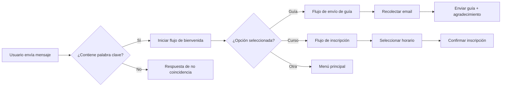

## ¿Qué es un Chatbot de Facebook Messenger?

Un chatbot de Facebook Messenger es una funcionalidad especial de Facebook que te permite configurar respuestas predefinidas basadas en las preguntas frecuentes que tus clientes hacen o podrían hacer. Una vez configurado tu chatbot en Messenger, cuando tus clientes te envíen un mensaje, el bot responderá automáticamente, permitiéndote concentrarte en operaciones comerciales más importantes mientras tu chatbot responde las preguntas básicas de tus clientes.


> **¿Sabías que...?** Los negocios que implementan chatbots en Messenger experimentan un aumento significativo en la tasa de respuesta y satisfacción del cliente, ya que las respuestas son prácticamente instantáneas. Además, puedes atender a múltiples clientes simultáneamente sin necesidad de ampliar tu equipo de soporte.

## TL;DR: Resumen Ejecutivo

Esta guía explica cómo evitar perder mensajes de clientes y oportunidades de venta mediante la creación de un chatbot automatizado de Facebook Messenger.

**Puntos clave:**
- **La herramienta:** E-SMART360 te permite crear un bot de Messenger en menos de 5 minutos sin programación.
- **El proceso:** 1. Regístrate en E-SMART360. 2. Conecta tu cuenta de Facebook y página de negocio. 3. Usa el constructor visual de arrastrar y soltar para crear un flujo de conversación (saludar usuarios, ofrecer botones para cursos/guías y recolectar correos electrónicos). 4. Utiliza el chat en vivo integrado para intervenir manualmente cuando sea necesario.
- **El beneficio:** Ahorras tiempo, automatizas la generación de leads y proporcionas soporte al cliente 24/7.

## Requisitos Previos

Antes de comenzar, asegúrate de tener lo siguiente:


### Cuenta de Facebook personal activa

Necesitarás una cuenta personal de Facebook para gestionar los permisos y conectar tu página de negocio con E-SMART360.

### Página de negocio en Facebook

Tu página de Facebook debe estar creada y configurada. Si aún no tienes una, puedes crearla directamente desde la configuración de Facebook Business.

### Cuenta gratuita en E-SMART360

Regístrate de forma gratuita para acceder al constructor visual de chatbots y a todas las herramientas de automatización.

### Correo electrónico empresarial

Recomendamos usar un correo corporativo para la gestión administrativa de tu cuenta en E-SMART360.


> Si aún no tienes una página de Facebook, puedes crearla en [business.facebook.com](https://business.facebook.com/). Selecciona "Página" y sigue los pasos para configurar el nombre, la categoría y la información básica de tu negocio.

## Guía Paso a Paso: Cómo Crear un Chatbot de Messenger en 5 Minutos

### Paso 1: Crear una Cuenta Gratuita en E-SMART360

Registrarse en E-SMART360 es muy sencillo. Solo tienes que ir a la página de registro.

1. Ingresa tu **nombre completo**.
2. Proporciona tu **correo electrónico**.
3. Crea una **contraseña segura**.
4. Lee atentamente los términos y condiciones y marca la casilla de aceptación.
5. Haz clic en **"Registrarse"**.


> ¡Listo! En menos de un minuto tendrás tu cuenta activa y podrás comenzar a configurar tu chatbot de Messenger.

### Paso 2: Conectar tu Cuenta de Facebook y tu Página de Negocio

Una vez dentro del panel de control de E-SMART360:

1. Ve a la sección **"Facebook"** en el menú lateral.
2. Selecciona la opción **"Conectar cuenta"**.
3. En la parte superior verás un botón llamado **"Iniciar sesión con Facebook"**.
4. Haz clic en él para autorizar la conexión entre tu cuenta de Facebook y E-SMART360.


### Permisos necesarios

Al conectar tu cuenta, E-SMART360 solicitará los siguientes permisos:
- Acceso a tus páginas de Facebook
- Enviar y recibir mensajes en nombre de tus páginas
- Leer mensajes de la bandeja de entrada
- Gestionar webhooks

Puedes revisar y gestionar estos permisos en cualquier momento desde la configuración de Facebook.

### Solución de problemas

Si el botón "Iniciar sesión con Facebook" no aparece o está deshabilitado:
- Asegúrate de usar un navegador actualizado (Chrome, Firefox, Edge).
- Verifica que tu cuenta de Facebook no tenga restricciones.
- Prueba limpiando la caché del navegador o usando una ventana de incógnito.
- Revisa que tu página de Facebook esté publicada y no en modo borrador.

Después de conectar tu cuenta, podrás seleccionar qué página de Facebook deseas vincular con tu chatbot. Aparecerá una lista con todas las páginas que administras.

### Paso 3: Crear un Chatbot Sencillo para Facebook Messenger

Para esta demostración, crearemos un chatbot simple que te llevará solo 5 minutos. Imaginemos que eres un tutor de inglés en línea que quiere vender su guía de estudio y su curso mediante un chatbot.

#### Acceder al Constructor de Bots

1. Ve a la opción **"Gestor de Bots"** dentro de la sección de Facebook.
2. Selecciona la **cuenta de bot** donde deseas crear el flujo (si tienes varias cuentas disponibles).
3. Desde la opción **"Respuesta del Bot"**, haz clic en el botón **"Crear"** para iniciar un nuevo flujo.


> El constructor visual de E-SMART360 funciona con un sistema de arrastrar y soltar. No necesitas escribir ni una sola línea de código. Cada componente del flujo se conecta mediante nodos visuales, como si estuvieras armando un diagrama de flujo.

#### Configurar el Componente "Iniciar Flujo del Bot"

Después de hacer clic en "Crear", serás redirigido al constructor visual de flujos. Lo primero que debes configurar es el componente **"Iniciar Flujo del Bot"**.

**Palabra clave de activación (Trigger):**
Define las palabras clave que activarán tu chatbot, como "hola", "ayuda", "información", etc. Cuando un usuario envíe un mensaje que contenga alguna de estas palabras, el bot iniciará la conversación.


### ¿Qué palabras clave debería usar?

Elige palabras clave que tus clientes usarían naturalmente. Algunas recomendaciones:
- **Generales:** "hola", "buenos días", "ayuda", "info", "menú"
- **Específicas de tu negocio:** "precios", "productos", "servicios", "contacto"
- **Palabras en otros idiomas:** si tu audiencia es multilingüe, añade palabras clave en los idiomas relevantes

Puedes añadir tantas palabras clave como necesites, separadas por coma.

**Título del Bot:**
Asigna un nombre descriptivo a tu bot, por ejemplo: "Tutoría de Inglés - Bot de Atención".

**Etiquetas de Usuario (User Labels):**
Utiliza etiquetas para categorizar a los usuarios dentro del flujo. Puedes añadir o eliminar etiquetas fácilmente para organizar tu base de usuarios.

**Opciones Avanzadas:**

- **Secuencias:** Integra a los usuarios del bot en secuencias de mensajes automatizados.
- **Asignación de equipo/agente:** Asigna conversaciones a equipos o agentes específicos para soporte personalizado.
- **Integración con Google Sheets:** Envía datos de los usuarios a tu hoja de Google para análisis y seguimiento.


> **Configuración importante:** Define correctamente las palabras clave de activación. Si eliges palabras demasiado comunes como "hola", tu bot se activará con mucha frecuencia. Si eliges palabras muy específicas, algunos usuarios podrían no activarlo. Encuentra un equilibrio según tu tipo de negocio.

#### Configurar el Mensaje de Bienvenida

Después de configurar el componente de inicio, añadiremos un mensaje de bienvenida. Este mensaje será enviado por el chatbot a los usuarios después de que activen el bot con las palabras clave que definimos.

Para añadir este mensaje:
1. Haz clic derecho en el lienzo del constructor.
2. Selecciona el componente **"Texto"**.
3. Escribe tu mensaje de bienvenida en el campo de entrada de texto.

Ejemplo de mensaje de bienvenida:

> "¡Hola! Bienvenido a English Fluency 🎉
>
> ¿Quieres mejorar tu inglés?
>
> Obtén una GUÍA GRATUITA sobre los errores gramaticales más comunes ahora."


> Un buen mensaje de bienvenida debe:
- Saludar de forma amigable
- Explicar brevemente qué puede hacer el bot
- Incluir una llamada a la acción clara
- Mantener un tono acorde con tu marca

#### Agregar Botones

Ahora vamos a ofrecerle al cliente dos opciones. Pueden obtener una guía de estudio si eligen la opción 1 o pueden inscribirse en un curso en línea.

Para hacer esto:
1. Arrastra dos botones desde el conector **"Añadir botón"** del componente de texto.
2. Haz doble clic en el primer botón para configurarlo. Asígnale un nombre, por ejemplo **"Obtener la Guía"**.

Cuando un usuario presione este botón, puedes configurar varias acciones:

- **Enviar un mensaje:** Entrega un mensaje directo al usuario.
- **Enviar un flujo:** Inicia un flujo de conversación predefinido.
- **Enviar un enlace web:** Comparte una página web específica con el usuario, como una página de productos.

También tienes las opciones de:
- **Iniciar una campaña de secuencia:** Involucra al usuario automáticamente en una serie de mensajes programados.
- **Asignar un agente:** Deriva la conversación a un agente humano para asistencia personalizada.
- **Enviar datos a Google Sheets:** Registra las interacciones y clics de los usuarios para análisis.
- **Enviar datos del cliente a un sitio web:** Integra con tu sitio web para personalizar la experiencia del usuario.


### Opción 1: Obtener la Guía

- Nombre del botón: "Obtener la Guía"
- Acción: Enviar un flujo → Flujo de recolección de email
- Mensaje de seguimiento: "Te enviaremos la guía gratis a tu correo"


### Opción 2: Iniciar Curso en Línea

- Nombre del botón: "Iniciar Curso Online"
- Acción: Enviar un flujo → Flujo de inscripción al curso
- Mensaje de seguimiento: "Selecciona tu horario preferido"


De la misma manera, añadimos un segundo botón con el nombre **"Iniciar Curso Online"**.

#### Configurar el Flujo de Entrada del Usuario (User Input Flow)

Hemos dado a los usuarios dos opciones: obtener la guía o iniciar un curso en línea. Ahora, cuando un usuario seleccione una opción, debe recibir una respuesta adecuada. Para ello, utilizaremos el componente **"Flujo de Entrada del Usuario"** para hacer preguntas relevantes y guardar sus respuestas.

**Para configurar el flujo:**

1. Arrastra y suelta el componente **"Flujo de Entrada del Usuario"** desde la biblioteca de componentes sobre el botón "Obtener la Guía".
2. Haz doble clic en el componente para abrir su configuración.
3. Crea un nuevo flujo de entrada seleccionando **"Añadir nuevo flujo de entrada"**.
4. Nombra el flujo, por ejemplo: **"Curso de Inglés"**.
5. Opcional: integra con sistemas externos usando la opción **Webhook** para enviar datos a aplicaciones como Shopify o WooCommerce. También puedes usar **"Enviar datos a Google Sheets"** para almacenar la información.


#### Ejemplo de datos recolectados

```
Nombre: [Campo de texto]
Email: [Campo de email]
Teléfono: [Campo de teléfono]
Horario preferido: [Selección múltiple - Mañana/Tarde/Noche]
```


**Para añadir preguntas al flujo:**

1. Arrastra y suelta un componente **"Pregunta"** desde la biblioteca sobre el primer paso del flujo de entrada del usuario.
2. Haz doble clic en el componente de pregunta para abrir su configuración.
3. Selecciona **"Entrada de palabra clave libre"** como tipo de pregunta.
4. Escribe la pregunta, por ejemplo: "¡Genial! Solo ingresa tu correo electrónico a continuación y te enviaremos la guía."
5. Establece el **"Tipo de respuesta"** como **"Email"** para validar que el usuario ingrese un correo electrónico válido.

**Guardar datos del usuario:**
Puedes elegir guardar el email del usuario en un **Campo personalizado** o en un **Campo del sistema** dentro de la plataforma.

**Acciones posteriores:**
- **Enviar una campaña de mensajes en secuencia:** Inicia una serie de mensajes automatizados a través de Messenger, SMS o correo electrónico.
- **Opción "Omitir":** Permite a los usuarios saltar esta pregunta y continuar con el siguiente paso del chat.


> **¿Por qué usar User Input Flow?**  
Este componente te permite recolectar información valiosa de tus clientes directamente desde el chat, sin necesidad de formularios externos. Los datos se almacenan en el Gestor de Suscriptores de E-SMART360 y puedes usarlos para campañas de marketing posteriores, segmentación de audiencia o personalización de la atención.

#### Añadir Mensaje de Agradecimiento y Archivo

Ahora añadamos un componente **"Mensaje de Agradecimiento"** donde agradeceremos al usuario por compartir su correo electrónico. Luego, añade otro componente **"Archivo"** para enviar la guía que el usuario está buscando.

Para el flujo "Iniciar Curso Online", añadiremos dos preguntas adicionales:

**Primera pregunta:**
- Tipo de pregunta: **Selección múltiple**
- Pregunta: "Tenemos dos horarios disponibles ahora mismo. Por favor, selecciona el turno que más te convenga."
- Opciones: Turno de mañana / Turno de tarde

**Segunda pregunta:**
- Tipo de pregunta: **Entrada de texto libre**
- Pregunta: "Por favor, proporciona tu dirección de correo electrónico para recibir más detalles y confirmar tu inscripción en el curso."


> **¡Tu bot está listo!** Al guardar el flujo, tu bot se pondrá en línea automáticamente. A partir de este momento, cuando tus clientes te envíen un mensaje en tu página de negocio, comenzarán a recibir respuestas automáticas.

**Elementos adicionales que puedes incluir en tu flujo:**


### Configurar respuestas para cuando no hay coincidencia (No Match Reply)

Cuando un usuario envía un mensaje que no coincide con ninguna de tus palabras clave o flujos configurados, es importante tener una respuesta de respaldo. Esto evita que el usuario quede sin respuesta.

**Recomendación de configuración:**
- Mensaje de no coincidencia: "Lo siento, no entendí tu mensaje. ¿Puedes intentar con 'hola', 'guía' o 'curso'?"
- Límite de reintentos: Configura 2-3 intentos máximos antes de derivar a un agente humano
- Frecuencia: Establece un intervalo mínimo entre respuestas para evitar spam

### Optimizar la frecuencia de respuestas del bot

Para evitar saturar a tus clientes, E-SMART360 te permite controlar la frecuencia con la que el bot responde. Puedes configurar:
- **Intervalo entre respuestas:** Define un tiempo de espera entre cada mensaje automático (recomendado: 1-2 segundos).
- **Límite de respuestas por conversación:** Establece un máximo de mensajes automáticos antes de requerir intervención humana.
- **Horario de funcionamiento:** Configura el bot para que solo responda durante tu horario laboral.

### Paso 4: Usar el Chat en Vivo para Atención Personalizada

Al guardar el flujo del bot, lo pones en línea. Ahora, cuando tus clientes te envíen mensajes, el bot responderá automáticamente. Tu única tarea es supervisar las conversaciones para intervenir si algún cliente necesita asistencia adicional.

E-SMART360 incluye un **chat en vivo integrado** para Facebook Messenger. Aquí te explicamos cómo usarlo:

#### Acceder al Chat en Vivo de Facebook Messenger

1. Ve al panel principal de E-SMART360.
2. Selecciona la opción **"Chat en Vivo"** dentro de la **Sección de Facebook**.


> **¿Qué puedes hacer desde el Chat en Vivo?**
Esta interfaz te permite:
- Participar en conversaciones en tiempo real con los clientes.
- Proporcionar soporte personalizado cuando sea necesario.
- Gestionar eficientemente las consultas de los clientes.
- Utilizar la bandeja compartida multiagente para el soporte al cliente.

#### Funcionalidades Avanzadas del Chat en Vivo

El chat en vivo de E-SMART360 está dividido en tres secciones principales que trabajan juntas para ofrecerte el control total de tus conversaciones:

##### 1. Lista de Suscriptores

Aquí verás todos tus suscriptores de WhatsApp y Messenger. Puedes:

- **Buscar un suscriptor:** Usa la barra de búsqueda en la parte superior para encontrar rápidamente a un cliente por su nombre.
- **Filtros avanzados:** Usa la opción de filtro para ordenar por etiquetas, secuencias o por actividad reciente.
- **Gestionar chats:** Organiza los chats en diferentes vistas:
  - **"Míos":** Conversaciones asignadas a agentes específicos.
  - **"Todos los chats":** Lista completa de todas las conversaciones.
  - **"No leídos":** Mensajes que aún no has leído.
  - **"Archivados":** Conversaciones antiguas guardadas para referencia futura.
  - **"Bloqueados":** Mensajes de spam o abusivos.
  - **"Resueltos":** Problemas de clientes que ya se resolvieron.

##### 2. Ventana de Chat

Esta es el área donde chateas con los clientes. Sus funcionalidades incluyen:

- **Marcar un chat:** Puedes marcar cualquier conversación como no leída o archivarla.
- **Recordatorio de seguimiento:** Programa una hora para responder a un cliente cuando no puedas hacerlo de inmediato.
- **Traducir mensajes:** Haz clic en el botón de traducción debajo de un mensaje para traducirlo a tu idioma preferido.
- **Mensajes de firma:** Antes de unirte a un chat, activa la opción "Enviar mensaje de firma" para que el cliente sepa qué agente lo está atendiendo.
- **Reescribir con IA:** Escribe un mensaje y haz clic en "Reescribir con IA" para corregir la gramática o mejorar el texto.
- **Enviar plantillas o flujos:** Usa mensajes predefinidos o flujos de bot guardados.
- **Respuestas rápidas (Canned Responses):** Inserta respuestas preescritas para preguntas frecuentes.
- **Compartir archivos:** Arrastra y suelta múltiples archivos (imágenes, documentos) para enviarlos simultáneamente.
- **Reproducción de audio y video:** Comparte y reproduce archivos multimedia directamente en la ventana de chat.


> **Consejo profesional:** Configura respuestas rápidas (canned responses) para las preguntas más frecuentes de tus clientes. Esto acelera enormemente el tiempo de respuesta y asegura consistencia en la información que proporciona tu equipo.

##### 3. Acciones del Chat

Esta sección te ayuda a gestionar conversaciones y colaborar con tu equipo:

- **Botón de Acción:** Puedes suscribir o cancelar la suscripción de clientes, pausar/reanudar respuestas del bot y restablecer flujos de entrada del usuario con un solo clic.
- **Asignar un agente:** Selecciona un agente del menú desplegable para asignarle una conversación específica.
- **Añadir etiquetas:** Categoriza a los clientes con etiquetas personalizadas.
- **Campos personalizados:** Recolecta datos importantes del cliente para proporcionar una asistencia más personalizada. Puedes crear nuevos campos desde el Gestor de Suscriptores.
- **Añadir notas:** Guarda información importante sobre el cliente.
- **Ventana de 24 horas:** Un contador regresivo que muestra cuánto tiempo tienes para responder antes de que el chat se cierre (regla de WhatsApp).


> **Regla de las 24 horas:** WhatsApp exige que respondas a los mensajes entrantes dentro de las 24 horas. Después de ese período, no puedes enviar mensajes gratuitos y deberás usar plantillas de mensajes aprobadas. El chat en vivo de E-SMART360 te muestra un contador regresivo para que siempre estés al tanto de este límite.

## Ejemplos Prácticos y Casos de Uso


### 🛒 Tienda de E-commerce

Una tienda de ropa puede configurar un chatbot de Messenger para:
- Saludar a los visitantes con ofertas especiales
- Mostrar el catálogo de productos mediante botones interactivos
- Responder preguntas frecuentes sobre tallas y envíos
- Recolectar correos electrónicos para newsletters
- Derivar a un agente humano para consultas complejas

**Resultado:** Reducción del 60% en consultas repetitivas y aumento del 25% en conversiones.

### 🏨 Hotel o Restaurante

Un restaurante puede usar el chatbot para:
- Recibir reservaciones automáticas mediante el flujo de entrada
- Mostrar el menú del día con imágenes
- Informar sobre horarios y ubicación
- Enviar confirmaciones de reserva
- Gestionar solicitudes especiales (alergias, celebraciones)

**Resultado:** Gestión automatizada de reservas 24/7 sin necesidad de recepcionista.

### 🎓 Academia o Tutoría

Como en el ejemplo de esta guía, una academia puede:
- Ofrecer guías gratuitas para captar leads
- Promocionar cursos premium
- Inscribir alumnos mediante formularios dentro del chat
- Enviar material de estudio automáticamente
- Segmentar alumnos por nivel o interés

**Resultado:** Captación de leads calificados de forma totalmente automatizada.

### 💼 Agencia de Marketing Digital

Una agencia puede implementar el chatbot para:
- Cualificar leads automáticamente antes de la llamada de ventas
- Mostrar casos de éxito (portafolio) mediante botones
- Agendar citas de consultoría gratuita
- Enviar propuestas comerciales en PDF

**Resultado:** Proceso de ventas optimizado con leads pre-cualificados.

## Estrategias Avanzadas para tu Chatbot de Messenger

### 1. Integración con Secuencias de Mensajes

Puedes combinar tu chatbot con campañas de secuencias de mensajes para hacer seguimiento a los leads que no completaron una acción. Por ejemplo, si un usuario hizo clic en "Obtener la Guía" pero no proporcionó su correo, puedes configurar una secuencia que envíe un recordatorio al día siguiente.


#### Ejemplo de secuencia de seguimiento

```
Día 1 - 1 hora después: "¡Hola! ¿Aún te interesa la guía gratuita?"
Día 1 - 3 horas después: "Solo necesito tu correo para enviártela 📧"
Día 2: "Última oportunidad: guía gratuita de inglés para ti"
Día 3: "Ya no insisto... pero la oferta sigue disponible 😉"
```


### 2. Uso de Etiquetas para Segmentación Automática

Aprovecha las etiquetas de usuario para segmentar automáticamente a tus contactos según sus interacciones:
- **Etiqueta "Guía solicitada"** para quienes pidieron la guía
- **Etiqueta "Curso interesado"** para quienes exploraron cursos
- **Etiqueta "Lead caliente"** para quienes completaron el formulario
- **Etiqueta "Requiere seguimiento"** para quienes abandonaron el proceso

Luego puedes usar estas etiquetas para campañas de marketing dirigidas.

### 3. Integración con Google Sheets para Análisis

Cada vez que un usuario interactúa con tu chatbot, los datos pueden enviarse automáticamente a Google Sheets. Esto te permite:
- Analizar qué productos o servicios generan más interés
- Identificar patrones en las preguntas de los clientes
- Medir la tasa de conversión del chatbot
- Exportar datos para campañas de email marketing


> **Beneficio clave:** La combinación de chatbot automatizado + chat en vivo humano te permite escalar tu atención al cliente sin perder el toque personal. El bot maneja el 80% de las consultas rutinarias, mientras que tu equipo se concentra en el 20% que realmente requiere intervención humana.

## Preguntas Frecuentes (FAQ)


### ¿Cómo crear un chatbot de Messenger gratis en redes sociales?

Crear un chatbot de Messenger gratuito es posible usando plataformas como E-SMART360, que ofrece un plan gratuito con funcionalidades básicas. Con el plan gratuito puedes:
- Conectar tu página de Facebook
- Usar el constructor visual de flujos (arrastrar y soltar)
- Crear flujos básicos con preguntas y respuestas
- Recolectar información de los usuarios

Si bien un chatbot completamente gratuito y con todas las funcionalidades puede no estar disponible, el plan gratuito es un excelente punto de partida para explorar la creación de chatbots.

### ¿Cómo hacer un bot de Messenger gratis en E-SMART360?

E-SMART360 ofrece un plan gratuito que te permite construir un chatbot para Messenger. Puedes crear tu bot usando el constructor visual de flujos, integrar varias funciones y conectarlo a tu página de Facebook. El proceso es:
1. Regístrate gratis en E-SMART360.
2. Conecta tu página de Facebook desde la sección de Facebook.
3. Usa el Gestor de Bots para crear tu primer flujo.
4. Configura palabras clave, mensajes de bienvenida y botones.
5. Guarda el flujo y tu bot estará en línea.

### ¿Cómo crear un chatbot en Facebook Messenger paso a paso?

Puedes crear chatbots de Facebook Messenger fácilmente usando E-SMART360. Es una herramienta simple donde puedes diseñar tus chatbots de Messenger sin conocimientos de programación. Pasos resumidos:
1. Regístrate en E-SMART360.
2. Conecta tu página de Facebook.
3. Ve al Gestor de Bots → Crear nuevo flujo.
4. Configura el componente "Iniciar Flujo del Bot" con palabras clave.
5. Añade mensajes de bienvenida, botones y flujos de entrada.
6. Guarda el flujo.

Puedes entrenar tus chatbots para responder preguntas de clientes, dar información sobre tu negocio e incluso tomar pedidos directamente desde Messenger.

### ¿Cómo usar el chatbot de Messenger para ganar dinero?

E-SMART360 puede usarse para generar ingresos a través de varias estrategias:
- **Revendedor:** Conviértete en revendedor de E-SMART360 y gana comisiones por las ventas de tus paquetes personalizados de chatbot.
- **Servicios de implementación:** Ofrece servicios de configuración y entrenamiento de chatbots a clientes que no quieren hacerlo ellos mismos.
- **Marketing de afiliados:** Promociona E-SMART360 y gana comisiones recurrentes por cada cliente referido.
- **Agencia de automatización:** Crea una agencia que ofrezca automatización de Messenger como servicio, usando la plataforma como infraestructura.

### ¿Cómo crear un chatbot en una página de Facebook?

Simplemente inicia sesión en tu cuenta de E-SMART360. Desde la sección de Facebook, ve a la opción "Conectar cuenta". Allí puedes conectar tu página de Facebook con la plataforma. Una vez conectada, puedes crear bots para tu página de Facebook desde el Gestor de Bots. No necesitas permisos especiales de Facebook ni configuración técnica avanzada: E-SMART360 maneja toda la integración técnica por ti.

### ¿Cómo configurar un chatbot de Messenger para recolectar correos electrónicos?

Para recolectar direcciones de correo electrónico usando un chatbot de Messenger con E-SMART360, utiliza la función **Flujo de Entrada del Usuario (User Input Flow)**:
1. Crea un flujo que incluya una pregunta específica solicitando el correo electrónico.
2. Configura el tipo de respuesta como "Email" para validación automática.
3. E-SMART360 recolectará el email y lo guardará en el Gestor de Suscriptores.
4. Posteriormente puedes usar estos datos para campañas de marketing futuras.

Además del email, puedes configurar preguntas para recolectar nombre, teléfono, preferencias de producto y cualquier otro dato relevante para tu negocio.

### ¿Cómo crear un chatbot de Messenger gratuito para mejorar la experiencia del cliente?

E-SMART360 te proporciona un constructor visual de flujos tipo arrastrar y soltar que te permite diseñar flujos de chatbot sin conocimientos de programación. Las funcionalidades incluyen:
- Respuestas automáticas personalizadas
- Preguntas frecuentes interactivas
- Integraciones con herramientas de terceros como Shopify y WooCommerce
- Chat en vivo con bandeja compartida para tu equipo

Todo esto te permite abordar las consultas comunes de los clientes de manera eficiente y mejorar la satisfacción general del servicio.

### ¿Hacer un bot de Messenger con Python es posible?

Sí, para crear un bot de Messenger con Python necesitarás usar la API Graph de Facebook y un framework como Flask:
1. Crea una Aplicación y Página de Facebook.
2. Configura un webhook en tu app para recibir mensajes de Messenger.
3. Usa Flask para crear un servidor que escuche estos mensajes y responda adecuadamente.
4. Implementa la lógica de parsing de mensajes y respuestas.
5. Despliega tu app Flask en un servidor para que Facebook pueda acceder a ella.

Sin embargo, si no eres programador, E-SMART360 elimina toda esta complejidad técnica, permitiéndote crear el mismo chatbot en minutos sin escribir una sola línea de código.

### ¿Cuánto tiempo toma configurar un chatbot de Messenger?

Con E-SMART360, puedes tener tu chatbot básico funcionando en menos de 5 minutos si sigues esta guía. Para chatbots más complejos con múltiples flujos, integraciones y secuencias, el tiempo de configuración puede ser de 30 minutos a 2 horas. A diferencia de las soluciones tradicionales que requieren semanas de desarrollo, E-SMART360 reduce drásticamente el tiempo de implementación.

### ¿Qué diferencias hay entre el chatbot de Messenger y el de WhatsApp?

Aunque ambos funcionan con principios similares, existen diferencias clave:
- **Messenger:** Tiene una tasa de apertura más alta y es ideal para engagement en redes sociales. Los bots pueden enviar mensajes proactivos sin restricciones de 24 horas.
- **WhatsApp:** Ofrece mayor alcance global y tasas de lectura superiores al 95%. Sin embargo, tiene la regla de las 24 horas y requiere plantillas aprobadas para mensajes proactivos.

E-SMART360 te permite gestionar ambos canales desde una sola plataforma, con un chat en vivo unificado.

## Recursos Adicionales

### Video Tutorial

Si prefieres aprender visualmente, puedes ver nuestro video tutorial sobre cómo crear un chatbot de Messenger en 5 minutos:

- **Video:** "Crear Chatbot de IA para Facebook Messenger - Configuración en 5 Minutos"
- Encuéntralo en nuestro canal oficial de YouTube

### Enlaces Útiles

- Aprende más sobre el **Gestor de Bots**: Consulta nuestra base de conocimiento sobre la gestión avanzada de flujos de bot.
- **Chat en vivo**: Documentación completa sobre la bandeja compartida multiagente.
- **Integraciones**: Conecta tu chatbot con WooCommerce, Shopify, Zapier y más.

## Conclusión

Crear un chatbot de Facebook Messenger ya no requiere conocimientos técnicos ni semanas de desarrollo. Con E-SMART360, puedes tener tu primer bot funcionando en menos de 5 minutos. La clave está en:

1. **Definir claramente** el propósito de tu chatbot (ventas, soporte, generación de leads).
2. **Diseñar
2. **Diseñar flujos naturales** que guíen al usuario hacia la acción deseada.
3. **Monitorear y optimizar** basándote en las interacciones reales de los usuarios.
4. **Complementar con chat en vivo** para mantener el toque humano cuando sea necesario.


> **¡Empieza hoy!** Regístrate gratis en E-SMART360 y crea tu primer chatbot de Messenger en menos de 5 minutos. Automatiza tus ventas, mejora tu atención al cliente y no pierdas nunca más un lead.

## Resolución de Problemas Comunes

### El bot no responde a los mensajes

| Problema | Causa posible | Solución |
|----------|--------------|----------|
| El bot no se activa | Las palabras clave no coinciden | Revisa las palabras clave en el componente "Iniciar Flujo del Bot" |
| El bot responde solo a algunos usuarios | Permisos de página incompletos | Reconecta tu página de Facebook desde la sección de conexiones |
| Los botones no funcionan | Flujo no guardado correctamente | Abre el flujo, verifica las conexiones y guarda de nuevo |
| Mensajes duplicados | Múltiples bots activos en la misma página | Desactiva otros bots o flujos que puedan estar compitiendo |

### El chat en vivo no muestra las conversaciones

1. Asegúrate de haber seleccionado la página de Facebook correcta en la configuración.
2. Verifica que los mensajes están llegando a la página (revisa Facebook Business Suite).
3. Comprueba que los permisos de la página están actualizados en la configuración de E-SMART360.
4. Si usas múltiples agentes, cada uno debe estar asignado a la página correspondiente.

### Error al conectar la cuenta de Facebook


### Verifica los permisos de la aplicación

Ve a Configuración de Facebook > Aplicaciones y sitios web. Asegúrate de que E-SMART360 tenga todos los permisos necesarios activos.

### Elimina y reconecta

A veces, una reconexión limpia resuelve los problemas. Desconecta tu cuenta de Facebook desde el panel de E-SMART360 y vuelve a conectarla.

### Prueba con otro navegador

Algunos bloqueadores de anuncios o extensiones del navegador pueden interferir. Prueba en modo incógnito o con otro navegador.

### Contacta a soporte

Si el problema persiste, contacta a nuestro equipo de soporte técnico para recibir asistencia personalizada.

## Configuración Avanzada del Constructor de Flujos

### Uso de Flujos Condicionales

Puedes crear flujos que se comporten de manera diferente según la respuesta del usuario. Por ejemplo:



### Personalización con Variables Dinámicas

Puedes usar variables en tus mensajes para personalizar la experiencia:

- `{{nombre}}` — Se reemplaza con el nombre del usuario
- `{{email}}` — Muestra el correo registrado
- `{{fecha}}` — Fecha actual
- `{{producto}}` — Producto de interés según la interacción


#### Ejemplo de mensaje personalizado

```
¡Hola {{nombre}}! 👋

Gracias por solicitar nuestra guía gratuita.
Te hemos enviado un email a {{email}} con el enlace de descarga.

¿Hay algo más en lo que pueda ayudarte hoy?
```


### Integración con el Asistente de IA

E-SMART360 te permite potenciar tu chatbot con inteligencia artificial. El asistente de IA puede:

- **Responder preguntas abiertas** que no están en tu flujo predefinido.
- **Aprender de tu base de conocimiento** (FAQs, URLs, archivos).
- **Derivar al agente humano** cuando no pueda resolver la consulta.
- **Mantener el contexto de la conversación** para respuestas coherentes.


> Para activar el asistente de IA:
1. Ve a la sección de Integraciones > Asistente de IA.
2. Configura tu base de conocimiento (sube FAQs, URLs o archivos PDF).
3. Activa la opción "Responder con IA cuando no haya coincidencia".
4. El asistente de IA complementará tu flujo de bot automáticamente.

## Mejores Prácticas para Chatbots de Messenger

### 1. Diseña para la Conversación Natural

Los mejores chatbots imitan una conversación humana. Evita respuestas robóticas y usa un tono amigable y coherente con tu marca. Algunas recomendaciones:

- Usa saludos informales como "¡Hola!" y "¡Gracias!"
- Incorpora emojis para dar calidez a las respuestas 😊
- Mantén las respuestas cortas y directas (máximo 2-3 líneas)
- Ofrece opciones claras con botones en lugar de esperar texto libre
- Usa el nombre del usuario cuando esté disponible

### 2. Estructura de Menú Eficiente

Un menú de chatbot bien estructurado mejora la experiencia del usuario:

- **Máximo 3-4 opciones por nivel:** Evita abrumar al usuario con demasiadas opciones.
- **Jerarquía clara:** Las opciones más importantes primero.
- **Llamadas a la acción descriptivas:** En lugar de "Opción 1", usa "Ver catálogo de productos".
- **Opción de "Volver al menú"** en cada nivel de profundidad.
- **Opción de "Hablar con un humano"** siempre disponible.

### 3. Estrategia de Seguimiento

No todos los usuarios completarán tu flujo en la primera visita. Implementa una estrategia de seguimiento:

- **Recordatorios suaves:** Un mensaje de seguimiento al día siguiente.
- **Ofertas por tiempo limitado:** Crea urgencia con promociones exclusivas.
- **Re-engagement:** Si el usuario no ha interactuado en 7 días, envía un mensaje con novedades.
- **Encuestas de satisfacción:** Pregunta cómo fue su experiencia con el bot.

### 4. Mantenimiento y Optimización Continua

Un chatbot no es algo que se configura una vez y se olvida. Para mantener su efectividad:

- **Revisa las conversaciones semanalmente:** Identifica patrones y preguntas nuevas.
- **Actualiza las palabras clave:** Añade nuevas palabras que los usuarios estén usando.
- **Analiza los abandonos:** ¿En qué punto del flujo se van los usuarios?
- **A/B testing:** Prueba diferentes mensajes de bienvenida y botones.
- **Actualiza las FAQs:** Mantén la información actualizada.

### 5. Cumplimiento con las Políticas de Facebook

Para evitar que tu chatbot sea desactivado:

- **No hagas spam:** No envíes mensajes no solicitados.
- **Respeta los límites de mensajes:** Facebook tiene políticas estrictas sobre mensajes masivos.
- **Proporciona una opción de "baja":** Los usuarios deben poder dejar de recibir mensajes fácilmente.
- **Transparencia:** Informa a los usuarios que están interactuando con un bot.
- **Política de datos:** Cumple con el GDPR y las leyes de privacidad aplicables.

## Conclusión Final

Crear un chatbot de Facebook Messenger con E-SMART360 es un proceso rápido, sencillo y sin código que puede transformar la forma en que tu negocio interactúa con los clientes. Desde la captación de leads hasta la atención al cliente 24/7, las posibilidades son enormes.

Recuerda que el éxito de tu chatbot depende tanto de su configuración inicial como del mantenimiento continuo y la optimización basada en datos reales de interacción. Empieza con un flujo simple, mide los resultados y ve añadiendo complejidad gradualmente.

**¿Listo para comenzar?** Regístrate gratis hoy y únete a miles de negocios que ya automatizan su atención al cliente con E-SMART360.

---


> **Actualización: Nuevas funcionalidades de Messenger (2026-03-31)**
> Esta guía se ha actualizado para incluir las últimas funcionalidades del constructor de chatbots de Messenger, incluyendo la integración con el asistente de IA, soporte para respuestas condicionales avanzadas y mejoras en el chat en vivo multiagente.

## Referencia Rápida de Componentes del Constructor

| Componente | Función | Cuándo usarlo |
|------------|---------|---------------|
| Iniciar Flujo del Bot | Configura palabras clave, título y etiquetas | Siempre, es el punto de inicio obligatorio |
| Texto | Envía un mensaje de texto al usuario | Para mensajes de bienvenida, instrucciones y mensajes informativos |
| Botón | Añade botones clickeables con acciones | Para ofrecer opciones múltiples al usuario |
| Imagen | Envía una imagen | Para mostrar productos, logos o infografías |
| Archivo | Envía un archivo (PDF, DOC, etc.) | Para guías, catálogos o documentos descargables |
| Pregunta | Recolecta información del usuario | Para formularios y captura de datos |
| Flujo de Entrada | Flujo completo de captura de datos | Para procesos de registro o calificación de leads |
| Condicional | Rama lógica basada en condiciones | Para personalizar la experiencia según el usuario |
| Acción HTTP | Ejecuta una llamada API | Para integraciones con sistemas externos |
| Esperar | Pausa el flujo por un tiempo | Para simular escritura humana o delay natural |
| Redirigir | Envía al usuario a otro flujo | Para reutilizar flujos existentes |
| Finalizar | Termina el flujo del bot | Para cerrar la conversación correctamente |

## Plantillas de Flujo Predefinidas

E-SMART360 incluye plantillas prediseñadas que puedes usar como punto de partida:

### Plantilla: Captación de Leads

```
Flujo prediseñado para recolectar información de contacto:

1. Mensaje de bienvenida → "¡Hola! ¿Te gustaría recibir más información?"
2. Botón "Sí, quiero recibir información"
3. Pregunta: Nombre completo
4. Pregunta: Correo electrónico  
5. Pregunta: Teléfono (opcional)
6. Pregunta: ¿Qué producto te interesa? (selección múltiple)
7. Mensaje de agradecimiento → "¡Gracias! Te contactaremos pronto"
8. Enviar datos a Google Sheets (oculto)
9. Asignar etiqueta "Lead nuevo"
```

### Plantilla: Soporte al Cliente

```
Flujo prediseñado para atención al cliente:

1. Mensaje de bienvenida → "¡Bienvenido/a al centro de soporte!"
2. Botón "Problema con mi pedido" → Flujo de pedidos
3. Botón "Consulta de producto" → Flujo de productos
4. Botón "Hablar con un agente" → Asignar agente humano
5. Botón "Otro tema" → Pregunta abierta con IA
6. Si no hay coincidencia en 3 intentos → Derivar a agente humano
```

### Plantilla: Venta de Productos

```
Flujo prediseñado para catálogo de productos:

1. Mensaje de bienvenida → "¡Descubre nuestros productos!"
2. Botón "Ver catálogo completo" → Enlace al catálogo web
3. Botón "Producto más vendido" → Imagen + descripción + precio + botón de compra
4. Botón "Novedades" → Lista de productos nuevos + precios
5. Botón "Hablar con asesor" → Asignar agente de ventas
```

## Análisis de Datos del Chatbot

Una vez que tu chatbot esté funcionando, es importante analizar los datos para mejorarlo continuamente. E-SMART360 te proporciona métricas clave:

### Métricas Principales

- **Total de conversaciones:** Número total de chats iniciados.
- **Tasa de respuesta del bot:** Porcentaje de mensajes que el bot respondió automáticamente.
- **Tasa de derivación a humano:** Porcentaje de conversaciones que requirieron intervención humana.
- **Tasa de finalización de flujo:** Porcentaje de usuarios que completaron todo el flujo.
- **Tasa de abandono:** En qué punto del flujo los usuarios abandonan.

### Interpretación de Métricas


### Cómo interpretar y actuar sobre las métricas

**Si la tasa de derivación a humano es alta (>40%):**
- Tu chatbot no está resolviendo las consultas más comunes
- Revisa las conversaciones donde intervinieron humanos para identificar patrones
- Añade nuevos flujos para cubrir esas necesidades

**Si la tasa de abandono es alta en un paso específico:**
- La pregunta puede ser demasiado compleja o intrusiva
- Simplifica la pregunta o hazla opcional
- Considera dividirla en preguntas más pequeñas

**Si la tasa de finalización es baja:**
- El flujo puede ser demasiado largo (más de 5 pasos)
- Los usuarios pueden estar perdiendo interés
- Reduce el número de pasos o añade incentivos para completar


## Ejemplo Completo: Chatbot para Restaurante

Para darte una visión más completa, aquí tienes un ejemplo detallado de un chatbot para un restaurante:


<Card title="🍕 Restaurante "La Piazza"">

**Configuración del bot:**
- Palabras clave: "menú", "reservar", "horario", "ubicación", "hola"
- Bienvenida: "¡Bienvenido a La Piazza! ¿En qué puedo ayudarte?"
- Opción 1: "Ver menú" → Imagen del menú del día
- Opción 2: "Hacer reserva" → Flujo de reserva (nombre, personas, fecha, hora)
- Opción 3: "Horario y ubicación" → Información de horarios + mapa
- Opción 4: "Hablar con alguien" → Derivar al encargado

**Resultados obtenidos:**
- 45% de las reservas llegan a través del chatbot
- Reducción del 60% en llamadas telefónicas de consulta
- Aumento del 30% en pedidos para llevar
- 85% de satisfacción con la atención automatizada


<Card title="💻 Tienda de Tecnología "GadgetPro"">

**Configuración del bot:**
- Palabras clave: "ofertas", "productos", "soporte", "garantía", "ayuda"
- Bienvenida: "¡Hola! Soy el asistente virtual de GadgetPro"
- Opción 1: "Ver ofertas semanales" → Carrusel de productos destacados
- Opción 2: "Estado de mi pedido" → Solicitar número de pedido + consultar API
- Opción 3: "Soporte técnico" → FAQ interactivo con categorías
- Opción 4: "Hablar con ventas" → Asignar agente del equipo comercial

**Resultados obtenidos:**
- 70% de consultas de soporte resueltas sin intervención humana
- 35% de aumento en ventas cruzadas (upselling)
- Reducción del 50% en el tiempo de respuesta promedio


## Seguridad y Privacidad

Al implementar un chatbot de Messenger, es importante considerar la seguridad y privacidad de los datos:


> **Protección de datos:** Toda la información recolectada por tu chatbot debe manejarse de acuerdo con las regulaciones de privacidad aplicables (GDPR, CCPA, etc.). Asegúrate de:
- Informar a los usuarios qué datos estás recolectando
- Obtener consentimiento explícito cuando sea necesario
- Almacenar los datos de forma segura
- Permitir a los usuarios solicitar la eliminación de sus datos

E-SMART360 cumple con los más altos estándares de seguridad, incluyendo:
- Cifrado de datos en tránsito y en reposo
- Cumplimiento con GDPR y CCPA
- Almacenamiento seguro de credenciales
- Auditorías de seguridad regulares
