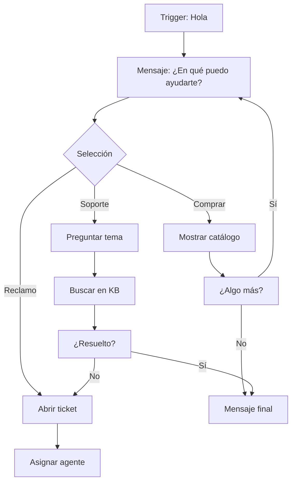

# Cómo crear un chatbot de WhatsApp en pasos sencillos


> Esta guía está diseñada tanto para principiantes como para usuarios avanzados. No necesitas conocimientos de programación para construir un chatbot funcional en WhatsApp utilizando E-SMART360.

¡Hola a todos!

En la era de la Cuarta Revolución Industrial, los chatbots se han convertido en una plataforma conversacional de inteligencia artificial más rápida, inteligente y escalable a nivel empresarial. En esencia, un chatbot es un software que simula conversaciones humanas al instante con los usuarios a través del chat.

Existen diferentes tipos de chatbots con diversas interfaces, algunos gratuitos y otros de pago.

En este artículo, abordaré principalmente cómo construir un chatbot de WhatsApp en seis simples pasos.

Antes de entrar en materia, te explicaré qué son los chatbots de WhatsApp, por qué son importantes y cuáles son los requisitos previos para construir uno.


> **Actualización (2026-01-28)**
> Última actualización de esta guía: 28 de enero de 2026. Los procedimientos descritos funcionan con la versión más reciente de la plataforma y la API de WhatsApp Cloud.

## ¿Qué es un chatbot de WhatsApp?

Un chatbot de WhatsApp es un software que puede responder automáticamente a los mensajes en WhatsApp. Funciona las 24 horas del día, los 7 días de la semana, y puede mantener múltiples conversaciones con diferentes personas al mismo tiempo. Los chatbots de WhatsApp se utilizan a menudo para proporcionar información sobre una empresa, sus productos o servicios, respondiendo automáticamente a las preguntas de los clientes.

Los chatbots de WhatsApp se basan generalmente en un flujo conversacional creado mediante tres elementos principales:

1. **Disparador (Trigger)**: La palabra clave o acción que inicia la conversación.
2. **Acción (Action)**: La respuesta automática que el bot envía al usuario.
3. **Condición (Condition)**: Las reglas que determinan qué respuesta enviar según la interacción del usuario.


> Piensa en tu chatbot como un recepcionista virtual: saluda, responde preguntas frecuentes, dirige al departamento correcto y recopila información, todo de forma automática.

## ¿Por qué usar chatbots de WhatsApp?

Un chatbot de WhatsApp bien integrado en tu negocio te dará una ventaja masiva. Tus clientes obtendrán respuestas a sus preguntas al instante. Por lo tanto, podrás ahorrar tiempo (responder en segundos en lugar de días) y reducir los costos del centro de contacto. Sin duda, serás más eficiente, amigable e interactivo en WhatsApp, lo que construirá el valor de tu marca.

Aunque el chatbot de WhatsApp no es humano, puede manejar múltiples consultas a la vez. La seguridad y la privacidad son los fundamentos principales del ecosistema de chatbots de WhatsApp, y está libre de anuncios y spam. Por defecto, el cifrado de extremo a extremo está habilitado.

### Razones principales para usar un chatbot de WhatsApp

1. **Atención 24/7**: Configurar respuestas automatizadas fuera del horario laboral, es decir, en cualquier lugar y a cualquier hora, con mensajes personalizados para los clientes.
2. **Marketing y ventas**: Mejorar campañas de marketing, generación de leads y esfuerzos de ventas.
3. **Atención al cliente**: Mejorar el servicio al cliente ofreciendo mejor soporte y experiencia.
4. **Identidad de marca**: Establecer una identidad de marca sólida recomendando nuevos productos y servicios.
5. **Integración con CRMs**: Integrar tu chatbot con tus sistemas CRM existentes como Hubspot, Shopify o Zoho.


> WhatsApp no solo es una de las aplicaciones de mensajería más grandes y populares del mundo, con más de 2000 millones de usuarios a nivel global, sino que también está disponible en más de 180 países y 60 idiomas diferentes. Además, desde enero de 2020, WhatsApp ha registrado más de 5000 millones de instalaciones en Google Play Store, siendo solo la segunda aplicación no perteneciente a Google en alcanzar este hito.

Como tus clientes ya están allí, deberías usar WhatsApp. Por lo tanto, ellos solo esperan que les envíes un mensaje, y sin duda, esta base masiva de usuarios brinda a los bots de WhatsApp un acceso fácil a un enorme mercado. Para iniciar una conversación, no es necesario instalar una nueva aplicación de mensajería instantánea.

## Requisitos previos para construir un chatbot en WhatsApp

Antes de comenzar, asegúrate de cumplir con los siguientes requisitos:


### Empresa verificada en Facebook/Meta

Necesitas una empresa verificada en Meta. Esto es fundamental para acceder a la API de WhatsApp Business. Si aún no la tienes, consulta la guía de verificación empresarial de Meta.

### Crear WhatsApp Cloud API

Es obligatorio crear la WhatsApp Cloud API. Si no la tienes, puedes ver el tutorial en video o leer la guía completa sobre cómo configurar la WhatsApp Cloud API.

### Conectar la API con E-SMART360

Después de crear la Cloud API, necesitas conectarla con un proveedor de servicios de bots como E-SMART360.

### Crear plantillas de mensaje

Si deseas enviar conversaciones iniciadas por la empresa fuera de la ventana de 24 horas, debes crear una plantilla de mensaje. Consulta la guía sobre cómo crear plantillas de mensaje para WhatsApp.


### ¿Qué es la ventana de 24 horas en WhatsApp?

WhatsApp permite a las empresas responder a los mensajes de los clientes dentro de una ventana de 24 horas desde el último mensaje del cliente. Dentro de esta ventana, puedes enviar cualquier tipo de mensaje. Fuera de esta ventana, solo puedes enviar mensajes utilizando plantillas pre-aprobadas por WhatsApp. Es importante planificar tus secuencias de mensajes teniendo en cuenta esta regla.

## Dos opciones para construir un chatbot de WhatsApp

Existen dos opciones para construir un chatbot de WhatsApp:

1. **Escribir manualmente el código específico** para el chatbot.
2. **Usar E-SMART360** para construir chatbots sin necesidad de conocimientos de programación.

Obviamente, programar el chatbot manualmente requiere conocimientos técnicos, lo que puede ser un desafío. Por lo tanto, si no eres un experto o no tienes un desarrollador, te recomiendo la segunda opción.


> Construir un chatbot desde cero con código requiere manejar APIs, webhooks, bases de datos y lógica de negocios compleja. Con E-SMART360, todo esto se maneja automáticamente mediante una interfaz visual de arrastrar y soltar.

## Cómo construir un chatbot de WhatsApp paso a paso

Construir un chatbot de WhatsApp con **E-SMART360** es muy sencillo y se puede hacer sin escribir ni una sola línea de código. Para construir un bot de WhatsApp, sigue estos pasos principales:

### Paso 1: Registrarse en E-SMART360

Primero, debes ir al sitio web de **E-SMART360** y completar el formulario de registro.


### Acceder al sitio

Visita el sitio web de E-SMART360.

### Completar el registro

Haz clic en el botón "Registrarse" y completa todos los campos del formulario con tus datos.

### Iniciar sesión

Una vez registrado, haz clic en "Iniciar sesión" para acceder al panel de control.

### Paso 2: Conectar tu cuenta de WhatsApp Business en E-SMART360

Ahora, inicia sesión en tu cuenta siguiendo estas instrucciones:

1. Visita **E-SMART360** → 2. Haz clic en el botón **"Iniciar sesión"** → 3. Completa los campos del formulario → 4. Haz clic en **"Iniciar sesión"**.


> **Precaución:** Si no tienes una cuenta comercial y un número de teléfono verificado, primero debes crear una aplicación para WhatsApp. Luego, registra un número de teléfono y configura el webhook. Si ya tienes estos elementos, puedes saltar estos pasos.

Para obtener el **ID de la cuenta de WhatsApp Business**, sigue estos pasos:


### Ir a configuración empresarial

Ve a la página de configuración empresarial (Business Settings) en Meta.

### Seleccionar cuenta de WhatsApp

En la barra lateral izquierda, selecciona el menú de cuenta de WhatsApp. Aparecerá la sección de cuentas de WhatsApp.

### Copiar el ID

Selecciona tu aplicación y copia el ID de la cuenta de WhatsApp Business.

### Conectar en E-SMART360

Desde el panel de control de E-SMART360:
1. Haz clic en el menú de navegación "Conectar cuenta"
2. Ingresa tu ID de cuenta comercial y el Token de Acceso en los campos correspondientes
3. Haz clic en el botón "Conectar"


> Mi sugerencia es que no uses el token de acceso temporal. Siempre es mejor generar un token permanente desde Meta Business Platform para evitar tener que reconectar tu cuenta periódicamente.

### Paso 3: Planificar la conversación

Generalmente, cada negocio tiene su propio estilo. Por lo tanto, no existe una receta única para un chatbot de WhatsApp. Debes tener en cuenta el recorrido de tu cliente para poder mapear los elementos y el diagrama de tu conversación.


> Antes de empezar a construir, responde estas preguntas:
- ¿Qué preguntas hacen más los clientes?
- ¿Qué información necesitas recopilar?
- ¿Cuál es el objetivo principal del chatbot? (ventas, soporte, leads)
- ¿Qué palabras clave activarán cada respuesta?

### Paso 4: Configurar el bot en el Gestor de Bots de E-SMART360

Ahora, desde el panel de control, debes crear un bot según las siguientes instrucciones:


### Acceder al Gestor de Bots

Haz clic en el menú de navegación "Gestor de Bots". Luego, en "Gestor de Bots de WhatsApp", selecciona la cuenta de bot deseada.

### Ir a Respuesta del Bot

Haz clic en la sección "Respuesta del Bot" y luego en el botón "Crear".

### Usar el lienzo visual

Al completar los pasos anteriores, aparecerá un lienzo de construcción de flujo de bot.

Verás el menú de documentos con **11 componentes** en el lado izquierdo del lienzo. Desde los recuadros, puedes arrastrar y soltar cualquier componente en el lienzo.

#### Configuración del disparador (Trigger)

Selecciona la herramienta **"Trigger"** (Disparador). Arrástrala y suéltala en el lienzo. Aparecerá un componente de disparador. Para configurarlo, haz doble clic sobre él.

Aparecerá un submenú de configuración del disparador en la parte superior derecha del lienzo. Ingresa una palabra clave como **"Inicio"** o **"Hola"** y haz clic en el botón **"OK"** para guardarlo.


### Tipos de coincidencia de palabras clave

- **Coincidencia exacta**: El bot solo se activa con la palabra clave exacta. Ejemplo: "Hola" no activará el bot si el usuario escribe "Hola, necesito ayuda".
- **Coincidencia de cadena**: El bot se activa si el mensaje contiene la palabra clave en cualquier parte. Ejemplo: "Hola" activará el bot incluso si el usuario escribe "Buenos días, hola, ¿cómo estás?".
- **Selecciona la opción que mejor se adapte a tu caso de uso.**

#### Conectar el flujo del bot

Conecta el disparador al **"Inicio del Flujo del Bot"** uniendo el conector **"Trigger"**. Haz doble clic en "Inicio del Flujo del Bot" y aparecerá un formulario modal de configuración llamado "Configurar Referencia" en la parte superior derecha del lienzo.

Dale un título y haz clic en el botón **"OK"** para guardarlo. Luego, arrastra desde el conector **"Siguiente"** de "Inicio del Flujo del Bot" y suéltalo en el lienzo. Aparecerá una lista de componentes.

Aquí puedes elegir cualquier herramienta. Por ejemplo, selecciona la opción **"Texto"**. Para configurarla, haz doble clic sobre ella. Aparecerá un formulario modal en la parte superior derecha del lienzo. Escribe tu mensaje de respuesta en el campo de mensaje y haz clic en el botón **"OK"** para guardarlo.

#### Añadir más elementos al flujo

Desde aquí, puedes arrastrar el conector **"Siguiente"** y soltarlo en el lienzo si deseas ampliar tu bot. Puedes crear:

- **Botones interactivos**: Incluye botones de CTA (llamada a la acción) como "Comprar ahora", "Ver catálogo", "Hablar con un agente".
- **Flujo de entrada de usuario**: Permite que el usuario ingrese información personalizada.
- **Listas dinámicas**: Muestra opciones seleccionables al usuario.
- **Conexión a secuencias**: Activa secuencias de mensajes programados.
- **Integración con API externa**: Conecta tu bot con servicios externos mediante HTTP API.


> El constructor visual de flujos incluye los siguientes componentes principales:
- **Trigger**: Define las palabras clave que activan el bot
- **Texto**: Envía mensajes de texto al usuario
- **Interactivo**: Crea mensajes con botones o listas
- **Condición**: Ramifica el flujo según la respuesta del usuario
- **Secuencia**: Activa secuencias de mensajes programados
- **Acción**: Ejecuta acciones como etiquetar usuarios o enviar datos
- **Retardo**: Añade una pausa antes de enviar el siguiente mensaje
- **API HTTP**: Conecta con servicios externos
- **Flujo de entrada**: Solicita y almacena información del usuario
- **Lista dinámica**: Muestra opciones variables al usuario
- **Nota**: Añade comentarios internos al flujo

**Relación de componentes de bots en E-SMART360:**


### Componentes de entrada

- **Trigger**: Palabras clave para iniciar el flujo
- **Flujo de entrada**: Captura información del usuario
- **Lista dinámica**: Opciones seleccionables

### Componentes de acción

- **Texto**: Envía respuestas de texto
- **Interactivo**: Envía botones y listas interactivas
- **Condición**: Evalúa condiciones y ramifica
- **Retardo**: Pausa programada
- **API HTTP**: Conecta con otros servicios

### Componentes de control

- **Secuencia**: Mensajes programados en el tiempo
- **Nota**: Documentación interna del flujo
- **Etiqueta**: Marca usuarios para segmentación

#### Uso de componentes interactivos

Para crear una experiencia más rica, utiliza el **componente interactivo**:

1. Arrastra un conector desde el socket "Siguiente" del Inicio del Flujo del Bot.
2. Suéltalo en el lienzo para ver las opciones de componentes.
3. Selecciona el **Componente Interactivo**.
4. Haz doble clic para abrir el modal de configuración.
5. Completa el **Encabezado del mensaje**, el **Cuerpo del mensaje** (obligatorio) y el **Pie del mensaje**.
6. Si lo deseas, configura un tiempo de retardo.
7. Haz clic en **OK** para guardar.

Para añadir botones interactivos:

1. Arrastra un conector desde el socket de botones del componente interactivo.
2. Aparecerá un **Componente de Botón en Línea**.
3. Haz doble clic y escribe el texto del botón.
4. Selecciona la acción del botón (Enviar mensaje, Iniciar flujo, Acción predeterminada del sistema, etc.).
5. Haz clic en **Guardar**.
6. Repite el proceso para añadir más botones.


### Ejemplo: Bot de atención al cliente

```text
Trigger: "Ayuda", "Soporte", "Consulta"
→ Mensaje: "Hola, soy el asistente virtual de [Tu Empresa]. ¿En qué puedo ayudarte hoy?"
→ Botón 1: "Ver productos" → Muestra catálogo
→ Botón 2: "Hablar con agente" → Transfiere a humano
→ Botón 3: "Estado de pedido" → Pide número de pedido
```

### Ejemplo: Bot de generación de leads

```text
Trigger: "Cotización", "Precio", "Info"
→ Mensaje: "¡Gracias por tu interés! Cuéntanos qué necesitas:"
→ Botón 1: "Paquete básico" → Envía detalles del plan básico
→ Botón 2: "Paquete premium" → Envía detalles del plan premium
→ Botón 3: "Hablar con asesor" → Conecta con un vendedor
```

> **Mejores prácticas para mensajes interactivos:**
- Mantén los mensajes concisos y directos
- Limita los botones a 3-4 opciones máximo
- Usa emojis para hacer los mensajes más visuales
- Incluye siempre una opción de "Hablar con un agente humano"
- Prueba todos los botones antes de publicar el bot

### Paso 5: Probar el chatbot desde WhatsApp

Ahora, en la aplicación de WhatsApp, puedes iniciar una conversación desde un número de **cliente**. Primero, envía un mensaje con la palabra clave que configuraste en el Trigger. Luego, prueba tu chatbot de WhatsApp.

Si la conversación se ejecuta correctamente, la creación del bot estará funcionando bien.


### Abrir WhatsApp

Desde tu teléfono, abre WhatsApp y selecciona el número de tu negocio.

### Enviar palabra clave

Escribe la palabra clave que configuraste (ej: "Hola", "Inicio", "Ayuda").

### Observar la respuesta

Verifica que el bot responda exactamente como lo configuraste.

### Probar todas las rutas

Prueba cada botón y cada opción para asegurarte de que todo funcione correctamente.

### Paso 6: Mejorar el chatbot mediante monitoreo

La optimización continua es clave para el éxito de tu chatbot. Recopila comentarios de los clientes y monitorea las conversaciones de tu chatbot a través de nuestra plataforma para mejorarlo.


> **Métricas clave para monitorear:**
- **Tasa de respuesta**: Porcentaje de mensajes que el bot responde exitosamente
- **Tasa de transferencia a humano**: Cuántas conversaciones requieren intervención humana
- **Tasa de finalización**: Usuarios que completan el flujo del bot
- **Tiempo promedio de respuesta**: Rapidez del bot en responder
- **Palabras clave más usadas**: Identifica qué dispara más conversaciones

## Automatización de seguimiento con chatbots secuenciales

Una de las funcionalidades más poderosas de E-SMART360 es la capacidad de crear **secuencias de seguimiento automáticas**. Un mensaje de secuencia es una serie automatizada de respuestas del chatbot activadas por acciones del usuario o eventos predefinidos.

### ¿Qué son los mensajes de secuencia?

Un mensaje de secuencia es un conjunto preconfigurado de mensajes automatizados que se envían a los suscriptores basándose en disparadores y horarios predefinidos. Estos mensajes ayudan a mantener el compromiso, nutrir leads y automatizar respuestas de manera eficiente.

### Ideas para mensajes de secuencia

- **Secuencias de bienvenida**: Atrae a nuevos suscriptores con saludos personalizados.
- **Secuencias de soporte al cliente**: Automatiza respuestas a consultas comunes.
- **Secuencias de nutrición de leads**: Educa a los clientes potenciales sobre productos o servicios.
- **Secuencias de ventas**: Guía a los clientes potenciales a través del embudo de ventas.
- **Secuencias de incorporación**: Ayuda a los nuevos usuarios a comenzar.
- **Secuencias promocionales**: Anuncia nuevos productos, descuentos o eventos.
- **Secuencias educativas**: Proporciona contenido valioso a los suscriptores.


> E-SMART360 te permite configurar y gestionar campañas de secuencias automatizadas de manera eficiente. Estas campañas se pueden adaptar a audiencias específicas, asegurando mensajes oportunos y contextualmente relevantes.

### Beneficios de usar mensajes en secuencia

- **Mejora la experiencia del cliente**: Las respuestas automatizadas garantizan un compromiso instantáneo.
- **Aumenta la eficiencia**: Reduce la carga de trabajo manual automatizando tareas repetitivas.
- **Mejores conversiones**: Nutre leads y mejora las tasas de conversión de ventas.
- **Mayor compromiso**: Mantiene a los usuarios interesados con seguimientos oportunos.
- **Optimización basada en datos**: Realiza un seguimiento del rendimiento y refina las secuencias según los análisis.

### Cómo configurar una campaña de mensajes en secuencia

1. **Crear una nueva secuencia**: Ve al Constructor de Flujo y selecciona 'Nueva Secuencia'.
2. **Configurar el nombre y el tiempo**: Establece el nombre y configura el tiempo para los mensajes.
3. **Estructurar tu secuencia**: Agrega texto, medios y llamadas a la acción.
4. **Finalizar y activar**: Completa la configuración y activa la secuencia.
5. **Monitorear y mejorar**: Realiza un seguimiento del rendimiento y haz las mejoras necesarias.

### Construcción de un chatbot de seguimiento automático

Un chatbot de seguimiento es un sistema automatizado que envía mensajes de recordatorio a los usuarios que han interactuado con tu chatbot pero no han completado una acción, como realizar una compra o registrarse. Ayuda a las empresas a mantenerse comprometidas con los clientes potenciales y mejora las tasas de conversión.

**¿Por qué usar un sistema de seguimiento automatizado?**

- Ahorra tiempo automatizando recordatorios.
- Aumenta las ventas y las conversiones.
- Asegura que los usuarios no olviden tu oferta.
- Funciona 24/7 sin esfuerzo manual.


### ¿Cómo funciona el seguimiento con etiquetas?

Cuando configuras un botón de "Comprar ahora", puedes aplicar una etiqueta (label) llamada "Comprar ahora" a los usuarios que hacen clic en él. Los usuarios que no hacen clic no reciben esta etiqueta. Luego, en tu secuencia de seguimiento, usas una condición para verificar si el usuario tiene la etiqueta "Comprar ahora":

- **Si es Verdadero** (tiene la etiqueta): El usuario ya compró, no envías recordatorio.
- **Si es Falso** (no tiene la etiqueta): El usuario no compró, envías un mensaje de seguimiento.

Este sistema asegura que solo recibas seguimiento los usuarios que realmente lo necesitan.


### Flujo de seguimiento

1. Usuario ve producto
2. Bot pregunta: "¿Te interesa?"
3. Sí → Enviar enlace de pago
4. No → Finalizar o ayuda
5. Sin respuesta → Seguimiento automático

### Programación de seguimientos

- **Primer seguimiento**: 30 min después
- **Segundo seguimiento**: 24 horas después
- **Tercer seguimiento**: 3 días después
- **Nota**: Dentro de 24h cualquier mensaje; después, solo plantillas aprobadas

### Métricas de seguimiento

- Tasa de apertura de seguimiento
- Tasa de clics en botones
- Tasa de conversión post-seguimiento
- Número de seguimientos óptimo
- Mejor hora del día para enviar

## Preguntas frecuentes


### ¿Puedo tener múltiples palabras clave para activar mi chatbot?

Sí, absolutamente. Puedes configurar tantas palabras clave como necesites en el componente Trigger. Por ejemplo, puedes tener "Hola", "Buenos días", "Ayuda" y "Info" como disparadores válidos. Cada palabra clave puede llevar al mismo flujo o a flujos diferentes según lo que necesites.

### ¿Qué hago si mi chatbot de WhatsApp no responde correctamente?

Primero, verifica que la palabra clave esté correctamente configurada en el componente Trigger. Luego, asegúrate de que el flujo esté correctamente conectado y que cada componente esté configurado. Revisa también que la cuenta de WhatsApp Business API esté conectada y activa. Si el problema persiste, revisa los registros de actividad del bot para identificar errores.

### ¿Puedo transferir una conversación del chatbot a un agente humano?

Sí. E-SMART360 permite la transferencia de conversaciones a agentes humanos mediante la funcionalidad de "Bandeja de entrada compartida". Puedes configurar un botón que diga "Hablar con un agente" que transfiera la conversación a tu equipo de soporte, manteniendo todo el historial de la conversación.

### ¿Necesito plantillas de mensaje de WhatsApp para los mensajes en secuencia?

Sí, para los mensajes enviados fuera de la ventana de 24 horas, WhatsApp requiere el uso de plantillas de mensaje pre-aprobadas. E-SMART360 te permite gestionar y sincronizar estas plantillas directamente desde la plataforma.

### ¿Cómo puedo personalizar los mensajes de mi chatbot?

Puedes usar variables dinámicas en tus mensajes para personalizarlos. Por ejemplo, puedes incluir el nombre del cliente, su número de pedido, o cualquier dato que tengas en tus listas de suscriptores. E-SMART360 te permite usar datos de Google Sheets, campos personalizados y otras fuentes para personalizar cada interacción.

### ¿Puedo monitorear el rendimiento de mis mensajes en secuencia?

Sí, E-SMART360 proporciona análisis detallados para rastrear el compromiso, las tasas de respuesta y la efectividad de la campaña. Puedes ver qué secuencias tienen mejores tasas de apertura, qué botones reciben más clics y dónde están abandonando los usuarios el flujo.

### ¿Los mensajes de secuencia pueden activarse por acciones del usuario?

¡Absolutamente! Las secuencias pueden configurarse para activarse en función de las interacciones del usuario, palabras clave específicas o condiciones predefinidas. Por ejemplo, puedes crear una secuencia que se active cuando un usuario hace clic en "Comprar ahora" pero no completa la compra en 30 minutos.

## Conclusión

Construir un chatbot de WhatsApp con E-SMART360 es un proceso sencillo y accesible para cualquier negocio. Siguiendo estos seis pasos —registro, conexión de cuenta, planificación, configuración, pruebas y mejora continua— puedes tener un asistente virtual funcional en cuestión de minutos.


> **Recuerda:** Un chatbot bien diseñado no solo automatiza respuestas, sino que construye relaciones con tus clientes, mejora tu eficiencia operativa y aumenta tus ventas. Comienza hoy y descubre el poder de la automatización conversacional.

La clave del éxito está en:

- **Planificar** el flujo de conversación antes de construirlo
- **Probar** exhaustivamente todas las rutas posibles
- **Monitorear** las métricas de rendimiento regularmente
- **Optimizar** basándote en los datos y el feedback de los clientes
- **Actualizar** el contenido del bot periódicamente

Con E-SMART360, no necesitas ser un experto en tecnología para ofrecer una experiencia de atención al cliente de primer nivel a través de WhatsApp. La plataforma está diseñada para que cualquier persona, independientemente de sus conocimientos técnicos, pueda crear y gestionar chatbots profesionales.

## Casos de uso reales: Chatbots en diferentes industrias

Los chatbots de WhatsApp son increíblemente versátiles y se pueden aplicar a prácticamente cualquier industria. Aquí te mostramos algunos casos de uso reales:


### E-commerce

**Gestión de pedidos y atención al cliente:**
- Notificaciones automáticas de confirmación de pedido
- Actualizaciones de estado de envío en tiempo real
- Recuperación de carritos abandonados
- Catálogo de productos interactivo
- Respuestas a preguntas frecuentes sobre tallas, envíos y devoluciones
- Seguimiento post-venta para fidelización

**Ejemplo de flujo:** Cliente pregunta "¿Estado de mi pedido?" → Bot solicita número de pedido → Bot consulta la API de la tienda → Bot responde con el estado actual y fecha estimada de entrega.

### Servicios profesionales

**Agendamiento de citas y consultas:**
- Reserva de citas directamente desde WhatsApp
- Recordatorios automáticos de citas programadas
- Confirmación y reprogramación
- Cuestionarios previos a la consulta
- Envío de documentos e información relevante

**Ejemplo de flujo:** Cliente escribe "Agendar cita" → Bot pregunta el servicio deseado → Bot muestra horarios disponibles → Cliente selecciona día y hora → Bot confirma la cita y envía recordatorio 24h antes.

### Educación

**Comunicación con estudiantes y padres:**
- Información de horarios y calendarios académicos
- Notificaciones de tareas y exámenes
- Proceso de inscripción automatizado
- Recordatorios de pagos de matrícula
- Entrega de materiales educativos
- Canales de preguntas frecuentes institucionales

**Ejemplo de flujo:** Estudiante escribe "Próximos exámenes" → Bot consulta el calendario académico → Bot lista las próximas evaluaciones con fechas y materias.

### Salud

**Atención médica automatizada:**
- Triaje inicial de síntomas
- Recordatorios de medicación y citas
- Resultados de laboratorio y recetas
- Información de horarios de consulta
- Seguimiento post-consulta
- Consentimientos informados digitales

**Ejemplo de flujo:** Paciente escribe "Recordatorio medicación" → Bot solicita el nombre del medicamento → Bot programa recordatorios diarios a la hora indicada.

### Hotelería y restaurantes

**Reservas y atención al huésped:**
- Reserva de mesas o habitaciones
- Menú digital interactivo
- Check-in/check-out automatizado
- Solicitudes de servicio a la habitación
- Recomendaciones personalizadas
- Encuestas de satisfacción post-servicio

**Ejemplo de flujo:** Cliente escribe "Reservar mesa" → Bot pregunta número de personas y fecha → Bot muestra horarios disponibles → Cliente confirma → Bot envía confirmación con ubicación.

## Configuraciones avanzadas del chatbot

### Uso de flujos condicionales avanzados

Los flujos condicionales te permiten crear experiencias verdaderamente inteligentes. Imagina un chatbot que:

1. Pregunta al usuario qué necesita
2. Según la respuesta, ramifica a diferentes rutas
3. Dentro de cada ruta, vuelve a preguntar para refinar
4. Al final, ofrece soluciones personalizadas


#### Ejemplo de flujo condicional



### Uso de datos de Google Sheets en respuestas

Una de las características más potentes es la capacidad de usar datos de Google Sheets directamente en las respuestas de tu chatbot. Esto te permite:

- Consultar precios de productos actualizados en tiempo real
- Verificar disponibilidad de inventario
- Personalizar mensajes con datos del cliente
- Enviar información de pedidos sin intervención manual
- Sincronizar leads capturados directamente a tu hoja de cálculo


> Puedes conectar tu chatbot de E-SMART360 con Google Sheets, Zapier, Shopify, WooCommerce y más de 20 integraciones para crear flujos de trabajo completamente automatizados.

### Exportación de flujos de chatbot

E-SMART360 te permite exportar tus flujos de chatbot completos para compartirlos con otros usuarios o equipos. Esto es especialmente útil para:

- **Colaboración en equipo**: Comparte flujos con colegas para revisión y mejora
- **Respaldos**: Guarda copias de seguridad de tus configuraciones
- **Reutilización**: Usa flujos exitosos como base para nuevos proyectos
- **Formación**: Capacita a nuevos miembros del equipo con ejemplos funcionales

## Solución de problemas comunes


### Mi chatbot no se activa con la palabra clave que configuré

**Posibles causas y soluciones:**
1. **Coincidencia incorrecta**: Verifica si usaste coincidencia exacta o de cadena. Si usas coincidencia exacta, el usuario debe escribir la palabra exacta.
2. **Espacios adicionales**: Asegúrate de que no haya espacios al inicio o final de la palabra clave.
3. **Mayúsculas y minúsculas**: Aunque WhatsApp no distingue, verifica que no haya caracteres especiales.
4. **Bot desactivado**: Confirma que el bot esté activo y no en estado de borrador.
5. **Cuenta desconectada**: Verifica que tu cuenta de WhatsApp Business API siga conectada.

### Los botones interactivos no aparecen en WhatsApp

**Posibles causas y soluciones:**
1. **Formato incorrecto**: Asegúrate de que los botones estén correctamente vinculados a un componente interactivo.
2. **Límite de botones**: WhatsApp permite máximo 3 botones por mensaje interactivo.
3. **Texto del botón**: El texto del botón no debe exceder los 20 caracteres.
4. **Versión de WhatsApp**: El usuario debe tener una versión actualizada de WhatsApp.
5. **Guardar cambios**: Siempre haz clic en el botón "Guardar" antes de salir del constructor visual.

### WhatsApp marca mi mensaje como no entregado

**Posibles causas y soluciones:**
1. **Fuera de la ventana de 24 horas**: Si han pasado más de 24 horas desde el último mensaje del usuario, solo puedes enviar plantillas pre-aprobadas.
2. **Calidad de la cuenta**: Revisa la calificación de calidad de tu cuenta en Meta Business Manager.
3. **Límite de mensajes**: Verifica que no hayas excedido tu límite de mensajes según tu nivel de messaging.
4. **Número bloqueado**: El usuario puede haber bloqueado tu número.
5. **Plantilla rechazada**: Si usas una plantilla, verifica que esté aprobada por WhatsApp.

### Mi flujo de secuencia no envía los mensajes programados

**Posibles causas y soluciones:**
1. **Secuencia desactivada**: Verifica que la secuencia esté en estado "Activo" y no en "Borrador".
2. **Configuración de tiempo**: Revisa los retardos y horarios configurados en la secuencia.
3. **Sin suscriptores**: Asegúrate de que haya usuarios suscritos a la secuencia.
4. **Condiciones no cumplidas**: Si usas condiciones, verifica que se estén evaluando correctamente.
5. **Plantillas faltantes**: Para mensajes fuera de la ventana de 24h, necesitas plantillas aprobadas.

## Errores de API de WhatsApp y cómo solucionarlos

| Código de error | Significado | Solución |
|----------------|-------------|----------|
| 130472 | El número de teléfono es parte de un experimento | Espera a que finalice el experimento o usa otro número |
| 131026 | Mensaje no entregable | Verifica la calidad de la cuenta y los límites de mensajería |
| 470 | Acceso denegado | Revisa los permisos de tu token de acceso |
| 100 | Parámetro inválido | Verifica que todos los campos obligatorios estén completos |
| 429 | Demasiadas solicitudes | Reduce la frecuencia de envío o solicita un aumento de límite |

## Preguntas frecuentes adicionales


### ¿Cuánto tiempo toma construir un chatbot completo?

Dependiendo de la complejidad, un chatbot básico puede estar listo en 15-30 minutos. Un chatbot con múltiples flujos, integraciones y secuencias puede tomar de 2 a 4 horas. La ventaja de E-SMART360 es que no necesitas programar, por lo que el tiempo de desarrollo se reduce drásticamente.

### ¿Puedo tener múltiples chatbots para diferentes propósitos?

Sí, E-SMART360 te permite crear y gestionar múltiples chatbots para diferentes cuentas de WhatsApp, cada uno con sus propios flujos, disparadores y configuraciones. Puedes tener un bot de ventas, uno de soporte y otro de marketing, todos funcionando simultáneamente.

### ¿Qué sucede si el chatbot no entiende la consulta del usuario?

Puedes configurar un mensaje de "No entendí" o "No coincide" que se active cuando el mensaje del usuario no coincide con ninguna palabra clave. Este mensaje puede:
- Pedir al usuario que reformule su consulta
- Ofrecer opciones predefinidas para elegir
- Transferir la conversación a un agente humano
- Enviar enlaces a la base de conocimientos

La configuración de frecuencia de "No coincide" evita que el mismo usuario reciba este mensaje repetidamente en un período corto.

### ¿E-SMART360 soporta mensajes multimedia en los chatbots?

Sí, completamente. Puedes enviar:
- **Imágenes**: JPG, PNG (hasta 5MB)
- **Videos**: MP4 (hasta 16MB)
- **Documentos**: PDF, DOCX, XLSX (hasta 100MB)
- **Audio**: MP3, OGG (hasta 16MB)
- **Ubicación**: Mapas con coordenadas
- **Contactos**: Tarjetas de contacto vCard

Estos archivos se pueden incluir en respuestas automáticas, secuencias y plantillas de mensaje.

## Mejores prácticas para chatbots exitosos

1. **Define objetivos claros**: Antes de construir, define qué quieres lograr (ventas, soporte, leads).
2. **Mantén la conversación natural**: Usa un tono amigable y coherente con tu marca.
3. **Ofrece siempre una salida humana**: Incluye la opción de hablar con un agente real.
4. **Prueba exhaustivamente**: Prueba todas las rutas posibles antes de lanzar.
5. **Monitorea y optimiza**: Revisa las métricas regularmente y ajusta según los datos.
6. **Actualiza el contenido**: Mantén la información actualizada, especialmente precios y horarios.
7. **Respeta los límites de WhatsApp**: No satures a los usuarios con mensajes excesivos.
8. **Segmenta tu audiencia**: Usa etiquetas y listas para enviar mensajes relevantes.
9. **Personaliza la experiencia**: Usa el nombre del cliente y datos relevantes.
10. **Añade valor real**: Cada interacción debe aportar algo útil al usuario.


> **Importante:** WhatsApp tiene políticas estrictas contra el spam. Asegúrate de que tus mensajes cumplan con las políticas de Meta y de usar las plantillas aprobadas para mensajes fuera de la ventana de 24 horas. El incumplimiento puede resultar en la restricción o suspensión de tu cuenta de WhatsApp Business API.

## Recursos adicionales

- [Conoce más sobre el Gestor de Bots de WhatsApp](/recursos/gestor-de-bots-whatsapp)
- [Guía de integraciones de E-SMART360](/recursos/integraciones-terceros)
- [Tutoriales en video](/recursos/tutoriales-video)
- [Documentación de la API de WhatsApp Cloud](/recursos/api-whatsapp-cloud)
- [Políticas de mensajería de WhatsApp](/recursos/politicas-mensajeria-whatsapp)
- [Guía de solución de problemas comunes](/recursos/solucion-errores-api)
