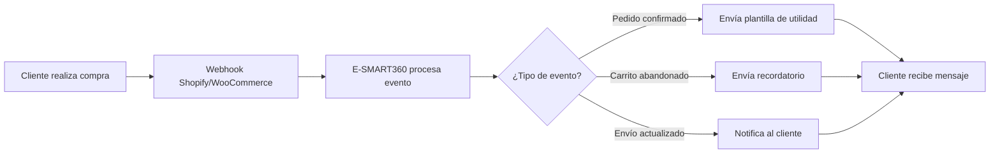

# Cómo Elegir la Mejor Herramienta de Marketing para WhatsApp: Comparativa Completa 2026

**Última actualización: 8 de mayo de 2026**

## Por Qué E-SMART360 es la Mejor Opción para Marketing en WhatsApp

Seleccionar el servicio adecuado puede ser un desafío cuando el mercado te ofrece una abundancia de opciones, ¿verdad? Para ayudarte a elegir con conocimiento de causa, hemos analizado cómo se posicionan las principales herramientas de chatbot del mercado y qué debes buscar en cada una de ellas. A continuación te mostramos cómo se compara E-SMART360 con otras plataformas y por qué es la opción más completa.

> E-SMART360 es un Proveedor de Soluciones de Negocio para WhatsApp verificado por Meta (Meta Business Partner), lo que garantiza el cumplimiento de los más altos estándares de la API oficial de WhatsApp Business.

## Las Ventajas de Usar WhatsApp para Marketing

WhatsApp es utilizado por millones de personas en todo el mundo con fines comerciales y de marketing por su comodidad y efectividad. Desde sus políticas de seguridad y privacidad, WhatsApp se destaca como una de las plataformas de redes sociales más seguras y protegidas. Ahora ha brindado la comodidad de administrar negocios de comercio electrónico en WhatsApp mediante el lanzamiento de WhatsApp Business, y su uso se ha masificado enormemente.

Puedes hacer broadcasting en WhatsApp y administrar tu negocio integrando el catálogo de WhatsApp y WhatsApp Flows, entre otras funcionalidades. Aquí te contamos cómo puedes maximizar el potencial de tu negocio integrando WhatsApp Business con software de chatbot verificado por Meta, y también cuál puede ser la mejor opción para tu negocio de comercio electrónico entre todo el software de chatbot para WhatsApp.

> **Dato clave:** Al integrar WhatsApp Business con E-SMART360 puedes potenciar tus esfuerzos de marketing en WhatsApp, mejorar las conversiones de clientes y optimizar la experiencia de compra, sin importar la categoría de tu negocio.

Estas son muchas de las ventajas de WhatsApp Business: es conveniente, rápido, seguro y confiable. Por otro lado, al integrar WhatsApp Business con E-SMART360 puedes llevar tus esfuerzos de marketing en WhatsApp al siguiente nivel, mejorar las tasas de conversión y mejorar la experiencia de compra general de tus usuarios. Esta guía explorará las funciones transformadoras de E-SMART360 y cómo se posiciona como el mejor software de marketing de WhatsApp para 2026. También te instruiremos sobre cómo utilizar las potentes funciones de E-SMART360. Siguiendo estas estrategias, podrás ajustar tus esfuerzos de marketing en WhatsApp, mejorar tu servicio al cliente y potenciar su experiencia de compra.

## Integración de Marketing en WhatsApp con E-SMART360

## Verificado por Meta: Integración con la API de WhatsApp Business

Después de conocer las diferencias de precios y funciones, quizás te preguntes qué puede ser lo más adecuado para tu negocio. El propósito de esta guía detallada es aclarar estas ideas y determinar qué chatbot puede adaptarse mejor a las necesidades individuales y empresariales.

E-SMART360 es un tipo de software que, sorprendentemente, es ideal tanto para uso personal (un pequeño negocio propiedad de una sola persona), como para medianas empresas e incluso grandes corporaciones. Los precios y paquetes están estructurados para que sea un software para todo tipo y tamaño de negocio. Lo que lo hace más atractivo es que es un Proveedor de Soluciones de Negocio para WhatsApp verificado por Meta. E-SMART360 es un socio de Meta y trabaja con la API de WhatsApp Business. Está cifrado de extremo a extremo. E-SMART360 ofrece algunas de las funciones más convenientes para el marketing de WhatsApp, además de las características propias de WhatsApp Business.

E-SMART360 utiliza la potencia y confiabilidad de la API de WhatsApp Business y maximiza sus beneficios incorporando automatización del servicio al cliente, automatización de chats, automatización de tareas, etc. Aprendamos ahora cómo comenzar con E-SMART360 para la automatización en WhatsApp.

### Crear y Configurar tu Propia API de WhatsApp Business

Para disfrutar de la mayoría de las funciones y capacidades de la API de WhatsApp Business, debes configurar tu API en la nube de WhatsApp, y es completamente gratis. El proceso consta de unos pocos pasos sencillos:

### Configurar tu App en Meta Developer

Accede al sitio de desarrolladores de Meta y crea una nueva aplicación. Selecciona el producto WhatsApp y configura los ajustes básicos.

### Generar un Token de Acceso

Desde el panel de Meta Developer, genera un token de acceso temporal para comenzar a enviar mensajes de prueba.

### Configurar Webhooks

Configura los webhooks para recibir mensajes entrantes y actualizaciones de estado en tu servidor o directamente dentro de E-SMART360.

### Verificar tu Número de Teléfono

Verifica el número de teléfono que usarás para WhatsApp Business. Este paso es obligatorio para activar la cuenta.

### Cambiar la App a Modo Producción

Una vez que todo esté funcionando correctamente, cambia el modo de la aplicación a "Live" para comenzar a enviar mensajes a usuarios reales.

### Conectar con E-SMART360

Finalmente, conecta tu API configurada con E-SMART360 a través del panel de integraciones. Desde allí podrás gestionar todas las conversaciones y campañas.

> E-SMART360 ofrece soporte gratuito para la configuración de la API de WhatsApp Business y la verificación empresarial para principiantes. Una persona sin conocimientos técnicos también puede comenzar sin enfrentar complicaciones técnicas.

## E-SMART360: Transformando el Marketing en WhatsApp con Funciones Avanzadas

### Marketing en WhatsApp con E-SMART360

Si piensas que E-SMART360 es solo otro software de WhatsApp, puede que no estés en lo cierto. Es una de las plataformas más confiables diseñadas para mejorar cada aspecto del marketing en WhatsApp. Puedes mantenerte siempre al tanto de tus campañas de marketing. Las capacidades de E-SMART360 en mensajería masiva de WhatsApp y participación del cliente son excepcionales.

A continuación, exploramos las funciones de E-SMART360 como software de marketing para WhatsApp.

### Características Clave

- **Notificaciones de Carrito Abandonado**: Puedes recuperar carritos abandonados en Shopify y WooCommerce enviando notificaciones para recordar a los usuarios que completen su compra. Esta es una de las formas clásicas de aumentar los ingresos.
- **Recordatorios de Eventos**: Puedes enviar recordatorios oportunos para mantener a los clientes comprometidos, ya sea mediante mensajes en secuencia o broadcasting masivo.
- **Experiencia de Compra Integral**: Tus usuarios pueden comprar y pagar directamente en WhatsApp desde el Catálogo de WhatsApp. Puedes agregar métodos de pago, personalizar precios y variaciones de productos según tu preferencia.
- **Participación del Cliente**: Para una atención al cliente más exclusiva, puedes automatizar respuestas configurando mensajes de bienvenida, rompehielos y comandos. Puedes crear un bot personalizado que cubra todas las consultas necesarias de forma primaria.

### Conversión y Ventas

- **Conversión de Clientes**: Envía mensajes dirigidos para convertir leads en clientes de manera efectiva. Puedes obtener información mediante "flujos de entrada de usuario", campos personalizados o WhatsApp Flows, que se almacena en el administrador de suscriptores, y luego enviar mensajes dirigidos para convertir suscriptores generales en clientes.
- **Software de Marketing Masivo en WhatsApp**: La mensajería masiva de WhatsApp se facilita con E-SMART360. Puedes realizar broadcasting ilimitado en WhatsApp para tus clientes. Este sistema admite formato de video, imagen, archivo y texto, asegurando que tus mensajes sean atractivos y completos. Puedes automatizar el marketing en WhatsApp programando tus mensajes de broadcast.

### Automatización y Análisis

- **Importación de Contactos**: Importa fácilmente los contactos de tus clientes desde el administrador de suscriptores y utilízalos en tus campañas de marketing.
- **Mensajes Programados y Personalizados**: La función de auto-respuesta de E-SMART360, mediante su chatbot automatizado con IA activo 24/7, aumenta la participación del cliente. Este chatbot con IA aumenta la tasa de respuesta y garantiza que ninguna consulta del cliente quede sin respuesta. El envío de mensajes plantilla preaprobados también puede ahorrar tiempo.
- **Analíticas Avanzadas**: La plataforma ofrece analíticas avanzadas para WhatsApp, Messenger, Instagram y Telegram, proporcionando información sobre cantidad de bots, secuencias, widgets de chat, flujos de entrada, crecimiento de suscriptores, resumen de broadcasts y más. Estos datos son importantes para perfeccionar tus estrategias de marketing y mejorar el ROI.

### Seguridad y Equipo

- **Seguro y Confiable**: E-SMART360 mantiene la seguridad al trabajar con la API oficial de WhatsApp Business. Al ser un negocio verificado por Meta, una vez realizada la verificación empresarial, es casi cien por ciento seguro.
- **Integración y Automatización de API**: Con una potente integración de API, E-SMART360 se integra con plataformas como Shopify y WooCommerce, permitiendo la recuperación de carritos abandonados, notificaciones de pedidos y mejora de la experiencia de compra. Se integra con Zapier, formularios web y diferentes métodos de pago mediante webhook workflow.
- **Bandeja de Entrada Compartida**: E-SMART360 te brinda la comodidad de una bandeja de entrada compartida en el chat en vivo. Múltiples agentes pueden colaborar en equipo para mantener y apoyar la interacción con el cliente. Los agentes pueden ser asignados a diferentes chats y solo verán las conversaciones asignadas.

### Funciones Extra

- **Ubicación de Google**: Puedes recopilar la ubicación real de Google de los usuarios mediante el botón de ubicación para preferencias de entrega.
- **Verificación de Pedidos COD**: Puedes verificar pedidos COD de Shopify y WooCommerce mediante Webhook Workflow de E-SMART360.
- **Traductor de Idiomas**: Puedes traducir mensajes de usuario directamente desde el Chat en Vivo mediante el Traductor de Idiomas.

### Cómo Usar E-SMART360 como Software de Mensajería Masiva en WhatsApp

E-SMART360 simplifica el proceso de uso como software de mensajería masiva en WhatsApp. El sistema de broadcasting está diseñado para que puedas llegar a todos tus contactos de forma eficiente y segura, respetando los límites y políticas de la API oficial.

> **¿Quieres aprender más sobre mensajería masiva?** Consulta nuestra guía completa sobre "Cómo enviar mensajes masivos en WhatsApp sin ser bloqueado", donde explicamos paso a paso cómo configurar campañas de broadcasting que respetan los límites de la API de WhatsApp y mantienen una alta calidad de entrega.

## Chatbots con IA Ofrecidos por E-SMART360

Las funciones de IA en E-SMART360 lo han convertido en uno de los mejores softwares para marketing en WhatsApp. Analicemos lo que ofrece a los usuarios:

### E-SMART360 como uno de los Mejores Chatbots con IA para WhatsApp

Puedes mejorar tu servicio al cliente creando chatbots avanzados con IA en E-SMART360. Puedes proporcionar el prompt necesario en la respuesta de IA y el bot responderá con información relevante. Es como entrenar tu propio chatbot con IA. También cuenta con una función de reescritura de IA implementada en la sección de Chat en Vivo. Puedes reescribir tu mensaje de manera pulida y más profesional con esta función.

> **Entrena tu propio asistente:** E-SMART360 te permite entrenar a tu agente de IA con FAQ, URLs, archivos, APIs HTTP y Google Sheets. Esto significa que puedes alimentar a tu chatbot con toda la información de tu negocio para que responda de forma precisa y contextual a cada cliente.

### E-SMART360: Lo Mejor entre Plataformas de Chatbot Gratuitas y Premium

El mejor software de WhatsApp depende de las necesidades individuales y el tipo de negocio. Sin embargo, para ajustarse a tu presupuesto y necesidades, primero debes evaluar el precio y las funciones de los diferentes chatbots de WhatsApp. A veces puede ser difícil comenzar con un paquete que no sea rentable.

> E-SMART360 ofrece un plan gratuito que cubre 10,000 mensajes cada mes, de los cuales 5,000 son para broadcasting. Obtienes un límite de 1,000 suscriptores en el plan gratuito y puedes seguir usándolo sin asumir ningún costo. ¿Podrías imaginar realmente administrar tu pequeño negocio con costo cero? E-SMART360 lo hizo posible.

### Funcionalidad Multicanal

Uno de los mayores puntos a favor de E-SMART360 es que tiene un sistema de integración multicanal. Aunque es un software de chatbot dedicado a WhatsApp, también tiene funcionalidades de chatbot para Messenger e Instagram, chatbot para Telegram y funciones de gestión de grupos, entre otras. Próximamente se implementarán más funciones como la automatización de comentarios en Facebook e Instagram.

### Canales Disponibles

- WhatsApp Business API
- Facebook Messenger
- Instagram DM
- Telegram
- Chat Web
- Próximamente: automatización de comentarios en Facebook e Instagram

### Integraciones Principales

- Shopify y WooCommerce
- Zapier y Pabbly
- Google Sheets
- Formularios web (WPForms, Google Forms, Elementor)
- Pasarelas de pago (PayPal, Stripe, Razorpay)
- API HTTP y Webhooks

## ¿Por Qué Elegir E-SMART360 para Marketing en WhatsApp?

### Asequible y Confiable

E-SMART360 es una de las mejores herramientas de marketing de WhatsApp, ofreciendo un software de marketing asequible con prueba gratuita. Proporciona una solución rentable para pequeñas empresas que buscan usar WhatsApp para marketing de manera más económica.

### Solución White Label

No muchos softwares de marketing de WhatsApp ofrecen solución White Label, pero E-SMART360 sí. Puedes tener tu propio negocio de software como servicio bajo tu propia marca y dominio. E-SMART360 también es personalizable ya que implementó CSS personalizado recientemente.

### Solución Verificada por Meta

Como Proveedor de Soluciones de Negocio para WhatsApp verificado por Meta y Socio de Negocio de Meta, E-SMART360 garantiza la conformidad con los más altos estándares de las funciones de la API de WhatsApp para empresas, ofreciendo una plataforma confiable y segura para tus necesidades de marketing en WhatsApp.

### Integración con Herramientas CRM

E-SMART360 se integra con diversas herramientas CRM, como Zapier, mejorando su funcionalidad como software de marketing de WhatsApp. Esta integración permite organizar bien las herramientas de servicio al cliente, la recuperación de carritos y los recordatorios de eventos, contribuyendo a una mejor experiencia general del cliente.

### Soporte al Cliente

E-SMART360 ofrece indudablemente el mejor soporte al cliente. Cuenta con una sección activa de Chat en Vivo, gestionada por chatbots automatizados y agentes humanos. E-SMART360 tiene un sistema de tickets de soporte para resolver problemas técnicos en nombre de los clientes. Cuenta con un foro y comunidad activos donde los usuarios pueden reunirse y discutir temas importantes.

### ¿Qué incluye el soporte de E-SMART360?

- Chat en vivo 24/7 con atención automatizada y humana
- Sistema de tickets para soporte técnico
- Comunidad y foro activo para discusión entre usuarios
- Base de conocimientos con guías detalladas
- Videos tutoriales paso a paso
- Soporte para configuración de API de WhatsApp Business

## Cómo Elegir un Software de Marketing para WhatsApp

Al seleccionar tu software de marketing de WhatsApp, considera las funciones de la API de WhatsApp y las soluciones de negocio verificadas por Meta. Estos aspectos garantizan una plataforma potente y segura para administrar tus campañas de marketing. Además, estos factores pueden ayudarte:

### Comparación de Herramientas de Chatbot para WhatsApp

Compara el mejor software entre los chatbots con IA para servicio al cliente. Presta atención a sus funciones, automatización, precios flexibles, conveniencia del plan gratuito, capacidades de integración, todo lo que pueda convertirlo en la opción preferida para tu modelo de negocio.

### Características a Buscar

Al evaluar herramientas de chatbot para WhatsApp, busca funciones como:

### Funcionalidad Multicanal

El software debe soportar múltiples canales de mensajería (WhatsApp, Messenger, Instagram, Telegram) para que puedas gestionar todas tus comunicaciones desde un solo lugar.

### Sistema de Gestión de Clientes

Debe incluir un administrador de suscriptores con capacidad de importar contactos, crear segmentos, añadir campos personalizados y etiquetas para organizar tu audiencia.

### Analíticas Avanzadas

Busca paneles de control que muestren métricas clave: crecimiento de suscriptores, rendimiento de broadcasts, tasas de clics, conversiones y más.

### Automatización con IA

El chatbot debe tener capacidades de IA para responder preguntas automáticamente, entrenarse con tu contenido y mejorar con el tiempo.

### Integraciones y API

Debe conectarse con tus herramientas existentes: CRM, plataformas de e-commerce, formularios web y pasarelas de pago.

E-SMART360 ofrece todas estas funciones, lo que lo convierte en una plataforma sólida para la automatización del marketing en WhatsApp y el servicio al cliente.

### Pros y Contras

Si bien E-SMART360 ofrece muchas ventajas, como soluciones asequibles y funciones avanzadas, también es esencial considerar las limitaciones si las hubiera. Esto aplica para cualquier software que puedas estar considerando. Una visión equilibrada de los pros y los contras de las herramientas de chatbot populares te ayudará a tomar una decisión informada.

### ✅ Ventajas de E-SMART360

- Plan gratuito con 10,000 mensajes/mes
- Verificado por Meta (Business Partner)
- Solución White Label disponible
- Chatbot con IA entrenable
- Multicanal (WhatsApp, Messenger, Instagram, Telegram)
- Integración con Shopify, WooCommerce, Zapier
- Bandeja de entrada compartida para equipos
- Soporte al cliente excepcional
- Foro activo con respuesta rápida de desarrolladores

### 📋 A Considerar

- Como cualquier plataforma, requiere tiempo de aprendizaje inicial
- Algunas funciones avanzadas están en planes premium
- La verificación empresarial con Meta puede tomar tiempo
- Las integraciones personalizadas pueden requerir conocimientos técnicos

Un atributo positivo de E-SMART360 es que tiene un foro activo donde los miembros publican todas sus solicitudes de funciones e informes de errores, y son atendidos casi de inmediato por los desarrolladores. Así que asegúrate de que, si algo parece ser un contratiempo para el software que elijas, tengas la opción de contactarlos y que sean receptivos.

## Mejores Prácticas para Broadcasting en WhatsApp

Para garantizar que tus campañas de marketing en WhatsApp sean efectivas y cumplan con las políticas de la plataforma, sigue estas mejores prácticas:

### Permisos de Broadcasting

E-SMART360 te permite enviar los siguientes tipos de mensajes a través de la API oficial:

- Mensajes promocionales
- Notificaciones transaccionales
- Actualizaciones y mensajes de seguimiento
- Comunicaciones no transaccionales

### Consentimiento del Usuario

> **Requisito fundamental:** Los usuarios deben proporcionar consentimiento explícito antes de recibir mensajes de marketing. E-SMART360 facilita múltiples métodos de obtención de consentimiento:
- Casillas de verificación en páginas de aterrizaje
- Campañas de opt-in por SMS
- Recopilación de consentimiento por correo electrónico

Gracias a la API de WhatsApp Business, puedes enviar broadcasts a usuarios que no tienen guardado tu número, siempre y cuando tengas su consentimiento previo.

### Protección de la Calidad y del Número

Para evitar bloqueos y mantener una alta calificación de calidad:

- Mantén interacciones de mensajes de alta calidad
- Evita el contenido promocional excesivo
- Respeta las preferencias del usuario
- Monitorea las métricas de participación

> **Señales de advertencia:** Disminución en la calificación de calidad, altas tasas de bloqueo por parte de usuarios y falta frecuente de participación son indicadores de que debes ajustar tu estrategia de mensajería.

### Directrices para Mensajes Plantilla

Los mensajes plantilla requieren aprobación de WhatsApp y pueden incluir:

- URLs
- Botones de llamada a la acción (CTA)
- Opciones de respuesta rápida

**Límites de botones:** Máximo 3 botones por plantilla, con límite de 20 caracteres por botón. Soporte para contenido multimedia (imágenes, videos, documentos).

### ¿Qué tipos de plantillas puedes crear en E-SMART360?

- **Plantillas de marketing:** Para promociones, ofertas y campañas
- **Plantillas de utilidad:** Para notificaciones de pedidos, actualizaciones de cuenta y confirmaciones
- **Plantillas de carrusel:** Múltiples productos o servicios en un solo mensaje interactivo
- **Plantillas multimedia:** Con imágenes, videos o documentos adjuntos
- **Plantillas con variables personalizadas:** Para personalizar cada mensaje con el nombre del cliente, fecha, etc.

### Estrategias de Interacción con el Usuario

- Personaliza los mensajes
- Proporciona valor real
- Respeta las preferencias de opt-in
- Monitorea las métricas de participación

> **Consejo clave:** La personalización marca la diferencia. Utiliza campos personalizados y variables para incluir el nombre del cliente, su última compra o sus intereses específicos en cada mensaje. Esto aumenta significativamente las tasas de apertura y conversión.

## Casos de Uso Prácticos

### 📦 Recuperación de Carritos Abandonados

**Problema:** Un cliente agregó productos al carrito en tu tienda Shopify pero no completó la compra.

**Solución con E-SMART360:**
1. El webhook de Shopify notifica a E-SMART360 sobre el carrito abandonado
2. El sistema envía automáticamente un recordatorio personalizado por WhatsApp con los productos y el enlace de pago
3. Si no hay respuesta en 24 horas, se envía un segundo recordatorio con un código de descuento

**Resultado:** Tasas de recuperación de hasta un 30% en carritos abandonados.

### 📅 Campaña de Lanzamiento de Producto

**Problema:** Necesitas anunciar un nuevo producto a tus clientes más fieles.

**Solución con E-SMART360:**
1. Segmenta tu lista de suscriptores por frecuencia de compra
2. Crea una plantilla de marketing con imágenes del producto y un botón CTA
3. Programa el envío para una fecha y hora específicas
4. Los clientes hacen clic y son dirigidos directamente a la página de compra

**Resultado:** Campañas con tasas de clics del 15-25% gracias a la mensajería personalizada.

### 🏪 Venta Directa desde Catálogo

**Problema:** Quieres que los clientes puedan ver y comprar productos sin salir de WhatsApp.

**Solución con E-SMART360:**
1. Configura tu catálogo de productos sincronizado con tu tienda online
2. Los clientes navegan por categorías y productos directamente en el chat
3. Seleccionan variantes (talla, color) y realizan el pago sin salir de WhatsApp
4. Reciben confirmación del pedido y actualizaciones de envío

**Resultado:** Experiencia de compra sin fricciones que aumenta la conversión.

### 🎯 Atención al Cliente con IA

**Problema:** Tu equipo de soporte recibe cientos de consultas repetitivas diariamente.

**Solución con E-SMART360:**
1. Entrena al chatbot con IA usando tus FAQ, documentación y URLs
2. El chatbot responde automáticamente preguntas frecuentes 24/7
3. Las consultas complejas se escalan automáticamente a agentes humanos
4. Los agentes ven el historial completo de la conversación para continuar sin fricción

**Resultado:** Reducción del 70% en carga de trabajo del equipo de soporte.

## Preguntas Frecuentes

### ¿Puedo enviar mensajes a usuarios que no han interactuado antes con mi negocio?

Sí, pero solo si has obtenido su consentimiento explícito previamente. La API de WhatsApp Business permite enviar mensajes a usuarios que no tienen tu número guardado, siempre que hayan optado voluntariamente (por ejemplo, marcando una casilla en tu sitio web o durante el proceso de registro). E-SMART360 te ayuda a gestionar y documentar estos consentimientos correctamente.

### ¿Qué hace que la calificación de calidad de mi número disminuya?

Varios factores pueden reducir tu calificación de calidad: tasas altas de bloqueo por parte de usuarios, envío de mensajes no solicitados sin consentimiento, contenido promocional excesivo sin valor real, bajas tasas de interacción (apertura/clics) y denuncias de spam. E-SMART360 monitorea tu calidad y te alerta antes de que se convierta en un problema.

### ¿Cuántos botones puedo incluir en un mensaje plantilla de WhatsApp?

Puedes incluir hasta 3 botones por plantilla, con un límite de 20 caracteres por botón. Los botones pueden ser de tipo "Llamada a la acción" (enlace web o número telefónico) o "Respuesta rápida". Además, las plantillas pueden contener imágenes, videos o documentos para enriquecer el mensaje.

### ¿E-SMART360 ofrece un plan gratuito y qué incluye?

Sí, E-SMART360 ofrece un plan gratuito que incluye 10,000 mensajes por mes (5,000 para broadcasting), límite de 1,000 suscriptores y acceso a las funciones básicas de chatbot y automatización. Es perfecto para pequeñas empresas que están comenzando con el marketing en WhatsApp sin inversión inicial.

### ¿Puedo usar E-SMART360 con mi propia marca (White Label)?

Sí, E-SMART360 ofrece solución White Label, lo que significa que puedes usar tu propio nombre de marca y dominio. Esto es ideal para agencias y revendedores que quieren ofrecer servicios de chatbot y marketing en WhatsApp bajo su propia marca. Además, recientemente se implementó soporte para CSS personalizado.

### ¿Cuál es la diferencia entre la API de WhatsApp Business y la aplicación WhatsApp Business?

La aplicación WhatsApp Business es la versión gratuita para pequeños negocios con funciones limitadas y sin capacidad de integración avanzada. La API de WhatsApp Business (Cloud API) está diseñada para medianas y grandes empresas, permite integraciones con plataformas como E-SMART360, broadcasting a usuarios que no tienen tu número guardado, mensajes plantilla aprobados por Meta, webhooks y automatización completa.

## Guía Completa para Crear Mensajes Plantilla en WhatsApp

Los mensajes plantilla son esenciales para cualquier estrategia de marketing en WhatsApp, ya que te permiten comunicarte con tus clientes incluso después de que hayan pasado 24 horas desde su última interacción. Son ideales para enviar actualizaciones, confirmaciones y recordatorios.

### Requisitos Previos

Antes de crear tus primeras plantillas, asegúrate de tener:

1. **Una cuenta de WhatsApp Business** conectada a E-SMART360
2. **Acceso a WhatsApp Cloud API** (si planeas sincronizar plantillas desde WhatsApp Manager)
3. **Una idea clara del contenido de tu mensaje**, incluyendo variables, botones o pies de página necesarios

### Pasos para Crear una Plantilla

### Ir al Gestor de Bots

Accede al panel de E-SMART360 y haz clic en **Plantilla de Mensaje** dentro del Gestor de Bots.

### Agregar Variables (Opcional)

Desplázate hasta la sección **Variable de Plantilla**. Haz clic en **Crear**, ingresa un nombre para la variable y guarda. Las variables te permiten personalizar cada mensaje con el nombre del cliente, fecha, número de pedido, etc.

### Crear la Plantilla

Dentro de **Configuración de Plantilla de Mensaje**, haz clic en **Crear** y completa el formulario:
- **Nombre de la Plantilla**: Asígnale un nombre descriptivo
- **Cuerpo del Mensaje**: Escribe tu mensaje e inserta variables si es necesario
- **Texto del Pie de Página** (Opcional)
- **Respuesta Rápida** (Opcional): Selecciona si necesitas opciones predefinidas
- **Texto del Botón**: Agrega texto para botones CTA si lo deseas

### Usar la Plantilla

Antes de usar la plantilla, verifica que su **estado sea aprobado**. Una vez aprobada, puedes usarla para:
- **Broadcasting** (campañas masivas)
- **Chat en vivo** (respuestas manuales de agentes)
- **Mensajes de Shopify y WooCommerce** (notificaciones automatizadas)

### Tipos de Plantillas: Utilidad vs Marketing

Es importante entender la diferencia entre plantillas de utilidad y de marketing, ya que WhatsApp las clasifica y aprueba de manera diferente.

### Plantillas de Utilidad

Son mensajes preaprobados diseñados para actualizaciones transaccionales, como confirmaciones, cambios o suspensiones relacionados con una transacción o suscripción específica. **Deben ser funcionales y no promocionales.**

**Ejemplos:**
- "Tu pedido #12345 ha sido confirmado. Recibirás una actualización de seguimiento pronto."
- "Tu pago de $50 se ha procesado exitosamente. ¡Gracias por tu compra!"
- "Recordatorio: tu cita con el Dr. Gómez está programada para el 15 de marzo a las 10 AM. Responde para confirmar."

> Si una plantilla contiene tanto contenido de utilidad como de marketing, será clasificada como plantilla de marketing.

### Plantillas de Marketing

Ofrecen mayor flexibilidad y se utilizan para mensajes que no están relacionados con una transacción específica. Pueden incluir promociones, ofertas, mensajes de bienvenida, actualizaciones, invitaciones, recomendaciones o solicitudes de participación.

**Ejemplos:**
- "¡Oferta exclusiva! Obtén un 20% de descuento en tu próxima compra. Usa el código AHORRO20."
- "Te extrañamos. ¡Disfruta de envío gratis en tu próximo pedido! Toca abajo para comprar ahora."
- "Únete a nuestro próximo seminario web sobre tendencias de marketing digital. ¡Regístrate ahora!"

## Estrategia Avanzada: Segmentación y Automatización

Una vez que dominas la mensajería masiva y las plantillas, el siguiente nivel es la segmentación inteligente de tu audiencia. E-SMART360 te permite crear segmentos de clientes basados en:

### Criterios de Segmentación

- **Comportamiento de compra**: Frecuencia, productos comprados, valor del pedido
- **Nivel de participación**: Clientes activos vs. inactivos, tasa de apertura de mensajes
- **Datos demográficos**: Ubicación, idioma, preferencias
- **Etapa del ciclo de vida**: Nuevos suscriptores, clientes recurrentes, clientes VIP

> **Estrategia recomendada:** Crea un flujo de automatización que envíe mensajes diferentes según la etapa del cliente. Por ejemplo:
- Día 1: Mensaje de bienvenida con oferta de primer pedido
- Día 7: Recomendación de productos basada en su navegación
- Día 30: Encuesta de satisfacción con incentivo
- Día 60: Oferta especial para clientes recurrentes

### Automatización con Webhooks y APIs

E-SMART360 se integra con cientos de aplicaciones a través de webhooks y APIs, permitiéndote automatizar flujos de trabajo completos:

## Tabla Comparativa de Funciones

Para ayudarte a evaluar rápidamente lo que ofrece E-SMART360, aquí tienes un resumen de las capacidades principales:

| Función | Plan Gratuito | Plan Básico | Plan Premium | White Label |
|---------|:------------:|:-----------:|:------------:|:-----------:|
| Mensajes por mes | 10,000 | 50,000 | Ilimitado | Ilimitado |
| Broadcasting | 5,000 | 25,000 | Ilimitado | Ilimitado |
| Suscriptores | 1,000 | 5,000 | Ilimitado | Ilimitado |
| Chatbot con IA | ✓ | ✓ | ✓ | ✓ |
| Plantillas personalizadas | ✓ | ✓ | ✓ | ✓ |
| Integración Shopify/WooCommerce | ✗ | ✓ | ✓ | ✓ |
| Bandeja de entrada compartida | ✗ | ✓ | ✓ | ✓ |
| Analíticas avanzadas | Básicas | Avanzadas | Completas | Completas |
| API y Webhooks | ✓ | ✓ | ✓ | ✓ |
| Soporte prioritario | ✗ | ✗ | ✓ | ✓ |
| Marca personalizada (White Label) | ✗ | ✗ | ✗ | ✓ |
| CSS personalizado | ✗ | ✗ | ✗ | ✓ |

## Migración desde Otras Plataformas

Si ya estás usando otra herramienta de marketing en WhatsApp, migrar a E-SMART360 es un proceso sencillo:

### Exporta tus Contactos

Desde tu plataforma actual, exporta tu lista de contactos y suscriptores en formato CSV o Excel.

### Importa a E-SMART360

Usa el administrador de suscriptores de E-SMART360 para importar tus contactos. Puedes hacerlo manualmente, mediante CSV o conectando Google Sheets.

### Configura tus Plantillas

Crea las plantillas de mensajes que utilizabas en tu plataforma anterior directamente en E-SMART360 y espera la aprobación de WhatsApp.

### Conecta tus Integraciones

Vincula tus cuentas de Shopify, WooCommerce, Zapier y otras herramientas mediante las integraciones nativas de E-SMART360.

### Transfiere tus Automatizaciones

Recrea tus flujos de automatización (mensajes de bienvenida, carritos abandonados, secuencias) en el Gestor de Bots de E-SMART360.

> **¿Tienes dudas sobre la migración?** El equipo de soporte de E-SMART360 te guiará en todo el proceso sin costo adicional. Abre un ticket desde el panel y te asignaremos un especialista.

## Limitaciones y Consideraciones Técnicas

### Límites de Mensajería de WhatsApp

Meta impone límites de mensajería basados en la calificación de calidad de tu número telefónico:

- **Tier 1 (Alta calidad)**: Hasta 250,000 conversaciones abiertas por día
- **Tier 2 (Calidad media)**: Límites reducidos hasta que mejore la calidad
- **Tier 3 (Calidad baja)**: Restricción severa o suspensión temporal

Para mantener una alta calificación:
1. Envía mensajes relevantes y esperados por el usuario
2. Mantén baja la tasa de bloqueos (idealmente < 0.5%)
3. Gestiona adecuadamente los opt-outs y bajas voluntarias
4. Revisa las analíticas de calidad semanalmente

### Ventana de 24 Horas

WhatsApp permite enviar mensajes libremente dentro de una ventana de 24 horas desde el último mensaje enviado por el usuario. Fuera de esta ventana, solo puedes usar mensajes plantilla aprobados. E-SMART360 gestiona automáticamente esta ventana para que siempre sepas cuándo puedes enviar mensajes libres y cuándo necesitas usar plantillas.

## Preguntas Frecuentes (Continuación)

### ¿Cómo puedo importar mis contactos a E-SMART360?

Puedes importar contactos de tres formas: 1) Manualmente desde el panel de administrador de suscriptores, 2) Mediante archivo CSV con todos los campos personalizados que necesites, 3) Conectando Google Sheets para sincronización automática. El sistema detecta duplicados y actualiza la información existente automáticamente.

### ¿Qué pasa si una plantilla es rechazada por WhatsApp?

Si una plantilla es rechazada, WhatsApp proporciona una razón específica (generalmente relacionada con contenido promocional excesivo, falta de claridad o incumplimiento de políticas). Revisa la razón, ajusta el contenido y vuelve a enviarla. E-SMART360 te muestra el estado y las razones de rechazo directamente en el panel.

### ¿Puedo programar campañas de broadcasting para fechas futuras?

Sí, E-SMART360 incluye un programador de broadcasts. Puedes crear tu campaña, seleccionar los segmentos de audiencia, redactar el mensaje y elegir la fecha y hora exacta de envío. El sistema se encargará del resto.

### ¿E-SMART360 soporta mensajes con carrusel de productos?

Sí, E-SMART360 soporta plantillas de carrusel que permiten mostrar múltiples productos o servicios en un solo mensaje interactivo. El usuario puede deslizar horizontalmente para ver cada elemento y hacer clic para obtener más información o realizar una compra.

### ¿Cómo gestiono las bajas voluntarias (opt-outs) de mis suscriptores?

E-SMART360 maneja automáticamente las bajas voluntarias. Cuando un usuario responde con palabras como "BAJA", "STOP" o "NO MÁS MENSAJES", el sistema lo detecta y lo excluye automáticamente de futuras campañas de broadcasting, respetando las regulaciones de privacidad.

## En Resumen

E-SMART360 es, sin duda, una solución premium para el marketing en WhatsApp. Ofrece un conjunto completo de funciones creadas para mejorar la participación del cliente y los esfuerzos de marketing. Desde chatbots impulsados por IA hasta software de marketing seguro y confiable, E-SMART360 proporciona las herramientas necesarias para campañas de marketing exitosas en WhatsApp.

Ya sea que busques importar contactos de clientes, programar la entrega de mensajes u observar analíticas avanzadas, E-SMART360 te brinda una experiencia detallada y fácil de usar. También es famoso por su interfaz de usuario amigable. Su condición de Proveedor de Soluciones de Negocio para WhatsApp verificado por Meta destaca aún más su confiabilidad y efectividad en el sector del marketing digital.

> **¿Listo para transformar tu marketing en WhatsApp?** Comienza hoy con el plan gratuito de E-SMART360 y descubre por qué miles de empresas confían en nuestra plataforma para impulsar sus ventas y mejorar la atención al cliente.

---

> *Esta guía se actualiza periódicamente para reflejar los cambios en la API de WhatsApp Business y las nuevas funciones de E-SMART360. Última revisión: mayo 2026.*

### Recursos Adicionales

- 📖 **Guía de Broadcasting**: Aprende a configurar campañas masivas efectivas paso a paso
- 🎓 **Tutoriales en Video**: Accede a nuestra biblioteca de videos formativos
- 💬 **Comunidad**: Únete al foro de E-SMART360 para compartir experiencias y resolver dudas
- 🆘 **Soporte Técnico**: Abre un ticket para recibir asistencia personalizada

---

*E-SMART360 — Tu plataforma integral para marketing y automatización en WhatsApp, verificado por Meta Business Partners.*
