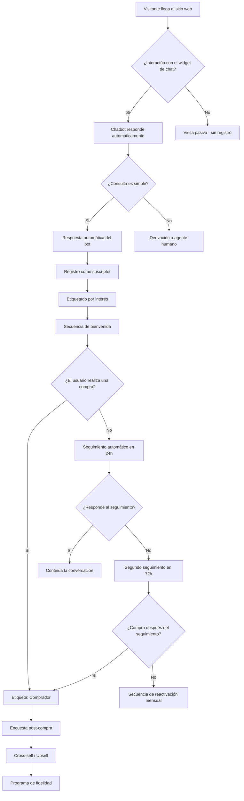

> El marketing con chatbot en WhatsApp te permite convertir conversaciones en ventas combinando inteligencia artificial con mensajería automatizada. En esta guía aprenderás todo lo que necesitas saber para implementarlo con éxito.

El marketing con chatbot en WhatsApp ayuda a las empresas a convertir conversaciones en ingresos combinando chatbots de atención al cliente impulsados por IA con mensajería automatizada. Con herramientas como un chatbot de marketing conversacional, las empresas pueden brindar atención al cliente las 24 horas del día, los 7 días de la semana, responder preguntas al instante y guiar a los clientes a lo largo del proceso de compra. Esto mejora la tasa de conversión en el comercio electrónico al reducir el tiempo de respuesta y mantener a los clientes comprometidos.


> Las empresas también pueden usar un chatbot de IA para captura de leads e incluso aprender a integrar un chatbot con un CRM para la captura de clientes potenciales, de modo que cada conversación se convierta en una oportunidad de venta. Mediante la automatización de chatbots para la participación del cliente, las empresas pueden dar seguimiento automático a prospectos, nutrir leads y convertir más visitantes en clientes de pago. Esto convierte al marketing con chatbot en una de las estrategias con mejor retorno de inversión para los negocios digitales modernos.

Entre muchas otras plataformas de mensajería instantánea, WhatsApp es, por mucho, la aplicación de mensajería más popular del planeta. Tiene millones de usuarios a nivel mundial, con atractivo en todos los grupos de edad y datos demográficos. No solo las personas se benefician de esta plataforma, sino también las empresas.


> **Guía actualizada (2026-05-08)**
> Esta guía se ha actualizado con la información más reciente sobre marketing con chatbots en WhatsApp, incluyendo nuevas funcionalidades de broadcasting automatizado y flujos de conversación.

La cantidad de usuarios de mensajería instantánea es enorme hoy en día, y están ansiosos por utilizarla para interactuar con sus amigos, familiares e incluso empresas. Como resultado, las empresas están aprovechando esta tendencia para aumentar la satisfacción del cliente y brindar una mejor experiencia general. Gracias a esta tendencia, el marketing en WhatsApp se ha consolidado como el enfoque principal para promocionar una marca y establecer conexiones con los consumidores.

Existen varios métodos de marketing, pero el marketing con chatbots se está volviendo cada vez más popular. Por lo tanto, el chatbot de WhatsApp es una herramienta imprescindible entre las soluciones de marketing para el servicio al cliente.

## ¿Por qué deberíamos usar marketing con chatbot de WhatsApp para los negocios?


> Los clientes en la era digital quieren que las empresas respondan rápidamente. Esto aplica a cualquier negocio, incluyendo retail, finanzas y logística. Una respuesta ágil aumenta la lealtad del cliente al hacerlo sentir valorado e importante.

Los clientes pueden tener varias preguntas sobre tu producto o servicio. Imagina que tienes un sitio web de reservas de hoteles. Algunas de las preguntas más típicas que tus clientes pueden tener son sobre precios de habitaciones, reservas, canales de pago aceptados, políticas de reembolso, etc. Existe el riesgo de que tu audiencia te abandone si no respondes con rapidez.

Aquí es donde un chatbot de WhatsApp resulta útil. Puedes usarlo para automatizar las preguntas frecuentes. Puedes crear flujos únicos para diferentes fases de una conversación. Un bot de WhatsApp también puede automatizar tu flujo de venta cruzada sin necesidad de interacción humana.

El chatbot de WhatsApp puede enviar respuestas de audio, video, imágenes y archivos adjuntos, además de respuestas de texto. También podemos usar plantillas interactivas con botones en las respuestas. Al hacer clic en los botones, el bot puede enviar diferentes tipos de respuestas y redirigir a cualquier URL.


### Identifica las preguntas frecuentes de tus clientes

Haz una lista de las preguntas más comunes que recibes. Por ejemplo: precios, horarios, formas de pago, políticas de devolución, etc.
  
### Agrupa las preguntas por categoría

Organiza las preguntas en categorías: ventas, soporte técnico, facturación, envíos, etc.
  
### Diseña flujos de conversación automatizados

Crea flujos que respondan automáticamente según la categoría. Por ejemplo, si un cliente pregunta por precios, el bot muestra los planes disponibles.
  
### Activa respuestas con botones interactivos

Agrega botones como "Ver precios", "Hablar con un asesor" o "Comprar ahora" para guiar al cliente.
  
## Beneficios del chatbot de WhatsApp

Incluir un chatbot de IA en WhatsApp puede transformar la forma en que tu empresa maneja las interacciones con los clientes. Con un bot inteligente, puedes aumentar el valor del compromiso del cliente proporcionando respuestas oportunas y adecuadas las 24 horas del día.


### Atención 24/7

Los chatbots de WhatsApp responden automáticamente a cualquier hora del día, sin importar fines de semana ni días festivos. Tus clientes siempre recibirán una respuesta inmediata.
  
### Ahorro de tiempo

Automatizar las respuestas a preguntas frecuentes libera a tu equipo de soporte para enfocarse en consultas más complejas que requieren intervención humana.
  
### Mayor conversión

Al responder al instante, reduces la probabilidad de que un cliente potencial abandone el proceso de compra por falta de información.
  
### Personalización escalable

Los chatbots pueden usar datos del cliente para personalizar respuestas, ofrecer productos relevantes y hacer recomendaciones basadas en el comportamiento del usuario.
  
## ¿Cómo empezar con el chatbot de WhatsApp?

Para usar tu cuenta de WhatsApp como un chatbot de IA, debes integrar una solución de chatbot como E-SMART360. Es muy sencillo conectar E-SMART360 a una cuenta de WhatsApp Business.

Para comenzar, regístrate gratuitamente en E-SMART360. Es completamente gratis para los primeros 2,000 suscriptores. E-SMART360 ofrece opciones de creación de bots tanto para WhatsApp como para otras plataformas. Para empezar a construir un bot, conectaremos la API de WhatsApp Business a E-SMART360.


> **¿Qué necesitas para empezar?** Solo necesitas una cuenta de WhatsApp Business (gratuita) y registrarte en E-SMART360. El proceso de conexión toma solo unos minutos y no requiere conocimientos técnicos avanzados.

### Configuración paso a paso


### Regístrate en E-SMART360

Crea una cuenta gratuita. El plan gratuito incluye hasta 2,000 suscriptores sin costo.
  
### Conecta tu cuenta de WhatsApp Business

Ve al panel de integraciones y selecciona WhatsApp. Sigue el proceso de conexión con la API de WhatsApp Business. Necesitarás tu número de teléfono empresarial verificado.
  
### Configura tu primer bot

Usa el constructor visual de flujos para diseñar las respuestas automáticas. Puedes empezar con preguntas frecuentes y luego agregar flujos más complejos.
  
### Prueba el chatbot

Envía mensajes de prueba desde tu teléfono para verificar que el bot responde correctamente. Ajusta los flujos según sea necesario.
  
### Publica y monitorea

Una vez que todo funcione correctamente, activa el bot para todos los usuarios. Monitorea las conversaciones desde el panel de chat en vivo.
  

> **Importante:** Asegúrate de que tu número de teléfono esté verificado en Meta Business Manager antes de intentar conectar la API de WhatsApp Business. Sin esta verificación, no podrás enviar mensajes a los clientes.

## Funcionalidades del chatbot de WhatsApp en E-SMART360

### Widget de chat

Para ganar suscriptores, podemos diseñar un widget de chat y colocarlo en un sitio web. Cuando un usuario envía un mensaje al widget de chat, recibirá una respuesta instantánea y será añadido a tu lista de suscriptores. Podemos enviar cualquier tipo de respuesta, incluyendo imágenes, videos, audio y documentos. También podemos enviar respuestas con botones: cuando los usuarios hacen clic en el botón, reciben la respuesta adecuada o son enviados a otro sitio web.


### ¿Cómo instalar el widget de chat en mi sitio web?

El widget de chat se integra mediante un código JavaScript que se coloca en el `<head>` o antes de cerrar el `</body>` de tu sitio web. Una vez instalado, aparecerá un ícono de chat flotante en tu página. Cuando un visitante hace clic en él, se abre una ventana de chat donde puede escribir su consulta. El chatbot responde automáticamente y el visitante queda registrado como suscriptor.

### Bot de palabras clave o botones de acción

Podemos construir un bot que responda a palabras clave o botones de acción. Es posible enviar diferentes respuestas dependiendo del mensaje recibido por el chatbot. Los clientes siempre aprecian las respuestas rápidas a sus consultas.

#### Cómo crear un chatbot basado en palabras clave


### Accede al Administrador de Bots

Ve al panel de E-SMART360 > Administrador de Bots > Respuesta de Bot > Crear. Aparecerá el lienzo del constructor visual de flujos.
  
### Nombra tu chatbot

Localiza el componente "Iniciar flujo de bot". Haz doble clic para abrir el modal de configuración. Ingresa un nombre reconocible como "Bot de Atención al Cliente".
  
### Configura una palabra clave de activación

En el modal de configuración, ingresa una palabra clave para activar el bot (por ejemplo, "Hola", "Ayuda", "Precio").
    
> Si seleccionas "Coincidencia exacta de palabra clave", el bot solo se activará para esa palabra clave específica. Si seleccionas "Coincidencia de cadena", el bot se activará con cualquier frase que contenga la palabra clave.
    
### Configura el mensaje de respuesta

Arrastra una conexión desde el conector "Siguiente" del flujo de inicio. Selecciona el componente Interactivo. Completa el encabezado, cuerpo y pie del mensaje (el cuerpo del mensaje es obligatorio). Configura un tiempo de retardo si es necesario.
  
### Agrega botones interactivos

Arrastra un conector desde el componente interactivo hacia el lienzo. Aparecerá un componente de botón en línea. Haz doble clic e ingresa el texto del botón. Selecciona una acción para cuando se haga clic (enviar mensaje, iniciar un flujo, abrir una URL, etc.).
  
### Guarda y prueba tu bot

Guarda la configuración. Envía la palabra clave desde tu teléfono para verificar que el bot responde correctamente.
  
### Recopilación de datos de usuario sin formularios

El flujo de entrada de usuario y los campos personalizados ayudan a recopilar datos del usuario y almacenarlos para que podamos utilizarlos cuando queramos. Puede hacer preguntas al usuario y recibir respuestas como lo haría una persona.


> **¿Sabías que...?** Los usuarios prefieren interactuar mediante chat en lugar de llenar formularios tradicionales. El flujo de entrada de WhatsApp permite recopilar datos como correos electrónicos, números de teléfono e información comercial paso a paso dentro de una conversación, mejorando la experiencia del usuario y agilizando la recolección de datos.

#### Pasos para configurar un flujo de entrada de datos


### Crea un chatbot para el flujo de entrada

Ve a Administrador de Bots > Respuesta de Bot > Crear. Nombra tu chatbot (ej: "Flujo de entrada de usuario"). Asigna una palabra clave (ej: "registro") para activar el chatbot.
  
### Agrega el elemento de flujo de entrada de usuario

Arrastra el elemento "User Input Flow" al lienzo para mostrar el elemento de preguntas. Puedes elegir dónde almacenar los datos (Webhook URL o Google Sheets).
  
### Configura las preguntas

**Primera pregunta:** Solicita el correo electrónico del usuario. Tipo de respuesta: Email (validado mediante expresiones regulares).
    **Segunda pregunta:** Pregunta si su negocio está registrado. Tipo de respuesta: Opción múltiple (Sí/No). Puedes guardar la respuesta en un campo personalizado o crear uno nuevo.
  
### Define el almacenamiento de datos

Elige si los datos se enviarán a una URL de webhook, a Google Sheets, o se almacenarán en campos personalizados dentro de E-SMART360 para usarlos posteriormente.
  
### Prueba el flujo completo

Envía la palabra clave desde WhatsApp y verifica que las preguntas aparecen en orden y que las respuestas se guardan correctamente.
  

### ¿Qué tipos de datos puedo recopilar con el flujo de entrada?

Puedes recopilar cualquier tipo de dato: nombre, correo electrónico, número de teléfono, dirección, preferencias de producto, presupuesto, fecha de nacimiento, etc. Cada pregunta puede tener un tipo de respuesta específico: texto libre, email, número, fecha, opción múltiple, sí/no, y más. Los datos se almacenan en campos personalizados que puedes definir tú mismo.

### Respuesta basada en condiciones

Podemos enviar diferentes respuestas a diferentes usuarios según ciertos criterios. Por ejemplo, podemos verificar el género de un usuario y responder en consecuencia. Para usuarios masculinos, el bot responderá de una forma, y para usuarias femeninas, de otra.

Podemos utilizar edad, género u otros datos de campos personalizados en las condiciones para determinar si la condición se cumple o no.


### Ejemplo: Segmentación por género

Un negocio de moda puede mostrar productos masculinos a hombres y productos femeninos a mujeres, todo automáticamente según el dato registrado en el campo personalizado de género.
  
### Ejemplo: Segmentación por ubicación

Un restaurante puede mostrar el menú y promociones según la ciudad del cliente, ofreciendo descuentos locales y horarios específicos para cada sucursal.
  
### Mensajes de secuencia

Los mensajes de secuencia o goteo se envían después de un tiempo específico en el chat del usuario del bot. Esto es beneficioso para volver a involucrar a los clientes en tu negocio. Podemos enviar mensajes de secuencia a los usuarios de forma horaria, diaria o semanal.

Por ejemplo, si un usuario llega a un punto en el chat del bot donde tenemos una secuencia diaria, el usuario recibirá un mensaje de secuencia diaria.


### ¿Qué es un chatbot de seguimiento automático?

Un chatbot de seguimiento automático es un sistema que envía mensajes de recordatorio a los usuarios que han interactuado con tu chatbot pero no han completado una acción, como realizar una compra o registrarse. Ayuda a las empresas a mantenerse comprometidas con los clientes potenciales y mejora las tasas de conversión.
  
  **Beneficios clave:**
  - Ahorra tiempo al automatizar recordatorios
  - Aumenta las ventas y conversiones
  - Asegura que los usuarios no olviden tu oferta
  - Funciona 24/7 sin esfuerzo manual

#### Cómo construir un chatbot de seguimiento automático


### Crea el flujo del chatbot

Ve a E-SMART360 > Administrador de Bots > Respuesta de Bot > Crear. Nombra el chatbot de forma reconocible, como "Bot de seguimiento". Guarda el chatbot y asegúrate de que se active cuando un usuario interactúe con un mensaje relacionado con productos.
  
### Configura mensajes interactivos

Agrega un bloque interactivo a tu chatbot. Crea un mensaje como: _"¿Estarías interesado en nuestro producto?"_ con botones de Sí y No. Si el usuario selecciona Sí, proporciónale un enlace de compra. Si selecciona No, finaliza la conversación u ofrece asistencia.
  
### Aplica etiquetas para rastrear acciones

Cuando un usuario haga clic en "Comprar ahora", aplícale una etiqueta llamada "Comprar ahora". Si el usuario no hace clic en el botón, no recibe esta etiqueta. Usa esta etiqueta para determinar quién necesita un recordatorio de seguimiento.
  
### Configura la secuencia de seguimiento

Arrastra y suelta el conector desde la opción "Suscribir a secuencia" del botón "Comprar ahora" para iniciar una nueva secuencia de seguimiento. Configura que envíe un mensaje de recordatorio si el usuario no compra dentro de 30 minutos (o el tiempo que elijas).
  
### Agrega una condición de verificación

Agrega una condición para hacer seguimiento basado en si seleccionaron o no el botón "Comprar ahora". De esta forma, solo los usuarios que mostraron interés pero no completaron la compra recibirán el recordatorio.
  
### Botones de CTA (Llamada a la acción)

Los botones de CTA en WhatsApp permiten a los usuarios realizar acciones específicas con un solo clic, sin necesidad de escribir nada. Esto mejora significativamente la experiencia del usuario y aumenta las tasas de interacción.

**Tipos de botones disponibles:**

- **Botón de llamada telefónica:** Al hacer clic, inicia una llamada al número configurado
- **Botón de enlace URL:** Redirige al usuario a una página web específica
- **Botón de respuesta rápida:** Envía un mensaje predefinido como respuesta
- **Botón de copia de código:** Copia automáticamente un código de descuento al portapapeles del usuario


### Agrega un componente interactivo

En el constructor de flujos, arrastra un componente "Interactivo" al lienzo. Aquí podrás configurar el mensaje principal y los botones.
  
### Configura los botones

Define hasta 3 botones por mensaje. Para cada botón, ingresa el texto visible y selecciona el tipo de acción:
    - "Hablar con asesor" → Botón de respuesta rápida
    - "Ver promociones" → Botón de enlace URL
    - "Llamar ahora" → Botón de llamada telefónica
  
### Conecta los botones a acciones

Arrastra conectores desde cada botón hacia el siguiente paso del flujo. Por ejemplo, si el usuario hace clic en "Ver promociones", el bot envía un catálogo de productos.
  

> **Consejo:** Usa botones de CTA en lugar de pedir al usuario que escriba palabras clave. Los botones son más intuitivos y generan tasas de conversión hasta 3 veces mayores que las respuestas de texto libre.

### Listas dinámicas en WhatsApp

Las listas dinámicas permiten mostrar opciones seleccionables dentro de un mensaje de WhatsApp, similar a un menú de opciones. Es ideal para guiar al usuario a través de opciones sin que tenga que escribir.

**Usos comunes de las listas dinámicas:**

1. **Menú de categorías de productos:** El usuario selecciona una categoría y el bot muestra los productos disponibles
2. **Selección de sucursal:** El usuario elige la sucursal más cercana para ver horarios y promociones
3. **Menú de soporte:** El usuario selecciona el tipo de ayuda que necesita (facturación, técnico, ventas)
4. **Encuestas rápidas:** El usuario selecciona su nivel de satisfacción de una lista

### WhatsApp Flows (Formularios nativos)

WhatsApp Flows es una funcionalidad avanzada que permite crear formularios interactivos dentro de la conversación de WhatsApp. A diferencia de los mensajes tradicionales, los Flows pueden recopilar múltiples campos de datos en un solo formulario con validaciones, menús desplegables y selección de fechas.

**Ventajas de WhatsApp Flows:**

- Los datos se recopilan dentro de WhatsApp, sin redirigir al usuario a páginas externas
- Soporta validación de campos en tiempo real
- Puede incluir menús desplegables, selección múltiple, campos de fecha y archivos adjuntos
- El diseño es nativo de WhatsApp, ofreciendo una experiencia fluida

### Chat en vivo

Podemos monitorear la comunicación entre el chatbot y el usuario en tiempo real utilizando el chat en vivo de E-SMART360. Podemos tomar el control del chatbot en cualquier momento y responder al usuario. También podemos enviar respuestas del bot manualmente utilizando plantillas de bot.


> El chat en vivo te permite intervenir manualmente cuando un cliente tiene una consulta compleja que el chatbot no puede resolver. Puedes ver el historial completo de la conversación y tomar el control con un solo clic.

### Broadcasting de mensajes de marketing

El broadcasting de mensajes es una de las funciones más útiles del chatbot de WhatsApp. Tenemos la capacidad de transmitir mensajes tanto de marketing como no promocionales en cualquier momento. También existe la posibilidad de enviar diferentes mensajes a diferentes clientes segmentados.

Además, los mensajes de broadcasting tienen una tasa de apertura más alta que otras formas de difusión por correo electrónico.

#### Cómo configurar una campaña de broadcasting


### Prepara tu lista de suscriptores

Asegúrate de tener una lista de contactos limpia y lista para importar. Prepara una hoja de cálculo con los detalles necesarios (nombre, número de teléfono, etc.). Asegúrate de que la columna de números de teléfono sea precisa y tenga el formato correcto. Descarga el archivo como CSV con codificación UTF-8.
  
### Importa los suscriptores

Ve a "Administrador de Suscriptores" en tu panel de E-SMART360. Haz clic en "Opciones" y selecciona "Importar suscriptores". Sube el archivo CSV. Alternativamente, puedes importar directamente desde Google Sheets. Al importar, mapea los datos para alinear las columnas correctamente.
  
### Crea una plantilla de mensaje

Ve a Administrador de Bots > Plantillas de Mensaje. Haz clic en "Crear nueva plantilla". Completa los detalles: contenido del mensaje (incluyendo personalización con campos personalizados y botones de CTA opcionales), nombre de la plantilla (usa minúsculas y reemplaza espacios con guiones bajos). Guarda y envía la plantilla a Meta para su aprobación (la aprobación puede tomar algunos minutos).
  
### Configura la campaña de broadcasting

Navega a "Broadcasting" en tu panel de E-SMART360. Haz clic en "Crear nueva campaña". Nombra tu campaña (ej: "Campaña de marketing de prueba").
  
### Selecciona el público objetivo

Elige entre dos opciones de audiencia:
    - **Ventana de 24 horas:** Envía mensajes gratuitos a usuarios que interactuaron contigo en las últimas 24 horas.
    - **Mensajería sin límite:** Usa una plantilla aprobada para llegar a todos los suscriptores.
    Filtra tu audiencia usando IDs de etiquetas: incluye o excluye etiquetas específicas (ej: "Nuevo lead", "Interesado en demo", "Prueba gratuita").
  
### Programa o envía la campaña

Elige enviar la campaña inmediatamente o programarla para más tarde. Ajusta la zona horaria para una entrega óptima. Guarda y ejecuta tu campaña. Una vez guardada, la campaña se ejecutará y su estado se actualizará en el panel.
  

### ¿Cuál es la diferencia entre plantillas de marketing y utilitarias?

**Plantillas transaccionales (Utilidad, Auth/OTP):** Se usan para enviar mensajes relacionados con una transacción específica, como una confirmación de envío o un recibo de pago.

  **Plantillas de marketing:** Se usan para enviar mensajes que promocionan tus productos o servicios, como ofertas especiales, lanzamientos de productos o newsletters.

### ¿Qué hago si mi plantilla es rechazada por Meta?

Revisa el contenido para asegurarte de que cumple con las directrices de WhatsApp. Algunas causas comunes de rechazo incluyen: contenido engañoso, falta de opción de exclusión voluntaria, lenguaje demasiado promocional, o formato incorrecto. Corrige los problemas y vuelve a enviar la plantilla para su aprobación.

### ¿Puedo enviar mensajes sin usar una plantilla?

Solo dentro de las 24 horas posteriores a la interacción del usuario. Durante esa ventana de 24 horas, puedes enviar mensajes gratuitos y sin restricciones de plantilla. Fuera de esa ventana, obligatoriamente debes usar una plantilla de mensaje aprobada por Meta para iniciar la conversación.

### Programación de mensajes para máximo compromiso

La programación estratégica de mensajes es clave para maximizar el engagement. Los chatbots de seguimiento automático pueden configurarse para enviar recordatorios en los momentos óptimos del día, aumentando la probabilidad de que el usuario abra el mensaje y realice la acción deseada.


> **Mejores prácticas para programación:**
  - Envía mensajes de seguimiento entre 24 y 48 horas después de la interacción inicial
  - Para secuencias diarias, elige horarios de alta actividad (10 AM, 2 PM, 7 PM)
  - Espacia los mensajes al menos 4 horas para evitar saturar al usuario
  - Limita las secuencias a 3-5 mensajes máximo para no parecer invasivo

## Ejemplos prácticos de marketing con chatbot


### 🛒 E-commerce: Carrito abandonado

Un cliente agrega productos al carrito pero no completa la compra. El chatbot envía un recordatorio automático después de 30 minutos con un enlace directo al carrito y un descuento especial. Si no hay respuesta, envía un segundo recordatorio a las 24 horas.
  
### 🏨 Hotelería: Reserva de habitaciones

Un cliente potencial pregunta por precios de habitaciones. El chatbot muestra opciones disponibles con fotos y precios. Si el cliente no reserva, recibe un seguimiento al día siguiente con disponibilidad actualizada y un código de descuento por tiempo limitado.
  
## Preguntas frecuentes


### ¿Cómo ayuda el marketing con chatbot de WhatsApp a aumentar los ingresos?

El marketing con chatbot de WhatsApp ayuda a las empresas a responder a los clientes al instante, nutrir leads automáticamente y guiar a los usuarios hacia decisiones de compra. Al automatizar conversaciones y promociones, las empresas pueden mejorar el engagement, reducir el tiempo de respuesta y, en última instancia, aumentar las conversiones y las ventas.

### ¿Cómo ayuda el marketing con chatbot de WhatsApp a que los negocios crezcan más rápido?

El marketing con chatbot de WhatsApp permite a las empresas comunicarse con los clientes al instante, automatizar respuestas y guiar a los usuarios a través del proceso de compra. Al responder preguntas rápidamente y enviar promociones dirigidas, las empresas pueden aumentar el engagement, capturar más leads y convertir conversaciones en ventas reales.

### ¿Cómo ayuda E-SMART360 a las empresas a brindar soporte 24/7 en WhatsApp?

Con E-SMART360, las empresas pueden configurar chatbots automatizados de WhatsApp que responden a las consultas de los clientes en cualquier momento. Este soporte 24/7 asegura que los clientes siempre reciban respuestas rápidas, lo que mejora la satisfacción del cliente y evita que se pierdan oportunidades de venta.

### ¿Un chatbot de IA para engagement del cliente puede mejorar los resultados de marketing en WhatsApp?

Sí. Un chatbot de IA para engagement del cliente ayuda a las empresas a interactuar con los clientes automáticamente mediante respuestas personalizadas, recomendaciones de productos y mensajes de seguimiento. Este compromiso continuo mantiene a los clientes interesados y aumenta las posibilidades de convertir consultas en compras.

### ¿Cómo puede un chatbot de marketing conversacional aumentar las ventas en WhatsApp?

Un chatbot de marketing conversacional permite a las empresas interactuar con los clientes de una manera natural y basada en conversaciones. En lugar de mensajes de marketing estáticos, el chatbot guía a los usuarios a través del descubrimiento de productos, responde preguntas y recomienda soluciones, haciendo que el proceso de compra sea más fluido y efectivo.

### ¿Cómo crean los sistemas de IA experiencias personalizadas para el cliente en WhatsApp?

Los sistemas modernos de IA analizan el comportamiento del usuario y el historial de conversaciones. Esto permite a las empresas enviar ofertas dirigidas, sugerencias de productos relevantes y respuestas personalizadas, haciendo que los clientes se sientan valorados y aumentando el engagement con la marca.

### ¿Por qué las empresas deberían integrar la automatización de chatbots con CRM para la gestión de leads?

Aprender a integrar un chatbot con CRM para la captura de leads permite a las empresas almacenar y organizar los leads recolectados de las conversaciones de WhatsApp. Con la automatización de chatbots para el engagement del cliente, esta integración ayuda a rastrear las interacciones, nutrir prospectos y mejorar el rendimiento del marketing con el tiempo.

### ¿Cuánto cuesta empezar con el marketing de chatbot en WhatsApp?

Con E-SMART360, puedes empezar completamente gratis para los primeros 2,000 suscriptores. Esto incluye todas las funcionalidades básicas: chatbot automatizado, flujos de conversación, respuestas por palabras clave, recopilación de datos y más. A medida que tu negocio crezca, puedes escalar a planes superiores que ofrecen mayores límites y funcionalidades avanzadas.

### ¿Qué tipo de mensajes puede enviar un chatbot de WhatsApp?

Un chatbot de WhatsApp puede enviar mensajes de texto, imágenes, videos, audio, documentos, archivos PDF, y mensajes interactivos con botones. También puede enviar plantillas de carrusel con múltiples productos, formularios de WhatsApp Flows, y mensajes con listas de opciones. Todo esto sin necesidad de intervención manual.

## Estrategias avanzadas de marketing con chatbot

### Recuperación de carritos abandonados

El abandono de carrito es uno de los mayores desafíos del comercio electrónico. Con un chatbot de WhatsApp, puedes automatizar la recuperación de estos carritos de forma efectiva.


### Paso 1: Detecta el abandono

Cuando un cliente agrega productos al carrito pero no completa la compra en 30 minutos, el chatbot se activa automáticamente mediante una integración con WooCommerce o Shopify.
  
### Paso 2: Envía recordatorio

El chatbot envía un mensaje personalizado con los productos del carrito y un enlace directo para completar la compra. Incluye un código de descuento por tiempo limitado para incentivar la acción.
  
### Paso 3: Seguimiento escalonado

Si no hay respuesta en 24 horas, envía un segundo recordatorio. A las 48 horas, envía un mensaje final con una oferta más agresiva. Si no hay respuesta, el lead vuelve a una secuencia de nurturing.
  
## Diagrama de flujo: Arquitectura de un chatbot de marketing



## Código de ejemplo: Configuración de webhook para integración


#### JavaScript (Node.js)

```javascript
// Ejemplo: Webhook para recibir datos del chatbot en tu CRM
const express = require('express');
const app = express();

app.use(express.json());

app.post('/webhook/chatbot-lead', (req, res) => {
  const { name, email, phone, interest, message } = req.body;
  
  // Validar datos recibidos
  if (!email || !phone) {
    return res.status(400).json({ error: 'Email y teléfono son requeridos' });
  }
  
  // Aquí procesas el lead: guardar en CRM, enviar a Google Sheets, etc.
  console.log(`Nuevo lead recibido: ${name} - ${email} - Interés: ${interest}`);
  
  // Responder al chatbot para que continúe el flujo
  res.json({ 
    success: true,
    message: 'Lead registrado correctamente',
    data: { contact_id: Date.now() }
  });
});

app.listen(3000, () => {
  console.log('Webhook para chatbot escuchando en puerto 3000');
});
```

#### Python (Flask)

```python
from flask import Flask, request, jsonify

app = Flask(__name__)

@app.route('/webhook/chatbot-lead', methods=['POST'])
def recibir_lead():
    datos = request.json
    
    name = datos.get('name')
    email = datos.get('email')
    phone = datos.get('phone')
    interest = datos.get('interest')
    
    # Validación básica
    if not email or not phone:
        return jsonify({'error': 'Email y teléfono son requeridos'}), 400
    
    # Procesar el lead
    print(f"Nuevo lead: {name} - {email} - Interés: {interest}")
    
    return jsonify({
        'success': True,
        'message': 'Lead registrado correctamente'
    })

if __name__ == '__main__':
    app.run(port=3000)
```

### Campañas de reactivación de clientes inactivos

Los clientes que no han comprado en más de 90 días representan una oportunidad de reactivación. Con el chatbot de WhatsApp puedes:

1. **Identificar clientes inactivos:** Usa los filtros de suscriptores para encontrar clientes que no han interactuado en 90 días o más
2. **Segmentar por historial:** Agrupa a los clientes según su última compra o interacción
3. **Enviar ofertas personalizadas:** Crea mensajes con ofertas exclusivas basadas en el historial de compras del cliente
4. **Medir la reactivación:** Usa las etiquetas para hacer seguimiento de qué clientes vuelven a comprar después de la campaña


> Las campañas de reactivación bien ejecutadas pueden recuperar entre un 5% y un 15% de los clientes inactivos, generando ingresos adicionales sin necesidad de invertir en captación de nuevos leads.

### Automatización de encuestas de satisfacción

Después de una compra o interacción con soporte, puedes usar el chatbot para enviar automáticamente una encuesta de satisfacción.


### Configura el disparador

El chatbot se activa automáticamente 24 horas después de que se complete una compra o se cierre un ticket de soporte.
  
### Diseña la encuesta

Crea una secuencia de preguntas usando el flujo de entrada de usuario. Por ejemplo:
    - "¿Qué tan satisfecho estás con tu compra?" (1-5)
    - "¿Recomendarías nuestro producto a un amigo?" (Sí/No)
    - "¿Cómo podemos mejorar?" (Texto libre)
  
### Almacena los resultados

Configura el chatbot para guardar las respuestas en Google Sheets o enviarlas a tu CRM mediante webhook.
  
### Toma acción

Configura alertas para respuestas negativas (1-2 estrellas) para que tu equipo de soporte se comunique inmediatamente con el cliente.
  
## Casos de uso por industria


### 🏪 Retail y E-commerce

- Notificaciones de pedidos y envíos
    - Recomendaciones de productos personalizadas
    - Recuperación de carritos abandonados
    - Encuestas post-compra
    - Ofertas y promociones segmentadas
    - Soporte al cliente automatizado
  
### 🏥 Salud y bienestar

- Recordatorio de citas médicas
    - Seguimiento post-consulta
    - Envío de resultados de exámenes
    - Consejos de salud personalizados
    - Gestión de recetas médicas
  
### 🎓 Educación

- Notificaciones de cursos y clases
    - Recordatorio de tareas y exámenes
    - Comunicación con padres de familia
    - Encuestas de satisfacción educativa
    - Información sobre programas académicos
  
### 🏦 Finanzas

- Alertas de transacciones
    - Recordatorio de pagos
    - Notificaciones de estados de cuenta
    - Ofertas de productos financieros
    - Soporte para reclamaciones
  
## Métricas clave para medir el éxito

Para asegurarte de que tu estrategia de marketing con chatbot está funcionando, debes monitorear estas métricas regularmente:

| Métrica | Qué mide | Valor de referencia |
|---------|----------|-------------------|
| **Tasa de entrega** | % de mensajes entregados exitosamente | > 95% |
| **Tasa de lectura** | % de mensajes abiertos por los usuarios | > 70% |
| **Tasa de respuesta** | % de usuarios que responden al chatbot | > 30% |
| **Tasa de clics** | % de usuarios que hacen clic en botones o enlaces | > 15% |
| **Tasa de conversión** | % de usuarios que completan una compra | > 5% |
| **Tasa de opt-out** | % de usuarios que cancelan la suscripción | < 1% |
| **Tasa de bloqueo** | % de usuarios que bloquean el número | < 0.1% |


> Monitorear estas métricas te permite detectar problemas a tiempo. Si la tasa de entrega baja del 90%, revisa la calidad de tu número. Si la tasa de opt-out supera el 2%, estás enviando demasiados mensajes o contenido irrelevante.

## Preguntas frecuentes


### ¿Cómo ayuda el marketing con chatbot de WhatsApp a aumentar los ingresos?

El marketing con chatbot de WhatsApp ayuda a las empresas a responder a los clientes al instante, nutrir leads automáticamente y guiar a los usuarios hacia decisiones de compra. Al automatizar conversaciones y promociones, las empresas pueden mejorar el engagement, reducir el tiempo de respuesta y, en última instancia, aumentar las conversiones y las ventas.

### ¿Cómo ayuda el marketing con chatbot de WhatsApp a que los negocios crezcan más rápido?

El marketing con chatbot de WhatsApp permite a las empresas comunicarse con los clientes al instante, automatizar respuestas y guiar a los usuarios a través del proceso de compra. Al responder preguntas rápidamente y enviar promociones dirigidas, las empresas pueden aumentar el engagement, capturar más leads y convertir conversaciones en ventas reales.

### ¿Cómo ayuda E-SMART360 a las empresas a brindar soporte 24/7 en WhatsApp?

Con E-SMART360, las empresas pueden configurar chatbots automatizados de WhatsApp que responden a las consultas de los clientes en cualquier momento. Este soporte 24/7 asegura que los clientes siempre reciban respuestas rápidas, lo que mejora la satisfacción del cliente y evita que se pierdan oportunidades de venta.

### ¿Un chatbot de IA para engagement del cliente puede mejorar los resultados de marketing en WhatsApp?

Sí. Un chatbot de IA para engagement del cliente ayuda a las empresas a interactuar con los clientes automáticamente mediante respuestas personalizadas, recomendaciones de productos y mensajes de seguimiento. Este compromiso continuo mantiene a los clientes interesados y aumenta las posibilidades de convertir consultas en compras.

### ¿Cómo puede un chatbot de marketing conversacional aumentar las ventas en WhatsApp?

Un chatbot de marketing conversacional permite a las empresas interactuar con los clientes de una manera natural y basada en conversaciones. En lugar de mensajes de marketing estáticos, el chatbot guía a los usuarios a través del descubrimiento de productos, responde preguntas y recomienda soluciones, haciendo que el proceso de compra sea más fluido y efectivo.

### ¿Cómo crean los sistemas de IA experiencias personalizadas para el cliente en WhatsApp?

Los sistemas modernos de IA analizan el comportamiento del usuario y el historial de conversaciones. Esto permite a las empresas enviar ofertas dirigidas, sugerencias de productos relevantes y respuestas personalizadas, haciendo que los clientes se sientan valorados y aumentando el engagement con la marca.

### ¿Por qué las empresas deberían integrar la automatización de chatbots con CRM para la gestión de leads?

Aprender a integrar un chatbot con CRM para la captura de leads permite a las empresas almacenar y organizar los leads recolectados de las conversaciones de WhatsApp. Con la automatización de chatbots para el engagement del cliente, esta integración ayuda a rastrear las interacciones, nutrir prospectos y mejorar el rendimiento del marketing con el tiempo.

### ¿Cuánto cuesta empezar con el marketing de chatbot en WhatsApp?

Con E-SMART360, puedes empezar completamente gratis para los primeros 2,000 suscriptores. Esto incluye todas las funcionalidades básicas: chatbot automatizado, flujos de conversación, respuestas por palabras clave, recopilación de datos y más. A medida que tu negocio crezca, puedes escalar a planes superiores que ofrecen mayores límites y funcionalidades avanzadas.

### ¿Qué tipo de mensajes puede enviar un chatbot de WhatsApp?

Un chatbot de WhatsApp puede enviar mensajes de texto, imágenes, videos, audio, documentos, archivos PDF, y mensajes interactivos con botones. También puede enviar plantillas de carrusel con múltiples productos, formularios de WhatsApp Flows, y mensajes con listas de opciones. Todo esto sin necesidad de intervención manual.

### ¿Cómo garantizar que mi número de WhatsApp no sea bloqueado o reportado?

Para evitar bloqueos y reportes, sigue estas prácticas:
  - Obtén el consentimiento explícito de los usuarios antes de enviar mensajes de marketing
  - Incluye siempre una opción clara para cancelar la suscripción en cada mensaje
  - No envíes más de 3-4 mensajes de marketing por semana al mismo usuario
  - Usa la API oficial de WhatsApp Business (no versiones no oficiales)
  - Segmenta tu audiencia y envía contenido relevante para cada grupo
  - Monitorea la tasa de bloqueo semanal; si supera el 0.1%, revisa tu estrategia
  - Responde rápidamente cuando los usuarios te escriban directamente

### ¿Cuánto tiempo tarda Meta en aprobar una plantilla de mensaje?

El tiempo de aprobación puede variar. Generalmente, las plantillas se aprueban en minutos u horas. Sin embargo, en algunos casos puede tomar hasta 24-48 horas. Factores que afectan el tiempo: la complejidad de la plantilla, el idioma, la categoría (marketing vs utilitaria), y la carga de trabajo del equipo de revisión de Meta. Las plantillas utilitarias suelen aprobarse más rápido que las de marketing.

### ¿Qué es la ventana de 24 horas en WhatsApp Business API?

La ventana de 24 horas es un periodo que comienza cuando un usuario te envía un mensaje. Durante este tiempo, puedes responderle con cualquier tipo de mensaje (texto, imágenes, botones) sin usar una plantilla y sin costo adicional. Pasadas las 24 horas, debes usar una plantilla de mensaje aprobada para iniciar una nueva conversación. Esta ventana se renueva cada vez que el usuario te envía un mensaje.

### ¿Puedo integrar E-SMART360 con mi CRM existente?

Sí. E-SMART360 se integra con los principales CRM y herramientas mediante:
  - **Zapier:** Conecta con más de 5,000 aplicaciones
  - **Webhooks personalizados:** Envía datos a cualquier sistema mediante HTTP
  - **Google Sheets:** Sincroniza datos en tiempo real
  - **API REST:** Integración programática completa
  - **Pabbly Connect y Make (Integromat):** Automatizaciones visuales
  Esto te permite mantener todos tus datos sincronizados sin importar qué herramientas uses.

## Resumen y próximos pasos


> El marketing con chatbot en WhatsApp es una estrategia comprobada para aumentar ventas, mejorar la atención al cliente y automatizar procesos de marketing. Con E-SMART360, tienes todas las herramientas necesarias para implementarlo de forma rápida y sencilla.

**Próximos pasos recomendados:**

1. **Regístrate** en E-SMART360 y conecta tu WhatsApp Business
2. **Configura tu primer chatbot** con preguntas frecuentes
3. **Agrega un widget de chat** a tu sitio web
4. **Crea tu primera campaña de broadcasting** con una plantilla aprobada
5. **Monitorea y optimiza** usando el chat en vivo y los datos recopilados

E-SMART360 es una solución integral para el marketing con chatbot en WhatsApp. Es gratis para los primeros 2,000 suscriptores, lo que te permite empezar sin inversión inicial.
