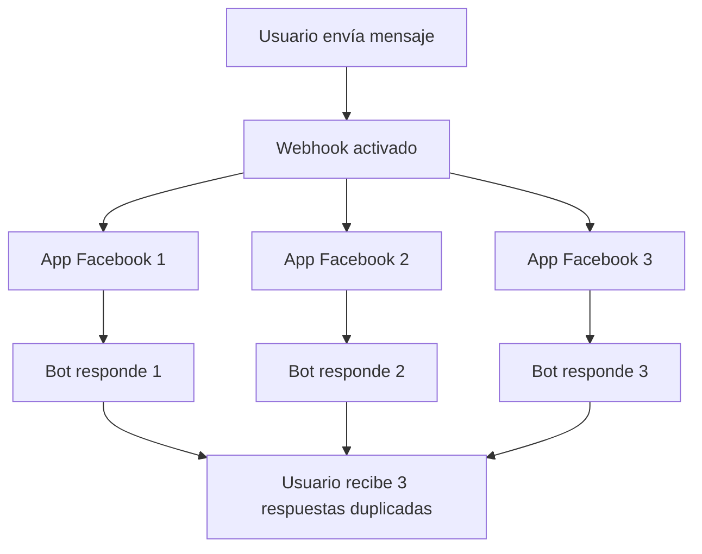

# Cómo Solucionar Respuestas Duplicadas en un Bot de WhatsApp

Si has notado que tu bot de WhatsApp está enviando respuestas duplicadas a los usuarios, no estás solo. Este es un problema común que afecta a muchos negocios que utilizan la API de WhatsApp Business y las plataformas de automatización como E-SMART360. Afortunadamente, es relativamente fácil de solucionar una vez que entiendes la causa raíz y sigues los pasos adecuados.

> **¿Sabías que...?** Las respuestas duplicadas pueden dañar significativamente la experiencia del cliente y hacer que tu negocio parezca poco profesional o desorganizado. Un solo mensaje duplicado puede reducir la confianza del usuario en tu servicio automatizado. Abordar este problema de manera proactiva es esencial para mantener una comunicación fluida, profesional y efectiva con tus clientes.

En esta guía completa, cubriremos todo lo que necesitas saber: desde por qué ocurre el problema hasta cómo solucionarlo de forma permanente, incluyendo escenarios avanzados, diagnóstico técnico, y las mejores prácticas para mantener tu infraestructura de chatbot funcionando sin inconvenientes.

## ¿Por Qué Ocurre el Problema de Respuestas Duplicadas?

La causa principal y más frecuente de las respuestas duplicadas es la configuración de **múltiples aplicaciones de Facebook con la misma URL de webhook**. Sin embargo, existen otras causas que también pueden provocar este comportamiento. A continuación, analizamos todas las causas posibles en detalle.

### Causa Principal: Múltiples Aplicaciones de Facebook con el Mismo Webhook

Esta es la causa número uno y la más común entre los usuarios de la API de WhatsApp Business. Aquí tienes un desglose detallado de cómo sucede:

1. **Creación de aplicaciones separadas**: Muchos usuarios que desean configurar bots de WhatsApp para varios números de teléfono crean aplicaciones de Facebook separadas para cada número. Esto suele ocurrir porque piensan que cada número necesita su propia aplicación.
2. **Misma URL de webhook**: Luego configuran la misma URL de webhook en todas estas aplicaciones, a menudo copiando y pegando la misma URL sin darse cuenta de las consecuencias.
3. **Activación múltiple**: Cuando un usuario envía un mensaje al bot, el webhook se activa múltiples veces — una vez por cada aplicación que tenga la misma URL configurada. Esto significa que si tienes 3 aplicaciones, el webhook se disparará 3 veces por cada mensaje entrante.
4. **Respuestas duplicadas**: Como resultado, el bot envía respuestas duplicadas al usuario. El usuario recibe el mismo mensaje 2, 3 o más veces, dependiendo de cuántas aplicaciones tengas configuradas.

> **Importante:** Si gestionas múltiples números de WhatsApp Business, evita a toda costa crear aplicaciones de Facebook separadas para cada uno. Esta práctica es la fuente más común del problema de duplicación y también complica enormemente la gestión de tu infraestructura técnica, aumenta la superficie de errores y dificulta el mantenimiento.

### Causas Secundarias de Duplicación

Además de la causa principal, existen otras situaciones que pueden generar respuestas duplicadas:

#### 1. Superposición de Reglas del Bot

Dentro de E-SMART360, puedes configurar múltiples tipos de respuestas automáticas. Si tienes varias reglas que coinciden con el mismo mensaje, todas se activarán y generarán respuestas duplicadas. Por ejemplo:

- Una regla de **palabra clave** que responde a "hola" con un saludo.
- Una regla de **IA** configurada para responder saludos.
- Una regla de **mensaje por defecto** para cuando no hay coincidencia.
- Una **integración externa** (Zapier, HTTP API) que también responde automáticamente.

Si todas estas reglas están activas simultáneamente para el mismo tipo de mensaje, el usuario recibirá múltiples respuestas.

#### 2. Múltiples Bots Activos para el Mismo Número

Si tienes más de un chatbot o flujo de automatización activo para el mismo número de WhatsApp, todos intentarán responder al mensaje entrante. Esto puede ocurrir si:

- Tienes duplicados accidentales de bots en tu panel de control.
- Has configurado respuestas tanto a nivel de bot como a nivel de regla global.
- Tienes secuencias de mensajes y reglas de respuesta activas simultáneamente.

#### 3. Integraciones Externas Configuradas para Responder

Servicios externos conectados a través de HTTP API, webhook workflow, Zapier, o Google Sheets pueden estar configurados para enviar respuestas automáticas. Si estos servicios responden al mismo tiempo que tu bot principal, se generarán respuestas duplicadas. Algunos ejemplos comunes:

- Una integración de **Shopify** que envía confirmaciones de pedido.
- Un **webhook workflow** que envía notificaciones de estado.
- Una regla en **Zapier** que dispara un mensaje automático.
- Una **integración de Google Sheets** que envía datos personalizados.

#### 4. Webhooks a Nivel de Aplicación y a Nivel de Número

En algunos casos, especialmente cuando se migra de una configuración antigua a una nueva, puede haber webhooks configurados tanto a nivel de **aplicación de Facebook** como a nivel de **número de teléfono individual**. Esto causa que el mismo mensaje active el webhook dos veces: una desde la app y otra desde el número específico.

## Cómo Evitar las Respuestas Duplicadas Desde el Inicio

La mejor estrategia es la prevención. Si estás configurando tu bot por primera vez o planeas agregar nuevos números, sigue estas recomendaciones para evitar el problema desde el principio.

### Principio Fundamental: Una Sola Aplicación de Facebook

La mejor manera de evitar este problema es **dejar de crear aplicaciones de Facebook múltiples** para cada número de WhatsApp Business. En su lugar, puedes agregar varios números de teléfono a una **sola aplicación de Facebook**. Esto funciona porque:

- La API de WhatsApp Cloud API permite gestionar **múltiples números de teléfono bajo una misma aplicación de Facebook**, eliminando la necesidad de crear aplicaciones separadas para cada uno.
- Al usar una sola aplicación, solo necesitas configurar **una única URL de webhook**, lo que previene el problema de respuestas duplicadas de raíz.
- La gestión centralizada facilita enormemente el mantenimiento, las actualizaciones y la resolución de problemas futuros.
- Reduces el riesgo de errores humanos al tener menos configuraciones que administrar.
- Simplificas el proceso de auditoría y monitoreo de tu infraestructura técnica.

> **Dato clave:** La API de WhatsApp Business te permite gestionar hasta **50 números de teléfono** bajo una sola aplicación de Facebook. Aprovechar esta capacidad no solo resuelve el problema de duplicación, sino que simplifica toda tu arquitectura técnica y reduce la complejidad operativa de forma significativa.

### Pasos para Configurar Correctamente Varios Números

### Accede a tu cuenta de desarrollador de Facebook

Inicia sesión en tu cuenta de [Facebook Developer](https://developers.facebook.com/) con las credenciales del administrador de tu negocio. Asegúrate de usar la cuenta que tiene acceso al Business Manager principal de tu empresa.

### Selecciona o crea la aplicación principal

Identifica cuál de tus aplicaciones de Facebook será la aplicación principal para gestionar todos tus números de WhatsApp. Si aún no tienes una, crea una nueva aplicación seleccionando "Empresa" como tipo de aplicación y luego agrega el producto WhatsApp.

### Navega a la configuración de WhatsApp

Dentro del panel de tu aplicación, busca la sección de **WhatsApp > Configuración de API**. Allí encontrarás las opciones para gestionar los números de teléfono asociados a esta aplicación.

### Agrega números de teléfono adicionales

En la configuración de WhatsApp, verás una opción para **agregar números de teléfono adicionales**. Sigue el proceso de registro para cada número nuevo. El proceso incluye:
- Verificar la propiedad del número mediante código SMS o llamada.
- Configurar el perfil comercial del número.
- Aceptar los términos de la API de WhatsApp Business.

### Configura un solo webhook

Asegúrate de que solo haya **una URL de webhook configurada** para esta aplicación. La URL del webhook debe ser la que proporciona E-SMART360 en el panel de configuración de tu bot. Verifica cuidadosamente que no haya webhooks redundantes apuntando a la misma URL desde otras aplicaciones.

### Verifica la recepción de mensajes

Configura la URL de callback y el token de verificación en la sección Webhooks de tu aplicación. Luego, desde E-SMART360, confirma que la integración esté activa y recibiendo mensajes correctamente.

### Prueba exhaustiva

Realiza una prueba completa:
1. Envía mensajes desde varios números de prueba diferentes.
2. Confirma que cada mensaje recibe **exactamente una respuesta**.
3. Verifica que las respuestas sean correctas según las reglas configuradas.
4. Prueba diferentes tipos de contenido: texto, imágenes, comandos específicos.

> Siguiendo estos pasos, tu infraestructura quedará optimizada con un único punto de entrada para todos los números. Esto no solo elimina las respuestas duplicadas sino que también mejora el rendimiento general, facilita la depuración de errores futuros y simplifica la gestión diaria de tu sistema de chatbot.

## ¿Qué Hacer si Ya Estás Experimentando el Problema?

Si ya estás sufriendo de respuestas duplicadas en tu bot de WhatsApp, no te preocupes. La solución es clara y directa. Sigue esta guía paso a paso para diagnosticar y resolver el problema de manera efectiva.

### Paso 1: Diagnóstico Inicial

Antes de hacer cualquier cambio, es importante confirmar que el problema es realmente de duplicación por webhook y no por otra causa.

**Cómo Confirmar el Diagnóstico:**

1. **Envía un mensaje de prueba**: Desde un número que no esté registrado como administrador, envía un mensaje simple como "Hola" a tu bot.
2. **Cuenta las respuestas**: ¿Recibiste 2, 3 o más respuestas idénticas? Anota el número exacto.
3. **Revisa los registros**: En E-SMART360, ve al historial de conversaciones y busca el mensaje de prueba. Deberías ver múltiples entradas de respuesta para un solo mensaje entrante.
4. **Identifica el patrón**: Si siempre recibes el mismo número de respuestas duplicadas (por ejemplo, siempre 3), es muy probable que tengas exactamente esa cantidad de aplicaciones de Facebook configuradas con el mismo webhook.

### Paso 2: Revisa las Aplicaciones de Facebook Existentes

Ahora que has confirmado el problema, es hora de identificar las aplicaciones problemáticas.

1. **Inicia sesión** en tu cuenta de [Facebook Developer](https://developers.facebook.com/).
2. **Revisa todas las aplicaciones** que has creado. Ve a **Mis aplicaciones** en el menú superior.
3. **Identifica las aplicaciones de WhatsApp**: Busca las aplicaciones que tienen el producto WhatsApp configurado.
4. **Anota las URL de webhook**: Para cada aplicación de WhatsApp, ve a **WhatsApp > Configuración de API** y anota la URL de webhook configurada.
5. **Compara las URL**: Si encuentras la misma URL de webhook en múltiples aplicaciones, has identificado el problema.

> **Consejo práctico:** Para facilitar la revisión, crea una tabla o documento con todas tus aplicaciones de Facebook, su propósito, los números de teléfono asociados y las URL de webhook configuradas. Esto te dará una visión clara y completa de qué aplicaciones son redundantes y cuáles son necesarias.

### Paso 3: Elimina los Webhooks Redundantes

Una vez identificadas las aplicaciones problemáticas, sigue estos pasos para eliminar los webhooks redundantes:

1. **Elige tu aplicación principal**: Decide qué aplicación de Facebook será tu aplicación principal para gestionar todos los números de WhatsApp.
2. **Elimina webhooks de las aplicaciones secundarias**: Para cada aplicación que no sea la principal:
   - Ve a la aplicación en Facebook Developer.
   - Selecciona **WhatsApp** en el menú de productos.
   - En la sección **Webhooks**, haz clic en **Editar suscripción**.
   - Borra la URL del webhook del campo correspondiente.
   - Guarda los cambios haciendo clic en **Guardar**.
3. **Verifica la aplicación principal**: Confirma que la aplicación principal aún tiene la URL de webhook correcta.
4. **Considera eliminar aplicaciones innecesarias**: Si ya no necesitas las aplicaciones secundarias, elimínalas desde **Configuración > Básico**.

> **Precaución importante:** Antes de eliminar cualquier webhook o aplicación, asegúrate de tener un respaldo completo de tus configuraciones. Documenta las URL de webhook, los tokens de verificación y cualquier otra configuración relevante por si necesitas restaurarlas más adelante.

### Paso 4: Migra Números a la Aplicación Principal

Si tenías números de teléfono en las aplicaciones secundarias, ahora debes migrarlos a la aplicación principal:

1. **En la aplicación principal**, ve a **WhatsApp > Configuración de API**.
2. Busca la opción **Agregar número de teléfono**.
3. **Registra cada número** siguiendo el proceso de verificación.
4. **Configura el perfil** de cada número.
5. **Desvincula los números de las aplicaciones secundarias**.

### Paso 5: Prueba tu Bot Exhaustivamente

Después de realizar todos los cambios, es crucial probar que la solución funciona correctamente:

1. **Prueba básica**: Envía "Hola" desde un número de WhatsApp de prueba. Deberías recibir **exactamente una** respuesta automatizada.
2. **Prueba desde diferentes números**: Repite la prueba desde 3 o 4 números diferentes.
3. **Prueba diferentes tipos de mensajes**: Envía mensajes de texto, imágenes, y comandos específicos.
4. **Prueba en diferentes momentos**: Realiza pruebas en diferentes horas del día.
5. **Monitoreo continuo**: Durante las siguientes 24-48 horas, monitorea las conversaciones entrantes.

### Prueba Rápida

1. Abre WhatsApp desde un número de prueba.
2. Envía un mensaje simple como "Hola".
3. Espera la respuesta del bot.
4. **Verifica:** ¿Recibiste exactamente 1 respuesta?
5. **Verifica:** ¿El contenido de la respuesta es el esperado?

### Prueba Exhaustiva

1. Envía diferentes tipos de mensajes desde múltiples números de prueba.
2. Tipos: saludos ("Hola", "Buenos días"), palabras clave ("Precios", "Catálogo"), mensajes sin coincidencia, multimedia (imágenes, ubicaciones).
3. Confirma que **cada mensaje recibe una sola respuesta**.
4. Verifica que el contenido sea correcto para cada tipo de interacción.

## Diagnóstico Avanzado: Herramientas y Técnicas

Si después de seguir los pasos anteriores el problema persiste, es posible que necesites un enfoque más avanzado. Aquí te presentamos herramientas y técnicas de diagnóstico adicionales.

### Uso de Herramientas de Monitoreo de Webhooks

Existen herramientas externas que pueden ayudarte a visualizar y analizar las solicitudes de webhook que recibe tu servidor:

1. **Webhook.site**: Crea una URL temporal, configúrala como webhook en tus aplicaciones de Facebook, y observa cuántas solicitudes llegan cuando envías un mensaje de prueba. Esta herramienta te muestra el contenido completo de cada solicitud, incluyendo encabezados y cuerpo del mensaje.
2. **RequestBin**: Similar a webhook.site, te permite capturar y revisar todas las solicitudes HTTP entrantes en tiempo real.
3. **Logs del servidor**: Si tienes acceso a los registros de tu servidor, busca entradas POST desde direcciones de Facebook y cuenta cuántas solicitudes recibe tu endpoint por cada mensaje entrante.

### Análisis de Registros en Facebook Developer

El panel de Facebook Developer proporciona información valiosa sobre la actividad de tu webhook:

1. **Ve a tu aplicación** en Facebook Developer.
2. **Selecciona Webhooks** en el menú de productos.
3. **Haz clic en "Registros"** o "Logs" para ver el historial de activaciones.
4. **Analiza los registros**: Busca marcas de tiempo cercanas entre sí que correspondan al mismo mensaje entrante. Si ves múltiples entradas con la misma carga útil, confirmas la activación múltiple.

### Diagnóstico en E-SMART360

Dentro de la plataforma E-SMART360, también puedes realizar diagnósticos adicionales:

1. **Historial de conversaciones**: Revisa las conversaciones recientes. Si ves que un mismo usuario tiene múltiples conversaciones iniciadas con el mismo mensaje, es señal de activación múltiple del webhook.
2. **Registro de actividades**: Accede al registro de actividades del sistema para ver todas las acciones realizadas por el bot. Busca acciones repetidas para el mismo mensaje entrante.
3. **Reglas del bot**: Revisa todas las reglas configuradas y verifica que no haya superposiciones. Presta especial atención a:
   - Reglas de palabras clave que puedan coincidir con el mismo texto.
   - Reglas de IA que estén configuradas junto con reglas manuales.
   - Reglas globales vs reglas específicas de bot.

## Configuración Óptima de Reglas para Evitar Duplicados

Una vez resuelto el problema de webhook, es importante optimizar la configuración interna de tu bot para prevenir duplicados causados por superposición de reglas.

### Jerarquía Recomendada de Reglas

La forma más efectiva de organizar las reglas de tu bot es establecer una jerarquía clara:

1. **Nivel 1 - Palabras clave específicas**: Las reglas de palabras clave deben tener la máxima prioridad.
   - Ejemplo: "catálogo" → responde con el enlace al catálogo.
   - Ejemplo: "horarios" → responde con los horarios de atención.
2. **Nivel 2 - Intenciones detectadas por IA**: El asistente de IA debe evaluar los mensajes que no coinciden con ninguna palabra clave específica.
3. **Nivel 3 - Mensaje por defecto**: Si ninguna regla de palabra clave ni la IA pueden determinar una respuesta, se envía un mensaje genérico.

> **Consejo de configuración:** En E-SMART360, puedes configurar el orden de evaluación de las reglas. Asegúrate de que las reglas de palabras clave se evalúen **antes** que el asistente de IA. Esto evita que tanto la palabra clave como la IA respondan al mismo mensaje, generando duplicados.

### Verificación de Integraciones Externas

Si utilizas integraciones externas como Zapier, HTTP API o Google Sheets, verifica que no estén configuradas para responder automáticamente a los mismos mensajes que tu bot:

1. **Revisa cada integración**: Accede a cada integración configurada y verifica sus disparadores y acciones.
2. **Identifica superposiciones**: Busca integraciones que se activen con los mismos eventos que tu bot.
3. **Ajusta las respuestas**: Si encuentras superposiciones, tienes varias opciones:
   - Desactivar la respuesta automática de la integración.
   - Configurar la integración para eventos específicos.
   - Usar campos personalizados o etiquetas para diferenciar los mensajes.

### Ejemplo de integración problemática

**Situación:** Tienes configurado un webhook workflow que envía un mensaje de confirmación cuando un cliente escribe "gracias" después de hacer un pedido. Al mismo tiempo, tu bot tiene una regla de palabra clave que responde "De nada" al detectar "gracias".

**Resultado:** El cliente recibe dos respuestas: una del bot y otra del webhook workflow.

**Solución:** Decide cuál de los dos sistemas debe manejar la respuesta y desactiva el otro. Por ejemplo, puedes eliminar la regla de palabra clave "gracias" del bot y dejar que el webhook workflow maneje esa interacción, ya que tiene más contexto sobre el pedido del cliente.

## Mantenimiento Preventivo

Para evitar que el problema de respuestas duplicadas vuelva a ocurrir en el futuro, implementa estas prácticas recomendadas como parte de tu rutina de mantenimiento regular:

### 1. Documenta tu Infraestructura

Mantén un registro actualizado y detallado de toda tu infraestructura técnica:

- **Aplicaciones de Facebook**: Lista completa con nombres, IDs, propósito y URL de webhook.
- **Números de teléfono**: Registro de cada número, su propósito, y la aplicación a la que está vinculado.
- **Reglas del bot**: Documentación de todas las reglas, su prioridad y su propósito.
- **Integraciones**: Lista de todas las integraciones externas y sus disparadores.

Te recomendamos usar un documento compartido accesible para todo tu equipo técnico.

### 2. Centraliza la Gestión

Siempre que necesites agregar un nuevo número de WhatsApp Business o modificar alguna configuración:

1. **Agrégalo a tu aplicación de Facebook principal** en lugar de crear una nueva.
2. **Actualiza la documentación** con los cambios realizados.
3. **Comunica los cambios** a todo el equipo relevante.
4. **Realiza pruebas** después de cada modificación.

### 3. Prueba Después de Cada Cambio

Establece un protocolo de pruebas obligatorio:

- **Regla de oro**: Cada vez que modifiques la configuración de tu webhook, agregues un nuevo número o cambies las reglas del bot, realiza pruebas de envío inmediatas.
- **Prueba mínima**: Enviar un mensaje desde un número de prueba y verificar que se recibe exactamente una respuesta correcta.
- **Prueba completa**: Realizar pruebas desde múltiples números y con diferentes tipos de mensajes.

### 4. Monitoreo Regular

Establece una rutina de monitoreo:

- **Diario**: Revisa rápidamente las primeras conversaciones del día para detectar patrones anómalos.
- **Semanal**: Revisa los registros de actividad de tus aplicaciones de Facebook y del panel de E-SMART360.
- **Mensual**: Realiza una auditoría completa de tu infraestructura, incluyendo todas las aplicaciones, números, reglas e integraciones.

> **Actualización — 9 de septiembre de 2025:**
Facebook e Meta han implementado nuevas herramientas de monitoreo en el panel de desarrollador que facilitan significativamente la detección de webhooks duplicados. Ahora puedes ver un historial detallado de activaciones con marcas de tiempo precisas, lo que ayuda a identificar rápidamente si múltiples aplicaciones están disparando el mismo webhook. Aprovecha estas herramientas como parte de tu rutina de mantenimiento regular.

### 5. Calendario de Mantenimiento Recomendado

### Mantenimiento Semanal

- Revisar primeras 20 conversaciones del día.
- Verificar que no haya respuestas duplicadas.
- Confirmar que todas las integraciones están activas.
- Revisar la calificación de calidad de la cuenta.

### Mantenimiento Mensual

- Auditoría completa de aplicaciones de Facebook.
- Revisión de todas las reglas del bot.
- Verificación de webhooks en todas las aplicaciones.
- Actualización de documentación técnica.
- Revisión de límites de mensajería y niveles.

## Errores Comunes Relacionados y Sus Soluciones

Además del problema de respuestas duplicadas, existen otros errores comunes que pueden afectar el funcionamiento de tu bot de WhatsApp. A continuación, te presentamos los más frecuentes, sus causas y cómo solucionarlos de manera efectiva.

### Error 131042: Problema con el Método de Pago

Este error ocurre cuando hay un problema con el método de pago vinculado a tu cuenta de WhatsApp Business, y los mensajes no pueden enviarse debido a problemas de facturación.

**Mensaje de error típico:** "Message failed to send because there were one or more errors related to your payment method."

**Causas comunes:**

1. **Método de pago no conectado correctamente**: Pagar por tu suscripción a E-SMART360 NO cubre las tarifas de conversación de Meta. Debes agregar un método de pago dentro de **Meta WhatsApp Manager** por separado. Muchos usuarios confunden estos dos pagos.
2. **Método de pago agregado al WhatsApp Manager incorrecto**: Si tienes múltiples cuentas de negocio, es posible haber agregado el método de pago al WhatsApp Manager equivocado.
3. **Datos comerciales incompletos**: Después de agregar el método de pago, es posible que falte completar la información fiscal o comercial requerida.
4. **Facebook Business Manager no verificado**: Meta requiere que tu Business Manager esté verificado para procesar pagos correctamente.
5. **WhatsApp Manager suspendido**: Si tu cuenta ha sido suspendida por incumplimiento de políticas, los pagos no podrán procesarse.

**Solución paso a paso:**

1. **Verifica el método de pago**: Ve a la configuración de pagos en el panel de E-SMART360, selecciona "Métodos de pago" y elige el Business Manager correcto.
2. **Encuentra tu cuenta de WhatsApp Business**: En la sección de Facturación y Pagos de Meta, ve a "Cuentas" y luego "Cuentas de WhatsApp Business".
3. **Identifica tu WhatsApp Manager**: Busca el WhatsApp Manager que coincida con tu ID de negocio de E-SMART360.
4. **Revisa el estado del pago**: Si no hay método de pago agregado, verás un botón "Agregar método de pago". No hagas clic directamente allí; en su lugar, haz clic en los tres puntos (•••) y selecciona "Ver detalles".
5. **Completa ambos pasos**: En la página de detalles, completa tanto la información de pago (datos de tarjeta de crédito) como la verificación de información fiscal.
6. **Verifica tu Business Manager**: Si el método de pago está configurado pero los mensajes aún fallan, ve al Centro de Seguridad de E-SMART360 y verifica que tu Business Manager esté verificado.
7. **Espera la verificación**: El proceso de verificación puede tomar de 24 a 48 horas.

### Guía rápida: Cómo verificar tu Business Manager

1. Ve al **Centro de Seguridad** de E-SMART360.
2. Selecciona el Facebook Business Manager correcto.
3. Busca la etiqueta de estado de verificación.
4. Si ves "Verificado", tu negocio está aprobado.
5. Si ves "Iniciar verificación", haz clic y sigue los pasos de Meta.
6. La verificación puede tomar de 24 a 48 horas hábiles.
7. Si el botón está atenuado o no aparece, consulta nuestra guía de solución de problemas.

### Error 130472: El Número de Teléfono es Parte de un Experimento

Este error aparece cuando se envía un mensaje a un número de teléfono que está participando en un experimento interno de WhatsApp o Meta.

**Mensaje de error típico:** "This user's phone number is part of an experiment" o "130472."

**Posibles causas:**

- El número destino está en una lista de prueba controlada por Meta.
- El número pertenece a un empleado de Meta o a un tester interno.
- Hay restricciones temporales por políticas internas de Meta.

**Soluciones:**

1. **Espera**: Estos experimentos suelen durar entre 24 y 72 horas.
2. **Contacta al usuario por otro canal**: Correo electrónico, SMS o llamada.
3. **Usa un número alternativo**: Intenta desde otro número de WhatsApp Business.
4. **Reporta el problema a Meta**: Si persiste por más de una semana.

### Error 131026: Mensaje No Entregable

Este error indica que un mensaje específico no pudo ser entregado al destinatario.

**Causas comunes:**

1. **El destinatario ha bloqueado el número de tu empresa**.
2. **El número de destino ha cambiado de operador o ha sido desactivado**.
3. **El destinatario ha optado por no recibir mensajes** (envió "STOP" o "BAJA").
4. **Tu cuenta ha excedido los límites de mensajería**.
5. **Problemas de conectividad temporal**.

**Soluciones:**

1. **Verifica el estado del contacto** en tu lista de contactos.
2. **Confirma que no haya optado por exclusión**.
3. **Revisa los límites de mensajería** de tu cuenta.
4. **Verifica el nivel de mensajería** y solicita un aumento si es necesario.
5. **Reintenta el envío** después de unos minutos si el error es intermitente.

### WhatsApp Manager Suspendido

Si tu WhatsApp Manager ha sido suspendido, ningún mensaje podrá enviarse hasta que se resuelva la suspensión.

**Causas comunes:**

- Violación de las políticas de uso aceptable de Meta.
- Quejas recurrentes de usuarios (alta tasa de bloqueos).
- Verificación de empresa incompleta o rechazada.
- Calificación de calidad baja de la cuenta.

**Solución:**

1. Revisa la bandeja de notificaciones de tu Business Manager.
2. Sigue las instrucciones de Meta para apelar la suspensión.
3. Asegúrate de que tu empresa esté verificada.
4. Contacta al soporte de Meta a través del Centro de Ayuda para Desarrolladores.

## Preguntas Frecuentes

### ¿Puedo tener el mismo webhook en dos aplicaciones de Facebook diferentes si uso diferentes números de teléfono?

No, no es recomendable. Aunque uses diferentes números de teléfono, si el webhook es el mismo, se activará múltiples veces por cada mensaje entrante, causando respuestas duplicadas. La práctica correcta es usar **una sola aplicación de Facebook** con todos tus números registrados en ella y un único webhook configurado.

### ¿Cuántos números de teléfono puedo agregar a una sola aplicación de Facebook?

La API de WhatsApp Cloud API permite agregar hasta **50 números de teléfono** por aplicación de Facebook. Si necesitas más, puedes solicitar un aumento de límite a Meta a través del panel de desarrollador. En la práctica, la mayoría de las empresas nunca alcanzan este límite.

### ¿El problema de duplicación puede ocurrir incluso con una sola aplicación de Facebook?

Sí, aunque es menos común. Puede ocurrir si tienes:
- Múltiples reglas o palabras clave activadas para el mismo mensaje.
- Tanto el asistente de IA como las reglas manuales habilitadas simultáneamente.
- Integraciones externas (Zapier, HTTP API) configuradas para responder automáticamente.
- Un webhook configurado tanto a nivel de aplicación como a nivel de número telefónico.
Revisa todas estas configuraciones si el problema persiste con una sola aplicación.

### ¿Cómo puedo verificar si mi webhook se está activando múltiples veces?

Puedes verificarlo de varias formas:
1. **Registros de Facebook Developer**: En el panel de tu aplicación, ve a la sección Webhooks y revisa el historial de activaciones.
2. **Registros del servidor**: Busca múltiples entradas POST desde Facebook con el mismo payload en un corto período de tiempo.
3. **Herramientas de monitoreo**: Usa herramientas como Webhook.site o RequestBin para capturar todas las solicitudes entrantes.

### ¿Quitar el webhook de una aplicación de Facebook afecta otros servicios?

Depende de cómo esté configurada la aplicación. Si esa aplicación solo se usaba para el bot de WhatsApp, eliminar el webhook no debería afectar otros servicios. Sin embargo, si la misma aplicación se usa para otros productos de Meta (como Messenger o Instagram), asegúrate de que los webhooks de esos productos no se vean afectados. Revisa todas las configuraciones antes de hacer cambios.

### ¿Qué hago si mi cuenta de WhatsApp Business tiene calificación baja y eso causa problemas de entrega?

La calificación de calidad se basa en los comentarios de los usuarios. Si tu calificación es baja:
1. Revisa la calificación actual desde el panel de E-SMART360.
2. Identifica qué números están causando los reportes negativos.
3. Reduce la frecuencia de mensajes a esos números.
4. Asegúrate de que tus mensajes sean relevantes y esperados.
5. Implementa un sistema de confirmación de suscripción (opt-in) claro.
6. Si la calificación no mejora, pausa el envío de mensajes promocionales temporalmente.
7. Considera segmentar tu audiencia y enviar contenido más personalizado.
8. Monitorea la calificación semanalmente hasta que se recupere.

### ¿Puedo usar una misma URL de webhook para servicios diferentes como WhatsApp y Messenger?

Sí, puedes usar la misma URL de webhook para diferentes productos de Meta en la misma aplicación. Sin embargo, asegúrate de que tu webhook distinga entre los diferentes tipos de notificaciones para responder adecuadamente. En E-SMART360, esto se maneja automáticamente, pero si tienes un webhook personalizado, deberás implementar la lógica de diferenciación en tu código.

### ¿Cómo sé si mi problema es por múltiples aplicaciones o por superposición de reglas?

La prueba más simple es desactivar temporalmente todas las reglas del bot excepto una y enviar un mensaje de prueba:
- Si aún recibes respuestas duplicadas → el problema es de múltiples aplicaciones/webhooks.
- Si dejas de recibir duplicados → el problema es de superposición de reglas.
- Si recibes exactamente una respuesta correcta → la configuración de webhook es correcta.

### ¿El problema de duplicación también afecta a las plantillas de mensajes?

Sí. Si tienes múltiples webhooks activados, las plantillas de mensajes (como notificaciones de pedido, recordatorios de citas, etc.) también se enviarán duplicadas. Esto puede ser especialmente problemático porque estos mensajes suelen ser transaccionales y los usuarios pueden terminar pagando tarifas duplicadas por las conversaciones. Es importante resolver la duplicación de webhook para todos los tipos de mensajes.

### ¿E-SMART360 tiene protección contra respuestas duplicadas?

Sí, E-SMART360 incluye mecanismos de detección de duplicados a nivel de plataforma. Sin embargo, estos mecanismos funcionan mejor cuando el webhook se activa correctamente una sola vez por mensaje. Si el webhook se activa desde múltiples aplicaciones de Facebook, la protección puede no ser suficiente, ya que cada activación se procesa como un evento independiente. Por eso es fundamental resolver el problema en la fuente: las aplicaciones de Facebook.

## Conclusión

Las respuestas duplicadas en tu bot de WhatsApp son un problema frustrante pero completamente solucionable. La clave está en entender la causa raíz — generalmente, la configuración de múltiples aplicaciones de Facebook con el mismo webhook — y seguir los pasos adecuados para centralizar tu infraestructura técnica.

### Resumen de Acciones Clave

| Acción | Prioridad | Tiempo Estimado |
|--------|-----------|----------------|
| Diagnosticar cuántas apps de Facebook tienes | Alta | 15 minutos |
| Identificar las que tienen webhooks duplicados | Alta | 10 minutos |
| Elegir una app principal y eliminar webhooks redundantes | Alta | 30 minutos |
| Migrar números a la app principal | Media | 1-2 horas |
| Revisar reglas del bot para evitar superposición | Media | 30 minutos |
| Verificar integraciones externas | Media | 20 minutos |
| Realizar pruebas exhaustivas | Alta | 30 minutos |
| Documentar la infraestructura | Baja | 30 minutos |
| Establecer rutina de monitoreo | Baja | 1 hora inicial |

### Beneficios de una Configuración Correcta

Una vez que hayas resuelto el problema y centralizado tu configuración, experimentarás estos beneficios:

1. **Experiencia óptima del cliente**: Cada mensaje recibe una única respuesta relevante, mejorando la percepción de tu marca.
2. **Ahorro en costos**: Las tarifas de conversación de Meta se aplican por mensaje. Los duplicados innecesarios incrementan tus costos operativos.
3. **Menos confusión**: Tu equipo de soporte no tendrá que lidiar con clientes confundidos que recibieron respuestas múltiples.
4. **Gestión simplificada**: Una sola aplicación de Facebook para todos tus números reduce drásticamente la complejidad técnica.
5. **Mayor confiabilidad**: Una infraestructura centralizada es más fácil de monitorear, mantener y escalar.

> **¿Necesitas ayuda adicional?** Si después de seguir todos los pasos de esta guía el problema persiste, el equipo de soporte de E-SMART360 está disponible para ayudarte. Accede al panel de ayuda desde tu cuenta y describe el problema detalladamente, incluyendo los resultados de las pruebas de diagnóstico que realizaste. Nuestro equipo técnico puede revisar tu configuración de forma remota y ayudarte a identificar cualquier problema residual.

---

## Recursos Adicionales

Para complementar esta guía, te recomendamos consultar los siguientes recursos disponibles en la plataforma E-SMART360:

### Guías Relacionadas

### Configuración Inicial de WhatsApp API

Guía paso a paso para conectar tu primer número de WhatsApp Business con E-SMART360, incluyendo la creación de la aplicación de Facebook y la configuración del webhook.

### Optimización de Reglas del Bot

Aprende a configurar reglas inteligentes con prioridades, uso de palabras clave negativas y flujos condicionales para maximizar la eficiencia de tu bot.

### Gestión de Múltiples Números

Guía avanzada para administrar varios números de WhatsApp Business desde un solo panel de control centralizado en E-SMART360.

### Mantenimiento y Monitoreo Proactivo

Estrategias y herramientas para mantener tu bot funcionando sin problemas, incluyendo alertas de rendimiento y paneles de control personalizados.

### Soporte Técnico

Si encuentras algún problema que no puedas resolver con esta guía, el equipo de soporte técnico de E-SMART360 está disponible para asistirte:

- **Centro de Ayuda**: Accede desde el panel de control de E-SMART360.
- **Ticket de Soporte**: Abre un ticket directamente desde tu cuenta.
- **Base de Conocimientos**: Explora nuestra base de conocimientos para encontrar respuestas a preguntas frecuentes.

> **Recuerda:** La prevención es la mejor estrategia. Una vez que hayas centralizado tu configuración y optimizado tus reglas, mantén una rutina de monitoreo regular para detectar cualquier anomalía antes de que afecte a tus clientes. La documentación de tu infraestructura y la comunicación clara dentro de tu equipo son fundamentales para el éxito a largo plazo.

---

*Documento generado para la plataforma E-SMART360. Última actualización: 6 de mayo de 2026.*
