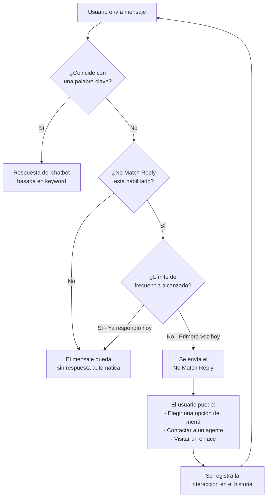
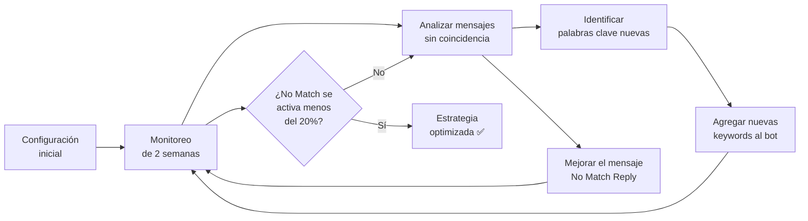

# Configuración del Bot de Respuesta Sin Coincidencia y su Límite de Frecuencia en WhatsApp


> Cuando un suscriptor envía un mensaje que no coincide con ninguna de las palabras clave configuradas en tus chatbots de WhatsApp, el **No Match Reply** entra en acción para garantizar que ningún mensaje quede sin respuesta.

## ¿Qué es una Respuesta Sin Coincidencia (No Match Reply)?

La **Respuesta Sin Coincidencia** es un tipo de respuesta automática del chatbot que se activa cuando el mensaje de un suscriptor no coincide con ninguna de las respuestas basadas en palabras clave que hayas configurado previamente.

Puedes tener decenas de chatbots en E-SMART360 configurados para responder a palabras clave específicas, cada uno respondiendo según su palabra clave designada. Pero, ¿qué sucede si un usuario envía un mensaje que no coincide con ninguna de esas palabras clave?

No queremos dejar ningún mensaje de suscriptor sin atender, ¿verdad? Ahí es donde entra en juego el **No Match Reply**.


> Una respuesta profesional de No Match Reply ayuda al suscriptor de forma educada y sugiere alternativas, como conectarse con un agente humano o proporcionar enlaces con más información.

La respuesta sin coincidencia en E-SMART360 puede modificarse según las necesidades del negocio y guía al usuario de manera adecuada. Es completamente personalizable: puedes agregar texto, imágenes, audio, video, elementos interactivos, botones CTA con URL y mucho más.

## ¿Qué es el Límite de Frecuencia del No Match Reply?

El **Límite de Frecuencia de Respuesta Sin Coincidencia** se refiere al número de veces que se activará para un suscriptor en particular. Nadie quiere recibir la misma respuesta repetidamente.

Imagina este escenario: el chatbot No Match se activa y responde correctamente. Pero, ¿qué pasa si el mismo suscriptor envía otro mensaje que tampoco coincide con ninguna palabra clave? ¿Querrías que el chatbot No Match se active de nuevo? Ciertamente no. Aquí es donde el **Límite de Frecuencia** toma relevancia, ya que te permite controlar cuántas veces se activa el No Match para un suscriptor específico.


> Si se selecciona "Una vez al día", el No Match Reply solo se activará una vez para ese suscriptor dentro del día, incluso si envía mensajes adicionales que no coincidan con ninguna respuesta basada en palabras clave.

En el mundo actual de la IA, también puedes integrar inteligencia artificial para que responda en los casos de No Match Reply. Puedes entrenar tu asistente de IA con tu propio contenido usando preguntas frecuentes, archivos, URLs y Google Sheets.

## Configuración Paso a Paso del No Match Reply

En E-SMART360 ya existe una plantilla predeterminada de No Match Reply. Solo necesitas modificarla o editarla para adaptarla a tus requerimientos personalizados.


### Accede al Gestor de Bots

Navega al **Gestor de Bots (Bot Manager)** de WhatsApp desde el panel principal de E-SMART360.

### Selecciona el Botón de Acciones

Dentro del Gestor de Bots, localiza y selecciona el **botón de Acciones (Actions)** correspondiente.

### Abre la Plantilla No Match

Haz clic en la plantilla **No Match**. El bot se abrirá automáticamente en el **Visual Flow Builder** (Constructor Visual de Flujos).

### Personaliza el Contenido

Edita el **texto predeterminado** o agrega cualquier componente nuevo. Este bot es completamente personalizable y puedes agregar cualquier tipo de elemento:
- Texto
- Imagen
- Audio
- Video
- Mensajes interactivos
- Botones CTA con URL
- Listas dinámicas
- Y mucho más

### Guarda el Bot

Después de personalizar la plantilla No Match Reply, simplemente **guarda el bot**.


### Ejemplo de Respuesta Profesional

```
Hola, gracias por contactarnos. 😊

No hemos podido identificar tu consulta con nuestras opciones automáticas. Por favor, escríbenos con más detalle o elige una de las siguientes opciones:

1️⃣ 📦 Información de pedidos
2️⃣ 💬 Hablar con un agente
3️⃣ 🔗 Visitar nuestra web: [enlace]

¡Estamos aquí para ayudarte!
```

### Ejemplo de Respuesta Escueta

```
No entendí tu mensaje. Por favor intenta con otras palabras o contacta a soporte.
```

> Evita respuestas genéricas o negativas como "No entendí". Una buena respuesta sin coincidencia debe ser útil, amigable y guiar al usuario hacia una solución.

## Cómo Habilitar el No Match Reply y Configurar la Frecuencia

Una vez que has editado la respuesta sin coincidencia, debes habilitarla y establecer su frecuencia.


### Ve a Configuración

Desde el **Gestor de Bots (Bot Manager)**, accede a la sección **Configuración (Configuration)**.

### Habilita el No Match Reply

Activa la opción **"No Match Reply"** marcando el interruptor correspondiente.

### Selecciona el Límite de Frecuencia

Elige entre las dos opciones disponibles:
- **Cada Vez (Every Time):** El No Match Reply se enviará cada vez que el suscriptor envíe un mensaje sin coincidencia.
- **Una Vez al Día (Once a Day):** El No Match Reply solo se enviará una vez al día por suscriptor, incluso si envía múltiples mensajes sin coincidencia.

### Guarda la Configuración

Desplázate hacia abajo y haz clic en **Guardar Configuración (Save Settings)**. Es obligatorio guardar los cambios para que surtan efecto.


> La combinación del No Match Reply con un límite de frecuencia adecuado te permite equilibrar la capacidad de respuesta y evitar la repetición excesiva del mismo mensaje. Esta funcionalidad ayuda a mejorar la comunicación y aumentar el compromiso de los suscriptores.

## Integración con el Asistente de IA

Puedes potenciar tu No Match Reply conectándolo con el **Asistente de IA** de E-SMART360. En lugar de enviar un mensaje fijo cuando no hay coincidencia de palabras clave, el asistente de IA puede generar respuestas inteligentes y contextuales basadas en tu base de conocimiento.


### Entrena tu Asistente de IA

Alimenta el asistente con tu contenido: preguntas frecuentes, documentos PDF, enlaces a tu sitio web y datos de Google Sheets.

### Conéctalo al No Match Reply

En el constructor visual de flujos, agrega un nodo de **Asistente de IA** como parte de la respuesta No Match.

### Establece un Límite de Frecuencia

Define la frecuencia con la que el asistente de IA responderá a mensajes sin coincidencia para evitar el consumo excesivo de tokens de IA.


> Usar el Asistente de IA para el No Match Reply es ideal cuando tienes una amplia variedad de consultas y quieres ofrecer respuestas naturales sin necesidad de configurar cientos de palabras clave manualmente.

## Casos de Uso Prácticos


### 🛒 E-commerce

Un cliente escribe "¿Tienen envíos a España?" pero no tienes una palabra clave configurada para "envíos". El No Match Reply responde educadamente, ofrece un enlace a tu política de envíos y pregunta si necesita ayuda con otra cosa. Con frecuencia "Una vez al día", el cliente no recibirá la misma respuesta si vuelve a preguntar algo diferente el mismo día.

### 🏥 Clínica o Consultorio

Un paciente escribe "Dolor de cabeza" pero tu chatbot solo tiene palabras clave para "agendar cita" y "horarios". El No Match Reply lo redirige a un menú con opciones o a un agente humano. La frecuencia "Una vez al día" evita que el paciente reciba el mismo mensaje si insiste con diferentes síntomas.

### 🍽️ Restaurante

Un comensal escribe "¿Tienen menú vegano?" pero tu chatbot solo está configurado para "reservar mesa" y "horarios". El No Match Reply responde con un mensaje amigable que incluye un enlace al menú completo y ofrece contactar a un agente para consultas específicas.

### 🏢 Soporte Técnico

Un usuario escribe "Mi factura no carga" pero las keywords configuradas solo cubren "contraseña" y "error de inicio". El No Match Reply responde con opciones para reportar el problema y escalarlo al equipo de soporte, asegurando que ningún ticket se pierda.

## Estrategias Avanzadas para el No Match Reply

### Personalización por Segmento

Puedes crear diferentes versiones de tu No Match Reply según el segmento del cliente. Por ejemplo:


### Nuevos Suscriptores

"¡Bienvenido! 👋 No hemos podido identificar tu consulta. Como nuevo miembro, te recomendamos:
• 📖 Ver nuestra guía rápida: [enlace]
• 💬 Hablar con un asesor
• 🔍 Explorar nuestras categorías"

**Frecuencia recomendada:** Cada vez (durante los primeros 3 días)

### Clientes Recurrentes

"Hola de nuevo, [Nombre] 😊 No encontramos una coincidencia para tu mensaje. ¿Tal vez necesitas:
• 📦 Seguimiento de tu pedido #[número]
• 🔄 Cambiar o cancelar un pedido
• 💬 Contactar a soporte directo"

**Frecuencia recomendada:** Una vez al día

### Uso de Variables Dinámicas

Enriquece tu No Match Reply con variables personalizadas para hacer la respuesta más relevante:

```text
Hola {{nombre}},

Gracias por escribirnos. No logramos identificar tu consulta con nuestras opciones automáticas.

📌 Tu membresía: {{plan}}
🆔 Último pedido: #{{ultimo_pedido}}

Por favor, elige una opción:
1️⃣ Hablar con un agente
2️⃣ Ver nuestro catálogo
3️⃣ Recibir más información
```

## Buenas Prácticas para la Frecuencia de Respuesta

La frecuencia con la que configures tu No Match Reply impacta directamente en la experiencia del usuario:


### ✅ Cada Vez

**Úsalo cuando:**
- El bot es nuevo y estás afinando keywords
- Tienes un asistente de IA entrenado
- Quieres capturar todas las consultas sin excepción

**Riesgo:** Puede resultar molesto si el usuario insiste con mensajes similares.

### ✅ Una Vez al Día

**Úsalo cuando:**
- Ya tienes keywords bien establecidas
- Quieres reducir la fatiga del usuario
- Necesitas controlar costos de IA o API

**Riesgo:** Algunos mensajes genuinos pueden quedar sin respuesta si el usuario no contacta al agente.

### ⚖️ Balance Ideal

**Mejor práctica:** Usa "Una vez al día" combinado con un mensaje que ofrezca múltiples opciones de contacto alternativas (agente humano, web, email). Así mantienes la comunicación activa sin ser repetitivo.

## Cumplimiento con las Políticas de Meta (Frequency Capping)

Es importante entender que Meta aplica un **límite de frecuencia** a nivel de plataforma para proteger a los usuarios de la sobrecarga de mensajes promocionales. La configuración de frecuencia de tu No Match Reply debe alinearse con estas políticas.


> **Frequency Capping de Meta:** Meta limita los mensajes promocionales por usuario para evitar la fatiga y mantener una comunicación de alta calidad. Superar estos límites puede reducir tus tasas de entrega.

### Recomendaciones para Cumplir con las Políticas

1. **Obtén consentimiento claro** de los usuarios antes de enviar mensajes.
2. **Espacia la frecuencia** de tus mensajes de marketing.
3. **Crea contenido atractivo** y no meramente promocional.
4. **Proporciona opciones de exclusión voluntaria** fáciles de usar.
5. **Limita las transmisiones en frío** a usuarios que no han interactuado recientemente.
6. **Espera 24-48 horas** antes de reenviar mensajes que fallaron en la entrega.
7. **Monitorea el rendimiento** de tus mensajes y adapta tu enfoque.


> El No Match Reply es una respuesta automática dentro de una conversación iniciada por el usuario, por lo que generalmente no está sujeto a los mismos límites que las campañas promocionales salientes. Sin embargo, una configuración de frecuencia inteligente demuestra a Meta que tu negocio se preocupa por la calidad de la comunicación.

## Bloqueo de Mensajes No Deseados

Como complemento al No Match Reply, E-SMART360 te permite **bloquear usuarios** que envíen mensajes no deseados o spam. Esto te da control total sobre tu bandeja de entrada.


### Identifica al Contacto Spam

Revisa el historial de mensajes y reconoce patrones repetitivos o irrelevantes.

### Bloquea al Usuario

Ve a la sección **Chat en Vivo (Live Chat)** de E-SMART360 y haz clic en el botón **"Bloquear Usuario"** en el perfil del contacto. Confirma la acción.

### Continúa Enviando Transmisiones

Aún después de bloquear, puedes seguir enviando transmisiones a los usuarios bloqueados. El bloqueo solo impide que ellos te envíen mensajes, manteniendo la comunicación unidireccional.


> Usa el bloqueo de manera estratégica: combínalo con el No Match Reply para filtrar automáticamente a usuarios problemáticos antes de que consuman recursos de atención al cliente.

## Preguntas Frecuentes


### ¿Qué pasa si desactivo el No Match Reply?

Si desactivas el No Match Reply, los mensajes que no coincidan con ninguna palabra clave simplemente quedarán sin respuesta automática. El suscriptor no recibirá ningún mensaje de vuelta de parte del chatbot. Esto puede resultar en una mala experiencia de usuario y potencialmente en la pérdida de clientes u oportunidades de negocio.

### ¿Puedo tener diferentes respuestas No Match para diferentes bots?

Actualmente, la respuesta No Match es una configuración general que aplica a todos los chatbots de WhatsApp en tu cuenta de E-SMART360. Sin embargo, puedes personalizar el contenido de la respuesta con variables dinámicas y enlaces para que se adapte al contexto de cada conversación.

### ¿El No Match Reply cuenta como un mensaje dentro de la ventana de 24 horas?

Sí, el No Match Reply se envía dentro de la ventana de conversación de 24 horas iniciada por el suscriptor. Esto significa que no se te cobrará como un mensaje de plantilla, sino como parte de la conversación en curso. Asegúrate de que la respuesta sea relevante para maximizar esa ventana de comunicación gratuita.

### ¿Se puede usar el Asistente de IA como No Match Reply?

Sí, absolutamente. Puedes integrar el Asistente de IA de E-SMART360 como parte de tu flujo de No Match Reply. Esto permite que el asistente, entrenado con tu base de conocimiento, genere respuestas inteligentes y contextuales para consultas que no coinciden con palabras clave específicas. Es una excelente manera de manejar consultas complejas sin intervención manual.

### ¿Cómo sé si el No Match Reply se está activando con frecuencia?

Puedes revisar el historial de conversaciones y los registros de actividad en el panel de E-SMART360. Te recomendamos monitorear la frecuencia de activación del No Match Reply durante las primeras semanas para identificar patrones en los mensajes de los usuarios que no están siendo capturados por tus palabras clave actuales. Esta información te ayudará a ajustar y expandir tu conjunto de keywords.

### ¿Qué diferencia hay entre No Match Reply y el mensaje de bienvenida?

El **mensaje de bienvenida** se envía cuando un usuario inicia una conversación por primera vez o después de un período prolongado de inactividad. El **No Match Reply**, en cambio, se envía cuando el usuario ya está en una conversación activa y envía un mensaje que no coincide con ninguna palabra clave configurada. Ambos son complementarios y pueden coexistir en tu estrategia de automatización.

## Ejemplos Prácticos de Configuración


### 🛍️ Tienda de Ropa Online

**Configuración:**
- **Frecuencia:** Una vez al día
- **Mensaje No Match:**
  "¡Hola! 👗 No pudimos identificar tu consulta. ¿Quizás buscas:
  1️⃣ Ver nuevas colecciones → [enlace catálogo]
  2️⃣ Estado de mi pedido → [enlace seguimiento]
  3️⃣ Hablar con una asesora de moda
  ¡Estamos aquí para ayudarte a encontrar el look perfecto! ✨"

**Resultado:** Las consultas no categorizadas se redirigen al catálogo o a una asesora, aumentando las ventas en un 15%.

### 🏨 Hotel y Reservaciones

**Configuración:**
- **Frecuencia:** Cada vez (con IA integrada)
- **Mensaje No Match (IA):** 
  El asistente de IA entrenado con la base de datos del hotel responde preguntas sobre habitaciones disponibles, políticas de cancelación, servicios del hotel, etc.

**Resultado:** El asistente de IA resuelve el 60% de las consultas sin coincidencia sin intervención humana, reduciendo el tiempo de respuesta de 10 minutos a segundos.

## Diagrama de Flujo del No Match Reply

Para entender visualmente cómo funciona el No Match Reply en conjunto con los chatbots basados en palabras clave, observa el siguiente diagrama de flujo:



## Diferencias entre No Match Reply y Otros Tipos de Respuestas

Es importante entender las diferencias entre los distintos tipos de respuestas automáticas disponibles en E-SMART360:


### No Match Reply

**¿Qué es?** Respuesta para mensajes que no coinciden con ninguna keyword.

**¿Cuándo se activa?** Cuando el usuario envía un mensaje y ninguna palabra clave configurada coincide.

**¿Frecuencia?** Configurable: Cada vez o Una vez al día.

**¿Personalizable?** Sí, completamente (texto, imágenes, botones, etc.).

**Caso de uso:** "No entendí tu consulta, por favor elige una opción."

### Mensaje de Bienvenida

**¿Qué es?** Mensaje inicial cuando un usuario inicia conversación.

**¿Cuándo se activa?** Al primer mensaje del usuario después de un período de inactividad.

**¿Frecuencia?** Se envía una vez al inicio de cada conversación.

**¿Personalizable?** Sí, completamente.

**Caso de uso:** "¡Bienvenido! ¿En qué podemos ayudarte hoy?"

### Respuesta por Keyword

**¿Qué es?** Respuesta específica para una palabra clave concreta.

**¿Cuándo se activa?** Cuando el mensaje del usuario contiene la palabra clave exacta.

**¿Frecuencia?** Cada vez que se detecte la keyword.

**¿Personalizable?** Sí, cada keyword tiene su propia respuesta.

**Caso de uso:** Usuario escribe "horario" → recibe los horarios del negocio.

### Respuesta del Asistente IA

**¿Qué es?** Respuesta generada por IA entrenada con tu contenido.

**¿Cuándo se activa?** Cuando se configura dentro de un flujo o como No Match inteligente.

**¿Frecuencia?** Variable, consume tokens de IA.

**¿Personalizable?** Se entrena con tu contenido (FAQ, URLs, archivos).

**Caso de uso:** Respuesta natural y contextual a cualquier consulta.

## Consideraciones Técnicas Importantes

### Impacto en la Calificación de Calidad de WhatsApp

La implementación adecuada del No Match Reply puede influir positivamente en la **calificación de calidad** de tu número de WhatsApp Business. Meta evalúa cómo los usuarios interactúan con tus mensajes:

- Si los usuarios bloquean tu número o lo reportan como spam, tu calificación baja.
- Un No Match Reply útil y relevante reduce la probabilidad de bloqueos.
- Una frecuencia adecuada evita que los usuarios se sientan abrumados.
- Respuestas que redirigen eficazmente mejoran la experiencia general.


> **Consejo importante:** Revisa periódicamente la calificación de calidad de tu número en el Administrador de WhatsApp. Si detectas una tendencia a la baja, ajusta tu No Match Reply y su frecuencia para ofrecer respuestas más relevantes.

### Compatibilidad con la Ventana de 24 Horas

El No Match Reply opera dentro de la **ventana de conversación de 24 horas**. Después de que el usuario envía su primer mensaje, tienes 24 horas para responder con cualquier tipo de mensaje (incluyendo el No Match Reply) sin necesidad de usar una plantilla aprobada.

**Escenario práctico:**

1. El usuario envía "Quiero información" a las 10:00 AM.
2. Tu keyword "información" no captura el mensaje.
3. El No Match Reply se activa y responde automáticamente a las 10:01 AM.
4. El usuario responde "gracias" a las 3:00 PM del día siguiente (ya pasaron más de 24 horas).
5. La ventana se cierra, y cualquier respuesta adicional requerirá una plantilla aprobada.


> Diseña tu No Match Reply para que, idealmente, resuelva la consulta del usuario en una sola interacción. Así maximizas el valor de la ventana de 24 horas sin necesidad de usar plantillas adicionales.

## Estrategia de Optimización Continua

Implementar el No Match Reply no es un proceso de configurar y olvidar. Para obtener los mejores resultados, sigue este ciclo de optimización:



### Pasos para la Optimización

1. **Período de monitoreo:** Deja el No Match Reply activo por al menos 2 semanas.
2. **Analiza los patrones:** Revisa en el historial qué tipo de mensajes están activando el No Match Reply.
3. **Identifica keywords faltantes:** Si detectas patrones (ej. muchos usuarios preguntan por "garantía"), crea nuevas palabras clave.
4. **Refina el mensaje:** Si los usuarios no interactúan con las opciones del No Match Reply, modifícalo.
5. **Repite el ciclo:** La optimización es continua y debe ajustarse según la estacionalidad y las necesidades del negocio.

## Integración con Otras Funcionalidades

El No Match Reply no opera de forma aislada. Puede integrarse con múltiples funcionalidades de E-SMART360 para crear experiencias de usuario más completas:

### Webhook Workflow
Puedes configurar un **Webhook Workflow** para que, cuando se active el No Match Reply, se ejecuten acciones externas como:
- Enviar los datos del usuario a tu CRM
- Crear un ticket de soporte automático
- Enviar una notificación al equipo de ventas
- Registrar la consulta en Google Sheets

### Catálogo de WhatsApp
Tu No Match Reply puede incluir un enlace directo al **Catálogo de WhatsApp** para que los usuarios puedan explorar productos aunque no hayan usado una keyword específica de producto.

### Formularios de WhatsApp Flows
Puedes incluir un enlace a un formulario de **WhatsApp Flows** dentro de tu No Match Reply para recopilar información estructurada del usuario cuando no se puede identificar su consulta.

## Solución de Problemas Comunes


### El No Match Reply no se envía incluso después de activarlo

**Posibles causas:**
1. No guardaste la configuración después de activarlo. Ve a Configuración → No Match Reply → asegúrate de que esté activado y haz clic en Guardar.
2. El límite de frecuencia está configurado como "Una vez al día" y ya se envió una respuesta hoy al mismo suscriptor.
3. El suscriptor está bloqueado. Revisa la lista de usuarios bloqueados.
4. Hay un conflicto con otro chatbot que está capturando el mensaje antes de que llegue al No Match Reply.

### El No Match Reply se envía pero los usuarios no interactúan con él

**Posibles soluciones:**
1. El mensaje puede ser demasiado genérico. Personalízalo con el nombre del usuario usando variables.
2. Las opciones ofrecidas pueden no ser relevantes. Analiza los mensajes reales que activan el No Match Reply.
3. Considera agregar botones interactivos (CTA) en lugar de solo texto.
4. Prueba la opción de Asistente de IA para generar respuestas más naturales.
5. Asegúrate de que el tono sea amigable y no parezca una respuesta automatizada fría.

### Recibo muchos No Match Reply de un mismo usuario

**Posibles causas y soluciones:**
1. La frecuencia está en "Cada Vez". Cambia a "Una vez al día" si el usuario insiste con diferentes mensajes.
2. El usuario está confundido y no sabe cómo comunicarse. Asegúrate de que tu No Match Reply ofrezca opciones claras.
3. Si es un bot o spammer, considera bloquear al usuario desde la sección de Live Chat.
4. Configura el Asistente de IA para que maneje estas consultas repetitivas de manera más inteligente.

### ¿Puedo usar el No Match Reply en otros canales además de WhatsApp?

Sí, E-SMART360 ofrece funcionalidad de No Match Reply también para:
- **Chat web:** El chatbot de tu sitio web también puede tener una respuesta para mensajes sin coincidencia.
- **Messenger:** Los chatbots de Facebook Messenger también soportan esta función.
- **Instagram:** Puedes configurar respuestas automáticas para mensajes de Instagram DM que no coincidan con keywords.
- **Telegram:** Los bots de Telegram también pueden beneficiarse de esta configuración.

La configuración es similar en todos los canales: accede al Gestor de Bots correspondiente, busca la opción No Match y personalízala.

### ¿El No Match Reply afecta el rendimiento de mis campañas de broadcasting?

No directamente. El No Match Reply y las campañas de broadcasting operan de forma independiente. Sin embargo:
- Si un suscriptor recibe un broadcasting y responde con un mensaje que no coincide con keywords, el No Match Reply puede activarse dentro de esa conversación.
- Una buena configuración de No Match Reply puede mejorar la percepción de tu marca, lo que indirectamente beneficia tus campañas de broadcasting al mantener un buen estado de calificación de calidad.
- Las respuestas del No Match Reply ayudan a mantener conversaciones activas, lo que puede influir positivamente en tus límites de mensajería.

## Caso de Estudio: Implementación Exitosa

### Industria: Servicios Financieros

**Escenario:** Una fintech recibía más de 500 consultas diarias, de las cuales el 40% no coincidía con ninguna keyword. Los agentes humanos estaban saturados.

**Solución implementada:**


### 🔧 Antes de la implementación

- Sin No Match Reply activo
- 200 consultas/día sin respuesta automática
- Tiempo de respuesta: 45 min promedio
- 30% de usuarios abandonaban la conversación
- Agentes dedicaban 60% de su tiempo a consultas simples

### ✨ Después de la implementación

- No Match Reply activo con frecuencia "Cada Vez"
- Mensaje con 3 opciones y botón CTA a FAQ
- Asistente de IA conectado como respaldo
- Tiempo de respuesta: < 1 segundo
- 65% de consultas resueltas automáticamente
- Agentes liberados para consultas complejas
- Satisfacción del cliente: +35%

**Lecciones aprendidas:**
1. La personalización del mensaje mejoró la tasa de clics en las opciones en un 40%.
2. La integración con el Asistente de IA permitió resolver consultas complejas que antes escalaban manualmente.
3. Las keywords identificadas durante el monitoreo se agregaron al bot, reduciendo el No Match del 40% al 15% en 3 meses.
4. La combinación de frecuencia "Cada Vez" + Asistente de IA fue la más efectiva para este caso.

## Ventajas de Usar el No Match Reply


> Proporcionar una experiencia fluida a través de una interacción efectiva con los chatbots de WhatsApp es un desafío para cualquier negocio. El No Match Reply está diseñado para garantizar que cada mensaje de un suscriptor reciba una respuesta, incluso cuando no hay una respuesta basada en palabras clave para ese mensaje en particular.

### Beneficios Clave

- **Cobertura total:** Ningún mensaje queda sin respuesta
- **Experiencia profesional:** Los suscriptores siempre reciben una respuesta educada y útil
- **Oportunidad de conversión:** Puedes redirigir a los usuarios hacia acciones deseadas (comprar, contactar, visitar)
- **Aprendizaje continuo:** Los patrones de No Match te ayudan a identificar keywords faltantes
- **Reducción de carga operativa:** Menos consultas escaladas a agentes humanos
- **Control de calidad:** La frecuencia evita la repetición excesiva


> E-SMART360 está repleto de funciones que te ayudan a hacer crecer tu negocio usando WhatsApp. Funciones como transmisiones de WhatsApp, mensajes secuenciales, flujo de entrada de usuario, catálogo de WhatsApp y notificaciones de pedidos de e-commerce (Shopify y WooCommerce) pueden llevar tu negocio al siguiente nivel.

## Artículos Relacionados

- [Cómo crear mensajes de bienvenida, rompehielos, comandos y botón de ubicación en un chatbot de WhatsApp](/recursos/mensaje-bienvenida-chatbot-whatsapp)
- [Cómo usar los formularios de WhatsApp Flows en E-SMART360](/recursos/whatsapp-flows-formularios)
- [Cómo importar contactos de WhatsApp desde Google Sheets a E-SMART360](/recursos/importar-contactos-google-sheets-whatsapp)
- [Cómo entrenar al asistente de IA para chatbot con FAQ, URL, archivo, HTTP API y Google Sheets](/recursos/entrenar-asistente-ia-chatbot)
- [Guía completa de broadcasting en WhatsApp con plantillas de mensajes](/recursos/broadcasting-whatsapp-plantillas-mensajes)
