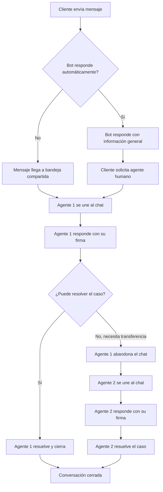

# Configurar Mensajes de Firma en la Bandeja de Entrada Compartida del Equipo

Establecer un Mensaje de Firma en E-SMART360 es un paso esencial para garantizar una comunicación consistente, profesional y personalizada. Un mensaje de firma bien configurado ayuda a reforzar la identidad de tu marca y aporta un toque humano a las interacciones con los clientes.

En una **bandeja de entrada compartida del equipo**, donde múltiples agentes colaboran para gestionar conversaciones, los Mensajes de Firma juegan un papel crucial para mantener el profesionalismo y la coherencia.

> **¿Qué es una bandeja de entrada compartida?** Es un sistema centralizado donde todo tu equipo de soporte puede ver, gestionar y responder conversaciones desde un solo lugar. Todos los agentes tienen visibilidad del historial completo, lo que evita respuestas duplicadas y garantiza una atención coherente. Funciona como un hub donde convergen todos los canales de comunicación: WhatsApp, Facebook Messenger, Instagram, Telegram y el chat de tu sitio web.

## ¿Qué es un Mensaje de Firma en E-SMART360?

Un Mensaje de Firma en E-SMART360 es un mensaje predefinido que se añade automáticamente al final de las respuestas de los agentes. Puede incluir el nombre del agente, su cargo y otros detalles personalizados para hacer las interacciones más profesionales y personales. La interfaz intuitiva de E-SMART360 te permite crear, personalizar y gestionar estos mensajes de forma sencilla.

Los Mensajes de Firma se pueden configurar en todos los canales disponibles:

- **WhatsApp**: Comunicación personalizada en la plataforma de mensajería más utilizada del mundo. Ideal para empresas que manejan grandes volúmenes de consultas y necesitan que cada agente se identifique claramente.
- **Facebook**: Cierres profesionales en respuestas enviadas a través de Facebook Messenger. Perfecto para páginas de negocio con actividad comercial en redes sociales.
- **Instagram**: Consistencia de marca en las respuestas a mensajes directos de Instagram. Fundamental para marcas con presencia visual y community management.
- **Telegram**: Interacciones mejoradas con los clientes en Telegram mediante firmas personalizadas. Útil para comunidades técnicas y grupos de soporte.
- **Chat Web**: Toque profesional en el soporte en tiempo real de tu sitio web. Es la primera impresión digital que muchos clientes tienen de tu negocio.

### WhatsApp

El canal más popular. Personaliza cada respuesta con la firma del agente que atiende, incluyendo nombre, cargo y datos de contacto visibles para el cliente.
  
### Facebook Messenger

Ideal para páginas de negocio. Cada respuesta en Messenger puede incluir una firma profesional que refuerce la identidad de tu marca.
  
### Instagram DM

Perfecto para marcas con presencia en redes. La firma mantiene la profesionalidad incluso en conversaciones informales.
  
### Multiplataforma

No importa por dónde te contacten. WhatsApp, Facebook, Instagram, Telegram o chat web: la firma se aplica automáticamente manteniendo la consistencia de tu marca.
  
## Beneficios de Usar Mensajes de Firma

### Para tu equipo

La implementación de mensajes de firma en tu bandeja de entrada compartida aporta beneficios tangibles a la operación diaria de tu equipo de soporte:

1. **Responsabilidad individual**: Cada agente firma sus respuestas, lo que permite hacer seguimiento de quién atendió cada conversación. Esto facilita la evaluación del desempeño y la calidad del servicio.
2. **Colaboración organizada**: Al requerir que los agentes se unan al chat antes de responder, se elimina el caos de múltiples agentes respondiendo simultáneamente. Cada miembro del equipo sabe quién está a cargo de cada conversación.
3. **Profesionalismo unificado**: Aunque cada agente pueda personalizar su firma, el formato y la estructura general aseguran una imagen de marca coherente en todas las interacciones.
4. **Trazabilidad**: Cuando un cliente es transferido entre agentes, la firma muestra claramente quién está atendiendo en cada momento, permitiendo una trazabilidad completa del historial de atención.

### Para tus clientes

Los beneficios para la experiencia del cliente son igualmente significativos:

1. **Confianza y transparencia**: Los clientes saben con quién están hablando en todo momento. Ver un nombre y un cargo genera confianza y humaniza la interacción digital.
2. **Continuidad en transferencias**: Cuando un cliente es transferido a otro agente, la firma le indica inmediatamente que está siendo atendido por una persona diferente, evitando la repetición de información.
3. **Canales de contacto claros**: La firma puede incluir información adicional como extensión telefónica, horario de atención o enlaces a recursos de autoayuda.
4. **Percepción de calidad**: Una comunicación con firmas profesionales transmite seriedad y compromiso con el servicio al cliente.

> **Dato clave:** Las empresas que implementan firmas personalizadas en su atención al cliente reportan un incremento promedio del 15% en la satisfacción del cliente (CSAT), ya que los usuarios valoran saber quién los está atendiendo y sentirse en un entorno de comunicación profesional.

## Guía Paso a Paso para Configurar Mensajes de Firma

### 1. Accede al Panel de Configuración

Para comenzar, inicia sesión en tu cuenta de E-SMART360 y navega a la sección **Configuración** desde el gestor del bot. Sigue estos pasos:

### Accede al Gestor del Bot

Desde el panel principal, haz clic en la opción **Gestor del Bot** (Bot Manager). Aquí encontrarás todas las herramientas para administrar tus bots y canales de comunicación.
  
### Selecciona Configuración

Una vez dentro del Gestor del Bot, selecciona la pestaña **Configuración** en el menú lateral. Esta sección agrupa todos los ajustes generales de tu cuenta, incluyendo los relacionados con la bandeja de entrada compartida.
  
### 2. Activa los Mensajes de Firma

Una vez en el panel de Configuración:

### Localiza la sección de firma

Busca la sección **Configuración de Mensaje de Firma** dentro del panel de ajustes. Generalmente se encuentra en la categoría de "Bandeja de Entrada Compartida" o "Chat en Vivo".
  
### Activa la función

Activa el interruptor **Habilitar Mensaje de Firma** para activar la funcionalidad. Verás que aparecen nuevas opciones de configuración relacionadas.
  
### Selecciona los canales

Elige en qué canales deseas que se apliquen los mensajes de firma. Puedes activarlos en todos los canales o solo en aquellos donde tu equipo tenga agentes asignados.
  
### Guarda los cambios iniciales

Haz clic en **Guardar Cambios** para confirmar la activación antes de personalizar el contenido.
  

> Al activar los Mensajes de Firma, también se habilita automáticamente la opción **Unirse al Chat**. Esto significa que los agentes deben unirse explícitamente a una conversación antes de poder responder, lo que garantiza responsabilidad y organización en la comunicación. Sin esta activación, cualquier agente podría responder a cualquier conversación, generando confusión.

### 3. Agrega un Mensaje de Firma Predeterminado

Después de activar la función, puedes configurar tu mensaje predeterminado:

1. En el campo **Mensaje de Firma Predeterminado**, ingresa la firma deseada. Por ejemplo:

   > *"Hola, soy \[Nombre\], agente de soporte de E-SMART360. ¿Cómo puedo ayudarte hoy?"*

2. Utiliza el marcador dinámico **\[Nombre\]** para que se complete automáticamente con el nombre del agente que está respondiendo.

3. Puedes incluir otros campos personalizados como el cargo, el departamento o un enlace a recursos de ayuda.

**Ejemplos de mensajes predeterminados efectivos:**

| Tipo de negocio | Ejemplo de firma predeterminada |
|-----------------|----------------------------------|
| Soporte técnico | *"Hola, soy \[Nombre\], del equipo de soporte técnico de E-SMART360. Estoy aquí para resolver tu consulta técnica."* |
| Ventas | *"¡Hola! Soy \[Nombre\], asesor comercial de E-SMART360. Cuéntame, ¿cómo puedo ayudarte a encontrar la solución perfecta para tu negocio?"* |
| Atención al cliente | *"Buenos días/tardes, soy \[Nombre\] del equipo de atención al cliente de E-SMART360. ¿En qué puedo ayudarte hoy?"* |

### 4. Personaliza las Firmas por Agente

Cada agente puede personalizar su propia firma:

### Ve a Configuración del Miembro

Desde la esquina superior derecha, haz clic en el icono de tu cuenta y selecciona **Mi Cuenta**. Este panel contiene la configuración personal de cada usuario.
  
### Edita tu firma personal

En la sección de configuración del miembro, busca el campo de firma y edítalo para incluir información específica como tu cargo, un saludo personalizado o datos de contacto adicionales.
  
### Añade datos de contacto opcionales

Puedes incluir información adicional como tu extensión telefónica, enlace a tu calendario de reservas, o un enlace a la base de conocimiento de la empresa.
  
### Guarda tu firma

Haz clic en **Guardar** para aplicar tu firma personalizada. A partir de este momento, todos tus mensajes incluirán automáticamente esta firma.
  

> **Ejemplo de firma personalizada:** *"Saludos cordiales, María García — Especialista en Soporte Técnico | E-SMART360 | Respuesta estimada en menos de 5 minutos | 📞 Ext. 204"*

Esta firma transmite profesionalismo, informa al cliente del tiempo de respuesta esperado y proporciona un canal de contacto adicional.

### 5. Configura el Indicador de Escritura

Puedes activar el **Indicador de Escritura** en la configuración de Mensajes de Firma de la Bandeja Compartida. Cuando está activado, se muestra automáticamente "escribiendo..." en WhatsApp cuando:

- Un agente comienza a redactar una respuesta.
- Un agente hace clic en la bandeja de chat (incluso antes de empezar a escribir).
- El bot prepara una respuesta para el cliente.

Esta funcionalidad informa proactivamente a los clientes de que un agente está comprometido con la conversación, lo que resulta especialmente útil durante las transferencias entre agentes, ya que señala actividad incluso si hay una breve pausa antes de la respuesta.

### ¿Por qué es importante el indicador de escritura?

El indicador de escritura reduce la incertidumbre del cliente. Cuando un cliente ve "escribiendo...", sabe que alguien está atendiendo su solicitud. Esto disminuye la ansiedad por espera y mejora la percepción del servicio, especialmente en momentos de alta demanda o cuando se transfiere la conversación entre agentes.

Estudios de UX muestran que los indicadores de escritura reducen hasta en un 40% los mensajes de seguimiento del tipo "¿sigues ahí?" o "¿me estás escuchando?", lo que disminuye la carga de trabajo del agente y mejora la eficiencia general del equipo.

### 6. Guarda Tus Cambios

Después de configurar tu mensaje de firma:

1. Haz clic en el botón **Guardar Cambios** para asegurarte de que todos los ajustes se apliquen correctamente.
2. Verifica que la configuración se haya guardado correctamente. El sistema mostrará una confirmación visual.
3. Si has realizado cambios en varias secciones, asegúrate de guardar cada una antes de salir del panel de configuración.

## Funcionalidades Opcionales para Personalización Avanzada

### Campos Dinámicos

E-SMART360 permite el uso de campos dinámicos para autocompletar automáticamente los datos del agente en el mensaje de firma. Puedes usar variables como:

- **\[Nombre\]**: Se reemplaza automáticamente con el nombre del agente que responde.
- **\[Cargo\]**: Muestra el rol del agente dentro de la empresa (ej. Soporte Técnico, Ejecutivo de Ventas).
- **\[Departamento\]**: Indica el área específica (soporte, ventas, facturación, postventa).
- **\[Teléfono\]**: Número de contacto directo del agente, si está configurado en su perfil.
- **\[Email\]**: Correo electrónico profesional del agente.
- **\[Horario\]**: Muestra el horario de atención del agente o del departamento.
- **\[URL Calendario\]**: Enlace directo para agendar citas o reuniones.

> **Consejo profesional:** Utiliza los campos dinámicos estratégicamente. Por ejemplo, en un equipo de ventas, la firma podría ser: *"Soy \[Nombre\], \[Cargo\] de E-SMART360 — Departamento de \[Departamento\]. Agenda una demo aquí: \[URL Calendario\]"*. Esto convierte cada respuesta en una oportunidad de conversión.

### Control de Respuestas del Bot

Puedes deshabilitar las respuestas automáticas del bot cuando los Mensajes de Firma están activados para garantizar interacciones exclusivamente humanas. Esta configuración es especialmente útil cuando:

- Un cliente ha solicitado explícitamente hablar con un agente humano.
- La conversación requiere un análisis complejo que el bot no puede realizar.
- Se necesita empatía y juicio humano para resolver un problema sensible.
- El cliente ha mostrado frustración o insatisfacción con las respuestas automatizadas.

**Cómo configurarlo:**

1. En el panel de Configuración, busca la sección **Control de Respuestas del Bot**.
2. Activa la opción **Deshabilitar bot cuando la firma está activa**.
3. Opcionalmente, configura un mensaje automático que informe al cliente que será atendido por un agente humano.

### Temporizador de Reactivación Automática

Establece el tiempo de reactivación automática del bot para garantizar seguimientos oportunos con los clientes. Por ejemplo, puedes configurar que el bot retome la conversación automáticamente después de 30 minutos de inactividad del agente.

**Valores recomendados según el tipo de servicio:**

| Tipo de servicio | Tiempo de reactivación | Justificación |
|------------------|------------------------|---------------|
| Soporte urgente | 5-10 minutos | Los clientes esperan respuestas rápidas |
| Ventas | 15-30 minutos | Tiempo razonable para consultar disponibilidad |
| Soporte general | 20-30 minutos | Permite al agente investigar sin presión |
| Postventa | 30-60 minutos | Consultas no urgentes que pueden esperar |

### Agentes de Soporte

Perfecto para equipos de atención al cliente que manejan decenas de conversaciones diarias. Cada agente identifica claramente quién responde, y los clientes saben con quién están hablando en todo momento. El temporizador de reactivación asegura que ninguna consulta quede sin respuesta si el agente se distrae o debe atender otro asunto.
  
### Equipos de Ventas

Los representantes de ventas pueden incluir su extensión directa o enlace de calendario en la firma, facilitando que los clientes agenden llamadas o reuniones inmediatamente. La reactivación automática del bot puede enviar un recordatorio amable si el cliente no ha respondido en cierto tiempo.
  
### Soporte Técnico

Los técnicos pueden mostrar su especialidad (soporte nivel 1, nivel 2, etc.) en la firma, dando transparencia al cliente sobre quién está resolviendo su caso. Si el técnico necesita escalar el caso, la firma del nuevo agente indicará claramente el cambio de nivel de soporte.
  
### Equipos Multicanal

Ideal para empresas que gestionan múltiples canales simultáneamente. La firma se adapta automáticamente al canal, pero mantiene una estructura coherente. Por ejemplo, en WhatsApp la firma puede ser más breve, mientras que en el chat web puede incluir más detalles.
  
## Cómo Probar Tu Mensaje de Firma

Antes de ponerlo en producción, es crucial probar la configuración de la firma:

### Únete a un chat como agente

Desde la bandeja de entrada compartida, busca una conversación activa y haz clic en **Unirse al Chat**. Si es la primera vez, asegúrate de que la función "Unirse al Chat" esté habilitada.
  
### Envía un mensaje de prueba

Redacta un mensaje de prueba y envíalo para verificar que la firma se adjunta correctamente al final. Revisa que los campos dinámicos se hayan reemplazado correctamente con tus datos.
  
### Verifica en todos los canales

Repite la prueba en diferentes canales (WhatsApp, Facebook, Instagram, Telegram, chat web) para asegurarte de que la firma se muestra correctamente en cada uno. Ten en cuenta que algunos canales pueden tener limitaciones de formato o caracteres.
  
### Prueba la transferencia entre agentes

Pide a un compañero que se una al mismo chat. Verifica que cuando el nuevo agente se une, la firma se actualiza automáticamente y el cliente recibe el mensaje de transición.
  
### Revisa desde la perspectiva del cliente

Pide a un compañero que revise la conversación desde el lado del cliente para confirmar que la firma se ve profesional, bien formateada y sin errores. Si es posible, prueba en diferentes dispositivos (móvil, escritorio).
  
## Funcionalidad de Transferencia de Chat (Join Chat / Unirse al Chat)

Las funciones **"Unirse al Chat"** y **"Mensaje de Firma"** son dos potentes herramientas diseñadas para mejorar el trabajo en equipo, aumentar la eficiencia del soporte al cliente y garantizar transiciones de comunicación fluidas. Permiten a los miembros del equipo unirse o abandonar conversaciones de forma sencilla.

### ¿Cómo funciona "Unirse al Chat"?

La función **"Unirse al Chat"** permite que un agente tome el control de una conversación en curso haciendo clic en el botón "Unirse al Chat". Una vez seleccionado, el panel de chat en vivo se recarga automáticamente y el nuevo agente puede continuar asistiendo al cliente sin problemas.

**Flujo detallado del proceso:**

1. **Agente actual identifica la necesidad de transferencia**: El agente que está atendiendo la conversación determina que otro miembro del equipo sería más adecuado para resolver la consulta.
2. **Agente actual se retira del chat**: Utiliza la opción "Abandonar Chat" para liberar la conversación.
3. **Nuevo agente recibe notificación**: El sistema muestra la conversación como disponible en la bandeja compartida.
4. **Nuevo agente hace clic en "Unirse al Chat"**: El panel se recarga y el nuevo agente toma el control.
5. **Mensaje de firma automático**: El sistema envía automáticamente la firma del nuevo agente, informando al cliente del cambio.

### Casos de uso de "Unirse al Chat":

- Un cliente solicita hablar con un miembro diferente del equipo por razones de confianza o preferencia personal.
- Un cliente está frustrado y el agente actual tiene dificultades para resolver el problema, siendo necesario un "fresh start" con otro agente.
- El equipo de soporte desea transferir la conversación a un miembro más especializado (por ejemplo, de soporte general a soporte técnico, o de ventas a Postventa).
- El agente actual termina su turno laboral y necesita transferir las conversaciones activas al agente entrante.

En estas situaciones, el agente actual puede transferir la conversación y el nuevo agente puede presentarse utilizando un Mensaje de Firma.

> **Importante:** Sin unirse al chat, los agentes pueden **ver** la conversación pero no pueden **responder** directamente. Esto asegura que solo los agentes asignados puedan interactuar, evitando confusiones y respuestas contradictorias. Es una capa de seguridad que protege tanto al cliente como al equipo.

### Beneficios de "Unirse al Chat" para tu equipo

1. **Evita respuestas duplicadas**: Dos agentes no pueden responder al mismo cliente simultáneamente, lo que elimina el riesgo de enviar información contradictoria.
2. **Claridad en las responsabilidades**: Cada conversación tiene un "propietario" claro en todo momento.
3. **Historial de atención completo**: El sistema registra qué agente atendió cada parte de la conversación, facilitando auditorías y evaluaciones de calidad.
4. **Flexibilidad operativa**: Los agentes pueden entrar y salir de conversaciones según su carga de trabajo y especialización.

### Personalización del Mensaje de Firma en Transferencias

Puedes personalizar el Mensaje de Firma desde **Configuración del Gestor del Bot > Configuración**.

- El mensaje puede incluir el nombre del nuevo agente usando la variable de nombre (ej. *"Hola, soy \[Nombre\], ejecutivo de ventas de E-SMART360. \[NombreAnterior\] me ha transferido tu caso para brindarte una atención más especializada."*).
- Después de realizar los cambios necesarios, asegúrate de guardar la configuración para que surtan efecto.

Personalizar el mensaje garantiza una experiencia profesional y fluida para el cliente durante las transiciones entre agentes. Una buena transición puede marcar la diferencia entre un cliente satisfecho y uno que abandona la conversación.

### Flujo completo: De la llegada del mensaje a la transferencia

## Estrategias Avanzadas para Mensajes de Firma

### Personalización por segmento de cliente

Puedes diseñar diferentes estrategias de firma según el tipo de cliente:

- **Clientes nuevos**: La firma puede incluir un enlace a una guía de bienvenida o un video tutorial sobre cómo usar tu producto.
- **Clientes VIP**: La firma puede incluir un número de contacto prioritario o un enlace a un portal exclusivo.
- **Clientes recurrentes**: La firma puede hacer referencia al historial de la relación, por ejemplo: *"Hola de nuevo, \[NombreCliente\]! Soy \[NombreAgente\], encantado de atenderte otra vez."*

### Integración con herramientas de productividad

Los mensajes de firma pueden integrarse con otras herramientas:

1. **CRM**: Si usas un CRM, la firma puede incluir el ID del cliente o el número de ticket para seguimiento interno.
2. **Calendario**: Incluye un enlace directo a tu calendario de citas para que los clientes agenden llamadas sin intermediación.
3. **Base de conocimiento**: Agrega un enlace a artículos relevantes de tu base de conocimiento para que los clientes puedan resolver dudas adicionales por sí mismos.
4. **Encuestas de satisfacción**: Al final de la interacción, la firma puede incluir un enlace a una encuesta CSAT (Customer Satisfaction Score).

### Buenas prácticas para redactar mensajes de firma efectivos

| Práctica | Descripción | Ejemplo |
|----------|-------------|---------|
| Sé breve | La firma debe ser concisa. 1-2 líneas como máximo. | ✅ *"Soy \[Nombre\], soporte E-SMART360"* |
| Sé específico | Indica tu rol o especialidad. | ✅ *"Soy \[Nombre\], especialista en facturación"* |
| Incluye acción | Invita al cliente a continuar la conversación. | ✅ *"¿Hay algo más en lo que pueda ayudarte?"* |
| Evita información sensible | No incluyas datos personales del agente. | ❌ *"Soy Ana Pérez, C.I. 12345678"* |
| Revisa la ortografía | Una firma con errores da mala imagen. | ✅ Revisa siempre antes de guardar. |

### ¿Puedo usar diferentes firmas para diferentes agentes?

Sí, cada agente puede configurar su propia firma personalizada en la sección de Configuración del Miembro. Esto es ideal para equipos donde cada miembro tiene un rol distinto o desea añadir un toque personal a sus interacciones. La firma predeterminada se usa como base, y cada agente puede sobrescribirla con su versión personalizada.

### ¿Puedo actualizar la firma más adelante?

¡Por supuesto! Puedes modificar el Mensaje de Firma en cualquier momento desde el panel de Configuración o desde la configuración individual de cada miembro. Los cambios se aplican inmediatamente después de guardar. No hay límite en la cantidad de veces que puedes actualizarla, así que siéntete libre de experimentar con diferentes versiones.

### ¿El Mensaje de Firma funciona en todos los canales de comunicación?

Sí, el Mensaje de Firma funciona perfectamente en todos los canales compatibles: WhatsApp, Facebook Messenger, Instagram, Telegram y Chat Web. Esto garantiza una comunicación coherente en todas las plataformas. Sin embargo, ten en cuenta que algunos canales pueden tener limitaciones en la longitud del mensaje o en los caracteres especiales permitidos. WhatsApp, por ejemplo, tiene un límite de 4096 caracteres por mensaje.

### ¿Qué sucede cuando activo el Mensaje de Firma?

Al activar el Mensaje de Firma, también se habilita automáticamente la opción **Unirse al Chat**. Esto requiere que los agentes se unan a un chat antes de poder responder, asegurando que solo los agentes responsables puedan participar en las conversaciones, mientras que otros pueden monitorear sin interferir. Además, se activa la funcionalidad de firma automática al final de cada respuesta. Si en el futuro decides desactivar los mensajes de firma, la opción "Unirse al Chat" permanecerá activa de forma independiente.

### ¿Un agente puede salir de un chat si es necesario?

Sí, los agentes tienen la opción de abandonar el chat una vez que su parte en la conversación ha terminado. Esto mantiene la bandeja de entrada organizada y permite que otros agentes tomen el control si es necesario. La conversación queda disponible para que otro miembro del equipo la retome. Cuando un agente abandona el chat, el sistema no envía ninguna notificación al cliente, por lo que la transición es transparente para el usuario final. El nuevo agente será quien se presente mediante su firma personalizada.

### ¿Se pueden programar firmas diferentes según el horario?

Actualmente, la configuración de firmas es estática, pero puedes cambiar la firma predeterminada manualmente según la hora del día. Por ejemplo, puedes tener una firma para horario laboral y otra para horario fuera de oficina. Simplemente actualiza el mensaje predeterminado en el panel de Configuración cuando sea necesario. Para equipos avanzados, se recomienda coordinar internamente los turnos para que cada agente tenga la firma adecuada según su horario.

### ¿Qué pasa si un agente no tiene configurada una firma personalizada?

Si un agente no ha personalizado su firma en la sección de Mi Cuenta, el sistema utilizará automáticamente el Mensaje de Firma Predeterminado configurado a nivel global. Esto asegura que ningún mensaje quede sin firma, manteniendo la profesionalidad en todas las interacciones. Recomendamos que todos los agentes configuren su firma personalizada para aprovechar al máximo esta funcionalidad.

## Ejemplos Prácticos

### Ejemplo 1: Transferencia de soporte básico a técnico

**Situación:** Un cliente contacta por un problema de facturación, pero durante la conversación se descubre que es un error técnico del sistema.

    **Flujo:**
    1. El agente de soporte responde con su firma estándar: *"Hola, soy Carlos, agente de soporte de E-SMART360. ¿Cómo puedo ayudarte?"*
    2. El agente identifica que necesita derivar el caso a soporte técnico.
    3. El agente actual se retira del chat usando "Abandonar Chat".
    4. El agente técnico hace clic en "Unirse al Chat".
    5. Automáticamente se envía la firma: *"Hola, soy Andrea, especialista en soporte técnico de E-SMART360. Carlos me ha transferido tu caso y estaré encantada de ayudarte con la incidencia técnica. ¿Puedes contarme de nuevo el problema para asegurarme de tener toda la información?"*

    **Resultado:** El cliente sabe exactamente con quién está hablando y por qué cambió el agente. La experiencia es fluida y profesional.
  
### Ejemplo 2: Atención multicanal con firma unificada

**Situación:** Una tienda online recibe consultas por WhatsApp, Instagram y chat web simultáneamente durante una promoción de ventas.

    **Flujo:**
    1. Tres agentes atienden diferentes canales, cada uno con su firma personalizada.
    2. Un cliente inicia en chat web y luego continúa por WhatsApp.
    3. El sistema muestra al cliente que es el mismo agente (porque la firma coincide en ambos canales).
    4. Si el cliente es transferido a otro agente, la firma se actualiza automáticamente.

    **Beneficio:** Consistencia de marca en todos los puntos de contacto. El cliente siempre sabe quién lo atiende, independientemente del canal. La experiencia omnicanal es fluida y profesional.
  
### Ejemplo 3: Gestión de crisis con transferencia rápida

**Situación:** Un cliente está visiblemente molesto por un retraso en la entrega de un pedido.

    **Flujo:**
    1. El agente inicial intenta calmar la situación pero el cliente sigue frustrado.
    2. El agente inicial usa "Abandonar Chat" y notifica internamente al supervisor.
    3. El supervisor se une al chat con una firma que denota autoridad: *"Hola, soy Laura, supervisora de atención al cliente de E-SMART360. Lamento las molestias. Me he puesto personalmente con tu caso para resolverlo a la mayor brevedad."*
    4. El cliente se siente escuchado y atendido por una persona con capacidad de decisión.

    **Resultado:** La situación se desescala rápidamente y el cliente sale satisfecho.
  
### Ejemplo 4: Atención postventa con firma informativa

**Situación:** Un cliente acaba de realizar una compra y es transferido al equipo de postventa para seguimiento.

    **Firma:** *"¡Felicidades por tu compra! Soy \[Nombre\], de postventa E-SMART360. Quiero asegurarme de que todo esté en orden. Si tienes cualquier duda sobre tu pedido #\[IDPedido\], aquí estoy para ayudarte. También puedes consultar nuestra guía de primeros pasos en \[URL Guía\]."*

    **Resultado:** El cliente recibe un seguimiento proactivo que mejora la experiencia postventa y reduce la probabilidad de devoluciones o quejas.
  
> **¿Sabías que...?** Según estudios de experiencia del cliente, el 73% de los consumidores valora positivamente que el agente se presente por su nombre al inicio de la interacción. Los mensajes de firma no solo profesionalizan tu servicio, sino que también humanizan la comunicación digital. Además, las empresas que implementan transferencias fluidas con mensajes de presentación ven una mejora del 25% en las tasas de retención de clientes.

## Solución de problemas comunes

### La firma no se muestra correctamente

Si la firma no aparece o se muestra con errores:

1. **Verifica que la función esté activada**: Revisa que
 el interruptor "Habilitar Mensaje de Firma" esté en la posición correcta.

2. **Comprueba los campos dinámicos**: Si usas variables como [Nombre], verifica que el agente tenga configurado su nombre en el perfil. Si el campo está vacío, la variable no se reemplazará.

3. **Revisa los permisos del agente**: Asegúrate de que el agente tenga los permisos necesarios para ver y usar la configuración de firma.

4. **Limpia la caché**: En ocasiones, los cambios pueden tardar unos minutos en reflejarse debido a la caché del sistema. Espera 2-3 minutos y vuelve a intentarlo.

5. **Contacta a soporte**: Si el problema persiste después de verificar todos los puntos anteriores, contacta al equipo de soporte de E-SMART360 para recibir asistencia personalizada.

### La firma se duplica en los mensajes

Si la firma aparece dos veces al final del mensaje:

1. **Revisa la configuración del bot**: Puede que el bot también esté configurado para añadir una firma automática. Desactiva cualquier firma duplicada en otras configuraciones.
2. **Verifica las integraciones**: Si usas integraciones de terceros (Zapier, Make, etc.), revisa que no estén añadiendo firmas adicionales.
3. **Prueba con un agente de prueba**: Crea un agente de prueba sin configuraciones adicionales para aislar el problema.

### El indicador de escritura no funciona

Si el indicador de escritura no se muestra a los clientes:

1. **Verifica la compatibilidad**: El indicador de escritura solo funciona en WhatsApp Cloud API. No está disponible en WhatsApp Business App.
2. **Comprueba la conexión**: Una conexión inestable puede impedir que el indicador se transmita correctamente.
3. **Reinicia la sesión**: Cierra sesión y vuelve a iniciarla para restablecer la conexión con el servidor.

## Preguntas Frecuentes Adicionales

### ¿Puedo usar emojis en los mensajes de firma?

¡Sí! Los emojis son compatibles en todos los canales. Puedes usarlos para hacer la firma más amigable y visual. Por ejemplo: "📞 Ext. 204" o "⏰ Respondo en menos de 5 min". Sin embargo, recomendamos usarlos con moderación para mantener el profesionalismo. Un par de emojis estratégicos pueden ser efectivos; demasiados pueden restar seriedad.

### ¿Hay un límite de caracteres para la firma?

El límite práctico está determinado por el límite de caracteres del canal. WhatsApp permite hasta 4096 caracteres por mensaje, por lo que tu firma debería ocupar no más de 200-300 caracteres para dejar espacio al contenido del mensaje. En Facebook Messenger el límite es menor, alrededor de 2000 caracteres. Recomendamos mantener las firmas entre 100 y 200 caracteres para una experiencia óptima en todos los canales.

### ¿Puedo tener firmas diferentes según el idioma del cliente?

Actualmente la configuración de firmas no es multilenguaje de forma nativa. Sin embargo, puedes crear diferentes agentes o configuraciones para cada idioma y asignar las conversaciones según el idioma del cliente. También puedes incluir un saludo bilingüe en la firma: "Hola / Hello, soy [Nombre]..."

### ¿Los mensajes de firma afectan el rendimiento del chat?

No, los mensajes de firma se añaden automáticamente en el momento del envío sin afectar el rendimiento del sistema. El proceso es instantáneo y transparente tanto para el agente como para el cliente. No hay demoras perceptibles en el envío de mensajes.

### ¿Puedo desactivar la firma para conversaciones específicas?

Actualmente la función se activa o desactiva a nivel global. Si necesitas excepciones puntuales, los agentes pueden eliminar manualmente la firma de mensajes específicos antes de enviarlos editando el texto. Sin embargo, esto no es recomendable como práctica habitual porque rompe la consistencia de la comunicación.

### ¿Cómo afecta la firma al tiempo de respuesta del agente?

La firma se añade automáticamente, por lo que no afecta el tiempo que el agente tarda en redactar y enviar su respuesta. El agente solo escribe el contenido del mensaje; la firma se agrega automáticamente al hacer clic en "Enviar". Esto mantiene los tiempos de respuesta óptimos.

## Actualizaciones y novedades

> **Nuevo: Indicador de Escritura en WhatsApp Cloud API (2025-06-15)**
> Se ha añadido el soporte para el indicador de escritura en la Configuración de Mensajes de Firma. Ahora los clientes pueden ver "escribiendo..." cuando un agente está redactando una respuesta, incluso antes de empezar a teclear. Esto mejora significativamente la experiencia de usuario, especialmente durante transferencias entre agentes.

> **Mejora: Variables dinámicas expandidas (2025-04-20)**
> Se han añadido nuevas variables dinámicas para los mensajes de firma: [Cargo], [Departamento], [Horario] y [URL Calendario]. Ahora los equipos pueden personalizar aún más sus firmas con información relevante para cada cliente.

## Conclusión

Configurar Mensajes de Firma en E-SMART360 es un proceso sencillo que mejora significativamente la comunicación de tu equipo. Con solo unos pasos, puedes garantizar profesionalismo, consistencia y un toque personal en cada interacción con el cliente. Esto es particularmente importante en una **bandeja de entrada compartida del equipo**, donde mantener un tono y una marca unificados es esencial.

La función "Unirse al Chat" es invaluable para equipos con múltiples miembros de soporte, permitiendo transiciones fluidas entre agentes mientras se mantiene el flujo de la conversación. El Mensaje de Firma mejora aún más la experiencia del cliente al mantenerlo informado sobre las transferencias entre agentes.

> **¿Listo para configurar tu Mensaje de Firma?** Inicia sesión en tu cuenta de E-SMART360 y configúralo hoy mismo. Tu equipo y tus clientes notarán la diferencia inmediatamente. Recuerda que una comunicación profesional y personalizada es la base de un excelente servicio al cliente.

## Recursos Adicionales

- **Guía completa del chat en vivo multicanal**: Aprende a gestionar conversaciones de WhatsApp, Facebook, Instagram, Telegram y chat web desde una sola bandeja de entrada. Descubre cómo optimizar los tiempos de respuesta y mejorar la satisfacción del cliente.
- **Cómo gestionar conversaciones de WhatsApp con el panel de chat en vivo**: Guía detallada sobre el uso del panel de chat en vivo para manejar conversaciones de WhatsApp de manera eficiente, incluyendo la gestión de etiquetas, notas internas y asignación de conversaciones.
- **Automatización de respuestas con IA**: Descubre cómo combinar mensajes de firma con respuestas automatizadas inteligentes para optimizar tu servicio al cliente, reduciendo los tiempos de espera y mejorando la eficiencia operativa.
- **Configuración avanzada de la bandeja de entrada compartida**: Guía para configurar roles y permisos de agentes, tiempos de escalado y políticas de atención personalizadas para tu equipo.
- **Transferencias eficientes entre agentes**: Mejores prácticas para gestionar las transferencias de conversaciones sin perder el contexto ni la calidad del servicio.

## Gestion Avanzada de la Bandeja de Entrada Compartida

### Roles y permisos de agentes

La bandeja de entrada compartida de E-SMART360 permite definir diferentes roles para los miembros del equipo, cada uno con distintos niveles de acceso y responsabilidades:

| Rol | Permisos | Ideal para |
|-----|----------|------------|
| **Agente** | Puede unirse a chats, responder mensajes y cerrar conversaciones. Puede configurar su firma personal. | Miembros del equipo de soporte |
| **Supervisor** | Todos los permisos de agente, mas la capacidad de monitorear conversaciones activas, reasignar chats y acceder a reportes. | Lideres de equipo |
| **Administrador** | Acceso completo a la configuracion global, incluyendo la activacion de mensajes de firma, control de bots y gestion de miembros. | Duenos de la cuenta o gerentes |

### Asignacion automatica de conversaciones

Puedes configurar reglas de asignacion automatica para que las conversaciones entrantes sean dirigidas al agente mas adecuado:

1. **Asignacion por carga de trabajo**: El sistema asigna la conversacion al agente con menos chats activos.
2. **Asignacion por especialidad**: Las conversaciones se asignan segun la categoria del mensaje (tecnico, ventas, facturacion).
3. **Asignacion por idioma**: Si el cliente escribe en un idioma especifico, la conversacion se asigna a un agente que hable ese idioma.

Cuando se usa la asignacion automatica, el mensaje de firma se personaliza automaticamente con los datos del agente asignado, sin intervencion manual.

### Etiquetas y categorizacion

La bandeja de entrada compartida permite anadir etiquetas a las conversaciones para organizarlas y filtrarlas:

- **Etiquetas de estado**: Pendiente, En Proceso, Resuelto, Escalado.
- **Etiquetas de prioridad**: Baja, Normal, Alta, Urgente.
- **Etiquetas de categoria**: Tecnico, Ventas, Facturacion, Postventa, Reclamo.
- **Etiquetas personalizadas**: Puedes crear tus propias etiquetas segun las necesidades de tu negocio.

Las etiquetas son visibles para todos los agentes y ayudan a mantener la bandeja de entrada organizada, especialmente cuando hay multiples conversaciones activas simultaneamente.

## Integracion con otras funcionalidades de E-SMART360

### Mensajes de firma + Respuestas automaticas con IA

Puedes combinar los mensajes de firma con las respuestas automaticas impulsadas por IA para crear un flujo de atencion hibrido:

1. **Fase 1 - Respuesta automatica**: El bot con IA responde al cliente con informacion general y recopila datos iniciales. La respuesta del bot incluye una firma institucional generica.
2. **Fase 2 - Activacion de agente**: Cuando el bot detecta que la conversacion requiere intervencion humana, notifica a los agentes disponibles.
3. **Fase 3 - Agente humano**: El agente se une al chat y su firma personalizada reemplaza automaticamente la firma generica del bot, indicando al cliente que ahora esta siendo atendido por una persona real.

Este flujo hibrido garantiza que los clientes reciban respuestas rapidas para consultas sencillas (mediante IA) y atencion personalizada para casos complejos (mediante agentes humanos), con transiciones fluidas y profesionales gracias a los mensajes de firma.

### Mensajes de firma + Catalogo de WhatsApp

Si utilizas el catalogo de productos de WhatsApp, puedes incluir enlaces directos a productos en la firma del agente. Por ejemplo:

> *"Soy [Nombre], asesor comercial de E-SMART360. Te interesa alguno de nuestros productos? Puedes ver nuestro catalogo completo aqui: [Enlace al catalogo]"*

Esto convierte cada interaccion de soporte en una oportunidad de venta adicional, sin ser invasivo.

## Configuracion de politicas de atencion

### Politica de tiempo de respuesta

Puedes configurar alertas cuando un agente supera el tiempo maximo de respuesta:

1. Ve a **Configuracion > Bandeja de Entrada Compartida > Politicas**.
2. Define el tiempo maximo de respuesta (ej. 5 minutos para consultas urgentes, 30 minutos para consultas generales).
3. Configura las acciones a tomar cuando se supere el tiempo: notificacion al supervisor, reasignacion automatica, o escalado a otro agente.

### Politica de cierre de conversaciones

Configura reglas para el cierre automatico de conversaciones:

- **Cierre por inactividad**: Si el cliente no responde en X tiempo, la conversacion se marca como "Resuelta" automaticamente.
- **Cierre por horario**: Las conversaciones fuera del horario laboral se cierran con un mensaje automatico y el agente retoma al dia siguiente.
- **Cierre por resolucion**: Cuando el agente marca la conversacion como resuelta, se envia automaticamente una encuesta de satisfaccion al cliente.

## Preguntas Frecuentes sobre la bandeja de entrada compartida

### Cuantos agentes pueden trabajar simultaneamente en la bandeja compartida?

No hay un limite maximo de agentes que puedan trabajar simultaneamente. La bandeja de entrada compartida de E-SMART360 esta disenada para escalar desde equipos pequenos de 2-3 agentes hasta departamentos completos de soporte con decenas de agentes. El sistema gestiona automaticamente los permisos de acceso y las reglas de asignacion para mantener la organizacion.

### Se puede usar la bandeja compartida sin mensajes de firma?

Si, puedes usar la bandeja de entrada compartida sin mensajes de firma si lo prefieres. Sin embargo, recomendamos encarecidamente activarlos, ya que mejoran la experiencia del cliente y la organizacion del equipo. La funcion "Unirse al Chat" funciona de forma independiente, incluso si los mensajes de firma estan desactivados.

### Como se manejan las conversaciones fuera del horario laboral?

Puedes configurar el bot para que responda automaticamente fuera del horario laboral con un mensaje de "fuera de oficina", y cuando los agentes vuelvan a estar disponibles, pueden unirse a las conversaciones pendientes. La firma del agente se activara automaticamente al unirse, informando al cliente que ahora esta siendo atendido.

### Los mensajes de firma aparecen en las notificaciones push?

Depende del canal. En WhatsApp, el mensaje completo (incluyendo la firma) aparece en la notificacion. En otros canales como Facebook Messenger, la notificacion puede truncarse. Recomendamos que la informacion mas importante este al inicio del mensaje, no solo en la firma.

### Puedo exportar el historial de conversaciones con las firmas incluidas?

Si, E-SMART360 permite exportar el historial completo de conversaciones, incluyendo los mensajes de firma. Esto es util para auditorias, analisis de calidad, y cumplimiento normativo. La exportacion incluye marcas de tiempo y el nombre del agente que respondio en cada mensaje.

## Referencia rapida de configuracion

### Checklist de configuracion inicial

Para asegurarte de que todo esta correctamente configurado, sigue esta lista de verificacion:

- [ ] Activar "Habilitar Mensaje de Firma" en el panel de Configuracion.
- [ ] Configurar el mensaje de firma predeterminado a nivel global.
- [ ] Verificar que todos los agentes tengan configurada su firma personal.
- [ ] Activar "Indicador de Escritura" si usas WhatsApp Cloud API.
- [ ] Configurar el temporizador de reactivacion automatica del bot.
- [ ] Definir los canales donde se aplicaran los mensajes de firma.
- [ ] Probar la configuracion en cada canal.
- [ ] Capacitar al equipo sobre el uso de "Unirse al Chat" y "Abandonar Chat".
- [ ] Configurar las politicas de tiempo de respuesta y cierre de conversaciones.
- [ ] Revisar la configuracion de roles y permisos de los agentes.

### Atajos y consejos para agentes

| Accion | Como hacerlo |
|--------|-------------|
| Unirse a un chat | Haz clic en "Unirse al Chat" en la conversacion deseada |
| Abandonar un chat | Usa la opcion "Abandonar Chat" en el menu de la conversacion |
| Ver firma actual | Ve a Mi Cuenta > Configuracion de Firma |
| Editar firma personal | Mi Cuenta > campo de firma > Guardar |
| Ver agentes en un chat | Los nombres aparecen en la cabecera de la conversacion |
| Notificar al supervisor | Usa la opcion "Solicitar ayuda" en el menu de la conversacion |

## Resumen final

Configurar Mensajes de Firma en E-SMART360 es una inversion de pocos minutos que tiene un impacto significativo en la calidad de tu servicio al cliente. No solo profesionaliza la comunicacion, sino que tambien organiza el trabajo del equipo, facilita las transferencias entre agentes y mejora la experiencia general del cliente.

La combinacion de las funciones "Mensaje de Firma", "Unirse al Chat" e "Indicador de Escritura" convierte a la bandeja de entrada compartida de E-SMART360 en una herramienta poderosa para equipos de soporte, ventas y atencion al cliente de todos los tamanos.

Recuerda que la clave esta en la personalizacion: cuanto mas adaptes la firma a tu marca y a las necesidades de tus clientes, mejores seran los resultados. Experimenta con diferentes formatos, revisa las metricas de satisfaccion y ajusta segun los comentarios de tu equipo y tus clientes.

> **Necesitas ayuda?** El equipo de E-SMART360 esta disponible para ayudarte con la configuracion de tu bandeja de entrada compartida. No dudes en contactarnos si tienes preguntas o necesitas asistencia personalizada. Estamos aqui para ayudarte a ofrecer la mejor experiencia de atencion al cliente posible.
