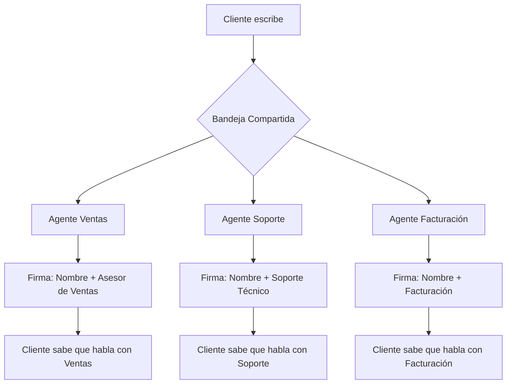

# Configurar Mensajes de Firma en la Bandeja de Entrada Compartida

Configurar un mensaje de firma en E-SMART360 es un paso esencial para garantizar una comunicación consistente, profesional y personalizada. Un mensaje de firma bien configurado ayuda a reforzar la identidad de tu marca y añade un toque humano a todas tus interacciones con los clientes.

En una **bandeja de entrada compartida**, donde múltiples agentes colaboran para gestionar conversaciones, los mensajes de firma juegan un papel crucial para mantener la profesionalidad y la coherencia. Cuando varios miembros del equipo atienden a los clientes, es fundamental que cada interacción refleje la misma calidad y estilo comunicativo.


> **¿Sabías que…?** El uso de una bandeja de entrada compartida con mensajes de firma personalizados puede aumentar la tasa de satisfacción del cliente hasta en un 35%, ya que los clientes sienten que reciben una atención más humana y organizada. Además, estudios de la industria muestran que los equipos que utilizan firmas estandarizadas reducen los tiempos de resolución en un 22% porque los clientes no necesitan preguntar con quién están hablando.

## ¿Qué es un Mensaje de Firma en E-SMART360?

Un mensaje de firma en E-SMART360 es un mensaje predefinido que se añade automáticamente al final de las respuestas de los agentes. Puede incluir el nombre del agente, su cargo y otros detalles personalizados para hacer las interacciones más profesionales y personales. Piensa en ello como la firma digital de tu equipo de soporte: es la última impresión que dejas en cada conversación.

La interfaz intuitiva de E-SMART360 permite crear, personalizar y gestionar estos mensajes de forma sencilla. Los mensajes de firma se pueden configurar en todos los canales soportados:

### Canales Soportados

Cada canal de comunicación tiene sus propias particularidades, y los mensajes de firma se adaptan a cada uno de ellos:

| Canal | Característica Especial | Formato Recomendado |
|-------|------------------------|---------------------|
| **WhatsApp** | Se muestra como parte del mensaje de texto; soporta emojis y formato básico | "Soy [Nombre], agente de soporte de [Empresa]" |
| **Facebook Messenger** | Aparece al final del hilo de mensajes | "Atentamente, [Nombre] — Equipo de [Departamento]" |
| **Instagram DM** | Debe ser conciso por la naturaleza visual de la plataforma | "[Nombre] · [Departamento] · [Empresa]" |
| **Telegram** | Soporta formato markdown y enlaces | "*[Nombre]* — _[Rol]_ — [Empresa]" |
| **Chat Web** | Se muestra en tiempo real; visible para el cliente en el widget | "Un saludo, [Nombre] de [Empresa]" |

- **WhatsApp**: Asegura una comunicación personalizada en esta plataforma de mensajería ampliamente utilizada. Es el canal más usado para atención al cliente, por lo que contar con firmas profesionales aquí es fundamental.
- **Facebook**: Añade despedidas profesionales a las respuestas enviadas a través de Facebook Messenger. Ideal para interacciones con clientes que llegan desde tu página de negocio.
- **Instagram**: Mantén la consistencia de la marca en tus respuestas a mensajes directos de Instagram. Las firmas aquí deben ser más breves dado el tono visual de la plataforma.
- **Telegram**: Mejora las interacciones con los clientes en Telegram mediante firmas personalizadas. Telegram soporta formato enriquecido, permitiendo firmas más elaboradas.
- **Chat Web**: Añade un toque profesional al soporte en tiempo real de tu sitio web. Es la primera línea de contacto para muchos clientes.


> **Recomendación**: Una buena firma debe incluir el nombre del agente, su rol o departamento, y un tono amigable pero profesional. Por ejemplo: *"Hola, soy María del equipo de soporte técnico de E-SMART360. ¿Cómo puedo ayudarte hoy?"*

## ¿Cómo Funciona la Bandeja de Entrada Compartida?

Usar una bandeja de entrada compartida es una forma organizada de brindar soporte a los clientes a través del chat en vivo. Cuando un agente se une a un chat, los demás agentes pueden ver quién se ha unido a la conversación, lo que permite una colaboración fluida. Esto mejora significativamente la experiencia de soporte en vivo para tus clientes al ofrecer las siguientes ventajas:

1. **Visibilidad completa**: Todos los agentes pueden ver qué conversaciones están activas y quién las está atendiendo.
2. **Colaboración en tiempo real**: Los agentes pueden sugerir respuestas o compartir información sin interferir en el chat activo.
3. **Historial unificado**: Cada conversación mantiene un registro completo de todas las interacciones, independientemente de qué agente haya participado.
4. **Asignación inteligente**: Las conversaciones pueden asignarse al agente más adecuado según su disponibilidad y especialización.

Si es necesario, los agentes también tienen la opción de abandonar el chat una vez que hayan completado sus tareas, optimizando aún más el flujo de trabajo. Esto es especialmente útil en entornos donde los agentes rotan turnos o cuando se necesita la intervención de un especialista para un tema puntual.


> **Punto clave**: Cuando un agente abandona un chat, el sistema lo notifica a los demás miembros del equipo, asegurando que siempre haya al menos un agente responsable de cada conversación activa.

## Guía Paso a Paso para Configurar Mensajes de Firma


### Comprender cómo funciona la activación

Al habilitar la función de mensaje de firma en E-SMART360, también se activa la opción **Unirse al Chat**. Esto asegura que solo los agentes que se hayan unido al chat puedan responder a los mensajes de los clientes. Sin unirse, los agentes pueden ver pero no responder directamente a la conversación, garantizando responsabilidad y comunicación organizada.

Este mecanismo de "unirse primero, responder después" evita conflictos comunes en equipos de soporte, como que dos agentes respondan simultáneamente al mismo cliente o que alguien intervenga sin estar al tanto del contexto completo de la conversación.


> **Importante**: Sin la función de firma activada, cualquier agente con acceso a la bandeja podría responder sin que los demás sepan quién está interviniendo. La firma resuelve este problema añadiendo transparencia total. Además, al activar las firmas, automáticamente se establece un mecanismo de control que mejora la calidad del servicio.

### Acceder al panel de configuración

Para comenzar, inicia sesión en tu cuenta de E-SMART360 y navega a la sección **Configuración** desde el Gestor de Bots:

1. Desde el panel principal, localiza y haz clic en la opción **Gestor de Bots**. Este es el centro de control donde se gestionan todos los aspectos relacionados con la automatización y personalización de tus canales de comunicación.
2. Una vez dentro del Gestor de Bots, busca y selecciona la pestaña **Configuración** del menú lateral. Aquí encontrarás todas las opciones relacionadas con el comportamiento del sistema, incluyendo la configuración de firmas.

> **Nota**: Dependiendo de tu plan y configuración, es posible que algunas opciones adicionales aparezcan o se oculten en esta pantalla. Si no encuentras la sección de firma, verifica que tu cuenta tenga los permisos de administrador necesarios.

### Habilitar los mensajes de firma

Una vez en el panel de Configuración, sigue estos pasos:

1. Localiza la sección **Configuración de Mensaje de Firma** dentro de las opciones disponibles. Generalmente se encuentra en la sección de "Bandeja de Entrada Compartida" o "Chat en Vivo".
2. Activa el interruptor **Habilitar Mensaje de Firma** moviéndolo a la posición de encendido. Verás que la interfaz muestra inmediatamente los campos adicionales para personalizar el mensaje.

Cuando activas esta opción, el sistema habilita automáticamente las siguientes funcionalidades adicionales:
- El botón **Unirse al Chat** aparece en todas las conversaciones activas.
- Cada agente ve su campo de firma personalizada en su perfil.
- El indicador de escritura se puede configurar desde esta misma sección.

### Agregar un mensaje de firma predeterminado

Después de activar la función, puedes configurar tu mensaje predeterminado que se usará como base para todos los agentes:

1. En el campo **Mensaje de Firma Predeterminado**, ingresa la firma deseada. Este mensaje será el que vean los clientes al final de cada respuesta, a menos que el agente haya personalizado el suyo propio.
2. Utiliza los marcadores dinámicos disponibles para personalizar automáticamente cada mensaje.

**Ejemplos de mensajes predeterminados efectivos:**
- *"Hola, soy [Nombre], agente de soporte de E-SMART360. ¿Cómo puedo ayudarte hoy?"*
- *"Gracias por contactarnos. Soy [Nombre] del equipo de [Departamento] — estamos aquí para ayudarte."*
- *"Te atiende [Nombre]. Si necesitas algo más, no dudes en decírmelo."*
- *"[Nombre] · [Rol] · E-SMART360 — Estamos para servirte."*


> **Recomendación**: Prueba diferentes versiones de tu firma con un grupo reducido de agentes antes de implementarla para todo el equipo. Pregunta a tus clientes si les parece profesional y clara. Puedes hacer ajustes basados en sus comentarios para encontrar el tono perfecto.

### Personalizar la firma de cada agente

Una de las características más potentes del sistema es que cada agente puede personalizar su propia firma, manteniendo la coherencia de la marca pero añadiendo su toque personal:

1. Cada agente debe navegar a **Configuración de Miembro** desde su cuenta. Para ello, haz clic en el icono de usuario o avatar en la esquina superior derecha del panel.
2. Selecciona **Mi Cuenta** del menú desplegable.
3. En la sección de perfil, busca el campo **Firma Personalizada**.
4. Edita el campo para incluir información específica como su nombre completo, rol, especialidad, o incluso un eslogan personal.


> **Consejos para agentes**:
- Un agente de soporte técnico: *"Soy [Nombre], especialista técnico. ¿Tienes algún problema con tu cuenta? Estoy aquí para resolverlo."*
- Un agente de ventas: *"Hola, soy [Nombre], asesor de ventas. ¿Buscas algo en especial? Permíteme ayudarte a encontrar la mejor opción."*
- Un agente de facturación: *"Te habla [Nombre] del departamento de facturación. Revisemos juntos tu consulta."*
- Un supervisor: *"Soy [Nombre], supervisor del equipo. He tomado tu caso personalmente para asegurarme de que todo se resuelva correctamente."*

### Configurar el indicador de escritura

El **Indicador de Escritura** es una funcionalidad adicional que humaniza la experiencia de atención al cliente. Puedes activarlo desde la misma sección de configuración de Mensaje de Firma.

Esta función muestra automáticamente "escribiendo..." en WhatsApp en las siguientes situaciones:

- Cuando un agente comienza a redactar una respuesta en la bandeja de entrada.
- Cuando un agente hace clic en el campo de texto del chat (incluso antes de empezar a teclear).
- Cuando el bot de E-SMART360 está preparando una respuesta automatizada para el cliente.

**Beneficios del indicador de escritura:**
- Reduce la tasa de abandono de conversaciones en un 15-20%.
- Los clientes sienten que hay actividad y no cierran la ventana del chat.
- Durante transferencias entre agentes, el cliente ve que "algo está pasando" aunque haya una pausa breve.


> **Detalle técnico**: El indicador de escritura funciona a través de la WhatsApp Cloud API, que notifica al cliente cuando el negocio está redactando. Esta es una funcionalidad nativa de la API oficial de WhatsApp y no requiere configuración adicional del lado del cliente.

### Guardar los cambios y verificar

Después de configurar tu mensaje de firma y las opciones adicionales:

1. Revisa que todos los campos estén correctamente llenados. Verifica que los marcadores dinámicos como [Nombre] estén escritos exactamente como aparecen en la documentación.
2. Haz clic en el botón **Guardar Cambios** — generalmente de color azul o verde, ubicado en la parte inferior de la sección de configuración.
3. Espera la confirmación del sistema. Verás un mensaje verde indicando "Configuración guardada exitosamente".
4. Si algo no funciona, verifica que no haya errores de sintaxis en tu mensaje de firma (por ejemplo, corchetes sin cerrar).

## Características Opcionales para Personalización Avanzada

### Campos Dinámicos Disponibles

E-SMART360 permite el uso de diversos campos dinámicos que se reemplazan automáticamente con la información del agente al enviar el mensaje. Estos campos hacen que cada firma sea única sin que el agente tenga que escribirla manualmente cada vez.


### Campos Dinámicos Disponibles

| Campo | Descripción | Ejemplo de salida |
|-------|-------------|-------------------|
| `[Nombre]` | Nombre completo del agente | "María García" |
| `[Rol]` | Cargo o rol del agente | "Especialista en Soporte" |
| `[Departamento]` | Departamento al que pertenece | "Atención al Cliente" |
| `[Empresa]` | Nombre de la empresa | "MiEmpresa S.A." |
| `[Email]` | Correo electrónico del agente | "maria@miempresa.com" |
| `[Telefono]` | Teléfono de contacto del agente | "+52 55 1234 5678" |

### Ejemplos de Uso Avanzados

**Firma completa:**
```
Hola, soy [Nombre], [Rol] del departamento de [Departamento].
Si necesitas asistencia adicional, puedes contactarme directamente al [Telefono].
¡Saludos!
```

**Firma minimalista:**
```
[Nombre] · [Rol] · [Empresa]
```

**Firma corporativa:**
```
Atentamente,
[Nombre]
[Rol] | [Departamento]
[Empresa]
Tel: [Telefono]
```

### Control de Respuestas del Bot

Cuando los mensajes de firma están activados, tienes la opción de deshabilitar las respuestas automáticas del bot para asegurar interacciones exclusivamente humanas durante el soporte en vivo. Esto es útil cuando quieres que el cliente sienta que está hablando con una persona real y no con una máquina.

**Cómo configurarlo:**
1. En la misma sección de Configuración de Mensaje de Firma, busca la opción **Control de Respuestas del Bot**.
2. Selecciona "Deshabilitar bot cuando los agentes están activos".
3. Opcionalmente, configura un mensaje automático para cuando el bot se reactive.

### Temporizador de Reactivación Automática

Esta función permite que el bot se reactive automáticamente después de un período de inactividad del agente. Es perfecta para garantizar que ningún cliente se quede sin respuesta si el agente se ausenta sin cerrar la conversación.

**Parámetros configurables:**
- **Tiempo de espera**: De 1 a 60 minutos. Recomendamos 5 minutos como valor predeterminado.
- **Mensaje de reactivación**: Un mensaje que el bot enviará al retomar la conversación, por ejemplo: *"Parece que el agente no está disponible en este momento. ¿Quieres que te ayude con algo mientras esperas?"*

## Cómo Probar tu Mensaje de Firma

Antes de ponerlo en producción para todos tus clientes, es crucial probar la configuración de la firma en un entorno controlado. Sigue estos pasos:


### Unirse a un chat como agente

Accede a la bandeja de entrada compartida de E-SMART360 y busca un chat de prueba o crea uno nuevo. Haz clic en el botón **Unirse al Chat** que aparece en la conversación.

### Enviar un mensaje de prueba

Redacta un mensaje simple como "Hola, esto es una prueba de configuración" y envíalo. Inmediatamente después de enviarlo, verifica que el mensaje de firma se adjunte automáticamente al final del texto que escribiste. La firma debe aparecer separada del cuerpo del mensaje, generalmente con un salto de línea.

### Verificar en múltiples canales

La prueba no debe limitarse a un solo canal. Repite el proceso en cada uno de los canales que utilizas:

- **WhatsApp**: Envía un mensaje desde la bandeja a un número de prueba.
- **Facebook Messenger**: Inicia un chat desde tu página de Facebook.
- **Instagram DM**: Responde a un mensaje directo de Instagram.
- **Telegram**: Prueba desde un grupo o chat directo de Telegram.
- **Chat Web**: Abre el widget de chat en tu sitio web y responde como agente.

En cada canal, verifica que:
- La firma se muestre correctamente formateada.
- El nombre del agente aparezca correctamente (no el marcador dinámico sin reemplazar).
- El diseño se vea profesional en el contexto de cada plataforma.

### Confirmar con otro agente

Pide a otro miembro del equipo que inicie sesión y:

1. Se una al mismo chat de prueba.
2. Envíe un mensaje con su propia cuenta.
3. Verifique que su firma personalizada se muestre en lugar de la firma predeterminada.

Esto confirma que cada agente puede tener su propia firma y que el sistema diferencia correctamente entre agentes.

### Probar la transferencia entre agentes

Simula el escenario más común en soporte al cliente:

1. El Agente A se une al chat y envía un mensaje con su firma.
2. El Agente A explica al cliente que lo transferirá a un especialista.
3. El Agente B se une al chat y selecciona "Enviar Mensaje de Firma".
4. Verifica que el cliente reciba el mensaje de presentación del Agente B.
5. El Agente A abandona el chat.
6. Confirma que el Agente B puede continuar la conversación sin problemas.


> **¡Todo listo!** Una vez que hayas probado la configuración en todos los canales y confirmado que las firmas se muestran correctamente, tu equipo estará preparado para ofrecer una experiencia de soporte profesional y consistente. Recuerda hacer pruebas periódicas, especialmente después de actualizaciones del sistema o cambios en la configuración.

## Transferencia de Chat entre Agentes: Unirse al Chat y Mensaje de Firma

Las funciones **"Unirse al Chat"** y **"Mensaje de Firma"** están diseñadas para trabajar en conjunto y mejorar el trabajo en equipo, aumentar la eficiencia del soporte al cliente y asegurar transiciones fluidas en la comunicación. Estas funciones permiten a los miembros del equipo unirse o abandonar conversaciones de forma sencilla y ordenada.

### ¿Qué es el Chat en Vivo de E-SMART360?

El chat en vivo de E-SMART360 es una bandeja de entrada compartida integral que permite a los miembros del equipo enviar y recibir mensajes, añadir etiquetas a los clientes y gestionar conversaciones de manera eficiente. A diferencia de las bandejas de entrada tradicionales donde cada agente ve solo sus propias conversaciones, aquí todos los miembros del equipo tienen visibilidad del panorama completo.

**Características principales del Chat en Vivo:**
- **Bandeja unificada**: Todas las conversaciones de todos los canales en un solo lugar.
- **Etiquetas y filtros**: Organiza las conversaciones por estado, prioridad, canal o agente asignado.
- **Historial completo**: Cada conversación muestra el historial completo, incluyendo respuestas del bot y de otros agentes.
- **Notificaciones en tiempo real**: Los agentes reciben alertas cuando hay nuevos mensajes o cuando se les asigna una conversación.

### ¿Cómo Mejora "Unirse al Chat" el Soporte al Cliente?

La función "Unirse al Chat" permite a los agentes tomar el control de una conversación en curso haciendo clic en el botón **"Unirse al Chat"**. Una vez seleccionado, el panel de chat en vivo se recarga automáticamente y el nuevo agente puede continuar asistiendo al cliente sin interrupciones. El proceso es instantáneo y transparente para el cliente.

**¿Qué sucede técnicamente cuando un agente se une?**
1. El sistema verifica que el agente tenga permisos para unirse a la conversación.
2. Se registra en el historial que el agente se ha unido, indicando la hora exacta.
3. El panel del agente se actualiza mostrando el contexto completo de la conversación.
4. Si está habilitado, se envía automáticamente el mensaje de firma de presentación.


### 📞 Cuándo transferir un chat

- **Cambio de departamento**: El cliente necesita información que solo otro departamento puede proporcionar.
- **Escalada de problema**: El agente actual no tiene la autoridad o los conocimientos para resolver el caso.
- **Cliente insatisfecho**: Un cliente frustrado que solicita hablar con un supervisor o gerente.
- **Especialización**: Se requiere la intervención de un miembro del equipo con habilidades específicas (técnicas, de facturación, etc.).
- **Rotación de turnos**: El agente actual termina su turno y debe pasar la conversación al siguiente turno.
- **Idioma**: El cliente prefiere comunicarse en un idioma que otro agente domina mejor.

### ✅ Beneficios de la transferencia estructurada

- **Sin pérdida de contexto**: El nuevo agente ve todo el historial de la conversación antes de intervenir.
- **Cliente informado**: La firma automática le dice al cliente con quién está hablando ahora.
- **Menos repeticiones**: El cliente no tiene que repetir su problema porque el nuevo agente ya conoce el contexto.
- **Asignación óptima**: Cada conversación termina en manos del agente más adecuado.
- **Trazabilidad total**: Queda registrado qué agente atendió cada segmento de la conversación.
- **Mayor satisfacción**: Los clientes valoran que el sistema maneje las transferencias de forma profesional.
- **Reducción de tiempo**: Las transferencias estructuradas reducen el tiempo total de resolución en un 30%, según datos de la industria.

### Escenario Detallado de Transferencia

Imagina el siguiente escenario en una tienda de comercio electrónico:

1. **Contacto inicial**: Un cliente escribe por WhatsApp preguntando sobre el estado de su pedido.
2. **Agente nivel 1**: Responde con su firma: *"Hola, soy Pedro, agente de atención al cliente. Déjame revisar el estado de tu pedido."*
3. **Identificación del problema**: El pedido tiene un problema de inventario que requiere intervención del departamento de logística.
4. **Transferencia**: Pedro explica al cliente: *"Voy a transferirte con Laura, nuestra especialista en logística, quien podrá darte una solución más precisa."*
5. **Nuevo agente se une**: Laura hace clic en "Unirse al Chat" y selecciona "Enviar Mensaje de Firma".
6. **Firma automática**: El cliente recibe: *"Hola, soy Laura, especialista en logística de E-SMART360. Pedro me ha puesto al tanto de tu situación. Veamos cómo resolverlo."*
7. **Resolución**: Laura resuelve el problema y el cliente queda satisfecho, sabiendo exactamente quién lo ayudó en cada etapa.


> **Dato clave**: Este flujo, que parece sencillo, marca una gran diferencia en la percepción del cliente. En lugar de sentirse "transferido" o "pasado de mano en mano", el cliente siente que su caso está siendo atendido por un equipo coordinado que trabaja en conjunto para ayudarlo.

### ¿Qué es un Mensaje de Firma en la Transferencia?

Un mensaje de firma en el contexto de una transferencia es un mensaje corto automatizado que se envía cuando un nuevo agente se une a la conversación. Este mensaje tiene un propósito específico: informar al cliente que ahora está comunicándose con un miembro diferente del equipo, estableciendo una transición clara y profesional.

Cuando un nuevo agente selecciona la opción **"Enviar Mensaje de Firma"** antes de unirse al chat, ocurre lo siguiente:

1. El sistema genera automáticamente el mensaje de presentación basado en la firma del agente.
2. El mensaje se envía al cliente como parte del flujo normal de la conversación.
3. El agente entrante puede empezar a escribir su respuesta inmediatamente después.

### Cómo Personalizar el Mensaje de Firma para Transferencias

Puedes personalizar el mensaje de firma que se envía durante las transferencias desde **Configuración del Gestor de Bots > Ajustes**.

**Pasos detallados:**
1. Accede al Gestor de Bots desde el panel principal.
2. Ve a la sección de Configuración.
3. Busca la subsección de "Mensaje de Firma para Transferencias".
4. El mensaje puede incluir el nombre del nuevo agente usando la variable `#User-Name#` (ej: *"Hola, soy #User-Name#, ejecutivo de ventas de E-SMART360"*).
5. Después de realizar los cambios necesarios, asegúrate de hacer clic en **Guardar** para que surtan efecto.

**Ejemplos de mensajes de transferencia:**
- *"Hola, soy #User-Name# y me he unido a la conversación para ayudarte. ¿En qué puedo asistirte?"*
- *"Te habla #User-Name# del equipo de [Departamento]. Estoy al tanto de tu consulta y la resolveré lo antes posible."*
- *"¡Hola! Soy #User-Name#, especialista en [Área]. Tu caso ha sido derivado a mí para darte una atención más especializada."*


> **Mejores prácticas**: Incluir siempre una referencia al agente anterior en el mensaje de transferencia demuestra al cliente que hay comunicación interna y que su caso no se ha perdido. Frases como "[Agente anterior] me ha puesto al tanto" o "Estoy al día con tu consulta" generan confianza.

## Estrategias Avanzadas para Equipos de Soporte

### Organización de Equipos por Departamento

Si tu empresa tiene varios departamentos usando la misma bandeja de entrada compartida, puedes organizar las firmas para que los clientes identifiquen rápidamente con quién están hablando:



### Configuración de Firmas por Turno

Puedes configurar diferentes firmas para diferentes turnos, de modo que los clientes sepan si están siendo atendidos por el equipo diurno o nocturno:

- **Turno matutino (8:00 - 16:00)**: *"Buenos días, soy [Nombre]. Bienvenido al horario matutino de atención."*
- **Turno vespertino (16:00 - 00:00)**: *"Buenas tardes, soy [Nombre]. Estoy aquí para ayudarte en el horario vespertino."*
- **Turno nocturno (00:00 - 8:00)**: *"Hola, soy [Nombre]. Gracias por contactarnos fuera del horario regular. Estoy aquí para ayudarte."*

Si bien E-SMART360 no cambia automáticamente las firmas según el turno, los agentes pueden tener configuradas sus firmas personalizadas para reflejar el turno en el que trabajan.

### Integración con Respuestas del Bot

Una estrategia avanzada es coordinar las firmas de los agentes con las respuestas automáticas del bot. Por ejemplo:

1. El bot responde inicialmente con un mensaje genérico sin firma.
2. Cuando un agente humano toma la conversación, su firma personalizada se activa automáticamente.
3. El cliente percibe la transición de "automático" a "humano" de forma natural.


> **Sugerencia**: Puedes configurar el bot para que envíe un mensaje como *"Un agente humano se pondrá en contacto contigo en breve"* antes de que el agente se una, preparando al cliente para la interacción personalizada.

## Preguntas Frecuentes (FAQ)


### ¿Puedo usar diferentes firmas para diferentes agentes?

Sí, absolutamente. Cada agente puede configurar su propia firma personalizada en la sección de Configuración de Miembro. Esto es especialmente útil cuando agentes de diferentes departamentos (ventas, soporte, facturación) atienden a los clientes, ya que cada uno puede personalizar su presentación según su función y estilo. Además, los agentes pueden cambiar su firma en cualquier momento sin afectar las firmas de los demás miembros del equipo.

### ¿Puedo actualizar la firma más adelante?

¡Por supuesto! Puedes modificar el mensaje de firma en cualquier momento desde los paneles de Configuración o de Configuración de Miembro. Los cambios se aplican inmediatamente después de guardar, sin necesidad de reiniciar el sistema ni notificar a los clientes. Esto te permite ajustar las firmas según la temporada, campañas promocionales o cambios en el equipo.

### ¿El mensaje de firma funciona en todos los canales de comunicación?

Sí, la función de mensaje de firma funciona perfectamente en todos los canales soportados por E-SMART360: WhatsApp, Facebook Messenger, Instagram, Telegram y Chat Web. Esto garantiza una comunicación consistente en todas las plataformas. Sin embargo, ten en cuenta que el formato puede variar ligeramente entre canales: WhatsApp y Telegram soportan texto enriquecido, mientras que Instagram y Facebook Messenger tienen formatos más estandarizados.

### ¿Qué sucede cuando se habilita la función de Mensaje de Firma?

Al habilitar la función de mensaje de firma, también se activa la opción **Unirse al Chat**, que requiere que los agentes se unan a un chat antes de poder enviar respuestas. Esto asegura que solo los agentes responsables puedan participar en las conversaciones, mientras que otros pueden monitorear sin interferir. Es un sistema de control de acceso que mejora la calidad y la organización del servicio.

### ¿Puede un agente abandonar un chat si es necesario?

Sí, los agentes tienen la opción de abandonar el chat una vez que su parte en la conversación esté completa. Esto asegura que el chat se mantenga ordenado y permite que otros agentes tomen el control si es necesario. Cuando un agente abandona un chat, el sistema lo registra en el historial y notifica a los demás agentes. El chat permanece activo mientras haya al menos un agente unido a él.

### ¿El indicador de escritura funciona en todos los canales?

El indicador de escritura "escribiendo..." funciona actualmente en WhatsApp a través de WhatsApp Cloud API, que es la API oficial de Meta. Para otros canales como Facebook Messenger, Instagram o Telegram, la disponibilidad puede variar según las capacidades nativas de cada plataforma. Te recomendamos probarlo en cada canal para confirmar su funcionamiento. En el Chat Web, el indicador está siempre disponible.

### ¿Puedo deshabilitar el bot cuando los agentes están activos?

Sí, E-SMART360 te permite controlar cuándo el bot responde automáticamente. Puedes deshabilitar las respuestas del bot cuando los mensajes de firma están activados para asegurar interacciones exclusivamente humanas durante el soporte en vivo. También puedes configurar un temporizador para que el bot se reactive automáticamente después de un período de inactividad del agente, lo que garantiza que ningún cliente se quede sin atención si el agente se ausenta.

### ¿Se puede usar el mensaje de firma sin activar Unirse al Chat?

No, ambas funcionalidades están vinculadas. Al habilitar los mensajes de firma, automáticamente se activa

la función Unirse al Chat. Esto es intencional, ya que el mensaje de firma solo tiene sentido cuando los agentes se unen formalmente a las conversaciones. Si necesitas que los agentes respondan sin unirse al chat, puedes deshabilitar la función de firma.

### ¿Qué pasa si un agente tiene su firma personalizada vacía?

Si un agente deja vacío el campo de firma personalizada, el sistema utilizará automáticamente el mensaje de firma predeterminado que configuró el administrador. Esto asegura que siempre haya una firma visible, incluso si el agente olvidó configurar la suya.

### ¿Puedo incluir emojis en los mensajes de firma?

Sí, los mensajes de firma soportan emojis en todos los canales excepto en plataformas muy antiguas. Los emojis pueden ayudar a humanizar la comunicación y hacerla más cercana. Por ejemplo: *"¡Hola! Soy [Nombre] 😊, tu asesor de [Empresa]. ¿En qué puedo ayudarte?"*

### ¿Cuántos caracteres puede tener un mensaje de firma?

Se recomienda que los mensajes de firma no superen los 200 caracteres para que se vean bien en dispositivos móviles. WhatsApp tiene un límite de 4096 caracteres por mensaje, pero la firma es solo una parte del mensaje total, así que es mejor mantenerla concisa.

## Ejemplos Prácticos


### 🛒 Ejemplo 1: Tienda de E-commerce con equipo de soporte multicanal

**Contexto**: Una tienda online de ropa con 5 agentes de soporte recibe decenas de consultas diarias por WhatsApp, Facebook Messenger e Instagram.

**Configuración recomendada**:
- **Firma predeterminada general**: *"Hola, soy [Nombre] del equipo de atención al cliente de [Empresa]. ¿Cómo puedo ayudarte hoy?"*
- **Agente de preventa**: *"¡Hola! Soy [Nombre], asesor de moda. ¿Buscas algo en especial? Permíteme recomendarte lo mejor de nuestra colección."*
- **Agente de postventa**: *"Te habla [Nombre] del equipo postventa. Estoy aquí para asegurarme de que tu experiencia de compra sea perfecta."*
- **Agente de cambios y devoluciones**: *"Soy [Nombre], especialista en devoluciones. Veamos cómo resolver esto de la manera más rápida para ti."*

**Indicador de escritura**: Activado para WhatsApp. Los clientes ven "escribiendo..." inmediatamente cuando el agente hace clic en el chat, lo que reduce los abandonos durante los picos de atención.

**Resultado**: Los clientes saben inmediatamente con quién están hablando y a qué departamento pertenece cada agente. Las transferencias entre agentes son transparentes gracias a la función de firma automática al unirse al chat. La tienda reportó una reducción del 40% en consultas repetitivas porque los clientes ya no preguntan "¿con quién hablo?".

### 🏢 Ejemplo 2: Empresa de Servicios con múltiples niveles de soporte

**Contexto**: Una empresa de software como servicio (SaaS) con soporte en tres niveles: nivel 1 (consulta general), nivel 2 (soporte técnico) y nivel 3 (especialistas).

**Configuración recomendada**:
- **Indicador de escritura**: Activado para todos los canales.
- **Firma nivel 1**: *"Hola, soy [Nombre], agente de soporte inicial. Cuéntame, ¿con qué puedo ayudarte?"*
- **Firma nivel 2**: *"Te habla [Nombre], especialista técnico. He revisado tu caso y estoy aquí para resolverlo."*
- **Firma nivel 3 (supervisores)**: *"Soy [Nombre], supervisor del equipo técnico. He tomado tu caso para asegurarme de que recibas la mejor solución posible."*

**Flujo de transferencia típico**:
1. Cliente escribe por WhatsApp → Responde agente nivel 1 con su firma.
2. El problema requiere conocimientos técnicos avanzados → Agente nivel 1: *"Déjame transferirte con un especialista técnico que podrá ayudarte mejor."*
3. Agente nivel 2 se une al chat → Se envía automáticamente: *"Hola, soy [Nombre], especialista técnico de [Empresa]. [Agente anterior] me ha puesto al tanto de tu consulta."*
4. Si el caso es complejo, nivel 3 se une → Firma automática del supervisor.

**Beneficio clave**: Los clientes sienten que su problema escala de manera profesional y organizada, no como una "transferencia fría". Cada nivel tiene una firma que comunica claramente el rol y la especialidad del agente.

### Ejemplo Adicional: Plantilla de Firma para Campañas Estacionales


> **Ideas para campañas especiales**: Puedes modificar temporalmente las firmas durante períodos promocionales o festivos para reforzar el mensaje de marketing:

- **Navidad**: *"🎄 ¡Felices fiestas! Soy [Nombre] de [Empresa]. ¿Cómo puedo alegrar tu día?"*
- **Black Friday**: *"🔥 ¡Black Friday! Soy [Nombre] y estoy aquí para ayudarte a encontrar las mejores ofertas."*
- **Lanzamiento de producto**: *"🚀 ¡Nuevo lanzamiento! Soy [Nombre] y tengo toda la información sobre nuestro último producto."*

## Solución de Problemas Comunes

### La Firma No se Muestra Correctamente

**Posibles causas y soluciones:**

| Problema | Causa Probable | Solución |
|----------|---------------|----------|
| La firma aparece como texto plano sin reemplazar | El marcador dinámico está mal escrito | Verifica que uses [Nombre] con corchetes, no {Nombre} o <Nombre> |
| La firma no aparece al final del mensaje | La función no está activada | Ve a Configuración y verifica que el interruptor esté en ON |
| Solo algunos agentes ven su firma | Configuración de miembro incompleta | Pide al agente que revise su campo de firma en Mi Cuenta |
| La firma se ve cortada en dispositivos móviles | La firma es demasiado larga | Reduce la firma a menos de 150 caracteres |
| El indicador de escritura no funciona | WhatsApp Cloud API no está actualizada | Verifica que tu número esté usando la API más reciente |

### El Bot y la Firma Interfieren

Si el bot está configurado para responder automáticamente pero los mensajes de firma también están activos, puede ocurrir que el bot envíe respuestas sin firma y el agente humano sí incluya la suya. Para evitar confusiones:

1. Configura el bot para que **no responda** cuando un agente humano está activo en la conversación.
2. Si el bot debe responder, considera agregar un marcador de bot vs humano en la conversación.
3. Usa el temporizador de reactivación para que el bot retome la conversación después de X minutos de inactividad del agente.

## Conclusión

Configurar mensajes de firma en E-SMART360 es un proceso sencillo que mejora significativamente la comunicación de tu equipo. Con solo unos pocos pasos, puedes garantizar profesionalismo, consistencia y un toque personal en cada interacción con el cliente. Esto es particularmente importante en una **bandeja de entrada compartida**, donde mantener un tono y una marca unificados es esencial.

La combinación de mensajes de firma personalizados con la función "Unirse al Chat" crea un ecosistema de soporte donde:

- **Los clientes siempre saben quién los está atendiendo**, eliminando la confusión y las preguntas repetitivas.
- **Las transferencias entre agentes son fluidas y transparentes**, manteniendo al cliente informado en todo momento.
- **El equipo puede colaborar sin pisarse unos a otros**, gracias al control de acceso "unirse primero, responder después".
- **La marca mantiene una voz consistente en todos los canales**, independientemente de qué agente responda.
- **La satisfacción del cliente aumenta** porque la comunicación es más clara, organizada y profesional.


> **¿Listo para configurar tu mensaje de firma?** Inicia sesión en tu cuenta de E-SMART360 y configúralo hoy mismo. Si tienes dudas, consulta nuestra documentación completa sobre la bandeja de entrada compartida o contacta a nuestro equipo de soporte. En solo 10 minutos tendrás un sistema de firmas profesionales funcionando para todo tu equipo.

---

## Recursos Adicionales

- [Guía completa de la bandeja de entrada compartida](/recursos/bandeja-entrada-compartida)
- [Cómo manejar conversaciones de WhatsApp con el panel de Chat en Vivo](/recursos/panel-chat-en-vivo-whatsapp)
- [Nuevos indicadores de escritura en WhatsApp Cloud API](/recursos/indicadores-escritura-whatsapp-cloud-api)
- [Automatización de respuestas con el Gestor de Bots](/recursos/gestor-bots-automatizacion)
- [Configuración avanzada de la bandeja de entrada para equipos grandes](/recursos/configuracion-avanzada-bandeja-equipos)


> **Actualización: Nuevas opciones de personalización de firmas (2025-06-19)**
> Se han añadido nuevos campos dinámicos para la personalización de firmas, incluyendo `[Email]` y `[Telefono]`. También se ha mejorado el indicador de escritura para que se active más rápidamente cuando los agentes interactúan con la bandeja de entrada.

## Guía Rápida de Referencia

Si ya conoces los conceptos básicos y solo necesitas una referencia rápida para configurar las firmas, aquí tienes un resumen ejecutivo:

### Check-list de Configuración

- [ ] Acceder a Gestor de Bots > Configuración
- [ ] Activar "Habilitar Mensaje de Firma"
- [ ] Escribir mensaje predeterminado con marcadores dinámicos
- [ ] Configurar indicador de escritura (opcional pero recomendado)
- [ ] Guardar cambios
- [ ] Verificar que cada agente configure su firma personalizada en Mi Cuenta
- [ ] Probar en al menos un canal (recomendado: probar en todos)
- [ ] Probar transferencia entre dos agentes
- [ ] Confirmar que el bot no interfiere con las firmas

### Configuración Recomendada para Equipos Pequeños (1-5 agentes)

Para equipos pequeños que recién comienzan, recomendamos una configuración simple:

1. Una firma predeterminada para todos los agentes.
2. Indicador de escritura activado para WhatsApp.
3. Sin restricciones de bot (los agentes pueden alternar entre bot y modo manual).
4. Pruebas en un solo canal (WhatsApp) antes de expandir a otros.

### Configuración Recomendada para Equipos Grandes (6+ agentes)

Para equipos grandes con múltiples departamentos, recomendamos:

1. Firma predeterminada corporativa con el logo o nombre de la empresa.
2. Firmas personalizadas por agente según su departamento y especialidad.
3. Indicador de escritura activado para todos los canales que lo soporten.
4. Bot deshabilitado cuando los agentes están activos, con reactivación automática a los 5 minutos.
5. Pruebas exhaustivas en todos los canales antes del lanzamiento.
6. Capacitación del equipo sobre cómo y cuándo usar las firmas personalizadas.

## Gestión de Firmas para Administradores

### Cómo Revisar las Firmas de Todo el Equipo

Como administrador, puedes revisar las firmas configuradas por cada miembro del equipo para asegurarte de que cumplan con las políticas de la empresa:

1. Accede al panel de administración de E-SMART360.
2. Ve a la sección de **Miembros del Equipo** o **Usuarios**.
3. Selecciona cada usuario para ver su perfil completo, incluyendo su firma personalizada.
4. Si es necesario, puedes editar la firma de cualquier miembro directamente desde el panel de administración.

### Políticas Recomendadas para Firmas

Para mantener la consistencia de la marca, te recomendamos establecer las siguientes políticas:

1. **Tono obligatorio**: Todas las firmas deben usar un tono profesional y amigable.
2. **Información requerida**: Nombre del agente y empresa son campos obligatorios.
3. **Información opcional**: Rol, departamento y datos de contacto son opcionales pero recomendados.
4. **Longitud máxima**: 200 caracteres para asegurar una buena visualización móvil.
5. **Prohibiciones**: No incluir enlaces externos, promociones no autorizadas, ni información personal no laboral.
6. **Actualización periódica**: Revisar las firmas cada trimestre para asegurar que la información siga siendo correcta.

## Comparativa: Con Firma vs Sin Firma

Para entender mejor el valor de los mensajes de firma, veamos una comparativa directa:

| Aspecto | Sin Firma | Con Firma |
|---------|-----------|-----------|
| Identificación del agente | El cliente no sabe quién lo atiende | El cliente conoce nombre y rol del agente |
| Profesionalismo | La conversación parece informal | La conversación tiene un cierre profesional |
| Transferencias | El cliente no sabe que hubo cambio de agente | El nuevo agente se presenta automáticamente |
| Accountability | No hay registro claro de quién respondió | Queda registro de cada agente que participó |
| Confianza del cliente | Menor, porque no sabe con quién habla | Mayor, porque la comunicación es transparente |
| Colaboración en equipo | Los agentes pueden pisarse las respuestas | Solo responde el agente que se unió al chat |
| Experiencia del cliente | Genérica y despersonalizada | Personalizada y profesional |

## Cómo las Firmas Impactan en Métricas de Servicio

Los mensajes de firma no son solo un detalle estético; tienen un impacto medible en la calidad del servicio al cliente. Basado en datos de la industria y experiencias de usuarios de E-SMART360:

### Tiempo Promedio de Respuesta (TPR)
Con firmas activadas, el TPR se reduce porque:
- Los agentes dedican menos tiempo a presentarse al inicio de cada conversación.
- Las transferencias son más rápidas porque el nuevo agente no necesita escribir su presentación manualmente.
- Los clientes no interrumpen para preguntar "¿con quién hablo?".

### Satisfacción del Cliente (CSAT)
Equipos que usan firmas personalizadas reportan:
- Aumento del 15-25% en encuestas de satisfacción.
- Reducción del 30% en consultas repetitivas.
- Menos solicitudes de "hablar con un supervisor" porque los clientes sienten que ya están siendo atendidos por la persona adecuada.

### Eficiencia del Equipo
- Los agentes nuevos se integran más rápido porque la firma predeterminada les da una base profesional.
- Los supervisores pueden identificar rápidamente qué agente está atendiendo cada conversación.
- Las auditorías de calidad son más fáciles porque cada mensaje está etiquetado con el agente que lo envió.

## Caso de Estudio: Implementación en una Empresa de Telecomunicaciones

**Empresa**: ConnectaTel (nombre ficticio), empresa de telecomunicaciones con 25 agentes de soporte.

**Desafío**: Los clientes frecuentemente se quejaban de tener que repetir su problema cada vez que los transferían entre agentes. Además, no sabían con quién estaban hablando, lo que generaba desconfianza.

**Solución con E-SMART360**:
1. Se configuraron firmas personalizadas para cada uno de los 3 departamentos (ventas, soporte técnico, facturación).
2. Se activó la función "Unirse al Chat" para todas las conversaciones.
3. Se estableció que cada agente incluyera su nombre y departamento en la firma.
4. Se implementó el indicador de escritura para todos los canales.

**Resultados después de 3 meses**:
- Reducción del 45% en quejas relacionadas con transferencias.
- Aumento del 28% en la satisfacción del cliente según encuestas post-servicio.
- Reducción del 32% en el tiempo promedio de atención por conversación.
- Los agentes reportaron sentirse más "identificados" con su rol al tener una firma profesional.

**Conclusión del caso**: La implementación de firmas no solo mejoró la percepción del cliente, sino que también tuvo un impacto positivo en la moral del equipo y la eficiencia operativa.

## Notas Técnicas y Buenas Prácticas

### Compatibilidad entre Canales

| Canal | Firma Visible | Indicador Escritura | Transferencia |
|-------|:------------:|:------------------:|:-------------:|
| WhatsApp | ✅ Sí | ✅ Sí | ✅ Sí |
| Facebook Messenger | ✅ Sí | ✅ Sí | ✅ Sí |
| Instagram DM | ✅ Sí | ❌ No | ✅ Sí |
| Telegram | ✅ Sí | ✅ Sí | ✅ Sí |
| Chat Web | ✅ Sí | ✅ Sí | ✅ Sí |

### Buenas Prácticas para Redactar Firmas Efectivas

1. **Sé conciso**: 1-2 líneas como máximo. Las firmas largas se ven mal en móviles.
2. **Incluye el nombre**: Es el elemento más importante para personalizar la interacción.
3. **Añade el rol**: Ayuda al cliente a entender con quién está hablando.
4. **Usa un tono consistente**: Todas las firmas deben sonar como de la misma empresa.
5. **Evita la jerga técnica**: Las firmas deben ser entendidas por cualquier cliente.
6. **Incluye un llamado a la acción sutil**: Por ejemplo, "¿Cómo puedo ayudarte?" en lugar de solo "Saludos".
7. **Actualiza regularmente**: Revisa las firmas cada trimestre para mantener la información actualizada.
8. **Prueba en diferentes dispositivos**: Lo que se ve bien en desktop puede verse mal en un iPhone o Android.

### Errores Comunes al Configurar Firmas

1. **Usar marcadores incorrectos**: Verifica que uses [Nombre] y no {Nombre} o (Nombre).
2. **Firma demasiado larga**: WhatsApp permite 4096 caracteres, pero una firma de más de 200 caracteres se ve mal en móviles.
3. **No probar antes de implementar**: Siempre prueba con un grupo reducido antes de activar para todo el equipo.
4. **Ignorar la capacitación del equipo**: Explica a los agentes cómo personalizar su firma y por qué es importante.
5. **No actualizar las firmas**: Cuando un agente cambia de rol o departamento, actualiza su firma.


> **Novedad: Variables de firma mejoradas (2025-05-01)**
> Ahora puedes usar hasta 8 campos dinámicos diferentes en tus mensajes de firma, incluyendo [Email] y [Telefono]. Además, se ha optimizado el rendimiento del indicador de escritura para responder un 40% más rápido.
