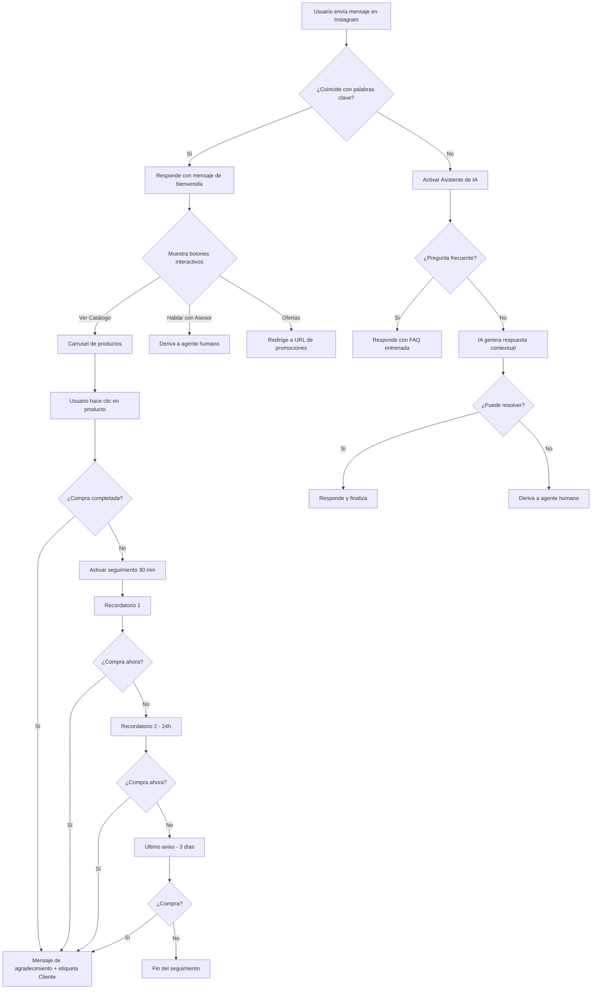

# Cómo Crear un Chatbot de Instagram Gratis en 2025

> **Sin conocimientos técnicos, sin código, completamente gratis.** Con E-SMART360 puedes crear un chatbot para Instagram de forma totalmente gratuita. Solo necesitas una cuenta de negocio en Instagram vinculada a una página de Facebook y estarás listo para automatizar la atención a tus clientes en cuestión de minutos.

## Introducción

Quedaron atrás los días en que las empresas tenían que responder manualmente cada mensaje en su cuenta de negocio de Instagram. Con la revolución de los chatbots impulsados por inteligencia artificial, la forma en que las marcas interactúan con su audiencia ha cambiado por completo. Estos asistentes automatizados permiten respuestas instantáneas, personalizadas y disponibles las 24 horas del día, los 7 días de la semana.

Instagram es una de las plataformas más populares del mundo, con más de 2 mil millones de usuarios activos mensuales. Contar con un chatbot en Instagram te permite llegar a una audiencia masiva de forma automatizada, profesional y efectiva. Puedes utilizarlo para marketing, promociones, campañas de ventas y atención al cliente, todo desde una sola plataforma.

En esta guía te mostraremos paso a paso cómo crear tu propio chatbot de Instagram en 2025, aprovechando al máximo las herramientas de automatización de E-SMART360 sin necesidad de programar ni una sola línea de código. Desde la conexión inicial de tu cuenta hasta la configuración del asistente de IA avanzado, pasando por el diseño de flujos visuales, botones interactivos y carruseles de productos.

> **¿Sabías que...?** Los mensajes directos de Instagram tienen una tasa de apertura del 80% en promedio, muy superior al 20% del email marketing. Un chatbot en Instagram te permite capitalizar esa atención de forma automatizada y convertir seguidores en clientes.

## Requisitos previos

Antes de comenzar a crear tu chatbot, asegúrate de cumplir con los siguientes requisitos:

1. **Una cuenta de Instagram Business (cuenta de negocio).** Si actualmente tienes una cuenta personal, puedes cambiarla a profesional fácilmente desde la aplicación: ve a Configuración → Cuenta → Cambiar a cuenta profesional → Selecciona la categoría "Empresa".
2. **Una página de Facebook vinculada** a tu cuenta de Instagram Business. Esta vinculación es necesaria porque la autenticación se realiza a través del ecosistema de Meta (Facebook).
3. **Una cuenta en E-SMART360.** Puedes registrarte de forma gratuita desde el sitio web y empezar a usar el chatbot de inmediato sin necesidad de tarjeta de crédito.
4. **Conexión a internet estable** para configurar los flujos desde el panel de control.

> **Importante:** La cuenta de Instagram Business debe estar vinculada a una página de Facebook, ya que la autenticación se realiza a través del ecosistema de Meta. Sin este vínculo no podrás conectar tu cuenta de Instagram a la plataforma. Asegúrate de que la página de Facebook que vinculas tenga al menos el rol de administrador o editor.

## Paso 1: Conectar tu cuenta de Instagram a la plataforma

El primer paso para crear tu chatbot es conectar tu cuenta de Instagram Business a E-SMART360. El proceso es sencillo y rápido.

Sigue estos pasos detalladamente:

1. Inicia sesión en tu panel de control de E-SMART360.
2. Navega hasta la sección **Conectar Cuenta** dentro del módulo de Instagram.
3. Haz clic en el botón **"Iniciar sesión con Facebook"**.
4. Se abrirá una ventana emergente de Facebook donde deberás:
   - Seleccionar la página de Facebook que está vinculada a tu Instagram Business.
   - Aceptar los permisos solicitados, que incluyen acceso a mensajes, perfil público y administración de páginas.
5. Una vez autorizado, la plataforma detectará automáticamente tu cuenta de Instagram y la conectará exitosamente.

> Si al intentar conectar ves el mensaje "No se encontraron cuentas de Instagram", verifica lo siguiente:
- Tu cuenta de Instagram sea de tipo **Business** (no personal ni de creador).
- La cuenta esté vinculada a la página de Facebook correcta que seleccionaste durante la autenticación.
- Hayas aceptado todos los permisos solicitados sin omitir ninguno.
- La página de Facebook tenga permisos de administración sobre la cuenta de Instagram.

Si todo está correcto y aún no funciona, desconecta y vuelve a conectar la cuenta desde cero.

## Paso 2: Acceder al constructor visual de flujos (drag & drop)

Una vez que tu cuenta de Instagram está conectada correctamente, el siguiente paso es crear el flujo conversacional de tu chatbot. E-SMART360 cuenta con un constructor visual de flujos tipo drag & drop que te permite diseñar conversaciones completas sin necesidad de conocimientos técnicos.

Para acceder al constructor:

1. Dirígete a la sección **Administrador de Bots de Instagram** desde el menú principal.
2. Selecciona tu cuenta de Instagram en el panel izquierdo de la interfaz.
3. Dentro de la sección **Respuesta del Bot**, haz clic en el botón **Crear**.
4. Serás redirigido automáticamente al **constructor de flujos drag & drop**, donde podrás ver un lienzo en blanco listo para diseñar tu chatbot.

> El constructor visual de flujos es una de las herramientas más potentes de E-SMART360. Permite arrastrar y soltar bloques para crear conversaciones complejas con:
- **Condicionales:** Ramifica la conversación según las respuestas del usuario.
- **Botones interactivos:** Guía a los usuarios con opciones predefinidas.
- **Carruseles de imágenes:** Muestra múltiples productos o servicios.
- **Recolección de datos:** Captura información del usuario como nombre, email o teléfono.
- **Conexión a webhooks:** Envía datos a aplicaciones externas en tiempo real.
- **Google Sheets:** Guarda automáticamente la información en hojas de cálculo.

Cualquier persona puede usarlo sin conocimientos técnicos ni de programación.

## Paso 3: Configurar las palabras clave de activación del bot

Dentro del constructor de flujos, el primer bloque que verás en el lienzo es **"Iniciar Flujo del Bot"**. Este bloque es fundamental porque define cuándo y cómo se activa tu chatbot cuando un usuario envía un mensaje.

Configúralo de la siguiente manera:

1. **Haz doble clic** en el bloque "Iniciar Flujo del Bot" para abrir el panel de configuración.
2. En el panel de configuración, define las **palabras clave** que activarán el bot. Algunos ejemplos: "hola", "start", "menú", "precios", "productos", "ayuda", "información", "catálogo", "servicios", "contacto".
3. Asigna un **título descriptivo** al bot para identificarlo fácilmente. Por ejemplo: "Bot Principal de Atención".
4. Puedes **agregar o quitar etiquetas (labels)** para segmentar a los usuarios según su interacción. Por ejemplo, puedes asignar la etiqueta "Nuevo lead" cuando alguien interactúa por primera vez.
5. También puedes seleccionar una **secuencia** (suscribir o cancelar suscripción) para gestionar la membresía de los contactos automáticamente.

> **Consejo estratégico:** Usa palabras clave que tus clientes realmente usarían de forma natural. Piensa en términos como "quiero comprar", "información", "catálogo", "precios", "horarios". Evita términos demasiado genéricos como "hola" o "buenas" si no quieres que cualquier saludo active respuestas complejas. Una buena estrategia es usar palabras clave más específicas relacionadas con tu negocio.

**Funcionalidad adicional: Envío de datos a terceros**

Una característica importante de esta configuración es la capacidad de **enviar datos mediante una URL Webhook** a aplicaciones externas como CRMs, Slack, Telegram o plataformas de email marketing. También puedes **guardar la información directamente en Google Sheets** para llevar un registro detallado de cada interacción.

Para configurar el envío de datos:

1. Busca la opción de Webhook dentro de la configuración del bloque "Iniciar Flujo del Bot".
2. Pega la URL del webhook de tu servicio externo (por ejemplo, tu CRM o una automatización de Zapier).
3. Selecciona los campos de datos que deseas enviar: nombre de usuario de Instagram, mensaje recibido, etiquetas asignadas, fecha y hora.
4. Guarda la configuración.

Una vez configurado todo, haz clic en **Guardar** para confirmar la configuración inicial del flujo.

## Paso 4: Diseñar el mensaje de bienvenida

Después de configurar la activación del bot, el siguiente paso es diseñar el primer mensaje que verán los usuarios. Este mensaje debe ser atractivo, claro y proporcionar opciones de navegación bien definidas.

Sigue estos pasos:

1. Haz clic en **"Redactar siguiente mensaje"** que aparece en el flujo.
2. Selecciona la opción **Plantilla Genérica** del menú de tipos de mensaje.
3. Haz doble clic en la plantilla genérica para abrir el editor de configuración detallado.
4. **Sube una imagen** adecuada para el mensaje. Puedes seleccionar archivos en formato **.png, .jpg o .gif**, o proporcionar un enlace URL directo para la imagen.
5. Escribe un **Título** llamativo, por ejemplo: "¡Bienvenido a [Nombre de tu negocio]!" o "¿En qué podemos ayudarte hoy?".
6. Agrega un **Subtítulo** descriptivo que explique qué puede hacer el usuario, como: "Explora nuestro catálogo, conoce nuestras ofertas especiales o habla directamente con un asesor."
7. Haz clic en **Guardar** para aplicar los cambios a la plantilla.

> **Formatos de imagen compatibles:** Puedes usar imágenes en PNG, JPG y GIF animados. Se recomienda usar imágenes de 400x400 píxeles como mínimo para una visualización óptima en dispositivos móviles. El tamaño máximo recomendado es de 2 MB para garantizar una carga rápida incluso en conexiones móviles.

## Paso 5: Agregar botones interactivos al mensaje

Los botones son elementos clave para guiar a los usuarios a través de la conversación. Permiten que los clientes interactúen con opciones predefinidas, mejorando la experiencia de usuario y la tasa de conversión. En Instagram, los botones aparecen como opciones táctiles dentro del mensaje.

Para agregar botones:

1. En el editor del mensaje de bienvenida, haz clic en el botón **Agregar** dos veces. El mensaje ya viene con un botón por defecto, por lo que al final tendrás tres botones en total.
2. Configura cada botón individualmente:
   - **Nombre del botón:** Texto visible que verá el usuario. Por ejemplo: "🛍️ Ver Catálogo", "💬 Hablar con Asesor", "💰 Ofertas".
   - **Acción:** Define qué ocurre cuando el usuario presiona el botón. Las opciones incluyen:
     - **Enviar un mensaje:** Continúa el flujo dentro del chatbot.
     - **Redirigir a una URL:** Abre un enlace externo en el navegador del usuario.
     - **Activar otro flujo:** Ejecuta un subflujo o un bot diferente.
3. Para un botón de tipo "Ver más" o "Comprar ahora", selecciona la opción **Redirigir a URL** y pega el enlace de destino.
4. Guarda cada botón después de configurarlo.

### Ejemplo: Tienda de ropa

- Botón 1: "🛍️ Ver Catálogo" → Envía mensaje con carrusel de productos
- Botón 2: "💰 Ofertas" → Redirige a URL con promociones activas
- Botón 3: "💬 Hablar con asesor" → Activa derivación a agente humano

### Ejemplo: Restaurante

- Botón 1: "📋 Menú del día" → Envía mensaje con el menú digital
- Botón 2: "📍 Ubicación" → Redirige a Google Maps
- Botón 3: "📅 Reservar" → Activa flujo de reserva de mesa

### Ejemplo: Servicios profesionales

- Botón 1: "📞 Solicitar presupuesto" → Activa flujo de captura de datos
- Botón 2: "⭐ Ver testimonios" → Envía carrusel con reseñas
- Botón 3: "📅 Agendar cita" → Redirige a calendario de reservas

> **Recomendación de diseño:** Usa emojis en los botones para hacerlos más atractivos visualmente. Los emojis aumentan la tasa de clics en mensajes interactivos hasta en un 30%. Mantén los textos cortos (máximo 20 caracteres) para que se vean correctamente en todos los dispositivos móviles. Usa verbos de acción como "Ver", "Comprar", "Reservar", "Explorar" para incentivar la interacción.

## Paso 6: Agregar un carrusel de productos o servicios

Los carruseles son una de las herramientas más efectivas para mostrar múltiples opciones en un solo mensaje. Instagram permite desplazarse lateralmente por las tarjetas del carrusel, lo que facilita la exploración de productos sin saturar la conversación.

Para crear un carrusel:

1. Haz clic en el primer botón que configuraste (o donde quieras que aparezca el carrusel).
2. En el menú de tipos de mensaje, selecciona la opción **Carrusel**.
3. Abre el carrusel y haz clic en **Guardar** para activarlo.
4. Obtendrás **tres carruseles individuales** de forma predeterminada, cada uno con un botón adjunto.
5. Configura cada carrusel individualmente:
   - **Imagen:** Selecciona una imagen representativa del producto o servicio que deseas mostrar.
   - **Título:** Escribe el nombre del producto, servicio o paquete.
   - **Subtítulo:** Agrega una descripción breve o el precio.
   - **Botón:** Define la acción al presionar el botón, normalmente redirigir a la página de compra del producto específico.
6. Proporciona **URLs diferentes** para cada botón, apuntando a las páginas de compra de cada producto respectivo.
7. Puedes **reorganizar el orden** de los carruseles usando el botón de ordenamiento ubicado junto al botón de guardar.
8. Una vez finalizada la configuración de todos los carruseles, haz clic en el botón **Guardar** principal para guardar todo el flujo completo.

> **Ventaja del carrusel:** Los carruseles permiten mostrar hasta 10 productos o servicios en un solo mensaje. Los usuarios pueden deslizar horizontalmente para explorar todas las opciones disponibles sin saturar la conversación con múltiples mensajes. Esto es especialmente útil para catálogos de productos, paquetes de precios, portfolios de servicios, galerías de trabajos realizados o colecciones de temporada.

## Paso 7: Probar el chatbot directamente en Instagram

Una vez que hayas configurado todo el flujo del chatbot, es fundamental probar que funcione correctamente antes de ponerlo en producción y que tus clientes comiencen a usarlo.

Sigue estos pasos para realizar una prueba completa:

1. Abre la aplicación de Instagram en tu dispositivo móvil (iOS o Android).
2. Dirígete a tu perfil de cuenta de negocio.
3. Envía un mensaje directo a tu propia cuenta usando una de las palabras clave que configuraste (por ejemplo: "hola" o "start").
4. Observa cómo el bot responde automáticamente con el mensaje de bienvenida y los botones que diseñaste.
5. Presiona cada uno de los botones para verificar que las acciones se ejecuten correctamente:
   - Los botones de tipo mensaje deben continuar el flujo conversacional.
   - Los botones de tipo URL deben abrir los enlaces correctos en el navegador.
6. Prueba el carrusel deslizando horizontalmente para ver todas las tarjetas de productos.
7. Verifica que los enlaces de redirección funcionen y abran las páginas de destino correctas.

> **Ejemplo real de prueba:** Al escribir la palabra "start" en el chat de Instagram, el bot responde inmediatamente con un saludo personalizado que incluye tres botones interactivos: "Ver Planes", "Contáctanos" y "Catálogo". Al presionar el botón "Ver Planes", se despliega automáticamente un carrusel con tres paquetes de precios disponibles. Cada paquete tiene su propia imagen, título descriptivo, precio y un botón "Comprar ahora" que redirige directamente a la página de pago correspondiente. El usuario puede desplazarse lateralmente para ver y comparar los tres planes antes de decidir.

## Asistente de IA para Instagram

E-SMART360 ha incorporado recientemente su potente función de **Asistente de IA**, una característica avanzada que lleva las capacidades del chatbot al siguiente nivel utilizando inteligencia artificial generativa. A diferencia del flujo tradicional basado en palabras clave, el Asistente de IA puede comprender preguntas en lenguaje natural, detectar la intención del usuario y responder de manera contextual y personalizada.

El Asistente de IA funciona en dos modos:
- **Como respuesta principal:** La IA maneja todas las consultas de los clientes de forma autónoma.
- **Como respaldo (fallback):** Cuando el flujo de palabras clave no encuentra una coincidencia, la IA toma el control para intentar resolver la consulta.

### Cómo activar el Asistente de IA

1. Navega al **Administrador de Bots de Instagram** desde tu panel de control.
2. Haz clic en la pestaña **Asistente de IA** ubicada en la parte superior del panel.
3. Activa la opción **Habilitado** para encender el asistente.
4. Crea una **Campaña de Entrenamiento de IA** haciendo clic en el botón **Nueva**.
5. Asigna un **nombre descriptivo a la campaña**, por ejemplo "Atención al Cliente", "Ventas y Productos" o "Soporte Técnico".
6. Escribe un **Mensaje de Instrucción (Prompt)** que defina claramente cómo debe comportarse la IA. Por ejemplo:
   *"Eres un asistente amigable y profesional que ayuda a clientes con dudas sobre productos, horarios, precios y disponibilidad. Responde siempre en español de forma clara, concisa y educada. Si no sabes la respuesta, deriva al cliente amablemente con un agente humano."*
7. Guarda la campaña de entrenamiento.

> **Sistema de Detección de Intenciones:** La función más innovadora del Asistente de IA es su sistema de detección de intenciones. Este sistema analiza primero el mensaje del cliente para identificar su intención basándose en palabras clave y contexto, y luego proporciona la respuesta más adecuada según la campaña de entrenamiento que coincida. Si no encuentra una coincidencia exacta, usa el modelo de IA para generar una respuesta contextual basada en toda la información disponible.

### Entrenamiento avanzado del Asistente de IA

El Asistente de IA se puede entrenar de tres formas diferentes para adaptarse a las necesidades específicas de tu negocio:

#### 1. Entrenamiento con Preguntas Frecuentes (FAQs)

Las FAQs son la forma más eficiente y económica de entrenar a tu asistente. Puedes agregar tantas preguntas y respuestas como necesites:

1. Haz clic en el botón **+ (Plus)** dentro de la campaña de entrenamiento.
2. Elige entre dos modos:
   - **Resumen (Summary):** Proporciona respuestas ricas en contexto pero consume más tokens.
   - **FAQs:** Estructura eficiente para respuestas rápidas con menor consumo de tokens.
3. Sube el contenido en el formato requerido.
4. Guarda los cambios.

#### 2. Entrenamiento con URL

Puedes entrenar al asistente extrayendo contenido directamente desde la URL de tu sitio web:

1. Haz clic en **Nuevo** dentro de la opción de entrenamiento por URL.
2. Ingresa la URL de la página web que contiene la información deseada.
3. Selecciona el **Tipo de Selector** (ID o Clase) según la estructura de la página web.
4. Opcionalmente, elimina contenido innecesario como anuncios, encabezados o barras laterales.
5. Haz clic en **Generar FAQ** o **Generar Respuesta Completa** según tus necesidades.
6. Guarda el entrenamiento.

#### 3. Entrenamiento con Archivos

Puedes cargar documentos completos para entrenar al asistente:

1. Navega a la configuración de archivos y haz clic en **Nuevo**.
2. Sube un archivo en formato **PDF, Word (.doc) o TXT**.
3. Selecciona el modo de procesamiento:
   - **Generar Respuesta Completa:** Proporciona respuestas detalladas basadas en todo el documento (mayor consumo de tokens).
   - **Generar FAQ:** Divide el contenido en preguntas y respuestas estructuradas (menor consumo de tokens).
4. Guarda el archivo y finaliza el entrenamiento.

> **Recomendación:** Para la mayoría de los negocios, la combinación de entrenamiento con FAQs (para preguntas comunes) y con URL o archivos (para documentación detallada) ofrece el mejor equilibrio entre precisión y costo de operación.

### Configuración del comportamiento de la IA

Una vez entrenado el asistente, puedes configurar cómo se comporta en la conversación:

1. **Configuración de Respuesta por Defecto (No Match):** Si el chatbot no encuentra una coincidencia para la consulta del usuario:
   - Ve a Administrador de Bots → Botones de Acción → Sin Coincidencia (No Match).
   - Selecciona **Respuesta de IA** y vincula la campaña de IA entrenada.
   - Activa la opción "Respuesta Sin Coincidencia" en la configuración.
   - Guarda los cambios.

2. **Activar el Asistente de IA:**
   - Ve al Administrador de Bots.
   - Activa la opción **Habilitar Asistente de IA**.
   - Selecciona la campaña de IA que deseas utilizar.
   - Elige el modo de respuesta:
     - **Asistente de IA para todas las consultas:** La IA maneja completamente las interacciones.
     - **IA solo como respaldo:** La IA interviene solo cuando las reglas predefinidas no encuentran coincidencia.

> **Consideración de tokens:** El uso del Asistente de IA consume tokens según el plan contratado. En la cuenta gratuita tienes un límite de 10.000 interacciones de IA al mes. Optimiza su uso combinando flujos por palabras clave para interacciones simples y el asistente de IA solo para consultas complejas o abiertas.

### Pruebas y optimización del Asistente de IA

Después de configurar el asistente, es importante probarlo y optimizarlo:

1. Simula consultas de usuarios reales para verificar que las respuestas sean precisas.
2. Ajusta las FAQs, URLs o archivos según sea necesario para mejorar la precisión.
3. Monitorea el rendimiento del chatbot y actualiza los datos de entrenamiento regularmente.
4. Revisa las conversaciones donde el asistente no pudo responder para identificar nuevas FAQs que agregar.
5. Ajusta el mensaje de instrucción (prompt) si notas que el tono o la calidad de las respuestas no son los esperados.

### Mejores prácticas para entrenar al asistente de IA

La calidad de las respuestas del Asistente de IA depende directamente de cómo lo entrenes. Sigue estas recomendaciones para obtener los mejores resultados:

- **Incluye un rango amplio de preguntas:** Cuantas más FAQs agregues, más preciso será el asistente. Piensa en todas las preguntas que tus clientes hacen regularmente: precios, horarios, disponibilidad, políticas de envío, métodos de pago, garantías, devoluciones.
- **Usa un tono consistente:** Define en el mensaje de instrucción el tono de voz que deseas para tu marca. Puede ser formal, casual, amigable, técnico o una combinación. La consistencia es clave para mantener la identidad de tu marca.
- **Actualiza periódicamente:** Revisa las conversaciones reales semanalmente para identificar nuevas preguntas frecuentes y agrégalas al entrenamiento. El asistente mejora con el tiempo a medida que recibe más información.
- **Combina flujos e IA:** Los flujos por palabras clave son excelentes para menús estructurados y respuestas predecibles. El asistente de IA es mejor para consultas abiertas y complejas. Usa cada uno donde sea más efectivo.
- **Incluye un mensaje de fallback:** Configura una respuesta por defecto cuando el asistente no pueda determinar la intención del usuario. Por ejemplo: "No estoy seguro de haber entendido tu consulta. ¿Puedes reformular tu pregunta o escribir 'ayuda' para ver las opciones disponibles?"

### 🤖 Flujo por palabras clave (Bot tradicional)

**Ideal para:** Menús estructurados, respuestas predecibles y procesos guiados paso a paso.

**Ventajas:**
- Control total sobre cada respuesta y ramificación
- Sin costos adicionales de tokens de IA
- Perfecto para procesos de varios pasos
- Carga instantánea sin latencia de procesamiento
- Experiencia de usuario predecible y consistente

**Cuándo usarlo:**
- Bienvenida y menú principal de opciones
- Selección de categorías de productos
- Procesos de compra guiados
- Formularios y recolección de datos
- Flujos de reservas y agendamiento

### 🧠 Asistente de IA

**Ideal para:** Preguntas abiertas, consultas complejas y atención al cliente personalizada.

**Ventajas:**
- Entiende lenguaje natural sin necesidad de keywords exactas
- Responde preguntas no previstas en el diseño inicial
- Se actualiza con nuevos datos sin rediseñar flujos
- Ofrece respuestas humanizadas y contextuales
- Escalable sin aumentar la carga del equipo

**Cuándo usarlo:**
- Preguntas específicas sobre productos
- Consultas sobre políticas y condiciones
- Soporte técnico básico
- Preguntas que varían constantemente
- Atención fuera del horario laboral

### Integración con Bandeja de Entrada Compartida

El Asistente de IA se puede potenciar aún más integrándolo con la **Bandeja de Entrada Compartida** de E-SMART360. Esta función permite que cuando la IA detecte que un usuario necesita atención humana, asigne automáticamente la conversación al miembro del equipo más adecuado.

**Cómo funciona:**
1. La IA detecta cuando un usuario necesita hablar con una persona (por ejemplo, cuando escribe "quiero hablar con un agente" o "necesito ayuda personalizada").
2. El sistema asigna automáticamente la conversación al agente humano disponible.
3. El equipo puede ver y responder a las conversaciones derivadas en tiempo real.
4. La transición de IA a humano es fluida y el usuario no tiene que repetir información.

> **Beneficio clave:** Esta integración equilibra perfectamente la automatización con la asistencia humana. La IA maneja las consultas rutinarias (80% de las interacciones), mientras que los agentes humanos se concentran en los casos complejos (20% restante), mejorando la eficiencia general y la satisfacción del cliente.

## Sistema de seguimiento automatizado (Follow-Up)

Para maximizar las conversiones de tu chatbot de Instagram, puedes complementarlo con un **sistema de seguimiento automatizado**. Esta funcionalidad permite enviar recordatorios inteligentes y personalizados a los usuarios que mostraron interés en un producto o servicio pero no completaron la compra.

### ¿Qué es un chatbot de seguimiento?

Un chatbot de seguimiento (follow-up chatbot) es un sistema automatizado que envía mensajes de recordatorio a usuarios que han interactuado con tu chatbot pero no han completado una acción deseada, como realizar una compra, registrarse en un servicio o agendar una cita. Ayuda a las empresas a mantenerse en contacto con clientes potenciales y mejora significativamente las tasas de conversión.

### Beneficios del sistema de seguimiento automatizado

- **Ahorra tiempo** al automatizar los recordatorios que antes hacías manualmente.
- **Aumenta las ventas y conversiones** al recuperar clientes que estaban indecisos.
- **Asegura que los usuarios no olviden tu oferta** con recordatorios oportunos.
- **Funciona 24/7** sin necesidad de esfuerzo manual ni supervisión constante.
- **Se puede personalizar** según el comportamiento específico de cada usuario.
- **Segmenta automáticamente** a los usuarios según su nivel de interés.

### Configuración del flujo de seguimiento paso a paso

### Crear el flujo de seguimiento

Ve al panel de **Administrador de Bots → Respuesta del Bot → Crear**. Nombra el chatbot de forma reconocible, como "Follow-Up Bot" o "Seguimiento de Ventas". El bot debe configurarse para que se active cuando un usuario interactúe con un mensaje relacionado con productos o servicios de tu catálogo.

### Configurar mensajes interactivos de calificación

Agrega un bloque interactivo con un mensaje de calificación como: *"¿Te interesaría nuestro producto?"* acompañado de botones **Sí** y **No**.
- Si el usuario selecciona **Sí**, proporciónale un enlace de compra directo o continúa con más información.
- Si selecciona **No**, finaliza la conversación de forma amigable u ofrece asistencia adicional.

### Aplicar etiquetas para rastrear acciones de usuarios

Cuando un usuario haga clic en el botón "Comprar Ahora" o similar, aplícale automáticamente una etiqueta llamada **"Comprar_Ahora"** mediante la opción de etiquetado del bloque. Si el usuario no hace clic en el botón, no recibe esta etiqueta. Esta información es crucial para determinar quién necesita un recordatorio de seguimiento.

### Configurar la secuencia de seguimiento temporal

Arrastra el conector desde la opción **"Suscribir a Secuencia"** del botón "Comprar Ahora". Esto iniciará una secuencia de seguimiento automatizada que enviará un mensaje de recordatorio si el usuario no realiza la compra dentro de un tiempo determinado. Puedes configurar diferentes tiempos según el tipo de producto:
- **30 minutos** para productos de bajo costo o compras por impulso.
- **1 hora** para productos de precio medio que requieren consideración.
- **24 horas** para productos de alto valor que requieren más reflexión.

### Agregar condiciones inteligentes al flujo

Agrega un bloque de **condición** que verifique si el usuario seleccionó o no el botón "Comprar Ahora":
- Si la **condición es verdadera** (el usuario compró): envía un mensaje de agradecimiento y finaliza la secuencia.
- Si la **condición es falsa** (el usuario no compró): envía un mensaje de seguimiento personalizado con un nuevo botón de compra y una oferta especial si es aplicable.

Puedes repetir este proceso para enviar múltiples recordatorios estratégicos, espaciados en el tiempo para mantener el interés sin saturar al usuario. Por ejemplo: primer recordatorio a los 30 minutos, segundo a las 24 horas y tercero a los 3 días.

> **Reglas de mensajería de Instagram:** Recuerda que Instagram, al igual que otras plataformas de Meta, permite enviar mensajes de seguimiento dentro de la ventana de 24 horas desde la última interacción del usuario. Después de ese periodo, solo puedes iniciar conversaciones con mensajes preaprobados. Programa tus recordatorios estratégicamente para mantener un buen ritmo sin parecer invasivo. Un máximo de 3 recordatorios es una práctica recomendada.

### Programación de mensajes para máximo impacto

La clave del éxito del seguimiento automatizado está en la programación estratégica de los mensajes. A continuación, te presentamos una estrategia recomendada:

1. **Recordatorio inmediato (30 min):** "¡Hola! Vimos que estabas interesado en [producto]. ¿Te gustaría completar tu compra? Aquí tienes el enlace directo."
2. **Recordatorio suave (24 horas):** "¿Sabías que [producto] tiene un descuento especial por tiempo limitado? Aprovecha esta oportunidad."
3. **Último aviso (3 días):** "No queremos que te pierdas esta oferta. Este es tu último recordatorio para aprovechar el descuento especial en [producto]. ¡Te esperamos!"

> **Personalización:** Los mensajes de seguimiento más efectivos son aquellos que hacen referencia al producto o servicio específico que el usuario estaba viendo. Siempre que sea posible, personaliza el mensaje con el nombre del producto, el precio y cualquier oferta especial disponible.

### Exportación de flujos de chatbot

Una funcionalidad útil de E-SMART360 es la capacidad de **exportar flujos de chatbot** completos. Esto te permite:
- Guardar copias de seguridad de tus flujos configurados.
- Compartir plantillas de flujo con otros miembros de tu equipo.
- Reutilizar flujos exitosos en otras cuentas o proyectos.
- Documentar tus procesos para auditoría o capacitación.

Para exportar un flujo:
1. Abre el flujo que deseas exportar en el constructor visual.
2. Busca la opción de exportación en el menú de acciones.
3. Selecciona el formato de exportación (JSON o imagen).
4. Guarda el archivo en tu dispositivo.

## Integración con otras aplicaciones y servicios

E-SMART360 ofrece una amplia gama de integraciones para potenciar tu chatbot de Instagram y conectarlo con las herramientas que ya utilizas en tu negocio.

### Conexión con Google Sheets

Puedes guardar automáticamente los datos de cada interacción de tu chatbot en Google Sheets. Esta integración te permite:
- Registrar todos los leads generados desde Instagram.
- Almacenar las respuestas de los usuarios a preguntas específicas.
- Mantener un historial completo de conversaciones.
- Compartir los datos con tu equipo de ventas en tiempo real.
- Crear informes personalizados sin esfuerzo manual.

Los datos que se pueden guardar incluyen: nombre de usuario de Instagram, mensajes enviados y recibidos, etiquetas asignadas, fecha y hora de la interacción, acciones realizadas y enlaces visitados.

### Integración mediante Webhooks

Los webhooks permiten enviar datos en tiempo real a cualquier aplicación externa cada vez que ocurre una interacción en tu chatbot:
- **CRMs:** Salesforce, HubSpot, Zoho, Pipedrive.
- **Email marketing:** Mailchimp, ActiveCampaign, ConvertKit, Brevo.
- **Mensajería:** Slack, Microsoft Teams, Discord.
- **Automatización:** Zapier, Make (Integromat), n8n, Pabbly.

### API HTTP y JSON API Connector

Para negocios que requieren integraciones personalizadas, E-SMART360 ofrece APIs RESTful completas que permiten:
- Obtener datos de suscriptores y sus interacciones.
- Enviar mensajes programáticamente desde sistemas externos.
- Sincronizar etiquetas y segmentos entre plataformas.
- Crear y modificar flujos de bot mediante código.

> **¿Sin conocimientos técnicos para usar APIs?** No te preocupes. E-SMART360 incluye un conector HTTP-API con interfaz visual que te permite mapear campos y configurar conexiones sin escribir una sola línea de código. Además, la integración con Zapier te conecta con más de 5000 aplicaciones sin necesidad de conocimientos técnicos.

## Administrador de suscriptores

E-SMART360 proporciona un **Administrador de Suscriptores** completo donde puedes gestionar todos los usuarios que interactúan con tu chatbot de Instagram:

1. **Recolectar información automáticamente:** Cada vez que un usuario interactúa con tu chatbot, su información se almacena automáticamente en la base de datos.
2. **Asignar etiquetas personalizadas:** Segmenta a tus contactos con etiquetas como "interesado en producto X", "cliente recurrente", "lead caliente", "carrito abandonado", "nuevo lead", etc.
3. **Rastrear el historial de interacciones:** Visualiza el historial completo de conversaciones de cada usuario para entender su comportamiento y preferencias.
4. **Segmentar la audiencia:** Crea segmentos personalizados basados en etiquetas, comportamiento de compra, frecuencia de interacción o datos demográficos.
5. **Exportar datos:** Descarga tu lista completa de suscriptores en formato CSV para usarla en otras herramientas de marketing o análisis.
6. **Buscar y filtrar:** Encuentra rápidamente usuarios específicos usando filtros por nombre, etiqueta, fecha de interacción o canal.

Esta funcionalidad te permite conocer mejor a tu audiencia y crear campañas de marketing más efectivas y personalizadas.

## Preguntas Frecuentes

### ¿Cuál es el propósito del chatbot de Instagram de E-SMART360?

El chatbot de Instagram de E-SMART360 automatiza las respuestas a las consultas de los clientes, mejora el compromiso de la audiencia y reduce drásticamente los tiempos de respuesta. Funciona las 24 horas del día, los 7 días de la semana, sin intervención manual, permitiendo que tu negocio nunca deje de atender clientes. Es ideal para responder preguntas frecuentes, mostrar productos a través de carruseles interactivos, gestionar pedidos, capturar leads y calificar prospectos de forma totalmente automática. Además, puedes combinarlo con flujos de seguimiento para aumentar las tasas de conversión significativamente.

### ¿Puedo usar la respuesta de IA en Instagram de forma gratuita?

Sí, puedes usar la respuesta de IA en Instagram incluso con una cuenta gratuita de E-SMART360. El límite es de 10.000 interacciones de IA al mes en la cuenta gratuita, lo cual es más que suficiente para negocios pequeños y medianos. Si necesitas más capacidad, puedes actualizar tu plan según tus necesidades. La combinación estratégica de flujos manuales (basados en palabras clave) para interacciones simples con el asistente de IA para consultas complejas te permite optimizar el uso de tokens y maximizar el valor de tu cuenta gratuita.

### ¿Qué tipo de preguntas puede manejar el Asistente de IA?

El asistente de IA de E-SMART360 puede manejar una amplia variedad de consultas de clientes:

- **Preguntas frecuentes generales:** Horarios de atención, ubicación, precios, políticas de devolución, métodos de pago.
- **Consultas sobre productos:** Especificaciones técnicas, disponibilidad de stock, tallas y colores, compatibilidad.
- **Seguimiento de pedidos:** Estado del envío, número de seguimiento, fechas estimadas de entrega.
- **Atención al cliente:** Problemas con productos recibidos, solicitudes de cambio o devolución, reclamos.
- **Información corporativa:** Historia de la empresa, misión y valores, certificaciones, términos y condiciones.

La precisión de las respuestas depende directamente de la calidad y cantidad de datos con los que entrenes al asistente. A más FAQs, URLs y archivos cargues, mejores y más precisas serán las respuestas.

### ¿El chatbot de Instagram está disponible 24 horas al día, 7 días a la semana?

Sí, el chatbot de Instagram de E-SMART360 está disponible las 24 horas del día, los 365 días del año, sin interrupciones. Esto aplica para todas las plataformas donde esté integrado: Instagram, WhatsApp, Facebook Messenger, Telegram y Webchat. Esta disponibilidad continua garantiza que ningún cliente quede sin atender, sin importar la hora del día, el huso horario del cliente o si es un día festivo. La atención 24/7 es una de las ventajas más valoradas por las empresas que implementan chatbots.

### ¿Qué es exactamente el constructor visual de flujos (drag & drop)?

El constructor visual de flujos es una interfaz gráfica de arrastrar y soltar que permite diseñar el comportamiento completo de tu chatbot sin necesidad de escribir ni una sola línea de código. Funciona de manera similar a crear un diagrama de flujo donde:
- Cada **bloque** representa una acción (enviar mensaje, mostrar botones, esperar respuesta, recolectar datos, etc.).
- Las **conexiones entre bloques** definen el flujo de la conversación.
- Los **condicionales** permiten ramificar la conversación según las respuestas del usuario.
- Se pueden agregar **imágenes, botones, carruseles, videos y formularios**.

Cualquier persona, sin importar su nivel técnico o experiencia en programación, puede crear chatbots profesionales y efectivos con esta herramienta.

### ¿Puedo integrar aplicaciones de terceros con mi chatbot de Instagram?

Sí, E-SMART360 ofrece múltiples opciones de integración para conectar tu chatbot con otras herramientas:
- **HTTP-API y JSON API Connector:** Para conexiones personalizadas con cualquier aplicación que tenga API REST.
- **Webhooks:** Para enviar datos en tiempo real a CRMs, Slack, sistemas propios o cualquier servicio que acepte webhooks.
- **Zapier:** Conecta con más de 5000 aplicaciones sin necesidad de escribir código.
- **Google Sheets:** Guarda automáticamente los datos de cada interacción en hojas de cálculo.
- **Make (Integromat) y n8n:** Para automatizaciones avanzadas y flujos de trabajo complejos.

Esto permite, por ejemplo, guardar leads automáticamente en tu CRM, enviar notificaciones a tu equipo de ventas por Slack, o actualizar tu base de datos de clientes en tiempo real.

### ¿Cómo gestiono los suscriptores y contactos de mi chatbot?

E-SMART360 proporciona un **Administrador de Suscriptores** completo con las siguientes funcionalidades:
1. **Recolectar y almacenar información** de cada suscriptor que interactúa con tu chatbot.
2. **Asignar etiquetas personalizadas** como "interesado en producto X", "cliente recurrente", "lead caliente" para segmentar tu audiencia.
3. **Rastrear el historial completo** de conversaciones de cada usuario.
4. **Segmentar la audiencia** en grupos basados en etiquetas, comportamiento o datos demográficos.
5. **Exportar datos** en formato CSV para usarlos en otras herramientas de marketing.

Esta funcionalidad te permite conocer mejor a tu audiencia y personalizar tus campañas de marketing para cada segmento.

### ¿Pueden los chatbots de Instagram enviar mensajes promocionales?

Sí, el chatbot de Instagram puede enviar mensajes promocionales y de ventas automatizados para interactuar con tu audiencia e impulsar las ventas. Puedes configurar:
- **Ofertas especiales y descuentos por tiempo limitado.**
- **Lanzamientos de nuevos productos o colecciones.**
- **Campañas estacionales** (Navidad, Black Friday, San Valentín, etc.).
- **Recomendaciones personalizadas** basadas en interacciones previas.

Los carruseles son especialmente efectivos para mostrar múltiples productos promocionados en un solo mensaje interactivo, permitiendo a los usuarios explorar y comprar directamente desde la conversación.

### ¿Cómo puedo contactar al soporte técnico de E-SMART360?

El equipo de soporte de E-SMART360 está disponible 24/7 para ayudarte con cualquier duda o problema. Puedes contactarnos a través de:
- **Ticket de soporte:** Abre un ticket directamente desde el panel de control de E-SMART360.
- **Chat en vivo:** Envía un mensaje a través del chat de ayuda integrado en la plataforma.
- **Base de conocimiento:** Consulta nuestra extensa biblioteca de tutoriales, guías detalladas y documentación técnica.
- **Asistencia técnica especializada:** Si necesitas ayuda con configuraciones complejas, puedes solicitar la asistencia de un ingeniero que te guiará paso a paso en el proceso.

### ¿Qué servicios ofrece E-SMART360 además del chatbot de Instagram?

E-SMART360 es una plataforma completa de automatización omnicanal que incluye:
- **WhatsApp Business API:** Chatbot avanzado, broadcasting masivo, catálogo de productos, pagos integrados y notificaciones automatizadas.
- **Facebook Messenger:** Chatbots con menú persistente, secuencias automatizadas y RCN (Respuesta Rápida Configurable).
- **Instagram:** Chatbot completo con flujos visuales, asistente de IA y carruseles de productos.
- **Telegram:** Bot para grupos, filtros anti-spam, broadcasting y automatización de respuestas.
- **Webchat:** Chatbot para sitios web con integración nativa para WordPress y otras plataformas.
- **Asistente de IA:** Asistente inteligente entrenable con FAQs, URLs y archivos, con detección de intenciones.
- **Bandeja de entrada compartida:** Gestión multicanal de conversaciones con asignación a agentes.

Es una de las plataformas omnicanal más completas del mercado, diseñada para empresas de todos los tamaños.

## Ejemplos prácticos y casos de uso reales

### 🛍️ Tienda de ropa online

**Escenario:**
Una tienda de moda femenina recibe decenas de mensajes diarios en Instagram preguntando por tallas, precios, disponibilidad de productos y políticas de envío. El equipo de atención al cliente de tres personas está desbordado y los tiempos de respuesta superan las 4 horas.

**Solución implementada con E-SMART360:**
1. Se configuraron palabras clave como "tallas", "precios", "catálogo", "envíos" y "devoluciones".
2. El chatbot responde automáticamente con un carrusel mostrando las colecciones disponibles de la temporada.
3. Cada producto en el carrusel tiene imagen profesional, precio visible y botón "Comprar ahora" que lleva directo al checkout del e-commerce.
4. El asistente de IA se entrenó con las políticas de cambio, tabla de tallas y tiempos de envío.
5. El sistema de seguimiento envía un recordatorio personalizado a quienes vieron productos pero no completaron la compra.

**Resultados obtenidos en 30 días:**
- Reducción del 85% en consultas manuales al equipo de atención.
- Aumento del 40% en conversiones desde Instagram.
- Tiempo de respuesta reducido de 4 horas a menos de 2 segundos.
- El equipo de atención puede concentrarse en ventas de alto valor y clientes VIP.
- Recuperación del 25% de carritos abandonados gracias al sistema de seguimiento.

### 🍽️ Restaurante con gestión de reservas

**Escenario:**
Un restaurante de alta cocina recibe a diario decenas de mensajes en Instagram preguntando por el menú del día, horarios, disponibilidad de mesas y dirección. Gestionar las reservas y consultas manualmente consume horas del personal del restaurante.

**Solución implementada con E-SMART360:**
1. El chatbot saluda automáticamente con el menú digital del día mostrado en un carrusel interactivo.
2. El botón "Reservar" activa un flujo interactivo que solicita: fecha, hora, número de comensales, preferencias alimentarias y ocasión especial (opcional).
3. Todos los datos de la reserva se guardan automáticamente en Google Sheets, sincronizada con el sistema de gestión del restaurante.
4. El sistema de seguimiento envía un recordatorio de confirmación 2 horas antes de la reserva.
5. Después de la visita, el bot envía un mensaje de agradecimiento personalizado solicitando una reseña o calificación.

**Resultados obtenidos en 60 días:**
- Las reservas realizadas a través de Instagram aumentaron un 60%.
- Reducción de ausencias (no-shows) en un 35% gracias a los recordatorios automáticos.
- Sin necesidad de personal exclusivo para gestionar las redes sociales.
- Los clientes valoraron positivamente la rapidez y facilidad del proceso de reserva.
- Incremento del 20% en reseñas positivas en Google y redes sociales.

### 💻 Agencia de marketing digital

**Escenario:**
Una agencia de marketing digital recibe leads de diferentes canales y necesita calificarlos antes de asignarlos a los ejecutivos de ventas. El proceso manual tomaba demasiado tiempo.

**Solución implementada con E-SMART360:**
1. El chatbot de Instagram califica automáticamente a los leads preguntando: presupuesto, tipo de servicio requerido y plazo.
2. Según las respuestas, asigna etiquetas como "Lead Caliente", "Lead Frío" o "Requiere Contacto".
3. Los leads calientes se envían automáticamente al CRM mediante webhook.
4. El equipo de ventas recibe una notificación en Slack cada vez que un lead caliente es capturado.

**Resultados:**
- Velocidad de respuesta a leads: de 24 horas a 30 segundos.
- Tasa de conversión de lead a cliente: aumentó un 35%.
- El equipo de ventas solo contacta leads precalificados.

### 🏋️ Centro de fitness

**Escenario:**
Un gimnasio recibe consultas por horarios, precios de membresías y clases disponibles. También quiere capturar leads para promociones.

**Solución implementada con E-SMART360:**
1. El chatbot responde con los horarios de clases y precios de membresías.
2. Ofrece un pase de prueba gratuito de 3 días a cambio del nombre y email del interesado.
3. Los datos se guardan en Google Sheets para seguimiento del equipo de ventas.
4. El asistente de IA responde preguntas sobre rutinas, instructores y servicios adicionales.

**Resultados:**
- Captura de 120 leads por semana desde Instagram.
- Tasa de conversión del pase de prueba a membresía: 45%.
- El equipo de ventas dedica menos tiempo a consultas repetitivas.

## Diagrama de flujo completo del chatbot

## Conclusión

Crear un chatbot de Instagram gratis en 2025 es más sencillo que nunca gracias a E-SMART360. Con el constructor visual de flujos drag & drop, el potente Asistente de IA entrenable y el sistema de seguimiento automatizado, cualquier negocio puede automatizar su atención al cliente en Instagram sin necesidad de invertir en desarrollo ni contratar personal técnico.

Los beneficios son claros:
- **Atención 24/7** sin interrupciones.
- **Respuestas instantáneas** que mejoran la experiencia del cliente.
- **Aumento de conversiones** mediante flujos inteligentes y seguimiento automatizado.
- **Ahorro de costos** al reducir la carga de trabajo manual del equipo.
- **Escalabilidad** para manejar cientos o miles de conversaciones simultáneamente.

> **¿Listo para empezar?** Regístrate gratis en E-SMART360, conecta tu cuenta de Instagram Business y crea tu primer chatbot en menos de 30 minutos. No necesitas tarjeta de crédito, no necesitas conocimientos técnicos, solo las ganas de automatizar y hacer crecer tu negocio en Instagram.

## Artículos relacionados

- [Chatbot Multicanal para WhatsApp, Messenger, Instagram, Telegram y WebChat](./chatbot-multicanal-whatsapp-messenger-instagram-telegram-webchat-esmart360.mdx)
- [Entrenar Asistente de IA con FAQs, URL y Archivos](./entrenar-asistente-ia-chatbot-faq-url-archivo-esmart360.mdx)
- [Sistema de Detección de Intenciones para Chatbots](./sistema-deteccion-intenciones-chatbot-ia-esmart360.mdx)
- [Cómo crear un chatbot de Instagram gratis - Video Tutorial](./recursos/tutorial-video-chatbot-instagram)
