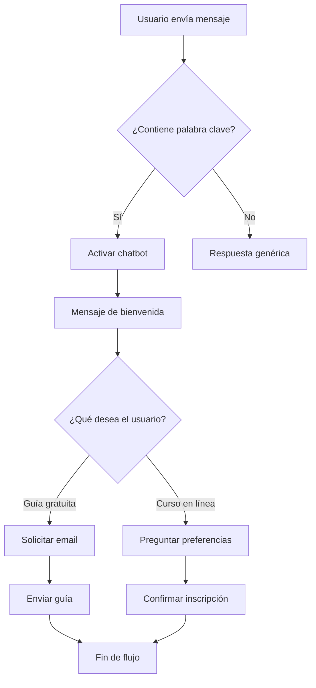
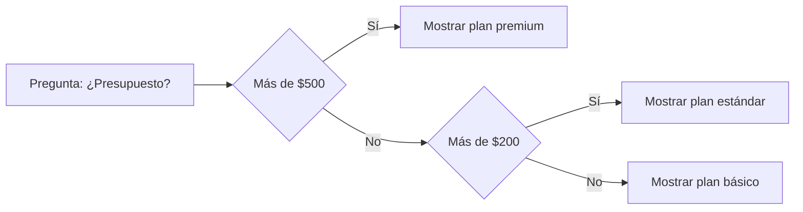

# Cómo Crear un Chatbot para Messenger de Facebook en 5 Minutos


> **Resumen ejecutivo:** Esta guía explica cómo evitar perder mensajes de clientes y oportunidades de venta construyendo un chatbot automatizado para Facebook Messenger usando la plataforma E-SMART360. No necesitas saber programar.

**Puntos clave:**

- **La herramienta:** E-SMART360 permite crear un chatbot para Messenger en menos de 5 minutos sin escribir código.
- **El proceso:** Regístrate, conecta tu cuenta de Facebook y página de empresa, usa el constructor visual de arrastrar y soltar para crear flujos de conversación y utiliza el chat en vivo integrado para atender clientes cuando sea necesario.
- **El beneficio:** Ahorras tiempo, automatizas la generación de leads y ofreces soporte al cliente instantáneo las 24 horas del día.


> **Última actualización:** 8 de mayo de 2026

¿Estás cansado de perder mensajes de clientes en Facebook? ¿Te cuesta trabajo brindar una atención al cliente adecuada y pierdes leads constantemente? Si la respuesta es sí, ¡un chatbot para Facebook Messenger es la solución perfecta para ti!

En esta guía te explicaré cómo usar los chatbots con inteligencia artificial para Facebook Messenger para mejorar tu atención al cliente y, además, te mostraré cómo crear un chatbot simple para Messenger en 5 minutos usando E-SMART360. También verás cómo usar el chat en vivo de Facebook para brindar una mejor atención con la ayuda de tu equipo.


### ¿Qué aprenderás en esta guía?

- Qué es un chatbot de Facebook Messenger y cómo funciona
- Cómo crear una cuenta gratuita en E-SMART360 paso a paso
- Cómo conectar tu cuenta de Facebook y tu página de empresa
- Cómo diseñar un flujo de conversación completo con el constructor visual
- Cómo configurar captura de datos, botones y flujos de entrada de usuario
- Cómo usar el chat en vivo para intervenir manualmente cuando sea necesario
- Consejos avanzados y mejores prácticas para optimizar tu chatbot
- Preguntas frecuentes y solución de problemas comunes

## ¿Qué es un Chatbot de Facebook Messenger?

Un chatbot de Facebook Messenger es una funcionalidad especial de Facebook que te permite configurar respuestas predefinidas basadas en las preguntas frecuentes que tus clientes hacen o podrían hacer. Cuando configuras tu chatbot en Messenger, cada vez que un cliente te envía un mensaje, el chatbot responde automáticamente, permitiéndote concentrarte en operaciones comerciales más importantes mientras el chatbot se encarga de las preguntas básicas.


> **¿Sabías que...?** Las páginas de Facebook que utilizan chatbots automatizados responden a los mensajes un 82% más rápido que aquellas que dependen exclusivamente de atención humana. Esto se traduce en una mejora significativa en la experiencia del cliente y en las tasas de conversión.

Los chatbots de Messenger han evolucionado significativamente. Hoy en día, con E-SMART360 puedes crear asistentes conversacionales que:

- Responden preguntas frecuentes de forma instantánea
- Capturan información de contacto y califican leads automáticamente
- Guían a los clientes a través de procesos de compra
- Envían catálogos de productos y enlaces
- Se integran con sistemas de gestión como WooCommerce, Shopify y Google Sheets
- Transferen la conversación a un agente humano cuando es necesario

## Cómo Crear un Chatbot para Messenger: Guía Paso a Paso

### Paso 1: Crear una Cuenta Gratuita en E-SMART360

Registrarse en E-SMART360 es muy sencillo. Solo dirígete a la página de registro de E-SMART360.


### Completa tus datos

Ingresa tu nombre, correo electrónico y una contraseña segura. Asegúrate de usar un correo electrónico que revises con frecuencia, ya que recibirás allí las notificaciones importantes de tu cuenta.
  
### Acepta los términos y condiciones

Marca la casilla de aceptación después de leer detenidamente todos los términos y condiciones de E-SMART360. Es importante que conozcas las políticas de uso y privacidad.
  
### Confirma tu registro

Finalmente, haz clic en el botón de **Registrarse** y ¡listo! Revisa tu bandeja de entrada para confirmar tu correo electrónico si es necesario.
  

> **Consejo:** Elige un nombre de usuario que represente a tu negocio o marca. Esto facilitará la identificación de tu cuenta cuando trabajes con múltiples proyectos.

### Paso 2: Conectar tu Cuenta de Facebook y Página de Empresa

Una vez que hayas iniciado sesión en E-SMART360, el siguiente paso es conectar tu cuenta de Facebook para poder acceder a las funcionalidades de Messenger.


### Accede a la sección de Facebook

En el panel de control de E-SMART360, dirígete a la opción **Conectar Cuenta** dentro de la sección de Facebook.
  
### Inicia sesión con Facebook

En la parte superior de la pantalla verás un botón llamado **Iniciar Sesión con Facebook**. Haz clic en él y se abrirá una ventana emergente donde podrás autorizar la conexión entre tu cuenta de Facebook y E-SMART360.
  
### Selecciona las páginas que deseas conectar

Después de autorizar la conexión, podrás seleccionar qué páginas de Facebook deseas vincular con tu chatbot. Puedes conectar una o varias páginas, dependiendo de tus necesidades.
  
### Verifica la conexión

Una vez conectada tu cuenta de Facebook, podrás ver tus páginas en el panel de E-SMART360. A partir de este momento, estarás listo para crear chatbots para Messenger.
  

> **Importante:** Asegúrate de que la página de Facebook que deseas conectar tenga permisos de administrador. Sin permisos de administración, no podrás crear ni gestionar chatbots para esa página. Además, verifica que tu página no tenga restricciones de edad o país que puedan afectar la entrega de mensajes.

### Paso 3: Crear un Chatbot Simple para Messenger en 5 Minutos

Para esta demostración, vamos a crear un chatbot sencillo que nos tomará solo 5 minutos. Supongamos que eres un tutor de inglés en línea que quiere vender su guía de estudio y su curso en línea a través de un chatbot. Te mostraré cómo crear fácilmente un chatbot para este propósito.

#### Acceder al Constructor de Bots


### Ve al Gestor de Bots

Primero, dirígete a la opción **Gestor de Bots** dentro del menú de **Conectar Cuenta**.
  
### Selecciona la cuenta de bot

Luego, selecciona la **Cuenta de Bot** donde deseas crear el bot. Si tienes varias cuentas de bot disponibles, elige la que corresponda a tu página de Facebook.
  
### Crea un nuevo flujo de bot

Desde la opción **Respuesta del Bot**, haz clic en el botón **Crear** para iniciar un nuevo flujo de bot. Serás redirigido al constructor visual de flujos.
  
#### Configurar el Componente "Iniciar Flujo del Bot"

Al hacer clic en **Crear**, entrarás al constructor visual de flujos. Lo primero que debes configurar es el componente **Iniciar Flujo del Bot**.

##### Palabras Clave de Activación

Define las palabras clave que activarán tu chatbot. Por ejemplo: "hola", "buenos días", "qué tal", "ayuda", "información". Cuando un usuario envíe un mensaje que contenga alguna de estas palabras, el chatbot se activará automáticamente.


> **Estrategia recomendada:** Incluye variaciones de tus palabras clave en diferentes idiomas si tu audiencia es multicultural. También considera incluir saludos informales y formales para cubrir todos los estilos de comunicación.

##### Título del Bot

Asigna un título descriptivo a tu bot. Por ejemplo: "Asistente de Cursos de Inglés". Este título te ayudará a identificar el bot cuando tengas múltiples flujos activos.

##### Etiquetas de Usuario

Utiliza etiquetas para categorizar a los usuarios dentro del flujo. Puedes añadir o eliminar etiquetas fácilmente para organizar tu base de usuarios. Por ejemplo: "interesado_en_guía", "interesado_en_curso", "lead_calificado".

##### Opciones Avanzadas

El componente **Iniciar Flujo del Bot** incluye opciones avanzadas que potencian su funcionalidad:


### Opciones avanzadas detalladas

- **Secuencias:** Integra a los usuarios del bot en secuencias de mensajes automatizados. Puedes crear campañas de seguimiento que se envíen automáticamente después de la interacción inicial.
- **Asignación a Equipo/Agente:** Asigna conversaciones a agentes o equipos específicos para brindar atención personalizada cuando el chatbot no pueda resolver la consulta.
- **Integración con Google Sheets:** Envía los datos de los usuarios directamente a una hoja de Google Sheets para su análisis y seguimiento. Esto es especialmente útil para equipos de marketing y ventas.
- **Webhook de salida:** Configura un webhook para enviar datos de la conversación a sistemas externos como CRMs, ERPs o plataformas de email marketing.

#### Mensaje de Bienvenida

Después de configurar el componente **Iniciar Flujo del Bot**, vamos a añadir un mensaje de bienvenida. Este mensaje será enviado por el chatbot a los usuarios después de que activen el bot usando las palabras clave que definimos anteriormente.

Para añadir este mensaje, haz clic derecho en el lienzo y selecciona el componente **Texto**. Luego, escribe tu mensaje de bienvenida en el campo de texto.

**Ejemplo de mensaje de bienvenida:**

> ¡Hola! Bienvenido a Fluent Horizons 👋
>
> ¿Quieres mejorar tu inglés?
>
> Obtén una **GUÍA GRATUITA** sobre los errores gramaticales más comunes ahora.


> **Personalización:** Adapta el mensaje de bienvenida a la voz de tu marca. Un tono amigable y cercano aumenta la probabilidad de que los usuarios interactúen con el chatbot. Incluye emojis con moderación para dar calidez al mensaje.

#### Botones de Interacción

Ahora vamos a ofrecer a los clientes dos opciones. Pueden obtener la guía de estudio si eligen la opción 1 o pueden inscribirse al curso en línea. Para hacer esto, necesitamos añadir dos botones desde el componente de texto.

Para añadir botones, arrastra dos desde el conector **Añadir Botón** de tu componente de texto.


### Configura el primer botón

Haz doble clic en el primer botón para configurarlo. Asígnale un nombre, por ejemplo: **"Obtener la Guía"**.
  
### Define las acciones del botón

Cuando un usuario presione este botón, puedes configurar varias acciones:
    - **Enviar un Mensaje:** Entrega un mensaje directo al usuario.
    - **Enviar un Flujo:** Inicia un flujo de conversación predefinido.
    - **Enviar un Enlace Web:** Comparte una página web específica con el usuario, como la página de productos.
  
### Configura opciones adicionales

También tienes la opción de:
    - **Iniciar una Campaña de Secuencia:** Involucrar al usuario en una serie de mensajes automatizados a lo largo del tiempo.
    - **Asignar un Agente:** Derivar la conversación a un agente humano para atención personalizada.
    - **Enviar Datos a Google Sheets:** Registrar las interacciones y clics de los botones para su análisis.
    - **Enviar Datos del Cliente a un Sitio Web:** Integrar con tu sitio web para personalizar la experiencia del usuario.
  
### Configura el segundo botón

De la misma manera, añade un segundo botón y asígnale el nombre **"Iniciar Curso en Línea"**.
  


### Botón: Obtener la Guía

Ideal para leads que están en la etapa de descubrimiento. Este botón permite ofrecer contenido descargable gratuito a cambio de información de contacto. Es una excelente estrategia de lead magnet.
  
### Botón: Iniciar Curso en Línea

Perfecto para leads con alta intención de compra. Este botón inicia un flujo de calificación más profundo donde puedes recopilar información detallada sobre las necesidades del cliente y ofrecerle el producto o servicio adecuado.
  
#### Flujo de Entrada de Usuario (User Input Flow)

Hemos dado a los usuarios del chatbot dos opciones: obtener la guía o iniciar el curso en línea. Ahora, cuando un usuario seleccione una opción, debe recibir una respuesta adecuada. Para lograr esto, vamos a utilizar el componente **Flujo de Entrada de Usuario** para hacer preguntas relevantes y guardar sus respuestas.


> **¿Qué es el Flujo de Entrada de Usuario?** Es una funcionalidad que permite a los chatbots recopilar respuestas de los usuarios de manera estructurada. En lugar de enviar respuestas genéricas, tu chatbot puede hacer preguntas específicas, almacenar las respuestas y utilizar los datos recopilados para personalizar conversaciones futuras. Esto ayuda a automatizar el soporte, calificar leads y brindar un mejor servicio sin necesidad de agentes humanos todo el tiempo.

##### Configuración del primer flujo de entrada


### Arrastra el componente

Arrastra y suelta el componente **Flujo de Entrada de Usuario** desde la biblioteca de componentes sobre el botón **"Obtener la Guía"**.
  
### Configura el flujo

Haz doble clic en el componente para abrir su configuración. Crea un nuevo flujo de entrada seleccionando **"Añadir nuevo flujo de entrada"** y asígnale un nombre, por ejemplo: **"Flujo Curso de Inglés"**.
  
### Integra con sistemas externos

Utiliza la opción **Webhook** para enviar datos del usuario a aplicaciones de terceros como Shopify o WooCommerce. También puedes usar la opción **"Enviar datos a Google Sheets"** para almacenar la información directamente en tu hoja de cálculo.
  
De la misma manera, configura otro flujo de entrada para los usuarios que seleccionen la opción **"Iniciar Curso en Línea"**, llámalo **"Flujo Curso en Línea de Inglés"**.

Ahora que tenemos configurados nuestros flujos de entrada, es momento de hacer preguntas a los usuarios, como su número de teléfono y correo electrónico.


### Añade un componente de Pregunta

Arrastra y suelta un componente **Pregunta** desde la biblioteca de componentes sobre el primer paso del flujo de entrada de usuario. Se añadirá automáticamente un componente de pregunta.
  
### Configura la pregunta

Haz doble clic en el componente de pregunta para abrir su configuración:
    - Selecciona **'Entrada de Palabra Clave Libre'** como tipo de pregunta.
    - Ingresa la pregunta: *"¡Genial! Solo ingresa tu correo electrónico a continuación y te enviaremos la guía."*
    - Establece el **'Tipo de Respuesta'** como **'Email'**.
  
### Guarda los datos del usuario

Elige guardar el correo electrónico del usuario en un **Campo Personalizado** o en un **Campo del Sistema** dentro de la plataforma.
  
### Configura acciones posteriores

Puedes configurar acciones adicionales como:
    - **Enviar una Campaña de Mensajes en Secuencia:** Inicia una serie de mensajes automatizados a través de Messenger, SMS o correo electrónico.
    - **Añadir una Opción 'Saltar':** Permite a los usuarios omitir la pregunta y continuar al siguiente paso del chat.
  
### Añade un mensaje de agradecimiento

Ahora, añade un componente **Mensaje de Agradecimiento** donde agradecerás al usuario por compartir su correo electrónico. Luego, añade un componente **Archivo** para enviar la guía que el usuario está buscando.
  
##### Configuración del segundo flujo para el curso en línea

Para el flujo de **"Curso en Línea de Inglés"**, vamos a añadir dos preguntas adicionales:


### Primera pregunta con opciones múltiples

En el primer campo de pregunta, selecciona un tipo de pregunta con opciones múltiples e ingresa:
    *"Actualmente tenemos dos turnos disponibles. Por favor, selecciona el turno que más te convenga."*
    Las opciones pueden ser: "Turno Matutino (9:00-12:00)" y "Turno Vespertino (15:00-18:00)".
  
### Segunda pregunta para datos de contacto

Para la segunda pregunta, ingresa:
    *"Por favor, proporciona tu dirección de correo electrónico para recibir más detalles y confirmar tu inscripción al curso."*
    Configura el tipo de respuesta como **'Email'** para validar automáticamente el formato.
  
### Finaliza con agradecimiento

Por último, añade un mensaje de agradecimiento y guarda el flujo del bot.
  


### Flujo de Guía Gratuita

**Estructura del flujo:**
    1. Usuario hace clic en "Obtener la Guía"
    2. El chatbot solicita el correo electrónico
    3. Usuario ingresa su email
    4. El chatbot agradece y envía el archivo PDF de la guía
    5. Opcional: se inicia una secuencia de seguimiento
  
### Flujo de Curso en Línea

**Estructura del flujo:**
    1. Usuario hace clic en "Iniciar Curso en Línea"
    2. El chatbot pregunta sobre la preferencia de turno
    3. Usuario selecciona un turno
    4. El chatbot solicita el correo electrónico
    5. Usuario ingresa su email
    6. El chatbot agradece y confirma el registro
    7. Opcional: se asigna un agente para seguimiento personalizado
  
### Paso 4: Usar el Chat en Vivo

Al guardar el flujo del bot, tu chatbot se activa automáticamente. Ahora, cuando tus clientes te envíen un mensaje en tu página de empresa o en tu cuenta personal (dependiendo de dónde configuraste el bot), comenzarán a recibir las respuestas automáticas del chatbot.

Tu única labor ahora es supervisar las conversaciones del bot para intervenir si algún cliente necesita asistencia adicional. Para esto, E-SMART360 ofrece un chat en vivo integrado para Facebook Messenger.


> **Ventaja clave:** El chat en vivo te permite mantener el control humano sobre las conversaciones críticas mientras el chatbot maneja las consultas rutinarias. Esto crea un equilibrio perfecto entre automatización y atención personalizada.

#### Acceder al Chat en Vivo de Facebook Messenger


### Navega al panel de control

Ve al panel de control de E-SMART360. Todo está organizado de forma intuitiva para que encuentres rápidamente lo que necesitas.
  
### Selecciona el Chat en Vivo

Elige la opción **Chat en Vivo** dentro de la **Sección de Facebook**. Se abrirá una interfaz donde podrás ver todas las conversaciones activas.
  
### Gestiona las conversaciones

Esta interfaz te permite:
    - **Participar en conversaciones en tiempo real** con los clientes.
    - **Proporcionar soporte personalizado** cuando sea necesario.
    - **Gestionar eficientemente las consultas de los clientes** desde un solo lugar.
    - **Usar la bandeja compartida de equipo multiagente** para que varios agentes puedan atender a los clientes de forma coordinada.
  

### Funcionalidades avanzadas del chat en vivo

- **Asignación de conversaciones:** Puedes asignar conversaciones específicas a agentes particulares para asegurar una atención especializada.
- **Notas internas:** Añade notas visibles solo para tu equipo para coordinar estrategias de respuesta.
- **Historial completo:** Accede al historial completo de cada conversación, incluyendo las interacciones previas con el chatbot.
- **Respuestas rápidas:** Configura respuestas predefinidas para preguntas frecuentes y acelera tu atención.
- **Etiquetas personalizadas:** Categoriza las conversaciones con etiquetas para filtrar y priorizar.
- **Traducción en vivo:** Traduce mensajes en tiempo real si atiendes clientes en diferentes idiomas.

> **Integración multicanal:** El chat en vivo de E-SMART360 no solo funciona con Facebook Messenger. También puedes gestionar conversaciones de WhatsApp, Instagram y Webchat desde la misma interfaz, lo que te permite centralizar toda tu comunicación en un solo lugar.

## Mejores Prácticas para tu Chatbot de Messenger


### Diseña conversaciones naturales

Escribe los mensajes de tu chatbot como si fueran de una persona real. Usa un tono conversacional, haz una pregunta a la vez y evita abrumar al usuario con demasiada información en un solo mensaje. Las conversaciones escalonadas tienen mejores tasas de finalización.
  
### Implementa lógica condicional

Utiliza las respuestas de los usuarios para personalizar el flujo de la conversación. Si un usuario dice que quiere información sobre precios, muéstrale los planes disponibles. Si pregunta por horarios, muéstrale el calendario. La personalización aumenta significativamente la tasa de conversión.
  
### Monitorea y optimiza continuamente

Revisa regularmente las métricas de tu chatbot: tasa de finalización de flujos, preguntas más frecuentes, puntos donde los usuarios abandonan la conversación. Usa estos datos para mejorar tus flujos y hacerlos más efectivos.
  
### Ofrece opción de escalar a humano

Siempre proporciona una manera para que el usuario hable con un agente humano. Incluye opciones como "Hablar con un asesor" o "Atención personalizada". Esto genera confianza y asegura que ningún cliente quede sin resolver su problema.
  
## Integración con APIs Externas

El chatbot para Messenger de E-SMART360 también se puede integrar con sistemas externos a través de la API HTTP. Esta funcionalidad permite conectividad sin interrupciones con plataformas como WooCommerce y WordPress, permitiendo interacciones dinámicas como mostrar productos o integrar publicaciones del blog directamente en el chatbot.


### Accede a la sección de API HTTP

Navega a **Integración > API HTTP** en el panel de E-SMART360 y haz clic en **Crear** para iniciar una nueva conexión.
  
### Configura los detalles de conexión

- **Nombre de la API:** Proporciona un nombre reconocible (ej: "Crear Usuario en WordPress").
    - **Método:** Selecciona el método HTTP (GET, POST, etc.).
    - **URL del Endpoint:** Ingresa la URL de la API externa.
    - **ID de Suscriptor de Prueba:** Copia un ID de suscriptor del Gestor de Suscriptores para pruebas.
  
### Configura los encabezados

- **Content-Type:** Establécelo como application/json u otro según las especificaciones de la API.
    - **Autorización:** Añade las credenciales necesarias (ej: Token Bearer).
  
### Verifica y guarda

Haz clic en **Verificar Conexión** para enviar una solicitud de prueba. Si es exitosa, haz clic en **Guardar API** para finalizar la configuración. Luego mapea los campos de respuesta a las variables de E-SMART360 para usarlos en los flujos del bot.
  


#### Ejemplo de respuesta de API

```json
{
  "user_id": 12345,
  "email": "cliente@ejemplo.com",
  "nombre": "María García",
  "plan": "Premium"
}
```


## Ejemplos Prácticos de Uso


### 🛒 Tienda de E-commerce

Un chatbot para una tienda de ropa puede saludar a los clientes, mostrar el catálogo de productos, ayudar con tallas y colores, procesar pedidos y proporcionar información de envío. Si el cliente tiene una duda compleja, el chatbot lo transfiere a un agente de ventas.
  
### 🏥 Consultorio Médico

Una clínica dental puede usar un chatbot para agendar citas, enviar recordatorios, proporcionar información sobre tratamientos y responder preguntas frecuentes sobre horarios y ubicación. El chatbot puede incluso recopilar síntomas iniciales antes de la consulta.
  
### 🎓 Academia de Cursos

Como en el ejemplo de esta guía, una academia de idiomas puede usar el chatbot para ofrecer materiales gratuitos, inscribir estudiantes en cursos, recopilar preferencias de horario y automatizar todo el proceso de admisión sin intervención humana.
  
## Componentes MDX Disponibles en E-SMART360

Al personalizar tu chatbot, puedes usar estos componentes visuales para crear experiencias más ricas:


#### Ejemplo de configuración del inicio de flujo




## Preguntas Frecuentes


### ¿Cómo crear un chatbot para Messenger gratis?

Crear un chatbot gratuito para redes sociales es posible usando plataformas como E-SMART360. E-SMART360 ofrece un constructor visual de flujos para diseñar chatbots. Aunque un chatbot completamente gratuito con todas las funciones podría no estar disponible, el plan gratuito de E-SMART360 es un excelente punto de partida para explorar la creación de chatbots y la integración básica con Messenger.

### ¿Cómo crear un bot para Messenger gratis en E-SMART360?

E-SMART360 ofrece un plan gratuito que te permite construir un chatbot para Messenger. Puedes crear tu bot usando el constructor visual de flujos, integrar varias funcionalidades y conectarlo a tu página de Facebook. El plan gratuito es un gran punto de partida para aprender y construir tu primer chatbot.

### ¿Cómo crear un chatbot en Facebook Messenger?

Puedes crear chatbots para Facebook Messenger fácilmente usando E-SMART360. Es una herramienta simple donde puedes diseñar tus chatbots sin conocimientos de programación. Puedes entrenar tus chatbots para responder preguntas de clientes, dar información necesaria sobre tu negocio e incluso tomar pedidos directamente desde Messenger. Solo conecta tu página de Facebook a E-SMART360 y ¡estarás listo!

### ¿Cómo usar un chatbot de Messenger para ganar dinero?

E-SMART360 se puede usar para ganar dinero a través de varias estrategias. Puedes convertirte en revendedor y ganar comisiones por las ventas realizadas a través de tus paquetes personalizados de chatbot. También puedes ofrecer servicios de entrenamiento y soporte de E-SMART360 a clientes por una tarifa adicional. Muchos emprendedores ofrecen servicios de creación y gestión de chatbots como modelo de negocio.

### ¿Cómo crear un chatbot en una página de Facebook?

Solo inicia sesión en tu cuenta de E-SMART360. Desde la sección de Facebook, ve a la opción **Conectar Cuenta**; allí puedes conectar tu página de Facebook con E-SMART360. Después de haber conectado tu página de Facebook, puedes crear bots para tu página desde E-SMART360 usando el constructor visual de flujos.

### ¿Cómo configurar un chatbot de Messenger para recopilar correos electrónicos?

Para recopilar direcciones de correo electrónico usando un chatbot de Messenger con E-SMART360, utiliza la funcionalidad **Flujo de Entrada de Usuario**. Crea un flujo que incluya una pregunta específica solicitando la dirección de correo electrónico del usuario. E-SMART360 recopilará el email y lo guardará en el Gestor de Suscriptores. Posteriormente, puedes usar estos datos para futuras campañas de marketing u otros fines.

### ¿Cómo crear un chatbot de Messenger gratuito para mejorar la experiencia del cliente?

E-SMART360 te proporciona un constructor visual de flujos de arrastrar y soltar que te permite diseñar flujos de chatbot sin conocimientos de programación. La plataforma ofrece funcionalidades como respuestas automatizadas, preguntas frecuentes e integraciones con otras herramientas de terceros como Shopify y WooCommerce, lo que te permite abordar las consultas comunes de los clientes de manera eficiente y mejorar la satisfacción general.

### ¿Qué hago si mi chatbot no responde correctamente?

Si tu chatbot no está respondiendo como esperas, verifica lo siguiente: (1) Las palabras clave de activación están correctamente configuradas, (2) El flujo del bot está correctamente guardado y activo, (3) La página de Facebook está correctamente conectada, (4) No hay restricciones de mensajería en tu página de Facebook. Si el problema persiste, contacta al equipo de soporte de E-SMART360 para obtener ayuda personalizada.

### ¿Puedo tener múltiples chatbots para diferentes páginas de Facebook?

Sí, E-SMART360 te permite gestionar múltiples chatbots para diferentes páginas de Facebook desde una misma cuenta. Cada página puede tener su propio flujo de chatbot personalizado, adaptado a las necesidades específicas de esa audiencia. Esto es ideal para agencias que gestionan varias cuentas de clientes o negocios con múltiples marcas.

## Recursos Adicionales

- **Guía completa de input flow:** Aprende todo sobre los flujos de entrada de usuario y cómo sacarles el máximo provecho.
- **Gestor de bots:** Conoce en detalle todas las funcionalidades del gestor de bots de E-SMART360.
- **Gestor de suscriptores:** Descubre cómo gestionar y segmentar tu base de suscriptores.
- **Canales del bot:** Información detallada sobre los diferentes canales disponibles.


### Artículos relacionados

- Cómo crear un chatbot para Instagram gratis
- Cómo crear un chatbot de Instagram con IA y entrenarlo con el asistente de IA
- Chatbot multicanal para WhatsApp, Messenger, Instagram, Telegram y Webchat
- Cómo enviar datos del chatbot de Messenger a sitios web de terceros usando el webhook de salida
- Cómo usar el flujo de entrada de usuario para automatizar conversaciones complejas

> **Solución de problemas:** Si experimentas respuestas duplicadas en tu bot de Facebook Messenger, verifica que no tengas múltiples flujos activos para la misma página. También asegúrate de que las palabras clave no se superpongan entre diferentes bots configurados para la misma cuenta.

---

## Guía Completa de Configuración del Constructor Visual de Flujos

El constructor visual de flujos de E-SMART360 es la herramienta central para diseñar las conversaciones de tu chatbot. A continuación, exploramos cada componente en detalle para que puedas aprovechar al máximo sus capacidades.

### Componentes del Constructor Visual

#### Componente de Texto

El componente de texto es el bloque fundamental de cualquier flujo de conversación. Permite enviar mensajes personalizados a los usuarios y puede incluir formato básico como negritas, cursivas y emojis.

**Configuración recomendada:**

- Mantén los mensajes entre 100 y 200 caracteres para una mejor experiencia de lectura
- Usa emojis con moderación para enfatizar puntos clave
- Incluye llamadas a la acción claras al final de cada mensaje
- Personaliza los mensajes usando variables como el nombre del usuario


#### Ejemplo de mensaje personalizado

"¡Hola {{nombre}}! 👋

Gracias por contactarnos. He visto que estás interesado en nuestros cursos de inglés.

¿Te gustaría recibir **información gratuita** o prefieres **agendar una llamada** con uno de nuestros asesores?"


#### Componente de Pregunta

Este componente te permite hacer preguntas a los usuarios y almacenar sus respuestas. E-SMART360 ofrece varios tipos de preguntas:


### Entrada Libre

El usuario puede escribir cualquier respuesta. Ideal para preguntas abiertas como "¿En qué podemos ayudarte?"
  
### Opción Múltiple

El usuario selecciona entre varias opciones predefinidas. Perfecto para preguntas como "¿Qué tipo de curso buscas?" con opciones como: Principiante, Intermedio, Avanzado.
  
### Número de Teléfono

Validación automática del formato de número telefónico. Ideal para capturar datos de contacto.
  
### Correo Electrónico

Validación automática del formato de email. Esencial para campañas de email marketing.
  
### Número

Captura de valores numéricos como edades, cantidades o presupuestos.
  
#### Componente de Botón

Los botones permiten a los usuarios tomar decisiones rápidas dentro de la conversación. Cada botón puede desencadenar diferentes acciones.

**Tipos de acciones para botones:**

1. **Enviar Mensaje:** El bot envía un mensaje predefinido como respuesta al clic.
2. **Enviar Flujo:** Inicia un subflujo de conversación completo. Útil para procesos como registro o compra.
3. **Enviar Enlace Web:** Redirige al usuario a una URL específica, como una página de producto o un formulario.
4. **Iniciar Campaña de Secuencia:** Incorpora al usuario en una secuencia automatizada de varios mensajes.
5. **Asignar Agente:** Transfiere la conversación a un agente humano para atención personalizada.
6. **Enviar a Google Sheets:** Registra la acción en tu hoja de cálculo para análisis posterior.

#### Componente de Archivo Multimedia

Puedes enriquecer las conversaciones con archivos multimedia:

- **Imágenes:** Formato JPG, PNG, WebP. Tamaño máximo: 5 MB.
- **Videos:** Formato MP4. Tamaño máximo: 16 MB.
- **Documentos:** PDF, DOCX. Tamaño máximo: 100 MB.
- **Audio:** Formato MP3, OGG. Tamaño máximo: 16 MB.


> **Recomendación:** Optimiza las imágenes para web antes de subirlas. Una imagen de 800x600 px con compresión moderada se carga más rápido y ofrece buena calidad visual.

#### Componente de Condición

El componente de condición te permite crear ramificaciones en el flujo basadas en las respuestas de los usuarios. Por ejemplo:



### Estrategias de Optimización de Flujos

#### 1. Reduce la Fricción en los Puntos de Decisión

Cuantas menos opciones le des al usuario en cada paso, más probable será que complete el flujo. Limítate a 2-3 opciones por paso.

#### 2. Usa Micro-compromisos

Diseña tu flujo para que cada paso requiera un compromiso pequeño. Por ejemplo, primero pide el nombre, luego el email, luego la preferencia. Cada paso genera compromiso y confianza.

#### 3. Incluye Recordatorios de Valor

En cada paso, recuerda al usuario por qué está participando. Frases como "Ya casi terminas" o "Tu guía gratuita te espera" mantienen el interés.

#### 4. Optimiza para Dispositivos Móviles

Más del 70% de los mensajes de Facebook Messenger se leen en dispositivos móviles. Asegúrate de que tus mensajes sean concisos y los botones fáciles de tocar.


### Checklist de optimización para móviles

- [ ] Los mensajes tienen menos de 250 caracteres
- [ ] Los botones tienen texto claro de máximo 20 caracteres
- [ ] Las imágenes se ven bien en pantallas pequeñas
- [ ] El flujo funciona con una sola mano
- [ ] Los tiempos de carga son rápidos (imágenes optimizadas)
- [ ] No hay elementos que requieran hacer zoom

## Caso de Estudio Completo: Tienda de Ropa Online

Imaginemos una tienda de ropa llamada "ModaExpress" que implementó un chatbot de Messenger usando E-SMART360. Veamos los resultados y el flujo completo.

### El Problema

ModaExpress recibía más de 200 mensajes al día en Facebook Messenger. El equipo de atención al cliente, compuesto por 3 personas, no daba abasto. Los tiempos de respuesta promedio eran de 4 horas y estaban perdiendo aproximadamente el 30% de los leads potenciales.

### La Solución


### Fase 1: Chatbot de bienvenida

Se configuró un flujo de bienvenida que saludaba automáticamente a los usuarios, preguntaba por sus intereses (ropa de mujer, hombre, niños o accesorios) y dirigía la conversación según la respuesta.
  
### Fase 2: Catálogo interactivo

Se integró el catálogo de productos de WooCommerce usando la API HTTP. Los usuarios podían navegar por categorías, ver productos destacados y recibir enlaces directos para comprar.
  
### Fase 3: Preguntas frecuentes automatizadas

Se configuraron respuestas automáticas para las preguntas más frecuentes: políticas de devolución, tiempos de envío, métodos de pago y tallas disponibles.
  
### Fase 4: Seguimiento de pedidos

Se implementó un flujo donde los clientes podían ingresar su número de pedido y recibir el estado actualizado de su envío en tiempo real.
  
### Fase 5: Escalado a agente humano

Cuando el chatbot detectaba que no podía resolver una consulta (generalmente quejas o solicitudes complejas), transfería automáticamente la conversación a un agente humano con el contexto completo de la interacción.
  
### Resultados después de 3 meses


<Card title="⏱️ Tiempo de respuesta" icon="clock">
    Redujo de 4 horas a **30 segundos** en promedio para consultas automatizadas. Las consultas que requieren agente humano se atienden en menos de 10 minutos.
  
<Card title="📈 Tasa de conversión" icon="chart">
    La tasa de conversión de lead a cliente aumentó un **28%**. El chatbot califica los leads y los dirige al producto adecuado antes de la intervención humana.
  
<Card title="💬 Mensajes gestionados" icon="message">
    El chatbot maneja el **75%** de las consultas de forma autónoma. Solo el 25% requiere intervención humana, liberando al equipo para tareas más productivas.
  
> **Lección aprendida:** La clave del éxito de ModaExpress fue la implementación gradual. Comenzaron con un flujo simple y fueron añadiendo complejidad basándose en los datos reales de las conversaciones. Esto permitió que el equipo se adaptara progresivamente y que el chatbot aprendiera de las interacciones reales.

## Configuración de Respuestas para Casos Sin Coincidencia

E-SMART360 incluye un sistema inteligente para manejar mensajes que no coinciden con ninguna palabra clave o flujo configurado. Esto es conocido como el "modo de respuesta sin coincidencia".

### Cómo Funciona

Cuando un usuario envía un mensaje que no activa ningún flujo específico, el chatbot puede:

1. **Enviar un mensaje genérico:** "Lo siento, no entendí tu mensaje. ¿Puedes reformularlo?"
2. **Mostrar opciones principales:** Ofrecer nuevamente las opciones principales del menú.
3. **Derivar a un agente humano:** Transferir la conversación automáticamente.
4. **Combinar estrategias:** Enviar un mensaje amable y luego de 3 intentos fallidos, derivar a un humano.


#### Configuración recomendada para respuestas sin coincidencia

**Primer intento:**
"Disculpa, no logré entender tu mensaje. ¿Podrías intentar con alguna de estas opciones?
1. Información de productos
2. Estado de mi pedido
3. Hablar con un asesor"

**Segundo intento:**
"Siguiendo sin coincidir. Permíteme transferirte con un asesor que podrá ayudarte mejor. En breve te atenderá."

**Tercer intento (derivación automática):**
Se asigna la conversación a un agente humano con el historial completo.


### Configuración de Frecuencia de Respuestas Sin Coincidencia

La plataforma permite configurar cuántas veces el chatbot intentará responder antes de derivar a un humano. Esta configuración es importante para mantener una buena experiencia del usuario sin ser repetitivo.


> **Recomendación:** No configures más de 3 intentos de respuesta sin coincidencia. Después del tercer intento fallido, el usuario probablemente ya está frustrado y necesita atención humana inmediata.

## Seguridad y Buenas Prácticas

### Protección de Datos del Usuario

E-SMART360 cumple con las regulaciones de privacidad más exigentes. Sin embargo, como creador del chatbot, también tienes responsabilidades:

1. **Transparencia:** Informa a los usuarios que están interactuando con un chatbot
2. **Consentimiento:** Obtén consentimiento explícito antes de recopilar datos personales
3. **Almacenamiento seguro:** No almacenes contraseñas o información bancaria en los flujos del chatbot
4. **Política de privacidad:** Vincula tu política de privacidad en el mensaje de bienvenida


### Ejemplo de mensaje de consentimiento de datos

"Antes de continuar, queremos informarte que tus datos serán utilizados únicamente para brindarte información sobre nuestros productos y servicios. Puedes consultar nuestra política de privacidad completa aquí: [enlace a política de privacidad].

¿Aceptas que recopilemos tu información para este propósito?
1. Sí, acepto
2. No, quiero solo información general"

### Prevención de Respuestas Duplicadas

Un problema común en los chatbots de Messenger son las respuestas duplicadas. Para evitarlo:

1. **Verifica que no haya múltiples flujos activos** para la misma página de Facebook
2. **Asegúrate de que las palabras clave no se superpongan** entre diferentes bots
3. **Revisa la configuración de respuestas automáticas nativas de Facebook** que podrían interferir
4. **Desactiva cualquier otro servicio** de chatbot que estuvieras usando anteriormente

## Migración desde Otras Plataformas

Si actualmente usas otra herramienta de chatbot y deseas migrar a E-SMART360, el proceso es sencillo:


### Exporta tus flujos actuales

Documenta los flujos de conversación que tienes configurados en tu plataforma actual. Incluye todas las palabras clave, mensajes, preguntas y acciones.
  
### Regístrate en E-SMART360

Crea tu cuenta gratuita y familiarízate con el constructor visual de flujos.
  
### Recrea tus flujos

Usa el constructor visual para recrear tus flujos de conversación. Aprovecha para mejorarlos y añadir nuevas funcionalidades que antes no tenías.
  
### Conecta tu página de Facebook

Desconecta tu página de la plataforma anterior y conéctala a E-SMART360 siguiendo el Paso 2 de esta guía.
  
### Prueba exhaustivamente

Antes de desactivar tu plataforma anterior, realiza pruebas completas del chatbot en E-SMART360 para asegurarte de que todo funcione correctamente.
  
### Desactiva la plataforma anterior

Una vez verificado que E-SMART360 funciona correctamente, desactiva tu plataforma anterior para evitar conflictos.
  
## Métricas y Análisis del Chatbot

Una vez que tu chatbot esté activo, es importante monitorear su rendimiento. E-SMART360 proporciona métricas detalladas:


### 📊 Métricas de Conversación

- Total de conversaciones iniciadas
    - Conversaciones completadas vs abandonadas
    - Tasa de finalización de flujos
    - Tiempo promedio de conversación
    - Palabras clave más utilizadas
  
### 📈 Métricas de Usuario

- Nuevos usuarios vs recurrentes
    - Usuarios por página de Facebook
    - Datos recopilados (emails, teléfonos)
    - Leads generados por flujo
    - Tasa de crecimiento semanal
  
### Interpretación de Métricas


### Cómo interpretar las métricas clave

**Tasa de finalización de flujos:** Si es menor al 40%, revisa la longitud y complejidad de tus flujos. Pueden ser demasiado largos o tener preguntas confusas.

**Puntos de abandono:** Identifica en qué paso los usuarios abandonan. Si abandonan en una pregunta específica, considera si es demasiado invasiva o si la redacción es confusa.

**Palabras clave más utilizadas:** Te indican qué términos usan realmente tus clientes. Ajusta tus palabras clave basándote en estos datos.

**Tasa de crecimiento:** Mide la efectividad de tus campañas para atraer nuevos usuarios. Una tasa baja puede indicar que necesitas promocionar más tu chatbot.


## Escalabilidad: De un Chatbot Simple a un Sistema Completo

Una vez que domines los conceptos básicos, puedes escalar tu chatbot de Messenger a niveles más avanzados:

### Nivel 1: Chatbot Básico (Principiante)
- Mensajes de bienvenida y despedida
- Respuestas a preguntas frecuentes
- Captura de email y teléfono
- Botones con enlaces

### Nivel 2: Chatbot Intermedio
- Flujos de entrada de usuario con múltiples preguntas
- Integración con Google Sheets
- Secuencias de mensajes automatizados
- Asignación a agentes humanos

### Nivel 3: Chatbot Avanzado
- Integración completa con WooCommerce/Shopify
- Webhooks de salida para CRMs
- Catálogo de productos interactivo
- Condiciones y lógica compleja
- APIs HTTP externas

### Nivel 4: Chatbot Experto
- Sistema omnicanal (Messenger + WhatsApp + Instagram + Webchat)
- Asistente de IA para respuestas inteligentes
- Automatización completa del ciclo de ventas
- Análisis predictivo y reportes avanzados
- Flujos condicionales complejos con múltiples ramificaciones


> **Evoluciona gradualmente:** No intentes implementar el Nivel 4 desde el primer día. Comienza con el Nivel 1, mide resultados, itera y sube de nivel progresivamente. Cada nivel debe estar justificado por los datos y necesidades reales de tu negocio.

## Diferencias entre Chatbot de Messenger y Chatbot Web

Es importante entender las diferencias entre un chatbot de Facebook Messenger y un chatbot de sitio web, ya que cada uno tiene casos de uso específicos:


### Facebook Messenger Chatbot

- Los usuarios no necesitan visitar tu sitio web
    - Las conversaciones pueden retomarse después de 24 horas (con plantillas)
    - Mayor alcance gracias a la base de usuarios de Facebook
    - Ideal para marketing y generación de leads
    - Los mensajes llegan como notificaciones push
  
### Chatbot de Sitio Web (Webchat)

- Los usuarios ya están en tu sitio web
    - Las conversaciones son en tiempo real en el navegador
    - Ideal para soporte durante la navegación
    - Puede interactuar directamente con el contenido del sitio
    - No requiere que el usuario tenga Facebook
  
## Conclusión

Crear un chatbot para Facebook Messenger con E-SMART360 es un proceso simple, rápido y sin necesidad de conocimientos técnicos. En solo 5 minutos puedes tener un chatbot funcional que automatice la atención al cliente, genere leads calificados y mejore la experiencia de tus usuarios.

**Recuerda los puntos clave:**

1. **Regístrate gratis** en E-SMART360 y conecta tu página de Facebook
2. **Diseña tu flujo de conversación** con el constructor visual
3. **Configura preguntas y captura de datos** para calificar leads
4. **Activa el chat en vivo** para intervenir cuando sea necesario
5. **Monitorea y optimiza** basándote en las métricas
6. **Escala progresivamente** añadiendo más funcionalidades

El chatbot perfecto no se construye en un día, sino que se mejora continuamente con cada interacción. Empieza hoy con un flujo simple y ve evolucionando según las necesidades de tus clientes.


> **¿Listo para empezar?** Crea tu cuenta gratuita en E-SMART360 y construye tu primer chatbot para Facebook Messenger en menos de 5 minutos. ¡Tus clientes te lo agradecerán!

---

*¿Te ha sido útil esta guía? Comparte tus experiencias creando chatbots para Messenger en los comentarios. Si tienes alguna duda, no dudes en contactar al equipo de soporte de E-SMART360.*
