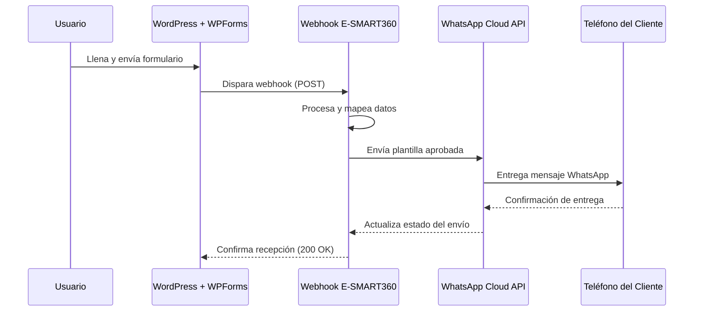
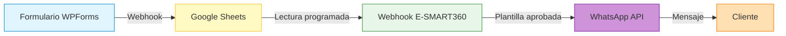

# Cómo Enviar Mensajes Automáticos de WhatsApp al Recibir Formularios de WPForms


> **Duración estimada:** 15-20 minutos · **Dificultad:** Intermedia · **Requisitos:** WPForms Pro, cuenta en E-SMART360, número de WhatsApp Business API conectado

En el mundo digital actual, la comunicación es clave para construir relaciones sólidas con los clientes. Automatizar las respuestas no solo ahorra tiempo, sino que también garantiza que tus clientes se sientan valorados y atendidos de manera oportuna. Si tu sitio web utiliza WPForms para consultas, comentarios o registros, tienes una oportunidad de oro para optimizar la comunicación integrando mensajes automáticos de WhatsApp.

Esta guía te llevará paso a paso por el proceso de configuración de mensajes automáticos de WhatsApp activados por el envío de formularios WPForms. Ya sea que quieras enviar una nota de agradecimiento, un mensaje de confirmación o información de seguimiento, esta integración mejorará la experiencia del usuario y aumentará la participación de los clientes sin esfuerzo. Una vez configurado, todo funcionará de forma automática.


> **Novedades en esta guía (Mayo 2026)**
> Se han actualizado los pasos para reflejar los cambios más recientes en la interfaz de WPForms y la API de WhatsApp Cloud. Se agregaron nuevas secciones sobre solución de problemas y mejores prácticas.

---

## Prerrequisitos

Antes de comenzar, asegúrate de contar con lo siguiente:


### WPForms Pro

Necesitas la versión **Pro** de WPForms, ya que la versión gratuita no incluye la funcionalidad de webhooks necesaria para esta integración.

### Webhooks Addon

El complemento **Webhooks Addon** debe estar instalado y activado en tu instalación de WordPress.

### Cuenta de WhatsApp Business API

Debes tener un número de teléfono conectado a la API de WhatsApp Business a través de E-SMART360. Si aún no lo has hecho, revisa nuestra guía de conexión.

### Plantilla de Mensaje Aprobada

Meta (WhatsApp) requiere una **plantilla de mensaje aprobada** para iniciar conversaciones comerciales. Debes crear una y obtener su aprobación antes de continuar.

### Cuenta Activa en E-SMART360

Asegúrate de tener una cuenta activa con acceso al panel de administración.


> **Importante:** WhatsApp no permite enviar mensajes proactivos a los usuarios sin una plantilla aprobada por Meta. El proceso de aprobación puede tomar desde unos minutos hasta 24 horas, dependiendo del contenido y la categoría de tu plantilla.

---

## Paso 1: Instalar el Webhooks Addon de WPForms

El primer paso es habilitar la capacidad de WPForms para enviar datos a servicios externos como E-SMART360 a través de webhooks.

1. Accede al **panel de administración de WordPress**.
2. En el menú lateral, ve a **WPForms** y selecciona **Addons**.
3. Se abrirá la página de complementos de WPForms con todos los addons disponibles.
4. Busca el **Webhooks Addon**, haz clic en **Instalar** y luego en **Activar**.


> El Webhooks Addon permite que WPForms envíe datos estructurados a cualquier URL externa mediante solicitudes HTTP POST. Esto es esencial para conectar tus formularios con el webhook workflow de E-SMART360.

Una vez activado, WPForms podrá comunicarse con cualquier servicio que acepte webhooks, incluyendo nuestra plataforma de automatización.

---

## Paso 2: Crear una Plantilla de Mensaje en WhatsApp

Meta (la empresa propietaria de WhatsApp) exige que toda empresa utilice **plantillas de mensaje aprobadas** para iniciar conversaciones con los clientes. Estas plantillas garantizan que los mensajes comerciales cumplan con las políticas de calidad de WhatsApp.


> **Consecuencias de no usar plantillas aprobadas:** Si intentas enviar un mensaje proactivo sin una plantilla aprobada, Meta rechazará el envío y podría afectar la calificación de calidad de tu número telefónico. El incumplimiento repetido puede llevar a la suspensión temporal o permanente de tu capacidad de enviar mensajes.

Para crear tu plantilla:

1. Desde el panel de E-SMART360, ve a **Bot Manager** y selecciona **Plantillas de Mensaje**.
2. Haz clic en el botón **Crear** y selecciona **Plantilla General**.
3. Completa los siguientes campos:
   - **Nombre de la plantilla:** Elige un nombre descriptivo (ej: `confirmacion_contacto_wp`).
   - **Idioma (Locale):** Selecciona el idioma de tu plantilla (ej: `es_MX` para español mexicano).
   - **Categoría:** Elige entre **Utilidad**, **Marketing** o **Autenticación** según el propósito del mensaje.
   - **Tipo de encabezado:** Puedes elegir entre Texto, Imagen, Video o Documento.
4. Escribe el **cuerpo del mensaje** utilizando variables entre llaves `{{1}}`, `{{2}}`, etc., para personalizar el contenido.
5. Opcionalmente, agrega botones como **Call to Action** (llamada a la acción) o **Quick Reply** (respuesta rápida).
6. Haz clic en **Guardar** y cierra la ventana.
7. Finalmente, haz clic en el botón **Sincronizar Plantilla** para enviarla a Meta para su revisión.


### Ejemplo: Plantilla de Confirmación

```
Cuerpo del mensaje:
¡Hola {{1}}! Hemos recibido tu mensaje correctamente.
Uno de nuestros agentes te responderá en las próximas 24 horas.
Gracias por contactarnos.

Número de seguimiento: {{2}}
```

### Ejemplo: Plantilla de Notificación de Pedido

```
Cuerpo del mensaje:
¡Gracias por tu compra, {{1}}!
Tu pedido #{{2}} ha sido confirmado.
Puedes dar seguimiento a tu envío desde tu panel de cliente.

Total: ${{3}} MXN
```

### Ejemplo: Plantilla de Cita Agendada

```
Cuerpo del mensaje:
Hola {{1}}, tu cita ha sido agendada exitosamente.
📅 Fecha: {{2}}
🕐 Hora: {{3}}
📍 Ubicación: {{4}}

Confirma tu asistencia respondiendo "SÍ" a este mensaje.
```

> **¿Cómo saber si tu plantilla fue aprobada?** En el panel de E-SMART360, el estado de la plantilla cambiará a **Aprobada** una vez que Meta complete la revisión. Recibirás una notificación en el sistema. Si es rechazada, podrás ver el motivo y editarla para reenviarla.

<Eexpandable title="¿Por qué mi plantilla fue rechazada? Causas comunes y soluciones">
Las principales razones por las que Meta rechaza las plantillas incluyen:

1. **Contenido engañoso:** La plantilla promete algo que no se puede cumplir. Revisa que el mensaje sea claro y veraz.
2. **Falta de identificación de la empresa:** La plantilla debe dejar claro quién envía el mensaje. Incluye el nombre de tu empresa.
3. **Lenguaje inapropiado:** Evita mayúsculas excesivas, signos de exclamación múltiples o lenguaje agresivo.
4. **Solicitud de información sensible:** No pidas contraseñas, números de tarjetas de crédito ni datos bancarios en la plantilla.
5. **Categoría incorrecta:** Asegúrate de seleccionar la categoría correcta (Utilidad vs Marketing). Las plantillas de marketing tienen restricciones más estrictas.

Consulta la guía completa de rechazo de plantillas para más detalles.
</Eexpandable>

---

## Paso 3: Crear una Campaña de Webhook Workflow

Una vez que tienes tu plantilla de mensaje aprobada, el siguiente paso es crear un **Webhook Workflow** en E-SMART360. Este workflow recibirá los datos enviados por WPForms y los utilizará para enviar el mensaje de WhatsApp personalizado.

1. En el panel de E-SMART360, ve a la sección **Webhook Workflow** y haz clic en **Crear**.
2. Asigna un nombre descriptivo al flujo de trabajo, por ejemplo: `Notificación WPForms - Contacto`.
3. Selecciona la **cuenta de WhatsApp** que utilizarás para enviar los mensajes.
4. Selecciona la **plantilla de mensaje** que creaste y fue aprobada en el paso anterior.
5. Haz clic en **Crear Workflow**. El sistema generará una **URL de Callback** única para este workflow.
6. **Copia esta URL** — la necesitarás en el siguiente paso al configurar WPForms.


> **No cierres la ventana del Webhook Workflow.** La campaña aún no está completa. Deberás regresar a esta pantalla después de enviar datos de prueba desde el formulario para mapear correctamente los campos.

### Explicación del Webhook Workflow

Un webhook workflow es un flujo automatizado que:

1. **Recibe datos externos** a través de una URL única (callback URL).
2. **Procesa y mapea** esos datos a las variables definidas en tu plantilla de mensaje.
3. **Envía el mensaje** de WhatsApp personalizado al número de teléfono especificado.
4. **Registra el resultado** para que puedas auditar el envío.


### ¿Qué es un webhook y cómo funciona en este contexto?

Un **webhook** es un mecanismo que permite que una aplicación envíe datos en tiempo real a otra aplicación cuando ocurre un evento específico. En este caso:

1. El usuario llena un formulario en tu sitio WordPress.
2. WPForms detecta el envío y dispara el webhook.
3. Los datos del formulario (nombre, email, teléfono, mensaje) se envían automáticamente a la URL de callback de E-SMART360.
4. El webhook workflow procesa los datos y envía el mensaje de WhatsApp personalizado al número proporcionado.

A diferencia de una API tradicional donde tendrías que hacer una solicitud periódica para verificar si hay nuevos datos, los webhooks entregan los datos inmediatamente cuando ocurre el evento.

---

## Paso 4: Crear el Formulario WPForms y Agregar la URL de Callback

Ahora crearás el formulario en WordPress que capturará los datos de tus usuarios y los enviará al webhook de E-SMART360.

### 4.1 Crear el formulario

1. Desde el panel de WordPress, ve a **WPForms** y selecciona **Agregar Nuevo**.
2. Asigna un nombre a tu formulario (ej: "Formulario de Contacto - WhatsApp").
3. Selecciona una plantilla base o comienza desde cero.
4. Agrega los campos necesarios:
   - **Nombre** (campo de texto)
   - **Correo Electrónico** (campo de email)
   - **Número de Teléfono** (campo de teléfono) — **Este campo es obligatorio** ya que será el número al que se enviará el mensaje de WhatsApp.
   - **Mensaje** (campo de texto o área de texto)

### 4.2 Configurar el webhook en el formulario

1. Ve a **Configuración de WPForms** y selecciona la pestaña **Webhooks**.
2. Activa la opción **Habilitar Webhooks**.
3. En el campo **URL Solicitada**, pega la URL de callback que copiaste en el paso anterior.
4. En **Método de Solicitud**, selecciona **POST**.
5. En la sección **Cuerpo de la Solicitud**, agrega los campos del formulario:
   - Haz clic en el botón **"+"** para agregar cada campo.
   - Para cada campo, selecciona el campo del formulario y asígnale una **clave de parámetro** (por ejemplo: `name`, `email`, `phone`, `message`).
6. Guarda el formulario.


> **Consejo sobre las claves de parámetro:** Usa nombres en minúsculas sin espacios ni caracteres especiales (ej: `nombre_completo`, `correo_electronico`, `telefono`, `mensaje`). Esto facilitará el mapeo posterior en el webhook workflow.

### 4.3 Verificar la configuración del webhook

Antes de pasar al siguiente paso, verifica que la configuración sea correcta:

- La URL de callback está completa y no tiene espacios.
- El método es POST (no GET).
- Todos los campos del formulario están mapeados.
- El campo de teléfono está presente y correctamente configurado.


### 📋 Lista de Verificación

- [ ] Webhooks Addon instalado y activado
- [ ] Plantilla de mensaje creada y aprobada
- [ ] Webhook workflow creado con URL de callback
- [ ] Formulario WPForms con campo telefónico
- [ ] Webhook habilitado en configuración
- [ ] URL de callback pegada correctamente
- [ ] Campos mapeados con claves de parámetro
- [ ] Formulario guardado

### 🛠️ Ejemplo: Formulario de Contacto

Imagina que tienes un negocio de servicios y creas un formulario con:
- **Nombre:** Juan Pérez
- **Email:** juan@ejemplo.com
- **Teléfono:** +521234567890
- **Mensaje:** Quiero información sobre planes

Cuando el usuario envía el formulario, recibirá automáticamente un WhatsApp de confirmación con sus datos.

---

## Paso 5: Enviar Datos de Prueba y Mapear el Workflow

Este paso es crucial: debes enviar un formulario de prueba para que el webhook capture datos de muestra y puedas mapear correctamente los campos en el workflow.

### 5.1 Enviar datos de prueba

1. Abre el formulario que creaste en el paso anterior en una ventana de incógnito o en otro navegador.
2. **Llena el formulario** con datos de prueba realistas:
   - Nombre: `Prueba Test`
   - Email: `test@ejemplo.com`
   - Teléfono: `+521234567890` (usa un número real si es posible)
   - Mensaje: `Este es un mensaje de prueba`
3. Envía el formulario.

### 5.2 Capturar y mapear la respuesta

1. Regresa al panel de E-SMART360 donde dejaste abierta la ventana del **Webhook Workflow**.
2. Haz clic en el botón **Capturar Respuesta del Webhook**.
3. El sistema mostrará los datos en bruto que recibió del formulario.
4. Ahora, en la sección de **Mapeo de Respuesta del Webhook**:
   - Haz clic en el campo **Número de Teléfono** y selecciona el valor correspondiente de los datos en bruto.
   - Si tu plantilla de mensaje tiene variables adicionales (como `{{1}}`, `{{2}}`), mapea cada una con el campo correspondiente de los datos de prueba.
5. Guarda la campaña.


> **¿Qué significa "mapear"?** Mapear es el proceso de decirle al sistema qué dato del formulario corresponde a qué campo de la plantilla. Por ejemplo: el campo "Nombre" del formulario se mapea con la variable `{{1}}` de la plantilla, y el campo "Mensaje" se mapea con `{{2}}`.

### 5.3 Probar el flujo completo

Una vez que hayas guardado la campaña, es recomendable hacer una prueba completa:

1. Abre nuevamente el formulario en una ventana de incógnito.
2. Ingresa un número de teléfono al que tengas acceso.
3. Completa el resto de los campos y envía.
4. Revisa tu WhatsApp — deberías recibir el mensaje automático configurado.


> **¡Todo listo!** Una vez que la prueba sea exitosa, la automatización funcionará de forma autónoma. Cada vez que alguien envíe el formulario, recibirá un mensaje de WhatsApp personalizado.

---

## Personalización Avanzada

Una vez que la integración básica funciona, puedes expandir sus capacidades.

### Agregar HTTP API para integración con CRMs

Puedes combinar el webhook workflow con la integración **HTTP API** para, por ejemplo, crear un contacto en tu CRM cuando alguien llena el formulario:


### Configuración HTTP API

1. Ve a **Integraciones > HTTP API** en el panel de E-SMART360.
2. Haz clic en **Crear** y proporciona:
   - **Nombre:** "Crear contacto en CRM"
   - **Método:** POST
   - **URL del Endpoint:** `https://tucrm.com/api/v1/contacts`
   - **Encabezados:** `Content-Type: application/json` y `Authorization: Bearer TU_TOKEN`
3. En el **Cuerpo de la Solicitud**, mapea los campos dinámicos:
   - `name` → valor dinámico del formulario
   - `email` → valor dinámico del formulario
   - `phone` → valor dinámico del formulario
4. Haz clic en **Verificar Conexión** para probar.
5. Guarda la API.

### Respuestas condicionales basadas en el contenido del formulario

Puedes configurar diferentes plantillas de mensaje según el tipo de solicitud:


### 📞 Solicitud de Contacto

Si el usuario selecciona "Información General", envía una plantilla con:
- Agradecimiento por contactar
- Tiempo estimado de respuesta
- Enlace a recursos útiles
- Número de ticket de seguimiento

### 🛒 Solicitud de Compra

Si el usuario selecciona "Realizar Pedido", envía una plantilla con:
- Confirmación del pedido
- Resumen de productos seleccionados
- Total y método de pago
- Instrucciones de seguimiento

### Programar mensajes de seguimiento

El sistema también permite configurar mensajes de seguimiento automáticos después del primer contacto. Por ejemplo:

1. **Mensaje inmediato:** Confirmación de recepción.
2. **Mensaje a las 24 horas:** Recordatorio amable si no hay respuesta del agente.
3. **Mensaje a las 72 horas:** Oferta especial o encuesta de satisfacción.


> Utiliza la función **Smart Delay** de E-SMART360 para programar respuestas automáticas hasta 24 horas después del evento. Esto es ideal para secuencias de seguimiento sin saturar al cliente.

---

## Solución de Problemas Comunes


### El webhook no recibe datos de WPForms

**Posibles causas y soluciones:**

1. **Webhooks Addon no está activado:** Ve a WPForms > Addons y verifica que el addon esté instalado y activo.
2. **URL de callback incorrecta:** Revisa que la URL copiada del webhook workflow esté completa y sin espacios.
3. **Método de solicitud incorrecto:** Asegúrate de que sea POST, no GET.
4. **Firewall de WordPress:** Algunos plugins de seguridad bloquean solicitudes salientes. Revisa la configuración de Wordfence, Sucuri u otros.
5. **Formato de datos inválido:** Verifica que los datos enviados sean compatibles con el formato JSON esperado por el webhook.

### Meta rechazó mi plantilla de mensaje

**Causas frecuentes:**

1. **Contenido promocional sin opción de exclusión:** Las plantillas de marketing deben incluir un mecanismo para que el usuario opte por no recibir más mensajes.
2. **Lenguaje engañoso o exagerado:** Revisa que el mensaje sea claro, veraz y profesional.
3. **Formato incorrecto:** Asegúrate de que las variables `{{1}}`, `{{2}}` estén correctamente formateadas.
4. **Categoría incorrecta:** Clasifica la plantilla correctamente como Utilidad, Marketing o Autenticación.

**Solución:** Edita la plantilla siguiendo las sugerencias de Meta y vuélvela a sincronizar.

### El mensaje de WhatsApp no llega al destinatario

**Posibles causas:**

1. **El número no está registrado en WhatsApp:** Verifica que el número ingresado tenga WhatsApp activo.
2. **El número está en una lista de bloqueo:** Si el usuario ha bloqueado tu número, no podrás enviarle mensajes.
3. **Límite de mensajes alcanzado:** Revisa tu nivel de mensajería (tier) en el panel de E-SMART360.
4. **La ventana de 24 horas ha expirado:** Solo puedes enviar mensajes proactivos con plantillas aprobadas.
5. **La plantilla no está aprobada:** Verifica el estado de la plantilla en el panel.

Revisa los registros de actividad en el webhook workflow para identificar errores específicos.

### Error 130472: El número forma parte de un experimento

Este error de WhatsApp indica que el número de destino está participando en un experimento de Meta. Generalmente es temporal y se resuelve solo. Si persiste, contacta al soporte de Meta a través de tu administrador de negocio.

**Solución temporal:** Utiliza un número de prueba diferente o espera 24-48 horas.

### El mapeo de campos no funciona correctamente

**Causas y soluciones:**

1. **Los nombres de los parámetros no coinciden:** Revisa que las claves de parámetro en WPForms coincidan exactamente con las que espera el webhook workflow.
2. **Datos de prueba no enviados:** Asegúrate de haber enviado el formulario de prueba antes de hacer clic en "Capturar Respuesta del Webhook".
3. **Formato de teléfono inválido:** El número debe incluir el código de país sin el signo `+` o con él, según lo que espera tu configuración.

**Recomendación:** Borra los datos capturados, envía un nuevo formulario de prueba y vuelve a capturar.

---

## Casos de Uso y Ejemplos Prácticos


### 🏢 Negocio de Servicios Profesionales

**Situación:** Una agencia de marketing recibe solicitudes de cotización a través de WPForms.

**Solución:** Cuando un cliente potencial envía el formulario solicitando una cotización:
1. Recibe automáticamente un WhatsApp de confirmación con su número de ticket.
2. El sistema envía una notificación interna al equipo de ventas.
3. A las 2 horas, si no ha sido contactado, recibe un mensaje de seguimiento.

**Resultado:** Reducción del 40% en el tiempo de respuesta y aumento del 25% en la tasa de conversión de leads.

### 🛍️ Tienda en Línea (E-commerce)

**Situación:** Una tienda de ropa utiliza WPForms para consultas de tallas y disponibilidad.

**Solución:** Al enviar el formulario de consulta:
1. El cliente recibe una respuesta automática con la información solicitada extraída del inventario.
2. Se le envían recomendaciones de productos similares vía WhatsApp.
3. Si la consulta es fuera del horario laboral, se programa una respuesta para el día siguiente.

**Resultado:** Atención al cliente 24/7 sin necesidad de personal adicional.

### 🏥 Clínica o Consultorio Médico

**Situación:** Una clínica dental recibe solicitudes de citas a través de WPForms.

**Solución:** Automatización completa del proceso de agendamiento:
1. Confirmación inmediata de recepción de solicitud vía WhatsApp.
2. Verificación de disponibilidad en tiempo real mediante integración HTTP API con el sistema de agenda.
3. Confirmación de cita con fecha, hora y ubicación.
4. Recordatorio automático 24 horas antes de la cita.

**Resultado:** Disminución del 60% en inasistencias y optimización de la agenda del consultorio.

### 🎓 Plataforma Educativa

**Situación:** Una academia en línea recibe inscripciones mediante WPForms.

**Solución:** Flujo automatizado de onboarding:
1. WhatsApp de bienvenida con credenciales de acceso.
2. Enlace al grupo privado de estudiantes en WhatsApp.
3. Calendario de clases y fechas importantes.
4. Seguimiento semanal automático con recordatorios de tareas.

**Resultado:** Tasa de retención de estudiantes 35% mayor y reducción de consultas administrativas recurrentes.

---

## Mejores Prácticas


> Sigue estas recomendaciones para maximizar la efectividad de tu automatización.

1. **Usa un lenguaje claro y profesional:** Las plantillas de mensaje deben ser concisas, amigables pero formales. Evita la jerga técnica innecesaria.
2. **Incluye siempre una opción para dejar de recibir mensajes:** Para cumplir con las políticas de Meta y respetar la privacidad del usuario, proporciona una forma sencilla de darse de baja (ej: "Responde STOP para no recibir más mensajes").
3. **Prueba antes de publicar:** Siempre realiza pruebas completas con números reales antes de activar la automatización para el público.
4. **Monitorea los registros:** Revisa periódicamente el panel de Webhook Workflow para identificar patrones de error o cuellos de botella.
5. **Mantén tus plantillas actualizadas:** Revisa cada 3-6 meses que tus plantillas de mensaje sigan siendo relevantes y cumplan con las políticas actualizadas de Meta.
6. **Segmenta tus audiencias:** No envíes el mismo mensaje a todos. Utiliza los datos del formulario para personalizar la comunicación según el tipo de solicitud.
7. **Respeta los horarios:** Configura los mensajes para que se envíen solo en horario laboral a menos que sea una confirmación automática urgente.


> **Política de uso aceptable de WhatsApp:** Recuerda que Meta penaliza el envío masivo de mensajes no solicitados. Utiliza esta automatización únicamente para responder a usuarios que han iniciado el contacto a través de tu formulario. Nunca utilices los webhooks para enviar mensajes no solicitados a números que no hayan dado su consentimiento explícito.

---

## Preguntas Frecuentes


### ¿Necesito la versión Pro de WPForms obligatoriamente?

Sí, la funcionalidad de webhooks solo está disponible en **WPForms Pro**. La versión gratuita (Lite) no incluye el Webhooks Addon necesario para esta integración. Si estás usando otro plugin de formularios, consulta nuestras guías de integración con Elementor Forms, Google Forms y Contact Form 7.

### ¿Cuánto tiempo tarda Meta en aprobar una plantilla de mensaje?

La aprobación puede tomar desde **unos minutos hasta 24 horas**, dependiendo de la complejidad del contenido y la categoría de la plantilla. Las plantillas de **utilidad** (confirmaciones, notificaciones) suelen aprobarse más rápido que las de **marketing**. Si tu plantilla ha estado en revisión por más de 48 horas, contacta al soporte de Meta a través del administrador de negocios.

### ¿Puedo enviar mensajes de WhatsApp sin usar una plantilla aprobada?

No. Meta exige que **toda comunicación proactiva** (iniciada por la empresa) utilice una plantilla de mensaje aprobada. Las únicas excepciones son:
- Responder a un mensaje iniciado por el cliente (dentro de la ventana de 24 horas de servicio al cliente).
- Mensajes de autenticación (OTP) con plantillas de la categoría Autenticación.

Sin una plantilla aprobada, el mensaje será rechazado por la plataforma.

### ¿Qué sucede si el webhook falla por algún motivo?

Si el webhook falla, el mensaje de WhatsApp no se enviará. Las causas más comunes incluyen:
- URL de callback incorrecta o caída del servidor.
- Timeout en la conexión.
- Datos mal formateados.
- Limitaciones de ancho de banda.

**Recomendación:** Revisa los registros de actividad en el webhook workflow para identificar el error específico. También puedes configurar notificaciones de fallo para recibir una alerta cuando ocurra un error.

### ¿Puedo integrar otros plugins de formularios además de WPForms?

Sí, E-SMART360 es compatible con múltiples plugins y plataformas de formularios:
- **Elementor Forms** — Integración directa mediante webhook workflow.
- **Contact Form 7** — Utilizando la integración HTTP API.
- **Google Forms** — Conectando mediante el webhook workflow o Zapier.
- **Gravity Forms** — A través de su addon de webhooks.
- **Formidable Forms** — Mediante solicitudes HTTP POST.

Cada integración sigue un proceso similar al descrito en esta guía, con pequeñas variaciones en la configuración del envío de datos.

### ¿Puedo enviar mensajes con imágenes o videos adjuntos?

Sí, pero con limitaciones. Las plantillas de mensaje pueden incluir **encabezados multimedia** (imagen, video o documento). Al crear tu plantilla, selecciona el tipo de encabezado apropiado y proporciona la URL pública del archivo multimedia. Ten en cuenta que:
- Las imágenes deben tener un tamaño máximo de 5 MB.
- Los videos deben tener un tamaño máximo de 16 MB.
- Los documentos deben tener un tamaño máximo de 100 MB.

Los formatos soportados incluyen JPG, PNG, MP4, PDF, DOCX, entre otros.

### ¿Cómo puedo ver el historial de mensajes enviados por esta automatización?

En el panel de E-SMART360, ve a la sección de **Registros de Actividad** o al **Webhook Workflow** específico que creaste. Allí encontrarás:
- Fecha y hora de cada envío.
- Número de teléfono del destinatario.
- Estado del mensaje (enviado, entregado, leído, fallido).
- Códigos de error en caso de fallo.

También puedes filtrar por rango de fechas, estado o destinatario para auditorías específicas.

### ¿Esta integración funciona para formularios en otros idiomas?

Sí, la integración es independiente del idioma del formulario. Sin embargo, ten en cuenta que:
- Cada plantilla de mensaje debe crearse para un **locale específico** (ej: `es_MX`, `en_US`).
- Si tu formulario recibe solicitudes en varios idiomas, necesitarás crear múltiples plantillas y workflows, uno para cada idioma.
- Puedes detectar el idioma del formulario mediante un campo oculto y dirigir la solicitud al workflow correspondiente.

Para negocios internacionales, recomendamos crear workflows separados por región o idioma.

---

## Arquitectura del Flujo Completo

Para entender visualmente cómo funciona la integración de principio a fin, aquí tienes un diagrama del flujo:



Este flujo completo ocurre en **cuestión de segundos** desde que el usuario hace clic en "Enviar" hasta que recibe el mensaje en su WhatsApp.

### Flujo Alternativo con Google Sheets

También puedes optar por una arquitectura donde los datos del formulario se almacenen primero en Google Sheets y luego se procesen por lotes:



Esta arquitectura es útil cuando necesitas **revisión manual** antes de enviar los mensajes o cuando quieres llevar un registro histórico centralizado.

---

## Seguridad y Buenas Prácticas

### Protección de Datos del Usuario

Cuando manejas información de tus usuarios a través de formularios y WhatsApp, es fundamental seguir estas prácticas de seguridad:

1. **Cifrado en tránsito:** Todos los datos enviados desde WPForms al webhook de E-SMART360 viajan cifrados mediante HTTPS.
2. **Almacenamiento mínimo necesario:** Solo conserva los datos que realmente necesitas. Configura políticas de retención de datos en tu panel.
3. **Consentimiento explícito:** Incluye una casilla de verificación en el formulario donde el usuario acepte recibir mensajes de WhatsApp.
4. **Derecho de cancelación:** Proporciona un mecanismo claro para que los usuarios puedan dejar de recibir mensajes (ej: responder "BAJA" o "STOP").


> **Cumplimiento normativo:** Dependiendo de tu país, puedes estar sujeto a regulaciones como GDPR (Europa), CCPA (California) o Ley de Protección de Datos Personales (Latinoamérica). Asegúrate de que tu implementación cumpla con la normativa aplicable. E-SMART360 no se hace responsable por el uso indebido de la plataforma para enviar mensajes no consentidos.

### Control de Acceso al Webhook

Para garantizar que solo WPForms pueda enviar datos a tu webhook:

1. **Usa URLs secretas:** El webhook workflow genera automáticamente una URL única y difícil de adivinar. No la compartas públicamente.
2. **Valida el origen:** Puedes configurar una clave secreta compartida entre WPForms y E-SMART360 para validar que las solicitudes provengan de tu sitio.
3. **Limita por IP:** Si tu servidor tiene una IP estática, configúrala como filtro en la recepción del webhook.
4. **Registros de auditoría:** Revisa periódicamente los registros del webhook para detectar actividad sospechosa.

---

## Migración desde Otra Plataforma

Si estás migrando desde otra herramienta de automatización a E-SMART360, el proceso es sencillo:


### Exporta tus plantillas de mensaje

Si tienes plantillas aprobadas en otra plataforma, puedes recrearlas en E-SMART360 con el mismo contenido. El nombre debe ser idéntico para mantener la aprobación de Meta.

### Desconecta la integración anterior

Elimina la URL de callback anterior de la configuración de WPForms y reemplázala con la nueva URL generada en E-SMART360.

### Prueba con un subconjunto de tráfico

Antes de migrar todo el tráfico, redirige solo un formulario de prueba para verificar que la integración funciona correctamente.

### Monitorea los primeros días

Durante los primeros 3-5 días después de la migración, revisa diariamente los registros del webhook workflow para asegurarte de que no haya errores.


> **¿Migrando desde otra BSP?** E-SMART360 soporta migración de números de teléfono desde cualquier Business Solution Provider (BSP) sin pérdida de calificación de calidad ni límites de mensajería. Consulta nuestra guía de migración para más detalles.

---

## Conclusión

Integrar mensajes automáticos de WhatsApp con WPForms es una forma poderosa de mejorar la comunicación con tus clientes y optimizar tus flujos de trabajo. Siguiendo los pasos descritos en esta guía, puedes configurar un sistema automatizado que envíe mensajes personalizados a tus usuarios en el momento exacto en que envían un formulario.

Esta automatización no solo ahorra tiempo, sino que también mejora la experiencia del usuario, demostrando a tus clientes que valoras su tiempo y sus consultas. Comienza a aprovechar esta integración hoy mismo para fortalecer las relaciones con los clientes y aumentar la participación con un esfuerzo mínimo.


> **¿Listo para el siguiente nivel?** Una vez que domines los webhooks con WPForms, explora nuestras guías de integración con **Google Sheets**, **Shopify**, **WooCommerce** y **Zapier** para crear automatizaciones aún más complejas y poderosas.

---

## Recursos Adicionales

- [Guía completa de plantillas de mensaje en WhatsApp](/recursos/plantillas-mensaje-whatsapp)
- [Integración con Google Sheets para envío de mensajes automatizados](/recursos/google-sheets-whatsapp-automatizado)
- [Cómo conectar WooCommerce con WhatsApp para notificaciones de pedidos](/recursos/woocommerce-notificaciones-whatsapp)
- [Solución de problemas comunes en la API de WhatsApp](/recursos/solucion-errores-whatsapp-api)
- [Guía de límites y niveles de mensajería en WhatsApp](/recursos/limites-mensajeria-whatsapp)
- [Webhook Workflow: Automatización completa de notificaciones](/recursos/webhook-workflow-automatizacion)

---

*¿Te resultó útil esta guía?
