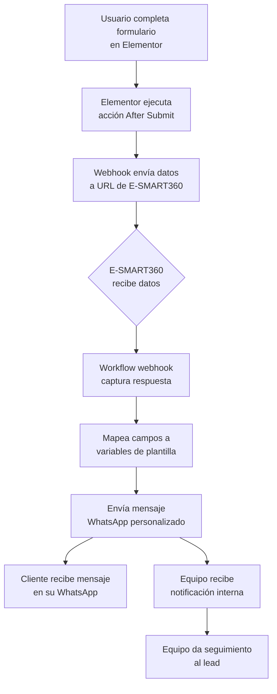

> **TL;DR:** Elimina la demora en la respuesta activando un mensaje de WhatsApp en el momento exacto en que un usuario hace clic en "Enviar" en tu formulario de Elementor. No necesitas conocimientos complejos de programación: simplemente copia la URL de webhook de E-SMART360 en la configuración de "Acciones después de enviar" de Elementor. Usa variables como **{{nombre}}** o **{{producto}}** para que cada mensaje automático se sienta humano y personalizado para cada usuario.

## Por qué es importante automatizar los formularios con WhatsApp

Responder rápido en 2026 marca la diferencia entre convertir un lead o perderlo para siempre. Los estudios muestran que responder en los primeros 5 minutos aumenta la tasa de conversión hasta 9 veces. WhatsApp, con más de 2 mil millones de usuarios activos y una tasa de apertura del 98%, se ha convertido en el canal preferido para la comunicación empresarial.

Cuando un visitante completa un formulario en tu sitio de WordPress con Elementor, generalmente espera una respuesta inmediata. Sin automatización, ese lead puede esperar horas o incluso días. Con esta integración, puedes:

- Enviar una confirmación instantánea al cliente en el momento exacto de su solicitud
- Notificar a tu equipo de ventas sobre cada nuevo lead con todos los detalles relevantes
- Enviar seguimientos automatizados con información personalizada según las respuestas del formulario
- Calificar leads automáticamente utilizando condiciones inteligentes basadas en los datos ingresados
- Reducir la carga de trabajo de tu equipo eliminando tareas manuales repetitivas
- Mejorar la experiencia del cliente con respuestas inmediatas y consistentes


> **Novedades para 2026:** Esta guía incorpora las últimas actualizaciones de Elementor, E-SMART360 y la API de WhatsApp Business. Incluye mejoras significativas en la configuración de webhooks, tiempos de aprobación de plantillas más rápidos y nuevas capacidades de personalización dinámica.

## Requisitos previos

Antes de comenzar con la configuración, asegúrate de contar con todos los elementos necesarios:


### WordPress con Elementor Pro

Tu sitio de WordPress debe tener Elementor Pro instalado y activado. La funcionalidad de webhook, que es esencial para esta integración, solo está disponible en la versión Pro de Elementor. La versión gratuita no incluye acciones posteriores al envío como webhooks.

### Cuenta activa en E-SMART360

Debes tener una cuenta activa en E-SMART360 con la API de WhatsApp Business correctamente configurada y verificada. Si aún no tienes una cuenta, puedes registrarte y configurar tu número de WhatsApp Business siguiendo la guía de conexión inicial.

### Acceso de administrador a WordPress

Necesitas permisos de administrador en tu sitio de WordPress para poder editar páginas con Elementor, instalar y configurar plugins, y gestionar la configuración del sitio.

### Conocimientos básicos de las herramientas

Familiaridad básica con la navegación en WordPress, el editor de Elementor y el panel de control de E-SMART360. No se requieren conocimientos de programación.

### Número de teléfono de prueba

Ten a mano un número de teléfono en formato internacional (ej: +521234567890) para realizar las pruebas de integración.

## Qué son los webhooks y cómo funcionan en esta integración

Antes de entrar en detalles, es útil entender el concepto de webhook. Un webhook es básicamente una URL que escucha datos enviados desde otro sistema. Cuando ocurre un evento (como el envío de un formulario), el sistema de origen envía automáticamente los datos a esa URL.

En nuestro caso:

1. **El usuario completa un formulario** en tu sitio web construido con Elementor
2. **Elementor detecta el envío** y ejecuta la acción "After Submit" configurada
3. **Los datos del formulario se envían** a la URL del webhook de E-SMART360
4. **E-SMART360 recibe los datos** y activa el workflow webhook correspondiente
5. **El workflow procesa los datos** y envía el mensaje de WhatsApp usando la plantilla aprobada
6. **El cliente recibe el mensaje** personalizado en su WhatsApp de forma instantánea

Todo este proceso ocurre en cuestión de segundos, completamente automatizado y sin intervención manual.

## Crear una plantilla de mensaje en E-SMART360

### Por qué son obligatorias las plantillas

Meta (la empresa propietaria de WhatsApp) exige que todas las empresas utilicen plantillas de mensaje previamente aprobadas para iniciar conversaciones con los clientes. Esto forma parte de las políticas de WhatsApp Business API para garantizar que los mensajes comerciales sean relevantes, no spam y cumplan con los estándares de calidad.

Las plantillas te permiten:

- Personalizar mensajes con variables dinámicas como el nombre del cliente o el producto solicitado
- Mantener un estilo coherente en todas tus comunicaciones
- Cumplir con las regulaciones de Meta para mensajería empresarial
- Asegurar que tus mensajes lleguen a la bandeja de entrada principal del cliente

### Pasos para crear una plantilla


### Accede al panel de control de E-SMART360

Inicia sesión en tu cuenta de E-SMART360 desde tu navegador. Una vez dentro, verás el panel principal con todas las opciones de navegación en la barra lateral izquierda.

### Navega a la sección de Plantillas de Mensaje

En el menú lateral, busca y haz clic en "WhatsApp Bot Manager" y luego en "Message Template" o "Plantillas de Mensaje". Aquí verás todas las plantillas existentes y podrás crear nuevas.

### Crea una nueva plantilla

Haz clic en el botón "Crear" o "Nueva Plantilla". Se abrirá un formulario con varias opciones de configuración.

### Configura los detalles básicos de la plantilla

Completa los siguientes campos:
- **Template Name:** Un nombre descriptivo interno (ej: "confirmacion_formulario_contacto")
- **Locale:** El idioma de la plantilla (ej: "es_MX" para español mexicano)
- **Category:** La categoría del mensaje (Marketing, Utilidad, o Autenticación)
- **Header Type:** El tipo de encabezado (Texto, Imagen, Video, Documento o None)

### Redacta el cuerpo del mensaje

Escribe el contenido principal del mensaje. Por ejemplo: "Hola {{nombre}}, gracias por contactarnos a través de nuestro sitio web. Hemos recibido tu consulta sobre {{producto}} y nuestro equipo te responderá a la brevedad."

### Agrega variables de personalización

Usa el formato {{variable}} para insertar campos dinámicos. Las variables más comunes son: {{nombre}}, {{telefono}}, {{email}}, {{mensaje}} y {{producto}}.

### Agrega botones o llamados a la acción (opcional)

Puedes incluir botones Call to Action (visitar sitio, llamar) o Quick Reply buttons para respuestas rápidas.

### Guarda y sincroniza la plantilla

Haz clic en "Guardar" y luego en "Sync Template" para enviarla a Meta para su revisión y aprobación.

### Espera la aprobación de Meta

La aprobación puede tardar desde minutos hasta 24 horas. Recibirás una notificación cuando sea aprobada o rechazada.


> **Consejos para una aprobación rápida:**
- Mantén el mensaje corto, directo y relevante para el usuario
- Evita lenguaje promocional excesivo o claimings poco realistas
- No incluyas información de contacto repetitiva (la marca ya aparece en el header)
- Asegúrate de que el propósito del mensaje sea claro para el usuario
- Usa variables con moderación y asegúrate de que tengan sentido en el contexto

## Configurar un flujo de trabajo webhook en E-SMART360

El webhook es el componente que conecta tu formulario de Elementor con el sistema de mensajería de E-SMART360. Cuando alguien envía un formulario, Elementor transmite los datos a la URL del webhook, activando así el flujo de trabajo que resulta en el envío del mensaje de WhatsApp.

### Guía paso a paso


### Accede a la sección Webhook Workflow

Desde el panel principal de E-SMART360, localiza en la barra lateral la opción "Webhook Workflow" o "Flujo de Trabajo Webhook". Esta sección te permite crear y gestionar todos tus workflows automatizados.

### Inicia un nuevo workflow

Haz clic en el botón "Crear" o "Create" para comenzar un nuevo flujo de trabajo. Se abrirá una ventana con opciones de configuración.

### Asigna un nombre descriptivo al workflow

Elige un nombre que te permita identificar fácilmente el propósito del workflow, como "Formulario Contacto Elementor - Notificación WhatsApp". Esto es útil cuando tengas múltiples workflows activos.

### Selecciona la cuenta de WhatsApp Business

Del menú desplegable, elige la cuenta de WhatsApp Business que está conectada a E-SMART360 y que quieres usar para enviar los mensajes.

### Selecciona la plantilla de mensaje aprobada

Elige la plantilla que creaste en el paso anterior. Solo aparecerán las plantillas que ya han sido aprobadas por Meta.

### Genera y copia la URL del webhook

Haz clic en "Crear Workflow" y el sistema generará automáticamente una URL de webhook única para este workflow. Cópiala y guárdala en un lugar seguro.


> **Importante:** No cierres la ventana del workflow en E-SMART360 todavía. Después de configurar Elementor y enviar datos de prueba, regresarás a esta misma ventana para capturar la respuesta del webhook y mapear los campos del formulario con las variables de la plantilla.

E-SMART360 ha mejorado sus capacidades de webhook para 2026, ofreciendo disparadores más precisos, estadísticas en tiempo real para monitorear el estado de tus flujos de trabajo, y alertas automáticas cuando un workflow falla.

## Conectar el webhook a tu formulario de Elementor

Ahora viene la parte práctica: conectar el formulario de tu sitio web con el webhook de E-SMART360.

### Construir el formulario en Elementor


### Accede al panel de administración de WordPress

Inicia sesión en tu sitio de WordPress usando tus credenciales de administrador. Ve al panel de administración (/wp-admin).

### Abre el editor de Elementor

Crea una nueva página desde "Páginas > Añadir nueva" o edita una página existente donde quieras colocar el formulario. Haz clic en "Editar con Elementor".

### Agrega el widget de Formulario

En el panel izquierdo de Elementor, busca el widget "Form" y arrástralo hacia el área de diseño de tu página.

### Configura los campos del formulario

Por defecto, Elementor agrega tres campos: Nombre, Correo Electrónico y Mensaje. Para nuestra integración:
- **Nombre:** Déjalo como está (es obligatorio para personalizar el mensaje)
- **Correo Electrónico:** Cámbialo a un campo de tipo "Teléfono". Cambia la etiqueta a "Número de Teléfono"
- **Mensaje:** Es opcional pero útil para capturar la consulta del usuario

### Configura las acciones posteriores al envío

Selecciona el widget del formulario. En el panel izquierdo, ve a "Configuración" > "Actions After Submit".

### Agrega la acción de Webhook

Haz clic en "Add Action" y selecciona "Webhook" de la lista. Aparecerá un campo adicional donde pegar la URL.

### Pega la URL del webhook de E-SMART360

Pega la URL del webhook que copiaste de E-SMART360. Asegúrate de que no haya espacios adicionales.

### Publica la página con el formulario

Haz clic en "Publicar" o "Actualizar" para que el formulario esté disponible en tu sitio web.

### Verificación visual de la configuración

Después de publicar, es recomendable hacer una verificación visual rápida:

1. Visita la página donde está el formulario desde una ventana de incógnito
2. Confirma que todos los campos se muestren correctamente
3. Verifica que el campo de teléfono acepte números en formato internacional
4. Asegúrate de que el botón de envío funcione correctamente


> **Novedad de Elementor 2026:** La última versión de Elementor Pro incluye una función que permite enviar datos de prueba directamente desde el editor, sin necesidad de publicar la página primero. Busca la opción "Test Webhook" en la configuración del formulario.

## Probar la integración: de principio a fin

Una vez que todo está configurado, es fundamental realizar una prueba completa para asegurarse de que la integración funciona correctamente antes de ponerla en producción.

### Etapa 1: Enviar datos de prueba desde el formulario

Completa el formulario en tu sitio web con datos de muestra realistas:

- **Nombre:** Escribe un nombre de prueba (ej: "Carlos Martínez")
- **Número de Teléfono:** Ingresa un número en formato internacional completo (ej: +521234567890)
- **Mensaje:** Escribe un mensaje de prueba (ej: "Hola, me gustaría recibir información")

### Etapa 2: Capturar los datos en E-SMART360

1. Vuelve al panel de E-SMART360 donde dejaste abierta la ventana del workflow webhook
2. Haz clic en el botón "Capture Webhook Response"
3. Sin cerrar esta ventana, ve a tu sitio web y envía el formulario de prueba
4. E-SMART360 capturará automáticamente los datos enviados desde Elementor
5. Verás los datos crudos (raw data) en la interfaz

### Etapa 3: Mapear los campos capturados a las variables de la plantilla

Conecta los datos que llegaron del formulario con las variables de tu plantilla:

| Dato capturado del formulario | Variable en la plantilla | Descripción |
|---|---|---|
| Nombre (name) | {{nombre}} | Se usará para el saludo personalizado |
| Teléfono (phone) | {{telefono}} | Número al que se enviará el mensaje |
| Mensaje (message) | {{mensaje}} | Contenido de la consulta del usuario |

Pasos para mapear:
1. Selecciona el campo "Teléfono" de los datos capturados como el identificador del destinatario
2. Asigna cada campo capturado a la variable correspondiente de la plantilla

### Etapa 4: Guardar y verificar el resultado

1. Haz clic en "Guardar Workflow" para finalizar la configuración
2. Revisa la aplicación de WhatsApp en el teléfono que usaste como destinatario
3. Deberías recibir el mensaje personalizado en cuestión de segundos
4. En el panel de E-SMART360, verifica que el estado del workflow aparezca como "Completado"
5. Si todo funciona correctamente, ¡la integración está lista para producción!


> **El mensaje no llegó?** Verifica:
- El número de teléfono está en formato internacional correcto (+códigopaís + número sin espacios ni guiones)
- La plantilla de mensaje está realmente aprobada por Meta (no solo guardada)
- La URL del webhook está correctamente pegada (sin errores tipográficos)
- La cuenta de WhatsApp Business en E-SMART360 está activa y con saldo disponible

## Personalización avanzada con variables dinámicas

La verdadera potencia de esta integración está en la personalización. Puedes capturar cualquier campo del formulario y usarlo en tu mensaje de WhatsApp.

### Tabla de campos recomendados

| Campo en formulario | Variable en plantilla | Uso recomendado | Ejemplo |
|---|---|---|---|
| Nombre completo | {{nombre}} | Saludo personalizado en la apertura | "Hola {{nombre}}," |
| Número de teléfono | {{telefono}} | Identificador del destinatario (obligatorio) | Se usa como destino del mensaje |
| Correo electrónico | {{email}} | Confirmación de envío de información | "Te enviamos los detalles a {{email}}" |
| Producto de interés | {{producto}} | Seguimiento específico y contextual | "Gracias por tu interés en {{producto}}" |
| Mensaje / Consulta | {{mensaje}} | Respuesta contextualizada | "Recibimos tu consulta sobre: {{mensaje}}" |
| Presupuesto estimado | {{presupuesto}} | Calificación del lead | "Te contactaremos con una cotización" |
| Ciudad o ubicación | {{ciudad}} | Información local relevante | "Tenemos cobertura en {{ciudad}}" |
| Fecha preferida | {{fecha}} | Confirmación de citas | "Agendaremos tu cita para el {{fecha}}" |

### Ejemplos de mensajes personalizados


### Confirmación de contacto (Servicios)

```text
Hola {{nombre}},
¡Gracias por contactarnos a través de nuestro sitio web!
Hemos recibido tu solicitud de información sobre {{producto}}.
Nuestro equipo de expertos revisará tu consulta y te responderá
en un máximo de 24 horas.
Mientras tanto, te invitamos a visitar nuestro sitio web para
conocer más sobre nuestros servicios.
¡Saludos!
El equipo de [Tu Empresa]
```

### Lead calificado para ventas (E-commerce)

```text
¡Hola {{nombre}}! 🎉
Gracias por tu interés en {{producto}}.
Hemos recibido tu cotización solicitada y uno de nuestros
asesores especializados se pondrá en contacto contigo en las
próximas 2 horas para brindarte una atención personalizada.
Tu número de seguimiento es: #{{id}}
¿Tienes alguna pregunta adicional? ¡Estamos aquí para ayudarte!
```

### Notificación interna para el equipo de ventas

```text
🔔 NUEVO LEAD - ACCIÓN REQUERIDA
Cliente: {{nombre}}
Teléfono: {{telefono}}
Email: {{email}}
Producto: {{producto}}
Mensaje: {{mensaje}}
Por favor contacta a este lead dentro de los próximos 30 minutos
para maximizar la oportunidad de conversión.
¡A darle con todo!
```

### Confirmación de cita (Salud/Profesionales)

```text
Estimado(a) {{nombre}},
Tu cita ha sido confirmada exitosamente ✅
Fecha: {{fecha}}
Hora: {{hora}}
Servicio: {{servicio}}
Ubicación: [Dirección de tu consulta]
Si necesitas reprogramar o cancelar, por favor responde este
mensaje con al menos 24 horas de anticipación.
¡Te esperamos!
```

## Personalización condicional avanzada

E-SMART360 te permite crear flujos de trabajo inteligentes que envían diferentes mensajes según las respuestas del formulario. Esto transforma tu formulario de una simple herramienta de captura a un verdadero sistema de calificación y segmentación de leads.

### Ejemplo: Flujo condicional por tipo de consulta

Si tu formulario incluye un campo desplegable "Tipo de consulta" con opciones como "Soporte técnico", "Ventas" y "Otros", puedes configurar tu workflow para:

- **Si el usuario selecciona "Soporte técnico":** Enviar un mensaje con instrucciones de solución de problemas comunes y el horario de atención del equipo técnico
- **Si selecciona "Ventas":** Enviar un mensaje con información de productos, enlace al catálogo y el contacto directo del equipo comercial
- **Si selecciona "Otros":** Enviar un mensaje genérico de agradecimiento con el compromiso de respuesta en 24 horas

Esta segmentación mejora significativamente la experiencia del cliente al recibir información relevante para su necesidad específica desde el primer contacto.

## Opciones adicionales y expansión de la integración

Una vez que la integración básica funciona, puedes expandir sus capacidades de muchas maneras.

### Envío simultáneo de notificaciones al equipo

Además del mensaje automático que recibe el cliente, puedes configurar un segundo workflow webhook para que tu equipo reciba una notificación instantánea cada vez que alguien completa un formulario.


### Crea un segundo workflow webhook

En E-SMART360, crea un nuevo workflow similar al primero pero usando una plantilla de notificación interna (como la del ejemplo "Notificación interna para ventas").

### Configura dos acciones en Elementor

En el mismo formulario de Elementor, agrega una segunda acción "Webhook" después de la primera. Pega la URL del segundo workflow en esta nueva acción.

### Prueba el envío dual

Completa el formulario una vez más. Ahora tanto el cliente como tu equipo recibirán mensajes simultáneamente: el cliente recibe una confirmación amigable, y tu equipo recibe una alerta con los detalles del lead.

### Integración con Google Sheets para registro de leads

Puedes combinar esta integración con Google Sheets para mantener un registro actualizado de todos los leads capturados a través de tus formularios. E-SMART360 se conecta directamente con Google Sheets, permitiendo que cada submission del formulario se registre automáticamente en una hoja de cálculo.

**Beneficios:**
- Histórico completo de todos los leads capturados
- Fácil exportación para análisis y reportes
- Datos disponibles para tu equipo de marketing y ventas
- Posibilidad de hacer seguimiento a leads que no respondieron al WhatsApp inicial

### Integración con APIs HTTP para acciones avanzadas

E-SMART360 también te permite conectar flujos de trabajo con APIs HTTP externas para realizar acciones más complejas basadas en los datos del formulario. Por ejemplo, puedes crear automáticamente un lead en tu CRM, registrar un ticket de soporte o actualizar una base de datos externa.


### Accede a la sección HTTP API en E-SMART360

En el panel de control, navega a Integración > HTTP API y haz clic en "Crear" para configurar una nueva conexión API.

### Configura los detalles de conexión de la API

Completa los siguientes campos:
- **Nombre de la API:** Un nombre descriptivo como "Crear lead en CRM"
- **Método HTTP:** Generalmente POST para crear registros
- **URL del endpoint:** La URL del endpoint de tu CRM o sistema externo (ej: https://tucrm.com/api/v1/leads)
- **ID de suscriptor de prueba:** Un ID de un suscriptor existente en E-SMART360 para realizar pruebas

### Configura los encabezados HTTP (Headers)

Establece los encabezados necesarios para la comunicación con la API:
- **Content-Type:** application/json (el formato más común)
- **Authorization:** El método de autenticación requerido (Bearer Token, API Key, etc.)

### Define el cuerpo de la solicitud (Request Body)

Agrega los campos que la API espera recibir y mapea los valores desde los datos capturados del formulario. Puedes usar valores estáticos (fijos) o dinámicos (desde los datos del formulario). Elige el formato apropiado: JSON, Form Data, o X-WWW-FORM-URLENCODED.

### Verifica la conexión con la API externa

Haz clic en "Verify Connection" para enviar una solicitud de prueba. Si la conexión es exitosa, podrás ver la respuesta de la API. En caso de error, revisa la URL y los encabezados de autenticación.

### Mapea los datos de respuesta de la API

Una vez que la API responde, puedes mapear los campos de la respuesta (como user_id, ticket_number, etc.) a variables en E-SMART360 para usarlos en mensajes posteriores o en el flujo del chatbot.

### Integra el HTTP API en tu flujo de trabajo

Agrega un elemento HTTP API en cualquier punto del flujo de tu chatbot dentro de E-SMART360. El elemento se ejecutará cuando se cumplan las condiciones que hayas definido.

Esta integración con APIs HTTP permite acciones como:
- Creación automática de usuarios en WordPress o cualquier CMS
- Registro de tickets de soporte en sistemas como Freshdesk o Zendesk
- Actualización de perfiles de clientes en tu base de datos
- Envío de datos a plataformas de email marketing como Mailchimp
- Consulta de información en sistemas ERP para respuestas contextualizadas

## Solución de problemas comunes


### El formulario no envía datos al webhook de E-SMART360

**Posibles causas y soluciones:**
1. **URL incorrecta:** Verifica que la URL del webhook esté exactamente como la copiaste de E-SMART360, sin espacios adicionales.
2. **Formulario no publicado:** Asegúrate de que la página con el formulario esté en estado "Publicado" y no en "Borrador".
3. **Caché del navegador:** Limpia la caché de tu navegador o prueba en una ventana de incógnito.
4. **Plugins de caché:** Algunos plugins de caché de WordPress pueden interferir. Prueba desactivándolos temporalmente.
5. **Firewall o seguridad:** Plugins como Wordfence o Sucuri pueden bloquear solicitudes salientes. Agrega la URL de E-SMART360 a la lista blanca.
6. **Consola de errores:** Abre la consola de desarrollador del navegador (F12) y revisa si hay errores de JavaScript o de red al enviar el formulario.

### Los mensajes de WhatsApp no llegan al destinatario

**Verifica estos puntos en orden:**
1. **Estado de la API:** Confirma que la API de WhatsApp Business esté activa en tu cuenta de E-SMART360.
2. **Aprobación de plantilla:** Verifica que la plantilla seleccionada esté en estado "Aprobado" y no en "Pendiente" o "Rechazado".
3. **Número de teléfono:** Asegúrate de que el número del destinatario esté en formato internacional completo: +[código de país][número sin ceros iniciales].
4. **Saldo disponible:** Verifica que tu cuenta tenga saldo suficiente. Los mensajes de WhatsApp Business API tienen un costo por conversación.
5. **Límites de mensajería:** Revisa que no hayas excedido el límite de mensajes de tu plan o los límites de calidad de Meta.
6. **Número verificado:** Confirma que tu número de WhatsApp Business esté verificado y activo en la plataforma.
7. **Opt-in del usuario:** Para mensajes fuera de la ventana de 24 horas, el destinatario debe haber dado consentimiento.

### Error en el mapeo de campos: las variables no se reemplazan

**Problema:** El mensaje llega con el texto literal "{{nombre}}" en lugar del nombre real.
**Soluciones:**
1. **Mayúsculas/minúsculas:** Verifica que los nombres de las variables coincidan exactamente. {{nombre}} no es lo mismo que {{Nombre}}.
2. **Captura correcta:** Asegúrate de haber hecho clic en "Capture Webhook Response" antes de enviar los datos de prueba.
3. **Espacios:** Revisa que no haya espacios adicionales dentro de las llaves. Debe ser {{nombre}}, no {{ nombre }}.
4. **Reintentar:** Borra el mapeo existente y vuelve a capturar la respuesta del webhook enviando el formulario nuevamente.

### El webhook muestra datos vacíos o incompletos

**Posibles causas:**
1. **Campos sin nombre:** Si algún campo del formulario de Elementor no tiene un nombre de campo (field ID), los datos pueden llegar vacíos.
2. **Campos ocultos:** Campos condicionales que no se muestran al usuario pueden no enviar datos si la condición no se cumple.
3. **JSON malformado:** Revisa los datos crudos capturados. Si el JSON está mal formado, puede haber problemas de compatibilidad.
4. **Caracteres especiales:** Caracteres como &, %, # pueden romper el formato si no están correctamente codificados.

### El webhook falla silenciosamente sin error aparente

**Estrategia de diagnóstico:**
1. **Revisa los logs de E-SMART360:** En el panel de Webhook Workflow, busca estadísticas o logs de actividad que muestren intentos fallidos.
2. **Verifica conectividad:** Asegúrate de que tu servidor de WordPress pueda hacer solicitudes HTTP salientes.
3. **Compatibilidad SSL:** Si tu sitio usa HTTPS, verifica que el certificado SSL esté vigente y correctamente configurado.
4. **Timeout de servidor:** Algunos servidores compartidos tienen límites de tiempo de ejecución que pueden interrumpir la conexión con el webhook.

### Problemas al configurar múltiples acciones After Submit en Elementor

Si necesitas que el formulario ejecute varias acciones (como enviar datos a dos webhooks diferentes), asegúrate de:
1. Las acciones están en el orden correcto en la lista de "Actions After Submit"
2. Cada URL de webhook es única y corresponde al workflow correcto
3. Prueba cada acción individualmente para identificar cuál está fallando
4. Revisa que no haya conflictos entre las acciones

### La plantilla de mensaje fue rechazada por Meta

**Razones comunes de rechazo y cómo solucionarlas:**
1. **Contenido promocional excesivo:** Reduce las frases de venta y enfócate en información útil para el usuario.
2. **Falta de claridad:** El propósito del mensaje debe ser evidente para el destinatario.
3. **Variable mal usada:** Las variables deben tener sentido en el contexto de la oración.
4. **Categoría incorrecta:** Asegúrate de que la categoría de la plantilla coincida con su propósito (Utilidad para transacciones, Marketing para promociones).
5. **Idioma incorrecto:** El locale debe coincidir con el idioma del contenido de la plantilla.

### Error 130472 - Número en experimento de Meta

Este error ocurre cuando el número de teléfono del destinatario está siendo evaluado por Meta como parte de un experimento interno. Para resolverlo:
1. Espera 24-48 horas e intenta nuevamente
2. Si persiste, contacta al soporte de Meta a través del administrador de negocio
3. Como alternativa temporal, usa un número de teléfono diferente para la prueba

## Consejos para el éxito en 2026


### Cumple con las políticas

Mantente actualizado con las políticas de mensajería de WhatsApp. Las reglas sobre plantillas, categorías y horarios de envío pueden cambiar. Revisa periódicamente que tus plantillas sigan cumpliendo con los requisitos de Meta.

### Mantén los mensajes simples

Haz que los mensajes sean cortos, directos y útiles. Un mensaje demasiado largo o confuso puede generar una mala experiencia. Incluye solo la información que el usuario necesita en ese momento.

### Protege los datos del usuario

Implementa las guías de privacidad más recientes en tu formulario y en la configuración de E-SMART360. Asegúrate de tener el consentimiento del usuario para enviarle mensajes de WhatsApp. Incluye un aviso de privacidad en tu formulario.


> **Actualización: Nuevas capacidades de webhook en 2026 (Febrero 2026)**
> La integración entre E-SMART360 y Elementor ha mejorado significativamente. Ahora puedes:
- Enviar diferentes mensajes según las respuestas del formulario usando condiciones inteligentes
- Ver estadísticas en vivo de cada workflow webhook
- Probar la integración directamente desde el editor de Elementor sin necesidad de publicar primero
- Capturar y mapear hasta 20 campos personalizados por formulario
- Recibir alertas automáticas cuando un workflow falle

## Preguntas frecuentes


### ¿Necesito Elementor Pro para los webhooks?

Sí, los webhooks solo están disponibles en Elementor Pro. La versión gratuita de Elementor no incluye esta funcionalidad. Si usas la versión gratuita, considera alternativas como WPForms con su addon de webhooks, o Gravity Forms que también soporta webhooks de forma nativa en su versión Pro.

<Expand
### ¿Cuánto tarda Meta en aprobar una plantilla de mensaje?

La aprobación puede tomar desde unos minutos hasta 24 horas, dependiendo del contenido de la plantilla y la carga de trabajo del equipo de revisión de Meta. Las plantillas simples y que cumplen claramente con las políticas suelen aprobarse más rápido. Las plantillas de categoría "Utilidad" (transacciones, notificaciones) tienden a aprobarse más rápido que las de "Marketing".

### ¿Puedo enviar mensajes sin usar una plantilla aprobada?

No. Meta requiere una plantilla aprobada para iniciar mensajes comerciales con clientes. Esto aplica a todos los mensajes enviados fuera de la ventana de servicio al cliente (24 horas desde el último mensaje del usuario). Dentro de la ventana de 24 horas, puedes responder libremente sin usar plantillas.

### ¿Qué hago si el webhook falla?

Primero, verifica que la URL del webhook sea correcta en Elementor. Luego, revisa que el formulario esté correctamente configurado con el webhook como acción "After Submit". También puedes revisar los registros de actividad en E-SMART360 para identificar el error exacto. Si el problema persiste, prueba usando un servicio como webhook.site para verificar si el problema está en Elementor o en E-SMART360.

### ¿Puedo usar esto para formularios de contacto de terceros?

Sí, siempre que el plugin de formularios soporte webhooks. Además de Elementor Pro, puedes usar:
- **WPForms** (con su addon de Webhooks activado)
- **Gravity Forms** (soporte nativo para webhooks)
- **Contact Form 7** (con extensiones de terceros)
- **Formidable Forms** (con su addon de webhooks)
- **Ninja Forms** (con extensiones de webhook)

### ¿Los mensajes enviados por webhook cuentan contra mi límite de mensajes?

Sí, todos los mensajes enviados a través de la API de WhatsApp Business cuentan contra los límites de mensajería de tu plan y los límites de calidad/volumen de Meta. Asegúrate de monitorear tu consumo en el panel de E-SMART360 para evitar interrupciones en el servicio.

### ¿Puedo configurar múltiples formularios con diferentes mensajes?

Absolutamente. Puedes crear workflows webhook separados para cada formulario, cada uno con su propia plantilla de mensaje y URL de webhook. Esto te permite tener mensajes completamente diferentes para formularios de contacto, suscripción a newsletter, solicitudes de cotización, agendamiento de citas, etc. Cada workflow se gestiona de forma independiente en el panel de E-SMART360.

### ¿Qué diferencia hay entre webhook workflow y HTTP API en E-SMART360?

El **webhook workflow** está diseñado para recibir datos desde un sistema externo (como Elementor) cuando ocurre un evento y disparar un mensaje de WhatsApp automáticamente. La **HTTP API**, por otro lado, te permite conectar E-SMART360 con sistemas externos para enviar o solicitar datos, como crear un lead en un CRM o consultar información en una base de datos externa. Ambos se complementan: el webhook recibe los datos del formulario, y la HTTP API puede usarse para enviar esos datos a otros sistemas.

### ¿Necesito WPForms Pro además de Elementor Pro?

No. Si ya tienes Elementor Pro, no necesitas WPForms. Elementor Pro incluye su propio widget de formulario con soporte completo para webhooks. WPForms sería necesario solo si prefieres usar ese plugin en lugar del formulario nativo de Elementor.

## Ejemplos prácticos por industria


### 🛒 E-commerce: Confirmación de pedido y seguimiento

Un cliente completa un formulario de "Solicitar cotización" para un producto específico en tu tienda online. Automáticamente recibe un WhatsApp con el detalle de su solicitud, el tiempo estimado de respuesta y un enlace al catálogo completo. El equipo de ventas también recibe una notificación interna con los datos del lead para dar seguimiento inmediato. Además, puedes configurar un recordatorio automático a las 24 horas si el lead no ha respondido.

### 🏥 Clínica o consultorio: Confirmación de citas

Un paciente llena un formulario de "Agendar cita" en el sitio web de la clínica. Inmediatamente recibe un mensaje de WhatsApp confirmando la fecha y hora seleccionadas, junto con instrucciones de preparación, la dirección de la consulta y un enlace para reprogramar si es necesario. El sistema también envía un recordatorio automático 24 horas antes de la cita, reduciendo significativamente las ausencias.

### 🏨 Hotelería: Gestión de reservas y consultas

Un huésped potencial completa un formulario de "Disponibilidad y reservas". Recibe al instante un mensaje de WhatsApp con las opciones de habitaciones disponibles, precios y un enlace directo para confirmar su reserva. El equipo de recepción recibe una alerta para preparar los detalles de la estancia y contactar al huésped si necesita información adicional.

### 🔧 Soporte técnico: Tickets automatizados

Un usuario reporta un problema técnico a través del formulario de soporte en tu sitio web. Automáticamente recibe un número de ticket y un mensaje confirmando que su caso ha sido registrado. El equipo de soporte recibe una notificación con todos los detalles, incluyendo el sistema operativo, navegador y la descripción del problema, permitiendo una resolución más rápida y eficiente.

### 🎓 Educación: Inscripción a cursos

Un estudiante interesado completa el formulario de pre-inscripción a un curso. Recibe un mensaje de WhatsApp de bienvenida con los detalles del programa, fechas de inicio, requisitos y un enlace para completar el proceso de inscripción y pago. El coordinador académico recibe una alerta para dar seguimiento personalizado al nuevo estudiante.

### 🚗 Automotriz: Solicitud de prueba de manejo

Un cliente potencial solicita una prueba de manejo a través del formulario del concesionario. Recibe una confirmación instantánea con la fecha, hora y ubicación acordadas, junto con recomendaciones sobre qué documentos llevar. El equipo de ventas es notificado para preparar el vehículo y asegurar una experiencia memorable.

## Comparativa: Elementor vs otros plugins de formularios

| Característica | Elementor Pro | WPForms Pro | Gravity Forms |
|---|---|---|---|
| Webhook nativo | ✅ Sí | ✅ Con addon | ✅ Sí |
| Widget drag & drop | ✅ Sí | ✅ Sí | ✅ Sí |
| Campos personalizados | ✅ Sí | ✅ Sí | ✅ Sí |
| Condicionales en campos | ✅ Sí | ✅ Sí | ✅ Sí |
| Integración con WhatsApp | Vía webhook E-SMART360 | Vía webhook E-SMART360 | Vía webhook E-SMART360 |
| Precio (aprox.) | Incluido en Elementor Pro | Desde $49.50/año más addon | Desde $59/año |
| Facilidad de uso | Excelente | Excelente | Buena |

## Flujo completo: Diagrama de la integración




## Automatización con condiciones y reglas inteligentes

### Uso de variables de entorno y filtros

E-SMART360 te permite aplicar filtros y condiciones a tus workflows webhook para que solo se activen bajo ciertas circunstancias. Por ejemplo:

- **Filtro por país:** Si el formulario incluye un campo de país, puedes enviar un mensaje en el idioma correspondiente
- **Filtro por producto:** Diferentes productos pueden disparar workflows distintos con información específica
- **Filtro por valor:** Si el presupuesto es mayor a cierta cantidad, notificar al gerente de ventas directamente
- **Filtro por horario:** Enviar diferentes mensajes según si es horario laboral o no

### Personalización avanzada con lógica condicional en los mensajes

Puedes crear mensajes que se adapten dinámicamente según los datos recibidos:

```
Hola {{nombre}},
Gracias por tu interés en {{producto}}.
{{#if presupuesto}}
Hemos recibido tu presupuesto estimado de {{presupuesto}}.
Uno de nuestros asesores especializados te contactará para presentarte las mejores opciones.
{{else}}
Nos gustaría conocer más sobre tu proyecto para ofrecerte la mejor solución.
{{/if}}
¡Estamos aquí para ayudarte!
```

Esta lógica condicional hace que cada mensaje sea único y relevante para la situación específica del lead.

### Integración con calendarios para agendamiento de citas

Puedes conectar tus formularios de Elementor con sistemas de calendario como Google Calendar o Calendly a través de las APIs HTTP de E-SMART360. Cuando un cliente solicita una cita:

1. El formulario captura la fecha y hora preferida
2. El webhook envía los datos a E-SMART360
3. La API HTTP de E-SMART360 se comunica con tu calendario
4. Se crea el evento automáticamente
5. El cliente recibe la confirmación con los detalles en WhatsApp

### Reportes y análisis de rendimiento

Para maximizar el valor de tu integración, es importante medir su impacto:

| Métrica | Qué mide | Por qué es importante |
|---|---|---|
| Tasa de conversión de formulario a lead | % de formularios que reciben respuesta | Indica si la integración está funcionando |
| Tiempo de primera respuesta | Tiempo entre el envío del formulario y la respuesta | WhatsApp Business API garantiza respuestas en segundos |
| Tasa de engagement en WhatsApp | % de destinatarios que responden al mensaje | Mide la efectividad de tus mensajes |
| ROI de la automatización | Costo vs beneficio de la integración | Justifica la inversión en la plataforma |

## Estrategias avanzadas de automatización

### Workflows en cascada: Múltiples mensajes en secuencia

Puedes configurar workflows que se encadenen para enviar una secuencia de mensajes a lo largo del tiempo. Por ejemplo:

**Día 1 (Inmediato):** Mensaje de confirmación de recepción del formulario
**Día 2 (24h después):** Mensaje de seguimiento preguntando si necesita ayuda adicional
**Día 5 (120h después):** Mensaje con una oferta especial o contenido relevante
**Día 15:** Mensaje de verificación preguntando si aún está interesado

Esta secuencia mantiene tu marca presente en la mente del cliente sin ser intrusiva, y te permite calificar el nivel de interés según las respuestas.

### Integración con WhatsApp Flows

WhatsApp Flows te permite crear formularios nativos dentro de la conversación de WhatsApp. Puedes combinar esta funcionalidad con los webhooks de formularios de Elementor para crear una experiencia híbrida:

1. El usuario completa un formulario breve en tu sitio web
2. Recibe un mensaje de WhatsApp con un enlace a un Flow para completar información adicional
3. Los datos del Flow se integran con tu workflow existente

Esto reduce la fricción inicial (el formulario web es más corto) y permite recopilar información detallada solo de los leads realmente interesados.

### Automatización de respuestas según la hora del día

Puedes configurar tu workflow para que envíe diferentes mensajes según la hora en que se recibe el formulario:

- **Horario laboral (9:00 - 18:00):** Mensaje estándar con promesa de respuesta en 2 horas
- **Fuera de horario laboral:** Mensaje que agradece el contacto e informa que se responderá al inicio del siguiente día hábil
- **Fines de semana:** Mensaje especial con información de autoservicio y el compromiso de responder el lunes

### Exportación de datos y análisis

Una vez que tu integración está funcionando, es importante medir su rendimiento. E-SMART360 proporciona estadísticas detalladas para cada workflow webhook:

- **Tasa de entrega:** Porcentaje de mensajes que llegaron exitosamente al destinatario
- **Tasa de apertura:** Cuántos destinatarios abrieron el mensaje
- **Tasa de clics:** Cuántos interactuaron con botones o llamados a la acción
- **Volumen diario/semanal/mensual:** Cuántos mensajes se envían en cada período
- **Errores y fallos:** Registro detallado de cualquier problema en el envío

Puedes exportar estos datos para crear reportes personalizados o integrarlos con herramientas de análisis como Google Data Studio.

## Preguntas frecuentes adicionales


### ¿Puedo usar WhatsApp Web para recibir las notificaciones?

Sí, los mensajes enviados a través de la API de WhatsApp Business aparecen tanto en la aplicación móvil como en WhatsApp Web. Tu equipo puede monitorear las conversaciones desde WhatsApp Web sin necesidad de tener el teléfono cerca.

### ¿Cómo manejo la regla de 24 horas de WhatsApp?

WhatsApp permite a las empresas enviar mensajes libremente dentro de una ventana de 24 horas desde el último mensaje enviado por el cliente. Fuera de esta ventana, solo puedes usar plantillas aprobadas. E-SMART360 gestiona automáticamente estas ventanas de conversación, asegurando que tus mensajes cumplan con las políticas de Meta.

### ¿Puedo incluir imágenes o videos en los mensajes automatizados?

Sí, las plantillas de mensaje de WhatsApp pueden incluir encabezados multimedia como imágenes, videos o documentos. Al crear tu plantilla en E-SMART360, selecciona el tipo de Header adecuado (Imagen, Video o Documento) y sube el archivo correspondiente. Esto es útil para enviar catálogos de productos, infografías o instrucciones visuales.

### ¿Qué ocurre si el número de teléfono del formulario no está registrado en WhatsApp?

Si el número no tiene WhatsApp, el mensaje no se entregará. E-SMART360 te notificará del fallo en el envío. Para evitar esto, puedes agregar una validación en el formulario de Elementor que verifique que el número ingresado sea válido y tenga WhatsApp, usando una API de validación de números.

### ¿Cómo puedo hacer pruebas sin enviar mensajes reales?

E-SMART360 ofrece un modo de prueba en la sección de Webhook Workflow. Actívalo para simular el envío de mensajes sin costo y sin que los mensajes lleguen realmente a los destinatarios. Esto es útil durante la fase de desarrollo y configuración.

### ¿Puedo configurar un solo formulario para notificar a múltiples departamentos?

Sí. Crea campos adicionales en el formulario como "Departamento" o "Tipo de consulta". Luego, configura múltiples acciones webhook en Elementor, cada una con la URL del workflow correspondiente a cada departamento. Cada equipo recibirá solo las notificaciones relevantes para su área.

## Errores comunes de la API de WhatsApp Business

| Código de error | Significado | Solución |
|---|---|---|
| 130472 | Número en experimento de Meta | Esperar 24-48 horas o contactar soporte |
| 131026 | Servicio no disponible | Reintentar en unos minutos |
| 131008 | Plantilla rechazada | Revisar y corregir la plantilla |
| 131042 | Límite de mensajes excedido | Aumentar el límite o esperar al siguiente período |
| 131029 | Número inválido | Verificar formato internacional |
| 131036 | Cuenta desactivada | Contactar soporte de E-SMART360 |
| 132001 | Error de autenticación | Revisar token de acceso API |

### Mejores prácticas para evitar errores

1. **Valida los números de teléfono** en el formulario usando una expresión regular que verifique el formato internacional
2. **Monitorea el estado de tus plantillas** regularmente; las aprobaciones pueden caducar o ser revocadas
3. **Configura alertas de error** en E-SMART360 para recibir notificaciones cuando un workflow falle
4. **Mantén un saldo suficiente** en tu cuenta para evitar interrupciones en el servicio
5. **Revisa periódicamente las políticas de Meta**, ya que las reglas de mensajería pueden actualizarse
6. **Prueba cambios en un entorno de desarrollo** antes de implementarlos en producción

## Resumen final y próximos pasos

Has aprendido a:

1. **Crear una plantilla de WhatsApp** en E-SMART360 siguiendo las políticas de Meta y asegurando su aprobación
2. **Configurar un workflow webhook** que conecta tu formulario de Elementor con el sistema de mensajería de WhatsApp
3. **Vincular el webhook a un formulario de Elementor** paso a paso, desde la creación del formulario hasta la publicación
4. **Probar y diagnosticar** la integración para garantizar que funciona correctamente antes de ponerla en producción
5. **Personalizar los mensajes** con variables dinámicas para crear una comunicación más humana y relevante
6. **Integrar APIs HTTP** para acciones avanzadas como la creación automática de leads en tu CRM
7. **Solucionar problemas comunes** con guías detalladas para cada escenario de error

### Próximos pasos recomendados

- **Mensajes de seguimiento programados:** Configura workflows adicionales que envíen mensajes de recordatorio 24 o 48 horas después del formulario inicial
- **Conexión con Google Sheets:** Mantén un registro automatizado de todos los leads capturados para análisis y reporting
- **Segmentación condicional:** Implementa flujos que envíen diferentes mensajes según las respuestas del formulario para una comunicación más relevante
- **WhatsApp Flows:** Prueba la integración con WhatsApp Flows para crear formularios nativos dentro de la conversación de WhatsApp
- **Pruebas A/B:** Experimenta con diferentes plantillas de mensaje y medir las tasas de respuesta para optimizar tus conversiones


> ¿Tienes preguntas o sugerencias? Nos encantaría saber de ti. Implementa estos pasos hoy mismo y comienza a automatizar tus comunicaciones de WhatsApp desde los formularios de Elementor. Con esta integración, nunca más perderás un lead por falta de respuesta inmediata. ¡Disfruta de la automatización y observa cómo crece tu negocio!
