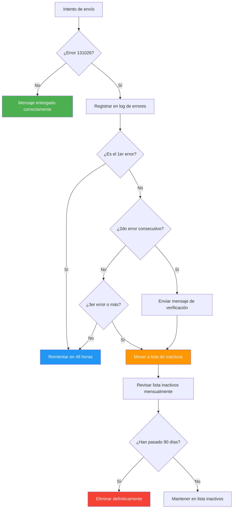

# Error 131026 de WhatsApp: Mensaje No Entregable (Soluciones)


> Este error es uno de los más comunes al realizar campañas de broadcasting en WhatsApp Cloud API. Aunque ocurre del lado del destinatario, puedes tomar medidas proactivas para minimizar su impacto y mantener una alta tasa de entrega.

**Última actualización: Junio 2025**

## ¿Qué significa el error 131026?

El código de error **131026** aparece cuando un mensaje no puede ser entregado al destinatario. Generalmente, la causa está relacionada con **problemas en el lado del receptor**, no con la plataforma de envío. Es importante entender que este error no indica un fallo en tu configuración ni en la plataforma que estés utilizando, sino que es una respuesta directa de los servidores de WhatsApp al intentar la entrega.

Cuando realizas envíos masivos a través de la API de WhatsApp Cloud API, Meta devuelve este código para indicar que la entrega falló por condiciones que escapan a tu control como emisor. La buena noticia es que existen estrategias comprobadas para reducir significativamente su incidencia.


> **Dato clave:** Un mensaje fallido con error 131026 no afecta tu calificación de calidad ni tu límite de mensajes, pero sí reduce la efectividad de tu campaña. Además, si muchos mensajes fallan, tu tasa de entrega general se ve afectada, lo que a largo plazo puede perjudicar tu reputación como remitente.

## Causas principales del error 131026

Existen tres razones fundamentales por las que WhatsApp devuelve este error, y entender cada una de ellas es el primer paso para aplicar la solución correcta.

### 1. El número no está registrado en WhatsApp

Esta es, con diferencia, la razón más común. El número de teléfono del destinatario no tiene una cuenta activa en WhatsApp. Esto puede ocurrir en varios escenarios:

- **El número nunca se registró en WhatsApp:** Algunos usuarios proporcionan un número de teléfono que usan exclusivamente para llamadas o SMS tradicionales.
- **El usuario desinstaló WhatsApp:** Si el destinatario eliminó la aplicación y no la ha vuelto a instalar, su número deja de estar activo en la plataforma.
- **Inactividad prolongada:** WhatsApp puede desactivar cuentas que no han tenido actividad durante más de 120 días.
- **Número incorrecto:** El usuario pudo haber proporcionado un número equivocado al registrarse en tu web o formulario.
- **Línea fija o VoIP:** Algunos sistemas capturan números de líneas fijas o servicios VoIP que no son compatibles con WhatsApp.

### 2. Términos de servicio no aceptados

WhatsApp actualiza periódicamente sus Términos y Política de Privacidad. Cada vez que esto ocurre, los usuarios deben aceptar explícitamente los nuevos términos para seguir usando la aplicación. Si el usuario no ha aceptado la versión más reciente, la plataforma bloquea la recepción de mensajes entrantes hasta que el usuario revise y acepte los nuevos términos.


> Este escenario es especialmente frecuente después de grandes actualizaciones de política de WhatsApp. Después de dichos anuncios, es común ver un pico temporal en el error 131026 hasta que los usuarios aceptan los nuevos términos. Puede durar entre 1 y 3 semanas.

### 3. Versión de WhatsApp desactualizada

WhatsApp exige que los destinatarios usen versiones mínimas específicas para garantizar la correcta recepción de mensajes, especialmente aquellos que incluyen botones, listas o plantillas enriquecidas.

Las versiones mínimas requeridas por WhatsApp Cloud API son:

| Plataforma | Versión mínima |
|---|---|
| Android | 2.21.15.15 |
| iOS | 2.21.170.4 |
| KaiOS | 2.2130.10 |
| Web/Desktop | 2.2132.6 |
| SMBA (Business Android) | 2.21.15.15 |
| SMBI (Business iOS) | 2.21.170.4 |


> Si utilizas plantillas de mensajes con botones de llamada a la acción (CTA) o listas interactivas, asegúrate de que los destinatarios tengan versiones superiores a las mínimas, ya que estas funcionalidades requieren soporte más reciente. Las versiones indicadas son el mínimo absoluto; para funciones como catálogos interactivos o flujos de WhatsApp, se requieren versiones aún más actualizadas.

## Cómo diagnosticar el error paso a paso

Para identificar rápidamente por qué un mensaje en particular falló con el error 131026, puedes seguir este proceso de diagnóstico desde la plataforma:


### Revisa el informe de la campaña

Ve al panel de **Campañas de Broadcasting** y selecciona el informe de la campaña más reciente. Busca los números con estado "Fallido" o "No entregado". Puedes filtrar específicamente por código de error para aislar solo los afectados por el 131026.

### Identifica el número de origen

Confirma que el mensaje se está enviando desde el número de teléfono correcto vinculado a tu cuenta. Ve a la bandeja de entrada y verifica qué número emisor está configurado para la campaña. A veces, un error de configuración puede hacer que los mensajes se envíen desde un número diferente al planeado.

### Busca el mensaje fallido por número

Toma el número del destinatario que falló y búscalo en los registros de la conversación. Asegúrate de buscarlo **sin el signo '+'** para obtener resultados correctos en la búsqueda.

### Verifica el estado de entrega

Si el mensaje no se entregó, verás un **tic rojo** junto al mensaje. Al pasar el cursor sobre ese tic rojo, aparecerá el código de error específico devuelto por Meta. Confirma que sea el código **131026**. En algunos casos, puede aparecer un código diferente que apunte a un problema distinto.

### Consulta el directorio oficial de errores de Meta

Copia el código de error exacto. Visita el directorio oficial de códigos de error de Meta. Usa Ctrl+F (o Cmd+F en Mac) para buscar el código y leer la explicación detallada que proporciona Meta. Este directorio se actualiza regularmente con nuevos códigos y descripciones.


> Este método de diagnóstico funciona no solo para el error 131026, sino también para cualquier otro código de error que encuentres en tus envíos. La clave está en consultar siempre el directorio oficial de Meta para obtener la descripción más actualizada, ya que los códigos de error pueden cambiar con el tiempo.

### Cómo interpretar los informes de campaña

Cuando accedes al informe detallado de una campaña, puedes encontrar diferentes estados de entrega:

| Estado | Significado | Acción recomendada |
|---|---|---|
| Entregado | El mensaje llegó correctamente al destinatario | Ninguna |
| Leído | El destinatario abrió y leyó el mensaje | Indicador positivo de compromiso |
| Fallido - 131026 | El número no está disponible en WhatsApp | Verificar el número o eliminarlo de la lista |
| Fallido - Otro código | Error específico según el código recibido | Consultar el directorio de errores de Meta |
| Pendiente | El mensaje está en cola de envío | Esperar, puede tardar hasta 24 horas |
| Rechazado | El mensaje fue rechazado por política de contenido | Revisar la plantilla y las políticas de Meta |

## Estrategias para reducir el error

Aunque no puedes controlar el estado de los dispositivos de tus destinatarios, sí puedes implementar medidas proactivas para minimizar la incidencia del error 131026. Estas estrategias se dividen en cinco áreas clave.

### 1. Verifica los números antes de enviar

Antes de lanzar una campaña masiva, asegúrate de que los contactos en tu lista sean números activos de WhatsApp:

- **Mantén una base de datos limpia:** Elimina periódicamente los números que hayan mostrado errores recurrentes. Programa una limpieza automática mensual.
- **Usa mensajes de prueba:** Envía un mensaje de prueba a un lote pequeño (5-10% de la lista) antes de lanzar la campaña completa.
- **Segmenta por actividad:** Prioriza los contactos que han interactuado en los últimos 30 o 60 días.
- **Implementa doble verificación:** Cuando un nuevo usuario se registra, pídele que envíe un mensaje de confirmación.

### 2. Solicita un mensaje de confirmación

Pide a tus contactos que te envíen un mensaje de WhatsApp para confirmar que pueden recibir tus comunicaciones. Esto activa una conversación entrante y garantiza que el número está activo y funcional.


> Una buena práctica es incluir un botón de acción en tu sitio web o en tus anuncios de "Click to WhatsApp" que, al hacer clic, envíe automáticamente un mensaje predefinido como "¡Hola! Quiero recibir información". Esto verifica el número inmediatamente y genera un lead calificado.

### 3. Recuerda a los usuarios aceptar las políticas

Envía un recordatorio amable a tus suscriptores para que verifiquen y acepten los términos más recientes de WhatsApp. Esto es especialmente útil después de que Meta anuncie actualizaciones de sus políticas de privacidad.

### 4. Fomenta la actualización de la aplicación

Incluye en tus comunicaciones un mensaje sugiriendo a los usuarios mantener su WhatsApp actualizado a la última versión disponible en sus respectivas tiendas de aplicaciones.

### 5. Monitorea los informes de entrega

Revisa periódicamente los reportes de entrega de tus campañas. Identifica los números que muestran errores repetidos:

- **Elimínalos** de tu lista activa después de 3 intentos fallidos consecutivos en 30 días
- **Segmentalos** en una lista separada para intentar reconectarlos después de 90 días
- **Márcalos** para verificación manual si sospechas que podrían ser válidos pero temporalmente inaccesibles


> **Recomendación práctica:** Programa una revisión automática de tu base de datos cada 30 días. Esto garantiza que siempre estás enviando a contactos activos y verificados, lo que mejora tanto tu tasa de entrega como tu calificación de calidad ante Meta.

## Errores relacionados que debes conocer

Además del error 131026, existen otros códigos de error que pueden aparecer en tus campañas de envío masivo.


### Error 131042: Problema con el método de pago

Este error aparece cuando hay un problema con el método de pago vinculado a tu cuenta de WhatsApp Business.

**Causas comunes:**
- El método de pago no se ha configurado correctamente en Meta WhatsApp Manager
- Los datos de facturación o información fiscal están incompletos
- El Business Manager de Facebook no está verificado
- El WhatsApp Manager está suspendido temporalmente

**Solución paso a paso:**

1. **Abre la configuración de pagos:** Ve a la sección de métodos de pago y selecciona el Business Manager correcto asociado a tu cuenta. Solo el propietario de la cuenta puede acceder a esta configuración.

2. **Encuentra tu cuenta de WhatsApp Business:** En Facturación y Pagos, ve a "Cuentas" y luego haz clic en "WhatsApp Business Accounts". Busca el WhatsApp Manager que coincida con el ID de negocio de tu cuenta.

3. **Verifica si hay método de pago añadido:** Si no ves ningún método de pago, verás un botón "Añadir método de pago". En lugar de hacer clic ahí, haz clic en los tres puntos (•••) y selecciona "Ver detalles".

4. **Completa ambos pasos:** Añadir información de pago (tarjeta de crédito) y verificar información fiscal (número GST para usuarios en India).

**Verificación del Business Manager:**
1. Ve al Centro de Seguridad y selecciona el Business Manager correcto
2. Si ves "Iniciar verificación", sigue los pasos para verificar tu negocio
3. La verificación puede tardar entre 24 y 48 horas
4. Consulta el estado en cualquier momento desde el Centro de Seguridad

Si el Business Manager no está verificado, los mensajes dejarán de enviarse aunque el método de pago esté configurado correctamente.

### Error 130472: Número de teléfono parte de un experimento

Este error indica que el número del destinatario está siendo utilizado en un experimento interno de WhatsApp o Meta. Es poco frecuente y suele resolverse por sí solo con el tiempo. Puedes intentar reenviar el mensaje después de 24-48 horas. Si el error persiste, elimina temporalmente ese contacto de tu lista activa.

**¿Por qué ocurre?** Meta y WhatsApp realizan pruebas A/B internas en subconjuntos de usuarios. Cuando un número es seleccionado, puede experimentar comportamientos anómalos temporalmente.

### Error por superación de límite de mensajería

Significa que has alcanzado el tope de conversaciones permitidas según tu nivel de mensajería actual.

**Niveles de mensajería de WhatsApp Cloud API:**

| Nivel | Conversaciones/día | Requisito de calificación |
|---|---|---|
| Trial | 250 | Número de prueba |
| Tier 1 | 1,000 | Calidad Media o superior |
| Tier 2 | 10,000 | Calidad Media o superior |
| Tier 3 | 100,000 | Calidad Alta |
| Tier 4 | Ilimitado | Aprobación especial |

**Para solucionarlo:**
1. Revisa tu nivel de mensajería actual en la configuración de tu cuenta
2. Mejora tu calificación respondiendo rápidamente y minimizando reportes de spam
3. Si tienes calificación alta, solicita un incremento del límite desde WhatsApp Manager
4. Distribuye tus campañas en varios lotes a lo largo del día
5. Considera usar múltiples números de teléfono para alto volumen


> Si superas tu límite de mensajería, WhatsApp puede degradar tu nivel o restringir temporalmente tu capacidad de enviar. Es mejor mantener un volumen constante y gradual que hacer picos esporádicos.


### Error 131015: Estructura de mensaje no compatible

Este error ocurre cuando el formato del mensaje no es compatible con la versión de WhatsApp del destinatario. Es común al enviar plantillas con botones o listas interactivas a usuarios con aplicaciones desactualizadas.

**Solución:** Implementa una estrategia de degradación suave. Si un mensaje interactivo falla, intenta reenviarlo como texto plano. Esto asegura que al menos el contenido llegue al destinatario.

### Error 131037: Interactividad no soportada

Similar al 131015, pero específico para mensajes que requieren interacción del usuario, como botones de respuesta rápida o listas de selección.

**Solución:** Antes de enviar mensajes interactivos, verifica si el destinatario ha recibido mensajes previos. Si no hay historial, empieza con texto plano y escala gradualmente a formatos más complejos.

## Mejores prácticas para mantener una buena capacidad de entrega

Implementar estas prácticas te ayudará no solo a reducir el error 131026, sino a mantener una reputación sólida ante Meta.


### Gestión de lista

**Limpieza y segmentación efectiva:**

- **Limpia tu lista regularmente:** Elimina números inactivos después de 3 campañas sin respuesta o 60 días sin interacción
- **Segmenta por compromiso:** Crea grupos separados para contactos activos (últimos 30 días), inactivos (30-90 días) y fríos (más de 90 días)
- **Valida nuevos contactos:** Antes de añadirlos a campañas masivas, confirma que estén en WhatsApp
- **Evita números de prueba:** Separa los números de test de tu base de datos real
- **Mantén un histórico:** Registra las tasas de error por segmento para identificar patrones

**Frecuencia recomendada de limpieza:**
- Lista activa: revisión semanal
- Lista general: limpieza mensual profunda
- Lista de inactivos: depuración trimestral


### Calidad de mensajes

**Contenido que maximiza la entrega:**

- **Personaliza el contenido:** Usa variables para incluir el nombre del destinatario. Los mensajes personalizados tienen tasas de lectura hasta 3 veces mayores
- **Evita lenguaje spam:** No uses mayúsculas excesivas, múltiples signos de exclamación ni promesas exageradas
- **Respeta los horarios:** Envía entre las 9:00 y las 18:00 en la zona horaria del destinatario
- **Incluye opción de baja:** Ofrece una forma visible para que los usuarios dejen de recibir mensajes
- **Mide la interacción:** Monitorea tasas de clics, respuestas y conversiones

**Ejemplo de mensaje efectivo:**
```
Hola {{nombre}}, gracias por tu compra.
Tu pedido #{{pedido}} está en camino 🚚

¿Necesitas ayuda? Escríbenos a este chat.

*Para dejar de recibir notificaciones, responde BAJA*
```


### Monitoreo continuo

**Sistema de alertas y revisión:**

- **Revisa calificaciones de calidad:** Accede a Meta WhatsApp Manager semanalmente para ver tu calificación
- **Analiza informes semanales:** Revisa tendencias, no solo campañas individuales
- **Documenta errores recurrentes:** Lleva un registro de números que fallan consistentemente
- **Establece alertas automáticas:** Configura notificaciones cuando la tasa de entrega baje del 90%

**Indicadores clave a monitorear:**
1. Tasa de entrega general (objetivo: >95%)
2. Tasa de error 131026 por campaña (objetivo: <3%)
3. Calificación de calidad semanal
4. Tasa de apertura y respuesta
5. Reportes de spam por campaña


> **Consejo profesional:** Los contactos que han interactuado en los últimos 7 días tienen una tasa de entrega del 98%, mientras que los inactivos por más de 90 días bajan al 82%. Prioriza siempre a los contactos activos sobre los fríos.

## Qué hacer con los números que persistentemente fallan

Si después de varios intentos un número sigue mostrando el error 131026, implementa este flujo de trabajo automatizado:



### Plantilla para mensaje de verificación

Cuando un contacto acumula 2 errores consecutivos 131026, envía este mensaje de verificación:


#### Plantilla de verificación

```text
Hola, somos [Nombre de tu empresa].

Notamos que no hemos podido enviarte nuestros últimos mensajes.
¿Sigues usando WhatsApp? Si es así, responde SÍ a este mensaje
y podremos seguir enviándote información importante.

Si ya no quieres recibir nuestros mensajes, responde BAJA
y te eliminaremos de nuestra lista.

¡Gracias!
```

## Preguntas frecuentes


### ¿El error 131026 afecta mi calificación de calidad en WhatsApp?

No, el error 131026 no afecta directamente tu calificación de calidad. La calificación se basa en cómo los usuarios interactúan con tus mensajes (reportes de spam, bloqueos), no en errores técnicos del lado del destinatario. Sin embargo, una alta tasa de mensajes no entregados puede reducir la efectividad de tus campañas y el compromiso de los usuarios, lo que indirectamente podría afectar tu calificación a largo plazo. Mantén siempre una base de datos limpia.

### ¿Puedo reenviar el mismo mensaje a un número que falló con error 131026?

Sí, puedes intentarlo después de al menos 48 horas. El error puede ser temporal: el usuario puede estar actualizando la aplicación, acaba de reinstalarla, o no ha aceptado los nuevos términos. Si el error persiste después de 3 intentos en una semana, mueve el número a inactivos. Forzar envíos repetidos puede ser interpretado como spam por Meta.

### ¿Cómo sé si un número está registrado en WhatsApp antes de enviarle un mensaje?

Usa la función de verificación de contacto incluida en la API de WhatsApp Cloud API, integrada en el proceso de importación de contactos. También puedes:

1. **Usar la API de verificación:** WhatsApp Cloud API ofrece un endpoint para comprobar si un número está registrado
2. **Pedir confirmación al usuario:** Incluye un botón "Click to WhatsApp" en tu web que envíe un mensaje automático
3. **Importar desde conversaciones existentes:** Los números que ya han conversado están verificados por defecto
4. **Validación en formularios:** Añade un paso de verificación que envíe un código por WhatsApp


> La verificación automática por API más la confirmación del usuario es el método más fiable para garantizar números activos.

### ¿Qué pasa si muchos mensajes fallan? ¿Puedo ser bloqueado?

No serás bloqueado específicamente por el error 131026, ya que es un error del destinatario. Sin embargo, hay un efecto indirecto:

1. **Tasa de entrega baja:** Una base con muchos números inválidos reduce tu tasa general
2. **Monitoreo de Meta:** Meta monitorea la relación entre enviados y entregados
3. **Impacto en límites:** Una tasa de entrega por debajo del 80% sostenidamente podría afectar tu límite
4. **Calificación de calidad:** Si los usuarios no reciben mensajes, tu ratio de compromiso baja

Es mejor tener 1,000 contactos activos que 10,000 de los cuales solo la mitad son válidos.

### ¿La versión de WhatsApp puede causar otros errores además del 131026?

Sí, las versiones desactualizadas pueden causar múltiples errores:

- **131015:** Estructura de mensaje no compatible
- **131037:** Interactividad no soportada
- **131048:** Formato de plantilla no reconocido
- **131056:** Elementos multimedia no soportados

WhatsApp no permite enviar mensajes interactivos a aplicaciones desactualizadas. Ten un plan B con texto plano.

### ¿Cómo configuro alertas automáticas para tasa de error alta?

1. Ve a **Configuración > Notificaciones**
2. Activa las alertas de **Tasa de error por campaña**
3. Define el umbral (recomendado: 5%)
4. Configura el canal de notificación (correo o mensaje directo)

Programa informes semanales automáticos con:
- Tasa de entrega general
- Desglose de errores por código
- Números con más fallos
- Recomendaciones de limpieza

### ¿Qué diferencia hay entre error 131026 y 131029?

El error 131026 indica que el número no está disponible en WhatsApp (no registrado, términos no aceptados, versión desactualizada). El 131029 indica que el destinatario bloqueó activamente al remitente. Para el 131029, elimina inmediatamente al usuario de la lista, ya que no desea recibir más comunicaciones.

## Ejemplos prácticos


### 📊 Campaña ecommerce con 5.000 contactos

**Escenario:** Tienda online de moda envía ofertas semanales a 5.000 contactos.

**Situación inicial:**
- Error 131026: 8.2% | Entrega total: 88%
- Apertura: 22% | Ventas por campaña: ~45

**Acciones:**
1. Limpieza: se eliminaron 340 números con errores históricos (6.8% de la base)
2. Segmentación: activos, medios y fríos
3. Priorización: campaña completa solo a activos
4. Envío escalonado en 3 tandas

**Resultados (4 semanas):**
- Error 131026: 2.1% (-74%)
- Entrega total: 96.5%
- Apertura: 31% | Ventas: ~62 (+38%)

> Los 340 números eliminados causaban el 78% de los errores 131026.

### 🔄 Recuperación de carritos abandonados

**Escenario:** Negocio Shopify envía recordatorios de carritos abandonados.

**Problema:** Error 131026 del 12% por envíos a números sin verificar.

**Solución:**
1. Verificación automática antes del envío
2. Para no verificados: mensaje simple de texto "¿Eres {{nombre}}?"
3. Solo tras confirmación se envían plantillas con botones CTA

**Resultados (2 meses):**
- Error 131026: 4% (-67%)
- Carritos recuperados: +23%
- Calificación: de "Media" a "Alta"
- Costos: -15% en mensajes fallidos

> Un enfoque escalonado (texto → verificación → interactivo) mejora la reputación del remitente.

### 🏥 Clínica dental con recordatorios de citas

**Escenario:** Recordatorios 24 horas antes de cada consulta.

**Problema:** 7% de error 131026 → pacientes que no asistían.

**Solución:**
1. Verificación del número al registrar al paciente
2. Mensaje de bienvenida confirmando el número
3. Respaldo por SMS si WhatsApp falla

**Resultado:**
- Error 131026: 1.5%
- Inasistencias: -40%
- Respaldo captura el 98% de fallos de WhatsApp

> Ten siempre un canal de respaldo para comunicaciones críticas.

### 📱 Agencia inmobiliaria con alertas de propiedades

**Escenario:** Alertas de nuevas propiedades a compradores potenciales.

**Problema:** 15% de error 131026 por leads con números incorrectos.

**Solución:**
1. Flujo automatizado que verifica cada lead contra la API de WhatsApp
2. Leads no verificados se contactan por correo electrónico
3. Campo adicional de "mejor método de contacto" en formularios

**Resultado:**
- Error 131026: 2.8%
- Leads válidos en WhatsApp: 92%
- Respuesta a campañas: +35%

> Capturar leads no basta; hay que validar que los datos de contacto sean funcionales.

## Calidad de calificación: el indicador clave de salud de tu cuenta

Tu Calificación de Calidad (Quality Rating) de WhatsApp actúa como un indicador de salud para tu cuenta de mensajería empresarial. Refleja cómo los usuarios reciben e interactúan con tus mensajes. Mantener una buena calificación es fundamental para el éxito de tus campañas.

### Niveles de calificación

WhatsApp clasifica la calidad en tres niveles, representados con colores:

| Nivel | Color | Estado |
|---|---|---|
| Alto | Verde | Tu cuenta está en buen estado |
| Medio | Amarillo | Hay señales de advertencia |
| Bajo | Rojo | Riesgo de restricciones |

### Por qué es importante tu calificación

La calificación de calidad determina varios aspectos críticos de tu cuenta:

- **Límites de mensajería:** Una calificación Media o Alta es requisito para aumentar tu límite de conversaciones diarias
- **Tier upgrades:** Para progresar de un nivel al siguiente (por ejemplo, de Tier 1 a Tier 2), debes mantener al menos una calificación Media
- **Bloqueo de número:** Con calificación Baja, el riesgo de que WhatsApp bloquee tu número emisor aumenta significativamente
- **Efectividad de campañas:** Una buena calificación se traduce en mejor capacidad de entrega

### Factores que influyen en tu calificación

**Interacciones de los usuarios:**
- **Positivas:** El usuario hace clic en enlaces o responde al mensaje
- **Neutrales:** El usuario lee el mensaje pero no interactúa
- **Negativas:** El usuario bloquea tu número o reporta el mensaje como spam


> Cada vez que un usuario bloquea tu número o reporta un mensaje como spam, tu calificación de calidad se ve afectada negativamente. Por eso es crucial enviar solo contenido relevante y valioso a usuarios que han dado su consentimiento explícito.

### Cómo mejorar tu calificación

Si tu calificación de calidad ha bajado, puedes tomar estas medidas:

1. **Pausa temporalmente las campañas de broadcasting:** Dale tiempo a tu calificación para recuperarse. Un período de 3 a 7 días sin envíos masivos puede ayudar significativamente
2. **Revisa el contenido de tus mensajes:** Asegúrate de que sean relevantes, valiosos y estén personalizados para tu audiencia
3. **Verifica que solo envías a usuarios que han dado su consentimiento:** Revisa tu base de datos y elimina contactos que no hayan optado explícitamente por recibir tus mensajes
4. **Mide tus métricas de interacción:** Monitorea las tasas de clics, respuestas y conversiones para ajustar tu contenido
5. **Mantén una frecuencia de envío moderada:** No satures a tus contactos con mensajes diarios. Lo recomendable es 1-2 campañas por semana como máximo
6. **Responde rápidamente a los mensajes entrantes:** WhatsApp valora positivamente que los negocios respondan a los usuarios en menos de 24 horas

### Progresión de límites según calificación

Para aumentar tu límite de mensajería, WhatsApp requiere que envíes mensajes al 50% de tu límite actual mientras mantienes una calificación Media o Alta:

| Escenario | Acción | Resultado |
|---|---|---|
| Tier 1 (1,000 usuarios) | Enviar a 500 usuarios únicos | Puedes solicitar Tier 2 |
| Tier 2 (10,000 usuarios) | Enviar a 5,000 usuarios únicos | Puedes solicitar Tier 3 |
| Tier 3 (100,000 usuarios) | Enviar a 50,000 usuarios únicos | Puedes solicitar Tier 4 |


> **Recomendación:** No intentes aumentar tus límites demasiado rápido. Un crecimiento gradual y sostenido es mucho más seguro que picos repentinos de volumen que puedan activar los mecanismos de seguridad de WhatsApp.

## Planificación y ejecución de campañas de broadcasting

Una comunicación efectiva con tus usuarios comienza mucho antes de hacer clic en "Enviar". Sigue estos pasos para maximizar la entrega de tus mensajes.

### Paso 1: Prepara tu lista de suscriptores

Antes de lanzar cualquier campaña, asegúrate de tener una lista limpia y lista para importar:

1. Prepara una hoja de cálculo con los datos de contacto necesarios (nombre, número de teléfono, etc.)
2. Asegúrate de que la columna de números de teléfono esté formateada correctamente (con código de país, sin signos '+' ni espacios)
3. Descarga el archivo como CSV con codificación UTF-8
4. Verifica que los números estén activos en WhatsApp antes de importarlos

### Paso 2: Importa tus contactos

Una vez que tu lista está preparada:

1. Ve al Gestor de Suscriptores en tu panel de control
2. Selecciona la opción de importar suscriptores
3. Sube el archivo CSV o importa directamente desde Google Sheets
4. Verifica que los campos se hayan mapeado correctamente

### Paso 3: Segmenta tu audiencia

No todos tus contactos deben recibir el mismo mensaje. Segmenta tu audiencia para personalizar el contenido:

- **Ventana de 24 horas:** Envía mensajes gratuitos a usuarios que interactuaron contigo en las últimas 24 horas
- **En cualquier momento:** Usa plantillas aprobadas para llegar a todos tus suscriptores
- **Filtros por etiquetas:** Incluye o excluye grupos específicos (por ejemplo, "Nuevo lead", "Interesado en demo", "Prueba gratuita")


> La segmentación por etiquetas te permite enviar mensajes altamente relevantes a cada grupo de contactos, lo que mejora las tasas de interacción y, por tanto, tu calificación de calidad.

### Paso 4: Programa el envío

Elige el momento óptimo para tu campaña:

1. Decide si enviar inmediatamente o programar para una fecha posterior
2. Ajusta la zona horaria para garantizar una entrega óptima
3. Distribuye los envíos grandes en varios lotes a lo largo del día
4. Evita los fines de semana y días festivos a menos que sea relevante para tu negocio


### ¿Qué hacer si una plantilla de mensaje es rechazada por Meta?

Si tu plantilla es rechazada por Meta durante el proceso de aprobación, sigue estos pasos:

1. **Lee los comentarios de Meta:** El equipo de revisión suele incluir una explicación del motivo del rechazo
2. **Identifica la infracción:** Los rechazos más comunes son por contenido promocional excesivo, falta de opción de baja, o lenguaje engañoso
3. **Revisa las directrices:** Consulta las políticas de Meta para plantillas de mensajes
4. **Modifica el contenido:** Ajusta el mensaje para cumplir con las directrices
5. **Vuelve a enviar:** Después de realizar los cambios, envía la plantilla nuevamente para su revisión

El tiempo de aprobación puede variar desde unos minutos hasta varias horas dependiendo de la carga de trabajo de Meta.

## Reflexiones finales

El error 131026 es común en el broadcasting de WhatsApp, pero puede reducirse significativamente con una buena gestión de listas y comunicación proactiva con tus usuarios. Al implementar las estrategias descritas en esta guía, lograrás:

- **Mejores tasas de entrega** en todas tus campañas
- **Mayor compromiso** al llegar solo a contactos activos
- **Calificación de calidad más alta** con prácticas de envío saludables
- **Ahorro de costos** al no desperdiciar mensajes en números inválidos


> Si encuentras otros errores durante tus campañas, nuestra base de conocimiento incluye guías detalladas para los códigos más comunes. Consulta también la documentación oficial de Meta para información actualizada.

## Resumen de verificación de calidad de lista (checklist)

Antes de lanzar cada campaña masiva, revisa esta lista:

1. [ ] ¿La base de datos tiene menos de 30 días desde la última limpieza?
2. [ ] ¿Los números con errores previos han sido excluidos?
3. [ ] ¿La tasa de error esperada es inferior al 5%?
4. [ ] ¿El contenido está personalizado y no contiene lenguaje spam?
5. [ ] ¿El horario de envío está dentro del rango comercial (9:00-18:00)?
6. [ ] ¿Se ha realizado una prueba con un lote pequeño (5-10%)?
7. [ ] ¿Hay opción de baja visible en el mensaje?
8. [ ] ¿Se han configurado alertas para monitorear la tasa de error?


> Si respondiste "Sí" a las 8 preguntas, tu campaña tiene una alta probabilidad de éxito con una tasa de entrega superior al 95%.
