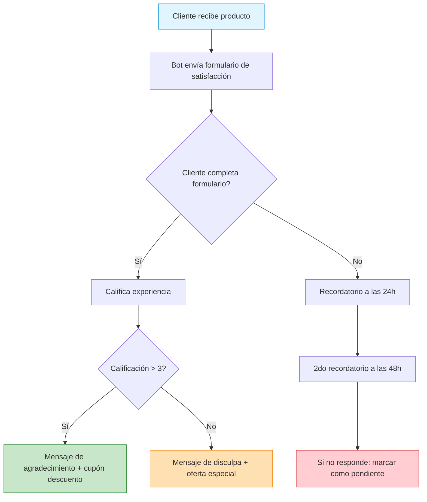
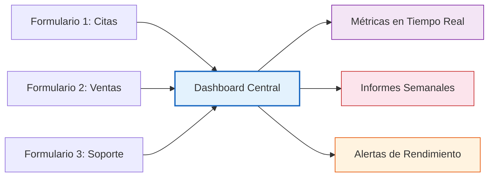

# Formularios Flow de WhatsApp en E-SMART360: Guía Completa 2025

<Update title="Actualización: Nuevas funciones de WhatsApp Flow 2025" date="24 Jun 2025" />

En la era digital de 2025, WhatsApp es mucho más que una aplicación de mensajería. Con la funcionalidad WhatsApp Flow, las empresas pueden crear formularios estructurados e interactivos directamente dentro de la interfaz del chat. Estos formularios permiten recolectar información de clientes, automatizar procesos y aumentar significativamente la interacción.


> **¿Sabías que...?** WhatsApp Flow permite a las empresas construir formularios y flujos de trabajo interactivos dentro del chat. Los clientes pueden enviar datos, tomar decisiones y completar acciones sin salir de WhatsApp.

## ¿Qué es WhatsApp Flow en 2025?

WhatsApp Flow es una funcionalidad de la plataforma WhatsApp Business que permite a las empresas crear formularios y flujos de trabajo interactivos dentro del chat. Estos formularios permiten a los clientes enviar detalles, tomar decisiones y completar acciones sin salir de WhatsApp. En 2025, esta herramienta ha incorporado nuevas capacidades que la hacen indispensable para negocios de todos los tamaños.

### Novedades de WhatsApp Flow en 2025


### Sugerencias con IA

La inteligencia artificial ahora recomienda diseños de formularios basados en las necesidades específicas de tu negocio.
  
### Integraciones Avanzadas

Los formularios se comunican directamente con sistemas CRM, plataformas de pago y gestores de inventario.
  
### Analítica en Tiempo Real

Monitorea el rendimiento de tus formularios con datos actualizados al instante.
  
Estas mejoras convierten a WhatsApp Flow en una herramienta imprescindible para los planes de comunicación empresarial modernos.

## ¿Cómo funciona WhatsApp Flow?

WhatsApp Flow permite a las empresas crear formularios personalizados que guían a los clientes a través de pasos específicos. Estos formularios pueden vincularse a chatbots o enviarse manualmente en chats en vivo. Así es como opera:

### Flujo de funcionamiento


### Creación del formulario

Utilizando la interfaz de arrastrar y soltar de E-SMART360, las empresas añaden elementos como campos de texto, casillas de verificación y botones para construir formularios personalizados.
  
### Integración con chatbot

Los formularios se enlazan a los chatbots, activándose automáticamente según las entradas del cliente, como una palabra clave específica.
  
### Recolección de datos

Los endpoints definidos responden en tiempo real, y se pueden integrar otros servicios mediante APIs.
  
### Respuestas automáticas

Después de que el mensaje principal ha sido ingresado en el sistema, este puede enviar mensajes automáticos de confirmación o marketing.
  

> La recolección de datos puede ser una tarea tediosa, especialmente con la creciente demanda de satisfacción del cliente. Los formularios Flow automatizan todo este proceso, ahorrando tiempo y recursos.

## Ejemplos Prácticos de WhatsApp Flow para 2025

WhatsApp Flow puede utilizarse para múltiples objetivos. Aquí tienes algunos casos de uso prácticos:


### Citas Médicas

Los pacientes pueden chatear directamente para ingresar sus datos médicos requeridos y seleccionar el doctor que desean visitar, todo sin salir de WhatsApp.
  
### Reseñas de Clientes

Los restaurantes comparten formularios de calificación para que los comensales dejen comentarios después de comer, ayudando a mejorar sus servicios.
  
### Recomendaciones de Productos

Las tiendas de e-commerce crean flujos orientados al cliente para solicitar información sobre preferencias y ofrecer productos que coincidan con sus intereses.
  
### Solicitudes de Soporte

Las empresas reciben detalles de los problemas de los clientes a través de formularios para mejorar la efectividad y velocidad de resolución.
  
> **¿Sabías que?** Según estudios de Meta, las empresas que implementan WhatsApp Flow ven un aumento promedio del 40% en la tasa de finalización de formularios en comparación con los métodos tradicionales.

## Beneficios de Usar Formularios WhatsApp Flow

Los formularios WhatsApp Flow ofrecen ventajas significativas para las empresas que utilizan E-SMART360:


### Recolección Efectiva de Datos

Los formularios automatizan la recolección de datos para análisis y toma de decisiones informadas.
  
### Mayor Interacción

Con formularios interactivos, los clientes se mantienen comprometidos, a diferencia de los métodos tradicionales.
  
### Automatización de Tareas

Tareas como reservas y recolección de comentarios se automatizan, reduciendo tiempo y esfuerzo.
  
### Experiencias Personalizadas

La IA modifica los formularios según el perfil del cliente para optimizar la interacción.
  
### Escalabilidad

Se pueden manejar más conversaciones sin esfuerzo, permitiendo que el negocio crezca.
  
### Multi-idioma

Los formularios pueden crearse en múltiples idiomas, adaptándose a audiencias globales.
  
Estos beneficios explican cómo WhatsApp Flow puede ser útil para establecer relaciones sólidas entre empresas y clientes.

## Cómo Crear un Formulario WhatsApp Flow en E-SMART360

Crear un formulario WhatsApp Flow en E-SMART360 es un proceso sencillo. Sigue estos pasos:

### Paso 1: Accede al Panel de Control

Inicia sesión en tu cuenta de E-SMART360 y dirígete al panel de control principal.

### Paso 2: Selecciona tu Bot de WhatsApp

Elige la cuenta de WhatsApp Business que tienes vinculada a E-SMART360.

### Paso 3: Inicia un Nuevo Flow

Haz clic en **"Crear"** en la sección de **"WhatsApp Flow"** para abrir el constructor de formularios.

### Paso 4: Construye el Formulario

Arrastra y suelta componentes como:
- **Campos de texto**: Para respuestas cortas
- **Áreas de texto**: Para respuestas largas como comentarios
- **Casillas de verificación**: Para selección múltiple
- **Botones de radio**: Para selección única
- **Campos de fecha**: Para recolección de fechas
- **Botón de enviar**: Para finalizar el formulario


> **Consejo:** La IA de E-SMART360 puede sugerirte diseños basados en tus necesidades específicas. Aprovecha esta funcionalidad para crear formularios más efectivos.

### Paso 5: Configura los Detalles del Flow


### Nombre del Flow

Asigna un nombre único a tu flow. Cada formulario debe tener un nombre distinto para evitar problemas de duplicación.
  
### Categoría del Flow

Selecciona el tipo de formulario que deseas crear. Al hacer clic, se abrirá un menú desplegable con múltiples opciones.
  
### Nombre Único de Pantalla

Proporciona un identificador único para la pantalla **sin espacios** (los espacios pueden causar errores).
  
### Título del Formulario

Asigna un título a tu WhatsApp Flow. Este servirá como encabezado de tu formulario.
  
### Respuesta después del envío

Configura una respuesta automática que se enviará después de que el usuario complete el formulario. Puedes seleccionar una respuesta existente o crear una nueva.
  
### Seleccionar HTTP API (opcional)

Puedes seleccionar una conexión HTTP API existente para integrar los datos del formulario con otros sistemas. Si no tienes una, puedes omitir este paso.
  
### Guardar datos en campos personalizados

Para cada elemento del formulario, puedes asignar un campo personalizado donde se almacenarán los datos. Esto facilita el seguimiento y análisis posterior.
  
### Revisión final

Verifica que el formulario no tenga errores. Una vez publicado, no podrás editarlo.
  
### Paso 6: Vista Previa y Publicación

Usa la opción **"Vista Previa del Flow"** para ver cómo se muestra el formulario en WhatsApp. Cuando todo esté listo, haz clic en el botón **"Publicar"**.

### Paso 7: Vincula al Chatbot

Para utilizar el flow, conéctalo a la ruta de conversación de tu chatbot. De esta manera, cuando un cliente envíe un mensaje con la palabra clave activadora, el bot responderá automáticamente e iniciará la conversación con el formulario.

### Paso 8: Monitorea los Resultados

Revisa los datos de los clientes desde la sección de analíticas de WhatsApp Flow. Puedes descargar los datos o visualizar los informes directamente en la plataforma.


> **Importante:** Una vez que publicas un formulario, no puedes editar sus campos. Si necesitas hacer cambios, deberás crear un nuevo formulario y reemplazar el anterior.

## Elementos del Formulario y Sus Funciones

E-SMART360 ofrece una variedad de elementos para construir formularios completos y funcionales:

### Campos de Texto

Permiten a los usuarios ingresar respuestas de texto cortas, como nombres, correos electrónicos o números de teléfono. Se pueden marcar como "Obligatorios" en las opciones de edición.

### Áreas de Texto

Se utilizan para entradas de texto más largas, como comentarios, descripciones o sugerencias. Se expanden para acomodar respuestas extensas.

### Grupos de Casillas de Verificación

Permiten a los usuarios seleccionar múltiples opciones de una lista. Ideales para encuestas o preferencias múltiples.

### Grupos de Botones de Radio

Permiten a los usuarios seleccionar una sola opción de una lista. Útiles para preguntas de opción única.

### Campos de Fecha

Se utilizan para recolectar información relacionada con fechas, como fechas de nacimiento, citas o eventos.

### Botón de Envío

Recolecta toda la información ingresada por el usuario y la guarda en la base de datos.

## Menú de Acciones Disponibles

Una vez creado el formulario, el menú de **Acciones** te ofrece varias opciones para gestionarlo:


### Añadir Webhook

Habilita la transferencia de datos en tiempo real entre aplicaciones. Configura los ajustes del webhook para establecer una conexión fluida.
  
### Ver Datos

Visualiza las analíticas y los datos de clientes recolectados a través del formulario.
  
### Descargar Datos

Descarga todos los datos recolectados del formulario en un archivo para su análisis externo.
  
### Vista Previa

Ve una vista previa en tiempo real de cómo se ve el formulario antes de publicarlo.
  
### Publicar

Publica el formulario para que esté disponible en tu bot.
  
### Editar / Eliminar

Modifica los campos del formulario antes de publicarlo, o elimínalo si ya no es necesario.
  
## Casos de Uso Reales

### Sefamerve: Transformando la Moda Turca

Sefamerve, un minorista turco de moda femenina especializado en prendas musulmanas y accesorios, incrementó su servicio al cliente en WhatsApp mediante una alianza con Meta. Implementaron flujos de clientes para creación de cuentas, búsqueda de productos y carritos de compra a través de WhatsApp Flow.


> **Resultados impresionantes:**
  - Aumento del 158% en la conversión de la experiencia del chatbot
  - Incremento de ingresos de 2.6x en comparación con la experiencia anterior
  - 80,000 productos disponibles para compra directa a través de WhatsApp

### Lenovo: Agendamiento de Citas Simplificado

Lenovo, una empresa multinacional de tecnología, enfocó su sucursal en Indonesia en facilitar que los clientes agendaran citas en el sitio web de la empresa. Con WhatsApp Flow, los clientes pueden agendar, cancelar o reprogramar sus citas directamente a través del chat de WhatsApp.


> **Resultados destacados:**
  - Tasa de conversión de agendamiento de citas 8.2x mayor versus el sitio web
  - Incremento significativo en la interacción con el cliente a través de WhatsApp
  - Mejora en el Net Promoter Score (NPS) de satisfacción del cliente

## Integración con Otras Herramientas

Los formularios WhatsApp Flow se integran perfectamente con diversas plataformas:


### Zapier

Conecta E-SMART360 con miles de aplicaciones para automatizar flujos de datos sin necesidad de código.
  
### Google Sheets

Los datos de los formularios pueden enviarse directamente a hojas de cálculo para su análisis.
  
### WooCommerce

Integra formularios de pedidos y seguimiento directamente desde WhatsApp.
  
### Shopify

Automatiza notificaciones y recuperación de carritos abandonados.
  
### WordPress

Conecta formularios de WordPress con WhatsApp para notificaciones automáticas.
  
### APIs Personalizadas

Desarrolla integraciones a medida utilizando las APIs de E-SMART360.
  
## Buenas Prácticas para Formularios WhatsApp Flow


### Mantén los formularios cortos

Los formularios con 3-5 campos tienen tasas de finalización significativamente más altas. Solicita solo la información esencial.
  
### Usa un lenguaje claro y sencillo

Las instrucciones deben ser fáciles de entender. Evita la jerga técnica y sé directo con lo que necesitas del cliente.
  
### Aprovecha la personalización con IA

La IA de E-SMART360 puede adaptar los formularios según el perfil del cliente, mostrando campos relevantes y omitiendo los que no aplican.
  
### Prueba antes de publicar

Siempre utiliza la vista previa para verificar que todo funcione correctamente antes de publicar el formulario.
  
### Monitorea las tasas de finalización

Revisa periódicamente las analíticas para identificar dónde abandonan los clientes el formulario y optimizar en consecuencia.
  
## Trazabilidad de Datos Incompletos

Una funcionalidad importante de E-SMART360 es la capacidad de rastrear envíos parciales de formularios. Si un cliente comienza a llenar un formulario pero no lo completa, puedes:

1. **Identificar el punto de abandono** en las analíticas del formulario
2. **Programar recordatorios automáticos** para animar al cliente a completar el envío
3. **Enviar seguimientos personalizados** basados en los datos parciales ya recolectados


> Los recordatorios automáticos pueden aumentar la tasa de finalización de formularios hasta en un 35%. Configúralos estratégicamente para maximizar resultados.

## Pagos Directos a través de Formularios Flow

En 2025, WhatsApp Flow se integra con sistemas de pago, permitiendo a los clientes realizar transacciones directamente en el chat después de completar un formulario. Esto es especialmente útil para:


### Pedidos Anticipados

Los clientes pueden realizar pedidos y pagar sin salir de la conversación de WhatsApp.
  
### Suscripciones

Ofrece planes de suscripción que los clientes pueden activar directamente desde el formulario.
  
### Depósitos y Señales

Para servicios como reservas de hoteles o consultas, los clientes pueden pagar un depósito inicial.
  
### Donaciones

Organizaciones sin fines de lucro pueden recolectar donaciones de forma sencilla y segura.
  
## Preguntas Frecuentes


### ¿Qué es WhatsApp Flow exactamente?

WhatsApp Flow es una funcionalidad de WhatsApp Business que permite a las empresas crear formularios estructurados dentro del chat. Estos formularios recolectan información de los clientes, automatizan tareas y guían a los usuarios para realizar reservas, comentarios o compras sin salir de la aplicación.

### ¿Se necesita programación para crear formularios Flow en E-SMART360?

No, en absoluto. E-SMART360 utiliza una interfaz de arrastrar y soltar que cualquier persona puede usar, incluso sin conocimientos técnicos. Simplemente selecciona los elementos que necesitas y colócalos en el orden deseado.

### ¿Puedo usar WhatsApp Flow sin un chatbot?

Sí, es posible enviar formularios manualmente en chats en vivo. Sin embargo, vincularlos a un chatbot automatiza las respuestas y aumenta la eficiencia, especialmente cuando se manejan grandes volúmenes de clientes.

### ¿Cómo mejora la IA los formularios WhatsApp Flow en 2025?

La inteligencia artificial sugiere diseños de formularios basados en tus objetivos comerciales, ajusta las preguntas según los datos del cliente y proporciona informes detallados de rendimiento para que puedas optimizar continuamente.

### ¿Qué tipos de negocio pueden beneficiarse de WhatsApp Flow?

Cualquier negocio que necesite recolectar datos de clientes puede beneficiarse: tiendas minoristas, centros de salud, restaurantes, proveedores de servicios, escuelas, agencias de viajes y más. Los formularios Flow son versátiles y se adaptan a cualquier industria.

### ¿Se puede integrar WhatsApp Flow con mi CRM?

Sí, E-SMART360 puede integrarse con sistemas CRM, plataformas de pago y otras herramientas a través de APIs y webhooks. Esto permite que los datos recolectados en los formularios fluyan directamente a tus sistemas existentes.

### ¿Qué tan segura es la información recolectada a través de WhatsApp Flow?

La seguridad es una prioridad. WhatsApp Flow utiliza cifrado de extremo a extremo y cumple con regulaciones de privacidad como GDPR. Además, E-SMART360 implementa medidas de seguridad adicionales para proteger los datos de tus clientes.

### ¿Cuántos formularios puedo crear en E-SMART360?

No hay un límite absoluto. Puedes crear tantos formularios como necesites, según el plan de E-SMART360 que tengas contratado. Cada formulario puede tener diferentes propósitos y configuraciones.

### ¿Puedo editar un formulario después de publicarlo?

Sí, puedes modificar formularios a través de la opción Acciones → Editar después de publicarlos. Sin embargo, ten en cuenta que algunos cambios pueden afectar a los formularios que ya están en uso.

### ¿Puedo ver los datos que los clientes ingresan en los formularios?

Sí, puedes visualizar las analíticas y los informes de datos desde la página de WhatsApp Flow en E-SMART360. También puedes descargar los datos en formato CSV para su análisis externo.

### ¿Qué sucede si un cliente no completa el formulario?

E-SMART360 te permite rastrear los envíos parciales y programar recordatorios automáticos para animar a los clientes a completar el formulario. Esta funcionalidad ayuda a recuperar leads que de otra forma se perderían.

### ¿Los formularios Flow pueden manejar pagos directamente?

Sí, en 2025 WhatsApp Flow se integra con sistemas de pago. Los clientes pueden realizar transacciones directamente en el chat después de completar un formulario, sin necesidad de ser redirigidos a sitios externos.

## Ejemplo Completo: Formulario de Solicitud de Servicio

Imagina que tienes un negocio de reparación de electrodomésticos y deseas crear un formulario para que los clientes soliciten servicio técnico. Así es como se vería tu flujo en E-SMART360:


### Estructura del Formulario

```
    Pantalla 1: Datos del Cliente
    ├── Nombre completo (campo de texto, obligatorio)
    ├── Teléfono de contacto (campo de texto, obligatorio)
    ├── Correo electrónico (campo de texto)
    └── Dirección del servicio (área de texto, obligatorio)
    
    Pantalla 2: Detalles del Servicio
    ├── Tipo de electrodoméstico (radio group: Refrigerador / Lavadora / Horno / Otro)
    ├── Descripción del problema (área de texto, obligatorio)
    └── ¿Requiere visita urgente? (radio group: Sí / No)
    
    Pantalla 3: Confirmación
    ├── Resumen de datos ingresados (solo lectura)
    └── Botón: Confirmar solicitud
    ```
  
### Configuración Adicional

**Respuesta automática post-envío:**
    "¡Gracias por tu solicitud, {nombre}! Hemos recibido los detalles de tu servicio. Un técnico se comunicará contigo al {teléfono} en las próximas 2 horas para coordinar la visita."
    
    **Integraciones:**
    - Webhook a tu sistema de gestión de órdenes de servicio
    - Guardar datos en campos personalizados para seguimiento
    - Notificación automática al equipo técnico por WhatsApp
  
### Análisis y Optimización

**Métricas a monitorear:**
    - Tasa de finalización del formulario
    - Punto de abandono más común
    - Tiempo promedio para completar
    - Tipos de electrodomésticos más reportados
    
    **Optimizaciones sugeridas:**
    - Si muchos abandonan en la pantalla 2, considera dividirla
    - Si el tiempo de llenado es alto, reduce campos opcionales
    - Añade imágenes de referencia para tipos de electrodomésticos
  
## Caso de Uso Adicional: Encuesta de Satisfacción Post-Venta



## Reflexiones Finales

WhatsApp Flow Forms se ha convertido en el lenguaje empresarial de 2025 para las interacciones de información y datos. Son intercambios programados y automáticos para la recolección de información o datos, automatización de tareas y gestión de sistemas de productividad CRM.


> Aprovecha la productividad de la gestión operativa relacional con la automatización de WhatsApp Flow. E-SMART360 te proporciona todas las herramientas necesarias para implementar formularios interactivos que mejoren la experiencia de tus clientes y optimicen tus procesos de negocio.

¿Listo para transformar la forma en que interactúas con tus clientes? Comienza hoy mismo a crear formularios WhatsApp Flow en E-SMART360 y descubre el poder de la automatización inteligente.


### Resumen rápido: Lo que necesitas recordar

- **WhatsApp Flow** = Formularios interactivos dentro del chat de WhatsApp
  - **No necesitas saber programar** para crearlos en E-SMART360
  - **Se integran con chatbots** para respuestas completamente automatizadas
  - **Puedes conectarlos** con CRMs, Google Sheets, WooCommerce y más
  - **La IA de E-SMART360** te ayuda a diseñar formularios óptimos
  - **Los datos son seguros** con cifrado de extremo a extremo
  - **Puedes rastrear** formularios incompletos y enviar recordatorios
  - **Los pagos directos** son posibles desde el propio formulario

## Solución de Problemas Comunes

A continuación, te presentamos los problemas más frecuentes al trabajar con formularios WhatsApp Flow y cómo solucionarlos:

### Error: "El nombre del Flow ya existe"

Cada formulario debe tener un nombre único. Si recibes este error, asegúrate de que el nombre que estás usando no haya sido utilizado anteriormente, incluso si eliminaste ese formulario.

**Solución:** Utiliza un sistema de nomenclatura como `[servicio]_[fecha]_[versión]` para garantizar la unicidad.

### Error: "Espacios en el nombre único de pantalla"

El campo "Screen Unique Name" no acepta espacios. Si introduces espacios, el sistema mostrará un error.

**Solución:** Usa guiones bajos `_` o camelCase (ej: `solicitud_servicio` o `solicitudServicio`).

### Error: "El formulario no se muestra en WhatsApp"

Si tu formulario no aparece cuando el cliente interactúa con el bot, puede deberse a:

1. El formulario no está correctamente vinculado al chatbot desde el constructor visual de flujos
2. La palabra clave activadora no está configurada correctamente
3. El formulario no ha sido publicado

**Solución:** Verifica la conexión entre el componente "Start Bot Flow" y el componente "WhatsApp Flow" en el constructor visual. Asegúrate de que el formulario esté en estado "Publicado".

### Error: "Los datos no se guardan"

Si los datos de los clientes no se están almacenando:

1. Verifica que los campos personalizados estén correctamente asignados
2. Comprueba que la conexión HTTP API esté activa (si la configuraste)
3. Revisa las analíticas para confirmar que los datos se estén recolectando

**Solución:** Desde la página de WhatsApp Flow, utiliza la opción "Report Data" para verificar si los datos están siendo capturados. Si no es así, revisa la configuración de cada campo.

### Error: "El webhook no responde"

Si configuraste un webhook y no está recibiendo datos:

1. Verifica que la URL del webhook sea correcta y esté accesible
2. Comprueba que el servidor destino esté configurado para aceptar peticiones POST
3. Revisa los logs del webhook en E-SMART360 para identificar el error

**Solución:** Utiliza herramientas como webhook.site para probar la conectividad antes de configurar el webhook definitivo.

### El formulario no se carga correctamente en dispositivos móviles

Aunque WhatsApp Flow está optimizado para móviles, algunos formularios con muchos campos pueden tener problemas de visualización.

**Solución:** Limita cada pantalla a un máximo de 5-6 campos. Si necesitas más información, divide el formulario en múltiples pantallas.

## Optimización Avanzada de Formularios

### Pruebas A/B con diferentes versiones

Una estrategia avanzada es crear dos versiones del mismo formulario con ligeras variaciones y comparar su rendimiento:


### Versión A: Formulario Corto

- Solo 3 campos esenciales (nombre, teléfono, motivo)
    - Una sola pantalla
    - Tasa de finalización esperada: 85-90%
    - Datos recolectados: mínimos
  
### Versión B: Formulario Detallado

- 8 campos con información completa
    - Dos pantallas
    - Tasa de finalización esperada: 60-70%
    - Datos recolectados: completos
  
Analiza cuál versión se adapta mejor a tu negocio. Puedes utilizar la versión A para clientes nuevos (menos fricción) y la versión B para clientes recurrentes (más datos).

### Segmentación de audiencia por tipo de formulario

No todos los clientes necesitan el mismo formulario. E-SMART360 te permite crear múltiples formularios y activarlos según:

1. **Palabra clave**: Diferentes palabras clave activan diferentes formularios
2. **Segmento de cliente**: Clientes nuevos vs. recurrentes reciben formularios distintos
3. **Producto o servicio**: Cada producto puede tener su propio formulario de solicitud
4. **Ubicación geográfica**: Formularios en diferentes idiomas para diferentes regiones

### Automatización de seguimiento post-formulario

Después de que un cliente completa un formulario, puedes configurar una secuencia de seguimiento automatizada:


### Inmediatamente después del envío

Enviar mensaje de confirmación con resumen de los datos ingresados y el número de referencia del formulario.
  
### 1 hora después

Si el formulario requiere acción humana (ej: cotización), enviar mensaje informando que un agente está revisando la solicitud.
  
### 24 horas después

Si no se ha tomado acción, enviar un recordatorio al equipo interno mediante notificación.
  
### 48 horas después

Encuesta de satisfacción sobre la experiencia con el formulario.
  
## Integración con Analítica Avanzada

### Dashboard Personalizado

E-SMART360 te permite crear un dashboard personalizado para monitorear el rendimiento de todos tus formularios WhatsApp Flow en un solo lugar:



### Métricas Clave a Monitorear

- **Tasa de finalización**: Porcentaje de usuarios que completan el formulario
- **Tasa de abandono por pantalla**: Dónde abandonan los usuarios
- **Tiempo promedio de llenado**: Cuánto tarda un usuario en completar el formulario
- **Tasa de conversión post-formulario**: Cuántos usuarios realizan la acción deseada después
- **Calidad de datos**: Porcentaje de datos válidos vs. inválidos
- **Tasa de relleno**: Cuántos usuarios vuelven a llenar un formulario similar

### Exportación y Reportes

Puedes exportar los datos de tus formularios en varios formatos:


### CSV

Formato estándar para abrir en Excel, Google Sheets o cualquier herramienta de análisis de datos. Ideal para reportes rápidos.
  
### JSON

Formato estructurado ideal para integraciones con APIs y sistemas externos. Perfecto para desarrolladores.
  
### PDF

Reportes visuales con gráficas y resúmenes ejecutivos. Ideal para presentaciones a la gerencia.
  
### API Directa

Accede a los datos programáticamente mediante la API de E-SMART360 para integraciones personalizadas.
  
## Ejemplo Práctico: Formulario de Registro para Webinar

A continuación, un caso de uso completo de cómo configurar un formulario WhatsApp Flow para registrar asistentes a un webinar:

### Configuración del Formulario

**Nombre del Flow:** `registro_webinar_ventas_2025`

**Pantalla 1 - Información Personal:**
- Nombre completo (campo de texto, obligatorio)
- Correo electrónico (campo de texto, obligatorio, con validación)
- Teléfono (campo de texto, obligatorio, precargado automáticamente)
- Empresa (campo de texto)
- Cargo (campo de texto)

**Pantalla 2 - Preferencias:**
- ¿Cómo nos conociste? (radio group: WhatsApp / Redes Sociales / Email / Referido / Otro)
- Temas de interés (checkbox group: Ventas / Marketing / Atención al Cliente / Tecnología / Todos)

**Pantalla 3 - Confirmación:**
- Resumen de datos (solo lectura)
- Acepto recibir información sobre futuros eventos (casilla de verificación)
- Botón: Confirmar registro

### Respuesta Post-Envío

"¡Gracias por registrarte, {nombre_completo}! 🎉

Te confirmamos tu lugar en el webinar 'Estrategias de Ventas con WhatsApp en 2025'.

📅 Fecha: Viernes 15 de Agosto
🕒 Hora: 11:00 AM (Hora Ciudad de México)
🔗 Enlace: [Enlace del webinar]

Te enviaremos un recordatorio 24 horas antes del evento. ¿Tienes alguna pregunta? ¡Escríbenos!"

### Integraciones

1. **Google Sheets**: Los registros se guardan automáticamente en una hoja de cálculo
2. **Webhook**: Los datos se envían a la plataforma de webinar (Zoom/Google Meet)
3. **Campos personalizados**: Cada registro se etiqueta con la fuente de adquisición
4. **Recordatorio automático**: Se programa un mensaje recordatorio para 24 horas antes

### Resultados Esperados


> Basado en implementaciones similares, este tipo de formulario suele lograr:
  - **Tasa de finalización**: 78-85%
  - **Tasa de asistencia al webinar**: 45-55% (comparado con 20-30% de métodos tradicionales)
  - **Tiempo promedio de registro**: 2-3 minutos
  - **NPS de experiencia**: 8.5/10

## Comparativa: Formularios WhatsApp Flow vs. Métodos Tradicionales


### Formularios WhatsApp Flow

✅ Sin salir de WhatsApp
    ✅ Alta tasa de finalización
    ✅ Integración nativa con chatbots
    ✅ Datos en tiempo real
    ✅ Personalización con IA
    ✅ Multi-idioma
    ✅ Notificaciones automáticas
  
### Métodos Tradicionales

❌ Requieren abrir enlaces externos
    ❌ Baja tasa de finalización
    ❌ Sin integración directa
    ❌ Datos con retraso
    ❌ Sin personalización dinámica
    ❌ Limitado a un idioma
    ❌ Requieren seguimiento manual
  
## Glosario de Términos

| Término | Definición |
|---------|------------|
| **Flow** | Flujo o formulario interactivo dentro de WhatsApp |
| **Pantalla** | Cada paso o vista dentro de un formulario Flow |
| **Campo personalizado** | Variable donde se almacena un dato específico del cliente |
| **Webhook** | Mecanismo que envía datos en tiempo real a otro sistema |
| **HTTP API** | Interfaz de programación para comunicación entre sistemas |
| **Endpoint** | Punto de conexión específico en una API |
| **Tasa de finalización** | Porcentaje de usuarios que completan un formulario |
| **NPS** | Net Promoter Score, métrica de satisfacción del cliente |


> **Recuerda:** La clave del éxito con WhatsApp Flow está en la simplicidad. Formularios cortos, claros y bien diseñados tienen las tasas de finalización más altas. Comienza con un formulario simple, mide los resultados y optimiza continuamente.
