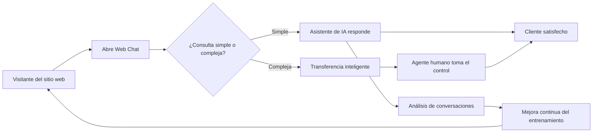

# Cómo Usar el Asistente de IA en el Web Chat para Soporte al Cliente

En esta guía completa te explicamos cómo usar el asistente de IA en el web chat para generar más clientes potenciales, aumentar las ventas, mantener a tus clientes enganchados y construir relaciones sólidas a largo plazo con ellos. En cualquier negocio online, la satisfacción del cliente lo es todo. Puedes lograr el éxito empresarial en cualquier industria si mantienes a tus clientes felices y satisfechos.

Implementar un chatbot con inteligencia artificial para tu comercio electrónico puede aumentar significativamente la generación de leads, impulsar las ventas, fomentar la lealtad del cliente y construir relaciones sólidas a largo plazo. No hay mejor manera de mantener a un cliente feliz y enganchado que brindarle el mejor soporte posible. Esto es crucial para retener clientes leales y fomentar relaciones duraderas. Y la mejor forma de atraer visitantes de tu tienda online o sitio web a tu embudo de ventas es mediante el Web Chatbot.


> **¿Sabías que...?** Según estudios recientes, las empresas que implementan chat en vivo con IA en sus sitios web experimentan un aumento de hasta el 40% en las tasas de conversión. Los clientes que usan el chat en vivo tienen tres veces más probabilidades de realizar una compra que aquellos que no lo usan.

## Problemas del Soporte al Cliente en los Negocios Online

Uno de los mayores problemas que enfrentan los negocios online es ayudar a sus clientes de manera oportuna. A veces, los clientes tienen que esperar mucho tiempo al teléfono o por una respuesta por correo electrónico. Es posible que no puedan obtener ayuda fuera del horario laboral habitual porque no hay suficientes formas de contactar a la empresa. Además, la calidad de la ayuda puede variar según quién atienda al cliente. Finalmente, las empresas pueden perder oportunidades de aprender lo que piensan los clientes porque no tienen suficientes canales para que estos den su opinión. Por eso, un chat web nativo para tu sitio web es imprescindible para un mejor soporte al cliente.


> **Problema común:** Muchos negocios online pierden hasta el 75% de sus clientes potenciales simplemente porque no responden lo suficientemente rápido. Un visitante que hace una pregunta y no recibe respuesta en minutos probablemente abandonará tu sitio y buscará a la competencia.

## ¿Qué es el Web Chat?

El web chat es una herramienta de chat en línea en tiempo real que permite a los visitantes de tu sitio web interactuar con tus representantes de servicio al cliente u otros miembros del equipo a través de mensajería directa desde tu sitio web. Generalmente aparece como una superposición en tu sitio web, lo que permite a tus visitantes iniciar conversaciones fácilmente y recibir respuestas o asistencia inmediata. El web chat es una herramienta muy importante tanto para los dueños de negocios como para los clientes.

### Web Chat desde la Perspectiva del Dueño del Negocio

Cuando usas el web chat para hablar con tus clientes, estos se sienten más satisfechos porque reciben ayuda rápidamente sin complicaciones adicionales. También te ayuda a vender más productos al responder sus preguntas y guiarlos a través de tu embudo de ventas. Además, te permite ahorrar dinero porque puedes configurar chatbots de IA personalizados que pueden hablar con muchos clientes al mismo tiempo, reduciendo la necesidad de más representantes de soporte. Esta herramienta también te ayuda a conocer el comportamiento de tus clientes para organizar mejor tu tienda. Al ofrecer web chat, demuestras a tus clientes que te preocupas por ellos, lo que mejora la percepción de tu marca.


> **Consejo clave:** Combina tu web chat con una bandeja compartida para que todo tu equipo pueda ver y responder las conversaciones desde un solo lugar. Esto evita respuestas duplicadas y garantiza que ningún cliente quede sin atender.

### Web Chat desde la Perspectiva del Cliente

Imagina que puedes hablar con una empresa directamente desde su sitio web. Eso es el web chat. Es súper fácil y ahorra tiempo porque no tienes que esperar en espera ni escribir correos electrónicos largos esperando una respuesta. Puedes hablar con un agente de soporte que puede ayudarte de inmediato con cualquier consulta. El web chat también te permite tener una conversación a tu propio ritmo. Puedes detenerte a pensar, buscar información y hacer más preguntas cuando quieras. También es excelente para personas que tienen dificultades para hablar por teléfono.

## ¿Qué es el Asistente de IA?

Un Asistente de IA es una potente funcionalidad que utiliza inteligencia artificial para hacer que tu Web Chat, WhatsApp, Facebook Messenger, Instagram DM y Telegram chatbot sean más inteligentes y útiles. Al usar la función de Asistente de IA, tus chatbots pueden entender el lenguaje natural y responder cualquier consulta de los usuarios de una manera más similar a la humana, incluso para preguntas complejas o que están fuera de las plantillas del bot.

Todo lo que necesitas hacer es entrenar tu Asistente de IA correctamente. Esto mejora la experiencia del cliente con respuestas precisas y relevantes. El Asistente de IA también puede personalizar las interacciones, automatizar tareas como responder preguntas frecuentes y programar citas, e integrarse perfectamente con tus flujos de trabajo existentes. En general, libera el tiempo de tu equipo y hace que tu chatbot sea más escalable para empresas de todos los tamaños.


> **Dato importante:** Un asistente de IA bien entrenado puede manejar hasta el 80% de las consultas de los clientes de forma autónoma, permitiendo que tu equipo humano se concentre solo en los casos más complejos y de alto valor.


### ¿Qué puede hacer un Asistente de IA?

- Responder preguntas frecuentes automáticamente
- Proporcionar recomendaciones personalizadas de productos
- Ayudar con el seguimiento de pedidos
- Programar citas y reuniones
- Resolver problemas comunes de soporte técnico
- Recopilar información de clientes mediante conversaciones naturales
- Escalar conversaciones complejas a agentes humanos
- Brindar soporte en múltiples idiomas

### ¿Qué NO puede hacer?

- Reemplazar completamente el juicio humano en situaciones delicadas
- Manejar emergencias o situaciones de crisis
- Tomar decisiones complejas que requieran contexto empresarial profundo
- Operar sin una base de conocimiento actualizada

## ¿Cómo Funciona el Web Chat con un Asistente de IA?

Es muy fácil usar el Web Chat y la función de Asistente de IA de E-SMART360. Solo necesitas seguir algunos pasos, realizar algunas configuraciones y estarás listo. Aquí tienes los pasos que debes seguir:


### Crear un Widget de Chat y Conectarlo con tu Sitio Web

Cuando quieras usar el web chat, primero debes crear un widget de chat. E-SMART360 te proporcionará un enlace que puedes pegar en la sección del pie de página (footer) de tu sitio web. Puedes personalizar tu widget de chat de varias formas:

- Personalizar el tema de fondo
- Color del tema
- Color de la burbuja de chat
- Logo de la marca
- Posición de la caja de chat (izquierda o derecha)

Puedes integrar el chatbot de web chat en tu sitio de WordPress o cualquier otra plataforma web. Una vez conectado, el widget aparecerá automáticamente en tu sitio y tus visitantes podrán iniciar conversaciones directamente.


> **Importante:** Asegúrate de que el widget de chat sea visible y accesible en todas las páginas de tu sitio web, especialmente en las páginas de producto y de contacto. La ubicación ideal es en la esquina inferior derecha.

### Entrenar al Asistente de IA con los Datos de tu Negocio

Después de crear el web chat y conectarlo con tu sitio web, tus clientes pueden iniciar conversaciones sobre cualquier pregunta que tengan acerca de productos o servicios, dependiendo de tu negocio. Cuando un cliente envía un mensaje a través del web chat, puedes ver el mensaje desde el Chat en Vivo de E-SMART360. Luego, tú o tus agentes de soporte pueden responder al cliente, lo cual puede consumir mucho tiempo. Aquí es donde un chatbot personalizado resulta útil, y si configuras un Asistente de IA con el chatbot, ¡el chatbot se convierte en un super chatbot!

### Limitaciones de los Chatbots Básicos

Un chatbot básico tiene muchas limitaciones. Solo puede proporcionar respuestas de soporte según cómo hayas construido la plantilla del chatbot. Pero cuando integras el Asistente de IA de E-SMART360, puede manejar cualquier tipo de pregunta de tus clientes. Todo lo que necesitas hacer es entrenar tu Asistente de IA con datos sobre tu empresa, modelo de negocio, detalles de productos, precios y cualquier otro dato relevante necesario para brindar soporte al cliente.

### Cómo Entrenar al Asistente de IA

Básicamente, significa que entrenas al Asistente de IA con la misma información que habrías usado para entrenar a tu agente de soporte humano. E-SMART360 te permite entrenar tu Asistente de IA con datos en múltiples formatos.


### Entrenar con Preguntas Frecuentes (FAQ)

Las FAQs son la forma más eficiente de entrenar a tu asistente. Proporcionan respuestas estructuradas y rápidas para las preguntas más comunes de tus clientes.

**Cómo hacerlo:**
1. Ve a la sección de entrenamiento del Asistente de IA
2. Selecciona la opción "FAQ" o "Resumen"
   - **Resumen:** Proporciona respuestas ricas y contextuales, pero consume más tokens
   - **FAQ:** Es más eficiente en costos y está estructurada para respuestas rápidas
3. Carga tu contenido en el formato requerido y guarda los cambios
4. El asistente procesará la información y estará listo para responder

**Ejemplo de formato FAQ:**
```text
P: ¿Cuál es el tiempo de entrega estándar?
R: Nuestro tiempo de entrega estándar es de 3 a 5 días hábiles.

P: ¿Aceptan devoluciones?
R: Sí, aceptamos devoluciones dentro de los 30 días posteriores a la compra.
```

### Entrenar con URL

Puedes entrenar al asistente directamente desde las páginas web de tu negocio, como tu sitio de productos, página de términos y condiciones, o política de envíos.

**Cómo hacerlo:**
1. Haz clic en "Nuevo" bajo la sección de entrenamiento por URL
2. Ingresa la URL de tu página web
3. Selecciona el tipo de selector (ID o Clase) según la estructura de la página
4. Opcionalmente, elimina contenido innecesario como anuncios o encabezados
5. Elige entre:
   - **Generar FAQ:** Divide el contenido en preguntas y respuestas estructuradas
   - **Generar Respuesta Directa:** Proporciona una respuesta completa y detallada
6. Guarda los cambios


> **Recomendación:** Para páginas extensas, usa la opción "Generar FAQ" ya que consume menos tokens y proporciona respuestas más directas. Para páginas con información crítica, usa "Generar Respuesta Directa" para asegurar respuestas completas.


### Entrenar con Archivos

Puedes subir documentos directamente para que el asistente aprenda de ellos. Los formatos compatibles incluyen PDF, Word (.doc) y TXT.

**Cómo hacerlo:**
1. Navega a la configuración de archivos y haz clic en "Nuevo"
2. Sube tu archivo en formato PDF, Word o TXT
3. Elige el modo de procesamiento:
   - **Generar Respuesta Directa:** Proporciona una respuesta completa y detallada (mayor uso de tokens)
   - **Generar FAQ:** Divide el contenido en FAQs estructuradas (menor uso de tokens)
4. Guarda el archivo y finaliza el entrenamiento


> **¿Qué tipo de archivos son mejores?** Manuales de producto, guías de usuario, catálogos de precios, políticas de la empresa, términos de servicio y cualquier documento que tus agentes de soporte consulten regularmente.


### Configurar el Comportamiento del Chatbot con IA

Una vez que el asistente está entrenado, debes configurar cómo se comportará en las conversaciones.

### Configuración de Respuesta "Sin Coincidencia" (No Match)

Si el chatbot no puede encontrar una coincidencia para una consulta, debe responder basándose en los datos entrenados.

1. Ve a **Gestor de Bots > Botones de Acción > Sin Coincidencia**
2. Selecciona **Respuesta de IA** y vincula la campaña de IA entrenada
3. Activa **Respuesta Sin Coincidencia** en la configuración
4. Guarda los cambios

### Habilitar el Asistente de IA

1. Ve al **Gestor de Bots**
2. Activa la opción **Habilitar Asistente de IA**
3. Selecciona la campaña deseada
4. Elige el modo de respuesta:
   - **Asistente de IA para Todas las Consultas:** La IA maneja todas las preguntas de los clientes
   - **IA como Respaldo Solamente:** La IA interviene solo cuando las reglas predefinidas fallan

### Analizar las Conversaciones de los Clientes con el Chat en Vivo

Ahora que has conectado el web chat con tu sitio web y has habilitado el Asistente de IA con el chatbot, estás listo. Cada vez que tus clientes visiten tu sitio web y necesiten asistencia, pueden enviar un mensaje en el web chat y tu chatbot con IA se encargará de ello.

Puedes revisar la conversación completa desde el **Chat en Vivo** de E-SMART360. Puedes tomar el control de cualquier conversación desde el chat en vivo y también asignar a otro agente para que tome el control de la conversación.


> **Buenas prácticas:** Revisa regularmente las conversaciones que la IA ha manejado para identificar patrones, áreas de mejora y oportunidades para actualizar los datos de entrenamiento. Esto mantendrá tu asistente cada vez más preciso.

## Beneficios del Web Chat con Asistente de IA

Conectar un Web Chat con IA puede beneficiarte a ti y a tu negocio de diversas maneras:

### Satisfacción del Cliente

El Web Chat proporciona tiempos de respuesta más rápidos a las consultas de los clientes, disponibilidad 24/7, lo que significa que tus clientes recibirán asistencia incluso cuando no sea horario laboral o cuando tus agentes de soporte estén ocupados con otras tareas importantes. Esto lleva a una mayor satisfacción del cliente. A nadie le gusta esperar. Cuando los clientes visitan tu sitio web y tienen una pregunta sobre un producto o servicio, si reciben una respuesta instantánea, se sienten más satisfechos.

### Comodidad

El web chat con IA ofrece una forma conveniente y accesible de obtener ayuda para tus clientes, sin necesidad de esperar en espera o programar una llamada. Pueden abrir la caja de chat e iniciar una conversación, obteniendo una respuesta instantánea.

### Mayor Eficiencia

Puedes automatizar las tareas rutinarias de tus agentes de soporte y proporcionar respuestas instantáneas a preguntas frecuentes, liberando a los agentes humanos para que se concentren en problemas más complejos. Gracias al web chat con Asistente de IA, tu equipo de soporte será mucho más eficiente.

### Reducción de Costos de Soporte

Al usar el web chat con IA para el soporte al cliente, puedes reducir el costo de las operaciones de servicio al cliente. Antes podrías necesitar de 10 a 20 agentes humanos para tu equipo de soporte. Ahora, con el web chat con IA, puedes reducir ese costo a la mitad o incluso más, porque la IA puede encargarse de la mayoría de las consultas por sí misma.

### Mejora de las Relaciones con los Clientes

El Web Chat proporciona una valiosa oportunidad para construir relaciones más sólidas con los clientes mediante interacciones personalizadas y atractivas. Un asistente de IA que recuerda las preferencias y el historial de cada cliente crea una experiencia verdaderamente personalizada.

### Autoservicio

Los chatbots permiten a los clientes autogestionarse y resolver problemas de forma independiente, aumentando su autonomía y reduciendo la frustración de tener que esperar por un agente humano.

### Soporte Multilingüe

Los chatbots con IA pueden brindar soporte en múltiples idiomas. Solo necesitas entrenarlos adecuadamente. Esto facilita que las empresas lleguen a una audiencia global sin necesidad de contratar agentes que hablen cada idioma.


> **Ejemplo práctico:** Una tienda online que vende a clientes en España, México y Argentina puede entrenar a su asistente de IA en español neutro y configurar variaciones regionales para términos locales. El asistente reconocerá automáticamente "orden" (México) y "pedido" (España) como el mismo concepto.

### Recolección de Datos

Puedes usar chatbots con IA para recopilar datos de los clientes utilizando varios métodos, incluyendo la recolección explícita de datos a través de formularios y encuestas integradas con tu chatbot, preguntas abiertas y menús interactivos. Tu bot puede analizar el historial de conversaciones, rastrear el comportamiento del usuario y realizar análisis de sentimientos para dar una respuesta adecuada.

### Escalabilidad

La IA no se cansa, no necesita descansos y puede manejar miles de conversaciones simultáneamente. Esto hace que tu negocio sea infinitamente escalable sin aumentar proporcionalmente los costos de soporte.

## Configuración Avanzada: Transferencia Inteligente a Agentes Humanos

Una de las características más potentes del Asistente de IA es su capacidad para detectar cuándo un cliente necesita ayuda humana y transferir la conversación al agente adecuado de forma automática.

### Cómo Funciona la Transferencia Inteligente

1. **Detección Automática:** La IA analiza el mensaje del cliente y detecta frases como "hablar con un agente", "necesito ayuda de una persona real" o identifica problemas que superan su capacidad de respuesta
2. **Asignación Inteligente:** La conversación se asigna automáticamente al miembro del equipo más adecuado según el tipo de consulta
3. **Contexto Completo:** El agente humano recibe el historial completo de la conversación, evitando que el cliente tenga que repetir información
4. **Respuesta Oportuna:** El equipo puede ver y responder las consultas escaladas en tiempo real


> **¿Por qué es importante?** Esta característica equilibra la automatización con la asistencia humana, mejorando la eficiencia y la satisfacción del cliente. La IA maneja consultas rutinarias mientras que los agentes humanos se enfocan en problemas complejos, entregando soporte rápido y personalizado.

## Ejemplos de Casos de Uso Reales


### Sephora – Asesoría de Belleza Personalizada

Sephora utiliza web chat como parte de su servicio **Beauty Chat**, que permite a los clientes obtener asesoría de belleza personalizada y recomendaciones de productos en tiempo real de parte de expertos. También integran herramientas impulsadas por IA como **Sephora Virtual Artist**, que usa realidad aumentada para permitir que los clientes prueben maquillaje virtualmente y reciban sugerencias personalizadas.

**Impacto en el negocio:**
- El 50% de los consumidores espera que las empresas ofrezcan experiencias personalizadas
- Aumento del 12% en el crecimiento de ventas
- Mejora significativa en la retención de clientes
- Mayor tasa de conversión gracias a la personalización


### H&M – Chatbot de Servicio al Cliente

H&M integra web chat en su página de servicio al cliente para proporcionar asistencia en tiempo real a los compradores online. Los clientes pueden preguntar sobre disponibilidad de productos, verificar el estado de sus pedidos o resolver otros problemas mediante chat en vivo. También usan chatbots para consultas más básicas.

**Impacto en el negocio:**
- Reducción del 50% en los tiempos de respuesta del servicio al cliente
- Los usuarios de chat en vivo tienen 3 veces más probabilidades de comprar
- Aumento del 10-15% en la satisfacción del cliente
- Mejora en las tasas de conversión


### LEGO – Creación de Comunidad y Compromiso

LEGO usa web chat para fomentar una conexión más profunda con los clientes, proporcionando soporte en tiempo real, facilitando la retroalimentación y generando compromiso en su sitio de comercio electrónico. El chat está integrado en su sitio web, permitiendo a los clientes hacer preguntas sobre productos, recibir consejos de construcción e interactuar con la comunidad LEGO.

**Impacto en el negocio:**
- Aumento del 25% en las ventas de comercio electrónico
- Incremento del 30% en compras repetidas
- Mayor compromiso del cliente
- Más recomendaciones de productos


## Pruebas y Optimización

Una vez que tu asistente de IA está configurado, es fundamental realizar pruebas continuas para garantizar que funcione correctamente.

### Cómo Probar tu Asistente de IA

1. **Simula consultas de usuarios** desde diferentes perspectivas (nuevo cliente, cliente recurrente, cliente con queja)
2. **Verifica que las respuestas sean precisas** y relevantes para cada tipo de consulta
3. **Ajusta las FAQs, URLs o archivos** según sea necesario para mejorar la precisión
4. **Monitorea el rendimiento del chatbot** y actualiza los datos de entrenamiento regularmente


> **Error común:** Muchos negocios configuran su asistente de IA una vez y nunca lo actualizan. Los datos de los productos cambian, las políticas se actualizan y las preguntas de los clientes evolucionan. Programa revisiones mensuales de tu asistente de IA para mantenerlo actualizado.

### Indicadores Clave de Rendimiento (KPI)

- **Tasa de resolución en el primer contacto:** Porcentaje de consultas que la IA resuelve sin intervención humana
- **Tiempo promedio de respuesta:** Cuánto tarda la IA en responder a una consulta
- **Satisfacción del cliente (CSAT):** Calificación que los clientes dan a la interacción con la IA
- **Tasa de escalamiento:** Porcentaje de conversaciones que la IA transfiere a agentes humanos
- **Precisión de las respuestas:** Porcentaje de respuestas correctas frente al total de consultas


> **Meta recomendada:** Un asistente de IA bien entrenado debería alcanzar una tasa de resolución en el primer contacto del 60-80% y un CSAT superior a 4 de 5 estrellas.

## Solución de Problemas Comunes

Incluso con un asistente de IA bien entrenado, pueden surgir problemas. Aquí te mostramos cómo resolver los más comunes.

### El Asistente No Responde Correctamente

**Causa probable:** Los datos de entrenamiento están desactualizados o son insuficientes.

**Solución:**
1. Revisa las últimas conversaciones donde el asistente falló
2. Identifica los patrones de preguntas que no pudo responder
3. Agrega esas preguntas como nuevas FAQs o actualiza los documentos de entrenamiento
4. Vuelve a entrenar al asistente con los datos actualizados
5. Realiza pruebas para verificar que las respuestas sean correctas

### Respuestas Demasiado Genéricas

**Causa probable:** El entrenamiento no contiene suficiente detalle específico de tu negocio.

**Solución:**
1. Enriquece los datos de entrenamiento con información detallada de productos y servicios
2. Usa la opción "Resumen" en lugar de "FAQ" para respuestas más contextuales
3. Incluye ejemplos concretos en los datos de entrenamiento
4. Define un mensaje de prompt más específico que describa claramente el rol y tono del asistente

### La IA Escala Demasiadas Conversaciones a Humanos

**Causa probable:** La configuración de "IA como Respaldo Solamente" está mal ajustada o el entrenamiento es insuficiente.

**Solución:**
1. Cambia temporalmente a "Asistente de IA para Todas las Consultas"
2. Monitorea qué preguntas no puede responder
3. Agrega esos temas a la base de conocimiento
4. Vuelve a evaluar después de una semana de entrenamiento adicional

### Problemas de Integración con el Sitio Web

**Causa probable:** El widget de chat no está correctamente instalado o hay conflictos con otros scripts.

**Solución:**
1. Verifica que el código del widget esté en el footer de todas las páginas
2. Comprueba que no haya bloqueadores de scripts activos
3. Asegúrate de que el sitio web cargue correctamente el JavaScript del widget
4. Prueba en diferentes navegadores (Chrome, Firefox, Safari, Edge)
5. Verifica en dispositivos móviles y de escritorio

## Consejos para Maximizar el Rendimiento de tu Asistente de IA

### 1. Estructura tu Base de Conocimiento por Niveles

Organiza la información que usas para entrenar al asistente en tres niveles:

- **Nivel 1 — Información General:** Preguntas frecuentes sobre la empresa, horarios, políticas de devolución, métodos de pago
- **Nivel 2 — Información de Productos/Servicios:** Catálogo detallado, precios, especificaciones técnicas, guías de tallas
- **Nivel 3 — Información Avanzada:** Solución de problemas, casos especiales, excepciones a políticas


> **Recomendación:** Empieza entrenando con el Nivel 1 y 2 primero. Una vez que el asistente responda correctamente esas consultas, agrega el Nivel 3. Esto facilita la detección de errores y asegura una base sólida.

### 2. Usa un Lenguaje Claro y Consistente

Cuando escribas FAQs o documentos de entrenamiento:

- Usa el mismo tono y estilo de comunicación que tu marca
- Evita jerga técnica innecesaria a menos que tu audiencia sea especializada
- Sé específico: en lugar de "tiempos de entrega rápidos", di "entrega en 24-48 horas"
- Incluye ejemplos concretos cuando sea posible

### 3. Configura Alertas de Rendimiento

Monitorea activamente cómo está funcionando tu asistente:

- **Alertas de baja precisión:** Si la tasa de respuestas correctas cae por debajo del 70%
- **Alertas de alto escalamiento:** Si más del 40% de las conversaciones se escalan a humanos
- **Alertas de sentimiento negativo:** Si los clientes muestran frustración en las conversaciones
- **Revisiones automatizadas:** Programa reportes semanales con métricas clave

### 4. Integra Retroalimentación Directa de los Clientes

Al final de cada interacción con el asistente de IA, puedes agregar una pregunta breve:

> "¿Te fue útil esta respuesta? 👍 / 👎"

Esta retroalimentación directa te permite:
- Identificar rápidamente respuestas incorrectas
- Priorizar qué áreas de entrenamiento necesitan mejora
- Medir la satisfacción en tiempo real

## Estrategias de Implementación por Tipo de Negocio

### E-commerce

**Objetivo principal:** Reducir el abandono de carrito y aumentar las conversiones

**Configuración recomendada:**
- Entrena al asistente con el catálogo completo de productos
- Configura respuestas automáticas para preguntas de envío y devoluciones
- Activa la recuperación de carritos abandonados mediante web chat
- Integra con WooCommerce o Shopify para consultas de pedidos en tiempo real

**Métrica de éxito:** Reducción del 30% en el abandono de carrito en los primeros 3 meses

### SaaS / Tecnología

**Objetivo principal:** Reducir tickets de soporte y mejorar la incorporación de usuarios

**Configuración recomendada:**
- Entrena al asistente con la documentación técnica y guías de inicio rápido
- Configura respuestas para preguntas sobre planes de precios y características
- Crea flujos de incorporación (onboarding) guiados mediante el web chat
- Integra con la base de conocimiento existente mediante URLs

**Métrica de éxito:** Reducción del 40% en tickets de soporte de nivel 1

### Servicios Profesionales

**Objetivo principal:** Generar leads calificados y agendar citas

**Configuración recomendada:**
- Entrena al asistente con descripciones detalladas de servicios y precios
- Configura la recolección de datos de contacto mediante conversaciones naturales
- Integra con el sistema de calendario para agendar citas automáticamente
- Activa la transferencia inteligente para consultas complejas o de alto valor

**Métrica de éxito:** Aumento del 25% en leads calificados generados desde el web chat

### Hostelería y Restaurantes

**Objetivo principal:** Gestionar reservas y consultas de menú

**Configuración recomendada:**
- Entrena al asistente con el menú completo, horarios y ubicaciones
- Configura respuestas para preguntas sobre reservas, eventos especiales y opciones dietéticas
- Integra con el sistema de reservas para confirmar disponibilidad en tiempo real
- Activa la recolección de preferencias alimenticias durante la conversación

**Métrica de éxito:** Aumento del 20% en reservas realizadas a través del web chat

## Mejores Prácticas para la Atención al Cliente con Chatbots

1. **Comunicación Clara y Concisa:** Usa un lenguaje simple y evita la jerga técnica innecesaria
2. **Personalización:** Adapta las respuestas a las necesidades y preferencias individuales de cada cliente
3. **Disponibilidad 24/7:** Asegúrate de que tu chatbot esté disponible las 24 horas para satisfacer las necesidades de los clientes
4. **Transferencia sin Fricción a Agentes Humanos:** Proporciona una transición suave para problemas complejos que requieren intervención humana
5. **Monitoreo y Mejora Continua:** Analiza constantemente el rendimiento del chatbot y realiza los ajustes necesarios
6. **Transparencia:** Informa a los clientes cuando están interactuando con un chatbot y ofrece la opción de hablar con un humano
7. **Múltiples Canales:** Asegúrate de que el asistente funcione de manera consistente en todos los canales donde está presente
8. **Privacidad y Seguridad:** No almacenes información sensible de los clientes en el chat y cumple con las regulaciones de protección de datos

## Cómo las Empresas Usan la IA para el Servicio al Cliente

### Automatización de Tareas Rutinarias

Las empresas utilizan la IA para:
- Manejar preguntas frecuentes (FAQs) automáticamente
- Programar citas y recordatorios
- Proporcionar información básica de productos
- Procesar devoluciones y cambios simples
- Actualizar direcciones de envío y datos de facturación

### Mejora de la Satisfacción del Cliente

- Proporcionando soporte 24/7 sin interrupciones
- Ofreciendo interacciones personalizadas basadas en el historial del cliente
- Reduciendo los tiempos de espera a prácticamente cero
- Resolviendo problemas en el primer contacto sin necesidad de transferencias

### Reducción de Costos Operativos

- Automatizando tareas que antes requerían múltiples agentes humanos
- Minimizando la necesidad de contratar y capacitar personal de soporte adicional
- Reduciendo el tiempo promedio de manejo de cada consulta
- Escalando el soporte sin aumentar proporcionalmente los costos

### Obtención de Información Valiosa

- Analizando los datos de los clientes para entender sus necesidades y preferencias
- Identificando tendencias y patrones en las consultas de soporte
- Detectando áreas de mejora en productos o servicios basándose en la retroalimentación
- Midiendo la efectividad de las respuestas y optimizando continuamente

## Integración del Asistente de IA con Otros Canales

El asistente de IA no se limita al web chat. Puedes extender su alcance a múltiples canales para ofrecer una experiencia unificada.

### WhatsApp

Conecta el mismo asistente de IA entrenado a tu número de WhatsApp Business:
1. Ve a la configuración de canales en E-SMART360
2. Selecciona WhatsApp y vincula tu número de negocio
3. Habilita el Asistente de IA para WhatsApp
4. Configura las reglas de comportamiento (mismas que para web chat)
5. Tus clientes de WhatsApp recibirán las mismas respuestas inteligentes

### Facebook Messenger e Instagram DM

Extiende el asistente a las plataformas de Meta:
1. Conecta tu página de Facebook y cuenta de Instagram
2. Habilita el chatbot con IA para estos canales
3. Configura respuestas automáticas para mensajes directos
4. Sincroniza todas las conversaciones en la bandeja compartida


> **Ventaja clave:** Al usar el mismo asistente de IA en todos los canales, garantizas que un cliente reciba la misma respuesta de calidad ya sea que se comunique por WhatsApp, Facebook Messenger, Instagram DM o el web chat de tu sitio web.

### Telegram

Para negocios que usan Telegram como canal de comunicación:
1. Crea un bot de Telegram y conéctalo a E-SMART360
2. Habilita el Asistente de IA para las conversaciones de Telegram
3. Configura respuestas automáticas inteligentes
4. Gestiona todas las conversaciones desde la misma bandeja compartida

## Mantenimiento y Actualización del Asistente de IA

Un asistente de IA no es algo que configuras una vez y olvidas. Requiere mantenimiento regular para mantenerse efectivo.

### Programa de Mantenimiento Recomendado

| Frecuencia | Acción |
|------------|--------|
| **Diario** | Revisar las conversaciones escaladas a humanos para identificar patrones |
| **Semanal** | Actualizar FAQs con nuevas preguntas recurrentes |
| **Mensual** | Revisar y actualizar documentos de entrenamiento con información nueva |
| **Trimestral** | Evaluar el rendimiento general y ajustar la configuración de comportamiento |
| **Anual** | Revisión completa de la base de conocimiento y reentrenamiento integral |

### Indicadores de que Necesitas Actualizar tu Asistente

- La tasa de escalamiento a humanos supera el 40%
- Los clientes se quejan de respuestas incorrectas o desactualizadas
- Han cambiado tus productos, precios o políticas
- Has lanzado nuevas campañas o promociones
- Has identificado nuevas preguntas frecuentes en las conversaciones recientes

## Caso de Estudio Detallado: Transformación del Soporte con IA

### Escenario

Una tienda online de electrónica con 500 productos recibe un promedio de 200 consultas de clientes por día. Antes de implementar el asistente de IA, tenían 5 agentes de soporte que manejaban todas las consultas manualmente.

### Problemas Identificados

- Tiempo promedio de respuesta: 45 minutos
- Tasa de abandono de carrito: 68%
- Satisfacción del cliente: 3.2/5
- Costo mensual de soporte: $8,500
- Capacidad máxima: 150 consultas/día (el resto quedaba sin respuesta)

### Implementación

1. Se entrenó al asistente de IA con:
   - Catálogo completo de productos (500 productos)
   - Políticas de envío y devolución
   - FAQs de soporte técnico básico
   - Guías de solución de problemas comunes

2. Se configuró el modo "Asistente de IA para Todas las Consultas"
3. Se activó la transferencia inteligente para consultas complejas
4. Se integró con el sistema de inventario para consultas de disponibilidad en tiempo real

### Resultados Después de 3 Meses

- Tiempo promedio de respuesta: 5 segundos
- Tasa de abandono de carrito: 42% (reducción del 38%)
- Satisfacción del cliente: 4.5/5
- Costo mensual de soporte: $3,200 (ahorro del 62%)
- Capacidad: Ilimitada (la IA maneja el 78% de las consultas sin intervención humana)
- Los 3 agentes restantes se enfocan en consultas complejas y ventas consultivas


> **Lecciones aprendidas:** La clave del éxito fue la inversión inicial en entrenamiento de calidad y el monitoreo constante durante las primeras semanas. Cada semana se dedicaron 2 horas a revisar y ajustar la base de conocimiento, lo que resultó en una mejora continua de la precisión del asistente.

## ¿Por Qué Usar el Asistente de IA y Web Chat de E-SMART360?

El Asistente de IA de E-SMART360 es una función de IA muy potente que puedes usar para entrenar tu IA usando FAQs, archivos y enlaces de sitios web, y conectar el Asistente de IA con el web chat. Puede mejorar significativamente la satisfacción, comodidad y eficiencia del cliente para tu negocio. Puede reducir los costos de soporte al cliente, mejorar las relaciones con los clientes y proporcionar valiosas oportunidades de recopilación de datos.


### Soporte Multicanal

Funciona en WhatsApp, Messenger, Instagram, Telegram y sitios web desde un solo lugar. Tus clientes reciben la misma experiencia de calidad sin importar el canal que elijan.

### Disponibilidad 24/7 y Escalabilidad

Garantiza soporte las 24 horas del día, los 7 días de la semana. La IA nunca se cansa, no necesita descansos y puede manejar miles de conversaciones simultáneamente.

### Personalización y Contexto

Cada interacción se adapta al cliente específico, recordando conversaciones previas y preferencias para ofrecer un servicio verdaderamente personalizado.

## Preguntas Frecuentes


### ¿Cuáles son algunos ejemplos de inteligencia artificial en el servicio al cliente?

- **Chatbots con IA:** Como el asistente de E-SMART360, pueden manejar una amplia gama de consultas, desde responder preguntas frecuentes hasta proporcionar recomendaciones personalizadas de productos
- **Asistentes Virtuales:** Estos asistentes impulsados por IA pueden entender y responder solicitudes de clientes mediante voz o texto, ofreciendo soporte a través de varios canales
- **Análisis de Sentimientos:** Los algoritmos de IA pueden analizar las interacciones con los clientes para entender sus emociones y sentimientos, permitiendo a las empresas identificar áreas de mejora
- **Analítica Predictiva:** La IA puede predecir el comportamiento del cliente y anticipar sus necesidades, permitiendo un soporte proactivo al cliente

### ¿Cómo usan las empresas la IA generativa para el servicio al cliente?

La IA generativa permite a los chatbots:
- **Generar respuestas similares a las humanas:** Crear conversaciones más naturales y atractivas con los clientes
- **Personalizar interacciones:** Adaptar las respuestas a las necesidades y preferencias individuales de cada cliente
- **Resumir conversaciones:** Entender rápidamente los puntos clave de las interacciones con los clientes
- **Traducir idiomas:** Proporcionar soporte multilingüe para una base de clientes global

### ¿Cómo se usa un asistente en web chat con aprendizaje automático de forma gratuita?

Aunque el Asistente de IA es una función premium, puedes aprovechar sus capacidades de aprendizaje automático con una prueba gratuita. Esto te permite experimentar el poder del soporte al cliente impulsado por IA de primera mano y evaluar sus beneficios para tu negocio sin compromiso inicial.

### ¿Cuál es la diferencia entre un chatbot básico y un asistente de IA?

Un chatbot básico solo puede responder según reglas predefinidas y plantillas fijas. Si un cliente hace una pregunta que no está en las plantillas, el chatbot no sabe cómo responder. Un asistente de IA, en cambio, entiende el lenguaje natural, puede interpretar preguntas incluso si están formuladas de manera diferente, y puede buscar información en su base de conocimiento entrenada para dar respuestas precisas y contextuales.

### ¿Cómo puedo mejorar continuamente mi asistente de IA?

- **Analiza las conversaciones** donde la IA no pudo responder correctamente
- **Actualiza regularmente** los datos de entrenamiento con nueva información
- **Agrega nuevas FAQs** basadas en las preguntas reales que hacen los clientes
- **Revisa los comentarios** de los clientes sobre las respuestas de la IA
- **Monitorea los KPI** y ajusta la configuración según los resultados

### ¿Puede el asistente de IA manejar múltiples idiomas simultáneamente?

Sí, el asistente de IA puede manejar múltiples idiomas. Sin embargo, debes entrenarlo con datos en cada idioma que desees soportar. Puedes crear campañas de entrenamiento separadas para diferentes idiomas o incluir contenido multilingüe en una sola campaña. El asistente detectará automáticamente el idioma del cliente y responderá en consecuencia.

### ¿Qué sucede si el asistente de IA no sabe responder una pregunta?

Cuando el asistente no puede responder una pregunta, puedes configurar varias acciones:
1. Proporcionar una respuesta genérica como "Lo siento, no tengo información sobre eso. Te transferiré con un agente humano."
2. Escalar automáticamente la conversación a un agente humano mediante la transferencia inteligente
3. Solicitar al cliente que reformule su pregunta
4. Enviar un mensaje de seguimiento por correo electrónico con la respuesta una vez que el equipo la haya preparado

### ¿Cuánto tiempo toma entrenar al asistente de IA?

El tiempo de entrenamiento depende de la cantidad y complejidad de los datos:
- **Entrenamiento básico (FAQs simples):** 30 minutos a 1 hora
- **Entrenamiento estándar (FAQs + URLs):** 2 a 4 horas
- **Entrenamiento avanzado (FAQs + URLs + archivos PDF + documentos):** 4 a 8 horas
- **Entrenamiento empresarial (múltiples departamentos, productos, idiomas):** 1 a 3 días

La clave no es solo la cantidad de tiempo, sino la calidad de los datos. Es mejor entrenar con 20 FAQs bien escritas que con 200 FAQs mal redactadas.

### ¿Cómo mido el retorno de inversión (ROI) del asistente de IA?

Para calcular el ROI de tu asistente de IA, considera estos factores:

**Ahorros directos:**
- Reducción de horas de agentes humanos × costo por hora
- Menos contrataciones necesarias para soporte al cliente
- Disminución de costos de capacitación

**Aumento de ingresos:**
- Más conversiones por respuestas instantáneas
- Mayor valor del pedido promedio por recomendaciones personalizadas
- Reducción del abandono de carrito
- Más clientes recurrentes por mejor experiencia

**Fórmula simple de ROI:**
```
ROI = (Ingresos adicionales + Ahorros - Costo de la herramienta) / Costo de la herramienta × 100
```

### ¿El asistente de IA puede manejar conversaciones confidenciales o privadas?

El asistente de IA está diseñado para manejar conversaciones de servicio al cliente general. Para información sensible como datos de tarjetas de crédito, números de seguro social o contraseñas, se recomienda:
1. Configurar el asistente para que detecte y evite solicitar información sensible
2. Escalar inmediatamente a un agente humano cuando se detecten datos confidenciales
3. Usar canales seguros y encriptados para la transferencia de datos sensibles
4. Cumplir con las regulaciones de privacidad como GDPR o CCPA según corresponda

### ¿Puedo tener múltiples asistentes de IA para diferentes propósitos?

Sí. E-SMART360 te permite crear múltiples campañas de entrenamiento de IA para diferentes propósitos:
- **Campaña de soporte general:** Entrenada con FAQs generales y políticas de la empresa
- **Campaña de ventas:** Entrenada con catálogo de productos, precios y estrategias de upselling
- **Campaña técnica:** Entrenada con documentación técnica y guías de solución de problemas
- **Campaña de RRHH:** Entrenada con información sobre procesos internos y beneficios para empleados

Puedes asignar diferentes campañas a diferentes canales o contexts según las necesidades de tu negocio.

## Conclusión

El Asistente de IA y el web chat de E-SMART360 pueden transformar la forma en que tu negocio brinda soporte al cliente. Al seguir los pasos descritos en esta guía y aprender de los casos de uso reales, puedes aprovechar el web chat con IA para llevar tu soporte al cliente al siguiente nivel.

Regístrate hoy en E-SMART360 y mejora tu soporte al cliente como nunca antes.


