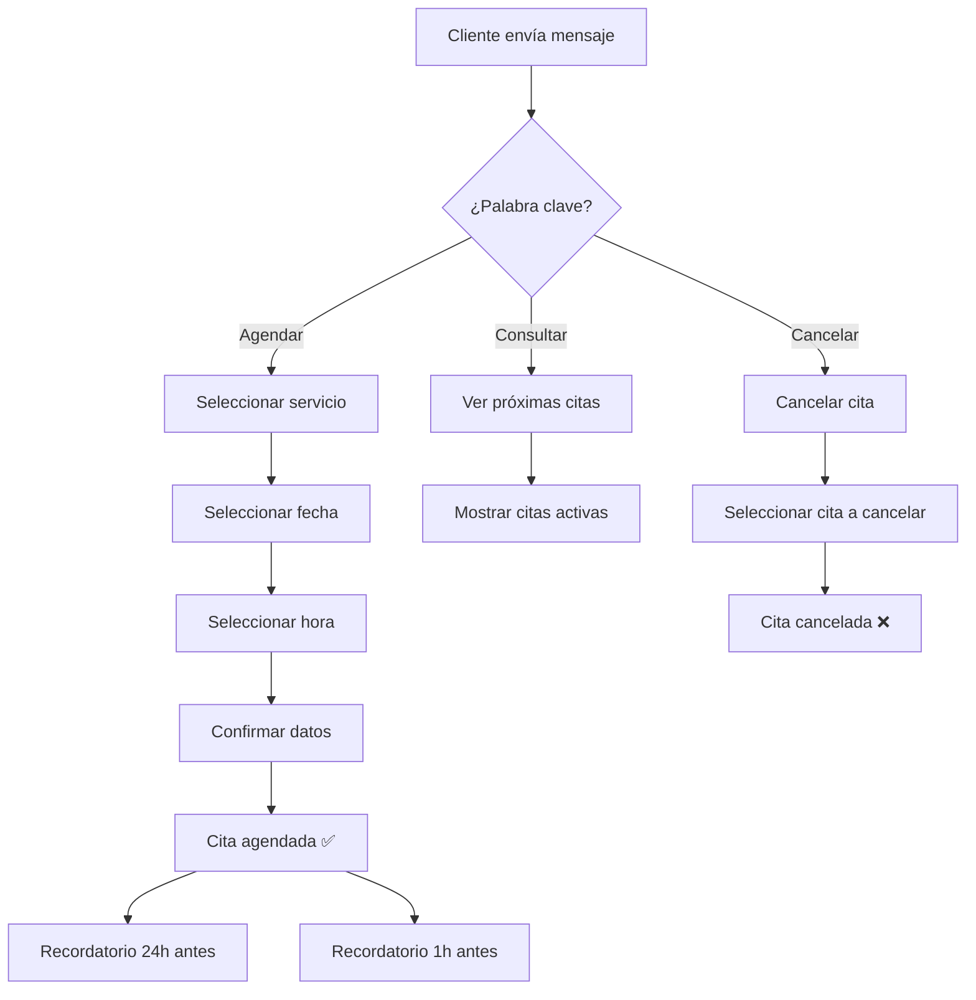

# Guía Completa para Crear Chatbots para Cualquier Industria


> Los chatbots han evolucionado más allá de simples respuestas automatizadas. Hoy son herramientas inteligentes que transforman industrias enteras. Esta guía te muestra cómo construir el chatbot perfecto para tu negocio, sin importar el sector en el que operes.


> **Última actualización (2026-04-07)**
> Guía actualizada con nuevos casos de uso reales, integración de IA generativa y mejores prácticas para 2026.

## El Mundo Versátil de los Chatbots

Los chatbots están cambiando rápidamente. Ya no son solo para conversaciones básicas o alertas simples. Hoy, estas herramientas inteligentes ayudan a muchos negocios diferentes de formas innovadoras.

En esta guía, verás cómo los chatbots resuelven problemas del mundo real. Te mostraremos por qué son tan útiles y cómo construir tu propio chatbot desde cero usando E-SMART360.


> **¿Sabías que?** Según estudios recientes, el 80% de los consumidores reportan experiencias positivas con chatbots, y el 40% busca activamente experiencias con chatbots de sus marcas favoritas.

---

## Caso de Uso 1: Asistente de Salud Nacional — NHS Reino Unido

En el sector salud, cada segundo es vital. La velocidad salva vidas. Así es como un chatbot marca la diferencia.

### ¿Para quién es?

Esta herramienta es para cualquier persona que necesite consejos médicos o quiera agendar una consulta médica.

### Cómo funciona

El NHS utiliza una herramienta llamada **"Ask A&E"**. Actúa como un asistente médico digital. Puedes hablar con ella o escribirle un mensaje. Pregunta sobre tus síntomas y ofrece consejos rápidos.

### Qué puede hacer

- Encontrar clínicas cercanas a tu ubicación
- Agendar tu próxima consulta médica
- Recordarte tomar tus medicamentos
- Dar consejos sobre salud mental
- Ayudar con reclamaciones de seguros médicos

### Por qué es especial

El bot se conecta a tus archivos médicos. Esto ayuda a los doctores a ver tu historial rápidamente y tomar las mejores decisiones para tu cuidado.

### Ejemplo real: El NHS

El NHS es el sistema de salud principal del Reino Unido. Usan un chatbot llamado **"Ask A&E"** que facilita la vida de los pacientes. Ayuda a agendar consultas y ofrece consejos claros sobre cuidados de emergencia. El Reino Unido ha destinado más de £50 millones para integrar IA en el sistema de salud, demostrando su compromiso con la tecnología para mejorar la calidad de vida.


> **Lección clave:** Los chatbots en salud no reemplazan a los médicos, pero optimizan los procesos administrativos y de triaje, permitiendo que el personal médico se concentre en casos críticos.

---

## Caso de Uso 2: Chatbot Nutricional de Nestlé

### ¿Para quién es?

Este bot es para cualquiera que quiera comer mejor. Es perfecto para personas que necesitan ideas de recetas o consejos de salud.

### Cómo funciona

Nestlé creó un chatbot llamado **Ella**. Puedes hablar con Ella o enviarle un texto. Cuéntale qué te gusta comer y qué quieres evitar. Ella te dará un plan de comidas que se ajuste a tu vida.

### Por qué es inteligente

Ella usa inteligencia artificial para aprender sobre ti. Mientras más hablas con ella, mejores son sus recomendaciones. También te envía consejos rápidos para mantenerte en camino con tu dieta.

### Uso en el mundo real

Nestlé utiliza Ella para ayudar a sus clientes a mantenerse saludables. Es un gran ejemplo de cómo una gran empresa usa tecnología para ofrecer consejos expertos desde casa.


### Salud y Bienestar

Los chatbots nutricionales pueden recomendar dietas personalizadas, llevar registro de calorías, sugerir recetas basadas en ingredientes disponibles y enviar recordatorios de hidratación.
  
### Atención Médica

Los asistentes de salud pueden programar citas, enviar recordatorios de medicamentos, realizar triaje de síntomas y conectar pacientes con especialistas según la urgencia.
  
---

## Cómo Construir tu Propio Chatbot con E-SMART360

En esta sección, recorreremos el proceso para crear un chatbot personalizado. Usaremos como ejemplo un **Generador de Documentos Legales**, asumiendo la personalidad de **Lisa**, una consultora legal que necesita este servicio.

### Paso 1: Elegir la Plataforma Adecuada

E-SMART360 es la plataforma ideal para construir chatbots sin necesidad de programar. Su constructor visual de flujos tipo **drag & drop** permite crear automatizaciones complejas en minutos.


### Accede al Panel de Control

Inicia sesión en tu cuenta de E-SMART360 y dirígete al **Gestor de Bots**. Allí encontrarás la opción de crear un nuevo bot.
  
### Planifica y Diseña las Conversaciones

Antes de construir, define los objetivos y las metas del usuario. En nuestro caso, el objetivo es claro: crear un acuerdo legal personalizado de manera eficiente.
  
### Define los Objetivos y Metas del Usuario

Pregúntate: ¿qué problema resuelve mi chatbot? ¿qué acciones debe poder realizar el usuario? Documenta estos requisitos antes de empezar.
  
### Crea un Diagrama de Flujo de Conversación

Para asegurar una interacción fluida, diseña un diagrama de flujo que describa las etapas del proceso. Para nuestro generador legal:
    
    - Tipo de Documento
    - Selección de Cláusulas
    - Información del Cliente
    - Revisión y Finalización
  
### Configura el Constructor Visual de Flujos

En E-SMART360, accede al constructor visual. Arrastra los componentes necesarios: mensajes de texto, botones interactivos, condiciones y conectores.
  
### Ejemplo de Conversación: Generador de Documentos Legales

**Persona del usuario:**
- **Nombre:** Lisa
- **Nombre del Bot:** LegalBot
- **Rol:** Generador de documentos legales con interacciones basadas en botones

**Lisa:** Hola, LegalBot. Necesito crear un acuerdo legal personalizado para un cliente.

**LegalBot:** ¡Hola Lisa! Puedo ayudarte con eso. Por favor, elige una de las siguientes opciones:

[Tipo de Documento]
[Selección de Cláusulas]
[Información del Cliente]

**Lisa:** *Hace clic en "Tipo de Documento"*

**LegalBot:** ¡Excelente, Lisa! Empecemos seleccionando el tipo de documento legal que necesitas:

[Contrato]
[Acuerdo]
[Términos y Condiciones]

**Lisa:** *Hace clic en "Contrato"*

**LegalBot:** ¡Perfecto! Ahora seleccionemos las cláusulas específicas para tu contrato:

[Cláusulas Generales]
[Cláusulas de Pago]
[Cláusulas de Confidencialidad]

**Lisa:** *Hace clic en "Cláusulas de Pago"*

**LegalBot:** Aquí tienes algunas cláusulas relacionadas con pagos que puedes incluir:

[Términos de Pago]
[Penalizaciones por Pago Tardío]
[Métodos de Pago]

**Lisa:** *Hace clic en "Términos de Pago"*

**LegalBot:** ¡Gran decisión! Ahora, proporciona la información del cliente para personalizar el contrato:

[Nombre del Cliente]
[Dirección del Cliente]
[Información de Contacto]

**Lisa:** *Proporciona la información del cliente*

**LegalBot:** Gracias, Lisa. Revisemos el borrador de tu contrato personalizado:

*Muestra el borrador del contrato con las cláusulas seleccionadas y la información del cliente*

**Lisa:** ¡Todo se ve bien! Por favor finaliza el contrato.

**LegalBot:** ¡Maravilloso! Tu contrato personalizado está listo. Puedes usar este formato para tu cliente.

*Genera un documento escrito con la información proporcionada*

**Lisa:** ¡Gracias, LegalBot! Me ahorraste mucho tiempo y esfuerzo.


> Así es como se ve el proceso de creación de bots dentro del constructor de flujos drag & drop de E-SMART360. Puedes replicar esta misma lógica para cualquier industria.

### Paso 6: Configurar Mensajes Interactivos

Los mensajes interactivos son fundamentales para mantener al usuario comprometido. En E-SMART360 puedes agregar:

- **Botones con acciones**: Responder mensaje, iniciar flujo, abrir URL
- **Listas de opciones**: Menús desplegables con múltiples selecciones
- **Mensajes multimedia**: Imágenes, videos y documentos
- **Catálogos de productos**: Para comercio electrónico


### Botones

```mermaid
    graph TD
      A[Mensaje Principal] --> B[Botón: Comprar Ahora]
      A --> C[Botón: Ver Catálogo]
      A --> D[Botón: Hablar con Agente]
      B --> E[Enlace de pago]
      C --> F[Mostrar productos]
      D --> G[Transferir a humano]
    ```
  
### Listas

```mermaid
    graph TD
      A[Mensaje Principal] --> B[Menú Desplegable]
      B --> C[Opción 1: Soporte]
      B --> D[Opción 2: Ventas]
      B --> E[Opción 3: Facturación]
    ```
  
### Paso 7: Aplicar Etiquetas para Seguimiento

Una característica poderosa de E-SMART360 es la capacidad de aplicar **etiquetas (labels)** a los usuarios según sus acciones. Esto permite:

- Segmentar usuarios por comportamiento
- Enviar mensajes de seguimiento personalizados
- Identificar leads calificados
- Medir la efectividad de cada flujo


### Etiqueta: Compra Realizada

Usuarios que completaron una compra. Enviar mensajes post-venta y programas de fidelidad.
  
### Etiqueta: Carrito Abandonado

Usuarios que mostraron interés pero no compraron. Activar secuencia de recuperación.
  
### Etiqueta: Lead Calificado

Usuarios que solicitaron información. Transferir al equipo de ventas.
  
### Paso 8: Configurar la Secuencia de Seguimiento

El seguimiento automatizado es crucial para aumentar conversiones. Aquí te mostramos cómo configurarlo:


### Identifica la Acción de Seguimiento

Cuando un usuario hace clic en "Comprar Ahora" pero no completa la compra, aplica una etiqueta de "Compra Pendiente".
  
### Conecta la Secuencia de Seguimiento

Arrastra el conector desde el botón "Comprar Ahora" y selecciona la opción "Suscribir a Secuencia" para iniciar un flujo de recordatorio.
  
### Configura el Temporizador

Establece un retardo. Por ejemplo: enviar un recordatorio si el usuario no compra dentro de 30 minutos.
  
### Define la Condición

Agrega una condición: si el usuario NO tiene la etiqueta "Compra Completada", envía el mensaje de seguimiento.
  
### Personaliza el Mensaje de Seguimiento

Ejemplo: "Hola {nombre}, notamos que dejaste productos en tu carrito. ¡Aún estás a tiempo de obtener tu descuento especial! 🎉"
  
### Repite Según sea Necesario

Puedes configurar múltiples recordatorios espaciados en el tiempo (30 min, 24 horas, 3 días) usando mensajes plantilla aprobados.
  

> **Importante:** WhatsApp permite enviar mensajes de seguimiento ilimitados dentro de la ventana de 24 horas. Después de 24 horas, solo puedes usar plantillas de mensajes pre-aprobadas. Planifica tus secuencias respetando esta regla.

---

## Integración con Plataformas de Mensajería y Web

Para obtener una comprensión completa de cómo integrar tus plataformas con E-SMART360, aquí tienes las principales integraciones disponibles:

### Integración Web

| Plataforma | Tipo de Integración | Beneficio Principal |
|---|---|---|
| Shopify | API Webhook | Notificaciones de pedidos y recuperación de carritos |
| WooCommerce | API REST | Sincronización de inventario y estados de pedido |
| WordPress | Plugin HTTP API | Formularios que disparan mensajes automáticos |
| Elementor | Webhook | Captura de leads desde formularios |

### Integración de Canales de Mensajería

| Canal | Método de Conexión | Características |
|---|---|---|
| WhatsApp Cloud API | Código QR / Embedded Signup | Chatbot oficial de Meta |
| Facebook Messenger | Facebook App | Bots con persistencia |
| Instagram DM | Instagram API | Respuestas automáticas en DMs |
| Telegram | Token de Bot | Gestión de grupos y canales |
| Webchat | Código embed | Chat en sitio web propio |

---

## Cómo Configurar un Chatbot Basado en Palabras Clave

Una de las formas más efectivas de empezar es crear un chatbot que responda a palabras clave específicas. Sigue estos pasos en E-SMART360:


### Accede al Gestor de Bots

Ve al menú **Gestor de Bots > Respuesta de Bot** en el panel de E-SMART360. Selecciona la cuenta de bot que deseas configurar y haz clic en "Crear".
  
### Nombra tu Chatbot

En el componente **Iniciar Flujo de Bot**, haz doble clic para abrir la configuración. Ponle un nombre reconocible, como "Bot de Atención al Cliente".
  
### Establece una Palabra Clave de Activación

En la misma ventana de configuración, ingresa una palabra clave para activar el bot. Por ejemplo: "Hola", "Ayuda", "Inicio".
    
    Puedes elegir entre dos modos:
    - **Coincidencia Exacta**: Solo se activa con la palabra exacta
    - **Coincidencia Parcial**: Se activa si el mensaje contiene la palabra clave (ej: "Hola, necesito ayuda" activa el bot aunque contenga más texto)
  
### Configura un Mensaje de Respuesta

Arrastra una conexión desde el conector "Siguiente" del Iniciador de Flujo. Selecciona el **Componente Interactivo**. Configura el encabezado, cuerpo y pie del mensaje. Establece un tiempo de retardo si lo deseas.
  
### Agrega Botones Interactivos

Arrastra un conector desde el socket de botones del componente interactivo. Se creará un **Componente de Botón en Línea**. Configura el texto del botón y la acción a ejecutar:
    
    - Enviar un mensaje
    - Iniciar un flujo
    - Acción predeterminada del sistema
  
### Configura el Mensaje Final y Guarda

Agrega un componente de texto para el mensaje final, configúralo y haz clic en "OK". Finalmente, presiona el botón **Guardar** en la esquina superior derecha.
  
### Prueba tu Chatbot

Abre WhatsApp, escribe la palabra clave que configuraste y observa la respuesta del bot para confirmar que funciona correctamente.
  

### Solución de problemas comunes con chatbots

**¿La palabra clave no activa respuestas?** Verifica que la palabra clave esté correctamente configurada en el componente de activación. Revisa si hay mayúsculas/minúsculas o espacios adicionales.

  **¿Los botones no aparecen?** Asegúrate de que estén correctamente vinculados a un componente interactivo. Cada botón debe tener una acción asignada.

  **¿No hay mensaje final?** Revisa que el componente de texto esté agregado y guardado después de la configuración de botones.

  **¿Los cambios no se guardan?** Siempre haz clic en el botón **Guardar** antes de salir del constructor visual de bots.

---

## Secuencias de Mensajes: Automatización Avanzada

Las secuencias de mensajes son una serie de respuestas automatizadas que se activan por acciones del usuario o eventos predefinidos. Son ideales para nurturing de leads, onboarding y campañas promocionales.

### Ideas para Secuencias de Mensajes

| Tipo de Secuencia | Propósito | Ejemplo |
|---|---|---|
| **Secuencia de Bienvenida** | Enganchar nuevos suscriptores | Serie de 3 mensajes: bienvenida, presentación de productos, oferta especial |
| **Secuencia de Soporte** | Responder preguntas frecuentes | Diagnóstico inicial → solución paso a paso → encuesta de satisfacción |
| **Secuencia de Ventas** | Guiar al cliente por el funnel | Producto gratuito → caso de éxito → demostración → descuento |
| **Secuencia Educativa** | Educar al lead | Día 1: problema; Día 2: solución; Día 3: testimonio |
| **Secuencia de Onboarding** | Ayudar al nuevo usuario | Configuración de perfil → primer uso → trucos avanzados |

### Beneficios de las Secuencias Automatizadas


### Mejora la Experiencia del Cliente

Las respuestas automáticas garantizan atención instantánea. Los usuarios reciben información relevante en el momento adecuado, sin esperas ni esfuerzo manual.
  
### Aumenta la Eficiencia Operativa

Reduce la carga de trabajo manual al automatizar tareas repetitivas. Tu equipo puede concentrarse en casos complejos mientras el bot maneja las interacciones rutinarias.
  
### Mejora las Conversiones

Las secuencias nutren leads y mejoran las tasas de conversión. Un lead que recibe 3 mensajes de seguimiento tiene 5 veces más probabilidades de comprar.
  
### Optimización Basada en Datos

Realiza un seguimiento del rendimiento y refina las secuencias según los análisis. Mide tasas de apertura, clics y conversiones para mejorar continuamente.
  
### Cómo Configurar una Campaña de Secuencia de Mensajes

1. **Crea una Nueva Secuencia**: Ve al Constructor de Flujos y selecciona "Nueva Secuencia".
2. **Configura el Nombre y el Tiempo**: Establece el nombre y configura la temporización de cada mensaje.
3. **Estructura los Mensajes**: Combina texto, multimedia y llamadas a la acción.
4. **Activa la Secuencia**: Finaliza la configuración y activa la secuencia.
5. **Monitorea y Mejora**: Analiza el rendimiento y realiza mejoras continuas.


> **Mejores prácticas para secuencias:**
- Mantén los mensajes concisos y relevantes
- Personaliza las interacciones usando datos del usuario
- Programa los mensajes estratégicamente para mantener el engagement
- Usa plantillas de mensajes pre-aprobadas para WhatsApp
- Analiza continuamente y refina las secuencias según los datos de rendimiento

---

## Del Concepto a la Creación: Pasos Clave

Para crear un chatbot exitoso, sigue estos pasos:

1. **Identifica casos de uso relevantes** para tu industria
2. **Adapta ideas versátiles** a funcionalidades prácticas
3. **Determina qué tipo de chatbot** se alinea con tu tipo de negocio
4. **Personaliza el chatbot** para cumplir con tus requisitos únicos
5. **Diseña el flujo conversacional**, el diseño y el contenido alineados con los objetivos
6. **Experimenta con nuevas funciones y tecnologías** para mejorar la experiencia del usuario


> **El futuro de los chatbots es ilimitado.** Con E-SMART360, cualquier negocio puede crear asistentes inteligentes que automaticen procesos, mejoren la atención al cliente e incrementen las ventas. La pregunta no es si deberías tener un chatbot, sino cuándo empezarás a construir el tuyo.

---

---

## Automatización de Conversaciones Complejas con Flujo de Entrada de Usuario

En el mundo digital actual, las empresas necesitan formas inteligentes de manejar las preguntas de los clientes sin saturar a sus equipos de soporte. Aquí es donde entra el **Flujo de Entrada de Usuario (User Input Flow)**.

Esta funcionalidad permite que los chatbots recopilen información, guíen al cliente paso a paso y respondan de manera natural, como si fuera una conversación real.

### ¿Qué es el Flujo de Entrada de Usuario?

El Flujo de Entrada de Usuario es una funcionalidad que permite a los chatbots recopilar respuestas de los usuarios de forma estructurada. En lugar de enviar respuestas genéricas, tu chatbot puede:

- Hacer preguntas específicas
- Almacenar las respuestas del usuario
- Usar los datos recopilados para personalizar conversaciones futuras

Esto ayuda a las empresas a automatizar el soporte, calificar leads y ofrecer un mejor servicio sin necesidad de agentes humanos todo el tiempo.

### Características Clave

- **Entrada de Usuario Dinámica**: Recopila y almacena información del cliente en tiempo real
- **Rutas de Conversación Personalizadas**: Diseña interacciones basadas en las respuestas del usuario
- **Recopilación de Datos en Tiempo Real**: Usa las entradas del cliente inmediatamente para proporcionar respuestas personalizadas

### Beneficios del Flujo de Entrada de Usuario


### Ahorra Tiempo

Reduce el trabajo manual para los equipos de soporte. Las preguntas repetitivas se automatizan completamente, liberando horas de trabajo humano cada semana.
  
### Mejora la Experiencia del Cliente

Proporciona respuestas más rápidas y precisas. Los clientes obtienen exactamente lo que necesitan sin esperar en filas de atención.
  
### Recopila Datos Valiosos

Obtén información estructurada del cliente para uso futuro. Cada conversación se convierte en datos accionables para tu negocio.
  
### Mejora Ventas y Marketing

Ayuda a calificar leads y guiarlos a través del proceso de compra. Identifica clientes potenciales calificados automáticamente.
  
### Casos de Uso del Flujo de Entrada de Usuario

| Caso de Uso | Descripción | Ejemplo Práctico |
|---|---|---|
| **Soporte al Cliente** | Guía a los usuarios paso a paso en la resolución de problemas | "¿Qué producto necesitas configurar?" → "Selecciona tu modelo" → "Sigue estos pasos" |
| **Calificación de Leads** | Pregunta detalles como nombre, presupuesto y preferencias | "¿Cuál es tu presupuesto aproximado?" → "¿Qué características buscas?" |
| **Reserva de Citas** | Automatiza la programación de servicios y reuniones | "¿Qué día prefieres?" → "¿Mañana o tarde?" → "Cita confirmada" |
| **Asistencia en E-commerce** | Recomienda productos según preferencias del usuario | "¿Para quién es el regalo?" → "¿Cuál es tu rango de precio?" → "Te recomendamos..." |

### Cómo Configurar el Flujo de Entrada de Usuario en E-SMART360


### Accede al Gestor de Bots

Inicia sesión en E-SMART360 y ve al Gestor de Bots. Selecciona tu chatbot y navega a la sección de Flujo de Entrada.
  
### Crea un Nuevo Flujo

Haz clic en "Crear" para diseñar tu flujo de entrada. Puedes agregar tantos campos como necesites: texto, números, fechas, correos electrónicos y más.
  
### Configura las Preguntas

Para cada campo, define:
    - La pregunta que se mostrará al usuario
    - El tipo de dato esperado (texto, número, email, fecha)
    - Si el campo es obligatorio u opcional
    - Validaciones personalizadas
  
### Guarda y Activa

Guarda tu flujo de entrada y actívalo. El chatbot comenzará a recopilar información de forma estructurada en cada conversación.
  
### Revisa los Datos Recopilados

Todos los datos ingresados por los usuarios están disponibles en el Gestor de Suscriptores, donde puedes exportarlos, analizarlos o usarlos para segmentación.
  
### Consejos para Optimizar el Flujo de Entrada

- **Mantenlo Simple**: Usa preguntas cortas y claras. Evita confusiones innecesarias
- **Usa Lógica Condicional**: Ajusta las respuestas del chatbot según las entradas del usuario
- **Analiza el Rendimiento**: Revisa regularmente las métricas del chatbot para mejorar las interacciones
- **Agrega Opciones de Respaldo**: Proporciona respuestas alternativas para entradas inesperadas


### Ejemplo avanzado: Flujo condicional para agendar citas

**Paso 1:** "¿Qué servicio te interesa?" → Opciones: Consulta general, Soporte técnico, Ventas
  **Paso 2 (si eligió Consulta general):** "¿Preferirías una cita en la mañana o en la tarde?"
  **Paso 2 (si eligió Soporte técnico):** "Describe brevemente tu problema técnico"
  **Paso 2 (si eligió Ventas):** "¿Cuál es el mejor número para contactarte?"
  **Paso 3:** Según la respuesta, el chatbot agenda automáticamente en el calendario correspondiente y envía confirmación.

---

## Estrategias Avanzadas de Automatización

### Recuperación de Carritos Abandonados

Una de las aplicaciones más rentables de los chatbots es la recuperación de carritos abandonados en comercio electrónico.


### Detecta el Abandono

Cuando un cliente agrega productos al carrito pero no completa la compra, tu tienda (Shopify, WooCommerce) envía un webhook a E-SMART360.
  
### Activa el Chatbot

El chatbot envía un mensaje personalizado: "¡Hola! Vimos que dejaste productos en tu carrito. ¿Te ayudo a completar tu compra?"
  
### Ofrece un Incentivo

Puedes configurar el bot para que ofrezca un descuento exclusivo o envío gratis para motivar la compra.
  
### Seguimiento Automatizado

Si el usuario no responde en 30 minutos, el bot envía un segundo recordatorio. Si responde que sí, redirige al checkout.
  
### Registra la Conversión

Cuando la compra se completa, el bot agradece al cliente y ofrece productos complementarios o un programa de fidelidad.
  

> **Estadística clave:** Las campañas de recuperación de carritos abandonados a través de WhatsApp pueden recuperar entre un 15% y un 30% de las ventas perdidas, generando ingresos adicionales significativos sin inversión publicitaria extra.

### Notificaciones Automáticas de Pedidos

Mantén a tus clientes informados en cada etapa del proceso de compra:

| Evento | Tipo de Notificación | Ejemplo de Mensaje |
|---|---|---|
| **Pedido Confirmado** | Automática inmediata | "¡Gracias por tu compra {nombre}! Tu pedido #{id} está siendo preparado." |
| **Pedido Enviado** | Automática con tracking | "¡Tu pedido ya está en camino! 🚚 Número de seguimiento: {tracking}" |
| **Pedido Entregado** | Automática + encuesta | "¿Cómo llegó tu pedido? Califica tu experiencia del 1 al 5" |
| **Carrito Abandonado** | Secuencia programada | "¡No olvides tus productos! Usa el código REENGANCHE10 y obtén 10% OFF" |

### Exportación de Flujos de Chatbot

E-SMART360 te permite exportar tus flujos de chatbot completos para compartirlos con tu equipo, hacer copias de seguridad o migrarlos a otras cuentas.


### Selecciona el Flujo

En el Gestor de Bots, localiza el flujo que deseas exportar.
  
### Haz Clic en Exportar

Usa la opción de exportación disponible en el menú de acciones del flujo.
  
### Descarga el Archivo

El sistema generará un archivo con la configuración completa del flujo, incluyendo mensajes, condiciones, botones y conexiones.
  
### Importa en Otra Cuenta

Puedes importar este archivo en cualquier otra cuenta de E-SMART360 para replicar el mismo flujo sin tener que reconstruirlo desde cero.
  
---

## Caso de Uso Adicional: Sistema de Reserva de Citas Profesional

Imagina un consultorio médico, una clínica dental o un centro de estética que necesita gestionar citas de forma eficiente.

### Flujo Completo del Sistema de Citas



### Pasos de Implementación


### Configura el Catálogo de Servicios

Define los servicios disponibles con duración, precio y descripción. Por ejemplo: "Consulta general - 30 min - $50", "Limpieza dental - 45 min - $80".
  
### Crea el Flujo de Reserva

Usa el constructor visual para crear el flujo: palabra clave "Agendar" → selección de servicio → selección de fecha → selección de hora → confirmación.
  
### Integra con el Calendario

Conecta E-SMART360 con Google Calendar o cualquier calendario vía API para verificar disponibilidad en tiempo real y bloquear espacios reservados.
  
### Configura Recordatorios Automáticos

Programa recordatorios automáticos: 24 horas antes y 1 hora antes de la cita. Reduce las tasas de inasistencia hasta en un 60%.
  
### Agrega Seguimiento Post-Cita

Después de la cita, envía automáticamente una encuesta de satisfacción y una invitación a agendar la próxima visita.
  

> **Personalización avanzada:** Puedes usar etiquetas para segmentar pacientes por tipo de tratamiento, frecuencia de visitas o seguro médico. Esto permite enviar promociones específicas como "Chequeo anual: 20% de descuento para pacientes de cardiología".

---

## Consejos Adicionales de Prueba y Optimización

Antes de lanzar tu chatbot al público, realiza pruebas exhaustivas:


### Prueba de Humo

Verifica que todas las rutas principales funcionen correctamente. Recorre cada flujo como si fueras un usuario nuevo.
  
### Prueba de Casos Límite

¿Qué pasa si el usuario escribe algo inesperado? ¿Si envía una imagen en lugar de texto? ¿Si no responde en 24 horas?
  
### Prueba de Carga

Simula múltiples conversaciones simultáneas para asegurarte de que el sistema responda sin demoras.
  
### Revisión de Analíticas

Después del lanzamiento, monitorea métricas clave: tasa de conversión, abandonos en cada paso, respuestas más comunes y tiempo promedio de conversación.
  
### Iteración Continua

Usa los datos recopilados para refinar el flujo. Agrega nuevas rutas basadas en preguntas frecuentes que los usuarios estén haciendo.
  

### Checklist de pre-lanzamiento para tu chatbot

- [ ] Todas las palabras clave están configuradas correctamente
  - [ ] Los botones interactivos redirigen a las acciones correctas
  - [ ] Las condiciones y ramificaciones están validadas
  - [ ] Los mensajes de error o "no entendí" están definidos
  - [ ] La integración con WhatsApp Cloud API está activa
  - [ ] Las plantillas de mensajes están aprobadas (si aplica)
  - [ ] Los webhooks de conexión con e-commerce funcionan
  - [ ] Las etiquetas de seguimiento se aplican correctamente
  - [ ] El equipo de soporte sabe cómo retomar conversaciones humanas
  - [ ] Se ha configurado una estrategia de escalamiento a agente humano

---

## El Futuro de los Chatbots: Posibilidades Ilimitadas

En un estudio reciente realizado por la plataforma de marketing de ubicación Uberall, se revelaron estadísticas reveladoras sobre las percepciones de los consumidores sobre los chatbots:

- **80%** de los consumidores reportaron experiencias positivas con chatbots
- **40%** expresó interés en experiencias con chatbots de marcas
- **38%** cree que las marcas deberían utilizar chatbots para ofertas, cupones y promociones

El futuro de los chatbots apunta hacia:

| Tendencia | Impacto Previsto | Horizonte Temporal |
|---|---|---|
| **IA Generativa en Chatbots** | Respuestas más naturales y contextuales | Ya disponible |
| **Chatbots Multimodales** | Interacción por texto, voz e imagen | 2026-2027 |
| **Automatización Hiperpersonalizada** | Experiencias únicas para cada usuario | 2026-2028 |
| **Integración con IoT** | Bots que controlan dispositivos inteligentes | 2027-2030 |
| **Agentes Autónomos** | Bots que toman decisiones sin supervisión humana | 2027-2029 |


> **Dato relevante:** El mercado global de chatbots está proyectado a alcanzar los $15.5 mil millones para 2028, con una tasa de crecimiento anual compuesta del 23.3%. Las industrias de comercio electrónico, salud y servicios financieros lideran la adopción.

---

## Integración de IA para Respuestas Inteligentes

Una de las funcionalidades más potentes de E-SMART360 es la capacidad de integrar inteligencia artificial para respuestas naturales y contextuales.


### Entrena tu Asistente de IA

Puedes entrenar a tu agente de IA con:
    
    - **Archivos PDF y documentos**: Sube manuales, catálogos o políticas
    - **URLs**: Enlaza páginas web con información relevante
    - **Preguntas Frecuentes**: Importa tu base de FAQs
    - **Google Sheets**: Sincroniza datos desde hojas de cálculo
  
### Configura Respuestas con Contexto

El asistente de IA analiza el mensaje del usuario, busca en las fuentes de conocimiento configuradas y genera una respuesta natural y contextualizada, como si un agente humano estuviera respondiendo.
  
### Combina Flujos con IA

Puedes crear flujos híbridos: usa botones y menús para opciones estructuradas, y deriva a la IA para preguntas abiertas o conversaciones no lineales.
  
### Monitorea y Mejora

Revisa las conversaciones donde intervino la IA, ajusta las fuentes de conocimiento y refina las respuestas para mejorar la precisión con el tiempo.
  


#### Ejemplo de Configuración de IA

```json
  {
    "fuentes_conocimiento": [
      {"tipo": "url", "valor": "https://esmart360.com/ayuda/politicas"},
      {"tipo": "pdf", "valor": "manual-producto.pdf"},
      {"tipo": "faq", "valor": "preguntas-frecuentes.json"}
    ],
    "comportamiento": {
      "tono": "profesional",
      "idioma": "es",
      "transferir_humano": true,
      "limite_confianza": 0.7
    }
  }
  ```
  
---

## Preguntas Frecuentes

<Expandable title="¿Qué industrias se benefician más de los chatbots?"
Los chatbots benefician a muchas industrias, incluyendo comercio minorista, salud, finanzas, educación y servicio al cliente. Mejoran el engagement, automatizan tareas rutinarias y reducen los tiempos de respuesta. Sectores como el comercio electrónico, la banca y los seguros han visto aumentos de hasta un 40% en eficiencia operativa tras implementar chatbots.

<Expandable title="¿Cuál es el beneficio de un constructor de chatbots sin código?"
Un constructor sin código permite a los dueños de negocio crear flujos de automatización complejos visualmente, sin necesidad de contratar desarrolladores. Esto reduce significativamente el costo y el tiempo de lanzamiento. Con E-SMART360, puedes tener un chatbot funcional en cuestión de horas, no de semanas.

<Expandable title="¿Cómo ayudan los chatbots en los sectores de salud y legal?"
En salud, gestionan agendamiento de citas, recordatorios de medicamentos y triaje de síntomas. En el sector legal, manejan preguntas iniciales, automatizan la recolección de documentos y generan borradores de contratos. Ambos sectores se benefician de la reducción de carga administrativa y la mejora en la experiencia del paciente/cliente.

<Expandable title="¿Cuáles son los pasos básicos para construir un chatbot?"
Los pasos básicos son: 1) Definir objetivos, 2) Seleccionar la plataforma (como E-SMART360), 3) Diseñar los flujos de conversación, 4) Integrar con los canales deseados (WhatsApp, Messenger, etc.), 5) Probar exhaustivamente, 6) Monitorear el rendimiento y 7) Optimizar continuamente basándose en datos.

<Expandable title="¿Puedo personalizar el tiempo de los mensajes en secuencia?"
Sí, E-SMART360 te permite configurar retardos y horarios específicos para cada mensaje en una secuencia. Puedes programar mensajes para que se envíen minutos, horas o días después de una acción del usuario. Esto es ideal para secuencias de nurturing que respetan el ritmo natural del cliente.

<Expandable title="¿Necesito plantillas de mensajes aprobadas para secuencias en WhatsApp?"
Sí, para mensajes enviados fuera de la ventana de 24 horas, WhatsApp requiere el uso de plantillas de mensajes pre-aprobadas. E-SMART360 te permite gestionar todo el proceso de creación y envío de estas plantillas directamente desde el panel. Dentro de la ventana de 24 horas, puedes enviar mensajes libres sin restricciones.

---

## Ejemplos Prácticos Adicionales


### Chatbot para Restaurante

**Caso:** Un restaurante local quiere automatizar reservas y pedidos para llevar.
    
    **Solución con E-SMART360:**
    - Bot con palabras clave: "Menú", "Reservar", "Pedir"
    - Flujo interactivo: selección de platos, personalización de ingredientes, confirmación de pedido
    - Integración con WhatsApp Pay para pagos
    - Secuencia de seguimiento: encuesta post-comida y oferta de fidelidad
    - Resultado: 35% más reservas y 50% menos llamadas telefónicas
  
### Chatbot para Inmobiliaria

**Caso:** Una agencia inmobiliaria quiere calificar leads automáticamente.
    
    **Solución con E-SMART360:**
    - Chatbot en webchat y WhatsApp
    - Preguntas iniciales: presupuesto, zona, tipo de propiedad
    - Etiquetado automático: "Lead Caliente", "Lead Frío", "Requiere Llamada"
    - Envío de catálogos de propiedades según preferencias
    - Programación automática de visitas
    - Resultado: 60% más leads calificados y reducción de 70% en tiempo de calificación manual
  
---

## Conclusión

Los chatbots se han convertido en herramientas versátiles con aplicaciones reales que abarcan salud, nutrición, atención al cliente, servicios legales y muchas otras industrias. Su impacto transformador demuestra su potencial para optimizar procesos, proporcionar asistencia personalizada y mejorar la experiencia general del usuario.

Con E-SMART360, cualquier negocio puede construir su propio chatbot personalizado sin necesidad de conocimientos técnicos avanzados. La plataforma ofrece:

- Constructor visual de flujos drag & drop
- Integración con múltiples canales de mensajería
- Capacidades de IA para respuestas inteligentes
- Secuencias automatizadas de seguimiento
- Etiquetado y segmentación de usuarios
- Analíticas en tiempo real


> **Comienza hoy tu viaje con chatbots.** Explora E-SMART360 y descubre el potencial de la automatización inteligente para tu negocio. Ya sea que estés en salud, nutrición, atención al cliente o servicios legales, los chatbots tienen un papel que desempeñar en la optimización de tus operaciones.
