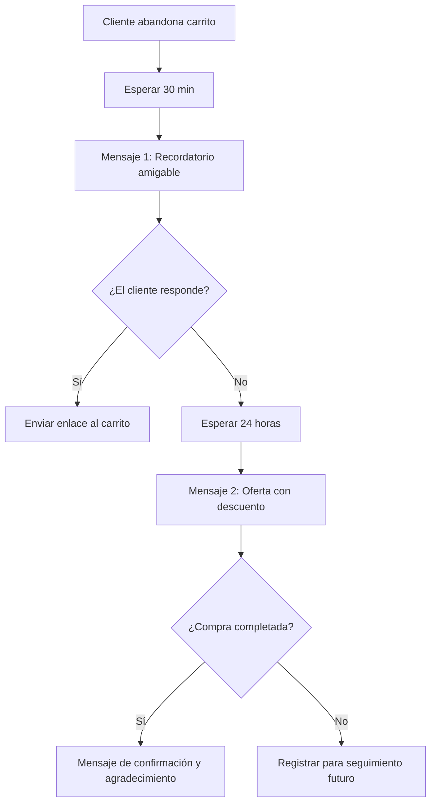

# Guía Completa de Chatbots para Cualquier Industria: Cómo Construir el Tuyo con E-SMART360

Los chatbots están cambiando rápidamente. Ya no son solo para conversaciones básicas o alertas simples. Hoy en día, estas herramientas inteligentes ayudan a muchos negocios diferentes de formas innovadoras.

En esta guía, descubrirás cómo los chatbots resuelven problemas del mundo real. Te mostraremos por qué son tan útiles y aprenderás a construir tu propio chatbot desde cero utilizando la plataforma de E-SMART360.

> **TL;DR:** Ha llegado el momento de los chatbots personalizados. El progreso empresarial a través de chatbots que responden de manera genérica y uniforme es cuestionable. Para que un bot realmente impulse el crecimiento, debe hablar el "lenguaje comercial" único de tu industria. Esta guía te muestra exactamente cómo lograrlo.

---

## El Versátil Mundo de los Chatbots

> Los chatbots modernos no son simples automatizaciones. Son asistentes digitales capaces de transformar industrias enteras al proporcionar respuestas personalizadas, recopilar datos y ejecutar flujos de trabajo complejos sin intervención humana.

### ¿Qué hace que un chatbot sea realmente versátil?

Un chatbot versátil se adapta al contexto de cada industria. No se limita a respuestas predefinidas, sino que:

- **Entiende el lenguaje específico del sector**: términos médicos, jurídicos, financieros o de ventas.
- **Se integra con sistemas existentes**: CRM, pasarelas de pago, catálogos de productos.
- **Ofrece múltiples canales**: WhatsApp, Facebook Messenger, Instagram, Telegram y chat web.
- **Escala según la demanda**: desde atender a 10 clientes hasta 10,000 sin perder calidad.

### 🏥 Salud

Gestión de citas, recordatorios de medicación, triaje de síntomas y seguimiento de pacientes. Los chatbots en salud reducen tiempos de espera hasta en un 60%.
  
### 🛒 Comercio Electrónico

Recuperación de carritos abandonados, notificaciones de pedidos, recomendaciones de productos y atención al cliente 24/7. Incrementan las conversiones hasta un 30%.
  
### ⚖️ Servicios Legales

Generación de documentos, recopilación de información de clientes, programación de consultas y seguimiento de casos. Ahorran horas de trabajo administrativo.
  
### 🍔 Alimentación y Nutrición

Planes de comidas personalizados, recomendaciones dietéticas, seguimiento de objetivos nutricionales y recetas basadas en preferencias del usuario.
  
---

## Caso de Uso 1: El Asistente Nacional de Salud del NHS (Reino Unido)

> En el sector salud, cada segundo es vital. La velocidad salva vidas. Así es como un chatbot ayuda a millones de pacientes en el Reino Unido.

### ¿Para quién es?

Esta herramienta es para cualquier persona que necesite consejos de salud o quiera reservar una visita al médico.

### Cómo funciona

El NHS utiliza una herramienta llamada **"Ask A&E"**. Actúa como un asistente médico digital. Puedes hablar con ella o escribir un mensaje. Pregunta sobre tus síntomas y proporciona consejos rápidos.

### Qué puede hacer

### Funciones

- Encontrar clínicas cercanas
    - Reservar tu próxima visita
    - Recordarte tomar tu medicación
    - Dar consejos sobre salud mental
    - Ayudar con reclamaciones de seguros
  
### Beneficios

- Reduce la carga en salas de emergencia
    - Proporciona acceso 24/7 a información médica
    - Disminuye la ansiedad del paciente
    - Mejora la eficiencia del personal médico
  
### Por qué es especial

El bot se conecta a tus archivos médicos. Esto ayuda a los doctores a ver tu historial rápidamente y tomar las decisiones correctas para tu cuidado.

### Ejemplo real: El NHS

El NHS es el servicio de salud principal del Reino Unido. Usan **"Ask A&E"** para facilitar la experiencia de los pacientes. Ayuda a reservar visitas y proporciona consejos claros sobre cuidados de emergencia. Reduce el estrés de obtener ayuda médica.

El Reino Unido está invirtiendo fuertemente en tecnología sanitaria. Reportes recientes muestran que destinaron más de £50 millones para IA, actualizando el NHS y demostrando su compromiso con la innovación para mejorar la calidad de vida.

> **Lección clave:** Un chatbot en salud no solo automatiza tareas — puede salvar vidas al dirigir a los pacientes al lugar correcto en el momento adecuado.

---

## Caso de Uso 2: Chatbot de Nutrición de Nestlé

> La nutrición personalizada es uno de los campos donde los chatbots muestran su máximo potencial. Nestlé lo demostró con su asistente Ella.

### ¿Para quién es?

Este bot es para cualquier persona que quiera comer mejor. Es perfecto para quienes necesitan ideas de recetas o consejos de salud.

### Cómo funciona

Nestlé creó un chatbot llamado **Ella**. Puedes hablar con Ella o enviarle un texto. Le dices qué te gusta comer y qué quieres evitar. Ella te da un plan de comidas que se adapta a tu vida.

### Por qué es inteligente

Ella usa IA para aprender de ti. Mientras más hablas con ella, mejores son sus consejos. También envía consejos rápidos para ayudarte a mantenerte en camino con tu dieta.

### Uso en el mundo real

Nestlé usa Ella para ayudar a sus clientes a mantenerse saludables. Es un gran ejemplo de cómo una gran empresa usa la tecnología para dar consejos expertos desde casa.

> **Para tu negocio:** Así como Nestlé personaliza la nutrición, tu empresa puede personalizar la experiencia de cada cliente. Un chatbot entrenado con los datos correctos ofrece recomendaciones que ningún ser humano podría dar a escala.

---

## Caso de Uso 3: Generador de Documentos Legales — Construyendo tu Chatbot con E-SMART360

En esta sección, recorreremos el proceso de creación de un **Generador de Documentos Legales** personalizado usando E-SMART360. Asumiré la personalidad de **Lisa**, una consultora legal que necesita este servicio.

### Pasos para construir tu chatbot

### Elegir la plataforma adecuada

El primer paso para aprovechar el poder de LegalBot (el nombre de tu bot) es elegir el constructor de chatbots adecuado. En este caso, usaremos E-SMART360 por su potente constructor de flujos visual drag & drop y su soporte multicanal.
  
### Planificar y diseñar las conversaciones

Antes de comenzar a crear el chatbot, es esencial definir tus objetivos y las metas del usuario. En este caso, el objetivo es claro: crear un acuerdo legal personalizado de manera eficiente.
  
### Definir objetivos y metas del usuario

- **Objetivo principal:** Generar documentos legales personalizados
    - **Usuarios:** Consultores legales como Lisa
    - **Canal principal:** WhatsApp o chat web
  
### Crear un diagrama de flujo de conversación

Para asegurar una interacción fluida con LegalBot, colabora con E-SMART360 para crear un diagrama de flujo. Este diagrama describe las etapas de creación del documento:
    
    - Tipo de Documento
    - Selección de Cláusulas
    - Información del Cliente
    - Revisión y Finalización
  
### Configurar el bot en el constructor visual

Usa el **Visual Flow Bot Builder** de E-SMART360 para arrastrar y soltar componentes que formarán la conversación.
  
### Simulación de la conversación

**Persona del Usuario:**
- Nombre: Lisa
- Nombre del Bot: LegalBot
- Rol: Generador de documentos legales con interacciones basadas en botones

**Lisa:** Hola, LegalBot. Necesito crear un acuerdo legal personalizado para un cliente.

**LegalBot:** ¡Hola Lisa! Puedo ayudarte con eso. Por favor elige una de las siguientes opciones:

[Tipo de Documento] [Selección de Cláusulas] [Información del Cliente]

**Lisa:** [Hace clic en "Tipo de Documento"]

**LegalBot:** ¡Excelente, Lisa! Comencemos seleccionando el tipo de documento legal que necesitas. Por favor elige entre las siguientes opciones:

[Contrato] [Acuerdo] [Términos y Condiciones]

**Lisa:** [Hace clic en "Contrato"]

**LegalBot:** ¡Excelente elección! Ahora pasemos a seleccionar las cláusulas específicas para tu contrato. Elige entre las siguientes categorías:

[Cláusulas Generales] [Cláusulas de Pago] [Cláusulas de Confidencialidad]

**Lisa:** [Hace clic en "Cláusulas de Pago"]

**LegalBot:** ¡Perfecto! Aquí tienes algunas cláusulas relacionadas con pagos que puedes incluir en tu contrato:

[Términos de Pago] [Penalizaciones por Pago Tardío] [Métodos de Pago]

**Lisa:** [Hace clic en "Términos de Pago"]

**LegalBot:** ¡Gran decisión, Lisa! Ahora, recopilemos información específica del cliente para personalizar el contrato. Por favor proporciona los siguientes datos:

[Nombre del Cliente] [Dirección del Cliente] [Información de Contacto]

**Lisa:** [Proporciona la información del cliente]

**LegalBot:** Gracias, Lisa. Tenemos toda la información necesaria. Revisemos el borrador de tu contrato personalizado:

[Muestra el borrador del contrato con las cláusulas seleccionadas y la información del cliente]

**Lisa:** ¡Todo se ve bien! Por favor finaliza el contrato.

**LegalBot:** ¡Maravilloso! Tu contrato personalizado está listo. Puedes usar este formato para tu cliente.

[Genera un documento escrito con la información proporcionada]

**Lisa:** ¡Gracias, LegalBot! Esto me ahorró mucho tiempo y esfuerzo.

> Así es como se ve el proceso de creación del bot para un Generador de Documentos Legales dentro del constructor de flujos drag & drop de E-SMART360. La misma lógica puede aplicarse a cualquier tipo de documento o servicio.

---

## Construye tu Propio Chatbot Paso a Paso con E-SMART360

Ahora que has visto ejemplos inspiradores, es momento de construir el tuyo. Sigue esta guía práctica.

### 1. Accede al Gestor de Bots

1. Ve al panel de control de E-SMART360
2. Navega al menú **Gestor de Bots**
3. Selecciona la cuenta de bot que deseas configurar
4. Haz clic en **Respuesta del Bot** para continuar

### 2. Crea un Nuevo Chatbot

1. Haz clic en el botón **Crear** en la configuración de Respuesta del Bot
2. Aparecerá el **Visual Flow Bot Builder** — el lienzo donde construirás toda la lógica de tu chatbot

### 3. Nombra tu Chatbot

1. Localiza el componente **Iniciar Flujo del Bot**
2. Haz doble clic para abrir la ventana de configuración
3. Ingresa un nombre descriptivo en el campo Título
4. Opcionalmente, elige una etiqueta y selecciona una secuencia

> Usa nombres descriptivos como "LegalBot", "AsistenteSalud" o "BotVentas" para identificar fácilmente cada chatbot en tu panel.

### 4. Configura una Palabra Clave de Activación

1. En la ventana de configuración, ingresa una palabra clave para activar el bot (ej. "Hola", "HolaLegal", "Empezar")
2. Elige el tipo de coincidencia:
   - **Coincidencia Exacta**: el bot solo se activa con esa palabra específica
   - **Coincidencia de Cadena**: el bot se activa con cualquier frase que contenga esa palabra

### 5. Configura un Mensaje de Respuesta

1. Arrastra una conexión desde la salida **Siguiente** del componente Iniciar Flujo
2. Suéltala en el lienzo para ver las opciones de componentes disponibles
3. Selecciona el **Componente Interactivo**
4. Haz doble clic para abrir la ventana de configuración
5. Completa el Encabezado, Cuerpo y Pie del mensaje (el cuerpo es obligatorio)
6. Configura un tiempo de demora si es necesario

> El componente interactivo es el corazón de tu chatbot. Aquí defines cómo se comunica con tus clientes y qué opciones les presentas.

### 6. Agrega Botones Interactivos

1. Arrastra un conector desde la salida de botones del Componente Interactivo
2. Aparecerá un **Componente de Botón en Línea**
3. Haz doble clic e ingresa el texto del botón
4. Selecciona la acción al hacer clic:
   - Enviar un Mensaje
   - Iniciar un Flujo
   - Acción de Botón por Defecto
5. Repite el proceso para agregar más botones

### 7. Configura el Mensaje Final y Guarda

1. Selecciona el **Componente de Texto** para el mensaje final
2. Configura el mensaje y haz clic en Aceptar
3. Guarda toda la configuración del bot con el botón **Guardar** (esquina superior derecha)

### 8. Prueba tu Chatbot

1. Abre WhatsApp, Messenger o el canal que hayas configurado
2. Escribe la palabra clave que configuraste
3. Observa la respuesta del chatbot para confirmar que funciona correctamente

> **Importante:** Siempre realiza pruebas exhaustivas antes de lanzar tu chatbot al público. Verifica cada flujo, cada botón y cada mensaje para asegurar una experiencia de usuario impecable.

---

## Entrenando tu Chatbot con Inteligencia Artificial

Una de las capacidades más poderosas de E-SMART360 es el **Entrenamiento de Asistente IA**. Puedes enseñar a tu chatbot a responder preguntas complejas usando diferentes fuentes de información.

### Cómo entrenar a tu Asistente IA

### Con FAQs

### Crear una campaña de entrenamiento IA

Ve a Panel de Control > Configuración > Campaña de Entrenamiento IA. Haz clic en Crear para empezar una nueva campaña. Ingresa un nombre y un mensaje de instrucción. Ajusta el mensaje por defecto para definir el rol y tono del bot. Guarda para continuar.
      
### Elegir modo de entrenamiento

- **Resumen:** Proporciona respuestas ricas y contextuales, consume más tokens
        - **FAQs:** Económico y estructurado para respuestas rápidas
      
### Cargar contenido FAQ

Sube tu contenido en el formato requerido y guarda. El chatbot aprenderá de estas preguntas y respuestas frecuentes.
      

### Con URL

### Agregar URL de entrenamiento

Haz clic en Nuevo bajo entrenamiento por URL. Ingresa la URL de la campaña que contiene la información que deseas enseñar.
      
### Configurar selector

Elige un Tipo de Selector (ID o Clase) basado en la estructura de la página web. Opcionalmente, elimina contenido innecesario como anuncios o encabezados.
      
### Generar respuestas

Haz clic en Generar FAQ o Generar Respuesta Cruda, luego guarda. El chatbot ahora conoce el contenido de esa página web.
      

### Con Archivos

### Subir archivo

Navega a Configuración de Archivos y haz clic en Nuevo. Sube un archivo PDF, Word (.doc) o TXT con la documentación que deseas enseñar.
      
### Elegir modo de procesamiento

- **Respuesta Cruda:** Proporciona una respuesta completa y detallada (mayor uso de tokens)
        - **FAQ:** Divide el contenido en FAQs estructuradas (menor uso de tokens)
      
### Guardar y finalizar

Guarda el archivo y finaliza el entrenamiento. El chatbot ahora tiene acceso a todo el conocimiento de ese documento.
      

### Configuración del Comportamiento del Chatbot IA

Una vez que has entrenado a tu asistente, es importante configurar cómo responde:

1. **Configuración de Respuesta Sin Coincidencia:**
   - Ve a Gestor de Bots > Botones de Acción > Sin Coincidencia
   - Selecciona Respuesta IA y enlaza la campaña entrenada
   - Activa Respuesta Sin Coincidencia bajo Configuración
   - Guarda la configuración

2. **Habilitar el Asistente IA:**
   - Ve a Gestor de Bots
   - Activa el interruptor de Asistente IA
   - Selecciona la campaña deseada
   - Elige el modo de respuesta:
     - **Asistente IA para Todas las Consultas:** la IA maneja todas las preguntas
     - **IA solo como Respaldo:** la IA interviene cuando las reglas predefinidas fallan

> La combinación de un chatbot basado en reglas con un Asistente IA ofrece lo mejor de ambos mundos: respuestas rápidas para consultas comunes y respuestas inteligentes para preguntas complejas.

### Beneficios de usar un Asistente IA en tu Chatbot

### 🌐 Soporte Multicanal

Funciona en WhatsApp, Messenger, Instagram, Telegram y sitios web desde una sola plataforma.
  
### ⏰ Disponibilidad 24/7

Asegura atención al cliente las 24 horas del día, los 7 días de la semana, sin descansos ni fines de semana.
  
### 🎯 Respuestas Personalizadas

Interacciones impulsadas por IA adaptadas a las necesidades específicas de cada cliente.
  
### 💰 Rentable y Escalable

Automatiza el soporte sin costos adicionales de personal. Escala de 10 a 10,000 conversaciones sin problemas.
  
---

## Construyendo Chatbots de Seguimiento Automático

Otra aplicación poderosa es el **chatbot de seguimiento automático**. Este sistema envía mensajes de recordatorio a usuarios que han interactuado con tu chatbot pero no han completado una acción deseada, como realizar una compra.

### ¿Qué es un Chatbot de Seguimiento?

Un chatbot de seguimiento es un sistema automatizado que envía mensajes de recordatorio a usuarios que han interactuado previamente pero no han completado una acción como comprar o registrarse.

### ¿Por qué usar un Sistema de Seguimiento Automatizado?

- Ahorra tiempo automatizando recordatorios
- Aumenta las ventas y conversiones
- Asegura que los usuarios no olviden tu oferta
- Funciona 24/7 sin esfuerzo manual

### Cómo Construir tu Chatbot de Seguimiento

### Crear el flujo del chatbot

1. Ve a Panel de Control > Gestor de Bots > Respuesta del Bot > Crear
    2. Nombra el chatbot, por ejemplo "BotSeguimiento"
    3. Guarda el chatbot y asegúrate de que se active cuando un usuario interactúe con un mensaje relacionado con un producto
  
### Configurar mensajes interactivos

1. Agrega un bloque interactivo a tu chatbot
    2. Crea un mensaje como: _"¿Te interesaría nuestro producto?"_ con botones Sí y No
    3. Si el usuario selecciona Sí, proporciónale un enlace de pago
    4. Si selecciona No, finaliza la conversación u ofrece asistencia
  
### Aplicar etiquetas para rastrear acciones

1. Cuando un usuario haga clic en "Comprar Ahora", aplica una etiqueta llamada "ComprarAhora"
    2. Si el usuario no hace clic en el botón, no recibe esta etiqueta
    3. Usa esta etiqueta para determinar quién necesita un recordatorio de seguimiento
  
### Configurar la secuencia de seguimiento

1. Arrastra el conector desde el botón "Comprar Ahora" a una nueva secuencia de seguimiento
    2. Configura la secuencia para enviar un recordatorio si el usuario no compra en 30 minutos
    3. Agrega una condición para verificar si seleccionaron el botón "Comprar Ahora"
    4. Si es Falso, envía el mensaje de seguimiento con el botón de compra
    5. Puedes repetir el proceso para enviar múltiples recordatorios
  

> **¿Sabías que...?** Los chatbots de seguimiento pueden aumentar las tasas de conversión hasta en un 25% simplemente recordando a los clientes potenciales que vuelvan a tu oferta.

### Programación Estratégica de Mensajes

Para maximizar el compromiso sin molestar a los usuarios:

- WhatsApp permite enviar mensajes de seguimiento ilimitados dentro de 24 horas
- Después de 24 horas, solo se pueden enviar mensajes con plantilla pre-aprobada
- Programa tus recordatorios estratégicamente para evitar saturar a los usuarios

> El exceso de mensajes de seguimiento puede resultar en que los usuarios bloqueen tu número o reporten tu cuenta. Encuentra el equilibrio adecuado entre persistencia y respeto.

---

## Integraciones para Potenciar tu Chatbot

La versatilidad de tu chatbot se multiplica cuando lo conectas con otras herramientas de tu negocio.

### Integración Web

Para una comprensión completa de cómo integrar tus plataformas con E-SMART360:

- **Shopify:** Recibe notificaciones de pedidos, recupera carritos abandonados y gestiona inventario directamente desde WhatsApp o Messenger.
- **WooCommerce:** Automatiza notificaciones de cambio de estado de pedidos, verifica pedidos contra reembolso y muestra productos en el chat.
- **WordPress:** Conecta tu sitio web con WhatsApp a través de la integración HTTP API para enviar notificaciones automáticas.

### Integración con Plataformas de Mensajería

- **WhatsApp Cloud API:** Configura fácilmente la API oficial de WhatsApp Business para crear experiencias de chat robustas y confiables.
- **Telegram:** Crea bots para Telegram y conéctalos para gestionar grupos y enviar mensajes masivos.
- **Facebook Messenger:** Configura chatbots para Messenger con menús persistentes y secuencias de mensajes.

### ⚡ Zapier

Conecta E-SMART360 con más de 3000 aplicaciones. Automatiza flujos de trabajo completos sin escribir una sola línea de código.
  
### 🔗 Webhook Workflow

Transforma la comunicación empresarial en WhatsApp para lograr una excelencia operativa y un compromiso del cliente sin interrupciones.
  
### 📋 WhatsApp Flows

Crea formularios interactivos directamente dentro de los chats de WhatsApp para recopilar información sin que el usuario salga de la conversación.
  
---

## Pruebas y Refinamiento

> **¡Prueba, Prueba, Prueba!** Antes de lanzar tu bot al público, realiza pruebas exhaustivas para garantizar interacciones fluidas y una generación de documentos precisa.

### Checklist de Pruebas

1. **Prueba de palabras clave:** Verifica que cada palabra clave dispare la respuesta correcta
2. **Prueba de flujo:** Recorre cada posible camino de conversación
3. **Prueba de botones:** Confirma que todos los botones funcionen y lleven al destino correcto
4. **Prueba de errores:** Simula respuestas inesperadas para ver cómo las maneja
5. **Prueba de integración:** Verifica que las conexiones con sistemas externos funcionen
6. **Prueba de carga:** Asegúrate de que el chatbot responda rápidamente incluso con múltiples usuarios

### Refinamiento Continuo

- Monitorea las conversaciones reales para identificar puntos de fricción
- Analiza dónde los usuarios abandonan el flujo
- Actualiza las respuestas basándote en preguntas frecuentes reales
- Ajusta los tiempos de seguimiento según el comportamiento del usuario
- Re-entrena al Asistente IA periódicamente con nueva información

> El lanzamiento de un chatbot no es el final, es el comienzo. Los mejores chatbots evolucionan constantemente basándose en datos reales de interacción con usuarios.

---

## Cerrando la Brecha: De Casos de Uso a la Creación

Para crear un chatbot exitoso, sigue este proceso:

1. **Identifica casos de uso relevantes** para tu industria
2. **Adapta ideas versátiles** en funcionalidades prácticas
3. **Determina qué tipo de chatbot** se alinea con tu tipo de negocio
4. **Personaliza el chatbot** para cumplir con tus requisitos únicos
5. **Asegura que el flujo conversacional, diseño y contenido** coincidan con tus objetivos
6. **Experimenta con creatividad e innovación** probando nuevas funciones
7. **Mejora continuamente la experiencia del usuario** basándote en datos

Este enfoque cierra la brecha entre los casos de uso conceptuales y la creación de un chatbot que realmente satisfaga tus necesidades.

---

## El Futuro de los Chatbots: Posibilidades Ilimitadas

En un estudio reciente realizado por la plataforma de marketing de ubicación Uberall, se revelaron estadísticas interesantes sobre las percepciones de los consumidores:

<Card title="80%" tone="success">
    De los consumidores reportaron tener **experiencias positivas** con chatbots
  
<Card title="40%" tone="info">
    Expresaron **interés en experiencias** con chatbots de marcas
  
<Card title="38%" tone="warning">
    Creen que las marcas deberían usar chatbots para **ofertas, cupones y promociones**
  
### Tendencias que Definirán el Futuro

### 🤖 Chatbots con IA Generativa

La próxima generación de chatbots utiliza modelos de lenguaje avanzados para mantener conversaciones naturales, comprender contexto y generar respuestas que parecen humanas. Esto transforma la experiencia del cliente de transaccional a conversacional.

### 📱 Pagos dentro del Chat

Los chatbots están integrando pasarelas de pago para que los usuarios puedan completar transacciones sin salir de la conversación. WhatsApp Pay, Stripe y PayPal ya son compatibles con plataformas como E-SMART360.

### 🔮 Hiperpersonalización con Datos

Los chatbots del futuro analizarán el historial de compras, comportamiento de navegación y preferencias para ofrecer recomendaciones increíblemente precisas, superando la capacidad de cualquier vendedor humano.

### 🌍 Soporte Multilingüe en Tiempo Real

La traducción automática integrada permite que un solo chatbot atienda clientes en múltiples idiomas, eliminando las barreras del idioma y expandiendo tu mercado global.

---

## Preguntas Frecuentes

### ¿Qué industrias se benefician más de los chatbots?

Los chatbots benefician a muchas industrias, incluyendo comercio minorista, salud, finanzas, educación y servicio al cliente, mejorando el compromiso, automatizando tareas rutinarias y mejorando los tiempos de respuesta. Cualquier industria que tenga interacciones repetitivas con clientes puede beneficiarse.

### ¿Cuál es el beneficio de un constructor de chatbots sin código?

Un constructor sin código permite a los dueños de negocio crear flujos de automatización complejos visualmente, sin contratar desarrolladores. Esto reduce significativamente el costo y el tiempo de lanzamiento, pasando de semanas a horas.

### ¿Cómo ayudan los chatbots en los sectores de salud y legal?

En salud, gestionan programación de citas y recordatorios para pacientes. Pueden realizar triaje inicial de síntomas y proporcionar información médica básica. En el sector legal, manejan preguntas iniciales, automatizan la recopilación de documentos y pueden generar borradores de contratos personalizados.

### ¿Cuáles son los pasos básicos para construir un chatbot?

Los pasos básicos son: 1) Definir objetivos, 2) Seleccionar la plataforma adecuada (como E-SMART360), 3) Diseñar flujos de conversación, 4) Integrar con canales (WhatsApp, Messenger, etc.), 5) Probar exhaustivamente, y 6) Monitorear el rendimiento y mejorar continuamente.

<Expandable title="¿Qué es el modo de respuesta "Sin Coincidencia" y por qué es importante?">
  El modo "Sin Coincidencia" es lo que el chatbot responde cuando un usuario envía un mensaje que no coincide con ninguna regla o palabra clave configurada. Es importante porque asegura que ningún cliente quede sin respuesta. Con la IA activada, el chatbot puede manejar estas consultas inesperadas de manera inteligente.

### ¿Puedo exportar y compartir mis flujos de chatbot?

Sí. E-SMART360 permite exportar tus flujos de chatbot completos para compartirlos con otros usuarios o equipos. Esto facilita la colaboración y la reutilización de flujos exitosos en diferentes proyectos o cuentas.

---

## Conclusión: Embárcate en tu Viaje de Chatbots con E-SMART360

Has descubierto el poder transformador de los chatbots en escenarios del mundo real y cómo crear tu propio chatbot personalizado. Ahora es el momento de embarcarte en tu viaje hacia la excelencia en chatbots.

Ya sea que estés en salud, nutrición, servicio al cliente, servicios legales o cualquier otra industria, los chatbots tienen un papel importante en optimizar y mejorar tus operaciones.

> **Comienza hoy:** Regístrate en E-SMART360 y únete a la revolución de los chatbots. Experimenta el futuro de la interacción con clientes y transforma la manera en que tu negocio se comunica.

---

## Industrias y sus Casos de Uso Específicos

Cada industria tiene necesidades únicas que los chatbots pueden abordar de manera específica. Aquí exploramos en detalle los casos de uso más relevantes.

### 🏪 Comercio Minorista y E-commerce

Los chatbots en el comercio minorista han demostrado ser herramientas indispensables para:

- **Recuperación de carritos abandonados:** Cuando un cliente agrega productos al carrito pero no completa la compra, el chatbot envía un recordatorio personalizado con un enlace directo para finalizar la transacción. Las tasas de recuperación pueden alcanzar hasta el 15-20%.
  
- **Notificaciones de pedidos en tiempo real:** El cliente recibe actualizaciones automáticas cuando su pedido es confirmado, enviado, en tránsito y entregado. Esto reduce las consultas de soporte sobre el estado del pedido en un 40%.

- **Recomendaciones de productos personalizadas:** Basándose en compras anteriores y comportamiento de navegación, el chatbot sugiere productos complementarios o alternativas que podrían interesar al cliente.

- **Soporte post-venta:** Resolución de problemas comunes con productos, gestión de devoluciones y procesamiento de cambios sin intervención humana.

> **Dato clave:** Las empresas que implementan chatbots en su estrategia de e-commerce reportan un aumento promedio del 25% en la tasa de conversión y una reducción del 30% en los costos de atención al cliente.

### 🏥 Salud y Bienestar

El sector salud está experimentando una transformación digital sin precedentes:

- **Triaje de síntomas:** Los pacientes describen sus síntomas y el chatbot los dirige al nivel de atención adecuado: emergencia, consulta médica o autocuidado.

- **Programación de citas:** Los pacientes pueden ver disponibilidad en tiempo real y reservar citas directamente desde WhatsApp sin necesidad de hacer llamadas telefónicas.

- **Recordatorios de medicación:** El chatbot envía recordatorios programados para tomar medicamentos, especialmente crítico para pacientes con tratamientos crónicos.

- **Seguimiento de pacientes crónicos:** Monitoreo regular de pacientes con condiciones como diabetes o hipertensión, recopilando datos y alertando al médico si se detectan anomalías.

- **Salud mental:** Proporcionar ejercicios de respiración, técnicas de relajación y recursos de apoyo para personas que buscan ayuda inmediata.

### 🏦 Servicios Financieros y Bancarios

Los chatbots están redefiniendo la banca digital:

- **Consultas de saldo y movimientos:** Los clientes pueden verificar su saldo, historial de transacciones y estados de cuenta sin iniciar sesión en la aplicación bancaria.

- **Transferencias y pagos:** Realizar transferencias entre cuentas, pagar servicios y enviar dinero a contactos directamente desde la conversación.

- **Alertas de seguridad:** Notificaciones inmediatas sobre transacciones sospechosas o intentos de acceso no autorizados.

- **Gestión de tarjetas:** Bloquear o desbloquear tarjetas, reportar pérdida o robo, y solicitar reposiciones sin esperar en la línea telefónica.

### 🎓 Educación

En el ámbito educativo, los chatbots están revolucionando la experiencia de aprendizaje:

- **Asistente de aprendizaje:** Resuelve dudas sobre el material del curso, proporciona explicaciones adicionales y recomienda recursos de estudio complementarios.

- **Gestión administrativa:** Los estudiantes pueden consultar horarios, fechas de exámenes, calificaciones y requisitos de graduación.

- **Recordatorios de tareas:** Envía notificaciones sobre fechas de entrega próximas y eventos académicos importantes.

- **Onboarding de nuevos estudiantes:** Guía a los nuevos alumnos a través del proceso de inscripción, selección de cursos y familiarización con el campus o plataforma.

### 🏨 Hotelería y Turismo

Los chatbots en la industria hotelera ofrecen:

- **Reservas y modificaciones:** Los huéspedes pueden reservar habitaciones, modificar fechas y solicitar servicios adicionales.

- **Check-in y check-out:** Procesos de entrada y salida completamente automatizados, incluyendo la selección de habitación preferida.

- **Recomendaciones locales:** Sugerencias de restaurantes, atracciones turísticas y actividades basadas en las preferencias del huésped.

- **Servicio a la habitación:** Solicitar servicio de habitaciones, toallas adicionales, o cualquier otro servicio del hotel.

### 📊 Estadísticas de adopción por industria

Según estudios recientes de la industria:
  - **Comercio minorista:** 67% de los minoristas ya usan chatbots o planean hacerlo
  - **Salud:** Se espera que el mercado de chatbots en salud alcance los $500 millones para 2027
  - **Banca:** 78% de los bancos han implementado o están probando chatbots
  - **Educación:** 45% de las instituciones educativas planean invertir en chatbots en los próximos 2 años
  - **Hotelería:** Los chatbots reducen las llamadas al servicio de recepción en un 60%

---

## Chatbots Multicanal: Una Estrategia Unificada

Una de las ventajas más importantes de usar E-SMART360 es la capacidad de gestionar **múltiples canales desde una sola plataforma**. En lugar de construir chatbots separados para cada canal, puedes crear un chatbot centralizado y desplegarlo en:

1. **WhatsApp Business API:** El canal más popular para negocios, con más de 2 mil millones de usuarios activos
2. **Facebook Messenger:** Ideal para integración con páginas de Facebook y anuncios Click-to-Messenger
3. **Instagram DM:** Perfecto para marcas visuales y audiencias más jóvenes
4. **Telegram:** Excelente para comunidades y grupos con funciones avanzadas de moderación
5. **Chat Web:** Integración directa en tu sitio web para soporte en vivo

### Beneficios de una Estrategia Multicanal

- **Experiencia consistente:** El cliente recibe el mismo nivel de servicio sin importar el canal que use
- **Historial unificado:** Todas las conversaciones, independientemente del canal, están en un solo lugar
- **Gestión centralizada:** Actualiza una vez y los cambios se reflejan en todos los canales
- **Métricas globales:** Analiza el rendimiento de todos los canales desde un solo panel

> **Recomendación estratégica:** No intentes estar en todos los canales al mismo tiempo. Identifica dónde está tu audiencia principal, domina ese canal primero, y luego expande gradualmente a otros.

---

## Casos de Uso Creativos Adicionales

### 🛒 Recuperación Inteligente de Carritos Abandonados

**Problema:** Un cliente agrega productos a su carrito en tu tienda Shopify o WooCommerce pero abandona la compra antes de pagar.

**Solución con chatbot:**

1. El chatbot detecta el abandono del carrito a través de la integración con tu tienda
2. Después de 30 minutos, envía un mensaje personalizado: *"¡Hola [Nombre]! Notamos que dejaste algunos productos en tu carrito. ¿Quieres que te ayudemos a completar tu compra?"*
3. Si el cliente responde positivamente, el chatbot envía un enlace directo al carrito con los productos guardados
4. Si no hay respuesta, envía un segundo recordatorio después de 24 horas con un descuento especial

### 📋 Encuestas de Satisfacción Automatizadas

**Problema:** Necesitas recopilar feedback de clientes después de cada compra o interacción de soporte, pero las encuestas tradicionales tienen tasas de respuesta muy bajas.

**Solución con chatbot:**

1. Después de una compra o resolución de ticket, el chatbot inicia automáticamente una encuesta de satisfacción
2. En lugar de un largo formulario, usa botones interactivos para preguntas simples: *"Del 1 al 5, ¿qué tan satisfecho estás con tu compra?"*
3. Basado en la respuesta, el chatbot puede:
   - Si es 4 o 5: Agradecer y ofrecer un cupón de descuento para la próxima compra
   - Si es 3 o menos: Preguntar qué salió mal y escalar a un agente humano inmediatamente

> **Resultado:** Las encuestas por chatbot tienen tasas de finalización del 70-85%, en comparación con el 10-15% de las encuestas por correo electrónico.

---

## Cómo Resolver Problemas Comunes al Configurar tu Chatbot

### Problema 1: El chatbot no responde a las palabras clave

**Causas posibles y soluciones:**

- **La palabra clave no está correctamente configurada:** Verifica que hayas guardado la palabra clave en el componente de activación. Asegúrate de que no haya espacios extraños.
- **Conflicto con otros bots:** Si tienes múltiples chatbots, puede haber conflicto entre palabras clave. Revisa que cada bot tenga palabras clave únicas.
- **Coincidencia incorrecta:** Si usas "Coincidencia Exacta", asegúrate de que el usuario escriba exactamente la palabra clave. Considera cambiar a "Coincidencia de Cadena" para mayor flexibilidad.

### Problema 2: Los botones interactivos no aparecen

**Causas posibles y soluciones:**

- **Falta de conexión:** Asegúrate de que los botones estén correctamente enlazados al componente interactivo.
- **Límite de botones:** WhatsApp solo permite hasta 3 botones por mensaje interactivo. Si necesitas más opciones, considera usar listas o menús.
- **Problemas de formato:** Verifica que el texto del botón no exceda los 20 caracteres permitidos por WhatsApp.

### Problema 3: Mensajes duplicados

**Causas posibles y soluciones:**

- **Múltiples activaciones:** Si tienes varios chatbots que responden a la misma palabra clave, pueden enviar respuestas duplicadas. Revisa la configuración de tus bots.
- **Webhooks duplicados:** Si tienes integraciones webhook, asegúrate de que no estén procesando el mismo evento múltiples veces.
- **Retardo en respuestas IA:** El Asistente IA y las reglas predefinidas pueden estar respondiendo simultáneamente. Configura "IA solo como Respaldo" para evitar duplicados.

### Problema 4: El mensaje final no se envía

**Causas posibles y soluciones:**

- **Componente de texto faltante:** Verifica que hayas agregado un Componente de Texto al final del flujo.
- **Flujo incompleto:** Asegúrate de que todos los caminos del flujo lleven al componente de mensaje final.
- **Botón Guardar:** Siempre haz clic en el botón Guardar antes de salir del constructor visual.

---

## Estrategias Avanzadas para Maximizar Resultados

### Segmentación de Usuarios por Etiquetas

Una de las funcionalidades más poderosas de E-SMART360 es el sistema de etiquetas. Puedes aplicar etiquetas automáticas a los usuarios basándote en su comportamiento:

- **Etiquetar por intención:** Cuando un usuario hace clic en "Comprar", etiquétalo como "InteresadoEnCompra"
- **Etiquetar por producto:** Si selecciona un producto específico, etiquétalo con el nombre del producto
- **Etiquetar por canal:** Automáticamente asigna una etiqueta según el canal por el que llegó (WhatsApp, Messenger, etc.)

Estas etiquetas te permiten:
- Enviar campañas de marketing segmentadas
- Priorizar respuestas de agentes humanos
- Crear informes detallados sobre el comportamiento del usuario
- Personalizar mensajes de seguimiento según la etapa del cliente

### Automatización de Secuencias de Ventas

Puedes crear secuencias de ventas completas que se ejecutan automáticamente:

1. **Día 1 - Contacto inicial:** El chatbot saluda, presenta la oferta y pregunta si hay interés
2. **Día 2 - Seguimiento:** Si no hay respuesta, envía un mensaje de seguimiento con más detalles
3. **Día 3 - Oferta especial:** Ofrece un descuento por tiempo limitado
4. **Día 7 - Último recordatorio:** Mensaje final antes de mover al cliente a una lista de "fríos"

### Consejo profesional: El poder de los mensajes programados

La clave del éxito en las secuencias automatizadas es el **timing**. No envíes todos los mensajes muy seguido o molestarás al cliente. Espacia los mensajes para que cada uno aporte valor real. Una buena regla general:
  
  - Mensaje 1: Inmediato (alta intención)
  - Mensaje 2: 24 horas después
  - Mensaje 3: 3 días después
  - Mensaje 4: 7 días después
  
  Después del cuarto mensaje, si no hay respuesta, pasa al cliente a una campaña de nutrición mensual.

---

## Exportación y Colaboración en Equipo

Una funcionalidad que acelera el trabajo en equipo es la capacidad de **exportar flujos de chatbot**. Puedes:

1. Exportar un flujo completo como archivo JSON
2. Compartirlo con otros miembros del equipo
3. Importarlo en otra cuenta de E-SMART360
4. Crear una biblioteca de flujos reutilizables para diferentes clientes o proyectos

> **Caso práctico:** Una agencia de marketing puede crear un flujo base para recuperación de carritos abandonados y exportarlo para cada cliente, personalizando solo los mensajes específicos de la marca.

---

## Actualizaciones Recientes y Mejoras

> **Nuevo: Constructor de Flujos Visual Mejorado (Abril 2026)**
> Se ha rediseñado el Visual Flow Bot Builder con una interfaz más intuitiva, nuevos componentes de arrastrar y soltar, y mejor rendimiento en dispositivos móviles. Ahora puedes construir chatbots complejos en la mitad del tiempo.

> **Integración con WhatsApp Flows (Marzo 2026)**
> Ahora puedes crear formularios nativos de WhatsApp directamente desde el constructor de flujos. Los formularios se renderizan dentro de la conversación de WhatsApp, permitiendo recopilar datos estructurados sin que el usuario salga del chat.

> **Nuevo Asistente IA con Entrenamiento por Archivos (Febrero 2026)**
> Se ha añadido la capacidad de entrenar al Asistente IA subiendo documentos PDF, Word o TXT. El asistente ahora puede procesar manuales de productos completos, políticas de empresa y documentación técnica para responder preguntas con precisión.

---

## Preguntas Frecuentes Adicionales

### ¿Puedo tener múltiples chatbots ejecutándose al mismo tiempo?

Sí. E-SMART360 permite crear y ejecutar múltiples chatbots simultáneamente. Cada chatbot puede tener su propio conjunto de palabras clave, flujos de conversación y canales asignados. Esto es especialmente útil si ofreces diferentes servicios o productos que requieren flujos de atención distintos.

### ¿Cómo maneja el chatbot los mensajes fuera de horario laboral?

El chatbot está disponible 24/7. Puedes configurar el Asistente IA para manejar todas las consultas fuera del horario laboral. Cuando el horario laboral se reanuda, las conversaciones que requieran atención humana pueden ser escaladas automáticamente al equipo de soporte a través de la Bandeja Compartida.

### ¿Es seguro usar chatbots para manejar datos sensibles de clientes?

E-SMART360 cumple con los estándares de seguridad de la industria, incluyendo cifrado de extremo a extremo en las comunicaciones. Puedes configurar el chatbot para no almacenar ciertos tipos de datos sensibles, y todas las integraciones con sistemas de pago utilizan conexiones seguras y certificadas.

### ¿Qué sucede si el chatbot no entiende la consulta de un cliente?

Cuando el chatbot no puede resolver la consulta, hay varias estrategias que puedes configurar:
  1. **Respuesta amigable:** El chatbot dice que no entendió y pide reformular la pregunta
  2. **Escalado a humano:** La conversación se transfiere automáticamente a un agente humano
  3. **Asistente IA como respaldo:** La IA intenta resolver la consulta usando su base de conocimiento entrenada

### ¿Puedo usar el chatbot para enviar campañas de marketing masivo?

Sí, pero con restricciones importantes. WhatsApp tiene políticas estrictas sobre mensajes masivos. Debes usar plantillas de mensaje pre-aprobadas para comunicación proactiva fuera de la ventana de 24 horas. El sistema de broadcasting de E-SMART360 te guía para cumplir con estas regulaciones mientras maximizas el alcance de tus campañas.

### ¿Cuánto tiempo toma crear un chatbot funcional?

Dependiendo de la complejidad:
  - **Chatbot simple** (respuestas por palabra clave): 15-30 minutos
  - **Chatbot mediano** (flujos con múltiples opciones): 1-2 horas
  - **Chatbot avanzado** (con IA, integraciones y secuencias): 4-8 horas
  
  E-SMART360 está diseñado para minimizar el tiempo de implementación gracias a su interfaz visual sin código.

---

## Recursos Adicionales

- **Centro de Ayuda:** Encuentra respuestas, guías y recursos en un solo lugar
- **Blog:** Últimas ideas, consejos y actualizaciones
- **Documentación API:** Guía completa de APIs e integraciones
- **Foro:** Únete a discusiones y conéctate con la comunidad
- **Tutoriales en Video:** Aprende funciones rápidamente con videos paso a paso
