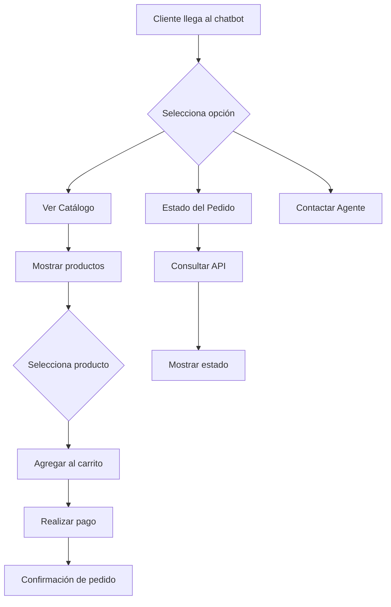

# Guía Completa para Construir Chatbots para Cualquier Industria

> **TL;DR:** Ahora es el momento de los chatbots personalizados. El progreso empresarial mediante chatbots que responden de forma genérica y uniforme es cuestionable. Para que un bot realmente impulse el crecimiento, debe hablar el "lenguaje de negocio" único de tu industria. Esta guía te muestra cómo encontrar y construir el bot que realmente entiende tu nicho.

*Última actualización: 7 de mayo de 2026*

Los chatbots están cambiando rápidamente. Ya no son solo para conversaciones básicas o alertas simples. Hoy en día, estas herramientas inteligentes ayudan a muchos negocios diferentes de formas nuevas e innovadoras.

En esta guía, verás cómo los chatbots resuelven problemas del mundo real. Te mostraremos por qué son tan útiles y aprenderás a construir tu propio chatbot desde cero.

## El Mundo Versátil de los Chatbots

### Caso de Uso 1: Asistente Nacional de Salud del NHS (Reino Unido)

En el sector salud, cada segundo es vital. La velocidad salva vidas. Así es como un chatbot ayuda a los pacientes.

> **¿Para quién es?** Esta herramienta es para cualquier persona que necesite consejos de salud o quiera reservar una cita médica.

#### Cómo Funciona

El NHS utiliza una herramienta llamada "Ask A&E". Actúa como un asistente médico digital. Puedes hablar con ella o escribir un mensaje. Pregunta sobre tus síntomas y da consejos rápidos.

#### Lo que Puede Hacer

- Encontrar clínicas cercanas
- Reservar tu próxima visita
- Recordarte tomar tu medicación
- Dar consejos sobre salud mental
- Ayudar con reclamaciones de seguros médicos

#### Por Qué es Especial

El bot se conecta a tus archivos médicos. Esto ayuda a los doctores a ver tu historial rápidamente y tomar las decisiones correctas para tu cuidado.

#### Ejemplo Real: El NHS

El NHS es el principal servicio de salud del Reino Unido. Usan un chatbot llamado "Ask A&E" que facilita las cosas a los pacientes. Ayuda a reservar visitas y proporciona consejos claros sobre atención de emergencia, reduciendo el estrés de obtener ayuda médica.

El Reino Unido está invirtiendo fuertemente en tecnología sanitaria. Informes recientes muestran que destinaron más de £50 millones para IA, actualizando el NHS y demostrando su compromiso con la tecnología para mejorar la salud de las personas.

> **Estadística relevante:** El 80% de los consumidores reporta haber tenido experiencias positivas con chatbots, según estudios recientes del sector.

### Caso de Uso 2: Chatbot de Nutrición de Nestlé

#### ¿Para quién es?

Este bot es para cualquiera que quiera comer mejor. Es perfecto para personas que necesitan ideas de recetas o consejos de salud.

#### Cómo Funciona

Nestlé creó un chatbot llamado Ella. Puedes hablar con Ella o enviarle un texto. Dile qué te gusta comer y qué quieres evitar. Ella te dará un plan de comidas que se ajuste a tu vida, ayudándote a elegir alimentos saludables y planificar tus comidas.

#### Por Qué es Inteligente

Ella usa IA para aprender sobre ti. Cuanto más hablas con ella, mejores son sus consejos. También te envía consejos rápidos para ayudarte a mantenerte en el camino correcto con tu dieta.

#### Uso en el Mundo Real

Nestlé usa Ella para ayudar a sus clientes a mantenerse saludables. Es un gran ejemplo de cómo una gran empresa usa la tecnología para dar consejos expertos a sus clientes desde casa.

> En resumen, los chatbots han evolucionado hasta convertirse en herramientas versátiles con aplicaciones en el mundo real que abarcan salud, nutrición y atención al cliente. Su impacto transformador en las industrias demuestra su potencial para optimizar procesos, proporcionar asistencia personalizada y mejorar la experiencia del usuario.

## Construyendo tu Propio Chatbot

En esta sección, repasaremos el proceso de crear un chatbot personalizado. Usaremos como ejemplo práctico un **Generador de Documentos Legales**.

**Caso de Uso 3: Generador de Documentos Legales**

Imaginemos a Lisa, una consultora legal que necesita este servicio.

### Paso 1: Elegir la Plataforma Adecuada

El primer paso para aprovechar LegalBot (el nombre de tu bot) es elegir el constructor de chatbots adecuado. En este caso, usaremos E-SMART360.

### Introducción: Elegir E-SMART360

Selecciona E-SMART360 como plataforma para crear LegalBot. Es una plataforma sin código que permite a cualquier persona construir chatbots profesionales sin conocimientos de programación.

### Planificar y Diseñar las Conversaciones

Antes de sumergirte en la creación del chatbot, es esencial definir tus objetivos y las metas del usuario. En este caso, el objetivo es claro: crear un acuerdo legal personalizado de manera eficiente.

### Definir Objetivos y Metas de Usuario

- **Objetivo principal:** Generar documentos legales personalizados
- **Usuarios objetivo:** Consultores legales, abogados, asistentes jurídicos
- **Canales:** WhatsApp, Web Chat, Telegram

### Crear un Diagrama de Flujo de Conversación

Para garantizar una interacción fluida con LegalBot, crea un diagrama de flujo que describa las diversas etapas de la creación del documento, incluyendo:

- **Tipo de Documento**
- **Selección de Cláusulas**
- **Información del Cliente**
- **Revisión y Finalización**

### Ejemplo de Conversación

**Persona de Usuario:**
- **Nombre:** Lisa
- **Nombre del Bot:** LegalBot
- **Rol:** Generador de documentos legales con interacciones basadas en botones

**Lisa:** Hola, LegalBot. Necesito crear un acuerdo legal personalizado para un cliente.

**LegalBot:** ¡Hola, Lisa! Puedo ayudarte con eso. Por favor, elige una de las siguientes opciones:

[Tipo de Documento] [Selección de Cláusulas] [Información del Cliente]

**Lisa:** *[Hace clic en "Tipo de Documento"]*

**LegalBot:** ¡Genial, Lisa! Comencemos seleccionando el tipo de documento legal que necesitas. Por favor, elige entre las siguientes opciones:

[Contrato] [Acuerdo] [Términos y Condiciones]

**Lisa:** *[Hace clic en "Contrato"]*

**LegalBot:** ¡Excelente elección! Ahora, pasemos a seleccionar las cláusulas específicas para tu contrato. Por favor, elige entre las siguientes categorías:

[Cláusulas Generales] [Cláusulas de Pago] [Cláusulas de Confidencialidad]

**Lisa:** *[Hace clic en "Cláusulas de Pago"]*

**LegalBot:** ¡Perfecto! Aquí tienes algunas cláusulas relacionadas con pagos que puedes incluir en tu contrato:

[Términos de Pago] [Penalizaciones por Pago Tardío] [Métodos de Pago]

**Lisa:** *[Hace clic en "Términos de Pago"]*

**LegalBot:** ¡Gran decisión, Lisa! Ahora, recopilemos información específica del cliente para personalizar el contrato. Por favor, proporciona los siguientes datos:

- Nombre del Cliente
- Dirección del Cliente
- Información de Contacto del Cliente

**Lisa:** *[Proporciona la información del cliente]*

**LegalBot:** Gracias, Lisa. Tenemos toda la información necesaria. Revisemos el borrador de tu contrato personalizado:

*[Muestra el borrador del contrato con las cláusulas seleccionadas y la información del cliente]*

**Lisa:** ¡Todo se ve bien! Por favor, finaliza el contrato.

**LegalBot:** ¡Maravilloso! Tu contrato personalizado está listo. Puedes usar este formato para tu cliente.

*[Genera un documento escrito con la información proporcionada]*

**Lisa:** ¡Gracias, LegalBot! Esto me ahorró mucho tiempo y esfuerzo.

> **Tip:** Así es como se ve el proceso de creación del bot Generador de Documentos Legales dentro del constructor de flujo drag-and-drop de E-SMART360.

## Cómo Construir un Chatbot de Seguimiento Automático en WhatsApp

> Los chatbots de seguimiento automático son una de las herramientas más poderosas para aumentar conversiones. Te permiten mantener el compromiso con clientes potenciales que han mostrado interés pero no han completado una compra.

### ¿Qué es un Chatbot de Seguimiento?

Un chatbot de seguimiento es un sistema automatizado que envía mensajes de recordatorio a usuarios que han interactuado con tu chatbot pero no han completado una acción, como realizar una compra o registrarse. Ayuda a las empresas a mantenerse en contacto con clientes potenciales y mejora las tasas de conversión.

### ¿Por Qué Usar un Sistema de Seguimiento Automatizado?

- Ahorra tiempo automatizando recordatorios
- Aumenta las ventas y conversiones
- Asegura que los usuarios no olviden tu oferta
- Funciona 24/7 sin esfuerzo manual

### Pasos para Construir tu Chatbot de Seguimiento

### Crear el Flujo del Chatbot

Ve al panel de control de E-SMART360 > Gestor de Bots > Respuesta del Bot > Crear.

Nombra el chatbot de forma reconocible, como "Bot de Seguimiento". Guárdalo y asegúrate de que se active cuando un usuario interactúe con un mensaje relacionado con un producto.

### Configurar Mensajes Interactivos

Agrega un bloque interactivo a tu chatbot. Crea un mensaje como: *"¿Hola! ¿Estarías interesado en nuestro producto?"* con botones de Sí y No.

- Si el usuario selecciona Sí, proporciónale un enlace de pago
- Si el usuario selecciona No, finaliza la conversación u ofrece asistencia

### Aplicar Etiquetas para Rastrear Acciones

Cuando un usuario haga clic en "Comprar Ahora", aplica una etiqueta llamada "Comprar Ahora". Si el usuario no hace clic en el botón, no recibe esta etiqueta. Usa esta etiqueta para determinar quién necesita un recordatorio de seguimiento.

### Configurar la Secuencia de Seguimiento

Arrastra y suelta el conector desde la opción 'Suscribir a Secuencia' del botón Comprar Ahora para comenzar una nueva secuencia de seguimiento. Esto enviará un mensaje de recordatorio si el usuario no compra dentro de 30 minutos (o el tiempo que elijas).

Agrega una condición para hacer seguimiento basado en si seleccionaron el botón 'Comprar Ahora' o no. Si la condición es falsa, envía el mensaje de seguimiento.

### Programar Mensajes para Máximo Compromiso

WhatsApp permite enviar mensajes de seguimiento ilimitados dentro de 24 horas. Después de 24 horas, solo se pueden enviar mensajes de plantilla preaprobados. Programa tus recordatorios estratégicamente para evitar saturar a los usuarios.

### Exportar Flujos de Chatbot

Puedes exportar tu flujo de chatbot y compartirlo con otros miembros de tu equipo para mantener la consistencia en todas las conversaciones.

> **Beneficio clave:** Los chatbots de seguimiento automático aseguran que los clientes potenciales sean recordados de su interés en tu producto, aumentando significativamente la probabilidad de una venta.

## Cómo Crear un Chatbot Basado en Palabras Clave para WhatsApp

Los chatbots basados en palabras clave son ideales para automatizar respuestas a preguntas frecuentes y guiar a los usuarios a través de flujos de conversación predefinidos.

### Acceder al Gestor de Bots

### Acceder al Gestor de Bots

Ve al menú **Gestor de Bots** en el panel de E-SMART360. Selecciona la cuenta de bot que deseas configurar y haz clic en Respuesta del Bot para continuar.

### Crear un Nuevo Chatbot

Haz clic en el botón Crear en la configuración de Respuesta del Bot. Aparecerá el lienzo del **Constructor Visual de Flujo de Bot**.

### Nombrar tu Chatbot

Localiza el componente **Iniciar Flujo de Bot**. Haz doble clic para abrir el modal de Configurar Referencia. Ingresa un nombre en el campo Título. Opcionalmente, elige una etiqueta y selecciona una secuencia.

### Configurar un Disparador por Palabra Clave

En el modal Configurar Referencia, ingresa una palabra clave para activar el bot (ej: "Hola", "Hola", "Inicio").

- **Coincidencia Exacta:** El bot solo se activará para esta palabra clave específica
- **Coincidencia de Cadena:** El bot se activará para cualquier cadena de palabras, frases u oraciones que contengan esa palabra clave

Guarda la configuración.

### Configurar un Mensaje de Respuesta

Arrastra una conexión desde el conector Siguiente del Iniciar Flujo de Bot. Suéltala en el lienzo para revelar diferentes opciones de componentes. Selecciona el **Componente Interactivo**.

Haz doble clic para abrir el modal Configurar Mensaje de Texto. Completa el Encabezado del Mensaje, Cuerpo del Mensaje y Pie del Mensaje (el cuerpo es obligatorio). Configura un tiempo de retardo si es necesario y haz clic en OK.

### Agregar Botones Interactivos

Arrastra un conector desde el conector del botón del Componente Interactivo hacia el lienzo. Aparecerá un Componente de Botón en Línea.

Haz doble clic, ingresa el texto del botón y selecciona una acción:
- Enviar un Mensaje
- Iniciar un Flujo
- Botón de Acción por Defecto del Sistema

Repite el proceso para agregar más botones.

### Configurar Mensaje Final y Guardar

Selecciona el **Componente de Texto** para el mensaje final. Haz doble clic, configura el mensaje y haz clic en OK. Haz clic en el botón Guardar (esquina superior derecha del lienzo) para guardar toda la configuración del bot.

### Probar tu Chatbot de WhatsApp

Abre WhatsApp, escribe la palabra clave que configuraste y envíala. Observa la respuesta del chatbot para confirmar que funciona correctamente.

### Consejos y Solución de Problemas

### ¿La palabra clave no activa respuestas?

Verifica que la palabra clave esté correctamente configurada en el Componente de Disparador. Revisa que no haya conflictos con otros bots configurados.

### ¿Los botones no aparecen?

Asegúrate de que estén correctamente vinculados a un componente interactivo. Revisa las conexiones en el flujo visual.

### ¿No hay mensaje final?

Verifica que el Componente de Texto esté agregado y guardado en el flujo.

### ¿Los cambios no se guardan?

Siempre haz clic en el botón Guardar antes de salir del constructor visual de bots.

## Entrenando tu Asistente de IA para el Chatbot

> E-SMART360 te permite entrenar asistentes de IA para automatizar la atención al cliente en múltiples plataformas. Esta sección cubre el entrenamiento de chatbots de IA usando FAQs, URLs y carga de archivos.

### Crear una Campaña de Entrenamiento de IA

### Crear Campaña de Entrenamiento

Navega a Panel de Control > Configuración > Campaña de Entrenamiento de IA. Haz clic en Crear para iniciar una nueva campaña. Ingresa un Nombre de Campaña y un Mensaje de Instrucción. Ajusta la instrucción predeterminada para definir el rol y tono del bot. Haz clic en Guardar.

### Entrenar el Chatbot con FAQs

Haz clic en el botón Más (+) bajo la campaña. Elige entre:
- **Resumen:** Proporciona respuestas ricas y contextuales pero consume más tokens
- **FAQs:** Eficiente en costos y estructurado para respuestas rápidas

Sube el contenido en el formato requerido y guarda.

### Entrenar el Chatbot con una URL

Haz clic en Nuevo bajo entrenamiento por URL. Ingresa la URL de la Campaña. Elige un Tipo de Selector (ID o Clase) basado en la estructura de la página web. Opcionalmente, elimina contenido innecesario como anuncios o encabezados. Haz clic en Generar FAQ o Generar Respuesta Cruda, luego guarda.

### Entrenar el Chatbot con un Archivo

Navega a Configuración de Archivos y haz clic en Nuevo. Sube un archivo PDF, Word (.doc) o TXT. Elige el modo de procesamiento:
- **Generar Respuesta Cruda:** Proporciona una respuesta completa y detallada (mayor uso de tokens)
- **Generar FAQ:** Divide el contenido en FAQs estructuradas (menor uso de tokens)

Guarda el archivo y finaliza el entrenamiento.

### Configurar el Comportamiento del Chatbot de IA

1. **Configuración de Respuesta Sin Coincidencia**

Si el chatbot no puede coincidir con una consulta, debe responder basado en los datos entrenados.

- Ve a Gestor de Bots > Botones de Acción > Sin Coincidencia
- Selecciona Respuesta de IA y vincula la campaña de IA entrenada
- Activa Respuesta Sin Coincidencia en Configuración
- Guarda la configuración

2. **Activar el Asistente de IA**

- Ve a Gestor de Bots
- Activa la opción Activar Asistente de IA
- Selecciona la campaña deseada
- Elige el modo de respuesta:
  - **Asistente de IA para Todas las Consultas:** La IA maneja todas las consultas de los clientes
  - **IA solo como Respaldo:** La IA interviene solo cuando las reglas predefinidas fallan

### Pruebas y Optimización

- Simula consultas de usuario para asegurar respuestas adecuadas
- Ajusta FAQs, URLs o archivos según sea necesario para mejorar la precisión
- Monitorea el rendimiento del chatbot y actualiza los datos de entrenamiento regularmente

> **Beneficios del Asistente de IA:**
- **Soporte Multicanal:** Funciona en WhatsApp, Messenger, Instagram, Telegram y sitios web
- **Disponibilidad 24/7:** Asegura soporte las 24 horas del día
- **Respuestas Personalizadas:** Interacciones basadas en IA adaptadas a las necesidades del cliente
- **Escalable:** Automatiza el soporte sin costos adicionales
- **Aumenta la Productividad:** Libera a los agentes humanos para consultas complejas

## Integración con Bandeja Compartida

> La Bandeja Compartida de E-SMART360 mejora tu chatbot de IA al integrar perfectamente el soporte humano. La función "Asignar Miembro del Equipo o Agente por IA" asegura que las consultas complejas se envíen automáticamente al miembro del equipo adecuado.

### Cómo Funciona

- **Escalación Inteligente:** La IA detecta cuando un usuario necesita ayuda humana (ej: "Necesito hablar con una persona") y asigna la conversación al miembro del equipo correspondiente
- **Colaboración Eficiente:** Los miembros del equipo pueden ver y responder a las consultas escaladas en tiempo real
- **Mejor Experiencia del Cliente:** La IA maneja consultas rutinarias mientras los agentes humanos se enfocan en problemas complejos

> Esta función equilibra la automatización y la asistencia humana, mejorando la eficiencia y la satisfacción del cliente.

## Pruebas y Refinamiento

**Prueba, Prueba, Prueba:** Asegura Interacciones Fluidas

Antes de lanzar tu bot a los clientes, realiza pruebas exhaustivas para garantizar interacciones fluidas y una generación precisa de documentos.

### Checklist de Pruebas

- [ ] Verificar que todas las palabras clave activen las respuestas correctas
- [ ] Confirmar que los botones interactivos funcionen en todos los canales
- [ ] Probar los flujos de seguimiento automatizado
- [ ] Validar la precisión de las respuestas de IA
- [ ] Comprobar la escalación a agentes humanos
- [ ] Probar en múltiples dispositivos y navegadores

## Cerrando la Brecha: De Casos de Uso a la Creación

Para crear un chatbot exitoso:

1. **Identifica** casos de uso relevantes para tu industria
2. **Adapta** ideas versátiles en funcionalidades prácticas
3. **Determina** qué tipo de chatbot se alinea con tu negocio
4. **Personaliza** el chatbot para cumplir con tus requisitos únicos
5. **Experimenta** con nuevas características y tecnologías
6. **Mejora** la experiencia del usuario continuamente

### Integración Web

Para obtener una comprensión integral de la integración de tus plataformas con E-SMART360:

**Shopify:** Integra tu tienda Shopify para notificaciones de pedidos y atención al cliente automatizada en WhatsApp.

**WooCommerce:** Conecta WooCommerce para una gestión de pedidos y pagos sin interrupciones.

### Integración de Plataformas de Mensajería

**WhatsApp Cloud API:** Configura la API de WhatsApp Cloud para crear tu chatbot de WhatsApp.

**Telegram:** Crea un bot de Telegram y conéctalo con E-SMART360 para expandir tu alcance multicanal.

## El Futuro de los Chatbots: Posibilidades Ilimitadas

En un estudio reciente realizado por la plataforma de marketing de ubicación Uberall, se revelaron estadísticas intrigantes sobre las percepciones de los consumidores sobre los chatbots:

- **80%** de los consumidores reportaron experiencias positivas con chatbots
- **40%** expresó interés en experiencias de chatbot de marcas
- **38%** cree que las marcas deberían utilizar chatbots para ofertas, cupones y promociones

> **¡Comienza tu Viaje con Chatbots!**

Como has descubierto el poder transformador de los chatbots en escenarios del mundo real y cómo crear tu propio chatbot personalizado, es hora de embarcarte en tu viaje hacia la excelencia en chatbots. Ya sea que estés en salud, nutrición, atención al cliente o servicios legales, los chatbots tienen un papel que desempeñar en optimizar y mejorar tus operaciones.

## Preguntas Frecuentes

### ¿Qué industrias se benefician más de los chatbots?

Los chatbots benefician a muchas industrias, incluyendo comercio minorista, salud, finanzas, educación y servicio al cliente, mejorando el compromiso, automatizando tareas rutinarias y mejorando los tiempos de respuesta. Sectores como el legal y el de recursos humanos también están adoptando chatbots para automatizar procesos documentales y de selección.

### ¿Cuál es el beneficio de un constructor de chatbots sin código?

Un constructor sin código permite a los dueños de negocio crear flujos de automatización complejos visualmente, sin contratar desarrolladores, reduciendo significativamente el costo y el tiempo de lanzamiento. Con E-SMART360, puedes tener tu chatbot funcionando en cuestión de horas, no semanas.

### ¿Cómo ayudan los chatbots en los sectores de salud y legal?

En salud, gestionan la programación de citas y recordatorios de pacientes, además de proporcionar triaje inicial de síntomas. En el sector legal, pueden manejar preguntas iniciales de admisión, automatizar la recolección de documentos y generar documentos legales básicos como contratos y acuerdos.

### ¿Cuáles son los pasos básicos para construir un chatbot?

Los pasos básicos incluyen: 1) Definir objetivos y metas del usuario, 2) Seleccionar la plataforma adecuada (como E-SMART360), 3) Diseñar los flujos de conversación, 4) Configurar disparadores por palabras clave, 5) Agregar mensajes interactivos y botones, 6) Integrar con canales de mensajería, 7) Probar exhaustivamente, y 8) Monitorear el rendimiento y optimizar.

### ¿Puedo entrenar mi chatbot con mis propios documentos y FAQs?

Sí. E-SMART360 te permite entrenar tu asistente de IA subiendo FAQs, URLs de tu sitio web, y archivos PDF, Word o TXT. El sistema procesa automáticamente el contenido y lo convierte en conocimiento utilizable por el chatbot, permitiéndote generar respuestas precisas basadas en tu documentación empresarial.

### ¿Cómo maneja el chatbot las consultas que no puede responder?

Puedes configurar una Respuesta Sin Coincidencia que active el Asistente de IA como respaldo. Si la IA entrenada tampoco encuentra una respuesta, puedes escalar la conversación a un agente humano a través de la Bandeja Compartida, asegurando que ninguna consulta quede sin resolver.

### ¿Qué canales soporta E-SMART360 para chatbots?

E-SMART360 soporta múltiples canales incluyendo WhatsApp (a través de Cloud API), Facebook Messenger, Instagram DM, Telegram, Web Chat y Sitio Web. Esto permite a las empresas mantener una presencia uniforme de chatbot en todas las plataformas donde están sus clientes.

## Ejemplos Prácticos Adicionales

### Chatbot para E-commerce: Recuperación de Carritos Abandonados

Configura un chatbot que detecte cuando un cliente abandona un carrito en tu tienda Shopify o WooCommerce. Automáticamente envía un mensaje de WhatsApp recordando al cliente los productos que dejó, con un enlace directo para completar la compra. Ofrece un código de descuento especial como incentivo. Este flujo puede aumentar las tasas de recuperación hasta un 30%.

**Flujo sugerido:**
1. Webhook detecta carrito abandonado
2. Bot envía mensaje: "¡Olvidaste algo! 🛒 Tus productos te esperan"
3. Incluye imágenes de los productos y botón de pago
4. Segundo recordatorio a las 24h (si no hay acción)
5. Último recordatorio a las 72h con descuento especial

### Chatbot para Restaurantes: Gestión de Reservas

Un chatbot de WhatsApp para restaurantes que permite a los clientes:
- Consultar el menú del día con fotos y precios
- Reservar mesa seleccionando fecha, hora y número de comensales
- Recibir recordatorios automáticos de la reserva
- Confirmar o cancelar reservas

**Ejemplo de interacción:**
Cliente: "Quiero reservar para 4 personas mañana"
Bot: "Claro. ¿A qué hora prefieres? Opciones disponibles: 13:00, 14:00, 15:00, 20:00, 21:00, 22:00"
Cliente: "20:00"
Bot: "Perfecto. Reserva confirmada: 4 personas, mañana a las 20:00. ¡Te esperamos! 🍝"

> **¿Listo para comenzar?** Regístrate en E-SMART360 y comienza a construir tu primer chatbot hoy mismo. La plataforma ofrece un plan gratuito para que puedas explorar todas las funcionalidades antes de comprometerte.

## Cómo Configurar Mensajes de Secuencia para Ventas

Los mensajes de secuencia son una serie automatizada de respuestas del chatbot activadas por acciones del usuario o eventos predefinidos. Ayudan a las empresas a mejorar el compromiso del cliente, automatizar tareas de marketing y nutrir leads.

### ¿Qué es un Mensaje de Secuencia?

Un mensaje de secuencia es un conjunto preconfigurado de mensajes automatizados que se envían a los suscriptores basándose en disparadores y horarios predefinidos. Estos mensajes ayudan a mantener el compromiso, nutrir leads y automatizar respuestas de manera eficiente.

### Ideas para Mensajes de Secuencia

- **Secuencias de Bienvenida**: Atrae a nuevos suscriptores con saludos personalizados
- **Secuencias de Soporte al Cliente**: Automatiza respuestas a consultas comunes
- **Secuencias de Nutrición de Leads**: Educa a los leads sobre productos o servicios
- **Secuencias de Ventas**: Guía a los clientes potenciales a través del embudo de ventas
- **Secuencias de Onboarding**: Ayuda a nuevos usuarios a comenzar
- **Secuencias Promocionales**: Anuncia nuevos productos, descuentos o eventos
- **Secuencias Educativas**: Proporciona contenido valioso a los suscriptores

### Beneficios de Usar Mensajes de Secuencia

- **Experiencia del Cliente Mejorada**: Las respuestas automatizadas garantizan un compromiso instantáneo
- **Mayor Eficiencia**: Reduce la carga de trabajo manual automatizando tareas repetitivas
- **Mejores Conversiones**: Nutre leads y mejora las conversiones de ventas
- **Compromiso Mejorado**: Mantiene a los usuarios comprometidos con seguimientos oportunos
- **Optimización Basada en Datos**: Realiza un seguimiento del rendimiento y refina las secuencias basándose en análisis

### Cómo Configurar y Lanzar una Campaña de Mensajes de Secuencia

### Crear una Nueva Secuencia

Navega al Constructor de Flujo y selecciona 'Nueva Secuencia'. Establece el nombre y configura el tiempo para los mensajes.

### Estructurar tu Secuencia

Organiza tu secuencia con texto, medios y llamadas a la acción. Personaliza los mensajes usando datos del usuario para aumentar la relevancia.

### Finalizar y Activar

Finaliza tu configuración y activa la secuencia. Monitorea el rendimiento y realiza las mejoras necesarias.

### Mejores Prácticas para Mensajes de Secuencia

- Mantén los mensajes concisos y relevantes
- Personaliza las interacciones usando datos del usuario
- Programa los mensajes estratégicamente para mantener el compromiso
- Usa plantillas de mensajes preaprobadas para secuencias de WhatsApp
- Analiza y refina continuamente las secuencias basándote en datos de rendimiento

> **Tip:** Los mensajes de secuencia son una herramienta poderosa que automatiza las interacciones con los clientes, aumenta el compromiso y mejora los esfuerzos de marketing. Con secuencias estructuradas, las empresas pueden optimizar su estrategia de comunicación, nutrir leads y mejorar las conversiones sin esfuerzo.

## Broadcasting: Cómo Enviar Mensajes Masivos en WhatsApp sin Ser Bloqueado

El broadcasting masivo en WhatsApp es una de las funcionalidades más potentes para campañas de marketing. Sin embargo, debe hacerse correctamente para evitar bloqueos.

### Preparación de la Lista de Suscriptores

1. Asegúrate de tener una lista de contactos limpia y lista para importar
2. Prepara una hoja de cálculo con los detalles necesarios (nombre, número de teléfono, etc.)
3. Asegúrate de que la columna de números de teléfono esté precisa y formateada correctamente
4. Descarga la hoja de cálculo como archivo CSV desde Google Sheets (se requiere codificación UTF-8)
5. Alternativamente, puedes importar directamente desde tu Google Sheet

### Importación de Suscriptores

### Subir tu Lista de Contactos

Ve al Gestor de Suscriptores en tu panel de E-SMART360. Haz clic en "Opciones" y selecciona "Importar Suscriptores".

### Subir el Archivo CSV

Sube el archivo CSV o importa directamente desde tu Google Sheet.

### Mapear los Datos

Cuando hayas importado tu archivo, mapea los datos para alinear las columnas correctamente (nombre, teléfono, etc.).

### Tipos de Plantillas de Mensajes

Existen dos tipos de categorías de plantillas de mensajes:

- **Plantillas Transaccionales (Utilidad, Auth/OTP)**: Se usan para enviar mensajes relacionados con transacciones específicas, como confirmaciones de envío o recibos de pago.
- **Plantillas de Marketing**: Se usan para enviar mensajes que promocionan tus productos o servicios.

### Cómo Crear una Plantilla de Mensaje

1. Ve a **Gestor de Bots > Plantillas de Mensajes**
2. Haz clic en **Crear Nueva Plantilla** y selecciona del listado
3. Completa los detalles requeridos:
   - **Contenido del Mensaje**: Crea la plantilla, incluyendo personalización con campos personalizados y botones de llamada a la acción (CTA)
   - **Nombre de la Plantilla**: Usa minúsculas y reemplaza espacios con guiones bajos
4. Guarda y envía tu plantilla a Meta para aprobación

### Configuración de una Campaña de Broadcasting

1. Navega a **Broadcasting** en tu panel de E-SMART360
2. Haz clic en **Crear Nueva Campaña**
3. Nombra tu campaña (ej: "Campaña de Marketing de Prueba")

### Selección de Audiencias Objetivo

Segmenta grupos específicos de suscriptores para personalizar tu campaña:

- **Ventana de 24 Horas**: Envía mensajes gratuitos a usuarios que interactuaron contigo en las últimas 24 horas
- **Mensajería en Cualquier Momento**: Usa una plantilla aprobada para llegar a todos los suscriptores

Filtra tu audiencia usando Etiquetas:
- Incluye o excluye etiquetas específicas (ej: "Nuevo Lead", "Interesado en Demo", "Prueba Gratis")
- Usa el filtro "Suscriptores Agregados Recientemente" para segmentar por rango de fechas

### Programación o Envío de la Campaña

1. Elige enviar la campaña inmediatamente o programarla para más tarde
2. Ajusta la zona horaria para una entrega óptima
3. Guarda y ejecuta tu campaña

### Preguntas Frecuentes sobre Broadcasting

### ¿Qué pasa si mi plantilla es rechazada?

Revisa el contenido para cumplir con las pautas de WhatsApp y vuelve a enviarla. Las razones comunes incluyen: lenguaje promocional excesivo, falta de opción para darse de baja, o contenido engañoso.

### ¿Puedo enviar mensajes sin una plantilla?

Solo dentro de las 24 horas posteriores a la interacción del usuario. Fuera de esa ventana, necesitas usar plantillas de mensajes preaprobadas por Meta.

## Casos de Uso Adicionales por Industria

### Chatbot para Educación

Las instituciones educativas pueden usar chatbots para:
- Automatizar la inscripción a cursos
- Proporcionar información sobre programas académicos
- Enviar recordatorios de fechas importantes y exámenes
- Responder preguntas frecuentes sobre admisiones
- Gestionar la comunicación con padres de familia

### Chatbot para Agencias de Marketing

Las agencias pueden beneficiarse de chatbots para:
- Capturar leads calificados 24/7 desde anuncios Click-to-WhatsApp
- Calificar prospectos automáticamente con preguntas predefinidas
- Enviar propuestas y cotizaciones automatizadas
- Dar seguimiento a clientes potenciales con secuencias de nutrición
- Integrar con CRM para mantener datos sincronizados

### Chatbot para E-commerce

- Recuperación de carritos abandonados
- Notificaciones de estado de pedidos
- Recomendaciones de productos personalizadas
- Atención al cliente post-venta
- Gestión de devoluciones y cambios

> Independientemente de la industria, los chatbots de E-SMART360 se adaptan a las necesidades específicas de cada negocio, proporcionando una solución flexible y escalable.

## Integraciones Clave para Potenciar tu Chatbot

### Integración con Google Sheets

Conecta Google Sheets con tu chatbot para:
- Sincronizar datos de clientes automáticamente
- Enviar mensajes personalizados basados en datos de hojas de cálculo
- Registrar respuestas y leads directamente en tus sheets
- Disparar campañas basadas en cambios en los datos

### Integración con Shopify y WooCommerce

Potencia tu tienda online:
- Notificaciones automáticas de pedidos nuevos
- Alertas de carritos abandonados
- Confirmaciones de envío y entrega
- Sincronización de catálogo de productos
- Gestión de devoluciones por chat

## Estrategias Avanzadas de Automatización con Chatbots

### Automatización de Respuestas Fuera del Horario Laboral

Uno de los mayores beneficios de los chatbots es su capacidad para mantener la comunicación con los clientes incluso cuando tu equipo no está disponible. Configura tu chatbot para:

1. **Responder consultas básicas** fuera del horario laboral
2. **Recopilar información del cliente** para que un agente la retome al día siguiente
3. **Programar citas y llamadas** directamente en el calendario
4. **Enviar confirmaciones automáticas** de mensajes recibidos
5. **Escalar urgencias** a un agente de guardia si es necesario

> **Dato clave:** Las empresas que implementan chatbots para atención fuera de horario reportan un aumento del 35% en la satisfacción del cliente, ya que los usuarios reciben respuesta inmediata sin importar la hora del día.

### Segmentación de Audiencia para Campañas Efectivas

La segmentación adecuada de tu audiencia es crucial para el éxito de cualquier campaña de chatbot. E-SMART360 te permite segmentar tus contactos usando:

| Tipo de Segmentación | Descripción | Ejemplo de Uso |
|----------------------|-------------|----------------|
| Por Comportamiento | Basada en acciones del usuario | Usuarios que hicieron clic en "Comprar" pero no completaron el pago |
| Por Etiquetas | Etiquetas personalizadas asignadas a contactos | "Interesado en Demo", "Cliente Premium", "Lead Frío" |
| Por Interacción | Basada en la última interacción | Contactos que no han interactuado en 7 días |
| Por Canal | Según el canal de origen | Usuarios que llegaron desde WhatsApp vs. Web Chat |
| Por Fecha de Registro | Según cuándo se agregaron | Nuevos suscriptores de los últimos 30 días |

### Recuperación Inteligente de Leads

No todos los leads se convierten en el primer contacto. Implementa una estrategia de recuperación inteligente:

### Identificar Leads Fríos

Usa etiquetas y segmentación para identificar leads que no han interactuado en más de 7 días. Crea un segmento específico para "Leads Inactivos" y monitoriza su comportamiento.

### Crear una Secuencia de Re-engagement

Diseña una secuencia de 3-4 mensajes espaciados en el tiempo:
- Mensaje 1 (Día 1): Oferta especial o contenido de valor
- Mensaje 2 (Día 4): Testimonio de cliente o caso de éxito
- Mensaje 3 (Día 7): Última oportunidad con descuento exclusivo

### Automatizar la Secuencia

Configura la secuencia en el Constructor de Flujo de E-SMART360. Establece los tiempos de espera entre mensajes y las condiciones de salida (si el usuario responde, detener la secuencia).

### Medir y Optimizar

Analiza las tasas de apertura, clics y conversiones de cada mensaje. Ajusta el contenido, los tiempos y los canales según los resultados obtenidos.

> **Resultado comprobado:** Las campañas de re-engagement automatizadas pueden recuperar hasta un 15-20% de leads que de otra forma se perderían definitivamente.

## Seguridad y Buenas Prácticas en Chatbots

### Protección de Datos del Cliente

Cuando implementas un chatbot, es fundamental garantizar la seguridad de los datos de tus clientes:

- **Cifrado de extremo a extremo:** Asegura que todas las conversaciones estén protegidas
- **Cumplimiento con regulaciones:** Asegúrate de que tu chatbot cumpla con GDPR, CCPA y otras regulaciones aplicables
- **Política de privacidad clara:** Informa a los usuarios sobre cómo se recopilan y utilizan sus datos
- **Almacenamiento seguro:** Los datos sensibles deben almacenarse cifrados y con acceso restringido

### Prevención de Spam y Abuso

Protege tu chatbot contra usos maliciosos:

1. **Límites de velocidad:** Configura límites en el número de mensajes que un usuario puede enviar en un período de tiempo
2. **Bloqueo de palabras clave:** Identifica y bloquea palabras o frases maliciosas
3. **Verificación de usuarios:** Implementa CAPTCHA o verificación en dos pasos para acciones sensibles
4. **Monitoreo de actividad:** Revisa periódicamente los logs de conversación para detectar patrones sospechosos
5. **Lista negra:** Mantén una lista actualizada de números o usuarios bloqueados

> **Importante:** Una configuración inadecuada de seguridad puede resultar en la suspensión de tu número de WhatsApp Business API. Sigue siempre las políticas de la plataforma y las mejores prácticas del sector.

## Migración desde Otras Plataformas

Si ya tienes un chatbot en otra plataforma, E-SMART360 facilita la migración:

1. **Exporta tus flujos actuales** desde tu plataforma anterior (si es posible)
2. **Recrea los flujos básicos** en el Constructor Visual de E-SMART360
3. **Importa tu lista de contactos** con etiquetas y segmentos
4. **Reentrena tu asistente de IA** subiendo FAQs, URLs y documentación
5. **Prueba exhaustivamente** antes de desactivar la plataforma anterior
6. **Migra progresivamente** para evitar interrupciones en el servicio

## Métricas y KPIs para tu Chatbot

Monitorear el rendimiento de tu chatbot es esencial para la mejora continua. Estas son las métricas clave:

### Métricas de Conversación

- **Tasa de Respuesta Exitosa:** % de mensajes que el bot responde correctamente
- **Tasa de Escalación:** % de conversaciones que requieren intervención humana
- **Duración Promedio de Conversación:** Tiempo total desde el primer mensaje hasta la resolución
- **Tasa de Abandono:** % de conversaciones que se quedan sin respuesta
- **Profundidad de Conversación:** Número promedio de intercambios por sesión

### Métricas de Negocio

- **Tasa de Conversión:** % de usuarios que completan la acción deseada
- **Costo por Lead:** Costo total de operación del chatbot / número de leads generados
- **ROI:** Retorno de inversión comparando ingresos generados vs. costo del chatbot
- **Tasa de Retención:** % de usuarios que regresan a interactuar con el bot
- **NPS (Net Promoter Score):** Satisfacción del cliente con la experiencia del chatbot

### Cómo Mejorar tus KPIs

1. **Analiza las conversaciones escaladas** para identificar patrones y mejorar las respuestas automáticas
2. **Actualiza el entrenamiento de IA regularmente** con nuevas FAQs y documentación
3. **Realiza pruebas A/B** con diferentes flujos de conversación
4. **Optimiza los tiempos de respuesta** para mantener a los usuarios comprometidos
5. **Solicita feedback activo** a los usuarios después de cada interacción

## Preguntas Frecuentes Adicionales

### ¿Cuánto tiempo toma implementar un chatbot en E-SMART360?

La implementación de un chatbot básico puede tomar desde 30 minutos usando el constructor visual sin código. Para chatbots más complejos con integraciones y entrenamiento de IA, el proceso puede tomar de 2 a 5 días hábiles, dependiendo de la cantidad de contenido y la complejidad de los flujos.

### ¿E-SMART360 soporta múltiples idiomas en un mismo chatbot?

Sí. Puedes configurar tu chatbot para detectar automáticamente el idioma del usuario y responder en ese mismo idioma. También puedes crear flujos separados para cada idioma o usar el asistente de IA entrenado con contenido multilingüe.

### ¿Qué sucede si supero los límites de mi plan?

E-SMART360 te notificará cuando te acerques a los límites de tu plan. Puedes actualizar tu plan en cualquier momento para aumentar los límites. No se cobrarán cargos por exceder los límites sin previa autorización.

### ¿Puedo conectar mi chatbot con sistemas CRM como HubSpot o Salesforce?

Sí. E-SMART360 ofrece integraciones nativas con los principales CRM del mercado, incluyendo HubSpot, Salesforce y otros. También puedes usar webhooks para conectar con cualquier sistema que tenga API disponible.

### ¿Cómo maneja E-SMART360 las conversaciones simultáneas de múltiples usuarios?

E-SMART360 está diseñado para manejar múltiples conversaciones simultáneas sin degradación del rendimiento. Cada conversación se maneja de forma independiente, y el sistema escala automáticamente según la demanda.

## Guía Rápida de Integración con Webhooks

Los webhooks te permiten conectar tu chatbot con cualquier aplicación externa. Cuando ocurre un evento en una aplicación (como un nuevo pedido en Shopify), el webhook envía los datos a tu chatbot para disparar acciones automatizadas.

**Ejemplo de flujo con webhook:**

1. Cliente realiza un pedido en tu tienda online
2. Shopify envía un webhook con los datos del pedido a E-SMART360
3. El chatbot recibe los datos y envía un mensaje de confirmación al cliente
4. Si el pedido supera cierto valor, el chatbot asigna un agente humano para seguimiento premium

## Conclusión

Los chatbots han evolucionado hasta convertirse en herramientas indispensables para empresas de todos los tamaños y sectores. Ya sea que necesites automatizar atención al cliente, generar leads, gestionar reservas o procesar pedidos, E-SMART360 te proporciona las herramientas necesarias para crear chatbots personalizados sin necesidad de programación.

El futuro de la comunicación empresarial es automatizado, personalizado y multicanal. Con E-SMART360, puedes empezar hoy mismo a construir el chatbot que tu negocio necesita.

> **¿Listo para comenzar?** Regístrate en E-SMART360 y empieza a construir tu primer chatbot en minutos. Sin código, sin complicaciones, resultados reales.

> **Guía actualizada (2026-05-07)**
> Se ha añadido contenido sobre chatbots de seguimiento automático, chatbots basados en palabras clave, entrenamiento de asistentes de IA con FAQs/URLs/archivos, mensajes de secuencia para ventas, broadcasting masivo, casos de uso por industria (educación, agencias, e-commerce) e integraciones clave. También se agregaron preguntas frecuentes ampliadas, ejemplos prácticos y un diagrama de flujo.
