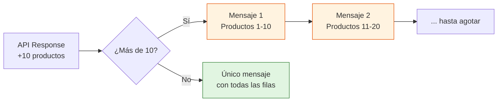
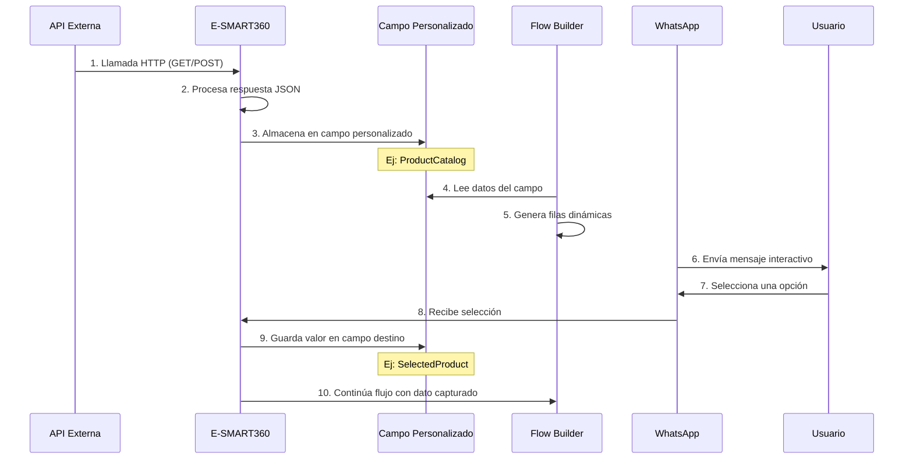
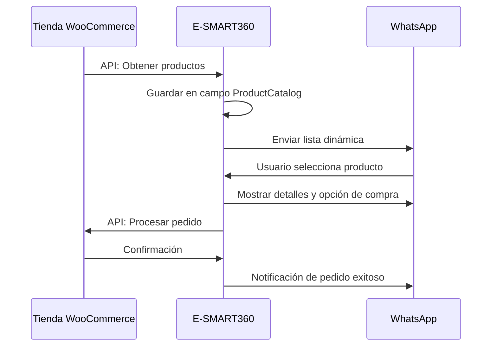

# Listas Dinámicas en Mensajes Interactivos de WhatsApp

Las listas dinámicas en E-SMART360 te permiten crear mensajes interactivos de WhatsApp generando filas automáticamente a partir de datos almacenados en campos personalizados. Estas listas se basan en objetos JSON, donde cada fila se compone con su título, descripción y valores específicos. En lugar de crear cada fila manualmente, defines las claves (como `product_name`, `price`, `description`) y las filas se llenan automáticamente con los valores obtenidos desde tu API.


> Las listas dinámicas son ideales para catálogos de productos, agendas de citas, menús interactivos, listas de precios y cualquier escenario donde necesites presentar opciones variables sin tener que crear cada fila manualmente.

## ¿Qué Son las Listas Dinámicas?

Las listas dinámicas son filas dentro de mensajes interactivos que se generan automáticamente a partir de datos JSON almacenados en un campo personalizado. Al especificar las claves apropiadas (como `product_name`, `price`, etc.), puedes crear filas personalizadas sin necesidad de definir cada una manualmente.

El objeto JSON puede guardarse para cada suscriptor mediante una llamada a la API HTTP dentro del flujo del bot. Cada suscriptor puede tener su propio conjunto de datos, lo que permite una personalización total de la experiencia.


> Las listas dinámicas hacen que los mensajes de WhatsApp sean mucho más atractivos al obtener y mostrar contenido automáticamente, ofreciendo una experiencia interactiva y personalizada. Además, al actualizar los datos en tu API, las listas se actualizan automáticamente sin necesidad de modificar el flujo del bot.

## Principales Beneficios


### ⚡ Automatización Total

Olvídate de crear filas una por una. Con las listas dinámicas, toda la generación de contenido se maneja automáticamente desde tu API o fuente de datos.

### 🎯 Personalización por Usuario

Cada suscriptor puede tener su propio conjunto de datos. Puedes enviar catálogos personalizados basados en el historial de compras, preferencias o segmentación.

### 🔄 Actualización en Tiempo Real

Cuando actualizas los datos en tu backend, el mensaje interactivo refleja automáticamente los cambios. No necesitas modificar el flujo del bot.

### 📊 Integración Multicanal

Las listas dinámicas funcionan con datos provenientes de APIs, Google Sheets, WooCommerce, Shopify y otras integraciones soportadas por E-SMART360.

## Limitaciones de los Mensajes con Listas Interactivas

WhatsApp impone una limitación importante: solo se pueden incluir **10 productos o filas** en un único mensaje interactivo.

Si necesitas mostrar más de 10 filas, deberás enviar varios mensajes interactivos. Por ejemplo, el primer mensaje puede mostrar 10 filas y los mensajes siguientes pueden contener las filas adicionales.




> El límite de 10 filas por mensaje es impuesto por WhatsApp y no puede modificarse. Si tu catálogo tiene más de 10 productos, planifica la experiencia del usuario dividiendo la información en varios mensajes y ofreciendo navegación entre ellos.

## Caso de Uso: Catálogo de Productos

Imagina que deseas enviar un catálogo de productos a un usuario. La respuesta de tu API podría verse así:

```json
[
  {
    "product_name": "Apple iPhone 15 Pro",
    "price": "$999",
    "description": "El Apple iPhone 15 Pro cuenta con un potente chip A17 Pro, sistema de cámara de 48MP y un elegante diseño de titanio para máximo rendimiento y durabilidad.",
    "buy_link": "https://www.apple.com/iphone-15-pro/"
  },
  {
    "product_name": "Samsung Galaxy S24 Ultra",
    "price": "$1,199",
    "description": "El Samsung Galaxy S24 Ultra ofrece una impresionante pantalla AMOLED de 6.8 pulgadas, una cámara de 200MP y rendimiento de vanguardia con el procesador Snapdragon más reciente.",
    "buy_link": "https://www.samsung.com/galaxy-s24-ultra/"
  },
  {
    "product_name": "Google Pixel 9 Pro",
    "price": "$899",
    "description": "El Google Pixel 9 Pro destaca por su cámara computacional, inteligencia artificial integrada y la experiencia pura de Android con actualizaciones garantizadas.",
    "buy_link": "https://store.google.com/pixel-9-pro/"
  }
]
```

Con esta funcionalidad, cada producto genera una fila dinámica con su respectivo título, descripción y botones de acción. El usuario puede seleccionar el producto que le interesa y el sistema captura automáticamente la información configurada.


> El resultado es un mensaje interactivo limpio y profesional donde cada producto aparece como una opción seleccionable, similar a un menú de opciones pero con contenido generado dinámicamente desde tus datos.

## Guía Paso a Paso

### Paso 1: Obtener Datos Usando la API HTTP

1. Accede a la sección **Integración API HTTP** en E-SMART360.
2. Configura la solicitud API para obtener tus datos (por ejemplo, el catálogo de productos).
3. Asigna la respuesta de la API a un campo personalizado (por ejemplo, `ProductCatalog`).
4. El valor mapeado debe ser de tipo **Lista de Elementos**.
5. La respuesta debe estar en formato JSON que contenga un arreglo de objetos.


### Ejemplo de Solicitud GET

```bash
GET /api/v1/productos
Host: tu-tienda.com
Authorization: Bearer tu-token-api
Content-Type: application/json
```

### Ejemplo de Solicitud POST

```bash
POST /api/v1/productos/disponibles
Host: tu-tienda.com
Authorization: Bearer tu-token-api
Content-Type: application/json

{
  "categoria": "electronica",
  "moneda": "USD",
  "limite": 10
}
```

### Ejemplo de Respuesta

```json
[
  {
    "product_name": "Apple iPhone 15 Pro",
    "price": "$999",
    "description": "Chip A17 Pro y cámara de 48MP.",
    "buy_link": "https://www.apple.com/iphone-15-pro/"
  }
]
```

> Asegúrate de que la API devuelva un arreglo JSON válido. Si la respuesta tiene una estructura diferente (por ejemplo, un objeto con una propiedad que contiene el arreglo), deberás transformarla antes de almacenarla en el campo personalizado o ajustar la configuración de mapeo.

### Paso 2: Configurar Filas Dinámicas en el Constructor de Flujos

Una vez que el campo personalizado está poblado con la respuesta de la API, configura las filas dinámicas en tu mensaje interactivo:


### Método de Generación de Filas

Dentro del Constructor de Flujos, al crear un mensaje interactivo tipo lista, busca la opción **Método de Generación de Filas** y selecciona **Dinámico**. Esto habilita la generación automática de filas basadas en los datos del campo personalizado.

### Campo Personalizado para Filas Dinámicas

Selecciona el campo personalizado que contiene los datos JSON (por ejemplo, `ProductCatalog`). Este campo debe haber sido poblado previamente con la respuesta de tu API en el paso anterior.

### Clave para el Título de la Fila Dinámica

Especifica la clave del objeto JSON que se usará como título de cada fila. Por ejemplo, usa la clave `product_name` para que los títulos se generen dinámicamente como "Apple iPhone 15 Pro" o "Samsung Galaxy S24 Ultra".

Para arreglos unidimensionales (sin claves asociativas), puedes dejar este campo vacío y el sistema usará los índices automáticamente.

### Formato de la Descripción de la Fila

Define la descripción usando una o más claves del objeto JSON. El formato es: `#nombre_campo->clave#`

Ejemplo práctico: `#ProductCatalog->price# - #ProductCatalog->description#`

Esto generará descripciones como:
```
$999 - El Apple iPhone 15 Pro cuenta con un potente chip A17 Pro...
```

Puedes combinar texto estático con múltiples referencias a claves para crear descripciones ricas y personalizadas.

### Guardar Selección en un Campo Personalizado

Elige un campo personalizado donde se almacenará la selección del usuario (por ejemplo, `SelectedProduct`). Este campo se usará más adelante en el flujo para enviar información adicional, procesar la compra o personalizar la siguiente interacción.

### Clave para el Valor Guardado

Especifica la clave del objeto JSON cuyo valor deseas capturar. Por ejemplo, si usas la clave `buy_link`, cuando el usuario seleccione un producto, el sistema guardará el enlace de compra correspondiente (como `https://www.apple.com/iphone-15-pro/`) en el campo `SelectedProduct`.


> Al completar estos pasos, cada producto aparecerá como una opción seleccionable dentro del mensaje interactivo de WhatsApp. El usuario podrá tocar la fila deseada y el sistema capturará automáticamente la información que configuraste para continuar con el flujo.

### Paso 3: Probar tu Lista Dinámica


### Vista Previa del Mensaje

Abre el Constructor de Flujos y previsualiza tu lista dinámica. Verifica que las filas se generen correctamente según la respuesta de la API. Comprueba que los títulos, descripciones y valores se muestren como esperas.

### Simular Interacción del Usuario

Interactúa con el mensaje como si fueras un usuario real utilizando el modo de prueba. Selecciona una fila y confirma que el valor seleccionado se guarda correctamente en el campo personalizado designado.

### Verificar Flujo Completo

Después de la selección, continúa ejecutando el flujo para asegurarte de que el valor capturado se usa correctamente en los pasos siguientes: mostrar detalles del producto, redirigir a la página de pago, enviar un mensaje de confirmación, etc.

### Pruebas con Diferentes Conjuntos de Datos

Realiza pruebas con diferentes cantidades de productos: menos de 10, exactamente 10, y más de 10. Verifica que el límite de WhatsApp se maneje correctamente en cada caso.

## Ejemplos de Configuración JSON

### Ejemplo 1: Catálogo de Productos

JSON de ejemplo:

```json
[
  {
    "product_name": "Apple iPhone 15 Pro",
    "price": "$999",
    "description": "Chip A17 Pro y cámara de 48MP.",
    "buy_link": "https://www.apple.com/iphone-15-pro/"
  },
  {
    "product_name": "Samsung Galaxy S24 Ultra",
    "price": "$1,199",
    "description": "Pantalla AMOLED de 6.8 pulgadas y cámara de 200MP.",
    "buy_link": "https://www.samsung.com/galaxy-s24-ultra/"
  }
]
```

**Configuración Dinámica:**
- **Título de Fila (Clave):** `product_name`
- **Descripción de Fila:** `#ProductCatalog->price# - #ProductCatalog->description#`
- **Valor Guardado (Clave):** `buy_link`

### Ejemplo 2: Fechas de Citas (Arreglo Unidimensional)

Si tienes los datos JSON guardados en el campo personalizado `AppointmentDateList`:

```json
{
    "0": "07-01-2025",
    "1": "08-01-2025",
    "2": "09-01-2025"
}
```

**Configuración Dinámica:**
1. **Método de Generación de Filas:** Dinámico
2. **Campo Personalizado para Filas Dinámicas:** `#AppointmentDateList#`
3. **Clave/Índice para Título de Fila:** Déjalo **VACÍO** (el sistema itera automáticamente porque no tiene índice asociativo).
4. **Formato de Descripción:** No requerido, o escríbelo estático (ej: "Selecciona una fecha disponible").
5. **Guardar Selección en Campo:** Mapea la selección a `#AppointmentDate#`.
6. **Clave/Índice para Valor Guardado:** Déjalo **VACÍO** para guardar el valor elegido directamente en el campo personalizado.

Esta configuración itera automáticamente los valores del JSON para poblar las filas dinámicamente, mostrando cada fecha como una opción seleccionable.

### Ejemplo 3: Fechas Anidadas en un Objeto

Si el JSON tiene una estructura más compleja con datos dentro de un objeto anidado:

```json
{
    "success": true,
    "available_dates": {
        "0": "07-01-2025",
        "1": "08-01-2025"
    }
}
```

**Configuración Dinámica:**
1. **Método de Generación de Filas:** Dinámico
2. **Campo Personalizado para Filas Dinámicas:** `#AppointmentDateList#`
3. **Clave/Índice para Título de Fila:** `available_dates`
4. **Formato de Descripción:** Déjalo VACÍO o usa texto estático.
5. **Guardar Selección:** Mapea el valor seleccionado a `#AppointmentDate#`.

Esta configuración extrae las fechas dinámicamente desde la clave `available_dates` del objeto JSON.

### Ejemplo 4: Menú de Servicios con Categorías

```json
[
  {
    "service_name": "Corte de Cabello",
    "price": "$25",
    "duration": "30 min",
    "service_id": "svc_001"
  },
  {
    "service_name": "Manicure Completo",
    "price": "$35",
    "duration": "45 min",
    "service_id": "svc_002"
  },
  {
    "service_name": "Tratamiento Facial",
    "price": "$50",
    "duration": "60 min",
    "service_id": "svc_003"
  }
]
```

**Configuración Dinámica:**
- **Título de Fila (Clave):** `service_name`
- **Descripción de Fila:** `#ServiceCatalog->price# - Duración: #ServiceCatalog->duration#`
- **Valor Guardado (Clave):** `service_id`

## Configuración Avanzada: API con Autenticación

Cuando tu API requiere autenticación, debes configurarlo en la integración HTTP de E-SMART360.


#### Bearer Token

```
Método: GET
URL: https://tu-tienda.com/api/v1/productos
Headers:
  Authorization: Bearer sk_abc123def456
  Content-Type: application/json
Response Type: List Items -> ProductCatalog
```

#### API Key en Header

```
Método: GET
URL: https://tu-tienda.com/api/v1/productos
Headers:
  X-API-Key: tu-api-key-secreta
  Content-Type: application/json
Response Type: List Items -> ProductCatalog
```

## Estrategias para Superar el Límite de 10 Filas

Cuando tu catálogo tiene más de 10 productos, necesitas una estrategia para manejar la paginación. Aquí tienes tres enfoques comprobados:

### Estrategia 1: Paginación Manual

Envía el primer bloque de 10 productos y agrega una última fila con la opción "Ver más productos →". Cuando el usuario selecciona esta opción, el bot envía el siguiente bloque de 10 productos.

```
Flujo:
1. Mensaje 1: Productos 1-10 + "Ver más →"
2. Si selecciona "Ver más": Mensaje 2: Productos 11-20 + "Ver más →"
3. Repetir hasta agotar el catálogo
```

### Estrategia 2: Categorización Previa

Antes de mostrar productos, pregunta al usuario qué categoría le interesa. Cada categoría tiene máximo 10 productos, eliminando la necesidad de paginación.

### Estrategia 3: Filtro por Palabra Clave

Pide al usuario que escriba una palabra clave (ej: "iPhone", "Samsung", "audífonos") y filtra los resultados de la API para mostrar solo los productos relevantes.


> La estrategia de categorización previa suele ser la más efectiva en términos de experiencia de usuario, ya que reduce la fricción y dirige al cliente rápidamente hacia lo que busca.

## Ejemplos de JSON para Casos Específicos

### Ejemplo 5: Paquetes de Servicios con Variantes

```json
[
  {
    "package_name": "Plan Básico Mensual",
    "price": "$29/mes",
    "features": "1000 mensajes, 1 usuario, soporte email",
    "signup_url": "https://ejemplo.com/plan-basico"
  },
  {
    "package_name": "Plan Profesional",
    "price": "$79/mes",
    "features": "5000 mensajes, 5 usuarios, soporte prioritario",
    "signup_url": "https://ejemplo.com/plan-profesional"
  },
  {
    "package_name": "Plan Enterprise",
    "price": "$199/mes",
    "features": "Mensajes ilimitados, usuarios ilimitados, soporte 24/7",
    "signup_url": "https://ejemplo.com/plan-enterprise"
  }
]
```

**Configuración:**
- **Título:** `package_name`
- **Descripción:** `#ServicePackages->price# - #ServicePackages->features#`
- **Valor Guardado:** `signup_url`

### Ejemplo 6: Ubicaciones de Sucursales

```json
[
  {
    "branch_name": "Sucursal Centro",
    "address": "Av. Principal 123, Centro",
    "phone": "+521234567890",
    "hours": "Lun-Sab 9am-8pm",
    "maps_url": "https://maps.google.com/?q=19.4326,-99.1332"
  },
  {
    "branch_name": "Sucursal Norte",
    "address": "Blvd. Norte 456, Colonia Industrial",
    "phone": "+521234567891",
    "hours": "Lun-Dom 10am-9pm",
    "maps_url": "https://maps.google.com/?q=19.5326,-99.2332"
  },
  {
    "branch_name": "Sucursal Sur",
    "address": "Anillo Periférico 789, Colonia del Valle",
    "phone": "+521234567892",
    "hours": "Lun-Sab 10am-7pm",
    "maps_url": "https://maps.google.com/?q=19.3326,-99.0332"
  }
]
```

**Configuración:**
- **Título:** `branch_name`
- **Descripción:** `#Branches->address# - Tel: #Branches->phone#`
- **Valor Guardado:** `maps_url`

Esto permite a los usuarios seleccionar una sucursal y recibir automáticamente la ubicación en Google Maps para navegar hacia ella.

### Ejemplo 7: Lista de Precios con Códigos de Producto

```json
[
  {
    "sku": "CAM-001",
    "product": "Cámara Web HD 1080p",
    "stock": 25,
    "unit_price": "$45.00"
  },
  {
    "sku": "AUD-002",
    "product": "Audífonos Inalámbricos Bluetooth 5.3",
    "stock": 50,
    "unit_price": "$35.00"
  },
  {
    "sku": "MIC-003",
    "product": "Micrófono USB Profesional",
    "stock": 10,
    "unit_price": "$89.00"
  },
  {
    "sku": "MON-004",
    "product": "Monitor 27" 4K IPS",
    "stock": 8,
    "unit_price": "$349.00"
  },
  {
    "sku": "TEC-005",
    "product": "Teclado Mecánico RGB",
    "stock": 30,
    "unit_price": "$79.00"
  }
]
```

**Configuración:**
- **Título:** `product`
- **Descripción:** `SKU: #PriceList->sku# | Stock: #PriceList->stock# | Precio: #PriceList->unit_price#`
- **Valor Guardado:** `sku` (para procesar el pedido usando el código interno)

## Flujo Completo Recomendado para Ventas

Así es como se vería un flujo de ventas completo usando listas dinámicas:


### Mensaje de Bienvenida

El bot saluda al cliente y le pregunta qué está buscando. Puede ser un mensaje de texto simple o un mensaje interactivo con categorías.

### Mostrar Catálogo Dinámico

El bot consulta la API de productos, almacena la respuesta en el campo personalizado `ProductCatalog` y envía un mensaje interactivo con las primeras 10 opciones. Si hay más de 10 productos, incluye la opción "Ver más".

### Capturar Selección

El usuario selecciona un producto. El bot guarda la selección en el campo `SelectedProduct` usando el valor de la clave configurada (por ejemplo, `buy_link` o `sku`).

### Confirmación y Detalles

El bot muestra los detalles del producto seleccionado (nombre, precio, descripción) y pregunta si desea realizar la compra o agregar al carrito.

### Procesar Pedido

Si el usuario confirma, el bot envía una solicitud a la API de tu tienda para procesar el pedido o genera un enlace de pago según corresponda.

### Notificación de Éxito

El bot envía un mensaje de confirmación con el número de pedido, resumen de la compra y estimación de entrega.


> Este flujo completo puede configurarse en E-SMART360 en menos de 30 minutos. La combinación de listas dinámicas con acciones condicionales y API externas crea una experiencia de compra completa dentro de WhatsApp.

## Solución de Problemas Comunes


### La lista no muestra filas

**Posibles causas y soluciones:**

1. **Campo personalizado vacío:** Verifica que el campo personalizado contenga datos JSON válidos. Puedes revisarlo en la sección de administración de contactos.
2. **Formato de respuesta incorrecto:** Asegúrate de que la API devuelva un **arreglo** `[...]`, no un objeto `{...}`.
3. **Clave de título incorrecta:** Confirma que la clave especificada para el título exista en **todos** los objetos del arreglo.
4. **Campo no seleccionado:** Verifica que el campo personalizado correcto esté seleccionado en la configuración de filas dinámicas.

### Error al guardar la selección del usuario

**Posibles causas y soluciones:**

1. **Campo de destino no existe:** Confirma que el campo personalizado donde se guardará la selección existe y está escrito correctamente.
2. **Clave de valor ausente:** Verifica que la clave especificada para "Valor Guardado" exista en cada objeto del arreglo.
3. **Estructura inconsistente:** Si usas índices numéricos o estructuras anidadas, asegúrate de que todos los objetos tengan la misma estructura.
4. **Prueba unitaria:** Prueba primero con un solo producto para aislar el problema antes de escalar a todo el catálogo.

### Descripciones no se muestran correctamente

**Posibles causas y soluciones:**

1. **Sintaxis incorrecta:** El formato correcto es `#NombreCampo->clave#`. Revisa que no haya espacios adicionales.
2. **Mayúsculas/minúsculas:** Los nombres de campo y clave distinguen entre mayúsculas y minúsculas. Verifica que coincidan exactamente.
3. **Múltiples claves:** Si usas varias claves en la descripción, asegúrate de que cada una use el formato `#campo->clave#` correctamente.
4. **Prueba de referencia:** Prueba con una sola clave primero para confirmar que la referencia básica funciona.

### La API no responde o da error

**Posibles causas y soluciones:**

1. **URL incorrecta:** Verifica que la URL del endpoint sea accesible públicamente.
2. **Autenticación:** Revisa que las credenciales (token, API key) sean válidas y no hayan expirado.
3. **Timeout:** Si la API tarda en responder, considera optimizarla o aumentar el tiempo de espera en la configuración.
4. **Manejo de errores:** Implementa un mensaje de respaldo en el flujo para cuando la API falle, informando al usuario que los datos no están disponibles momentáneamente.

## Arquitectura de Funcionamiento

Para entender cómo funcionan las listas dinámicas por debajo, veamos el flujo completo de datos:



Este flujo asegura que los datos viajen de forma segura desde tu fuente original hasta el usuario final, con cada paso claramente definido y configurable desde el panel de E-SMART360.

## Integración con Otras Fuentes de Datos

### Google Sheets

Puedes combinar listas dinámicas con datos provenientes de Google Sheets. Configura una integración que sincronice tu hoja de cálculo con un campo personalizado, y luego usa ese campo como origen de tu lista dinámica.

**Ventajas de esta combinación:**
- Los datos siempre están actualizados sin intervención técnica
- Cualquier miembro del equipo puede modificar la hoja de cálculo
- Ideal para inventarios que cambian frecuentemente
- Sincronización automatizada en intervalos regulares

### WooCommerce

E-SMART360 se integra nativamente con WooCommerce. Puedes conectar tu tienda, obtener los productos mediante la API REST de WooCommerce, almacenar el catálogo en un campo personalizado y luego presentarlo como lista dinámica en WhatsApp.



### Shopify

De manera similar, puedes integrar tu tienda Shopify con E-SMART360 para obtener el catálogo de productos y mostrarlos como listas dinámicas. El proceso es análogo al de WooCommerce, adaptando los endpoints de la API de Shopify.

## Casos de Éxito y Ejemplos Prácticos


### 🛒 Tienda de Ropa Online

Una tienda de moda implementó listas dinámicas para mostrar su colección semanal. Cada lunes, su API actualizaba automáticamente el catálogo con los nuevos productos. Los clientes recibían un mensaje interactivo con las últimas prendas, podían seleccionar una para ver detalles y precios, y el bot les guiaba hasta la compra. **Resultado:** incremento del 34% en ventas por WhatsApp en el primer mes.

### 🏥 Clínica Dental

Una clínica dental usó listas dinámicas para mostrar horarios disponibles. Su sistema de agendamiento enviaba las fechas libres vía API, el paciente seleccionaba su preferencia y el bot confirmaba la cita automáticamente. **Resultado:** redujeron las llamadas telefónicas en un 60% y eliminaron los conflictos de agendas duplicadas.

### 🍕 Restaurante con Menú Semanal

Un restaurante conectó su menú semanal desde Google Sheets. Los clientes recibían cada viernes un mensaje con los platillos disponibles para el fin de semana. Podían seleccionar, personalizar ingredientes y hacer el pedido directamente desde WhatsApp. **Resultado:** el 78% de los pedidos del fin de semana llegaban a través de este canal.

### 💻 Agencia de Marketing Digital

Una agencia usó listas dinámicas para presentar paquetes de servicios a sus leads. Cada prospecto recibía un menú interactivo con planes de marketing, precios y descripciones. Al seleccionar un plan, el bot almacenaba la preferencia y disparaba un flujo de seguimiento personalizado. **Resultado:** la tasa de conversión de lead a cliente aumentó un 42%.

## Mejores Prácticas

- **API Responses Bien Formateadas:** Asegúrate de que la respuesta de la API sea un arreglo JSON válido de objetos. Un formato incorrecto causará errores en la generación de filas. Siempre valida tu JSON con herramientas como JSONLint antes de integrarlo.

- **Usa Claves y Descripciones Claras:** Mantén tus claves intuitivas (`product_name`, `price`, `description`) y las descripciones amigables para el usuario. Esto facilitará el mantenimiento a largo plazo y mejorará la experiencia del cliente.

- **Prueba Antes de Implementar:** Verifica que las filas se generen dinámicamente y que las selecciones se guarden correctamente en los campos designados. Realiza pruebas con usuarios beta antes de lanzar al público general.

- **Optimiza para Dispositivos Móviles:** Recuerda que la mayoría de los usuarios de WhatsApp acceden desde sus teléfonos. Las descripciones deben ser concisas (máximo 2 líneas) y los títulos claros. Los usuarios deben poder entender cada opción de un vistazo.

- **Maneja Errores de API:** Implementa lógica condicional en tu flujo para manejar casos donde la API no responda o devuelva datos vacíos. Puedes configurar un mensaje alternativo como: "Lo sentimos, los productos no están disponibles en este momento. Por favor, intenta más tarde."

- **Respeta el Límite de 10 Filas:** Si tu conjunto de datos tiene más de 10 elementos, planifica cómo dividir la información en múltiples mensajes interactivos. Considera ofrecer una opción de "Ver más" que dispare el siguiente bloque de productos.

- **Campos Personalizados Descriptivos:** Usa nombres claros para tus campos personalizados como `ProductCatalog`, `ServiceMenu`, `AppointmentDates`. Esto facilita la gestión cuando tengas múltiples listas dinámicas en diferentes flujos.


> La función de listas dinámicas de E-SMART360 proporciona una forma potente y sencilla de crear mensajes de WhatsApp personalizados e interactivos. Al hacer referencia a claves específicas de objetos JSON, puedes poblar dinámicamente filas con datos relevantes como nombres de productos, descripciones y enlaces, todo sin necesidad de codificación compleja.

## Preguntas Frecuentes


### ¿Cuántos productos puedo mostrar en una lista dinámica?

WhatsApp limita cada mensaje interactivo a un máximo de 10 filas. Si necesitas mostrar más de 10 productos, deberás enviar múltiples mensajes interactivos. Por ejemplo, el primer mensaje muestra productos del 1 al 10, el segundo del 11 al 20, y así sucesivamente. Planifica la experiencia del usuario para que la navegación entre mensajes sea fluida e intuitiva. Puedes incluir texto que indique "Mostrando productos 1-10 de 25. Responde 'más' para ver los siguientes."

### ¿Qué formato JSON necesita mi API para funcionar con listas dinámicas?

Tu API debe devolver un **arreglo JSON de objetos** (corchetes `[...]`). Cada objeto representa una fila y debe contener las claves que usarás para el título, la descripción y el valor a guardar. Ejemplo correcto: `[{"product_name": "...", "price": "..."}]`. La respuesta se almacena en un campo personalizado de tipo "Lista de Elementos". Si tu API devuelve un objeto en lugar de un arreglo, puedes usar una transformación intermedia o una función serverless para convertir la estructura.

### ¿Puedo usar listas dinámicas para agendar citas?

Sí, absolutamente. Las listas dinámicas son ideales para agendar citas. Puedes cargar fechas disponibles desde tu API y mostrarlas como opciones seleccionables. Los ejemplos de configuración incluyen tanto arreglos unidimensionales de fechas como estructuras anidadas con objetos. El sistema itera automáticamente los valores para generar las filas. Además, puedes combinar esto con el Sistema de Reserva de Citas de E-SMART360 para una solución completa de agendamiento.

### ¿Qué pasa si mi API no responde o devuelve datos vacíos?

Es altamente recomendable agregar lógica condicional en tu flujo para manejar estos casos. Puedes configurar un mensaje alternativo que informe al usuario que los productos no están disponibles momentáneamente. También puedes implementar reintentos automáticos (por ejemplo, hasta 3 intentos con 5 segundos de espera) o notificaciones al administrador cuando la API falle. En casos críticos, considera tener un catálogo de respaldo estático.

### ¿Las listas dinámicas funcionan con Google Sheets?

Sí, puedes combinar listas dinámicas con datos de Google Sheets. Configura una integración que sincronice tu hoja de cálculo con un campo personalizado, y luego usa ese campo como origen de tu lista dinámica. Esto es especialmente útil para equipos de marketing y ventas que actualizan precios, inventarios o catálogos sin intervención técnica. Los cambios en la hoja de cálculo se reflejan automáticamente en los mensajes interactivos.

### ¿Puedo usar listas dinámicas con productos de WooCommerce?

Sí, E-SMART360 se integra nativamente con WooCommerce. Puedes conectar tu tienda, obtener los productos mediante la API REST de WooCommerce, almacenar el catálogo en un campo personalizado y luego presentarlo como lista dinámica en WhatsApp. Esto te permite ofrecer un escaparate móvil completo sin que el usuario tenga que salir de la aplicación de mensajería. El proceso es automático: cuando agregas un producto nuevo en WooCommerce, aparece en tu lista dinámica sin configuración adicional.

### ¿Qué hago si la respuesta JSON tiene una estructura compleja con datos anidados?

Para estructuras JSON complejas, puedes usar transformaciones dentro del flujo del bot o preprocesar los datos con una API intermedia que aplane la estructura. E-SMART360 soporta la extracción de claves anidadas mediante la configuración adecuada en el campo personalizado. Si tu JSON tiene múltiples niveles, revisa los ejemplos de configuración con objetos anidados que compartimos en esta guía. También puedes usar servicios como Zapier o Make para transformar los datos antes de que lleguen a tu bot.

### ¿Puedo tener múltiples listas dinámicas en un mismo flujo?

Sí, puedes tener tantas listas dinámicas como necesites en un mismo flujo del bot. Cada lista se configura de forma independiente con su propio campo personalizado y configuración de claves. Por ejemplo, puedes tener un flujo que primero muestre categorías de productos (lista dinámica 1) y luego, según la categoría seleccionada, muestre los productos específicos (lista dinámica 2) con sus detalles correspondientes.

### ¿Las listas dinámicas consumen créditos de WhatsApp?

Sí, cada mensaje interactivo que contiene una lista dinámica cuenta como un mensaje dentro de la sesión activa con el usuario. Si estás dentro de la ventana de 24 horas de servicio al cliente, no hay costo adicional. Si inicias una conversación con un mensaje de lista dinámica sin que el usuario haya iniciado el contacto (conversación de marketing), se aplicará la tarifa correspondiente según el tipo de conversación. Consulta los precios actualizados en la sección de facturación de E-SMART360.

## Conclusión

La función de listas dinámicas de E-SMART360 transforma la forma en que las empresas se comunican con sus clientes en WhatsApp. Al automatizar la generación de filas a partir de datos JSON, eliminas la necesidad de crear manualmente cada opción, ahorrando tiempo valioso y reduciendo errores humanos.


### 🚀 Implementación Rápida

Configura tu primera lista dinámica en menos de 15 minutos siguiendo los pasos de esta guía. No necesitas conocimientos de programación.

### 📈 Escalabilidad Garantizada

Las listas dinámicas crecen con tu negocio. Añade más productos, servicios u opciones sin modificar el flujo del bot.

### 🎨 Experiencia Premium

Ofrece a tus clientes una experiencia interactiva de nivel profesional directamente en WhatsApp, donde ya pasan la mayor parte de su tiempo.

Ya sea que manejes un catálogo de productos, un sistema de citas, un menú de servicios o cualquier otro conjunto de opciones variables, las listas dinámicas te permiten ofrecer una experiencia interactiva, personalizada y profesional que impulsa la satisfacción del cliente y las ventas.

Comienza a usar listas dinámicas hoy mismo para elevar la interacción con tus usuarios y proporcionar experiencias a medida que marquen la diferencia en tu negocio.
