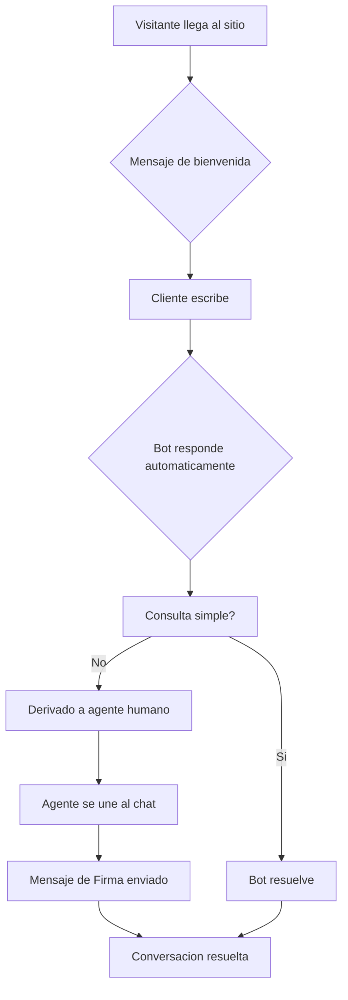
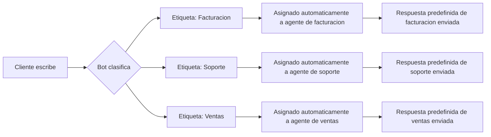

> Hasta un **70% de los compradores en línea abandonan sus carritos de compra**, a menudo porque no reciben atención al cliente oportuna. Según investigaciones de Forrester Research, esto representa pérdidas que superan los **$18 mil millones anuales** para la industria del comercio electrónico. El **Live Chat con Bandeja Compartida de E-SMART360** resuelve este problema al permitir comunicación en tiempo real y personalizada a través de **WhatsApp, Facebook Messenger, Instagram DM, Telegram y Web Chat**, todo desde un panel centralizado.

Con funciones como **chatbot con IA + transferencia a humano**, **colaboración en equipo**, **recordatorios de seguimiento**, **traducción en el chat**, **respuestas predefinidas**, **compartición de archivos multimedia** y **análisis detallados**, E-SMART360 garantiza que ningún mensaje de cliente quede sin respuesta. Mejora la participación, reduce el abandono de carritos, aumenta las conversiones y mejora la retención de clientes, todo a una **fracción del costo de otras plataformas de chat en vivo**, desde solo **$8.99/mes**.

En resumen: E-SMART360 combina automatización, soporte en vivo y precios accesibles para ofrecer una solución completa de atención al cliente basada en WhatsApp para empresas modernas.

> **Live Chat con Bandeja Compartida (15 Abril 2026)**
> El Live Chat con Bandeja Compartida de E-SMART360 está disponible en todos los planes de suscripción. La prueba gratuita incluye acceso completo a todas las funciones del Live Chat con límites de uso estándar. Para equipos grandes, se recomienda el plan Enterprise que incluye agentes ilimitados y soporte prioritario.

---

## ¿Qué es el Live Chat con Bandeja Compartida?

El Live Chat es una herramienta que te permite hablar con tus clientes o visitantes desde tu sitio web en tiempo real, de la misma forma que cualquier plataforma de mensajería como WhatsApp o Messenger.

El **Live Chat con Bandeja Compartida** reúne la comunicación en tiempo real con la eficiencia de una plataforma donde los equipos de soporte pueden gestionar, rastrear y responder mensajes de forma colaborativa. Proporciona a las empresas un espacio unificado para manejar consultas de soporte, comentarios y solicitudes, asegurando que ningún mensaje pase desapercibido.

E-SMART360 ofrece Live Chat con **Bandeja Compartida para WhatsApp**, Facebook Messenger, Instagram DM, Telegram y Web Chat. Esto significa que puedes conectar todas tus páginas de negocio o perfiles de WhatsApp, Facebook, Instagram, Telegram y Web Chat en una sola plataforma centralizada y operar tu soporte al cliente con todo tu equipo.

Esta solución es especialmente valiosa para empresas que manejan un alto volumen de mensajes provenientes de diferentes canales, ya que elimina la necesidad de tener múltiples ventanas abiertas con interfaces diferentes. Todo está unificado, lo que simplifica la gestión, reduce los errores y mejora los tiempos de respuesta de forma significativa.

> El Live Chat con Bandeja Compartida combina el poder de los chatbots con la flexibilidad del chat en vivo, lo que puede traducirse en un éxito significativo en tu estrategia de atención al cliente omnicanal.

---

## Beneficios de la Bandeja Compartida en Vivo

### Comunicación en Tiempo Real

El chat en vivo te permite responder consultas de clientes al instante, reduciendo los tiempos de espera y aumentando la satisfacción del cliente. Nadie quiere esperar, y hoy en día los clientes tienen muy poca paciencia, especialmente cuando están en línea y pueden irse a la competencia con un solo clic.

### Interacción Personalizada

El chat en vivo en WhatsApp permite que tus agentes de soporte se comuniquen de manera más personalizada con tus clientes. De esta forma, tus agentes pueden enfocarse en las necesidades individuales de cada cliente, y el cliente se sentirá más satisfecho al recibir una atención que parece diseñada específicamente para él.

### Mayor Participación del Cliente

Cuando tus clientes reciben respuestas consistentes que resuelven sus problemas de manera efectiva, regresarán una y otra vez. Esto abre una gran oportunidad para que tu negocio gane la confianza de los clientes, aumentando las probabilidades de conversión y generando mayores tasas de participación en tus campañas de marketing.

### Mejora en la Retención de Clientes

Con un soporte rápido y eficiente, los clientes tienden a mantenerse leales a una marca, lo que se traduce en tasas de retención más altas. La retención de clientes es uno de los indicadores más importantes para cualquier negocio, ya que retener a un cliente existente cuesta significativamente menos que adquirir uno nuevo.

### Reducción del Abandono de Carritos

Estudios muestran que hasta un 70% de los compradores en línea abandonan sus carritos de compra. Una de las principales razones que los clientes citan es la falta de soporte al cliente por parte de las empresas en línea. El Live Chat de E-SMART360 aborda directamente este problema al permitir que los agentes intervengan en el momento exacto en que un cliente tiene una duda, resolviéndola al instante y evitando que abandone la compra.

> Cada carrito abandonado representa una venta perdida. Con el Live Chat de E-SMART360, puedes recuperar una parte significativa de esas ventas al estar presente justo cuando el cliente te necesita. La combinación de automatización con chatbot y atención humana personalizada crea una experiencia de soporte completa que cubre todas las etapas del customer journey.

---

## Cómo usar el Live Chat con Bandeja Compartida en tu Sitio Web

### Crear un widget de chat para WhatsApp

Para usar el Live Chat de WhatsApp en tu sitio web, primero debes crear un widget de chat desde la configuración del Bot Manager en E-SMART360. Al crear el widget, asegúrate de usar tu número oficial de WhatsApp Business para la cuenta del bot. El sistema te guiará a través de los pasos necesarios para configurar correctamente la integración con tu sitio web.

### Insertar el código del widget en tu sitio web

Una vez creado el widget de chat, recibirás un código embed (código para incrustar). Puedes insertarlo en tu página de inicio y en cualquier otra página importante donde creas que sería beneficioso tenerlo. Esto permite que tus clientes inicien una conversación con un agente en vivo si tienen preguntas o necesitan asistencia mientras navegan por tu sitio.

### Integrar el Asistente de IA

Puedes integrar el Asistente de IA de E-SMART360 a tu chatbot para manejar consultas comunes automáticamente. Si es necesario, tus agentes pueden tomar el control de la conversación posteriormente para ayudar al cliente de forma más directa. Esta combinación de automatización más atención humana es ideal para escalar tu soporte sin sacrificar calidad.

### Configurar el equipo de agentes

Crea los perfiles de tus agentes de soporte desde el panel de administración. Asigna roles y permisos según sea necesario. Cada agente podrá acceder a la bandeja compartida y gestionar las conversaciones asignadas.

> Puedes usar el mismo proceso para Facebook Messenger, Instagram DM y Telegram. Cada plataforma tiene su propio widget que puedes integrar en tu sitio web siguiendo los mismos pasos. La bandeja compartida unifica todos estos canales en una sola interfaz, sin importar desde qué canal te escriba el cliente.

---

## Live Chat para Web Chat

Al igual que el Live Chat para WhatsApp, puedes comunicarte directamente con tus clientes a través del Web Chat integrado en tu sitio web. Muchos clientes prefieren hablar directamente contigo a través del chat web en lugar de abrir otra aplicación. E-SMART360 te permite a ti y a tu equipo comunicarte con ellos mediante el Live Chat desde la misma bandeja compartida donde gestionas WhatsApp, Messenger, Instagram y Telegram.

El Web Chat es particularmente útil para:

- **Sitios web de comercio electrónico** donde los clientes tienen dudas sobre productos antes de comprar
- **Páginas de servicios profesionales** donde se requiere una consulta rápida antes de contratar
- **Portales educativos** donde los estudiantes necesitan asistencia inmediata con sus cursos
- **Landing pages de campañas de marketing** donde la atención en tiempo real marca la diferencia
- **Sitios de membresía o suscripción** donde los usuarios necesitan ayuda con su cuenta o pagos
- **Cualquier sitio web** donde la atención al cliente sea una prioridad estratégica

> Puedes configurar la apariencia del Web Chat (tema, colores, estilos) para que coincida con la identidad visual de tu marca, ofreciendo una experiencia de usuario consistente en todo tu sitio web. También puedes personalizar los mensajes de bienvenida y las respuestas automáticas iniciales.

---

## Colaboración en Equipo

La plataforma de Live Chat de E-SMART360 facilita que tú y tu equipo ayuden a los clientes con sus problemas o consultas. También permite trabajar en equipo de manera eficiente gracias a su funcionalidad de colaboración.

### Comunicación Personalizada

Con las diversas herramientas del chat en vivo, puedes hablar con tus clientes como si los conocieras de toda la vida, basándote en sus datos históricos. Por ejemplo, cuando un cliente inicia una conversación por primera vez, puedes guardar información importante en una nota del chat. Cuando ese cliente regrese días o semanas después, podrás usar esos datos para brindarle una atención excelente y relevante.

Esto asegura que cada interacción con un cliente sea pertinente, lo que aumenta la satisfacción y la lealtad hacia tu marca. Los agentes pueden ver rápidamente el historial completo de la conversación, las notas agregadas por otros agentes y los campos personalizados con información relevante del cliente.

### Colaboración en Equipo

E-SMART360 está diseñada pensando en la colaboración en equipo. Múltiples agentes pueden atender diferentes consultas de clientes simultáneamente, lo que garantiza respuestas completas y rápidas. Esta función es especialmente beneficiosa para equipos remotos, permitiéndoles colaborar eficazmente desde cualquier ubicación geográfica.

Las herramientas de colaboración incluyen:

- **Notas internas** que permiten a los agentes compartir información relevante sobre el cliente sin que este vea las notas
- **Etiquetas** para categorizar conversaciones por tipo, urgencia o tema
- **Asignación de agentes** para distribuir la carga de trabajo de manera equitativa
- **Historial completo** de cada conversación para que cualquier agente pueda retomarla sin perder contexto
- **Mensajes de Firma** para presentar al nuevo agente cuando se une a una conversación en curso
- **Bandeja compartida** donde todos los agentes pueden ver las conversaciones activas y asignadas

### Herramientas de Colaboración para Equipos Remotos

E-SMART360 tiene herramientas que ayudan a los equipos a trabajar juntos incluso si no están en el mismo lugar. Estas herramientas incluyen bandejas compartidas, asignación de tareas a diferentes personas y formas de trabajar en tiempo real para que todos estén en la misma página.

### Analítica y Reportes

La plataforma proporciona herramientas detalladas de análisis e informes que ayudan a las empresas a rastrear las interacciones con los clientes y el rendimiento del equipo. Puedes obtener datos sobre:

- Tiempo promedio de respuesta por agente y por canal
- Volumen de conversaciones gestionadas por cada agente
- Tasa de resolución en el primer contacto
- Canales con mayor actividad y demanda
- Horarios pico de atención al cliente
- Número de conversaciones resueltas vs. pendientes
- Satisfacción del cliente post-interacción

Estos datos son invaluables para tomar decisiones informadas y mejorar continuamente el servicio al cliente. Puedes identificar qué agentes necesitan más capacitación, qué canales son más efectivos y en qué horarios debes asignar más personal.

> Las herramientas de colaboración están diseñadas para que los agentes puedan trabajar en problemas complejos sin que el cliente sea consciente de los traspasos internos, lo que garantiza una experiencia fluida y profesional.

---

## Funciones del Live Chat Explicadas en Detalle

El Live Chat de E-SMART360 es una herramienta con muchas funcionalidades. Al iniciar sesión en tu cuenta de administrador e ir al Live Chat de WhatsApp desde el panel de control, verás que toda la página se divide en tres secciones principales:

### Sección de Lista de Suscriptores

Esta sección está diseñada principalmente para mostrar todos tus suscriptores de WhatsApp en un solo lugar. Cuando pones tu número de WhatsApp Business en tu sitio web o insertas un widget de chat, cada vez que un cliente te envía un mensaje en ese número o widget, instantáneamente se convierte en tu suscriptor.

También puedes importar contactos de WhatsApp desde una hoja de Google Sheets directamente a E-SMART360 para tener una base de datos centralizada y comenzar conversaciones desde la bandeja compartida.

**Barra de Búsqueda:** En la parte superior hay una barra de búsqueda. Simplemente escribe el nombre de un suscriptor para localizarlo rápidamente y comenzar un chat con él. Esta función es especialmente útil durante los momentos de mayor actividad cuando estás gestionando múltiples conversaciones simultáneamente. Si un cliente se demora en responder, puedes cambiar fácilmente a otro chat sin perder el hilo de la conversación original.

**Búsqueda Avanzada con Filtros:** Junto a la barra de búsqueda hay un botón de filtro. Al hacer clic, puedes filtrar suscriptores por:

- **Etiquetas** — Aparece un menú desplegable con todas las etiquetas disponibles. Al seleccionar una, la lista de suscriptores mostrará solo aquellos que tengan esa etiqueta.
- **Secuencias** — Similar a las etiquetas, te permite filtrar suscriptores que están bajo una secuencia automatizada específica.
- **Ordenar por:**
  - *Respuesta Reciente del Suscriptor* — Muestra primero los suscriptores que han respondido recientemente a tus mensajes.
  - *Comunicación Reciente* — Muestra primero los suscriptores a los que has respondido recientemente.

**Gestión de Chats:**
- **Míos:** Chats asignados a agentes específicos. Cada agente puede ver solo las conversaciones que le han sido asignadas.
- **Todos los chats:** Lista completa de todas las conversaciones activas.
- **No leídos:** Mensajes que requieren atención inmediata. Ideal para priorizar en horas pico.
- **Archivados:** Conversaciones pasadas guardadas para referencia futura o análisis. Al analizar chats archivados, las empresas pueden identificar áreas de mejora, capacitar nuevos agentes y cumplir con regulaciones.
- **Bloqueados:** Mensajes no deseados o spam.
- **Resueltos:** Problemas solucionados que se pueden consultar posteriormente.

**Importación de Contactos:**
Puedes importar contactos de WhatsApp desde Google Sheets a E-SMART360 para centralizar tu base de datos de clientes y comenzar a conversar con ellos desde la bandeja compartida. El proceso es simple: conecta tu hoja de cálculo, selecciona las columnas con los datos de contacto y el sistema importa automáticamente los registros.

### Sección de Ventana de Chat

Esta es la sección más importante del Live Chat, donde realmente chateas con tus clientes. Incluye funciones avanzadas:

**Marcar Como:** Puedes marcar cualquier chat como no leído, archivarlo o bloquear a clientes spam. Simplemente selecciona un suscriptor de la lista, haz clic en Marcar Como y elige la acción necesaria.

**Recordatorio de Seguimiento:** Esta función actúa como un recordatorio que te permite programar una hora para responder a un cliente cuando no puedes hacerlo de inmediato. Es especialmente útil durante períodos de alta demanda. Haz clic en el botón de recordatorio, elige una hora predefinida o personaliza la fecha y hora. El sistema te notificará cuando llegue el momento, asegurando que ningún cliente quede sin respuesta.

**Traducir Mensaje:** Permite traducir instantáneamente mensajes de texto de un idioma a otro. Es particularmente útil para empresas que atienden a una base global de clientes. Si un cliente extranjero te envía un mensaje en su idioma, simplemente haz clic en el botón de traducir para ver el mensaje en tu idioma predeterminado. Luego puedes responderle en su propio idioma, lo que mejora la experiencia de soporte y genera confianza. La traducción es automática y no requiere configuración adicional de idiomas.

**Mensajes de Firma:** Los Mensajes de Firma permiten que el cliente sepa que un agente está tomando la conversación. Pueden incluir el nombre del agente, su cargo y otra información personalizada. Al hacer clic en esta opción, se envía automáticamente un mensaje al cliente presentando al nuevo agente.

**Proceso para usar Mensajes de Firma:**
1. Haz clic en el nombre del suscriptor desde la sección de suscriptores.
2. Verifica si otro agente ya está conversando con este cliente.
3. Si deseas unirte, marca la opción "Enviar Mensaje de Firma al suscriptor" y haz clic en "Unirse al Chat".
4. El mensaje de firma se enviará automáticamente.
5. Para salir, usa el botón "Acción" y selecciona "Salir del Chat".

**Indicador de Escritura:** Muestra automáticamente un indicador "escribiendo..." en el Live Chat cuando un agente comienza a escribir, cuando hace clic en el cuadro de mensaje, o cuando el bot está generando una respuesta. WhatsApp oculta automáticamente el indicador después de 25 segundos de inactividad o cuando se envía un mensaje. Mantiene a los clientes informados durante las transferencias entre agentes o cuando el bot está generando una respuesta.

**Cómo activar el Indicador de Escritura:**
1. Ve a Bot Manager desde la sección de WhatsApp.
2. Desplázate hacia abajo hasta Configuración.
3. Localiza TYPING ON INDICATOR y actívalo.

**Reescribir con IA:** Corrige automáticamente la gramática, ortografía y puntuación de tus mensajes. Escribe tu mensaje, haz clic en Reescribir con IA y el mensaje será corregido antes de enviarlo. Esto garantiza una comunicación profesional y sin errores en todo momento.

**Enviar Flows o Plantillas de Mensaje:** Son secuencias preescritas de mensajes o flujos del bot. Haz clic en el botón de Plantillas, selecciona una de la lista, proporciona valores para las variables y envíala. Puedes crear estas plantillas desde el Bot Reply, aunque no se pueden crear directamente desde la ventana de chat.

**Respuestas Predefinidas:** También conocidas como Canned Responses, son mensajes preescritos para preguntas frecuentes. Haz clic en el botón de Respuesta Predefinida, elige una o crea una nueva directamente. Son ideales para acelerar respuestas a consultas comunes como horarios, precios o políticas de devolución.

**Archivos Adjuntos:** Comparte documentos, imágenes o capturas de pantalla. Soporta arrastrar y soltar, envío múltiple de archivos y reproducción de audio/video directamente en la ventana de chat.

**Envío Múltiple de Archivos:**
1. Mantén CTRL y selecciona varios archivos.
2. Arrástralos al ícono del navegador y suéltalos en la ventana de chat.
3. Agrega un pie de foto o haz clic en Guardar para enviarlos todos.

**Audio y Video Incrustados:** Puedes compartir y reproducir archivos de audio y video directamente en la ventana de chat. Esto es fundamental para soporte técnico. Por ejemplo, si un cliente envía un video mostrando un error de software, el agente puede reproducirlo directamente sin necesidad de abrir otra pestaña del navegador. Esto facilita demostraciones de productos, diagnósticos técnicos y comunicación visual en general.

### Sección de Acciones de Chat

Esta sección mejora la eficiencia del soporte y simplifica los flujos de trabajo del equipo.

**Botón de Acción:**
- **Suscribir / Dar de Baja:** Suscribe o cancela la suscripción de un cliente según sea necesario.
- **Reanudar / Pausar Respuesta del Bot:** Toma el control de la conversación manualmente o devuélveselo al bot cuando hayas terminado.
- **Restablecer Flujo de Entrada:** Reinicia los flujos de entrada del usuario con un solo clic.
- **Borrar Historial:** Limpia el historial de chat de tu lado (el cliente conserva el suyo intacto).
- **Salir del Chat:** Cuando hayas terminado de ayudar al cliente, sales de la conversación.

**Asignar Agente:** Asigna un agente a un suscriptor específico. El agente recibe una notificación inmediata. Haz clic en Asignar Agente, elige un agente de la lista (puedes ver quién está activo) y guarda los cambios.

**Etiquetas:** Categoriza clientes por tema (facturación, soporte técnico, devoluciones), ubicación o agente. Facilita encontrar conversaciones y analizar datos. Puedes agregar múltiples etiquetas a un mismo cliente.

**Campos Personalizados:** Recopila datos esenciales del cliente (dirección, teléfono, preferencias) para ofrecer asistencia más personalizada. Puedes crear nuevos campos desde el administrador de suscriptores. Para equipos grandes, almacenar información en campos personalizados ayuda a los agentes a comprender rápidamente el historial del chat.

**Agregar Notas:** Guarda información importante sobre el cliente. Cada nota muestra qué agente la agregó y cuándo. Ayuda a tu equipo a entender rápidamente la conversación sin tener que leer todo el historial.

**Ventana de 24 Horas:** Temporizador que indica cuánto tiempo queda antes de que la ventana de chat se cierre según la regla de 24 horas de WhatsApp. Fuera de esta ventana, solo puedes usar plantillas de mensaje aprobadas. El contador se reinicia cada vez que el cliente te envía un mensaje.

---

## Transferencia de Chat y Mensajes de Firma

Las funciones "Unirse al Chat" y "Mensaje de Firma" mejoran el trabajo en equipo y garantizan transiciones fluidas entre agentes.

### Función "Unirse al Chat"

Permite que los agentes tomen una conversación en curso. El nuevo agente puede intervenir sin problemas para continuar asistiendo al cliente.

**Casos de uso principales:**
- Un cliente solicita hablar con un miembro diferente del equipo
- Un cliente está frustrado y el agente actual no puede resolver el problema
- Transferencia a un miembro más especializado (de soporte técnico a ventas)
- Un agente toma un descanso y otro compañero continúa la conversación
- Escalamiento a un supervisor o gerente
- Cambio de turno entre agentes

### Cómo Configurar los Mensajes de Firma

Configurar los Mensajes de Firma en E-SMART360 es un proceso sencillo que mejora significativamente la comunicación profesional de tu equipo.

### Acceder al Panel de Configuración

Inicia sesión en tu cuenta de E-SMART360 y ve a la sección de Bot Manager. Luego selecciona la pestaña de Configuración.

### Activar Mensajes de Firma

Localiza la sección "Signature Message Configuration" y activa el interruptor "Enable Signature Message".

### Personalizar el Mensaje por Defecto

En el campo "Default Signature Message", ingresa el mensaje que deseas. Por ejemplo: "Hola, soy [Nombre], agente de soporte de E-SMART360. En qué puedo ayudarte?" La variable [Nombre] se reemplazará automáticamente con el nombre del agente.

### Personalización por Agente

Cada agente puede personalizar su firma desde su configuración de perfil (Miembro > Configuración de la Cuenta) para incluir su cargo o un saludo personalizado.

### Guardar Cambios

Haz clic en "Guardar Cambios" para aplicar la configuración. Activar esta función también habilita la opción "Unirse al Chat", requiriendo que los agentes se unan antes de responder.

> Los Mensajes de Firma añaden profesionalismo, transparencia y claridad al presentar al agente que maneja el chat, mejorando la confianza del cliente. Cuando el Indicador de Escritura está activo junto con los Mensajes de Firma, los clientes ven "escribiendo..." durante las transferencias, lo que crea una experiencia más fluida.

### Guía Completa de Configuración de Mensajes de Firma

Además de los pasos básicos, aquí tienes detalles adicionales para aprovechar al máximo esta función:

**Campos Dinámicos:**
Puedes usar campos dinámicos como [Nombre] en tus mensajes de firma para que se auto-completen automáticamente con la información del agente que se une a la conversación.

**Control de Respuestas del Bot:**
Puedes deshabilitar las respuestas automáticas del bot cuando los Mensajes de Firma están activados, garantizando interacciones puramente humanas.

**Tiempo de Reactivación Automática:**
Configura el tiempo de reactivación automática del bot para asegurar seguimientos oportunos con los clientes después de que un agente abandona la conversación.

**Cómo Probar tu Mensaje de Firma:**
Antes de implementarlo en producción, es recomendable probar la configuración:
1. Únete a un chat como agente.
2. Envía un mensaje de prueba para verificar que el Mensaje de Firma se agrega correctamente.
3. Revisa que el nombre del agente aparezca correctamente.
4. Verifica que el mensaje se muestre profesionalmente al cliente.

### Preguntas Frecuentes sobre Mensajes de Firma

### Puedo usar firmas diferentes para cada agente?

Sí, cada agente puede configurar su firma personalizada desde la sección de Configuración de Miembro. Pueden incluir su nombre, cargo y cualquier información adicional relevante.

### Los Mensajes de Firma funcionan en todos los canales?

Sí, los Mensajes de Firma funcionan perfectamente en WhatsApp, Facebook Messenger, Instagram DM, Telegram y Web Chat, garantizando una comunicación consistente en todas las plataformas.

### Qué sucede cuando habilito los Mensajes de Firma?

Al habilitar esta función, también se activa la opción "Unirse al Chat", que requiere que los agentes se unan explícitamente a una conversación antes de poder responder. Los demás agentes pueden ver la conversación pero no responder hasta que se unan.

### Puedo actualizar la firma después de configurarla?

Absolutamente. Puedes modificar el Mensaje de Firma en cualquier momento desde el panel de Configuración o desde la Configuración de Miembro de cada agente.

### Un agente puede salir de un chat si es necesario?

Sí, los agentes tienen la opción de abandonar el chat una vez que su parte en la conversación está completa. Esto asegura que el chat se mantenga ordenado y permite que otros agentes tomen el control si es necesario.

---

## Comparativa de E-SMART360 con Otras Plataformas de Live Chat

Cuando se trata de elegir una plataforma de chat en vivo para WhatsApp, existen varias opciones disponibles. Sin embargo, la plataforma de E-SMART360 ofrece ventajas distintas sobre sus competidores:

| Característica | E-SMART360 | LiveChat | Tidio | HubSpot | Intercom |
|---|---|---|---|---|---|
| Facilidad de uso | 5 estrellas | 4 estrellas | 3 estrellas | 4 estrellas | 5 estrellas |
| Cambio de tema | Si | Si | Si | Si | Si |
| Integración con IA | Si | Si | Si | Si | Si |
| Respuestas predefinidas | Si | Si | Si | Si | Si |
| Traducción de mensajes | Si | Si | No | Si | Si |
| Traducir a cualquier idioma | Si | No | No | No | No |
| Colaboración en equipo | Si | Si | Si | Si | Si |
| Enviar Flows de WhatsApp | Si | No | No | No | No |
| Recordatorio de seguimiento | Si | No | No | No | No |
| Convertir audio a texto | Si | No | No | No | No |
| Sistema de tickets | Si | Si | Si | Si | Si |
| Prueba gratuita | Si | No | Si | Si | No |
| Precio inicial | $8.99/mes | $20/mes | $29/mes | $15/mes | $39/mes |

> Como puedes ver, E-SMART360 incluye características exclusivas como traducción multilingüe a cualquier idioma, envío de Flows de WhatsApp, recordatorios de seguimiento y conversión de audio a texto. Todo desde solo $8.99 USD al mes, lo que lo convierte en la opción más económica y completa del mercado.

---

## Casos de Uso y Ejemplos Prácticos

### Tienda de E-commerce - Reduccion de Abandono

Una tienda en línea de ropa implementó el Live Chat con Bandeja Compartida. Cuando un cliente agregaba productos al carrito pero no completaba la compra, un agente recibía una notificación y podía contactarlo en tiempo real para resolver dudas. En el primer mes, redujeron el abandono de carrito en un 35% y aumentaron las ventas en un 22%.

**Factor clave:** La velocidad de respuesta fue el factor crítico. Los clientes que recibieron respuesta en menos de 60 segundos tenían un 80% mas de probabilidad de completar la compra.

### Agencia de Marketing Digital - Colaboracion

Una agencia con 5 agentes gestionaba consultas de 3 negocios simultaneamente. Con etiquetas personalizadas y asignacion de agentes, cada miembro atendia clientes especificos por cuenta. Las notas internas permitian transferir conversaciones entre turnos sin perder contexto, mejorando los tiempos de respuesta en un 52%.

### Soporte Tecnico Internacional - Traduccion

Una empresa SaaS con clientes en 12 paises uso la traduccion integrada para comunicarse con clientes en diferentes idiomas. Los agentes traducian mensajes al instante, eliminando barreras linguisticas. La satisfaccion del cliente mejoro en un 60% y redujeron los tickets escalados por problemas de idioma en un 90%.

### Clinica de Salud - Web Chat

Una clinica integro el Web Chat para que pacientes agendaran citas y consultaran resultados. Con Mensajes de Firma, cada recepcionista se presentaba al unirse a la conversacion. Redujeron las llamadas telefonicas en un 45% y mejoraron la eficiencia del personal administrativo en un 30%.

> **Como implementar estos casos en tu negocio:** Identifica primero los puntos de friccion en tu proceso de atencion al cliente, luego configura etiquetas y respuestas predefinidas para los temas mas comunes. Capacita a tu equipo en el uso de notas internas y asignacion de agentes antes de lanzar la bandeja compartida.

---

## Configuracion Avanzada del Indicador de Escritura

El Indicador de Escritura es una funcion que mejora significativamente la experiencia del cliente al mostrar que hay actividad en la conversacion.

### Por que es importante?

- Mantiene informados a los clientes mientras el bot genera una respuesta
- Senala actividad durante transferencias entre agentes
- Crea una sensacion de respuesta mas fluida y humana
- Reduce la ansiedad del cliente cuando hay pausas breves

### Como Configurarlo

### Acceder a Bot Manager

Ve a la seccion de WhatsApp y selecciona Bot Manager.

### Navegar a Configuracion

Desplazate hacia abajo hasta encontrar la seccion de Configuracion.

### Activar Indicador

Localiza la opcion "TYPING ON INDICATOR" y activala.

> WhatsApp oculta automaticamente el indicador despues de 25 segundos de inactividad o cuando se envia un mensaje. El indicador se activa cuando un agente comienza a escribir, cuando hace clic en el cuadro de mensaje (incluso antes de escribir), o cuando el bot esta generando una respuesta.

---

## Buenas Practicas para el Uso del Live Chat

### Configuracion Inicial Recomendada

1. **Define etiquetas** para tipos de consulta comunes: facturacion, soporte tecnico, ventas, devoluciones, cancelaciones
2. **Crea respuestas predefinidas** para preguntas frecuentes como horarios, precios, politicas de envio
3. **Configura Mensajes de Firma** para presentaciones profesionales en cada transferencia
4. **Activa el Indicador de Escritura** para que los clientes sepan que estan siendo atendidos
5. **Capacita al equipo** en el uso de notas internas y campos personalizados
6. **Establece horarios de atencion** y configura mensajes automaticos fuera de ese horario

### Optimizacion del Flujo de Trabajo

- **Usa la asignacion de agentes** para distribuir la carga de trabajo equitativamente entre el equipo
- **Aprovecha los filtros** para priorizar chats urgentes o no leidos durante horas pico
- **Programa recordatorios de seguimiento** para acciones futuras con clientes
- **Revisa analisis y reportes** periodicamente para identificar areas de mejora
- **Archiva conversaciones resueltas** para mantener la bandeja ordenada y enfocada
- **Usa la busqueda** para encontrar conversaciones especificas rapidamente
- **Establece metas de tiempo de respuesta** y monitorea el cumplimiento

### Gestion de Multiples Canales

- Configura todos los canales (WhatsApp, Facebook, Instagram, Telegram, Web Chat) en la misma bandeja compartida
- Usa las mismas etiquetas en todos los canales para mantener consistencia en el analisis
- Capacita a los agentes para manejar conversaciones de cualquier canal indistintamente
- Monitorea que canal genera mas consultas para optimizar la asignacion de recursos
- Asegurate de que el equipo conozca las diferencias entre cada plataforma (limites de caracteres, tipos de archivos soportados)

---

## Preguntas Frecuentes

### Que es el Live Chat con Bandeja Compartida?

Es un sistema que permite gestionar todas las conversaciones desde multiples canales (WhatsApp, Facebook Messenger, Instagram DM, Telegram y Web Chat) en una sola bandeja de entrada centralizada. Permite colaboracion en equipo, asignacion de agentes y respuestas mas rapidas. Los equipos de soporte pueden gestionar, rastrear y responder mensajes de forma colaborativa, asegurando que ningun mensaje pase desapercibido.

### Como ayuda el Live Chat a reducir el abandono de carritos?

Permite soporte en tiempo real para responder dudas al instante, resolver problemas y brindar asistencia durante la compra. Este soporte inmediato elimina la incertidumbre y reduce el abandono causado por falta de atencion. Los agentes pueden intervenir en el momento exacto en que un cliente tiene una duda, resolviendola al instante.

### Puedo usar el Live Chat en mi sitio web?

Si. E-SMART360 permite insertar widgets para WhatsApp, Web Chat, Facebook Messenger, Instagram DM y Telegram directamente en tu sitio web. Los visitantes inician conversaciones al instante y tu equipo las gestiona desde la bandeja compartida. Cada plataforma tiene su propio widget que puedes personalizar con los colores y estilos de tu marca.

### Soporta multiples agentes de soporte?

Absolutamente. La plataforma esta disenada para colaboracion en equipo. Puedes crear multiples agentes, asignar chats, agregar notas internas, usar etiquetas y rastrear quien maneja cada conversacion en tiempo real. Cada agente puede ver los chats que le han sido asignados en la seccion "Mios" de la lista de suscriptores.

### Puedo combinar chatbot con chat en vivo?

Si. E-SMART360 combina chatbots de IA con chat en vivo. El chatbot maneja consultas comunes automaticamente y los agentes toman el control cuando se necesita asistencia humana. Puedes pausar y reanudar las respuestas del bot en cualquier momento desde el boton de Accion en la seccion de Acciones de Chat.

### Que canales estan soportados?

WhatsApp, Facebook Messenger, Instagram DM, Telegram y Web Chat. Todos en una sola bandeja de entrada unificada. Puedes conectar todas tus paginas de negocio o perfiles en una sola plataforma centralizada.

### Que es el Recordatorio de Seguimiento?

Permite a los agentes programar recordatorios para conversaciones especificas. Asegura que ningun mensaje se olvide durante horas ocupadas. Puedes personalizar la fecha y hora del recordatorio. Es ideal para hacer seguimiento a clientes que necesitan mas tiempo para tomar una decision o esperan informacion adicional.

### Puedo traducir mensajes automaticamente?

Si. E-SMART360 ofrece traduccion en el chat. Los agentes traducen mensajes de diferentes idiomas al idioma del sistema y responden en el idioma del cliente, ideal para soporte multilingue. Simplemente haz clic en el boton de traducir debajo de un mensaje para ver la traduccion instantanea.

### Que son los Mensajes de Firma?

Notifican al cliente cuando un agente se une o abandona una conversacion. Anaden profesionalismo y transparencia. Puedes personalizar el mensaje con el nombre y cargo del agente. Cuando un agente se une, el mensaje de firma se envia automaticamente presentando al nuevo agente.

### Que pasa si los mensajes no se envian?

Primero verifica tu conexion a internet. Luego asegurate de que el cliente este dentro de la ventana de respuesta de 24 horas de WhatsApp. Si el problema persiste, revisa que el numero de telefono del cliente sea correcto y que no este bloqueado. Tambien puedes verificar el estado de la conversacion en la seccion de Ventana de 24 Horas.

### Puedo reasignar chats a diferentes agentes?

Si, usa la opcion "Asignar Agente" en la seccion de Acciones de Chat. Selecciona el agente deseado de la lista desplegable y guarda los cambios. El agente recibira una notificacion inmediata de que se le ha asignado ese cliente.

### Hay prueba gratuita?

Si. E-SMART360 ofrece prueba gratuita sin tarjeta de credito para probar el Live Chat y la Bandeja Compartida antes de actualizar a un plan de pago. La prueba incluye acceso completo a todas las funciones del Live Chat con limites de uso estandar.

### Puedo asignar etiquetas personalizadas?

Si. Las etiquetas categorizan clientes por tema, ubicacion o cualquier criterio. Puedes agregar multiples etiquetas y filtrar la lista de suscriptores por ellas. Esto facilita encontrar conversaciones especificas y analizar datos de atencion al cliente.

### Que pasa con la regla de 24 horas de WhatsApp?

WhatsApp abre una ventana de 24 horas cuando un cliente te envia un mensaje. Durante ese periodo puedes responder libremente. Fuera de esa ventana, solo puedes usar plantillas aprobadas. El temporizador en Acciones de Chat muestra el tiempo restante. El contador se reinicia cada vez que el cliente te envia un mensaje.

### Como transfiero un chat a otro agente?

Usa "Unirse al Chat" o "Asignar Agente". El nuevo agente recibe una notificacion y puede enviar un Mensaje de Firma para presentarse, asegurando una transicion profesional. Si usas la opcion "Unirse al Chat", puedes marcar la opcion de enviar Mensaje de Firma para que el cliente sepa quien esta tomando la conversacion.

### Puedo personalizar la apariencia del widget?

Si. Puedes cambiar el tema, colores y estilos del widget para que coincida con la identidad visual de tu marca. Esto incluye colores de fondo, colores de botones, tipografia y mensajes de bienvenida. La personalizacion asegura una experiencia de usuario consistente en todo tu sitio web.

### Que diferencia a E-SMART360 de otras plataformas?

E-SMART360 incluye caracteristicas exclusivas como traduccion a cualquier idioma, envio de Flows de WhatsApp, recordatorios de seguimiento y conversion de audio a texto. Ademas, su precio inicial de solo $8.99/mes lo hace significativamente mas accesible que competidores como LiveChat ($20/mes), Tidio ($29/mes) o Intercom ($39/mes).

---

## Configuracion Detallada del Widget de Chat

### Personalizacion Visual del Widget

El widget de chat de E-SMART360 permite una personalizacion completa para que se adapte perfectamente a la identidad visual de tu marca.

**Opciones de personalizacion disponibles:**

- **Color primario:** Define el color principal del boton de chat y los encabezados
- **Color de fondo:** Personaliza el fondo de la ventana de chat
- **Tipografia:** Selecciona la fuente que mejor se alinee con tu marca
- **Posicion del widget:** Elige entre esquina inferior derecha o izquierda
- **Mensaje de bienvenida:** Configura el mensaje inicial que ven los visitantes
- **Avatar:** Sube el logo de tu empresa como avatar del chat
- **Tiempo de respuesta estimado:** Muestra automaticamente el tiempo promedio de respuesta

### Configuracion de Mensajes Automaticos

Puedes configurar mensajes automaticos para diferentes situaciones:

**Tipos de mensajes automaticos:**

1. **Mensaje de bienvenida:** Se muestra cuando un visitante abre el widget por primera vez
2. **Mensaje fuera de horario:** Se activa cuando no hay agentes disponibles
3. **Mensaje de ausencia:** Responde cuando todos los agentes estan ocupados
4. **Mensaje de seguimiento:** Se envia si el cliente no ha respondido en X tiempo
5. **Mensaje de satisfaccion:** Se envia al finalizar la conversacion para calificar el servicio

### Integracion con el Bot de IA

E-SMART360 te permite entrenar a tu Asistente de IA con diferentes fuentes de informacion:

### Como entrenar el Asistente de IA con FAQs

Sube un archivo con preguntas frecuentes en formato PDF, TXT o DOCX. El asistente aprendera de estas preguntas y respondera automaticamente cuando los clientes pregunten temas similares. Puedes actualizar el archivo en cualquier momento para mantener la informacion actualizada.

### Como entrenar el Asistente de IA con URLs

Proporciona las URLs de tu sitio web, blog o base de conocimiento. El asistente escaneara el contenido y aprendera de el. Esto es ideal para mantener la informacion siempre actualizada sin tener que subir archivos manualmente.

### Como entrenar el Asistente de IA con archivos

Sube documentos como manuales de producto, politicas de empresa, guias de usuario o catalogos. El asistente podra responder preguntas basadas en el contenido de estos documentos, proporcionando respuestas precisas y contextuales.

---

## Estrategias Avanzadas de Atencion al Cliente

### Gestion de Picos de Demanda

Durante temporadas altas como Black Friday, Navidad o lanzamientos de productos, el volumen de consultas puede aumentar drasticamente. Aqui te mostramos como prepararte:

**Antes del pico de demanda:**
1. Crea respuestas predefinidas para las preguntas mas esperadas
2. Capacita a agentes temporales en el uso de la bandeja compartida
3. Configura etiquetas especificas para la temporada
4. Establece reglas de asignacion automatica de chats
5. Prepara plantillas de mensaje para respuestas rapidas

**Durante el pico de demanda:**
1. Usa los filtros de "No leidos" para priorizar mensajes urgentes
2. Activa el chatbot de IA para filtrar consultas simples
3. Asigna agentes especializados por tipo de consulta (facturacion, soporte tecnico, ventas)
4. Usa recordatorios de seguimiento para no perder ninguna conversacion
5. Monitorea los analiticos en tiempo real para ajustar la asignacion de personal

**Despues del pico de demanda:**
1. Revisa los reportes para identificar areas de mejora
2. Archiva conversaciones resueltas para referencia futura
3. Analiza las preguntas frecuentes para mejorar tus respuestas predefinidas
4. Evalua el rendimiento de cada agente para futuras capacitaciones

### Automatizacion de Flujos de Trabajo con Etiquetas

Las etiquetas no solo sirven para organizar conversaciones, tambien pueden activar acciones automaticas:

**Ejemplos de automatizacion con etiquetas:**
- Clientes con etiqueta "VIP" reciben prioridad en la cola de atencion
- Consultas con etiqueta "Urgente" notifican inmediatamente al supervisor
- Clientes con etiqueta "Reembolso" se asignan automaticamente al departamento de finanzas
- Conversaciones con etiqueta "Capacitacion" se archivan para entrenamiento de nuevos agentes

---

## Solucion de Problemas Comunes

### Problemas de Conexion y Envio

**Error: Los mensajes no se envian**
- Verifica tu conexion a internet
- Confirma que el cliente este dentro de la ventana de 24 horas de WhatsApp
- Revisa que el numero de telefono del cliente sea valido
- Asegurate de que el cliente no te haya bloqueado
- Verifica el estado de la conversacion en la seccion de Ventana de 24 Horas

**Error: El widget de chat no aparece en el sitio web**
- Confirma que el codigo embed este correctamente insertado
- Verifica que no haya conflictos con otros scripts en tu sitio
- Revisa que el navegador no este bloqueando el widget
- Comprueba que el plan de suscripcion incluya la funcion de widget

**Error: Las notificaciones no llegan a los agentes**
- Revisa la configuracion de notificaciones en el perfil del agente
- Verifica que el agente tenga permisos para recibir asignaciones
- Confirma que el navegador tenga habilitadas las notificaciones push

### Problemas con Mensajes de Firma

**El Mensaje de Firma no se envia automaticamente**
- Verifica que la opcion este habilitada en la Configuracion del Bot Manager
- Confirma que el agente haya marcado la opcion "Enviar Mensaje de Firma"
- Revisa que el mensaje predeterminado este configurado correctamente
- Asegurate de que el placeholder [Nombre] este escrito correctamente

**El indicador de escritura no funciona**
- Activa la opcion TYPING ON INDICATOR en la configuracion del Bot Manager
- Verifica que sea compatible con tu version de WhatsApp Business API
- Confirma que no haya conflictos con otras configuraciones del chat

---

## Prerequisitos y Configuracion Inicial

Antes de comenzar a usar el Live Chat con Bandeja Compartida, asegurate de tener:

- Una cuenta activa de E-SMART360
- Un numero de WhatsApp Business conectado a la plataforma
- Etiquetas y campos personalizados configurados para organizar los chats
- Agentes de soporte creados con sus respectivos permisos
- El widget de chat configurado e insertado en tu sitio web (opcional para comenzar)

---

## Guia Rapida de Uso Diario del Live Chat

### Para Agentes de Soporte

**Al iniciar tu jornada:**
1. Inicia sesion en tu cuenta de E-SMART360
2. Ve a la seccion de WhatsApp Live Chat desde el panel de control
3. Revisa la pestaña "Mios" para ver los chats asignados
4. Verifica los chats "No leidos" para priorizar respuestas
5. Lee las notas internas de conversaciones en curso

**Durante la atencion:**
- Usa respuestas predefinidas para consultas frecuentes (ahorra hasta 15 segundos por respuesta)
- Agrega notas internas para documentar informacion relevante del cliente
- Usa etiquetas para categorizar cada conversacion
- Configura recordatorios de seguimiento para acciones pendientes
- Activa el indicador de escritura para que el cliente sepa que estas respondiendo

**Al finalizar una conversacion:**
1. Marca el chat como resuelto
2. Agrega una nota final con el resultado de la conversacion
3. Si es necesario, archiva la conversacion para referencia futura
4. Usa el boton "Salir del Chat" si otros agentes necesitan tomar el control

### Consejos para Maximizar la Eficiencia

- **Atajos de teclado:** Familiarizate con los atajos disponibles para navegar mas rapido entre chats
- **Vista de lista compacta:** Ajusta la vista de la lista de suscriptores para ver mas conversaciones simultaneamente
- **Notificaciones contextuales:** Configura notificaciones solo para chats prioritarios o urgentes
- **Plantillas de respuesta:** Crea plantillas para los escenarios mas comunes de tu negocio
- **Busqueda avanzada:** Usa los filtros de busqueda para encontrar conversaciones especificas en segundos

---

## Tipos de Conversaciones en WhatsApp Business API

Es importante entender los diferentes tipos de conversaciones que existen en la plataforma de WhatsApp Business API, ya que afectan como puedes comunicarte con tus clientes y los costos asociados.

### Conversaciones Iniciadas por el Usuario

Ocurren cuando un cliente te envia un mensaje primero. WhatsApp abre una ventana de servicio de 24 horas durante la cual puedes responder libremente sin usar plantillas. Durante esta ventana, puedes:

- Responder con cualquier tipo de mensaje (texto, imagenes, documentos)
- Enviar mensajes de audio y video
- Usar botones interactivos y listas
- Compartir catalogos de productos
- Iniciar Flows de WhatsApp

### Conversaciones Iniciadas por la Empresa

Ocurren cuando tu equipo inicia la conversacion. Para esto, necesitas usar plantillas de mensaje aprobadas por WhatsApp. Estas conversaciones tienen un costo diferente y estan sujetas a limites de mensajeria segun tu tier.

**Tipos de plantillas disponibles:**
- **Marketing:** Para promociones, ofertas y campañas
- **Utilidad:** Para notificaciones de pedidos, facturas y alertas
- **Autenticacion:** Para codigos de verificacion y OTP

### Regla de 24 Horas en Detalle

La regla de 24 horas de WhatsApp es fundamental para entender como funciona la comunicacion:

1. Cuando un cliente te envia un mensaje, se abre una ventana de 24 horas
2. Durante este periodo, puedes responder con cualquier tipo de mensaje libremente
3. Despues de 24 horas sin actividad del cliente, la ventana se cierra
4. Para volver a contactar al cliente, debes usar una plantilla de mensaje aprobada
5. Cada vez que el cliente responde, la ventana de 24 horas se reinicia

**Como gestionar la ventana de 24 horas:**
- El temporizador en la seccion de Acciones de Chat te muestra el tiempo restante
- Planifica tus respuestas para maximizar la ventana de 24 horas
- Usa recordatorios de seguimiento para no perder el contacto con clientes importantes
- Prepara plantillas de mensaje para cuando la ventana este cerrada

---

## Integracion del Live Chat con Otras Herramientas

E-SMART360 se integra con una amplia variedad de herramientas para potenciar tu flujo de trabajo:

### Integraciones Disponibles

**CRM y Automatizacion:**
- Zapier: Conecta E-SMART360 con miles de aplicaciones
- Pabbly Connect: Automatiza flujos de trabajo sin codigo
- Make (Integromat): Crea automatizaciones visuales complejas
- N8N: Construye flujos de trabajo personalizados auto-hospedados

**E-commerce:**
- WooCommerce: Sincroniza pedidos y notificaciones de productos
- Shopify: Automatiza la comunicacion post-venta
- API de comercio electronico: Integracion personalizada con cualquier plataforma

**Formularios y Recopilacion de Datos:**
- Google Forms: Captura datos de formularios y dispara mensajes automaticos
- WPForms: Conecta formularios de WordPress con tus chatbots
- Elementor: Integra formularios de Elementor con tu flujo de atencion

**Base de Datos y Almacenamiento:**
- Google Sheets: Importa y exporta contactos, sincroniza datos en tiempo real
- API HTTP: Conexion personalizada con cualquier base de datos o servicio web

### Como Sacar el Maximo Provecho de las Integraciones

### Ejemplo: Automatizar notificaciones de pedidos con Shopify

1. Conecta tu tienda Shopify con E-SMART360
2. Configura un webhook para cuando se cree un nuevo pedido
3. Crea un mensaje automatico que notifique al cliente con los detalles del pedido
4. Configura notificaciones de cambio de estado (enviado, en transito, entregado)
5. Los agentes pueden ver el historial de pedidos directamente desde la bandeja compartida

### Ejemplo: Sincronizar contactos con Google Sheets

1. Conecta tu hoja de Google Sheets con E-SMART360
2. Importa automaticamente nuevos contactos desde la hoja a tu lista de suscriptores
3. Los cambios en la hoja se reflejan en tiempo real en tu base de suscriptores
4. Puedes segmentar tus suscriptores basandote en los datos de la hoja
5. Usa los datos de Google Sheets para personalizar respuestas y campañas

---

## Casos de Uso Adicionales

### Restaurante con Delivery

Un restaurante integro el Web Chat y WhatsApp para recibir pedidos. Los clientes podian hacer pedidos directamente desde el chat, y los agentes usaban etiquetas para diferenciar entre delivery, takeaway y reservas. Redujeron el tiempo de toma de pedidos en un 40% y los errores en pedidos en un 60%.

### Inmobiliaria con Multiples Asesores

Una inmobiliaria con 15 asesores uso la asignacion de agentes para distribuir leads de WhatsApp. Cada asesor recibia notificaciones solo de sus clientes asignados. Las notas internas documentaban preferencias de los compradores. Cerraron un 28% mas de ventas en 3 meses.

### Universidad con Soporte a Estudiantes

Una universidad integro el Live Chat para soporte a estudiantes. Usaban respuestas predefinidas para preguntas sobre inscripciones, horarios y pagos. Los agentes especializados manejaban consultas academicas y administrativas por separado. Redujeron los tiempos de espera de 15 minutos a menos de 2 minutos.

### Tienda de Tecnologia con Soporte Post-Venta

Una tienda de tecnologia uso el historial de conversaciones archivadas para dar soporte post-venta. Cuando un cliente regresaba con un problema tecnico, los agentes revisaban las notas de compras anteriores. Esto aumento la satisfaccion del cliente en un 45% y redujo los tiempos de resolucion en un 35%.

---

## Actualizaciones Recientes

> **Nuevo: Traduccion Mejorada con IA (Marzo 2026)**
> La funcion de traduccion ahora utiliza inteligencia artificial avanzada para ofrecer traducciones mas precisas y contextuales. Soporta mas de 50 idiomas y reconoce automaticamente el idioma del mensaje del cliente sin necesidad de seleccion manual.

> **Nuevo: Analiticos Mejorados (Febrero 2026)**
> Se agregaron nuevos reportes de rendimiento del equipo, incluyendo graficos de tendencias, comparativas entre agentes y pronosticos de volumen de conversaciones. Ahora puedes exportar los reportes en formato CSV, PDF y Excel.

> **Nuevo: Widget de Chat Personalizable (Enero 2026)**
> El widget de chat ahora permite personalizar completamente la apariencia incluyendo animaciones, gradientes, sombras y estilos de botones. Tambien se agrego soporte para modo oscuro y responsivo para dispositivos moviles.

---

## Preguntas Frecuentes Adicionales

### Como se manejan los mensajes de spam?

Puedes bloquear a clientes que envien mensajes no deseados o abusivos usando la funcion "Bloquear" en la seccion de Marcar Como. Los chats bloqueados apareceran en la seccion de "Bloqueados" de la lista de suscriptores. Tambien puedes eliminar el historial de chat de tu lado.

### Puedo ver el historial completo de conversaciones?

Si. E-SMART360 guarda el historial completo de cada conversacion. Puedes acceder a el desde la seccion de chats archivados. El historial incluye todos los mensajes intercambiados, las notas agregadas por los agentes y los campos personalizados asociados al cliente.

<Expandable title="Que tipos de archivos puedo compartir en el chat?>
Puedes compartir documentos PDF, imagenes JPG y PNG, capturas de pantalla, archivos de audio MP3 y WAV, y videos MP4 y AVI. Los formatos compatibles pueden variar segun la plataforma del cliente (WhatsApp, Facebook Messenger, etc.).

<Expandable title="Cuantos agentes puedo tener en mi cuenta?>
El numero de agentes depende del plan de suscripcion. El plan basico incluye agentes limitados, mientras que el plan Enterprise ofrece agentes ilimitados. Consulta la pagina de precios para ver los detalles especificos de cada plan.

<Expandable title="Puedo usar el Live Chat en dispositivos moviles?>
Si. El panel de Live Chat es accesible desde cualquier navegador web en dispositivos moviles. La interfaz esta optimizada para pantallas tactiles, permitiendo a los agentes responder conversaciones desde sus telefonos o tablets.

<Expandable title="Que sucede cuando todos los agentes estan ocupados?>
Cuando todos los agentes estan ocupados, puedes configurar un mensaje automatico que informe al cliente sobre el tiempo de espera estimado. El chatbot de IA puede seguir manejando consultas simples incluso cuando todos los agentes humanos estan ocupados.

<Expandable title="Se integra con CRM o herramientas externas?>
Si. E-SMART360 se integra con herramientas como Zapier, Google Sheets, WooCommerce, Shopify y muchas mas. Tambien ofrece una API REST para integraciones personalizadas con tu CRM o software interno.

<Expandable title="Puedo configurar horarios de atencion diferentes para cada agente?>
Si. Puedes establecer horarios de disponibilidad para cada agente. Cuando un agente esta fuera de su horario, los chats no se le asignaran automaticamente. Esto es util para equipos que trabajan en diferentes turnos o zonas horarias.

<Expandable title="Que reportes estan disponibles?>
E-SMART360 ofrece reportes detallados que incluyen: tiempo promedio de respuesta por agente, volumen de conversaciones por canal, tasa de resolucion en el primer contacto, horas pico de actividad, satisfaccion del cliente y mas. Estos datos se pueden exportar para su analisis en herramientas externas.

<Expandable title="Como se factura el servicio?>
E-SMART360 ofrece planes de suscripcion mensuales. El plan basico comienza en $8.99/mes e incluye las funciones esenciales de Live Chat. Los planes superiores incluyen mas agentes, mayores limites de conversacion y funciones avanzadas como analiticos detallados y soporte prioritario.

---

---

## Glosario de Terminos

**Bandeja Compartida:** Sistema centralizado donde todos los agentes de soporte pueden ver y gestionar las conversaciones entrantes de todos los canales.

**Widget de Chat:** Componente visual que se inserta en un sitio web para que los visitantes inicien conversaciones directamente.

**Respuestas Predefinidas (Canned Responses):** Mensajes preescritos para preguntas frecuentes que los agentes pueden insertar rapidamente en las conversaciones.

**Mensajes de Firma (Signature Messages):** Mensajes automaticos que se envian cuando un agente se une a una conversacion, presentandose al cliente.

**Indicador de Escritura (Typing Indicator):** Senal visual que muestra cuando un agente o el bot esta escribiendo una respuesta.

**Flows de WhatsApp:** Formularios interactivos que se pueden enviar dentro de las conversaciones de WhatsApp para recopilar informacion del cliente.

**Campos Personalizados:** Datos adicionales que se pueden almacenar sobre cada suscriptor para personalizar la atencion.

**Ventana de 24 Horas:** Periodo de tiempo durante el cual una empresa puede responder mensajes libremente sin usar plantillas aprobadas.

**Transferencia de Chat:** Proceso mediante el cual una conversacion se transfiere de un agente a otro.

**Etiquetas:** Categorias o tags que se asignan a las conversaciones para organizarlas por tema, urgencia o tipo.

---

## Compatibilidad y Requisitos del Sistema

### Navegadores Soportados
- Google Chrome (version 90 o superior)
- Mozilla Firefox (version 88 o superior)
- Microsoft Edge (version 90 o superior)
- Safari (version 14 o superior)
- Opera (version 76 o superior)

### Dispositivos Moviles
- iOS 14 o superior (Safari, Chrome)
- Android 8 o superior (Chrome, Firefox, Samsung Internet)

### Requisitos de Internet
- Conexion estable a internet (minimo 5 Mbps de descarga)
- Puerto 443 habilitado para conexiones HTTPS
- Latencia recomendada: menos de 100ms

### Compatibilidad de WhatsApp
- WhatsApp Business API (Cloud API y On-Premises)
- Numeros verificados de WhatsApp Business
- Cuenta de Meta Business Manager configurada

---

## Licencia y Terminos de Uso

> **Live Chat con Bandeja Compartida (15 Abril 2026)**
> El Live Chat con Bandeja Compartida de E-SMART360 esta disponible en todos los planes de suscripcion. La prueba gratuita incluye acceso completo a todas las funciones del Live Chat con limites de uso estandar. Para equipos grandes, se recomienda el plan Enterprise que incluye agentes ilimitados y soporte prioritario. Todos los planes incluyen actualizaciones gratuitas y soporte tecnico basico.

## Resumen Ejecutivo

El Live Chat con Bandeja Compartida de E-SMART360 es una solucion completa de atencion al cliente que centraliza todos tus canales de comunicacion en un solo panel. Con funciones avanzadas como chatbot con IA, traduccion en tiempo real, colaboracion en equipo, recordatorios de seguimiento y analiticos detallados, tu equipo puede ofrecer un soporte excepcional que reduce el abandono de carritos, mejora la retencion de clientes y aumenta las ventas.

**Puntos clave:**
- Centraliza WhatsApp, Facebook, Instagram, Telegram y Web Chat en una sola bandeja
- Combina automatizacion con IA y atencion humana personalizada
- Incluye funciones exclusivas como traduccion multilingue y Flows de WhatsApp
- Precio inicial de solo $8.99/mes, significativamente menor que la competencia
- Prueba gratuita disponible sin necesidad de tarjeta de credito

> **Ultima actualizacion:** 15 Abril 2026. Este documento se actualiza periodicamente para reflejar las ultimas funciones y mejoras de la plataforma E-SMART360.

## Tabla de Contenidos

- [Que es el Live Chat con Bandeja Compartida?](#que-es-el-live-chat-con-bandeja-compartida)
- [Beneficios de la Bandeja Compartida en Vivo](#beneficios-de-la-bandeja-compartida-en-vivo)
- [Como usar el Live Chat en tu Sitio Web](#como-usar-el-live-chat-con-bandeja-compartida-en-tu-sitio-web)
- [Live Chat para Web Chat](#live-chat-para-web-chat)
- [Colaboracion en Equipo](#colaboracion-en-equipo)
- [Funciones del Live Chat Explicadas](#funciones-del-live-chat-explicadas-en-detalle)
- [Transferencia de Chat y Mensajes de Firma](#transferencia-de-chat-y-mensajes-de-firma)
- [Comparativa con Otras Plataformas](#comparativa-de-e-smart360-con-otras-plataformas-de-live-chat)
- [Casos de Uso](#casos-de-uso-y-ejemplos-practicos)
- [Configuracion Avanzada del Indicador de Escritura](#configuracion-avanzada-del-indicador-de-escritura)
- [Buenas Practicas](#buenas-practicas-para-el-uso-del-live-chat)
- [Preguntas Frecuentes](#preguntas-frecuentes)

---

> **Listo para empezar?** Regístrate hoy en E-SMART360 y comienza a transformar la atencion al cliente de tu negocio con el Live Chat y la Bandeja Compartida mas potente y accesible del mercado.
