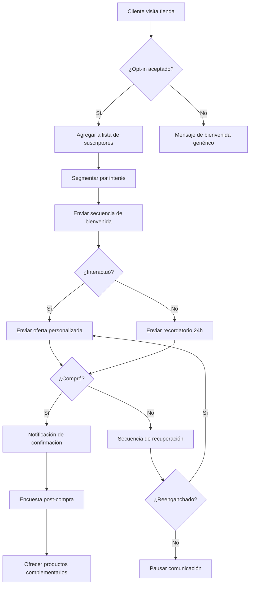

import { Callout } from '/src/components/Callout';
import { Steps } from '/src/components/Steps';
import { Step } from '/src/components/Step';
import { Expandable } from '/src/components/Expandable';
import { Columns } from '/src/components/Columns';
import { Card } from '/src/components/Card';
import { Tabs } from '/src/components/Tabs';
import { Tab } from '/src/components/Tab';
import { Update } from '/src/components/Update';

# Marketing en WhatsApp: Guía Completa Paso a Paso

> El marketing en WhatsApp se ha convertido en una de las estrategias digitales más poderosas del mundo empresarial. Con más de 2 mil millones de usuarios activos mensuales, esta plataforma ofrece un alcance masivo con tasas de apertura inigualables. En esta guía te enseñamos todo lo que necesitas saber para empezar.

> **Actualización importante (2025-06-18)**
> Esta guía ha sido actualizada con la información más reciente sobre la API de WhatsApp Cloud, precios de conversaciones establecidos por Meta y las mejores prácticas de marketing para 2025-2026.

## ¿Qué es el Marketing en WhatsApp?

El marketing en WhatsApp es una estrategia de marketing digital que utiliza la aplicación de mensajería más popular del mundo para conectar directamente con los clientes, promocionar productos y servicios, e impulsar el crecimiento del negocio. Consiste en enviar mensajes dirigidos a personas o grupos que han optado voluntariamente por recibir comunicaciones de tu empresa.

> A diferencia del email marketing que tiene tasas de apertura promedio del 20-30%, los mensajes de WhatsApp cuentan con una tasa de apertura del **98%**, lo que lo convierte en el canal de comunicación más efectivo para llegar a tus clientes.

### Ventajas Clave de WhatsApp como Plataforma de Comunicación

WhatsApp es una aplicación de mensajería gratuita reconocida por:

- **Altas tasas de apertura:** Los mensajes en WhatsApp tienen un **98% de tasa de apertura**, significativamente más alta que el marketing por correo electrónico tradicional.
- **Comunicación directa y personal:** Los clientes se sienten más conectados con las empresas a las que pueden enviar mensajes directamente.
- **Capacidad multimedia enriquecida:** La posibilidad de compartir contenido atractivo como imágenes, videos y catálogos de productos mejora la experiencia del cliente.
- **Alcance global:** Puedes conectar con clientes de todo el mundo, lo que lo hace ideal para audiencias geográficamente diversas.

> WhatsApp cuenta con **2 mil millones de usuarios activos mensuales** distribuidos en más de 180 países. Es la aplicación de mensajería líder en 133 países y ha logrado una tasa de penetración de mercado de aproximadamente el 97% entre los usuarios de aplicaciones de chat en regiones como India y América Latina.

### Estadísticas y Tendencias del Marketing en WhatsApp

Las tasas de clic (CTR) para las campañas de marketing en WhatsApp pueden alcanzar hasta el **70%**, superando significativamente al marketing por correo electrónico. Las empresas que utilizan WhatsApp reportan una mayor satisfacción del cliente debido al canal de comunicación personalizado y conveniente.

**Ejemplos de campañas exitosas de marketing en WhatsApp:**

| Empresa | Industria | Estrategia |
|---------|-----------|------------|
| ZARA | Moda | Asistente de compras personalizado con gamificación |
| Sephora | Belleza | Ofertas exclusivas y consejos de belleza |
| Domino's Pizza | Alimentación | Reordenación fácil y seguimiento de pedidos |
| Nike | Artículos deportivos | Acceso anticipado y contenido exclusivo para miembros |
| Duolingo | Educación | Aprendizaje interactivo y recordatorios motivacionales |

## WhatsApp Business vs WhatsApp Business API

Existen dos formas principales de utilizar WhatsApp para tu negocio:

### WhatsApp Business

- Aplicación gratuita para descargar
    - Ideal para pequeñas y medianas empresas
    - Herramientas de mensajería automatizada: mensajes de bienvenida y respuestas rápidas
    - Etiquetas para organizar contactos
    - Estadísticas básicas de mensajes
  
### WhatsApp Business API

- Servicio de pago gestionado por Meta
    - Ideal para empresas con alto volumen de interacciones
    - Gestión programática de mensajes a gran escala
    - Integración con CRM, plataformas de chatbot y automatización de marketing
    - Plantillas de mensaje, respuestas rápidas y gestión de sesiones
    - **Calificación de calidad**, niveles de mensajería y límites de broadcasting
  
> E-SMART360 funciona con la API de WhatsApp Business, lo que te permite disfrutar de todas las ventajas de la versión empresarial: automatización avanzada, integración con catálogos, broadcasting ilimitado y atención al cliente multicanal.

## Cómo Definir tu Estrategia de Opt-In en WhatsApp

El marketing en WhatsApp ofrece una herramienta poderosa para que las empresas se conecten con los clientes a nivel personal. Pero antes de comenzar a enviar mensajes, necesitas que los usuarios acepten recibirlos.

### Define tu Persona de Marca

El primer paso para definir tu estrategia de opt-in es comprender tu persona de marca. Este es el cliente ideal al que intentas llegar con tus mensajes de marketing. Una vez que sepas quién es tu persona de marca, puedes adaptar tu estrategia de opt-in para atraerlo.

    Por ejemplo, si eres un revendedor de soluciones de automatización, tu persona de marca podrían ser empresas que buscan mejorar su servicio al cliente y estrategia de marketing. En este caso, podrías enfocar tu estrategia de opt-in en destacar los beneficios de usar WhatsApp para atención al cliente, como tiempos de respuesta más rápidos y mayor satisfacción del cliente.
  
### Canales de Captación de Suscriptores

- **Sitio web:** Agrega un botón "Chatea con nosotros en WhatsApp" con un mensaje predefinido que solicite consentimiento.
    - **Redes sociales:** Publica enlaces directos a WhatsApp con llamadas a la acción claras.
    - **Punto de venta físico:** Muestra un código QR que lleve directamente a un chat de WhatsApp.
    - **Formularios de registro:** Incluye una casilla de verificación para recibir comunicaciones por WhatsApp.
    - **Post-venta:** Después de una compra, solicita permiso para enviar actualizaciones y ofertas.
  
### Configura tu Mensaje de Bienvenida

Cuando un nuevo contacto se une, es importante darle la bienvenida de forma automática. Configura un mensaje que:
    - Agradezca al usuario por suscribirse
    - Establezca expectativas claras sobre el tipo y frecuencia de mensajes
    - Ofrezca opciones interactivas (botones) para que el usuario elija sus preferencias
    - Incluya información útil inmediata
  

> **Cumplimiento normativo:** Asegúrate siempre de obtener el consentimiento explícito de los usuarios antes de enviarles mensajes de marketing. El incumplimiento de las políticas de WhatsApp puede resultar en la suspensión de tu número de teléfono comercial.

## Automatización de WhatsApp

La automatización de WhatsApp se refiere al proceso de utilizar herramientas de software para automatizar tareas repetitivas e interacciones en la plataforma de mensajería de WhatsApp. Esto puede mejorar significativamente la eficiencia, ahorrar tiempo y aumentar la calidad del servicio al cliente.

### Métodos de Automatización de WhatsApp

Existen dos enfoques principales para la automatización de WhatsApp:

### WhatsApp Business App

**A través de la aplicación WhatsApp Business (plan gratuito):**
    - **Mensajes de bienvenida:** Crea y programa mensajes automáticos para saludar a nuevos clientes que se unen a tu lista de contactos.
    - **Respuestas rápidas:** Crea respuestas preescritas para preguntas frecuentes, ahorrando tiempo y asegurando consistencia.
    - **Etiquetas:** Organiza contactos con etiquetas para dirigirte a grupos específicos de clientes con mensajes personalizados.
    - **Mensajes de ausencia:** Configura respuestas automáticas cuando no estés disponible.
  
### WhatsApp Business API + E-SMART360

**Integrando herramientas de terceros con la API de WhatsApp Business:**
    - **Chatbots con IA:** Responde automáticamente a preguntas frecuentes con inteligencia artificial.
    - **Flujos conversacionales:** Crea conversaciones guiadas con el constructor visual de arrastrar y soltar.
    - **Secuencias de mensajes:** Nutre leads con campañas automatizadas de múltiples pasos.
    - **Segmentación dinámica:** Segmenta y dirige audiencias para marketing impactante.
    - **Broadcasting:** Alcanza audiencias amplias con mensajes dirigidos e información de rendimiento.
    - **Chat en vivo:** Soporte instantáneo para resolución de problemas en tiempo real.
    - **Integración con e-commerce:** Conecta con WooCommerce, Shopify y más para notificaciones de pedidos.
  
> Con E-SMART360 puedes combinar la automatización del chatbot con la atención humana. Cuando el bot no puede resolver una consulta, la conversación se transfiere sin problemas a un agente humano a través del panel de chat en vivo compartido.

### Características Avanzadas de Automatización

E-SMART360 ofrece una plataforma intuitiva para crear chatbots que revolucionan la interacción con los clientes:

### Gestor de Bots Avanzado

Crea chatbots de WhatsApp a medida para tus necesidades únicas. Define flujos conversacionales complejos con respuestas condicionales, botones interactivos y recolección de datos.
  
### Constructor de Flujos Drag & Drop

Diseña bots visualmente impresionantes sin necesidad de programación. Simplemente arrastra y conecta bloques para crear experiencias conversacionales completas.
  
### Flujo de Entrada de Usuario y Campos Personalizados

Personaliza el marketing con información de los suscriptores. Recopila datos como nombre, email, preferencias de producto y más directamente desde la conversación.
  
### Respuesta IA para WhatsApp

Soporte automatizado las 24 horas del día con inteligencia artificial. Responde preguntas complejas usando el conocimiento de tu negocio entrenado con FAQ, URLs y archivos.
  
### Formularios Interactivos de WhatsApp

Recopila datos y mejora la experiencia de compra con formularios nativos dentro de WhatsApp. Captura información estructurada sin salir de la conversación.
  
### Catálogo de Productos

Destaca tus ofertas con descripciones enriquecidas y elementos visuales. Muestra productos directamente dentro del chat de WhatsApp.
  
### Mensajes en Secuencia

Nutre leads e impulsa conversiones con campañas automatizadas de múltiples pasos ideal para onboarding, ventas y seguimiento.
  
### Gestor Dinámico de Suscriptores

Segmenta y dirige audiencias mediante etiquetas, campos personalizados y comportamiento de usuario para un marketing más impactante.
  
## Broadcasting en WhatsApp: Cómo Enviar Mensajes Masivos

El broadcasting es una de las funcionalidades más potentes del marketing en WhatsApp. Te permite enviar mensajes a grandes grupos de suscriptores de manera simultánea. Sin embargo, es crucial hacerlo correctamente para evitar el bloqueo de tu número.

### Prerrequisitos para Broadcasting

- Tu API de WhatsApp Business debe estar conectada a E-SMART360
- Debes tener un número de teléfono activo en la API de WhatsApp Business
- Necesitas una lista de contactos limpia y que haya dado su consentimiento

### Preparación de la Lista de Suscriptores

### Prepara tu Lista de Contactos

Asegúrate de tener una lista limpia y lista para importar:
    - Prepara una hoja de cálculo con los datos de contacto necesarios (nombre, número de teléfono, etc.)
    - Asegúrate de que la columna de números de teléfono sea precisa y esté formateada correctamente (con código de país)
    - Descarga la hoja de cálculo como archivo CSV desde Google Sheets (se requiere codificación UTF-8)
  
### Importa los Suscriptores

Sube tu lista de contactos limpia a E-SMART360:
    - Ve al Gestor de Suscriptores en tu panel de E-SMART360
    - Haz clic en "Importar Suscriptores"
    - Sube el archivo CSV o importa directamente desde Google Sheets
    - Asigna correctamente los campos para alinear las columnas
  
### Crea tu Plantilla de Mensaje

Para enviar mensajes fuera de la ventana de 24 horas, necesitas usar plantillas de mensaje aprobadas por Meta:
    - Ve a **Gestor de Bots > Plantillas de Mensaje**
    - Haz clic en "Crear Nueva Plantilla"
    - Completa los detalles: contenido del mensaje con personalización mediante campos personalizados y botones CTA opcionales
    - Usa minúsculas para el nombre y reemplaza espacios con guiones bajos
    - Guarda y envía tu plantilla a Meta para aprobación
  

### Tipos de Plantillas de Mensaje

Existen dos categorías principales de plantillas de mensaje:

  **Plantillas transaccionales (Utilidad, Auth/OTP):** Se utilizan para enviar mensajes relacionados con una transacción específica, como una confirmación de envío o un recibo de pago. Estas plantillas tienen tasas de aprobación más altas.

  **Plantillas de marketing:** Se utilizan para enviar mensajes que promocionan tus productos o servicios. Deben cumplir con las pautas de contenido de Meta y están sujetas a una revisión más estricta. Las plantillas de marketing también están sujetas al **límite de frecuencia (frequency capping)** de Meta, que restringe cuántas veces un usuario puede recibir mensajes de marketing en un período determinado.

### Configuración de una Campaña de Broadcasting

### Crea una Nueva Campaña

Navega a la sección de **Broadcasting** en tu panel de E-SMART360 y haz clic en **"Crear Nueva Campaña"**. Ponle un nombre reconocible a tu campaña (ej: "Campaña de Marketing - Ofertas de Verano").
  
### Selecciona tu Audiencia Objetivo

Segmenta grupos específicos de suscriptores para personalizar tu campaña. Puedes elegir entre dos opciones de audiencia:

    - **Ventana de 24 horas:** Envía mensajes gratuitos a usuarios que han interactuado contigo en las últimas 24 horas
    - **En cualquier momento:** Usa una plantilla aprobada para llegar a todos los suscriptores

    También puedes filtrar tu audiencia usando etiquetas:
    - Incluye o excluye etiquetas específicas (ej: "Nuevo Lead", "Interesado en Demo", "Prueba Gratuita")
    - Usa el filtro "Suscriptores Agregados Recientemente" para dirigirte a un rango de fechas específico
  
### Programa o Envía la Campaña

Elige entre enviar la campaña inmediatamente o programarla para una fecha posterior. Ajusta la zona horaria para una entrega óptima. Una vez guardada, tu campaña se ejecutará y su estado se actualizará en el panel de control.
  

> **Normas de broadcasting en WhatsApp:**
  - Las transmisiones deben enviarse SOLO a usuarios que hayan optado voluntariamente
  - Para mensajes fuera de la ventana de 24 horas, DEBES usar plantillas aprobadas por Meta
  - Respeta los límites de mensajería según tu nivel (Tier 1, 2 o 3)
  - Monitorea tu calificación de calidad para evitar restricciones
  - El incumplimiento puede resultar en la restricción o suspensión de tu número

## Secuencias de Mensajes Automatizadas

Las secuencias de mensajes son conjuntos preconfigurados de mensajes automatizados que se envían a los suscriptores basándose en disparadores y horarios predefinidos. Estas secuencias ayudan a mantener el compromiso, nutrir leads y automatizar respuestas de manera eficiente.

### Ideas para Secuencias de Mensajes

### Secuencias de Bienvenida

Atrae a nuevos suscriptores con saludos personalizados que presenten tu marca y establezcan expectativas claras sobre la comunicación futura.
  
### Secuencias de Atención al Cliente

Automatiza respuestas a consultas comunes de los clientes con información útil y enlaces a recursos de ayuda.
  
### Secuencias de Nutrición de Leads

Educa a los leads sobre tus productos o servicios con contenido valioso enviado en intervalos estratégicos.
  
### Secuencias de Ventas

Guía a los clientes potenciales a través del embudo de ventas con mensajes persuasivos y ofertas especiales en momentos clave.
  
### Secuencias de Onboarding

Ayuda a los nuevos usuarios a comenzar con tu producto o servicio con tutoriales paso a paso y consejos útiles.
  
### Secuencias Promocionales

Anuncia nuevos productos, descuentos o eventos con una secuencia de mensajes que genere anticipación y urgencia.
  
### Secuencias Educativas

Proporciona contenido valioso a los suscriptores con una serie de mensajes informativos que posicionen tu marca como autoridad.
  
### Secuencias de Seguimiento Post-Venta

Da seguimiento después de una compra para asegurar la satisfacción del cliente, solicitar reseñas y ofrecer productos complementarios.
  
### Beneficios de las Secuencias de Mensajes

- **Mejora la experiencia del cliente:** Las respuestas automatizadas garantizan una interacción instantánea
  - **Aumenta la eficiencia:** Reduce la carga de trabajo manual al automatizar tareas repetitivas
  - **Mejores conversiones:** Nutre leads y mejora las tasas de conversión
  - **Mayor compromiso:** Mantiene a los usuarios interesados con seguimientos oportunos
  - **Optimización basada en datos:** Realiza un seguimiento del rendimiento y refina las secuencias según los análisis

### Cómo Configurar una Secuencia de Mensajes

### Crea una Nueva Secuencia

Navega al **Constructor de Flujos** y selecciona **'Nueva Secuencia'**. Ponle un nombre descriptivo y configura el momento en que comenzará la secuencia.
  
### Estructura tus Mensajes

Organiza tu secuencia con texto, elementos multimedia y llamadas a la acción. Decide el intervalo entre cada mensaje (minutos, horas o días) y define las condiciones para avanzar a la siguiente etapa.
  
### Activa la Secuencia

Finaliza la configuración y activa la secuencia. El sistema comenzará a enviar mensajes automáticamente según los disparadores y horarios configurados.
  
### Monitorea el Rendimiento

Realiza un seguimiento de las métricas clave: tasas de apertura, clics, respuestas y conversiones. Utiliza estos datos para refinar y optimizar tus secuencias continuamente.
  

> **Mejores prácticas para secuencias:**
  - Mantén los mensajes concisos y relevantes
  - Personaliza las interacciones usando los datos del usuario
  - Programa los mensajes estratégicamente para mantener el compromiso
  - Usa plantillas de mensaje preaprobadas para secuencias en WhatsApp
  - Analiza y refina continuamente las secuencias basándote en los datos de rendimiento

## Precios del Marketing en WhatsApp

### Precios de Conversaciones de WhatsApp Business (USD) - Establecidos por Meta

Meta establece los precios de las conversaciones de WhatsApp Business. Estos precios varían según la región y el tipo de conversación:

### Conversaciones de Marketing

Las conversaciones de marketing son iniciadas por la empresa y utilizan plantillas de mensaje con categoría de marketing. Suelen tener el costo más alto debido a su naturaleza promocional.
  
### Conversaciones de Utilidad

Las conversaciones de utilidad incluyen notificaciones de transacciones, confirmaciones de pedidos y actualizaciones de cuenta. Generalmente tienen un costo menor que las de marketing.
  
### Conversaciones de Servicio

Las conversaciones de servicio son iniciadas por el cliente y respondidas por la empresa dentro de la ventana de 24 horas. Suelen tener el costo más bajo o incluso ser gratuitas en algunos casos.
  
### Conversaciones de Autenticación

Las conversaciones de autenticación (OTP) se utilizan para verificar la identidad del usuario mediante códigos de un solo uso. Tienen su propia categoría de precios.
  
> Los precios mostrados son sujetos a cambios y pueden variar según las fluctuaciones de la moneda y otros factores. Consulta la documentación oficial de Meta para obtener los precios actualizados de tu región.

### Costos de la Plataforma E-SMART360

E-SMART360 ofrece planes de precios flexibles que se adaptan a las necesidades de tu negocio:

- **Plan Básico:** Ideal para pequeñas empresas que comienzan con la automatización de WhatsApp
- **Plan Profesional:** Para empresas en crecimiento que necesitan funciones avanzadas como secuencias, broadcasting y chatbot con IA
- **Plan Enterprise:** Para grandes equipos que requieren límites más altos, soporte premium y funcionalidades personalizadas

> Los precios de E-SMART360 son transparentes y no incluyen markup sobre las tarifas de la API de WhatsApp. Solo pagas por lo que necesitas, sin costos ocultos.

## Configuración de la API de WhatsApp Cloud con E-SMART360

Configurar tu cuenta de la API de WhatsApp Cloud con E-SMART360 es simple e implica varios pasos:

### Crea una Aplicación

Comienza creando una aplicación en el sitio de Facebook Developer, seleccionando "Business" como tipo de aplicación.
  
### Agrega WhatsApp a tu Aplicación

Accede a la sección de WhatsApp en la página de productos de tu aplicación y procede con la configuración.
  
### Obtén un Token de Acceso Permanente

Genera un token de acceso con los permisos necesarios para la gestión empresarial y de catálogos, así como para la mensajería de WhatsApp.
  
### Configura Webhooks

Configura los webhooks para recibir mensajes proporcionando la URL de Callback y el Token de Verificación de E-SMART360.
  
### Agrega un Número de Teléfono

Agrega y verifica tu número de teléfono comercial en la sección de WhatsApp de tu aplicación.
  
### Cambia el Modo de la Aplicación a Activo (Live)

Cambia el modo de la aplicación de desarrollo a activo y proporciona las URL de Política de Privacidad y Términos de Servicio.
  
### Conecta con E-SMART360

Ingresa tu ID de Cuenta de WhatsApp Business y el token de acceso en el panel de E-SMART360 para establecer la conexión.
  
## Estrategias Avanzadas de Marketing en WhatsApp

### Chatbots de Seguimiento Automático

Los chatbots de seguimiento son sistemas automatizados que envían mensajes de recordatorio a usuarios que han interactuado con tu chatbot pero no han completado una acción, como realizar una compra o registrarse. Ayudan a las empresas a mantenerse comprometidas con los clientes potenciales y mejoran las tasas de conversión.

### ¿Por qué usar un sistema de seguimiento automatizado?

- Ahorra tiempo al automatizar recordatorios
  - Aumenta las ventas y conversiones
  - Garantiza que los usuarios no olviden tu oferta
  - Funciona 24/7 sin esfuerzo manual
  - Permite segmentar usuarios según su comportamiento (quienes hiceron clic en "Comprar" vs quienes no)

Para configurar un chatbot de seguimiento automático en E-SMART360:

### Crea el Flujo del Chatbot

Ve a **Panel de E-SMART360 > Gestor de Bots > Respuesta de Bot > Crear**. Nombra el chatbot de forma reconocible (ej: "Bot de Seguimiento de Ventas") y guárdalo.
  
### Configura Mensajes Interactivos

Agrega un bloque interactivo a tu chatbot. Crea un mensaje como: "¿Hola! ¿Te interesaría nuestro producto?" con botones de "Sí" y "No". Si el usuario selecciona "Sí", proporciónale un enlace de pago. Si selecciona "No", finaliza la conversación u ofrece asistencia alternativa.
  
### Aplica Etiquetas para Rastrear Acciones

Cuando un usuario haga clic en "Comprar ahora", aplica una etiqueta llamada "Comprar Ahora". Si el usuario no hace clic en el botón, no recibe esta etiqueta. Usa esta etiqueta para determinar quién necesita un recordatorio de seguimiento.
  
### Configura la Secuencia de Seguimiento

Arrastra y suelta el conector desde la opción 'Suscribir a Secuencia' del botón "Comprar Ahora" para comenzar una nueva secuencia de seguimiento. Configura el tiempo de espera (ej: 30 minutos) antes de enviar el recordatorio.
  
### Define la Condición de Seguimiento

Agrega una condición para hacer seguimiento basada en si seleccionaron o no el botón "Comprar Ahora". Si es falso, envía el mensaje de seguimiento. Puedes repetir el proceso para enviar múltiples recordatorios.
  

> WhatsApp permite enviar mensajes de seguimiento ilimitados dentro de la ventana de 24 horas. Después de 24 horas, solo se pueden enviar mensajes con plantillas preaprobadas. Programa tus recordatorios estratégicamente para evitar saturar a los usuarios.

### Recuperación de Carritos Abandonados

Una de las aplicaciones más rentables del marketing en WhatsApp es la recuperación de carritos abandonados en tiendas WooCommerce y Shopify:

### Pasos para configurar la recuperación de carritos abandonados

1. Conecta tu tienda WooCommerce o Shopify con E-SMART360
  2. Configura un webhook que detecte cuando un carrito es abandonado
  3. Crea una plantilla de mensaje para recordatorio de carrito abandonado
  4. Configura una secuencia automatizada de seguimiento:
     - **Mensaje 1 (1 hora después):** Recordatorio amistoso del carrito abandonado
     - **Mensaje 2 (6 horas después):** Destaca los beneficios del producto
     - **Mensaje 3 (24 horas después):** Ofrece un descuento especial o envío gratuito
  5. Incluye un enlace directo al carrito para facilitar la recuperación

### Notificaciones de Pedidos en Tiempo Real

Mantén a tus clientes informados sobre el estado de sus pedidos con notificaciones automatizadas:

### Notificaciones de Confirmación

Envía un mensaje automático inmediatamente después de que se realice un pedido, confirmando los detalles y el tiempo estimado de entrega.
  
### Actualizaciones de Envío

Mantén a los clientes informados con actualizaciones automáticas cuando su pedido sea enviado, esté en tránsito y haya sido entregado.
  
### Notificaciones de Pago

Confirma los pagos recibidos y envía recordatorios automáticos para pagos pendientes, reduciendo la tasa de abandono.
  
### Encuestas Post-Compra

Después de la entrega, envía una encuesta de satisfacción para recopilar comentarios valiosos y mejorar tu servicio.
  
## Buenas Prácticas y Consejos

### Cumplimiento de Políticas de WhatsApp

Es fundamental cumplir con las políticas de servicio y privacidad de WhatsApp para mantener una reputación positiva y evitar sanciones:

> **Lo que NO debes hacer:**
  - Enviar mensajes a usuarios que no han dado su consentimiento explícito
  - Enviar mensajes masivos no solicitados (spam)
  - Usar números de teléfono personales para fines comerciales masivos
  - Compartir información de contacto sin autorización
  - Enviar contenido inapropiado o engañoso

### Consideraciones Éticas

- Obtén siempre el consentimiento explícito antes de agregar usuarios a tu lista de difusión
- Proporciona una opción clara para darse de baja en cada mensaje
- Respeta la frecuencia de mensajes; no satures a tus suscriptores
- Sé transparente sobre cómo se utilizarán los datos de los usuarios
- Ofrece valor real en cada mensaje que envías

### Mejora Continua

- Analiza regularmente las métricas de rendimiento y recopila información para identificar áreas de mejora
- Realiza pruebas A/B con diferentes tipos de mensajes, horarios y llamadas a la acción
- Segmenta tu audiencia cada vez más para mensajes hiperpersonalizados
- Mantente actualizado con los cambios en las políticas de WhatsApp y las nuevas funcionalidades

> Las empresas que utilizan WhatsApp Business API a través de E-SMART360 pueden acceder a análisis detallados de campañas, incluyendo tasas de entrega, apertura, clics y conversiones, lo que permite una optimización continua basada en datos reales.

## Preguntas Frecuentes

### ¿Cuál es la diferencia entre WhatsApp Business y WhatsApp Business API?

WhatsApp Business es una aplicación gratuita para pequeñas y medianas empresas que ofrece herramientas básicas como mensajes de bienvenida, respuestas rápidas y etiquetas. La WhatsApp Business API es un servicio de pago para empresas con alto volumen de mensajes que permite integraciones con CRMs, automatización avanzada, chatbots, broadcasting y gestión a gran escala a través de plataformas como E-SMART360.

### ¿Necesito una plantilla de mensaje aprobada para enviar mensajes?

Solo si el mensaje se envía fuera de la ventana de 24 horas desde la última interacción del usuario. Dentro de la ventana de 24 horas, puedes enviar mensajes libres sin plantilla. Para campañas de marketing y broadcasting, generalmente necesitarás plantillas de mensaje aprobadas por Meta.

### ¿Cuánto cuesta el marketing en WhatsApp?

El costo se compone de dos partes: (1) las tarifas de conversación de WhatsApp Business API establecidas por Meta, que varían según la región y el tipo de conversación (marketing, utilidad, servicio), y (2) la suscripción a la plataforma E-SMART360 que ofrece diferentes planes según las funcionalidades que necesites.

### ¿Qué es la calificación de calidad de WhatsApp y cómo afecta mis campañas?

La calificación de calidad es una métrica de Meta que evalúa cómo los usuarios interactúan con tus mensajes. Se basa en factores como bloqueos, reportes de spam y retroalimentación de los usuarios. Una calificación baja puede restringir tu capacidad de enviar mensajes o incluso resultar en la suspensión de tu número. Mantén una comunicación relevante y respeta el consentimiento de los usuarios para mantener una buena calificación.

### ¿Cuántos mensajes puedo enviar por día en WhatsApp?

Depende de tu nivel de mensajería (Tier). Los niveles se basan en tu calificación de calidad y volumen de mensajes. Cuanto más alto sea tu nivel, más mensajes puedes enviar en un periodo de 24 horas. E-SMART360 te ayuda a gestionar y escalar tu nivel de mensajería automáticamente a medida que tu negocio crece.

### ¿Puedo automatizar el seguimiento de clientes que no completaron una compra?

Sí. Con E-SMART360 puedes configurar chatbots de seguimiento automático que envían recordatorios a usuarios que han interactuado con tu bot pero no han completado la compra. El sistema etiqueta automáticamente a los usuarios según su comportamiento (hicieron clic en "Comprar" o no) y envía recordatorios programados con enlaces directos al proceso de pago. Puedes configurar múltiples recordatorios con diferentes intervalos y mensajes.

### ¿Qué es el frequency capping de Meta?

El frequency capping es una política de Meta que limita la cantidad de mensajes de marketing que un usuario puede recibir de una empresa en un período determinado. Esta medida protege a los usuarios de recibir demasiados mensajes promocionales. Es importante monitorear tus campañas y respetar estos límites para mantener una buena calificación de calidad.

### ¿Puedo usar WhatsApp para servicio al cliente y marketing simultáneamente?

Sí. E-SMART360 te permite gestionar tanto el servicio al cliente como el marketing desde una misma plataforma. Puedes usar el chat en vivo compartido para atención al cliente en tiempo real y las herramientas de broadcasting y secuencias para campañas de marketing. El sistema distingue automáticamente entre conversaciones de servicio (iniciadas por el cliente) y conversaciones de marketing (iniciadas por la empresa) para un correcto manejo de costos.

## Comprensión de la Calificación de Calidad en WhatsApp

La calificación de calidad es una métrica fundamental que Meta utiliza para evaluar cómo los usuarios perciben los mensajes que envía tu negocio. Mantener una buena calificación es esencial para garantizar la entregabilidad de tus mensajes y evitar restricciones.

> Tu calificación de calidad se calcula en una escala y se basa en factores como: tasa de bloqueos, reportes de spam, retroalimentación de usuarios, índice de lectura y tasa de respuesta. Cuanto mejor sea la experiencia que ofrezcas a los usuarios, mejor será tu calificación.

### Factores que Afectan tu Calificación de Calidad

### Bloqueos y Reportes

Cada vez que un usuario bloquea tu número o reporta un mensaje como spam, tu calificación se ve afectada negativamente. Esto suele ocurrir cuando envías mensajes no solicitados o con demasiada frecuencia.
  
### Retroalimentación de Usuarios

WhatsApp permite a los usuarios proporcionar retroalimentación sobre las conversaciones. Si muchos usuarios marcan negativamente tus mensajes, tu calificación disminuirá.
  
### Tasa de Apertura

Una baja tasa de apertura puede indicar que tus mensajes no son relevantes para los usuarios. WhatsApp interpreta esto como una señal de baja calidad.
  
### Volumen de Mensajes

Un aumento repentino en el volumen de mensajes sin una base de usuarios correspondiente puede activar las alarmas de calidad de Meta.
  
### Cómo Mantener una Buena Calificación de Calidad

### Solicita Consentimiento Explícito

Asegúrate de que cada usuario haya dado su consentimiento explícito antes de enviarle mensajes. Usa mecanismos de opt-in claros en tu sitio web, formularios y puntos de contacto.
  
### Ofrece Valor en Cada Mensaje

Cada mensaje que envíes debe proporcionar valor real al usuario: información útil, ofertas relevantes, actualizaciones importantes. Evita mensajes promocionales genéricos sin valor añadido.
  
### Respeta la Frecuencia

No satures a tus suscriptores con mensajes excesivos. Establece una frecuencia razonable (1-3 mensajes por semana es un buen punto de partida) y respeta el frequency capping de Meta.
  
### Monitorea tus Métricas

Revisa regularmente tu panel de calificación de calidad en E-SMART360. Si notas una tendencia a la baja, identifica las causas y toma medidas correctivas inmediatas.
  
### Procesa las Bajas Rápidamente

Cuando un usuario solicite darse de baja, procesa la solicitud inmediatamente. Continuar enviando mensajes a usuarios que han optado por no participar dañará gravemente tu calificación.
  

> Las consecuencias de una calificación de calidad baja pueden incluir: restricción en el límite de mensajería diaria, marcado de mensajes como spam, suspensión temporal del número o incluso bloqueo permanente. Es mucho más fácil mantener una buena calificación que recuperarla después de haberla perdido.

## Reglas de Broadcasting en WhatsApp

El broadcasting en WhatsApp está sujeto a reglas específicas diseñadas para proteger la experiencia del usuario. Conocer y respetar estas reglas es fundamental para el éxito de tus campañas.

### Reglas Esenciales de Broadcasting

1. **Solo a usuarios con opt-in:** Las transmisiones deben enviarse exclusivamente a usuarios que hayan optado voluntariamente por recibir comunicaciones de tu negocio.
  
  2. **Plantillas aprobadas:** Para mensajes fuera de la ventana de 24 horas, debes usar plantillas de mensaje aprobadas por Meta. Las plantillas de marketing tienen requisitos más estrictos que las de utilidad.
  
  3. **Respeto de límites de mensajería:** Cada nivel (Tier) tiene un límite máximo de mensajes que puedes enviar en un período de 24 horas. Conocer tu nivel actual es crucial para planificar tus campañas.
  
  4. **Calificación de calidad:** Si tu calificación de calidad cae por debajo de cierto umbral, tu límite de mensajería se reducirá automáticamente.
  
  5. **Inclusión de opción de baja:** Aunque WhatsApp no exige un enlace de baja estándar, es una buena práctica incluir instrucciones claras para que los usuarios puedan dejar de recibir mensajes.
  
  6. **Contenido apropiado:** No envíes contenido prohibido (violencia, desnudos, productos ilegales, engaños) ni mensajes que violen los términos de servicio de Meta.

### Límites de Broadcasting según el Nivel de Mensajería

| Nivel | Límite de Mensajes/24h | Calificación Requerida | Usuarios Elegibles |
|-------|----------------------|----------------------|-------------------|
| **Tier 1** | 1,000 | Buena | Hasta 1,000 suscriptores |
| **Tier 2** | 10,000 | Buena | Hasta 10,000 suscriptores |
| **Tier 3** | 100,000 | Excelente | Hasta 100,000 suscriptores |
| **Tier 4** | Ilimitado | Excelente + Aprobación | Más de 100,000 suscriptores |

> E-SMART360 monitorea automáticamente tu nivel de mensajería y te notifica cuando estás cerca de alcanzar los límites. También te ayuda a escalar de nivel optimizando tu calificación de calidad.

## Personalización de Mensajes con Datos Variables

Una de las funcionalidades más poderosas del marketing en WhatsApp es la capacidad de personalizar mensajes a gran escala usando datos variables.

### Cómo usar datos variables en tus mensajes

Los datos variables te permiten insertar información personalizada de cada suscriptor en tus mensajes. Por ejemplo:
  
  - **Nombre del cliente:** "Hola {{nombre}}, tenemos una oferta especial para ti"
  - **Última compra:** "Han pasado {{días_ultima_compra}} días desde tu última compra"
  - **Producto de interés:** "El {{producto}} que viste está ahora en oferta"
  - **Ubicación:** "Visítanos en nuestra sucursal de {{ciudad}}"
  - **Fecha especial:** "¡Feliz cumpleaños {{nombre}}! Aquí tienes un regalo especial"
  
  Para usar datos variables, simplemente configura campos personalizados en E-SMART360, importa los datos correspondientes y usa las variables en tus plantillas de mensaje. El sistema reemplazará automáticamente cada variable con el valor del suscriptor al enviar el mensaje.

## Consejos Adicionales para Maximizar Resultados

1. **Define objetivos claros:** Antes de iniciar cualquier campaña, establece KPIs específicos (tasa de apertura, clics, conversiones, ingresos generados) y asegúrate de que puedas medirlos.

2. **Segmentación avanzada:** No envíes el mismo mensaje a toda tu lista. Segmenta por comportamiento, intereses, ubicación, historial de compras y etapa del ciclo de vida.

3. **Automatización inteligente:** Usa chatbots y secuencias de mensajes para nutrir leads automáticamente, pero siempre mantén la opción de escalar a un agente humano cuando sea necesario.

4. **Pruebas A/B continuas:** Prueba diferentes versiones de tus mensajes (tono, longitud, imágenes, CTA, horario de envío) y optimiza basándote en resultados reales.

5. **Integración multicanal:** Combina WhatsApp con email, SMS, redes sociales y tu sitio web para una estrategia de marketing cohesionada.

## Integración de WhatsApp con WooCommerce y Shopify

E-SMART360 se integra nativamente con las plataformas de e-commerce más populares, permitiéndote automatizar completamente la comunicación con tus clientes.

### Principales Funcionalidades de Integración

### Notificaciones Automáticas de Pedidos

Configura notificaciones en tiempo real para:
    - Confirmación de pedido recibido
    - Actualización de estado de envío
    - Notificación de pago recibido
    - Confirmación de entrega
    - Solicitud de reseña post-compra
  
### Recuperación de Carritos Abandonados

Configura secuencias automáticas que detecten carritos abandonados y envíen recordatorios personalizados con enlaces directos al proceso de pago.
  
### Envío de Facturas y Recibos

Automatiza el envío de facturas, recibos y comprobantes de pago directamente por WhatsApp, ofreciendo a tus clientes una experiencia de compra completa.
  
### Catálogo de Productos Sincronizado

Sincroniza tu catálogo de productos de WooCommerce/Shopify con WhatsApp. Tus clientes pueden ver productos, precios y disponibilidad directamente en el chat.
  
### Configuración de Webhook para Notificaciones

### Conecta tu Tienda

Accede al panel de integraciones de E-SMART360 y selecciona tu plataforma (WooCommerce o Shopify). Sigue los pasos de autenticación para conectar tu tienda.
  
### Configura los Webhooks

Define qué eventos activarán notificaciones: nuevo pedido, cambio de estado, pago recibido, carrito abandonado, etc.
  
### Personaliza tus Plantillas

Crea plantillas de mensaje para cada tipo de notificación. Incluye variables como {{order_number}}, {{order_total}}, {{product_name}} para personalizar cada mensaje.
  
### Activa la Automatización

Una vez configurado, el sistema funcionará automáticamente. Cada evento en tu tienda activará la notificación correspondiente en WhatsApp.
  
## Casos de Uso Prácticos

### Tienda de Ropa Online

Una tienda de ropa implementó E-SMART360 para:
    1. Saludar automáticamente a nuevos visitantes con un mensaje de bienvenida y un código de descuento del 10%
    2. Enviar recordatorios de carritos abandonados con imágenes de los productos
    3. Notificar a los clientes cuando nuevos productos de sus marcas favoritas lleguen al inventario
    4. Enviar encuestas de satisfacción post-compra con un incentivo para la próxima compra
    **Resultado:** 35% de recuperación de carritos abandonados y 28% de aumento en compras repetidas.
  
### Consultoría de Negocios

Una consultora automatizó su proceso de captación de clientes:
    1. Bot de calificación de leads que pregunta sobre necesidades del negocio
    2. Secuencia educativa de 5 días con contenido de valor sobre consultoría
    3. Agendamiento automático de llamadas de descubrimiento
    4. Seguimiento post-llamada con propuesta personalizada
    **Resultado:** 50% más leads calificados y reducción del 70% en tiempo de calificación manual.
  
## Programas de Revendedor White Label

Si estás buscando iniciar tu propio negocio de automatización de marketing, los **Programas de Revendedor White Label** de E-SMART360 te permiten revender nuestros servicios bajo tu propia marca.

### Beneficios del Programa White Label

- **Lanzamiento más rápido:** No necesitas reinventar la rueda. Ofrece una solución preconstruida que permite a tus clientes comenzar rápidamente.
  - **Escalabilidad:** Ayuda a tus clientes a gestionar grandes bases de clientes con funciones automatizadas.
  - **Propuesta de valor mejorada:** Equipa a tus clientes con una herramienta de marketing poderosa que genera resultados y te diferencia.
  - **Ingresos recurrentes:** Genera comisiones recurrentes mientras tus clientes continúen usando la plataforma.
  - **Soporte dedicado:** Recibe soporte técnico prioritario para ti y tus clientes.

## Conclusión

El marketing en WhatsApp representa una oportunidad inmensa para las empresas que desean conectarse con sus clientes de manera directa, personal y efectiva. Con tasas de apertura del 98%, capacidades multimedia enriquecidas y la posibilidad de automatizar completamente las comunicaciones, WhatsApp se ha consolidado como el canal de marketing más potente disponible actualmente.

> ¿Estás listo para llevar tu marketing al siguiente nivel? E-SMART360 te ofrece todas las herramientas que necesitas para implementar una estrategia completa de marketing en WhatsApp: desde chatbots con IA hasta broadcasting, secuencias automatizadas, integración con e-commerce y análisis detallados. Regístrate para una prueba gratuita y descubre cómo puedes transformar la comunicación con tus clientes.

