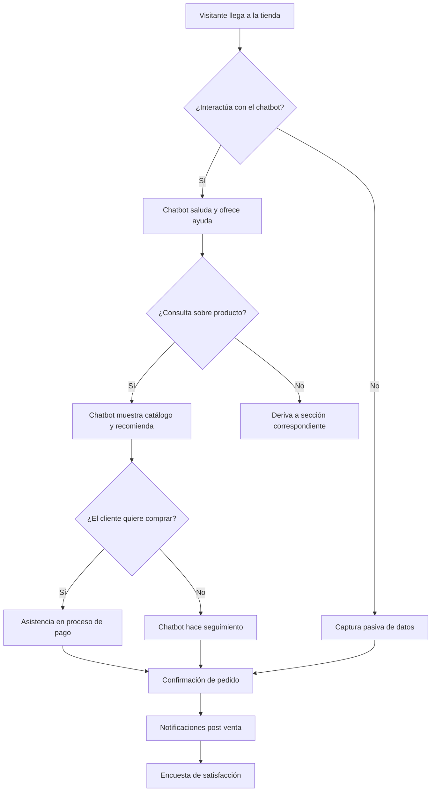

# Cómo Maximizar los Ingresos de tu E-commerce con Chatbots Inteligentes

El comercio electrónico se ha convertido en una parte fundamental de nuestras vidas en el panorama digital actual. Con el crecimiento imparable de las compras online, las empresas buscan constantemente formas innovadoras de mejorar la experiencia de compra. Una de las innovaciones que está ganando mayor tracción es el uso de chatbots impulsados por inteligencia artificial, también conocidos como "e-commerce impulsado por IA".

En esta guía completa exploramos en profundidad el mundo del e-commerce automatizado, analizando su potencial, sus beneficios y cómo está revolucionando la industria minorista online.

> Según proyecciones del sector, las ventas de e-commerce superarán los 7 billones de dólares en los próximos años, y los consumidores exigen cada vez más experiencias de compra rápidas, personalizadas y sin fricciones. La automatización con chatbots es la respuesta a estas demandas.

## Por Qué un Chatbot con IA es Esencial para Aumentar los Ingresos

A medida que las ventas online continúan disparándose, las expectativas de los compradores también han aumentado considerablemente. Los consumidores actuales demandan:

- Una experiencia de compra fluida y sin interrupciones
- Tiempos de respuesta ultrarrápidos en atención al cliente
- Interacciones personalizadas que se adapten a sus necesidades

Aquí es donde la automatización, en forma de chatbots con inteligencia artificial, cierra la brecha entre lo que los clientes esperan y lo que las empresas pueden ofrecer de forma escalable.

### Navega las Necesidades del Cliente sin Esfuerzo

Los chatbots son mucho más que respondedores automáticos: son los conserjes virtuales de tu tienda online. Facilitan conversaciones instantáneas con clientes potenciales y existentes, guiándolos a través del proceso de compra, respondiendo consultas e incluso resolviendo problemas comunes sin necesidad de intervención humana.

> Un chatbot bien configurado puede aumentar la tasa de conversión hasta un 40% al guiar al cliente en el momento exacto de la decisión de compra, justo cuando tiene dudas sobre el producto, el envío o el medio de pago.

### Eficiencia Basada en Datos

Más allá de proporcionar respuestas rápidas, los chatbots con IA tienen la capacidad de:

1. **Recopilar datos valiosos de los clientes** — preferencias, historial de compras, comportamiento de navegación
2. **Realizar concursos y sorteos automáticos** para generar engagement
3. **Transferir conversaciones a agentes humanos** sin problemas cuando sea necesario

Esto los convierte en verdaderos catalizadores de crecimiento para cualquier negocio online.

### Mejora del Compromiso con el Cliente

Interactuar con los clientes en tiempo real a través de chatbots crea un entorno de compra más dinámico e interactivo. Los clientes pueden hacer preguntas, buscar asesoramiento y recibir respuestas instantáneas, lo que genera una experiencia de compra mucho más satisfactoria.

### Automatiza la primera interacción

Configura tu chatbot para saludar a los visitantes y ofrecerles ayuda inmediata. Puedes programar mensajes de bienvenida personalizados que pregunten qué están buscando y ofrezcan recomendaciones basadas en sus respuestas.
  
### Califica leads automáticamente

El chatbot puede hacer preguntas clave para determinar si un visitante es un lead calificado: presupuesto, urgencia, tipo de producto, etc. Esta información se almacena y se usa para segmentar campañas futuras.
  
### Resuelve dudas de producto sin intervención humana

Conecta tu catálogo de productos al chatbot para que pueda responder preguntas sobre características, disponibilidad, precios y tiempos de envío de forma automática.
  
### Gestión Eficiente del Inventario

Los algoritmos de IA en los sistemas de e-commerce ayudan a gestionar el inventario de manera más eficiente al:

- Predecir patrones de demanda
- Reducir el exceso de stock
- Asegurar que los artículos populares estén siempre disponibles

> Al integrar tu tienda online con un chatbot, puedes recibir notificaciones automáticas cuando un producto está por agotarse o cuando un artículo vuelve a estar disponible, permitiéndote tomar acciones inmediatas.

### Aumento de las Tasas de Conversión

Las recomendaciones personalizadas y la asistencia instantánea conducen a tasas de conversión más altas. Los clientes tienen más probabilidades de realizar una compra cuando sienten que sus necesidades son comprendidas y atendidas.

### 📊 Sin Chatbot

- El cliente busca por su cuenta
    - Abandona si no encuentra rápido
    - Sin seguimiento post-abandono
    - Conversión: 1-3% promedio
  
### 🚀 Con Chatbot IA

- Recomendaciones personalizadas
    - Respuesta inmediata a dudas
    - Recuperación automática de carritos
    - Conversión: hasta 15%+ 
  
## Información Basada en Datos para tu Negocio

El e-commerce impulsado por chatbots genera datos valiosos sobre el comportamiento de los clientes que las empresas pueden utilizar para:

- Refinar sus estrategias de marketing digital
- Optimizar la oferta de productos
- Identificar tendencias de compra
- Mejorar la segmentación de campañas

### ¿Qué tipo de datos puedes recolectar con un chatbot?

    - <strong>Datos demográficos:</strong> ubicación, idioma, rango de edad
    - <strong>Preferencias de productos:</strong> categorías favoritas, rango de precios, marcas preferidas
    - <strong>Comportamiento de compra:</strong> frecuencia, ticket promedio, hora del día preferida para comprar
    - <strong>Motivos de abandono:</strong> precio alto, falta de stock, métodos de pago limitados
    - <strong>Feedback y reseñas:</strong> opiniones directas que los clientes comparten en conversación
  

## Cómo Implementar un E-commerce Impulsado por Chatbots con IA

Para implementar eficazmente un sistema de e-commerce con chatbot inteligente, sigue estos pasos:

### 1. Comprende los Beneficios

Familiarízate con las ventajas que ofrecen los chatbots, como el aumento del compromiso del cliente y la mejora de la efectividad del marketing digital. Cada uno de estos beneficios se traduce directamente en mayores ingresos.

### 2. Explora la Documentación Oficial

Consulta la documentación de E-SMART360 para aprender a crear una tienda online personalizable e integrarla con plataformas de mensajería como WhatsApp y Telegram.

> E-SMART360 ofrece guías detalladas paso a paso para cada tipo de integración, desde conectar tu tienda Shopify hasta configurar flujos de recuperación de carritos abandonados.

### 3. Integra los Canales de Mensajería

Conecta la plataforma con aplicaciones de mensajería como WhatsApp, Messenger, Instagram, Telegram y Webchat para centralizar las ventas y la comunicación en un solo lugar.

### WhatsApp

La integración con WhatsApp permite:
    - Enviar notificaciones de pedidos en tiempo real
    - Responder consultas de clientes automáticamente
    - Compartir el catálogo de productos directamente en el chat
    - Recuperar carritos abandonados con mensajes personalizados
  
### Telegram

Con Telegram puedes:
    - Crear canales de ofertas y promociones
    - Automatizar respuestas con bots inteligentes
    - Gestionar comunidades y segmentar audiencias
    - Enviar mensajes broadcast con variables personalizadas
  
### Webchat

El chat web integrado en tu sitio permite:
    - Atención al cliente 24/7 sin necesidad de apps externas
    - Capturar leads directamente desde tu página web
    - Integrar formularios de contacto y encuestas de satisfacción
  
### 4. Personaliza tu Tienda

Adapta tu tienda online para que refleje tus productos y la experiencia de usuario que deseas ofrecer. Ajusta colores, imágenes, flujos de conversación y mensajes para alinearlos con tu identidad de marca.

### 5. Monitorea y Optimiza Continuamente

Analiza el rendimiento de tu chatbot de forma regular y ajusta las estrategias en función de los datos recopilados. La optimización continua es clave para maximizar los resultados.

### Indicadores clave a monitorear semanalmente

    - <strong>Tasa de interacción:</strong> porcentaje de visitantes que interactúan con el chatbot
    - <strong>Tasa de conversión del chatbot:</strong> visitantes que completan una compra después de interactuar
    - <strong>Tasa de recuperación de carritos:</strong> carritos abandonados que se recuperan gracias al chatbot
    - <strong>Satisfacción del cliente:</strong> feedback recopilado al final de las conversaciones
    - <strong>Tiempo promedio de resolución:</strong> rapidez con la que el chatbot resuelve consultas
  

## Cómo Elegir la Plataforma Adecuada

Seleccionar la plataforma de chatbot correcta es crucial para el éxito. Considera estos factores clave:

### 🔧 Escalabilidad

¿La plataforma crece con tu negocio? Busca soluciones que permitan añadir más canales, usuarios y funcionalidades sin complicaciones. Una buena plataforma debe soportar desde 100 hasta 100,000+ conversaciones simultáneas sin degradación del rendimiento. También debe permitir añadir múltiples números de WhatsApp y cuentas de redes sociales a medida que tu negocio se expande.
  
### 🔗 Capacidades de Integración

¿Se conecta con tus herramientas actuales? Verifica que tenga integraciones nativas con:
    - Shopify y WooCommerce para sincronización de inventario y pedidos
    - CRMs como HubSpot, Salesforce o Zoho
    - Herramientas de email marketing como Mailchimp
    - Pasarelas de pago como PayPal, Stripe, Mercado Pago
    - Automatización como Zapier, Make (Integromat) y n8n
    - Google Sheets para gestión de datos
    - APIs personalizadas para integraciones a medida
  
### 🤖 Capacidades de IA

Evalúa la inteligencia del chatbot:
    - ¿Usa modelos de lenguaje natural (NLP) para entender consultas complejas?
    - ¿Puede entrenarse con tus FAQs, documentos y URLs?
    - ¿Ofrece respuestas contextuales basadas en el historial del cliente?
    - ¿Puede detectar intenciones y sentimientos?
    - ¿Se integra con OpenAI u otros proveedores de IA?
  
### 📊 Analítica y Reportes

La plataforma debe ofrecer dashboards con:
    - Métricas de conversación: volumen, duración, resolución
    - Tasas de conversión por canal
    - Rendimiento del chatbot vs agentes humanos
    - Mapas de calor de flujos de conversación
    - Exportación de datos para análisis externo
  
### Factores Adicionales a Considerar

- **Soporte multicanal**: ¿Cubre WhatsApp, Messenger, Instagram, Telegram y Webchat?
- **Facilidad de uso**: ¿Se puede configurar sin programación o requiere desarrolladores?
- **Precios**: ¿Ofrece planes flexibles? ¿Hay costos ocultos por mensajes o contactos adicionales?
- **Soporte al cliente**: ¿Ofrece soporte técnico 24/7, onboarding y recursos de formación?
- **Seguridad**: ¿Cumple con GDPR, tiene cifrado de extremo a extremo y políticas claras de privacidad?

## Integración de Shopify con WhatsApp para Automatización

Una de las formas más poderosas de maximizar los ingresos de tu e-commerce es integrando tu tienda Shopify directamente con WhatsApp a través de la plataforma de automatización. Esta conexión te permite automatizar interacciones clave con los clientes, incluyendo la recuperación de carritos abandonados, notificaciones de pedidos y verificación de pagos contra reembolso.

### Pasos para Integrar Shopify

### Accede a la Configuración de Integración

Inicia sesión en tu cuenta de E-SMART360. Haz clic en Integración en la barra lateral izquierda y selecciona E-commerce. Haz clic en el botón Nuevo y elige Shopify.
  
### Ingresa los Datos de tu Tienda

Completa los siguientes campos:
    - **Nombre del Perfil** — El nombre de tu tienda o un identificador
    - **Subdominio de la Tienda** — El subdominio de tu tienda Shopify
    - **Token de Acceso de Administrador** — Necesario para la autenticación
  
### Genera el Token de Acceso en Shopify

      - Inicia sesión en tu panel de administración de Shopify
      - Ve a Configuración → Apps y Canales de Venta → Desarrollar Apps
      - Haz clic en Crear una App, ingresa un nombre y confirma
      - Ve a Configurar Alcances de API de Administrador y concede permisos de lectura y escritura para:
        
          <li>Edición de Pedidos
          - Pedidos (Orders)
        
      </li>
      - Guarda los cambios
      - En Credenciales de API, haz clic en Instalar App, luego en Instalar
      - Haz clic en Mostrar Token y cópialo
    
  
### Finaliza la Integración

Pega el Token de Acceso de Administrador en el campo correspondiente en E-SMART360 y haz clic en Guardar para completar la integración.
  

> ¡Listo! Una vez completada la integración, tu tienda Shopify estará conectada con E-SMART360. Ahora puedes utilizarla en flujos de trabajo automatizados, recuperación de carritos abandonados y notificaciones de pedidos.

## Venta de Productos a través del Catálogo de WhatsApp

WhatsApp se ha convertido en una herramienta poderosa para que las empresas se conecten con los clientes y vendan productos directamente. Al utilizar el catálogo de WhatsApp con la integración de chatbot, puedes mejorar tu estrategia de ventas y hacer que la experiencia de compra sea fácil y atractiva para tus clientes.

### ¿Qué es el Catálogo de WhatsApp?

El catálogo de WhatsApp es una herramienta que ayuda a las empresas a mostrar sus productos directamente dentro de un chat de WhatsApp. En lugar de enviar largas descripciones textuales, puedes mostrar tus artículos con imágenes, nombres y detalles, facilitando que los clientes elijan lo que quieren comprar.

### Cómo Crear un Catálogo en WhatsApp

### Accede a Commerce Manager

Ve a business.facebook.com y selecciona "Commerce" en el menú de Herramientas. Haz clic en tu cuenta de negocio en la esquina superior derecha y presiona "Comenzar".
  
### Configura tu Tienda

Elige "Ecommerce", decide si tu negocio es online o local, luego continúa. Puedes añadir productos manualmente o conectarte con plataformas como Shopify.
  
### Vincula el Catálogo con WhatsApp

Ve al WhatsApp Manager, selecciona "Catálogo" y haz clic en "Conectar". Una vez conectado, el catálogo estará listo para usarse en los flujos de conversación.
  

> Una vez que el catálogo está conectado, puedes configurar tu chatbot para que muestre productos específicos según las preguntas del cliente. Por ejemplo: si alguien pregunta "¿tienen zapatos rojos?", el chatbot puede buscar y mostrar automáticamente los productos que coincidan.

## Notificaciones Automáticas de Pedidos desde Shopify

Una vez que tu tienda Shopify está integrada, puedes configurar notificaciones automáticas que se envían a tus clientes directamente por WhatsApp en cada etapa del proceso de compra.

### Tipos de Notificaciones que Puedes Automatizar

### 📦 Confirmación de Pedido

Enviada inmediatamente después de que el cliente completa la compra. Incluye:
    - Número de pedido
    - Resumen de productos comprados
    - Total pagado
    - Método de pago utilizado
    - Tiempo estimado de entrega
  
### 🚚 Actualización de Envío

Cuando el pedido pasa a estado "enviado":
    - Número de guía o tracking
    - Enlace para rastrear el paquete
    - Fecha estimada de entrega
    - Compañía de envío
  
### ✅ Confirmación de Entrega

Cuando el paquete ha sido entregado:
    - Mensaje de confirmación
    - Solicitud de reseña o calificación
    - Enlace a encuesta de satisfacción
    - Oferta especial para próxima compra
  
### ⏰ Recordatorio de Pago

Para pedidos con pago pendiente:
    - Recordatorio amigable
    - Enlace directo para completar el pago
    - Tiempo restante antes de cancelar el pedido
    - Opción de modificar método de pago
  
### Cómo Configurar Notificaciones de Pedidos

El flujo de trabajo de webhook te permite enviar notificaciones de pedidos de Shopify a WhatsApp automáticamente. El proceso funciona de la siguiente manera:

1. **Shopify detecta un evento**: Cada vez que ocurre un evento (nuevo pedido, actualización de envío, etc.), Shopify envía una solicitud HTTP (webhook) a un endpoint configurado
2. **La plataforma recibe el webhook**: El sistema procesa los datos del pedido y los formatea en un mensaje legible para el cliente
3. **Se envía el mensaje por WhatsApp**: El cliente recibe una notificación personalizada en su chat de WhatsApp con todos los detalles relevantes

> Puedes personalizar completamente la plantilla de cada notificación. E-SMART360 permite usar variables como {{customer_name}}, {{order_id}}, {{total_amount}}, {{tracking_url}} para que cada mensaje sea único y personalizado.

### Beneficios de las Notificaciones Automáticas

- **Reducción de llamadas de soporte**: Los clientes no necesitan llamar para preguntar por su pedido
- **Mayor confianza**: La transparencia en el proceso de envío genera confianza en la marca
- **Menos reclamos**: Los clientes informados tienen menos probabilidades de reclamar o solicitar devoluciones
- **Oportunidad de upselling**: Aprovecha la comunicación post-venta para ofrecer productos relacionados

## Recuperación de Carritos Abandonados

Los carritos abandonados representan una de las mayores fugas de ingresos para cualquier tienda online. Se estima que aproximadamente el 70% de los carritos de compra se abandonan antes de completar la compra. La buena noticia es que puedes recuperar una parte significativa de estas ventas con un chatbot bien configurado.

### Estadísticas Clave sobre Carritos Abandonados

| Métrica | Valor |
|---------|-------|
| Tasa media de abandono de carritos | 69.8% |
| Tasa de recuperación con chatbot | 15-30% |
| Mejor momento para el primer recordatorio | 30-60 min después del abandono |
| Incremento de conversión con descuento personalizado | Hasta 25% más |
| Clientes que vuelven a comprar tras ser recuperados | 37% |

### Estrategia de Recuperación en 3 Pasos

### Paso 1: Detecta el Abandono en Tiempo Real

Cuando un cliente añade productos a su carrito pero no completa la compra, Shopify registra este evento. A través de la integración webhook, la plataforma detecta el abandono en segundos y prepara un mensaje de recuperación personalizado con los productos que el cliente dejó en el carrito.
  
### Paso 2: Envía un Recordatorio Personalizado

El primer mensaje debe enviarse entre 30 y 60 minutos después del abandono. Incluye:
    - Una imagen del producto principal abandonado
    - Un mensaje amigable y sin presión
    - Enlace directo para completar la compra
    - Ofertas opcionales como envío gratuito o descuento por tiempo limitado (5-10%)
  
### Paso 3: Secuencia de Seguimiento

Si el cliente no responde al primer mensaje, programa una secuencia automática:
    - **Día 1 (3 horas después)**: Segundo recordatorio destacando los beneficios del producto
    - **Día 2**: Mensaje destacando la disponibilidad limitada del stock
    - **Día 3**: Último aviso con un descuento especial o un cupón de envío gratuito
    - **Día 5**: Mensaje de cierre preguntando si hubo algún problema con el proceso de compra
  

### Ejemplo de plantilla de mensaje para recuperación de carrito

<strong>Asunto:</strong> ¡Tu carrito te espera! 🛒
  Hola {{customer_name}},
  Notamos que dejaste algunos productos en tu carrito:
  🛍️ {{product_names}}
  💰 Total: {{cart_total}}
  ¿Quieres completar tu compra? Haz clic aquí: {{checkout_link}}
  🎁 Como agradecimiento, aquí tienes un <strong>10% de descuento</strong> en tu primera compra: CUPON: BIENVENIDO10
  ¡Te esperamos! 💫
  <em>Si ya completaste tu compra, ignora este mensaje.</em>

> Los comercios que implementan una secuencia de recuperación de carritos abandonados con chatbot reportan tasas de recuperación del 15% al 30%, lo que puede representar miles de dólares en ingresos recuperados mensualmente.

## Automatización de Conversaciones de Venta

Una vez que tu chatbot está activo, manejará automáticamente las consultas de los clientes, sugerirá productos y los guiará a través del proceso de compra. Puedes guardar el flujo de tu chatbot y activarlo en el Constructor de Flujos para comenzar a interactuar con los clientes.

### Ejemplo de flujo de venta automatizado

<strong>Paso 1 - Saludo:</strong> "¡Hola! Bienvenido a [Tu Tienda]. ¿En qué puedo ayudarte hoy? 😊"
  <strong>Paso 2 - Categorización:</strong> "Estamos viendo que te interesa [categoría]. ¿Buscas algo en particular?"
  <strong>Paso 3 - Recomendación:</strong> "Basado en tus intereses, te recomiendo estos productos: [mostrar catálogo]"
  <strong>Paso 4 - Resolución de dudas:</strong> "¿Tienes alguna pregunta sobre talla, color o envío?"
  <strong>Paso 5 - Cierre:</strong> "¿Te gustaría agregar este producto a tu carrito? Puedo ayudarte con el pago."
  <strong>Paso 6 - Seguimiento:</strong> "¡Gracias por tu compra! Te enviaremos la confirmación y el número de seguimiento."

## Desafíos y Consideraciones Éticas

Como con cualquier avance tecnológico, el e-commerce impulsado por IA conlleva sus propios desafíos y consideraciones éticas.

### Privacidad de Datos

Recopilar y analizar datos de clientes puede generar preocupaciones sobre la privacidad. Las empresas deben ser transparentes sobre el uso de los datos y obtener el consentimiento de los clientes.

> Asegúrate de cumplir con regulaciones como el GDPR y la LOPD. Informa claramente a tus clientes sobre qué datos recopilas, cómo los usas y durante cuánto tiempo los almacenas. Ofrece siempre la opción de eliminar sus datos.

### Sesgo en la IA

Los algoritmos de IA pueden mostrar sesgos si no se entrenan cuidadosamente. Las empresas deben monitorear y corregir los sesgos para garantizar un trato justo e igualitario a todos los clientes.

### Transparencia

Sé claro cuando los clientes estén interactuando con un chatbot y no con un humano. La transparencia genera confianza y evita malentendidos.

## Preguntas Frecuentes

### ¿Cuánto tiempo se tarda en configurar un chatbot para mi e-commerce?

La configuración básica de un chatbot puede completarse en menos de una hora si utilizas las plantillas prediseñadas de E-SMART360. Para flujos más complejos con integraciones de Shopify o WooCommerce, puede tomar de 2 a 4 horas, incluyendo las pruebas. La plataforma está diseñada para que no necesites conocimientos de programación.

### ¿Puedo tener un chatbot en WhatsApp y también en mi página web al mismo tiempo?

Sí, absolutamente. E-SMART360 te permite gestionar múltiples canales desde un solo panel de control. Puedes tener tu chatbot activo simultáneamente en WhatsApp, Facebook Messenger, Instagram, Telegram y el chat web de tu sitio. Todos los canales comparten la misma base de datos de clientes y flujos de conversación.

### ¿Qué tasa de recuperación de carritos abandonados puedo esperar?

Los comercios que utilizan chatbots para la recuperación de carritos abandonados reportan tasas de recuperación entre el 10% y el 30%, dependiendo de la calidad del mensaje, el tiempo de envío y el tipo de incentivo ofrecido. Para maximizar la recuperación, envía el primer recordatorio dentro de la primera hora y ofrece un pequeño descuento o envío gratuito.

### ¿El chatbot puede manejar pagos directamente en WhatsApp?

Sí, E-SMART360 es compatible con más de 20 métodos de pago. Dependiendo de tu país y configuración, puedes integrar pasarelas como PayPal, Stripe, Mercado Pago y WhatsApp Pay directamente en el flujo del chatbot, permitiendo a los clientes completar la compra sin salir de la conversación.

### ¿Qué pasa si el chatbot no puede resolver la consulta de un cliente?

Cuando el chatbot no puede resolver una consulta, puede transferir automáticamente la conversación a un agente humano. El agente recibe el historial completo de la conversación para que no tenga que pedir información repetida. Esta transferencia puede hacerse por palabra clave, por intención detectada o cuando el cliente solicita explícitamente "hablar con un humano".

### ¿Puedo usar el chatbot para hacer upsell y cross-sell automáticamente?

Sí, de hecho es una de las funcionalidades más rentables. Cuando un cliente añade un producto al carrito, el chatbot puede sugerir:
  
    - <strong>Upsell:</strong> "¿Sabías que por solo {{diferencia_precio}} más puedes llevar la versión Pro con el doble de capacidad?"
    - <strong>Cross-sell:</strong> "Los clientes que compraron {{producto}} también llevaron {{complemento}}. ¿Te interesa añadirlo?"
    - <strong>Pack:</strong> "Este producto tiene un descuento del 15% si lo compras junto con {{accesorio}}. ¿Quieres ver el pack?"
  
  Estas recomendaciones pueden aumentar el ticket promedio entre un 20% y un 35%.

### ¿Necesito conocimientos técnicos para gestionar el chatbot?

No. La plataforma E-SMART360 está diseñada para ser utilizada por cualquier persona, sin necesidad de programación. El constructor de flujos es visual: arrastras y conectas bloques para crear conversaciones complejas. Además, hay plantillas prediseñadas para los casos de uso más comunes: ventas, soporte, recuperación de carritos, encuestas, etc. Si en algún momento necesitas funcionalidades más avanzadas, también tienes acceso a APIs y webhooks para desarrolladores.

### ¿Puedo conectar mi tienda WooCommerce o Shopify?

Sí, E-SMART360 tiene integraciones nativas tanto con Shopify como con WooCommerce. La conexión es sencilla:
  
    - <strong>Shopify:</strong> Necesitas crear una app personalizada en tu panel de Shopify y generar un token de acceso de administrador. Luego lo pegas en E-SMART360 y la integración se completa en segundos.
    - <strong>WooCommerce:</strong> La integración se realiza mediante las credenciales de API REST de WooCommerce (Consumer Key y Consumer Secret), o mediante el plugin de webhook de recuperación de carritos abandonados.
  
  Una vez conectada, puedes sincronizar pedidos, productos, clientes y carritos en tiempo real.

## Casos de Uso Prácticos

### 🛒 Tienda de Ropa Online

<strong>Problema:</strong> Una tienda de moda recibía cientos de consultas diarias sobre tallas y disponibilidad, colapsando al equipo de atención al cliente.
    <strong>Solución con chatbot:</strong>
    
      - Chatbot responde automáticamente sobre tallas y guía de medidas
      - Muestra el catálogo de productos disponibles por categoría
      - Recupera carritos abandonados con un 10% de descuento
      - Resultado: 35% más de conversión, 80% menos de consultas repetitivas
    
  
### 📱 Tienda de Electrónica

<strong>Problema:</strong> Clientes preguntaban constantemente por especificaciones técnicas y comparativas entre productos.
    <strong>Solución con chatbot:</strong>
    
      - Chatbot entrenado con las especificaciones técnicas de cada producto
      - Puede comparar hasta 3 productos simultáneamente
      - Notificaciones automáticas de disponibilidad de nuevos modelos
      - Resultado: Aumento del 50% en ventas de productos de alta gama
    
  
## Beneficios de Usar E-SMART360 para Ventas en E-commerce

- **Compromiso sin esfuerzo:** Automatiza respuestas instantáneas a las consultas de los clientes
- **Recomendaciones personalizadas:** Sugiere productos según las preferencias del usuario
- **Disponibilidad 24/7:** El chatbot siempre está listo para ayudar
- **Mayores conversiones:** Las conversaciones optimizadas conducen a más ventas
- **Escalabilidad:** Atiende a múltiples clientes simultáneamente sin perder calidad

> Las herramientas de E-SMART360 crean juntas una experiencia de compra personalizada y fluida para tus clientes. Al integrar el catálogo de WhatsApp con el chatbot inteligente, puedes aumentar las ventas, automatizar las interacciones y ofrecer un recorrido de compra único. Comienza hoy y observa cómo crecen tus ventas con el comercio conversacional en WhatsApp.

## Mejores Prácticas para Maximizar Ingresos con tu Chatbot

Basado en la experiencia de cientos de comercios que ya han implementado chatbots con éxito, aquí tienes las mejores prácticas para obtener los mejores resultados:

### 1. Segmenta a tus Clientes

No todos los clientes son iguales. Utiliza las etiquetas, campos personalizados y datos de comportamiento para segmentar tu audiencia:

- **Nuevos visitantes**: Ofrece un descuento de bienvenida para incentivar la primera compra
- **Clientes recurrentes**: Recomienda productos basados en compras anteriores
- **Clientes VIP**: Ofrece acceso prioritario, ofertas exclusivas y envío gratuito
- **Clientes inactivos**: Envía mensajes de reenganche con ofertas especiales

### 2. Personaliza Cada Interacción

La personalización va más allá de usar el nombre del cliente. Aprovecha los datos que tu chatbot recopila:

- Usa el historial de navegación para recomendar productos relevantes
- Adapta el tono de conversación según el segmento del cliente
- Programa mensajes en el momento óptimo según la zona horaria del cliente
- Ofrece contenido dinámico: muestra productos en stock, precios actualizados y promociones activas

### 3. Automatiza el Seguimiento Post-Venta

El momento posterior a la compra es crítico para la fidelización:

- Envía un mensaje de agradecimiento 24 horas después de la entrega
- Solicita una reseña o calificación del producto
- Pregunta si el cliente necesita ayuda con la instalación o uso
- Programa un recordatorio para reposición de productos consumibles
- Ofrece un descuento especial para la próxima compra (válido por 30 días)

### 4. Realiza Pruebas A/B Continuas

Optimiza tu chatbot mediante experimentos controlados:

- Prueba diferentes mensajes de bienvenida para ver cuál genera más interacción
- Compara horarios de envío para recuperación de carritos
- Evalúa distintos incentivos: ¿funciona mejor un descuento porcentual o el envío gratuito?
- Mide la efectividad de diferentes formatos de mensaje (texto, imagen, vídeo, carrusel)

### 5. Integra Canales de Pago Directo

Reduce la fricción en el proceso de compra permitiendo pagos dentro del chat. Con los más de 20 métodos de pago compatibles, tus clientes pueden completar la compra sin salir de la conversación. Esto reduce drásticamente la tasa de abandono en el proceso de pago.

> Los comercios que siguen estas mejores prácticas reportan un aumento promedio del 40% en sus tasas de conversión y una reducción del 60% en las consultas repetitivas de atención al cliente.

## El Futuro del E-commerce con Chatbots

El futuro del e-commerce impulsado por chatbots se presenta prometedor. A medida que la tecnología de IA continúa evolucionando, podemos anticipar:

- **Personalización aún más avanzada** basada en aprendizaje automático y análisis predictivo del comportamiento de compra
- **Mejor compromiso con el cliente** mediante interacciones más naturales y conversacionales, indistinguibles de un humano
- **Mayor eficiencia** en las operaciones minoristas online, con chatbots capaces de gestionar el 90% de las interacciones de forma autónoma
- **Integración de realidad aumentada** para probar productos virtualmente directamente desde el chat (probadores virtuales de ropa, visualización de muebles en el hogar)
- **Comercio por voz** a través de asistentes virtuales integrados con WhatsApp, permitiendo compras mediante comandos de voz
- **Pagos biométricos** que permitan autenticar transacciones mediante huella digital o reconocimiento facial dentro de la conversación
- ** chatbots predictivos** que anticipen las necesidades del cliente antes de que las exprese, basándose en patrones de comportamiento históricos
- **Integración con IoT** donde los dispositivos inteligentes puedan realizar pedidos automáticos cuando detecten que un producto se está agotando

Estas innovaciones transformarán radicalmente la forma en que los consumidores interactúan con las marcas y realizan sus compras online.

> **Actualización importante (2026-03-30)**
> Hemos añadido nuevas funcionalidades de integración directa con Shopify y WooCommerce, permitiendo una sincronización de inventario y pedidos en tiempo real. Además, el nuevo motor de IA permite recomendaciones de productos un 40% más precisas basadas en el historial de conversación del cliente.

## Conclusión

El e-commerce impulsado por chatbots con IA ofrece numerosos beneficios para las empresas que buscan mejorar sus operaciones minoristas online. Al combinar la automatización inteligente con una estrategia omnicanal bien definida, puedes aumentar tus ingresos, mejorar la satisfacción del cliente y escalar tu negocio de manera eficiente.

Sin embargo, es esencial abordar los desafíos y las consideraciones éticas mientras se adopta el potencial de la IA en el comercio electrónico. El futuro ofrece posibilidades emocionantes para seguir mejorando la experiencia de compra online. La clave está en comenzar hoy, probar, medir y optimizar continuamente.

> El momento de actuar es ahora. Miles de comercios ya están utilizando chatbots para automatizar sus ventas y están viendo resultados medibles. No te quedes atrás: implementa tu chatbot de e-commerce hoy y empieza a recuperar ingresos perdidos por carritos abandonados, consultas no atendidas y oportunidades de upselling desaprovechadas.

