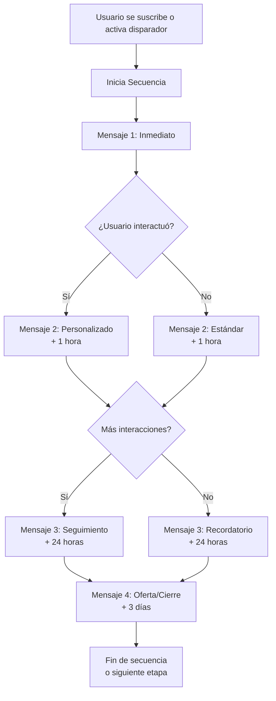

> Las campañas de mensajes en secuencia te permiten crear y gestionar series de mensajes automatizados que se envían a suscriptores activos e inactivos en intervalos predefinidos. Son ideales para nutrir leads, mejorar el compromiso del cliente y automatizar tareas de marketing de forma inteligente.

## ¿Qué son los Mensajes en Secuencia?

Los mensajes en secuencia son una funcionalidad integrada en la plataforma de chatbot que permite crear y personalizar secuencias de mensajes o acciones automatizadas para chatbots en plataformas de mensajería como WhatsApp. Esta funcionalidad está diseñada para elevar la calidad de las interacciones entre los chatbots y los usuarios, automatizando una secuencia de respuestas o acciones activadas por las entradas de los suscriptores o disparadores predefinidos.

Un mensaje en secuencia es un conjunto preconfigurado de mensajes automatizados que se envían a los suscriptores basándose en disparadores y horarios predefinidos. Estos mensajes ayudan a mantener el compromiso, nutrir leads y automatizar respuestas de manera eficiente. La clave está en que cada mensaje de la secuencia tiene un propósito específico y está diseñado para guiar al usuario hacia el siguiente paso en el embudo de comunicación.

Por ejemplo, una empresa podría usar mensajes en secuencia para crear una secuencia de bienvenida para nuevos suscriptores, que enviaría automáticamente una serie de mensajes presentando el chatbot y sus funcionalidades, e invitando al suscriptor a hacer preguntas o aprender más. O bien, una empresa podría usar mensajes en secuencia para crear un flujo de soporte al cliente, que proporcionaría asistencia automatizada para preguntas o problemas comunes.

Las secuencias se diferencian de los mensajes automáticos simples en que no son respuestas aisladas, sino una cadena de comunicación planificada. Cada mensaje se envía en un momento específico, y el contenido de cada uno puede depender de la interacción del usuario con el mensaje anterior. Esto permite crear experiencias altamente personalizadas y contextuales que se adaptan al comportamiento real de cada usuario.

> **Dato clave:** WhatsApp permite enviar mensajes de seguimiento ilimitados dentro de las primeras 24 horas de interacción. Después de ese período, solo se pueden enviar mensajes con plantillas preaprobadas. Aprovecha la ventana de 24 horas para las interacciones más importantes de tu secuencia.

## Tipos de Secuencias que Puedes Crear

Los mensajes en secuencia pueden utilizarse para crear una variedad de secuencias diferentes, adaptadas a cada etapa del ciclo de vida del cliente:

### Secuencias de Bienvenida
Da la bienvenida a los nuevos suscriptores con una secuencia personalizada de mensajes que presente tu marca, productos y servicios. Una buena secuencia de bienvenida puede aumentar la retención de clientes hasta en un 40%. El primer mensaje debe agradecer al usuario por suscribirse, el segundo debe presentar tu propuesta de valor principal, y los siguientes pueden guiar al usuario hacia su primera acción deseada.

### Secuencias de Soporte al Cliente
Proporciona asistencia automatizada con una secuencia de mensajes que responda preguntas frecuentes y resuelva problemas comunes sin intervención humana. Esto libera a tu equipo para enfocarse en consultas más complejas. Puedes crear secuencias específicas para problemas recurrentes como problemas de facturación, dudas sobre envíos o preguntas técnicas.

### Secuencias de Nutrición de Leads
Educa a los leads sobre tus productos o servicios mediante una secuencia de mensajes informativos, anímalos a registrarse para una prueba gratuita o a realizar una compra. Cada mensaje debe aportar valor y acercar al prospecto a la conversión. Una secuencia de nutrición típica puede durar entre 5 y 14 días, con 4 a 7 mensajes estratégicamente espaciados.

### Secuencias de Ventas
Aumenta tus ventas realizando un seguimiento estructurado de las actividades de los clientes para mejorar las estrategias de marketing. Guía a los clientes potenciales a través del embudo de ventas con mensajes estratégicamente programados que aborden objeciones comunes y presenten los beneficios de tu producto o servicio.

### Secuencias de Onboarding
Ayuda a los nuevos usuarios a familiarizarse con tu producto o servicio explicándoles cómo usarlo y cómo sacarle el máximo partido. Un onboarding efectivo reduce la deserción temprana y aumenta la satisfacción del cliente. Incluye tutoriales paso a paso, consejos de uso y respuestas a preguntas frecuentes de nuevos usuarios.

### Secuencias Promocionales
Promociona nuevos productos o servicios con una secuencia de mensajes que destaque sus beneficios y anime a los usuarios a conocer más. Funcionan muy bien para lanzamientos y ofertas por tiempo limitado, creando anticipación y urgencia de forma progresiva.

### Secuencias Educativas
Proporciona contenido de valor a los suscriptores: tips, tutoriales, casos de estudio y guías que los ayuden a resolver problemas específicos relacionados con tu industria. Este tipo de secuencia posiciona tu marca como autoridad en el sector.

### 🎯 Bienvenida

Engancha desde el primer mensaje. Presenta tu propuesta de valor y guía al suscriptor hacia su primera acción. Ideal para nuevos suscriptores.

### 💰 Ventas

Convierte leads en clientes con mensajes estratégicos que aborden objeciones y presenten beneficios clave de forma progresiva y persuasiva.

### 📚 Educativas

Posiciónate como autoridad en tu nicho compartiendo contenido valioso de forma automatizada. Genera confianza y credibilidad a largo plazo.

## ¿Cómo Funciona una Campaña de Mensajes en Secuencia?

La funcionalidad de Campaña de Mensajes en Secuencia de E-SMART360 te permite crear y gestionar secuencias de mensajes que se envían tanto a usuarios activos como inactivos en intervalos específicos. Estas secuencias pueden utilizarse para:

- **Nutrir leads** con contenido relevante a lo largo del tiempo, manteniendo tu marca presente en la mente del prospecto
- **Mejorar el compromiso del cliente** manteniendo una comunicación constante y valiosa que fortalezca la relación
- **Automatizar tareas de marketing** como recordatorios, seguimientos y promociones, liberando tiempo de tu equipo
- **Medir el rendimiento** de cada campaña para identificar cuáles son más efectivas y por qué
- **Optimizar la calidad de las interacciones** entre los chatbots y los usuarios proporcionando respuestas oportunas y contextualmente relevantes

> La función de seguimiento de rendimiento te permite ver qué campañas están generando mejores resultados, ayudándote a refinar tu estrategia de comunicación continua basándote en datos reales, no en suposiciones.

A continuación se muestra un diagrama del flujo típico de una campaña de mensajes en secuencia:

## Beneficios de Usar Mensajes en Secuencia

Implementar una estrategia de mensajes en secuencia en WhatsApp ofrece múltiples ventajas para tu negocio:

### Mejora la Experiencia del Cliente

Las respuestas automatizadas garantizan una atención instantánea. Los clientes reciben la información que necesitan en el momento preciso, sin esperas ni demoras. Esto se traduce en una experiencia de usuario superior que diferencia a tu marca de la competencia.

### Aumenta la Eficiencia Operativa

Reduce la carga de trabajo manual al automatizar tareas repetitivas como enviar recordatorios, dar la bienvenida a nuevos suscriptores o hacer seguimiento de leads. Tu equipo puede enfocarse en actividades de mayor valor estratégico, mientras las secuencias trabajan 24/7 sin interrupción.

### Mejora las Tasas de Conversión

Nutrir leads con mensajes relevantes y oportunos aumenta significativamente las probabilidades de conversión. Los mensajes en secuencia mantienen tu marca presente en la mente del cliente potencial en el momento justo en que está considerando una decisión de compra. Las empresas que implementan secuencias reportan entre un 20% y 50% más de conversiones.

### Mantiene el Compromiso Activo

Las secuencias bien diseñadas mantienen a los usuarios comprometidos con seguimientos oportunos que aportan valor en cada interacción. Los mensajes programados estratégicamente evitan que los clientes se olviden de tu oferta y fortalecen la relación marca-cliente con el tiempo.

### Optimización Basada en Datos

Haz seguimiento del rendimiento de cada campaña y refina las secuencias basándote en análisis concretos. La plataforma proporciona métricas de engagement, tasas de respuesta y efectividad de cada campaña para que puedas tomar decisiones informadas y mejorar continuamente tus resultados.

### Ahorro de Tiempo a Largo Plazo

Una vez configurada, una secuencia funciona automáticamente sin intervención manual. Esto significa que puedes estar generando ventas, educando leads y dando soporte a clientes mientras te enfocas en otras áreas de tu negocio. El retorno de inversión aumenta con cada secuencia activa.

## Cómo Configurar una Campaña de Mensajes en Secuencia

Sigue estos pasos para configurar y lanzar tu primera campaña de mensajes en secuencia en WhatsApp:

### Prerrequisitos

Antes de comenzar, asegúrate de tener:

- Una cuenta activa en E-SMART360
- Una cuenta de WhatsApp Business API verificada
- Plantillas de mensaje aprobadas para las secuencias de WhatsApp
- Una lista de suscriptores segmentada (opcional pero recomendada)
- Objetivos claros para cada secuencia que vayas a crear

### Paso 1: Crear una Nueva Secuencia

Accede al panel de control de E-SMART360 y navega hasta el Creador de Flujos (Flow Builder). Selecciona la opción **"Nueva Secuencia"** y asígnale un nombre descriptivo que te permita identificar fácilmente su propósito.

> **Recomendación:** Usa nombres como "Bienvenida - Nuevos Suscriptores", "Seguimiento Post-Compra", "Nutrición Leads - Curso Gratuito" o "Recuperación Carrito Abandonado" para mantener tus secuencias organizadas. Un buen sistema de nombres te ahorrará tiempo cuando tengas múltiples secuencias activas.

### Paso 2: Configurar el Temporizador

Establece el intervalo entre cada mensaje de la secuencia. Puedes configurar retardos específicos (minutos, horas o días) entre cada mensaje. Por ejemplo, una secuencia típica de bienvenida podría verse así:

- **Mensaje 1:** Inmediato (mensaje de bienvenida y agradecimiento)
- **Mensaje 2:** 1 hora después (presentación de beneficios principales)
- **Mensaje 3:** 24 horas después (caso de éxito o testimonio)
- **Mensaje 4:** 3 días después (oferta especial o invitación a acción)

Personaliza los horarios según el comportamiento esperado de tus usuarios y el tipo de secuencia que estés creando. Una secuencia de ventas puede necesitar intervalos más cortos, mientras que una secuencia educativa puede espaciarse más para evitar saturar al usuario.

### Paso 3: Estructurar los Mensajes

Diseña cada mensaje de la secuencia con el contenido adecuado. Puedes incluir:

- **Texto** con formato enriquecido para mejorar la legibilidad
- **Imágenes y videos** para hacer el contenido más atractivo y visual
- **Botones de llamada a la acción** (CTA) como "Comprar ahora", "Ver más", "Registrarse", "Agendar llamada"
- **Listas interactivas** para que el usuario elija entre múltiples opciones
- **Documentos** (PDF, catálogos) como adjuntos cuando sea relevante

Asegúrate de que cada mensaje aporte valor y tenga un objetivo claro dentro de la secuencia. No incluyas información redundante; cada mensaje debe construir sobre el anterior.

### Paso 4: Activar la Secuencia

Una vez que hayas configurado todos los mensajes, revisa la secuencia completa para verificar que los tiempos y contenidos sean correctos. Te recomendamos hacer una prueba enviándote la secuencia a ti mismo antes de activarla para usuarios reales. Luego, activa la campaña para que comience a enviarse a los suscriptores según lo configurado.

> Puedes pausar o detener una campaña en cualquier momento desde el panel de control. También puedes duplicar secuencias existentes para usarlas como base para nuevas campañas, ahorrando tiempo en la configuración inicial.

### Paso 5: Monitorear el Rendimiento

Después de lanzar la campaña, monitorea su rendimiento a través de las analíticas integradas. Revisa métricas como:

- **Tasa de apertura** de cada mensaje de la secuencia
- **Tasa de clics** en botones y enlaces incluidos
- **Tasa de conversión** general de la secuencia
- **Puntos de abandono** en cada paso de la secuencia
- **Tiempo promedio** entre interacciones del usuario

Utiliza estos datos para hacer ajustes y mejorar continuamente tus campañas. Si notas que muchos usuarios abandonan en un mensaje específico, prueba cambiando su contenido, tono o momento de envío.

## Mejores Prácticas para Mensajes en Secuencia

Para maximizar la efectividad de tus campañas de mensajes en secuencia, sigue estas recomendaciones:

### Contenido

- Mantén los mensajes concisos y relevantes. WhatsApp es un canal de comunicación directa, no un boletín por correo
- Personaliza las interacciones usando datos del usuario (nombre, historial de compras, intereses previos)
- Aporta valor en cada mensaje, no solo promociones. La regla 80/20 funciona bien: 80% contenido de valor, 20% promocional
- Usa un tono conversacional y cercano, como si hablaras con un amigo
- Incluye llamadas a la acción claras y específicas en cada mensaje
- Evita la jerga técnica excesiva a menos que tu audiencia sea especializada

### Programación

- Programa los mensajes estratégicamente para mantener el engagement sin saturar al usuario
- Respeta los límites de frecuencia de WhatsApp para evitar bloqueos y reportes de spam
- Espacia los mensajes de forma progresiva: más frecuentes al inicio, más espaciados después
- Considera la zona horaria de tus suscriptores; enviar a las 3 AM no es buena idea
- Evita enviar más de 2-3 mensajes por semana en secuencias de nutrición de leads
- Programa los mensajes más importantes en horas de alta actividad (10 AM - 12 PM o 4 PM - 7 PM)

### Técnico

- Usa plantillas de mensaje preaprobadas para WhatsApp cuando envíes fuera de la ventana de 24 horas
- Configura disparadores basados en acciones del usuario para mayor relevancia
- Implementa etiquetas para segmentar y hacer seguimiento detallado del comportamiento
- Analiza y refina continuamente las secuencias basándote en datos de rendimiento
- Prueba la secuencia completa antes de lanzarla a gran escala
- Mantén un registro de versiones para saber qué cambios has implementado y su impacto

## Ideas Avanzadas para Secuencias

Ve más allá de lo básico con estas ideas de secuencias avanzadas que puedes implementar:

### 🛒 Recuperación de Carritos Abandonados

Configura una secuencia de 3 mensajes:
1. Recordatorio amistoso (1 hora después del abandono)
2. Beneficios del producto + testimonio de cliente (24h después)
3. Oferta especial por tiempo limitado con código descuento (48h después)

### 🎉 Post-Compra y Fidelización

1. Confirmación y agradecimiento con datos del pedido (inmediato)
2. Guía de uso del producto / primeros pasos (1 día después)
3. Solicitud de reseña o valoración (5 días después)
4. Oferta exclusiva para clientes recurrentes (14 días después)

### 📅 Recordatorio de Citas

1. Confirmación de cita con detalles (inmediato al agendar)
2. Recordatorio 24 horas antes de la cita
3. Recordatorio 1 hora antes de la cita
4. Seguimiento post-cita con encuesta de satisfacción

### 🎓 Secuencia Educativa

1. Introducción al tema y qué aprenderá (día 1)
2. Lección 1: Conceptos básicos (día 3)
3. Lección 2: Aplicación práctica (día 5)
4. Lección 3: Casos de éxito (día 7)
5. Resumen y siguientes pasos (día 10)

## Cómo Integrar Secuencias con tu Estrategia de Marketing

Las campañas de mensajes en secuencia son más efectivas cuando se integran con el resto de tus canales y estrategias de marketing:

### Sincronización con Campañas de Broadcast

Mientras que los broadcasts son ideales para comunicaciones puntuales y masivas (como el lanzamiento de un producto), las secuencias son perfectas para nutrir relaciones a largo plazo. Una estrategia efectiva combina ambos:

1. Usa un **broadcast** para anunciar un nuevo producto a toda tu base de suscriptores
2. Los usuarios que interactúan con ese broadcast se suscriben automáticamente a una **secuencia de nutrición**
3. La secuencia profundiza en los beneficios del producto y guía al usuario hacia la compra

### Disparadores desde Formularios e Integraciones

Puedes conectar tus secuencias con formularios de captura de leads en tu sitio web. Cuando un usuario completa un formulario:

- Asígnale automáticamente una etiqueta según el formulario que completó
- Inicia una secuencia de bienvenida personalizada basada en sus intereses
- Envía contenido relevante segmentado por la información que proporcionó

### Segmentación por Etiquetas y Campos Personalizados

El sistema de etiquetas te permite crear segmentos altamente específicos:

- **Por comportamiento**: Usuarios que hicieron clic en "Comprar" pero no completaron
- **Por datos demográficos**: Suscriptores de una ubicación específica
- **Por historial de compras**: Clientes recurrentes vs. compradores primerizos
- **Por etapa del ciclo de vida**: Leads fríos, calientes, clientes activos o inactivos

> **Estrategia recomendada:** Crea un mapa de comunicación que cubra todo el ciclo de vida del cliente: captación → bienvenida → nutrición → conversión → post-venta → fidelización → reactivación. Cada etapa debe tener su propia secuencia diseñada para ese momento específico de la relación.

## Limitaciones y Consideraciones Técnicas

### Límites de Mensajes de WhatsApp

Es importante entender las reglas de WhatsApp para evitar bloqueos o restricciones en tu número:

- **Ventana de 24 horas**: Puedes enviar mensajes de sesión ilimitados dentro de las 24 horas posteriores a la última interacción del usuario. Aprovecha esta ventana para las secuencias más interactivas y conversacionales.
- **Fuera de la ventana de 24 horas**: Solo puedes enviar plantillas de mensaje preaprobadas por Meta. Estas plantillas deben cumplir con las políticas de contenido y solo pueden enviarse a usuarios que hayan dado su consentimiento explícito.
- **Límites de velocidad**: Dependiendo de tu nivel de calidad y límite de mensajería, podrás enviar cierta cantidad de mensajes por segundo. Las secuencias respetan estos límites automáticamente para evitar bloqueos.

### Frequency Capping de Meta

Meta implementa límites de frecuencia para proteger a los usuarios de la saturación de mensajes:

- No se recomienda enviar más de 2-3 mensajes de marketing por semana al mismo usuario
- Los mensajes de servicio (confirmaciones de pedido, actualizaciones de envío) no cuentan para este límite
- Si un usuario reporta un mensaje como spam, la calidad de tu número puede verse afectada
- Monitorea tu calidad de número regularmente en el panel de WhatsApp Business

> **Precaución:** Si envías demasiados mensajes en secuencia sin considerar la frecuencia, corres el riesgo de que los usuarios bloqueen tu número o marquen tus mensajes como spam. Define intervalos razonables (mínimo 2-3 horas entre mensajes) y ofrece siempre la opción de cancelar la suscripción o salir de la secuencia.

## Limitaciones de Velocidad y Calidad

Para mantener una buena reputación como remitente, ten en cuenta:

- **Nivel de calidad**: WhatsApp asigna un nivel de calidad (alta, media, baja) a cada número según los reportes de usuarios y la tasa de bloqueos
- **Límite de mensajería**: El límite de mensajes por día varía según el nivel de calidad y el tiempo que lleves usando WhatsApp Business API
- **Tasa de conversación iniciada por negocio**: Mantén un ratio saludable entre mensajes iniciados por el negocio y mensajes iniciados por el usuario
- **Reportes de spam**: Cada reporte de spam puede reducir significativamente tu capacidad de enviar mensajes

## Ejemplo Práctico: Chatbot de Seguimiento Automático

Imagina que tienes una tienda online y un usuario muestra interés en un producto pero no completa la compra. Así es como puedes configurar un chatbot de seguimiento automático completo:

### Creación del Flujo del Chatbot

1. Accede a **Gestor de Bots > Respuesta de Bot > Crear**
2. Nombra el chatbot como "Seguimiento Post-Interés"
3. Configúralo para que se active cuando un usuario interactúe con un mensaje relacionado con un producto o catálogo

### Mensaje Interactivo Inicial

Crea un mensaje interactivo como este:

> "¡Hola [Nombre]! 👋 ¿Te interesaría nuestro producto [Nombre del Producto]?"
>
> [Sí, quiero comprar] [No, gracias] [Quiero saber más]

- Si el usuario selecciona **Sí**: proporciónale un enlace directo al checkout
- Si el usuario selecciona **No**: finaliza la conversación u ofrece asistencia alternativa
- Si el usuario selecciona **Quiero saber más**: inicia una sub-secuencia educativa sobre el producto

### Etiquetas para Seguimiento

Cuando un usuario haga clic en "Comprar ahora", aplica una etiqueta llamada **"Compra Iniciada"**. Si el usuario no hace clic en el botón, no recibe esta etiqueta. Usa estas etiquetas para determinar quién necesita un recordatorio de seguimiento y segmentar campañas futuras.

### Configuración de la Secuencia de Seguimiento

Arrastra y conecta la opción **"Suscribir a Secuencia"** desde el botón "Comprar ahora" para iniciar una secuencia de seguimiento. Esta enviará un mensaje de recordatorio si el usuario no completa la compra en los siguientes 30 minutos (o el tiempo que elijas). El flujo sería:

1. Usuario muestra interés → Chatbot pregunta si quiere comprar
2. Usuario dice "Sí" → Se envía enlace de pago + se suscribe a secuencia
3. Si no paga en 30 min → Mensaje 1: Recordatorio amistoso
4. Si no paga en 2 horas → Mensaje 2: Beneficio adicional + testimonio
5. Si no paga en 24 horas → Mensaje 3: Oferta especial por tiempo limitado

> **Importante:** WhatsApp permite enviar mensajes de seguimiento ilimitados dentro de las primeras 24 horas de la interacción inicial. Después de 24 horas, solo puedes usar plantillas de mensaje preaprobadas. Programa tus recordatorios estratégicamente para no saturar a los usuarios y mantén siempre un tono amigable, no insistente.

Agrega una condición para verificar si el usuario seleccionó o no el botón "Comprar ahora". Si la condición es falsa (no compró), envía el mensaje de seguimiento recordándole su interés. Puedes agregar una segunda condición para enviar un recordatorio adicional si todavía no ha comprado después de la primera tanda de seguimientos.

> Puedes exportar el flujo completo de tu chatbot y compartirlo con otros miembros de tu equipo para colaborar en su optimización, o reutilizarlo como plantilla base para crear secuencias similares para otros productos de tu catálogo.

## Preguntas Frecuentes

### ¿Puedo personalizar el tiempo entre cada mensaje de la secuencia?

Sí, E-SMART360 te permite configurar retardos y horarios específicos para cada mensaje dentro de una secuencia. Puedes definir intervalos en minutos, horas o días, y programar el envío en momentos específicos del día para maximizar el engagement. También puedes configurar ventanas de envío para evitar horarios no deseados.

### ¿Necesito plantillas de mensaje de WhatsApp para usar secuencias?

Sí, para los mensajes que se envían fuera de la ventana de 24 horas (cuando el usuario no ha iniciado la conversación recientemente), WhatsApp requiere el uso de plantillas de mensaje preaprobadas. Para los mensajes dentro de la ventana de 24 horas, puedes usar mensajes de sesión libremente sin necesidad de plantillas. Planifica tus secuencias teniendo en cuenta esta restricción.

### ¿Puedo monitorear el rendimiento de mis secuencias en tiempo real?

Absolutamente. E-SMART360 proporciona analíticas completas para hacer seguimiento del engagement, las tasas de respuesta y la efectividad de cada campaña. Puedes ver qué mensajes tienen mejor rendimiento, en qué punto están abandonando los usuarios y qué días/horarios generan mejor respuesta. Toda esta información está disponible en tiempo real a través del panel de control.

### ¿Las secuencias pueden activarse por acciones específicas del usuario?

Sí, las secuencias pueden configurarse para activarse en función de interacciones del usuario, palabras clave específicas o condiciones predefinidas. Por ejemplo, puedes iniciar una secuencia de bienvenida cuando un usuario envía "Hola" por primera vez, una secuencia de ventas cuando hace clic en "Ver catálogo", o una secuencia de soporte cuando escribe "ayuda" o "problema".

### ¿Cuántos mensajes puedo incluir en una secuencia?

No hay un límite estricto en el número de mensajes que puedes incluir en una secuencia. Sin embargo, recomendamos mantener las secuencias entre 3 y 8 mensajes para maximizar el engagement sin saturar al usuario. Las secuencias más largas suelen tener mayores tasas de abandono. Si necesitas más de 8 mensajes, considera dividir la comunicación en dos secuencias separadas.

### ¿Puedo usar mensajes multimedia en las secuencias?

Sí, las secuencias soportan múltiples tipos de contenido: texto con formato, imágenes, videos, documentos PDF, botones interactivos con CTA y listas de opciones. Puedes combinar diferentes formatos en una misma secuencia para mantener el interés del usuario. Recuerda que los mensajes multimedia también deben cumplir con las políticas de contenido de WhatsApp.

### ¿Qué diferencias hay entre una secuencia y una transmisión masiva (broadcast)?

Una secuencia envía múltiples mensajes programados a lo largo del tiempo a usuarios específicos, mientras que un broadcast envía un solo mensaje a una lista completa de suscriptores. Las secuencias son ideales para nutrición de leads, onboarding y seguimiento personalizado. Los broadcasts son mejores para anuncios puntuales, promociones urgentes o comunicados importantes.

### ¿Puedo segmentar los suscriptores que reciben cada secuencia?

Sí, puedes segmentar tu audiencia usando etiquetas, campos personalizados e historial de interacciones. Por ejemplo, crea una secuencia específica para clientes que compraron más de $100, otra para quienes nunca han comprado, y otra para usuarios inactivos por más de 30 días. La segmentación mejora significativamente la relevancia y efectividad de tus campañas, llegando a duplicar las tasas de conversión.

### ¿Qué sucede si un usuario responde durante una secuencia?

Cuando un usuario responde durante una secuencia, se inicia una nueva ventana de 24 horas. Puedes configurar tu chatbot para que detecte la respuesta y, dependiendo del contenido, redirija la conversación a un agente humano, continúe con la secuencia desde donde iba, o inicie una sub-secuencia diferente basada en la respuesta del usuario.

### ¿Puedo tener múltiples secuencias activas al mismo tiempo?

Sí, no hay límite en la cantidad de secuencias que puedes tener activas simultáneamente. Puedes tener una secuencia de bienvenida para nuevos suscriptores, una de recuperación de carritos abandonados, otra de post-venta y una más de reactivación de clientes inactivos, todas funcionando al mismo tiempo para diferentes segmentos de tu audiencia.

## Conclusión

Las campañas de mensajes en secuencia en WhatsApp son una herramienta poderosa para automatizar interacciones con clientes, aumentar el engagement y potenciar tus esfuerzos de marketing. Con E-SMART360, puedes configurar secuencias estructuradas que optimicen tu estrategia de comunicación, nutran leads y mejoren las conversiones sin esfuerzo manual.

La clave del éxito está en planificar cuidadosamente cada secuencia: define objetivos claros, segmenta tu audiencia, crea contenido valioso y monitorea los resultados para mejorar continuamente. Empieza con una secuencia simple, mide su rendimiento, y expande gradualmente tu estrategia a medida que identificas qué funciona mejor para tu negocio.

> **Actualización: Nuevas funcionalidades de secuencias (2026-01-21)**
> Se ha mejorado el creador de flujos visual para incluir nuevos tipos de disparadores condicionales, programación avanzada con soporte de zonas horarias, exportación de flujos completos para compartir con tu equipo y nuevas métricas de rendimiento en tiempo real.

Empieza hoy mismo a crear tus propias secuencias desde el panel de control y descubre cómo la automatización inteligente puede transformar la comunicación con tus clientes, aumentar tus ventas y hacer crecer tu negocio de forma sostenible.
