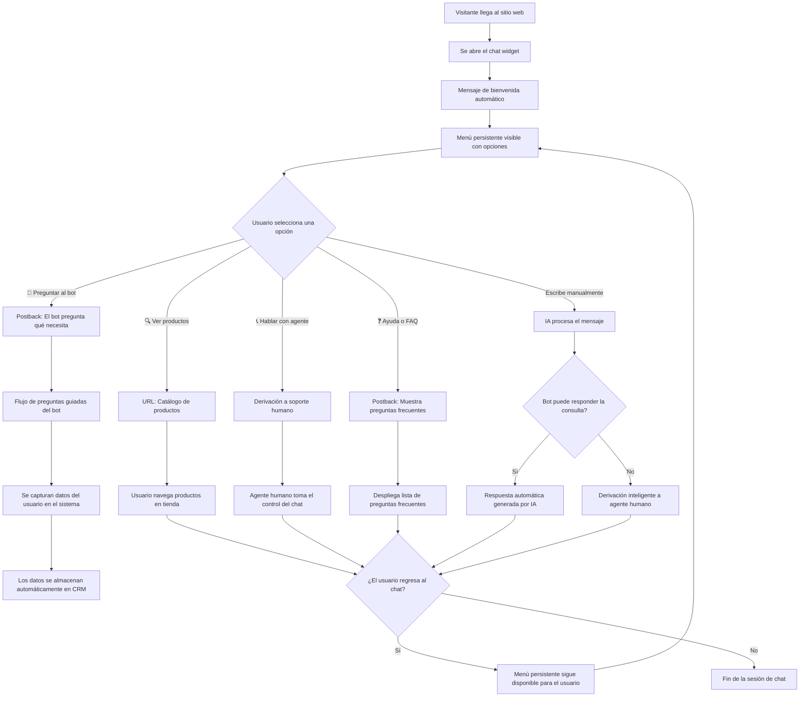
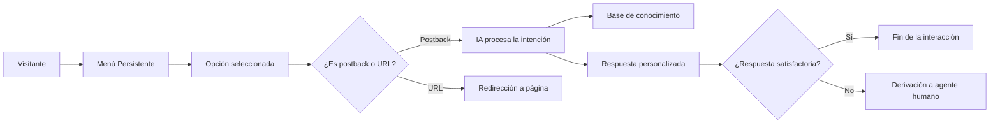

> El menú persistente es una de las funciones más solicitadas por negocios que buscan ofrecer una experiencia más fluida a sus visitantes. Con E-SMART360 puedes implementarlo en tan solo unos minutos y transformar por completo la forma en que tus usuarios interactúan con tu sitio web.

Implementar un chatbot en tu sitio web puede mejorar significativamente la interacción con los visitantes y brindar asistencia automatizada las 24 horas del día, los 7 días de la semana. Un menú persistente es una funcionalidad que permite personalizar aún más tu chat web, ofreciendo una experiencia de navegación guiada sin necesidad de que el usuario escriba un solo mensaje.

Esta característica destaca por ofrecer una excelente experiencia de usuario y acceso rápido a información crítica, convirtiendo tu chatbot en una verdadera herramienta de navegación y conversión.

## ¿Qué es el menú persistente en los chatbots de sitio web?

Un menú persistente es una lista de botones u opciones que está **siempre accesible** desde la ventana del chatbot en tu sitio web. A diferencia de los mensajes temporales que desaparecen con el flujo de la conversación, este menú permanece fijo y disponible sin importar en qué parte de la interacción se encuentre el usuario.

Este menú permite a los visitantes:

- Saltar directamente a diferentes secciones de tu sitio web
- Interactuar con el chatbot mediante comandos predefinidos
- Acceder a información sin necesidad de escribir mensajes de texto
- Realizar acciones específicas con un solo clic

> **Accesibilidad constante:** El menú persistente está diseñado para estar siempre visible, funcionando como un panel de navegación permanente dentro del chat. Esto lo convierte en una herramienta fundamental para la experiencia de usuario, especialmente en dispositivos móviles donde la navegación tradicional puede ser más limitada.

Esta funcionalidad es especialmente útil para:

- **Sitios de comercio electrónico:** Donde el acceso rápido a productos, carrito de compras, seguimiento de pedidos y soporte puede marcar la diferencia entre una venta y un abandono.
- **Sitios de servicios profesionales:** Clínicas, despachos, agencias y consultorías que necesitan ofrecer acceso rápido a agenda de citas, formularios de contacto y portales de clientes.
- **Sitios institucionales:** Universidades, organismos públicos y ONGs que buscan facilitar el acceso a información específica sin saturar a sus equipos de atención.
- **Portales de membresía:** Donde los usuarios necesitan acceder rápidamente a áreas restringidas, soporte técnico y recursos exclusivos.

### Características principales del menú persistente

### Opciones configurables

**Cada opción del menú persistente puede configurarse de dos formas principales:**

**Enlaces URL:** Redirigen a páginas específicas de tu sitio web. Ideales para llevar al usuario a secciones como "Productos", "Contacto", "FAQ" o "Blog". Al hacer clic, el enlace se abre en una nueva pestaña o en la misma ventana, según tu configuración.

**Respuestas del chatbot (postback):** Ejecutan respuestas automáticas predefinidas. Cuando el usuario selecciona esta opción, el chatbot responde con un mensaje configurado previamente, perfecto para mostrar información como horarios, precios o políticas de devolución.

**Multi-idioma:** Cada idioma configurado en tu chatbot puede tener su propio conjunto de opciones de menú persistente. Esto significa que si tu sitio está disponible en español, inglés y portugués, cada versión lingüística puede tener opciones y respuestas completamente diferentes y adaptadas culturalmente.

**Reordenación:** Puedes cambiar el orden de las opciones arrastrándolas, colocando las más importantes al principio para maximizar su visibilidad.

### Personalización visual

**El menú persistente hereda la personalización visual de tu chat widget, pero también cuenta con opciones adicionales:**

**Colores:** Los botones del menú se adaptan automáticamente a la paleta de colores primarios y secundarios configurada en tu chat. Puedes elegir entre un diseño de botones sólidos o contorneados.

**Posición:** El menú puede mostrarse en la parte superior o inferior de la ventana de chat. También puedes configurar si aparece siempre abierto o si se contrae después de usar una opción.

**Compatibilidad:** Funciona perfectamente en cualquier navegador moderno (Chrome, Firefox, Safari, Edge) y en todo tipo de dispositivos. La interfaz se adapta automáticamente al tamaño de pantalla disponible.

**Diseño responsive:** En dispositivos móviles, el menú persistente se muestra optimizado para facilitar la interacción táctil, con botones de mayor tamaño y espaciado adecuado.

### Comportamiento avanzado

**Funcionalidades adicionales que potencian el menú persistente:**

**Desactivación de entrada de texto:** Puedes deshabilitar la entrada manual de texto para que los usuarios solo puedan interactuar mediante las opciones del menú persistente. Esto es ideal para quioscos informativos, encuestas guiadas o procesos de onboarding.

**Menús contextuales:** Dependiendo del flujo de conversación, puedes mostrar diferentes conjuntos de opciones. Por ejemplo, si el usuario está en el flujo de soporte, el menú puede mostrar opciones relacionadas con la resolución de problemas.

**Analíticas integradas:** Cada clic en las opciones del menú persistente queda registrado, permitiéndote saber qué opciones son las más populares y optimizar tu menú en consecuencia.

**Actualización en tiempo real:** Los cambios que hagas al menú persistente se reflejan inmediatamente en tu sitio web, sin necesidad de recargar la página ni actualizar el código de inserción.

## Cómo implementar el menú persistente en tu chatbot

Configurar un menú persistente en tu chatbot es un proceso sencillo que consta de los siguientes pasos. Asegúrate de tener tu sitio web conectado a E-SMART360 antes de comenzar.

### Accede al WebChat Bot Manager

Desde el panel de control de E-SMART360, dirígete a la sección "WebChat" y luego selecciona "Bot Manager". Aquí encontrarás todas las opciones de configuración relacionadas con tu chatbot de sitio web. Busca la sección específica de "Menú persistente" en el menú lateral izquierdo.

Si aún no has conectado tu sitio web, primero deberás hacerlo desde la opción "Conectar sitio web" dentro de la misma sección. Allí podrás configurar la URL, colores, logotipo y posición del chat widget.

### Crea un nuevo menú persistente

Haz clic en el botón **"Crear"** que encontrarás en la parte superior derecha de la sección de menú persistente. Se abrirá una ventana emergente donde podrás comenzar a agregar las opciones de tu menú.

**Campos disponibles en el formulario de creación:**
- **Nombre de la opción:** El texto que verá el usuario en el botón
- **Tipo:** URL o Postback (respuesta del chatbot)
- **Valor:** La URL destino o el mensaje de respuesta
- **Icono (opcional):** Puedes asociar un emoji o icono a cada opción para hacerla más visual
- **Idioma:** Selecciona a qué idioma pertenece esta opción

### Configura las opciones del menú

Cada opción puede ser de dos tipos principales:

**Tipo URL:** Cuando seleccionas esta opción, debes ingresar la dirección web completa a la que deseas redirigir al usuario. Por ejemplo: `https://tusitio.com/productos` o `https://tusitio.com/contacto`. Las URLs pueden ser internas (dentro de tu sitio) o externas.

**Tipo Postback:** Al seleccionar esta opción, debes escribir el mensaje que el chatbot enviará cuando el usuario haga clic. Por ejemplo: "¡Claro! Estos son nuestros horarios de atención: Lunes a viernes de 9:00 a 18:00 hrs." El postback permite respuestas dinámicas y personalizadas.

Puedes agregar tantas opciones como necesites haciendo clic en "Agregar opción". También puedes reordenarlas arrastrando cada elemento a la posición deseada.

### Personaliza la experiencia del usuario (opcional)

E-SMART360 ofrece opciones avanzadas para controlar cómo los usuarios interactúan con el menú persistente:

**Deshabilitar entrada de texto:** Activa esta opción si deseas que los visitantes solo puedan interactuar mediante las opciones del menú persistente. Esto es especialmente útil para:
- **Quioscos informativos** en tiendas físicas o eventos
- **Encuestas rápidas** donde quieres respuestas estructuradas
- **Onboarding de nuevos usuarios** que necesitan orientación paso a paso
- **Procesos de registro o solicitud** donde cada paso debe seguirse en orden

Si deshabilitas la entrada de texto, el campo de escritura desaparecerá y los usuarios solo verán los botones del menú persistente.

### Configura opciones multi-idioma

Si tu sitio web opera en varios idiomas, puedes crear menús persistentes independientes para cada idioma:

1. Desde el selector de idioma, elige el idioma que deseas configurar
2. Crea las opciones del menú específicas para ese idioma con textos traducidos
3. Configura las respuestas postback en el idioma correspondiente
4. Repite el proceso para cada idioma adicional

El chatbot detectará automáticamente el idioma del navegador del visitante y mostrará el menú persistente correspondiente.

### Guarda, publica y prueba

Una vez que hayas configurado todas las opciones, haz clic en el botón **"Guardar"** en la parte inferior del formulario. El menú persistente aparecerá automáticamente en la ventana de chat de tu sitio web.

**Verifica la implementación:**
1. Abre tu sitio web en una ventana de incógnito o en un navegador donde no hayas iniciado sesión
2. Haz clic en el botón del chat widget para abrirlo
3. Confirma que el menú persistente aparezca correctamente
4. Prueba cada una de las opciones para verificar que funcionan según lo esperado
5. Si configuraste múltiples idiomas, cambia la configuración de idioma de tu navegador y verifica que se muestre el menú correcto

> Con solo estos pasos, tus visitantes tendrán acceso inmediato a las secciones más importantes de tu sitio web directamente desde el chat. No necesitan escribir nada, solo hacer clic. Esta simplicidad en la interacción se traduce en mejores tasas de engagement y satisfacción del cliente.

## ¿Por qué necesitas un menú persistente en tu chatbot web?

Al implementar un menú persistente, obtienes múltiples beneficios que transforman la experiencia de tus usuarios y potencian los resultados de tu negocio:

### Accesibilidad mejorada

Los usuarios siempre encuentran el menú disponible en la interfaz del chatbot, sin importar en qué punto de la conversación se encuentren. Esto elimina la frustración de tener que escribir comandos específicos o navegar por menús complejos para encontrar lo que buscan.

**Beneficios concretos:**
- Reducción del tiempo de búsqueda de información
- Disminución de abandonos por frustración
- Mayor satisfacción del usuario en la primera interacción
- Experiencia inclusiva para usuarios menos familiarizados con chatbots

### Navegación optimizada

El menú persistente estructura las interacciones con el chatbot de IA, creando caminos de navegación claros y predecibles. Los usuarios saben exactamente qué opciones tienen disponibles en todo momento.

**Ventajas clave:**
- Menos pasos para llegar a la información deseada
- Reducción de la carga cognitiva del usuario
- Mayor control sobre el flujo de la conversación
- Integración perfecta con la estrategia de navegación de tu sitio web

### Soporte multi-idioma nativo

Cada idioma configurado en tu chatbot puede tener su propio menú persistente con opciones y respuestas totalmente independientes. Esto permite una experiencia verdaderamente localizada que respeta las particularidades culturales y lingüísticas de cada audiencia.

**¿Cómo funciona?**
- Detección automática del idioma del navegador
- Menús adaptados culturalmente a cada región
- Respuestas postback en el idioma correcto
- URLs que pueden apuntar a versiones localizadas de tu sitio

## Integración del chatbot web con menú persistente en WordPress

Si tu sitio web está construido con WordPress, aquí tienes el proceso completo para integrar el chatbot con menú persistente:

### Paso 1: Conecta tu sitio web desde el panel de E-SMART360

1. Inicia sesión en tu cuenta de E-SMART360
2. Navega a la sección WebChat y selecciona "Conectar sitio web"
3. Completa los campos de configuración: título del chatbox, URL del sitio web, color de tema, color de fondo, color de burbuja, logotipo de marca y fondo de pantalla
4. Configura la posición: izquierda o derecha, estado inicial (abierto/cerrado), ejes X e Y, retardo de carga
5. Haz clic en "Conectar" para finalizar la configuración

### Paso 2: Copia el código de inserción JS

1. Una vez conectado el sitio, haz clic en **"Código de inserción"**
2. Se abrirá un diálogo con el código JavaScript generado automáticamente
3. Copia el código completo haciendo clic en el icono de copiar

Este código JS es compatible con WordPress (con o sin Elementor), sitios web construidos con cualquier CMS, sitios HTML estáticos, frameworks como React, Vue, Angular, Next.js, y cualquier plataforma que permita insertar código JavaScript personalizado.

### Paso 3: Pega el código en tu sitio WordPress

1. Inicia sesión en el panel de administración de WordPress
2. Edita la página donde deseas que aparezca el chatbot con Elementor
3. Busca el widget de "Código" o "Shortcode" en el panel de widgets
4. Arrástralo y suéltalo dentro de un contenedor en la página
5. Pega el código JavaScript copiado
6. Publica la página

> **Nota importante:** Si deseas que el chat aparezca en todo el sitio y no solo en una página, agrega el código en el archivo footer.php de tu tema o mediante un plugin de inserción de scripts como "Insert Headers and Footers".

### Paso 4: Configura el menú persistente

1. Vuelve al panel de E-SMART360 y accede al WebChat Bot Manager
2. Ve a la sección de "Menú persistente"
3. Crea las opciones de navegación que deseas ofrecer a tus visitantes
4. Guarda los cambios
5. Abre tu sitio web y verifica que el menú persistente aparezca correctamente en el chat
6. Prueba cada opción para asegurarte de que funcionan

### Solución de problemas comunes

### El chatbot no aparece en mi sitio web después de la integración

Verifica los siguientes puntos:

1. **Código de inserción correcto:** Asegúrate de haber copiado el código completo, sin truncarlo. El código debe comenzar con &lt;script&gt; y terminar con &lt;/script&gt;.
2. **JavaScript habilitado:** Confirma que JavaScript esté habilitado en tu navegador. Prueba en otro navegador o en una ventana de incógnito.
3. **Chatbot activo:** Verifica en la configuración de E-SMART360 que el chat web esté activado y no en estado de pausa.
4. **Caché del sitio:** Limpia la caché de tu sitio WordPress (caché del navegador, del plugin de caché, y del servidor si usas Cloudflare).
5. **Conflictos de plugins:** Desactiva temporalmente otros plugins de chat o JavaScript para descartar conflictos.
6. **Consola del navegador:** Abre las herramientas de desarrollador (F12) y revisa la consola en busca de errores de JavaScript.

### Las opciones del menú persistente no se actualizan en el sitio

Esto puede ocurrir por:

1. **Caché del navegador:** Los cambios pueden tardar unos minutos en reflejarse. Prueba abriendo el sitio en una ventana de incógnito.
2. **Caché de CDN:** Si usas Cloudflare u otro CDN, purga la caché para forzar la actualización.
3. **Múltiples pestañas abiertas:** Cierra y vuelve a abrir la pestaña del sitio web para forzar la recarga del chat.
4. **Tiempo de propagación:** Los cambios pueden tardar hasta 5 minutos en propagarse a todos los servidores.

## Personalización avanzada del chat widget web

E-SMART360 ofrece amplias opciones de personalización para que tu chatbot web se ajuste perfectamente a la identidad de tu marca:

### Apariencia visual

**Colores y estilos:**
- Color de tema primario y secundario
- Color de fondo de la ventana de chat
- Color de las burbujas de conversación
- Color del texto en burbujas y botones
- Color del encabezado y pie del chat

**Elementos gráficos:**
- Logotipo de marca (PNG, JPG, SVG)
- Imagen de fondo del chatbox
- Icono personalizado para el botón flotante
- Favicon del chat en pestañas del navegador

**Posicionamiento:**
- Posición en pantalla: izquierda o derecha
- Margen desde el borde inferior (eje Y)
- Margen desde el borde lateral (eje X)
- Estado inicial: abierto o cerrado

**Comportamiento:**
- Retardo de carga en segundos
- Animación de apertura
- Sonido de notificación para nuevos mensajes
- Indicador de escritura del bot

### Funcionalidades del chat

**Modos de interacción:**
- Chat completamente libre (texto + menú persistente)
- Solo menú persistente (sin entrada de texto)
- Modo híbrido con prioridad de opciones

**Captura de datos:**
- Solicitud automática de nombre al inicio
- Captura de correo electrónico
- Recolección de número de teléfono
- Campos personalizados adicionales

**Automatización:**
- Respuesta automática de bienvenida
- Mensajes de seguimiento programados
- Derivación a agente humano en horario laboral
- Respuestas fuera de horario

**Integraciones:**
- Chat en vivo con bandeja compartida
- CRM y herramientas de marketing
- Notificaciones por correo electrónico
- Webhooks para procesos personalizados

## Casos de uso avanzados del menú persistente

### Caso 1: Tienda de comercio electrónico

Una tienda de ropa online implementó un chatbot con el siguiente menú persistente:

- **🛍️ Ver novedades** - URL a la colección más reciente
- **📦 Seguir mi pedido** - Postback que solicita el número de pedido
- **💬 Contactar con soporte** - URL al formulario de contacto
- **📏 Guía de tallas** - Postback con tabla de tallas interactiva
- **🔥 Ofertas especiales** - URL a la sección de descuentos

**Resultados obtenidos:**
- ✅ 40% menos de consultas repetitivas al equipo de soporte
- ✅ Tiempo promedio de atención reducido de 8 a 2 minutos
- ✅ 25% de aumento en ventas asistidas por chat
- ✅ 60% de los usuarios utilizaron el menú persistente en su primera visita

### Caso 2: Clínica dental

Una clínica dental configuró su menú persistente con estas opciones:

- **📅 Agendar cita** - Postback que inicia el flujo de agendamiento
- **🦷 Servicios y precios** - URL a la sección de servicios
- **📍 Ubicación y horarios** - Postback con dirección y horario
- **👨‍⚕️ Conocer al equipo** - URL a la página del equipo médico
- **💬 Hablar con un asesor** - Postback que deriva a un agente humano

**Resultados obtenidos:**
- ✅ 60% de aumento en reservas de citas a través del chat
- ✅ 35% de nuevos pacientes llegaron a través del chatbot
- ✅ Reducción del 50% en llamadas telefónicas de consulta
- ✅ Menú persistente permitió auto-servicio sin espera de agente

### Caso 3: Empresa SaaS

Una empresa de software como servicio implementó su menú persistente así:

- **🚀 Iniciar prueba gratuita** - URL directa al registro
- **📚 Base de conocimiento** - URL a la documentación
- **🎥 Tutoriales en video** - URL al canal de tutoriales
- **💻 Estado del sistema** - Postback con estado actual del sistema
- **🎧 Soporte técnico** - Postback que inicia el flujo de soporte

**Resultados obtenidos:**
- ✅ 30% más de registros de prueba gratuita
- ✅ 45% de tickets de soporte resueltos sin intervención humana
- ✅ NPS (Net Promoter Score) aumentó en 15 puntos

### Diagrama del flujo de interacción completo

## Buenas prácticas para optimizar tu menú persistente

Para obtener los mejores resultados de tu menú persistente, sigue estas recomendaciones:

### 📋 Estructura del menú

- **Máximo 5 opciones principales** para evitar saturación visual
- **Ordena por importancia:** coloca las más relevantes al inicio
- **Usa nombres descriptivos** que indiquen claramente la acción
- **Agrupa opciones relacionadas** bajo categorías lógicas
- **Actualiza periódicamente** según la temporada o campañas activas
- **Mantén la coherencia** con la navegación principal de tu sitio web
- **Incluye una opción de "Ayuda"** siempre visible como respaldo
- **Usa emojis o iconos** para hacer las opciones más reconocibles visualmente

### 🎯 Optimización de conversión

- **Analiza los clics** para identificar qué opciones son más populares
- **Prueba A/B** diferentes estructuras y nombres de menú
- **Alinea el menú con tus objetivos** de negocio (ventas, soporte, leads)
- **Agrega opciones estacionales** para promociones temporales
- **Elimina opciones con bajo rendimiento** y sustitúyelas por otras
- **Mide el impacto** en tasas de conversión y satisfacción del cliente
- **Revisa las métricas semanalmente** para mantener el menú optimizado
- **Solicita feedback** a los usuarios sobre su experiencia con el menú

## Consejos avanzados para sacar el máximo provecho

### Integración con flujos de entrada de usuario

Puedes combinar el menú persistente con el flujo de entrada de usuario (User Input Flow) para crear experiencias aún más sofisticadas. Por ejemplo:

1. El usuario selecciona **"Solicitar cotización"** en el menú persistente
2. El chatbot inicia un flujo de preguntas guiadas para recopilar información como nombre, correo, teléfono y requisitos
3. Los datos se almacenan automáticamente en el sistema de gestión
4. El equipo de ventas recibe una notificación automática con los detalles recopilados
5. El menú persistente sigue disponible en todo momento por si el usuario necesita acceder a otra sección

Esta combinación permite automatizar procesos complejos como la calificación de leads, la programación de citas o la resolución de problemas técnicos, manteniendo siempre accesibles las opciones principales del menú persistente.

### Optimización para dispositivos móviles

Dado que más del 60% del tráfico web proviene de dispositivos móviles, es crucial optimizar el menú persistente para pantallas pequeñas:

- **Reduce el número de opciones** a 3-4 en móvil para evitar saturación visual
- **Aumenta el tamaño de los botones** para facilitar la interacción táctil
- **Usa iconos descriptivos** que ayuden a identificar cada opción rápidamente
- **Posiciona el menú en la parte inferior** del chat para alcanzarlo con el pulgar
- **Prueba en múltiples dispositivos** (iOS y Android) antes de publicar los cambios
- **Asegura tiempos de carga rápidos** para el widget del chat en conexiones móviles

### Análisis de rendimiento

E-SMART360 proporciona métricas detalladas sobre el uso del menú persistente:

- **Tasa de clics por opción:** Identifica cuáles son las opciones más populares y cuáles necesitan ser reemplazadas
- **Tasa de conversión:** Mide cuántos usuarios completan la acción deseada después de hacer clic en una opción
- **Tiempo de interacción:** Analiza cuánto tiempo pasan los usuarios interactuando con el chatbot
- **Tasa de abandono:** Detecta en qué punto los usuarios abandonan la conversación o el menú
- **Retorno de usuarios:** Mide cuántos visitantes regresan a interactuar con el chat en visitas posteriores
- **Satisfacción post-interacción:** Recoge feedback de los usuarios después de usar el menú persistente

Usa estas métricas para refinar continuamente tu menú persistente y maximizar su efectividad.

## Preguntas frecuentes

### ¿Qué es un menú persistente en un chatbot de IA para sitios web?

Un menú persistente es un menú fijo en la ventana del chatbot del sitio web que permite a los usuarios navegar a secciones clave o realizar acciones específicas sin interactuar con el flujo de conversación. Está siempre visible y disponible, sin importar en qué parte del chat se encuentre el usuario. Funciona como un panel de navegación permanente que facilita el acceso rápido a la información y servicios más importantes de tu sitio web.

### ¿Cómo configuro el menú persistente en mi chatbot web paso a paso?

Puedes configurarlo en solo tres pasos principales:

1. **Inicia sesión en E-SMART360** y asegúrate de tener tu sitio web conectado desde la sección WebChat
2. **Ve al WebChat Bot Manager** y busca la sección de menú persistente. Haz clic en "Crear" para comenzar
3. **Agrega tus opciones** indicando para cada una: el nombre visible, el tipo (URL o postback), y el valor (enlace o respuesta). Puedes añadir tantas opciones como necesites y reordenarlas

Una vez guardado, el menú persistente aparecerá automáticamente en la ventana de chat de tu sitio web.

### ¿Por qué necesito un menú persistente para mi chatbot de IA?

Un menú persistente facilita la interacción del usuario al proporcionar acceso directo a enlaces y funciones importantes, mejorando la experiencia general del sitio. Sus principales beneficios son:

- **Reduce la fricción:** Los usuarios encuentran lo que buscan en menos clics
- **Acelera la navegación:** No necesitan escribir ni explorar menús complejos
- **Guía al visitante:** Especialmente útil para usuarios nuevos que no conocen tu sitio
- **Aumenta conversiones:** Al eliminar barreras entre el usuario y la acción deseada
- **Mejora la accesibilidad:** Personas con menos familiaridad tecnológica pueden interactuar fácilmente

### ¿Cómo beneficia un menú persistente a un chatbot de comercio electrónico?

Un menú persistente en comercio electrónico ofrece múltiples beneficios:

- **Acceso rápido a categorías de producto:** Los clientes navegan el catálogo sin buscar manualmente
- **Soporte inmediato:** Botón de contacto directo con el equipo de atención al cliente
- **Enlace a promociones activas:** Las ofertas especiales están a un clic de distancia
- **Seguimiento de pedidos:** Los clientes verifican el estado de su compra al instante
- **Carrito de compras:** Acceso directo al carrito para completar la compra
- **Guías y tutoriales:** Ayuda contextual sobre productos, tallas y usos recomendados

Todo esto se traduce en menores tasas de abandono de carrito, mayor satisfacción del cliente y más ventas.

### ¿Se puede crear un chatbot que incluya menú persistente en el sitio web?

Sí, E-SMART360 incluye esta funcionalidad en todos sus planes, permitiendo crear experiencias profesionales desde el primer momento. El menú persistente es una funcionalidad estándar que no requiere configuraciones adicionales ni complementos de pago. Además, la plataforma permite personalizar colores, posiciones y comportamientos del menú sin necesidad de conocimientos técnicos.

### ¿Qué opciones debería incluir en el menú persistente de mi chatbot?

Las opciones ideales dependen de tu tipo de negocio:

**Para cualquier negocio:** Preguntas frecuentes (FAQ), contacto con soporte, horarios de atención

**Para comercio electrónico:** Productos destacados o categorías, seguimiento de pedidos, promociones activas

**Para servicios profesionales:** Agenda de citas, portafolio o servicios, testimonios de clientes

**Para sitios institucionales:** Información general, trámites y formularios, directorio de contacto

Selecciona las 3-5 opciones más relevantes para tu audiencia y ajústalas periódicamente según los datos de uso.

### ¿Qué es un chatbot de sitio web y cómo funciona?

Un chatbot de sitio web es un software automatizado impulsado por inteligencia artificial que interactúa con los visitantes, resuelve consultas en tiempo real, guía a los usuarios a través del sitio y mejora la experiencia general sin intervención humana.

**Características de los chatbots modernos:**
- Memoria contextual que recuerda el historial de la conversación
- Capacidad de entender múltiples idiomas
- Menús persistentes para navegación guiada
- Integración con sistemas CRM y ERP
- Respuestas basadas en base de conocimiento
- Derivación inteligente a agentes humanos cuando es necesario
- Capacidad de realizar acciones como agendar citas o procesar pedidos

### ¿Por qué debería usar un chatbot de IA en mi sitio web?

Los chatbots de IA ofrecen ventajas significativas:

- **Disponibilidad 24/7:** Atienden incluso cuando tu equipo no está disponible
- **Respuestas instantáneas:** Eliminan los tiempos de espera, mejorando la satisfacción
- **Automatización de tareas repetitivas:** Liberan a tu equipo humano para problemas complejos
- **Escalabilidad:** Atienden a cientos de visitantes simultáneamente sin degradación
- **Recolección de datos:** Capturan información valiosa sobre necesidades y comportamiento
- **Reducción de costos:** Disminuyen la carga operativa del equipo de soporte
- **Mejora continua:** Aprenden de cada interacción para ofrecer mejores respuestas

Los chatbots con menú persistente potencian estos beneficios al ofrecer navegación estructurada.

### ¿Cómo personalizo un chatbot para manejar múltiples idiomas?

Para configurar un chatbot multi-idioma:

1. **Configura los idiomas soportados** desde la configuración general del chatbot
2. **Traduce los mensajes automáticos:** bienvenida, respuestas predefinidas y postbacks
3. **Crea menús persistentes por idioma** con opciones adaptadas culturalmente
4. **Configura la detección automática** del idioma del navegador del visitante
5. **Ofrece cambio manual** de idioma como opción de respaldo
6. **Prueba cada idioma** navegando desde navegadores con diferentes configuraciones regionales

### ¿Hay plugins de chat gratuitos para sitios web?

Sí, existen muchos plugins de chat para sitios web. El chatbot web de E-SMART360 es uno de los más completos del mercado: cuenta con memoria contextual que recuerda el contexto de la conversación, menú persistente, respuestas con inteligencia artificial y capacidad multi-idioma, todo integrable con solo un código JavaScript.

Además, la plataforma ofrece funciones avanzadas como chat en vivo con bandeja compartida, automatización de respuestas mediante flujos condicionales, integración con CRM, analíticas detalladas y personalización completa de la apariencia del chat.

### ¿Puedo configurar un plugin de chat de WhatsApp para mi sitio web?

Sí, puedes configurar un plugin de chat de WhatsApp para tu sitio web. Primero conecta tu número de WhatsApp Business y desde el gestor de bots crea un widget de chat. Copia el código de inserción y pégalo en el código de tu sitio web. El menú persistente también estará disponible en este widget, ofreciendo una experiencia unificada entre el chat web y WhatsApp.

### ¿Puedo enviar y recibir mensajes a través del chat en vivo del sitio web?

Sí, puedes enviar y recibir mensajes a través del chat en vivo del sitio web desde el gestor de bots de E-SMART360, en la sección de chat en vivo. No hay límites restrictivos para la comunicación en tiempo real con tus visitantes. El chat en vivo se integra perfectamente con el menú persistente, permitiendo a los usuarios comenzar con opciones predefinidas y luego continuar con un agente humano si es necesario.

## Conclusión

Un menú persistente en el chatbot de tu sitio web puede transformar la forma en que los usuarios se comunican con tu sitio. Este menú permanente mejora la interacción y satisfacción del usuario al ofrecer acceso inmediato a las opciones más importantes. Recuerda que el objetivo de un chatbot en línea, particularmente en un entorno de comercio electrónico, es hacer la vida más fácil a tus clientes.

Un menú persistente bien implementado logra precisamente eso: además de hacer que tu sitio web sea funcional, lo hace más amigable para el cliente. Para las empresas que buscan impulsar su interacción con los clientes en línea, incorporar un menú persistente dentro de tu chatbot es un paso hacia la excelencia digital.

Con esta funcionalidad, tu chatbot de sitio web se convierte en mucho más que una simple herramienta: se transforma en un componente esencial de tu estrategia digital. No solo mejora la navegación y la accesibilidad, sino que también incrementa las conversiones, reduce la carga de trabajo del equipo de soporte y ofrece una experiencia de usuario superior.

> **¿Listo para implementarlo?** El menú persistente está disponible en todos los planes de E-SMART360. Conéctalo hoy mismo y comienza a ofrecer una experiencia de navegación fluida a tus visitantes. Con solo unos minutos de configuración, tus usuarios tendrán acceso directo a la información y servicios que más importan.

## Actualizaciones recientes

> **Mejora en la personalización visual del menú persistente (24 Jun 2025)**
> Se agregaron nuevas opciones de personalización de colores y posicionamiento para el menú persistente, permitiendo una integración más coherente con la identidad visual de cada marca. Ahora es posible elegir entre botones sólidos o contorneados.

> **Soporte multi-idioma en menú persistente (15 May 2025)**
> Ahora es posible crear menús persistentes independientes para cada idioma configurado en el chatbot, permitiendo experiencias completamente localizadas con detección automática del idioma del navegador del visitante.

> **Nueva función de desactivación de entrada de texto (10 Abr 2025)**
> Se incorporó la opción de deshabilitar la escritura manual en el chat, permitiendo que los usuarios interactúen exclusivamente a través del menú persistente. Ideal para quioscos informativos, encuestas y procesos guiados.

> **Analíticas integradas para el menú persistente (20 Mar 2025)**
> Cada clic en las opciones del menú persistente ahora queda registrado con métricas detalladas, permitiendo identificar las opciones más populares y optimizar la experiencia en función de datos reales de uso.

## Integración avanzada con User Input Flow

Una de las funcionalidades más poderosas que complementa al menú persistente es el **User Input Flow** (flujo de entrada de usuario). Esta característica permite a tu chatbot realizar conversaciones guiadas y estructuradas, recopilando información valiosa de los visitantes de forma natural y automatizada.

### ¿Qué es el User Input Flow?

El User Input Flow es una funcionalidad que permite a los chatbots recopilar respuestas de los usuarios de manera estructurada. En lugar de enviar respuestas genéricas, tu chatbot puede:

- **Hacer preguntas específicas** en secuencia lógica
- **Almacenar las respuestas** de los usuarios en el sistema
- **Personalizar conversaciones futuras** utilizando los datos recopilados
- **Derivar a diferentes flujos** según las respuestas obtenidas

### Cómo se complementa con el menú persistente

La combinación del menú persistente con el User Input Flow crea una experiencia de usuario completa:

1. El usuario llega al chat y ve el **menú persistente** con opciones principales
2. Selecciona una opción como "Solicitar cotización" o "Agendar cita"
3. El **User Input Flow** se activa automáticamente, guiando al usuario con preguntas secuenciales
4. Los datos se capturan en tiempo real y se almacenan en el sistema
5. Una vez completado el flujo, el **menú persistente** sigue disponible para nuevas interacciones

### Casos de uso combinados

### 🧑‍💼 Calificación de leads

Un visitante selecciona "Quiero comprar" del menú persistente. El User Input Flow inicia preguntando:

1. ¿Qué producto te interesa?
2. ¿Cuál es tu presupuesto aproximado?
3. ¿En qué horario prefieres que te contactemos?
4. Por favor comparte tu correo electrónico

Los datos se guardan automáticamente y el equipo de ventas recibe una notificación con un lead perfectamente calificado.

### 📅 Agendamiento de citas

Un paciente selecciona "Agendar cita" del menú persistente de una clínica. El flujo guiado pregunta:

1. ¿Eres paciente nuevo o existente?
2. ¿Qué especialidad necesitas?
3. ¿Qué día y horario prefieres?
4. ¿Cuál es tu nombre completo y teléfono?

La cita se agenda automáticamente y se envía una confirmación.

### Configuración del User Input Flow

1. Accede al **Gestor de Bots** desde el panel de E-SMART360
2. Selecciona tu chatbot y navega a la sección **"Flujo de entrada"** o **"Input Flow"**
3. Haz clic en **"Crear"** para diseñar un nuevo flujo
4. Define las preguntas en el orden deseado, eligiendo entre diferentes tipos de respuesta:
   - **Texto libre:** Para respuestas abiertas
   - **Selección múltiple:** Para opciones predefinidas
   - **Sí/No:** Para decisiones binarias
   - **Número:** Para datos numéricos como teléfonos o cantidades
5. Configura la **lógica condicional:** dependiendo de la respuesta, el chatbot puede tomar diferentes caminos
6. Guarda el flujo y asígnelo a una opción del menú persistente

> **Consejo de optimización:** Mantén las preguntas cortas y claras. Usa lógica condicional para adaptar el flujo según las respuestas del usuario. Revisa periódicamente las métricas de rendimiento para identificar oportunidades de mejora.

## Estrategias avanzadas de personalización del menú persistente

### Personalización basada en segmentación de usuarios

E-SMART360 permite mostrar diferentes versiones del menú persistente según el tipo de visitante:

- **Nuevos visitantes:** Un menú con opciones introductorias como "¿Cómo funciona?", "Ver productos destacados" y "Hablar con un asesor"
- **Visitantes recurrentes:** Un menú con opciones más avanzadas como "Seguir mi pedido", "Soporte técnico" y "Ofertas exclusivas"
- **Usuarios que vuelven del carrito abandonado:** Un menú que prioriza "Completar mi compra" y "Ayuda con el pago"

### Integración con el Asistente de IA

El menú persistente puede trabajar en conjunto con el Asistente de IA de E-SMART360 para ofrecer respuestas aún más inteligentes:

### Automatización de respuestas con datos de Google Sheets

Puedes configurar tu chatbot para que utilice datos de Google Sheets en las respuestas del menú persistente. Por ejemplo:

1. El usuario selecciona "Verificar disponibilidad" en el menú
2. El chatbot consulta una hoja de Google Sheets con el inventario actualizado
3. La respuesta se personaliza con datos en tiempo real: "Actualmente tenemos disponibles 15 unidades del producto X"
4. El menú persistente sigue visible para que el usuario pueda realizar otra acción

## Migración desde otras plataformas

Si estás migrando tu chatbot desde otra plataforma a E-SMART360, el proceso de transferencia del menú persistente es sencillo:

### Checklist de migración

- [ ] Exporta la configuración de tu menú persistente actual (opciones, URLs, postbacks)
- [ ] Identifica los idiomas configurados y sus respectivos menús
- [ ] Conecta tu sitio web a E-SMART360 desde la sección WebChat
- [ ] Recrea las opciones del menú en el WebChat Bot Manager
- [ ] Verifica que todas las URLs y postbacks funcionen correctamente
- [ ] Prueba el menú persistente en diferentes navegadores y dispositivos
- [ ] Configura el multi-idioma si es necesario
- [ ] Monitorea las métricas durante la primera semana para asegurar una transición exitosa

## Compatibilidad con plataformas populares

El chatbot con menú persistente de E-SMART360 es compatible con:

### 🟢 WordPress + Elementor

Integración completa con código JS. Compatible con cualquier tema y constructor de páginas. Funciona perfectamente con WooCommerce para tiendas online.

### 🔵 Shopify

Inserción mediante código JS en el theme.liquid o mediante la sección de código personalizado. Ideal para tiendas que necesitan chatbot con catálogo de productos.

### 🟣 HTML/Vanilla JS

Para sitios web estáticos o frameworks como React, Vue, Angular y Next.js. Solo necesitas pegar el código de inserción en el archivo HTML principal.

## Métricas y análisis de rendimiento

E-SMART360 proporciona un panel de análisis completo para monitorear el rendimiento de tu menú persistente:

### Indicadores clave (KPIs)

| Métrica | Descripción | Objetivo recomendado |
|---------|-------------|---------------------|
| Tasa de clics (CTR) | Porcentaje de usuarios que hacen clic en el menú | > 40% |
| Tasa de conversión | Usuarios que completan la acción deseada | > 15% |
| Tiempo promedio de interacción | Tiempo que pasan los usuarios en el chat | 3-5 minutos |
| Tasa de resolución en primer contacto | Problemas resueltos sin derivación humana | > 70% |
| Satisfacción del usuario (CSAT) | Calificación post-interacción | > 4.5/5 |

### Cómo mejorar tus métricas

1. **Analiza las opciones con menor CTR:** Considera renombrarlas o reemplazarlas
2. **Prueba A/B:** Compara diferentes versiones del menú para identificar la más efectiva
3. **Optimiza los nombres de las opciones:** Usa verbos de acción claros ("Comprar ahora", "Ver ofertas")
4. **Añade emojis:** Las opciones con emojis suelen tener mayor tasa de clics
5. **Revisa los horarios de mayor actividad:** Ajusta el menú según las horas pico de tu sitio

## Solución de problemas adicional

### El menú persistente no se muestra en dispositivos móviles

Verifica los siguientes puntos:

1. **Responsive design:** Confirma que la configuración responsive esté activada
2. **Ancho de pantalla:** Prueba en diferentes tamaños de pantalla (320px, 375px, 414px)
3. **Zoom del navegador:** Algunos navegadores con zoom aplicado pueden ocultar elementos del chat
4. **Actualización:** Asegúrate de tener la última versión del widget de chat
5. **Compatibilidad iOS:** En Safari de iOS, verifica que no haya restricciones de iframe o cookies de terceros

### Los postbacks del menú persistente no ejecutan respuestas automáticas

Causas posibles y soluciones:

1. **Flujo no configurado:** Verifica que hayas creado un flujo de respuesta para cada postback
2. **Condiciones no cumplidas:** Revisa si el flujo tiene condiciones que no se están cumpliendo
3. **Variables no definidas:** Si usas variables en las respuestas, asegúrate de que estén correctamente definidas
4. **Límite de caracteres:** Algunas respuestas pueden tener límites de caracteres; revisa la longitud
5. **Error de sintaxis:** Verifica que no haya errores tipográficos en los mensajes postback

### ¿Cómo puedo restablecer el menú persistente a su configuración predeterminada?

Para restablecer el menú persistente:

1. Accede al WebChat Bot Manager
2. Ve a la sección de menú persistente
3. Haz clic en "Opciones" junto al menú que deseas restablecer
4. Selecciona "Restablecer valores predeterminados"
5. Confirma la acción
6. Si deseas empezar desde cero, puedes eliminar todas las opciones existentes y crear nuevas

Ten en cuenta que esta acción no se puede deshacer, así que asegúrate de exportar tu configuración actual antes de restablecerla.

### ¿El menú persistente afecta el rendimiento de carga de mi sitio web?

El menú persistente de E-SMART360 está diseñado para tener un impacto mínimo en el rendimiento:

- **Carga asíncrona:** El widget del chat se carga de forma asíncrona, sin bloquear la renderización de la página
- **Tamaño optimizado:** El código de inserción es ligero (menos de 50KB)
- **Carga diferida:** El chat solo se carga cuando el usuario interactúa con el botón flotante
- **CDN global:** Los archivos se sirven desde una red de distribución de contenido para tiempos de carga rápidos

En pruebas de rendimiento, el impacto en el tiempo de carga de la página es inferior a 0.2 segundos.
