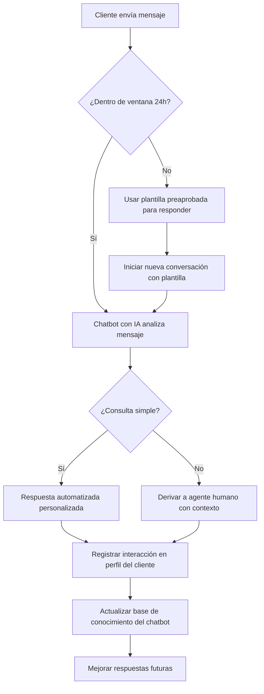

# Por qué el Marketing por Chat está ganando popularidad día a día

> El marketing por chat se está convirtiendo en una estrategia fundamental para las empresas que desean una comunicación más rápida y mejores resultados. Mediante el uso de chatbots con IA y herramientas de interacción con clientes, las empresas pueden brindar atención al cliente 24/7, interactuar instantáneamente y crear experiencias más personalizadas.

Con funciones como la interacción omnicanal y las conversaciones automatizadas, las empresas pueden capturar clientes potenciales, guiar a los clientes a través de las compras y mejorar el rendimiento de ventas. Como resultado, el marketing por chat ayuda a las empresas a aumentar las conversiones mientras generan un ROI más sólido, especialmente para pequeñas empresas que buscan crecer de manera eficiente.

*Última actualización: 10 de marzo de 2026*

El marketing por chat ha pasado de ser una opción experimental a convertirse en una necesidad estratégica para cualquier negocio que quiera mantenerse competitivo. Con más de 2 mil millones de usuarios activos en WhatsApp y tasas de apertura que superan el 90%, los canales de mensajería se han convertido en la columna vertebral de la comunicación empresarial moderna. Este artículo te guiará a través de todo lo que necesitas saber: desde los fundamentos hasta las estrategias avanzadas, pasando por casos prácticos, estadísticas clave y guías de implementación paso a paso.

---

## Introducción

La atención al cliente a través del chat impulsa el crecimiento del negocio de marketing al aumentar las oportunidades de venta y fomentar la lealtad del cliente a largo plazo. Un soporte fluido permite a las empresas atender las necesidades al instante, asegurando a los clientes que la ayuda está siempre disponible.

Plataformas de mensajería como Facebook Messenger, WhatsApp, Telegram e Instagram conectan a empresas y clientes para una generación de leads y retención efectiva. Como resultado, el marketing por chat juega un papel central en las estrategias de negocio modernas.

> El marketing por chat permite a las empresas diferenciarse y responder a las necesidades de los clientes de forma inmediata, creando una ventaja competitiva significativa en el mercado actual.

Para ilustrar mejor su relevancia, este artículo examina qué es el marketing por chat, por qué está ganando importancia, cómo las empresas pueden utilizarlo para obtener resultados comerciales medibles, y qué herramientas prácticas puedes implementar hoy mismo para empezar a ver resultados.

---

## ¿Qué es el Marketing por Chat?

El marketing por chat es una forma de establecer y fortalecer la relación entre clientes y empresas a través de aplicaciones de mensajería instantánea, principalmente con software automatizado como los chatbots. En el marketing por chat, la mayoría de las conversaciones entre clientes y empresas se realizan a través de servicios automatizados como los chatbots.

Los chatbots pueden enviar mensajes personalizados y plantillas a los clientes sobre lanzamientos de productos, inicio de ventas, ofertas, descuentos y mucho más. Además de los chatbots, a veces las conversaciones entre clientes y empresas pueden realizarse a través de agentes humanos en chat en vivo para manejar situaciones más complejas.

Una estrategia de marketing por chat abarca todos los aspectos del negocio e involucra a casi todos los que trabajan en tu empresa, desde marketing y ventas hasta servicio al cliente y operaciones.

### Tipos de mensajes en el marketing por chat

En el ecosistema de mensajería empresarial, existen tres tipos principales de mensajes que debes conocer:

**Mensajes entrantes:** Cualquier mensaje que un cliente te envía. Cada vez que recibes un mensaje entrante, tienes 24 horas para responder. Esta ventana de 24 horas se llama ventana de servicio al cliente.

**Mensajes salientes:** Cualquier mensaje que envías al cliente dentro de la ventana de servicio al cliente de 24 horas. La ventana se reinicia cada vez que el cliente te envía un mensaje, lo que significa que obtienes una nueva ventana de 24 horas para responder cada vez que el cliente se comunica contigo.

**Mensajes plantilla:** Para iniciar una nueva conversación con un cliente o responder a un mensaje entrante fuera de la ventana de 24 horas, necesitas usar una plantilla de mensaje preaprobada. Estas plantillas deben ser revisadas y aprobadas por Meta antes de su uso y son esenciales para campañas de marketing y broadcasting.

### Canales compatibles con el marketing por chat

El marketing por chat no se limita a una sola plataforma. Los principales canales que puedes utilizar incluyen:

- **WhatsApp:** El canal más popular con más de 2 mil millones de usuarios activos. Ideal para atención al cliente, ventas y broadcasting.
- **Facebook Messenger:** Perfecto para integraciones con páginas de negocio y anuncios de Facebook.
- **Instagram DM:** Excelente para marcas visuales yengagement con audiencias jóvenes.
- **Telegram:** Ideal para grupos y comunidades, con potentes funciones de bots.
- **Chat web:** Integración directa en tu sitio web para capturar leads en tiempo real.

---

## Beneficios Clave del Marketing por Chat

El marketing por chat ofrece a las empresas varias formas de impulsar la interacción con los clientes y optimizar los procesos de ventas. A continuación exploramos cada beneficio en detalle con ejemplos prácticos.

### Atención al Cliente 24/7

Los chatbots brindan soporte continuo, operando las 24 horas del día sin interrupción. Esto significa que las empresas pueden ofrecer atención al cliente en cualquier momento, incluso fuera del horario laboral y durante fines de semana y feriados.

Por ejemplo, si un cliente pregunta sobre un producto a medianoche, el chatbot puede responder de inmediato con información útil. La disponibilidad permanente mejora la experiencia del cliente y garantiza que las empresas no pierdan nuevas oportunidades de venta.

> **Dato clave:** Un chatbot activo 24/7 puede captar clientes que de otra forma se perderían. Las empresas que implementan chatbots de atención continua reportan aumentos significativos en la satisfacción del cliente y en las tasas de retención.

Las empresas que ofrecen soporte 24/7 no solo retienen más clientes, sino que también generan más reseñas positivas y recomendaciones. Cuando un cliente recibe ayuda a cualquier hora, su percepción de la marca mejora notablemente.

### Generación de Leads más Rápida

Con el marketing por chat, las empresas pueden recolectar leads directamente a través de aplicaciones de mensajería. En lugar de depender de formularios de contacto tradicionales que los usuarios a menudo ignoran, las empresas pueden hacer preguntas a los clientes en un chat y recopilar detalles clave como:

- Nombre completo
- Correo electrónico
- Número de teléfono
- Preferencias de productos
- Presupuesto estimado
- Ubicación geográfica
- Intereses específicos

Las empresas pueden usar esta información para segmentar leads y personalizar futuros esfuerzos de marketing.

### Configura la captura de leads en tu chatbot

Dentro del panel de gestión, crea un flujo de chatbot que salude al visitante y le ofrezca un incentivo (descuento, guía gratuita, cupón exclusivo) a cambio de sus datos de contacto. Un mensaje inicial efectivo podría ser: "¡Hola! 🎁 Responde algunas preguntas y obtén un 10% de descuento en tu primera compra".

### Diseña las preguntas de calificación

Prepara 2 o 3 preguntas clave para calificar al lead: qué producto busca, presupuesto aproximado, plazo de compra. Mantén las preguntas breves y ofrece opciones de respuesta con botones para facilitar la interacción y aumentar la tasa de respuesta.

### Activa la integración con tu CRM o base de datos

Conecta el chatbot con tu CRM, Google Sheets o herramienta de email marketing para que cada nuevo lead se almacene automáticamente sin intervención manual. Esto asegura que ningún lead se pierda y que tu equipo pueda hacer seguimiento de inmediato.

### Configura el seguimiento automático de leads

Crea una secuencia de mensajes de seguimiento para quienes no completaron la compra en las primeras 24 horas. Por ejemplo: un recordatorio amigable a las 2 horas, otro ofreciendo ayuda a las 24 horas y un último con una oferta especial a los 3 días si no ha habido respuesta.

### Mayor Interacción con los Clientes

Las personas generalmente responden a los mensajes con más frecuencia que a los correos electrónicos. El chat se siente más personal e interactivo, por lo que los clientes están más dispuestos a involucrarse con las empresas. Las tasas de apertura de mensajes en apps de mensajería superan el 90%, mientras que el email marketing ronda el 20-30%.

Cuando los clientes interactúan más, las empresas tienen más oportunidades para:

- Presentar productos nuevos o relevantes
- Proporcionar recomendaciones personalizadas basadas en el historial
- Construir relaciones de confianza a largo plazo
- Obtener retroalimentación directa sobre productos y servicios
- Realizar ventas cruzadas y upselling de forma natural
- Resolver dudas antes de que el cliente abandone el proceso de compra

> **El poder de la mensajería instantánea:** Según estudios de la industria, la tasa de respuesta a mensajes de WhatsApp es 5 veces mayor que la del correo electrónico. Esto convierte al chat en el canal ideal para campañas de marketing con alto engagement.

### Experiencias Personalizadas para el Cliente

Los chatbots actuales pueden analizar datos y comportamiento de los clientes para proporcionar respuestas personalizadas. En lugar de enviar el mismo mensaje a todos, los chatbots pueden enviar mensajes dirigidos según las preferencias y el comportamiento pasado de cada usuario.

Por ejemplo, un chatbot puede recomendar productos basándose en:

- Compras anteriores realizadas por el cliente
- Comportamiento de navegación en el sitio web
- Preferencias declaradas por el cliente durante la conversación
- Historial de interacciones previas con la marca
- Productos vistos pero no comprados (carrito abandonado)
- Segmento demográfico y ubicación

### Ejemplo: Recomendación personalizada

"¡Hola Ana! 👋 He notado que has estado viendo nuestros tenis para running. Tenemos justo lo que necesitas: el modelo Ultralight Pro ahora con 15% de descuento. ¿Te gustaría ver los detalles y tallas disponibles?"

### Ejemplo: Seguimiento de carrito abandonado

"¡Hola Carlos! 🛒 Veo que dejaste unos audífonos Bluetooth en tu carrito. ¿Tuviste alguna duda sobre el producto? Este mes incluyen envío gratis y garantía extendida. Responde "COMPRAR" para finalizar tu pedido ahora."

### Cómo usar etiquetas para segmentar clientes automáticamente

Una práctica avanzada en marketing por chat es el uso de etiquetas automatizadas. Cada vez que un cliente interactúa con tu chatbot, puedes asignarle etiquetas según:

1. **Producto de interés:** Si el cliente hace clic en "Electrónicos", se le etiqueta como "Interés: Electrónicos".
2. **Intención de compra:** Si selecciona "Comprar ahora", se le etiqueta como "Listo para comprar".
3. **Presupuesto:** Si responde "Más de $500", se le etiqueta como "Premium".
4. **Fuente de llegada:** Si llegó por un anuncio específico, se registra la campaña.

Estas etiquetas te permiten crear segmentos precisos para campañas de marketing dirigidas. Por ejemplo, puedes enviar una oferta especial solo a clientes etiquetados como "Interés: Electrónicos" + "Premium" + "No ha comprado aún".

### Mejora en la Conversión de Ventas

El marketing por chat ayuda a guiar a los clientes a través de cada paso del proceso de marketing y ventas. Las empresas pueden acompañar a los clientes en cada etapa, desde el descubrimiento de un producto hasta la realización de la compra.

Por ejemplo, un chatbot puede:

1. Presentar un producto de manera atractiva con imágenes y descripción
2. Proporcionar detalles completos del producto incluyendo precio y disponibilidad
3. Responder preguntas frecuentes del cliente al instante
4. Ofrecer un código de descuento exclusivo por chat para incentivar la compra
5. Dirigir al cliente al proceso de pago con un solo clic

Este enfoque paso a paso puede ayudar a aumentar las tasas de conversión significativamente, especialmente en comercio electrónico.

### Cómo configurar una secuencia de ventas automatizada completa

Para maximizar las conversiones, puedes crear una secuencia de ventas con los siguientes pasos:

**Paso 1 — Mensaje de bienvenida:** Saluda al cliente y pregunta en qué está interesado. Ejemplo: "¡Bienvenido a [Tienda]! 🏪 ¿Qué tipo de producto buscas hoy? Selecciona una opción: Electrónicos, Ropa, Hogar".

**Paso 2 — Mensaje de presentación:** Muestra tu producto estrella o la oferta del momento con una imagen atractiva y precio. Incluye un botón de "Ver detalles".

**Paso 3 — Mensaje de objeciones:** Responde automáticamente las dudas más frecuentes: políticas de envío, garantía, formas de pago, tiempo de entrega.

**Paso 4 — Mensaje de descuento:** Si el cliente no ha comprado después de la presentación, ofrece un código especial: "Llevas un tiempo mirando... ¿qué tal un 10% de descuento exclusivo solo por hoy? 🎉 Usa el código BIENVENIDO10".

**Paso 5 — Mensaje de urgencia:** Recuerda que la oferta termina pronto o que el stock es limitado. Ejemplo: "Solo quedan 3 unidades a este precio especial. ¡No te quedes sin el tuyo!"

**Paso 6 — Mensaje de cierre:** Pregunta si desea completar la compra y proporciona el enlace de pago directo con instrucciones claras.

Las secuencias se pueden programar con intervalos específicos (30 minutos, 2 horas, 24 horas) para no saturar al cliente y mantener el interés sin ser invasivo.

### Atención al Cliente Rentable

Puede ser costoso contratar y gestionar grandes equipos de soporte. Los chatbots ayudan a reducir los costos de soporte al responder automáticamente preguntas comunes que consumen tiempo valioso del equipo.

Preguntas frecuentes como:

- "¿Cuáles son sus horarios de atención?"
- "¿Dónde está mi pedido?"
- "¿Cuál es el precio de este producto?"
- "¿Hacen envíos internacionales?"
- "¿Cómo puedo cambiar mi talla o realizar un cambio?"
- "¿Cuál es la política de devoluciones?"
- "¿Ofrecen garantía?"
- "¿Cuáles son los métodos de pago?"

Los chatbots pueden responder estas preguntas al instante, permitiendo que los agentes humanos se concentren en problemas más complejos y de mayor valor para el negocio.

> **Beneficio real:** Un chatbot bien entrenado puede manejar hasta el 80% de las consultas rutinarias de los clientes, liberando a tu equipo para tareas de alto valor como ventas consultivas, resolución de problemas complejos y atención personalizada a clientes VIP.

### Configuración paso a paso de un chatbot de seguimiento automático

Puedes crear un chatbot de seguimiento que envíe recordatorios a usuarios que han interactuado pero no han completado una acción deseada.

**1. Accede al panel de gestión:** Ve a Bot Manager > Bot Reply y selecciona "Crear nuevo chatbot". Nombra tu chatbot de forma descriptiva, como "Seguimiento de Ventas" o "Recordatorio de Carrito".

**2. Creación del flujo del chatbot:** Agrega un bloque de mensaje interactivo con un mensaje como: "¿Te interesaría nuestro producto?" con botones de respuesta Sí/No. Diseña el mensaje para que sea atractivo y directo.

**3. Aplica etiquetas para rastrear acciones:** Configura etiquetas que se asignen automáticamente según la respuesta del usuario. Por ejemplo, si el usuario hace clic en "Comprar ahora", asígnale la etiqueta "Interesado". Si no hace clic, no recibe etiqueta y entra automáticamente en la secuencia de seguimiento.

**4. Configura la secuencia de seguimiento:** Arrastra y conecta el enlace desde el botón "Comprar ahora" a la opción 'Suscribir a Secuencia' para iniciar una secuencia de seguimiento. Programa el envío de un mensaje recordatorio si el usuario no compra dentro del tiempo definido (por ejemplo, 30 minutos).

**5. Añade una condición de seguimiento:** Agrega una condición que verifique si el usuario seleccionó el botón "Comprar ahora" o no. Si la condición es falsa (no compró), envía el mensaje de seguimiento recordatorio con el enlace de compra incluido.

**6. Repite para múltiples recordatorios:** Puedes repetir el proceso para enviar un segundo o tercer recordatorio si el usuario aún no ha completado la compra. WhatsApp permite enviar mensajes de seguimiento ilimitados dentro de las primeras 24 horas. Después de 24 horas, solo se pueden enviar mensajes plantilla preaprobados.

**7. Exporta y comparte tu flujo:** Una vez configurado, puedes exportar el flujo completo del chatbot y compartirlo con otros miembros del equipo o aplicarlo a diferentes campañas y productos.

Este sistema asegura que los clientes potenciales recuerden su interés en tu producto, aumentando significativamente la probabilidad de venta sin intervención manual.

---

## El Papel de la IA en el Marketing por Chat Moderno

En el panorama digital actual, los chatbots han evolucionado hasta convertirse en herramientas de marketing indispensables, avanzando mucho más allá de las simples respuestas automatizadas.

Gracias a la Inteligencia Artificial (IA), los chatbots modernos pueden manejar conversaciones más complejas con una mejor comprensión del contexto. Los chatbots impulsados por IA son capaces de:

- Entender la intención real del cliente detrás de cada mensaje
- Analizar patrones de conversación para mejorar las respuestas
- Proporcionar respuestas más inteligentes y contextualmente relevantes
- Aprender de interacciones pasadas para mejorar continuamente
- Detectar emociones y tono en los mensajes del cliente
- Adaptar el lenguaje y estilo de comunicación según el perfil del usuario
- Responder en múltiples idiomas sin configuración adicional
- Reconocer sinónimos y variaciones en las preguntas de los clientes

Estas características ayudan a las empresas a tener conversaciones más naturales y útiles con sus clientes, creando una experiencia que se siente humana aunque esté automatizada.

Algunas plataformas de chatbot permiten a las empresas configurar flujos automatizados que responden a ciertos activadores o desencadenantes. Esto significa que los chatbots pueden ajustar sus respuestas según cómo se comportan los usuarios y los datos que recopilan en tiempo real, ofreciendo una experiencia verdaderamente dinámica.

### Cómo entrenar tu chatbot con IA para mejores resultados

Para maximizar el potencial de tu chatbot con IA, sigue estas prácticas:

**Alimenta tu bot con FAQs actualizadas:** Carga las preguntas frecuentes de tu negocio para que el chatbot aprenda las respuestas correctas y pueda resolver dudas sin intervención humana.

**Conecta URLs y archivos relevantes:** Enlaza páginas de productos, políticas de envío, guías de usuario y tutoriales. El chatbot podrá consultar esta información en tiempo real.

**Usa HTTP APIs para datos dinámicos:** Integra tu chatbot con sistemas externos para obtener información en tiempo real como clima, inventario, estado de pedidos o disponibilidad de citas.

**Implementa un ciclo de mejora continua:** Revisa periódicamente las conversaciones donde el chatbot no pudo ayudar y actualiza su base de conocimiento con las respuestas correctas.

**Realiza pruebas A/B:** Experimenta con diferentes mensajes de bienvenida, tonos de comunicación y flujos de conversación para identificar cuáles generan más conversiones y mejor satisfacción.

### Cómo entrenar tu Asistente con datos de tu negocio

Una de las funcionalidades más potentes del marketing por chat moderno es la capacidad de entrenar a tu asistente virtual con la información específica de tu negocio. Puedes alimentarlo con:

### Carga archivos y documentos de tu empresa

Sube PDFs, documentos de Word, presentaciones y hojas de cálculo con información de productos, políticas y procedimientos. El asistente procesará estos documentos y estará listo para responder preguntas basadas en su contenido.

### Conecta URLs de tu sitio web

Enlaza las páginas de productos, blogs con tutoriales, políticas de envío y preguntas frecuentes de tu sitio web. El asistente consultará estas URLs en tiempo real para ofrecer respuestas actualizadas.

### Integra preguntas frecuentes (FAQs)

Carga un archivo con tus FAQs más comunes y sus respuestas. El asistente las usará como base de conocimiento principal para resolver dudas recurrentes sin necesidad de intervención humana.

### Conecta APIs externas para datos en vivo

Integra tu sistema de inventario, CRM o plataforma de envíos mediante HTTP API. El asistente podrá consultar stock disponible, estado de pedidos y datos de clientes en tiempo real, ofreciendo respuestas precisas y actualizadas.

### Vincula Google Sheets para datos estructurados

Conecta una hoja de cálculo de Google con catálogos de productos, precios, horarios o cualquier dato tabular. El asistente consultará esta información para responder con datos exactos sin intervención manual.

> **Recomendación:** Comienza cargando tus 10 FAQs más frecuentes y 2 URLs de productos populares. En una semana, revisa las conversaciones donde el asistente no pudo responder y enriquece su base de conocimiento. Este ciclo iterativo mejora drásticamente la precisión del chatbot.

---

## Estadísticas Clave: Cómo el Marketing por Chat Aumenta el ROI

Las estadísticas demuestran de manera contundente el impacto del marketing por chat en los resultados empresariales. A continuación presentamos los datos más relevantes.

### Los Chatbots Aumentan las Tasas de Conversión en un 23%

Los sitios web que usan chatbots con IA a menudo ven aumentar las tasas de conversión en un 23% en comparación con aquellos que no los usan. Esta mejora ocurre porque los chatbots:

- Responden preguntas de los clientes al instante, eliminando la fricción
- Guían a los clientes a través del proceso de compra paso a paso
- Reducen la indecisión durante las decisiones de compra con información relevante
- Ofrecen asistencia proactiva cuando detectan dudas o pausas

Las conversiones más altas significan más ingresos y mejor retorno de inversión.

> **Ejemplo práctico:** Una tienda de ropa online implementó un chatbot en su sitio web y en WhatsApp. En solo 2 meses, sus conversiones aumentaron un 35%, y las consultas repetitivas al equipo de soporte se redujeron a la mitad.

### El Chat en Vivo Puede Aumentar las Ventas en un 40%

El chat en vivo puede aumentar las tasas de conversión en un 40%. Los clientes que usan chat en vivo tienen 2.8 veces más probabilidades de comprar, lo que demuestra la efectividad de esta herramienta para las ventas.

Con el chat en vivo, las organizaciones pueden:

- Cerrar más tratos al resolver objeciones en tiempo real
- Aumentar el valor promedio del pedido mediante recomendaciones adicionales
- Convertir más visitantes del sitio web en clientes recurrentes
- Reducir la tasa de abandono de carrito de compra

### Los Chatbots Reducen los Costos de Servicio al Cliente en un 30%

Cuando las empresas usan chatbots, pueden aumentar las ventas y reducir los costos de servicio al cliente hasta en un 30%. La automatización ayuda a las empresas a:

- Manejar preguntas repetitivas automáticamente sin intervención humana
- Reducir la carga de trabajo del equipo de soporte significativamente
- Minimizar los gastos operativos y de contratación
- Escalar la atención sin aumentar proporcionalmente los costos

### Los Chatbots Pueden Manejar el 80% de las Consultas de los Clientes

Los chatbots con IA pueden manejar hasta el 80% de las preguntas rutinarias de los clientes de forma automática. Esto permite a las organizaciones:

- Escalar el soporte al cliente sin contratar más personal
- Responder instantáneamente a miles de usuarios simultáneamente
- Mejorar la experiencia del cliente con respuestas inmediatas
- Reducir drásticamente los costos laborales asociados al soporte

### Los Chatbots Ofrecen un ROI Excepcional

Estudios demuestran que los chatbots pueden generar un retorno de inversión promedio de aproximadamente 1,275%, gracias al ahorro de costos y la mayor eficiencia operativa. Esta es una de las razones principales por las que empresas de todas las industrias están adoptando rápidamente la automatización de chat.

### La Personalización con IA Mejora la Satisfacción del Cliente

Aproximadamente el 69% de las empresas reportan que su calidad de servicio mejoró después de usar herramientas de chat con IA. La satisfacción del cliente también aumenta entre un 12% y un 27% con la personalización impulsada por IA.

Una mejor experiencia del cliente conduce a:

- Mayor lealtad y retención de clientes
- Mayor valor de vida por cliente (LTV)
- Más compras repetidas y recomendaciones boca a boca
- Mejores reseñas y calificaciones online

### La IA Puede Reducir los Costos de Adquisición de Clientes en un 37%

Los equipos de marketing que usan herramientas de IA reportan costos de adquisición de clientes un 37% más bajos y una eficiencia de marketing mucho mejor. Cuando las empresas combinan el marketing por chat con automatización, pueden:

- Capturar leads más rápido con chatbots proactivos
- Nutrir prospectos automáticamente con secuencias personalizadas
- Reducir el gasto en marketing al enfocarse en leads calificados
- Optimizar campañas basándose en datos de conversación en tiempo real

### 📊 ROI del Marketing por Chat

**Indicadores clave:**
- Conversiones: +23% con chatbots
- Ventas con chat en vivo: +40%
- Costos de soporte: -30% con automatización
- Consultas automatizadas: 80%
- ROI promedio: 1,275%
- Satisfacción del cliente: +12-27%
- Costo de adquisición: -37%

### 🎯 Beneficios para PYMES y Emprendedores

**Por qué las pequeñas empresas se benefician más:**
- No requieren grandes equipos de soporte para operar 24/7
- La automatización escala naturalmente con el crecimiento del negocio
- Los chatbots funcionan sin descanso sin costos adicionales de personal
- Las secuencias de ventas automatizadas convierten clientes incluso mientras duermes
- La inversión inicial es mínima comparada con contratar un equipo de ventas

---

## Cómo implementar el marketing por chat en tu negocio

Si estás listo para empezar con el marketing por chat, aquí tienes una guía práctica paso a paso:

### Elige tus canales de mensajería

Identifica dónde pasa más tiempo tu audiencia. Si tienes un negocio local, WhatsApp es indispensable. Si tu marca es visual, Instagram DM puede ser tu mejor canal. Para negocios B2B, LinkedIn y el chat web son excelentes opciones. No intentes estar en todos lados al principio; elige 1 o 2 canales y domínalos.

### Configura tu chatbot base

Crea un chatbot que responda las preguntas más frecuentes de tu negocio. Comienza con 5-10 respuestas automáticas para las consultas más comunes. A medida que tu chatbot gestione conversaciones, revisa los registros para identificar nuevas preguntas y añadirlas a su base de conocimiento.

### Diseña flujos de conversación para objetivos específicos

Crea flujos separados para: captura de leads, atención al cliente, ventas y seguimiento post-venta. Cada flujo debe tener un objetivo claro y mensajes optimizados para ese propósito específico.

### Implementa etiquetas y segmentación

Configura etiquetas automáticas para clasificar a tus contactos según su comportamiento: producto de interés, intención de compra, fuente de adquisición. Esto te permitirá enviar campañas de marketing dirigidas y altamente efectivas.

### Conecta tus herramientas existentes

Integra tu chatbot con tu CRM, plataforma de email marketing, Google Sheets y sistema de gestión de inventarios. La automatización de datos entre sistemas elimina tareas manuales y asegura que ningún lead se pierda.

### Configura campañas de broadcasting con datos personalizados

Prepara campañas de mensajes masivos que utilicen datos variables para personalizar cada mensaje. Por ejemplo: "Hola {{nombre}}, tenemos una oferta especial en {{categoria_favorita}} solo para ti." La personalización aumenta drásticamente las tasas de apertura y conversión.

### Monitorea y optimiza continuamente

Revisa semanalmente las métricas clave: mensajes enviados, entregados, leídos y respondidos. Analiza las conversiones generadas, las preguntas que el chatbot no pudo responder y ajusta tus flujos en consecuencia.

### Prácticas recomendadas para evitar el límite de frecuencia de Meta y maximizar la entrega

Meta implementa un límite de frecuencia (frequency capping) para proteger a los usuarios de la sobrecarga de mensajes promocionales. Para maximizar la entrega de tus campañas:

1. **Obtén consentimiento claro del usuario** antes de enviar mensajes promocionales. El opt-in explícito mejora las tasas de entrega.
2. **Espacia la frecuencia de mensajes** — no envíes más de 1-2 mensajes promocionales por semana por usuario.
3. **Crea contenido atractivo y valioso** que no sea puramente comercial. Aporta tips, consejos y contenido educativo.
4. **Proporciona opciones de exclusión voluntaria** claras y fáciles de usar. Respeta las solicitudes de baja inmediatamente.
5. **Limita las transmisiones en frío** y prioriza las conversaciones con leads cálidos que ya han mostrado interés.
6. **Espera 24-48 horas** antes de reenviar mensajes que no se entregaron en el primer intento.
7. **Monitorea el rendimiento de los mensajes** y adapta tu estrategia según las métricas de entrega y engagement.
8. **Mantén una alta calidad de conversación** — los usuarios que reportan mensajes como spam afectan negativamente tu calidad de rating.
9. **Usa mensajes plantilla aprobados** para iniciar conversaciones fuera de la ventana de 24 horas.
10. **Segmenta tu audiencia** para enviar mensajes relevantes solo a quienes realmente les interesa el contenido.

### Cómo crear campañas de broadcasting efectivas

El broadcasting o envío masivo de mensajes es una de las funcionalidades más potentes del marketing por chat. Sin embargo, para evitar bloqueos y maximizar resultados, debes seguir estas prácticas:

### Preparación

Antes de enviar tu primera campaña de broadcasting, asegúrate de:

1. **Tener una lista de contactos con consentimiento explícito.** No compres listas de números ni envíes mensajes a personas que no han dado su permiso.
2. **Segmentar tu audiencia** en grupos pequeños (máximo 250 contactos por lote) para evitar ser marcado como spam.
3. **Preparar un mensaje plantilla aprobado por Meta** si vas a contactar clientes fuera de la ventana de 24 horas.
4. **Incluir variables de personalización** como nombre del cliente y producto de interés.

### Ejecución

Durante el envío de tu campaña:

1. **Programa los envíos en horarios estratégicos** (entre 10:00 y 18:00 en el huso horario de tu audiencia).
2. **Espacia los mensajes** con intervalos de 1-2 segundos entre cada envío.
3. **Monitorea las tasas de entrega** en tiempo real desde el panel de gestión.
4. **Detén la campaña** si detectas una tasa de rebote superior al 10%.
5. **Prepara mensajes de seguimiento** para los contactos que interactúan con tu campaña inicial.

### Optimización

Después del envío, analiza y optimiza:

1. **Revisa las tasas de apertura y clics** por segmento de audiencia.
2. **Identifica los mensajes con mayor engagement** y replica su estructura.
3. **Ajusta la frecuencia de envío** según la tasa de respuesta de cada segmento.
4. **Prueba diferentes horarios** para identificar cuándo tu audiencia está más receptiva.
5. **Mejora los mensajes plantilla** basándote en los templates que aprueba Meta más rápido.
6. **Depura tu lista** eliminando contactos inactivos o que hayan solicitado baja.

> **Advertencia importante:** Enviar mensajes masivos sin seguir las políticas de Meta puede resultar en la restricción o bloqueo permanente de tu número de WhatsApp Business API. Siempre obtén consentimiento explícito, usa mensajes plantilla aprobados y monitorea tus tasas de calidad.

---

## Cómo confirmar pedidos contra reembolso (COD) por WhatsApp

Una de las aplicaciones más valiosas del marketing por chat es la confirmación automatizada de pedidos contra reembolso (COD). Cuando un cliente hace un pedido con pago contra entrega, es común que algunos pedidos no se concreten porque el cliente no estaba disponible o cambió de opinión. Con un chatbot de confirmación, puedes reducir drásticamente las cancelaciones.

### Recibe la notificación del pedido

Cuando un cliente realiza un pedido COD desde tu tienda (WooCommerce, Shopify, etc.), la información llega automáticamente a tu panel de gestión a través de una integración webhook. El sistema detecta el nuevo pedido y prepara la conversación de confirmación.

### El chatbot envía el mensaje de confirmación

El chatbot envía automáticamente un mensaje al cliente con los detalles del pedido: "¡Hola {{nombre}}! 🛵 Hemos recibido tu pedido #{{pedido_id}} por un total de {{total}}. ¿Podrías confirmar que estarás disponible para recibirlo?" Incluye botones de "Sí, confirmo" y "No, necesito cambiar".

### Cliente confirma el pedido

Si el cliente confirma, el chatbot envía un mensaje de agradecimiento con los detalles de entrega: dirección, fecha estimada y número de seguimiento. También puede incluir un botón para "Rastrear pedido" que abre el seguimiento en tiempo real.

### Cliente necesita cambios o cancela

Si el cliente indica que necesita cambiar algo (dirección, fecha) o desea cancelar, el chatbot puede:
- Preguntar cuál es el nuevo dato (ej: nueva dirección)
- Escalar la conversación a un agente humano si es necesario
- Registrar la cancelación y notificar al equipo de logística
- Enviar un cupón de descuento para incentivar una nueva compra

### Registro y análisis

Cada confirmación o cancelación se registra automáticamente en tu panel con etiquetas. Puedes generar reportes semanales de:
- Tasa de confirmación de pedidos COD
- Motivos de cancelación más comunes
- Tiempo promedio de respuesta del cliente
- Efectividad de los cupones de retención

> **Caso real:** Una tienda de electrodomésticos implementó la confirmación automatizada de pedidos COD por WhatsApp. En el primer mes, redujo las cancelaciones en un 40% y recuperó el 25% de los pedidos que los clientes habían olvidado. El chatbot manejó el 90% de las interacciones sin intervención humana.

---

## Cómo usar datos personalizados en campañas de broadcasting

Una de las funciones más poderosas del marketing por chat es la capacidad de personalizar mensajes masivos con datos variables. Esto te permite enviar un mismo mensaje a miles de contactos, pero cada uno recibe una versión personalizada con su nombre, producto de interés y otros datos relevantes.

### Ejemplo de mensaje con variables personalizadas

**Sin personalización:** "Hola, tenemos una oferta especial este mes. Visita nuestra tienda."

**Con personalización:** "Hola {{nombre}} 👋, vi que te interesaron nuestros {{categoria_producto}}. Justo hoy tenemos un {{descuento}}% de descuento en esa categoría. Además, tu envío a {{ciudad}} es totalmente gratis. ¿Quieres ver los productos disponibles?"

Las variables se reemplazan automáticamente con los datos de cada contacto de tu base de datos. Esto hace que cada mensaje se sienta único y personal, aumentando drásticamente las tasas de apertura y conversión.

### 🏪 Tienda de Ropa Online

**Caso de éxito real:**
- Implementó chatbot para catálogo interactivo y preguntas frecuentes
- Configuró secuencia automática para carritos abandonados
- **Resultado: +35% en conversiones en solo 2 meses**
- Reducción del 50% en consultas repetitivas al equipo de soporte

### 🏥 Clínica Dental

**Caso de éxito real:**
- Automatizó la agenda de citas vía WhatsApp
- Configuró recordatorios automáticos 24 horas antes de cada cita
- **Resultado: -60% de ausencias a citas programadas**
- Ahorro de 15 horas semanales del personal administrativo

### 🏢 Agencia Inmobiliaria

**Caso de éxito real:**
- Implementó chatbot para calificación automática de leads
- Configuró tour virtual de propiedades por chat con fotos y videos
- **Resultado: 50% más leads calificados y 30% más citas agendadas**
- Respuesta instantánea a clientes incluso fuera del horario laboral

---

## Conclusión

El marketing por chat ha evolucionado más allá de la simple interacción con el cliente. Hoy, con inteligencia artificial, opera como un agente 24/7 para tu negocio, capaz de vender, atender y fidelizar clientes de forma autónoma.

Se integra con plataformas de comercio electrónico para soportar sistemas de pago, ayudándote a no perder clientes potenciales en el proceso de compra. Notablemente, el marketing por chat puede reducir los costos de servicio al cliente en un 30% y aumentar las ventas en un 40%, manejando el 80% de las consultas de los clientes sin intervención humana.

> **¿Aún no has implementado marketing por chat en tu negocio?** Cada día que pasas sin automatizar tus conversaciones, estás perdiendo oportunidades de venta. Comienza hoy con un chatbot simple que responda las preguntas más frecuentes y ve perfeccionando tu estrategia con el tiempo a medida que aprendes qué funciona mejor para tu audiencia.

> **Marketing por Chat en 2026 (2026-03-10)**
> Este artículo se actualizó con las últimas estadísticas y tendencias del marketing por chat. La IA sigue revolucionando la forma en que las empresas se comunican con sus clientes, y la tendencia es clara: el futuro de la atención al cliente y las ventas está en las conversaciones automatizadas e inteligentes. Las empresas que adopten esta tecnología hoy tendrán una ventaja competitiva significativa en los próximos años.

---

## Guía rápida: Configura tu primera campaña de marketing por chat

Si estás empezando desde cero, sigue estos pasos para tener tu primera campaña lista en menos de una hora:

### Paso 1: Conexión de tu número de WhatsApp Business API

Antes de empezar a enviar mensajes, necesitas conectar tu número de teléfono a la plataforma. El proceso de registro integrado (Embedded Signup) te guía a través de los siguientes pasos:

1. Inicia sesión en tu panel de gestión y ve a la sección de configuración de canales.
2. Selecciona "WhatsApp" como canal a conectar.
3. Haz clic en "Comenzar registro integrado" — esto abrirá el flujo de Meta para conectar tu cuenta de Facebook Business Manager.
4. Inicia sesión con tu cuenta de Facebook que tenga permisos de administrador en tu Business Manager.
5. Selecciona el perfil de negocio que deseas asociar.
6. Elige si deseas crear un nuevo número de teléfono o migrar uno existente.
7. Verifica tu número con el código de 6 dígitos que recibirás por SMS o llamada.
8. ¡Listo! Tu número está conectado y listo para usar.

> **Consejo:** Durante el registro, asegúrate de que el nombre de tu negocio en el perfil de Facebook coincida exactamente con el nombre comercial que deseas mostrar a tus clientes en WhatsApp. Un nombre de visualización optimizado mejora la tasa de aceptación de tus plantillas.

### Paso 2: Creación de tu primer flujo de chatbot

Una vez conectado tu número, el siguiente paso es crear tu primer chatbot:

1. Ve a Bot Manager > Bot Reply > Crear nuevo chatbot.
2. Nombra tu chatbot (ej: "Atención al Cliente" o "Ventas Inicial").
3. Selecciona el canal (WhatsApp, Messenger, Instagram o Chat Web).
4. Agrega un bloque de mensaje de bienvenida: "¡Hola {{nombre}}! 👋 Bienvenido a [Tu Empresa]. ¿En qué puedo ayudarte hoy?"
5. Añade botones de respuesta rápida con opciones como: "Productos", "Precios", "Horarios", "Hablar con un agente".
6. Configura respuestas automáticas para cada opción.
7. Guarda y activa tu chatbot.

> **Dato clave:** Un chatbot de bienvenida bien configurado puede capturar el 70% de las consultas iniciales sin intervención humana. Dedica tiempo a personalizar el mensaje de bienvenida y las opciones de respuesta para maximizar la efectividad.

### Paso 3: Importa tus primeros contactos

Para empezar a hacer marketing por chat, necesitas una lista de contactos:

1. Prepara una hoja de cálculo con columnas: Nombre, Teléfono (con código de país), Email (opcional), Etiquetas (opcional).
2. Ve a Subscriber Manager > Importar Suscriptores.
3. Sube tu archivo CSV o conecta directamente tu Google Sheets.
4. Mapea las columnas para que el sistema reconozca cada campo.
5. Asigna etiquetas iniciales a toda la lista para segmentar después.
6. Revisa los contactos importados y verifica que los números estén correctos.

### Paso 4: Envía tu primer mensaje de bienvenida masivo

Con tus contactos importados, puedes enviarles un mensaje de bienvenida:

1. Ve a Broadcasting > Crear nueva campaña.
2. Nombra la campaña (ej: "Bienvenida nuevos suscriptores").
3. Selecciona la audiencia: puedes elegir "Ventana de 24 horas" si los contactos interactuaron recientemente, o "Cualquier momento" usando una plantilla aprobada.
4. Filtra por etiquetas si necesitas segmentar.
5. Redacta tu mensaje usando variables para personalizar: "¡Hola {{nombre}}! Bienvenido a {{empresa}} 🎉 Estamos felices de tenerte aquí."
6. Programa el envío para un horario óptimo (10:00-12:00 es generalmente el mejor horario).
7. Revisa y envía.

### Paso 5: Monitorea los resultados y optimiza

Después de tu primera campaña, analiza los resultados:

- ¿Cuántos mensajes se entregaron?
- ¿Cuántos usuarios respondieron o hicieron clic?
- ¿Qué preguntas hicieron los clientes?
- ¿En qué horario respondieron más?

### 📋 Checklist de lanzamiento

**Antes de empezar, verifica:**
- [ ] Número de WhatsApp conectado y verificado
- [ ] Perfil de negocio configurado (foto, descripción, web)
- [ ] Al menos 1 chatbot básico activo
- [ ] Lista de contactos importada y etiquetada
- [ ] 1 plantilla de mensaje aprobada por Meta
- [ ] Integración con CRM o Google Sheets
- [ ] Mensaje de bienvenida personalizado
- [ ] Horarios de atención configurados

### 🔧 Solución de problemas comunes

**Problemas frecuentes y cómo resolverlos:**

**Mis mensajes no se envían:** Verifica que tu número esté verificado y la cuenta de WhatsApp Business API esté activa. Revisa el rating de calidad en el panel de Meta.

**Mis plantillas son rechazadas:** Asegúrate de que el contenido no sea engañoso, incluya opciones de exclusión y use un lenguaje claro.

**El chatbot no responde:** Revisa que el flujo esté activo y correctamente conectado al canal. Verifica las palabras clave y condiciones.

**Baja tasa de entrega:** Depura tu lista de contactos eliminando números inválidos y contactos que hayan solicitado baja.

---

## ¿Qué sigue? El futuro del marketing por chat

El marketing por chat no es una moda pasajera. Con la evolución constante de la inteligencia artificial y las APIs de mensajería, las posibilidades son cada vez más amplias:

- **Agentes de IA autónomos:** Chatbots que no solo responden preguntas, sino que toman decisiones complejas en tiempo real, como aprobar descuentos, gestionar devoluciones y resolver disputas sin intervención humana.
- **Análisis predictivo:** Sistemas que analizan el comportamiento de conversación para predecir qué clientes tienen más probabilidad de comprar, cancelar o abandonar.
- **Integración con voz:** Asistentes de voz que conversan con los clientes y luego transfieren el contexto al chat para seguimiento.
- **Realidad aumentada en chat:** Capacidad de mostrar productos en 3D dentro de la conversación para mejorar la experiencia de compra.
- **Pagos nativos en chat:** Procesamiento completo de pagos sin salir de la aplicación de mensajería.

> **El momento de actuar es ahora:** Las empresas que implementan marketing por chat hoy están construyendo una ventaja competitiva que será cada vez más difícil de alcanzar para las que se quedan atrás. La tecnología está madura, los costos son accesibles y los resultados están probados.

---

## Preguntas Frecuentes

### ¿Qué es el marketing por chat y por qué es importante?

El marketing por chat es una estrategia donde las empresas usan aplicaciones de mensajería, chatbots y herramientas de interacción con clientes para comunicarse en tiempo real. Ayuda a las empresas a responder instantáneamente a las consultas, mejorar la experiencia del cliente y aumentar las tasas de conversión. Es importante porque las personas pasan cada vez más tiempo en aplicaciones de mensajería y prefieren este canal sobre el correo electrónico o los formularios web.

### ¿Cómo aumentan las ventas los chatbots con IA?

Los chatbots con IA guían a los clientes a través del proceso de compra respondiendo preguntas al instante, recomendando productos basados en preferencias y enviando ofertas dirigidas en el momento adecuado. Esto reduce la indecisión de compra, acelera el proceso de decisión y mejora significativamente las tasas de conversión. Además, pueden realizar upselling y cross-selling de forma natural durante la conversación.

### ¿Pueden los chatbots mejorar las tasas de conversión en ecommerce?

Sí, definitivamente. Los chatbots asisten a los compradores durante el descubrimiento de productos, brindan soporte rápido para resolver dudas sobre tallas, envíos o métodos de pago, y envían recordatorios automáticos de carritos abandonados. Los datos muestran que los sitios de ecommerce con chatbots activos aumentan sus conversiones hasta en un 23% en promedio.

### ¿Cómo configuro una secuencia de seguimiento automático?

Para configurar una secuencia de seguimiento automático: (1) Crea un flujo de chatbot con un mensaje interactivo y botones de respuesta. (2) Configura etiquetas que se asignen según la respuesta del usuario. (3) Conecta la opción 'Suscribir a Secuencia' desde el botón de acción deseada. (4) Programa el intervalo de los recordatorios (30 min, 2 horas, 24 horas). (5) Repite para múltiples recordatorios si es necesario. El sistema enviará recordatorios automáticos solo a quienes no completaron la acción deseada.

### ¿Qué tipo de plantillas necesito para broadcasting?

Para campañas de broadcasting en WhatsApp necesitas mensajes plantilla aprobados por Meta. Existen dos categorías principales: (1) Plantillas transaccionales (utilidad, autenticación) para confirmaciones de envío, recibos de pago y notificaciones de servicio. (2) Plantillas de marketing para promocionar productos y servicios. Cada plantilla debe ser creada, enviada a Meta para aprobación y, una vez aprobada, puede usarse para iniciar conversaciones fuera de la ventana de 24 horas.

### ¿Cómo ayudo a los chatbots con la generación de leads?

Los chatbots para generación de leads interactúan de forma proactiva con los visitantes del sitio web o usuarios de aplicaciones de mensajería. Hacen preguntas de calificación estratégicas, recopilan datos de contacto como nombre, email y teléfono, y almacenan esta información automáticamente en tu CRM o base de datos. Esto permite capturar clientes potenciales calificados sin esfuerzo manual y 24/7.

### ¿Qué es la interacción omnicanal en el marketing por chat?

La interacción omnicanal significa comunicarse con los clientes a través de múltiples plataformas como sitio web, WhatsApp, Facebook Messenger, Instagram y Telegram, manteniendo una experiencia consistente y unificada. Esto asegura que los clientes puedan interactuar con tu marca donde prefieran, y que el historial de la conversación se mantenga sin importar el canal, evitando que el cliente tenga que repetir información.

### ¿Cómo crean experiencias personalizadas los sistemas de soporte con IA?

Los sistemas modernos de soporte con IA analizan automáticamente el comportamiento del cliente, su historial de compras, sus preferencias declaradas y sus interacciones previas. Esto permite a las empresas ofrecer experiencias verdaderamente personalizadas, como recomendar productos específicos basados en compras anteriores, enviar mensajes promocionales adaptados a los intereses del cliente y ajustar el tono de comunicación según el perfil del usuario.

### ¿Es rentable el marketing por chat para pequeñas empresas?

Absolutamente. La automatización del chat mejora significativamente el ROI del marketing para pequeñas empresas. Al proporcionar atención al cliente 24/7 sin necesidad de contratar turnos nocturnos, automatizar tareas repetitivas que consumen tiempo del equipo y aumentar las conversiones mediante asistencia en tiempo real, los chatbots permiten que las pequeñas empresas compitan con grandes corporaciones sin necesidad de grandes equipos de soporte o presupuestos millonarios.

### ¿Cómo evito ser bloqueado por Meta al enviar mensajes masivos?

Para evitar bloqueos: (1) Siempre obtén consentimiento explícito antes de enviar mensajes promocionales. (2) Usa solo mensajes plantilla aprobados para iniciar conversaciones. (3) Mantén una alta calidad de conversación (rating de calidad de Meta). (4) No envíes más de 1-2 mensajes promocionales por semana por usuario. (5) Proporciona opciones claras de exclusión voluntaria. (6) Monitorea tus tasas de entrega y rebote. (7) Segmenta tu audiencia para enviar contenido relevante a cada grupo.

### ¿Qué métricas debe monitorear en mis campañas de chat?

Las métricas clave incluyen: (1) Tasa de entrega: porcentaje de mensajes entregados vs. enviados. (2) Tasa de apertura: cuántos usuarios abren/leen el mensaje. (3) Tasa de clics (CTR): cuántos interactúan con botones o enlaces. (4) Tasa de conversión: cuántos completan la acción deseada (compra, registro). (5) Tasa de rebote: mensajes no entregados por números inválidos. (6) Tasa de respuesta: cuántos responden al chatbot. (7) Costo por lead: inversión dividida por leads generados. Monitorear estas métricas te permite optimizar continuamente tus campañas.

### ¿Cómo conecto mi número de WhatsApp con la plataforma?

Para conectar tu número, usa el registro integrado (Embedded Signup) desde el panel de gestión: (1) Ve a configuración de canales > WhatsApp. (2) Haz clic en "Comenzar registro integrado". (3) Inicia sesión con tu cuenta de Facebook Business Manager. (4) Selecciona tu perfil de negocio. (5) Elige si deseas un número nuevo o migrar uno existente. (6) Verifica el número con el código SMS. (7) Una vez verificado, tu número está listo para configurar chatbots y campañas de broadcasting.

### ¿Cuánto cuesta el marketing por chat?

El costo del marketing por chat varía según la plataforma y el volumen de mensajes. Generalmente incluye: (1) Una suscripción mensual a la plataforma de automatización (desde planes básicos hasta empresariales). (2) Costos de conversación de WhatsApp Business API (cobro por conversación iniciada, no por mensaje individual). (3) Costos de plantillas de mensaje para marketing (tarifa más alta que las conversaciones de servicio). Las plataformas como E-SMART360 ofrecen precios transparentes sin margen adicional sobre las tarifas de Meta, lo que permite a las empresas escalar sus campañas de manera predecible.

### ¿Puedo integrar mi tienda online con el chatbot?

Sí, la mayoría de las plataformas de marketing por chat ofrecen integraciones directas con WooCommerce, Shopify, Magento y otras plataformas de ecommerce. Puedes conectar tu tienda para: (1) Enviar notificaciones automáticas de nuevos pedidos por WhatsApp. (2) Confirmar pedidos contra reembolso (COD). (3) Enviar actualizaciones de envío y seguimiento. (4) Recuperar carritos abandonados con mensajes automatizados. (5) Mostrar tu catálogo de productos directamente en el chat. Las integraciones se configuran mediante webhooks o plugins nativos, sin necesidad de programación.
