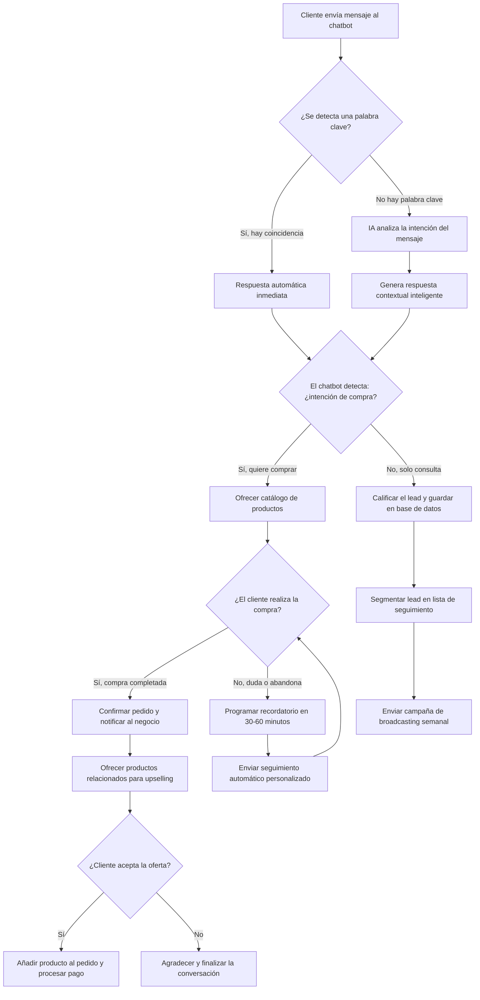

# Por qué las pequeñas empresas necesitan chatbots en 2026


> Todo el contenido presentado aquí pertenece a E-SMART360, la plataforma integral de automatización de conversaciones para pequeñas y medianas empresas.

**Resumen ejecutivo:** Desde responder preguntas frecuentes, gestionar reservas y mostrar catálogos según las preferencias del cliente, hasta completar ventas y enviar notificaciones de pago — los chatbots pueden hacerlo todo. Además, pueden encargarse de promociones y campañas de productos sin esfuerzo. Esto ahorra tiempo, dinero y personal a tu negocio. La jugada más inteligente: usar esos recursos ahorrados para entrenar tu chatbot con IA, porque un bot bien entrenado puede tomar decisiones por sí solo — interactuando con cada cliente de forma distinta según sus necesidades. Más allá de eso, potencia la generación de leads, las ventas adicionales (upselling) y las ventas cruzadas (cross-selling) de forma automática. Para las pequeñas empresas, los chatbots ya no son un lujo tecnológico: son un kit de supervivencia esencial para competir en el mercado actual.

*Última actualización: 1 de febrero de 2026*


> Las pequeñas empresas que utilizan chatbots multicanal están viendo una **reducción en los costos de servicio de hasta un 30%** y una **retención de clientes un 20% más alta** en comparación con las que no usan automatización alguna en sus procesos de atención.

## Introducción: La nueva realidad de las PYMEs en 2026

En el mundo digital actual, las pequeñas y medianas empresas (PYMEs) pueden acceder a **funciones de chatbot de nivel empresarial** sin necesidad del presupuesto de una gran corporación. Antes, la automatización avanzada solo estaba al alcance de grandes empresas con equipos de desarrollo dedicados y presupuestos de seis cifras. Hoy, cualquier negocio puede tener un asistente virtual disponible las 24 horas del día, los 7 días de la semana, los 365 días del año.

Ningún negocio pequeño puede permitirse perder una sola interacción con un cliente. Cada lead que no se atiende a tiempo es una venta que se escapa irremediablemente. Cada pregunta que queda sin respuesta es una oportunidad perdida que probablemente no regrese. Un chatbot trabaja sin descanso, responde al instante, reserva citas, cierra ventas y proporciona datos valiosos para crecer de forma inteligente. Sin uno, corres el riesgo de perder leads constantemente, sobrecargar a tu equipo humano y quedarte atrás frente a una competencia que ya está automatizada.

### Imagina esta situación cotidiana

Estás dirigiendo el negocio de tus sueños — una panadería artesanal, una tienda online especializada, una agencia digital boutique. Son las 9 de la noche. Has terminado tu jornada laboral. Pero mientras cenas tranquilamente y descansas del día, los clientes siguen escribiendo mensajes en tus canales digitales:

> *"¿Tienen este producto disponible en stock?"*
> *"¿Puedo reservar una cita para mañana por la tarde?"*
> *"¿Hay algún descuento especial por pedidos al por mayor?"*

Quieres responder, pero también quieres tener vida propia y tiempo para recargar energías. Por la mañana, esos leads probablemente ya se hayan enfriado. Alguien más — quizás tu competidor directo — ya respondió a tiempo, obtuvo el pedido y se llevó la venta que tú pudiste haber tenido. Ese es el verdadero costo de no tener un chatbot en 2026: no solo pierdes ventas, pierdes la confianza y la atención de clientes que esperan respuestas inmediatas.


> Cada hora que tu negocio permanece sin un chatbot disponible, estás perdiendo oportunidades de venta. Estudios recientes indican que las pequeñas empresas tardan en promedio 12 horas en responder una consulta de cliente cuando no usan automatización. Con un chatbot bien configurado, ese tiempo se reduce a menos de 3 segundos. La diferencia entre una venta concretada y una oportunidad perdida son solo unos segundos de diferencia.

## ¿Por qué los chatbots ya no son opcionales para las pequeñas empresas?

Cuando se construyen con la intención adecuada, los chatbots pueden soportar mucho más que solo el servicio al cliente. Con los flujos y desencadenantes correctos, pueden contribuir simultáneamente al marketing, las ventas y la retención de clientes. No se trata solo de responder preguntas: se trata de crear un sistema de automatización inteligente que trabaje para ti las 24 horas del día, todos los días del año.

### Casos de uso principales de los chatbots


### Disponibilidad permanente 24/7

Tu negocio nunca duerme mientras tú lo haces. Porque un chatbot bien configurado nunca descansa. Los chatbots responden al instante, las 24 horas del día, incluso en fines de semana, festivos y horas de la madrugada. Esto significa que mientras duermes plácidamente, tu chatbot sigue capturando leads, respondiendo consultas de clientes y procesando pedidos sin necesidad de supervisión alguna. Para un negocio pequeño, esto multiplica tu capacidad operativa sin aumentar los costos fijos de personal.

### Respuestas rápidas e inmediatas

Los clientes obtienen respuestas a lo que necesitan en cuestión de segundos. Sin largos tiempos de espera ni mensajes automáticos de "lo contactaremos pronto". La inmediatez es uno de los factores más valorados por los consumidores modernos. Según estudios de mercado recientes, el 82% de los consumidores espera una respuesta inmediata cuando contacta a una empresa por canales digitales. Si no la obtienen, simplemente se van con la competencia.

### Ahorro significativo de costos operativos

Las empresas están ahorrando hasta un 30% en costos de soporte gracias a la automatización con IA. Una PYME típica puede ahorrar entre $500 y $2,000 mensuales en costos de personal de atención al cliente. En lugar de contratar a una persona adicional para cubrir turnos nocturnos y fines de semana, el chatbot absorbe ese volumen de trabajo sin costo adicional y sin límite de conversaciones simultáneas.

### Alto nivel de compromiso con el cliente

Los chatbots pueden recomendar productos personalizados, reservar citas, tomar reservaciones y gestionar registros de usuarios sin ayuda humana. Además, pueden calificar leads automáticamente mediante preguntas de calificación predefinidas que segmentan a los clientes por nivel de interés, presupuesto disponible y urgencia de compra. La tasa de interacción con mensajes enviados por chatbot es significativamente más alta que los correos masivos.

### Generación de leads automatizada y calificada

Captura y califica leads directamente desde la conversación en cualquier canal. El chatbot puede hacer preguntas inteligentes como "¿Qué producto te interesa exactamente?" o "¿Cuál es tu presupuesto aproximado para esta compra?" y almacenar las respuestas directamente en Google Sheets para su posterior procesamiento. Los datos se organizan y etiquetan automáticamente para que puedas hacer seguimiento sin esfuerzo manual.

### Integraciones múltiples simplificadas

Sistemas CRM, pasarelas de pago, redes sociales (Facebook, Messenger, WhatsApp, Instagram, Telegram) y plataformas de comercio electrónico (WooCommerce, Shopify) — todo conectado en una sola solución de chatbot centralizada. El chatbot puede enviar notificaciones de pedidos, actualizar inventarios en tiempo real y sincronizar datos con tus herramientas favoritas sin intervención manual.

### Los chatbots son mucho más que simples automatizaciones

Los chatbots han evolucionado enormemente más allá de ser simples respondedores automáticos de preguntas frecuentes. Un chatbot moderno de E-SMART360 puede hablar con un cliente en español por la mañana, cambiar al inglés por la tarde y enviar fotos y videos de productos por la noche — todo mientras mantiene la conversación natural y fluida. El chatbot ya no es un "juguete tecnológico" del futuro lejano. Es una herramienta práctica, probada y lista para apoyar tu negocio hoy mismo.


> Un estudio realizado por Uberall muestra que más del **80% de los consumidores** perciben su experiencia con chatbots como positiva y satisfactoria. Los chatbots permiten a los usuarios recibir asistencia inmediata en cualquier momento que la necesiten, haciendo que las empresas sean más accesibles y cercanas a sus clientes. Con la integración de inteligencia artificial, las PYMEs pueden escalar sus operaciones sin esfuerzo — recopilando datos más rápido, convirtiendo leads con alta precisión y proporcionando una experiencia del cliente mejorada que impulsa las ventas y la retención.

## Beneficios comprobados de los chatbots para pequeñas empresas

A continuación, analizamos en detalle los tres beneficios principales que cualquier PYME puede obtener al implementar un chatbot bien configurado en su estrategia de atención al cliente y ventas.

### 1. Soporte al cliente 24 horas, 7 días a la semana — Sin interrupciones

Las 3 de la tarde, las 3 de la madrugada — **no importa la hora del día**. Un chatbot de E-SMART360 siempre está listo para ofrecer respuestas instantáneas a las preguntas más relevantes de tus clientes. Ofrece soporte ininterrumpido incluso durante los fines de semana y días festivos. Mientras tu equipo humano descansa y recarga energías, el chatbot sigue trabajando sin pausas y sin quejarse.

**Ventajas clave del soporte automatizado con chatbot**

- **Bandeja de entrada omnicanal unificada**: Conecta todos tus canales de comunicación (Facebook, Instagram, WhatsApp, Telegram y chat web) en una sola bandeja de entrada compartida. Desde un solo lugar puedes gestionar todas las conversaciones entrantes sin tener que cambiar constantemente entre aplicaciones. Esto elimina la necesidad de tener a alguien monitoreando múltiples pantallas.
- **Colaboración en equipo optimizada**: Asigna conversaciones específicas a miembros de tu equipo, etiqueta por categorías y transfiere chats fácilmente. Cuando el chatbot detecta que una conversación requiere intervención humana, la deriva automáticamente al agente disponible con el historial completo.
- **Agente de IA inteligente**: Un bot de servicio al cliente con inteligencia artificial integrada detecta la intención real detrás de cada mensaje y responde con respuestas conscientes del contexto de la conversación. El sistema aprende de cada interacción para mejorar con el tiempo.
- **Tiempo de respuesta drásticamente reducido**: Reduce el tiempo promedio de procesamiento de horas a apenas segundos. Las empresas reportan reducciones de 12 horas a menos de 5 segundos tras implementar chatbots.
- **Compromiso personalizado a escala**: Los chatbots con IA adaptan los datos de cada conversación, memorizando las interacciones pasadas del usuario y sugiriendo los productos más adecuados en el momento preciso para cada cliente.


> Es una pregunta comprensible y válida. Los chatbots modernos de E-SMART360 incluyen soporte de IA de alta fiabilidad que minimiza los errores. Pueden incluso realizar análisis de sentimiento (sentiment analysis) para detectar el estado de ánimo de cada cliente y adaptar su tono de respuesta en consecuencia. Si detectan frustración o enojo, escalan automáticamente la conversación a un agente humano capacitado para resolver el problema. Las PYMEs no necesitan un gran equipo de soporte para ofrecer un servicio excelente. Con un solo chatbot bien configurado, puedes brindar el mismo nivel de servicio personalizado a gran escala.

#### Guía paso a paso: Cómo configurar tu primer chatbot de soporte en E-SMART360

Sigue estos pasos sencillos para configurar tu primer chatbot de soporte:


### Accede al Gestor de Bots

Ingresa al panel de control de E-SMART360 y dirígete a la sección **Gestor de Bots > Respuestas Automáticas > Crear**. Aquí encontrarás el editor visual de flujos donde podrás diseñar tu chatbot sin necesidad de escribir código. La interfaz es completamente intuitiva y está diseñada para personas sin experiencia técnica.

### Define el nombre y propósito del bot

Asigna un nombre reconocible para tu chatbot, por ejemplo "Asistente Virtual 360" o "Atención al Cliente E-SMART360". Selecciona los canales donde operará: WhatsApp, Messenger, Instagram, Telegram y/o chat web. Puedes activar todos los canales disponibles o solo aquellos que uses actualmente.

### Configura respuestas por palabra clave

Agrega las palabras clave más comunes que utilizan tus clientes: "horario", "precio", "dirección", "teléfono", "catálogo", "envío", "devolución". Asocia cada palabra clave con su respuesta correspondiente utilizando el editor visual de arrastrar y soltar. Por ejemplo:
- Palabra clave "horario" → Respuesta automática con los horarios de atención
- Palabra clave "precio" → Respuesta con la lista de precios actualizada o enlace al catálogo
- Palabra clave "dirección" → Respuesta con la dirección física y enlace a Google Maps
- Palabra clave "catálogo" → Respuesta con imágenes y descripciones de productos destacados

### Activa la IA para respuestas inteligentes

Habilita el agente de IA integrado para que, cuando no haya una palabra clave específica que coincida con la consulta del cliente, el chatbot pueda entender la intención real del mensaje y responder de forma inteligente utilizando la base de conocimiento que le hayas proporcionado previamente (FAQ, documentos, URL).

### Configura la respuesta por defecto (fallback)

Siempre debe haber una respuesta amable preparada para cuando el chatbot no logre entender el mensaje del cliente. Ejemplo recomendado: *"Disculpa, no he entendido bien tu mensaje. ¿Podrías reformularlo de otra manera? O si prefieres, escribe 'menú' para ver las opciones disponibles."*

### Prueba exhaustivamente y publica

Realiza pruebas enviando mensajes desde diferentes canales y simulando distintos escenarios. Verifica que las respuestas sean correctas, que los flujos funcionen como esperas y que las transferencias a humano se activen cuando sea necesario. Ajusta cualquier detalle y cuando todo funcione, activa el chatbot para todos los usuarios.

### 2. Reserva de citas y reservaciones sin intervención humana

Una de las funcionalidades más valoradas por las PYMEs es la capacidad de gestionar citas, reservas y agendamientos de forma completamente automatizada. Un sistema de reserva de citas integrado con chatbot puede transformar radicalmente la eficiencia operativa de cualquier negocio basado en atención por cita previa.

**Ventajas del sistema de reservas automatizado con chatbot**

- **Disponibilidad total sin límites**: Los clientes pueden reservar cuando quieran y desde donde quieran, sin tener que esperar a que alguien conteste el teléfono. A las 2 de la madrugada, un cliente potencial puede agendar una cita para el día siguiente sin problema.
- **Reserva instantánea con confirmación automática**: Las reservas de citas se confirman en tiempo real sin demora alguna. El cliente recibe una confirmación al instante en su chat, con todos los detalles: fecha, hora, dirección e instrucciones.
- **Automatización de captura de leads**: Los datos de cada conversación se almacenan directamente en Google Sheets para facilitar el seguimiento posterior. Se acabaron los apuntes manuales en libretas o formularios que nadie revisa.
- **Conectividad multiplataforma sin fricción**: El sistema funciona en varias plataformas (Facebook, WhatsApp, Telegram, Instagram) al mismo tiempo, ofreciendo la misma experiencia de reserva.
- **Eliminación del trabajo manual**: Se acaban las llamadas telefónicas de ida y vuelta para confirmar horarios y la entrada manual de datos.


> Después de lanzar un chatbot con inteligencia artificial integrada, Sephora — la reconocida marca global de belleza y cosméticos — obtuvo resultados impresionantes. El chatbot no solo respondía preguntas frecuentes de forma eficiente: involucraba activamente a su comunidad compartiendo consejos de belleza personalizados y ofertas exclusivas. Como resultado directo, Sephora experimentó un **aumento del 11% en las reservas de citas de maquillaje en tienda** y una notable reducción en las tasas de rebote en sus páginas web.

#### Diagrama de flujo: Sistema completo de reserva de citas automatizado

```mermaid
flowchart TD
    A[Cliente escribe: "Quiero agendar una cita"] --> B[Chatbot solicita fecha preferida]
    B --> C[Chatbot consulta disponibilidad en el calendario]
    C --> D{¿Hay disponibilidad en esa fecha?}
    D -->|Sí, hay espacio disponible| E[Muestra los horarios disponibles]
    D -->|No, está completo| F[Sugiere fechas alternativas cercanas]
    E --> G[Cliente selecciona la hora de su preferencia]
    G --> H[Chatbot solicita nombre completo y teléfono de contacto]
    H --> I[Confirma la cita y envía resumen por chat]
    I --> J[Guarda todos los datos en Google Sheets]
    F --> G
    J --> K[24 horas antes: envía recordatorio automático]
    K --> L{¿El cliente confirma su asistencia?}
    L -->|Sí, confirma| M[Cita confirmada y asegurada]
    L -->|No responde| N[Reintenta recordatorio a las 6 horas]
    L -->|Cancela la cita| O[Libera el espacio en el calendario]
    O --> P[Notifica al negocio: espacio disponible para otro cliente]
    N --> M
```

### 3. Embudo de ventas impulsado por IA — De lead a cliente

Los chatbots no solo conversan de manera superficial: también recopilan información valiosa y actúan sobre ella en tiempo real. Con un chatbot inteligente de E-SMART360, puedes crear un embudo de ventas completamente automatizado que califique leads entrantes, realice seguimientos personalizados y cierre ventas sin necesidad de intervención manual constante.

**Ventajas clave del embudo de ventas automatizado**

- **Guía paso a paso para el cliente**: Desde la primera pregunta "¿Cuál es el precio?" hasta la confirmación "¡Acabo de realizar el pago!". Con la función de arrastrar y soltar del constructor visual, cualquier persona puede automatizar todo el flujo de trabajo.
- **Automatización inteligente de seguimiento**: El chatbot nutre los leads automáticamente para mantenerlos calientes y comprometidos. El sistema puede programar seguimientos a los 30 minutos, al día siguiente, a los 3 días o a la semana.
- **Análisis de tendencias en tiempo real**: El chatbot analiza patrones de comportamiento y puede identificar qué productos generan más interés, a qué hora se producen más conversiones y qué mensajes funcionan mejor.
- **Segmentación automática de leads**: Los leads se etiquetan según su comportamiento: clientes que compraron, usuarios que abandonaron el carrito, personas que solo preguntaron precio, leads calificados.


> H&M, la reconocida marca global de moda, introdujo un chatbot personalizado en Kik Messenger para ayudar a los consumidores a encontrar la ropa perfecta según su personalidad. El chatbot hacía preguntas sobre estilo, colores y ocasiones. El resultado fue impresionante: una **tasa de conversión un 86% más alta** y una reducción sustancial en los carritos abandonados.

#### Diagrama de flujo: Embudo de ventas completo con chatbot



#### Pasos para configurar tu embudo de ventas automatizado


### Crea el mensaje de bienvenida con opciones claras

Configura un mensaje de bienvenida efectivo: *"¡Hola! Soy el asistente virtual de [tu negocio]. ¿En qué puedo ayudarte hoy? 1) Ver productos disponibles 2) Consultar precios 3) Hablar con un asesor 4) Agendar una cita"*

### Configura la calificación automática de leads

Cuando un cliente muestra interés, programa al chatbot para hacer preguntas calificadoras: "¿Qué producto te interesa?", "¿Cuál es tu presupuesto?", "¿Necesitas envío o prefieres recoger en tienda?"

### Activa los seguimientos automáticos

Configura recordatorios para leads que no completaron la compra: *"Hace unos días preguntaste por [producto]. ¿Te gustaría que te ayude a completar tu pedido?"* Los seguimientos pueden ser a los 30 min, 24h, 3 días o 1 semana.

### Implementa ventas adicionales y cruzadas

Cuando un cliente compra, el chatbot puede recomendar complementos: *"Has comprado [producto]. Muchos clientes también compran [producto relacionado]. ¿Te gustaría añadirlo?"* Esto puede aumentar el valor del pedido entre un 15% y 30%.

## Por qué las pequeñas empresas no pueden ignorar los chatbots de WhatsApp en 2026

WhatsApp Business, con una impresionante **tasa de apertura superior al 90%**, se convierte en una herramienta de marketing inigualable cuando se combina con un chatbot inteligente. Ningún otro canal de comunicación ofrece una tasa de apertura tan alta. Mientras el email marketing promedia entre 20-30% de apertura, en WhatsApp los mensajes se abren en minutos.

### Tabla comparativa: WhatsApp vs otros canales de comunicación

| Característica | WhatsApp + Chatbot | Email Marketing | Chat Web Tradicional |
|----------------|-------------------|-----------------|---------------------|
| Tasa de apertura | >90% en primeros 5 min | 20-30% en 24 horas | Variable según tráfico web |
| Tiempo de respuesta | Instantáneo (segundos) | 12-48 horas promedio | Solo horario laboral |
| Personalización | Alta (contexto completo) | Media (segmentación básica) | Baja |
| Alcance geográfico | Global con número local | Global | Solo visitantes web |
| Costo por lead | Bajo | Medio | Medio-Alto |
| Automatización de ventas | Completa (embudo completo) | Parcial | Limitada |


> Configura tu catálogo de productos directamente en WhatsApp con E-SMART360. Tus clientes pueden ver fotos, descripciones, precios y realizar pedidos sin salir de la aplicación. Esto reduce drásticamente la fricción en el proceso de compra. Los negocios que utilizan el catálogo de WhatsApp integrado reportan un incremento promedio del 35% en las tasas de conversión.

### Beneficios clave de WhatsApp para PYMEs

- **Marketing de productos efectivo**: Promociona nuevos lanzamientos, descuentos especiales o campañas temporales a través de broadcasting de WhatsApp. Llega a todos tus suscriptores al instante.
- **Recordatorios automáticos que funcionan**: Envía alertas de pago pendiente, notificaciones de reservas y actualizaciones de estado al instante. Tus clientes estarán siempre informados.
- **Compra sin complicaciones**: Los clientes pueden ver productos, añadirlos al carrito y pagar directamente en WhatsApp sin salir de la conversación.
- **Ventas adicionales y cruzadas**: Aumenta el valor del pedido recomendando paquetes y complementos durante la conversación.

#### Cómo empezar con WhatsApp para tu negocio


### Conecta tu número de teléfono

Accede al panel de E-SMART360 y sigue el proceso de Embedded Signup para conectar tu número con WhatsApp Cloud API.

### Configura tu perfil de negocio

Añade nombre, descripción, dirección, sitio web, horario y foto de perfil. Un perfil completo genera más confianza.

### Crea tu primer chatbot para WhatsApp

Usa el constructor visual de flujos para diseñar las conversaciones. Empieza con respuestas básicas y ve añadiendo complejidad.

### Configura el catálogo de productos

Sube tus productos con fotos, descripciones y precios. El catálogo se sincroniza automáticamente con WhatsApp.

## Guía completa de implementación: De cero a chatbot operativo en 7 días

### Fase 1: Preparación estratégica (Días 1-2)

**Paso 1: Define objetivos claros y medibles**

Antes de construir cualquier flujo, pregúntate: ¿qué problema concreto quieres resolver?
- ¿Reducir la carga de preguntas frecuentes repetitivas?
- ¿Aumentar las reservas de citas agendadas?
- ¿Recuperar carritos de compra abandonados?
- ¿Capturar más leads en horarios no laborales?

**Paso 2: Recopila y organiza las preguntas frecuentes**

Revisa tus últimos 3 a 6 meses de conversaciones reales con clientes. Identifica las 15-20 preguntas más repetitivas. Esas serán las primeras respuestas de tu chatbot. Agrúpalas por categorías: productos, precios, envíos, horarios, devoluciones.

**Paso 3: Prepara las respuestas con antelación**

Redacta respuestas claras y útiles para cada pregunta. Incluye enlaces a tu web y números de contacto. Asegúrate de que el tono sea consistente con tu marca.

### Fase 2: Construcción del chatbot (Días 3-5)

**Paso 4: Crea el flujo principal de bienvenida**

Diseña el mensaje que recibirá cada nuevo contacto. Debe ser amigable y ofrecer opciones claras.

**Paso 5: Configura las respuestas por palabra clave**

| Palabra clave del cliente | Respuesta del chatbot |
|--------------------------|----------------------|
| "Hola", "Buenos días" | Saludo personalizado + menú de opciones |
| "Precio", "Cuánto cuesta" | Lista de precios + enlace al catálogo |
| "Horario", "Cuándo abren" | Horarios de atención completos |
| "Envío", "Delivery" | Política de envíos detallada |
| "Devolución", "Cambio" | Política de devoluciones |
| "Gracias" | Agradecimiento + oferta de ayuda |

**Paso 6: Diseña flujos condicionales**

"Si el cliente responde SÍ, continúa con la oferta. Si dice NO, ofrece ayuda alternativa."

### Fase 3: Pruebas y lanzamiento (Días 6-7)

**Paso 7: Realiza pruebas exhaustivas**
- Consultas normales con palabras clave esperadas
- Consultas complejas que requieran escalar a humano
- Mensajes con errores ortográficos
- Mensajes ambiguos
- Pruebas de carga con múltiples conversaciones

**Paso 8: Ajusta y optimiza**

Corrige errores y ajusta respuestas que no sean claras.

**Paso 9: Lanza y monitorea**

Activa el chatbot y durante la primera semana monitorea las conversaciones diariamente.

### Fase 4: Optimización continua (Semanas 2-4)

**Paso 10: Analiza las métricas de rendimiento**
- Volumen de conversaciones gestionadas
- Tasa de resolución sin intervención humana
- Preguntas más frecuentes recibidas
- Horarios de mayor actividad
- Satisfacción del cliente

**Paso 11: Mejora progresivamente**

Agrega nuevas respuestas y refina las existentes según los patrones observados.

## Errores comunes al implementar chatbots (y cómo evitarlos)


### Error #1: Querer cubrir todo desde el día uno

Intentar abarcar todos los escenarios posibles desde el inicio paraliza el lanzamiento. **Solución:** Empieza con el 20% de respuestas que cubren el 80% de los casos.

### Error #2: Respuestas demasiado robóticas

Usar un lenguaje frío y mecánico. **Solución:** Escribe con tono cercano. Usa emojis con moderación y personaliza con el nombre del cliente.

### Error #3: No tener escalamiento a humano

No configurar transferencia a agente humano. **Solución:** Incluye siempre "Hablar con un asesor" como opción y transfiere el historial completo.

### Error #4: Ignorar las analíticas

Lanzar y nunca revisar el rendimiento. **Solución:** Establece revisiones semanales de métricas para mejorar continuamente.

### Error #1: Querer cubrir absolutamente todo desde el primer día

Es tentador querer que el chatbot responda a todas las preguntas imaginables desde el lanzamiento. Sin embargo, esta ambición suele paralizar el proyecto y retrasar el lanzamiento indefinidamente. La clave está en empezar con un conjunto básico de respuestas que cubra el 80% de los casos de uso más comunes, y luego ir expandiendo progresivamente.

**Solución práctica:** Identifica las 15-20 preguntas más frecuentes de tus clientes y configura solo esas inicialmente. Una vez que el chatbot esté funcionando, analiza qué preguntas adicionales aparecen y ve agregándolas una por una.

### Error #2: Usar un lenguaje demasiado robótico e impersonal

Nada ahuyenta más a un cliente que sentir que está hablando con una máquina fría y sin emociones. Si las respuestas del chatbot son demasiado mecánicas, los clientes se frustrarán y preferirán buscar atención humana en otro lado.

**Solución práctica:** Redacta las respuestas con un tono cercano y humano. Utiliza emojis con moderación para añadir calidez. Personaliza los mensajes incluyendo el nombre del cliente cuando sea posible. Ejemplo: en lugar de "Su solicitud ha sido recibida", usa "¡Gracias por escribirnos, [nombre]! Hemos recibido tu solicitud y estamos procesándola."

### Error #3: No configurar el escalamiento a un agente humano

Uno de los errores más graves es dejar al cliente atrapado en un ciclo interminable de respuestas automáticas sin opción de hablar con una persona real. Esto genera una frustración enorme y puede dañar la reputación de tu negocio.

**Solución práctica:** Siempre incluye una opción visible como "Hablar con un asesor" o "Transferir a un humano". Configura el chatbot para que, cuando detecte frustración en el cliente (palabras clave como "queja", "problema", "reclamo"), transfiera automáticamente la conversación.

### Error #4: No revisar las analíticas ni mejorar el chatbot

Muchos negocios lanzan su chatbot y nunca más lo revisan. Con el tiempo, el chatbot se vuelve obsoleto y deja de ser útil. Un chatbot requiere mantenimiento y mejora continua.

**Solución práctica:** Establece una rutina semanal de 30 minutos para revisar las conversaciones, identificar patrones y oportunidades de mejora. Agrega nuevas respuestas basadas en preguntas reales de los clientes.

## Tendencias de chatbots para 2026 que toda PYME debe conocer

Según analistas de la industria, estas son las tendencias más importantes que definirán el uso de chatbots en 2026:

**1. IA generativa en el centro de la conversación**
Los chatbots ya no se limitan a respuestas predefinidas. La IA generativa permite conversaciones fluidas y naturales, donde el chatbot entiende el contexto, la intención y hasta las emociones del cliente. Con E-SMART360, puedes entrenar a tu chatbot con documentos, URL, archivos PDF y más para que ofrezca respuestas precisas y contextuales. La diferencia entre un chatbot básico y uno con IA generativa es como comparar un contestador automático con un recepcionista experto.

**2. Chatbots multicanal unificados**
Los clientes ya no se comunican por un solo canal. Un chatbot moderno debe funcionar sin fricción en WhatsApp, Messenger, Instagram, Telegram y chat web, manteniendo el contexto de la conversación sin importar dónde continúe. Si un cliente empieza en Instagram y luego escribe por WhatsApp, el chatbot reconoce el historial completo.

**3. Automatización predictiva de ventas**
Los chatbots no solo reaccionan a lo que el cliente dice: también anticipan sus necesidades. Basándose en el historial de compras y navegación, pueden predecir qué producto podría interesarle, cuándo podría necesitar un reabastecimiento o si está a punto de abandonar el carrito de compra.

**4. Pagos conversacionales integrados**
Una de las tendencias más fuertes para 2026 es la integración de pagos directamente en la conversación del chatbot. El cliente selecciona un producto, lo añade al carrito y paga sin salir de WhatsApp o Messenger. Esto transforma el chatbot en un canal de ventas completo y autónomo.

**5. Análisis de sentimiento avanzado**
Los chatbots con IA son capaces de detectar el estado de ánimo del cliente basándose en las palabras que usa, el tono y el contexto. Si detectan frustración, escalan automáticamente a un humano. Si detectan entusiasmo, refuerzan la venta. Esto mejora drásticamente la experiencia del cliente.

**6. Chatbots entrenables con documentos propios**
Con E-SMART360, puedes entrenar a tu chatbot con tus propios documentos, FAQ, URL y hasta APIs externas. Esto significa que el chatbot no solo sabe lo que tú le enseñas, sino que puede acceder a información actualizada de tu negocio para dar respuestas precisas.


> Los negocios que adopten estas tendencias antes que su competencia tendrán una ventaja significativa. No se trata solo de tener un chatbot, sino de tener un chatbot inteligente, multicanal y entrenado con los datos correctos. E-SMART360 te permite acceder a todas estas funcionalidades desde una sola plataforma.

## Ejemplos prácticos por tipo de negocio

A continuación, tres ejemplos concretos de cómo diferentes tipos de negocio pueden beneficiarse de un chatbot bien configurado:


### Panadería o Cafetería

**Problema:** Clientes llaman todo el día preguntando horarios, disponibilidad y haciendo pedidos.
**Solución del chatbot:**
- Responde horarios y ubicación automáticamente
- Recibe pedidos por WhatsApp con el menú del día
- Envía promociones semanales a suscriptores
- Gestiona pedidos especiales para eventos
**Resultado:** 15 horas/semana ahorradas en atención telefónica.
**Costo:** Desde $0 con plan gratuito de E-SMART360.

### Tienda de ropa online

**Problema:** Altas tasas de abandono de carrito y muchas preguntas repetitivas sobre tallas.
**Solución del chatbot:**
- Catálogo visible directamente en WhatsApp
- Responde tallas y disponibilidad al instante
- Envía recordatorios automáticos de carritos abandonados
- Notifica cambios de estado del pedido
**Resultado:** Conversión 3x mayor que con formularios web.
**Reducción de consultas repetitivas:** 70%.

### Clínica dental o Consultorio médico

**Problema:** Altas tasas de ausencia a citas y pérdida de llamadas entrantes.
**Solución del chatbot:**
- Agenda citas 24/7 sin intervención humana
- Envía recordatorios automáticos 24 horas antes
- Gestiona reagendaciones automáticamente
- Captura datos de pacientes en Google Sheets
**Resultado:** Reducción de ausencias del 40%.
**Nuevas citas:** +25% capturadas fuera de horario.

### Restaurante o Servicio de comida

**Problema:** Gestión manual de reservas y pedidos para delivery.
**Solución del chatbot:**
- Recibe reservas de mesas automáticamente
- Gestiona pedidos para delivery con el menú completo
- Confirma pedidos y envía estimaciones de tiempo
- Recopila feedback después de cada visita
**Resultado:** 20 horas/semana ahorradas en gestión de pedidos.

### Agencia de servicios profesionales

**Problema:** Pérdida de leads porque no se responde rápido.
**Solución del chatbot:**
- Captura leads 24/7 con preguntas de calificación
- Agenda consultas iniciales automáticamente
- Envía propuestas y presupuestos por chat
- Hace seguimiento automático a los 3 y 7 días
**Resultado:** 40% más leads calificados capturados.

## Caso de éxito real: Tienda de regalos personalizados

Una pequeña tienda de regalos personalizados implementó un chatbot multicanal de E-SMART360 para manejar sus canales de WhatsApp, Messenger e Instagram. Antes del chatbot, la dueña dedicaba 20 horas semanales solo a responder preguntas repetitivas.

**Antes del chatbot:**
- Tiempo de respuesta promedio: 45 minutos
- Ventas fuera del horario laboral: $0
- Leads perdidos por no responder a tiempo: aproximadamente 30 por semana
- Horas semanales dedicadas a atención al cliente: 20 horas
- Capacidad de atención: 1 cliente a la vez

**Después del chatbot (primer mes):**
- Tiempo de respuesta promedio: 3 segundos
- Ventas fuera del horario laboral: +$1,200 por mes
- Leads perdidos reducidos a menos de 5 por semana
- Horas semanales dedicadas a atención: 3 horas (solo supervisión)
- Capacidad de atención: 100+ clientes simultáneamente

**Beneficio mensual total calculado:**
- Ahorro en tiempo de la dueña: $1,200
- Ventas incrementales fuera de horario: $1,200
- **Total de beneficio mensual: $2,400**

Este caso demuestra que un chatbot no solo ahorra tiempo, sino que también genera ingresos adicionales que antes se perdían por falta de capacidad de atención.

## Cómo configurar un chatbot de seguimiento automático de clientes

Una de las funcionalidades más poderosas de E-SMART360 es la capacidad de crear chatbots de seguimiento automático (automatic follow-up chatbots). Estos bots se encargan de mantener el contacto con los clientes después de una interacción inicial, sin que tengas que hacer nada.

### ¿Qué es un chatbot de seguimiento automático?

Es un flujo de conversación programado que se activa después de que ocurre un evento específico: una compra, una consulta, un abandono de carrito o el cumplimiento de un tiempo determinado. El chatbot contacta al cliente de forma automática y personalizada para:

- Preguntar si necesita ayuda adicional
- Recordarle productos que dejó en el carrito
- Solicitar feedback sobre su experiencia
- Ofrecer descuentos exclusivos por su próxima compra
- Informar sobre nuevos productos relacionados

### Pasos para configurar un seguimiento automático


### Identifica el evento desencadenante

Define qué acción del cliente activará el seguimiento: abandono de carrito, compra completada, consulta sin respuesta, o tiempo transcurrido desde el último contacto.

### Crea el mensaje de seguimiento

Redacta un mensaje personalizado y relevante para cada tipo de evento. Ejemplo para abandono de carrito: *"Hola [nombre], notamos que dejaste [producto] en tu carrito. ¿Quieres que te ayudemos a completar tu pedido? Aquí tienes un código de descuento del 10% solo por hoy: BIENVENIDO10."*

### Configura el tiempo de espera

Define cuánto tiempo debe pasar antes de enviar el seguimiento: 30 minutos para carritos abandonados, 24 horas para consultas sin respuesta, 7 días para post-venta.

### Establece la frecuencia máxima

Configura un límite de seguimientos para no saturar al cliente. Por ejemplo: máximo 3 seguimientos con 48 horas de diferencia entre cada uno. Si el cliente no responde después del tercer intento, pásalo a una lista de leads fríos.

### Prueba el flujo completo

Simula cada tipo de evento para verificar que los mensajes se envían en el momento correcto y con el contenido adecuado.

## Cómo crear un chatbot basado en palabras clave para WhatsApp

Los chatbots basados en palabras clave son la forma más sencilla y efectiva de empezar a automatizar tu atención al cliente. Con E-SMART360, puedes configurarlos en minutos sin necesidad de programar.

### ¿Cómo funciona un chatbot por palabras clave?

El chatbot escanea cada mensaje entrante en busca de palabras o frases específicas. Cuando encuentra una coincidencia, responde automáticamente con el mensaje que hayas configurado. Si no encuentra ninguna coincidencia, puede recurrir al agente de IA para entender la intención del mensaje.

### Palabras clave recomendadas para empezar

| Categoría | Palabras clave | Respuesta sugerida |
|-----------|---------------|-------------------|
| Saludos | hola, buenos días, buenas tardes | Saludo + menú de opciones principales |
| Precios | precio, costo, valor, cuánto | Lista de precios + enlace al catálogo |
| Productos | catálogo, productos, tienes | Galería de productos destacados |
| Horarios | horario, abren, atienden | Horarios de atención completos |
| Ubicación | dirección, están, mapa | Dirección + enlace a Google Maps |
| Contacto | teléfono, llamar, contacto | Números de teléfono + WhatsApp |
| Envíos | envío, delivery, envían | Política de envíos y costos |
| Devoluciones | devolver, cambio, garantía | Política de devoluciones |
| Agradecimiento | gracias, gracias por todo | Agradecimiento + oferta de ayuda adicional |

### Cómo configurar palabras clave en E-SMART360

1. Accede al **Gestor de Bots > Respuestas Automáticas**
2. Selecciona **Crear nueva respuesta automática**
3. En el campo "Palabra clave", escribe la palabra o frase (ej: "horario")
4. En el campo "Respuesta", escribe el mensaje que el chatbot enviará
5. Activa la opción "Coincidencia parcial" para capturar variaciones
6. Repite para cada palabra clave que quieras configurar
7. Guarda y activa la respuesta automática


> Para obtener mejores resultados, configura al menos 10-15 palabras clave diferentes. Cuantas más palabras clave tengas, más preguntas podrá responder tu chatbot sin necesidad de intervención humana. Además, activa siempre la IA como respaldo para los mensajes que no coincidan con ninguna palabra clave.

## Cómo configurar una secuencia de ventas automatizada

Una secuencia de ventas (sales sequence) es un conjunto de mensajes automatizados que se envían en un orden específico para guiar al cliente a través del proceso de compra. Con E-SMART360, puedes crear secuencias completas sin programar.

### Ejemplo de secuencia de ventas para un curso online

**Día 1 - Mensaje de bienvenida:**
"¡Hola [nombre]! Gracias por tu interés en nuestro curso de [tema]. Estamos aquí para responder todas tus dudas. ¿Qué te gustaría saber?"

**Día 1 (30 min después) - Si no responde:**
"¿Tuviste oportunidad de revisar la información del curso? Recuerda que tenemos un descuento del 20% por tiempo limitado. ¿Te gustaría que te lo reserve?"

**Día 2 - Beneficios del curso:**
"[nombre], nuestro curso incluye: ✅ 40 horas de contenido ✅ Certificado avalado ✅ Acceso de por vida ✅ Soporte personalizado. ¿Te gustaría inscribirte hoy?"

**Día 4 - Última oportunidad:**
"¡Últimos días! El descuento del 20% termina en 48 horas. No dejes pasar esta oportunidad. Responde "QUIERO" para iniciar tu inscripción."

**Día 7 - Cierre:**
"[nombre], queremos saber si aún tienes interés en el curso. Si no es el momento adecuado, avísanos y no te enviaremos más mensajes."


> - No envíes más de 4-5 mensajes por secuencia
- Espacia los mensajes con al menos 24 horas de diferencia
- Incluye siempre una opción para que el cliente cancele la suscripción
- Personaliza cada mensaje con el nombre del cliente
- Ofrece valor en cada mensaje, no solo pidas la compra
- Mide la tasa de apertura y ajusta los mensajes según los resultados

## Cómo recolectar datos de clientes sin formularios en WhatsApp

Una de las funcionalidades más potentes de los chatbots de E-SMART360 es la capacidad de recolectar datos de clientes de forma conversacional, sin necesidad de formularios web tradicionales. Esto funciona especialmente bien en WhatsApp porque los clientes ya están en un entorno de conversación natural.

### Ventajas de la recolección conversacional de datos

- **Mayor tasa de respuesta**: Las personas completan 3x más información en una conversación que en un formulario
- **Experiencia natural**: El cliente siente que está conversando, no llenando un formulario
- **Datos más precisos**: Puedes hacer preguntas de seguimiento para validar la información
- **Menos abandono**: Las conversaciones tienen tasas de finalización mucho más altas

### Cómo configurar la recolección de datos paso a paso


### Crea el flujo de captura de datos

En el constructor visual de E-SMART360, crea un nuevo flujo y selecciona "Captura de datos" como plantilla inicial.

### Define los campos que necesitas

Identifica qué información necesitas: nombre, teléfono, email, ciudad, producto de interés. No pidas más datos de los necesarios.

### Configura las preguntas una por una

Ejemplo de flujo conversacional:
- Chatbot: "¡Hola! Para ayudarte mejor, ¿podrías decirme tu nombre?"
- Cliente: "María"
- Chatbot: "Gracias, María. ¿Cuál es tu correo electrónico para enviarte el catálogo?"
- Cliente: "maria@ejemplo.com"
- Chatbot: "Perfecto. ¿De qué ciudad nos contactas?"

### Conecta con Google Sheets

Configura la integración con Google Sheets para que cada respuesta se guarde automáticamente en una fila de tu hoja de cálculo.

### Activa el flujo para todos los canales

Habilita el flujo en WhatsApp, Messenger, Instagram y Telegram para capturar datos sin importar dónde te contacten.

## Preguntas frecuentes


### ¿Se necesitan conocimientos de programación para configurar un chatbot en E-SMART360?

No, en absoluto. E-SMART360 ha sido diseñado específicamente para que cualquier persona pueda crear y lanzar chatbots sin necesidad de saber programar. Utiliza una interfaz visual de arrastrar y soltar (drag & drop) para diseñar flujos de conversación completos. Puedes crear desde respuestas automáticas básicas hasta flujos complejos con condiciones, variables y conexiones con APIs externas — todo sin escribir una sola línea de código. Si sabes usar un procesador de textos como Word o Google Docs, puedes crear un chatbot en E-SMART360.

### ¿Realmente los chatbots aumentan las ventas de una PYME?

Definitivamente sí. Los chatbots mantienen los leads calientes y el embudo de ventas activo las 24 horas del día. Los principales mecanismos por los que aumentan las ventas incluyen:
- **Recuperación de carritos abandonados**: Hasta un 15% de recuperación con mensajes automáticos personalizados
- **Atención inmediata**: Nunca pierdes un lead por no contestar a tiempo, ni siquiera a las 3 de la madrugada
- **Ventas adicionales automáticas (upselling)**: El chatbot recomienda productos complementarios en el momento exacto de la compra
- **Seguimiento automático**: Los leads reciben recordatorios sin que tengas que intervenir
Empresas como H&M han visto incrementos de hasta el 86% en tasas de conversión tras implementar chatbots bien configurados.

### ¿Qué tan rápido se ven resultados después de implementar un chatbot?

La mayoría de las empresas notan mejoras significativas en cuestión de semanas. Las primeras métricas que suelen mejorar son:
- **Semana 1**: Tiempo de respuesta (de horas a segundos)
- **Semana 2**: Captura de leads (nunca se pierde un contacto fuera de horario)
- **Semana 3-4**: Satisfacción del cliente reportada en encuestas post-interacción
- **Mes 2**: Impacto medible en ventas y retención de clientes
En el primer mes, la mayoría de las PYMEs recuperan su inversión inicial a través de ventas capturadas fuera del horario laboral que antes se perdían.

### ¿Es caro mantener un chatbot para mi negocio?

Comparado con la alternativa de contratar personal adicional, un chatbot es significativamente más económico. Un chatbot de E-SMART360 cuesta una fracción del salario de un empleado de tiempo completo, trabaja 24/7 sin pausas, no toma vacaciones, no se enferma, nunca llega tarde y escala sin costo adicional. Además, puede manejar cientos de conversaciones simultáneas, algo que requeriría un equipo entero de atención al cliente. E-SMART360 ofrece planes gratuitos para empezar y planes pagos accesibles para negocios en crecimiento.

### ¿Son seguros los chatbots para gestionar datos sensibles de clientes?

Sí, absolutamente. E-SMART360 sigue estrictos estándares de protección de datos. Toda la comunicación a través de WhatsApp Cloud API utiliza cifrado de extremo a extremo. Además:
- Los datos se almacenan en servidores seguros con altos estándares de seguridad
- Puedes definir políticas de privacidad y retención de datos personalizadas
- Cumplimos con normativas internacionales como el GDPR
- Tú tienes el control total sobre qué datos se recopilan y cómo se utilizan
- Puedes exportar o eliminar los datos de tus clientes en cualquier momento

### ¿Puedo usar un chatbot en múltiples canales al mismo tiempo?

Sí, sin ninguna limitación. Una de las mayores ventajas de E-SMART360 es la capacidad de gestionar múltiples canales desde un único lugar. Puedes tener tu chatbot activo simultáneamente en WhatsApp, Facebook Messenger, Instagram Direct, Telegram y el chat de tu sitio web, todo sincronizado desde una sola plataforma. Los clientes reciben exactamente la misma experiencia sin importar el canal que elijan, y tú gestionas todas las conversaciones desde una única bandeja de entrada compartida.

### ¿Qué canales debo priorizar según mi tipo de negocio?

La elección de canales depende del tipo de negocio:
- **Comercio local o tienda física**: WhatsApp + Facebook Messenger
- **E-commerce o tienda online**: WhatsApp + Chat web + Instagram
- **Servicios profesionales (consultoría, clínicas, talleres)**: WhatsApp + Telegram + Chat web
- **Educación o contenido digital**: Telegram + WhatsApp
- **Restaurantes y cafeterías**: WhatsApp + Instagram (stories)
- **Salud y bienestar**: WhatsApp + Chat web (reserva de citas)
La recomendación general es empezar con 2 canales donde ya tengas audiencia activa e ir expandiendo progresivamente a medida que el chatbot demuestre su valor.

### ¿Cuánto tiempo toma configurar un chatbot completo?

Depende de la complejidad, pero un chatbot básico con respuestas a preguntas frecuentes se puede configurar en menos de 1 hora. Un chatbot con flujos avanzados, integraciones con Google Sheets y seguimientos automáticos puede tomar de 2 a 4 horas. E-SMART360 está diseñado para ser rápido de configurar, con plantillas predefinidas que aceleran el proceso significativamente.

### ¿El chatbot puede reemplazar completamente a mi equipo de atención al cliente?

No completamente, ni ese es el objetivo. El chatbot está diseñado para manejar las consultas repetitivas y de bajo nivel (preguntas frecuentes, horarios, precios, seguimientos), liberando a tu equipo humano para que se enfoque en problemas complejos, ventas de alto valor y atención personalizada cuando realmente se necesita. La combinación óptima es: chatbot para el 80% de consultas rutinarias + equipo humano para el 20% de casos complejos. Esto maximiza la eficiencia sin sacrificar la calidad del servicio.

### ¿Qué métricas debo monitorear para saber si mi chatbot está funcionando?

Las métricas clave para medir el éxito de tu chatbot son:
1. **Tasa de resolución automática**: Porcentaje de conversaciones que el chatbot resuelve sin intervención humana
2. **Tiempo promedio de respuesta**: Idealmente menos de 5 segundos
3. **Tasa de satisfacción del cliente**: Encuestas post-interacción
4. **Volumen de conversaciones gestionadas**: Cuántas conversaciones maneja el chatbot por día/semana
5. **Tasa de conversión**: Porcentaje de leads que se convierten en ventas
6. **Ahorro de tiempo**: Horas humanas liberadas por el chatbot
7. **Ventas fuera de horario**: Ingresos generados mientras el negocio está cerrado

## Reflexiones finales

En el panorama empresarial actual, los chatbots no son una opción ni una herramienta de lujo para las grandes corporaciones. Son tu recepcionista digital, tu agente de ventas y tu analista de datos trabajando 24/7 al mismo tiempo, sin descanso y sin errores. Mientras tú te enfocas en hacer crecer tu negocio estratégicamente, el chatbot se encarga de las conversaciones repetitivas, la calificación de leads y el seguimiento de clientes.

Cuanto antes los implementes, más rápido escalarás tu negocio y superarás a tu competencia. Para las pequeñas empresas, adoptar chatbots no es solo mantenerse al día con las tendencias tecnológicas. Es prepararse para el futuro y asegurar la supervivencia del negocio en un mercado cada vez más digital y competitivo.

Así que la pregunta ya no es si deberías usar un chatbot o no. Más bien, la pregunta correcta debería ser: **"¿Cuál es la mejor solución de chatbot para mi negocio y cómo puedo empezar hoy mismo?"** Porque si hablas en serio sobre escalar tu negocio, un chatbot es innegociable en 2026.


> **Actualización: Tendencias de chatbots para 2026 (2026-02-01)**
> Este artículo se actualizó en febrero de 2026 para reflejar las últimas tendencias en chatbots para pequeñas y medianas empresas. Incluye información actualizada sobre integración de IA generativa, chatbots multicanal, automatización de embudos de ventas y casos de éxito verificados de 2025-2026. Los datos estadísticos y las recomendaciones han sido revisados para garantizar su vigencia.
