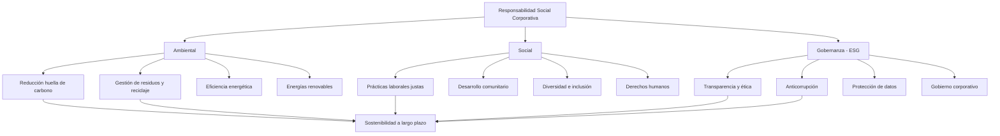

# Responsabilidad Social Corporativa (RSC): Un Imperativo Estratégico para Empresas Modernas

La Responsabilidad Social Corporativa (RSC) se ha convertido en una competencia central en el mundo empresarial moderno. Guía a las organizaciones hacia la responsabilidad social y ambiental, al mismo tiempo que agrega valor a los grupos de interés. La RSC representa el compromiso de una empresa para gestionar sus impactos económicos, sociales y ambientales de manera sostenible.


> En E-SMART360 entendemos que hacer el bien no es suficiente: la RSC es una decisión de inversión que construye reputación de marca, mitiga riesgos y crea valor a largo plazo.

## Comprendiendo la RSC: Definición, Alcance y Evolución

La RSC es un modelo de negocio autorregulador donde las empresas reconocen sus impactos sociales, económicos y ambientales y garantizan que sus operaciones beneficien a la sociedad. Con el tiempo, la RSC se ha convertido en un término paraguas que abarca todos los criterios de sostenibilidad, incluyendo los aspectos ambientales, sociales y de gobernanza (ESG) y la "creación de valor compartido" (CSV). Esto ha transformado la RSC de una elección ética a una práctica obligatoria en muchas industrias a nivel mundial, y las organizaciones ahora son responsables ante reguladores y partes interesadas por igual.


> La RSC ha evolucionado desde ser "algo agradable de hacer" a convertirse en un pilar estratégico fundamental para empresas que buscan crecimiento sostenible y diferenciación competitiva.

### Tipos de RSC

La RSC se puede categorizar en varios tipos clave:

- **RSC Ambiental**: Reduce los impactos ambientales negativos como la gestión de residuos, el reciclaje y el uso de soluciones de energía renovable. Las empresas que adoptan esta práctica implementan sistemas de reciclaje, instalan paneles solares, optimizan su uso de agua y reducen su huella de carbono mediante tecnologías limpias.
- **RSC Ética**: Garantiza que las empresas cumplan con la ética en sus operaciones — lucha contra la corrupción, derechos laborales, marketing responsable, etc. Esto incluye políticas de transparencia salarial, condiciones de trabajo dignas y cadenas de suministro libres de trabajo infantil.
- **RSC Filantrópica**: Incluye donaciones, obras de caridad y programas de participación comunitaria en el bienestar social. Abarca desde la donación de un porcentaje de las ganancias hasta la creación de fundaciones corporativas que aborden problemas sociales específicos.
- **RSC Económica**: Decisiones empresariales que mejoran la rentabilidad a largo plazo de la empresa al tiempo que garantizan un impacto económico positivo en la sociedad. Esto implica invertir en comunidades locales, pagar salarios justos y contribuir al desarrollo económico de las regiones donde opera la empresa.

Al combinar estos esfuerzos de RSC con el Triple Resultado — Personas, Planeta, Beneficios — las empresas crean valor a largo plazo para su negocio, así como para su comunidad y el medio ambiente.


### 🌍 RSC Ambiental

Gestión de residuos, reciclaje, energías renovables, reducción de huella de carbono, eficiencia energética y optimización de recursos naturales.

### 🤝 RSC Ética

Cumplimiento normativo, anticorrupción, derechos laborales, marketing responsable, transparencia en operaciones y gobierno corporativo.

### 💝 RSC Filantrópica

Donaciones, voluntariado corporativo, programas comunitarios, apoyo a causas sociales, inversión social y fundaciones corporativas.

### 📊 RSC Económica

Crecimiento sostenible, creación de valor compartido, cadenas de suministro responsables, inversión ética y desarrollo local.

### Marcos y Estándares Globales para la RSC

La Responsabilidad Social Corporativa opera dentro de diferentes marcos globales. La norma internacional ISO 26000 proporciona directrices para integrar la RSC en las operaciones empresariales, cubriendo derechos humanos, prácticas laborales, medio ambiente, prácticas operativas justas, asuntos del consumidor y desarrollo comunitario. La ISO 26000 (o normas equivalentes) ayuda a las empresas a evaluar sus actividades de RSC y proporciona marcos para la acción responsable.


> En muchos países la RSC no es voluntaria. Sudáfrica, por ejemplo, exige que las empresas listadas en la Bolsa de Johannesburgo presenten informes integrados sobre su desempeño ambiental, social y económico. Otros países como Francia han hecho obligatorios la contabilidad social, la auditoría y la presentación de informes. En la Unión Europea, la Directiva de Reporte de Sostenibilidad Corporativa (CSRD) exige que aproximadamente 50,000 empresas reporten detalladamente su impacto ambiental y social.

Sin embargo, a nivel mundial no existe un acuerdo general sobre métricas de rendimiento estandarizadas para los esfuerzos de RSC. Esto crea desafíos tanto para las empresas que buscan implementar programas de RSC como para los inversores que intentan comparar el desempeño de sostenibilidad entre compañías.

### El Panorama Global de la RSC: Compromisos y Realidades Regionales

La implementación de la RSC varía significativamente según la región geográfica, influenciada por factores culturales, económicos, regulatorios y sociales. Comprender estas diferencias es crucial para empresas multinacionales que operan en diferentes mercados.

| Región | Enfoque Característico | Marco Regulatorio | Prioridades Comunes |
|---|---|---|---|
| **Europa** | Liderazgo regulatorio | CSRD obligatoria, taxonomía verde de la UE | Cambio climático, derechos humanos, economía circular |
| **América del Norte** | Voluntariado con presión de inversores | Reporte ESG incentivado por la SEC y accionistas | Diversidad, gobernanza, cambio climático |
| **Asia-Pacífico** | Crecimiento rápido impulsado por el gobierno | Requisitos variables, India exige gasto en RSC | Desarrollo comunitario, educación, infraestructura |
| **Latinoamérica** | Enfoque en comunidades locales | Marcos emergentes, presión social creciente | Reducción de pobreza, educación, medio ambiente |
| **África y Medio Oriente** | Desarrollo socioeconómico como prioridad | Sudáfrica líder en reportes integrados | Creación de empleo, educación, salud, agua |

Esta diversidad regional significa que no existe un enfoque único para la RSC. Las empresas globales deben adaptar sus estrategias a los contextos locales mientras mantienen principios fundamentales consistentes en todas sus operaciones.

### CSV y CPR: Nuevos Conceptos

Además de la RSC tradicional, han surgido la Creación de Valor Compartido (CSV) y la Responsabilidad Filantrópica Corporativa (CPR). Con CSV, el enfoque principal sigue siendo la creación de valor económico para la sociedad mediante la incorporación de problemas sociales en la estrategia empresarial. Por ejemplo, una empresa farmacéutica que desarrolla medicamentos asequibles para enfermedades tropicales desatendidas está practicando CSV: resuelve un problema social y al mismo tiempo crea un mercado y genera ingresos. En cuanto a la CPR, esto se traduce en esfuerzos filantrópicos más sistemáticos que conectan el beneficio social con el propósito empresarial.


### ¿Cuál es la diferencia entre RSC y Creación de Valor Compartido (CSV)?

La RSC tradicional se enfoca en "hacer el bien" como una actividad separada del negocio principal, a menudo a través de donaciones o programas comunitarios. El CSV, por otro lado, integra los problemas sociales directamente en la estrategia empresarial, creando valor económico y social simultáneamente.

**Ejemplo**: 
- **RSC**: Una empresa dona el 1% de sus ganancias a escuelas locales.
- **CSV**: La misma empresa desarrolla una plataforma educativa digital asequible que mejora los resultados de aprendizaje y genera ingresos recurrentes.

Michael Porter y Mark Kramer, quienes acuñaron el término CSV en 2011, argumentan que el CSV tiene el potencial de ser más impactante que la RSC tradicional porque está integrado en el núcleo del negocio y es auto-sostenible.

## El Papel de la RSC en la Estrategia Corporativa

Para las empresas, la RSC es más que simplemente "devolver": es un arma táctica para aumentar la eficiencia operativa, la lealtad a la marca y la innovación. Integrar la RSC en el negocio puede llevar a resultados medibles y transformadores.

1. **Confianza del Consumidor y Reputación de Marca**: La RSC transparente y auténtica genera confianza del consumidor y una imagen de marca sólida. Cuando una empresa demuestra consistentemente su compromiso con causas sociales y ambientales, los consumidores responden con lealtad. Empresas como Unilever e IKEA han incorporado exitosamente la sostenibilidad en sus modelos de negocio, logrando tanto impacto social como rendimiento financiero superior.

2. **Compromiso y Retención de Empleados**: Los programas de RSC bien diseñados crean un entorno de alta satisfacción laboral y baja rotación. Los empleados de hoy, especialmente los millennials y la Generación Z, buscan trabajar para empresas cuyos valores se alineen con los suyos. Las políticas sólidas de RSC atraen talento de primer nivel y retienen empleados al proporcionar un sentido de propósito y realización más allá del salario.

3. **Gestión de Riesgos**: Las empresas que adoptan una postura proactiva en RSC pueden gestionar mejor los riesgos reputacionales y legales. Cumplir con las regulaciones ambientales y laborales, mantener relaciones transparentes con los grupos de interés y operar con integridad reduce significativamente el riesgo de escándalos, multas regulatorias y daños a la reputación.

4. **Eficiencia Operativa y Reducción de Costos**: La RSC sostenible ayuda a las empresas a reducir costos mediante la eficiencia energética, la reducción de residuos y la optimización de las cadenas de suministro. Cada kilovatio-hora ahorrado, cada tonelada de material reciclado y cada proceso optimizado contribuye tanto al medio ambiente como a la rentabilidad. Dichas iniciativas conducen a la rentabilidad a largo plazo con un impacto ambiental mínimo y la máxima eficiencia de recursos.


### Paso 1: Evalúa las expectativas de los grupos de interés

Comienza por comprender las necesidades y expectativas de tus grupos de interés clave: empleados, clientes, inversores, proveedores, comunidades locales y reguladores. Realiza encuestas de materialidad, grupos focales y entrevistas para identificar los temas de RSC más relevantes para tu organización y sector. Este paso es fundamental porque determina la dirección de toda tu estrategia de RSC.

**Herramientas útiles**:
- Análisis de materialidad (AA1000 o GRI)
- Mapeo de grupos de interés
- Encuestas de percepción
- Grupos focales con comunidades locales
- Entrevistas con inversores y analistas ESG
- Benchmarking sectorial de prácticas de RSC

### Paso 2: Establece metas y métricas claras y medibles

Define objetivos SMART (Específicos, Medibles, Alcanzables, Relevantes y con Plazo definido). Por ejemplo: "Reducir las emisiones de carbono en un 30% para 2030 con respecto a la línea base de 2025" o "Aumentar la inversión comunitaria al 2% de las ganancias netas anuales". Asegúrate de que las metas estén alineadas con los Objetivos de Desarrollo Sostenible (ODS) de la ONU y los estándares del sector.

**Ejemplos de metas SMART**:
- "Reducir el consumo energético en un 20% para finales de 2026 con respecto a 2023"
- "Alcanzar el 40% de representación femenina en puestos directivos para 2028"
- "Cero residuos enviados a vertederos para 2027"
- "Invertir el 1.5% de las ganancias anuales en programas comunitarios locales"
- "Capacitar al 100% de los empleados en ética y RSC antes de finalizar el año fiscal"

### Paso 3: Involucra a empleados y liderazgo en todos los niveles

Las iniciativas de RSC no pueden ser responsabilidad exclusiva del departamento de comunicaciones. Deben ser adoptadas y promovidas desde la alta dirección hasta el personal de primera línea. Crea comités de RSC interdepartamentales, nombra embajadores de sostenibilidad en cada equipo y ofrece programas de voluntariado corporativo que permitan a los empleados contribuir activamente.

**Estrategias de involucramiento**:
- Establecer un Comité de RSC con representantes de cada departamento
- Nombrar un Chief Sustainability Officer (CSO) o equivalente
- Crear un programa de Embajadores Verdes voluntarios
- Incluir metas de RSC en las evaluaciones de desempeño de todos los empleados
- Vincular una parte de la compensación ejecutiva al cumplimiento de metas ESG
- Organizar hackathons o concursos de innovación sostenible

### Comunica los avances con transparencia y regularidad

La comunicación transparente es esencial para mantener la credibilidad. Publica informes anuales de RSC o sostenibilidad que detallen tanto los logros como las áreas de mejora. Utiliza marcos reconocidos como el GRI (Global Reporting Initiative) o el SASB para estructurar tus informes. Comparte los avances a través de múltiples canales: sitio web corporativo, redes sociales, comunicados de prensa y reuniones con inversores.

### Implementa un ciclo de mejora continua

La RSC no es un destino, sino un viaje de mejora continua. Revisa y refina regularmente las estrategias basándote en comentarios de los grupos de interés, cambios en el panorama regulatorio, avances tecnológicos y tendencias emergentes. Celebra los logros alcanzados, pero también sé honesto sobre los desafíos y las lecciones aprendidas en el camino.

### Implementación y Reporte de RSC

Implementar la RSC requiere que una organización tenga un sistema de gestión de RSC robusto y bien estructurado. Este sistema debe incluir políticas y planes de acción específicos para cada tema de RSC identificado como relevante, así como mecanismos claros para monitorear y reportar el progreso. La implementación efectiva requiere:

- **Patrocinio ejecutivo**: La RSC debe ser impulsada desde el más alto nivel de dirección, con un ejecutivo C-level (como un Director de Sostenibilidad o Chief Sustainability Officer) responsable del liderazgo estratégico.
- **Difusión organizacional**: Las políticas de RSC deben comunicarse y aplicarse en todos los departamentos y niveles de la organización, no solo en un equipo aislado.
- **Relaciones proactivas**: El mantenimiento proactivo de relaciones sociales sólidas con el personal, clientes, proveedores y comunidades vecinas es vital para el éxito de las iniciativas de RSC.

Muchas empresas emplean marcos como EcoVadis para evaluar el nivel de logro en sus actividades de RSC. Esta plataforma permite a las empresas evaluar sus estrategias sostenibles, identificar fortalezas y debilidades, y compararse con sus pares de la industria. Otros procesos de verificación, como auditorías y certificaciones por parte de terceros independientes, también validan la credibilidad de las afirmaciones de RSC y proporcionan seguridad a los grupos de interés.


> **Importante**: La RSC no es un proyecto de una sola vez ni una campaña de relaciones públicas. Requiere compromiso continuo, inversión sostenida y una verdadera integración en la cultura corporativa. Las iniciativas superficiales o el "greenwashing" — cuando una empresa finge ser más ecológica de lo que realmente es — pueden dañar gravemente la reputación de una empresa cuando los grupos de interés descubren la falta de autenticidad. La transparencia y la honestidad son fundamentales.

### La Evolución de la RSC: De Obligación Moral a Ventaja Estratégica

La RSC ha transitado un camino fascinante desde sus orígenes como filantropía empresarial hasta convertirse en una herramienta estratégica de negocio. Ya no es una opción moral, sino un imperativo competitivo. Las empresas están adoptando la RSC de manera proactiva, yendo mucho más allá del mero cumplimiento legal para promover activamente el bien social.

La RSC moderna abarca múltiples dimensiones interconectadas:



Esta evolución es evidente en cómo empresas como **E-SMART360** integran la RSC en su modelo de negocio. Como empresa dedicada a la automatización de chatbots y soluciones de mensajería empresarial, E-SMART360 entiende la importancia de adoptar prácticas socialmente responsables que abarquen desde la reducción de la huella de carbono mediante tecnología sostenible hasta el compromiso con prácticas laborales justas y una gobernanza ética sólida.


### 🌱 Gobernanza Ética

Las prácticas de gobernanza ética forman la base de cualquier estrategia de RSC efectiva. E-SMART360 mantiene:
- **Transparencia total** en todas las operaciones y comunicaciones
- **Cumplimiento normativo riguroso** con todas las regulaciones aplicables
- **Políticas anticorrupción** claras y aplicadas consistentemente
- **Toma de decisiones responsable** que considera el impacto en todos los grupos de interés
- **Auditorías regulares** de cumplimiento y desempeño ético
- **Canal de denuncias** seguro y anónimo para reportar irregularidades

### 👥 Prácticas Laborales Justas

El capital humano es el activo más valioso de cualquier organización. E-SMART360 promueve:
- **Diversidad e inclusión** en todos los niveles de la organización
- **Igualdad de oportunidades** sin distinción de género, origen o creencias
- **Desarrollo profesional continuo** mediante programas de capacitación y certificaciones
- **Salud y seguridad laboral** con estándares que superan los requisitos legales
- **Conciliación vida-trabajo** con horarios flexibles y opciones de trabajo remoto
- **Compensación justa** con brechas salariales mínimas y revisión periódica

### ♻️ Sostenibilidad Ambiental

El compromiso con el planeta es una prioridad en E-SMART360:
- **Eficiencia energética** en todas las operaciones y centros de datos
- **Reducción activa de emisiones de carbono** mediante infraestructura optimizada
- **Tecnología sostenible** como pilar del desarrollo de productos
- **Gestión responsable de residuos electrónicos** con programas de reciclaje
- **Infraestructura en la nube optimizada** para minimizar el consumo energético
- **Digitalización de procesos** para reducir el uso de papel y recursos físicos

## RSC y el Triple Resultado: Personas, Planeta y Beneficios

El concepto del Triple Resultado — conocido internacionalmente como **Triple Bottom Line** (People, Planet, Profit) — se encuentra en el corazón de la RSC moderna. Este marco, popularizado por John Elkington en 1994, anima a las empresas a medir su éxito no solo por los rendimientos financieros, sino por su impacto social y ambiental. Es una invitación a pasar de una contabilidad unidimensional (solo beneficios) a una contabilidad tridimensional que refleje el verdadero valor creado por la empresa.

### Personas: La Dimensión Social

La responsabilidad social es el primer pilar del Triple Resultado y representa el compromiso de la empresa con el bienestar de las personas que impacta directa o indirectamente. E-SMART360 materializa este principio a través de:

- **Un entorno laboral seguro e inclusivo** donde todos los empleados pueden desarrollarse profesionalmente sin temor a discriminación.
- **Programas de desarrollo profesional** que incluyen capacitación continua, certificaciones y oportunidades de crecimiento.
- **Participación comunitaria activa** a través de programas de voluntariado corporativo y alianzas con organizaciones sin fines de lucro.
- **Iniciativas de bienestar** que abordan la salud física y mental de los empleados.


### ¿Cómo fomentar la responsabilidad social entre los empleados?

Involucrar a los empleados en iniciativas de RSC no solo beneficia a la comunidad, sino que también mejora la satisfacción laboral y el sentido de pertenencia. Estas son estrategias comprobadas:

1. **Programas de voluntariado corporativo**: Ofrece horas pagadas (por ejemplo, 8-16 horas al mes) para que los empleados participen en causas sociales de su elección.
2. **Donaciones equivalentes** (matching gifts): Iguala las donaciones que los empleados hacen a organizaciones benéficas, duplicando el impacto.
3. **Días de servicio comunitario**: Organiza jornadas trimestrales donde todo el equipo participe en proyectos comunitarios (limpieza de parques, construcción de viviendas, etc.).
4. **Reconocimiento público**: Establece premios internos para empleados que contribuyen activamente a iniciativas sociales o ambientales.
5. **Formación continua en ética**: Proporciona capacitación regular sobre RSC, toma de decisiones éticas y los ODS de la ONU.
6. **Grupos de recursos para empleados** (ERGs): Apoya la creación de grupos voluntarios liderados por empleados enfocados en causas específicas (sostenibilidad, diversidad, educación, etc.).

### Planeta: La Gestión Ambiental como Prioridad

En el contexto actual de crisis climática, las empresas deben asumir un papel de liderazgo en la protección del medio ambiente. La gestión ambiental responsable ya no es opcional — es una expectativa fundamental de consumidores, inversores y reguladores.

E-SMART360 aborda este desafío con acciones concretas y medibles:

- **Infraestructura en la nube eficiente**: Utilización de centros de datos que operan con energía renovable y tecnologías de refrigeración eficiente.
- **Trabajo remoto como práctica estándar**: Reducción significativa de emisiones de CO₂ asociadas al desplazamiento diario de los empleados.
- **Digitalización integral**: Promoción activa de procesos sin papel y comunicaciones digitales, eliminando el desperdicio de recursos físicos.
- **Ciclo de vida responsable del producto**: Diseño de soluciones de software que maximizan su vida útil, reduciendo la necesidad de reemplazos frecuentes de hardware.
- **Compensación de carbono**: Inversión en proyectos de reforestación y energías renovables para compensar las emisiones que no pueden eliminarse.


> **El costo del cambio climático**: Según el IPCC, se necesitan reducciones de emisiones del 45% para 2030 (con respecto a 2010) para limitar el calentamiento global a 1.5°C. Las empresas tienen un papel crucial que desempeñar: el sector corporativo es responsable de aproximadamente el 70% de las emisiones globales de gases de efecto invernadero. Cada acción de sostenibilidad empresarial cuenta.

### Beneficios: La Gobernanza Ética como Motor de Valor

El tercer pilar del Triple Resultado — los beneficios — no se refiere a maximizar ganancias a cualquier costo, sino a generarlas de manera ética y sostenible. La RSC demuestra que la rentabilidad y la responsabilidad no son mutuamente excluyentes, sino que se refuerzan mutuamente.

E-SMART360 opera con principios de gobernanza que garantizan:
- **Operaciones justas y transparentes** en todas las interacciones comerciales.
- **Medidas anticorrupción** robustas y aplicadas consistentemente.
- **Relaciones de confianza** con clientes, socios y comunidades.
- **Crecimiento financiero sostenible** que beneficia a todos los grupos de interés, no solo a los accionistas.
- **Inversión responsable** que considera factores ESG en las decisiones de asignación de capital.


> La gobernanza ética no solo protege a la empresa de riesgos legales y reputacionales, sino que también atrae a inversores institucionales que cada vez más incorporan criterios ESG en sus decisiones de inversión. Según datos de la Global Sustainable Investment Alliance (GSIA), los activos bajo gestión con enfoque sostenible superan los 30 billones de dólares a nivel mundial, representando más del 35% del total de activos gestionados profesionalmente.

## Los Seis Temas Centrales de RSC Identificados por ISO 26000

ISO 26000 es una norma internacional que proporciona directrices integrales para la RSC, abarcando siete materias fundamentales. A continuación, presentamos las seis áreas clave y cómo se aplican en la práctica empresarial:

1. **Gobernanza Organizacional**: Esta área fundamental aborda la transparencia, la rendición de cuentas y los procesos éticos de toma de decisiones. Una gobernanza sólida es la base sobre la cual se construyen todas las demás iniciativas de RSC. E-SMART360 sigue principios sólidos de gobernanza, garantizando equidad, integridad y medidas anticorrupción en todos sus tratos comerciales. Esto incluye juntas directivas diversas, políticas de puertas abiertas y mecanismos de supervisión independiente.

2. **Derechos Humanos**: Proteger y promover los derechos humanos dentro de la empresa y en toda su cadena de suministro es una responsabilidad fundamental. E-SMART360 está comprometida con prácticas laborales justas, la promoción de la diversidad y la inclusión, y la garantía de igualdad de oportunidades para todos los empleados, independientemente de su origen, género, religión o cualquier otra característica.

3. **Prácticas Laborales**: Este tema central enfatiza el bienestar integral de los empleados, incluyendo su salud física y mental, seguridad en el lugar de trabajo y acceso a oportunidades de capacitación y desarrollo profesional. E-SMART360 garantiza un ambiente de trabajo seguro, saludable y estimulante, e invierte continuamente en el desarrollo profesional de los miembros de su equipo a través de programas de formación, certificaciones y planes de carrera claros.

4. **Medio Ambiente**: La sostenibilidad ambiental está en el corazón de la estrategia de RSC de E-SMART360. La empresa ha implementado prácticas ecológicas integrales, que incluyen la reducción activa de emisiones de carbono mediante tecnologías energéticamente eficientes, la minimización de residuos y el apoyo a proyectos centrados en la conservación y regeneración ambiental.

5. **Prácticas Justas de Operación**: Este tema abarca las relaciones éticas de la empresa con otras organizaciones, incluyendo la lucha contra la corrupción, la promoción de la competencia justa, el respeto por los derechos de propiedad y la responsabilidad en la cadena de suministro. E-SMART360 mantiene la máxima transparencia en todas sus relaciones comerciales, construyendo confianza duradera con clientes, proveedores, empleados y otros grupos de interés.

6. **Asuntos del Consumidor**: La protección de los derechos del consumidor, la garantía de calidad del producto y la seguridad de la información son aspectos críticos de la RSC en el sector tecnológico. E-SMART360 se dedica a garantizar que todas sus soluciones de chatbot y automatización cumplan con los más altos estándares de calidad y seguridad, y cumplan rigurosamente con todas las regulaciones de privacidad y protección de datos aplicables, como el GDPR y las leyes locales de protección de datos.


#### 📋 Lista de verificación RSC basada en ISO 26000

```
✔ Gobernanza organizacional transparente y toma de decisiones ética
✔ Políticas de derechos humanos implementadas en toda la cadena de valor
✔ Programas integrales de salud, seguridad y desarrollo laboral
✔ Estrategia ambiental con métricas claras de reducción de carbono
✔ Prácticas anticorrupción documentadas y competencia justa
✔ Protección de datos del consumidor y garantía de calidad del producto
✔ Participación activa y bidireccional con la comunidad local
✔ Reporte anual de RSC o sostenibilidad conforme a estándares GRI
✔ Capacitación periódica en ética para todos los empleados
✔ Canales de denuncia seguros y accesibles
```

## RSC vs. Gobierno Corporativo: Diferencias Clave y Complementariedad

Es común confundir la RSC con el gobierno corporativo, pero aunque están estrechamente relacionados, son conceptos distintos. Comprender sus diferencias y cómo se complementan es esencial para implementar ambos de manera efectiva.

**Gobierno Corporativo** se refiere al sistema interno de reglas, prácticas y procesos mediante los cuales una empresa es dirigida y controlada. Abarca la estructura de la junta directiva, los derechos de los accionistas, la transparencia financiera, la compensación ejecutiva y los mecanismos de rendición de cuentas.

**RSC**, por otro lado, es un concepto más amplio y holístico que aborda la forma en que la empresa interactúa con la sociedad y el medio ambiente en su conjunto. Mientras que el gobierno corporativo se centra en las relaciones con los accionistas y la gestión interna, la RSC se ocupa de las obligaciones hacia todos los grupos de interés: empleados, clientes, proveedores, comunidades, el medio ambiente y la sociedad en general.


> **E-SMART360 reconoce la importancia de ambos conceptos.** Las políticas de RSC combinadas con marcos sólidos de gobierno corporativo crean un círculo virtuoso: el buen gobierno proporciona la estructura para implementar la RSC de manera efectiva, y la RSC exitosa retroalimenta una mejor gobernanza al ampliar la perspectiva de la empresa más allá de los intereses puramente financieros. Esta sinergia permite a la empresa mantener una sólida reputación, generar confianza entre todos los grupos de interés y crecer de manera sostenible a largo plazo.

## Estándares y Certificaciones Globales de RSC

Adoptar estándares y obtener certificaciones globales de RSC es fundamental para las empresas que aspiran a liderar en responsabilidad social y demostrar su compromiso de manera creíble. Estos marcos proporcionan estructura, credibilidad y un lenguaje común para comunicar el desempeño en sostenibilidad.

| Estándar / Certificación | Descripción | Enfoque Principal |
|---|---|---|
| **ISO 26000** | Directrices internacionales para la responsabilidad social | Orientación integral sobre 7 materias fundamentales de RSC |
| **GRI (Global Reporting Initiative)** | Marco para la divulgación de desempeño ESG | Reporte de sostenibilidad estandarizado |
| **Certificación B Corp** | Certificación para empresas con altos estándares sociales y ambientales | Evaluación holística del impacto empresarial |
| **Pacto Mundial de la ONU** | Iniciativa voluntaria basada en 10 principios | Derechos humanos, trabajo, medio ambiente, anticorrupción |
| **SASB** | Estándares específicos por industria para divulgación financiera material | Materialidad financiera de la sostenibilidad |
| **CDP (Carbon Disclosure Project)** | Plataforma de divulgación de impacto ambiental | Cambio climático, agua, bosques |
| **EcoVadis** | Plataforma de evaluación de sostenibilidad empresarial | Calificación de RSC en cadenas de suministro |

Al alinearse con estos estándares reconocidos globalmente, E-SMART360 no solo demuestra su compromiso auténtico con la RSC, sino que también mejora su credibilidad y confiabilidad en el mercado, facilitando la comparación con pares de la industria y proporcionando a los inversores la información que necesitan para tomar decisiones informadas.


### ¿Cómo obtener la certificación B Corp?

La certificación B Corp es uno de los estándares más rigurosos y respetados de responsabilidad social empresarial. Evalúa el desempeño completo de una empresa en cinco áreas: gobernanza, trabajadores, comunidad, medio ambiente y clientes. El proceso incluye:

1. **Evaluación de Impacto B (B Impact Assessment)**: Completa una evaluación gratuita en línea que mide tu impacto en todas las áreas. El puntaje máximo posible es 200.
2. **Alcanzar el puntaje mínimo**: Debes obtener al menos 80 puntos de 200 para ser elegible. Este puntaje ya es un logro significativo.
3. **Revisión por B Lab**: Si alcanzas el puntaje, tu evaluación es revisada por el equipo de B Lab, quien puede solicitar documentación de respaldo y aclaraciones.
4. **Verificación y llamada de revisión**: B Lab verifica tus respuestas mediante llamadas de revisión y solicitudes de evidencia.
5. **Compromiso legal**: Debes modificar tus estatutos corporativos para considerar explícitamente el impacto en todos los grupos de interés (no solo los accionistas).
6. **Certificación y tarifa anual**: Una vez aprobada, pagas una tarifa anual basada en tus ingresos anuales.
7. **Recertificación**: Debes recertificarte cada tres años, con una evaluación completa para mantener el estatus.

**Beneficios de la certificación B Corp**: Diferenciación competitiva, atracción de talento, acceso a una comunidad global de empresas comprometidas, mayor confianza del consumidor y credibilidad ante inversores.

## Ventajas Adicionales de una RSC Efectiva

Más allá del impacto social y ambiental positivo, la RSC genera beneficios comerciales tangibles que impactan directamente en los resultados de la empresa. Las empresas que implementan estrategias de RSC efectivas experimentan:


### 📈 Ventajas Competitivas de la RSC

1. **Diferenciación en el mercado**: Las empresas responsables se destacan en mercados saturados.
2. **Atracción de inversores ESG**: Cada vez más fondos de inversión priorizan empresas con buenas calificaciones ESG.
3. **Mayor lealtad y retención de clientes**: Los consumidores premian a las empresas responsables con su preferencia.
4. **Reducción de costos operativos**: La eficiencia energética y la reducción de residuos impactan directamente en la rentabilidad.
5. **Acceso a talento de primer nivel**: El 76% de los millennials considera el compromiso social antes de aceptar un empleo.
6. **Mejores relaciones con reguladores**: El cumplimiento proactivo reduce el riesgo de sanciones y multas.
7. **Innovación impulsada por la sostenibilidad**: Los desafíos ambientales y sociales inspiran soluciones innovadoras.
8. **Resiliencia ante crisis**: Las empresas con sólida reputación de RSC se recuperan más rápido de las crisis.

### ⚡ Caso Práctico: Implementación de RSC en una Empresa Tecnológica

**Escenario**: Una empresa de desarrollo de software decide implementar una estrategia integral de RSC.

**Acciones concretas**:
- **Ambiental**: Migra sus servidores a centros de datos alimentados con energía renovable, reduciendo su huella de carbono en un 40%. Implementa una política de "cero papel" y optimiza el consumo energético de sus oficinas.
- **Social**: Crea un programa de becas de programación para jóvenes de comunidades desfavorecidas y establece un programa de mentoría tecnológica en escuelas locales. Ofrece 16 horas mensuales de voluntariado pagado a sus empleados.
- **Gobernanza**: Publica un informe anual de transparencia con métricas detalladas de diversidad, emisiones de carbono, donaciones y satisfacción de empleados. Establece un comité de ética independiente.

**Result
**Resultados obtenidos**:
- Reducción del 40% en emisiones de carbono en 18 meses
- Aumento del 30% en retención de talento en 12 meses
- Mejora del 25% en puntuación de evaluaciones ESG
- Atracción de 3 inversores institucionales interesados en sostenibilidad
- Cobertura mediática positiva que aumentó el reconocimiento de marca
- Reducción del 15% en costos operativos por eficiencia energética

**Lecciones aprendidas**:
- La RSC requiere inversión inicial, pero genera retornos compuestos a mediano plazo
- La autenticidad es clave: los grupos de interés detectan rápidamente las iniciativas superficiales
- El compromiso de los empleados es el motor que impulsa el éxito de la RSC
- La medición y el reporte transparente construyen credibilidad

Además, la RSC reduce significativamente el riesgo empresarial al anticipar y adaptarse a los cambios en las preferencias del consumidor y las regulaciones gubernamentales. Mantenerse al día con las tendencias de la industria y las expectativas sociales ha permitido a E-SMART360 innovar continuamente mientras reduce costos operativos y mejora su eficiencia. La RSC también hace que la empresa sea más atractiva para un creciente número de inversores que buscan activamente empresas con sólidas prácticas Ambientales, Sociales y de Gobernanza (ESG).

### El Papel Estratégico de la RSC en la Gestión de Crisis

Las crisis organizacionales — ya sean financieras, reputacionales o externas como una pandemia — ponen a prueba la fortaleza de cualquier empresa. En estos momentos críticos, la RSC se convierte en un activo invaluable para la gestión de crisis y la reconstrucción de la confianza.


> **Dato clave**: Según el Edelman Trust Barometer 2025, el 76% de los consumidores espera que los CEOs tomen la iniciativa en el cambio social, no que esperen a que el gobierno lo imponga. Además, las empresas con sólidas credenciales de RSC documentadas se recuperan hasta un 50% más rápido de las crisis de reputación en comparación con aquellas que no tienen programas de RSC establecidos.

**¿Cómo ayuda la RSC en una crisis?**

| Aspecto | Sin RSC Sólida | Con RSC Sólida |
|---|---|---|
| Confianza de los grupos de interés | Baja; se asume mala intención | Alta; se da el beneficio de la duda |
| Cobertura mediática | Negativa y sensacionalista | Más equilibrada y contextualizada |
| Apoyo de los empleados | Rotación y desmotivación | Lealtad y defensa de la empresa |
| Capacidad de recuperación | Lenta y costosa | Rápida gracias al capital de reputación |
| Relación con reguladores | Investigaciones y sanciones | Colaboración y apoyo |

La ética y la transparencia demostradas a través de programas de RSC consistentes ayudan a E-SMART360 a mantener la confianza de los grupos de interés incluso en tiempos difíciles. Una respuesta rápida, honesta y responsable permite a las empresas superar crisis externas o problemas internos con mayor facilidad y menos daño a largo plazo.

## Implicaciones Legales y Éticas de la RSC

Si bien las prácticas de RSC traen múltiples beneficios tanto sociales como empresariales, deben abordarse con un profundo sentido de responsabilidad ética y cumplimiento legal. Los marcos legales en países como Sudáfrica y Francia exigen la rendición de cuentas en materia de RSC, pero una verdadera estrategia de RSC va mucho más allá del mero cumplimiento de la ley.

Las empresas deben mantener lo que se conoce como una **licencia social para operar** (Social License to Operate o SLO), que representa el nivel de aceptación y aprobación continua que una empresa tiene por parte de sus grupos de interés y la sociedad en general. La SLO no es un documento formal emitido por una autoridad gubernamental, sino una percepción colectiva que debe ganarse y mantenerse a través de acciones consistentes y transparentes.

La capacitación en ética dentro de las organizaciones desempeña un papel fundamental para ayudar a los empleados a comprender sus roles individuales en los esfuerzos de RSC. Los programas de formación ética promueven la toma de decisiones responsable, ayudan a identificar dilemas éticos en el día a día y reducen el riesgo de violaciones que podrían dañar la reputación de la empresa.


### ¿Qué es la Licencia Social para Operar (SLO) y cómo obtenerla?

La Licencia Social para Operar es un concepto que describe el nivel de aceptación continua que una empresa necesita de sus grupos de interés y comunidades para operar sin conflictos. Se basa en cuatro pilares fundamentales:

1. **Legitimidad**: La empresa demuestra que opera dentro de las normas sociales y legales aceptadas, y que su presencia es apropiada para la comunidad.
2. **Credibilidad**: La empresa cumple consistentemente sus promesas y compromisos, demostrando que es digna de confianza a largo plazo.
3. **Confianza**: La empresa demuestra consistentemente integridad, transparencia y buena fe en todas sus interacciones con los grupos de interés.
4. **Aprobación**: Los grupos de interés clave apoyan activamente las operaciones de la empresa y defienden su derecho a operar en la comunidad.

**Consecuencias de perder la SLO**: Boicots de consumidores, protestas comunitarias, desaprobación regulatoria, dificultades para obtener permisos, daños irreparables a la reputación de marca y, en casos extremos, el cierre forzoso de operaciones.

**Cómo mantener la SLO**: Comunicación transparente y frecuente, cumplimiento consistente de compromisos, inversión genuina en la comunidad local, respuesta rápida a quejas y preocupaciones, y reporte público de impactos y medidas correctivas.

## RSC y Relaciones en la Cadena de Suministro

Los esfuerzos de RSC de una empresa no pueden limitarse a sus propias operaciones. Una verdadera estrategia de RSC se extiende a lo largo de toda la cadena de suministro, desde la extracción de materias primas hasta la entrega del producto final al consumidor. Las empresas que adoptan un abastecimiento responsable y exigen que sus proveedores sigan estándares éticos similares crean una cadena de suministro responsable y sostenible.

Este enfoque integral no solo fortalece las relaciones con los proveedores existentes, sino que también crea nuevas oportunidades de mercado, fomenta la innovación y diferencia a la empresa frente a sus competidores. La gestión responsable de la cadena de suministro se ha convertido en un factor crítico de éxito en industrias como la electrónica de consumo, la moda, la alimentación y la tecnología.

### Buenas Prácticas para una Cadena de Suministro Responsable


### Auditar y evaluar a los proveedores actuales

Realiza una evaluación exhaustiva de las prácticas sociales, ambientales y de gobernanza de todos tus proveedores existentes. Utiliza cuestionarios estandarizados basados en marcos reconocidos (como EcoVadis o el índice de sostenibilidad Dow Jones). Siempre que sea posible, complementa las evaluaciones documentales con auditorías in situ realizadas por personal capacitado o terceros certificados.

### Establecer y comunicar un Código de Conducta para Proveedores

Desarrolla un código de conducta claro y detallado que establezca expectativas específicas sobre derechos laborales (prohibición de trabajo infantil y forzado, salarios justos, horarios razonables), impacto ambiental (gestión de residuos, eficiencia energética, control de emisiones), anticorrupción y transparencia. Haz que la aceptación y el cumplimiento del código sean un requisito contractual obligatorio para todos los proveedores.

### Priorizar proveedores locales y responsables

Siempre que sea técnica y económicamente viable, elige proveedores locales para reducir la huella de carbono asociada al transporte de larga distancia y, al mismo tiempo, apoyar el desarrollo económico de las comunidades donde opera la empresa. Evalúa a los proveedores no solo por precio y calidad, sino también por su desempeño en sostenibilidad.

### Monitorear, medir y mejorar continuamente

Implementa un sistema de monitoreo continuo del desempeño de RSC de tus proveedores, utilizando indicadores clave de rendimiento (KPIs) predefinidos. Realiza evaluaciones periódicas, al menos una vez al año, y ofrece a los proveedores apoyo y capacitación para mejorar sus prácticas cuando sea necesario. Establece un proceso de escalamiento para proveedores que no cumplan con los estándares mínimos.

### Colaborar para la mejora, no solo sancionar

Adopta un enfoque de colaboración con los proveedores que enfrentan desafíos para cumplir con los estándares de RSC. En lugar de cortar relaciones de inmediato, ofrece planes de mejora con plazos realistas, capacitación y apoyo técnico. La colaboración para la mejora suele generar resultados más sostenibles que la terminación abrupta de contratos, que solo traslada el problema a otro comprador.


> Una cadena de suministro responsable no solo reduce los riesgos reputacionales, legales y operativos, sino que también puede generar eficiencias significativas. Empresas como Patagonia, Unilever y Microsoft han demostrado que las cadenas de suministro sostenibles y éticas pueden ser más rentables a largo plazo, gracias a la reducción de desperdicios, la optimización de procesos y la construcción de relaciones duraderas con proveedores comprometidos.

### Cómo la Tecnología Apoya la RSC en la Cadena de Suministro

La tecnología juega un papel cada vez más importante en la implementación y el monitoreo de la RSC en las cadenas de suministro. Algunas herramientas y enfoques clave incluyen:

- **Blockchain para trazabilidad**: Permite rastrear el origen de los materiales y verificar que provengan de fuentes éticas y sostenibles.
- **IA y análisis de datos**: Ayuda a identificar patrones de riesgo en la cadena de suministro y predecir posibles incumplimientos de estándares de RSC.
- **Plataformas de colaboración**: Facilitan la comunicación y el intercambio de información entre compradores y proveedores sobre requisitos de sostenibilidad.
- **Sensores IoT**: Monitorean en tiempo real el consumo de energía, las emisiones y las condiciones laborales en las instalaciones de los proveedores.

Estas tecnologías, combinadas con un compromiso genuino con la RSC, permiten a empresas como E-SMART360 no solo cumplir con sus propias metas de sostenibilidad, sino también extender su impacto positivo a lo largo de toda su cadena de valor.

## Conclusión: El Valor Estratégico y Transformador de la RSC

Hoy, la RSC no es un extra opcional ni una actividad periférica de relaciones públicas — es una estrategia empresarial esencial para crear valor añadido a largo plazo y contribuir positivamente a la sociedad, el medio ambiente y la economía global. Aplicar políticas de RSC sólidas y auténticas permite a empresas como E-SMART360 mejorar su reputación empresarial, obtener y mantener la confianza de los grupos de interés, optimizar sus operaciones, acceder a los mejores talentos del mercado y lograr un desarrollo verdaderamente sostenible.


### 📊 El Impacto Cuantificable de la RSC

- **Rendimiento financiero**: Las empresas con alto compromiso ESG superan a sus pares en un 4.8% anual (McKinsey & Company)
- **Lealtad del consumidor**: El 88% de los consumidores son más leales a empresas que apoyan causas sociales (Cone Communications)
- **Productividad**: Las empresas con programas de RSC sólidos reportan un 13% más de productividad de los empleados
- **Atracción de talento**: El 76% de los millennials considera el compromiso social de una empresa antes de aceptar un empleo
- **Recuperación de crisis**: Las empresas con sólida reputación de RSC se recuperan 50% más rápido
- **Acceso a capital**: Los activos ESG globales superan los 30 billones de dólares y siguen creciendo

### 🌱 Guía de Acción: Cómo empezar con RSC en tu empresa hoy

1. Realiza un diagnóstico inicial de tu impacto social y ambiental actual
2. Identifica los temas de RSC más relevantes para tu industria (análisis de materialidad)
3. Define 2-3 metas de RSC alcanzables y medibles para los primeros 12 meses
4. Asigna un presupuesto inicial y designa un equipo o persona responsable
5. Comunica el plan internamente y busca la participación activa de los empleados
6. Implementa sistemas de medición trimestral de progreso
7. Publica tu primer informe de RSC o sostenibilidad al finalizar el primer año
8. Revisa los resultados, ajusta la estrategia y escala gradualmente las iniciativas

En E-SMART360, nuestro compromiso con la RSC integra la sostenibilidad ambiental con la responsabilidad social de manera indivisible. Nuestro énfasis constante en prácticas comerciales éticas y transparentes nos ha permitido forjar relaciones duraderas y significativas con clientes, socios comerciales y las comunidades en las que operamos.

Nuestra filosofía en E-SMART360 es que la RSC ha transformado fundamentalmente la forma en que hacemos negocios. Nos permite mantener los más altos estándares éticos mientras fomentamos la sostenibilidad y la innovación. Creemos firmemente que todas las empresas, independientemente de su tamaño o sector, están llamadas a adoptar conceptos de responsabilidad social y ajustar sus operaciones para el beneficio colectivo. Al hacerlo, contribuirán activamente a crear un mundo más equitativo, sostenible y próspero para las generaciones presentes y futuras.

## Preguntas Frecuentes sobre RSC


### ¿Es obligatoria la RSC para todas las empresas? ¿Hay consecuencias por no implementarla?

No existe una obligación universal, pero la tendencia global es hacia la exigencia legal de reportar y practicar la RSC, especialmente para empresas grandes o que cotizan en bolsa. En la Unión Europea, la Directiva de Reporte de Sostenibilidad Corporativa (CSRD) exige que aproximadamente 50,000 empresas reporten detalladamente su impacto ambiental y social. En India, las empresas con ganancias netas superiores a ciertos umbrales deben gastar al menos el 2% de sus ganancias en actividades de RSC. Incluso donde no es legalmente obligatoria, la RSC se ha convertido en una expectativa del mercado: los consumidores, inversores y empleados prefieren cada vez más a empresas responsables, y su ausencia puede traducirse en pérdida de competitividad, dificultades para atraer talento y menor acceso a capital de inversión.

### ¿Cuál es la diferencia práctica entre RSC y ESG? ¿Debo implementar ambos?

Aunque los términos se usan a veces indistintamente, RSC y ESG tienen enfoques complementarios pero distintos. La RSC es el marco general y la filosofía que guía cómo una empresa contribuye voluntariamente a la sociedad y el medio ambiente. Define el "qué" y el "por qué". ESG, por otro lado, es un conjunto de criterios específicos y medibles (Ambientales, Sociales y de Gobernanza) que los inversores y analistas utilizan para evaluar cuantitativamente el desempeño de sostenibilidad de una empresa. Define el "cómo" y el "cuánto". En la práctica, las empresas comienzan con una estrategia de RSC y luego evolucionan hacia reportes ESG estructurados para satisfacer las demandas del mercado de capitales. Ambas son complementarias y recomendables: la RSC proporciona la visión estratégica y ESG proporciona las métricas y la credibilidad ante los inversores.

### ¿Cómo puedo medir el retorno de inversión (ROI) de las iniciativas de RSC?

El ROI de la RSC puede y debe medirse en múltiples dimensiones para obtener una imagen completa de su impacto:

**Dimensión financiera directa**:
- Reducción de costos operativos (eficiencia energética, menos residuos, optimización de procesos)
- Aumento de ventas por preferencia de consumidores hacia marcas sostenibles
- Reducción de primas de seguro por mejores prácticas de gestión de riesgos

**Dimensión reputacional**:
- Mejora en Net Promoter Score (NPS) y satisfacción del cliente
- Cobertura mediática positiva y su valor equivalente en publicidad
- Aumento en el valor de marca medido por encuestas de percepción

**Dimensión de talento**:
- Reducción en la tasa de rotación de personal y costos asociados
- Aumento en solicitudes de empleo y calidad de candidatos
- Mejora en encuestas de clima laboral y compromiso

**Dimensión de riesgo**:
- Menos incidentes regulatorios y multas evitadas
- Menor exposición a riesgos reputacionales
- Mayor resiliencia ante crisis

**Dimensión de inversión**:
- Mayor interés de inversores ESG y fondos sostenibles
- Mejor acceso a capital y condiciones de financiamiento
- Valoración premium en mercados públicos

Herramientas como el marco del Retorno Social de la Inversión (SROI) y los indicadores GRI ayudan a cuantificar estos impactos de manera sistemática y comparable.

### ¿Cómo puede una PYME con recursos limitados implementar la RSC de manera efectiva?

Las pequeñas y medianas empresas pueden comenzar su viaje de RSC con iniciativas de bajo costo pero alto impacto, sin necesidad de grandes inversiones:

**Iniciativas de costo cero o mínimo**:
1. **Voluntariado corporativo flexible**: Permite que los empleados donen horas de trabajo a causas sociales de su elección sin costo para la empresa.
2. **Compras locales y responsables**: Prioriza proveedores locales para reducir la huella de carbono del transporte y apoyar la economía de tu comunidad.
3. **Políticas laborales inclusivas y flexibles**: Ofrece opciones de trabajo remoto, horarios flexibles y políticas de igualdad de oportunidades.
4. **Digitalización de procesos**: Reduce el uso de papel y optimiza procesos digitales para ahorrar costos y recursos.
5. **Donaciones en especie**: En lugar de donaciones monetarias, ofrece tus productos o servicios a organizaciones benéficas locales.

**El principio clave**: La autenticidad y la consistencia importan más que el tamaño del presupuesto. Una PYME que demuestra un compromiso genuino y transparente con la RSC, aunque sea con recursos modestos, puede generar tanta o más confianza que una gran corporación con programas millonarios pero percibidos como superficiales.

### ¿Qué es exactamente el greenwashing y cómo puedo evitar caer en esta práctica?

El greenwashing (o "lavado verde") es la práctica de hacer afirmaciones engañosas, exageradas o falsas sobre los beneficios ambientales de un producto, servicio o empresa, con el objetivo de parecer más ecológico de lo que realmente es. Esta práctica erosiona la confianza del consumidor y daña la credibilidad de las empresas responsables.

**Señales de alerta de greenwashing**:
- Afirmaciones vagas sin evidencia ("eco-friendly", "verde", "natural") sin certificaciones de respaldo
- Destacar un único atributo ambiental positivo mientras se ignoran impactos negativos mayores
- Uso de etiquetas o sellos falsos que imitan certificaciones legítimas
- Lenguaje técnico confuso que dificulta la comprensión real del impacto
- Promesas futuras sin acciones presentes verificables

**Cómo evitarlo**:
- Sé específico y cuantificable: en lugar de decir "somos ecológicos", di "reducimos nuestras emisiones de carbono en un 25% desde 2022"
- Obtén certificaciones de terceros verificables y reconocidos
- Sé transparente sobre tus limitaciones y áreas de mejora; nadie es perfecto
- No exageres logros menores ni los presentes como transformacionales
- Asegúrate de que tus prácticas internas coincidan con tu comunicación externa
- Capacita a tu equipo de marketing en comunicación responsable de sostenibilidad

### ¿Cuáles son los Objetivos de Desarrollo Sostenible (ODS) de la ONU y cómo se relacionan con la RSC empresarial?

Los 17 Objetivos de Desarrollo Sostenible (ODS) fueron adoptados por todos los Estados miembros de la ONU en 2015 como parte de la Agenda 2030. Proporcionan un marco global para abordar los desafíos más apremiantes del mundo, incluyendo la pobreza, la desigualdad, el cambio climático, la degradación ambiental, la paz y la justicia.

**Los 17 ODS**:
1. Fin de la pobreza
2. Hambre cero
3. Salud y bienestar
4. Educación de calidad
5. Igualdad de género
6. Agua limpia y saneamiento
7. Energía asequible y no contaminante
8. Trabajo decente y crecimiento económico
9. Industria, innovación e infraestructura
10. Reducción de las desigualdades
11. Ciudades y comunidades sostenibles
12. Producción y consumo responsables
13. Acción por el clima
14. Vida submarina
15. Vida de ecosistemas terrestres
16. Paz, justicia e instituciones sólidas
17. Alianzas para lograr los objetivos

**Relación con la RSC empresarial**: Los ODS proporcionan un lenguaje común y un marco de prioridades globales que las empresas pueden utilizar para alinear y comunicar sus esfuerzos de RSC. Al mapear sus iniciativas de RSC contra los ODS relevantes, las empresas demuestran cómo contribuyen a metas globales concretas, facilitan la comparación con pares y mejoran la comunicación con inversores y grupos de interés que cada vez más utilizan los ODS como marco de referencia para evaluar el compromiso social y ambiental de las empresas.

### ¿Cómo manejar los conflictos entre la rentabilidad a corto plazo y las inversiones en RSC?

El conflicto percibido entre rentabilidad a corto plazo e inversiones en RSC es uno de los desafíos más comunes que enfrentan las empresas al implementar estrategias de sostenibilidad. Sin embargo, investigaciones y casos de estudio demuestran que este conflicto es en gran medida ilusorio cuando se considera el horizonte temporal adecuado.

**Estrategias para manejar este conflicto**:

1. **Horizonte de inversión a mediano y largo plazo**: Enmarca las inversiones en RSC como inversiones estratégicas con retornos compuestos, no como gastos. La mayoría de las iniciativas de RSC generan retornos significativos en un plazo de 2 a 5 años.
2. **Comenzar con iniciativas de alto retorno y bajo costo**: Prioriza proyectos de RSC que generen ahorros rápidos (eficiencia energética, reducción de residuos) para construir impulso y demostrar valor.
3. **Integrar la RSC en el negocio principal**: Las iniciativas de RSC más exitosas son aquellas que están integradas en la estrategia central del negocio, no actividades periféricas. Esto asegura que los recursos se asignen de manera eficiente.
4. **Comunicar el valor a los accionistas**: Proporciona a los inversores evidencia clara del ROI de la RSC, incluyendo reducción de riesgos, mejora de eficiencia y creación de valor de marca.
5. **Establecer métricas duales**: Mide tanto el rendimiento financiero a corto plazo como el progreso hacia metas de RSC, y demuestra cómo se refuerzan mutuamente.

**Ejemplo práctico**: Una inversión de $50,000 en eficiencia energética puede generar ahorros anuales de $15,000 (30% de retorno anual), reducir emisiones de carbono en un 20% y mejorar la reputación de la empresa. En este caso, no hay conflicto entre rentabilidad y RSC — la inversión genera valor económico y ambiental simultáneamente.

### ¿Qué sectores o industrias tienen el mayor impacto potencial en RSC?

Aunque todas las empresas pueden y deben implementar RSC, ciertos sectores tienen un impacto particularmente significativo debido a la naturaleza de sus operaciones:

**Sectores con mayor impacto ambiental**:
- **Energía y utilities**: Responsables de aproximadamente el 73% de las emisiones globales de CO₂. Las decisiones en este sector sobre fuentes de energía tienen un impacto desproporcionado.
- **Manufactura y producción industrial**: Grandes consumidoras de recursos naturales y generadoras de residuos. La circularidad y la eficiencia son críticas aquí.
- **Transporte y logística**: Dependencia masiva de combustibles fósiles. La electrificación de flotas y la optimización de rutas son prioridades de RSC.
- **Agricultura y alimentación**: Impacto significativo en el uso del agua, la deforestación y la biodiversidad. La agricultura regenerativa y el abastecimiento sostenible son clave.

**Sectores con mayor impacto social**:
- **Tecnología y plataformas digitales**: Impacto en privacidad, desinformación, brecha digital y condiciones laborales en la economía gig.
- **Moda y retail**: Históricamente asociadas con trabajo infantil, condiciones laborales precarias y cadena de suministro opaca.
- **Financiero y seguros**: Capacidad de influir en la dirección de la inversión hacia proyectos sostenibles o perjudiciales.
- **Farmacéutico y salud**: Impacto directo en el acceso a medicamentos, precios justos y salud pública.

**Enfoque recomendado**: Independientemente del sector, el primer paso es realizar un análisis de materialidad para identificar los temas de RSC más relevantes para tu industria específica y tu modelo de negocio particular.

---

<Update title="Última actualización" date="2025-06-18" />

*E-SMART360 — Transformando negocios a través de la automatización inteligente y la responsabilidad corporativa. Para más información sobre nuestras iniciativas de RSC, visita nuestras secciones de compromiso social y sostenibilidad o contacta a nuestro equipo de responsabilidad corporativa.*

> **Aviso importante**: Este documento se actualiza periódicamente para reflejar los cambios en las regulaciones, estándares y mejores prácticas de RSC. Para la versión más reciente, consulta el portal de sostenibilidad de E-SMART360 o contacta directamente con nuestro equipo de Responsabilidad Social Corporativa en sustainability@esmart360.com.
