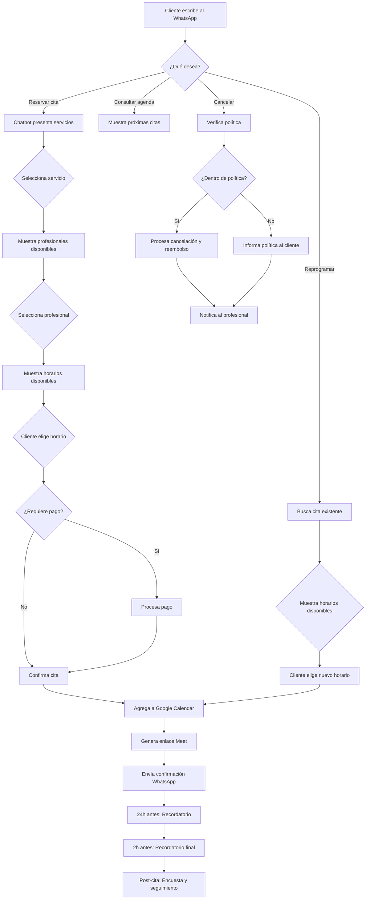

# Sistema de Reserva de Citas Profesional en WhatsApp

<Update title="Última actualización" date="2026-05-08" />


> Esta guía te lleva paso a paso por la configuración completa del **Sistema de Reserva de Citas** de E-SMART360. Cubrimos desde la configuración inicial hasta la automatización avanzada, incluyendo reglas de agendamiento, pagos anticipados, integración con Google Calendar y acciones post-reserva como reprogramación y cancelación.

## Resumen Ejecutivo

El Sistema de Reserva de Citas de E-SMART360 es una herramienta integral y completamente personalizable diseñada para eliminar las cargas administrativas de la gestión de servicios. Con este sistema puedes:

- **Gestionar tu tiempo** con reglas de disponibilidad granulares
- **Aceptar pagos anticipados** antes de confirmar la cita
- **Sincronizar automáticamente** con Google Calendar
- **Automatizar recordatorios** y seguimientos post-reserva
- **Permitir reprogramación y cancelación** por parte del cliente
- **Integrar datos** con tu gestor de suscriptores


> Olvídate de gestionar calendarios manualmente y de hacer seguimiento de pagos. Es momento de usar un sistema diseñado para brindar claridad y eficiencia.

---

## Configuración Inicial: Crear tu Primera Cita

Esta guía te muestra cómo crear una cita profesional con pago anticipado para una sesión de estrategia de 30 minutos, ideal para revendedores de software, consultores y profesionales de servicios.


### Configuración Principal y Duración

Accede al módulo de automatización de WhatsApp desde el panel de control, luego ve a **Citas** y haz clic en **Nueva Cita** para definir los fundamentos de tu sesión.

**Cuenta de WhatsApp:** Selecciona la cuenta de WhatsApp Business que deseas vincular a esta cita. Esta cuenta se usará para enviar confirmaciones automáticas y recordatorios.

**Google Calendar:** Elige el calendario específico donde se agregarán automáticamente las citas reservadas.

**Nombre de la Cita:** Ingresa un nombre claro y descriptivo, como "Llamada de Descubrimiento 30 min" o "Sesión de Demostración de Producto".

**Ubicación de la Cita:** Especifica dónde se llevará a cabo la reunión. Puede ser una dirección física, un enlace genérico como "Reunión Virtual vía Google Meet" o el nombre de una sala de reuniones.

**Descripción de la Cita:** Proporciona una descripción completa explicando de qué trata la sesión, para quién es y qué puede esperar ganar el cliente.

**Imagen Visual:** Sube una imagen relevante. Esta imagen aparecerá en la interfaz de reserva del cliente y en los mensajes asociados. Límite: 500 KB, formato PNG/JPG/WEBP, imagen cuadrada.


### Conexión con Google Calendar

Para usar Google Calendar:

1. Ve a **Conectar Cuenta** y luego **Conectar Google**
2. Sigue las instrucciones en pantalla
3. Ingresa tu correo electrónico y contraseña
4. Conecta la cuenta de Google donde deseas configurar el calendario de citas


> Asegúrate de usar una cuenta de Google dedicada a tu negocio para mantener las citas profesionales separadas de tu calendario personal.

### Reglas de Agendamiento Profesional

Usa los campos de configuración para establecer límites y proteger tu tiempo:

- **Duración de la Cita:** Ingresa la duración estándar en minutos (ej: 30 para una reunión de 30 minutos)
- **Zona Horaria:** Confirma que la zona horaria mostrada sea correcta para tu negocio. Esto es esencial para evitar errores con clientes en diferentes ubicaciones geográficas
- **Citas Máximas por Día:** Ingresa el número máximo de citas que deseas tomar en un solo día (ej: 8)
- **Descanso Entre Citas:** Ingresa el tiempo de margen en minutos entre el fin de una cita y el inicio de la siguiente (ej: 15 minutos)
- **Reserva Máxima Anticipada:** Ingresa el máximo de días hacia el futuro que un cliente puede agendar (ej: 90 días)
- **Reserva Mínima Anticipada:** Ingresa el tiempo mínimo en minutos requerido entre el momento de la reserva y el inicio real (ej: 60 minutos)
- **Cancelación Mínima:** Ingresa el tiempo mínimo en minutos antes de la cita para permitir la cancelación (ej: 240 minutos = 4 horas)
- **Tiempo de Reserva:** Duración en minutos durante la cual un horario está reservado para un cliente mientras completa el formulario de pago
- **Permitir Superposición:** Actívalo si necesitas múltiples citas en el mismo horario (útil para sesiones grupales). Por defecto está desactivado
- **Crear Enlace de Google Meet:** Actívalo para generar automáticamente un enlace único de Google Meet para cada cita
- **Estado:** Asegúrate de que el interruptor esté en VERDE (activado) cuando estés listo para publicar


---

## Configuración de Disponibilidad: Bloques de Tiempo

Para garantizar que las citas solo se reserven en los momentos que realmente deseas trabajar, debes definir tus bloques de disponibilidad. El sistema respeta estrictamente estos bloques y no permitirá reservas fuera de ellos.

### Cómo Configurar Bloques de Tiempo


### Periodo de Tiempo

Define el rango de fechas durante el cual esta disponibilidad estará activa. Establece una fecha de inicio y una fecha de finalización si es una promoción o temporada específica. Para disponibilidad permanente, usa un rango amplio.

### Días de la Semana

Selecciona los días en los que ofreces servicio. Puedes elegir días específicos como lunes a viernes, o solo fines de semana, según tu modelo de negocio.

### Horarios Específicos

Para cada día seleccionado, define las horas de inicio y fin. Por ejemplo: lunes a viernes de 9:00 a 13:00 y de 14:00 a 18:00. El sistema dividirá automáticamente este rango en bloques según la duración de la cita.

### Guardar y Publicar

Una vez configurados todos los bloques, guarda los cambios. La disponibilidad se aplicará inmediatamente a los clientes que intenten reservar.

### Ejemplo de Configuración de Bloques

| Día | Bloque Mañana | Bloque Tarde | Citas Máximas |
|---|---|---|---|
| Lunes | 09:00 - 13:00 | 14:00 - 18:00 | 8 |
| Martes | 09:00 - 13:00 | 14:00 - 18:00 | 8 |
| Miércoles | 09:00 - 13:00 | 14:00 - 18:00 | 6 |
| Jueves | 09:00 - 13:00 | 14:00 - 18:00 | 8 |
| Viernes | 09:00 - 13:00 | — | 4 |
| Sábado | 10:00 - 14:00 | — | 3 |


> Los miércoles tienen menos citas disponibles para permitir reuniones internas o administrativas. Los viernes solo hay bloque matutino. Esta flexibilidad te permite adaptar el sistema exactamente a tu operación.

---

## Sistema de Pago Anticipado

Una de las características más potentes del sistema es la capacidad de requerir pago antes de confirmar la cita. Esto elimina las ausencias y garantiza que solo clientes serios reserven tu tiempo.

### Configuración de Pagos


### Definir el Precio

Establece el monto que el cliente debe pagar para reservar la cita. Puedes usar diferentes monedas y definir precios distintos para diferentes tipos de cita.

### Seleccionar Pasarela de Pago

Elige entre más de 20 métodos de pago compatibles, incluyendo:
- PayPal
- Stripe
- Razor Pay
- WhatsApp Pay
- Tarjetas de crédito/débito
- Transferencias bancarias

### Confirmación Automática

Cuando el cliente completa el pago, el sistema:
1. Confirma la cita automáticamente
2. Envía un mensaje de confirmación por WhatsApp
3. Agrega el evento a Google Calendar
4. Genera el enlace de Google Meet (si está activado)
5. Envía un comprobante de pago al cliente

### Política de Reembolsos

Configura las reglas de reembolso según tu política de cancelación. Si el cliente cancela dentro del plazo permitido, el sistema puede procesar el reembolso automáticamente o notificarte para que lo hagas manualmente.


> El pago anticipado es opcional pero altamente recomendado para servicios profesionales. Las tasas de ausencia se reducen hasta en un 80% cuando se requiere pago por adelantado.

---

## Automatización Post-Reserva

Una vez que la cita está confirmada, el sistema puede ejecutar múltiples acciones automatizadas para maximizar el valor de cada reserva.

### Recordatorios Automáticos

El sistema envía recordatorios automáticos en momentos estratégicos:

1. **24 horas antes:** Recordatorio con todos los detalles de la cita y el enlace de Google Meet
2. **2 horas antes:** Recordatorio final para confirmar asistencia
3. **Inmediatamente después:** Mensaje de agradecimiento con opción de reprogramar o agendar otra cita

### Secuencias de Seguimiento

Puedes configurar secuencias de seguimiento automáticas para:

- **Clientes que no completaron el pago:** Enviar un recordatorio amigable después de 30 minutos para que completen la transacción antes de que el horario se libere
- **Clientes que asistieron:** Enviar una encuesta de satisfacción y ofrecer un descuento para la próxima cita
- **Clientes que cancelaron:** Preguntar si desean reprogramar y ofrecer horarios alternativos disponibles

### Construcción de Secuencias de Seguimiento con Etiquetas

Puedes usar el sistema de etiquetas para rastrear el comportamiento del cliente y activar secuencias específicas:

1. Cuando un cliente muestra interés pero no completa la reserva, se aplica una etiqueta "interesado_sin_reserva"
2. Al cabo de 30 minutos, el chatbot verifica si la etiqueta sigue presente
3. Si no ha reservado, envía un mensaje de seguimiento personalizado
4. Si el cliente interactúa nuevamente, se le guía de vuelta al flujo de reserva
5. Si completa la reserva, la etiqueta se elimina automáticamente

Este sistema de etiquetas y condiciones te permite crear embudos de conversión sofisticados sin necesidad de programar.


> Las secuencias de seguimiento aumentan las tasas de conversión hasta en un 40%. Combínalas con etiquetas en tu gestor de suscriptores para segmentar y personalizar cada mensaje.

### Reprogramación y Cancelación

Los clientes pueden reprogramar o cancelar sus citas directamente desde WhatsApp:

- **Reprogramación:** El sistema muestra los horarios disponibles y permite seleccionar uno nuevo
- **Cancelación:** Respeta la política de cancelación configurada y procesa reembolsos si aplica
- **Notificaciones:** Tanto el cliente como el profesional reciben notificaciones instantáneas de cualquier cambio

---

## Integración con el Flujo del Chatbot

El sistema de citas se conecta perfectamente con el flujo de tu chatbot, permitiendo experiencias conversacionales completas:


### Flujo de Ventas

El chatbot califica al cliente, presenta el servicio y ofrece agendar una cita directamente en la conversación. Sin formularios, sin páginas externas. Todo ocurre dentro de WhatsApp.

### Flujo de Soporte

Si un cliente necesita ayuda avanzada, el chatbot ofrece agendar una llamada con un especialista. La transición es automática y sin fricción, manteniendo el contexto de la conversación.

### Ejemplo Práctico: Consultoría de Marketing

**Caso:** Una agencia de marketing digital usa E-SMART360 para agendar sesiones de consultoría.

**Flujo completo del cliente:**

1. El cliente escribe "consultoría" al número de WhatsApp de la agencia
2. El chatbot presenta los servicios disponibles y pregunta qué área le interesa
3. El cliente selecciona "Marketing en Redes Sociales"
4. El chatbot muestra los horarios disponibles para la siguiente semana
5. El cliente elige un horario y procede al pago de $50 USD
6. Recibe confirmación con enlace de Google Meet
7. 24 horas antes recibe un recordatorio automático
8. Después de la sesión, recibe una encuesta y un cupón de descuento


> Este flujo completamente automatizado puede generar citas calificadas las 24 horas del día, los 7 días de la semana, sin intervención manual.

---

## Uso de Variables Dinámicas en los Mensajes

Puedes personalizar los mensajes de confirmación, recordatorio y seguimiento usando variables dinámicas:

| Variable | Descripción | Ejemplo |
|---|---|---|
| `{nombre_cliente}` | Nombre del cliente | Juan Pérez |
| `{fecha_cita}` | Fecha de la cita | 15 de mayo de 2026 |
| `{hora_cita}` | Hora de la cita | 10:30 AM |
| `{duracion}` | Duración en minutos | 30 min |
| `{enlace_meet}` | Enlace de Google Meet | https://meet.google.com/abc-defg-hij |
| `{ubicacion}` | Ubicación o enlace | Reunión Virtual |
| `{precio}` | Monto pagado | $50 USD |
| `{enlace_reprogramar}` | Enlace para reprogramar | [Reprogramar] |
| `{enlace_cancelar}` | Enlace para cancelar | [Cancelar cita] |


#### Ejemplo de mensaje de confirmación

```text
¡Hola {nombre_cliente}! ✅

Tu cita ha sido confirmada exitosamente.

📅 Fecha: {fecha_cita}
⏰ Hora: {hora_cita}
📍 {ubicacion}
💰 Pagado: {precio}

Enlace de videollamada: {enlace_meet}

Gracias por confiar en nosotros. Te esperamos.
```


#### Ejemplo de recordatorio

```text
Recordatorio amable 📢

Tu cita es mañana:
📅 {fecha_cita}
⏰ {hora_cita}
⏱ Duración: {duracion}

🔗 {enlace_meet}

¿Necesitas cambiar algo?
➡ Reprogramar: {enlace_reprogramar}
➡ Cancelar: {enlace_cancelar}

¡Te esperamos!
```


---

## Exportación y Respaldo de Flujos

El sistema permite exportar la configuración completa de tu sistema de citas para:

- **Respaldar** tu configuración antes de hacer cambios importantes
- **Compartir** flujos de citas con colegas o miembros del equipo
- **Duplicar** configuraciones exitosas para diferentes tipos de servicio
- **Migrar** entre diferentes cuentas o entornos

### Formato de Exportación

Los flujos se exportan en formato JSON estructurado que incluye:

```json
{
  "appointment_name": "Consulta Estratégica 30min",
  "duration": 30,
  "price": 50,
  "currency": "USD",
  "google_calendar_integrated": true,
  "availability_blocks": [
    {"day": "monday", "start": "09:00", "end": "13:00"},
    {"day": "monday", "start": "14:00", "end": "18:00"}
  ],
  "reminders": [
    {"time_before": 1440, "type": "whatsapp"},
    {"time_before": 120, "type": "whatsapp"}
  ],
  "follow_up_sequence": true
}
```

### Importación desde Plantillas

E-SMART360 incluye plantillas prediseñadas para industrias específicas:


### Consultoría

Configuración predefinida para sesiones de consultoría: duración de 45-60 min, recordatorios a 24h y 1h, preguntas de pre-calificación incluidas.

### Salud

Plantilla para citas médicas con duración variable, formulario de síntomas previo, y encuesta post-consulta automática.

### Educación

Configuración para tutorías y clases con bloques por hora, capacidad de agendar sesiones recurrentes, y notificaciones a padres o tutores.

---

## Integración con Herramientas de Automatización

### Webhooks y API

Puedes conectar tu sistema de citas con herramientas externas mediante webhooks:

| Evento | Descripción | Disparador |
|---|---|---|
| `cita_creada` | Se dispara cuando se confirma una nueva cita | Enviar datos a CRM |
| `cita_cancelada` | Se dispara cuando un cliente cancela | Liberar horario y notificar |
| `cita_reprogramada` | Se dispara en cada reprogramación | Actualizar registro en CRM |
| `pago_recibido` | Se dispara al confirmar el pago | Enviar factura al cliente |
| `recordatorio_enviado` | Se dispara al enviar cada recordatorio | Registrar en log de actividades |


> Los webhooks te permiten crear integraciones personalizadas con cualquier sistema que acepte peticiones HTTP. Úsalos para sincronizar citas con tu CRM, enviar datos a Google Sheets, o activar flujos en Zapier y Make.

### Conexión con Google Sheets

Puedes sincronizar automáticamente todas tus citas confirmadas con Google Sheets:


### Configurar Conexión

Desde el panel de ajustes, selecciona Google Sheets como destino de datos. Autentica tu cuenta de Google y selecciona o crea el documento de Sheets donde deseas almacenar los datos.

### Mapear Campos

Configura qué columnas deseas sincronizar: nombre del cliente, fecha, hora, tipo de cita, monto pagado, estado, y cualquier campo personalizado que hayas definido.

### Automatizar

Cada vez que se confirme, reprograme o cancele una cita, los datos se actualizarán automáticamente en tu hoja de cálculo. Esto te permite tener un registro centralizado sin esfuerzo manual.

### Ejemplo de Datos en Google Sheets

| Fecha | Cliente | Tipo Cita | Hora | Monto | Estado | Notas |
|---|---|---|---|---|---|---|
| 15/05/2026 | María García | Consultoría | 10:00 | $80 | Confirmada | — |
| 15/05/2026 | Carlos López | Seguimiento | 11:30 | $0 | Confirmada | Cliente recurrente |
| 15/05/2026 | Ana Martínez | Sesión Estratégica | 14:00 | $150 | Pagada | Presupuesto mensual |
| 16/05/2026 | Pedro Sánchez | Consulta Rápida | 09:00 | $40 | Cancelada | — |
| 16/05/2026 | Laura Gómez | Sesión Completa | 15:00 | $200 | Pendiente pago | — |


> Configura columnas condicionales en Google Sheets para que las celdas cambien de color automáticamente según el estado de la cita: verde para confirmadas, amarillo para pendientes de pago, rojo para canceladas. Así puedes tener un tablero visual de tu agenda.

---

## Gestión de Múltiples Profesionales

Si tu negocio tiene varios profesionales que ofrecen servicios, el sistema permite gestionar la disponibilidad de cada uno de forma independiente:

### Configuración por Profesional

Cada profesional puede tener:
- **Su propio calendario** vinculado a su cuenta de Google Calendar
- **Bloques de disponibilidad** personalizados
- **Tipos de servicio** específicos que puede ofrecer
- **Precios** diferenciados según su especialidad o experiencia
- **Límites de citas** diarios independientes

### Asignación Inteligente

Cuando un cliente solicita una cita sin especificar profesional, el sistema puede:

1. Mostrar todos los profesionales disponibles
2. Dejar que el cliente elija basado en perfiles y reseñas
3. Asignar automáticamente al profesional con menos carga laboral
4. Rotar entre profesionales para distribuir el trabajo equitativamente


> Para negocios con más de 5 profesionales, te recomendamos usar la asignación automática basada en carga laboral. Esto maximiza la eficiencia y reduce los tiempos de espera de los clientes.

### Ejemplo Práctico: Clínica Dental Multi-Profesional

**Configuración:**

| Profesional | Especialidad | Días | Citas/Día | Precio Base |
|---|---|---|---|---|
| Dr. Ramírez | Limpieza y revisión | Lun-Vie | 10 | $40 |
| Dra. Torres | Endodoncia | Lun-Mie-Vie | 6 | $120 |
| Dr. Mendoza | Cirugía | Mar-Jue | 4 | $250 |
| Dra. Rivas | Ortodoncia | Lun-Sab | 8 | $90 |

Cada profesional tiene su propio bloque de Google Calendar, sus límites de citas y sus precios. El sistema muestra automáticamente al cliente solo los horarios del profesional adecuado según el tipo de servicio solicitado.

---

## Casos de Uso por Industria


### Consultores y Coaches

Agenda sesiones de coaching, llamadas de descubrimiento y reuniones de seguimiento. Ideal para consultores de negocios, coaches de vida, mentores y asesores financieros. El pago anticipado asegura que solo clientes comprometidos reserven tu tiempo.

### Profesionales de la Salud

Médicos, terapeutas, nutricionistas y dentistas pueden gestionar citas, recordatorios de medicación y seguimientos post-consulta. La integración con Google Calendar permite sincronizar con otros sistemas de gestión médica.

### Servicios de Belleza y Bienestar

Salones de belleza, spas, barberías y centros de bienestar pueden ofrecer reserva directa por WhatsApp con selección de servicio, profesional y horario. Los recordatorios automáticos reducen las ausencias significativamente.

### Educación y Tutorías

Escuelas, academias y tutores independientes pueden gestionar la reserva de clases, sesiones de tutoría y reuniones con padres de familia. El sistema maneja automáticamente la disponibilidad de múltiples instructores.

### Servicios Técnicos y Reparaciones

Técnicos de reparación, instaladores y proveedores de servicios técnicos pueden gestionar visitas domiciliarias con bloques de tiempo que incluyen desplazamiento entre citas.

### Inmobiliarias

Agentes inmobiliarios pueden gestionar visitas a propiedades, citas con clientes potenciales y reuniones de cierre. Los recordatorios automáticos reducen las visitas fallidas.

---

## Consejos Avanzados para Maximizar tu Productividad


> **Bloques temáticos por tipo de cita:** Configura bloques de tiempo específicos según el tipo de servicio. Por ejemplo, reserva las mañanas para consultas premium (sesiones de 60 min) y las tardes para consultas rápidas (sesiones de 15-20 min). Esto te permite mantener un flujo de trabajo consistente y optimizar tu energía cognitiva según la complejidad del servicio.

> **Segmentación inteligente con etiquetas:** Usa etiquetas automáticas para clasificar a los clientes según:
- Tipo de cita reservada (consulta, seguimiento, premium)
- Rango de precio del servicio (económico, estándar, premium)
- Frecuencia de reserva (nuevo, recurrente, VIP)
- Comportamiento (asistió, canceló, reprogramó)
  
Luego crea campañas de marketing segmentadas: ofertas exclusivas para clientes recurrentes, descuentos por reserva anticipada para nuevos clientes, campañas de recuperación para quienes no han reservado en 30 días.

> **Automatización estacional:** Combina el sistema de citas con secuencias estacionales. Por ejemplo, antes de Navidad activa una campaña que ofrezca sesiones de consultoría navideña con un flujo de reserva optimizado. Durante enero, activa promociones de "Año Nuevo" con descuentos en paquetes de múltiples sesiones. El sistema puede alternar automáticamente entre diferentes configuraciones según la fecha.

---

## Ejemplo Completo: Clínica Dental

**El desafío:** Una clínica dental perdía el 25% de sus citas por ausencias y pasaba 3 horas diarias en llamadas telefónicas para agendar.

**La solución con E-SMART360:**

1. **Configuración:** Se crearon 3 tipos de cita: Limpieza (30 min - $40), Consulta General (45 min - $60) y Procedimiento Especial (90 min - $150+)
2. **Disponibilidad:** Lunes a viernes de 8:00 a 18:00, sábados de 9:00 a 13:00
3. **Pagos:** Se requirió pago anticipado del 50% para procedimientos especiales
4. **Recordatorios:** Automáticos a 24h y 2h antes de cada cita
5. **Seguimiento:** Encuesta de satisfacción 1 hora después de la cita

**Resultados después de 3 meses:**
- Reducción del 80% en ausencias
- Ahorro de 2.5 horas diarias en gestión de agenda
- Incremento del 35% en ingresos por reducción de tiempos muertos
- Satisfacción del cliente aumentó al 94%

---

## Ejemplo Adicional: Spin y Centro de Bienestar

**El desafío:** Un centro de bienestar con 6 terapeutas tenía problemas con la gestión manual de horarios. Los clientes llamaban, dejaban mensajes y a menudo se duplicaban las reservas.

**La solución con E-SMART360:**

1. **Profesionales:** Se registraron 6 terapeutas, cada uno con su especialidad (masajes, reflexología, acupuntura, etc.)
2. **Tipos de cita:** 15 tipos de servicio diferentes con duraciones entre 30 y 120 minutos
3. **Precios variables:** Cada terapeuta tenía su propia tarifa según su experiencia
4. **Flujo de chatbot:** Los clientes escribían "reservar" y el chatbot guiaba la selección

**Flujo conversacional del cliente:**

```
Cliente: "Quiero reservar un masaje"
Bot: "¡Excelente elección! Tenemos estos tipos de masaje:
1. Masaje relajante (60 min - $60)
2. Masaje descontracturante (60 min - $70)  
3. Masaje deportivo (90 min - $90)
4. Masaje con piedras calientes (90 min - $100)
¿Cuál prefieres?"

Cliente: "El relajante"
Bot: "Perfecto. Estos son nuestros terapeutas disponibles:
1. María - 5 años de experiencia
2. Carlos - 3 años de experiencia
¿Tienes preferencia?"

Cliente: "María"
Bot: "María tiene disponibilidad:
- Hoy a las 15:00
- Hoy a las 16:30
- Mañana a las 10:00
¿Qué horario prefieres?"
```

**Resultados:**
- Incremento del 50% en reservas
- Eliminación completa de reservas duplicadas
- Los terapeutas recibían sus agendas semanales automáticamente sincronizadas con Google Calendar
- Reducción del 90% en llamadas telefónicas para gestión de citas

---

## Diagrama de Flujo del Sistema



---

## Preguntas Frecuentes


### ¿Qué pasa si un cliente no se presenta a la cita (no-show)?

El sistema puede configurarse para manejar automáticamente los no-shows. Dado que el pago es anticipado, el cargo ya está procesado. Puedes configurar una política de reembolso parcial o total, o permitir que el cliente reprograme sin costo adicional dentro de un período específico. Además, el sistema puede aplicar una etiqueta automática al cliente para que puedas hacer seguimiento personalizado.

### ¿Puedo tener diferentes tipos de cita con diferentes precios y duraciones?

Sí, completamente. Puedes crear múltiples configuraciones de cita, cada una con su propio nombre, duración, precio, descripción y reglas de disponibilidad. Por ejemplo, puedes tener una "Consulta Rápida de 15 min - $25" y una "Sesión Estratégica de 60 min - $150", cada una con sus propios bloques de tiempo y reglas de cancelación.

### ¿Cómo se manejan las zonas horarias cuando el cliente está en otro país?

El sistema muestra la disponibilidad en la zona horaria que configuraste para la cita. Sin embargo, el cliente ve los horarios convertidos a su zona horaria local automáticamente (basado en la configuración regional de su dispositivo). Esto elimina cualquier confusión y garantiza que ambas partes tengan la hora correcta.

### ¿Puedo integrar el sistema de citas con otras herramientas como Shopify o WooCommerce?

Sí, el sistema de citas se integra con todas las herramientas disponibles en E-SMART360. Puedes conectar WooCommerce para que después de una compra se ofrezca automáticamente agendar una cita de configuración. También puedes usar Zapier o webhooks para conectar con miles de aplicaciones adicionales y crear flujos de trabajo personalizados.

### ¿Qué sucede si necesito bloquear un día específico por vacaciones o emergencia?

Puedes crear excepciones fácilmente desde la configuración de disponibilidad. Simplemente selecciona el día específico y márcalo como "no disponible". El sistema automáticamente ocultará ese día de las opciones del cliente. También puedes configurar bloques de tiempo especiales para días con horarios reducidos.

### ¿Cuántos tipos de cita puedo crear?

No hay un límite predefinido. Puedes crear tantos tipos de cita como necesites. Cada tipo puede tener su propia duración, precio, descripción, imagen, reglas de cancelación y configuración de recordatorios. Esto es ideal para negocios con múltiples líneas de servicio.

### ¿Puedo limitar las citas por cliente para evitar abusos?

Sí, puedes configurar límites por cliente, como máximo de citas por semana o por mes. También puedes restringir a una cita activa por cliente para evitar que alguien reserve múltiples horarios y luego decida cuál mantener.

---

<Update title="Documentación actualizada" date="2026-05-08" />


> ¿Tienes preguntas sobre la configuración del sistema de citas? Consulta nuestra base de conocimiento o contacta al equipo de soporte para asistencia personalizada.
